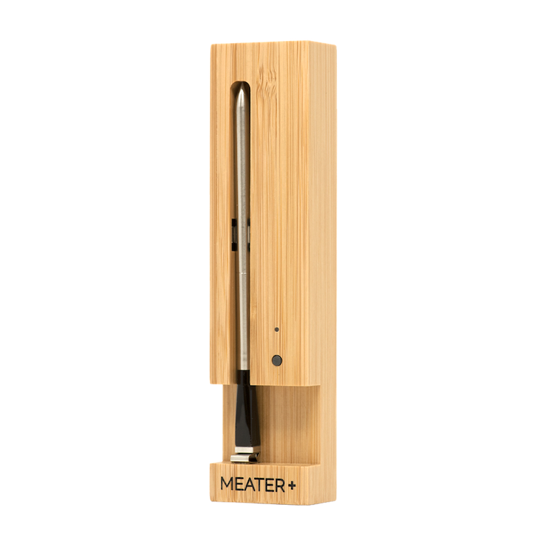

# MEATER Binding

This is an openHAB binding for the MEATER probe, MEATER® is a trademark of Apption Labs™ Limited. A Traeger Company.

This binding uses the MEATER Cloud REST API.



## Supported Things

This binding supports the following thing types:

- meaterapi: Bridge - Communicates with the MEATER Cloud REST API.

- meaterprobe: The MEATER probe - Only support for cloud connected MEATER probes (MEATER Block and MEATER Plus)

## Discovery

The binding supports auto-discovery of all MEATER probes belonging to the configured cloud API account.

**NOTE**: For The Original MEATER and MEATER Plus you need to have your MEATER app running and the MEATER probe(s) must connected to the cloud (out of the charger box) before you start the discovery.

After the configuration of the Bridge, you need to perform a manual scan and then your MEATER probe(s) will be automatically discovered and placed as a thing(s) in the inbox.

## Thing Configuration

When manually configuring the probes, the console command `openhab:meater showIds` can be used to identify the IDs of all connected probes.
Since the probes are unnamed, they can be hard to identify.
For this reason, the ambient temperature is included in the list.
This might help isolating an individual probe.

## Supported Things and Channels

### MEATER Bridge

#### Configuration Options

| Parameter | Description                                                  | Type   | Default  | Required |
|-----------|--------------------------------------------------------------|--------|----------|----------|
| email     | The email used to login to your MEATER Cloud account         | String | NA       | yes      |
| password  | The password used to login to your MEATER Cloud account      | String | NA       | yes      |
| refresh   | Specifies the refresh interval in seconds                    | Number | 30       | no       |

#### Channels

The following channels are supported:

| Channel Type ID | Item Type | Description                                                                                     |
|-----------------|-----------|-------------------------------------------------------------------------------------------------|
| status          | String    | Can be used to trigger an instant refresh by sending a `REFRESH` command.|

### MEATER Probe

#### Configuration Options

| Parameter | Description                                                  | Type   | Default  | Required |
|-----------|--------------------------------------------------------------|--------|----------|----------|
| deviceId  | Unique id for your MEATER Probe                              | String | NA       | yes      |

#### Channels

| Channel Type ID       | Item Type          | Description                                          |
|-----------------------|--------------------|------------------------------------------------------|
| internalTemperature   | Number:Temperature | Internal temperature reading of MEATER probe         |
| ambientTemperature    | Number:Temperature | Ambient temperature reading of MEATER probe. If ambient is less than internal, ambient will equal internal                                                     |
| cookTargetTemperature | Number:Temperature | Target temperature of current cook                   |
| cookPeakTemperature   | Number:Temperature | Peak temperature of current cook                     |
| lastConnection        | DateTime           | Date and time of last probe connection               |
| cookId                | String             | Unique cook ID of current cook                       |
| cookName              | String             | Name of selected meat or user given custom name      |
| cookState             | String             | One of Not Started, Configured, Started, Ready For Resting, Resting, Slightly Underdone, Finished, Slightly Overdone, OVERCOOK!                                 |
| cookElapsedTime       | Number:Time        | Time since the start of cook in seconds. Default: 0  |
| cookRemainingTime     | Number:Time        | Remaining time in seconds or UNDEF when unknown.                                                                                  |
| cookEstimatedEndTime  | DateTime           | Date and time of estimated end time for current cook |

## Example

### Things-file

```java
Bridge meater:meaterapi:block     "MEATER Block"   [email="", password="", refresh=30] {
  meaterprobe probe1 "Meater Probe 1" [deviceId=""]
  meaterprobe probe2 "Meater Probe 2" [deviceId=""]
  meaterprobe probe3 "Meater Probe 3" [deviceId=""]
  meaterprobe probe4 "Meater Probe 4" [deviceId=""]
}
```

### Items-file

```java
Number:Temperature Probe1InternalTemperature   {channel="meater:meaterprobe:block:probe1:internalTemperature"}
Number:Temperature Probe1AmbientTemperature    {channel="meater:meaterprobe:block:probe1:ambientTemperature"}
String             Probe1CookId                {channel="meater:meaterprobe:block:probe1:cookId"}
String             Probe1CookName              {channel="meater:meaterprobe:block:probe1:cookName"}
String             Probe1CookState             {channel="meater:meaterprobe:block:probe1:cookState"}
Number:Temperature Probe1CookTargetTemperature {channel="meater:meaterprobe:block:probe1:cookTargetTemperature"}
Number:Temperature Probe1CookPeakTemperature   {channel="meater:meaterprobe:block:probe1:cookPeakTemperature"}
Number:Time        Probe1CookElapsedTime       {channel="meater:meaterprobe:block:probe1:cookElapsedTime"}
Number:Time        Probe1CookRemainingTime     {channel="meater:meaterprobe:block:probe1:cookRemainingTime"}
DateTime           Probe1CookEstimatedEndTime  {channel="meater:meaterprobe:block:probe1:cookEstimatedEndTime"}
String             Probe1Status                {channel="meater:meaterprobe:block:probe1:status"}
DateTime           Probe1LastConnection        {channel="meater:meaterprobe:block:probe1:lastConnection"}

Number:Temperature Probe2InternalTemperature   {channel="meater:meaterprobe:block:probe2:internalTemperature"}
Number:Temperature Probe2AmbientTemperature    {channel="meater:meaterprobe:block:probe2:ambientTemperature"}
String             Probe2CookId                {channel="meater:meaterprobe:block:probe2:cookId"}
String             Probe2CookName              {channel="meater:meaterprobe:block:probe2:cookName"}
String             Probe2CookState             {channel="meater:meaterprobe:block:probe2:cookState"}
Number:Temperature Probe2CookTargetTemperature {channel="meater:meaterprobe:block:probe2:cookTargetTemperature"}
Number:Temperature Probe2CookPeakTemperature   {channel="meater:meaterprobe:block:probe2:cookPeakTemperature"}
Number:Time        Probe2CookElapsedTime       {channel="meater:meaterprobe:block:probe2:cookElapsedTime"}
Number:Time        Probe2CookRemainingTime     {channel="meater:meaterprobe:block:probe2:cookRemainingTime"}
DateTime           Probe2CookEstimatedEndTime  {channel="meater:meaterprobe:block:probe2:cookEstimatedEndTime"}
String             Probe2Status                {channel="meater:meaterprobe:block:probe2:status"}
DateTime           Probe2LastConnection        {channel="meater:meaterprobe:block:probe2:lastConnection"}

Number:Temperature Probe3InternalTemperature   {channel="meater:meaterprobe:block:probe3:internalTemperature"}
Number:Temperature Probe3AmbientTemperature    {channel="meater:meaterprobe:block:probe3:ambientTemperature"}
String             Probe3CookId                {channel="meater:meaterprobe:block:probe3:cookId"}
String             Probe3CookName              {channel="meater:meaterprobe:block:probe3:cookName"}
String             Probe3CookState             {channel="meater:meaterprobe:block:probe3:cookState"}
Number:Temperature Probe3CookTargetTemperature {channel="meater:meaterprobe:block:probe3:cookTargetTemperature"}
Number:Temperature Probe3CookPeakTemperature   {channel="meater:meaterprobe:block:probe3:cookPeakTemperature"}
Number:Time        Probe3CookElapsedTime       {channel="meater:meaterprobe:block:probe3:cookElapsedTime"}
Number:Time        Probe3CookRemainingTime     {channel="meater:meaterprobe:block:probe3:cookRemainingTime"}
DateTime           Probe3CookEstimatedEndTime  {channel="meater:meaterprobe:block:probe3:cookEstimatedEndTime"}
String             Probe3Status                {channel="meater:meaterprobe:block:probe3:status"}
DateTime           Probe3LastConnection        {channel="meater:meaterprobe:block:probe3:lastConnection"}

Number:Temperature Probe4InternalTemperature   {channel="meater:meaterprobe:block:probe4:internalTemperature"}
Number:Temperature Probe4AmbientTemperature    {channel="meater:meaterprobe:block:probe4:ambientTemperature"}
String             Probe4CookId                {channel="meater:meaterprobe:block:probe4:cookId"}
String             Probe4CookName              {channel="meater:meaterprobe:block:probe4:cookName"}
String             Probe4CookState             {channel="meater:meaterprobe:block:probe4:cookState"}
Number:Temperature Probe4CookTargetTemperature {channel="meater:meaterprobe:block:probe4:cookTargetTemperature"}
Number:Temperature Probe4CookPeakTemperature   {channel="meater:meaterprobe:block:probe4:cookPeakTemperature"}
Number:Time        Probe4CookElapsedTime       {channel="meater:meaterprobe:block:probe4:cookElapsedTime"}
Number:Time        Probe4CookRemainingTime     {channel="meater:meaterprobe:block:probe4:cookRemainingTime"}
DateTime           Probe4CookEstimatedEndTime  {channel="meater:meaterprobe:block:probe4:cookEstimatedEndTime"}
String             Probe4Status                {channel="meater:meaterprobe:block:probe4:status"}
DateTime           Probe4LastConnection        {channel="meater:meaterprobe:block:probe4:lastConnection"}
```
