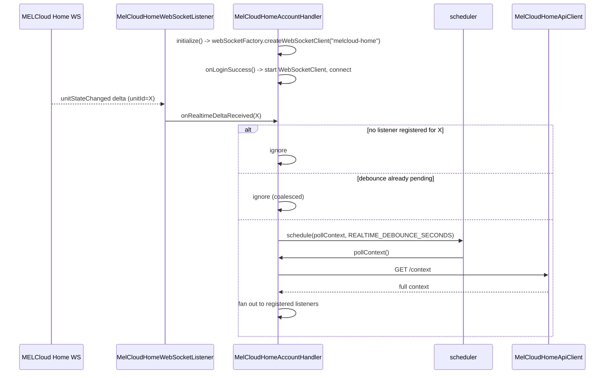

# ADR-007: MELCloud Home Real-Time Updates via openHAB Core WebSocketFactory

## Status

Proposed

## Context

`docs/changes/add-melcloud-home-realtime-updates/` defines three requirements this ADR
must satisfy: _Push-accelerated context refresh_, _Push channel is never a state source_,
and _Real-time updates are configurable_.

Today, `MelCloudHomeAccountHandler` learns about state changes only from a fixed
`GET /context` poll every `CONTEXT_POLL_INTERVAL_SECONDS` (60s), scheduled with
`scheduler.scheduleWithFixedDelay(this::pollContext, ...)`. A change made outside openHAB
(the MELCloud Home app, a physical remote) is invisible to openHAB for up to 60 seconds.

The proposal's open question was whether closing this gap needs a new Maven dependency.
It does not: openHAB core already exposes `org.openhab.core.io.net.http.WebSocketFactory`
as an injectable OSGi service, the same pattern this bundle already follows for HTTP via
`HttpUtil`/`HttpClientFactory`. `WebSocketFactory.createWebSocketClient(String
consumerName)` returns an unstarted, bundle-owned Jetty `WebSocketClient` whose lifecycle
the consumer manages (start on use, stop on dispose) — no `pom.xml` change is needed.

Coding rule E.2 ("do not create threads, use existing schedulers") and E.1 ("overridden
methods must return fast") both apply: the WebSocket connection and any reconnect/backoff
logic must run on the bridge's own `scheduler`, never a hand-rolled `Thread`.

## Decision

Add `MelCloudHomeAccountHandler`'s WebSocket wiring as a new class,
`org.openhab.binding.melcloud.internal.home.websocket.MelCloudHomeWebSocketListener`, and
inject `WebSocketFactory` into `MelCloudHomeHandlerFactory` alongside the existing
`MelCloudHomeApiClient`/`MelCloudHomeAuthService` dependencies, passing it down to
`MelCloudHomeAccountHandler`.

```text
org.openhab.binding.melcloud.internal.home
  .websocket
    MelCloudHomeWebSocketListener   ← thin session handler: extracts unit ID from a
                                       delta, calls back into the bridge handler
  .handler
    MelCloudHomeAccountHandler      ← owns the WebSocketClient instance + debounce timer
```

**Lifecycle:** `MelCloudHomeAccountHandler` creates its `WebSocketClient` via
`webSocketFactory.createWebSocketClient("melcloud-home")` once, in `initialize()`,
independent of authentication state. It is started/connected only after a successful
login (inside `onLoginSuccess`, alongside `startContextPollIfNeeded()`), and stopped
unconditionally in `dispose()`. A connection failure only ever logs and schedules a
reconnect via `scheduler.schedule(...)` with capped exponential backoff — it never calls
`updateStatus(...)`. Bridge `ONLINE`/`OFFLINE` continues to be driven exclusively by the
authentication and `/context` poll logic already in place, unchanged by this ADR.

**Debounced trigger, not a state source:** `MelCloudHomeWebSocketListener` parses only
enough of an incoming `unitStateChanged` message to read the affected unit ID, then calls
`MelCloudHomeAccountHandler.onRealtimeDeltaReceived(unitId)`. That method:

1. Ignores the delta if `unitId` has no registered ATA/ATW listener (mirrors the existing
   `pollContext()` fan-out check).
1. Otherwise coalesces bursts: if a debounce `ScheduledFuture` is already pending, it does
   nothing; otherwise it schedules `pollContext()` after `REALTIME_DEBOUNCE_SECONDS` via
   the bridge's own `scheduler`.

The delta's payload content past the unit ID is discarded — `pollContext()`'s regular
`GET /context` call remains the only place state values are read from, satisfying _Push
channel is never a state source_ without any special-casing in the listener handlers.

**Configurability:** `MelCloudHomeAccountConfig` gets a new boolean field,
`enableRealtimeUpdates` (default `true`). When `false`, `initialize()` skips creating the
`WebSocketClient` entirely; the fixed-interval poll is unaffected either way.

**Still open (implementation-time, not architectural):** the exact WebSocket handshake —
the hash-exchange endpoint and `wss://` URL contract — is not yet confirmed for this
binding (see `tasks.md` item 1.1). `MelCloudHomeWebSocketListener`'s message-parsing
internals depend on that discovery but not the class/lifecycle structure decided here.

## Consequences

### Positive

- No new `pom.xml` dependency — `WebSocketFactory` is already provided by openHAB core,
  so this ADR needs no dependency-approval step.
- Reuses the exact lifecycle pattern (`createWebSocketClient`/start/stop) openHAB
  recommends and other bindings already follow, rather than inventing a new one.
- The debounce + unit-ID-only trigger keeps the change small: no new state-merging logic,
  no risk of the push channel and `/context` disagreeing about a value.
- A WebSocket outage degrades gracefully to the pre-existing fixed-poll behavior; it can
  never regress bridge availability.

### Negative

- Adds one more persistent outbound connection per `home-account` bridge instance
  (resource/thread accounting, reconnect handling).
- The push channel's real protocol is not yet confirmed; if the hash-exchange contract
  differs materially from what `reversed.md` documents, `MelCloudHomeWebSocketListener`'s
  internals may need rework — the class boundary defined here should absorb that without
  touching `MelCloudHomeAccountHandler`.
- Narrows, but does not close, the stale-state window `ADR-008` (dedup) trades against —
  a delta can still arrive after a dedup check has already run against the previous
  `/context` snapshot.

## Diagram



---

_Reviewed against `docs/changes/add-melcloud-home-realtime-updates/specs/home-state-sync/spec.md`._
