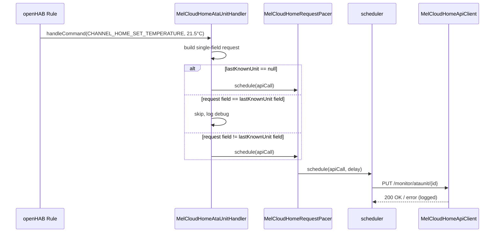

# ADR-008: MELCloud Home Request Pacing and Command Deduplication

## Status

Proposed

## Context

`docs/changes/add-melcloud-home-request-resilience/` defines three requirements this ADR
must satisfy: _Minimum request spacing_, _Control command deduplication_, and _First
command with no known state is always sent_.

Today, every outbound MELCloud Home API call — the bridge's `pollContext()` and every
unit's `controlAtaUnit`/`controlAtwUnit` — goes straight through
`MelCloudHomeApiClient`, synchronously, from whichever thread invoked it
(`handleCommand(...)` runs on the Thing's own handler thread; `pollContext()` runs on the
bridge's `scheduler`). Nothing spaces calls apart, and nothing checks whether a requested
value already matches the last known state. An openHAB rule that sets several channels on
one unit (mode, temperature, fan) fires one `PUT` per channel back-to-back — the same
burst pattern documented in the `andrew-blake/melcloudhome` project's ADR-018 as the cause
of MELCloud rate-limit errors.

Coding rule E.1 ("overridden methods must return fast") rules out spacing calls apart with
`Thread.sleep` inside `handleCommand`, since that would block the calling thread for up to
the pacing interval. Rule E.2 ("do not create threads, use existing schedulers") points to
the same solution already used in `ADR-007`: route timed work through the bridge's
`scheduler`.

The rate limit is account-level (both `pollContext()` and every unit's control calls share
one MELCloud Home account), so the pacer must be a single instance shared across the whole
bridge, not one per unit Thing.

## Decision

Add `org.openhab.binding.melcloud.internal.home.api.MelCloudHomeRequestPacer`, one
instance owned by each `MelCloudHomeAccountHandler`, constructed with that handler's own
`scheduler`.

```text
org.openhab.binding.melcloud.internal.home.api
  MelCloudHomeApiClient        ← unchanged: stateless HTTP calls
  MelCloudHomeRequestPacer     ← new: schedule(Runnable) enforces MIN_REQUEST_INTERVAL_MILLIS
                                  spacing between the *start* of consecutive calls
```

**Pacing (non-blocking):** `MelCloudHomeRequestPacer.schedule(Runnable apiCall)` computes,
under a single `synchronized` block, the next allowed instant
(`max(now, nextAllowedInstant) + MIN_REQUEST_INTERVAL_MILLIS`) and hands `apiCall` to
`scheduler.schedule(apiCall, delay, TimeUnit.MILLISECONDS)`. No caller thread ever blocks;
callers only enqueue. `MIN_REQUEST_INTERVAL_MILLIS = 500`, matching the HA project's
chosen value as a starting point (`add-melcloud-home-request-resilience`'s open question)
— revisit once real rate-limit behavior is observed against this binding.

`MelCloudHomeAccountHandler.pollContext()` and every unit handler's control call in
`handleCommand(...)` are rewritten to go through `bridgeHandler.getRequestPacer()
.schedule(...)` instead of calling `MelCloudHomeApiClient` directly. This makes control
commands asynchronous relative to `handleCommand`'s return — an acceptable change, since
`handleCommand` already returns `void` and errors were already only logged, never
propagated to the caller.

**Deduplication (per-field, not per-object):** each unit handler already builds exactly
one field per `handleCommand` invocation — openHAB dispatches one command per channel per
call, and the existing `switch (channelUID.getId())` in `MelCloudHomeAtaUnitHandler`/
`MelCloudHomeAtwUnitHandler` sets exactly one field on the control request per case. This
means the "compare every field" wording in the spec collapses, in practice, to a single
field comparison: does _this_ command's target value already equal the corresponding
field on the last known unit state?

Each unit handler adds `private volatile @Nullable MelCloudHomeAtaUnit lastKnownUnit;`
(and the ATW equivalent), set at the top of `onAtaUnitUpdated`/`onAtwUnitUpdated` — the
same callback that already updates channel state from `/context`. `handleCommand` checks
`lastKnownUnit` immediately after building the single-field `request`:

- `lastKnownUnit == null` → always send (satisfies _First command with no known state is
  always sent_; covers the window before the first poll completes).
- `lastKnownUnit != null` and the one field the current command sets already equals the
  corresponding value on `lastKnownUnit` → skip, log at `debug`, return without calling
  the pacer.
- Otherwise → send via the pacer, as above.

## Consequences

### Positive

- No new dependency; `MelCloudHomeRequestPacer` is a small, pure-Java class using only the
  bridge's existing `scheduler`.
- Non-blocking design keeps `handleCommand` fast, per coding rule E.1.
- Dedup is a single-field comparison in practice, not a generic object-diff — simple to
  implement and to unit test per scenario in the delta spec.
- One pacer instance per bridge correctly models the account-level rate limit; unit
  handlers stay unaware of pacing, they only call `bridgeHandler.getRequestPacer()
  .schedule(...)`.

### Negative

- Control commands become asynchronous: a command's actual `PUT` may execute up to
  `MIN_REQUEST_INTERVAL_MILLIS` after `handleCommand` returns, and a failure surfaces only
  in a log line, with no path back to whatever triggered the command (rule, script). This
  was already true in practice (errors were only logged before), but the timing changes
  are new and worth calling out to `$QA`.
- Combined with `ADR-007`, dedup still compares against a snapshot that is only as fresh
  as the last `/context` poll or push-triggered refresh — an out-of-band change (MELCloud
  app, remote) followed immediately by the same value from openHAB can still be silently
  dropped. `ADR-007` narrows this window; it does not close it. This trade-off should be
  called out in the binding's `README.md` once both changes ship, mirroring how the HA
  project documented it in its own ADR-018.
- `dispose()` must be reviewed by `$Dev` to ensure no pending paced call outlives the
  bridge handler (cancel-on-dispose), since the pacer's `scheduler` is the bridge's own.

## Diagram



---

_Reviewed against `docs/changes/add-melcloud-home-request-resilience/specs/home-api-resilience/spec.md`._
