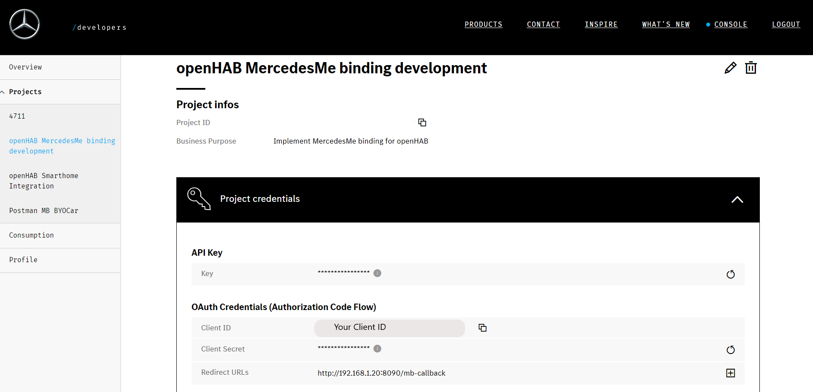
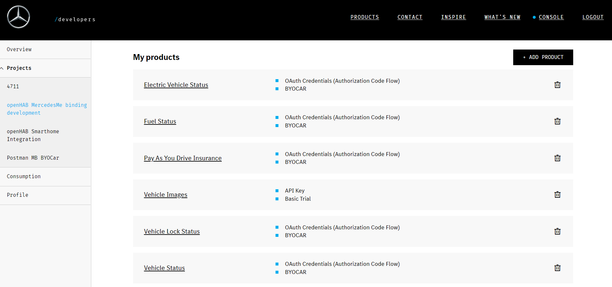
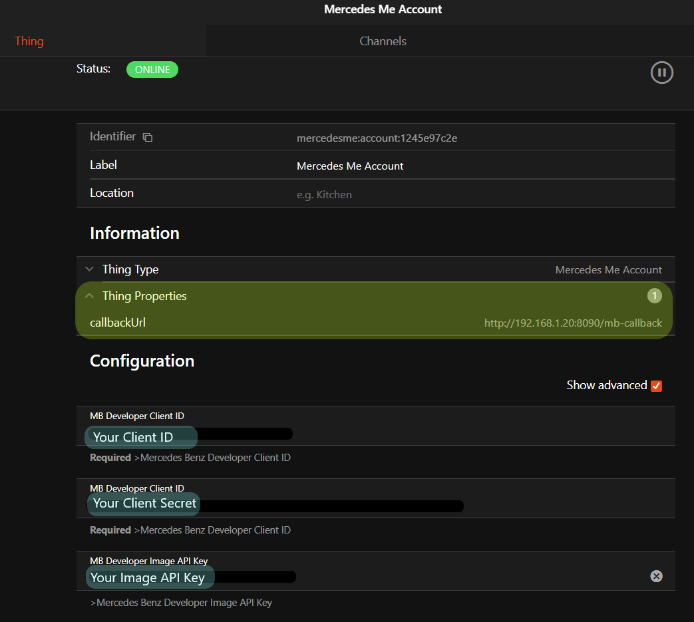
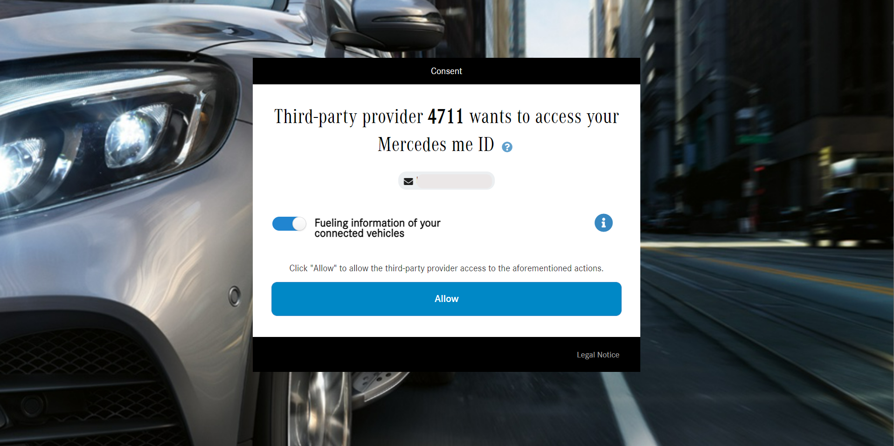
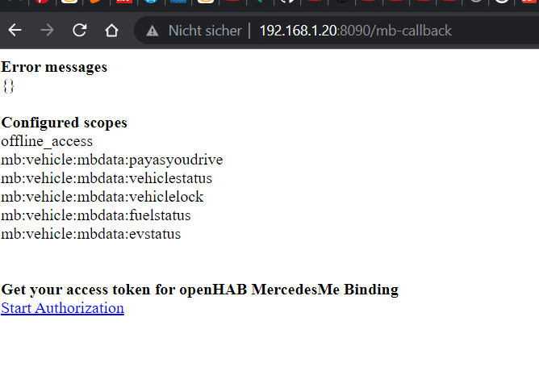
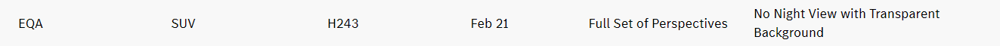
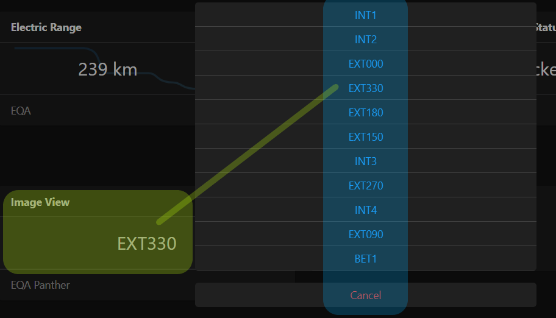

# MercedesMe Binding

This binding provides similar access to your Mercedes Benz vehicle like the Smartphone App _Mercedes Me_.
For this you need a Mercedes developer account to get data from your vehicles.
Setup requires some, time so follow [the steps of bridge configuration](#bridge-configuration).

If you face some problems during setup or runtime please have a look into the [Troubleshooting section](#troubleshooting)

## Supported Things

| Type            | ID            | Description                                     | 
|-----------------|---------------|-------------------------------------------------|
| Bridge          | `account`     | Connect your Mercedes Me account                |
| Thing           | `combustion`  | Conventional fuel vehicle                       |
| Thing           | `hybrid`      | Fuel vehicle with supporting electric engine    |
| Thing           | `bev`         | Battery electric vehicle                        |

## Bridge Configuration

Bridge needs configuration in order to connect properly to your Mercedes Me Account. 

### Pre-Conditions

- **each bridge shall have its own Mercedes Benz Client ID!**
 Don't create several `account` bridges with the same client id! If this is not the case the tokens won't be stored properly and the authorization is jeopardized!
- **each bridge shall have its own port.**
 It's absolutely necessary to assign a different port for each `account` bridge. If this is not the case the tokens won't be stored properly and the authorization is jeopardized!

### Bridge Setup

Perform the following steps to obtain the configuration data and perform the authorization flow.

1. Go to [Mercedes Developer Page](https://developer.mercedes-benz.com/). Login with your Mercedes Me credentials.
2. Create a project in the [console tab](https://developer.mercedes-benz.com/console)
    - _Project Name:_  unique name e.g. **openHAB Mercedes Me binding** plus **Your bridge ID**
    - _Purpose URL:_  use link towards [this binding description](https://www.openhab.org/addons/bindings/mercedesme/)
    - _Business Purpose:_  e.g. **Private usage in openHAB Smarthome system**
3. After project is created subscribe [to these Mercedes Benz APIs](https://developer.mercedes-benz.com/products?vt=cars&vt=vans&vt=smart&p=BYOCAR) with _Add Products_ button 
4. For all Products perform the same steps
    - Select product
    - Choose _Get For Free_
    - Choose _BYOCAR_ (Build Your Own Car)
    - Button _Confirm_
5. Select the following products
    - Vehicle Status
    - Vehicle Lock Status
    - Pay as you drive insurance
    - Electric Vehicle Status
    - Fuel Status
6. Optional: Subscribe also to _Vehicle images_. Select the _Basic Trial_ version. The images will be stored so the API is used just a few times.
7. Press _Subscribe_ button. Your project should have [these product subscriptions](#mb-product-subscriptions)
8. Generate the [project credentials](#mb-credentials)
9. Open in new browser tab your openHAB page. Add a new Thing _Mercedes Me Account_
10. Copy paste _Client ID_ , _Client Secret_ and _API Key_ from the Mercedes tab into the openHAB configuration
11. Check if the registered Mercedes products _excluding Vehicle Images_ are matching exactly with the openHab configuration switches
12. Create Thing!
13. The fresh created [account has one property](#openhab-configuration) `callbackUrl`. Copy it and paste it in a new browser tab
14. A [simple HTML page is shown including a link towards the Authorization flow](#callback-page) - **don't click yet**. If page isn't shown please adapt IP and port in openHAB configuration with Advanced Options activated
15. The copied URL needs to be added in your [Mercedes project credentials](#mb-credentials) from 8
16. Now click onto the link from 14. You'll be asked one time if you [grant access](#mb-access-request) towards the API. Click OK and authorization is done!

Some supporting screenshots for the setup

### MB Credentials



### MB Product Subscriptions



### openHAB Configuration



### MB Access Request



### Callback page




### Bridge Configuration Parameters

| Name            | Type    | Description                           | Default     | Required | Advanced |
|-----------------|---------|---------------------------------------|-------------|----------|----------|
| clientId        | text    | Mercedes Benz Developer Client ID     | N/A         | yes      | no       |
| clientSecret    | text    | Mercedes Benz Developer Client Secret | N/A         | yes      | no       |
| imageApiKey     | text    | Mercedes Benz Developer Image API Key | N/A         | no       | no       |
| odoScope        | boolean | PayAsYourDrive Insurance              | true        | yes      | no       |
| vehicleScope    | boolean | Vehicle Status                        | true        | yes      | no       |
| lockScope       | boolean | Lock status of doors and trunk        | true        | yes      | no       |
| fuelScope       | boolean | Fuel Status                           | true        | yes      | no       |
| evScope         | boolean | Electric Vehicle Status               | true        | yes      | no       |
| callbackIP      | text    | IP address of your openHAB server     | auto detect | no       | yes      |
| callbackPort    | integer | **Unique** port number                | auto detect | no       | yes      |

The `callbackPort` needs to be unique for all created Mercedes Me account things. Otherwise token exchange will be corrupted.
Set the advanced options by yourself if you know your IP and Port, otherwise give auto detect a try.


## Thing Configuration

For vehicle images Mercedes Benz Developer offers only a trial version with limited calls.
Check in **beforehand** if your vehicle has some restrictions or even if it's supported at all.
Visit [Vehicle Image Details](https://developer.mercedes-benz.com/products/vehicle_images/details) in order to check your vehicle capabilities.
Visit [Image Settings](https://developer.mercedes-benz.com/products/vehicle_images/docs#_default_image_settings) to get more information about 
For example the EQA doesn't provide `night` images with `background`.
If your configuration is set this way the API calls are wasted!



See also [image channel section](#image) for further advise.

| Name            | Type    | Description                                         | Default | Required | Advanced |
|-----------------|---------|-----------------------------------------------------|---------|----------|----------|
| vin             | text    | Vehicle identification number                       | N/A     | yes      | no       |
| refreshInterval | integer | Refresh interval in minutes                         | 5       | yes      | no       |
| background      | boolean | Vehicle images provided with or without background  | false   | no       | yes      |
| night           | boolean | Vehicle images in night conditions                  | false   | no       | yes      |
| cropped         | boolean | Vehicle images in 4:3 instead of 16:9               | false   | no       | yes      |
| roofOpen        | boolean | Vehicle images with open roof (only Cabriolet)      | false   | no       | yes      |
| format          | text    | Vehicle images format (webp or png)                 | webp    | no       | yes      |

For all vehicles you're free to give the tank / battery capacity.
Giving these values in configuration the open fuel / charge capacities are reported in the [range](#range) channels.

| Name            | Type    | Description                                         | Default | Required | Advanced | combustion | bev | hybrid |
|-----------------|---------|-----------------------------------------------------|---------|----------|----------|------------|-----|--------|
| batteryCapacity | decimal | Battery Capacity                                    | N/A     | no       | no       |            | X   | X      |
| fuelCapacity    | decimal | Fuel Capacity                                       | N/A     | no       | no       | X          |     | X      |

## Channels

Channels are separated in groups:

| Channel Group ID                 | Description                                       |
|----------------------------------|---------------------------------------------------|
| [range](#range)                  | Provides mileage, range and charge / fuel levels  |
| [doors](#doors)                  | Details of all doors                              |
| [windows](#windows)              | Current position of windows                       |
| [lights](#lights)                | Interior lights and main light switch             |
| [lock](#lock)                    | Overall lock state of vehicle                     |
| [location](#location)            | Heading of the vehicle                            |
| [image](#image)                  | Images of your vehicle                            |

### Range

Group name: `range`
All channels `read-only`

| Channel          | Type                 |  Description                 | bev | hybrid | combustion |
|------------------|----------------------|------------------------------| ----|--------|------------|
| mileage          | Number:Length        |  Total mileage               | X   | X      | X          |
| soc              | Number:Dimensionless |  Battery state of charge     | X   | X      |            |
| charged          | Number:Energy        |  Charged Battery Energy      | X   | X      |            |
| uncharged        | Number:Energy        |  Uncharged Battery Energy    | X   | X      |            |
| soc              | Number:Dimensionless |  Battery state of charge     | X   | X      |            |
| range-electric   | Number:Length        |  Electric range              | X   | X      |            |
| radius-electric  | Number:Length        |  Electric radius for map     | X   | X      |            |
| fuel-level       | Number:Dimensionless |  Fuel level in percent       |     | X      | X          |
| fuel-remain      | Number:Volume        |  Reamaining Fuel             |     | X      | X          |
| fuel-open        | Number:Volume        |  Open Fuel Capacity          |     | X      | X          |
| range-fuel       | Number:Length        |  Fuel range                  |     | X      | X          |
| radius-fuel      | Number:Length        |  Fuel radius for map         |     | X      | X          |
| range-hybrid     | Number:Length        |  Hybrid range                |     | X      |            |
| radius-hybrid    | Number:Length        |  Hybrid radius for map       |     | X      |            |
| last-update      | DateTime             |  Last range update           | X   | X      | X          |

Channels with `radius` are just giving a _guess_ which radius can be reached in a map display.

### Doors

Group name: `doors`
All channels `read-only`

| Channel          | Type                 |  Description                 |
|------------------|----------------------|------------------------------|
| driver-front     | Contact              |  Driver door                 |
| driver-rear      | Contact              |  Driver door reat            |
| passenger-front  | Contact              |  Passenger door              |
| passenger-rear   | Contact              |  Passenger door rear         |
| deck-lid         | Contact              |  Deck lid                    |
| sunroof          | Number               |  Sun roof (only Cabriolet)   |
| rooftop          | Number               |  Roof top                    |
| last-update      | DateTime             |  Last doors update           |

Mapping table `sunroof`

| Number          | Mapping             |
|-----------------|---------------------|
| 0               | Closed              |
| 1               | Open                |
| 2               | Open Lifting        |
| 3               | Running             |
| 4               | Closing             |
| 5               | Opening             |
| 6               | Closing             |

Mapping table `rootop`

| Number          | Mapping             |
|-----------------|---------------------|
| 0               | Unlocked            |
| 1               | Open and locked     |
| 2               | Closed and locked   |

### Windows

Group name: `windows`
All channels `readonly`

| Channel          | Type                 |  Description                 |
|------------------|----------------------|------------------------------|
| driver-front     | Number               |  Driver window               |
| driver-rear      | Number               |  Driver window rear          |
| passenger-front  | Number               |  Passenger window            |
| passenger-rear   | Number               |  Passenger window rear       |
| last-update      | DateTime             |  Last windows update         |

Mapping table for all windows

| Number          | Mapping             |
|-----------------|---------------------|
| 0               | Intermediate        |
| 1               | Open                |
| 2               | Closed              |
| 3               | Airing              |
| 4               | Intermediate        |
| 5               | Running             |

### Lights

Group name: `lights`
All channels `read-only`

| Channel          | Type                 |  Description                 |
|------------------|----------------------|------------------------------|
| interior-front   | Switch               |  Interior light front        |
| interior-rear    | Switch               |  Interior light rear         |
| reading-left     | Switch               |  Reading light left          |
| reading-right    | Switch               |  Reading light right         |
| light-switch     | Number               |  Main light switch           |
| last-update      | DateTime             |  Last lights update          |

Mapping table `light-switch`

| Number          | Mapping             |
|-----------------|---------------------|
| 0               | Auto                |
| 1               | Headlight           |
| 2               | Sidelight Left      |
| 3               | Sidelight Right     |
| 4               | Parking Light       |

### Lock

Group name: `lock`
All channels `read-only`

| Channel          | Type                 |  Description                 |
|------------------|----------------------|------------------------------|
| doors            | Number               |  Lock status all doors       |
| deck-lid         | Switch               |  Deck lid lock               |
| flap             | Switch               |  Flap lock                   |
| last-update      | DateTime             |  Last lock update            |

Mapping table `doors`

| Number          | Mapping             |
|-----------------|---------------------|
| 0               | Unlocked            |
| 1               | Locked Internal     |
| 2               | Locked External     |
| 3               | Unlocked Selective  |

### Location

Group name: `location`
All channels `readonly`

| Channel          | Type                 |  Description                 |
|------------------|----------------------|------------------------------|
| heading          | Number:Angle         |  Vehicle heading             |
| last-update      | DateTime             |  Last location update        |

### Image

Provides exterior and interior images for your specific vehicle.
Group name: `image`

| Channel          | Type                 |  Description                 | Write |
|------------------|----------------------|------------------------------|-------|
| image-data       | Raw                  |  Vehicle image               |       |
| image-view       | text                 |  Vehicle image viewpoint     |   X   |
| clear-cache      | Switch               |  Remove all stored images    |   X   |

**If** the `imageApiKey` in [Bridge Configuration Parameters](#bridge-configuration-parameters) is set the vehicle thing will try to get images.
Pay attention to the [Advanced Image Configuration Properties](#thing-configuration) before requesting new images.
Sending commands towards the `image-view` channel will change the image.
The `image-view` is providing options to select the available images for your specific vehicle.
Images are stored in `jsondb` so if you requested all images the Mercedes Benz Image API will not be called anymore which is good because you have a restricted amount of calls!
If you're not satisfied e.g. you want a background you need to

1. change the [Advanced Image Configuration Properties](#thing-configuration)
2. Switch `clear-cache` channel item to `ON` to clear all images
3. request them via `image-view` 

### Image View Options

You can access the options either in a rule via `YOUR_IMAGE_VIEW_ITEM.getStateDescription().getOptions()` or in UI in widget configuration as _Action: Command options_ and as _Action Item: YOUR_IMAGE_VIEW_ITEM_ 



## Troubleshooting

### Authorization fails

The configuration of openHAB account thing and the Mercedes Developer project need an extract match regarding

- MB project credentials vs. `clientId` `clientSecret` and `callbackUrl`
- MB project subscription of products vs. `scope`

If you follow the [bridge configuration steps](#bridge-configuration) both will match.
Otherwise you'll receive some error message when clicking the link after opening the `callbackUrl` in your browser

Most common errors:

- redirect URL doesn't match: Double check if `callbackUrl` is really saved correctly in your Mercedes Benz Developer project
- scope failure: the requested scope doesn't match with the subscribed products. 
    - Check [openHab configuration switches](#openhab-configuration) 
    - apply changes if necessary and don't forget to save
    - after these steps refresh the `callbackUrl` in [your browser](#callback-page) to apply these changes
    - try a new authorization clicking the link 

### Receive no data

Especially after setting the frist Mercedes Benz Developer Project you'll receive no data.
It seems that the API isn't _filled_ yet. 

**Pre-Condition**

- The Mercedes Me bridge is online = authorization is fine
- The Mercedes Me thing is online = API calls are fine 

**Solution**

- Reduce `refreshInterval` to 1 minute
- Go to your vehicle, open doors and windows, turn on lights, drive a bit  ... 
- wait until values are providing the right states

### Images

Testing the whole image settings is hard due to the restricted call number towards the Image API.

My personal experience during limited testing

| Test             |Tested | OK  |  Not OK | Comment                                                 |
|------------------|-------|-----|---------|---------------------------------------------------------|
| `format` webp    | Yes   |  X  |         |                                                         |
| `format` png     | Yes   |     |    X    | Internal Server Error 500 on Mercedes Server side       |
| `format` jpeg    | No    |     |         | Not tested due to missing transparency in jpeg format   |
| all options off  | Yes   |  X  |         |                                                         |
| `background`     | Yes   |  X  |         |                                                         |
| `night`          | No    |     |         | Not support by my vehicle                               |
| `roofOpen`       | No    |     |         | Not support by my vehicle                               |
| `cropped`        | No    |     |         | Not desired from my side                                |

## Storage

Data is stored in directory `%USER_DATA%/jsondb` for handling tokens and vehicle images.

 * _StorageHandler.For.OAuthClientService.json_ - token is stored with key `clientId` which is provided by `account` [Brige Configuration Parameters](#bridge-configuration-parameters)
 * _mercedesme_%VEHICLE_VIN%.json_ - images are stored per vehicle. File name contains `vin` configured by [vehicle Thing Configuration](#thing-configuration)

With this data the binding is able to operate without new authorization towards Mercedes each startup and reduces the restricted calls towards image API.
Also these files are properly stored in your [backup](https://community.openhab.org/t/docs-on-how-to-backup-openhab/100182) e.g. if you perform `openhab-cli backup`


## Full example

The example is based on a battery electric vehicle. 
Exchange configuration parameters in the Things section

Bridge

* 4711 - your desired bridge id
* YOUR_CLIENT_ID - Client ID of the Mercedes Developer project
* YOUR_CLIENT_SECRET - Client Secret of the Mercedes Developer project
* YOUR_API_KEY - Image API Key of the Mercedes Developer project
* YOUR_OPENHAB_SERVER_IP - IP address of your openHAB server
* 8090 - a **unique** port number - each bridge in your openHAB installation needs to have different port number!

Thing

* eqa - your desired vehicle thing id 
* VEHICLE_VIN - your Vehicle Identification Number

### Things file

```
Bridge mercedesme:account:4711   "MercedesMe John Doe" [ clientId="YOUR_CLIENT_ID", clientSecret="YOUR_CLIENT_SECRET", imageApiKey="YOUR_API_KEY", callbackIP="YOUR_OPENHAB_SERVER_IP", callbackPort=8092, odoScope=true, vehicleScope=true, lockScope=true, fuelScope=true, evScope=true] {
         Thing bev eqa           "Mercedes EQA"        [ vin="VEHICLE_VIN", refreshInterval=5, background=false, night=false, cropped=false, roofOpen=false, format="webp"]
}
```

### Items file

```
Number:Length           EQA_Mileage                 "Odometer [%d %unit%]"                        {channel="mercedesme:bev:4711:eqa:range#mileage" }                                                                           
Number:Length           EQA_Range                   "Range [%d %unit%]"                           {channel="mercedesme:bev:4711:eqa:range#range-electric"}
Number:Length           EQA_RangeRadius             "Range Radius [%d %unit%]"                    {channel="mercedesme:bev:4711:eqa:range#radius-electric"}   
Number:Dimensionless    EQA_BatterySoc              "Battery Charge [%.1f %%]"                    {channel="mercedesme:bev:4711:eqa:range#soc"}

Contact                 EQA_DriverDoor              "Driver Door [%s]"                            {channel="mercedesme:bev:4711:eqa:doors#driver-front" }
Contact                 EQA_DriverDoorRear          "Driver Door Rear [%s]"                       {channel="mercedesme:bev:4711:eqa:doors#driver-rear" }
Contact                 EQA_PassengerDoor           "Passenger Door [%s]"                         {channel="mercedesme:bev:4711:eqa:doors#passenger-front" }
Contact                 EQA_PassengerDoorRear       "Passenger Door Rear [%s]"                    {channel="mercedesme:bev:4711:eqa:doors#passenger-rear" }
Number                  EQA_Trunk                   "Trunk [%s]"                                  {channel="mercedesme:bev:4711:eqa:doors#deck-lid" }
Number                  EQA_Rooftop                 "Rooftop [%s]"                                {channel="mercedesme:bev:4711:eqa:doors#rooftop" }
Number                  EQA_Sunroof                 "Sunroof [%s]"                                {channel="mercedesme:bev:4711:eqa:doors#sunroof" }

Number                  EQA_DoorLock                "Door Lock [%s]"                              {channel="mercedesme:bev:4711:eqa:lock#doors" }
Switch                  EQA_TrunkLock               "Trunk Lock [%s]"                             {channel="mercedesme:bev:4711:eqa:lock#deck-lid" }
Switch                  EQA_FlapLock                "Charge Flap Lock [%s]"                       {channel="mercedesme:bev:4711:eqa:lock#flap" }

Number                  EQA_DriverWindow            "Driver Window [%s]"                          {channel="mercedesme:bev:4711:eqa:windows#driver-front" }
Number                  EQA_DriverWindowRear        "Driver Window Rear [%s]"                     {channel="mercedesme:bev:4711:eqa:windows#driver-rear" }
Number                  EQA_PassengerWindow         "Passenger Window [%s]"                       {channel="mercedesme:bev:4711:eqa:windows#passenger-front" }
Number                  EQA_PassengerWindowRear     "Passenger Window Rear [%s]"                  {channel="mercedesme:bev:4711:eqa:windows#passenger-rear" }

Number:Angle            EQA_Heading                 "Heading [%.1f %unit%]"                       {channel="mercedesme:bev:4711:eqa:location#heading" }  

Image                   EQA_Image                   "Image"                                       {channel="mercedesme:bev:4711:eqa:image#image-data" }  
String                  EQA_ImageViewport           "Image Viewport [%s]"                         {channel="mercedesme:bev:4711:eqa:image#image-view" }  
Switch                  EQA_ClearCache              "Clear Cache [%s]"                            {channel="mercedesme:bev:4711:eqa:image#clear-cache" }  

Switch                  EQA_InteriorFront           "Interior Front Light [%s]"                   {channel="mercedesme:bev:4711:eqa:lights#interior-front" }  
Switch                  EQA_InteriorRear            "Interior Rear Light [%s]"                    {channel="mercedesme:bev:4711:eqa:lights#interior-rear" }  
Switch                  EQA_ReadingLeft             "Reading Light Left [%s]"                     {channel="mercedesme:bev:4711:eqa:lights#reading-left" }  
Switch                  EQA_ReadingRight            "Reading Light Right [%s]"                    {channel="mercedesme:bev:4711:eqa:lights#reading-right" }  
Number                  EQA_LightSwitch             "Main Light Switch [%s]"                      {channel="mercedesme:bev:4711:eqa:lights#light-switch" }  
```

### Sitemap

```
sitemap MB label="Mercedes Benz EQA" {
  Frame label="EQA Image" {
    Image  item=EQA_Image  
                       
  } 
  Frame label="Range" {
    Text    item=EQA_Mileage           
    Text    item=EQA_Range             
    Text    item=EQA_RangeRadius     
    Text    item=EQA_BatterySoc        
  }

  Frame label="Door Details" {
    Text      item=EQA_DriverDoor 
    Text      item=EQA_DriverDoorRear   
    Text      item=EQA_PassengerDoor 
    Text      item=EQA_PassengerDoorRear 
    Text      item=EQA_Trunk
    Text      item=EQA_Rooftop
    Text      item=EQA_Sunroof    
    Text      item=EQA_DoorLock
    Text      item=EQA_TrunkLock
    Text      item=EQA_FlapLock
  }

  Frame label="Windows" {
    Text     item=EQA_DriverWindow
    Text     item=EQA_DriverWindowRear 
    Text     item=EQA_PassengerWindow
    Text     item=EQA_PassengerWindowRear
  }
  
  Frame label="Location" {
    Text    item=EQA_Heading             
  }

  Frame label="Lights" {
    Text       item=EQA_InteriorFront
    Text       item=EQA_InteriorRear
    Text       item=EQA_ReadingLeft
    Text       item=EQA_ReadingRight
    Text       item=EQA_LightSwitch
  } 

  Frame label="Image Properties" {
    Selection    item=EQA_ImageViewport
    Switch       item=EQA_ClearCache
  } 
}
```

## Mercedes Benz Developer

Visit [Mercedes Benz Developer](https://developer.mercedes-benz.com/) to gain more deep information.
