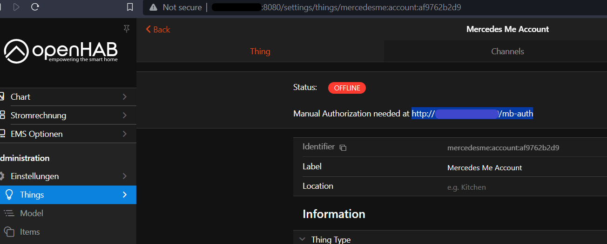
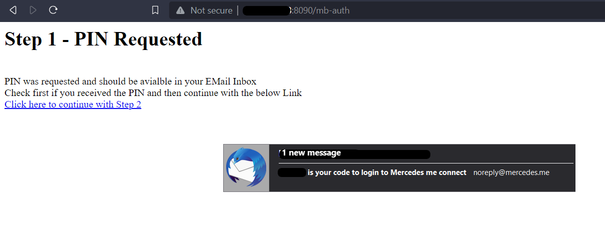
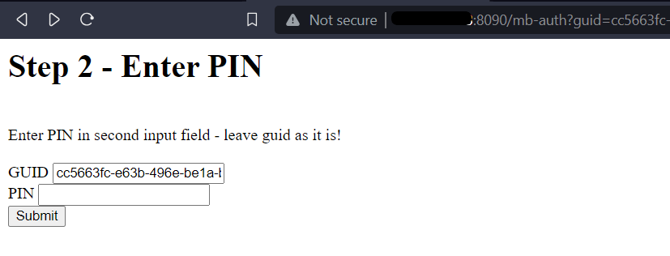
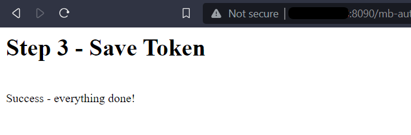
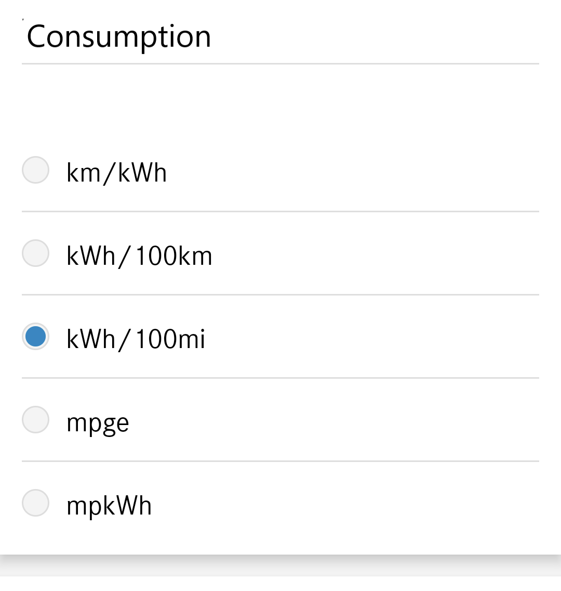
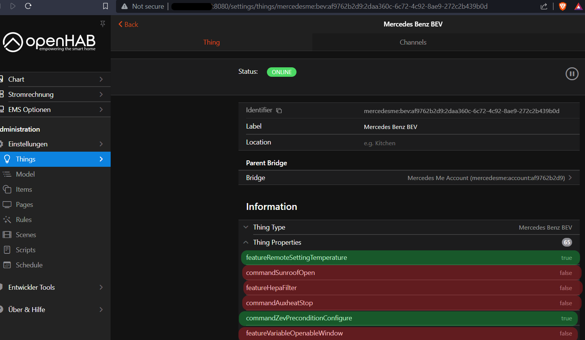

# MercedesMe Binding

This binding provides access to your Mercedes Benz vehicle like _Mercedes Me_ Smartphone App .

## Installation Instructions

First time users shall follow the following sequence

1. Setup and configure [Bridge](#bridge-configuration)
2. Follow the [Bridge Authorization](#bridge-authorization) process
3. [Discovery](#discovery) shall find now vehicles associated to your account
4. Add your vehicle from discovery and [configure](#thing-configuration) it with correct VIN
5. Connect your desired items in UI or [text-configuration](#full-example)
6. Optional: you can [Discover your Vehicle](#discover-your-vehicle) more deeply
7. In case of problems check [Troubleshooting](#troubleshooting) section

## Supported Things

| Type            | ID            | Description                                     |
|-----------------|---------------|-------------------------------------------------|
| Bridge          | `account`     | Connect your Mercedes Me account                |
| Thing           | `combustion`  | Conventional fuel vehicle                       |
| Thing           | `hybrid`      | Fuel vehicle with supporting electric engine    |
| Thing           | `bev`         | Battery electric vehicle                        |

## Discovery

The Mercedes Me binding is based on the API of the Smartphone App.
You have an account which is associated to one or more vehicles.
Setup the Mercedes Me Account Bridge with your email address.
After successful authorization your associated vehicles are found automatically.
There's no manual discovery!

## Bridge Configuration

Bridge needs configuration in order to connect properly to your Mercedes Me account.

| Name            | Type    | Description                             | Default     | Required | Advanced |
|-----------------|---------|-----------------------------------------|-------------|----------|----------|
| email           | text    | Mercedes Me registered email Address    | N/A         | yes      | no       |
| pin             | text    | Mercedes Me Smartphone App PIN          | N/A         | no       | no       |
| region          | text    | Your region                             | EU          | yes      | no       |
| refreshInterval | integer | API refresh interval                    | 15          | yes      | no       |
| callbackIP      | text    | Your region                             | N/A         | yes      | yes      |
| callbackPort    | integer | API refresh interval                    | N/A         | yes      | yes      |

Set `region` to your location

- `EU` : Europe and Rest of World
- `NA` : North America
- `AP` : Asia Pacific
- `CN` : China 

Set `pin` to your Mercedes Me App PIN.
Parameter is *not required*.
Note `pin` is needed for some commands which are affecting **vehicle safety**.
Commands like _unlock doors_ will result into an _unsafe state_: your vehicle is unlocked and is accessible to everybody. 

Commands protected by PIN

- Remote Starting Vehicle
- Unlock Doors
- Open / Ventilate Windows
- Open / Lift Sunroof

IP `callbackIP` and port `callbackPort` will be auto-detected. 
If you're running on server with more than one network interface please select manually.

### Bridge Authorization

Authorization is needed to activate the Bridge which is connected to your Mercedes Me Account.
The Bridge will indicate in the status headline if authorization is needed including the URL which needs to be opened in your browser.

Three steps are needed

1. Open the mentioned URL like 192.168.x.x:8090/mb-auth 
Opening this URL will request a PIN  which will be send to your configured email.
Check your Mail Account if you received the PIN.
Click on _Continue_ to proceed with Step 2.

2. Enter your PIN in the shown field.
Leave GUID as identifier as it is.
Click on _Submit_ button.

3. Confirmation shall be shown that authorization was successful.

In case of non successful authorization check your log for errors. 
Below screenshots are illustrating the authorization flow.

### After Bridge Setup



### Authorization Step 1



### Authorization Step 2



### Authorization Step 3



## Thing Configuration

| Name            | Type    | Description                                         | Default | Required | Advanced |
|-----------------|---------|-----------------------------------------------------|---------|----------|----------|
| vin             | text    | Vehicle Identification Number                       | N/A     | yes      | no       |

For all vehicles you're free to give the fuel / battery capacity.
Giving these values in configuration open fuel / charge capacities are reported in the [range](#range) channels.

| Name            | Type    | Description                                         | Default | Required | Advanced | combustion | bev | hybrid |
|-----------------|---------|-----------------------------------------------------|---------|----------|----------|------------|-----|--------|
| batteryCapacity | decimal | Battery Capacity                                    | N/A     | no       | no       |            | X   | X      |
| fuelCapacity    | decimal | Fuel Capacity                                       | N/A     | no       | no       | X          |     | X      |

## Channels

Channels are separated in groups:

| Channel Group ID                 | Description                                       |
|----------------------------------|---------------------------------------------------|
| [vehicle](#vehicle)              | Vehicle Information                               |
| [doors](#doors)                  | Details of all Doors                              |
| [lock](#lock)                    | Doors Lock Status                                 |
| [windows](#windows)              | Window Details                                    |
| [hvac](#hvac)                    | Climatization                                     |
| [service](#service)              | Service & Warnings                                |
| [range](#range)                  | Ranges, Charge and Fuel                           |
| [charge](#charge)                | Charging Data and Programs                        |
| [trip](#trip)                    | Trip Data                                         |
| [position](#position)            | Positioning Data                                  |
| [tires](#tires)                  | Tire Information                                  |

## Actions

See [Vehicle Actions](#vehicle-actions) which can be used in rules.

### Vehicle

Group name: `vehicle`

| Channel               | Type                |  Description                  | Read | Write | Advanced |
|-----------------------|---------------------|-------------------------------|------|-------|----------|
| lock                  | Number              |  Lock Status and Control      | X    | X     |          |
| windows               | Number              |  Window Status and Control    | X    | X     |          |
| door-status           | Number              |  Door Status                  | X    |       |          |
| ignition              | Number              |  Ignition                     | X    | X     |          |
| park-brake            | Switch              |  Park Brake Active            | X    |       |          |
| feature-capabilities  | String              |  Feature Capabilities         | X    |       |    X     |
| command-capabilities  | String              |  Command Capabilities         | X    |       |    X     |
| proto-update          | String              |  Last Vehicle Data Update     | X    |       |    X     |

Advanced channels are used to identify problems. 
If you encounter problems with this binding follow the instructions from [Troubleshooting](#troubleshooting) section.

#### Lock Status Mapping

State 

- 0 : Locked
- 1 : Unlocked

Command 

- 0 : Lock
- 1 : Unlock

Triggers `DOORSLOCK` and `DOORSUNLOCK` from [Command Name Mapping](#command-name-mapping)

#### Window Mappings

State

- 0 : Intermediate
- 1 : Closed
- 2 : Open

Command

- 0 : Ventilate 
- 1 : Close
- 2 : Open

Triggers `WINDOWVENTILATE`, `WINDOWCLOSE` and `WINDOWOPEN` from [Command Name Mapping](#command-name-mapping)

#### Door Status Mapping

- 0 : Open
- 1 : Closed

#### Ignition Mapping

State 

- 0 : Off
- 2 : Ready
- 4 : On

Command

- 0 : Off
- 4 : On

Triggers `ENGINESTART` and `ENGINESTOP` from [Command Name Mapping](#command-name-mapping)

### Doors

Group name: `doors`

State representing if door, roof, hoods or flaps are open.
States and controls are depending on your vehicle capabilities.

| Channel             | Type                 |  Description                 | Read | Write |
|---------------------|----------------------|------------------------------|------|-------|
| front-left          | Contact              |  Front Left Door             | X    |       |
| front-right         | Contact              |  Front Right Door            | X    |       |
| rear-left           | Contact              |  Rear Left Door              | X    |       |
| rear-right          | Contact              |  Rear Right Door             | X    |       |
| deck-lid            | Contact              |  Deck lid                    | X    |       |
| engine-hood         | Contact              |  Engine Hood                 | X    |       |
| rooftop             | Number               |  Roof top                    | X    |       |
| sunroof-front-blind | Number               |  Sunroof Front Blind         | X    |       |
| sunroof-rear-blind  | Number               |  Sunroof Rear Blind          | X    |       |
| sunroof             | Number               |  Sun roof                    | X    | X     |

#### Rooftop Mapping
            
- 0 : Unlocked
- 1 : Open and locked
- 2 : Closed and locked

#### Sunroof Front Blind Mapping

- not available yet

#### Sunroof Rear Blind Mapping

- not available yet

#### Sunroof Mapping

State

- 0 : Closed
- 1 : Open
- 2 : Lifted
- 3 : Running
- 4 : Closing
- 5 : Opening
- 6 : Closing

Command

- 0 : Close
- 1 : Open
- 2 : Lift

Triggers `ROOFCLOSE`, `ROOFOPEN` and `ROOFLIFT` from [Command Name Mapping](#command-name-mapping)

### Lock

Group name: `lock`

State representing if doors, hoods or flaps are locked.
States and controls are depending on your vehicle capabilities and type.

| Channel             | Type                 |  Description                     | Read | Write |
|---------------------|----------------------|----------------------------------|------|-------|
| front-left          | Switch               |  Front Left Door Lock            | X    |       |
| front-right         | Switch               |  Front Right Door Lock           | X    |       |
| rear-left           | Switch               |  Rear Left Door Lock             | X    |       |
| rear-right          | Switch               |  Rear Right Door Lock            | X    |       |
| deck-lid            | Switch               |  Deck lid                        | X    |       |
| gas-flap            | Switch               |  Gas Flap (combustion & hybrid)  | X    |       |

### Windows

Group name: `windows`

State representing current window position.

| Channel             | Type                 |  Description                 | Read | Write |
|---------------------|----------------------|------------------------------|------|-------|
| front-left          | Number               |  Front Left Window           | X    |       |
| front-right         | Number               |  Front Right Window          | X    |       |
| rear-left           | Number               |  Rear Left Window            | X    |       |
| rear-right          | Number               |  Rear Right Window           | X    |       |
| rear-right-blind    | Number               |  Rear Right Blind            | X    |       |
| rear-left-blind     | Number               |  Rear Left Blind             | X    |       |
| rear-blind          | Number               |  Rear Blind                  | X    |       |

#### Window Channel Mapping

- 0 : Intermediate
- 1 : Open
- 2 : Closed
- 3 : Airing
- 4 : Intermediate
- 5 : Running

#### Rear Right Blind Channel Mapping

- not available yet
 
#### Rear Left Blind Channel Mapping

- not available yet
 
#### Rear Blind Channel Mapping

- not available yet

#### Flip Window Channel Mapping

- not available yet

### HVAC

Group name: `havc`

Configuration of vehicle climatization.
States and controls are depending on your vehicle capabilities.

| Channel             | Type                 |  Description                     | Read | Write |
|---------------------|----------------------|----------------------------------|------|-------|
| front-left          | Switch               |  Front Left Seat Climatization   | X    |       |
| front-right         | Switch               |  Front Left Seat Climatization   | X    |       |
| rear-left           | Switch               |  Front Left Seat Climatization   | X    |       |
| rear-right          | Switch               |  Front Left Seat Climatization   | X    |       |
| zone                | Number               |  Selected Climatization Zone     | X    | X     |
| temperature         | Number:Temperature   |  Desired Temperature for Zone    | X    | X     |
| activate            | Switch               |  Start/Stop Climatization        | X    | X     |
| aux-heat            | Switch               |  Auxiliary Heating               | X    | X     |

#### Zone Mapping

Command Options

- 1 : frontLeft
- 2 : frontRight
- 3 : frontCenter
- 4 : rearLeft
- 5 : rearRight
- 6 : rearCenter
- 7 : rear2Left
- 8 : rear2Right
- 9 : rear2Center

Automatically calculated based on your vehicle capabilities.
Only options are shown which are supported by your vehicle.

Triggers `- PRECONDCONFIGURESEATS` from [Command Name Mapping](#command-name-mapping)

#### Temperature Setting

Pre-configure selected zone with desired temperature.
Minimum and maximum temperature depends on your local settings either Degree Celsius or Fahrenheit.

Celsius 

- Minimum : 16 °C
- Maximum : 28 °C
- Step width : 0.5 °C

Fahrenheit

- Minimum : 60 °F
- Maximum : 84 °F
- Step width : 1 °F

Triggers `TEMPERATURECONFIGURE` from [Command Name Mapping](#command-name-mapping)

#### Activate Switch

Triggers `PRECONDSTART` and `PRECONDSTOP` from [Command Name Mapping](#command-name-mapping)
 
#### Auxiliary Heat Switch

Triggers `AUXHEATSTART` and `AUXHEATSTOP` from [Command Name Mapping](#command-name-mapping)

### Service

Group name: `service`

All channels read-only.
Service and warning information for vehicle.
States and controls are depending on your vehicle capabilities.

| Channel             | Type                 |  Description                    | bev | hybrid | combustion |
|---------------------|----------------------|---------------------------------|-----|--------|------------|
| starter-battery     | Number               |  Starter Battery Status         | X   | X      | X          |
| brake-fluid         | Switch               |  Brake Fluid Warning            | X   | X      | X          |
| brake-lining-wear   | Switch               |  Brake Lining Gear Warning      | X   | X      | X          |
| wash-water          | Switch               |  Wash Water Low Warning         | X   | X      | X          |
| coolant-fluid       | Switch               |  Coolant Fluid Low Warning      |     | X      | X          |
| engine              | Switch               |  Engine Warning                 |     | X      | X          |
| tires-rdk           | Number               |  Tire Pressure Warnings         | X   | X      | X          |
| service-days        | Number               |  Next Service in *x* days       | X   | X      | X          |

#### Starter Battery Mapping

Traffic light status of the starter battery

- 0 : Green
- 1 : Yellow
- 2 : Red

### Range

Group name: `range`

All channels read-only.

| Channel          | Type                 |  Description                 | bev | hybrid | combustion |
|------------------|----------------------|------------------------------|-----|--------|------------|
| mileage          | Number:Length        |  Total Mileage               | X   | X      | X          |
| home-distance    | Number:Length        |  Distance to Home            | X   | X      | X          |
| soc              | Number:Dimensionless |  Battery State of Charge     | X   | X      |            |
| charged          | Number:Energy        |  Charged Battery Energy      | X   | X      |            |
| uncharged        | Number:Energy        |  Uncharged Battery Energy    | X   | X      |            |
| range-electric   | Number:Length        |  Electric Range              | X   | X      |            |
| radius-electric  | Number:Length        |  Electric Radius for Map     | X   | X      |            |
| fuel-level       | Number:Dimensionless |  Fuel Level in Percent       |     | X      | X          |
| fuel-remain      | Number:Volume        |  Remaining Fuel              |     | X      | X          |
| fuel-open        | Number:Volume        |  Open Fuel Capacity          |     | X      | X          |
| range-fuel       | Number:Length        |  Fuel Range                  |     | X      | X          |
| radius-fuel      | Number:Length        |  Fuel Radius for Map         |     | X      | X          |
| range-hybrid     | Number:Length        |  Hybrid Range                |     | X      |            |
| radius-hybrid    | Number:Length        |  Hybrid Radius for Map       |     | X      |            |

Channels with `radius` are just giving a _guess_ which radius can be reached in a map display.

### Charge

Group name: `charge`

Only relevant for battery electric and hybrid vehicles.
Current charge values and charge program configuration.
States and controls are depending on your vehicle capabilities.

| Channel             | Type                 |  Description                           | Read | Write |
|---------------------|----------------------|----------------------------------------|------|-------|
| charge-flap         | Number               |  Charge Flap Status                    | X    |       |
| coupler-ac          | Number               |  Coupler AC Status                     | X    |       |
| coupler-dc          | Number               |  Coupler DC Status                     | X    |       |
| coupler-lock        | Number               |  Coupler Lock Status                   | X    |       |
| active              | Switch               |  Charging Active                       | X    |       |
| power               | Number:Power         |  Current Charging Power                | X    |       |
| end-time            | DateTime             |  Estimated Charging End                | X    |       |
| program             | Number               |  Selected Charge Program               | X    | X     |
| max-soc             | Number:Dimensionless |  Charge Target SoC                     | X    | X     |
| auto-unlock         | Switch               |  Auto Unlock Coupler after charging    | X    | X     |

#### Charge Flap Mapping

- 0 : Open
- 1 : Closed

#### Coupler AC Mapping

- 0 : Plugged
- 2 : Unplugged

#### Coupler DC Mapping

- 0 : Plugged
- 2 : Unplugged

#### Coupler Lock Mapping

- 0 : Locked
- 1 : Unlocked

#### Program Mapping

- 0 : DEFAULT_CHARGE_PROGRAM
- 2 : HOME_CHARGE_PROGRAM
- 3 : WORK_CHARGE_PROGRAM

Automatically calculated based on your vehicle capabilities.
Only options are shown which are supported by your vehicle.

Triggers `CHARGEPROGRAMCONFIGURE` from [Command Name Mapping](#command-name-mapping)

#### Max SoC Setting

SoC target for selected program can be configured if your vehicle capabilities are supporting it.
Configuration limit needs to respect 10% steps with a minimum of 50% and maximum of 100%.

Command Options

- 50 %
- 60 %
- 70 %
- 80 %
- 90 %
- 100 %

Triggers `CHARGEPROGRAMCONFIGURE` from [Command Name Mapping](#command-name-mapping)

#### Auto Unlock Setting

Charge Program can be configured to release coupler lock after target SoC is reached

Triggers `CHARGEPROGRAMCONFIGURE` from [Command Name Mapping](#command-name-mapping)

### Trip

Group name: `trip`

All channels `read-only`

| Channel          | Type                 |  Description                                                         |
|------------------|----------------------|----------------------------------------------------------------------|
| distance         | Number Length        |  Last Trip Distance                                                  |
| time             | String               |  Last Trip Duration in days, hours and minutes                       |
| avg-speed        | Number:Speed         |  Last Trip Average Speed in km/h                                     |
| cons-ev          | Number               |  Last Trip Average Electric Energy Consumption                       |
| cons-conv        | Number               |  Last Trip Average Fuel Consumption                                  |
| distance-reset   | Number Length        |  Since Reset Trip Distance                                           |
| time-reset       | String               |  Since Reset Duration in days, hours and minutes                     |
| avg-speed-reset  | Number:Speed         |  Since Reset Average Speed in km/h                                   |
| cons-ev-reset    | Number               |  Since Reset Average Electric Energy Consumption                     |
| cons-conv-reset  | Number:Volume        |  Since Reset Average Fuel Consumption                                |
| cons-ev-unit     | String               |  Unit of Average Electric Consumption                                |
| cons-conv-unit   | String               |  Unit of Average Fuel Consumption                                    |

#### Average Consumption

You can configure different average consumption units like kWh per 100 kilometer or km per kWh.
In your Mercedes Me App front page 

- Burger Menu top left 
- Last Entry `Settings`
- First Entry `Units`



### Trip Duration

Shown as String in format `d days, HH:mm`.
If duration is below 24 hours format is `HH:mm`. 

### Position

Group name: `position`

| Channel             | Type                 |  Description                                    | Read | Write |
|---------------------|----------------------|-------------------------------------------------|------|-------|
| heading             | Number:Angle         |  Heading of Vehicle                             | X    |       |
| gps                 | Point                |  GPS Location Point of Vehicle                  | X    |       |
| signal              | Number               |  Request Light or Horn Signal to find Vehicle   |      |  X    |

#### Signal Settings

Command Options

- 0 : Position Lights
- 1 : Position Horn

Triggers `SIGPOSSTART` from [Command Name Mapping](#command-name-mapping)

### Tires

Group name: `tires`

All channels `read-only`

| Channel                  | Type                 |  Description                    |
|--------------------------|----------------------|---------------------------------|
| pressure-front-left      | Number:Pressure      |  Tire Pressure Front Left       |
| pressure-front-right     | Number:Pressure      |  Tire Pressure Front Right      |
| pressure-rear-left       | Number:Pressure      |  Tire Pressure Rear Left        |
| pressure-rear-right      | Number:Pressure      |  Tire Pressure Rear Right       |
| sensor-available         | Number               |  Tire Sensor Available          | 
| marker-front-left        | Number               |  Tire Marker Front Left         |
| marker-front-right       | Number               |  Tire Marker Front Right        | 
| marker-rear-left         | Number               |  Tire Marker Rear Left          | 
| marker-rear-right        | Number               |  Tire Marker Rear Right         |
| last-update              | DateTime             |  Timestamp of last Measurement  |

#### Sensor Available Mapping

- Not available yet

#### Tire Marker Mapping

- Not available yet

### Commands

Group name: `command`

All channels `read-only`

| Channel              | Type        |  Description                       |
|----------------------|-------------|------------------------------------|
| cmd-name             | Number      |  Command Name which is handled     |
| cmd-state            | Number      |  Current Command State             |
| cmd-last-update      | DateTime    |  Timestamp of last update          |

Show state of the send command sent by above channels which are able to write values.
**Don't flood the API with commands**.
The Mercedes API cannot withstand _Monkey Testing_.
Send lock/unlock or temperatures in a short period of time will result in failures.

#### Command Name Mapping

- 100 : DOORSLOCK
- 110 : DOORSUNLOCK
- 115 : TRUNKUNLOCK
- 116 : FUELFLAPUNLOCK
- 117 : CHARGEFLAPUNLOCK
- 118 : CHARGECOUPLERUNLOCK
- 300 : AUXHEATSTART
- 310 : AUXHEATSTOP
- 320 : AUXHEATCONFIGURE
- 350 : TEMPERATURECONFIGURE
- 400 : PRECONDSTART
- 410 : PRECONDSTOP
- 420 : PRECONDCONFIGURE
- 425 : PRECONDCONFIGURESEATS
- 550 : ENGINESTART
- 560 : ENGINESTOP
- 570 : ENGINEAVPSTART
- 770 : SIGPOSSTART
- 1100 : WINDOWOPEN
- 1110 : WINDOWCLOSE
- 1120 : WINDOWVENTILATE
- 1121 : WINDOWMOVE
- 1130 : ROOFOPEN
- 1140 : ROOFCLOSE
- 1150 : ROOFLIFT
- 1151 : ROOFMOVE
- 2000 : BATTERYMAXSOC
- 2010 : BATTERYCHARGEPROGRAM
- 2020 : CHARGEPROGRAMCONFIGURE

#### Command State Mapping

- 0 : UNKNOWN_COMMAND_STATE
- 1 : INITIATION
- 2 : ENQUEUED
- 3 : PROCESSING
- 4 : WAITING
- 5 : FINISHED
- 6 : FAILED

## Vehicle Actions

Actions for `vehicle` [thing}(#vehicle) are provided. 

### `sendPOI`

Send a Point of Interest (POI) to the vehicle message box.
This POI can be used as navigation destination.

| Parameter   | Type          | Description             | Mandatory |
|-------------|---------------|-------------------------|-----------|
| title       | String        | POI title               |     X     |
| latitude    | double        | latitude of POI         |     X     |
| longitude   | double        | longitude of POI        |     X     |
| city        | String        | POI city location       |           |
| street      | String        | POI street name         |           |
| postalCode  | String        | POI postal code         |           |

**Example Eiffel Tower**

Required information

```
        val mercedesmeActions = getActions("mercedesme","mercedesme:bev:4711:eqa")
        mercedesmeActions.sendPOI("Eiffel Tower",48.85957476434348,2.2939068084684853)
```

Full information

```
        val mercedesmeActions = getActions("mercedesme","mercedesme:bev:4711:eqa")
        mercedesmeActions.sendPOI("Eiffel Tower",48.85957476434348,2.2939068084684853,"Paris","Av. Gustave Eiffel", "75007")
```

## Discover your Vehicle

There's a big variety of vehicles with different features and different command capabilities.
During discovery the capabilities of your vehicle are identified.
They are stored in `Vehicle Properties` as shown below.
You can check in beforehand if features like _Charge Program Configuration_ or _HVAC Configuration_ are supported or not. 



If you want to dive deeper see [Troubleshooting](#troubleshooting) `feature-capabilities` and `command-capabilities` to evaluate the exact capabilities. 

## Troubleshooting

In order to be able to analyze problems 3 advanced channels are placed in the vehicle group.

* `feature-capabilities` - showing which feature your vehicle is equipped with
* `command-capabilities` - showing which commands can be sent to your vehicle
* `proto-update` - latest update of your vehicle data

In case you find problems regarding this binding add items to these 3 channels.
The items are reporting Strings in JSON format.
Vehicle Identification Number (VIN) isn't part of data.
GPS data which is showing your location is anonymized.
Please double check yourself no critical data is inside.
The content of these items shall be used to create a problem report.
During development the `proto-update`  contains an entry with binding version information.

```
    "bindingInfo": {
        "oh-bundle": "4.1.0.202309241814",
        "version": "2.2-alpha",
        "vehicle": "mercedesme:bev"
    }
```

Keep these 3 channels disconnected during normal operation.

## Full Example

### Things file

```java
Bridge mercedesme:account:4711   "Mercedes Me John Doe" [ email="YOUR_MAIL_ADDRESS", region="EU", pin=9876, refreshInterval=15] {
         Thing bev eqa           "Mercedes EQA"        [ vin="VEHICLE_VIN", batteryCapacity=66.5]
}
```

### Items file

```java
Number                  EQA_DoorLock                {channel="mercedesme:bev:4711:eqa:vehicle#lock" }
Number                  EQA_Windows                 {channel="mercedesme:bev:4711:eqa:vehicle#windows" }
Number                  EQA_DoorStatus              {channel="mercedesme:bev:4711:eqa:vehicle#door-status" }
Number                  EQA_Ignition                {channel="mercedesme:bev:4711:eqa:vehicle#ignition" }
Number                  EQA_ParkBrake               {channel="mercedesme:bev:4711:eqa:vehicle#park-brake" }

Contact                 EQA_FrontLeftDoor           {channel="mercedesme:bev:4711:eqa:doors#front-left" }
Contact                 EQA_FrontRightDoor          {channel="mercedesme:bev:4711:eqa:doors#front-right" }
Contact                 EQA_RearLeftDoor            {channel="mercedesme:bev:4711:eqa:doors#rear-left" }
Contact                 EQA_RearRightDoor           {channel="mercedesme:bev:4711:eqa:doors#rear-right" }
Contact                 EQA_DeckLid                 {channel="mercedesme:bev:4711:eqa:doors#deck-lid" }
Contact                 EQA_EngineHood              {channel="mercedesme:bev:4711:eqa:doors#engine-hood" }
Number                  EQA_Sunroof                 {channel="mercedesme:bev:4711:eqa:doors#sunroof" }

Switch                  EQA_FrontLeftLock           {channel="mercedesme:bev:4711:eqa:lock#front-left" }
Switch                  EQA_FrontRightLock          {channel="mercedesme:bev:4711:eqa:lock#front-right" }
Switch                  EQA_RearLeftLock            {channel="mercedesme:bev:4711:eqa:lock#rear-left" }
Switch                  EQA_RearRightLock           {channel="mercedesme:bev:4711:eqa:lock#rear-right" }
Switch                  EQA_DeckLidLock             {channel="mercedesme:bev:4711:eqa:lock#deck-lid" }

Number                  EQA_FrontLeftWindow         {channel="mercedesme:bev:4711:eqa:windows#front-left" }
Number                  EQA_FrontRightWindow        {channel="mercedesme:bev:4711:eqa:windows#front-right" }
Number                  EQA_RearLeftWindow          {channel="mercedesme:bev:4711:eqa:windows#rear-left" }
Number                  EQA_RearRightWindow         {channel="mercedesme:bev:4711:eqa:windows#rear-right" }

Number                  EQA_ACZone                  {channel="mercedesme:bev:4711:eqa:hvac#zone" }
Number                  EQA_ACTemperature           {channel="mercedesme:bev:4711:eqa:hvac#temperature" }
Number                  EQA_ACControl               {channel="mercedesme:bev:4711:eqa:hvac#active" }

Number                  EQA_StarterBattery          {channel="mercedesme:bev:4711:eqa:service#starter-battery" }
Switch                  EQA_BrakeFluid              {channel="mercedesme:bev:4711:eqa:service#brake-fluid" }
Switch                  EQA_BrakeLiningWear         {channel="mercedesme:bev:4711:eqa:service#brake-lining-wear" }
Switch                  EQA_WashWater               {channel="mercedesme:bev:4711:eqa:service#wash-water" }
Number                  EQA_TirePressureWarn        {channel="mercedesme:bev:4711:eqa:service#tires-rdk" }
Number                  EQA_ServiceInDays           {channel="mercedesme:bev:4711:eqa:service#service-days" }

Number:Length           EQA_Mileage                 {channel="mercedesme:bev:4711:eqa:range#mileage" }
Number:Length           EQA_Range                   {channel="mercedesme:bev:4711:eqa:range#range-electric" }
Number:Length           EQA_RangeRadius             {channel="mercedesme:bev:4711:eqa:range#radius-electric" }
Number:Dimensionless    EQA_SoC                     {channel="mercedesme:bev:4711:eqa:range#soc" }
Number:Energy           EQA_BatteryCharged          {channel="mercedesme:bev:4711:eqa:range#charged" }
Number:Energy           EQA_BatteryUncharged        {channel="mercedesme:bev:4711:eqa:range#uncharged" }

Number                  EQA_ChargeFlap              {channel="mercedesme:bev:4711:eqa:charge#charge-flap" }
Number                  EQA_CouplerLock             {channel="mercedesme:bev:4711:eqa:charge#coupler-lock" }
Switch                  EQA_ChargeActive            {channel="mercedesme:bev:4711:eqa:charge#active" }
Number:Power            EQA_ChargePower             {channel="mercedesme:bev:4711:eqa:charge#power" }
DateTime                EQA_ChargeTimeEstimate      {channel="mercedesme:bev:4711:eqa:charge#end-time" }
Number                  EQA_ChargeProgram           {channel="mercedesme:bev:4711:eqa:charge#program" }
Number:Dimensionless    EQA_ProgramMaxSoc           {channel="mercedesme:bev:4711:eqa:charge#max-soc" }

Number:Length           EQA_TripDistance            {channel="mercedesme:bev:4711:eqa:trip#distance" }
String                  EQA_TripDuration            {channel="mercedesme:bev:4711:eqa:trip#time" }
Number:Speed            EQA_TripAvgSpeed            {channel="mercedesme:bev:4711:eqa:trip#avg-speed" }
Number                  EQA_TripAvgConsumption      {channel="mercedesme:bev:4711:eqa:trip#cons-ev" }
String                  EQA_AvgConsumptionUnit      {channel="mercedesme:bev:4711:eqa:trip#cons-ev-unit" }

Number:Angle            EQA_Heading                 {channel="mercedesme:bev:4711:eqa:position#heading" }  
Location                EQA_GPSLocation             {channel="mercedesme:bev:4711:eqa:position#gps" }
Number                  EQA_Signal                  {channel="mercedesme:bev:4711:eqa:position#signal" }

Number:Pressure         EQA_PressureFrontLeft       {channel="mercedesme:bev:4711:eqa:tires#pressure-front-left" }
Number:Pressure         EQA_PressureFrontRight      {channel="mercedesme:bev:4711:eqa:tires#pressure-front-right" }
Number:Pressure         EQA_PressureRearLeft        {channel="mercedesme:bev:4711:eqa:tires#pressure-rear-left" }
Number:Pressure         EQA_PressureRearRight       {channel="mercedesme:bev:4711:eqa:tires#pressure-rear-right" }
DateTime                EQA_MeasurementTime         {channel="mercedesme:bev:4711:eqa:tires#last-update" }

Number                  EQA_CommandName             {channel="mercedesme:bev:4711:eqa:command#cmd-name" }
Number                  EQA_CommandState            {channel="mercedesme:bev:4711:eqa:command#cmd-state" }
DateTime                EQA_CommandTimestamp        {channel="mercedesme:bev:4711:eqa:command#cmd-last-update" }
```

### POI ruleExample

```
// send POI from JSON String item
rule "Send POI"
    when
        Item POIJsonString changed 
    then
        // decode JSON
        val json = POIJsonString.state.toString        
        val title = transform("JSONPATH", "$.title", json)
        val lat = transform("JSONPATH", "$.latitude", json)
        val lon = transform("JSONPATH", "$.longitude", json)

        // send POI to vehicle
        val mercedesmeActions = getActions("mercedesme","mercedesme:bev:4711:eqa")
        mercedesmeActions.sendPoi(title,lat,lon)
end
```

