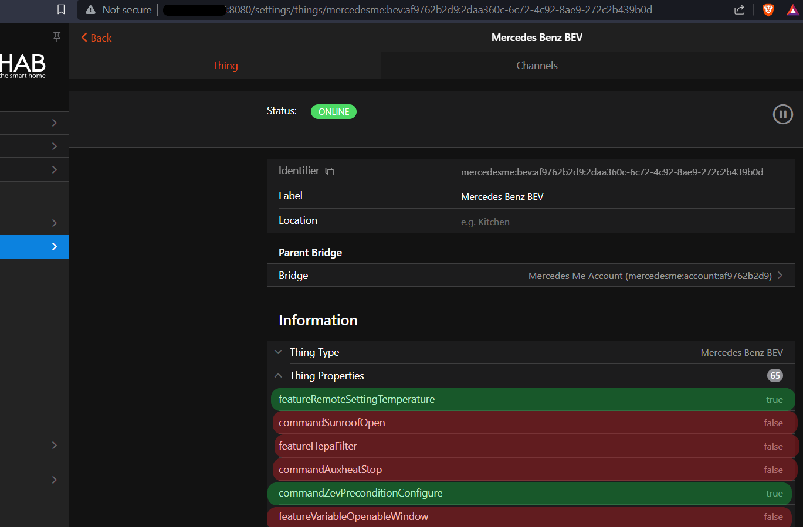

# MercedesMe Binding

This binding provides similar access to your Mercedes Benz vehicle like the Smartphone App _Mercedes Me_.

## ''Alpha Version''

Current Development Status is Alpha.
Data Mappings are missing and testing of features and regions are necessary.

In order to analyze problems check the binding logs.
**In addition please connect the advanced channels from vehicle [vehicle](#vehicle) to analyze problems!**

- feature-capabilities
- command-capabilities
- proto-update

## Supported Things

| Type            | ID            | Description                                     |
|-----------------|---------------|-------------------------------------------------|
| Bridge          | `account`     | Connect your Mercedes Me account                |
| Thing           | `combustion`  | Conventional fuel vehicle                       |
| Thing           | `hybrid`      | Fuel vehicle with supporting electric engine    |
| Thing           | `bev`         | Battery electric vehicle                        |

## Discovery

The MercedesMe binding is based on the API of the Smartphone App.
You have an account which connects to one or more vehicles.
Setup the MercedesMe Account Bridge with your EMail address used in Smartphone App.
After successful authorization your attached vehicles are found automatically.
Manual Discovery not necessary!

## Bridge Configuration

Bridge needs configuration in order to connect properly to your Mercedes Me Account.
You need to have access to your Mercedes Benz via Smartphone App.
Otherwise this binding will not work!

### Bridge Setup

Authorization is needed to activate the Bridge which is connected to your MercedesMe Account.
The Bridge will indicate in the Status headline if Authorization is needed including the URL which needs to be opened in your browser.
Three steps are needed

1. Open the mentioned URL like 192.168.x.x:8090/mb-auth 
Opening this URL will request a PIN to your configured EMail
Check your Mail Account if you received the PIN.
Click on Continue with Step 2 

2. Enter your PIN in the shown field
Leave GUID as identifier as it is
Click on Submit button

3. Consfirmation shall be shown that Authorization was successful.

In case of non successful Athorization check your log for errors. 

Some Screenshots to follow Authorizatiom

### After Bridge Setup

### Authorization Step 1

### Authorization Step 2

### Authorization Step 3

### Vehicle Capabilities

### Bridge Configuration Parameters

| Name            | Type    | Description                           | Default     | Required | Advanced |
|-----------------|---------|---------------------------------------|-------------|----------|----------|
| email           | text    | Mercedes Benz registered EMail Address| N/A         | yes      | no       |
| region          | text    | Your region                           | EU          | yes      | no       |
| pin             | text    | Mercedes Benz Smartphone App PIN      | N/A         | no       | no       |

Set `region` to your location

- `EU` Europe and Rest of World
- `NA` North America
- `AP` Aisa Pacific
- `CN` China 

Set `pin` to your selected PIN of your Apple or Android installed MercedesMe App.
Parameter is *not required*.
Note `pin` is needed for some commands which are critical for Car and especially **personal saftey**.
E.g. closing windows needs to ensure no obstacles are in the way!
Commands protected by PIN

- Remote Starting Vehicle
- Unlock Doors
- Open / Ventilate Windows
- Open / Lift Sunroof

## Thing Configuration

| Name            | Type    | Description                                         | Default | Required | Advanced |
|-----------------|---------|-----------------------------------------------------|---------|----------|----------|
| vin             | text    | Vehicle identification number                       | N/A     | yes      | no       |

For all vehicles you're free to give the tank / battery capacity.
Giving these values in configuration the open fuel / charge capacities are reported in the [range](#range) channels.

| Name            | Type    | Description                                         | Default | Required | Advanced | combustion | bev | hybrid |
|-----------------|---------|-----------------------------------------------------|---------|----------|----------|------------|-----|--------|
| batteryCapacity | decimal | Battery Capacity                                    | N/A     | no       | no       |            | X   | X      |
| fuelCapacity    | decimal | Fuel Capacity                                       | N/A     | no       | no       | X          |     | X      |

## Channels

Channels are separated in groups:

| Channel Group ID                 | Description                                       |
|----------------------------------|---------------------------------------------------|
| [vehicle](#vehicle)              | Vehicle Information                               |
| [doors](#doors)                  | Details of all doors                              |
| [lock](#lock)                    | Doors lock status                                 |
| [windows](#windows)              | Window Details                                    |
| [hvac](#hvac)                    | Climatization                                     |
| [service](#service)              | Service & Warnings                                |
| [range](#range)                  | Ranges and Odometer                               |
| [charge](#charge)                | Charging data and programs                        |
| [trip](#trip)                    | Trip data                                         |
| [position](#position)            | Positioning Data                                  |
| [tires](#tires)                  | Tire Informatios                                  |

### Vehicle

Group name: `vehicle`

| Channel               | Type                 |  Description                 | Read | Write | Advanced |
|-----------------------|----------------------|------------------------------|------|-------|----------|
| lock-status           | Number              |  Lock Status                  | X    |       |          |
| window-status         | Number              |  Window Status                | X    |       |          |
| door-status           | Number              |  Door Status                  | X    |       |          |
| ignition              | Number              |  Ignition                     | X    |       |          |
| feature-capabilities  | String              |  Feature Capabilities         | X    |       |    X     |
| command-capabilities  | String              |  Command Capabilities         | X    |       |    X     |
| proto-update          | String              |  Last Vehicle Data Update     | X    |       |    X     |

#### Lock Status Mapping

- 0 : Locked
- 1 : Unlocked

#### Window Status Mapping

- 0 : Intermediate
- 1 : Closed
- 2 : Open

#### Door Status Mapping

- 0 : Open
- 1 : Closed

#### Ignition Mapping

- 0 : Off
- 2 : Ready
- 4 : On

### Doors

Group name: `doors`

State representing if Door or other roofs, hoods or flaps are open.
States and Controls are depending on your vehicle capabilites.

| Channel             | Type                 |  Description                 | Read | Write |
|---------------------|----------------------|------------------------------|------|-------|
| front-left          | Contact              |  Front Left Door             | X    |       |
| front-right         | Contact              |  Fornt Right Door            | X    |       |
| rear-left           | Contact              |  Rear Left Door              | X    |       |
| rear-right          | Contact              |  Rear Right Door             | X    |       |
| deck-lid            | Contact              |  Deck lid                    | X    |       |
| engine-hood         | Contact              |  Engine Hood                 | X    |       |
| sunroof             | Number               |  Sun roof (only Cabriolet)   | X    |       |
| rooftop             | Number               |  Roof top                    | X    |       |
| sunroof-front-blind | Number               |  Sunroof Front Blind         | X    |       |
| sunroof-rear-blind  | Number               |  Sunroof Rear Blind          | X    |       |
| sunroof-control     | Number               |  Sunroof Control             |      | X     |

#### Sunroof Mapping

- 0 : Closed
- 1 : Open
- 2 : Open Lifting
- 3 : Running
- 4 : Closing
- 5 : Opening
- 6 : Closing

#### Rooftop Mapping
            
- 0 : Unlocked
- 1 : Open and locked
- 2 : Closed and locked

#### Sunroof Front Blind Mapping

- not available yet!

#### Sunroof Rear Blind Mapping

- not available yet!

#### Sunroof Control Mapping

- 0 : Close
- 1 : Open
- 2 : Lift

### Lock

Group name: `lock`
State representing if Door or other roofs, hoods or flaps are locked.
States and Controls are depending on your vehicle capabilites and Type.

| Channel             | Type                 |  Description                    | Read | Write |
|---------------------|----------------------|---------------------------------|------|-------|
| front-left          | Switch              |  Front Left Door Lock            | X    |       |
| front-right         | Switch              |  Front Right Door Lock           | X    |       |
| rear-left           | Switch              |  Rear Left Door Lock             | X    |       |
| rear-right          | Switch              |  Rear Right Door Lock            | X    |       |
| deck-lid            | Switch              |  Deck lid                        | X    |       |
| gas-flap            | Switch              |  Gas Flap (combustion & hybrid)  | X    |       |
| lock-control        | Switch              |  Lock / Unlock Verhicle          |      | X     |

### Windows

Group name: `windows`
State representing current Window position.
States and Controls are depending on your vehicle capabilites.

| Channel             | Type                 |  Description                 | Read | Write |
|---------------------|----------------------|------------------------------|------|-------|
| front-left          | Number               |  Front Left Window           | X    |       |
| front-right         | Number               |  Fornt Right Window          | X    |       |
| rear-left           | Number               |  Rear Left Window            | X    |       |
| rear-right          | Number               |  Rear Right Window           | X    |       |
| rear-right-blind    | Number               |  Rear Right Blind            | X    |       |
| rear-left-blind     | Number               |  Rear Left Blind             | X    |       |
| rear-blind          | Number               |  Rear  Blind                 | X    |       |
| window-control      | Number               |  Window Control              |      | X     |

#### Window Channel Mapping

- 0 : Intermediate
- 1 : Open
- 2 : Closed
- 3 : Airing
- 4 : Intermediate
- 5 : Running

#### Rear Right Blind Channel Mapping

- not available yet!
 
#### Rear Left Blind Channel Mapping

- not available yet!
 
#### Rear Blind Channel Mapping

- not available yet!

#### Flip Window Channel Mapping

- not available yet!

#### Window Control Channel Mapping
- 0 : Close
- 1 : Open
- 2 : Ventilate

### HVAC

Group name: `havc`
Configuration of vehicle climatization.
States and Controls are depending on your vehicle capabilites.

| Channel             | Type                 |  Description                    | Read | Write |
|---------------------|----------------------|---------------------------------|------|-------|
| front-left          | Switch              |  Front Left Seat Climatization   | X    | X     |
| front-right         | Switch              |  Front Left Seat Climatization   | X    | X     |
| rear-left           | Switch              |  Front Left Seat Climatization   | X    | X     |
| rear-right          | Switch              |  Front Left Seat Climatization   | X    | X     |
| zone                | Number              |  Selected Climatization Zone     | X    | X     |
| temperature         | Number:Temperature  |  Desired Temperature             | X    | X     |
| activate            | Switch              |  Gas Flap (combustion & hybrid)  | X    | X     |
| aux-heat            | Switch              |  Sunroof Control (Cabriolet)     | X    | X     |

#### Zone Mapping

Automatically calculated based on your vehicle capabilities

#### Temperautre Setting

Preconfigure selected zone with desired temperature

- Minimum : 16
- Maximum : 28

### Service

Group name: `service`
All channles read-only.
Service and Warning Information for vehicle
States and Controls are depending on your vehicle capabilites.

| Channel             | Type                 |  Description                    | bev | hybrid | combustion |
|---------------------|----------------------|---------------------------------|-----|--------|------------|
| starter-battery     | Number               |  Starter Battery Status         | X   | X      | X          |
| brake-fluid         | Switch               |  Brake Fluid Warning            | X   | X      | X          |
| brake-lining-wear   | Switch               |  Brake Lining Gear Warning      | X   | X      | X          |
| wash-water          | Switch               |  Wash Water Low Warning         | X   | X      | X          |
| coolant-fluid       | Switch               |  Coolant Fluid Low Warning      |     | X      | X          |
| engine              | Switch               |  Engine Warning                 |     | X      | X          |
| tires-rdk           | Number               |  Tire Pressure Warnings         | X   | X      | X          |
| service-days        | Number               |  Next Service in *x* days       | X   | X      | X          |

#### Starter Battery Mapping

-0 : Charged

### Range

Group name: `range`
All channles read-only.

| Channel          | Type                 |  Description                 | bev | hybrid | combustion |
|------------------|----------------------|------------------------------|-----|--------|------------|
| mileage          | Number:Length        |  Total mileage               | X   | X      | X          |
| soc              | Number:Dimensionless |  Battery state of charge     | X   | X      |            |
| charged          | Number:Energy        |  Charged Battery Energy      | X   | X      |            |
| uncharged        | Number:Energy        |  Uncharged Battery Energy    | X   | X      |            |
| soc              | Number:Dimensionless |  Battery state of charge     | X   | X      |            |
| range-electric   | Number:Length        |  Electric range              | X   | X      |            |
| radius-electric  | Number:Length        |  Electric radius for map     | X   | X      |            |
| fuel-level       | Number:Dimensionless |  Fuel level in percent       |     | X      | X          |
| fuel-remain      | Number:Volume        |  Reamaining Fuel             |     | X      | X          |
| fuel-open        | Number:Volume        |  Open Fuel Capacity          |     | X      | X          |
| range-fuel       | Number:Length        |  Fuel range                  |     | X      | X          |
| radius-fuel      | Number:Length        |  Fuel radius for map         |     | X      | X          |
| range-hybrid     | Number:Length        |  Hybrid range                |     | X      |            |
| radius-hybrid    | Number:Length        |  Hybrid radius for map       |     | X      |            |

Channels with `radius` are just giving a _guess_ which radius can be reached in a map display.

### Charge

Group name: `charge`
Only relevant for battery electric and hybrid vehicles.
Current charge values and charge program configuration.
States and Controls are depending on your vehicle capabilites.

| Channel             | Type                 |  Description                    | Read | Write |
|---------------------|----------------------|---------------------------------|------|-------|
| charge-flap         | Number               |  Charge Flap Stazus             | X    |       |
| oupler-ac-channel   | Number               |  Coupler AC Status              | X    |       |
| oupler-dc-channel   | Number               |  Coupler DC Status              | X    |       |
| coupler-lock        | Number               |  Coupler Lock Status            | X    |       |
| active              | Switch               |  Charging Active                | X    |       |
| power               | Number:Power         |  Current Charging Power         | X    |       |
| end-time            | DateTime             |  Estimated Charging End         | X    |       |
| program             | Number               |  Selected Charge Program        | X    | X     |
| max-soc             | Number:Dimensioless  |  Charge Target SoC              | X    | X     |
| auto-unlock         | Switch               |  Sunroof Control (Cabriolet)    | X    | X     |

#### Charge Flap Mapping

- 0 : Open
- 1 : Closed

#### Coupler AC Mapping

- not available yet!

#### Coupler DC Mapping

- not available yet!

#### Coupler Lock Mapping

- 0 : Locked
- 1 : Unlocked

#### Program Mapping

Calculated automatically based on your vehicle capabilities

#### Max SoC Setting

SoC target for selected rogram can be configured if your vehicle capabilities are supporting it.
Configuration Limit needs to respect 10% steps with a minimum of 50% and maximum of 100%.

#### Auto Unlock Setting

Charge Program can be configured to release Coupler Lock after target SoC is reached

### Trip

Group name: `trip`
All channels `read-only`

| Channel          | Type                 |  Description                                                         |
|------------------|----------------------|----------------------------------------------------------------------|
| distance         | Number Length        |  Last Trip Distance                                                  |
| time             | String               |  Last Trip Duration in days, hours and minutes                       |
| avg-speed        | Number               |  Last Trip Average Speed in km/h                                     |
| cons-ev          | Number:Energy        |  Last Trip Average Electric Energy Consumption per 100 Kilometre     |
| cons-conv        | Number:Volume        |  Last Trip Average Gas Consumption per 100 Kilometre                 |
| distance-reset   | Number Length        |  Since Reset Trip Distance                                           |
| time-reset       | String               |  Since Reset Duration in days, hours and minutes                     |
| avg-speed-reset  | Number               |  Since Reset Average Speed in km/h                                   |
| cons-ev-reset    | Number:Energy        |  Since Reset Average Electric Energy Consumption per 100 Kilometre   |
| cons-conv-reset  | Number:Volume        |  Since Reset Average Gas Consumption per 100 Kilometre               |

### Position

Group name: `position`

| Channel             | Type                 |  Description                                    | Read | Write |
|---------------------|----------------------|-------------------------------------------------|------|-------|
| heading             | Number:Angle         |  Heading of Vehicle                             | X    |       |
| gps                 | Point                |  GPS Location Point of Vehicle                  | X    |       |
| signal              | Number               |  Request Light or Horn Signal to find Vehicle   |     |  X     |

#### Signal Settings

Depends on the capabilities of your vehicle

### Tires

Group name: `tires`
All channels `read-only`

| Channel                  | Type                 |  Description                    |
|--------------------------|----------------------|---------------------------------|
| pressure-front-left      | Number:Pressure      |  Tire Pressure Front Left       |
| pressure-front-right     | Number:Pressure      |  Tire Pressure Fornt Right      |
| pressure-rear-left       | Number:Pressure      |  Tire Pressure Rear Left        |
| pressure-rear-right      | Number:Pressure      |  Tire Pressure Rear Right       |
| sensor-available         | Number               |  Tire Sensor Availbale          | 
| marker-front-left        | Number               |  Tire Marker Front Left         |
| marker-front-right       | Number               |  Tire Marker Fornt Right        | 
| marker-rear-left         | Number               |  Tire Marker Rear Left          | 
| marker-rear-right        | Number               |  Tire Marker Rear Right         |
| last-update              | DateTime             |  Timestamp of last Measurement  |

#### Sensor Available Mapping

- Not available yet!

#### Tire Marker Mapping

- Not available yet!

