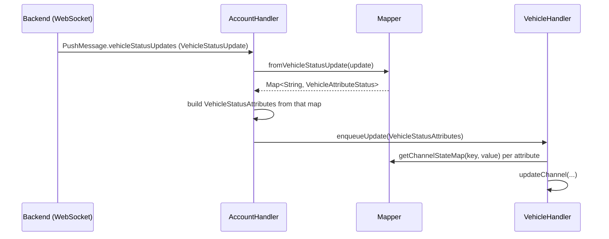

# ADR-002: Unified Internal Vehicle Status Update Carrier

## Status

Accepted

## Context

The binding receives vehicle status pushes over its WebSocket connection in two wire formats:

1. The legacy `VEPUpdate` format (`PushMessage.hasVepUpdates()`): a generic `map<string,
   VehicleAttributeStatus>`, keyed by the `MB_KEY_*` constants used throughout the channel-mapping code.
1. The typed `VehicleStatusUpdate` format (`PushMessage.hasVehicleStatusUpdates()`, added in backend/app
   version 165-1): one strongly-typed field per attribute.

Today, `AccountHandler` converts a typed `VehicleStatusUpdate` into the legacy attribute map via
`Mapper.fromVehicleStatusUpdate()`, then wraps that map back into a synthetic `VEPUpdate` protobuf object
purely so the rest of the pipeline (`AccountHandler`'s replay map, `VehicleHandler`'s event queue and
`handleUpdate()`) can keep working unchanged. `VEPUpdate` is therefore the de-facto internal carrier type
for a single vehicle's update, even though it is a protobuf message generated from `vehicle-events.proto`
and one of two wire formats — not a type this binding owns.

Two additional, unrelated code paths also use `VEPUpdate`:

- `RestApi.restGetVehicleAttributes()` parses a REST response into a `VEPUpdate`. It has no caller in
  `AccountHandler`, `VehicleHandler`, or `Websocket` — confirmed by full-text search. Its only caller is
  `TestUpdate`, a manual `main()`-based debug utility with placeholder credentials, not part of the
  automated test suite. `AccountHandler.refresh()` already documents why this REST endpoint was never
  adopted: it only ever returns the small widget-tile attribute subset, not enough to drive most channels
  or `keepAlive()`.
- The Javadoc on `Mapper.fromVehicleStatusUpdate()` claims temperature points, charge programs, and
  auxiliary warnings are excluded from the typed conversion "because they have no 1:1 counterpart". This is
  inaccurate: `putTemperaturePoints()`, `putChargePrograms()`, and `putAuxheatwarnings()` are implemented
  and called from that method. Verified against two real `VehicleStatusUpdate` TRACE captures of a BEV
  (`vsu-eqa-1.raw`, `vsu-eqa-2.raw`, see `docs/changes/remove-vepupdate/`): every attribute the conversion
  currently handles is present in both captures, and none of the 68 attributes the conversion does _not_
  yet handle correspond to an existing channel (`MB_KEY_*` constant) — so there is no field-parity gap for
  currently exposed channels, at least for this vehicle type.

What is _not_ known and is out of scope for this decision: whether the backend still sends the legacy
`VEPUpdate` push at all for current app versions, and whether the typed push has full field parity for
combustion/hybrid vehicles (only BEV captures are available). Removing the legacy WebSocket branch itself
is therefore not part of this decision.

Note: a test comment in `VehicleHandlerTest` references "ADR-001" (the max-soc-without-charge-programs flat
attribute fallback for MB-BEV-CLA), but no corresponding file exists under `docs/ADR/` in this repository —
a pre-existing documentation gap, not something this ADR resolves.

## Decision

We introduce a small internal record, `VehicleStatusAttributes` (full-update flag + attribute map), owned
by this binding, as the sole carrier passed between `AccountHandler` and `VehicleHandler`. Both WebSocket
branches keep being accepted at the `AccountHandler` boundary and are normalized into this type there:

- The legacy branch builds it directly from each `VEPUpdate`'s existing attribute map.
- The typed branch builds it from `Mapper.fromVehicleStatusUpdate()`'s output, skipping the
  synthetic-`VEPUpdate`-wrapping step entirely.

`Mapper.getChannelStateMap(String, VehicleAttributeStatus)` — the per-attribute channel dispatch logic — is
unchanged. It already operates on `VehicleAttributeStatus` values, not on `VEPUpdate`, so it needs no
rework; only the type of the container that carries those values between the two handlers changes.

`RestApi.restGetVehicleAttributes()` and `TestUpdate` are removed as confirmed dead code, independent of
the carrier-type change but bundled into the same change since both reference `VEPUpdate`.

## Consequences

### Positive

- `VEPUpdate` (a protobuf-generated, wire-format-specific type) no longer leaks into `VehicleHandler` or
  the diagnostic JSON helper (`Utils.proto2Json`); both now depend only on a type this binding owns.
- The typed push path no longer performs a wasteful decode-then-re-encode-as-legacy-protobuf round trip; it
  builds the internal carrier directly.
- Removes confirmed dead code (REST fallback + its debug utility) and a stale, misleading Javadoc comment.
- No change to `Mapper`'s core dispatch logic — the highest-risk, most heavily used part of the mapping
  code is untouched, keeping the blast radius of this change limited to the two handlers, one utility
  method, and their tests.

### Negative

- Touches the event queue and update-handling method signatures in both `AccountHandler` and
  `VehicleHandler`, plus three test files, which is a wider diff than a pure dead-code deletion.
- This environment has no Maven/network access to compile or run the test suite; the change must be
  verified with a real `mvn clean install` (or `mvn test -pl bundles/org.openhab.binding.mercedesme`) by a
  human before being trusted in production.
- ~~The legacy `hasVepUpdates()` WebSocket branch remains in the code (see Context) — this decision does not
  achieve full removal of `VEPUpdate` from the binding, only from the internal carrier role. A follow-up
  decision is needed once backend behavior is confirmed.~~ **Superseded, see Addendum.**

## Addendum: full removal of the legacy branch

The "Negative" consequence above — keeping `hasVepUpdates()` — was a scoping decision made unilaterally
during this change, not a constraint requested by the user. The user's original instruction was an explicit
total cleanup of `VEPUpdate` from production and test code. Once this gap was pointed out, the user
confirmed the decision explicitly: remove the legacy branch too, accepting the risk described below.

**Updated decision:** `AccountHandler.handleMessage()` no longer has a `hasVepUpdates()` branch.
`hasVehicleStatusUpdates()` is the sole handled vehicle-update push type. `ProtoTest`'s wire-format-level
tests (which decoded real `.blob` captures of the legacy format) and the `PushMessage`/`VEPUpdate` round
trip in `VehicleHandlerTest.testChargeProgramUpdate()` were removed/simplified accordingly — see
`docs/changes/remove-vepupdate/proposal.md`, Addendum, and `tasks.md` §6 for the full list of touched files.

**Accepted risk:** if the Mercedes backend still sends a legacy `VEPUpdate` push for any account, vehicle,
or app-version combination, it now falls through to `AccountHandler`'s final `else` branch (logged at TRACE
as "not handled") — silently dropped, no acknowledgment sent. This cannot be verified from the sandbox this
change was implemented in; there is no way to observe real production WebSocket traffic here. The user has
accepted this risk explicitly, but a human should watch `AccountHandler`'s DEBUG log for the message-type
distribution after deploying, to catch a regression quickly if the assumption is wrong.

**Deliberately not changed:** the `bool_value` fallback branches in `Mapper.getChannelStateMap()` for
door/lock status (`whenDoorOpenReportedViaBoolValueThenChannelStateIsOpen` and siblings in `MapperTest`).
They don't reference the `VEPUpdate` type — only the generic `VehicleAttributeStatus` value-kind oneof — and
`Mapper.fromVehicleStatusUpdate()` never produces `bool_value` for these keys, so this is now unreachable
defensive code rather than "VEPUpdate residue" in the sense the user's instruction targeted. Comments were
rewritten to stop implying an active legacy source still exists. Whether to also strip this defensive
fallback is left as an open follow-up, not decided here.

## Diagram

Superseded by the Addendum above (legacy branch removed entirely) - current flow:

---
