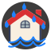

# Meteo Alerte Binding

The Meteo Alerte binding gives alert level regarding major weather related risk factors.
This binding provides its own icon set and provides appropriate static and dynamic SVG icons (see items examples below).

## Supported Things

There is exactly one supported thing type, which represents the weather alerts for a given department.
It has the `department` id.
Of course, you can add multiple things, e.g. for getting alerts for different locations.

## Binding Configuration

The binding has no configuration options, all configuration is done at Thing level.

## Thing Configuration

The thing has a few configuration parameters:

| Parameter     | Description                                                                            |
|---------------|----------------------------------------------------------------------------------------|
| `department` | Name of the department.                                                               |
| refresh       | Refresh interval in minutes. Optional, the default value is 1440 minutes (once a day). |

## Channels

The Météo Alerte information that are retrieved is available as these channels:

| Channel ID            | Item Type | Description                                   |
|-----------------------|-----------|-----------------------------------------------|
| observation-time      | DateTime  | Date and time of report validity start        |
| end-time              | DateTime  | Date and time of report validity end          |
| comment               | String    | General comments on alerts for the department |
| vent                  | Number    | Wind alert level (*)                          |
| pluie-inondation      | Number    | Rain alert level (*)                          |
| orage                 | Number    | Storm alert level (*)                         |
| inondation            | Number    | Flood alert level (*)                         |
| neige                 | Number    | Snow alert level (*)                          |
| canicule              | Number    | Heat alert level (*)                          |
| grand-froid           | Number    | Cold alert level (*)                          |
| avalanches            | Number    | Avalanche alert level (*)                     |
| vague-submersion      | Number    | Wave submersion alert level (*)               |
| pluie-inondation-icon | Image     | Pictogram of the Rain alert level             |
| vent-icon             | Image     | Pictogram of the Wind alert level             |
| orage-icon            | Image     | Pictogram of Storm alert level                |
| inondation-icon       | Image     | Pictogram of Flood alert level                |
| neige-icon            | Image     | Pictogram of Snow alert level                 |
| canicule-icon         | Image     | Pictogram of Heat alert level                 |
| grand-froid-icon      | Image     | Pictogram of Cold alert level                 |
| avalanches-icon       | Image     | Pictogram of Avalanche alert level            |
| vague-submersion-icon | Image     | Pictogram of Wave Submersion alert level      |

(*) Each alert level is described by a color :

| Code | Color  | Description                               |
|------|--------|-------------------------------------------|
| 0    | Green  | No particular vigilance                   |
| 1    | Yellow | Be attentive to the weather situation     |
| 2    | Orange | Be "very vigilant" in the concerned areas |
| 3    | Red    | Absolute vigilance required               |

## Provided icon set

This binding has its own IconProvider and makes available the following list of icons

| Icon Name                       | Dynamic | Illustration |
|---------------------------------|---------|--------------|
| oh:meteoalerte:vent             |   Yes   |  |
| oh:meteoalerte:pluie-inondation |   Yes   |  |
| oh:meteoalerte:orage            |   Yes   |  |
| oh:meteoalerte:inondation       |   Yes   |  |
| oh:meteoalerte:neige            |   Yes   |  |
| oh:meteoalerte:canicule         |   Yes   |  |
| oh:meteoalerte:grand-froid      |   Yes   |  |
| oh:meteoalerte:avalanches       |   Yes   |  |
| oh:meteoalerte:vague-submersion |   Yes   |  |
| oh:meteoalerte:meteo_france     |   No    |  |


## Full Example

meteoalert.things:

```java
Thing meteoalerte:department:yvelines @ "MyCity" [department="YVELINES", refresh=12]
```

meteoalert.items:

```java
Group gMeteoAlert "Alertes Météo" <oh:meteoalerte:meteo_france> 
String     MA_Dept78                  "Département 78 [%s]"       <text>                              (gMeteoAlert)   {channel="meteoalerte:department:yvelines:comment"}
Number     MA_etat_canicule           "Canicule [%s]"             <oh:meteoalerte:canicule>           (gMeteoAlert)   {channel="meteoalerte:department:yvelines:canicule"}
Number     MA_etat_grand_froid        "Grand Froid [%s]"          <oh:meteoalerte:grand-froid>        (gMeteoAlert)   {channel="meteoalerte:department:yvelines:grand-froid"}
Number     MA_etat_pluie_inondation   "Pluie-Inondation [%s]"     <oh:meteoalerte:pluie-inondation>   (gMeteoAlert)   {channel="meteoalerte:department:yvelines:pluie-inondation"}
Number     MA_etat_neige              "Neige [%s]"                <oh:meteoalerte:neige>              (gMeteoAlert)   {channel="meteoalerte:department:yvelines:neige"}
Number     MA_etat_vent               "Vent [%s]"                 <oh:meteoalerte:vent>               (gMeteoAlert)   {channel="meteoalerte:department:yvelines:vent"}
Number     MA_etat_inondation         "Inondation [%s]"           <oh:meteoalerte:inondation>         (gMeteoAlert)   {channel="meteoalerte:department:yvelines:inondation"}
Number     MA_etat_orage              "Orage [%s]"                <oh:meteoalerte:orage>              (gMeteoAlert)   {channel="meteoalerte:department:yvelines:orage"}
Number     MA_etat_avalanche          "Avalanches [%s]"           <oh:meteoalerte:avalanches>         (gMeteoAlert)   {channel="meteoalerte:department:yvelines:avalanches"}
    
Image      MA_icon_canicule           "Canicule"                  <oh:meteoalerte:canicule>           (gMeteoAlert)   {channel="meteoalerte:department:yvelines:canicule-icon"}
Image      MA_icon_grand_froid        "Grand Froid"               <oh:meteoalerte:grand-froid>        (gMeteoAlert)   {channel="meteoalerte:department:yvelines:grand-froid-icon"}
Image      MA_icon_pluie_inondation   "Pluie-Inondation"          <oh:meteoalerte:pluie-inondation>   (gMeteoAlert)   {channel="meteoalerte:department:yvelines:pluie-inondation-icon"}
Image      MA_icon_neige              "Neige"                     <oh:meteoalerte:neige>              (gMeteoAlert)   {channel="meteoalerte:department:yvelines:neige-icon"}
Image      MA_icon_vent               "Vent"                      <oh:meteoalerte:vent>               (gMeteoAlert)   {channel="meteoalerte:department:yvelines:vent-icon"}
Image      MA_icon_inondation         "Inondation"                <oh:meteoalerte:inondation>         (gMeteoAlert)   {channel="meteoalerte:department:yvelines:inondation-icon"}
Image      MA_icon_orage              "Orage"                     <oh:meteoalerte:orage>              (gMeteoAlert)   {channel="meteoalerte:department:yvelines:orage-icon"}
Image      MA_icon_avalanche          "Avalanche"                 <oh:meteoalerte:avalanches>         (gMeteoAlert)   {channel="meteoalerte:department:yvelines:avalanches-icon"}
    
DateTime   MA_ObservationTS           "Timestamp [%1$tH:%1$tM]"   <time>                              (gMeteoAlert)   {channel="meteoalerte:department:yvelines:observation-time"}

```
