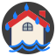

# Meteo France Binding

This binding provides information made available by Meteo France:

- Alert level regarding major weather related risk factors (`vigilance` Thing)
- Rain intensity forecasts (`rain-forecast`Thing)

This binding provides its own icon set and provides appropriate static and dynamic SVG icons (see items examples below).

## Discovery

Once a bridge with the API key has been created, appropriate departments can be auto discovered based on system location.

## Binding Configuration

The binding has no configuration options, all configuration is done at Bridge and Thing level.

## Bridge Configuration

The `api` bridge has only one configuration parameter :

| Parameter | Description                                           |
|-----------|-------------------------------------------------------|
| apikey    | Data-platform token to access the service. Mandatory. |

To obtain an API key, you must create an account on <https://portail-api.meteofrance.fr/web/fr/>
Inside the API Portal, create an application on "Bulletin Vigilance" and generate they API key (set duration to 0).

## Thing Configuration

The `vigilance` thing has these configuration parameters:

| Parameter  | Description                                                             |
|------------|-------------------------------------------------------------------------|
| department | Code of the department (two digits).                                    |
| refresh    | Refresh interval in minutes. Optional, the default value is 60 minutes. |

The `rain-forecast` thing has this configuration parameters:

| Parameter | Description                                                  |
|-----------|--------------------------------------------------------------|
| location  | Geo coordinates to be considered by the service.             |

## Channels for `vigilance`

The information that are retrieved is available as these channels:

| Channel ID            | Item Type | Description                                   |
|-----------------------|-----------|-----------------------------------------------|
| observation-time      | DateTime  | Date and time of report validity start        |
| end-time              | DateTime  | Date and time of report validity end          |
| comment               | String    | General comments on alerts for the department |
| vent                  | Number    | Wind alert level (*)                          |
| pluie-inondation      | Number    | Rain alert level (*)                          |
| orage                 | Number    | Storm alert level (*)                         |
| inondation            | Number    | Flood alert level (*)                         |
| neige                 | Number    | Snow alert level (*)                          |
| canicule              | Number    | Heat alert level (*)                          |
| grand-froid           | Number    | Cold alert level (*)                          |
| avalanches            | Number    | Avalanche alert level (*)                     |
| vague-submersion      | Number    | Wave submersion alert level (*)               |
| pluie-inondation-icon | Image     | Pictogram of the Rain alert level             |
| vent-icon             | Image     | Pictogram of the Wind alert level             |
| orage-icon            | Image     | Pictogram of Storm alert level                |
| inondation-icon       | Image     | Pictogram of Flood alert level                |
| neige-icon            | Image     | Pictogram of Snow alert level                 |
| canicule-icon         | Image     | Pictogram of Heat alert level                 |
| grand-froid-icon      | Image     | Pictogram of Cold alert level                 |
| avalanches-icon       | Image     | Pictogram of Avalanche alert level            |
| vague-submersion-icon | Image     | Pictogram of Wave Submersion alert level      |

(*) Each alert level has an associated color and description:

| Code | Color  | Description                               |
|------|--------|-------------------------------------------|
| 0    | Green  | No particular vigilance                   |
| 1    | Yellow | Be attentive to the weather situation     |
| 2    | Orange | Be "very vigilant" in the concerned areas |
| 3    | Red    | Absolute vigilance required               |

## Channels for `rain-forecast`

The information that are retrieved is available as these channels:

| Channel ID   | Item Type | Description              |
|--------------|-----------|--------------------------|
| update-time  | DateTime  | Observation Timestamp    |
| intensity    | Number    | Rain intensity level (*) |

(*) Rain intensity values and associated descriptions:

| Code | Description   |
|------|---------------|
| 0    | Dry Weather   |
| 1    | Light Rain    |
| 2    | Moderate Rain |
| 3    | Heavy Rain    |

## Provided icon set

This binding has its own IconProvider and makes available the following list of icons

| Icon Name                       | Dynamic | Illustration |
|---------------------------------|---------|--------------|
| oh:meteofrance:vent             |   Yes   |  |
| oh:meteofrance:pluie-inondation |   Yes   |  |
| oh:meteofrance:orage            |   Yes   |  |
| oh:meteofrance:inondation       |   Yes   |  |
| oh:meteofrance:neige            |   Yes   |  |
| oh:meteofrance:canicule         |   Yes   |  |
| oh:meteofrance:grand-froid      |   Yes   |  |
| oh:meteofrance:avalanches       |   Yes   |  |
| oh:meteofrance:vague-submersion |   Yes   |  |
| oh:meteofrance:meteo_france     |   No    |  |
| oh:meteofrance:intensity        |   Yes   |  |

## Full Example

meteoalert.things:

```java
Bridge meteofrance:api:local "Portail Météo-France" [ apikey="ey......FIjG1MIC9lmG5t6HygPAPg=="] {
    vigilance yvelines "Vigilance Météo" [ department="78" ]
    rain-forecast yvelines [ location="48.764207,2.05948" ]
}
```

meteoalert.items:

```java
Group gMeteoAlert "Alertes Météo" <oh:meteofrance:meteo_france> 
String     MA_Dept78                  "Département 78 [%s]"       <text>                              (gMeteoAlert)   {channel="meteofrance:department:yvelines:comment"}
Number     MA_etat_canicule           "Canicule [%s]"             <oh:meteofrance:canicule>           (gMeteoAlert)   {channel="meteofrance:department:yvelines:canicule"}
Number     MA_etat_grand_froid        "Grand Froid [%s]"          <oh:meteofrance:grand-froid>        (gMeteoAlert)   {channel="meteofrance:department:yvelines:grand-froid"}
Number     MA_etat_pluie_inondation   "Pluie-Inondation [%s]"     <oh:meteofrance:pluie-inondation>   (gMeteoAlert)   {channel="meteofrance:department:yvelines:pluie-inondation"}
Number     MA_etat_neige              "Neige [%s]"                <oh:meteofrance:neige>              (gMeteoAlert)   {channel="meteofrance:department:yvelines:neige"}
Number     MA_etat_vent               "Vent [%s]"                 <oh:meteofrance:vent>               (gMeteoAlert)   {channel="meteofrance:department:yvelines:vent"}
Number     MA_etat_inondation         "Inondation [%s]"           <oh:meteofrance:inondation>         (gMeteoAlert)   {channel="meteofrance:department:yvelines:inondation"}
Number     MA_etat_orage              "Orage [%s]"                <oh:meteofrance:orage>              (gMeteoAlert)   {channel="meteofrance:department:yvelines:orage"}
Number     MA_etat_avalanche          "Avalanches [%s]"           <oh:meteofrance:avalanches>         (gMeteoAlert)   {channel="meteofrance:department:yvelines:avalanches"}
    
Image      MA_icon_canicule           "Canicule"                  <oh:meteofrance:canicule>           (gMeteoAlert)   {channel="meteofrance:department:yvelines:canicule-icon"}
Image      MA_icon_grand_froid        "Grand Froid"               <oh:meteofrance:grand-froid>        (gMeteoAlert)   {channel="meteofrance:department:yvelines:grand-froid-icon"}
Image      MA_icon_pluie_inondation   "Pluie-Inondation"          <oh:meteofrance:pluie-inondation>   (gMeteoAlert)   {channel="meteofrance:department:yvelines:pluie-inondation-icon"}
Image      MA_icon_neige              "Neige"                     <oh:meteofrance:neige>              (gMeteoAlert)   {channel="meteofrance:department:yvelines:neige-icon"}
Image      MA_icon_vent               "Vent"                      <oh:meteofrance:vent>               (gMeteoAlert)   {channel="meteofrance:department:yvelines:vent-icon"}
Image      MA_icon_inondation         "Inondation"                <oh:meteofrance:inondation>         (gMeteoAlert)   {channel="meteofrance:department:yvelines:inondation-icon"}
Image      MA_icon_orage              "Orage"                     <oh:meteofrance:orage>              (gMeteoAlert)   {channel="meteofrance:department:yvelines:orage-icon"}
Image      MA_icon_avalanche          "Avalanche"                 <oh:meteofrance:avalanches>         (gMeteoAlert)   {channel="meteofrance:department:yvelines:avalanches-icon"}
    
DateTime   MA_ObservationTS           "Timestamp [%1$tH:%1$tM]"   <time>                              (gMeteoAlert)   {channel="meteofrance:department:yvelines:observation-time"}

Number     Intensite_Pluie          "Intensité Pluie"            <oh:meteofrance:intensity>           (gMeteoAlert)  {channel="meteofrance:rain-forecast:yvelines:intensity" }
```

jdbc.persist:

```java

Items {
   * : strategy = everyChange
   Intensite_Pluie : strategy = forecast
}


```
