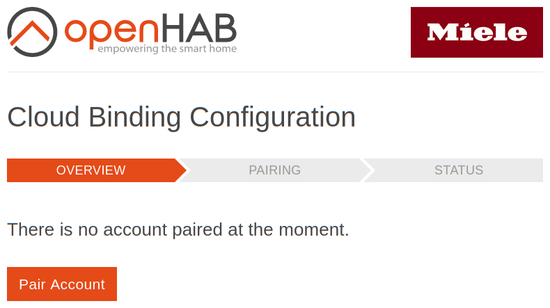
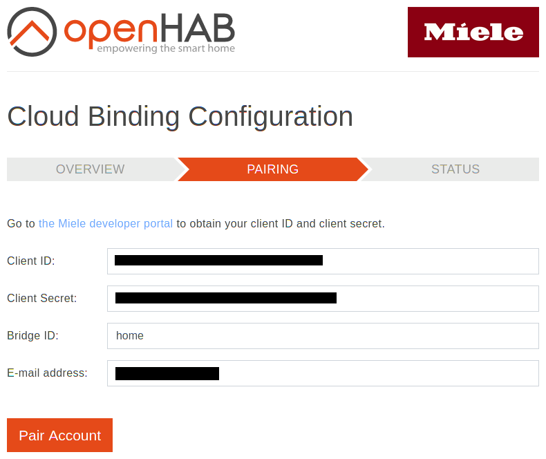
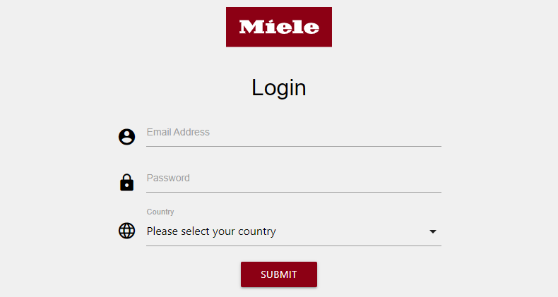
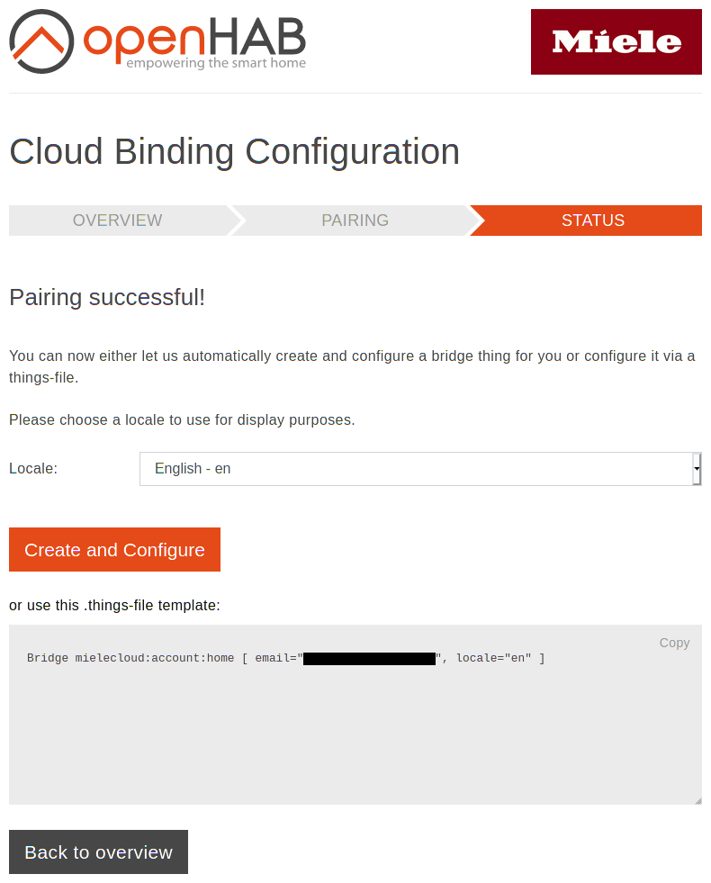
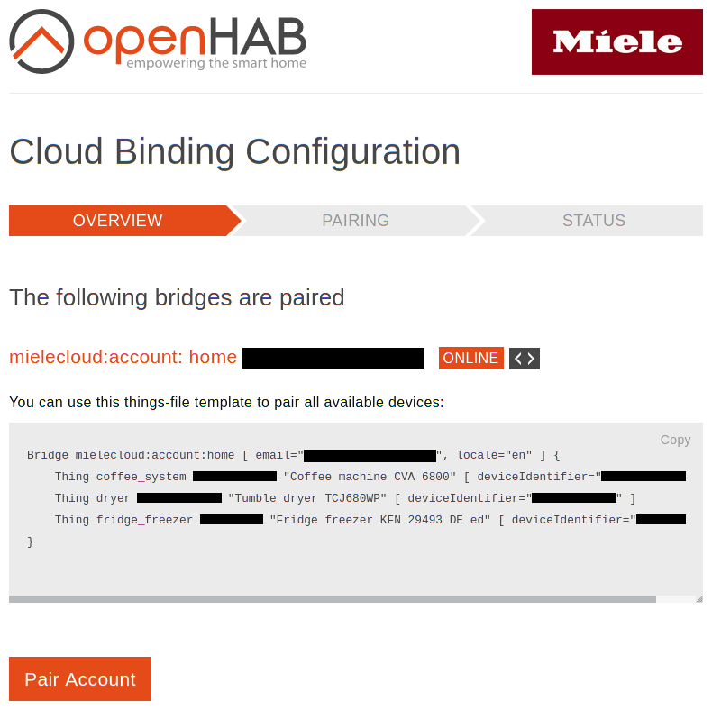

# Miele Cloud Binding


This binding integrates [Miele@home](https://www.miele.de/brand/smarthome-42801.htm) appliances via a cloud connection.
A Miele cloud account and a set of developer credentials is required to use the binding.
The latter can be requested from the [Miele Developer Portal](https://www.miele.com/f/com/en/register_api.aspx).

## Supported Things

Most Miele appliances that directly connect to the cloud via a Wi-Fi module are supported.
Appliances connecting to the XGW3000 gateway via ZigBee are also supported when registered with the cloud account.
However they might be better supported by the [gateway-based Miele binding](https://www.openhab.org/addons/bindings/miele/).
Depending on the age of your appliance the functionality of the binding might be limited.
Appliances from recent generations will support all functionality.

The following types of appliances are supported:

- Coffee Machine
- Dishwasher
- Dish Warmer
- Freezer
- Fridge
- Fridge-Freezer Combination
- Hob
- Hood
- Microwave Oven
- Oven
- Robotic Vacuum Cleaner
- Tumble Dryer
- Washer Dryer
- Washing Machine
- Wine Cabinet
- Wine Cabinet Freezer Combination

## Discovery

Please take the following steps prior to using the binding. Create a Miele cloud account in the Miele@mobile app for [Android](https://play.google.com/store/apps/details?id=de.miele.infocontrol&hl=en_US) or [iOS](https://apps.apple.com/de/app/miele-mobile/id930406907?l=en) (if not already done).
Afterwards, pair your appliances.
Once your appliances are set up, register at the [Miele Developer Portal](https://www.miele.com/f/com/en/register_api.aspx).
You will receive a pair of client ID and client secret which will be used to pair your Miele cloud account to the Miele cloud openHAB binding.
Keep these credentials to yourself and treat them like a password!
It may take some time until the registration e-mail arrives.

There is no auto discovery for the Miele cloud account.
The account is paired using OAuth2 with your Miele login and the developer credentials obtained from the [Miele Developer Portal](https://www.miele.com/f/com/en/register_api.aspx).
To pair the account go to the binding's configuration UI at `https://<your openHAB address>/mielecloud`.
For a standard openHABian Pi installation the address is [https://openhabianpi:8443/mielecloud](https://openhabianpi:8443/mielecloud).
Note that your browser will file a warning that the certificate is self-signed.
This is fine and you can safely continue.
It is also possible to use an unsecured connection for pairing but it is strongly recommended to use a secured connection because your credentials will otherwise be transferred without encryption over the local network.
For more information on this topic, see [Securing access to openHAB](https://www.openhab.org/docs/installation/security.html#encrypted-communication).
For a detailed walk through the account configuration, see [Account Configuration Example](#account-configuration-example).

Once a Miele account is paired, all supported appliances are automatically discovered as individual things and placed in the inbox.
They can then be paired with your favorite management UI.
As an alternative, the binding configuration UI provides a things-file template per paired account that can be used to pair the appliances.

## Thing Configuration

A Miele cloud account needs to be configured to get access to your appliances.
After that appliances can be configured.

### Account Configuration

The Miele cloud account must be paired via the binding configuration UI before a bridge that relies on it can be configured in openHAB.
For details on the configuration UI see [Discovery](#discovery) and [Account Configuration Example](#account-configuration-example).
The account serves as a bridge for the things representing your appliances.
On success the configuration assistant will directly configure the account without requiring further actions.
As an alternative, it provides a things-file template.

The account has the following parameters:

| Name        | Type      | Description                                                                                                                                                | Notes                                |
| ----------- | --------- | ---------------------------------------------------------------------------------------------------------------------------------------------------------- | ------------------------------------ |
| locale      | mandatory | The locale to use for full text channels of things from this account. Possible values are `en`, `de`, `da`, `es`, `fr`, `it`, `nl`, `nb`. Default is `en`. | Prior to the 7th January 2021 `da`, `es`, `fr`, `it`, `nl` and `nb` will default to English. |

Example things-file:

```
Bridge mielecloud:account:home [ locale="en" ]
```

### Appliance Configuration

The binding configuration UI will show a things-file template containing things for all supported appliances from the paired account.
This can be used as a starting point for a custom things-file.
All Miele cloud appliance things have no configuration parameters.

Example things-file:

```
Bridge mielecloud:account:home [ locale="en" ] {
    Thing coffee_system 000703261234 "Coffee machine CVA7440" [ ]
    Thing hob 000160102345 "Cooktop KM7677" [ ]
    Thing washing_machine 000148503456 "Washing Machine WWV980" [ ]
    Thing oven 000137434567 "Oven" [ ]
    Thing fridge 007109235678 "Refrigerator K34483" [ ]
    Thing dishwasher 000159456789 "Dishwasher G5000" [ ]
    Thing fridge_freezer 711397890 "Fridge-freezer" [ ]
    Thing dryer 000091098901 "Dryer" [ ]
}
```

## Channels

The following table lists all available channels.
See the following chapters for detailed information about which appliance supports which channels.
Depending on the exact appliance configuration not all channels might be supported, e.g. a hob with four plates will only fill the channels for plates 1-4.
Channel ID and channel type ID match unless noted.

| Channel Type ID               | Item Type            | Description                                                                                                                               | Read only |
| ----------------------------- | -------------------- | ----------------------------------------------------------------------------------------------------------------------------------------- | --------- |
| remote_control_can_be_started | Switch | Indicates if this device can be started remotely. | Yes |
| remote_control_can_be_stopped | Switch | Indicates if this device can be stopped remotely. | Yes |
| remote_control_can_be_paused | Switch | Indicates if this device can be paused remotely. | Yes |
| remote_control_can_be_switched_on | Switch | Indicates if the device can be switched on remotely. | Yes |
| remote_control_can_be_switched_off | Switch | Indicates if the device can be switched off remotely. | Yes |
| remote_control_can_set_program_active | Switch | Indicates if the active program of the device can be set remotely. | Yes |
| spinning_speed | String | The spinning speed of the active program. | Yes |
| spinning_speed_raw | Number | The raw spinning speed of the active program. | Yes |
| program_active | String | The active program of the device. | Yes |
| program_active_raw | Number | The raw active program of the device. | Yes |
| dish_warmer_program_active | String | The active program of the device. | No |
| vacuum_cleaner_program_active | String | The active program of the device. | No |
| program_phase | String | The phase of the active program. | Yes |
| program_phase_raw | Number | The raw phase of the active program. | Yes |
| operation_state | String | The operation state of the device. | Yes |
| operation_state_raw | Number | The raw operation state of the device. | Yes |
| program_start | Switch | Starts the currently selected program. | No |
| program_stop | Switch | Stops the currently selected program. | No |
| program_start_stop | String | Starts or stops the currently selected program. | No |
| program_start_stop_pause | String | Starts, stops or pauses the currently selected program. | No |
| power_state_on_off | String | Switches the device On or Off. | No |
| finish_state | Switch | Indicates whether the most recent program finished. | Yes |
| delayed_start_time | Number | The delayed start time of the selected program. | Yes |
| program_remaining_time | Number | The remaining time of the active program. | Yes |
| program_elapsed_time | Number | The elapsed time of the active program. | Yes |
| program_progress | Number | The progress of the active program. | Yes |
| drying_target | String | The target drying step of the laundry. | Yes |
| drying_target_raw | Number | The raw target drying step of the laundry. | Yes |
| pre_heat_finished | Switch | Indicates whether the pre-heating finished. | Yes |
| temperature_target | Number | The target temperature of the device. | Yes |
| temperature_current | Number | The currently measured temperature of the device. | Yes |
| ventilation_power | String | The current ventilation power of the hood. | Yes |
| ventilation_power_raw | Number | The current raw ventilation power of the hood. | Yes |
| error_state | Switch | Indication flag which signals an error state for the device. | Yes |
| info_state | Switch | Indication flag which signals an information of the device. | Yes |
| fridge_super_cool | Switch | Start the super cooling mode of the fridge. | No |
| freezer_super_freeze | Switch | Start the super freezing mode of the freezer. | No |
| super_cool_can_be_controlled | Switch | Indicates if super cooling can be toggled. | Yes |
| super_freeze_can_be_controlled | Switch | Indicates if super freezing can be toggled | Yes |
| fridge_temperature_target | Number | The target temperature of the fridge. | Yes |
| fridge_temperature_current | Number | The currently measured temperature of the fridge. | Yes |
| freezer_temperature_target | Number | The target temperature of the freezer. | Yes |
| freezer_temperature_current | Number | The currently measured temperature of the freezer. | Yes |
| top_temperature_target | Number | The target temperature of the top area. | Yes |
| top_temperature_current | Number | The currently measured temperature of the top area. | Yes |
| middle_temperature_target | Number | The target temperature of the middle area. | Yes |
| middle_temperature_current | Number | The currently measured temperature of the middle area. | Yes |
| bottom_temperature_target | Number | The target temperature of the bottom area. | Yes |
| bottom_temperature_current | Number | The currently measured temperature of the bottom area. | Yes |
| light_switch | Switch | Indicates if the light of the device is enabled. | No |
| light_can_be_controlled | Switch | Indicates if the light of the device can be controlled. | Yes |
| plate_power_step | String | The power level of the heating plate. | Yes |
| plate_power_step_raw | Number | The raw power level of the heating plate. | Yes |
| door_state | Switch | Indicates if the door of the device is open. | Yes |
| door_alarm | Switch | Indicates if the door alarm of the device is active. | Yes |
| battery_level | Number | The battery level of the robotic vacuum cleaner. | Yes |

### Coffee System

- remote_control_can_be_started
- remote_control_can_be_stopped
- remote_control_can_be_switched_on
- remote_control_can_be_switched_off
- program_active
- program_active_raw
- program_phase
- program_phase_raw
- operation_state
- operation_state_raw
- finish_state
- power_state_on_off
- program_remaining_time
- program_elapsed_time
- error_state
- info_state
- light_switch
- light_can_be_controlled

### Dish Warmer

- remote_control_can_be_switched_on
- remote_control_can_be_switched_off
- dish_warmer_program_active
- program_active_raw
- operation_state
- operation_state_raw
- power_state_on_off
- finish_state
- program_remaining_time
- program_elapsed_time
- program_progress
- temperature_target
- temperature_current
- error_state
- info_state
- door_state

### Dishwasher

- remote_control_can_be_started
- remote_control_can_be_stopped
- remote_control_can_be_switched_on
- remote_control_can_be_switched_off
- program_active
- program_active_raw
- program_phase
- program_phase_raw
- operation_state
- operation_state_raw
- program_start_stop
- finish_state
- power_state_on_off
- delayed_start_time
- program_remaining_time
- program_elapsed_time
- program_progress
- error_state
- info_state
- door_state

### Tumble Dryer

- remote_control_can_be_started
- remote_control_can_be_stopped
- remote_control_can_be_switched_on
- remote_control_can_be_switched_off
- program_active
- program_active_raw
- program_phase
- program_phase_raw
- operation_state
- operation_state_raw
- program_start_stop
- finish_state
- power_state_on_off
- delayed_start_time
- program_remaining_time
- program_elapsed_time
- program_progress
- drying_target
- drying_target_raw
- error_state
- info_state
- light_switch
- light_can_be_controlled
- door_state

### Freezer

- operation_state
- operation_state_raw
- error_state
- info_state
- freezer_super_freeze
- super_freeze_can_be_controlled
- freezer_temperature_target
- freezer_temperature_current
- door_state
- door_alarm

### Fridge

- operation_state
- operation_state_raw
- error_state
- info_state
- fridge_super_cool
- super_cool_can_be_controlled
- fridge_temperature_target
- fridge_temperature_current
- door_state
- door_alarm

### Fridge Freezer

- operation_state
- operation_state_raw
- error_state
- info_state
- fridge_super_cool
- freezer_super_freeze
- super_cool_can_be_controlled
- super_freeze_can_be_controlled
- fridge_temperature_target
- fridge_temperature_current
- freezer_temperature_target
- freezer_temperature_current
- door_state
- door_alarm

### Hob

- operation_state
- operation_state_raw
- error_state
- info_state
- plate_1_power_step to plate_6_power_step with channel type ID plate_power_step
- plate_1_power_step_raw to plate_6_power_step_raw with channel type ID plate_power_step_raw

### Hood

- remote_control_can_be_started
- remote_control_can_be_stopped
- remote_control_can_be_switched_on
- remote_control_can_be_switched_off
- program_phase
- program_phase_raw
- operation_state
- operation_state_raw
- power_state_on_off
- ventilation_power
- ventilation_power_raw
- error_state
- info_state
- light_switch
- light_can_be_controlled

### Oven

- remote_control_can_be_started
- remote_control_can_be_stopped
- remote_control_can_be_switched_on
- remote_control_can_be_switched_off
- program_active
- program_active_raw
- program_phase
- program_phase_raw
- operation_state
- operation_state_raw
- program_start_stop
- finish_state
- power_state_on_off
- delayed_start_time
- program_remaining_time
- program_elapsed_time
- program_progress
- pre_heat_finished
- temperature_target
- temperature_current
- error_state
- info_state
- light_switch
- light_can_be_controlled
- door_state

### Robotic Vacuum Cleaner

- remote_control_can_be_started
- remote_control_can_be_stopped
- remote_control_can_be_paused
- remote_control_can_set_program_active
- vacuum_cleaner_program_active
- program_active_raw
- operation_state
- operation_state_raw
- finish_state
- program_start_stop_pause
- power_state_on_off
- error_state
- info_state
- battery_level

### Washer Dryer

- remote_control_can_be_started
- remote_control_can_be_stopped
- remote_control_can_be_switched_on
- remote_control_can_be_switched_off
- spinning_speed
- spinning_speed_raw
- program_active
- program_active_raw
- program_phase
- program_phase_raw
- operation_state
- operation_state_raw
- program_start_stop
- finish_state
- power_state_on_off
- delayed_start_time
- program_remaining_time
- program_elapsed_time
- program_progress
- drying_target
- drying_target_raw
- error_state
- info_state
- temperature_target
- light_switch
- light_can_be_controlled
- door_state

### Washing Machine

- remote_control_can_be_started
- remote_control_can_be_stopped
- remote_control_can_be_switched_on
- remote_control_can_be_switched_off
- spinning_speed
- spinning_speed_raw
- program_active
- program_active_raw
- program_phase
- program_phase_raw
- operation_state
- operation_state_raw
- program_start_stop
- finish_state
- power_state_on_off
- delayed_start_time
- program_remaining_time
- program_elapsed_time
- program_progress
- error_state
- info_state
- temperature_target
- light_switch
- light_can_be_controlled
- door_state

### Wine Storage

- remote_control_can_be_started
- remote_control_can_be_stopped
- remote_control_can_be_switched_on
- remote_control_can_be_switched_off
- operation_state
- operation_state_raw
- power_state_on_off
- error_state
- info_state
- temperature_target
- temperature_current
- top_temperature_target
- top_temperature_current
- middle_temperature_target
- middle_temperature_current
- bottom_temperature_target
- bottom_temperature_current

### Note on plate_is_present and plate_power_step channels

The `plate_x_is_present` channels show whether a plate is present on an appliance.
The plate numbers do not represent the physical layout of the plates on the appliance, but always start with the `plate_1_is_present` channel.
This means that a hob with two plates will have `plate_1_is_present` and `plate_2_is_present` active and all other `plate_x_is_present` channels inactive.

The `plate_x_power_step` channels show the current power step of the according plate.
**Please note that different hobs may use dynamic numbering for plates.**
Hobs that use dynamic numbering will use the first power step channel that is currently at a power step of zero when the plate is turned on.
Additionally, when a plate is turned off all other plates with higher numbers will decrease their number by one.
For example if plate 1, 2 and 3 are active and plate 1 is turned off then plate 2 will become plate 1, plate 3 will become plate 2 and plate 3 will have a power step of zero.
This behavior is a fixed part of the affected appliances and cannot be changed.

### Note on door_state channel

The `door_state` channel might not always provide a value matching the actual state.
For example, a washing machine will not provide a valid `door_state` when the appliance is turned off.
A valid door state can be expected when the appliance is in one of the following raw operation states, compare the `operation_state_raw` channel:

- `3`: Program selected
- `4`: Program selected, waiting to start
- `5`: Running
- `6`: Paused

## Properties

The following chapters list the properties offered by appliances.

### Common Properties

| Property Name | Description                                                                   |
| ------------- | ----------------------------------------------------------------------------- |
| serialNumber  | Serial number of the appliance, only present for physical appliances          |
| modelId       | Model ID of the appliance                                                     |
| vendor        | Always "Miele"                                                                |

### Account

| Property Name | Description                                                                   |
| ------------- | ----------------------------------------------------------------------------- |
| connection    | Type of connection used by the account, always "INTERNET"                     |
| accessToken   | The currently used OAuth 2 access token for accessing the Miele 3rd Party API |

### Hob

| Property Name | Description                                                                   |
| ------------- | ----------------------------------------------------------------------------- |
| plateCount    | Number of plates offered by the appliance                                     |

## Full Example

### demo.things:

```
Bridge mielecloud:account:home [ locale="en" ] {
    Thing coffee_system 000703261234 "Coffee machine CVA7440" [ ]
    Thing hob 000160102345 "Cooktop KM7677" [ ]
}
```

### demo.items:

```
// Coffee system
Switch coffee_system_remote_control_can_be_started      { channel="mielecloud:coffee_system:home:000703261234:remote_control_can_be_started" }
Switch coffee_system_remote_control_can_be_stopped      { channel="mielecloud:coffee_system:home:000703261234:remote_control_can_be_stopped" }
Switch coffee_system_remote_control_can_be_switched_on  { channel="mielecloud:coffee_system:home:000703261234:remote_control_can_be_switched_on" }
Switch coffee_system_remote_control_can_be_switched_off { channel="mielecloud:coffee_system:home:000703261234:remote_control_can_be_switched_off" }
String coffee_system_program_active                     { channel="mielecloud:coffee_system:home:000703261234:program_active" }
String coffee_system_program_phase                      { channel="mielecloud:coffee_system:home:000703261234:program_phase" }
String coffee_system_power_state_on_off                 { channel="mielecloud:coffee_system:home:000703261234:power_state_on_off" }
String coffee_system_operation_state                    { channel="mielecloud:coffee_system:home:000703261234:operation_state" }
Switch coffee_system_finish_state                       { channel="mielecloud:coffee_system:home:000703261234:finish_state" }
Number coffee_system_program_remaining_time             { channel="mielecloud:coffee_system:home:000703261234:program_remaining_time" }
Switch coffee_system_error_state                        { channel="mielecloud:coffee_system:home:000703261234:error_state" }
Switch coffee_system_info_state                         { channel="mielecloud:coffee_system:home:000703261234:info_state" }
Switch coffee_system_light_switch                       { channel="mielecloud:coffee_system:home:000703261234:light_switch" }
Switch coffee_system_light_can_be_controlled            { channel="mielecloud:coffee_system:home:000703261234:light_can_be_controlled" }

// Hob
Switch hob_remote_control_can_be_started { channel="mielecloud:hob:home:000160102345:remote_control_can_be_started" }
Switch hob_remote_control_can_be_stopped { channel="mielecloud:hob:home:000160102345:remote_control_can_be_stopped" }
String hob_operation_state               { channel="mielecloud:hob:home:000160102345:operation_state" }
Switch hob_error_state                   { channel="mielecloud:hob:home:000160102345:error_state" }
Switch hob_info_state                    { channel="mielecloud:hob:home:000160102345:info_state" }
Switch hob_plate_1_is_present            { channel="mielecloud:hob:home:000160102345:plate_1_is_present" }
String hob_plate_1_power_step            { channel="mielecloud:hob:home:000160102345:plate_1_power_step" }
Switch hob_plate_2_is_present            { channel="mielecloud:hob:home:000160102345:plate_2_is_present" }
String hob_plate_2_power_step            { channel="mielecloud:hob:home:000160102345:plate_2_power_step" }
Switch hob_plate_3_is_present            { channel="mielecloud:hob:home:000160102345:plate_3_is_present" }
String hob_plate_3_power_step            { channel="mielecloud:hob:home:000160102345:plate_3_power_step" }
Switch hob_plate_4_is_present            { channel="mielecloud:hob:home:000160102345:plate_4_is_present" }
String hob_plate_4_power_step            { channel="mielecloud:hob:home:000160102345:plate_4_power_step" }
Switch hob_plate_5_is_present            { channel="mielecloud:hob:home:000160102345:plate_5_is_present" }
String hob_plate_5_power_step            { channel="mielecloud:hob:home:000160102345:plate_5_power_step" }
Switch hob_plate_6_is_present            { channel="mielecloud:hob:home:000160102345:plate_6_is_present" }
String hob_plate_6_power_step            { channel="mielecloud:hob:home:000160102345:plate_6_power_step" }
```

### demo.sitemap:

```
sitemap demo label="Kitchen"
{
    Frame {
        // Coffee system
        Text    item=coffee_system_program_active
        Text    item=coffee_system_program_phase
        Text    item=coffee_system_power_state_on_off
        Text    item=coffee_system_operation_state
        Switch  item=coffee_system_finish_state
        Default item=coffee_system_program_remaining_time
        Switch  item=coffee_system_error_state
        Switch  item=coffee_system_info_state
        Switch  item=coffee_system_light_switch

        // Hob
        Text   item=hob_operation_state
        Switch item=hob_error_state
        Switch item=hob_info_state
        Text   item=hob_plate_1_power_step
        Text   item=hob_plate_2_power_step
        Text   item=hob_plate_3_power_step
        Text   item=hob_plate_4_power_step
        Text   item=hob_plate_5_power_step
        Text   item=hob_plate_6_power_step
    }
}
```

## Account Configuration Example

The configuration UI is accessible at `https://<your openHAB address>/mielecloud`.
See [Discovery](#discovery) for a detailed description of how to open the configuration UI in a browser.

When first opening the configuration UI no account will be paired.



We strongly recommend to use a secure connection for pairing, details on this topic can also be found in the [Discovery](#discovery) section.
Click `Pair Account` to start the pairing process.
If not already done, go to the [Miele Developer Portal](https://www.miele.com/f/com/en/register_api.aspx), register there and wait for the confirmation e-mail.
Obtain your client ID and client secret according to the instructions presented there.
Once you obtained your client ID and client secret continue pairing by filling in your client ID, client secret and bridge ID.
You may choose any bridge ID you like as long as you only use letters, numbers, underscores and dashes.
The bridge ID entered here will become part of the thing UID of the paired account and cannot be changed later.
If you want to change the bridge ID you will need to remove the bridge and pair it again with the new bridge ID.



A click on `Pair Account` will take you to the Miele cloud service login form where you need to log in with the same account as you used for the Miele@mobile app.



When this is the first time you pair an account, you will need to allow openHAB to access your account.

When everything worked, you are presented with a page stating that pairing was successful.
Select the locale which should be used to display localized texts in openHAB channels.
Note that there is currently an issue with the endpoint of the Miele cloud service which is used by the binding that prevents the locale setting from functioning correctly.
This will be fixed in the future.
From here, you have two options:
Either let the binding automatically configure a bridge instance or copy the presented things-file template to a things file and return to the overview page.
We recommend the former for reasons outlined under [Account Configuration](#account-configuration).



Once the bridge instance is `ONLINE`, you can either pair things for all appliances via your favorite management UI or use a things-file.
The account overview provides a things-file template that is shown when you expand the account.
This can serve as a starting point for your own things-file.



## Rule Ideas

Here are some ideas on what could be done with this binding. You have more ideas or even an example? Great! Feel free to contribute!

- Notify yourself of a finished dishwasher, tumble dryer, washer dryer or washing machine, e.g. by changing the lighting
- Control the supercooler / superfreezer of your freezer, fridge or fridge-freezer combination with a voice assistant
- Notify yourself when the oven has finished pre-heating

## Acknowledgements

The development of this binding was initiated and sponsored by Miele & Cie. KG.

