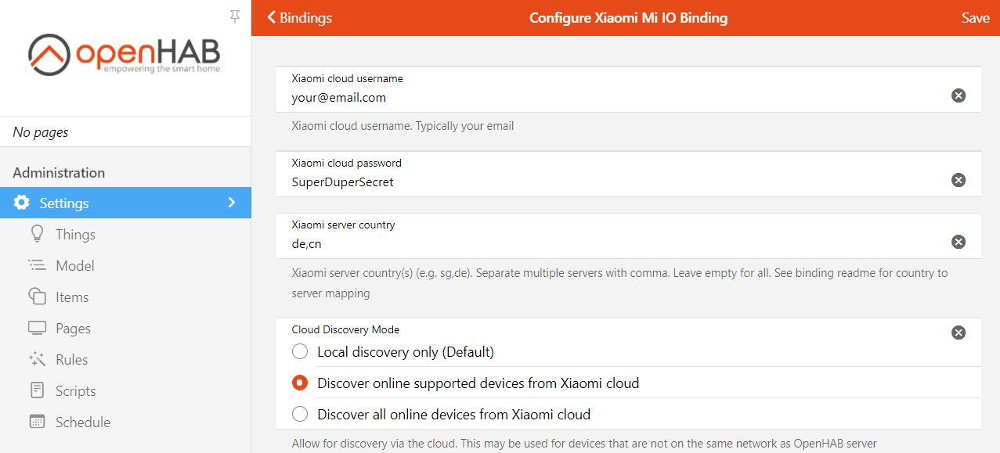

# Xiaomi Wifi devices (Mi IO) Binding

This binding is used to control Xiaomi products implementing the Mi IO protocol.
This protocol is used for most of Xiaomi Mi Ecosystem wifi devices which is branded as MiJia.
If your Xiaomi wifi device is controlled by the mihome app, most likely it communicates using the Mi IO protocol and can communicate with openHAB using this binding.


## Supported Things

The following things types are available:

| ThingType        | Description                                                                                                              |
|------------------|--------------------------------------------------------------------------------------------------------------------------|
| miio:generic     | Generic type for discovered devices. Once the token is available and the device model is determined, this ThingType will automatically change to the appropriate ThingType |
| miio:vacuum      | For Xiaomi/RoboRock Robot Vacuum products                                                                                         |
| miio:basic       | For most other devices like yeelights, airpurifiers. Channels and commands are determined by database configuration   |
| miio:gateway     | Similar to basic, but with the Bridge feature, it can support to forward commands for connected devices                  |
| miio:lumi        | Thing type for subdevices connected to the gateway. Note, these devices require a defined gateway to function            |
| miio:unsupported | For experimenting with other devices which use the Mi IO protocol or to build experimental support                                                       |

# Discovery

The binding has 2 methods for discovering devices. Depending on your network setup and the device model, your device may be discovered by one or both methods. If both methods discover your device, 2 discovery results may be in your inbox for the same device.

The mDNS discovery method will discover your device type, but will not discover a (required) token.
The basic discovery will not discovery the type, but will discover a token for models that support it.
Accept only one of the 2 discovery results, the alternate one can further be ignored.

## Tokens

The binding needs a token from the Xiaomi Mi Device in order to be able to control it.
The binding can retrieve the needed tokens from the Xiaomi cloud.
Go to the binding config page and enter your cloud username and password.
The server(s) to which your devices are connected need to be entered as well.
Use the one of the regional servers: cn,de,i2,tw,ru,sg,us.
Multiple servers can be separated with comma, or leave blank to test all known servers.
See [binding configuration](#binding-configuration) for more details about the binding config.

## Tokens without cloud access

Some devices provide the token upon discovery. This may depends on the firmware version.
If the device does not discover your token, it needs to be retrieved from the Mi Home app.

The easiest way to obtain tokens is to browse through log files of the Mi Home app version 5.4.49 for Android.
It seems that version was released with debug messages turned on by mistake.
An APK file with the old version can be easily found using one of the popular web search engines.
After downgrading use a file browser to navigate to directory SmartHome/logs/plug_DeviceManager, then open the most recent file and search for the token. When finished, use Google Play to get the most recent version back.

For iPhone, use an un-encrypted iTunes-Backup and unpack it and use a sqlite tool to view the files in it:
Then search in "RAW, com.xiaomi.home," for "USERID_mihome.sqlite" and look for the 32-digit-token or 96 digit encrypted token.

Note. The Xiaomi devices change the token when inclusion is done. Hence if you get your token after reset and than include it with the Mi Home app, the token will change.

## Binding Configuration

No binding configuration is required. However to enable cloud functionality enter your Xiaomi username, password and server(s).
The list of the known countries and related severs is [here](#country-servers).

After successful Xiaomi cloud login, the binding will use the connection to retrieve the required device tokens from the cloud.
For Xiaomi vacuums the map can be visualized in openHAB using the cloud connection.

To enter your cloud details go to the bindings page, click the Xiaomi Mi IO binding and than configure.


In the configuration page, enter your userID /passwd and county(s) or leave the countries servers blank.


The binding also supports the discovery of devices via the cloud. This may be useful if the device is on a separate subnet. (note, after accepting such a device on a different subnet, the communication needs to be set to cloud in order to have it working.)

## Thing Configuration

Each Xiaomi device (thing) needs the IP address and token configured to be able to communicate. See discovery for details.
Optional configuration is the refresh interval and the deviceID. Note that the deviceID is automatically retrieved when it is left blank.
The configuration for model is automatically retrieved from the device in normal operation.
However, for devices that are unsupported, you may override the value and try to use a model string from a similar device to experimentally use your device with the binding.

| Parameter       | Type    | Required | Description                                                         |
|-----------------|---------|----------|---------------------------------------------------------------------|
| host            | text    | true     | Device IP address                                                   |
| token           | text    | true     | Token for communication (in Hex)                                    |
| deviceId        | text    | true     | Device Id (typically a number for normal devices) for communication |
| model           | text    | false    | Device model string, used to determine the subtype                  |
| refreshInterval | integer | false    | Refresh interval for refreshing the data in seconds. (0=disabled)   |
| timeout         | integer | false    | Timeout time in milliseconds                                        |
| communication   | text    | false    | Communicate direct or via cloud (options values: 'direct', 'cloud') |
| cloudServer     | text    | false    | Identifies the country server to use in case of cloud communication |

Note: Suggest to use the cloud communication only for devices that require it.
It is unknown at this time if Xiaomi has a rate limit or other limitations on the cloud usage. e.g. if having many devices would trigger some throttling from the cloud side.
Note2: communications parameter is not available for lumi devices. Lumi devices communicate using the bridge/gateway.

### Example Thing file

`Thing miio:basic:light "My Light" [ host="192.168.x.x", token="put here your token", deviceId="326xxxx", model="philips.light.bulb", communication="direct" ]`

or in case of unknown models include the model information of a similar device that is supported:

`Thing miio:vacuum:s50 "vacuum" @ "livingroom" [ host="192.168.15.20", token="xxxxxxx", deviceId="326xxxx", model="roborock.vacuum.s4", communication="direct", cloudServer="de" ]`

in case of gateway, instead of defining it as a Thing, use Bridge

`Bridge miio:gateway:lumigateway "Mi Smarter Gateway" [ host="10.10.x.x", token="put here your token", deviceId="326xxxx", model="lumi.gateway.mieu01", communication="direct", cloudServer="de" ]`

# Advanced: Unsupported devices

Newer devices may not yet be supported.
However, many devices share large similarities with existing devices.
The binding allows to try/test if your new device is working with database files of older devices as well.

There are 2 ways to get unsupported devices working, by overriding the model with the model of a supported item or by test all known properties to see which are supported by your device.

## Substitute model for unsupported devices

Replace the model with the model which is already supported.
For this, first remove your unsupported thing. Manually add a miio:basic thing.
Besides the regular configuration (like ip address, token) the modelId needs to be provided.
Normally the modelId is populated with the model of your device, however in this case, use the modelId of a similar device.
Look at the openHAB forum, or the openHAB GitHub repository for the modelId of similar devices.

## Supported property test for unsupported devices

The unsupported device has a test channel with switch. When switching on, all known properties are tested, this may take few minutes.
A test report will be shown in the log and is saved in the `userdata/miio` folder with a filename `test-[your model]-[timestamp].txt`.
If supported properties are found, an experimental database file is saved to the conf/misc/miio folder (see below chapter).
The thing will go offline and will come back online as basic device, supporting the found channels.
The database file may need to be modified to display the right channel names.
After validation, please share the logfile and json files on the openHAB forum or the openHAB GitHub to build future support for this model.

## Advanced: adding local database files to support new devices

Things using the basic handler (miio:basic things) are driven by json 'database' files.
This instructs the binding which channels to create, which properties and actions are associated with the channels etc.
The conf/misc/miio (e.g. in Linux `/opt/openhab/conf/misc/miio/`) is scanned for database files and will be used for your devices.
During the start of the binding the exact path used in your system will be printed in the _debug_ log.
Watch for a line containing `Started miio basic devices local databases watch service. Watching for database files at path: …` (
If this folder is created after the start of the binding, you may need to restart the binding (or openHAB) to be able to use the local files.
Note that local database files take preference over build-in ones, hence if a json file is local and in the database the local file will be used.
For format, please check the current database files in openHAB GitHub.

# FAQ.. what to do in case of problems

If your device is not getting online:

_Are you using text config?_
Make sure you define all the fields as per above example.
Or, better, try to get it going first without text config.

_The token is wrong_
The most common cause of non responding devices is a wrong token.
When you reset, or change wifi or update firmware, and possibly other cases as well, the token may change. You'll need to get a refreshed token.

_My token is coming from the cloud... how can it be wrong?_
Is not very likely but still can happen._
This can happen e.g. if your device is defined on multiple country servers.
The binding may pull the token from the wrong country server.
First try to get the token from all country servers by leave the county setting empty.
If that does not solve it, you define only the country that the device is on in the binding config page (where the cloud userid/pwd is entered) this should pull the right token.

_You have the same device added multiple times._
The communication each time send a sequential number.
If the device is twice defined, the numbers received by the device are no longer sequential and it will stop responding for some time.

_The connection is not too good, so you have timeouts etc._
Position your device closer to wifi / check in the mihome app if the wifi strength is good enough.
Alternatively as described above, double check for multiple connections for single device.

_Your device is on a different subnet?_
This is in most cases not working.
Firmware of the device don't accept commands coming from other subnets.
Set the communication in the thing configuration to 'cloud'.

_Cloud connectivity is not working_
The most common problem is a wrong or missing userId/password. Update your Xiaomi cloud userId & password in the [miio binding configuration screen](#binding-configuration).
If the problem persists you can try the following:

- Xiaomi Account verification might be needed. For some users login by the binding is unsuccessful as account verification is required, but the binding currently has no possibilities to handle this.
In order to pass validation your (openHAB server) ip need to be validated/confirmed.
Browse to [https://account.xiaomi.com/](https://account.xiaomi.com/) and logon to your account. Note: use the same external ip address as your openHAB server, e.g.  you may need to disable your VPN.
- If above is not possible or fails, You can try to find in the binding debug logging a `location url`. Try to login using this url (just after it fails) with your browser.
- Several users also reported success by resetting their Xiaomi password.

If it still fails, you're bit out of luck. You may try to restart openHAB (not just the binding) to clean the cookies.
As the cloud logon process is still little understood, your only luck might be to enable trace logging and see if you can translate the Chinese error code that it returns.

_My Roborock vacuum is not found or not reacting_
Did you link the vacuum with the Roborock app?
This won't work, the Roborock app is using a different communication method.
Reset your vacuum and connect it to the Xiaomi MiHome app.
This will change the communication method and the Mi IO binding can communicate with the vacuum.

# Mi IO Devices

!!!devices
note: Supported means we received feedback from users this device is working with the binding.
For devices with experimental support, we did not yet confirmation that channels are correctly working.
Please feedback your findings for these devices (e.g. Are all channels working, do they contain the right information, is controlling the devices working etc.)

## Channels

Depending on the device, different channels are available.

All devices have available the following channels (marked as advanced) besides the device specific channels

| Channel          | Type    | Description                         |
|------------------|---------|-------------------------------------|
| network#ssid     | String  | Network SSID                        |
| network#bssid    | String  | Network BSSID                       |
| network#rssi     | Number  | Network RSSI                        |
| network#life     | Number  | Network Life                        |
| actions#commands | String  | send commands direct. see below     |
| actions#rpc      | String  | send commands via cloud. see below  |

note: the ADVANCED  `actions#commands` and `actions#rpc` channels can be used to send commands that are not automated via the binding. This is available for all devices
e.g. `openhab:send actionCommand 'upd_timer["1498595904821", "on"]'` would enable a pre-configured timer. See <https://github.com/marcelrv/XiaomiRobotVacuumProtocol> for all known available commands.

### Robo Rock vacuum Channels

| Type    | Channel                           | Description                |
|---------|-----------------------------------|----------------------------|
| Number  | status#segment_status             | Segment Status             |
| Number  | status#map_status                 | Map Box Status             |
| Number  | status#led_status                 | Led Box Status             |
| String  | info#carpet_mode                  | Carpet Mode details        |
| String  | info#fw_features                  | Firmware Features          |
| String  | info#room_mapping                 | Room Mapping details       |
| String  | info#multi_maps_list              | Maps Listing details       |

Additionally depending on the capabilities of your robot vacuum other channels may be enabled at runtime

| Type    | Channel                           | Description                |
|---------|-----------------------------------|----------------------------|
| Switch  | status#water_box_status           | Water Box Status           |
| Switch  | status#lock_status                | Lock Status                |
| Number  | status#water_box_mode             | Water Box Mode             |
| Switch  | status#water_box_carriage_status  | Water Box Carriage Status  |
| Switch  | status#mop_forbidden_enable       | Mop Forbidden              |
| Switch  | status#is_locating                | Robot is locating          |
| Number  | actions#segment                   | Room Clean  (enter room #) |

Note: cleaning map is only available with cloud access.

There are several advanced channels, which may be useful in rules (e.g. for individual room cleaning etc)
In case your vacuum does not support one of these commands, it will show "unsupported_method" for string channels or no value for numeric channels.

### Advanced: Vacuum Map Customization

In case the default rendering of the vacuum map is not meeting your integration needs, the rendering can be tailored.
The way to customize this is to create a file with the name `mapConfig.json` in the `userdata/miio` folder.
If the binding finds this file it will read the map rendering preferences from there.
If the file is available but invalid json, it will create a new file with all the default values for you to customize.
This allows you to control the colors, if logo is displayed, if and what text is rendered etc.
To (re-)read the file either restart openHAB, restart the binding or alternatively edit the thing and make (any) minor change.
Note, cropping is disabled (hence showing like the maps in OH3.1 and earlier) for any `cropBorder` value < 0.
Note, not all the values need to be in the json file, e.g. a subset of the parameters also works, the parameters not in the `mapConfig.json` will take the default values.

!!!channelList

## Example item file Rockrobo vacuum

```java
Group  gVac     "Xiaomi Robot Vacuum"      <fan>
Group  gVacStat "Status Details"           <status> (gVac)
Group  gVacCons "Consumables Usage"        <line-increase> (gVac)
Group  gVacDND  "Do Not Disturb Settings"  <moon> (gVac)
Group  gVacHist "Cleaning History"         <calendar> (gVac)
Group  gVacLast "Last Cleaning Details"       <calendar> (gVac)

String actionControl  "Vacuum Control"          {channel="miio:vacuum:034F0E45:actions#control" }
String actionCommand  "Vacuum Command"          {channel="miio:vacuum:034F0E45:actions#commands" }

Number statusBat    "Battery Level [%1.0f%%]" <battery>   (gVac,gVacStat) {channel="miio:vacuum:034F0E45:status#battery" }
Number statusArea    "Cleaned Area [%1.0fm²]" <zoom>   (gVac,gVacStat) {channel="miio:vacuum:034F0E45:status#clean_area" }
Number statusTime    "Cleaning Time [%1.0f']" <clock>   (gVac,gVacStat) {channel="miio:vacuum:034F0E45:status#clean_time" }
String  statusError    "Error [%s]"  <error>  (gVac,gVacStat) {channel="miio:vacuum:034F0E45:status#error_code" }
Number statusFanPow    "Fan Power [%1.0f%%]"  <signal>   (gVacStat) {channel="miio:vacuum:034F0E45:status#fan_power" } 
Number statusClean    "In Cleaning Status [%1.0f]"   <switch>  (gVacStat) {channel="miio:vacuum:034F0E45:status#in_cleaning" }
Switch statusDND    "DND Activated"    (gVacStat) {channel="miio:vacuum:034F0E45:status#dnd_enabled" }
Number statusStatus    "Status [%1.0f]"  <status>  (gVacStat) {channel="miio:vacuum:034F0E45:status#state"} 
Switch isLocating    "Locating"    (gVacStat) {channel="miio:vacuum:034F0E45:status#is_locating" }

Number consumableMain    "Main Brush [%1.0f]"    (gVacCons) {channel="miio:vacuum:034F0E45:consumables#main_brush_time"}
Number consumableSide    "Side Brush [%1.0f]"    (gVacCons) {channel="miio:vacuum:034F0E45:consumables#side_brush_time"}
Number consumableFilter    "Filter Time[%1.0f]"    (gVacCons) {channel="miio:vacuum:034F0E45:consumables#filter_time" }
Number consumableSensor    "Sensor [%1.0f]"    (gVacCons) {channel="miio:vacuum:034F0E45:consumables#sensor_dirt_time"}

Switch dndFunction   "DND Function" <moon>   (gVacDND) {channel="miio:vacuum:034F0E45:dnd#dnd_function"}
String dndStart   "DND Start Time [%s]" <clock>   (gVacDND) {channel="miio:vacuum:034F0E45:dnd#dnd_start"}
String dndEnd   "DND End Time [%s]"   <clock-on>  (gVacDND) {channel="miio:vacuum:034F0E45:dnd#dnd_end"}

Number historyArea    "Total Cleaned Area [%1.0fm²]" <zoom>    (gVacHist) {channel="miio:vacuum:034F0E45:history#total_clean_area"}
String historyTime    "Total Clean Time [%s]"   <clock>     (gVacHist) {channel="miio:vacuum:034F0E45:history#total_clean_time"}
Number historyCount    "Total # Cleanings [%1.0f]"  <office>  (gVacHist) {channel="miio:vacuum:034F0E45:history#total_clean_count"}

String lastStart   "Last Cleaning Start time [%s]" <clock> (gVacLast) {channel="miio:vacuum:034F0E45:cleaning#last_clean_start_time"}
String lastEnd     "Last Cleaning End time [%s]" <clock> (gVacLast) {channel="miio:vacuum:034F0E45:cleaning#last_clean_end_time"}
Number lastArea    "Last Cleaned Area [%1.0fm²]" <zoom>    (gVacLast) {channel="miio:vacuum:034F0E45:cleaning#last_clean_area"}
Number lastTime    "Last Clean Time [%1.0f']"   <clock>     (gVacLast) {channel="miio:vacuum:034F0E45:cleaning#last_clean_duration"}
Number lastError    "Error [%s]"  <error>  (gVacLast) {channel="miio:vacuum:034F0E45:cleaning#last_clean_error" }
Switch lastCompleted  "Last Cleaning Completed"    (gVacLast) {channel="miio:vacuum:034F0E45:cleaning#last_clean_finish" }

Image map "Cleaning Map" (gVacLast) {channel="miio:vacuum:034F0E45:cleaning#map"}
```

!!!itemFileExamples

### Country Servers

Known country Servers: cn, de, i2, ru, sg, us

Mapping of countries in mihome app to server:

| Country                  | Country Code | Server |
|--------------------------|--------------|--------|
| Afghanistan              | AF           | sg     |
| Albania                  | AL           | de     |
| Algeria                  | DZ           | sg     |
| American Samoa           | AS           | sg     |
| Andorra                  | AD           | de     |
| Angola                   | AO           | sg     |
| Anguilla                 | AI           | us     |
| Antarctica               | AQ           | sg     |
| Antigua and Barbuda      | AG           | us     |
| Argentina                | AR           | us     |
| Armenia                  | AM           | sg     |
| Aruba                    | AW           | us     |
| Ascension Island         | AC           | sg     |
| Australia                | AU           | sg     |
| Austria                  | AT           | de     |
| Azerbaijan               | AZ           | sg     |
| Bahamas                  | BS           | us     |
| Bahrain                  | BH           | sg     |
| Bangladesh               | BD           | sg     |
| Barbados                 | BB           | us     |
| Belarus                  | BY           | de     |
| Belgium                  | BE           | de     |
| Belize                   | BZ           | us     |
| Benin                    | BJ           | sg     |
| Bermuda                  | BM           | us     |
| Bhutan                   | BT           | sg     |
| Bolivia                  | BO           | us     |
| Bosnia and Herzegovina   | BA           | de     |
| Botswana                 | BW           | sg     |
| Bouvet Island            | BV           | sg     |
| Brazil                   | BR           | us     |
| British Indian Ocean Territory | IO     | sg     |
| British Virgin Islands   | VG           | us     |
| Brunei                   | BN           | sg     |
| Bulgaria                 | BG           | de     |
| Burkina Faso             | BF           | sg     |
| Burundi                  | BI           | sg     |
| Cambodia                 | KH           | sg     |
| Cameroon                 | CM           | sg     |
| Canada                   | CA           | us     |
| Canary Islands           | IC           | sg     |
| Cape Verde               | CV           | sg     |
| Cayman Islands           | KY           | us     |
| Central African Republic | CF           | sg     |
| Ceuta and Melilla        | EA           | de     |
| Chad                     | TD           | sg     |
| Chile                    | CL           | us     |
| Chinese mainland         | CN           | cn     |
| Christmas Island         | CX           | sg     |
| Cocos Islands            | CC           | sg     |
| Colombia                 | CO           | us     |
| Comoros                  | KM           | sg     |
| Congo - Brazzaville      | CG           | sg     |
| Congo - Kinshasa         | CD           | sg     |
| Cook Islands             | CK           | sg     |
| Costa Rica               | CR           | us     |
| Croatia                  | HR           | de     |
| Curaçao                  | CW           | us     |
| Cyprus                   | CY           | de     |
| Czechia                  | CZ           | de     |
| Côte d'Ivoire            | CI           | sg     |
| Denmark                  | DK           | de     |
| Diego Garcia             | DG           | sg     |
| Djibouti                 | DJ           | sg     |
| Dominica                 | DM           | us     |
| Dominican Republic       | DO           | us     |
| Dutch Caribbean          | BQ           | us     |
| Ecuador                  | EC           | us     |
| Egypt                    | EG           | sg     |
| El Salvador              | SV           | us     |
| Equatorial Guinea        | GQ           | sg     |
| Eritrea                  | ER           | sg     |
| Estonia                  | EE           | de     |
| Ethiopia                 | ET           | sg     |
| Falkland Islands         | FK           | us     |
| Faroe Islands            | FO           | de     |
| Fiji                     | FJ           | sg     |
| Finland                  | FI           | de     |
| France                   | FR           | de     |
| French Guiana            | GF           | de     |
| French Southern Territories | TF        | sg     |
| French polynesia         | PF           | sg     |
| Gabon                    | GA           | sg     |
| Gambia                   | GM           | sg     |
| Georgia                  | GE           | sg     |
| Germany                  | DE           | de     |
| Ghana                    | GH           | sg     |
| Gibraltar                | GI           | de     |
| Greece                   | GR           | de     |
| Greenland                | GL           | us     |
| Grenada                  | GD           | us     |
| Guadeloupe               | GP           | us     |
| Guam                     | GU           | sg     |
| Guatemala                | GT           | us     |
| Guernsey                 | GG           | de     |
| Guinea                   | GN           | sg     |
| Guinea-Bissau            | GW           | sg     |
| Guyana                   | GY           | us     |
| Haiti                    | HT           | us     |
| Honduras                 | HN           | us     |
| Hong Kong                | HK           | sg     |
| Hungary                  | HU           | de     |
| Iceland                  | IS           | de     |
| India                    | IN           | i2     |
| Indonesia                | ID           | sg     |
| Iraq                     | IQ           | sg     |
| Ireland                  | IE           | de     |
| Isle of Man              | IM           | de     |
| Israel                   | IL           | sg     |
| Italy                    | IT           | de     |
| Jamaica                  | JM           | us     |
| Japan                    | JP           | sg     |
| Jersey                   | JE           | de     |
| Jordan                   | JO           | sg     |
| Kazakhstan               | KZ           | sg     |
| Kenya                    | KE           | sg     |
| Kiribati                 | KI           | sg     |
| Kosovo                   | XK           | de     |
| Kuwait                   | KW           | sg     |
| Kyrgyzstan               | KG           | sg     |
| Laos                     | LA           | sg     |
| Latvia                   | LV           | de     |
| Lebanon                  | LB           | sg     |
| Lesotho                  | LS           | sg     |
| Liberia                  | LR           | sg     |
| Libya                    | LY           | sg     |
| Liechtenstein            | LI           | de     |
| Lithuania                | LT           | de     |
| Luxembourg               | LU           | de     |
| Macao                    | MO           | sg     |
| Macedonia                | MK           | de     |
| Madagascar               | MG           | sg     |
| Malawi                   | MW           | sg     |
| Malaysia                 | MY           | sg     |
| Maldives                 | MV           | sg     |
| Mali                     | ML           | sg     |
| Malta                    | MT           | de     |
| Marshall islands         | MH           | sg     |
| Martinique               | MQ           | us     |
| Mauritania               | MR           | sg     |
| Mauritius                | MU           | sg     |
| Mayotte                  | YT           | sg     |
| Mexico                   | MX           | us     |
| Micronesia               | FM           | sg     |
| Moldova                  | MD           | de     |
| Monaco                   | MC           | de     |
| Mongolia                 | MN           | sg     |
| Montenegro               | ME           | de     |
| Montserrat               | MS           | us     |
| Morocco                  | MA           | sg     |
| Mozambique               | MZ           | sg     |
| Myanmar (Burma)          | MM           | sg     |
| Namibia                  | NA           | sg     |
| Nauru                    | NR           | sg     |
| Nepal                    | NP           | sg     |
| Netherlands              | NL           | de     |
| New Caledonia            | NC           | sg     |
| New Zealand              | NZ           | sg     |
| Nicaragua                | NI           | us     |
| Niger                    | NE           | sg     |
| Nigeria                  | NG           | sg     |
| Niue                     | NU           | sg     |
| Norfolk Island           | NF           | sg     |
| Northern Mariana Islands | MP           | sg     |
| Norway                   | NO           | de     |
| Oman                     | OM           | sg     |
| Pakistan                 | PK           | sg     |
| Palau                    | PW           | sg     |
| Palestinian Territories  | PS           | sg     |
| Panama                   | PA           | us     |
| Papua New Guinea         | PG           | sg     |
| Paraguay                 | PY           | us     |
| Peru                     | PE           | us     |
| Philippines              | PH           | sg     |
| Pitcairn Islands         | PN           | sg     |
| Poland                   | PL           | de     |
| Portugal                 | PT           | de     |
| Puerto Rico              | PR           | us     |
| Qatar                    | QA           | sg     |
| Romania                  | RO           | de     |
| Russia                   | RU           | ru     |
| Rwanda                   | RW           | sg     |
| Réunion                  | RE           | sg     |
| Saint Barthélemy         | BL           | us     |
| Saint Helena             | SH           | sg     |
| Saint Kitts and Nevis    | KN           | us     |
| Saint Lucia              | LC           | us     |
| Saint Martin             | MF           | de     |
| Saint Pierre and Miquelon | PM          | us     |
| Saint Vincent and The Grenadines | VC   | us     |
| Samoa                    | WS           | sg     |
| San Marino               | SM           | de     |
| Saudi Arabia             | SA           | sg     |
| Senegal                  | SN           | sg     |
| Serbia                   | RS           | de     |
| Seychelles               | SC           | sg     |
| Sierra Leone             | SL           | sg     |
| Singapore                | SG           | sg     |
| Slovakia                 | SK           | de     |
| Slovenia                 | SI           | de     |
| Solomon Islands          | SB           | sg     |
| Somalia                  | SO           | sg     |
| South Africa             | ZA           | sg     |
| South Georgia and South Sandwich Islands | GS    | us     |
| South Korea              | KR           | sg     |
| South Sudan              | SS           | sg     |
| Spain                    | ES           | de     |
| Sri Lanka                | LK           | sg     |
| Suriname                 | SR           | us     |
| Svalbard and Jan Mayen   | SJ           | de     |
| Swaziland                | SZ           | sg     |
| Sweden                   | SE           | de     |
| Switzerland              | CH           | de     |
| São Tomé and Príncipe    | ST           | sg     |
| Taiwan                   | TW           | sg     |
| Tajikistan               | TJ           | sg     |
| Tanzania                 | TZ           | sg     |
| Thailand                 | TH           | sg     |
| Timor-Leste              | TL           | sg     |
| Togo                     | TG           | sg     |
| Tokelau                  | TK           | sg     |
| Tonga                    | TO           | sg     |
| Trinidad and Tobago      | TT           | us     |
| Tristan da Cunha         | TA           | sg     |
| Tunisia                  | TN           | sg     |
| Turkey                   | TR           | sg     |
| Turkmenistan             | TM           | sg     |
| Turks and Caicos Islands | TC           | us     |
| Tuvalu                   | TV           | sg     |
| U.S. Virgin Islands      | VI           | us     |
| Uganda                   | UG           | sg     |
| Ukraine                  | UA           | de     |
| United Arab Emirates     | AE           | sg     |
| United Kingdom           | GB           | de     |
| United States            | US           | us     |
| United States Minor Outlying Islands | UM | us   |
| Uruguay                  | UY           | us     |
| Uzbekistan               | UZ           | sg     |
| Vanuatu                  | VU           | sg     |
| Vatican                  | VA           | de     |
| Vietnam                  | VN           | sg     |
| Wallis and Futuna        | WF           | sg     |
| Western Sahara           | EH           | sg     |
| Yemen                    | YE           | sg     |
| Zambia                   | ZM           | sg     |
| Zimbabwe                 | ZW           | sg     |
| Åland Islands            | AX           | de     |
