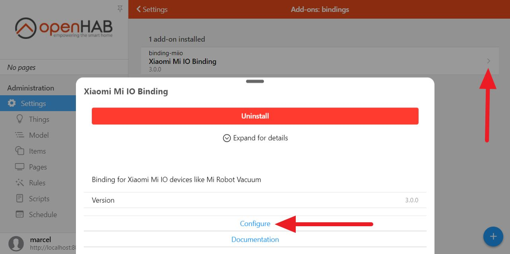

# Xiaomi Wifi devices (Mi IO) Binding

This binding is used to control Xiaomi products implementing the Mi IO protocol.
This protocol is used for most of Xiaomi Mi Ecosystem wifi devices which is branded as MiJia.
If your Xiaomi wifi device is controlled by the mihome app, most likely it communicates using the Mi IO protocol and can communicate with openHAB using this binding.


## Supported Things

The following things types are available:

| ThingType        | Description                                                                                                              |
|------------------|--------------------------------------------------------------------------------------------------------------------------|
| miio:generic     | Generic type for discovered devices. Once the token is available and the device model is determined, this ThingType will automatically change to the appropriate ThingType |
| miio:vacuum      | For Xiaomi/RoboRock Robot Vacuum products                                                                                         |
| miio:basic       | For most other devices like yeelights, airpurifiers. Channels and commands are determined by database configuration   |
| miio:gateway     | Similar to basic, but with the Bridge feature, it can support to forward commands for connected devices                  |
| miio:lumi        | Thing type for subdevices connected to the gateway. Note, these devices require a defined gateway to function            |
| miio:unsupported | For experimenting with other devices which use the Mi IO protocol or to build experimental support                                                       |

# Discovery

The binding has 2 methods for discovering devices. Depending on your network setup and the device model, your device may be discovered by one or both methods. If both methods discover your device, 2 discovery results may be in your inbox for the same device.

The mDNS discovery method will discover your device type, but will not discover a (required) token.
The basic discovery will not discovery the type, but will discover a token for models that support it.
Accept only one of the 2 discovery results, the alternate one can further be ignored.

## Tokens

The binding needs a token from the Xiaomi Mi Device in order to be able to control it.
The binding can retrieve the needed tokens from the Xiaomi cloud.
Go to the binding config page and enter your cloud username and password.
The server(s) to which your devices are connected need to be entered as well.
Use the one of the regional servers: cn,de,i2,tw,ru,sg,us.
Multiple servers can be separated with comma, or leave blank to test all known servers.
See [binding configuration](#binding-configuration) for more details about the binding config.

## Tokens without cloud access

Some devices provide the token upon discovery. This may depends on the firmware version.
If the device does not discover your token, it needs to be retrieved from the Mi Home app.

The easiest way to obtain tokens is to browse through log files of the Mi Home app version 5.4.49 for Android.
It seems that version was released with debug messages turned on by mistake.
An APK file with the old version can be easily found using one of the popular web search engines.
After downgrading use a file browser to navigate to directory SmartHome/logs/plug_DeviceManager, then open the most recent file and search for the token. When finished, use Google Play to get the most recent version back.

For iPhone, use an un-encrypted iTunes-Backup and unpack it and use a sqlite tool to view the files in it:
Then search in "RAW, com.xiaomi.home," for "USERID_mihome.sqlite" and look for the 32-digit-token or 96 digit encrypted token.

Note. The Xiaomi devices change the token when inclusion is done. Hence if you get your token after reset and than include it with the Mi Home app, the token will change.

## Binding Configuration

No binding configuration is required. However to enable cloud functionality enter your Xiaomi username, password and server(s).
The list of the known countries and related severs is [here](#country-servers).

After successful Xiaomi cloud login, the binding will use the connection to retrieve the required device tokens from the cloud.
For Xiaomi vacuums the map can be visualized in openHAB using the cloud connection.

To enter your cloud details go to the bindings page, click the Xiaomi Mi IO binding and than configure.


In the configuration page, enter your userID /passwd and county(s) or leave the countries servers blank.


The binding also supports the discovery of devices via the cloud. This may be useful if the device is on a separate subnet. (note, after accepting such a device on a different subnet, the communication needs to be set to cloud in order to have it working.)

## Thing Configuration

Each Xiaomi device (thing) needs the IP address and token configured to be able to communicate. See discovery for details.
Optional configuration is the refresh interval and the deviceID. Note that the deviceID is automatically retrieved when it is left blank.
The configuration for model is automatically retrieved from the device in normal operation.
However, for devices that are unsupported, you may override the value and try to use a model string from a similar device to experimentally use your device with the binding.

| Parameter       | Type    | Required | Description                                                         |
|-----------------|---------|----------|---------------------------------------------------------------------|
| host            | text    | true     | Device IP address                                                   |
| token           | text    | true     | Token for communication (in Hex)                                    |
| deviceId        | text    | true     | Device Id (typically a number for normal devices) for communication |
| model           | text    | false    | Device model string, used to determine the subtype                  |
| refreshInterval | integer | false    | Refresh interval for refreshing the data in seconds. (0=disabled)   |
| timeout         | integer | false    | Timeout time in milliseconds                                        |
| communication   | text    | false    | Communicate direct or via cloud (options values: 'direct', 'cloud') |
| cloudServer     | text    | false    | Identifies the country server to use in case of cloud communication |

Note: Suggest to use the cloud communication only for devices that require it.
It is unknown at this time if Xiaomi has a rate limit or other limitations on the cloud usage. e.g. if having many devices would trigger some throttling from the cloud side.
Note2: communications parameter is not available for lumi devices. Lumi devices communicate using the bridge/gateway.

### Example Thing file

`Thing miio:basic:light "My Light" [ host="192.168.x.x", token="put here your token", deviceId="326xxxx", model="philips.light.bulb", communication="direct" ]`

or in case of unknown models include the model information of a similar device that is supported:

`Thing miio:vacuum:s50 "vacuum" @ "livingroom" [ host="192.168.15.20", token="xxxxxxx", deviceId="326xxxx", model="roborock.vacuum.s4", communication="direct", cloudServer="de" ]`

in case of gateway, instead of defining it as a Thing, use Bridge

`Bridge miio:gateway:lumigateway "Mi Smarter Gateway" [ host="10.10.x.x", token="put here your token", deviceId="326xxxx", model="lumi.gateway.mieu01", communication="direct", cloudServer="de" ]`

# Advanced: Unsupported devices

Newer devices may not yet be supported.
However, many devices share large similarities with existing devices.
The binding allows to try/test if your new device is working with database files of older devices as well.

There are 2 ways to get unsupported devices working, by overriding the model with the model of a supported item or by test all known properties to see which are supported by your device.

## Substitute model for unsupported devices

Replace the model with the model which is already supported.
For this, first remove your unsupported thing. Manually add a miio:basic thing.
Besides the regular configuration (like ip address, token) the modelId needs to be provided.
Normally the modelId is populated with the model of your device, however in this case, use the modelId of a similar device.
Look at the openHAB forum, or the openHAB GitHub repository for the modelId of similar devices.

## Supported property test for unsupported devices

The unsupported device has a test channel with switch. When switching on, all known properties are tested, this may take few minutes.
A test report will be shown in the log and is saved in the `userdata/miio` folder with a filename `test-[your model]-[timestamp].txt`.
If supported properties are found, an experimental database file is saved to the conf/misc/miio folder (see below chapter).
The thing will go offline and will come back online as basic device, supporting the found channels.
The database file may need to be modified to display the right channel names.
After validation, please share the logfile and json files on the openHAB forum or the openHAB GitHub to build future support for this model.

## Advanced: adding local database files to support new devices

Things using the basic handler (miio:basic things) are driven by json 'database' files.
This instructs the binding which channels to create, which properties and actions are associated with the channels etc.
The conf/misc/miio (e.g. in Linux `/opt/openhab/conf/misc/miio/`) is scanned for database files and will be used for your devices.
During the start of the binding the exact path used in your system will be printed in the _debug_ log.
Watch for a line containing `Started miio basic devices local databases watch service. Watching for database files at path: …` (
If this folder is created after the start of the binding, you may need to restart the binding (or openHAB) to be able to use the local files.
Note that local database files take preference over build-in ones, hence if a json file is local and in the database the local file will be used.
For format, please check the current database files in openHAB GitHub.

# FAQ.. what to do in case of problems

If your device is not getting online:

_Are you using text config?_
Make sure you define all the fields as per above example.
Or, better, try to get it going first without text config.

_The token is wrong_
The most common cause of non responding devices is a wrong token.
When you reset, or change wifi or update firmware, and possibly other cases as well, the token may change. You'll need to get a refreshed token.

_My token is coming from the cloud... how can it be wrong?_
Is not very likely but still can happen._
This can happen e.g. if your device is defined on multiple country servers.
The binding may pull the token from the wrong country server.
First try to get the token from all country servers by leave the county setting empty.
If that does not solve it, you define only the country that the device is on in the binding config page (where the cloud userid/pwd is entered) this should pull the right token.

_You have the same device added multiple times._
The communication each time send a sequential number.
If the device is twice defined, the numbers received by the device are no longer sequential and it will stop responding for some time.

_The connection is not too good, so you have timeouts etc._
Position your device closer to wifi / check in the mihome app if the wifi strength is good enough.
Alternatively as described above, double check for multiple connections for single device.

_Your device is on a different subnet?_
This is in most cases not working.
Firmware of the device don't accept commands coming from other subnets.
Set the communication in the thing configuration to 'cloud'.

_Cloud connectivity is not working_
The most common problem is a wrong or missing userId/password. Update your Xiaomi cloud userId & password in the [miio binding configuration screen](#binding-configuration).
If the problem persists you can try the following:

- Xiaomi Account verification might be needed. For some users login by the binding is unsuccessful as account verification is required, but the binding currently has no possibilities to handle this.
In order to pass validation your (openHAB server) ip need to be validated/confirmed.
Browse to [https://account.xiaomi.com/](https://account.xiaomi.com/) and logon to your account. Note: use the same external ip address as your openHAB server, e.g.  you may need to disable your VPN.
- If above is not possible or fails, You can try to find in the binding debug logging a `location url`. Try to login using this url (just after it fails) with your browser.
- Several users also reported success by resetting their Xiaomi password.

If it still fails, you're bit out of luck. You may try to restart openHAB (not just the binding) to clean the cookies.
As the cloud logon process is still little understood, your only luck might be to enable trace logging and see if you can translate the Chinese error code that it returns.

_My Roborock vacuum is not found or not reacting_
Did you link the vacuum with the Roborock app?
This won't work, the Roborock app is using a different communication method.
Reset your vacuum and connect it to the Xiaomi MiHome app.
This will change the communication method and the Mi IO binding can communicate with the vacuum.

# Mi IO Devices

Currently the miio binding supports more than 340 different models.

| Device                             | ThingType        | Device Model           | Supported    | Remark     |
|------------------------------------|------------------|------------------------|--------------|------------|
| AUX Smart Air Conditioner          | miio:unsupported | aux.aircondition.v1    | No           |            |
| Mi Air Frying Pan                  | miio:basic       | [careli.fryer.maf01](#careli-fryer-maf01) | Experimental | Experimental support. Please report back if all channels are functional. Preferably share the debug log of property refresh and command responses |
| Mi Smart Air Fryer (3.5L)          | miio:basic       | [careli.fryer.maf02](#careli-fryer-maf02) | Experimental | Experimental support. Please report back if all channels are functional. Preferably share the debug log of property refresh and command responses |
| Mi Air Frying Pan                  | miio:basic       | [careli.fryer.maf03](#careli-fryer-maf03) | Experimental | Experimental support. Please report back if all channels are functional. Preferably share the debug log of property refresh and command responses |
| Qingping Air Monitor Lite          | miio:basic       | [cgllc.airm.cgdn1](#cgllc-airm-cgdn1) | Yes          |            |
| Mi Multifunction Air Monitor       | miio:basic       | [cgllc.airmonitor.b1](#cgllc-airmonitor-b1) | Yes          |            |
| Qingping Air Monitor               | miio:basic       | [cgllc.airmonitor.s1](#cgllc-airmonitor-s1) | Yes          |            |
| Mi Universal Remote                | miio:unsupported | chuangmi.ir.v2         | No           |            |
| Mi Smart Power Plug 2 (Wi-Fi and Bluetooth Gateway) | miio:basic       | [chuangmi.plug.212a01](#chuangmi-plug-212a01) | Yes          |            |
| Mi Smart Plug WiFi                 | miio:basic       | [chuangmi.plug.hmi205](#chuangmi-plug-hmi205) | Yes          |            |
| Mi Smart Plug (WiFi)               | miio:basic       | [chuangmi.plug.hmi206](#chuangmi-plug-hmi206) | Yes          |            |
| Mi Smart Wi-Fi Plug (Bluetooth Gateway) | miio:basic       | [chuangmi.plug.hmi208](#chuangmi-plug-hmi208) | Yes          |            |
| Mi Plug Mini                       | miio:basic       | [chuangmi.plug.m1](#chuangmi-plug-m1) | Yes          |            |
| Mi Smart Plug (Wi-Fi) Basic        | miio:basic       | [chuangmi.plug.m3](#chuangmi-plug-m3) | Yes          |            |
| Mi Smart Power Plug                | miio:basic       | [chuangmi.plug.v1](#chuangmi-plug-v1) | Yes          |            |
| Mi Smart Power Plug v2             | miio:basic       | [chuangmi.plug.v2](#chuangmi-plug-v2) | Yes          |            |
| MIJIA Smart  Plug Enhanced         | miio:basic       | [chuangmi.plug.v3](#chuangmi-plug-v3) | Yes          |            |
| Mi Remote                          | miio:unsupported | chuangmi.remote.v2     | No           |            |
| Mi IH Rice Cooker                  | miio:unsupported | chunmi.cooker.normal1  | No           |            |
| Mi IH Rice Cooker                  | miio:unsupported | chunmi.cooker.normal2  | No           |            |
| Mi IH Rice Cooker 4L               | miio:unsupported | chunmi.cooker.normal4  | No           |            |
| Mi IH Pressure Rice Cooker         | miio:unsupported | chunmi.cooker.press1   | No           |            |
| Mi IH Pressure Rice Cooker         | miio:unsupported | chunmi.cooker.press2   | No           |            |
| Gosund Smart Plug                  | miio:basic       | [cuco.plug.cp1](#cuco-plug-cp1) | Yes          |            |
| Mi Smart Antibacterial Humidifier  | miio:basic       | [deerma.humidifier.jsq](#deerma-humidifier-jsq) | Yes          |            |
| Mi S Smart Humidifer               | miio:basic       | [deerma.humidifier.jsq1](#deerma-humidifier-jsq1) | Yes          |            |
| Mi Smart Antibacterial Humidifier  | miio:basic       | [deerma.humidifier.jsq5](#deerma-humidifier-jsq5) | Yes          |            |
| Mi Smart Humidifer S               | miio:basic       | [deerma.humidifier.jsqs](#deerma-humidifier-jsqs) | Yes          |            |
| Mi Smart Humidifier                | miio:basic       | [deerma.humidifier.mjjsq](#deerma-humidifier-mjjsq) | Yes          |            |
| Mi Fresh Air Ventilator A1-150     | miio:basic       | [dmaker.airfresh.a1](#dmaker-airfresh-a1) | Yes          |            |
| Mi Fresh Air Ventilator            | miio:basic       | [dmaker.airfresh.t2017](#dmaker-airfresh-t2017) | Yes          |            |
| Mi Smart Standing Fan 2 Lite       | miio:basic       | [dmaker.fan.1c](#dmaker-fan-1c) | Experimental | Experimental support. Please report back if all channels are functional. Preferably share the debug log of property refresh and command responses |
| Mi Smart Standing Fan 1X           | miio:basic       | [dmaker.fan.p5](#dmaker-fan-p5) | Yes          |            |
| Mi Smart Standing Fan 1C           | miio:basic       | [dmaker.fan.p8](#dmaker-fan-p8) | Experimental | Experimental support. Please report back if all channels are functional. Preferably share the debug log of property refresh and command responses |
| Mi Smart Tower Fan                 | miio:basic       | [dmaker.fan.p9](#dmaker-fan-p9) | Yes          |            |
| Mi Smart Standing Fan 2            | miio:basic       | [dmaker.fan.p10](#dmaker-fan-p10) | Yes          |            |
| Mi Smart Standing Fan Pro          | miio:basic       | [dmaker.fan.p15](#dmaker-fan-p15) | Yes          | Identified manual actions for execution<br />`action{"did":"off-delay-time-toggle","siid":3,"aiid":1,"in":[]}`<br />Please test and feedback if they are working so they can be linked to a channel. |
| Mi Smart Standing Fan 2            | miio:basic       | [dmaker.fan.p18](#dmaker-fan-p18) | Experimental | Experimental support. Please report back if all channels are functional. Preferably share the debug log of property refresh and command responses |
| Mi Robot Vacuum Mop 1C STYTJ01ZHM  | miio:basic       | [dreame.vacuum.mc1808](#dreame-vacuum-mc1808) | Yes          |            |
| Dreame Robot Vacuum-Mop F9         | miio:basic       | [dreame.vacuum.p2008](#dreame-vacuum-p2008) | Experimental | Experimental support. Please report back if all channels are functional. Preferably share the debug log of property refresh and command responses |
| Dreame Robot Vacuum D9             | miio:basic       | [dreame.vacuum.p2009](#dreame-vacuum-p2009) | Yes          |            |
| Dreame Bot W10                     | miio:basic       | [dreame.vacuum.p2027](#dreame-vacuum-p2027) | Experimental | Experimental support. Please report back if all channels are functional. Preferably share the debug log of property refresh and command responses |
| Dreame Bot Z10 Pro                 | miio:basic       | [dreame.vacuum.p2028](#dreame-vacuum-p2028) | Experimental | Experimental support. Please report back if all channels are functional. Preferably share the debug log of property refresh and command responses |
| Dreame Bot L10 Pro                 | miio:basic       | [dreame.vacuum.p2029](#dreame-vacuum-p2029) | Yes          |            |
| Trouver Robot LDS Vacuum-Mop Finder | miio:basic       | [dreame.vacuum.p2036](#dreame-vacuum-p2036) | Yes          |            |
| Mi Robot Vacuum-Mop 2 Pro+         | miio:basic       | [dreame.vacuum.p2041o](#dreame-vacuum-p2041o) | Experimental | Experimental support. Please report back if all channels are functional. Preferably share the debug log of property refresh and command responses |
| MOVA Z500 Robot Vacuum and Mop Cleaner | miio:basic       | [dreame.vacuum.p2156o](#dreame-vacuum-p2156o) | Experimental | Experimental support. Please report back if all channels are functional. Preferably share the debug log of property refresh and command responses |
| MOVA L600 Robot Vacuum and Mop Cleaner | miio:basic       | [dreame.vacuum.p2157](#dreame-vacuum-p2157) | Yes          |            |
| Dreame Bot D9 Max                  | miio:basic       | [dreame.vacuum.p2259](#dreame-vacuum-p2259) | Experimental | Experimental support. Please report back if all channels are functional. Preferably share the debug log of property refresh and command responses |
| HUIZUO ARIES For Bedroom           | miio:basic       | [huayi.light.ari013](#huayi-light-ari013) | Experimental | Experimental support. Please report back if all channels are functional. Preferably share the debug log of property refresh and command responses |
| HUIZUO ARIES For Living Room       | miio:basic       | [huayi.light.aries](#huayi-light-aries) | Experimental | Experimental support. Please report back if all channels are functional. Preferably share the debug log of property refresh and command responses |
| HUIZUO Fan Light                   | miio:basic       | [huayi.light.fanwy](#huayi-light-fanwy) | Experimental | Experimental support. Please report back if all channels are functional. Preferably share the debug log of property refresh and command responses |
| HUIZUO Fan Light(2020)             | miio:basic       | [huayi.light.fanwy2](#huayi-light-fanwy2) | Experimental | Experimental support. Please report back if all channels are functional. Preferably share the debug log of property refresh and command responses |
| HUIZUO PEGASUS For Living Room     | miio:basic       | [huayi.light.peg091](#huayi-light-peg091) | Experimental | Experimental support. Please report back if all channels are functional. Preferably share the debug log of property refresh and command responses |
| HUIZUO PEGASUS For Bedroom         | miio:basic       | [huayi.light.peg093](#huayi-light-peg093) | Experimental | Experimental support. Please report back if all channels are functional. Preferably share the debug log of property refresh and command responses |
| HUIZUO PISCES For Bedroom          | miio:basic       | [huayi.light.pis123](#huayi-light-pis123) | Experimental | Experimental support. Please report back if all channels are functional. Preferably share the debug log of property refresh and command responses |
| HUIZUO PISCES For Living Room      | miio:basic       | [huayi.light.pisces](#huayi-light-pisces) | Experimental | Experimental support. Please report back if all channels are functional. Preferably share the debug log of property refresh and command responses |
| HUIZUO TAURUS For Bedroom          | miio:basic       | [huayi.light.tau023](#huayi-light-tau023) | Experimental | Experimental support. Please report back if all channels are functional. Preferably share the debug log of property refresh and command responses |
| HUIZUO TAURUS For Living Room      | miio:basic       | [huayi.light.taurus](#huayi-light-taurus) | Experimental | Experimental support. Please report back if all channels are functional. Preferably share the debug log of property refresh and command responses |
| HUIZUO VIRGO For Bedroom           | miio:basic       | [huayi.light.vir063](#huayi-light-vir063) | Experimental | Experimental support. Please report back if all channels are functional. Preferably share the debug log of property refresh and command responses |
| HUIZUO VIRGO For Living Room       | miio:basic       | [huayi.light.virgo](#huayi-light-virgo) | Experimental | Experimental support. Please report back if all channels are functional. Preferably share the debug log of property refresh and command responses |
| HUIZUO Ceiling Light               | miio:basic       | [huayi.light.wy](#huayi-light-wy) | Experimental | Experimental support. Please report back if all channels are functional. Preferably share the debug log of property refresh and command responses |
| HUIZUO LIANGCHEN(BLE Mesh)         | miio:basic       | [huayi.light.wy200](#huayi-light-wy200) | Experimental | Experimental support. Please report back if all channels are functional. Preferably share the debug log of property refresh and command responses |
| HUIZUO SAG Downlight (BLE Mesh)    | miio:basic       | [huayi.light.wy201](#huayi-light-wy201) | Experimental | Experimental support. Please report back if all channels are functional. Preferably share the debug log of property refresh and command responses |
| HUIZUO Bulb (BLE Mesh)             | miio:basic       | [huayi.light.wy202](#huayi-light-wy202) | Experimental | Experimental support. Please report back if all channels are functional. Preferably share the debug log of property refresh and command responses |
| HUIZUO YONG Downlight (BLE Mesh)   | miio:basic       | [huayi.light.wy203](#huayi-light-wy203) | Experimental | Experimental support. Please report back if all channels are functional. Preferably share the debug log of property refresh and command responses |
| huayi.light.wy204                  | miio:basic       | [huayi.light.wy204](#huayi-light-wy204) | Experimental | Experimental support. Please report back if all channels are functional. Preferably share the debug log of property refresh and command responses |
| HUIZUO Heating Lamp                | miio:basic       | [huayi.light.wyheat](#huayi-light-wyheat) | Experimental | Experimental support. Please report back if all channels are functional. Preferably share the debug log of property refresh and command responses |
| HUIZUO ZIWEI Ceiling Lamp          | miio:basic       | [huayi.light.zw131](#huayi-light-zw131) | Experimental | Experimental support. Please report back if all channels are functional. Preferably share the debug log of property refresh and command responses |
| MiJia Rice Cooker                  | miio:unsupported | hunmi.cooker.normal3   | No           |            |
| Jinxing Smart Air Conditioner      | miio:unsupported | idelan.aircondition.v1 | No           |            |
| Xiaomi Robot Vacuum-Mop 2S         | miio:basic       | [ijai.vacuum.v19](#ijai-vacuum-v19) | Yes          |            |
| IKEA E27 white spectrum opal       | miio:lumi        | [ikea.light.led1545g12](#ikea-light-led1545g12) | Experimental | Needs to have the Xiaomi gateway configured in the binding as bridge.<br />Experimental support. Please report back if all channels are functional. Preferably share the debug log of property refresh and command responses |
| IKEA E27 white spectrum clear      | miio:lumi        | [ikea.light.led1546g12](#ikea-light-led1546g12) | Experimental | Needs to have the Xiaomi gateway configured in the binding as bridge.<br />Experimental support. Please report back if all channels are functional. Preferably share the debug log of property refresh and command responses |
| IKEA E14 white spectrum            | miio:lumi        | [ikea.light.led1536g5](#ikea-light-led1536g5) | Experimental | Needs to have the Xiaomi gateway configured in the binding as bridge.<br />Experimental support. Please report back if all channels are functional. Preferably share the debug log of property refresh and command responses |
| IKEA GU10 white spectrum           | miio:lumi        | [ikea.light.led1537r6](#ikea-light-led1537r6) | Experimental | Needs to have the Xiaomi gateway configured in the binding as bridge.<br />Experimental support. Please report back if all channels are functional. Preferably share the debug log of property refresh and command responses |
| IKEA E27 warm white                | miio:lumi        | [ikea.light.led1623g12](#ikea-light-led1623g12) | Experimental | Needs to have the Xiaomi gateway configured in the binding as bridge.<br />Experimental support. Please report back if all channels are functional. Preferably share the debug log of property refresh and command responses |
| IKEA GU10 warm white               | miio:lumi        | [ikea.light.led1650r5](#ikea-light-led1650r5) | Experimental | Needs to have the Xiaomi gateway configured in the binding as bridge.<br />Experimental support. Please report back if all channels are functional. Preferably share the debug log of property refresh and command responses |
| IKEA E14 warm white                | miio:lumi        | [ikea.light.led1649c5](#ikea-light-led1649c5) | Experimental | Needs to have the Xiaomi gateway configured in the binding as bridge.<br />Experimental support. Please report back if all channels are functional. Preferably share the debug log of property refresh and command responses |
| Aqara Wall Switch(No Neutral, Single Rocker) | miio:unsupported | lumi.ctrl_neutral1.v1  | No           |            |
| Aqara Wall Switch (No Neutral, Double Rocker) | miio:unsupported | lumi.ctrl_neutral2.v1  | No           |            |
| Xiaomiyoupin Curtain Controller (Wi-Fi) | miio:basic       | [lumi.curtain.hagl05](#lumi-curtain-hagl05) | Experimental | Experimental support. Please report back if all channels are functional. Preferably share the debug log of property refresh and command responses |
| Mi Air Purifier virtual            | miio:gateway     | [lumi.gateway.mgl03](#lumi-gateway-mgl03) | Experimental | Used to control the gateway itself. Use the mihome binding to control devices connected to the Xiaomi gateway if you have the developer key. Otherwise this binding provides experimental support for lumi subdevices<br />Experimental support. Please report back if all channels are functional. Preferably share the debug log of property refresh and command responses |
| Mi smart Home Gateway Hub          | miio:gateway     | [lumi.gateway.mieu01](#lumi-gateway-mieu01) | Yes          | Used to control the gateway itself. Experimental support for controlling lumi subdevices |
| Mi smart Home Gateway Hub v1       | miio:gateway     | [lumi.gateway.v1](#lumi-gateway-v1) | Experimental | Used to control the gateway itself. Use the mihome binding to control devices connected to the Xiaomi gateway if you have the developer key. Otherwise this binding provides experimental support for lumi subdevices<br />Experimental support. Please report back if all channels are functional. Preferably share the debug log of property refresh and command responses |
| Mi smart Home GatewayHub v2        | miio:gateway     | [lumi.gateway.v2](#lumi-gateway-v2) | Experimental | Used to control the gateway itself. Use the mihome binding to control devices connected to the Xiaomi gateway if you have the developer key. Otherwise this binding provides experimental support for lumi subdevices<br />Experimental support. Please report back if all channels are functional. Preferably share the debug log of property refresh and command responses |
| Mi smart Home Gateway Hub v3       | miio:gateway     | [lumi.gateway.v3](#lumi-gateway-v3) | Experimental | Used to control the gateway itself. Use the mihome binding to control devices connected to the Xiaomi gateway if you have the developer key. Otherwise this binding provides experimental support for lumi subdevices<br />Experimental support. Please report back if all channels are functional. Preferably share the debug log of property refresh and command responses |
| Aqara LED Light Bulb (Tunable White) | miio:lumi        | [lumi.light.aqcn02](#lumi-light-aqcn02) | Experimental | Needs to have the Xiaomi gateway configured in the binding as bridge.<br />Experimental support. Please report back if all channels are functional. Preferably share the debug log of property refresh and command responses |
| Door lock                          | miio:lumi        | [lumi.lock.v1](#lumi-lock-v1) | Experimental | Needs to have the Xiaomi gateway configured in the binding as bridge.<br />Experimental support. Please report back if all channels are functional. Preferably share the debug log of property refresh and command responses |
| Aqara Door Lock                    | miio:lumi        | [lumi.lock.aq1](#lumi-lock-aq1) | Experimental | Needs to have the Xiaomi gateway configured in the binding as bridge.<br />Experimental support. Please report back if all channels are functional. Preferably share the debug log of property refresh and command responses |
| Aqara Door Lock S2                 | miio:lumi        | [lumi.lock.acn02](#lumi-lock-acn02) | Experimental | Needs to have the Xiaomi gateway configured in the binding as bridge.<br />Experimental support. Please report back if all channels are functional. Preferably share the debug log of property refresh and command responses |
| Aqara Door lock S2 Pro             | miio:lumi        | [lumi.lock.acn03](#lumi-lock-acn03) | Experimental | Needs to have the Xiaomi gateway configured in the binding as bridge.<br />Experimental support. Please report back if all channels are functional. Preferably share the debug log of property refresh and command responses |
| Mi Smart Plug (Zigbee)             | miio:lumi        | [lumi.plug.mmeu01](#lumi-plug-mmeu01) | Yes          | Needs to have the Xiaomi gateway configured in the binding as bridge. |
| Mi Window and Door Sensor          | miio:lumi        | [lumi.sensor_magnet.v2](#lumi-sensor_magnet-v2) | Yes          | Needs to have the Xiaomi gateway configured in the binding as bridge. Note: Won't display the current status. Log only' |
| Mi Motion Sensor                   | miio:lumi        | [lumi.sensor_motion.aq2](#lumi-sensor_motion-aq2) | Yes          | Needs to have the Xiaomi gateway configured in the binding as bridge.Note: Won't display the current status, nor trigger events. Log only |
| Mi Motion Sensor                   | miio:lumi        | [lumi.sensor_motion.v2](#lumi-sensor_motion-v2) | Yes          | Needs to have the Xiaomi gateway configured in the binding as bridge.Note: Won't display the current status, nor trigger events. Log only |
| Mi Temperature and Humidity Sensor | miio:lumi        | [lumi.sensor_ht.v1](#lumi-sensor_ht-v1) | Experimental | Needs to have the Xiaomi gateway configured in the binding as bridge.<br />Experimental support. Please report back if all channels are functional. Preferably share the debug log of property refresh and command responses |
| Water Leak Sensor                  | miio:lumi        | [lumi.sensor_wleak.aq1](#lumi-sensor_wleak-aq1) | Yes          | Needs to have the Xiaomi gateway configured in the binding as bridge. |
| Aqara Temperature and Humidity Sensor | miio:lumi        | [lumi.weather.v1](#lumi-weather-v1) | Yes          | Needs to have the Xiaomi gateway configured in the binding as bridge. |
| Midea AC-i Youth                   | miio:unsupported | midea.aircondition.v1  | No           |            |
| Midea Air Conditioner v2           | miio:unsupported | midea.aircondition.v2  | No           |            |
| Midea AC-Cool Golden               | miio:unsupported | midea.aircondition.xa1 | No           |            |
| Mi Robot Vacuum-Mop Essential      | miio:basic       | [mijia.vacuum.v2](#mijia-vacuum-v2) | Yes          | This device may be overwhelmed if refresh is too frequent, slowing down the responses. Suggest to increase refresh time to 120 seconds |
| Mijia Smart Pet Water Dispenser    | miio:basic       | [mmgg.pet_waterer.s1](#mmgg-pet_waterer-s1) | Experimental | Identified manual actions for execution<br />`action{"did":"filter-reset-filter-life","siid":3,"aiid":1,"in":[]}`<br />`action{"did":"filter-cotton-reset-cotton-life","siid":5,"aiid":1,"in":[]}`<br />`action{"did":"remain-clean-time-reset-clean-time","siid":6,"aiid":1,"in":[]}`<br />Please test and feedback if they are working so they can be linked to a channel.<br />Experimental support. Please report back if all channels are functional. Preferably share the debug log of property refresh and command responses |
| Mijia Smart Pet Water Dispenser    | miio:basic       | [mmgg.pet_waterer.s2](#mmgg-pet_waterer-s2) | Experimental | Identified manual actions for execution<br />`action{"did":"filter-reset-filter-life","siid":3,"aiid":1,"in":[]}`<br />`action{"did":"filter-cotton-reset-cotton-life","siid":5,"aiid":1,"in":[]}`<br />`action{"did":"remain-clean-time-reset-clean-time","siid":6,"aiid":1,"in":[]}`<br />Please test and feedback if they are working so they can be linked to a channel.<br />Experimental support. Please report back if all channels are functional. Preferably share the debug log of property refresh and command responses |
| Mijia Smart Pet Water Dispenser    | miio:basic       | [mmgg.pet_waterer.s3](#mmgg-pet_waterer-s3) | Experimental | Identified manual actions for execution<br />`action{"did":"filter-reset-filter-life","siid":3,"aiid":1,"in":[]}`<br />`action{"did":"filter-cotton-reset-cotton-life","siid":5,"aiid":1,"in":[]}`<br />`action{"did":"remain-clean-time-reset-clean-time","siid":6,"aiid":1,"in":[]}`<br />Please test and feedback if they are working so they can be linked to a channel.<br />Experimental support. Please report back if all channels are functional. Preferably share the debug log of property refresh and command responses |
| XIAOWAN Smart Pet Water Dispenser  | miio:basic       | [mmgg.pet_waterer.s4](#mmgg-pet_waterer-s4) | Experimental | Identified manual actions for execution<br />`action{"did":"filter-reset-filter-life","siid":3,"aiid":1,"in":[]}`<br />`action{"did":"filter-cotton-reset-cotton-life","siid":5,"aiid":1,"in":[]}`<br />`action{"did":"remain-clean-time-reset-clean-time","siid":6,"aiid":1,"in":[]}`<br />Please test and feedback if they are working so they can be linked to a channel.<br />Experimental support. Please report back if all channels are functional. Preferably share the debug log of property refresh and command responses |
| MR.BOND                            | miio:basic       | [mrbond.airer.m1pro](#mrbond-airer-m1pro) | Experimental | Experimental support. Please report back if all channels are functional. Preferably share the debug log of property refresh and command responses |
| MR.BOND                            | miio:basic       | [mrbond.airer.m1s](#mrbond-airer-m1s) | Experimental | Experimental support. Please report back if all channels are functional. Preferably share the debug log of property refresh and command responses |
| MR.BOND                            | miio:basic       | [mrbond.airer.m1super](#mrbond-airer-m1super) | Experimental | Experimental support. Please report back if all channels are functional. Preferably share the debug log of property refresh and command responses |
| WIDETECH WDH318EFW1 Internet Dehumidifier | miio:basic       | [nwt.derh.wdh318efw1](#nwt-derh-wdh318efw1) | Yes          |            |
| Philips Zhirui Ceiling Lamp Bedroom 40W | miio:basic       | [philips.light.bceiling1](#philips-light-bceiling1) | Experimental | Experimental support. Please report back if all channels are functional. Preferably share the debug log of property refresh and command responses |
| Philips Zhirui Ceiling Lamp Bedroom 28W | miio:basic       | [philips.light.bceiling2](#philips-light-bceiling2) | Experimental | Experimental support. Please report back if all channels are functional. Preferably share the debug log of property refresh and command responses |
| Philips ZhiRui E27 bulb            | miio:basic       | [philips.light.bulb](#philips-light-bulb) | Yes          |            |
| Philips ZhiRui E14 Candle Lamp Frosted version | miio:basic       | [philips.light.candle](#philips-light-candle) | Yes          |            |
| Philips ZhiRui E14 Candle Lamp Crystal version | miio:basic       | [philips.light.candle2](#philips-light-candle2) | Yes          |            |
| Mijia Philips Color Bulb           | miio:basic       | [philips.light.cbulb](#philips-light-cbulb) | Yes          |            |
| Philips Light                      | miio:basic       | [philips.light.cbulbs](#philips-light-cbulbs) | Yes          |            |
| Philips Connected Ceiling          | miio:basic       | [philips.light.ceiling](#philips-light-ceiling) | Yes          |            |
| Philips Light                      | miio:basic       | [philips.light.dcolor](#philips-light-dcolor) | Yes          |            |
| ZhiRui Dimmable Downlight          | miio:basic       | [philips.light.dlight](#philips-light-dlight) | Experimental | Experimental support. Please report back if all channels are functional. Preferably share the debug log of property refresh and command responses |
| Philips ZhiRui Downlight           | miio:basic       | [philips.light.downlight](#philips-light-downlight) | Yes          |            |
| Philips Wi-Fi bulb E27 White       | miio:basic       | [philips.light.hbulb](#philips-light-hbulb) | Yes          |            |
| Philips ZhiYi Ceiling Lamp FL 40W  | miio:basic       | [philips.light.lnblight1](#philips-light-lnblight1) | Experimental | Experimental support. Please report back if all channels are functional. Preferably share the debug log of property refresh and command responses |
| Philips ZhiYi Ceiling Lamp FL 28W  | miio:basic       | [philips.light.lnblight2](#philips-light-lnblight2) | Experimental | Experimental support. Please report back if all channels are functional. Preferably share the debug log of property refresh and command responses |
| Philips ZhiYi Ceiling Lamp FL 80W  | miio:basic       | [philips.light.lnlrlight](#philips-light-lnlrlight) | Experimental | Experimental support. Please report back if all channels are functional. Preferably share the debug log of property refresh and command responses |
| Philips Zhirui Ceiling Lamp Living room 80W | miio:basic       | [philips.light.lrceiling](#philips-light-lrceiling) | Experimental | Experimental support. Please report back if all channels are functional. Preferably share the debug log of property refresh and command responses |
| Zhirui Ceiling Lamp Nordic 80W     | miio:basic       | [philips.light.mceil](#philips-light-mceil) | Experimental | Experimental support. Please report back if all channels are functional. Preferably share the debug log of property refresh and command responses |
| Zhirui Ceiling Lamp Nordic 40W     | miio:basic       | [philips.light.mceilm](#philips-light-mceilm) | Experimental | Experimental support. Please report back if all channels are functional. Preferably share the debug log of property refresh and command responses |
| Zhirui Ceiling Lamp Nordic 28W     | miio:basic       | [philips.light.mceils](#philips-light-mceils) | Experimental | Experimental support. Please report back if all channels are functional. Preferably share the debug log of property refresh and command responses |
| Philips Smart Lamp                 | miio:basic       | [philips.light.mono1](#philips-light-mono1) | Yes          |            |
| Philips ZhiRui Bedside Lamp        | miio:basic       | [philips.light.moonlight](#philips-light-moonlight) | Yes          |            |
| Zhirui Ceiling Lamp Black 80W      | miio:basic       | [philips.light.obceil](#philips-light-obceil) | Experimental | Experimental support. Please report back if all channels are functional. Preferably share the debug log of property refresh and command responses |
| Zhirui Ceiling Lamp Black 40W      | miio:basic       | [philips.light.obceim](#philips-light-obceim) | Experimental | Experimental support. Please report back if all channels are functional. Preferably share the debug log of property refresh and command responses |
| Zhirui Ceiling Lamp Black 28W      | miio:basic       | [philips.light.obceis](#philips-light-obceis) | Experimental | Experimental support. Please report back if all channels are functional. Preferably share the debug log of property refresh and command responses |
| Mijia Philips Study Desk Lamp      | miio:basic       | [philips.light.rwread](#philips-light-rwread) | Yes          |            |
| Zhirui Ceiling Lamp Starry 80W     | miio:basic       | [philips.light.sceil](#philips-light-sceil) | Experimental | Experimental support. Please report back if all channels are functional. Preferably share the debug log of property refresh and command responses |
| Zhirui Ceiling Lamp Starry 40W     | miio:basic       | [philips.light.sceilm](#philips-light-sceilm) | Experimental | Experimental support. Please report back if all channels are functional. Preferably share the debug log of property refresh and command responses |
| Zhirui Ceiling Lamp Starry 28W     | miio:basic       | [philips.light.sceils](#philips-light-sceils) | Experimental | Experimental support. Please report back if all channels are functional. Preferably share the debug log of property refresh and command responses |
| Philips EyeCare Connected Desk Lamp gen2. | miio:basic       | [philips.light.sread1](#philips-light-sread1) | Yes          |            |
| Mijia Philips Desk Lamp 2S         | miio:basic       | [philips.light.sread2](#philips-light-sread2) | Yes          |            |
| Philips Connected Lights           | miio:basic       | [philips.light.virtual](#philips-light-virtual) | Yes          |            |
| Zhirui Ceiling Lamp Gorgeous 80W   | miio:basic       | [philips.light.xzceil](#philips-light-xzceil) | Experimental | Experimental support. Please report back if all channels are functional. Preferably share the debug log of property refresh and command responses |
| Zhirui Ceiling Lamp Gorgeous 40W   | miio:basic       | [philips.light.xzceim](#philips-light-xzceim) | Experimental | Experimental support. Please report back if all channels are functional. Preferably share the debug log of property refresh and command responses |
| Zhirui Ceiling Lamp Gorgeous 28W   | miio:basic       | [philips.light.xzceis](#philips-light-xzceis) | Experimental | Experimental support. Please report back if all channels are functional. Preferably share the debug log of property refresh and command responses |
| Philips ZhiYi Ceiling lamp         | miio:basic       | [philips.light.zyceiling](#philips-light-zyceiling) | Yes          |            |
| Philips ZhiYi Desk Lamp            | miio:basic       | [philips.light.zysread](#philips-light-zysread) | Yes          |            |
| Philips ZhiYi Strip                | miio:basic       | [philips.light.zystrip](#philips-light-zystrip) | Yes          |            |
| CHINGMI Smart Power Strip v1       | miio:basic       | [qmi.powerstrip.v1](#qmi-powerstrip-v1) | Yes          |            |
| Rockrobo Xiaowa Sweeper v2         | miio:unsupported | roborock.sweeper.e2v2  | No           |            |
| Rockrobo Xiaowa Sweeper v3         | miio:unsupported | roborock.sweeper.e2v3  | No           |            |
| Roborock S6 Pure                   | miio:vacuum      | [roborock.vacuum.a08](#roborock-vacuum-a08) | Yes          |            |
| Roborock T7 Pro                    | miio:vacuum      | [roborock.vacuum.a09](#roborock-vacuum-a09) | Yes          |            |
| Roborock S6 MaxV                   | miio:vacuum      | [roborock.vacuum.a10](#roborock-vacuum-a10) | Yes          |            |
| Roborock T7                        | miio:vacuum      | [roborock.vacuum.a11](#roborock-vacuum-a11) | Yes          |            |
| Roborock T7S                       | miio:vacuum      | [roborock.vacuum.a14](#roborock-vacuum-a14) | Yes          |            |
| Roborock S7                        | miio:vacuum      | [roborock.vacuum.a15](#roborock-vacuum-a15) | Yes          |            |
| Roborock S4 Max                    | miio:vacuum      | [roborock.vacuum.a19](#roborock-vacuum-a19) | Yes          |            |
| Roborock T7S Plus                  | miio:vacuum      | [roborock.vacuum.a23](#roborock-vacuum-a23) | Yes          |            |
| Roborock G10S Pro                  | miio:vacuum      | [roborock.vacuum.a26](#roborock-vacuum-a26) | Yes          |            |
| Roborock S7 MaxV                   | miio:vacuum      | [roborock.vacuum.a27](#roborock-vacuum-a27) | Yes          |            |
| Roborock G10                       | miio:vacuum      | [roborock.vacuum.a29](#roborock-vacuum-a29) | Yes          |            |
| Roborock G10                       | miio:vacuum      | [roborock.vacuum.a30](#roborock-vacuum-a30) | Yes          |            |
| Roborock Q5                        | miio:vacuum      | [roborock.vacuum.a34](#roborock-vacuum-a34) | Yes          |            |
| Roborock T8                        | miio:vacuum      | [roborock.vacuum.a37](#roborock-vacuum-a37) | Yes          |            |
| Roborock Q7 Max                    | miio:vacuum      | [roborock.vacuum.a38](#roborock-vacuum-a38) | Yes          |            |
| Roborock Q7                        | miio:vacuum      | [roborock.vacuum.a40](#roborock-vacuum-a40) | Yes          |            |
| Roborock G10S                      | miio:vacuum      | [roborock.vacuum.a46](#roborock-vacuum-a46) | Yes          |            |
| Roborock T8 Plus                   | miio:vacuum      | [roborock.vacuum.a52](#roborock-vacuum-a52) | Yes          |            |
| Roborock S7 Pro Ultra              | miio:vacuum      | [roborock.vacuum.a62](#roborock-vacuum-a62) | Yes          |            |
| Xiaowa C1                          | miio:vacuum      | [roborock.vacuum.c1](#roborock-vacuum-c1) | Yes          |            |
| Roborock Xiaowa E Series Vacuum v2 | miio:unsupported | roborock.vacuum.e2     | No           |            |
| Mi Robot Vacuum 1S                 | miio:vacuum      | [roborock.vacuum.m1s](#roborock-vacuum-m1s) | Yes          |            |
| Roborock P5                        | miio:vacuum      | [roborock.vacuum.p5](#roborock-vacuum-p5) | Yes          |            |
| Roborock S4                        | miio:vacuum      | [roborock.vacuum.s4](#roborock-vacuum-s4) | Yes          |            |
| Roborock Vacuum S4v2               | miio:vacuum      | [roborock.vacuum.s4v2](#roborock-vacuum-s4v2) | Yes          |            |
| Roborock S5                        | miio:vacuum      | [roborock.vacuum.s5](#roborock-vacuum-s5) | Yes          |            |
| Roborock S5 Max                    | miio:vacuum      | [roborock.vacuum.s5e](#roborock-vacuum-s5e) | Yes          |            |
| Roborock S6                        | miio:vacuum      | [roborock.vacuum.s6](#roborock-vacuum-s6) | Yes          |            |
| Roborock T4                        | miio:vacuum      | [roborock.vacuum.t4](#roborock-vacuum-t4) | Yes          |            |
| Roborock Vacuum T4 v2              | miio:vacuum      | [roborock.vacuum.t4v2](#roborock-vacuum-t4v2) | Yes          |            |
| Roborock Vacuum T4 v3              | miio:vacuum      | [roborock.vacuum.t4v3](#roborock-vacuum-t4v3) | Yes          |            |
| Roborock T6                        | miio:vacuum      | [roborock.vacuum.t6](#roborock-vacuum-t6) | Yes          |            |
| Roborock Vacuum T6 v2              | miio:vacuum      | [roborock.vacuum.t6v2](#roborock-vacuum-t6v2) | Yes          |            |
| Roborock Vacuum T6 v3              | miio:vacuum      | [roborock.vacuum.t6v3](#roborock-vacuum-t6v3) | Yes          |            |
| Roborock Vacuum T7                 | miio:vacuum      | [roborock.vacuum.t7](#roborock-vacuum-t7) | Yes          |            |
| Roborock Vacuum T7p                | miio:vacuum      | [roborock.vacuum.t7p](#roborock-vacuum-t7p) | Yes          |            |
| Roborock Vacuum T7 v2              | miio:vacuum      | [roborock.vacuum.t7pv2](#roborock-vacuum-t7pv2) | Yes          |            |
| Roborock Vacuum T7 v3              | miio:vacuum      | [roborock.vacuum.t7pv3](#roborock-vacuum-t7pv3) | Yes          |            |
| Roborock Vacuum T7 v2              | miio:vacuum      | [roborock.vacuum.t7v2](#roborock-vacuum-t7v2) | Yes          |            |
| Roborock Vacuum T7 v3              | miio:vacuum      | [roborock.vacuum.t7v3](#roborock-vacuum-t7v3) | Yes          |            |
| Roborock Vacuum S6                 | miio:vacuum      | [rockrobo.vacuum.s6](#rockrobo-vacuum-s6) | Yes          |            |
| Mi Robot Vacuum                    | miio:vacuum      | [rockrobo.vacuum.v1](#rockrobo-vacuum-v1) | Yes          |            |
| ROIDMI EVE vacuum                  | miio:basic       | [roidmi.vacuum.v60](#roidmi-vacuum-v60) | Yes          |            |
| ROIDMI EVA                         | miio:basic       | [roidmi.vacuum.v66](#roidmi-vacuum-v66) | Experimental | Experimental support. Please report back if all channels are functional. Preferably share the debug log of property refresh and command responses |
| PTX OneKey Switch (WIFI)           | miio:basic       | [090615.switch.xswitch01](#090615-switch-xswitch01) | Yes          |            |
| PTX Twokey switch(wifi)            | miio:basic       | [090615.switch.xswitch02](#090615-switch-xswitch02) | Yes          |            |
| PTX ThreeKey Switch (WIFI)         | miio:basic       | [090615.switch.xswitch03](#090615-switch-xswitch03) | Yes          |            |
| SCISHARE Smart Capsule Coffee Machine | miio:basic       | [scishare.coffee.s1102](#scishare-coffee-s1102) | Experimental | This device does not allow for regular querying for the status. Hence the status is not updated for the action channels.<br />Experimental support. Please report back if all channels are functional. Preferably share the debug log of property refresh and command responses |
| Xiaomi Scishare Smart Capsule Coffee Machine | miio:basic       | [scishare.coffee.s1301](#scishare-coffee-s1301) | Experimental | This device does not allow for regular querying for the status. Hence the status is not updated for the action channels.<br />Experimental support. Please report back if all channels are functional. Preferably share the debug log of property refresh and command responses |
| Soocare Electric Toothbrush        | miio:unsupported | soocare.toothbrush.x3  | No           |            |
| Viomi Internet Refrigerator iLive(French style 462L) | miio:unsupported | viomi.fridge.v3        | No           |            |
| Viomi Cleaning Robot V-RVCLM21B    | miio:basic       | [viomi.vacuum.v6](#viomi-vacuum-v6) | Yes          |            |
| Mi Robot Vacuum-Mop P              | miio:basic       | [viomi.vacuum.v7](#viomi-vacuum-v7) | Yes          |            |
| Mi Robot Vacuum-Mop P              | miio:basic       | [viomi.vacuum.v8](#viomi-vacuum-v8) | Yes          |            |
| Viomi S9                           | miio:basic       | [viomi.vacuum.v18](#viomi-vacuum-v18) | Experimental | Experimental support. Please report back if all channels are functional. Preferably share the debug log of property refresh and command responses |
| VIOMI Internet Electric Water Heater 1A (60L) | miio:basic       | [viomi.waterheater.e1](#viomi-waterheater-e1) | Experimental | Experimental support. Please report back if all channels are functional. Preferably share the debug log of property refresh and command responses |
| Mi Inverter Air Conditioner (1.5HP) | miio:basic       | [xiaomi.aircondition.ma1](#xiaomi-aircondition-ma1) | Experimental | Experimental support. Please report back if all channels are functional. Preferably share the debug log of property refresh and command responses |
| Mi Inverter Air Conditioner (1.5HP, China Energy Label Level 1) | miio:basic       | [xiaomi.aircondition.ma2](#xiaomi-aircondition-ma2) | Experimental | Experimental support. Please report back if all channels are functional. Preferably share the debug log of property refresh and command responses |
| Mi Vertical Air Conditioner (2HP)  | miio:basic       | [xiaomi.aircondition.ma4](#xiaomi-aircondition-ma4) | Experimental | Experimental support. Please report back if all channels are functional. Preferably share the debug log of property refresh and command responses |
| Mi Smart Vertical Air Conditioner C1 (2HP / Inverter / China Energy Label Level 1) | miio:basic       | [xiaomi.aircondition.ma5](#xiaomi-aircondition-ma5) | Experimental | Experimental support. Please report back if all channels are functional. Preferably share the debug log of property refresh and command responses |
| Mi Smart Air Conditioner C1 (1.5HP / Conventional / China Energy Label Level 3) | miio:basic       | [xiaomi.aircondition.ma6](#xiaomi-aircondition-ma6) | Experimental | Experimental support. Please report back if all channels are functional. Preferably share the debug log of property refresh and command responses |
| Mi Smart Air Conditioner C1 (1HP / Inverter / China Energy Label Level 1) | miio:basic       | [xiaomi.aircondition.ma9](#xiaomi-aircondition-ma9) | Experimental | Experimental support. Please report back if all channels are functional. Preferably share the debug log of property refresh and command responses |
| Mi Smart Air Conditioner A (1HP / Inverter / China Energy Label Level 1) | miio:basic       | [xiaomi.aircondition.mc1](#xiaomi-aircondition-mc1) | Experimental | Experimental support. Please report back if all channels are functional. Preferably share the debug log of property refresh and command responses |
| Mi Smart Air Conditioner A (1.5HP / Inverter / China Energy Label Level 1) | miio:basic       | [xiaomi.aircondition.mc2](#xiaomi-aircondition-mc2) | Experimental | Experimental support. Please report back if all channels are functional. Preferably share the debug log of property refresh and command responses |
| Mi Smart Air Conditioner A (1HP / Inverter / China Energy Label Level <1) | miio:basic       | [xiaomi.aircondition.mc4](#xiaomi-aircondition-mc4) | Experimental | Experimental support. Please report back if all channels are functional. Preferably share the debug log of property refresh and command responses |
| Mi Smart Air Conditioner A (1.5HP / Inverter / China Energy Label Level <1) | miio:basic       | [xiaomi.aircondition.mc5](#xiaomi-aircondition-mc5) | Experimental | Experimental support. Please report back if all channels are functional. Preferably share the debug log of property refresh and command responses |
| Mi Smart Vertical Air Conditioner A (2HP / Inverter / China Energy Label Level <1) | miio:basic       | [xiaomi.aircondition.mc6](#xiaomi-aircondition-mc6) | Experimental | Experimental support. Please report back if all channels are functional. Preferably share the debug log of property refresh and command responses |
| Mi Smart Vertical Air Conditioner A (3HP / Inverter / China Energy Label Level <1) | miio:basic       | [xiaomi.aircondition.mc7](#xiaomi-aircondition-mc7) | Experimental | Experimental support. Please report back if all channels are functional. Preferably share the debug log of property refresh and command responses |
| Mi Smart Ultra Electricity Saving Air Conditioner(1.5HP/Inverter/New China Energy Label Level 3) | miio:basic       | [xiaomi.aircondition.mc8](#xiaomi-aircondition-mc8) | Experimental | Experimental support. Please report back if all channels are functional. Preferably share the debug log of property refresh and command responses |
| Mi Smart Ultra Electricity Saving Vertical Air Conditioner(2HP/Inverter/New China Energy Label Level 3) | miio:basic       | [xiaomi.aircondition.mc9](#xiaomi-aircondition-mc9) | Experimental | Experimental support. Please report back if all channels are functional. Preferably share the debug log of property refresh and command responses |
| Mi Smart Ultra Electricity Saving Vertical Air Conditioner (2HP/Inverter/New China Energy Label Level 1) | miio:basic       | [xiaomi.aircondition.c10](#xiaomi-aircondition-c10) | Experimental | Experimental support. Please report back if all channels are functional. Preferably share the debug log of property refresh and command responses |
| Mi Smart Ultra Electricity Saving Vertical Air Conditioner (3HP/Inverter/New China Energy Label Level 1) | miio:basic       | [xiaomi.aircondition.c11](#xiaomi-aircondition-c11) | Experimental | Experimental support. Please report back if all channels are functional. Preferably share the debug log of property refresh and command responses |
| Mi Smart Air Conditioner C (1HP / Inverter / New China Energy Label Level 1) | miio:basic       | [xiaomi.aircondition.mh1](#xiaomi-aircondition-mh1) | Experimental | Experimental support. Please report back if all channels are functional. Preferably share the debug log of property refresh and command responses |
| Mi Smart Air Conditioner C (1.5HP / Inverter / New China Energy Label Level 1) | miio:basic       | [xiaomi.aircondition.mh2](#xiaomi-aircondition-mh2) | Experimental | Experimental support. Please report back if all channels are functional. Preferably share the debug log of property refresh and command responses |
| Mi Smart Ultra Electricity Saving Air Conditioner(1HP/Inverter/New China Energy Label Level 3) | miio:basic       | [xiaomi.aircondition.mh3](#xiaomi-aircondition-mh3) | Experimental | Experimental support. Please report back if all channels are functional. Preferably share the debug log of property refresh and command responses |
| Mi Smart Air Conditioner X (1HP / Inverter / New China Energy Label Level 1) | miio:basic       | [xiaomi.aircondition.mt1](#xiaomi-aircondition-mt1) | Experimental | Experimental support. Please report back if all channels are functional. Preferably share the debug log of property refresh and command responses |
| Mi Smart Air Conditioner X (1.5HP / Inverter / New China Energy Label Level 1) | miio:basic       | [xiaomi.aircondition.mt2](#xiaomi-aircondition-mt2) | Experimental | Experimental support. Please report back if all channels are functional. Preferably share the debug log of property refresh and command responses |
| Mi Smart Gentle Breeze Air Conditioner (1HP / Inverter / New China Energy Label Level 1) | miio:basic       | [xiaomi.aircondition.mt3](#xiaomi-aircondition-mt3) | Experimental | Experimental support. Please report back if all channels are functional. Preferably share the debug log of property refresh and command responses |
| Mi Smart Gentle Breeze Air Conditioner (1.5HP / Inverter / New China Energy Label Level 1) | miio:basic       | [xiaomi.aircondition.mt4](#xiaomi-aircondition-mt4) | Experimental | Experimental support. Please report back if all channels are functional. Preferably share the debug log of property refresh and command responses |
| Mi Smart Gentle Breeze Vertical Air Conditioner (3HP / Inverter / New China Energy Label Level 1) | miio:basic       | [xiaomi.aircondition.mt5](#xiaomi-aircondition-mt5) | Experimental | Experimental support. Please report back if all channels are functional. Preferably share the debug log of property refresh and command responses |
| Mi Smart Ultra Electricity Saving Air Conditioner (1HP/Inverter/New China Energy Label Level 1) | miio:basic       | [xiaomi.aircondition.mt7](#xiaomi-aircondition-mt7) | Experimental | Experimental support. Please report back if all channels are functional. Preferably share the debug log of property refresh and command responses |
| Mi Smart Ultra Electricity Saving Air Conditioner (1.5HP/Inverter/New China Energy Label Level 1) | miio:basic       | [xiaomi.aircondition.mt8](#xiaomi-aircondition-mt8) | Experimental | Experimental support. Please report back if all channels are functional. Preferably share the debug log of property refresh and command responses |
| Mi Wi-Fi Repeater 2                | miio:unsupported | xiaomi.repeater.v2     | No           |            |
| Mi Network Speaker                 | miio:unsupported | xiaomi.wifispeaker.v1  | No           |            |
| Uclean Smart Toilet Seat           | miio:basic       | [xjx.toilet.pro](#xjx-toilet-pro) | Experimental | Experimental support. Please report back if all channels are functional. Preferably share the debug log of property refresh and command responses |
| Uclean Smart Toilet pure           | miio:basic       | [xjx.toilet.pure](#xjx-toilet-pure) | Experimental | Experimental support. Please report back if all channels are functional. Preferably share the debug log of property refresh and command responses |
| Uclean Smart Toilet relax          | miio:basic       | [xjx.toilet.relax](#xjx-toilet-relax) | Experimental | Experimental support. Please report back if all channels are functional. Preferably share the debug log of property refresh and command responses |
| Whale Spout Smart Toilet Zero      | miio:basic       | [xjx.toilet.zero](#xjx-toilet-zero) | Experimental | Experimental support. Please report back if all channels are functional. Preferably share the debug log of property refresh and command responses |
| Yeelight Smart Bath Heater         | miio:unsupported | yeelight.bhf_light.v2  | No           |            |
| Yeelight Smart Bath Heater Pro     | miio:basic       | [yeelink.bhf_light.v1](#yeelink-bhf_light-v1) | Yes          |            |
| Yeelight Smart Bath Heater         | miio:basic       | [yeelink.bhf_light.v2](#yeelink-bhf_light-v2) | Yes          |            |
| Mi Bedside Lamp                    | miio:basic       | [yeelink.light.bslamp1](#yeelink-light-bslamp1) | Yes          |            |
| Mi Bedside Lamp 2                  | miio:basic       | [yeelink.light.bslamp2](#yeelink-light-bslamp2) | Yes          |            |
| Yeelight Bedside Lamp II           | miio:basic       | [yeelink.light.bslamp3](#yeelink-light-bslamp3) | Yes          |            |
| Yeelight Ceiling Light             | miio:basic       | [yeelink.light.ceiling1](#yeelink-light-ceiling1) | Yes          |            |
| Yeelight Ceiling Light SE          | miio:basic       | [yeelink.light.ceiling2](#yeelink-light-ceiling2) | Yes          |            |
| Yeelight LED Ceiling Light         | miio:basic       | [yeelink.light.ceiling3](#yeelink-light-ceiling3) | Yes          |            |
| Yeelight LED Ceiling Light         | miio:basic       | [yeelink.light.ceiling4](#yeelink-light-ceiling4) | Yes          |            |
| Yeelight LED Ceiling Ambi Lamp     | miio:basic       | [yeelink.light.ceiling4.ambi](#yeelink-light-ceiling4-ambi) | Yes          |            |
| Mi LED Ceiling Light               | miio:basic       | [yeelink.light.ceiling5](#yeelink-light-ceiling5) | Yes          |            |
| Yeelight HaoShi LED Ceiling Lamp Pro | miio:basic       | [yeelink.light.ceiling6](#yeelink-light-ceiling6) | Yes          |            |
| Yeelight Haoshi Ceiling Lamp       | miio:basic       | [yeelink.light.ceiling7](#yeelink-light-ceiling7) | Yes          |            |
| LED Ceiling Light Crystal Plus     | miio:basic       | [yeelink.light.ceiling8](#yeelink-light-ceiling8) | Yes          |            |
| Yeelight HaoShi LED Ceiling Lamp Pro | miio:basic       | [yeelink.light.ceiling9](#yeelink-light-ceiling9) | Yes          |            |
| Yeelight Crystal Pendant Lamp      | miio:basic       | [yeelink.light.ceiling10](#yeelink-light-ceiling10) | Yes          |            |
| Yeelight LED Ceiling Ambi Lamp     | miio:basic       | [yeelink.light.ceiling10.ambi](#yeelink-light-ceiling10-ambi) | Yes          |            |
| Yeelight Ceiling Light 320 1S      | miio:basic       | [yeelink.light.ceiling11](#yeelink-light-ceiling11) | Yes          |            |
| Yeelight Stylized Ceiling Light  Pro | miio:basic       | [yeelink.light.ceiling12](#yeelink-light-ceiling12) | Yes          |            |
| Yeelight Ceiling Light             | miio:basic       | [yeelink.light.ceiling13](#yeelink-light-ceiling13) | Yes          |            |
| Yeelight Ceiling Light Mini        | miio:basic       | [yeelink.light.ceiling14](#yeelink-light-ceiling14) | Yes          |            |
| Yeelight Ceiling Light 480 1S      | miio:basic       | [yeelink.light.ceiling15](#yeelink-light-ceiling15) | Yes          |            |
| Yeelight Xingyu Ceiling Light      | miio:basic       | [yeelink.light.ceiling16](#yeelink-light-ceiling16) | Yes          |            |
| Yeelight ShaoHua Celing Light      | miio:basic       | [yeelink.light.ceiling17](#yeelink-light-ceiling17) | Yes          |            |
| Yeelight Ceiling Light Pro         | miio:basic       | [yeelink.light.ceiling18](#yeelink-light-ceiling18) | Yes          |            |
| Yeelight Ceiling Light Pro         | miio:basic       | [yeelink.light.ceiling19](#yeelink-light-ceiling19) | Yes          |            |
| Yeelight LED Ceiling Ambi Lamp     | miio:basic       | [yeelink.light.ceiling19.ambi](#yeelink-light-ceiling19-ambi) | Yes          |            |
| Yeelight Ceiling Light             | miio:basic       | [yeelink.light.ceiling20](#yeelink-light-ceiling20) | Yes          |            |
| Yeelight LED Ceiling Ambi Lamp     | miio:basic       | [yeelink.light.ceiling20.ambi](#yeelink-light-ceiling20-ambi) | Yes          |            |
| Mi Smart LED Living Room Ceiling Light | miio:basic       | [yeelink.light.ceiling21](#yeelink-light-ceiling21) | Yes          |            |
| Mi Smart LED Ceiling Light         | miio:basic       | [yeelink.light.ceiling22](#yeelink-light-ceiling22) | Yes          |            |
| Mi Smart LED Ceiling Light (350mm) | miio:basic       | [yeelink.light.ceiling23](#yeelink-light-ceiling23) | Yes          |            |
| Yeelight Jade Smart LED Ceiling Light C2001 | miio:basic       | [yeelink.light.ceil26](#yeelink-light-ceil26) | Yes          |            |
| Yeelight Color Bulb                | miio:basic       | [yeelink.light.color1](#yeelink-light-color1) | Yes          |            |
| Yeelight LED Bulb (Color)          | miio:basic       | [yeelink.light.color2](#yeelink-light-color2) | Yes          |            |
| Mi LED Smart Bulb (White and Color) | miio:basic       | [yeelink.light.color3](#yeelink-light-color3) | Yes          |            |
| Yeelight LED Bulb 1S（Color）        | miio:basic       | [yeelink.light.color4](#yeelink-light-color4) | Yes          |            |
| Mi Smart LED Bulb Essential (White and Color) | miio:basic       | [yeelink.light.color5](#yeelink-light-color5) | Yes          |            |
| Yeelight Smart LED Bulb 1SE (color) | miio:basic       | [yeelink.light.colora](#yeelink-light-colora) | Yes          |            |
| Yeelight LED Bulb (Tunable)        | miio:basic       | [yeelink.light.ct2](#yeelink-light-ct2) | Yes          |            |
| Mi LED Desk Lamp                   | miio:basic       | [yeelink.light.lamp1](#yeelink-light-lamp1) | Yes          |            |
| Mi Smart LED Desk Lamp Pro         | miio:basic       | [yeelink.light.lamp2](#yeelink-light-lamp2) | Yes          |            |
| Yeelight LED Lamp                  | miio:basic       | [yeelink.light.lamp3](#yeelink-light-lamp3) | Yes          |            |
| Mi LED Desk Lamp 1S                | miio:basic       | [yeelink.light.lamp4](#yeelink-light-lamp4) | Yes          |            |
| Yeelight Smart Desk Lamp Prime     | miio:basic       | [yeelink.light.lamp5](#yeelink-light-lamp5) | Yes          |            |
| Yeelight                           | miio:basic       | [yeelink.light.lamp6](#yeelink-light-lamp6) | Yes          |            |
| Yeelight LED Light Sensor Desk Lamp V1 | miio:basic       | [yeelink.light.lamp7](#yeelink-light-lamp7) | Yes          |            |
| Yeelight                           | miio:basic       | [yeelink.light.lamp8](#yeelink-light-lamp8) | Yes          |            |
| Yeelight Star LED Table Lamp       | miio:basic       | [yeelink.light.lamp9](#yeelink-light-lamp9) | Yes          |            |
| Yeelight Star Floor Lamp           | miio:basic       | [yeelink.light.lamp10](#yeelink-light-lamp10) | Yes          |            |
| Yeelight Screen Light Bar          | miio:basic       | [yeelink.light.lamp15](#yeelink-light-lamp15) | Yes          |            |
| Yeelight Bulb                      | miio:basic       | [yeelink.light.mono1](#yeelink-light-mono1) | Yes          |            |
| Yeelight White Bulb v2             | miio:basic       | [yeelink.light.mono2](#yeelink-light-mono2) | Yes          |            |
| Yeelight LED Bulb 1S（Dimmable）     | miio:basic       | [yeelink.light.mono4](#yeelink-light-mono4) | Yes          |            |
| Yeelight LED Filament Bulb         | miio:basic       | [yeelink.light.mono5](#yeelink-light-mono5) | Yes          |            |
| Mi Smart LED Bulb                  | miio:basic       | [yeelink.light.mono6](#yeelink-light-mono6) | Yes          |            |
| Yeelight LED smart bulb W3(dimmable) | miio:basic       | [yeelink.light.monoa](#yeelink-light-monoa) | Yes          |            |
| Yeelight GU10 Smart Bulb W1(dimmable) | miio:basic       | [yeelink.light.monob](#yeelink-light-monob) | Yes          |            |
| Yeelight Whiteglow Panel Light     | miio:basic       | [yeelink.light.panel1](#yeelink-light-panel1) | Yes          |            |
| Yeelight Lightstrip                | miio:basic       | [yeelink.light.strip1](#yeelink-light-strip1) | Yes          |            |
| Yeelight Lightstrip Plus           | miio:basic       | [yeelink.light.strip2](#yeelink-light-strip2) | Yes          |            |
| Yeelight Willow LED Lightstrip     | miio:basic       | [yeelink.light.strip4](#yeelink-light-strip4) | Yes          |            |
| Light Group (Mi & Yeelight)        | miio:basic       | [yeelink.light.virtual](#yeelink-light-virtual) | Yes          |            |
| Yeelight Smart Dual Control Module | miio:basic       | [yeelink.switch.sw1](#yeelink-switch-sw1) | Experimental | Experimental support. Please report back if all channels are functional. Preferably share the debug log of property refresh and command responses |
| Yeelight Smart Speaker             | miio:unsupported | yeelink.wifispeaker.v1 | No           |            |
| Yilai Ceiling Light Aiyue 480      | miio:basic       | [yilai.light.ceiling1](#yilai-light-ceiling1) | Yes          |            |
| Yilai Ceiling Lamp Hefeng 430      | miio:basic       | [yilai.light.ceiling2](#yilai-light-ceiling2) | Yes          |            |
| Yilai Ceiling Lamp Hefeng Pro      | miio:basic       | [yilai.light.ceiling3](#yilai-light-ceiling3) | Yes          |            |
| Mi Water Purifier lx2              | miio:basic       | [yunmi.waterpuri.lx2](#yunmi-waterpuri-lx2) | Experimental | Experimental support. Please report back if all channels are functional. Preferably share the debug log of property refresh and command responses |
| Mi Water Purifier (Under Counter)  | miio:basic       | [yunmi.waterpuri.lx3](#yunmi-waterpuri-lx3) | Experimental | Experimental support. Please report back if all channels are functional. Preferably share the debug log of property refresh and command responses |
| Mi Water Purifier lx4              | miio:basic       | [yunmi.waterpuri.lx4](#yunmi-waterpuri-lx4) | Experimental | Experimental support. Please report back if all channels are functional. Preferably share the debug log of property refresh and command responses |
| Mi Water Purifier 1A/400G Pro      | miio:basic       | [yunmi.waterpuri.lx5](#yunmi-waterpuri-lx5) | Experimental | Experimental support. Please report back if all channels are functional. Preferably share the debug log of property refresh and command responses |
| Mi Water Purifier (Under Counter)  | miio:basic       | [yunmi.waterpuri.lx6](#yunmi-waterpuri-lx6) | Experimental | Experimental support. Please report back if all channels are functional. Preferably share the debug log of property refresh and command responses |
| Mi Water Purifier 500G/500G Pro    | miio:basic       | [yunmi.waterpuri.lx7](#yunmi-waterpuri-lx7) | Experimental | Experimental support. Please report back if all channels are functional. Preferably share the debug log of property refresh and command responses |
| Mi Water Purifier 600G             | miio:basic       | [yunmi.waterpuri.lx8](#yunmi-waterpuri-lx8) | Yes          |            |
| Mi Water Purifier D1               | miio:basic       | [yunmi.waterpuri.lx9](#yunmi-waterpuri-lx9) | Experimental | Experimental support. Please report back if all channels are functional. Preferably share the debug log of property refresh and command responses |
| Mi Water Purifier lx10             | miio:basic       | [yunmi.waterpuri.lx10](#yunmi-waterpuri-lx10) | Experimental | Experimental support. Please report back if all channels are functional. Preferably share the debug log of property refresh and command responses |
| Mi Water Purifier C1 (Triple Setting) | miio:basic       | [yunmi.waterpuri.lx11](#yunmi-waterpuri-lx11) | Experimental | Experimental support. Please report back if all channels are functional. Preferably share the debug log of property refresh and command responses |
| Mi Water Purifier S1               | miio:basic       | [yunmi.waterpuri.lx12](#yunmi-waterpuri-lx12) | Experimental | Experimental support. Please report back if all channels are functional. Preferably share the debug log of property refresh and command responses |
| Mi Water Purifier v1               | miio:basic       | [yunmi.waterpurifier.v1](#yunmi-waterpurifier-v1) | Experimental | Experimental support. Please report back if all channels are functional. Preferably share the debug log of property refresh and command responses |
| Mi Water Purifier v2               | miio:basic       | [yunmi.waterpurifier.v2](#yunmi-waterpurifier-v2) | Experimental | Experimental support. Please report back if all channels are functional. Preferably share the debug log of property refresh and command responses |
| Mi Water Purifier (Under sink) v3  | miio:basic       | [yunmi.waterpurifier.v3](#yunmi-waterpurifier-v3) | Experimental | Experimental support. Please report back if all channels are functional. Preferably share the debug log of property refresh and command responses |
| Mi Water Purifier v4               | miio:basic       | [yunmi.waterpurifier.v4](#yunmi-waterpurifier-v4) | Experimental | Experimental support. Please report back if all channels are functional. Preferably share the debug log of property refresh and command responses |
| Smartmi Ventilation System         | miio:basic       | [zhimi.airfresh.va2](#zhimi-airfresh-va2) | Yes          |            |
| Smartmi Fresh Air System (Heating) | miio:basic       | [zhimi.airfresh.va4](#zhimi-airfresh-va4) | Yes          |            |
| Mi Fresh Air Ventilator C1-80      | miio:basic       | [zhimi.airfresh.ua1](#zhimi-airfresh-ua1) | Yes          |            |
| Mi PM2.5 Air Quality Monitor       | miio:basic       | [zhimi.airmonitor.v1](#zhimi-airmonitor-v1) | Yes          |            |
| Xiaomi Smart Air Purifier 4 Compact | miio:basic       | [zhimi.airp.cpa4](#zhimi-airp-cpa4) | Experimental | Experimental support. Please report back if all channels are functional. Preferably share the debug log of property refresh and command responses |
| Mi Air Purifier 3C                 | miio:basic       | [zhimi.airp.mb4a](#zhimi-airp-mb4a) | Yes          |            |
| Xiaomi Smart Air Purifier 4        | miio:basic       | [zhimi.airp.mb5](#zhimi-airp-mb5) | Experimental | Experimental support. Please report back if all channels are functional. Preferably share the debug log of property refresh and command responses |
| Mi Air Purifier 2 (mini)           | miio:basic       | [zhimi.airpurifier.m1](#zhimi-airpurifier-m1) | Yes          |            |
| Mi Air Purifier 2                  | miio:basic       | [zhimi.airpurifier.m2](#zhimi-airpurifier-m2) | Yes          |            |
| Mi Air Purifier 2S                 | miio:basic       | [zhimi.airpurifier.ma1](#zhimi-airpurifier-ma1) | Yes          |            |
| Mi Air Purifier 2S                 | miio:basic       | [zhimi.airpurifier.ma2](#zhimi-airpurifier-ma2) | Yes          |            |
| Mi Air Purifier 3                  | miio:basic       | [zhimi.airpurifier.ma4](#zhimi-airpurifier-ma4) | Experimental | Experimental support. Please report back if all channels are functional. Preferably share the debug log of property refresh and command responses |
| Mi Air Purifier 2S                 | miio:basic       | [zhimi.airpurifier.mb1](#zhimi-airpurifier-mb1) | Yes          |            |
| Mi Air Purifier 3/3H               | miio:basic       | [zhimi.airpurifier.mb3](#zhimi-airpurifier-mb3) | Experimental | Experimental support. Please report back if all channels are functional. Preferably share the debug log of property refresh and command responses |
| Mi Air Purifier 3C                 | miio:basic       | [zhimi.airpurifier.mb4](#zhimi-airpurifier-mb4) | Yes          |            |
| Mi Air Purifier 2S                 | miio:basic       | [zhimi.airpurifier.mc1](#zhimi-airpurifier-mc1) | Yes          |            |
| Mi Air Purifier 2H                 | miio:basic       | [zhimi.airpurifier.mc2](#zhimi-airpurifier-mc2) | Yes          |            |
| Mi Air Purifier Super              | miio:basic       | [zhimi.airpurifier.sa1](#zhimi-airpurifier-sa1) | Yes          |            |
| Mi Air Purifier MAX / MAX Pro      | miio:basic       | [zhimi.airpurifier.sa2](#zhimi-airpurifier-sa2) | Yes          |            |
| Mi Air Purifier v1                 | miio:basic       | [zhimi.airpurifier.v1](#zhimi-airpurifier-v1) | Yes          |            |
| Mi Air Purifier v2                 | miio:basic       | [zhimi.airpurifier.v2](#zhimi-airpurifier-v2) | Yes          |            |
| Mi Air Purifier v3                 | miio:basic       | [zhimi.airpurifier.v3](#zhimi-airpurifier-v3) | Yes          |            |
| Mi Air Purifier v5                 | miio:basic       | [zhimi.airpurifier.v5](#zhimi-airpurifier-v5) | Yes          |            |
| Mi Air Purifier Pro v6             | miio:basic       | [zhimi.airpurifier.v6](#zhimi-airpurifier-v6) | Yes          |            |
| Mi Air Purifier Pro v7             | miio:basic       | [zhimi.airpurifier.v7](#zhimi-airpurifier-v7) | Yes          |            |
| Mi Air Purifier Pro H              | miio:basic       | [zhimi.airpurifier.vb2](#zhimi-airpurifier-vb2) | Yes          |            |
| Mi Air Purifier virtual            | miio:unsupported | zhimi.airpurifier.virtual | No           |            |
| Mi Air Purifier 2(Virtual)         | miio:unsupported | zhimi.airpurifier.vtl_m1 | No           |            |
| Smartmi Air Purifier               | miio:basic       | [zhimi.airpurifier.za1](#zhimi-airpurifier-za1) | Experimental | Experimental support. Please report back if all channels are functional. Preferably share the debug log of property refresh and command responses |
| Mi Standing Fan                    | miio:basic       | [zhimi.fan.sa1](#zhimi-fan-sa1) | Yes          |            |
| Mi Smart Fan                       | miio:basic       | [zhimi.fan.v1](#zhimi-fan-v1) | Yes          |            |
| Smartmi DC Pedestal Fan            | miio:basic       | [zhimi.fan.v2](#zhimi-fan-v2) | Yes          |            |
| Smartmi DC Pedestal Fan            | miio:basic       | [zhimi.fan.v3](#zhimi-fan-v3) | Yes          |            |
| Smartmi Inverter Pedestal Fan      | miio:basic       | [zhimi.fan.za1](#zhimi-fan-za1) | Yes          |            |
| Smartmi Standing Fan 2             | miio:basic       | [zhimi.fan.za3](#zhimi-fan-za3) | Yes          |            |
| Smartmi Standing Fan 2S            | miio:basic       | [zhimi.fan.za4](#zhimi-fan-za4) | Yes          |            |
| Smartmi Standing Fan 3             | miio:basic       | [zhimi.fan.za5](#zhimi-fan-za5) | Experimental | Experimental support. Please report back if all channels are functional. Preferably share the debug log of property refresh and command responses |
| Mi Smart Space Heater S            | miio:basic       | [zhimi.heater.ma2](#zhimi-heater-ma2) | Experimental | Experimental support. Please report back if all channels are functional. Preferably share the debug log of property refresh and command responses |
| Mi Smart Baseboard Heater E        | miio:basic       | [zhimi.heater.ma3](#zhimi-heater-ma3) | Experimental | Experimental support. Please report back if all channels are functional. Preferably share the debug log of property refresh and command responses |
| Mi Smart Space Heater S            | miio:basic       | [zhimi.heater.mc2](#zhimi-heater-mc2) | Experimental | Experimental support. Please report back if all channels are functional. Preferably share the debug log of property refresh and command responses |
| Smartmi Smart Fan                  | miio:basic       | [zhimi.heater.na1](#zhimi-heater-na1) | Experimental | Experimental support. Please report back if all channels are functional. Preferably share the debug log of property refresh and command responses |
| Smartmi Smart Fan Heater           | miio:basic       | [zhimi.heater.nb1](#zhimi-heater-nb1) | Experimental | Experimental support. Please report back if all channels are functional. Preferably share the debug log of property refresh and command responses |
| Smartmi Radiant Heater Smart Version | miio:basic       | [zhimi.heater.za1](#zhimi-heater-za1) | Experimental | Experimental support. Please report back if all channels are functional. Preferably share the debug log of property refresh and command responses |
| Smartmi Smart Convector Heater 1S  | miio:basic       | [zhimi.heater.za2](#zhimi-heater-za2) | Experimental | Experimental support. Please report back if all channels are functional. Preferably share the debug log of property refresh and command responses |
| Smartmi Smart Convector Heater 1S  | miio:basic       | [zhimi.heater.zb1](#zhimi-heater-zb1) | Experimental | Experimental support. Please report back if all channels are functional. Preferably share the debug log of property refresh and command responses |
| Smartmi Evaporative Humidifier     | miio:basic       | [zhimi.humidifier.ca1](#zhimi-humidifier-ca1) | Yes          |            |
| Smartmi Evaporative Humidifer 2    | miio:basic       | [zhimi.humidifier.ca4](#zhimi-humidifier-ca4) | Yes          |            |
| Smartmi Evaporative Humidifier     | miio:basic       | [zhimi.humidifier.cb1](#zhimi-humidifier-cb1) | Yes          |            |
| Smartmi Evaporative Humidifier     | miio:basic       | [zhimi.humidifier.cb2](#zhimi-humidifier-cb2) | Yes          |            |
| Smartmi Humidifier                 | miio:basic       | [zhimi.humidifier.v1](#zhimi-humidifier-v1) | Yes          |            |
| Mi AI Alarm                        | miio:unsupported | zimi.clock.myk01       | No           |            |
| Mi Smart Power Strip               | miio:basic       | [zimi.powerstrip.v2](#zimi-powerstrip-v2) | Yes          |            |

note: Supported means we received feedback from users this device is working with the binding.
For devices with experimental support, we did not yet confirmation that channels are correctly working.
Please feedback your findings for these devices (e.g. Are all channels working, do they contain the right information, is controlling the devices working etc.)

## Channels

Depending on the device, different channels are available.

All devices have available the following channels (marked as advanced) besides the device specific channels

| Channel          | Type    | Description                         |
|------------------|---------|-------------------------------------|
| network#ssid     | String  | Network SSID                        |
| network#bssid    | String  | Network BSSID                       |
| network#rssi     | Number  | Network RSSI                        |
| network#life     | Number  | Network Life                        |
| actions#commands | String  | send commands direct. see below     |
| actions#rpc      | String  | send commands via cloud. see below  |

note: the ADVANCED  `actions#commands` and `actions#rpc` channels can be used to send commands that are not automated via the binding. This is available for all devices
e.g. `openhab:send actionCommand 'upd_timer["1498595904821", "on"]'` would enable a pre-configured timer. See <https://github.com/marcelrv/XiaomiRobotVacuumProtocol> for all known available commands.

### Robo Rock vacuum Channels

| Type    | Channel                           | Description                |
|---------|-----------------------------------|----------------------------|
| Number  | status#segment_status             | Segment Status             |
| Number  | status#map_status                 | Map Box Status             |
| Number  | status#led_status                 | Led Box Status             |
| String  | info#carpet_mode                  | Carpet Mode details        |
| String  | info#fw_features                  | Firmware Features          |
| String  | info#room_mapping                 | Room Mapping details       |
| String  | info#multi_maps_list              | Maps Listing details       |

Additionally depending on the capabilities of your robot vacuum other channels may be enabled at runtime

| Type    | Channel                           | Description                |
|---------|-----------------------------------|----------------------------|
| Switch  | status#water_box_status           | Water Box Status           |
| Switch  | status#lock_status                | Lock Status                |
| Number  | status#water_box_mode             | Water Box Mode             |
| Switch  | status#water_box_carriage_status  | Water Box Carriage Status  |
| Switch  | status#mop_forbidden_enable       | Mop Forbidden              |
| Switch  | status#is_locating                | Robot is locating          |
| Number  | actions#segment                   | Room Clean  (enter room #) |

Note: cleaning map is only available with cloud access.

There are several advanced channels, which may be useful in rules (e.g. for individual room cleaning etc)
In case your vacuum does not support one of these commands, it will show "unsupported_method" for string channels or no value for numeric channels.

### Advanced: Vacuum Map Customization

In case the default rendering of the vacuum map is not meeting your integration needs, the rendering can be tailored.
The way to customize this is to create a file with the name `mapConfig.json` in the `userdata/miio` folder.
If the binding finds this file it will read the map rendering preferences from there.
If the file is available but invalid json, it will create a new file with all the default values for you to customize.
This allows you to control the colors, if logo is displayed, if and what text is rendered etc.
To (re-)read the file either restart openHAB, restart the binding or alternatively edit the thing and make (any) minor change.
Note, cropping is disabled (hence showing like the maps in OH3.1 and earlier) for any `cropBorder` value < 0.
Note, not all the values need to be in the json file, e.g. a subset of the parameters also works, the parameters not in the `mapConfig.json` will take the default values.

### Mi Air Frying Pan (<a name="careli-fryer-maf01">careli.fryer.maf01</a>) Channels

| Channel              | Type                 | Description                              | Comment    |
|----------------------|----------------------|------------------------------------------|------------|
| actions              | String               | Actions                                  | Value mapping `["air-fryer-start-cook"="Air Fryer Start Cook","air-fryer-cancel-cooking"="Air Fryer Cancel Cooking","air-fryer-pause"="Air Fryer Pause","custom-start-cook"="Custom Start Cook","custom-resume-cook"="Custom Resume Cook"]` |
| status               | Number               | Air Fryer - Status                       | Value mapping `["0"="Shutdown","1"="Standby","2"="Pause","3"="Appointment","4"="Cooking","5"="Preheat ","6"="Cooked","7"="Preheat Finish","8"="Preheat Pause","9"="Pause2"]` |
| fault                | Number               | Air Fryer - Device Fault                 | Value mapping `["0"="No Faults","1"="E1","2"="E2"]` |
| target_time          | Number:Time          | Air Fryer - Target Time                  |            |
| target_temperature   | Number:Temperature   | Air Fryer - Target Temperature           |            |
| left_time            | Number:Time          | Air Fryer - Left Time                    |            |
| recipe_id            | String               | Custom - Recipe Id                       |            |
| recipe_name          | String               | Custom - Recipe Name                     |            |
| work_time            | Number:Time          | Custom - Work Time                       |            |
| work_temp            | Number:Temperature   | Custom - Work Temp                       |            |
| appoint_time         | Number:Time          | Custom - Appoint Time                    |            |
| food_quantity        | Number               | Custom - Food Quantity                   | Value mapping `["0"="Null","1"="Single","2"="Double","3"="Half","4"="Full"]` |
| preheat_switch       | Number               | Custom - Preheat Switch                  | Value mapping `["0"="Null","1"="Off","2"="On"]` |
| appoint_time_left    | Number:Time          | Custom - Appoint Time Left               |            |
| recipe_sync          | String               | Custom - Recipe Sync                     |            |
| turn_pot             | Number               | Custom - Turn Pot                        | Value mapping `["1"="Switch Off","0"="Not Turn Pot","2"="Turn Pot"]` |

### Mi Smart Air Fryer (3.5L) (<a name="careli-fryer-maf02">careli.fryer.maf02</a>) Channels

| Channel              | Type                 | Description                              | Comment    |
|----------------------|----------------------|------------------------------------------|------------|
| actions              | String               | Actions                                  | Value mapping `["air-fryer-start-cook"="Air Fryer Start Cook","air-fryer-cancel-cooking"="Air Fryer Cancel Cooking","air-fryer-pause"="Air Fryer Pause","custom-start-custom-cook"="Custom Start Custom Cook","custom-resume-cooking"="Custom Resume Cooking"]` |
| status               | Number               | Air Fryer - Status                       | Value mapping `["0"="Shutdown","1"="Standby","2"="Pause","3"="Appointment","4"="Cooking","5"="Preheat ","6"="Cooked","7"="Preheat Finish","8"="Preheat Pause","9"="Pause2"]` |
| fault                | Number               | Air Fryer - Device Fault                 | Value mapping `["0"="No Faults","1"="E1","2"="E2"]` |
| target_time          | Number:Time          | Air Fryer - Target Time                  |            |
| target_temperature   | Number:Temperature   | Air Fryer - Target Temperature           |            |
| left_time            | Number:Time          | Air Fryer - Left Time                    |            |
| recipe_id            | String               | Custom - Recipe Id                       |            |
| work_time            | Number:Time          | Custom - Work Time                       |            |
| work_temp            | Number:Temperature   | Custom - Work Temp                       |            |
| appoint_time         | Number:Time          | Custom - Appoint Time                    |            |
| food_quantity        | Number               | Custom - Food Quantity                   | Value mapping `["0"="Null","1"="Single","2"="Double","3"="Half","4"="Full"]` |
| preheat_switch       | Number               | Custom - Preheat Switch                  | Value mapping `["0"="Null","1"="Off","2"="On"]` |
| appoint_time_left    | Number:Time          | Custom - Appoint Time Left               |            |
| turn_pot             | Number               | Custom - Turn Pot                        | Value mapping `["1"="Switch Off","0"="Not Turn Pot","2"="Turn Pot"]` |

### Mi Air Frying Pan (<a name="careli-fryer-maf03">careli.fryer.maf03</a>) Channels

| Channel              | Type                 | Description                              | Comment    |
|----------------------|----------------------|------------------------------------------|------------|
| actions              | String               | Actions                                  | Value mapping `["air-fryer-start-cook"="Air Fryer Start Cook","air-fryer-cancel-cooking"="Air Fryer Cancel Cooking","air-fryer-pause"="Air Fryer Pause","custom-start-cook"="Custom Start Cook","custom-resume-cook"="Custom Resume Cook"]` |
| status               | Number               | Air Fryer - Status                       | Value mapping `["0"="Shutdown","1"="Standby","2"="Pause","3"="Appointment","4"="Cooking","5"="Preheat ","6"="Cooked","7"="Preheat Finish","8"="Preheat Pause","9"="Pause2"]` |
| fault                | Number               | Air Fryer - Device Fault                 | Value mapping `["0"="No Faults","1"="E1","2"="E2"]` |
| target_time          | Number:Time          | Air Fryer - Target Time                  |            |
| target_temperature   | Number:Temperature   | Air Fryer - Target Temperature           |            |
| left_time            | Number:Time          | Air Fryer - Left Time                    |            |
| recipe_id            | String               | Custom - Recipe Id                       |            |
| recipe_name          | String               | Custom - Recipe Name                     |            |
| work_time            | Number:Time          | Custom - Work Time                       |            |
| work_temp            | Number:Temperature   | Custom - Work Temp                       |            |
| appoint_time         | Number:Time          | Custom - Appoint Time                    |            |
| food_quantity        | Number               | Custom - Food Quantity                   | Value mapping `["0"="Null","1"="Single","2"="Double","3"="Half","4"="Full"]` |
| preheat_switch       | Number               | Custom - Preheat Switch                  | Value mapping `["0"="Null","1"="Off","2"="On"]` |
| appoint_time_left    | Number:Time          | Custom - Appoint Time Left               |            |
| recipe_sync          | String               | Custom - Recipe Sync                     |            |
| turn_pot             | Number               | Custom - Turn Pot                        | Value mapping `["1"="Switch Off","0"="Not Turn Pot","2"="Turn Pot"]` |

### Qingping Air Monitor Lite (<a name="cgllc-airm-cgdn1">cgllc.airm.cgdn1</a>) Channels

| Channel              | Type                 | Description                              | Comment    |
|----------------------|----------------------|------------------------------------------|------------|
| actions              | String               | Actions                                  | Value mapping `["settings-set-start-time"="Set Start Time","settings-set-end-time"="Set End Time","settings-set-frequency"="Set Frequency","settings-set-screen-off"="Set Screen Off","settings-set-device-off"="Set Device Off","settings-set-temp-unit"="Set Temp Unit"]` |
| relative_humidity    | Number:Dimensionless | Environment - Relative Humidity          |            |
| pm2_5_density        | Number:Density       | Environment - PM2 5 Density              |            |
| pm10_density         | Number:Density       | Environment - PM10 Density               |            |
| temperature          | Number:Temperature   | Environment - Temperature                |            |
| co2_density          | Number:Density       | Environment - CO2 Density                |            |
| battery_level        | Number:Dimensionless | Battery - Battery Level                  |            |
| charging_state       | Number               | Battery - Charging State                 | Value mapping `["1"="Charging","2"="Not charging","3"="Not chargeable"]` |
| voltage              | Number:ElectricPotential | Battery - Voltage                        |            |
| mac                  | String               | Mac - Mac                                |            |
| monitoring_frequency | Number:Time          | Settings - Monitoring Frequency          | Value mapping `["1"="Second","60"="Second","300"="Second","600"="Second","0"="Null"]` |
| screen_off           | Number:Time          | Settings - Screen Off                    | Value mapping `["15"="Second","30"="Second","60"="Second","300"="Second","0"="Null"]` |
| device_off           | Number:Time          | Settings - Device Off                    | Value mapping `["15"="Minute","30"="Minute","60"="Minute","0"="Null"]` |
| tempature_unit       | String               | Settings - Tempature Unit                |            |

### Mi Multifunction Air Monitor (<a name="cgllc-airmonitor-b1">cgllc.airmonitor.b1</a>) Channels

| Channel              | Type                 | Description                              | Comment    |
|----------------------|----------------------|------------------------------------------|------------|
| battery              | Number               | Battery                                  |            |
| pm25                 | Number               | PM2.5                                    |            |
| co2                  | Number               | CO2e                                     |            |
| tvoc                 | Number               | tVOC                                     |            |
| humidity             | Number:Dimensionless | Humidity                                 |            |
| temperature          | Number:Temperature   | Temperature                              |            |

### Qingping Air Monitor (<a name="cgllc-airmonitor-s1">cgllc.airmonitor.s1</a>) Channels

| Channel              | Type                 | Description                              | Comment    |
|----------------------|----------------------|------------------------------------------|------------|
| battery              | Number               | Battery                                  | The device with firmware "4.1.8_9999" stops recognizing parameter "battery" in "get_value" command. The "battery" value request was extracted to separate command in order to keep backward compatibility to the devices with older firmware. |
| pm25                 | Number               | PM2.5                                    |            |
| co2                  | Number               | CO2                                      |            |
| tvoc                 | Number               | tVOC                                     |            |
| humidity             | Number:Dimensionless | Humidity                                 |            |
| temperature          | Number:Temperature   | Temperature                              |            |

### Mi Smart Power Plug 2 (Wi-Fi and Bluetooth Gateway) (<a name="chuangmi-plug-212a01">chuangmi.plug.212a01</a>) Channels

| Channel              | Type                 | Description                              | Comment    |
|----------------------|----------------------|------------------------------------------|------------|
| on                   | Switch               | Power                                    |            |
| temperature          | Number:Temperature   | Temperature                              |            |
| working-time         | Number:Time          | Working Time                             |            |
| on1                  | Switch               | Indicator Light - Switch Status          |            |
| power-consumption    | Number:Energy        | Daily Power Consumption                  |            |
| electric-current     | Number:Current       | Power Consumption - Electric Current     |            |
| voltage              | Number:ElectricPotential | Power Consumption - Voltage              |            |
| electric-power       | Number:Power         | Current Power Consumption - Electric Power |            |
| on-duration          | Number:Time          | Imilab Timer - On Duration               |            |
| off-duration         | Number:Time          | Imilab Timer - Off Duration              |            |
| countdown            | Number:Time          | Imilab Timer - Countdown                 |            |
| task-switch          | Switch               | Imilab Timer - Task Switch               |            |
| countdown-info       | Switch               | Imilab Timer - Countdown Info            |            |
| bt-gw                | String               | BT Gateway                               | Value mapping `["disable"="Disable","enable"="Enable"]` |
| bt-gw-devices        | String               | Connected BT Gateway Devices             | Note, refreshes every 2nd refresh. Channel requires cloud connectivity to function. Sample widget to visualise the (json) output available from the widget market |

### Mi Smart Plug WiFi (<a name="chuangmi-plug-hmi205">chuangmi.plug.hmi205</a>) Channels

| Channel              | Type                 | Description                              | Comment    |
|----------------------|----------------------|------------------------------------------|------------|
| power                | Switch               | Power                                    |            |
| temperature          | Number:Temperature   | Temperature                              |            |
| led                  | Switch               | Indicator light                          |            |

### Mi Smart Plug (WiFi) (<a name="chuangmi-plug-hmi206">chuangmi.plug.hmi206</a>) Channels

| Channel              | Type                 | Description                              | Comment    |
|----------------------|----------------------|------------------------------------------|------------|
| power                | Switch               | Power                                    | If this channel does not respond to on/off upgrade firmware |
| usb                  | Switch               | USB                                      |            |
| temperature          | Number:Temperature   | Temperature                              |            |
| led                  | Switch               | Wifi LED                                 |            |

### Mi Smart Wi-Fi Plug (Bluetooth Gateway) (<a name="chuangmi-plug-hmi208">chuangmi.plug.hmi208</a>) Channels

| Channel              | Type                 | Description                              | Comment    |
|----------------------|----------------------|------------------------------------------|------------|
| power                | Switch               | Power                                    | If this channel does not respond to on/off upgrade firmware |
| usb                  | Switch               | USB                                      |            |
| temperature          | Number:Temperature   | Temperature                              |            |
| led                  | Switch               | Wifi LED                                 |            |

### Mi Plug Mini (<a name="chuangmi-plug-m1">chuangmi.plug.m1</a>) Channels

| Channel              | Type                 | Description                              | Comment    |
|----------------------|----------------------|------------------------------------------|------------|
| power                | Switch               | Power                                    |            |
| temperature          | Number:Temperature   | Temperature                              |            |
| led                  | Switch               | Indicator light                          |            |

### Mi Smart Plug (Wi-Fi) Basic (<a name="chuangmi-plug-m3">chuangmi.plug.m3</a>) Channels

| Channel              | Type                 | Description                              | Comment    |
|----------------------|----------------------|------------------------------------------|------------|
| power                | Switch               | Power                                    |            |
| temperature          | Number:Temperature   | Temperature                              |            |
| led                  | Switch               | Indicator light                          |            |

### Mi Smart Power Plug (<a name="chuangmi-plug-v1">chuangmi.plug.v1</a>) Channels

| Channel              | Type                 | Description                              | Comment    |
|----------------------|----------------------|------------------------------------------|------------|
| power                | Switch               | Power                                    |            |
| usb                  | Switch               | USB                                      |            |
| temperature          | Number:Temperature   | Temperature                              |            |

### Mi Smart Power Plug v2 (<a name="chuangmi-plug-v2">chuangmi.plug.v2</a>) Channels

| Channel              | Type                 | Description                              | Comment    |
|----------------------|----------------------|------------------------------------------|------------|
| power                | Switch               | Power                                    |            |
| usb                  | Switch               | USB                                      |            |

### MIJIA Smart  Plug Enhanced (<a name="chuangmi-plug-v3">chuangmi.plug.v3</a>) Channels

| Channel              | Type                 | Description                              | Comment    |
|----------------------|----------------------|------------------------------------------|------------|
| power                | Switch               | Power                                    | If this channel does not respond to on/off upgrade firmware |
| usb                  | Switch               | USB                                      |            |
| temperature          | Number:Temperature   | Temperature                              |            |
| led                  | Switch               | Wifi LED                                 |            |

### Gosund Smart Plug (<a name="cuco-plug-cp1">cuco.plug.cp1</a>) Channels

| Channel              | Type                 | Description                              | Comment    |
|----------------------|----------------------|------------------------------------------|------------|
| FirmwareRevision     | String               | Device Information-CurrentFirmware Version |            |
| Manufacturer         | String               | Device Information-Device Manufacturer   |            |
| Model                | String               | Device Information-Device Model          |            |
| SerialNumber         | String               | Device Information-Device Serial Number  |            |
| On                   | Switch               | Switch-Switch Status                     |            |

### Mi Smart Antibacterial Humidifier (<a name="deerma-humidifier-jsq">deerma.humidifier.jsq</a>) Channels

| Channel              | Type                 | Description                              | Comment    |
|----------------------|----------------------|------------------------------------------|------------|
| power                | Switch               | Power                                    |            |
| mode                 | Number               | Mode                                     | Value mapping `["1"="Low","2"="Medium","3"="High","4"="Humidity "]` |
| humidity             | Number:Dimensionless | Humidity                                 |            |
| humidity_set         | Number:Dimensionless | Humidity Setting                         |            |
| led                  | Switch               | LED indicator Light                      |            |
| sound                | Switch               | Notification Sounds                      |            |
| watertankstatus      | Number               | Watertank Status                         |            |

### Mi S Smart Humidifer  (<a name="deerma-humidifier-jsq1">deerma.humidifier.jsq1</a>) Channels

| Channel              | Type                 | Description                              | Comment    |
|----------------------|----------------------|------------------------------------------|------------|
| power                | Switch               | Power                                    |            |
| mode                 | Number               | Mode                                     | Value mapping `["1"="Low","2"="Medium","3"="High","4"="Humidity "]` |
| humidity             | Number:Dimensionless | Humidity                                 |            |
| humidity_set         | Number:Dimensionless | Humidity Setting                         |            |
| led                  | Switch               | LED indicator Light                      |            |
| sound                | Switch               | Notification Sounds                      |            |
| watertankstatus      | Number               | Watertank Status                         |            |
| wet_and_protect      | Switch               | Wet and Protect                          |            |

### Mi Smart Antibacterial Humidifier (<a name="deerma-humidifier-jsq5">deerma.humidifier.jsq5</a>) Channels

| Channel              | Type                 | Description                              | Comment    |
|----------------------|----------------------|------------------------------------------|------------|
| on                   | Switch               | Humidifier - Switch Status               |            |
| fault                | Number               | Humidifier - Device Fault                | Value mapping `["0"="No Faults","1"="Insufficient Water","2"="Water Separation"]` |
| fan_level            | Number               | Humidifier - Fan Level                   | Value mapping `["1"="Level1","2"="Level2","3"="Level3","4"="Humidity"]` |
| target_humidity      | Number:Dimensionless | Humidifier - Target Humidity             |            |
| relative_humidity    | Number:Dimensionless | Environment - Relative Humidity          |            |
| temperature          | Number:Temperature   | Environment - Temperature                |            |
| alarm                | Switch               | Alarm - Alarm                            |            |
| on1                  | Switch               | Indicator Light - Switch Status          |            |
| water_shortage_fault | Switch               | Custom - Water Shortage Fault            |            |
| the_tank_filed       | Switch               | Custom - The Tank Filed                  |            |

### Mi Smart Humidifer S (<a name="deerma-humidifier-jsqs">deerma.humidifier.jsqs</a>) Channels

| Channel              | Type                 | Description                              | Comment    |
|----------------------|----------------------|------------------------------------------|------------|
| on                   | Switch               | Humidifier - Switch Status               |            |
| fault                | Number               | Humidifier - Device Fault                | Value mapping `["0"="No Faults","1"="Insufficient Water","2"="Water Separation"]` |
| fan_level            | Number               | Humidifier - Fan Level                   | Value mapping `["1"="Level1","2"="Level2","3"="Level3","4"="Humidity"]` |
| target_humidity      | Number:Dimensionless | Humidifier - Target Humidity             |            |
| relative_humidity    | Number:Dimensionless | Environment - Relative Humidity          |            |
| temperature          | Number:Temperature   | Environment - Temperature                |            |
| alarm                | Switch               | Alarm - Alarm                            |            |
| on1                  | Switch               | Indicator Light - Switch Status          |            |
| water_shortage_fault | Switch               | Custom - Water Shortage Fault            |            |
| the_tank_filed       | Switch               | Custom - The Tank Filed                  |            |

### Mi Smart Humidifier (<a name="deerma-humidifier-mjjsq">deerma.humidifier.mjjsq</a>) Channels

| Channel              | Type                 | Description                              | Comment    |
|----------------------|----------------------|------------------------------------------|------------|
| power                | Switch               | Power                                    |            |
| mode                 | Number               | Mode                                     | Value mapping `["1"="Low","2"="Medium","3"="High","4"="Humidity "]` |
| humidity             | Number:Dimensionless | Humidity                                 |            |
| humidity_set         | Number:Dimensionless | Humidity Setting                         |            |
| led                  | Switch               | LED indicator Light                      |            |
| sound                | Switch               | Notification Sounds                      |            |
| watertankstatus      | Number               | Watertank Status                         |            |

### Mi Fresh Air Ventilator A1-150 (<a name="dmaker-airfresh-a1">dmaker.airfresh.a1</a>) Channels

| Channel              | Type                 | Description                              | Comment    |
|----------------------|----------------------|------------------------------------------|------------|
| power                | Switch               | Power                                    |            |
| airFreshMode         | String               | Mode                                     | Value mapping `["auto"="Auto","sleep"="Sleep","favourite"="Favorite"]` |
| airFreshPTCPower     | Switch               | PTC                                      |            |
| airFreshPTCStatus    | Switch               | PTC Status                               |            |
| airFreshDisplay      | Switch               | Display                                  |            |
| airFreshChildLock    | Switch               | Child Lock                               |            |
| airFreshSound        | Switch               | Sound                                    |            |
| airFreshPM25         | Number               | PM2.5                                    |            |
| airFreshCO2          | Number               | CO2                                      |            |
| airFreshCurrentSpeed | Number               | Current Speed                            |            |
| airFreshFavoriteSpeed | Number               | Favorite Speed                           |            |
| airFreshTemperature  | Number               | Temperature Outside                      |            |
| airFreshFilterPercents | Number               | Filter Percents Remaining                |            |
| airFreshFilterDays   | Number               | Filter Days Remaining                    |            |
| airFreshResetFilterA1 | String               | Reset Filter                             |            |

### Mi Fresh Air Ventilator (<a name="dmaker-airfresh-t2017">dmaker.airfresh.t2017</a>) Channels

| Channel              | Type                 | Description                              | Comment    |
|----------------------|----------------------|------------------------------------------|------------|
| power                | Switch               | Power                                    |            |
| airFreshMode         | String               | Mode                                     | Value mapping `["auto"="Auto","sleep"="Sleep","favourite"="Favorite"]` |
| airFreshPTCPower     | Switch               | PTC                                      |            |
| airFreshPtcLevel     | String               | PTC Level                                | Value mapping `["low"="Low","medium"="Medium","high"="High"]` |
| airFreshPTCStatus    | Switch               | PTC Status                               |            |
| airFreshDisplayDirection | String               | Screen direction                         | Value mapping `["forward"="Normal","left"="Left","right"="Right"]` |
| airFreshDisplay      | Switch               | Display                                  |            |
| airFreshChildLock    | Switch               | Child Lock                               |            |
| airFreshSound        | Switch               | Sound                                    |            |
| airFreshPM25         | Number               | PM2.5                                    |            |
| airFreshCO2          | Number               | CO2                                      |            |
| airFreshCurrentSpeed | Number               | Current Speed                            |            |
| airFreshFavoriteSpeed | Number               | Favorite Speed                           |            |
| airFreshTemperature  | Number               | Temperature Outside                      |            |
| airFreshFilterPercents | Number               | Filter Percents Remaining                |            |
| airFreshFilterDays   | Number               | Filter Days Remaining                    |            |
| airFreshFilterProPercents | Number               | Filter Pro Percents Remaining            |            |
| airFreshFilterProDays | Number               | Filter Pro Days Remaining                |            |
| airFreshResetFilter  | String               | Reset Filter                             |            |

### Mi Smart Standing Fan 2 Lite (<a name="dmaker-fan-1c">dmaker.fan.1c</a>) Channels

| Channel              | Type                 | Description                              | Comment    |
|----------------------|----------------------|------------------------------------------|------------|
| actions              | String               | Actions                                  | Value mapping `["fan-toggle"="Fan Toggle"]` |
| On                   | Switch               | Fan - Switch Status                      |            |
| FanLevel             | Number               | Fan-Fan Level                            | Value mapping `["1"="Level1","2"="Level2","3"="Level3"]` |
| HorizontalSwing      | Switch               | Fan-Horizontal Swing                     |            |
| Mode                 | Number               | Fan-Mode                                 | Value mapping `["0"="Straight Wind","1"="Sleep"]` |
| OffDelayTime         | Number:Time          | Fan-Power Off Delay Time                 |            |
| Alarm                | Switch               | Fan-Alarm                                |            |
| Brightness           | Switch               | Fan-Brightness                           |            |
| PhysicalControlsLocked | Switch               | Physical Control Locked-Physical Control Locked |            |

### Mi Smart Standing Fan 1X (<a name="dmaker-fan-p5">dmaker.fan.p5</a>) Channels

| Channel              | Type                 | Description                              | Comment    |
|----------------------|----------------------|------------------------------------------|------------|
| power                | Switch               | Power                                    |            |
| roll                 | Switch               | Rotation                                 |            |
| mode                 | Number               | Mode                                     |            |
| angle                | Number               | Angle                                    |            |
| timer                | Number               | Timer                                    |            |
| beep                 | Switch               | Beep Sound                               |            |
| light                | Number               | Light                                    |            |
| child_lock           | Switch               | Child Lock                               |            |
| speed                | Number               | Speed                                    |            |

### Mi Smart Standing Fan 1C (<a name="dmaker-fan-p8">dmaker.fan.p8</a>) Channels

| Channel              | Type                 | Description                              | Comment    |
|----------------------|----------------------|------------------------------------------|------------|
| actions              | String               | Actions                                  | Value mapping `["fan-toggle"="Fan Toggle"]` |
| On                   | Switch               | Fan - Switch Status                      |            |
| FanLevel             | Number               | Fan-Fan Level                            | Value mapping `["1"="Level1","2"="Level2","3"="Level3"]` |
| HorizontalSwing      | Switch               | Fan-Horizontal Swing                     |            |
| Mode                 | Number               | Fan-Mode                                 | Value mapping `["0"="Straight Wind","1"="Sleep"]` |
| OffDelayTime         | Number:Time          | Fan-Power Off Delay Time                 |            |
| Alarm                | Switch               | Fan-Alarm                                |            |
| Brightness           | Switch               | Fan-Brightness                           |            |
| PhysicalControlsLocked | Switch               | Physical Control Locked-Physical Control Locked |            |

### Mi Smart Tower Fan (<a name="dmaker-fan-p9">dmaker.fan.p9</a>) Channels

| Channel              | Type                 | Description                              | Comment    |
|----------------------|----------------------|------------------------------------------|------------|
| actions              | String               | Actions                                  | Value mapping `["fan-toggle"="Fan Toggle"]` |
| On                   | Switch               | Fan-Switch Status                        |            |
| FanLevel             | Number               | Fan-Fan Level                            | Value mapping `["1"="Level1","2"="Level2","3"="Level3","4"="Level4"]` |
| Mode                 | Number               | Fan-Mode                                 | Value mapping `["0"="Straight Wind","1"="Natural Wind","2"="Sleep"]` |
| HorizontalSwing      | Switch               | Fan-Horizontal Swing                     |            |
| HorizontalAngle      | Number               | Fan-Horizontal Angle                     | Value mapping `["30"="30","60"="60","90"="90","120"="120","150"="150"]` |
| Alarm                | Switch               | Fan-Alarm                                |            |
| OffDelayTime         | Number:Time          | Fan - Power Off Delay Time               |            |
| Brightness           | Switch               | Fan-Brightness                           |            |
| MotorControl         | Number               | Fan-Motor Control                        |            |
| SpeedLevel           | Number               | Fan-Speed Level                          |            |
| PhysicalControlsLocked | Switch               | Physical Control Locked-Physical Control Locked |            |

### Mi Smart Standing Fan 2 (<a name="dmaker-fan-p10">dmaker.fan.p10</a>) Channels

| Channel              | Type                 | Description                              | Comment    |
|----------------------|----------------------|------------------------------------------|------------|
| actions              | String               | Actions                                  | Value mapping `["fan-toggle"="Fan Toggle"]` |
| On                   | Switch               | Fan-Switch Status                        |            |
| FanLevel             | Number               | Fan-Fan Level                            | Value mapping `["1"="Level1","2"="Level2","3"="Level3","4"="Level4"]` |
| Mode                 | Number               | Fan-Mode                                 | Value mapping `["0"="Straight Wind","1"="Natural Wind","2"="Sleep"]` |
| HorizontalSwing      | Switch               | Fan-Horizontal Swing                     |            |
| HorizontalAngle      | Number               | Fan-Horizontal Angle                     | Value mapping `["30"="30","60"="60","90"="90","120"="120","150"="150"]` |
| Alarm                | Switch               | Fan-Alarm                                |            |
| OffDelayTime         | Number:Time          | Fan - Power Off Delay Time               |            |
| Brightness           | Switch               | Fan-Brightness                           |            |
| MotorControl         | Number               | Fan-Motor Control                        |            |
| SpeedLevel           | Number               | Fan-Speed Level                          |            |
| PhysicalControlsLocked | Switch               | Physical Control Locked-Physical Control Locked |            |

### Mi Smart Standing Fan Pro (<a name="dmaker-fan-p15">dmaker.fan.p15</a>) Channels

| Channel              | Type                 | Description                              | Comment    |
|----------------------|----------------------|------------------------------------------|------------|
| on                   | Switch               | Fan - Switch Status                      |            |
| fan_level            | Number               | Fan - Gear Fan Level                     | Value mapping `["1"="Level1","2"="Level2","3"="Level3","4"="Level4"]` |
| mode                 | Number               | Fan - Mode                               | Value mapping `["0"="Straight Wind","1"="Natural Wind"]` |
| horizontal_swing     | Switch               | Fan - Horizontal Swing                   |            |
| horizontal_angle     | Number               | Fan - Horizontal Angle                   | Value mapping `["30"="30","60"="60","90"="90","120"="120","140"="140"]` |
| status               | Number               | Fan - Status                             |            |
| on1                  | Switch               | Indicator Light - Switch Status          |            |
| alarm                | Switch               | Alarm - Alarm                            |            |
| fault                | Number               | Motor Controller - Device Fault          | Value mapping `["0"="No Faults"]` |
| physical_controls_locked | Switch               | Physical Control Locked - Physical Control Locked |            |
| off_delay_time       | Number:Time          | Off Delay Time - Off Delay Time          |            |
| actions              | String               | Actions                                  | Value mapping `["off-delay-time-toggle"="Off Delay Time Toggle"]` |

### Mi Smart Standing Fan 2 (<a name="dmaker-fan-p18">dmaker.fan.p18</a>) Channels

| Channel              | Type                 | Description                              | Comment    |
|----------------------|----------------------|------------------------------------------|------------|
| actions              | String               | Actions                                  | Value mapping `["fan-toggle"="Fan Toggle"]` |
| on                   | Switch               | Fan - Switch Status                      |            |
| fan_level            | Number               | Fan - Fan Level                          | Value mapping `["1"="Level1","2"="Level2","3"="Level3","4"="Level4"]` |
| mode                 | Number               | Fan - Mode                               | Value mapping `["0"="Straight Wind","1"="Natural Wind"]` |
| horizontal_swing     | Switch               | Fan - Horizontal Swing                   |            |
| horizontal_angle     | Number               | Fan - Horizontal Angle                   | Value mapping `["30"="30","60"="60","90"="90","120"="120","140"="140"]` |
| off_delay_time       | Number:Time          | Fan - Power Off Delay Time               |            |
| brightness           | Switch               | Fan - Brightness                         |            |
| alarm                | Switch               | Fan - Alarm                              |            |
| motor_control        | Number               | Fan - Motor Control                      | Value mapping `["0"="NO","1"="LEFT","2"="RIGHT"]` |
| speed_level          | Number               | Fan - Speed Level                        |            |
| physical_controls_locked | Switch               | Physical Control Locked - Physical Control Locked |            |

### Mi Robot Vacuum Mop 1C STYTJ01ZHM (<a name="dreame-vacuum-mc1808">dreame.vacuum.mc1808</a>) Channels

| Channel              | Type                 | Description                              | Comment    |
|----------------------|----------------------|------------------------------------------|------------|
| vacuumaction         | String               | Vacuum Action                            | Value mapping `["vacuum"="Vacuum","stop"="Stop","sweep"="Sweep","stopsweep"="Stop Sweep","dock"="Goto Dock"]` |
| BatteryLevel         | Number               | Battery-Battery Level                    |            |
| ChargingState        | Number               | Battery-Charging State                   | Value mapping `["1"="Charging","2"="Not Charging","4"="Charging","5"="Go Charging"]` |
| water-mode           | Number               | Water Mode                               | Value mapping `["1"="Low","2"="Medium","4"="High"]` |
| Fault                | Number               | Robot Cleaner-Device Fault               | Value mapping `["0"="No faults"]` |
| Status               | Number               | Robot Cleaner-Status                     | Value mapping `["1"="Sweeping","2"="Idle","3"="Paused","4"="Error","5"="Go Charging","6"="Charging"]` |
| BrushLeftTime        | Number:Time          | Main Cleaning Brush-Brush Left Time      |            |
| BrushLifeLevel       | Number:Dimensionless | Main Cleaning Brush-Brush Life Level     |            |
| FilterLifeLevel      | Number:Dimensionless | Filter - Filter Life Level               |            |
| FilterLeftTime       | Number:Time          | Filter-Filter Left Time                  |            |
| BrushLeftTime1       | Number:Time          | Side Cleaning Brush-Brush Left Time      |            |
| BrushLifeLevel1      | Number:Dimensionless | Side Cleaning Brush-Brush Life Level     |            |
| WorkMode             | Number               | clean-workmode                           |            |
| Area                 | String               | clean-area                               |            |
| Timer                | String               | clean-timer                              |            |
| Mode                 | Number               | clean-mode                               | Value mapping `["0"="quiet","1"="standard","2"="medium","3"="strong"]` |
| TotalCleanTime       | Number:Time          | Clean - Total Clean Time                 |            |
| TotalCleanTimes      | Number               | Clean - Total Clean Times                |            |
| TotalCleanArea       | Number:Area          | Clean - Total Clean Area                 |            |
| CleanLogStartTime    | Number               | Clean - Clean Log Start Time             |            |
| ButtonLed            | Number               | Clean - Button Led                       |            |
| TaskDone             | Number               | Clean - Task Done                        | Value mapping `["0"="in progress","1"="done"]` |
| LifeSieve            | String               | Consumable - Life Sieve                  |            |
| LifeBrushSide        | String               | Consumable - Life Brush Side             |            |
| LifeBrushMain        | String               | Consumable - Life Brush Main             |            |
| Enable               | Switch               | Annoy - Enable                           |            |
| StartTime            | String               | Annoy - Start Time                       |            |
| StopTime             | String               | Annoy - Stop Time                        |            |
| MapView              | String               | Map - Map View                           |            |
| Volume               | Number               | Audio - Volume                           |            |
| VoicePackets         | String               | Audio - Voice Packets                    |            |
| TimeZone             | String               | Time - Time Zone                         |            |

### Dreame Robot Vacuum-Mop F9 (<a name="dreame-vacuum-p2008">dreame.vacuum.p2008</a>) Channels

| Channel              | Type                 | Description                              | Comment    |
|----------------------|----------------------|------------------------------------------|------------|
| status               | Number               | Robot Cleaner - Status                   | Value mapping `["1"="Sweeping","2"="Idle","3"="Paused","4"="Error","5"="Go Charging","6"="Charging"]` |
| fault                | Number               | Robot Cleaner - Device Fault             | Value mapping `["0"="No Faults"]` |
| battery-level        | Number               | Battery - Battery Level                  |            |
| charging-state       | Number               | Battery - Charging State                 | Value mapping `["1"="Charging","2"="Not Charging","5"="Go Charging"]` |
| brush-left-time      | Number:Time          | Main Cleaning Brush - Brush Left Time    |            |
| brush-life-level     | Number:Dimensionless | Main Cleaning Brush - Brush Life Level   |            |
| brush-left-time1     | Number:Time          | Side Cleaning Brush - Brush Left Time    |            |
| brush-life-level1    | Number:Dimensionless | Side Cleaning Brush - Brush Life Level   |            |
| filter-life-level    | Number:Dimensionless | Filter - Filter Life Level               |            |
| filter-left-time     | Number:Time          | Filter - Filter Left Time                |            |
| work-mode            | Number               | Vacuum Extend - Work Mode                |            |
| cleaning-time        | Number:Time          | Vacuum Extend - Cleaning Time            |            |
| cleaning-area        | Number:Area          | Vacuum Extend - Cleaning Area            |            |
| cleaning-mode        | Number               | Vacuum Extend - Cleaning Mode            | Value mapping `["0"="mode 0","1"="mode 1","2"="mode 2","3"="mode 3"]` |
| mop-mode             | Number               | Vacuum Extend - Mop Mode                 | Value mapping `["1"="low water","2"="medium water","3"="high water"]` |
| waterbox-status      | Number               | Vacuum Extend - Waterbox Status          | Value mapping `["0"="Status 0","1"="Status 1"]` |
| task-status          | Number               | Vacuum Extend - Task Status              | Value mapping `["0"="Status 0","1"="Status 1"]` |
| break-point-restart  | Number               | Vacuum Extend - Break Point Restart      | Value mapping `["0"="Off","1"="On"]` |
| carpet-press         | Number               | Vacuum Extend - Carpet Press             | Value mapping `["0"="Off","1"="On"]` |
| enable               | Switch               | Do Not Disturb - Enable                  |            |
| start-time           | String               | Do Not Disturb - Start Time              |            |
| end-time             | String               | Do Not Disturb - End Time                |            |
| volume               | Number               | Audio - Volume                           |            |
| voice-packet-id      | String               | Audio - Voice Packet Id                  |            |
| voice-change-state   | String               | Audio - Voice Change State               |            |
| time-zone            | String               | Time - Time Zone                         |            |
| timer-clean          | String               | Time - Timer Clean                       |            |
| first-clean-time     | Number               | Clean Logs - First Clean Time            |            |
| total-clean-time     | Number:Time          | Clean Logs - Total Clean Time            |            |
| total-clean-times    | Number               | Clean Logs - Total Clean Times           |            |
| total-clean-area     | Number               | Clean Logs - Total Clean Area            |            |
| save-map-status      | Number               | Vslam Extend - Save Map Status           | Value mapping `["0"="Off","1"="On","-1"="Not Enabled"]` |

### Dreame Robot Vacuum D9  (<a name="dreame-vacuum-p2009">dreame.vacuum.p2009</a>) Channels

| Channel              | Type                 | Description                              | Comment    |
|----------------------|----------------------|------------------------------------------|------------|
| vacuumaction         | String               | Vacuum Action                            | Value mapping `["sweep"="Sweep","stopsweep"="Stop Sweep","dock"="Goto Dock","findme"="Find me","testsound"="Test Sound"]` |
| status               | Number               | Robot Cleaner - Status                   | Value mapping `["1"="Sweeping","2"="Idle","3"="Paused","4"="Error","5"="Go Charging","6"="Charging","7"="Mopping"]` |
| fault                | Number               | Robot Cleaner - Device Fault             | Value mapping `["0"="No Error","1"="Drop","2"="Cliff","3"="Bumper","4"="Gesture","5"="Bumper Repeat","6"="Drop Repeat","7"="Optical Flow","8"="No Box","9"="No Tankbox","10"="Waterbox Empty","11"="Box full","12"="Brush","13"="Side Brush","14"="Fan","15"="Left Wheel motor","16"="Right Wheel motor","17"="Turn suffocate","18"="Forward suffocate","19"="Charger get","20"="Battery low","21"="Charge fault","22"="Battery percentage","23"="Heart","24"="Camera occlusion","25"="Camera fault","26"="Event battery","27"="Forward looking","28"="Gyroscope"]` |
| battery-level        | Number:Dimensionless | Battery - Battery Level                  |            |
| charging-state       | Number               | Battery - Charging State                 | Value mapping `["1"="Charging","2"="Not Charging","5"="Go Charging"]` |
| resetConsumable      | String               | Consumables Reset                        | Value mapping `["mainbrush-cleaner-reset-brush-life"="Reset Main Brush","sidebrush-cleaner-reset-brush-life"="Reset Side Brush","filter-reset-filter-life"="Reset Filter"]` |
| brush-left-time      | Number:Time          | Main Cleaning Brush - Brush Left Time    |            |
| brush-life-level     | Number:Dimensionless | Main Cleaning Brush - Brush Life Level   |            |
| brush-left-time1     | Number:Time          | Side Cleaning Brush - Brush Left Time    |            |
| brush-life-level1    | Number:Dimensionless | Side Cleaning Brush - Brush Life Level   |            |
| filter-life-level    | Number:Dimensionless | Filter - Filter Life Level               |            |
| filter-left-time     | Number:Time          | Filter - Filter Left Time                |            |
| work-mode            | Number               | Vacuum Extend - Work Mode                |            |
| cleaning-time        | Number:Time          | Vacuum Extend - Cleaning Time            |            |
| cleaning-area        | Number:Area          | Vacuum Extend - Cleaning Area            |            |
| cleaning-mode        | Number               | Vacuum Extend - Cleaning Mode            | Value mapping `["0"="mode 0","1"="mode 1","2"="mode 2","3"="mode 3"]` |
| mop-mode             | Number               | Vacuum Extend - Mop Mode                 | Value mapping `["1"="low water","2"="medium water","3"="high water"]` |
| waterbox-status      | Number               | Vacuum Extend - Waterbox Status          | Value mapping `["0"="Status 0","1"="Status 1"]` |
| task-status          | Number               | Vacuum Extend - Task Status              | Value mapping `["0"="Notask","1"="AutoClean","2"="CustomClean","3"="SelectAreanClean","4"="SpotArea"]` |
| break-point-restart  | Number               | Vacuum Extend - Break Point Restart      | Value mapping `["0"="Off","1"="On"]` |
| carpet-press         | Number               | Vacuum Extend - Carpet Press             | Value mapping `["0"="Off","1"="On"]` |
| serial-number1       | String               | Vacuum Extend - Serial Number            |            |
| clean-rags-tip       | Number:Time          | Vacuum Extend - Clean Rags Tip           |            |
| keep-sweeper-time    | Number:Time          | Vacuum Extend - Keep Sweeper Time        |            |
| faults               | String               | Vacuum Extend - Faults                   |            |
| enable               | Switch               | Do Not Disturb - Enable                  |            |
| start-time           | String               | Do Not Disturb - Start Time              |            |
| end-time             | String               | Do Not Disturb - End Time                |            |
| volume               | Number:Dimensionless | Audio - Volume                           |            |
| voice-packet-id      | String               | Audio - Voice Packet Id                  |            |
| voice-change-state   | String               | Audio - Voice Change State               |            |
| time-zone            | String               | Time - Time Zone                         |            |
| timer-clean          | String               | Time - Timer Clean                       |            |
| first-clean-time     | Number               | Clean Logs - First Clean Time            |            |
| total-clean-time     | Number:Time          | Clean Logs - Total Clean Time            |            |
| total-clean-times    | Number               | Clean Logs - Total Clean Times           |            |
| total-clean-area     | Number               | Clean Logs - Total Clean Area            |            |

### Dreame Bot W10 (<a name="dreame-vacuum-p2027">dreame.vacuum.p2027</a>) Channels

| Channel              | Type                 | Description                              | Comment    |
|----------------------|----------------------|------------------------------------------|------------|
| actions              | String               | Actions                                  | Value mapping `["vacuum-start-sweep"="Vacuum Start Sweep","vacuum-stop-sweeping"="Vacuum Stop Sweeping","vacuum-start-room-sweep"="Vacuum Start Room Sweep","battery-start-charge"="Battery Start Charge","brush-cleaner-reset-brush-life"="Brush Cleaner Reset Brush Life","brush-cleaner-reset-brush-life"="Brush Cleaner Reset Brush Life","filter-reset-filter-life"="Filter Reset Filter Life","vacuum-extend-start-clean"="Vacuum Extend Start Clean","vacuum-extend-stop-clean"="Vacuum Extend Stop Clean","map-map-req"="Map Map Req","map-update-map"="Map Update Map","audio-position"="Audio Position","audio-play-sound"="Audio Play Sound","time-delete-timer"="Time Delete Timer"]` |
| status               | Number               | Robot Cleaner - Status                   | Value mapping `["1"="Sweeping","2"="Idle","3"="Paused","4"="Error","5"="Go Charging","6"="Charging","7"="Mopping","8"="Drying","9"="Washing","10"="Go Washing","11"="Building","12"="Sweeping and Mopping","13"="Charging Completed"]` |
| fault                | Number               | Robot Cleaner - Device Fault             | Value mapping `["0"="No Error","1"="Drop","2"="Cliff","3"="Bumper","4"="Gesture","5"="Bumper Repeat","6"="Drop Repeat","7"="Optical Flow","8"="No Box","9"="No Tankbox","10"="Waterbox Empty","11"="Box full","12"="Brush","13"="Side Brush","14"="Fan","15"="Left Wheel motor","16"="Right Wheel motor","17"="Turn suffocate","18"="Forward suffocate","19"="Charger get","20"="Battery low","21"="Charge fault","22"="Battery percentage","23"="Heart","24"="Camera occlusion","25"="Camera fault","26"="Event battery","27"="Forward looking","28"="Gyroscope"]` |
| mode                 | Number               | Robot Cleaner - Mode                     | Value mapping `["0"="Silent","1"="Basic","2"="Strong","3"="Full Speed"]` |
| battery_level        | Number:Dimensionless | Battery - Battery Level                  |            |
| charging_state       | Number               | Battery - Charging State                 | Value mapping `["1"="Charging","2"="Not Charging","5"="Go Charging"]` |
| brush_left_time      | Number:Time          | Main Cleaning Brush - Brush Left Time    |            |
| brush_life_level     | Number:Dimensionless | Main Cleaning Brush - Brush Life Level   |            |
| brush_left_time1     | Number:Time          | Side Cleaning Brush - Brush Left Time    |            |
| brush_life_level1    | Number:Dimensionless | Side Cleaning Brush - Brush Life Level   |            |
| filter_life_level    | Number:Dimensionless | Filter - Filter Life Level               |            |
| filter_left_time     | Number:Time          | Filter - Filter Left Time                |            |
| work_mode            | Number               | Vacuum Extend - Work Mode                |            |
| cleaning_time        | Number:Time          | Vacuum Extend - Cleaning Time            |            |
| cleaning-area        | Number:Area          | Vacuum Extend - Cleaning Area            |            |
| cleaning_mode        | Number               | Vacuum Extend - Cleaning Mode            | Value mapping `["0"="mode 0","1"="mode 1","2"="mode 2","3"="mode 3"]` |
| mop_mode             | Number               | Vacuum Extend - Mop Mode                 | Value mapping `["1"="low water","2"="medium water","3"="high water"]` |
| waterbox_status      | Number               | Vacuum Extend - Waterbox Status          | Value mapping `["0"="Status 0","1"="Status 1"]` |
| task_status          | Number               | Vacuum Extend - Task Status              | Value mapping `["0"="Notask","1"="AutoClean","2"="CustomClean","3"="SelectAreanClean","4"="SpotArea"]` |
| clean_extend_data    | String               | Vacuum Extend - Clean Extend Data        |            |
| break_point_restart  | Number               | Vacuum Extend - Break Point Restart      | Value mapping `["0"="Off","1"="On"]` |
| carpet_press         | Number               | Vacuum Extend - Carpet Press             | Value mapping `["0"="Off","1"="On"]` |
| remote_state         | String               | Vacuum Extend - Remote State             |            |
| clean_rags_tip       | Number:Time          | Vacuum Extend - Clean Rags Tip           |            |
| keep_sweeper_time    | Number:Time          | Vacuum Extend - Keep Sweeper Time        |            |
| faults               | String               | Vacuum Extend - Faults                   |            |
| nation_matched       | String               | Vacuum Extend - Nation Matched           |            |
| relocation_status    | Number               | Vacuum Extend - Relocation Status        |            |
| mop_status           | Number               | Vacuum Extend - Mop Status               |            |
| child_lock           | Number               | Vacuum Extend - Child Lock               | Value mapping `["0"="Close","1"="Open"]` |
| clean_cancel         | Number               | Vacuum Extend - Clean Cancel             |            |
| enable               | Switch               | Do Not Disturb - Enable                  |            |
| start_time           | String               | Do Not Disturb - Start Time              |            |
| end_time             | String               | Do Not Disturb - End Time                |            |
| frame_info           | String               | Map - Frame Info                         |            |
| map_extend_data      | String               | Map - Map Extend Data                    |            |
| mult_map_state       | Number               | Map - Mult Map State                     | Value mapping `["0"="Close","1"="Open"]` |
| mult_map_info        | String               | Map - Mult Map Info                      |            |
| volume               | Number:Dimensionless | Audio - Volume                           |            |
| voice_packet_id      | String               | Audio - Voice Packet Id                  |            |
| voice_change_state   | String               | Audio - Voice Change State               |            |
| set_voice            | String               | Audio - Set Voice                        |            |
| time_zone            | String               | Time - Time Zone                         |            |
| timer_clean          | String               | Time - Timer Clean                       |            |
| first_clean_time     | Number               | Clean Logs - First Clean Time            |            |
| total_clean_time     | Number:Time          | Clean Logs - Total Clean Time            |            |
| total_clean_times    | Number               | Clean Logs - Total Clean Times           |            |
| total_clean_area     | Number               | Clean Logs - Total Clean Area            |            |

### Dreame Bot Z10 Pro (<a name="dreame-vacuum-p2028">dreame.vacuum.p2028</a>) Channels

| Channel              | Type                 | Description                              | Comment    |
|----------------------|----------------------|------------------------------------------|------------|
| actions              | String               | Actions                                  | Value mapping `["vacuum-start-sweep"="Vacuum Start Sweep","vacuum-stop-sweeping"="Vacuum Stop Sweeping","battery-start-charge"="Battery Start Charge","brush-cleaner-reset-brush-life"="Brush Cleaner Reset Brush Life","brush-cleaner-reset-brush-life"="Brush Cleaner Reset Brush Life","filter-reset-filter-life"="Filter Reset Filter Life","vacuum-extend-start-clean"="Vacuum Extend Start Clean","vacuum-extend-stop-clean"="Vacuum Extend Stop Clean","map-map-req"="Map Map Req","map-update-map"="Map Update Map","audio-position"="Audio Position","audio-play-sound"="Audio Play Sound","time-delete-timer"="Time Delete Timer","collect-dust-start-collect"="Collect Dust Start Collect"]` |
| status               | Number               | Robot Cleaner - Status                   | Value mapping `["1"="Sweeping","2"="Idle","3"="Paused","4"="Error","5"="Go Charging","6"="Charging","7"="Mopping"]` |
| fault                | Number               | Robot Cleaner - Device Fault             | Value mapping `["0"="No Error","1"="Drop","2"="Cliff","3"="Bumper","4"="Gesture","5"="Bumper Repeat","6"="Drop Repeat","7"="Optical Flow","8"="No Box","9"="No Tankbox","10"="Waterbox Empty","11"="Box full","12"="Brush","13"="Side Brush","14"="Fan","15"="Left Wheel motor","16"="Right Wheel motor","17"="Turn suffocate","18"="Forward suffocate","19"="Charger get","20"="Battery low","21"="Charge fault","22"="Battery percentage","23"="Heart","24"="Camera occlusion","25"="Camera fault","26"="Event battery","27"="Forward looking","28"="Gyroscope"]` |
| battery_level        | Number:Dimensionless | Battery - Battery Level                  |            |
| charging_state       | Number               | Battery - Charging State                 | Value mapping `["1"="Charging","2"="Not Charging","5"="Go Charging"]` |
| brush_left_time      | Number:Time          | Main Cleaning Brush - Brush Left Time    |            |
| brush_life_level     | Number:Dimensionless | Main Cleaning Brush - Brush Life Level   |            |
| brush_left_time1     | Number:Time          | Side Cleaning Brush - Brush Left Time    |            |
| brush_life_level1    | Number:Dimensionless | Side Cleaning Brush - Brush Life Level   |            |
| filter_life_level    | Number:Dimensionless | Filter - Filter Life Level               |            |
| filter_left_time     | Number:Time          | Filter - Filter Left Time                |            |
| work_mode            | Number               | Vacuum Extend - Work Mode                |            |
| cleaning_time        | Number:Time          | Vacuum Extend - Cleaning Time            |            |
| cleaning-area        | Number:Area          | Vacuum Extend - Cleaning Area            |            |
| cleaning_mode        | Number               | Vacuum Extend - Cleaning Mode            | Value mapping `["0"="mode 0","1"="mode 1","2"="mode 2","3"="mode 3"]` |
| mop_mode             | Number               | Vacuum Extend - Mop Mode                 | Value mapping `["1"="low water","2"="medium water","3"="high water"]` |
| waterbox_status      | Number               | Vacuum Extend - Waterbox Status          | Value mapping `["0"="Status 0","1"="Status 1"]` |
| task_status          | Number               | Vacuum Extend - Task Status              | Value mapping `["0"="Notask","1"="AutoClean","2"="CustomClean","3"="SelectAreanClean","4"="SpotArea"]` |
| clean_extend_data    | String               | Vacuum Extend - Clean Extend Data        |            |
| break_point_restart  | Number               | Vacuum Extend - Break Point Restart      | Value mapping `["0"="Off","1"="On"]` |
| carpet_press         | Number               | Vacuum Extend - Carpet Press             | Value mapping `["0"="Off","1"="On"]` |
| remote_state         | String               | Vacuum Extend - Remote State             |            |
| clean_rags_tip       | Number:Time          | Vacuum Extend - Clean Rags Tip           |            |
| keep_sweeper_time    | Number:Time          | Vacuum Extend - Keep Sweeper Time        |            |
| faults               | String               | Vacuum Extend - Faults                   |            |
| nation_matched       | String               | Vacuum Extend - Nation Matched           |            |
| relocation_status    | Number               | Vacuum Extend - Relocation Status        |            |
| enable               | Switch               | Do Not Disturb - Enable                  |            |
| start_time           | String               | Do Not Disturb - Start Time              |            |
| end_time             | String               | Do Not Disturb - End Time                |            |
| frame_info           | String               | Map - Frame Info                         |            |
| map_extend_data      | String               | Map - Map Extend Data                    |            |
| mult_map_state       | Number               | Map - Mult Map State                     | Value mapping `["0"="Close","1"="Open"]` |
| mult_map_info        | String               | Map - Mult Map Info                      |            |
| volume               | Number:Dimensionless | Audio - Volume                           |            |
| voice_packet_id      | String               | Audio - Voice Packet Id                  |            |
| voice_change_state   | String               | Audio - Voice Change State               |            |
| set_voice            | String               | Audio - Set Voice                        |            |
| time_zone            | String               | Time - Time Zone                         |            |
| timer_clean          | String               | Time - Timer Clean                       |            |
| first_clean_time     | Number               | Clean Logs - First Clean Time            |            |
| total_clean_time     | Number:Time          | Clean Logs - Total Clean Time            |            |
| total_clean_times    | Number               | Clean Logs - Total Clean Times           |            |
| total_clean_area     | Number               | Clean Logs - Total Clean Area            |            |
| auto_collect         | Number               | Collect Dust - Auto Collect              | Value mapping `["0"="Close-auto-collect","1"="Open-auto-collect"]` |
| clean_times          | Number               | Collect Dust - Clean Times               |            |
| dust_enable          | Number               | Collect Dust - Dust Enable               | Value mapping `["0"="Disable","1"="Enable"]` |

### Dreame Bot L10 Pro (<a name="dreame-vacuum-p2029">dreame.vacuum.p2029</a>) Channels

| Channel              | Type                 | Description                              | Comment    |
|----------------------|----------------------|------------------------------------------|------------|
| actions              | String               | Actions                                  | Value mapping `["vacuum-start-sweep"="Vacuum Start Sweep","vacuum-stop-sweeping"="Vacuum Stop Sweeping","battery-start-charge"="Battery Start Charge","brush-cleaner-reset-brush-life"="Brush Cleaner Reset Brush Life","brush-cleaner-reset-brush-life"="Brush Cleaner Reset Brush Life","filter-reset-filter-life"="Filter Reset Filter Life","vacuum-extend-start-clean"="Vacuum Extend Start Clean","vacuum-extend-stop-clean"="Vacuum Extend Stop Clean","map-map-req"="Map Map Req","map-update-map"="Map Update Map","audio-position"="Audio Position","audio-play-sound"="Audio Play Sound","time-delete-timer"="Time Delete Timer"]` |
| status               | Number               | Robot Cleaner - Status                   | Value mapping `["1"="Sweeping","2"="Idle","3"="Paused","4"="Error","5"="Go Charging","6"="Charging","7"="Mopping"]` |
| fault                | Number               | Robot Cleaner - Device Fault             |            |
| battery_level        | Number:Dimensionless | Battery - Battery Level                  |            |
| charging_state       | Number               | Battery - Charging State                 | Value mapping `["1"="Charging","2"="Not Charging","5"="Go Charging"]` |
| brush_left_time      | Number:Time          | Main Cleaning Brush - Brush Left Time    |            |
| brush_life_level     | Number:Dimensionless | Main Cleaning Brush - Brush Life Level   |            |
| brush_left_time1     | Number:Time          | Side Cleaning Brush - Brush Left Time    |            |
| brush_life_level1    | Number:Dimensionless | Side Cleaning Brush - Brush Life Level   |            |
| filter_life_level    | Number:Dimensionless | Filter - Filter Life Level               |            |
| filter_left_time     | Number:Time          | Filter - Filter Left Time                |            |
| work_mode            | Number               | Vacuum Extend - Work Mode                |            |
| cleaning_time        | Number:Time          | Vacuum Extend - Cleaning Time            |            |
| cleaning_area        | Number               | Vacuum Extend - Cleaning Area            |            |
| cleaning_mode        | Number               | Vacuum Extend - Cleaning Mode            | Value mapping `["0"="Silent","1"="Standard","2"="Strong","3"="Turbo"]` |
| mop_mode             | Number               | Vacuum Extend - Mop Mode                 | Value mapping `["1"="Low","2"="Medium","3"="High"]` |
| waterbox_status      | Number               | Vacuum Extend - Waterbox Status          | Value mapping `["0"="Removed","1"="Installed"]` |
| task_status          | Number               | Vacuum Extend - Task Status              |            |
| clean_extend_data    | String               | Vacuum Extend - Clean Extend Data        |            |
| break_point_restart  | Number               | Vacuum Extend - Break Point Restart      | Value mapping `["0"="Off","1"="On"]` |
| carpet_press         | Number               | Vacuum Extend - Carpet Press             | Value mapping `["0"="On","1"="Off"]` |
| serial_number        | String               | Vacuum Extend - Serial Number            |            |
| remote_state         | String               | Vacuum Extend - Remote State             |            |
| clean_rags_tip       | Number:Time          | Vacuum Extend - Clean Rags Tip           |            |
| keep_sweeper_time    | Number:Time          | Vacuum Extend - Keep Sweeper Time        |            |
| faults               | String               | Vacuum Extend - Faults                   |            |
| enable               | Switch               | Do Not Disturb - Enable                  |            |
| start_time           | String               | Do Not Disturb - Start Time              |            |
| end_time             | String               | Do Not Disturb - End Time                |            |
| frame_info           | String               | Map - Frame Info                         |            |
| map_extend_data      | String               | Map - Map Extend Data                    |            |
| mult_map_state       | Number               | Map - Mult Map State                     | Value mapping `["0"="Close","1"="Open"]` |
| mult_map_info        | String               | Map - Mult Map Info                      |            |
| volume               | Number               | Audio - Volume                           |            |
| voice_packet_id      | String               | Audio - Voice Packet Id                  |            |
| voice_change_state   | String               | Audio - Voice Change State               |            |
| set_voice            | String               | Audio - Set Voice                        |            |
| time_zone            | String               | Time - Time Zone                         |            |
| timer_clean          | String               | Time - Timer Clean                       |            |
| first_clean_time     | Number               | Clean Logs - First Clean Time            |            |
| total_clean_time     | Number:Time          | Clean Logs - Total Clean Time            |            |
| total_clean_times    | Number               | Clean Logs - Total Clean Times           |            |
| total_clean_area     | Number               | Clean Logs - Total Clean Area            |            |

### Trouver Robot LDS Vacuum-Mop Finder (<a name="dreame-vacuum-p2036">dreame.vacuum.p2036</a>) Channels

| Channel              | Type                 | Description                              | Comment    |
|----------------------|----------------------|------------------------------------------|------------|
| vacuumaction         | String               | Vacuum Action                            | Value mapping `["sweep"="Sweep","stopsweep"="Stop Sweep","dock"="Goto Dock","findme"="Find me","testsound"="Test Sound"]` |
| status               | Number               | Robot Cleaner - Status                   | Value mapping `["1"="Sweeping","2"="Idle","3"="Paused","4"="Error","5"="Go Charging","6"="Charging","7"="Mopping"]` |
| fault                | Number               | Robot Cleaner - Device Fault             | Value mapping `["0"="No Error","1"="Drop","2"="Cliff","3"="Bumper","4"="Gesture","5"="Bumper Repeat","6"="Drop Repeat","7"="Optical Flow","8"="No Box","9"="No Tankbox","10"="Waterbox Empty","11"="Box full","12"="Brush","13"="Side Brush","14"="Fan","15"="Left Wheel motor","16"="Right Wheel motor","17"="Turn suffocate","18"="Forward suffocate","19"="Charger get","20"="Battery low","21"="Charge fault","22"="Battery percentage","23"="Heart","24"="Camera occlusion","25"="Camera fault","26"="Event battery","27"="Forward looking","28"="Gyroscope"]` |
| battery-level        | Number:Dimensionless | Battery - Battery Level                  |            |
| charging-state       | Number               | Battery - Charging State                 | Value mapping `["1"="Charging","2"="Not Charging","5"="Go Charging"]` |
| resetConsumable      | String               | Consumables Reset                        | Value mapping `["mainbrush-cleaner-reset-brush-life"="Reset Main Brush","sidebrush-cleaner-reset-brush-life"="Reset Side Brush","filter-reset-filter-life"="Reset Filter"]` |
| brush-left-time      | Number:Time          | Main Cleaning Brush - Brush Left Time    |            |
| brush-life-level     | Number:Dimensionless | Main Cleaning Brush - Brush Life Level   |            |
| brush-left-time1     | Number:Time          | Side Cleaning Brush - Brush Left Time    |            |
| brush-life-level1    | Number:Dimensionless | Side Cleaning Brush - Brush Life Level   |            |
| filter-life-level    | Number:Dimensionless | Filter - Filter Life Level               |            |
| filter-left-time     | Number:Time          | Filter - Filter Left Time                |            |
| work-mode            | Number               | Vacuum Extend - Work Mode                |            |
| cleaning-time        | Number:Time          | Vacuum Extend - Cleaning Time            |            |
| cleaning-area        | Number:Area          | Vacuum Extend - Cleaning Area            |            |
| cleaning-mode        | Number               | Vacuum Extend - Cleaning Mode            | Value mapping `["0"="mode 0","1"="mode 1","2"="mode 2","3"="mode 3"]` |
| mop-mode             | Number               | Vacuum Extend - Mop Mode                 | Value mapping `["1"="low water","2"="medium water","3"="high water"]` |
| waterbox-status      | Number               | Vacuum Extend - Waterbox Status          | Value mapping `["0"="Status 0","1"="Status 1"]` |
| task-status          | Number               | Vacuum Extend - Task Status              | Value mapping `["0"="Notask","1"="AutoClean","2"="CustomClean","3"="SelectAreanClean","4"="SpotArea"]` |
| break-point-restart  | Number               | Vacuum Extend - Break Point Restart      | Value mapping `["0"="Off","1"="On"]` |
| carpet-press         | Number               | Vacuum Extend - Carpet Press             | Value mapping `["0"="Off","1"="On"]` |
| serial-number1       | String               | Vacuum Extend - Serial Number            |            |
| clean-rags-tip       | Number:Time          | Vacuum Extend - Clean Rags Tip           |            |
| keep-sweeper-time    | Number:Time          | Vacuum Extend - Keep Sweeper Time        |            |
| faults               | String               | Vacuum Extend - Faults                   |            |
| enable               | Switch               | Do Not Disturb - Enable                  |            |
| start-time           | String               | Do Not Disturb - Start Time              |            |
| end-time             | String               | Do Not Disturb - End Time                |            |
| volume               | Number:Dimensionless | Audio - Volume                           |            |
| voice-packet-id      | String               | Audio - Voice Packet Id                  |            |
| voice-change-state   | String               | Audio - Voice Change State               |            |
| time-zone            | String               | Time - Time Zone                         |            |
| timer-clean          | String               | Time - Timer Clean                       |            |
| first-clean-time     | Number               | Clean Logs - First Clean Time            |            |
| total-clean-time     | Number:Time          | Clean Logs - Total Clean Time            |            |
| total-clean-times    | Number               | Clean Logs - Total Clean Times           |            |
| total-clean-area     | Number               | Clean Logs - Total Clean Area            |            |

### Mi Robot Vacuum-Mop 2 Pro+ (<a name="dreame-vacuum-p2041o">dreame.vacuum.p2041o</a>) Channels

| Channel              | Type                 | Description                              | Comment    |
|----------------------|----------------------|------------------------------------------|------------|
| actions              | String               | Actions                                  | Value mapping `["vacuum-start-sweep"="Start Sweep","vacuum-stop-sweeping"="Stop Sweeping","battery-start-charge"="Start Charge","brush-cleaner-reset-brush-life"="Brush Cleaner Reset Brush Life","brush-cleaner-reset-brush-life"="Brush Cleaner Reset Brush Life","filter-reset-filter-life"="Filter Reset Filter Life","vacuum-extend-start-clean"="Vacuum Extend Start Clean","vacuum-extend-stop-clean"="Vacuum Extend Stop Clean","map-map-req"="Map Map Req","map-update-map"="Map Update Map","audio-position"="Audio Position","audio-play-sound"="Audio Play Sound","time-delete-timer"="Time Delete Timer"]` |
| status               | Number               | Robot Cleaner - Status                   | Value mapping `["1"="Sweeping","2"="Idle","3"="Paused","4"="Error","5"="Go Charging","6"="Charging","7"="Mopping"]` |
| fault                | Number               | Robot Cleaner - Device Fault             |            |
| mode                 | Number               | Robot Cleaner - Mode                     | Value mapping `["0"="Silent","1"="Basic","2"="Strong","3"="Full Speed"]` |
| battery_level        | Number:Dimensionless | Battery - Battery Level                  |            |
| charging_state       | Number               | Battery - Charging State                 | Value mapping `["1"="Charging","2"="Not Charging","5"="Go Charging"]` |
| brush_left_time      | Number:Time          | Main Cleaning Brush - Brush Left Time    |            |
| brush_life_level     | Number:Dimensionless | Main Cleaning Brush - Brush Life Level   |            |
| brush_left_time1     | Number:Time          | Side Cleaning Brush - Brush Left Time    |            |
| brush_life_level1    | Number:Dimensionless | Side Cleaning Brush - Brush Life Level   |            |
| filter_life_level    | Number:Dimensionless | Filter - Filter Life Level               |            |
| filter_left_time     | Number:Time          | Filter - Filter Left Time                |            |
| work_mode            | Number               | Vacuum Extend - Work Mode                |            |
| cleaning_time        | Number:Time          | Vacuum Extend - Cleaning Time            |            |
| cleaning-area        | Number:Area          | Vacuum Extend - Cleaning Area            |            |
| cleaning_mode        | Number               | Vacuum Extend - Cleaning Mode            | Value mapping `["0"="mode 0","1"="mode 1","2"="mode 2","3"="mode 3"]` |
| mop_mode             | Number               | Vacuum Extend - Mop Mode                 | Value mapping `["1"="low water","2"="medium water","3"="high water"]` |
| waterbox_status      | Number               | Vacuum Extend - Waterbox Status          | Value mapping `["0"="Status 0","1"="Status 1"]` |
| task_status          | Number               | Vacuum Extend - Task Status              | Value mapping `["0"="Notask","1"="AutoClean","2"="CustomClean","3"="SelectAreanClean","4"="SpotArea"]` |
| break_point_restart  | Number               | Vacuum Extend - Break Point Restart      | Value mapping `["0"="Off","1"="On"]` |
| carpet_press         | Number               | Vacuum Extend - Carpet Press             | Value mapping `["0"="Off","1"="On"]` |
| serial_number        | String               | Vacuum Extend - Serial Number            |            |
| keep_sweeper_time    | Number:Time          | Vacuum Extend - Keep Sweeper Time        |            |
| faults               | String               | Vacuum Extend - Faults                   |            |
| enable               | Switch               | Do Not Disturb - Enable                  |            |
| start_time           | String               | Do Not Disturb - Start Time              |            |
| end_time             | String               | Do Not Disturb - End Time                |            |
| volume               | Number:Dimensionless | Audio - Volume                           |            |
| voice_packet_id      | String               | Audio - Voice Packet Id                  |            |
| voice_change_state   | String               | Audio - Voice Change State               |            |
| time_zone            | String               | Time - Time Zone                         |            |
| timer_clean          | String               | Time - Timer Clean                       |            |
| first_clean_time     | Number               | Clean Logs - First Clean Time            |            |
| total_clean_time     | Number:Time          | Clean Logs - Total Clean Time            |            |
| total_clean_times    | Number               | Clean Logs - Total Clean Times           |            |
| total_clean_area     | Number               | Clean Logs - Total Clean Area            |            |
| save_map_status      | Number               | Vslam Extend - Save Map Status           | Value mapping `["0"="Off","1"="On"]` |

### MOVA Z500 Robot Vacuum and Mop Cleaner (<a name="dreame-vacuum-p2156o">dreame.vacuum.p2156o</a>) Channels

| Channel              | Type                 | Description                              | Comment    |
|----------------------|----------------------|------------------------------------------|------------|
| actions              | String               | Actions                                  | Value mapping `["vacuum-start-sweep"="Start Sweep","vacuum-stop-sweeping"="Stop Sweeping","battery-start-charge"="Start Charge","brush-cleaner-reset-brush-life"="Brush Cleaner Reset Brush Life","brush-cleaner-reset-brush-life"="Brush Cleaner Reset Brush Life","filter-reset-filter-life"="Filter Reset Filter Life","vacuum-extend-start-clean"="Vacuum Extend Start Clean","vacuum-extend-stop-clean"="Vacuum Extend Stop Clean","map-map-req"="Map Map Req","map-update-map"="Map Update Map","audio-position"="Audio Position","audio-play-sound"="Audio Play Sound","time-delete-timer"="Time Delete Timer"]` |
| status               | Number               | Robot Cleaner - Status                   | Value mapping `["1"="Sweeping","2"="Idle","3"="Paused","4"="Error","5"="Go Charging","6"="Charging","7"="Mopping"]` |
| fault                | Number               | Robot Cleaner - Device Fault             |            |
| mode                 | Number               | Robot Cleaner - Mode                     | Value mapping `["0"="Silent","1"="Basic","2"="Strong","3"="Full Speed"]` |
| battery_level        | Number:Dimensionless | Battery - Battery Level                  |            |
| charging_state       | Number               | Battery - Charging State                 | Value mapping `["1"="Charging","2"="Not Charging","5"="Go Charging"]` |
| brush_left_time      | Number:Time          | Main Cleaning Brush - Brush Left Time    |            |
| brush_life_level     | Number:Dimensionless | Main Cleaning Brush - Brush Life Level   |            |
| brush_left_time1     | Number:Time          | Side Cleaning Brush - Brush Left Time    |            |
| brush_life_level1    | Number:Dimensionless | Side Cleaning Brush - Brush Life Level   |            |
| filter_life_level    | Number:Dimensionless | Filter - Filter Life Level               |            |
| filter_left_time     | Number:Time          | Filter - Filter Left Time                |            |
| work_mode            | Number               | Vacuum Extend - Work Mode                |            |
| cleaning_time        | Number:Time          | Vacuum Extend - Cleaning Time            |            |
| cleaning-area        | Number:Area          | Vacuum Extend - Cleaning Area            |            |
| cleaning_mode        | Number               | Vacuum Extend - Cleaning Mode            | Value mapping `["0"="mode 0","1"="mode 1","2"="mode 2","3"="mode 3"]` |
| mop_mode             | Number               | Vacuum Extend - Mop Mode                 | Value mapping `["1"="low water","2"="medium water","3"="high water"]` |
| waterbox_status      | Number               | Vacuum Extend - Waterbox Status          | Value mapping `["0"="Status 0","1"="Status 1"]` |
| task_status          | Number               | Vacuum Extend - Task Status              | Value mapping `["0"="Notask","1"="AutoClean","2"="CustomClean","3"="SelectAreanClean","4"="SpotArea"]` |
| break_point_restart  | Number               | Vacuum Extend - Break Point Restart      | Value mapping `["0"="Off","1"="On"]` |
| carpet_press         | Number               | Vacuum Extend - Carpet Press             | Value mapping `["0"="Off","1"="On"]` |
| serial_number        | String               | Vacuum Extend - Serial Number            |            |
| keep_sweeper_time    | Number:Time          | Vacuum Extend - Keep Sweeper Time        |            |
| faults               | String               | Vacuum Extend - Faults                   |            |
| enable               | Switch               | Do Not Disturb - Enable                  |            |
| start_time           | String               | Do Not Disturb - Start Time              |            |
| end_time             | String               | Do Not Disturb - End Time                |            |
| volume               | Number:Dimensionless | Audio - Volume                           |            |
| voice_packet_id      | String               | Audio - Voice Packet Id                  |            |
| voice_change_state   | String               | Audio - Voice Change State               |            |
| time_zone            | String               | Time - Time Zone                         |            |
| timer_clean          | String               | Time - Timer Clean                       |            |
| first_clean_time     | Number               | Clean Logs - First Clean Time            |            |
| total_clean_time     | Number:Time          | Clean Logs - Total Clean Time            |            |
| total_clean_times    | Number               | Clean Logs - Total Clean Times           |            |
| total_clean_area     | Number               | Clean Logs - Total Clean Area            |            |
| save_map_status      | Number               | Vslam Extend - Save Map Status           | Value mapping `["0"="Off","1"="On"]` |

### MOVA L600 Robot Vacuum and Mop Cleaner (<a name="dreame-vacuum-p2157">dreame.vacuum.p2157</a>) Channels

| Channel              | Type                 | Description                              | Comment    |
|----------------------|----------------------|------------------------------------------|------------|
| vacuumaction         | String               | Vacuum Action                            | Value mapping `["sweep"="Sweep","stopsweep"="Stop Sweep","dock"="Goto Dock","findme"="Find me","testsound"="Test Sound"]` |
| status               | Number               | Robot Cleaner - Status                   | Value mapping `["1"="Sweeping","2"="Idle","3"="Paused","4"="Error","5"="Go Charging","6"="Charging","7"="Mopping"]` |
| fault                | Number               | Robot Cleaner - Device Fault             | Value mapping `["0"="No Error","1"="Drop","2"="Cliff","3"="Bumper","4"="Gesture","5"="Bumper Repeat","6"="Drop Repeat","7"="Optical Flow","8"="No Box","9"="No Tankbox","10"="Waterbox Empty","11"="Box full","12"="Brush","13"="Side Brush","14"="Fan","15"="Left Wheel motor","16"="Right Wheel motor","17"="Turn suffocate","18"="Forward suffocate","19"="Charger get","20"="Battery low","21"="Charge fault","22"="Battery percentage","23"="Heart","24"="Camera occlusion","25"="Camera fault","26"="Event battery","27"="Forward looking","28"="Gyroscope"]` |
| battery-level        | Number:Dimensionless | Battery - Battery Level                  |            |
| charging-state       | Number               | Battery - Charging State                 | Value mapping `["1"="Charging","2"="Not Charging","5"="Go Charging"]` |
| resetConsumable      | String               | Consumables Reset                        | Value mapping `["mainbrush-cleaner-reset-brush-life"="Reset Main Brush","sidebrush-cleaner-reset-brush-life"="Reset Side Brush","filter-reset-filter-life"="Reset Filter"]` |
| brush-left-time      | Number:Time          | Main Cleaning Brush - Brush Left Time    |            |
| brush-life-level     | Number:Dimensionless | Main Cleaning Brush - Brush Life Level   |            |
| brush-left-time1     | Number:Time          | Side Cleaning Brush - Brush Left Time    |            |
| brush-life-level1    | Number:Dimensionless | Side Cleaning Brush - Brush Life Level   |            |
| filter-life-level    | Number:Dimensionless | Filter - Filter Life Level               |            |
| filter-left-time     | Number:Time          | Filter - Filter Left Time                |            |
| work-mode            | Number               | Vacuum Extend - Work Mode                |            |
| cleaning-time        | Number:Time          | Vacuum Extend - Cleaning Time            |            |
| cleaning-area        | Number:Area          | Vacuum Extend - Cleaning Area            |            |
| cleaning-mode        | Number               | Vacuum Extend - Cleaning Mode            | Value mapping `["0"="mode 0","1"="mode 1","2"="mode 2","3"="mode 3"]` |
| mop-mode             | Number               | Vacuum Extend - Mop Mode                 | Value mapping `["1"="low water","2"="medium water","3"="high water"]` |
| waterbox-status      | Number               | Vacuum Extend - Waterbox Status          | Value mapping `["0"="Status 0","1"="Status 1"]` |
| task-status          | Number               | Vacuum Extend - Task Status              | Value mapping `["0"="Notask","1"="AutoClean","2"="CustomClean","3"="SelectAreanClean","4"="SpotArea"]` |
| break-point-restart  | Number               | Vacuum Extend - Break Point Restart      | Value mapping `["0"="Off","1"="On"]` |
| carpet-press         | Number               | Vacuum Extend - Carpet Press             | Value mapping `["0"="Off","1"="On"]` |
| serial-number1       | String               | Vacuum Extend - Serial Number            |            |
| clean-rags-tip       | Number:Time          | Vacuum Extend - Clean Rags Tip           |            |
| keep-sweeper-time    | Number:Time          | Vacuum Extend - Keep Sweeper Time        |            |
| faults               | String               | Vacuum Extend - Faults                   |            |
| enable               | Switch               | Do Not Disturb - Enable                  |            |
| start-time           | String               | Do Not Disturb - Start Time              |            |
| end-time             | String               | Do Not Disturb - End Time                |            |
| volume               | Number:Dimensionless | Audio - Volume                           |            |
| voice-packet-id      | String               | Audio - Voice Packet Id                  |            |
| voice-change-state   | String               | Audio - Voice Change State               |            |
| time-zone            | String               | Time - Time Zone                         |            |
| timer-clean          | String               | Time - Timer Clean                       |            |
| first-clean-time     | Number               | Clean Logs - First Clean Time            |            |
| total-clean-time     | Number:Time          | Clean Logs - Total Clean Time            |            |
| total-clean-times    | Number               | Clean Logs - Total Clean Times           |            |
| total-clean-area     | Number               | Clean Logs - Total Clean Area            |            |

### Dreame Bot D9 Max (<a name="dreame-vacuum-p2259">dreame.vacuum.p2259</a>) Channels

| Channel              | Type                 | Description                              | Comment    |
|----------------------|----------------------|------------------------------------------|------------|
| actions              | String               | Actions                                  | Value mapping `["vacuum-start-sweep"="Vacuum Start Sweep","vacuum-stop-sweeping"="Vacuum Stop Sweeping","vacuum-start-room-sweep"="Vacuum Start Room Sweep","battery-start-charge"="Battery Start Charge","brush-cleaner-reset-brush-life"="Brush Cleaner Reset Brush Life","brush-cleaner-reset-brush-life"="Brush Cleaner Reset Brush Life","filter-reset-filter-life"="Filter Reset Filter Life","vacuum-extend-start-clean"="Vacuum Extend Start Clean","vacuum-extend-stop-clean"="Vacuum Extend Stop Clean","map-map-req"="Map Map Req","map-update-map"="Map Update Map","audio-position"="Audio Position","audio-play-sound"="Audio Play Sound","time-delete-timer"="Time Delete Timer"]` |
| status               | Number               | Robot Cleaner - Status                   | Value mapping `["1"="Sweeping","2"="Idle","3"="Paused","4"="Error","5"="Go Charging","6"="Charging","7"="Mopping"]` |
| fault                | Number               | Robot Cleaner - Device Fault             | Value mapping `["0"="No Error","1"="Drop","2"="Cliff","3"="Bumper","4"="Gesture","5"="Bumper Repeat","6"="Drop Repeat","7"="Optical Flow","8"="No Box","9"="No Tankbox","10"="Waterbox Empty","11"="Box full","12"="Brush","13"="Side Brush","14"="Fan","15"="Left Wheel motor","16"="Right Wheel motor","17"="Turn suffocate","18"="Forward suffocate","19"="Charger get","20"="Battery low","21"="Charge fault","22"="Battery percentage","23"="Heart","24"="Camera occlusion","25"="Camera fault","26"="Event battery","27"="Forward looking","28"="Gyroscope"]` |
| mode                 | Number               | Robot Cleaner - Mode                     | Value mapping `["0"="Silent","1"="Basic","2"="Strong","3"="Full Speed"]` |
| battery_level        | Number:Dimensionless | Battery - Battery Level                  |            |
| charging_state       | Number               | Battery - Charging State                 | Value mapping `["1"="Charging","2"="Not Charging","5"="Go Charging"]` |
| brush_left_time      | Number:Time          | Main Cleaning Brush - Brush Left Time    |            |
| brush_life_level     | Number:Dimensionless | Main Cleaning Brush - Brush Life Level   |            |
| brush_left_time1     | Number:Time          | Side Cleaning Brush - Brush Left Time    |            |
| brush_life_level1    | Number:Dimensionless | Side Cleaning Brush - Brush Life Level   |            |
| filter_life_level    | Number:Dimensionless | Filter - Filter Life Level               |            |
| filter_left_time     | Number:Time          | Filter - Filter Left Time                |            |
| work_mode            | Number               | Vacuum Extend - Work Mode                |            |
| cleaning_time        | Number:Time          | Vacuum Extend - Cleaning Time            |            |
| cleaning_area        | Number:Area          | Vacuum Extend - Cleaning Area            |            |
| cleaning_mode        | Number               | Vacuum Extend - Cleaning Mode            | Value mapping `["0"="mode 0","1"="mode 1","2"="mode 2","3"="mode 3"]` |
| mop_mode             | Number               | Vacuum Extend - Mop Mode                 | Value mapping `["1"="low water","2"="medium water","3"="high water"]` |
| waterbox_status      | Number               | Vacuum Extend - Waterbox Status          | Value mapping `["0"="Status 0","1"="Status 1"]` |
| task_status          | Number               | Vacuum Extend - Task Status              | Value mapping `["0"="Notask","1"="AutoClean","2"="CustomClean","3"="SelectAreanClean","4"="SpotArea"]` |
| clean_extend_data    | String               | Vacuum Extend - Clean Extend Data        |            |
| break_point_restart  | Number               | Vacuum Extend - Break Point Restart      | Value mapping `["0"="Off","1"="On"]` |
| carpet_press         | Number               | Vacuum Extend - Carpet Press             | Value mapping `["0"="Off","1"="On"]` |
| remote_state         | String               | Vacuum Extend - Remote State             |            |
| clean_rags_tip       | Number:Time          | Vacuum Extend - Clean Rags Tip           |            |
| keep_sweeper_time    | Number:Time          | Vacuum Extend - Keep Sweeper Time        |            |
| faults               | String               | Vacuum Extend - Faults                   |            |
| enable               | Switch               | Do Not Disturb - Enable                  |            |
| start_time           | String               | Do Not Disturb - Start Time              |            |
| end_time             | String               | Do Not Disturb - End Time                |            |
| frame_info           | String               | Map - Frame Info                         |            |
| map_extend_data      | String               | Map - Map Extend Data                    |            |
| mult_map_state       | Number               | Map - Mult Map State                     | Value mapping `["0"="Close","1"="Open"]` |
| mult_map_info        | String               | Map - Mult Map Info                      |            |
| volume               | Number:Dimensionless | Audio - Volume                           |            |
| voice_packet_id      | String               | Audio - Voice Packet Id                  |            |
| voice_change_state   | String               | Audio - Voice Change State               |            |
| set_voice            | String               | Audio - Set Voice                        |            |
| time_zone            | String               | Time - Time Zone                         |            |
| timer_clean          | String               | Time - Timer Clean                       |            |
| first_clean_time     | Number               | Clean Logs - First Clean Time            |            |
| total_clean_time     | Number:Time          | Clean Logs - Total Clean Time            |            |
| total_clean_times    | Number               | Clean Logs - Total Clean Times           |            |
| total_clean_area     | Number               | Clean Logs - Total Clean Area            |            |

### HUIZUO ARIES For Bedroom (<a name="huayi-light-ari013">huayi.light.ari013</a>) Channels

| Channel              | Type                 | Description                              | Comment    |
|----------------------|----------------------|------------------------------------------|------------|
| on                   | Switch               | Light - Power                            |            |
| brightness           | Dimmer               | Light - Brightness                       |            |
| color-temperature    | Number:Temperature   | Light - Color Temperature                |            |

### HUIZUO ARIES For Living Room (<a name="huayi-light-aries">huayi.light.aries</a>) Channels

| Channel              | Type                 | Description                              | Comment    |
|----------------------|----------------------|------------------------------------------|------------|
| on                   | Switch               | Light - Power                            |            |
| brightness           | Dimmer               | Light - Brightness                       |            |
| color-temperature    | Number:Temperature   | Light - Color Temperature                |            |

### HUIZUO Fan Light (<a name="huayi-light-fanwy">huayi.light.fanwy</a>) Channels

| Channel              | Type                 | Description                              | Comment    |
|----------------------|----------------------|------------------------------------------|------------|
| on                   | Switch               | Light - Power                            |            |
| brightness           | Dimmer               | Light - Brightness                       |            |
| color-temperature    | Number:Temperature   | Light - Color Temperature                |            |
| on1                  | Switch               | Fan - Power                              |            |
| fan-level            | Number:Dimensionless | Fan - Fan Level                          |            |
| motor-reverse        | Switch               | Fan - Motor Reverse                      |            |
| mode                 | Number               | Fan - Mode                               | Value mapping `["1"="Normal Wind","2"="Natural Wind"]` |

### HUIZUO Fan Light(2020) (<a name="huayi-light-fanwy2">huayi.light.fanwy2</a>) Channels

| Channel              | Type                 | Description                              | Comment    |
|----------------------|----------------------|------------------------------------------|------------|
| on                   | Switch               | Light - Power                            |            |
| brightness           | Dimmer               | Light - Brightness                       |            |
| color-temperature    | Number:Temperature   | Light - Color Temperature                |            |
| on1                  | Switch               | Fan - Power                              |            |
| fan-level            | Number:Dimensionless | Fan - Fan Level                          |            |
| mode                 | Number               | Fan - Mode                               | Value mapping `["0"="Basic","1"="Natural Wind"]` |
| time-off             | Number:Time          | Presets - Time Off                       |            |
| pre-colortemp        | Number:Temperature   | Presets - Pre Colortemp                  |            |
| pre-brightness       | Dimmer               | Presets - Pre Brightness                 |            |
| pre-speed            | Number:Dimensionless | Presets - Pre Speed                      |            |
| reversal             | Number               | Presets - Reversal                       | Value mapping `["0"="Postitive","1"="Reverse"]` |
| pre-custom           | Number               | Presets - Pre Custom                     | Value mapping `["0"="Switch Off","1"="Open"]` |
| flabellum            | Switch               | Presets - Flabellum                      |            |

### HUIZUO PEGASUS For Living Room (<a name="huayi-light-peg091">huayi.light.peg091</a>) Channels

| Channel              | Type                 | Description                              | Comment    |
|----------------------|----------------------|------------------------------------------|------------|
| on                   | Switch               | Light - Power                            |            |
| brightness           | Dimmer               | Light - Brightness                       |            |
| color-temperature    | Number:Temperature   | Light - Color Temperature                |            |

### HUIZUO PEGASUS For Bedroom (<a name="huayi-light-peg093">huayi.light.peg093</a>) Channels

| Channel              | Type                 | Description                              | Comment    |
|----------------------|----------------------|------------------------------------------|------------|
| on                   | Switch               | Light - Power                            |            |
| brightness           | Dimmer               | Light - Brightness                       |            |
| color-temperature    | Number:Temperature   | Light - Color Temperature                |            |

### HUIZUO PISCES For Bedroom (<a name="huayi-light-pis123">huayi.light.pis123</a>) Channels

| Channel              | Type                 | Description                              | Comment    |
|----------------------|----------------------|------------------------------------------|------------|
| on                   | Switch               | Light - Power                            |            |
| brightness           | Dimmer               | Light - Brightness                       |            |
| color-temperature    | Number:Temperature   | Light - Color Temperature                |            |

### HUIZUO PISCES For Living Room (<a name="huayi-light-pisces">huayi.light.pisces</a>) Channels

| Channel              | Type                 | Description                              | Comment    |
|----------------------|----------------------|------------------------------------------|------------|
| on                   | Switch               | Light - Power                            |            |
| brightness           | Dimmer               | Light - Brightness                       |            |
| color-temperature    | Number:Temperature   | Light - Color Temperature                |            |

### HUIZUO TAURUS For Bedroom (<a name="huayi-light-tau023">huayi.light.tau023</a>) Channels

| Channel              | Type                 | Description                              | Comment    |
|----------------------|----------------------|------------------------------------------|------------|
| on                   | Switch               | Light - Power                            |            |
| brightness           | Dimmer               | Light - Brightness                       |            |
| color-temperature    | Number:Temperature   | Light - Color Temperature                |            |

### HUIZUO TAURUS For Living Room (<a name="huayi-light-taurus">huayi.light.taurus</a>) Channels

| Channel              | Type                 | Description                              | Comment    |
|----------------------|----------------------|------------------------------------------|------------|
| on                   | Switch               | Light - Power                            |            |
| brightness           | Dimmer               | Light - Brightness                       |            |
| color-temperature    | Number:Temperature   | Light - Color Temperature                |            |

### HUIZUO VIRGO For Bedroom (<a name="huayi-light-vir063">huayi.light.vir063</a>) Channels

| Channel              | Type                 | Description                              | Comment    |
|----------------------|----------------------|------------------------------------------|------------|
| on                   | Switch               | Light - Power                            |            |
| brightness           | Dimmer               | Light - Brightness                       |            |
| color-temperature    | Number:Temperature   | Light - Color Temperature                |            |

### HUIZUO VIRGO For Living Room (<a name="huayi-light-virgo">huayi.light.virgo</a>) Channels

| Channel              | Type                 | Description                              | Comment    |
|----------------------|----------------------|------------------------------------------|------------|
| on                   | Switch               | Light - Power                            |            |
| brightness           | Dimmer               | Light - Brightness                       |            |
| color-temperature    | Number:Temperature   | Light - Color Temperature                |            |

### HUIZUO Ceiling Light (<a name="huayi-light-wy">huayi.light.wy</a>) Channels

| Channel              | Type                 | Description                              | Comment    |
|----------------------|----------------------|------------------------------------------|------------|
| on                   | Switch               | Light - Power                            |            |
| brightness           | Dimmer               | Light - Brightness                       |            |
| color-temperature    | Number:Temperature   | Light - Color Temperature                |            |

### HUIZUO LIANGCHEN(BLE Mesh) (<a name="huayi-light-wy200">huayi.light.wy200</a>) Channels

| Channel              | Type                 | Description                              | Comment    |
|----------------------|----------------------|------------------------------------------|------------|
| on                   | Switch               | Light - Power                            |            |
| brightness           | Dimmer               | Light - Brightness                       |            |
| color-temperature    | Number:Temperature   | Light - Color Temperature                |            |

### HUIZUO SAG Downlight (BLE Mesh) (<a name="huayi-light-wy201">huayi.light.wy201</a>) Channels

| Channel              | Type                 | Description                              | Comment    |
|----------------------|----------------------|------------------------------------------|------------|
| on                   | Switch               | Light - Power                            |            |
| brightness           | Dimmer               | Light - Brightness                       |            |
| color-temperature    | Number:Temperature   | Light - Color Temperature                |            |

### HUIZUO Bulb (BLE Mesh) (<a name="huayi-light-wy202">huayi.light.wy202</a>) Channels

| Channel              | Type                 | Description                              | Comment    |
|----------------------|----------------------|------------------------------------------|------------|
| on                   | Switch               | Light - Power                            |            |
| brightness           | Dimmer               | Light - Brightness                       |            |
| color-temperature    | Number:Temperature   | Light - Color Temperature                |            |

### HUIZUO YONG Downlight (BLE Mesh) (<a name="huayi-light-wy203">huayi.light.wy203</a>) Channels

| Channel              | Type                 | Description                              | Comment    |
|----------------------|----------------------|------------------------------------------|------------|
| on                   | Switch               | Light - Power                            |            |
| brightness           | Dimmer               | Light - Brightness                       |            |
| color-temperature    | Number:Temperature   | Light - Color Temperature                |            |

### huayi.light.wy204 (<a name="huayi-light-wy204">huayi.light.wy204</a>) Channels

| Channel              | Type                 | Description                              | Comment    |
|----------------------|----------------------|------------------------------------------|------------|
| on                   | Switch               | Light - Power                            |            |
| brightness           | Dimmer               | Light - Brightness                       |            |
| color-temperature    | Number:Temperature   | Light - Color Temperature                |            |

### HUIZUO Heating Lamp (<a name="huayi-light-wyheat">huayi.light.wyheat</a>) Channels

| Channel              | Type                 | Description                              | Comment    |
|----------------------|----------------------|------------------------------------------|------------|
| on                   | Switch               | Light - Power                            |            |
| brightness           | Dimmer               | Light - Brightness                       |            |
| color-temperature    | Number:Temperature   | Light - Color Temperature                |            |
| on1                  | Switch               | Heater - Power                           |            |
| fault                | Number               | Heater - Device Fault                    | Value mapping `["0"="No Faults"]` |
| heat-level           | Number               | Heater - Heat Level                      |            |
| screenshow           | Switch               | Other - Screenshow                       |            |

### HUIZUO ZIWEI Ceiling Lamp (<a name="huayi-light-zw131">huayi.light.zw131</a>) Channels

| Channel              | Type                 | Description                              | Comment    |
|----------------------|----------------------|------------------------------------------|------------|
| on                   | Switch               | Light - Power                            |            |
| brightness           | Dimmer               | Light - Brightness                       |            |
| color-temperature    | Number:Temperature   | Light - Color Temperature                |            |

### Xiaomi Robot Vacuum-Mop 2S (<a name="ijai-vacuum-v19">ijai.vacuum.v19</a>) Channels

| Channel              | Type                 | Description                              | Comment    |
|----------------------|----------------------|------------------------------------------|------------|
| actions              | String               | Robot Cleaner - Actions                  | Value mapping `["vacuum-start-sweep"="Start","vacuum-start-sweep-mop"="Start Sweep+Mop","vacuum-start-only-sweep"="Start Sweep","vacuum-start-only-mop"="Start Mop","vacuum-dock"="Dock","vacuum-stop-sweeping"="Pause","vacuum-start-room-sweep"="Start Room Sweep"]` |
| advanced_actions     | String               | Robot Cleaner - Advanced Actions         | Value mapping `["sweep-reset-consumable"="Sweep Reset Consumable","sweep-set-calibration"="Sweep Set Calibration","sweep-set-room-clean"="Sweep Set Room Clean","sweep-set-preference-clean"="Sweep Set Preference Clean","sweep-get-preference-clean"="Sweep Get Preference Clean","sweep-set-preference-type"="Sweep Set Preference Type","sweep-set-go-charging"="Sweep Set Go Charging","sweep-erase-preference"="Sweep Erase Preference","sweep-set-preference-ii"="Sweep Set Preference Ii","sweep-get-preference-ii"="Sweep Get Preference Ii","order-add"="Order Add","order-del"="Order Del","order-get"="Order Get","order-add-ii"="Order Add Ii","order-get-map-order-count"="Order Get Map Order Count","order-add-iii"="Order Add Iii","point-zone-start-point-clean"="Point Zone Start Point Clean","point-zone-pause-point-clean"="Point Zone Pause Point Clean","point-zone-start-zone-clean"="Point Zone Start Zone Clean","point-zone-pause-zone-clean"="Point Zone Pause Zone Clean","point-zone-set-beauty-wall"="Point Zone Set Beauty Wall","point-zone-set-virtual-wall"="Point Zone Set Virtual Wall","point-zone-set-zone-point"="Point Zone Set Zone Point","point-zone-start-point-clean-ii"="Point Zone Start Point Clean Ii","map-get-map-list"="Map Get Map List","map-upload-by-mapid"="Map Upload By Mapid","map-set-cur-map"="Map Set Cur Map","map-del-map"="Map Del Map","map-rename-map"="Map Rename Map","map-upload-by-maptype"="Map Upload By Maptype","map-rename-room"="Map Rename Room","map-arrange-room"="Map Arrange Room","map-split-room"="Map Split Room","map-reset-map"="Map Reset Map","map-build-new-map"="Map Build New Map","map-get-cur-path"="Map Get Cur Path","map-get-map-room-list"="Map Get Map Room List","map-upload-by-mapid-ii"="Map Upload By Mapid Ii","map-upload-by-maptype-ii"="Map Upload By Maptype Ii","map-reset-map-ii"="Map Reset Map Ii","map-build-map-ii"="Map Build Map Ii","map-set-mijia-room-list"="Map Set Mijia Room List","disturb-set-notdisturb"="Disturb Set Notdisturb","language-download-voice"="Language Download Voice","language-get-download-status"="Language Get Download Status"]` |
| status               | Number               | Robot Cleaner - Status                   | Value mapping `["0"="Sleep","1"="Idle","2"="Paused","3"="Go Charging","4"="Charging","5"="Sweeping","6"="Sweeping and Mopping","7"="Mopping","8"="Upgrading"]` |
| fault                | Number               | Robot Cleaner - Device Fault             |            |
| mode                 | Number               | Robot Cleaner - Mode                     | Value mapping `["0"="Sweep","1"="Sweep And Mop","2"="Mop"]` |
| sweep_type           | Number               | Robot Cleaner - Sweep Type               | Value mapping `["0"="Global","1"="Mop","2"="Edge","3"="Area","4"="Point","5"="Remote","6"="Explore","7"="Room","8"="Floor"]` |
| on                   | String               | Robot Cleaner - Switch Status            |            |
| battery_level        | Number:Dimensionless | Robot Cleaner - Battery Level            |            |
| alarm                | Switch               | Robot Cleaner - Locate                   |            |
| volume               | Number:Dimensionless | Robot Cleaner - Locate Volume            |            |
| repeat_state         | Switch               | Sweep - Repeat State                     |            |
| door_state           | Number               | Sweep - Door State                       | Value mapping `["0"="None","1"="DustBox","2"="WaterBox","3"="TwoInOne"]` |
| cloth_state          | Contact              | Sweep - Cloth State                      |            |
| suction_state        | Number               | Robot Cleaner - Power                    | Value mapping `["0"="Slient","1"="Standard","2"="Medium","3"="Turbo"]` |
| water_state          | Number               | Sweep - Water State                      | Value mapping `["0"="Low","1"="Mid","2"="High"]` |
| mop_route            | Number               | Sweep - Mop Route                        | Value mapping `["0"="S","1"="Y"]` |
| side_brush_life      | Number:Dimensionless | Sweep - Side Brush Life                  |            |
| side_brush_hours     | Number:Time          | Sweep - Side Brush Hours                 |            |
| main_brush_life      | Number:Dimensionless | Sweep - Main Brush Life                  |            |
| main_brush_hours     | Number:Time          | Sweep - Main Brush Hours                 |            |
| hypa_life            | Number:Dimensionless | Sweep - Hypa Life                        |            |
| hypa_hours           | Number:Time          | Sweep - Hypa Hours                       |            |
| mop_life             | Number:Dimensionless | Sweep - Mop Life                         |            |
| mop_hours            | Number:Time          | Sweep - Mop Hours                        |            |
| direction            | Number               | Sweep - Direction                        | Value mapping `["1"="Forward","2"="Left","3"="Right","4"="Back","5"="Stop","10"="Exit"]` |
| time_zone            | Number               | Sweep - Time Zone                        |            |
| cur_lang             | String               | Sweep - Cur Lang                         |            |
| cleaning_time        | Number:Time          | Sweep - Cleaning Time                    |            |
| cleaning_area        | Number               | Sweep - Cleaning Area                    |            |
| dirt_recognize       | Switch               | Sweep - Dirt Recognize                   |            |
| pet_recognize        | Switch               | Sweep - Pet Recognize                    |            |
| ai_recognize         | Switch               | Sweep - Ai Recognize                     |            |
| carpet_booster       | Switch               | Sweep - Carpet Booster                   |            |
| multi_prop_vacuum    | String               | Sweep - Multi Prop Vacuum                |            |
| carpet_avoid         | Switch               | Sweep - Carpet Avoid                     |            |
| tank_shake           | Switch               | Sweep - Tank Shake                       |            |
| shake_shift          | Number               | Sweep - Shake Shift                      | Value mapping `["1"="Low","2"="Mid","3"="High"]` |
| map_encrypt          | Contact              | Sweep - Map Encrypt                      |            |
| order_id             | Number               | Order - Order Id                         |            |
| enable               | Switch               | Order - Enable                           |            |
| day                  | Number:Time          | Order - Day                              |            |
| hour                 | Number:Time          | Order - Hour                             |            |
| minute               | Number:Time          | Order - Minute                           |            |
| repeat               | Switch               | Order - Repeat                           |            |
| clean_way            | Number               | Order - Clean Way                        | Value mapping `["0"="Sweep","1"="Sweep Mop","2"="Mop"]` |
| suction              | Number               | Order - Suction                          | Value mapping `["0"="Slient","1"="Normal","2"="Medium","3"="Turbo"]` |
| water                | Number               | Order - Water                            | Value mapping `["0"="Low","1"="Mid","2"="High"]` |
| twice_clean          | Switch               | Order - Twice Clean                      |            |
| mapid                | Number               | Order - Mapid                            |            |
| room_count           | Number               | Order - Room Count                       |            |
| room_data            | String               | Order - Room Data                        |            |
| time_zone1           | Number               | Order - Time Zone                        |            |
| all_enable_count     | String               | Order - All Enable Count                 |            |
| zone_points          | String               | Point Zone - Zone Points                 |            |
| restrict_points      | String               | Point Zone - Restrict Points             |            |
| target_point         | String               | Point Zone - Target Point                |            |
| remember_state       | Switch               | Map - Remember State                     |            |
| cur_map_id           | Number               | Map - Cur Map Id                         |            |
| map_num              | Number               | Map - Map Num                            |            |
| cur_cleaning_path    | String               | Map - Cur Cleaning Path                  |            |
| build_map            | Number               | Map - Build Map                          | Value mapping `["0"="None","1"="Build","2"="Clean"]` |
| has_new_map          | Contact              | Map - Has New Map                        |            |
| dnd_enable           | Contact              | Disturb - Dnd Enable                     |            |
| dnd_start_hour       | Number:Time          | Disturb - Dnd Start Hour                 |            |
| dnd_start_minute     | Number:Time          | Disturb - Dnd Start Minute               |            |
| dnd_end_hour         | Number:Time          | Disturb - Dnd End Hour                   |            |
| dnd_end_minute       | Number:Time          | Disturb - Dnd End Minute                 |            |
| multi_prop_dnd       | String               | Disturb - Multi Prop Dnd                 |            |

### IKEA E27 white spectrum opal (<a name="ikea-light-led1545g12">ikea.light.led1545g12</a>) Channels

| Channel              | Type                 | Description                              | Comment    |
|----------------------|----------------------|------------------------------------------|------------|
| power                | Switch               | Power                                    |            |
| brightness           | Dimmer               | Brightness                               |            |
| colour_temperature   | Number               | Color Temperature                        |            |

### IKEA E27 white spectrum clear (<a name="ikea-light-led1546g12">ikea.light.led1546g12</a>) Channels

| Channel              | Type                 | Description                              | Comment    |
|----------------------|----------------------|------------------------------------------|------------|
| power                | Switch               | Power                                    |            |
| brightness           | Dimmer               | Brightness                               |            |
| colour_temperature   | Number               | Color Temperature                        |            |

### IKEA E14 white spectrum (<a name="ikea-light-led1536g5">ikea.light.led1536g5</a>) Channels

| Channel              | Type                 | Description                              | Comment    |
|----------------------|----------------------|------------------------------------------|------------|
| power                | Switch               | Power                                    |            |
| brightness           | Dimmer               | Brightness                               |            |
| colour_temperature   | Number               | Color Temperature                        |            |

### IKEA GU10 white spectrum (<a name="ikea-light-led1537r6">ikea.light.led1537r6</a>) Channels

| Channel              | Type                 | Description                              | Comment    |
|----------------------|----------------------|------------------------------------------|------------|
| power                | Switch               | Power                                    |            |
| brightness           | Dimmer               | Brightness                               |            |
| colour_temperature   | Number               | Color Temperature                        |            |

### IKEA E27 warm white (<a name="ikea-light-led1623g12">ikea.light.led1623g12</a>) Channels

| Channel              | Type                 | Description                              | Comment    |
|----------------------|----------------------|------------------------------------------|------------|
| power                | Switch               | Power                                    |            |
| brightness           | Dimmer               | Brightness                               |            |
| colour_temperature   | Number               | Color Temperature                        |            |

### IKEA GU10 warm white (<a name="ikea-light-led1650r5">ikea.light.led1650r5</a>) Channels

| Channel              | Type                 | Description                              | Comment    |
|----------------------|----------------------|------------------------------------------|------------|
| power                | Switch               | Power                                    |            |
| brightness           | Dimmer               | Brightness                               |            |
| colour_temperature   | Number               | Color Temperature                        |            |

### IKEA E14 warm white (<a name="ikea-light-led1649c5">ikea.light.led1649c5</a>) Channels

| Channel              | Type                 | Description                              | Comment    |
|----------------------|----------------------|------------------------------------------|------------|
| power                | Switch               | Power                                    |            |
| brightness           | Dimmer               | Brightness                               |            |
| colour_temperature   | Number               | Color Temperature                        |            |

### Xiaomiyoupin Curtain Controller (Wi-Fi) (<a name="lumi-curtain-hagl05">lumi.curtain.hagl05</a>) Channels

| Channel              | Type                 | Description                              | Comment    |
|----------------------|----------------------|------------------------------------------|------------|
| fault                | Number               | Curtain - Device Fault                   | Value mapping `["0"="No faults"]` |
| motor_control        | Number               | Curtain - Motor Control                  | Value mapping `["0"="Pause","1"="Open","2"="Close","3"="auto"]` |
| current-position     | Number:Dimensionless | Curtain - Current Position               |            |
| status               | Number               | Curtain - Status                         | Value mapping `["0"="Stopped","1"="Opening","2"="Closing"]` |
| target-position      | Number:Dimensionless | Curtain - Target Position                |            |
| manual-enabled       | Number               | curtain_cfg - Manual Enabled             | Value mapping `["0"="Disable","1"="Enable"]` |
| polarity             | Number               | Curtain_cfg - Polarity                   | Value mapping `["0"="Positive","1"="Reverse"]` |
| pos-limit            | Number               | curtain_cfg - Position Limit             | Value mapping `["0"="Unlimit","1"="Limit"]` |
| en_night_tip_light   | Number               | Curtain_cfg - En_night_tip_light         | Value mapping `["0"="Disable","1"="Enable"]` |
| run-time             | Number               | Curtain_cfg - Run-time                   |            |
| adjust_value         | Number               | Motor_controller - Adjust_value          |            |

### Mi Air Purifier virtual (<a name="lumi-gateway-mgl03">lumi.gateway.mgl03</a>) Channels

| Channel              | Type                 | Description                              | Comment    |
|----------------------|----------------------|------------------------------------------|------------|
| telnetEnable         | Switch               | Enable Telnet                            | Access the device with telnet to further unlock developer mode. See forum |
| doorbellVol          | Number               | Doorbell Volume                          |            |
| gatewayVol           | Number               | Gateway Volume                           |            |
| alarmingVol          | Number               | Alarming Volume                          |            |
| doorbellPush         | String               | Doorbell Push                            |            |

### Mi smart Home Gateway Hub (<a name="lumi-gateway-mieu01">lumi.gateway.mieu01</a>) Channels

| Channel              | Type                 | Description                              | Comment    |
|----------------------|----------------------|------------------------------------------|------------|
| guard                | Switch               | Guard                                    |            |
| corridor             | Switch               | Automatic Night Light                    |            |
| nightlight           | Color                | Night Light                              |            |
| rgb                  | Color                | Colored Light                            |            |
| doorbell_volume      | Number               | Doorbell Volume                          |            |
| alarming_volume      | Number               | Alarming Volume                          |            |
| gateway_volume       | Number               | Gateway Volume                           |            |
| arming_time          | Number:Time          | Arming Time                              |            |
| corridor_on_time     | Number:Time          | Corridor on time                         |            |
| language             | String               | Voice prompt Language                    |            |
| zigbee_channel       | String               | Zigbee Channel                           |            |
| lumi_bind            | String               | Lumi_bind info                           |            |
| doorbell_push        | String               | Doorbell Push                            |            |

### Mi smart Home Gateway Hub v1 (<a name="lumi-gateway-v1">lumi.gateway.v1</a>) Channels

| Channel              | Type                 | Description                              | Comment    |
|----------------------|----------------------|------------------------------------------|------------|
| telnetEnable         | Switch               | Enable Telnet                            | Access the device with telnet to further unlock developer mode. See forum |
| doorbellVol          | Number               | Doorbell Volume                          |            |
| gatewayVol           | Number               | Gateway Volume                           |            |
| alarmingVol          | Number               | Alarming Volume                          |            |
| doorbellPush         | String               | Doorbell Push                            |            |

### Mi smart Home GatewayHub v2 (<a name="lumi-gateway-v2">lumi.gateway.v2</a>) Channels

| Channel              | Type                 | Description                              | Comment    |
|----------------------|----------------------|------------------------------------------|------------|
| telnetEnable         | Switch               | Enable Telnet                            | Access the device with telnet to further unlock developer mode. See forum |
| doorbellVol          | Number               | Doorbell Volume                          |            |
| gatewayVol           | Number               | Gateway Volume                           |            |
| alarmingVol          | Number               | Alarming Volume                          |            |
| doorbellPush         | String               | Doorbell Push                            |            |

### Mi smart Home Gateway Hub v3 (<a name="lumi-gateway-v3">lumi.gateway.v3</a>) Channels

| Channel              | Type                 | Description                              | Comment    |
|----------------------|----------------------|------------------------------------------|------------|
| telnetEnable         | Switch               | Enable Telnet                            | Access the device with telnet to further unlock developer mode. See forum |
| doorbellVol          | Number               | Doorbell Volume                          |            |
| gatewayVol           | Number               | Gateway Volume                           |            |
| alarmingVol          | Number               | Alarming Volume                          |            |
| doorbellPush         | String               | Doorbell Push                            |            |

### Aqara LED Light Bulb (Tunable White) (<a name="lumi-light-aqcn02">lumi.light.aqcn02</a>) Channels

| Channel              | Type                 | Description                              | Comment    |
|----------------------|----------------------|------------------------------------------|------------|
| power                | Switch               | Power                                    |            |
| brightness           | Dimmer               | Brightness                               |            |
| colour_temperature   | Number               | Color Temperature                        |            |

### Door lock (<a name="lumi-lock-v1">lumi.lock.v1</a>) Channels

| Channel              | Type                 | Description                              | Comment    |
|----------------------|----------------------|------------------------------------------|------------|
| status               | String               | Status                                   |            |
| log                  | String               | Device Log                               | This channel uses cloud to get data. See widget market place for suitable widget to display the data |

### Aqara Door Lock (<a name="lumi-lock-aq1">lumi.lock.aq1</a>) Channels

| Channel              | Type                 | Description                              | Comment    |
|----------------------|----------------------|------------------------------------------|------------|
| status               | String               | Status                                   |            |
| log                  | String               | Device Log                               | This channel uses cloud to get data. See widget market place for suitable widget to display the data |

### Aqara Door Lock S2 (<a name="lumi-lock-acn02">lumi.lock.acn02</a>) Channels

| Channel              | Type                 | Description                              | Comment    |
|----------------------|----------------------|------------------------------------------|------------|
| status               | String               | Status                                   |            |
| log                  | String               | Device Log                               | This channel uses cloud to get data. See widget market place for suitable widget to display the data |

### Aqara Door lock S2 Pro (<a name="lumi-lock-acn03">lumi.lock.acn03</a>) Channels

| Channel              | Type                 | Description                              | Comment    |
|----------------------|----------------------|------------------------------------------|------------|
| status               | String               | Status                                   |            |
| log                  | String               | Device Log                               | This channel uses cloud to get data. See widget market place for suitable widget to display the data |

### Mi Smart Plug (Zigbee) (<a name="lumi-plug-mmeu01">lumi.plug.mmeu01</a>) Channels

| Channel              | Type                 | Description                              | Comment    |
|----------------------|----------------------|------------------------------------------|------------|
| power                | Switch               | Power                                    |            |
| load_power           | Number               | Load Power                               |            |
| en_night_tip_light   | Switch               | Led Light                                |            |
| poweroff_memory      | Switch               | Poweroff Memory                          |            |
| max_power            | Number               | Max Power                                |            |
| log                  | String               | Device Log                               | This channel uses cloud to get data. See widget market place for suitable widget to display the data. |

### Mi Window and Door Sensor (<a name="lumi-sensor_magnet-v2">lumi.sensor_magnet.v2</a>) Channels

| Channel              | Type                 | Description                              | Comment    |
|----------------------|----------------------|------------------------------------------|------------|
| log                  | String               | Device Log                               | This channel uses cloud to get data. See widget market place for suitable widget to display the data. |

### Mi Motion Sensor (<a name="lumi-sensor_motion-aq2">lumi.sensor_motion.aq2</a>) Channels

| Channel              | Type                 | Description                              | Comment    |
|----------------------|----------------------|------------------------------------------|------------|
| log                  | String               | Device Log                               | This channel uses cloud to get data. See widget market place for suitable widget to display the data |

### Mi Motion Sensor (<a name="lumi-sensor_motion-v2">lumi.sensor_motion.v2</a>) Channels

| Channel              | Type                 | Description                              | Comment    |
|----------------------|----------------------|------------------------------------------|------------|
| log                  | String               | Device Log                               | This channel uses cloud to get data. See widget market place for suitable widget to display the data |

### Mi Temperature and Humidity Sensor (<a name="lumi-sensor_ht-v1">lumi.sensor_ht.v1</a>) Channels

| Channel              | Type                 | Description                              | Comment    |
|----------------------|----------------------|------------------------------------------|------------|
| temperature          | Number:Temperature   | Temperature                              |            |
| humidity             | Number:Dimensionless | Humidity                                 |            |

### Water Leak Sensor (<a name="lumi-sensor_wleak-aq1">lumi.sensor_wleak.aq1</a>) Channels

| Channel              | Type                 | Description                              | Comment    |
|----------------------|----------------------|------------------------------------------|------------|
| leak                 | Switch               | Leaking                                  |            |
| log                  | String               | Device Log                               | This channel uses cloud to get data. See widget market place for suitable widget to display the data |

### Aqara Temperature and Humidity Sensor (<a name="lumi-weather-v1">lumi.weather.v1</a>) Channels

| Channel              | Type                 | Description                              | Comment    |
|----------------------|----------------------|------------------------------------------|------------|
| temperature          | Number:Temperature   | Temperature                              |            |
| humidity             | Number:Dimensionless | Humidity                                 |            |
| pressure             | Number:Pressure      | pressure                                 |            |

### Mi Robot Vacuum-Mop Essential (<a name="mijia-vacuum-v2">mijia.vacuum.v2</a>) Channels

| Channel              | Type                 | Description                              | Comment    |
|----------------------|----------------------|------------------------------------------|------------|
| vacuumaction         | String               | Vacuum Action                            | This channel accepts `start`, `stop`, `findme` and `dock`. |
| status               | Number               | Robot Cleaner - Status                   | Value mapping `["1"="Idle","2"="Sweeping","3"="Paused","4"="Error","5"="Charging","6"="Go Charging"]` |
| fault                | Number               | Robot Cleaner - Device Fault             | Value mapping `["0"="No Faults","1"="Left-wheel-error","2"="Right-wheel-error","3"="Cliff-error","4"="Low-battery-error","5"="Bump-error","6"="Main-brush-error","7"="Side-brush-error","8"="Fan-motor-error","9"="Dustbin-error","10"="Charging-error","11"="No-wate-error","12"="Pick-up-error"]` |
| mode                 | Number               | Robot Cleaner - Mode                     | Value mapping `["1"="Auto-clean","2"="Spot-clean","3"="Wallflow-clean"]` |
| target-water-level   | Number               | Robot Cleaner - Target Water Level       | Value mapping `["1"="Level1","2"="Level2","3"="Level3"]` |
| fan-level            | Number               | Robot Cleaner - Fan Level                | Value mapping `["0"="Silence","1"="Stanrd","2"="Middle","3"="Enchance"]` |
| battery-level        | Number:Dimensionless | Battery - Battery Level                  |            |
| charging-state       | Number               | Battery - Charging State                 | Value mapping `["0"="Not-charging","1"="Charging","2"="Charging-competely"]` |
| alarm                | Switch               | Alarm - Alarm                            |            |
| volume               | Number:Dimensionless | Alarm - Volume                           |            |
| filter_life_level    | Number:Dimensionless | Filter - Filter Life Level               |            |
| filter-left-time     | Number:Time          | Filter - Filter Left Time                |            |
| brush-life-level     | Number:Dimensionless | Brush Cleaner - Brush Life Level         |            |
| brush-left-time      | Number:Time          | Brush Cleaner - Brush Left Time          |            |
| brush-life-level1    | Number:Dimensionless | Brush Cleaner - Brush Life Level         |            |
| brush-left-time1     | Number:Time          | Brush Cleaner - Brush Left Time          |            |
| direction_key        | Number               | Remote Control - Direction Key           | Value mapping `["0"="direction 0","1"="direction 1","2"="direction 2","3"="direction 3","4"="direction 4"]` |
| clean-area           | Number:Area          | Clean Record - Clean Area                |            |
| clean_time           | Number               | Clean Record - Clean Time                |            |
| total-clean-area     | Number:Area          | Clean Record - Total Clean Area          |            |
| total-clean-time     | Number               | Clean Record - Total Clean Time          |            |
| total-clean-count    | Number               | Clean Record - Total Clean Count         |            |
| language             | Number               | Language - Language                      | Value mapping `["0"="English","1"="Chinese","2"="Spanish","3"="Russian","4"="Italian","5"="French","6"="German","7"="Korean","8"="Polish"]` |
| not-disturb-switch   | Switch               | Language - Not Disturb Switch            |            |
| mop-status           | Number               | Other Status - Mop Status                | Value mapping `["0"="Mop Uninstall","1"="Mop Install"]` |

### Mijia Smart Pet Water Dispenser (<a name="mmgg-pet_waterer-s1">mmgg.pet_waterer.s1</a>) Channels

| Channel              | Type                 | Description                              | Comment    |
|----------------------|----------------------|------------------------------------------|------------|
| fault                | Number               | Pet Drinking Fountain - Device Fault     | Value mapping `["0"="No faults"]` |
| on                   | Switch               | Power                                    |            |
| mode                 | Number               | Mode                                     | Value mapping `["1"="Common","2"="Smart "]` |
| filter-left-time     | Number:Time          | Filter - Filter Left Time                |            |
| on1                  | Switch               | Indicator Light - Switch                 |            |
| cotton-left-time     | Number:Time          | Filter Cotton - Cotton Left Time         |            |
| remain-clean-time    | Number:Time          | Remain Clean Time - Remain Clean Time    |            |
| no-water-flag        | Switch               | No Water Flag - No Water Flag            |            |
| resetConsumable      | String               | Consumables Reset                        | Value mapping `["remain-clean-time-reset-clean-time"="Reset Clean Time","filter-cotton-reset-cotton-life"="Reset Cotton Time","filter-reset-filter-life"="Reset Filter Life"]` |
| no-water-time        | Number:Time          | No Water Flag - No Water Time            |            |

### Mijia Smart Pet Water Dispenser (<a name="mmgg-pet_waterer-s2">mmgg.pet_waterer.s2</a>) Channels

| Channel              | Type                 | Description                              | Comment    |
|----------------------|----------------------|------------------------------------------|------------|
| fault                | Number               | Pet Drinking Fountain - Device Fault     | Value mapping `["0"="No faults"]` |
| on                   | Switch               | Power                                    |            |
| mode                 | Number               | Mode                                     | Value mapping `["1"="Common","2"="Smart "]` |
| filter-left-time     | Number:Time          | Filter - Filter Left Time                |            |
| on1                  | Switch               | Indicator Light - Switch                 |            |
| cotton-left-time     | Number:Time          | Filter Cotton - Cotton Left Time         |            |
| remain-clean-time    | Number:Time          | Remain Clean Time - Remain Clean Time    |            |
| no-water-flag        | Switch               | No Water Flag - No Water Flag            |            |
| resetConsumable      | String               | Consumables Reset                        | Value mapping `["remain-clean-time-reset-clean-time"="Reset Clean Time","filter-cotton-reset-cotton-life"="Reset Cotton Time","filter-reset-filter-life"="Reset Filter Life"]` |
| no-water-time        | Number:Time          | No Water Flag - No Water Time            |            |
| pump-block-flag      | Switch               | No Water Flag - Pump Block Flag          |            |

### Mijia Smart Pet Water Dispenser (<a name="mmgg-pet_waterer-s3">mmgg.pet_waterer.s3</a>) Channels

| Channel              | Type                 | Description                              | Comment    |
|----------------------|----------------------|------------------------------------------|------------|
| fault                | Number               | Pet Drinking Fountain - Device Fault     | Value mapping `["0"="No faults"]` |
| on                   | Switch               | Power                                    |            |
| mode                 | Number               | Mode                                     | Value mapping `["1"="Common","2"="Smart "]` |
| filter-left-time     | Number:Time          | Filter - Filter Left Time                |            |
| on1                  | Switch               | Indicator Light - Switch                 |            |
| cotton-left-time     | Number:Time          | Filter Cotton - Cotton Left Time         |            |
| remain-clean-time    | Number:Time          | Remain Clean Time - Remain Clean Time    |            |
| no-water-flag        | Switch               | No Water Flag - No Water Flag            |            |
| resetConsumable      | String               | Consumables Reset                        | Value mapping `["remain-clean-time-reset-clean-time"="Reset Clean Time","filter-cotton-reset-cotton-life"="Reset Cotton Time","filter-reset-filter-life"="Reset Filter Life"]` |
| no-water-time        | Number:Time          | No Water Flag - No Water Time            |            |
| pump-block-flag      | Switch               | No Water Flag - Pump Block Flag          |            |

### XIAOWAN Smart Pet Water Dispenser (<a name="mmgg-pet_waterer-s4">mmgg.pet_waterer.s4</a>) Channels

| Channel              | Type                 | Description                              | Comment    |
|----------------------|----------------------|------------------------------------------|------------|
| fault                | Number               | Pet Drinking Fountain - Device Fault     | Value mapping `["0"="No faults"]` |
| on                   | Switch               | Power                                    |            |
| mode                 | Number               | Mode                                     | Value mapping `["1"="Common","2"="Smart "]` |
| filter-left-time     | Number:Time          | Filter - Filter Left Time                |            |
| on1                  | Switch               | Indicator Light - Switch                 |            |
| cotton-left-time     | Number:Time          | Filter Cotton - Cotton Left Time         |            |
| remain-clean-time    | Number:Time          | Remain Clean Time - Remain Clean Time    |            |
| no-water-flag        | Switch               | No Water Flag - No Water Flag            |            |
| resetConsumable      | String               | Consumables Reset                        | Value mapping `["remain-clean-time-reset-clean-time"="Reset Clean Time","filter-cotton-reset-cotton-life"="Reset Cotton Time","filter-reset-filter-life"="Reset Filter Life"]` |
| no-water-time        | Number:Time          | No Water Flag - No Water Time            |            |
| pump-block-flag      | Switch               | No Water Flag - Pump Block Flag          |            |

### MR.BOND (<a name="mrbond-airer-m1pro">mrbond.airer.m1pro</a>) Channels

| Channel              | Type                 | Description                              | Comment    |
|----------------------|----------------------|------------------------------------------|------------|
| dry                  | Switch               | Dry                                      |            |
| led                  | Switch               | LED Status                               |            |
| motor                | Number               | Motor                                    |            |
| drytime              | Number               | Dry Time                                 |            |
| airer_location       | Number               | Airer Location                           |            |
| disinfect            | Switch               | disinfect                                |            |
| distime              | Number               | Disinfect Time                           |            |

### MR.BOND (<a name="mrbond-airer-m1s">mrbond.airer.m1s</a>) Channels

| Channel              | Type                 | Description                              | Comment    |
|----------------------|----------------------|------------------------------------------|------------|
| dry                  | Switch               | Dry                                      |            |
| led                  | Switch               | LED Status                               |            |
| motor                | Number               | Motor                                    |            |
| drytime              | Number               | Dry Time                                 |            |
| airer_location       | Number               | Airer Location                           |            |
| disinfect            | Switch               | disinfect                                |            |
| distime              | Number               | Disinfect Time                           |            |

### MR.BOND (<a name="mrbond-airer-m1super">mrbond.airer.m1super</a>) Channels

| Channel              | Type                 | Description                              | Comment    |
|----------------------|----------------------|------------------------------------------|------------|
| dry                  | Switch               | Dry                                      |            |
| led                  | Switch               | LED Status                               |            |
| motor                | Number               | Motor                                    |            |
| drytime              | Number               | Dry Time                                 |            |
| airer_location       | Number               | Airer Location                           |            |
| disinfect            | Switch               | disinfect                                |            |
| distime              | Number               | Disinfect Time                           |            |

### WIDETECH WDH318EFW1 Internet Dehumidifier (<a name="nwt-derh-wdh318efw1">nwt.derh.wdh318efw1</a>) Channels

| Channel              | Type                 | Description                              | Comment    |
|----------------------|----------------------|------------------------------------------|------------|
| power                | Switch               | Power                                    |            |
| mode                 | String               | Mode                                     |            |
| autohumidity         | Number:Dimensionless | Auto humidity                            |            |
| fanspeed             | Number               | Fan Speed                                |            |
| buzzer               | Switch               | Buzzer                                   |            |
| led                  | Switch               | LED                                      |            |
| childlock            | Switch               | Child Lock                               |            |
| humidity             | Number:Dimensionless | Humidity                                 |            |
| temperature          | Number:Temperature   | Temperature                              |            |
| tankfull             | Switch               | Tank Full                                |            |
| compressorstatus     | Switch               | Compressor Status                        |            |
| defroststatus        | Switch               | Defrost Status                           |            |
| fanst                | Number               | Fan St                                   |            |
| alarm                | String               | Alarm                                    |            |

### Philips Zhirui Ceiling Lamp Bedroom 40W (<a name="philips-light-bceiling1">philips.light.bceiling1</a>) Channels

| Channel              | Type                 | Description                              | Comment    |
|----------------------|----------------------|------------------------------------------|------------|
| power                | Switch               | Power                                    |            |
| brightness           | Dimmer               | Brightness                               |            |
| cct                  | Dimmer               | Correlated Color Temperature             |            |
| scene                | Number               | Scene                                    |            |
| dv                   | Number               | DV                                       |            |
| sw                   | Switch               | Switch                                   |            |
| bl                   | Switch               | Night Light                              |            |
| ms                   | Switch               | MiBand Notifications                     |            |
| ac                   | Switch               | Auto Ambiance                            |            |
| delayoff             | Switch               | Delay Off                                |            |
| mb                   | Switch               | MiBand                                   |            |

### Philips Zhirui Ceiling Lamp Bedroom 28W (<a name="philips-light-bceiling2">philips.light.bceiling2</a>) Channels

| Channel              | Type                 | Description                              | Comment    |
|----------------------|----------------------|------------------------------------------|------------|
| power                | Switch               | Power                                    |            |
| brightness           | Dimmer               | Brightness                               |            |
| cct                  | Dimmer               | Correlated Color Temperature             |            |
| scene                | Number               | Scene                                    |            |
| dv                   | Number               | DV                                       |            |
| sw                   | Switch               | Switch                                   |            |
| bl                   | Switch               | Night Light                              |            |
| ms                   | Switch               | MiBand Notifications                     |            |
| ac                   | Switch               | Auto Ambiance                            |            |
| delayoff             | Switch               | Delay Off                                |            |
| mb                   | Switch               | MiBand                                   |            |

### Philips ZhiRui E27 bulb (<a name="philips-light-bulb">philips.light.bulb</a>) Channels

| Channel              | Type                 | Description                              | Comment    |
|----------------------|----------------------|------------------------------------------|------------|
| power                | Switch               | Power                                    |            |
| brightness           | Dimmer               | Brightness                               |            |
| cct                  | Dimmer               | Correlated Color Temperature             |            |
| scene                | Number               | Scene                                    |            |
| dv                   | Number               | DV                                       |            |
| switchscene          | Switch               | Switch Scene                             |            |
| delayoff             | Switch               | Delay Off                                |            |

### Philips ZhiRui E14 Candle Lamp Frosted version (<a name="philips-light-candle">philips.light.candle</a>) Channels

| Channel              | Type                 | Description                              | Comment    |
|----------------------|----------------------|------------------------------------------|------------|
| power                | Switch               | Power                                    |            |
| brightness           | Dimmer               | Brightness                               |            |
| cct                  | Dimmer               | Correlated Color Temperature             |            |
| scene                | Number               | Scene                                    |            |
| delayoff             | Switch               | Delay Off                                |            |
| toggle               | Switch               | Toggle                                   |            |

### Philips ZhiRui E14 Candle Lamp Crystal version (<a name="philips-light-candle2">philips.light.candle2</a>) Channels

| Channel              | Type                 | Description                              | Comment    |
|----------------------|----------------------|------------------------------------------|------------|
| power                | Switch               | Power                                    |            |
| brightness           | Dimmer               | Brightness                               |            |
| cct                  | Dimmer               | Correlated Color Temperature             |            |
| scene                | Number               | Scene                                    |            |
| delayoff             | Switch               | Delay Off                                |            |
| toggle               | Switch               | Toggle                                   |            |

### Mijia Philips Color Bulb (<a name="philips-light-cbulb">philips.light.cbulb</a>) Channels

| Channel              | Type                 | Description                              | Comment    |
|----------------------|----------------------|------------------------------------------|------------|
| power                | Switch               | Power                                    |            |
| brightness           | Dimmer               | Brightness                               |            |
| cct                  | Dimmer               | Correlated Color Temperature             |            |
| scene                | Number               | Scene                                    |            |
| cid                  | Color                | Color                                    |            |
| switchscene          | Switch               | Switch Scene                             |            |
| switch_en            | Switch               | Switch Enabled                           |            |
| delayoff             | Switch               | Delay Off                                |            |

### Philips Light (<a name="philips-light-cbulbs">philips.light.cbulbs</a>) Channels

| Channel              | Type                 | Description                              | Comment    |
|----------------------|----------------------|------------------------------------------|------------|
| power                | Switch               | Power                                    |            |
| brightness           | Dimmer               | Brightness                               |            |
| cct                  | Dimmer               | Correlated Color Temperature             |            |
| scene                | Number               | Scene                                    |            |
| cid                  | Color                | Color                                    |            |
| switchscene          | Switch               | Switch Scene                             |            |
| switch_en            | Switch               | Switch Enabled                           |            |
| delayoff             | Switch               | Delay Off                                |            |

### Philips Connected Ceiling (<a name="philips-light-ceiling">philips.light.ceiling</a>) Channels

| Channel              | Type                 | Description                              | Comment    |
|----------------------|----------------------|------------------------------------------|------------|
| power                | Switch               | Power                                    |            |
| brightness           | Dimmer               | Brightness                               |            |
| cct                  | Dimmer               | Correlated Color Temperature             |            |
| scene                | Number               | Scene                                    |            |
| switchscene          | Switch               | Switch Scene                             |            |
| toggle               | Switch               | Toggle                                   |            |

### Philips Light (<a name="philips-light-dcolor">philips.light.dcolor</a>) Channels

| Channel              | Type                 | Description                              | Comment    |
|----------------------|----------------------|------------------------------------------|------------|
| power                | Switch               | Power                                    |            |
| brightness           | Dimmer               | Brightness                               |            |
| cct                  | Dimmer               | Correlated Color Temperature             |            |
| scene                | Number               | Scene                                    |            |
| cid                  | Color                | Color                                    |            |
| switchscene          | Switch               | Switch Scene                             |            |
| switch_en            | Switch               | Switch Enabled                           |            |
| delayoff             | Switch               | Delay Off                                |            |

### ZhiRui Dimmable Downlight (<a name="philips-light-dlight">philips.light.dlight</a>) Channels

| Channel              | Type                 | Description                              | Comment    |
|----------------------|----------------------|------------------------------------------|------------|
| on                   | Switch               | Power                                    |            |
| mode                 | Number               | Mode                                     |            |
| brightness           | Dimmer               | Brightness                               |            |
| cct                  | Number               | Color Temperature                        |            |
| dv                   | Number               | Delayed Turn-off                         |            |
| WallSceneEn          | Switch               | Wall Scene Enable                        |            |
| WallScene            | String               | Wall Scene                               |            |
| autoCct              | String               | Auto CCT                                 |            |
| dimmingPeriod        | Number               | Dimming Period                           |            |
| MibandStatus         | String               | Mi Band Status                           |            |
| actions              | String               | Actions                                  | Value mapping `["light-brightness-down"="Light Brightness Down","light-brightness-up"="Light Brightness Up","light-toggle"="Light Toggle"]` |

### Philips ZhiRui Downlight (<a name="philips-light-downlight">philips.light.downlight</a>) Channels

| Channel              | Type                 | Description                              | Comment    |
|----------------------|----------------------|------------------------------------------|------------|
| power                | Switch               | Power                                    |            |
| brightness           | Dimmer               | Brightness                               |            |
| cct                  | Dimmer               | Correlated Color Temperature             |            |
| scene                | Number               | Scene                                    |            |
| dv                   | Number               | DV                                       |            |
| switchscene          | Switch               | Switch Scene                             |            |
| delayoff             | Switch               | Delay Off                                |            |

### Philips Wi-Fi bulb E27 White (<a name="philips-light-hbulb">philips.light.hbulb</a>) Channels

| Channel              | Type                 | Description                              | Comment    |
|----------------------|----------------------|------------------------------------------|------------|
| power                | Switch               | Power                                    |            |
| brightness           | Dimmer               | Brightness                               |            |
| cct                  | Dimmer               | Correlated Color Temperature             |            |
| scene                | Number               | Scene                                    |            |
| dv                   | Number               | DV                                       |            |
| switchscene          | Switch               | Switch Scene                             |            |
| delayoff             | Switch               | Delay Off                                |            |

### Philips ZhiYi Ceiling Lamp FL 40W (<a name="philips-light-lnblight1">philips.light.lnblight1</a>) Channels

| Channel              | Type                 | Description                              | Comment    |
|----------------------|----------------------|------------------------------------------|------------|
| power                | Switch               | Power                                    |            |
| brightness           | Dimmer               | Brightness                               |            |
| cct                  | Dimmer               | Correlated Color Temperature             |            |
| scene                | Number               | Scene                                    |            |
| dv                   | Number               | DV                                       |            |
| sw                   | Switch               | Switch                                   |            |
| bl                   | Switch               | Night Light                              |            |
| ms                   | Switch               | MiBand Notifications                     |            |
| ac                   | Switch               | Auto Ambiance                            |            |
| delayoff             | Switch               | Delay Off                                |            |
| mb                   | Switch               | MiBand                                   |            |

### Philips ZhiYi Ceiling Lamp FL 28W (<a name="philips-light-lnblight2">philips.light.lnblight2</a>) Channels

| Channel              | Type                 | Description                              | Comment    |
|----------------------|----------------------|------------------------------------------|------------|
| power                | Switch               | Power                                    |            |
| brightness           | Dimmer               | Brightness                               |            |
| cct                  | Dimmer               | Correlated Color Temperature             |            |
| scene                | Number               | Scene                                    |            |
| dv                   | Number               | DV                                       |            |
| sw                   | Switch               | Switch                                   |            |
| bl                   | Switch               | Night Light                              |            |
| ms                   | Switch               | MiBand Notifications                     |            |
| ac                   | Switch               | Auto Ambiance                            |            |
| delayoff             | Switch               | Delay Off                                |            |
| mb                   | Switch               | MiBand                                   |            |

### Philips ZhiYi Ceiling Lamp FL 80W (<a name="philips-light-lnlrlight">philips.light.lnlrlight</a>) Channels

| Channel              | Type                 | Description                              | Comment    |
|----------------------|----------------------|------------------------------------------|------------|
| power                | Switch               | Power                                    |            |
| brightness           | Dimmer               | Brightness                               |            |
| cct                  | Dimmer               | Correlated Color Temperature             |            |
| scene                | Number               | Scene                                    |            |
| dv                   | Number               | DV                                       |            |
| sw                   | Switch               | Switch                                   |            |
| bl                   | Switch               | Night Light                              |            |
| ms                   | Switch               | MiBand Notifications                     |            |
| ac                   | Switch               | Auto Ambiance                            |            |
| delayoff             | Switch               | Delay Off                                |            |
| mb                   | Switch               | MiBand                                   |            |

### Philips Zhirui Ceiling Lamp Living room 80W (<a name="philips-light-lrceiling">philips.light.lrceiling</a>) Channels

| Channel              | Type                 | Description                              | Comment    |
|----------------------|----------------------|------------------------------------------|------------|
| power                | Switch               | Power                                    |            |
| brightness           | Dimmer               | Brightness                               |            |
| cct                  | Dimmer               | Correlated Color Temperature             |            |
| scene                | Number               | Scene                                    |            |
| dv                   | Number               | DV                                       |            |
| sw                   | Switch               | Switch                                   |            |
| bl                   | Switch               | Night Light                              |            |
| ms                   | Switch               | MiBand Notifications                     |            |
| ac                   | Switch               | Auto Ambiance                            |            |
| delayoff             | Switch               | Delay Off                                |            |
| mb                   | Switch               | MiBand                                   |            |

### Zhirui Ceiling Lamp Nordic 80W (<a name="philips-light-mceil">philips.light.mceil</a>) Channels

| Channel              | Type                 | Description                              | Comment    |
|----------------------|----------------------|------------------------------------------|------------|
| on                   | Switch               | Power                                    |            |
| mode                 | Number               | Mode                                     |            |
| brightness           | Dimmer               | Brightness                               |            |
| cct                  | Number               | Color Temperature                        |            |
| dv                   | Number               | Delayed Turn-off                         |            |
| WallSceneEn          | Switch               | Wall Scene Enable                        |            |
| WallScene            | String               | Wall Scene                               |            |
| autoCct              | String               | Auto CCT                                 |            |
| dimmingPeriod        | Number               | Dimming Period                           |            |
| MibandStatus         | String               | Mi Band Status                           |            |
| actions              | String               | Actions                                  | Value mapping `["light-brightness-down"="Light Brightness Down","light-brightness-up"="Light Brightness Up","light-toggle"="Light Toggle"]` |

### Zhirui Ceiling Lamp Nordic 40W (<a name="philips-light-mceilm">philips.light.mceilm</a>) Channels

| Channel              | Type                 | Description                              | Comment    |
|----------------------|----------------------|------------------------------------------|------------|
| on                   | Switch               | Power                                    |            |
| mode                 | Number               | Mode                                     |            |
| brightness           | Dimmer               | Brightness                               |            |
| cct                  | Number               | Color Temperature                        |            |
| dv                   | Number               | Delayed Turn-off                         |            |
| WallSceneEn          | Switch               | Wall Scene Enable                        |            |
| WallScene            | String               | Wall Scene                               |            |
| autoCct              | String               | Auto CCT                                 |            |
| dimmingPeriod        | Number               | Dimming Period                           |            |
| MibandStatus         | String               | Mi Band Status                           |            |
| actions              | String               | Actions                                  | Value mapping `["light-brightness-down"="Light Brightness Down","light-brightness-up"="Light Brightness Up","light-toggle"="Light Toggle"]` |

### Zhirui Ceiling Lamp Nordic 28W (<a name="philips-light-mceils">philips.light.mceils</a>) Channels

| Channel              | Type                 | Description                              | Comment    |
|----------------------|----------------------|------------------------------------------|------------|
| on                   | Switch               | Power                                    |            |
| mode                 | Number               | Mode                                     |            |
| brightness           | Dimmer               | Brightness                               |            |
| cct                  | Number               | Color Temperature                        |            |
| dv                   | Number               | Delayed Turn-off                         |            |
| WallSceneEn          | Switch               | Wall Scene Enable                        |            |
| WallScene            | String               | Wall Scene                               |            |
| autoCct              | String               | Auto CCT                                 |            |
| dimmingPeriod        | Number               | Dimming Period                           |            |
| MibandStatus         | String               | Mi Band Status                           |            |
| actions              | String               | Actions                                  | Value mapping `["light-brightness-down"="Light Brightness Down","light-brightness-up"="Light Brightness Up","light-toggle"="Light Toggle"]` |

### Philips Smart Lamp (<a name="philips-light-mono1">philips.light.mono1</a>) Channels

| Channel              | Type                 | Description                              | Comment    |
|----------------------|----------------------|------------------------------------------|------------|
| power                | Switch               | Power                                    |            |
| brightness           | Dimmer               | Brightness                               |            |
| scene                | Number               | Scene                                    |            |

### Philips ZhiRui Bedside Lamp (<a name="philips-light-moonlight">philips.light.moonlight</a>) Channels

| Channel              | Type                 | Description                              | Comment    |
|----------------------|----------------------|------------------------------------------|------------|
| power                | Switch               | Power                                    |            |
| brightness           | Dimmer               | Brightness                               |            |
| cct                  | Dimmer               | Correlated Color Temperature             |            |
| scene                | Number               | Scene                                    |            |
| dv                   | Number               | DV                                       |            |
| gonight              | Switch               | Go Night                                 |            |
| delayoff             | Switch               | Delay Off                                |            |
| toggle               | Switch               | Toggle                                   |            |

### Zhirui Ceiling Lamp Black 80W (<a name="philips-light-obceil">philips.light.obceil</a>) Channels

| Channel              | Type                 | Description                              | Comment    |
|----------------------|----------------------|------------------------------------------|------------|
| on                   | Switch               | Power                                    |            |
| mode                 | Number               | Mode                                     |            |
| brightness           | Dimmer               | Brightness                               |            |
| cct                  | Number               | Color Temperature                        |            |
| dv                   | Number               | Delayed Turn-off                         |            |
| WallSceneEn          | Switch               | Wall Scene Enable                        |            |
| WallScene            | String               | Wall Scene                               |            |
| autoCct              | String               | Auto CCT                                 |            |
| dimmingPeriod        | Number               | Dimming Period                           |            |
| MibandStatus         | String               | Mi Band Status                           |            |
| actions              | String               | Actions                                  | Value mapping `["light-brightness-down"="Light Brightness Down","light-brightness-up"="Light Brightness Up","light-toggle"="Light Toggle"]` |

### Zhirui Ceiling Lamp Black 40W (<a name="philips-light-obceim">philips.light.obceim</a>) Channels

| Channel              | Type                 | Description                              | Comment    |
|----------------------|----------------------|------------------------------------------|------------|
| on                   | Switch               | Power                                    |            |
| mode                 | Number               | Mode                                     |            |
| brightness           | Dimmer               | Brightness                               |            |
| cct                  | Number               | Color Temperature                        |            |
| dv                   | Number               | Delayed Turn-off                         |            |
| WallSceneEn          | Switch               | Wall Scene Enable                        |            |
| WallScene            | String               | Wall Scene                               |            |
| autoCct              | String               | Auto CCT                                 |            |
| dimmingPeriod        | Number               | Dimming Period                           |            |
| MibandStatus         | String               | Mi Band Status                           |            |
| actions              | String               | Actions                                  | Value mapping `["light-brightness-down"="Light Brightness Down","light-brightness-up"="Light Brightness Up","light-toggle"="Light Toggle"]` |

### Zhirui Ceiling Lamp Black 28W (<a name="philips-light-obceis">philips.light.obceis</a>) Channels

| Channel              | Type                 | Description                              | Comment    |
|----------------------|----------------------|------------------------------------------|------------|
| on                   | Switch               | Power                                    |            |
| mode                 | Number               | Mode                                     |            |
| brightness           | Dimmer               | Brightness                               |            |
| cct                  | Number               | Color Temperature                        |            |
| dv                   | Number               | Delayed Turn-off                         |            |
| WallSceneEn          | Switch               | Wall Scene Enable                        |            |
| WallScene            | String               | Wall Scene                               |            |
| autoCct              | String               | Auto CCT                                 |            |
| dimmingPeriod        | Number               | Dimming Period                           |            |
| MibandStatus         | String               | Mi Band Status                           |            |
| actions              | String               | Actions                                  | Value mapping `["light-brightness-down"="Light Brightness Down","light-brightness-up"="Light Brightness Up","light-toggle"="Light Toggle"]` |

### Mijia Philips Study Desk Lamp (<a name="philips-light-rwread">philips.light.rwread</a>) Channels

| Channel              | Type                 | Description                              | Comment    |
|----------------------|----------------------|------------------------------------------|------------|
| power                | Switch               | Power                                    |            |
| brightness           | Dimmer               | Brightness                               |            |
| scene                | Number               | Scene                                    |            |
| flm                  | Number               | Follow Me                                |            |
| dv                   | Number               | DV                                       |            |

### Zhirui Ceiling Lamp Starry 80W (<a name="philips-light-sceil">philips.light.sceil</a>) Channels

| Channel              | Type                 | Description                              | Comment    |
|----------------------|----------------------|------------------------------------------|------------|
| on                   | Switch               | Power                                    |            |
| mode                 | Number               | Mode                                     |            |
| brightness           | Dimmer               | Brightness                               |            |
| cct                  | Number               | Color Temperature                        |            |
| dv                   | Number               | Delayed Turn-off                         |            |
| WallSceneEn          | Switch               | Wall Scene Enable                        |            |
| WallScene            | String               | Wall Scene                               |            |
| autoCct              | String               | Auto CCT                                 |            |
| dimmingPeriod        | Number               | Dimming Period                           |            |
| MibandStatus         | String               | Mi Band Status                           |            |
| actions              | String               | Actions                                  | Value mapping `["light-brightness-down"="Light Brightness Down","light-brightness-up"="Light Brightness Up","light-toggle"="Light Toggle"]` |

### Zhirui Ceiling Lamp Starry 40W (<a name="philips-light-sceilm">philips.light.sceilm</a>) Channels

| Channel              | Type                 | Description                              | Comment    |
|----------------------|----------------------|------------------------------------------|------------|
| on                   | Switch               | Power                                    |            |
| mode                 | Number               | Mode                                     |            |
| brightness           | Dimmer               | Brightness                               |            |
| cct                  | Number               | Color Temperature                        |            |
| dv                   | Number               | Delayed Turn-off                         |            |
| WallSceneEn          | Switch               | Wall Scene Enable                        |            |
| WallScene            | String               | Wall Scene                               |            |
| autoCct              | String               | Auto CCT                                 |            |
| dimmingPeriod        | Number               | Dimming Period                           |            |
| MibandStatus         | String               | Mi Band Status                           |            |
| actions              | String               | Actions                                  | Value mapping `["light-brightness-down"="Light Brightness Down","light-brightness-up"="Light Brightness Up","light-toggle"="Light Toggle"]` |

### Zhirui Ceiling Lamp Starry 28W (<a name="philips-light-sceils">philips.light.sceils</a>) Channels

| Channel              | Type                 | Description                              | Comment    |
|----------------------|----------------------|------------------------------------------|------------|
| on                   | Switch               | Power                                    |            |
| mode                 | Number               | Mode                                     |            |
| brightness           | Dimmer               | Brightness                               |            |
| cct                  | Number               | Color Temperature                        |            |
| dv                   | Number               | Delayed Turn-off                         |            |
| WallSceneEn          | Switch               | Wall Scene Enable                        |            |
| WallScene            | String               | Wall Scene                               |            |
| autoCct              | String               | Auto CCT                                 |            |
| dimmingPeriod        | Number               | Dimming Period                           |            |
| MibandStatus         | String               | Mi Band Status                           |            |
| actions              | String               | Actions                                  | Value mapping `["light-brightness-down"="Light Brightness Down","light-brightness-up"="Light Brightness Up","light-toggle"="Light Toggle"]` |

### Philips EyeCare Connected Desk Lamp gen2. (<a name="philips-light-sread1">philips.light.sread1</a>) Channels

| Channel              | Type                 | Description                              | Comment    |
|----------------------|----------------------|------------------------------------------|------------|
| power                | Switch               | Power                                    |            |
| brightness           | Dimmer               | Brightness                               |            |
| ambientPower         | Switch               | Ambient Power                            |            |
| ambientBrightness    | Number               | Ambient Brightness                       |            |
| illumination         | Number               | Ambient Illumination                     |            |
| eyecare              | Switch               | Eyecare                                  |            |
| bl                   | Switch               | Night Light                              |            |

### Mijia Philips Desk Lamp 2S (<a name="philips-light-sread2">philips.light.sread2</a>) Channels

| Channel              | Type                 | Description                              | Comment    |
|----------------------|----------------------|------------------------------------------|------------|
| power                | Switch               | Power                                    |            |
| brightness           | Dimmer               | Brightness                               |            |
| ambientPower         | Switch               | Ambient Power                            |            |
| ambientBrightness    | Number               | Ambient Brightness                       |            |
| illumination         | Number               | Ambient Illumination                     |            |
| eyecare              | Switch               | Eyecare                                  |            |
| bl                   | Switch               | Night Light                              |            |

### Philips Connected Lights (<a name="philips-light-virtual">philips.light.virtual</a>) Channels

| Channel              | Type                 | Description                              | Comment    |
|----------------------|----------------------|------------------------------------------|------------|
| power                | Switch               | Power                                    |            |
| brightness           | Dimmer               | Brightness                               |            |
| cct                  | Dimmer               | Correlated Color Temperature             |            |
| scene                | Number               | Scene                                    |            |
| dv                   | Number               | DV                                       |            |
| switchscene          | Switch               | Switch Scene                             |            |
| delayoff             | Switch               | Delay Off                                |            |

### Zhirui Ceiling Lamp Gorgeous 80W (<a name="philips-light-xzceil">philips.light.xzceil</a>) Channels

| Channel              | Type                 | Description                              | Comment    |
|----------------------|----------------------|------------------------------------------|------------|
| on                   | Switch               | Power                                    |            |
| mode                 | Number               | Mode                                     |            |
| brightness           | Dimmer               | Brightness                               |            |
| cct                  | Number               | Color Temperature                        |            |
| dv                   | Number               | Delayed Turn-off                         |            |
| WallSceneEn          | Switch               | Wall Scene Enable                        |            |
| WallScene            | String               | Wall Scene                               |            |
| autoCct              | String               | Auto CCT                                 |            |
| dimmingPeriod        | Number               | Dimming Period                           |            |
| MibandStatus         | String               | Mi Band Status                           |            |
| actions              | String               | Actions                                  | Value mapping `["light-brightness-down"="Light Brightness Down","light-brightness-up"="Light Brightness Up","light-toggle"="Light Toggle"]` |

### Zhirui Ceiling Lamp Gorgeous 40W (<a name="philips-light-xzceim">philips.light.xzceim</a>) Channels

| Channel              | Type                 | Description                              | Comment    |
|----------------------|----------------------|------------------------------------------|------------|
| on                   | Switch               | Power                                    |            |
| mode                 | Number               | Mode                                     |            |
| brightness           | Dimmer               | Brightness                               |            |
| cct                  | Number               | Color Temperature                        |            |
| dv                   | Number               | Delayed Turn-off                         |            |
| WallSceneEn          | Switch               | Wall Scene Enable                        |            |
| WallScene            | String               | Wall Scene                               |            |
| autoCct              | String               | Auto CCT                                 |            |
| dimmingPeriod        | Number               | Dimming Period                           |            |
| MibandStatus         | String               | Mi Band Status                           |            |
| actions              | String               | Actions                                  | Value mapping `["light-brightness-down"="Light Brightness Down","light-brightness-up"="Light Brightness Up","light-toggle"="Light Toggle"]` |

### Zhirui Ceiling Lamp Gorgeous 28W (<a name="philips-light-xzceis">philips.light.xzceis</a>) Channels

| Channel              | Type                 | Description                              | Comment    |
|----------------------|----------------------|------------------------------------------|------------|
| on                   | Switch               | Power                                    |            |
| mode                 | Number               | Mode                                     |            |
| brightness           | Dimmer               | Brightness                               |            |
| cct                  | Number               | Color Temperature                        |            |
| dv                   | Number               | Delayed Turn-off                         |            |
| WallSceneEn          | Switch               | Wall Scene Enable                        |            |
| WallScene            | String               | Wall Scene                               |            |
| autoCct              | String               | Auto CCT                                 |            |
| dimmingPeriod        | Number               | Dimming Period                           |            |
| MibandStatus         | String               | Mi Band Status                           |            |
| actions              | String               | Actions                                  | Value mapping `["light-brightness-down"="Light Brightness Down","light-brightness-up"="Light Brightness Up","light-toggle"="Light Toggle"]` |

### Philips ZhiYi Ceiling lamp (<a name="philips-light-zyceiling">philips.light.zyceiling</a>) Channels

| Channel              | Type                 | Description                              | Comment    |
|----------------------|----------------------|------------------------------------------|------------|
| power                | Switch               | Power                                    |            |
| brightness           | Dimmer               | Brightness                               |            |
| cct                  | Dimmer               | Correlated Color Temperature             |            |
| scene                | Number               | Scene                                    |            |
| switchscene          | Switch               | Switch Scene                             |            |
| toggle               | Switch               | Toggle                                   |            |

### Philips ZhiYi Desk Lamp (<a name="philips-light-zysread">philips.light.zysread</a>) Channels

| Channel              | Type                 | Description                              | Comment    |
|----------------------|----------------------|------------------------------------------|------------|
| power                | Switch               | Power                                    |            |
| brightness           | Dimmer               | Brightness                               |            |
| cct                  | Dimmer               | Correlated Color Temperature             |            |
| scene                | Number               | Scene                                    |            |
| dv                   | Number               | DV                                       |            |
| switchscene          | Switch               | Switch Scene                             |            |
| delayoff             | Switch               | Delay Off                                |            |

### Philips ZhiYi Strip (<a name="philips-light-zystrip">philips.light.zystrip</a>) Channels

| Channel              | Type                 | Description                              | Comment    |
|----------------------|----------------------|------------------------------------------|------------|
| power                | Switch               | Power                                    |            |
| brightness           | Dimmer               | Brightness                               |            |
| cct                  | Dimmer               | Correlated Color Temperature             |            |
| scene                | Number               | Scene                                    |            |
| dv                   | Number               | DV                                       |            |
| switchscene          | Switch               | Switch Scene                             |            |
| delayoff             | Switch               | Delay Off                                |            |

### CHINGMI Smart Power Strip v1 (<a name="qmi-powerstrip-v1">qmi.powerstrip.v1</a>) Channels

| Channel              | Type                 | Description                              | Comment    |
|----------------------|----------------------|------------------------------------------|------------|
| power                | Switch               | Power                                    |            |
| mode                 | String               | Mode                                     | Value mapping `["normal"="Normal","green"="Green"]` |
| powerUsage           | Number:Power         | Power Consumption                        |            |
| voltage              | Number:ElectricPotential | Voltage                                  |            |
| led                  | Switch               | wifi LED                                 |            |
| power_price          | Number               | Power Price                              |            |
| power_factor         | Number               | Power Factor                             |            |
| current              | Number:ElectricCurrent | Current                                  |            |
| elec_leakage         | Number:ElectricCurrent | Electic Leakage                          |            |
| temperature          | Number:Temperature   | Temperature                              |            |

### ROIDMI EVE vacuum (<a name="roidmi-vacuum-v60">roidmi.vacuum.v60</a>) Channels

| Channel              | Type                 | Description                              | Comment    |
|----------------------|----------------------|------------------------------------------|------------|
| actions              | String               | Actions                                  | Value mapping `["vacuum-start-sweep"="Vacuum Start Sweep","vacuum-stop-sweeping"="Vacuum Stop Sweeping","vacuum-start-room-sweep"="Vacuum Start Room Sweep","battery-start-charge"="Battery Start Charge","filter-reset-filter-life"="Filter Reset Filter Life","brush-cleaner-reset-brush-life"="Brush Cleaner Reset Brush Life","brush-cleaner-reset-brush-life"="Brush Cleaner Reset Brush Life","brush-cleaner-reset-brush-life"="Brush Cleaner Reset Brush Life","custom-find-robot"="Custom Find Robot","custom-stop-find-charge"="Custom Stop Find Charge","custom-continue-sweep"="Custom Continue Sweep","custom-start-dust"="Custom Start Dust","custom-pause"="Custom Pause","custom-pause-find-charge"="Custom Pause Find Charge","custom-continue-find-charge"="Custom Continue Find Charge","custom-update-audio"="Custom Update Audio","custom-set-voice"="Custom Set Voice","map-request-path"="Map Request Path","map-change-area-name"="Map Change Area Name","map-set-auto-area"="Map Set Auto Area","map-local-map"="Map Local Map","map-area-custom"="Map Area Custom","map-area-order"="Map Area Order","sweep-start-sweep"="Sweep Start Sweep"]` |
| status               | Number               | Robot Cleaner - Status                   | Value mapping `["1"="Dormant","2"="Idle","3"="Paused","4"="Sweeping","5"="Go Charging","6"="Charging","7"="Error","8"="Rfctrl","9"="Fullcharge","10"="Shutdown","11"="Findchargerpause"]` |
| fault                | Number               | Robot Cleaner - Device Fault             | Value mapping `["0"="No Faults","1"="Low Battery Find Charger","2"="Low Battery And Poweroff","3"="Wheel Trap","4"="Collision Error","5"="Tile Do Task","6"="Lidar Point Error","7"="Front Wall Error","8"="Psd Dirty","9"="Middle Brush Fatal","10"="Sid Brush","11"="Fan Speed Error","12"="Lidar Cover","13"="Garbage Box Full","14"="Garbage Box Out","15"="Garbage Box Full Out","16"="Physical Trapped","17"="Pick Up Do Task","18"="No Water Box Do Task","19"="Water Box Empty","20"="Clean Cannot Arrive","21"="Start Form Forbid","22"="Drop","23"="Kit Water Pump","24"="Find Charger Failed","25"="Low Power Clean"]` |
| mode                 | Number               | Robot Cleaner - Mode                     | Value mapping `["1"="Silent","2"="Basic","3"="Strong","4"="Full Speed","0"="Sweep"]` |
| sweep_type           | Number               | Robot Cleaner - Sweep Type               | Value mapping `["0"="Sweep","1"="Mop","2"="Mop And Sweep"]` |
| on                   | Number               | Robot Cleaner - Switch Status            | Value mapping `["1"="Open"]` |
| battery_level        | Number:Dimensionless | Battery - Battery Level                  |            |
| charging_state       | Number               | Battery - Charging State                 | Value mapping `["1"="Charging","2"="Not charging","3"="Not chargeable"]` |
| volume               | Number:Dimensionless | Speaker - Volume                         |            |
| mute                 | Switch               | Speaker - Mute                           |            |
| filter_life_level    | Number:Dimensionless | Filter - Filter Life Level               |            |
| filter_left_time     | Number:Time          | Filter - Filter Left Time                |            |
| brush_left_time      | Number:Time          | Brush Cleaner - Brush Left Time          |            |
| brush_life_level     | Number:Dimensionless | Brush Cleaner - Brush Life Level         |            |
| brush_left_time1     | Number:Time          | Brush Cleaner - Brush Left Time          |            |
| brush_life_level1    | Number:Dimensionless | Brush Cleaner - Brush Life Level         |            |
| brush_left_time2     | Number:Time          | Brush Cleaner - Brush Left Time          |            |
| brush_life_level2    | Number:Dimensionless | Brush Cleaner - Brush Life Level         |            |
| mop                  | Switch               | Custom - Mop                             |            |
| work_station_freq    | Number               | Custom - Work Station Freq               |            |
| timing               | String               | Custom - Timing                          |            |
| clean_area           | Number               | Custom - Clean Area                      |            |
| uid                  | String               | Custom - Uid                             |            |
| auto_boost           | Switch               | Custom - Auto Boost                      |            |
| forbid_mode          | String               | Custom - Forbid Mode                     |            |
| water_level          | Number               | Custom - Water Level                     | Value mapping `["1"="First","2"="Second","3"="Three","4"="Fourth","0"="Mop"]` |
| total_clean_time     | Number:Time          | Custom - Total Clean Time                |            |
| total_clean_areas    | Number               | Custom - Total Clean Areas               |            |
| clean_counts         | Number               | Custom - Clean Counts                    |            |
| clean_time           | Number:Time          | Custom - Clean Time                      |            |
| double_clean         | Switch               | Custom - Double Clean                    |            |
| edge_sweep           | Switch               | Custom - Edge Sweep                      |            |
| led_switch           | Switch               | Custom - Led Switch                      |            |
| lidar_collision      | Switch               | Custom - Lidar Collision                 |            |
| station_key          | Switch               | Custom - Station Key                     |            |
| station_led          | Switch               | Custom - Station Led                     |            |
| current_audio        | String               | Custom - Current Audio                   |            |
| progress             | String               | Custom - Progress                        |            |
| station_type         | Number               | Custom - Station Type                    |            |
| voice_conf           | String               | Custom - Voice Conf                      |            |
| clean_path           | String               | Map - Clean Path                         |            |
| restricted_zone      | String               | Map - Restricted Zone                    |            |
| auto_area            | String               | Map - Auto Area                          |            |
| map_memory           | Switch               | Map - Map Memory                         |            |
| map_name             | String               | Map - Map Name                           |            |
| use_auto_area        | Switch               | Map - Use Auto Area                      |            |
| path_type            | Number               | Map - Path Type                          | Value mapping `["0"="Normal","1"="Y-Mopping","2"="Repeat-Mopping"]` |
| sweep_mode           | Number               | Sweep - Sweep Mode                       | Value mapping `["1"="Total","2"="Area","3"="Curpoint","4"="Point","7"="Smart","8"="AmartArea","9"="DepthTotal","10"="AlongWall","0"="Idle"]` |

### ROIDMI EVA (<a name="roidmi-vacuum-v66">roidmi.vacuum.v66</a>) Channels

| Channel              | Type                 | Description                              | Comment    |
|----------------------|----------------------|------------------------------------------|------------|
| actions              | String               | Actions                                  | Value mapping `["vacuum-start-sweep"="Vacuum Start Sweep","vacuum-stop-sweeping"="Vacuum Stop Sweeping","vacuum-start-room-sweep"="Vacuum Start Room Sweep","battery-start-charge"="Battery Start Charge","filter-reset-filter-life"="Filter Reset Filter Life","brush-cleaner-reset-brush-life"="Brush Cleaner Reset Brush Life","brush-cleaner-reset-brush-life"="Brush Cleaner Reset Brush Life","brush-cleaner-reset-brush-life"="Brush Cleaner Reset Brush Life","custom-find-robot"="Custom Find Robot","custom-stop-find-charge"="Custom Stop Find Charge","custom-continue-sweep"="Custom Continue Sweep","custom-start-dust"="Custom Start Dust","custom-pause"="Custom Pause","custom-pause-find-charge"="Custom Pause Find Charge","custom-continue-find-charge"="Custom Continue Find Charge","custom-update-audio"="Custom Update Audio","custom-set-voice"="Custom Set Voice","map-request-path"="Map Request Path","map-change-area-name"="Map Change Area Name","map-set-auto-area"="Map Set Auto Area","map-local-map"="Map Local Map","map-area-custom"="Map Area Custom","map-area-order"="Map Area Order","map-set-current-map"="Map Set Current Map","map-change-map-name"="Map Change Map Name","map-delete-map-list"="Map Delete Map List","map-save-map"="Map Save Map","sweep-start-sweep"="Sweep Start Sweep","mop-reset-mop-life"="Mop Reset Mop Life","basestation-start-ota"="Basestation Start Ota","basestation-set-ap-name"="Basestation Set Ap Name","basestation-set-back-clean-freq"="Basestation Set Back Clean Freq"]` |
| status               | Number               | Robot Cleaner - Status                   | Value mapping `["1"="Dormant","2"="Idle","3"="Paused","4"="Sweeping","5"="Go Charging","6"="Charging","7"="Error","8"="Rfctrl","9"="Fullcharge","10"="Shutdown","11"="Findchargerpause","12"="Station Working","13"="Backing Clean"]` |
| fault                | Number               | Robot Cleaner - Device Fault             | Value mapping `["0"="No Faults","1"="Low Battery Find Charger","2"="Low Battery And Poweroff","3"="Wheel Trap","4"="Collision Error","5"="Tile Do Task","6"="Lidar Point Error","7"="Front Wall Error","8"="Psd Dirty","9"="Middle Brush Fatal","10"="Side Brush","11"="Fan Speed Error","12"="Lidar Cover","13"="Garbage Box Full","14"="Garbage Box Out","15"="Garbage Box Full Out","16"="Physical Trapped","17"="Pick Up Do Task","18"="No Water Box Do Task","19"="Water Box Empty","20"="Clean Cannot Arrive","21"="Start Form Forbid","22"="Drop","23"="Kit Water Pump","24"="Find Charger Failed","25"="Err 25","26"="Err 26","27"="Err 27","28"="Err 28","29"="Err 29"]` |
| mode                 | Number               | Robot Cleaner - Mode                     | Value mapping `["1"="Silent","2"="Basic","3"="Strong","4"="Full Speed","0"="Sweep"]` |
| sweep_type           | Number               | Robot Cleaner - Sweep Type               | Value mapping `["0"="Sweep","1"="Mop","2"="Mop And Sweep"]` |
| on                   | Switch               | Robot Cleaner - Switch Status            |            |
| battery_level        | Number:Dimensionless | Battery - Battery Level                  |            |
| charging_state       | Number               | Battery - Charging State                 | Value mapping `["1"="Charging","2"="Not charging","3"="Not chargeable"]` |
| volume               | Number:Dimensionless | Speaker - Volume                         |            |
| mute                 | Switch               | Speaker - Mute                           |            |
| filter_life_level    | Number:Dimensionless | Filter - Filter Life Level               |            |
| filter_left_time     | Number:Time          | Filter - Filter Left Time                |            |
| brush_left_time      | Number:Time          | Brush Cleaner - Brush Left Time          |            |
| brush_life_level     | Number:Dimensionless | Brush Cleaner - Brush Life Level         |            |
| brush_left_time1     | Number:Time          | Brush Cleaner - Brush Left Time          |            |
| brush_life_level1    | Number:Dimensionless | Brush Cleaner - Brush Life Level         |            |
| brush_left_time2     | Number:Time          | Brush Cleaner - Brush Left Time          |            |
| brush_life_level2    | Number:Dimensionless | Brush Cleaner - Brush Life Level         |            |
| mop                  | Switch               | Custom - Mop                             |            |
| work_station_freq    | Number               | Custom - Work Station Freq               |            |
| timing               | String               | Custom - Timing                          |            |
| clean_area           | Number               | Custom - Clean Area                      |            |
| uid                  | String               | Custom - Uid                             |            |
| auto_boost           | Switch               | Custom - Auto Boost                      |            |
| forbid_mode          | String               | Custom - Forbid Mode                     |            |
| water_level          | Number               | Custom - Water Level                     | Value mapping `["1"="First","2"="Second","3"="Three","4"="Fourth","0"="Mop"]` |
| total_clean_time     | Number:Time          | Custom - Total Clean Time                |            |
| total_clean_areas    | Number               | Custom - Total Clean Areas               |            |
| clean_counts         | Number               | Custom - Clean Counts                    |            |
| clean_time           | Number:Time          | Custom - Clean Time                      |            |
| double_clean         | Switch               | Custom - Double Clean                    |            |
| edge_sweep           | Switch               | Custom - Edge Sweep                      |            |
| led_switch           | Switch               | Custom - Led Switch                      |            |
| lidar_collision      | Switch               | Custom - Lidar Collision                 |            |
| current_audio        | String               | Custom - Current Audio                   |            |
| progress             | String               | Custom - Progress                        |            |
| station_type         | Number               | Custom - Station Type                    |            |
| voice_conf           | String               | Custom - Voice Conf                      |            |
| rug_avoid            | Switch               | Custom - Rug Avoid                       |            |
| clean_path           | String               | Map - Clean Path                         |            |
| restricted_zone      | String               | Map - Restricted Zone                    |            |
| auto_area            | String               | Map - Auto Area                          |            |
| map_memory           | Switch               | Map - Map Memory                         |            |
| map_name             | String               | Map - Map Name                           |            |
| use_auto_area        | Switch               | Map - Use Auto Area                      |            |
| path_type            | Number               | Map - Path Type                          | Value mapping `["0"="Normal","1"="Y-Mopping","2"="Repeat-Mopping"]` |
| sweep_mode           | Number               | Sweep - Sweep Mode                       | Value mapping `["1"="Total","2"="Area","3"="Curpoint","4"="Point","7"="Smart","8"="Smart Area","9"="DepthTotal","10"="AlongWall","0"="Idle"]` |
| mop_life_time        | Number:Time          | Mop - Mop Life Time                      |            |
| mop_life_level       | Number:Dimensionless | Mop - Mop Life Level                     |            |
| signal               | Number               | Basestation - Signal                     |            |
| clear_tank_status    | Switch               | Basestation - Clear Tank Status          |            |
| sewage_tank_status   | Switch               | Basestation - Sewage Tank Status         |            |
| work_status          | Number               | Basestation - Work Status                |            |
| version              | String               | Basestation - Version                    |            |
| ota_progress         | String               | Basestation - Ota Progress               |            |
| ap_name              | String               | Basestation - Ap Name                    |            |
| back_clean_freq      | Number:Time          | Basestation - Back Clean Freq            |            |

### PTX OneKey Switch (WIFI) (<a name="090615-switch-xswitch01">090615.switch.xswitch01</a>) Channels

| Channel              | Type                 | Description                              | Comment    |
|----------------------|----------------------|------------------------------------------|------------|
| switch1state         | Number               | Switch 1                                 |            |
| switch1name          | String               | Switch Name 1                            |            |

### PTX Twokey switch(wifi) (<a name="090615-switch-xswitch02">090615.switch.xswitch02</a>) Channels

| Channel              | Type                 | Description                              | Comment    |
|----------------------|----------------------|------------------------------------------|------------|
| switch1state         | Number               | Switch 1                                 |            |
| switch2state         | Number               | Switch 2                                 |            |
| switch1name          | String               | Switch Name 1                            |            |
| switch2name          | String               | Switch Name 2                            |            |

### PTX ThreeKey Switch (WIFI) (<a name="090615-switch-xswitch03">090615.switch.xswitch03</a>) Channels

| Channel              | Type                 | Description                              | Comment    |
|----------------------|----------------------|------------------------------------------|------------|
| switch1state         | Number               | Switch 1                                 |            |
| switch2state         | Number               | Switch 2                                 |            |
| switch3state         | Number               | Switch 3                                 |            |
| switch1name          | String               | Switch Name 1                            |            |
| switch2name          | String               | Switch Name 2                            |            |
| switch3name          | String               | Switch Name 3                            |            |

### SCISHARE Smart Capsule Coffee Machine (<a name="scishare-coffee-s1102">scishare.coffee.s1102</a>) Channels

| Channel              | Type                 | Description                              | Comment    |
|----------------------|----------------------|------------------------------------------|------------|
| power                | Switch               | Power                                    |            |
| Status               | String               | status                                   |            |
| expresso             | Number               | Brew Expresso                            | Value is the amount of coffee in ml. 2nd parameter in the json db is the water temperature |
| expresso             | Number               | Brew Americano                           | Value is the amount of coffee in ml. parameters in json are cupAmount: [set by OH], coffee: 40,water: 80, temp: 90 |
| boil                 | Number               | Boil water                               | Value is the amount of water (ml) to heat. 2nd parameter in the json db is the water temperature |

### Xiaomi Scishare Smart Capsule Coffee Machine (<a name="scishare-coffee-s1301">scishare.coffee.s1301</a>) Channels

| Channel              | Type                 | Description                              | Comment    |
|----------------------|----------------------|------------------------------------------|------------|
| power                | Switch               | Power                                    |            |
| Status               | String               | status                                   |            |
| expresso             | Number               | Brew Expresso                            | Value is the amount of coffee in ml. 2nd parameter in the json db is the water temperature |
| expresso             | Number               | Brew Americano                           | Value is the amount of coffee in ml. parameters in json are cupAmount: [set by OH], coffee: 40,water: 80, temp: 90 |
| boil                 | Number               | Boil water                               | Value is the amount of water (ml) to heat. 2nd parameter in the json db is the water temperature |

### Viomi Cleaning Robot V-RVCLM21B (<a name="viomi-vacuum-v6">viomi.vacuum.v6</a>) Channels

| Channel              | Type                 | Description                              | Comment    |
|----------------------|----------------------|------------------------------------------|------------|
| vacuumaction         | Number               | Vacuum Action                            | Value mapping `["1"="Start","0"="Stop","2"="Pause","3"="Dock"]` |
| state                | Number               | State                                    | Value mapping `["0"="Idle Undocked","1"="Idle","2"="Paused","3"="Sweeping","4"="Go Charging","5"="Charging","6"="Sweeping and Mopping","7"="Mopping"]` |
| mode                 | Number               | Clean Mode                               | Value mapping `["0"="Everywhere","1"="Edges","2"="Surface","3"="Fixed Location"]` |
| err_state            | Number               | Error                                    | Value mapping `["0"="Sleeping and not charging","500"="Radar timed out","501"="Wheels stuck","502"="Low battery","503"="Dust bin missing","508"="Uneven ground","509"="Cliff sensor erro","510"="Collision sensor error","511"="Could not return to dock","512"="Could not return to dock","513"="Could not navigate","514"="Vacuum stuck","515"="Charging erro","516"="Mop temperature error","521"="Water tank is not installed","522"="Mop is not installed","525"="Insufficient water in water tank","527"="Remove mop","528"="Dust bin missing","529"="Mop and water tank missing","530"="Mop and water tank missin","531"="Water tank is not installed","2101"="Unsufficient battery, continuing cleaning after recharge","2103"="Charging","2104"="Fully charged"]` |
| battery_life         | Number               | Battery                                  |            |
| box_type             | Number               | Box type                                 | Value mapping `["0"="No Bin","1"="Sweep","2"="Mop","3"="Sweep and Mop"]` |
| mop_type             | Number               | mop_type                                 |            |
| mop_route            | Number               | Mop Route                                | Value mapping `["0"="S-Pattern","1"="Y-Pattern"]` |
| s_time               | Number               | Clean time                               |            |
| s_area               | Number               | Clean Area                               |            |
| suction_grade        | Number               | suction_grade                            | Value mapping `["0"="Silent","1"="Basic","2"="Medium","3"="Strong"]` |
| water_grade          | Number               | water_grade                              | Value mapping `["11"="Low","12"="Medium","13"="High"]` |
| remember_map         | Number               | remember_map                             |            |
| has_map              | Number               | has_map                                  |            |
| is_mop               | Number               | is_mop                                   | Value mapping `["0"="Vacuum","1"="Vacuum And Mop","2"="Mop","3"="CleanZone","4"="CleanSpot"]` |
| has_newmap           | Number               | has_newmap                               |            |

### Mi Robot Vacuum-Mop P (<a name="viomi-vacuum-v7">viomi.vacuum.v7</a>) Channels

| Channel              | Type                 | Description                              | Comment    |
|----------------------|----------------------|------------------------------------------|------------|
| vacuumaction         | Number               | Vacuum Action                            | Value mapping `["1"="Start","0"="Stop","2"="Pause","3"="Dock"]` |
| state                | Number               | State                                    | Value mapping `["0"="Idle Undocked","1"="Idle","2"="Paused","3"="Sweeping","4"="Go Charging","5"="Charging","6"="Sweeping and Mopping","7"="Mopping"]` |
| mode                 | Number               | Clean Mode                               | Value mapping `["0"="Everywhere","1"="Edges","2"="Surface","3"="Fixed Location"]` |
| err_state            | Number               | Error                                    | Value mapping `["0"="Sleeping and not charging","500"="Radar timed out","501"="Wheels stuck","502"="Low battery","503"="Dust bin missing","508"="Uneven ground","509"="Cliff sensor erro","510"="Collision sensor error","511"="Could not return to dock","512"="Could not return to dock","513"="Could not navigate","514"="Vacuum stuck","515"="Charging erro","516"="Mop temperature error","521"="Water tank is not installed","522"="Mop is not installed","525"="Insufficient water in water tank","527"="Remove mop","528"="Dust bin missing","529"="Mop and water tank missing","530"="Mop and water tank missin","531"="Water tank is not installed","2101"="Unsufficient battery, continuing cleaning after recharge","2103"="Charging","2104"="Fully charged"]` |
| battery_life         | Number               | Battery                                  |            |
| box_type             | Number               | Box type                                 | Value mapping `["0"="No Bin","1"="Sweep","2"="Mop","3"="Sweep and Mop"]` |
| mop_type             | Number               | mop_type                                 |            |
| mop_route            | Number               | Mop Route                                | Value mapping `["0"="S-Pattern","1"="Y-Pattern"]` |
| s_time               | Number               | Clean time                               |            |
| s_area               | Number               | Clean Area                               |            |
| suction_grade        | Number               | suction_grade                            | Value mapping `["0"="Silent","1"="Basic","2"="Medium","3"="Strong"]` |
| water_grade          | Number               | water_grade                              | Value mapping `["11"="Low","12"="Medium","13"="High"]` |
| remember_map         | Number               | remember_map                             |            |
| has_map              | Number               | has_map                                  |            |
| is_mop               | Number               | is_mop                                   | Value mapping `["0"="Vacuum","1"="Vacuum And Mop","2"="Mop","3"="CleanZone","4"="CleanSpot"]` |
| has_newmap           | Number               | has_newmap                               |            |

### Mi Robot Vacuum-Mop P (<a name="viomi-vacuum-v8">viomi.vacuum.v8</a>) Channels

| Channel              | Type                 | Description                              | Comment    |
|----------------------|----------------------|------------------------------------------|------------|
| vacuumaction         | Number               | Vacuum Action                            | Value mapping `["1"="Start","0"="Stop","2"="Pause","3"="Dock"]` |
| state                | Number               | State                                    | Value mapping `["0"="Idle Undocked","1"="Idle","2"="Paused","3"="Sweeping","4"="Go Charging","5"="Charging","6"="Sweeping and Mopping","7"="Mopping"]` |
| mode                 | Number               | Clean Mode                               | Value mapping `["0"="Everywhere","1"="Edges","2"="Surface","3"="Fixed Location"]` |
| err_state            | Number               | Error                                    | Value mapping `["0"="Sleeping and not charging","500"="Radar timed out","501"="Wheels stuck","502"="Low battery","503"="Dust bin missing","508"="Uneven ground","509"="Cliff sensor erro","510"="Collision sensor error","511"="Could not return to dock","512"="Could not return to dock","513"="Could not navigate","514"="Vacuum stuck","515"="Charging erro","516"="Mop temperature error","521"="Water tank is not installed","522"="Mop is not installed","525"="Insufficient water in water tank","527"="Remove mop","528"="Dust bin missing","529"="Mop and water tank missing","530"="Mop and water tank missin","531"="Water tank is not installed","2101"="Unsufficient battery, continuing cleaning after recharge","2103"="Charging","2104"="Fully charged"]` |
| battery_life         | Number               | Battery                                  |            |
| box_type             | Number               | Box type                                 | Value mapping `["0"="No Bin","1"="Sweep","2"="Mop","3"="Sweep and Mop"]` |
| mop_type             | Number               | mop_type                                 |            |
| mop_route            | Number               | Mop Route                                | Value mapping `["0"="S-Pattern","1"="Y-Pattern"]` |
| s_time               | Number               | Clean time                               |            |
| s_area               | Number               | Clean Area                               |            |
| suction_grade        | Number               | suction_grade                            | Value mapping `["0"="Silent","1"="Basic","2"="Medium","3"="Strong"]` |
| water_grade          | Number               | water_grade                              | Value mapping `["11"="Low","12"="Medium","13"="High"]` |
| remember_map         | Number               | remember_map                             |            |
| has_map              | Number               | has_map                                  |            |
| is_mop               | Number               | is_mop                                   | Value mapping `["0"="Vacuum","1"="Vacuum And Mop","2"="Mop","3"="CleanZone","4"="CleanSpot"]` |
| has_newmap           | Number               | has_newmap                               |            |

### Viomi S9 (<a name="viomi-vacuum-v18">viomi.vacuum.v18</a>) Channels

| Channel              | Type                 | Description                              | Comment    |
|----------------------|----------------------|------------------------------------------|------------|
| vacuumaction         | String               | Vacuum Action                            | Value mapping `["start-sweep"="Sweep","stop-sweeping"="Stop Sweep","pause"="Pause","start-charge"="Goto Dock","stop-massage"="Stop Sweep","start-mop"="Start Mop","start-only-sweep"="Start Sweep Only","start-sweep-mop"="Start Sweep Mop"]` |
| status               | Number               | Robot Cleaner - Status                   | Value mapping `["0"="Sleep","1"="Idle","2"="Paused","3"="Go Charging","4"="Charging","5"="Sweeping","6"="Sweeping and Mopping","7"="Mopping"]` |
| fault                | Number               | Robot Cleaner - Device Fault             | Value mapping `["0"="No Error","1"="Low Battery Find Charge","2"="Low Bat Need Poweroff","3"="Wheel Trap","4"="Collision Error","5"="Tile Do Task","6"="Lidar Point Err","7"="Front Wall Err","8"="Along Wall Err","9"="Mid Brush Err","10"="Side Brush Err","11"="Fan Err","12"="Lidar Cover","13"="Garbage Full","14"="Garbage Out","15"="Garbage Full Out","16"="Trapped","17"="Pick Up","20"="Cannot Arrive","21"="Start From Forbid","22"="Drop","23"="Kit Water Pump","24"="Find Charge Failed","18"="Garbage Out","25"="No Mop Clean","26"="Low Battery Cant Clean"]` |
| wdr-mode             | Number               | Robot Cleaner - Wide Dynamic Range Mode  | Value mapping `["0"="Mode 0","1"="Mode 1","2"="Mode 2"]` |
| door-state           | Number               | Robot Cleaner - Door State               | Value mapping `["0"="Door 0","1"="Door 1","2"="Door 2","3"="Door 3"]` |
| contact-state        | Number               | Robot Cleaner - Contact State            | Value mapping `["0"="Off","1"="On"]` |
| contact-state1       | Number:Time          | Robot Cleaner - Contact State            |            |
| contact-state2       | Number               | Robot Cleaner - Contact State            |            |
| mute                 | Number               | Robot Cleaner - Mute                     |            |
| sweep-type           | Number               | Robot Cleaner - Sweep Type               | Value mapping `["0"="Total","2"="Wall","3"="Zone","4"="Point","5"="Control"]` |
| mode                 | Number               | Robot Cleaner - Mode                     | Value mapping `["0"="Silent","1"="Basic","2"="Medium","3"="Strong"]` |
| battery-level        | Number:Dimensionless | Battery - Battery Level                  |            |
| repeat-state         | Switch               | Viomi Vacuum - Repeat State              |            |
| remember-state       | Switch               | Viomi Vacuum - Remember State            | Value mapping ["0"="关","1"="开"] |
| mop-route            | Number               | Viomi Vacuum - Mop Route                 | Value mapping `["0"="C-Curved","1"="Y-Route"]` |
| side-brush-life      | Number:Dimensionless | Viomi Vacuum - Side Brush Life           |            |
| side-brush-hours     | Number:Time          | Viomi Vacuum - Side Brush Hours          |            |
| main-brush-life      | Number:Dimensionless | Viomi Vacuum - Main Brush Life           |            |
| main-brush-hours     | Number:Time          | Viomi Vacuum - Main Brush Hours          |            |
| hypa-life            | Number:Dimensionless | Viomi Vacuum - Hypa Life                 |            |
| hypa-hours           | Number:Time          | Viomi Vacuum - Hypa Hours                |            |
| mop-life             | Number:Dimensionless | Viomi Vacuum - Mop Life                  |            |
| mop-hours            | Number:Time          | Viomi Vacuum - Mop Hours                 |            |
| suction-grade        | Number               | Viomi Vacuum - Suction Grade             | Value mapping `["0"="Silent","1"="Standard","2"="Medium","3"="Strong"]` |
| water-grade          | Number               | Viomi Vacuum - Water Grade               | Value mapping `["0"="1 Block","1"="2 Blocks","2"="3 Blocks"]` |
| map-num              | Number               | Viomi Vacuum - Map Num                   |            |
| time-zone            | Number               | Viomi Vacuum - Time Zone                 |            |
| clean-start-time     | Number:Time          | Viomi Vacuum - Clean Start Time          |            |
| clean-use-time       | Number:Time          | Viomi Vacuum - Clean Use Time            |            |
| clean-area           | Number               | Viomi Vacuum - Clean Area                |            |
| clean-map-url        | String               | Viomi Vacuum - Clean Map Url             |            |
| clean-mode           | Number               | Viomi Vacuum - Clean Mode                | Value mapping `["0"="Everywhere","1"="Edges","2"="Surface","3"="Fixed Location"]` |
| clean-way            | Number               | Viomi Vacuum - Clean Way                 | Value mapping `["0"="Sweep Floor","1"="Sweep","2"="Mop"]` |
| cur-lang             | String               | Viomi Vacuum - Cur Lang                  |            |
| cur-map-id           | Number               | Viomi Vacuum - Cur Map Id                |            |
| cur-map-url          | String               | Viomi Vacuum - Cur Map Url               |            |
| last-update-time     | Number:Time          | Viomi Vacuum - Last Update Time          |            |
| has-map              | Number               | Viomi Vacuum - Has Map                   | Value mapping `["0"="No map in memory","1"="Map in memory"]` |
| has-newmap           | Number               | Viomi Vacuum - Has Newmap                | Value mapping `["0"="None","1"="New","2"="Cover"]` |
| dust-collection      | Number               | Viomi Vacuum - Dust Collection           | Value mapping `["0"="Close","1"="Open"]` |
| dnd-enable           | Number               | Order - Dnd Enable                       | Value mapping `["0"="Disabled","1"="Enabled"]` |
| dnd-start-hour       | Number:Time          | Order - Dnd Start Hour                   |            |
| dnd-start-minute     | Number:Time          | Order - Dnd Start Minute                 |            |
| dnd-end-hour         | Number:Time          | Order - Dnd End Hour                     |            |
| dnd-end-minute       | Number:Time          | Order - Dnd End Minute                   |            |
| dnd-timezone         | Number               | Order - Dnd Timezone                     |            |
| timestamp            | Number               | Order - Timestamp                        |            |
| orderdata            | String               | Order - Orderdata                        |            |
| target-point         | String               | Point Zone - Target Point                |            |
| map-type             | Number               | Map - Map Type                           | Value mapping `["0"="Upload to url0","1"="Upload to url1","2"="Upload to url2"]` |
| map-id               | Number               | Map - Map Id                             |            |
| map-name             | String               | Map - Map Name                           |            |
| cur-cleaning-path    | String               | Map - Cur Cleaning Path                  |            |
| map-list             | String               | Map - Map List                           |            |
| oper-result          | String               | Map - Oper Result                        |            |
| auto-area-id         | Number               | Map - Auto Area Id                       |            |
| target-voice         | String               | Voice - Target Voice                     |            |
| cur-voice            | String               | Voice - Cur Voice                        |            |
| download-status      | Number               | Voice - Download Status                  | Value mapping `["0"="Free","1"="Downloading"]` |
| download-progress    | Number:Dimensionless | Voice - Download Progress                |            |

### VIOMI Internet Electric Water Heater 1A (60L) (<a name="viomi-waterheater-e1">viomi.waterheater.e1</a>) Channels

| Channel              | Type                 | Description                              | Comment    |
|----------------------|----------------------|------------------------------------------|------------|
| washStatus           | Number               | Wash Status                              |            |
| velocity             | Number               | Velocity                                 |            |
| waterTemp            | Number:Temperature   | Water Temperature                        |            |
| targetTemp           | Number:Temperature   | Target Temperature                       |            |
| errStatus            | Number               | Error Status                             |            |
| hotWater             | Number               | Hot Water                                |            |
| needClean            | Switch               | Need Clean                               |            |
| modeType             | Number               | Mode                                     |            |
| appointStart         | Number               | Appoint Start                            |            |
| appointEnd           | Number               | Appoint End                              |            |

### Mi Inverter Air Conditioner (1.5HP) (<a name="xiaomi-aircondition-ma1">xiaomi.aircondition.ma1</a>) Channels

| Channel              | Type                 | Description                              | Comment    |
|----------------------|----------------------|------------------------------------------|------------|
| on                   | Switch               | Power                                    |            |
| mode                 | Number               | Air Conditioner - Mode                   | Value mapping `["1"="Cool","2"="Dry","3"="Heat","4"="Fan"]` |
| target-temperature   | Number:Temperature   | Air Conditioner - Target Temperature     |            |
| eco                  | Switch               | Air Conditioner - Eco                    |            |
| heater               | Switch               | Air Conditioner - Heater                 |            |
| sleep-mode           | Switch               | Air Conditioner - Sleep Mode             |            |
| dryer                | Switch               | Air Conditioner - Dryer                  |            |
| fan-level            | Number               | Fan Control - Fan Level                  | Value mapping `["0"="Auto","1"="Level1","2"="Level2","3"="Level3","4"="Level4","5"="Level5","6"="Level6","7"="Level7"]` |
| vertical-swing       | Switch               | Fan Control - Vertical Swing             |            |
| temperature          | Number:Temperature   | Environment - Temperature                |            |
| alarm                | Switch               | Alarm - Alarm                            |            |
| on1                  | Switch               | Indicator Light - Switch Status          |            |

### Mi Inverter Air Conditioner (1.5HP, China Energy Label Level 1) (<a name="xiaomi-aircondition-ma2">xiaomi.aircondition.ma2</a>) Channels

| Channel              | Type                 | Description                              | Comment    |
|----------------------|----------------------|------------------------------------------|------------|
| on                   | Switch               | Power                                    |            |
| mode                 | Number               | Air Conditioner - Mode                   | Value mapping `["1"="Cool","2"="Dry","3"="Heat","4"="Fan"]` |
| target-temperature   | Number:Temperature   | Air Conditioner - Target Temperature     |            |
| eco                  | Switch               | Air Conditioner - Eco                    |            |
| heater               | Switch               | Air Conditioner - Heater                 |            |
| sleep-mode           | Switch               | Air Conditioner - Sleep Mode             |            |
| dryer                | Switch               | Air Conditioner - Dryer                  |            |
| fan-level            | Number               | Fan Control - Fan Level                  | Value mapping `["0"="Auto","1"="Level1","2"="Level2","3"="Level3","4"="Level4","5"="Level5","6"="Level6","7"="Level7"]` |
| vertical-swing       | Switch               | Fan Control - Vertical Swing             |            |
| temperature          | Number:Temperature   | Environment - Temperature                |            |
| alarm                | Switch               | Alarm - Alarm                            |            |
| on1                  | Switch               | Indicator Light - Switch Status          |            |

### Mi Vertical Air Conditioner (2HP) (<a name="xiaomi-aircondition-ma4">xiaomi.aircondition.ma4</a>) Channels

| Channel              | Type                 | Description                              | Comment    |
|----------------------|----------------------|------------------------------------------|------------|
| on                   | Switch               | Power                                    |            |
| mode                 | Number               | Air Conditioner - Mode                   | Value mapping `["1"="Cool","2"="Dry","3"="Heat","4"="Fan"]` |
| target-temperature   | Number:Temperature   | Air Conditioner - Target Temperature     |            |
| eco                  | Switch               | Air Conditioner - Eco                    |            |
| heater               | Switch               | Air Conditioner - Heater                 |            |
| sleep-mode           | Switch               | Air Conditioner - Sleep Mode             |            |
| dryer                | Switch               | Air Conditioner - Dryer                  |            |
| fan-level            | Number               | Fan Control - Fan Level                  | Value mapping `["0"="Auto","1"="Level1","2"="Level2","3"="Level3","4"="Level4","5"="Level5","6"="Level6","7"="Level7"]` |
| vertical-swing       | Switch               | Fan Control - Vertical Swing             |            |
| temperature          | Number:Temperature   | Environment - Temperature                |            |
| alarm                | Switch               | Alarm - Alarm                            |            |
| on1                  | Switch               | Indicator Light - Switch Status          |            |

### Mi Smart Vertical Air Conditioner C1 (2HP / Inverter / China Energy Label Level 1) (<a name="xiaomi-aircondition-ma5">xiaomi.aircondition.ma5</a>) Channels

| Channel              | Type                 | Description                              | Comment    |
|----------------------|----------------------|------------------------------------------|------------|
| on                   | Switch               | Power                                    |            |
| mode                 | Number               | Air Conditioner - Mode                   | Value mapping `["1"="Cool","2"="Dry","3"="Heat","4"="Fan"]` |
| target-temperature   | Number:Temperature   | Air Conditioner - Target Temperature     |            |
| eco                  | Switch               | Air Conditioner - Eco                    |            |
| heater               | Switch               | Air Conditioner - Heater                 |            |
| sleep-mode           | Switch               | Air Conditioner - Sleep Mode             |            |
| dryer                | Switch               | Air Conditioner - Dryer                  |            |
| fan-level            | Number               | Fan Control - Fan Level                  | Value mapping `["0"="Auto","1"="Level1","2"="Level2","3"="Level3","4"="Level4","5"="Level5","6"="Level6","7"="Level7"]` |
| vertical-swing       | Switch               | Fan Control - Vertical Swing             |            |
| temperature          | Number:Temperature   | Environment - Temperature                |            |
| alarm                | Switch               | Alarm - Alarm                            |            |
| on1                  | Switch               | Indicator Light - Switch Status          |            |

### Mi Smart Air Conditioner C1 (1.5HP / Conventional / China Energy Label Level 3) (<a name="xiaomi-aircondition-ma6">xiaomi.aircondition.ma6</a>) Channels

| Channel              | Type                 | Description                              | Comment    |
|----------------------|----------------------|------------------------------------------|------------|
| on                   | Switch               | Power                                    |            |
| mode                 | Number               | Air Conditioner - Mode                   | Value mapping `["1"="Cool","2"="Dry","3"="Heat","4"="Fan"]` |
| target-temperature   | Number:Temperature   | Air Conditioner - Target Temperature     |            |
| eco                  | Switch               | Air Conditioner - Eco                    |            |
| heater               | Switch               | Air Conditioner - Heater                 |            |
| sleep-mode           | Switch               | Air Conditioner - Sleep Mode             |            |
| dryer                | Switch               | Air Conditioner - Dryer                  |            |
| fan-level            | Number               | Fan Control - Fan Level                  | Value mapping `["0"="Auto","1"="Level1","2"="Level2","3"="Level3","4"="Level4","5"="Level5","6"="Level6","7"="Level7"]` |
| vertical-swing       | Switch               | Fan Control - Vertical Swing             |            |
| temperature          | Number:Temperature   | Environment - Temperature                |            |
| alarm                | Switch               | Alarm - Alarm                            |            |
| on1                  | Switch               | Indicator Light - Switch Status          |            |

### Mi Smart Air Conditioner C1 (1HP / Inverter / China Energy Label Level 1) (<a name="xiaomi-aircondition-ma9">xiaomi.aircondition.ma9</a>) Channels

| Channel              | Type                 | Description                              | Comment    |
|----------------------|----------------------|------------------------------------------|------------|
| on                   | Switch               | Power                                    |            |
| mode                 | Number               | Air Conditioner - Mode                   | Value mapping `["1"="Cool","2"="Dry","3"="Heat","4"="Fan"]` |
| target-temperature   | Number:Temperature   | Air Conditioner - Target Temperature     |            |
| eco                  | Switch               | Air Conditioner - Eco                    |            |
| heater               | Switch               | Air Conditioner - Heater                 |            |
| sleep-mode           | Switch               | Air Conditioner - Sleep Mode             |            |
| dryer                | Switch               | Air Conditioner - Dryer                  |            |
| fan-level            | Number               | Fan Control - Fan Level                  | Value mapping `["0"="Auto","1"="Level1","2"="Level2","3"="Level3","4"="Level4","5"="Level5","6"="Level6","7"="Level7"]` |
| vertical-swing       | Switch               | Fan Control - Vertical Swing             |            |
| temperature          | Number:Temperature   | Environment - Temperature                |            |
| alarm                | Switch               | Alarm - Alarm                            |            |
| on1                  | Switch               | Indicator Light - Switch Status          |            |

### Mi Smart Air Conditioner A (1HP / Inverter / China Energy Label Level 1) (<a name="xiaomi-aircondition-mc1">xiaomi.aircondition.mc1</a>) Channels

| Channel              | Type                 | Description                              | Comment    |
|----------------------|----------------------|------------------------------------------|------------|
| on                   | Switch               | Power                                    |            |
| mode                 | Number               | Air Conditioner - Mode                   | Value mapping `["2"="Cool","3"="Dry","4"="Fan","5"="Heat"]` |
| target-temperature   | Number:Temperature   | Air Conditioner - Target Temperature     |            |
| eco                  | Switch               | Air Conditioner - Eco                    |            |
| heater               | Switch               | Air Conditioner - Heater                 |            |
| dryer                | Switch               | Air Conditioner - Dryer                  |            |
| sleep-mode           | Switch               | Air Conditioner - Sleep Mode             |            |
| fan-level            | Number               | Fan Control - Fan Level                  | Value mapping `["0"="Auto","1"="Level1","2"="Level2","3"="Level3","4"="Level4","5"="Level5","6"="Level6","7"="Level7"]` |
| vertical-swing       | Switch               | Fan Control - Vertical Swing             |            |
| temperature          | Number:Temperature   | Environment - Temperature                |            |
| alarm                | Switch               | Alarm - Alarm                            |            |
| on1                  | Switch               | Indicator Light - Switch Status          |            |
| electricity          | Number:Energy        | Power consumption accumulation in kWh    |            |
| elec-count           | Number               | Electricity - Count                      |            |
| clean                | String               | Maintenance - Clean                      |            |
| examine              | String               | Maintenance - Examine                    |            |
| running-duration     | Number:Time          | Maintenance - Running Duration           |            |
| fan-percent          | Number:Dimentionless | Fan Speed %                              |            |
| timer                | String               | Enhance - Timer                          |            |

### Mi Smart Air Conditioner A (1.5HP / Inverter / China Energy Label Level 1) (<a name="xiaomi-aircondition-mc2">xiaomi.aircondition.mc2</a>) Channels

| Channel              | Type                 | Description                              | Comment    |
|----------------------|----------------------|------------------------------------------|------------|
| on                   | Switch               | Power                                    |            |
| mode                 | Number               | Air Conditioner - Mode                   | Value mapping `["2"="Cool","3"="Dry","4"="Fan","5"="Heat"]` |
| target-temperature   | Number:Temperature   | Air Conditioner - Target Temperature     |            |
| eco                  | Switch               | Air Conditioner - Eco                    |            |
| heater               | Switch               | Air Conditioner - Heater                 |            |
| dryer                | Switch               | Air Conditioner - Dryer                  |            |
| sleep-mode           | Switch               | Air Conditioner - Sleep Mode             |            |
| fan-level            | Number               | Fan Control - Fan Level                  | Value mapping `["0"="Auto","1"="Level1","2"="Level2","3"="Level3","4"="Level4","5"="Level5","6"="Level6","7"="Level7"]` |
| vertical-swing       | Switch               | Fan Control - Vertical Swing             |            |
| temperature          | Number:Temperature   | Environment - Temperature                |            |
| alarm                | Switch               | Alarm - Alarm                            |            |
| on1                  | Switch               | Indicator Light - Switch Status          |            |
| electricity          | Number:Energy        | Power consumption accumulation in kWh    |            |
| elec-count           | Number               | Electricity - Count                      |            |
| clean                | String               | Maintenance - Clean                      |            |
| examine              | String               | Maintenance - Examine                    |            |
| running-duration     | Number:Time          | Maintenance - Running Duration           |            |
| fan-percent          | Number:Dimentionless | Fan Speed %                              |            |
| timer                | String               | Enhance - Timer                          |            |

### Mi Smart Air Conditioner A (1HP / Inverter / China Energy Label Level <1) (<a name="xiaomi-aircondition-mc4">xiaomi.aircondition.mc4</a>) Channels

| Channel              | Type                 | Description                              | Comment    |
|----------------------|----------------------|------------------------------------------|------------|
| on                   | Switch               | Power                                    |            |
| mode                 | Number               | Air Conditioner - Mode                   | Value mapping `["2"="Cool","3"="Dry","4"="Fan","5"="Heat"]` |
| target-temperature   | Number:Temperature   | Air Conditioner - Target Temperature     |            |
| eco                  | Switch               | Air Conditioner - Eco                    |            |
| heater               | Switch               | Air Conditioner - Heater                 |            |
| dryer                | Switch               | Air Conditioner - Dryer                  |            |
| sleep-mode           | Switch               | Air Conditioner - Sleep Mode             |            |
| fan-level            | Number               | Fan Control - Fan Level                  | Value mapping `["0"="Auto","1"="Level1","2"="Level2","3"="Level3","4"="Level4","5"="Level5","6"="Level6","7"="Level7"]` |
| vertical-swing       | Switch               | Fan Control - Vertical Swing             |            |
| temperature          | Number:Temperature   | Environment - Temperature                |            |
| alarm                | Switch               | Alarm - Alarm                            |            |
| on1                  | Switch               | Indicator Light - Switch Status          |            |
| electricity          | Number:Energy        | Power consumption accumulation in kWh    |            |
| elec-count           | Number               | Electricity - Count                      |            |
| clean                | String               | Maintenance - Clean                      |            |
| examine              | String               | Maintenance - Examine                    |            |
| running-duration     | Number:Time          | Maintenance - Running Duration           |            |
| fan-percent          | Number:Dimentionless | Fan Speed %                              |            |
| timer                | String               | Enhance - Timer                          |            |

### Mi Smart Air Conditioner A (1.5HP / Inverter / China Energy Label Level <1) (<a name="xiaomi-aircondition-mc5">xiaomi.aircondition.mc5</a>) Channels

| Channel              | Type                 | Description                              | Comment    |
|----------------------|----------------------|------------------------------------------|------------|
| on                   | Switch               | Power                                    |            |
| mode                 | Number               | Air Conditioner - Mode                   | Value mapping `["2"="Cool","3"="Dry","4"="Fan","5"="Heat"]` |
| target-temperature   | Number:Temperature   | Air Conditioner - Target Temperature     |            |
| eco                  | Switch               | Air Conditioner - Eco                    |            |
| heater               | Switch               | Air Conditioner - Heater                 |            |
| dryer                | Switch               | Air Conditioner - Dryer                  |            |
| sleep-mode           | Switch               | Air Conditioner - Sleep Mode             |            |
| fan-level            | Number               | Fan Control - Fan Level                  | Value mapping `["0"="Auto","1"="Level1","2"="Level2","3"="Level3","4"="Level4","5"="Level5","6"="Level6","7"="Level7"]` |
| vertical-swing       | Switch               | Fan Control - Vertical Swing             |            |
| temperature          | Number:Temperature   | Environment - Temperature                |            |
| alarm                | Switch               | Alarm - Alarm                            |            |
| on1                  | Switch               | Indicator Light - Switch Status          |            |
| electricity          | Number:Energy        | Power consumption accumulation in kWh    |            |
| elec-count           | Number               | Electricity - Count                      |            |
| clean                | String               | Maintenance - Clean                      |            |
| examine              | String               | Maintenance - Examine                    |            |
| running-duration     | Number:Time          | Maintenance - Running Duration           |            |
| fan-percent          | Number:Dimentionless | Fan Speed %                              |            |
| timer                | String               | Enhance - Timer                          |            |

### Mi Smart Vertical Air Conditioner A (2HP / Inverter / China Energy Label Level <1) (<a name="xiaomi-aircondition-mc6">xiaomi.aircondition.mc6</a>) Channels

| Channel              | Type                 | Description                              | Comment    |
|----------------------|----------------------|------------------------------------------|------------|
| on                   | Switch               | Power                                    |            |
| mode                 | Number               | Air Conditioner - Mode                   | Value mapping `["2"="Cool","3"="Dry","4"="Fan","5"="Heat"]` |
| target-temperature   | Number:Temperature   | Air Conditioner - Target Temperature     |            |
| eco                  | Switch               | Air Conditioner - Eco                    |            |
| heater               | Switch               | Air Conditioner - Heater                 |            |
| dryer                | Switch               | Air Conditioner - Dryer                  |            |
| sleep-mode           | Switch               | Air Conditioner - Sleep Mode             |            |
| fan-level            | Number               | Fan Control - Fan Level                  | Value mapping `["0"="Auto","1"="Level1","2"="Level2","3"="Level3","4"="Level4","5"="Level5","6"="Level6","7"="Level7"]` |
| vertical-swing       | Switch               | Fan Control - Vertical Swing             |            |
| temperature          | Number:Temperature   | Environment - Temperature                |            |
| alarm                | Switch               | Alarm - Alarm                            |            |
| on1                  | Switch               | Indicator Light - Switch Status          |            |
| electricity          | Number:Energy        | Power consumption accumulation in kWh    |            |
| elec-count           | Number               | Electricity - Count                      |            |
| clean                | String               | Maintenance - Clean                      |            |
| examine              | String               | Maintenance - Examine                    |            |
| running-duration     | Number:Time          | Maintenance - Running Duration           |            |
| fan-percent          | Number:Dimentionless | Fan Speed %                              |            |
| timer                | String               | Enhance - Timer                          |            |

### Mi Smart Vertical Air Conditioner A (3HP / Inverter / China Energy Label Level <1) (<a name="xiaomi-aircondition-mc7">xiaomi.aircondition.mc7</a>) Channels

| Channel              | Type                 | Description                              | Comment    |
|----------------------|----------------------|------------------------------------------|------------|
| on                   | Switch               | Power                                    |            |
| mode                 | Number               | Air Conditioner - Mode                   | Value mapping `["2"="Cool","3"="Dry","4"="Fan","5"="Heat"]` |
| target-temperature   | Number:Temperature   | Air Conditioner - Target Temperature     |            |
| eco                  | Switch               | Air Conditioner - Eco                    |            |
| heater               | Switch               | Air Conditioner - Heater                 |            |
| dryer                | Switch               | Air Conditioner - Dryer                  |            |
| sleep-mode           | Switch               | Air Conditioner - Sleep Mode             |            |
| fan-level            | Number               | Fan Control - Fan Level                  | Value mapping `["0"="Auto","1"="Level1","2"="Level2","3"="Level3","4"="Level4","5"="Level5","6"="Level6","7"="Level7"]` |
| vertical-swing       | Switch               | Fan Control - Vertical Swing             |            |
| temperature          | Number:Temperature   | Environment - Temperature                |            |
| alarm                | Switch               | Alarm - Alarm                            |            |
| on1                  | Switch               | Indicator Light - Switch Status          |            |
| electricity          | Number:Energy        | Power consumption accumulation in kWh    |            |
| elec-count           | Number               | Electricity - Count                      |            |
| clean                | String               | Maintenance - Clean                      |            |
| examine              | String               | Maintenance - Examine                    |            |
| running-duration     | Number:Time          | Maintenance - Running Duration           |            |
| fan-percent          | Number:Dimentionless | Fan Speed %                              |            |
| timer                | String               | Enhance - Timer                          |            |

### Mi Smart Ultra Electricity Saving Air Conditioner(1.5HP/Inverter/New China Energy Label Level 3) (<a name="xiaomi-aircondition-mc8">xiaomi.aircondition.mc8</a>) Channels

| Channel              | Type                 | Description                              | Comment    |
|----------------------|----------------------|------------------------------------------|------------|
| on                   | Switch               | Power                                    |            |
| mode                 | Number               | Air Conditioner - Mode                   | Value mapping `["2"="Cool","3"="Dry","4"="Fan","5"="Heat"]` |
| target-temperature   | Number:Temperature   | Air Conditioner - Target Temperature     |            |
| eco                  | Switch               | Air Conditioner - Eco                    |            |
| heater               | Switch               | Air Conditioner - Heater                 |            |
| dryer                | Switch               | Air Conditioner - Dryer                  |            |
| sleep-mode           | Switch               | Air Conditioner - Sleep Mode             |            |
| fan-level            | Number               | Fan Control - Fan Level                  | Value mapping `["0"="Auto","1"="Level1","2"="Level2","3"="Level3","4"="Level4","5"="Level5","6"="Level6","7"="Level7"]` |
| vertical-swing       | Switch               | Fan Control - Vertical Swing             |            |
| temperature          | Number:Temperature   | Environment - Temperature                |            |
| alarm                | Switch               | Alarm - Alarm                            |            |
| on1                  | Switch               | Indicator Light - Switch Status          |            |
| electricity          | Number:Energy        | Power consumption accumulation in kWh    |            |
| elec-count           | Number               | Electricity - Count                      |            |
| clean                | String               | Maintenance - Clean                      |            |
| examine              | String               | Maintenance - Examine                    |            |
| running-duration     | Number:Time          | Maintenance - Running Duration           |            |
| fan-percent          | Number:Dimentionless | Fan Speed %                              |            |
| timer                | String               | Enhance - Timer                          |            |

### Mi Smart Ultra Electricity Saving Vertical Air Conditioner(2HP/Inverter/New China Energy Label Level 3) (<a name="xiaomi-aircondition-mc9">xiaomi.aircondition.mc9</a>) Channels

| Channel              | Type                 | Description                              | Comment    |
|----------------------|----------------------|------------------------------------------|------------|
| on                   | Switch               | Power                                    |            |
| mode                 | Number               | Air Conditioner - Mode                   | Value mapping `["2"="Cool","3"="Dry","4"="Fan","5"="Heat"]` |
| target-temperature   | Number:Temperature   | Air Conditioner - Target Temperature     |            |
| eco                  | Switch               | Air Conditioner - Eco                    |            |
| heater               | Switch               | Air Conditioner - Heater                 |            |
| dryer                | Switch               | Air Conditioner - Dryer                  |            |
| sleep-mode           | Switch               | Air Conditioner - Sleep Mode             |            |
| fan-level            | Number               | Fan Control - Fan Level                  | Value mapping `["0"="Auto","1"="Level1","2"="Level2","3"="Level3","4"="Level4","5"="Level5","6"="Level6","7"="Level7"]` |
| vertical-swing       | Switch               | Fan Control - Vertical Swing             |            |
| temperature          | Number:Temperature   | Environment - Temperature                |            |
| alarm                | Switch               | Alarm - Alarm                            |            |
| on1                  | Switch               | Indicator Light - Switch Status          |            |
| electricity          | Number:Energy        | Power consumption accumulation in kWh    |            |
| elec-count           | Number               | Electricity - Count                      |            |
| clean                | String               | Maintenance - Clean                      |            |
| examine              | String               | Maintenance - Examine                    |            |
| running-duration     | Number:Time          | Maintenance - Running Duration           |            |
| fan-percent          | Number:Dimentionless | Fan Speed %                              |            |
| timer                | String               | Enhance - Timer                          |            |

### Mi Smart Ultra Electricity Saving Vertical Air Conditioner (2HP/Inverter/New China Energy Label Level 1) (<a name="xiaomi-aircondition-c10">xiaomi.aircondition.c10</a>) Channels

| Channel              | Type                 | Description                              | Comment    |
|----------------------|----------------------|------------------------------------------|------------|
| on                   | Switch               | Power                                    |            |
| mode                 | Number               | Air Conditioner - Mode                   | Value mapping `["2"="Cool","3"="Dry","4"="Fan","5"="Heat"]` |
| target-temperature   | Number:Temperature   | Air Conditioner - Target Temperature     |            |
| eco                  | Switch               | Air Conditioner - Eco                    |            |
| heater               | Switch               | Air Conditioner - Heater                 |            |
| dryer                | Switch               | Air Conditioner - Dryer                  |            |
| sleep-mode           | Switch               | Air Conditioner - Sleep Mode             |            |
| fan-level            | Number               | Fan Control - Fan Level                  | Value mapping `["0"="Auto","1"="Level1","2"="Level2","3"="Level3","4"="Level4","5"="Level5","6"="Level6","7"="Level7"]` |
| vertical-swing       | Switch               | Fan Control - Vertical Swing             |            |
| temperature          | Number:Temperature   | Environment - Temperature                |            |
| alarm                | Switch               | Alarm - Alarm                            |            |
| on1                  | Switch               | Indicator Light - Switch Status          |            |
| electricity          | Number:Energy        | Power consumption accumulation in kWh    |            |
| elec-count           | Number               | Electricity - Count                      |            |
| clean                | String               | Maintenance - Clean                      |            |
| examine              | String               | Maintenance - Examine                    |            |
| running-duration     | Number:Time          | Maintenance - Running Duration           |            |
| fan-percent          | Number:Dimentionless | Fan Speed %                              |            |
| timer                | String               | Enhance - Timer                          |            |

### Mi Smart Ultra Electricity Saving Vertical Air Conditioner (3HP/Inverter/New China Energy Label Level 1) (<a name="xiaomi-aircondition-c11">xiaomi.aircondition.c11</a>) Channels

| Channel              | Type                 | Description                              | Comment    |
|----------------------|----------------------|------------------------------------------|------------|
| on                   | Switch               | Power                                    |            |
| mode                 | Number               | Air Conditioner - Mode                   | Value mapping `["2"="Cool","3"="Dry","4"="Fan","5"="Heat"]` |
| target-temperature   | Number:Temperature   | Air Conditioner - Target Temperature     |            |
| eco                  | Switch               | Air Conditioner - Eco                    |            |
| heater               | Switch               | Air Conditioner - Heater                 |            |
| dryer                | Switch               | Air Conditioner - Dryer                  |            |
| sleep-mode           | Switch               | Air Conditioner - Sleep Mode             |            |
| fan-level            | Number               | Fan Control - Fan Level                  | Value mapping `["0"="Auto","1"="Level1","2"="Level2","3"="Level3","4"="Level4","5"="Level5","6"="Level6","7"="Level7"]` |
| vertical-swing       | Switch               | Fan Control - Vertical Swing             |            |
| temperature          | Number:Temperature   | Environment - Temperature                |            |
| alarm                | Switch               | Alarm - Alarm                            |            |
| on1                  | Switch               | Indicator Light - Switch Status          |            |
| electricity          | Number:Energy        | Power consumption accumulation in kWh    |            |
| elec-count           | Number               | Electricity - Count                      |            |
| clean                | String               | Maintenance - Clean                      |            |
| examine              | String               | Maintenance - Examine                    |            |
| running-duration     | Number:Time          | Maintenance - Running Duration           |            |
| fan-percent          | Number:Dimentionless | Fan Speed %                              |            |
| timer                | String               | Enhance - Timer                          |            |

### Mi Smart Air Conditioner C (1HP / Inverter / New China Energy Label Level 1) (<a name="xiaomi-aircondition-mh1">xiaomi.aircondition.mh1</a>) Channels

| Channel              | Type                 | Description                              | Comment    |
|----------------------|----------------------|------------------------------------------|------------|
| on                   | Switch               | Power                                    |            |
| mode                 | Number               | Air Conditioner - Mode                   | Value mapping `["2"="Cool","3"="Dry","4"="Fan","5"="Heat"]` |
| target-temperature   | Number:Temperature   | Air Conditioner - Target Temperature     |            |
| eco                  | Switch               | Air Conditioner - Eco                    |            |
| heater               | Switch               | Air Conditioner - Heater                 |            |
| dryer                | Switch               | Air Conditioner - Dryer                  |            |
| sleep-mode           | Switch               | Air Conditioner - Sleep Mode             |            |
| fan-level            | Number               | Fan Control - Fan Level                  | Value mapping `["0"="Auto","1"="Level1","2"="Level2","3"="Level3","4"="Level4","5"="Level5","6"="Level6","7"="Level7"]` |
| vertical-swing       | Switch               | Fan Control - Vertical Swing             |            |
| temperature          | Number:Temperature   | Environment - Temperature                |            |
| alarm                | Switch               | Alarm - Alarm                            |            |
| on1                  | Switch               | Indicator Light - Switch Status          |            |
| electricity          | Number:Energy        | Power consumption accumulation in kWh    |            |
| elec-count           | Number               | Electricity - Count                      |            |
| clean                | String               | Maintenance - Clean                      |            |
| examine              | String               | Maintenance - Examine                    |            |
| running-duration     | Number:Time          | Maintenance - Running Duration           |            |
| fan-percent          | Number:Dimentionless | Fan Speed %                              |            |
| timer                | String               | Enhance - Timer                          |            |

### Mi Smart Air Conditioner C (1.5HP / Inverter / New China Energy Label Level 1) (<a name="xiaomi-aircondition-mh2">xiaomi.aircondition.mh2</a>) Channels

| Channel              | Type                 | Description                              | Comment    |
|----------------------|----------------------|------------------------------------------|------------|
| on                   | Switch               | Power                                    |            |
| mode                 | Number               | Air Conditioner - Mode                   | Value mapping `["2"="Cool","3"="Dry","4"="Fan","5"="Heat"]` |
| target-temperature   | Number:Temperature   | Air Conditioner - Target Temperature     |            |
| eco                  | Switch               | Air Conditioner - Eco                    |            |
| heater               | Switch               | Air Conditioner - Heater                 |            |
| dryer                | Switch               | Air Conditioner - Dryer                  |            |
| sleep-mode           | Switch               | Air Conditioner - Sleep Mode             |            |
| fan-level            | Number               | Fan Control - Fan Level                  | Value mapping `["0"="Auto","1"="Level1","2"="Level2","3"="Level3","4"="Level4","5"="Level5","6"="Level6","7"="Level7"]` |
| vertical-swing       | Switch               | Fan Control - Vertical Swing             |            |
| temperature          | Number:Temperature   | Environment - Temperature                |            |
| alarm                | Switch               | Alarm - Alarm                            |            |
| on1                  | Switch               | Indicator Light - Switch Status          |            |
| electricity          | Number:Energy        | Power consumption accumulation in kWh    |            |
| elec-count           | Number               | Electricity - Count                      |            |
| clean                | String               | Maintenance - Clean                      |            |
| examine              | String               | Maintenance - Examine                    |            |
| running-duration     | Number:Time          | Maintenance - Running Duration           |            |
| fan-percent          | Number:Dimentionless | Fan Speed %                              |            |
| timer                | String               | Enhance - Timer                          |            |

### Mi Smart Ultra Electricity Saving Air Conditioner(1HP/Inverter/New China Energy Label Level 3) (<a name="xiaomi-aircondition-mh3">xiaomi.aircondition.mh3</a>) Channels

| Channel              | Type                 | Description                              | Comment    |
|----------------------|----------------------|------------------------------------------|------------|
| on                   | Switch               | Power                                    |            |
| mode                 | Number               | Air Conditioner - Mode                   | Value mapping `["2"="Cool","3"="Dry","4"="Fan","5"="Heat"]` |
| target-temperature   | Number:Temperature   | Air Conditioner - Target Temperature     |            |
| eco                  | Switch               | Air Conditioner - Eco                    |            |
| heater               | Switch               | Air Conditioner - Heater                 |            |
| dryer                | Switch               | Air Conditioner - Dryer                  |            |
| sleep-mode           | Switch               | Air Conditioner - Sleep Mode             |            |
| fan-level            | Number               | Fan Control - Fan Level                  | Value mapping `["0"="Auto","1"="Level1","2"="Level2","3"="Level3","4"="Level4","5"="Level5","6"="Level6","7"="Level7"]` |
| vertical-swing       | Switch               | Fan Control - Vertical Swing             |            |
| temperature          | Number:Temperature   | Environment - Temperature                |            |
| alarm                | Switch               | Alarm - Alarm                            |            |
| on1                  | Switch               | Indicator Light - Switch Status          |            |
| electricity          | Number:Energy        | Power consumption accumulation in kWh    |            |
| elec-count           | Number               | Electricity - Count                      |            |
| clean                | String               | Maintenance - Clean                      |            |
| examine              | String               | Maintenance - Examine                    |            |
| running-duration     | Number:Time          | Maintenance - Running Duration           |            |
| fan-percent          | Number:Dimentionless | Fan Speed %                              |            |
| timer                | String               | Enhance - Timer                          |            |

### Mi Smart Air Conditioner X (1HP / Inverter / New China Energy Label Level 1) (<a name="xiaomi-aircondition-mt1">xiaomi.aircondition.mt1</a>) Channels

| Channel              | Type                 | Description                              | Comment    |
|----------------------|----------------------|------------------------------------------|------------|
| on                   | Switch               | Power                                    |            |
| mode                 | Number               | Air Conditioner - Mode                   | Value mapping `["2"="Cool","3"="Dry","4"="Fan","5"="Heat"]` |
| target-temperature   | Number:Temperature   | Air Conditioner - Target Temperature     |            |
| eco                  | Switch               | Air Conditioner - Eco                    |            |
| heater               | Switch               | Air Conditioner - Heater                 |            |
| dryer                | Switch               | Air Conditioner - Dryer                  |            |
| sleep-mode           | Switch               | Air Conditioner - Sleep Mode             |            |
| fan-level            | Number               | Fan Control - Fan Level                  | Value mapping `["0"="Auto","1"="Level1","2"="Level2","3"="Level3","4"="Level4","5"="Level5","6"="Level6","7"="Level7"]` |
| vertical-swing       | Switch               | Fan Control - Vertical Swing             |            |
| temperature          | Number:Temperature   | Environment - Temperature                |            |
| alarm                | Switch               | Alarm - Alarm                            |            |
| on1                  | Switch               | Indicator Light - Switch Status          |            |
| electricity          | Number:Energy        | Power consumption accumulation in kWh    |            |
| elec-count           | Number               | Electricity - Count                      |            |
| clean                | String               | Maintenance - Clean                      |            |
| examine              | String               | Maintenance - Examine                    |            |
| running-duration     | Number:Time          | Maintenance - Running Duration           |            |
| fan-percent          | Number:Dimentionless | Fan Speed %                              |            |
| timer                | String               | Enhance - Timer                          |            |

### Mi Smart Air Conditioner X (1.5HP / Inverter / New China Energy Label Level 1) (<a name="xiaomi-aircondition-mt2">xiaomi.aircondition.mt2</a>) Channels

| Channel              | Type                 | Description                              | Comment    |
|----------------------|----------------------|------------------------------------------|------------|
| on                   | Switch               | Power                                    |            |
| mode                 | Number               | Air Conditioner - Mode                   | Value mapping `["2"="Cool","3"="Dry","4"="Fan","5"="Heat"]` |
| target-temperature   | Number:Temperature   | Air Conditioner - Target Temperature     |            |
| eco                  | Switch               | Air Conditioner - Eco                    |            |
| heater               | Switch               | Air Conditioner - Heater                 |            |
| dryer                | Switch               | Air Conditioner - Dryer                  |            |
| sleep-mode           | Switch               | Air Conditioner - Sleep Mode             |            |
| fan-level            | Number               | Fan Control - Fan Level                  | Value mapping `["0"="Auto","1"="Level1","2"="Level2","3"="Level3","4"="Level4","5"="Level5","6"="Level6","7"="Level7"]` |
| vertical-swing       | Switch               | Fan Control - Vertical Swing             |            |
| temperature          | Number:Temperature   | Environment - Temperature                |            |
| alarm                | Switch               | Alarm - Alarm                            |            |
| on1                  | Switch               | Indicator Light - Switch Status          |            |
| electricity          | Number:Energy        | Power consumption accumulation in kWh    |            |
| elec-count           | Number               | Electricity - Count                      |            |
| clean                | String               | Maintenance - Clean                      |            |
| examine              | String               | Maintenance - Examine                    |            |
| running-duration     | Number:Time          | Maintenance - Running Duration           |            |
| fan-percent          | Number:Dimentionless | Fan Speed %                              |            |
| timer                | String               | Enhance - Timer                          |            |

### Mi Smart Gentle Breeze Air Conditioner (1HP / Inverter / New China Energy Label Level 1) (<a name="xiaomi-aircondition-mt3">xiaomi.aircondition.mt3</a>) Channels

| Channel              | Type                 | Description                              | Comment    |
|----------------------|----------------------|------------------------------------------|------------|
| on                   | Switch               | Power                                    |            |
| mode                 | Number               | Air Conditioner - Mode                   | Value mapping `["2"="Cool","3"="Dry","4"="Fan","5"="Heat"]` |
| target-temperature   | Number:Temperature   | Air Conditioner - Target Temperature     |            |
| eco                  | Switch               | Air Conditioner - Eco                    |            |
| heater               | Switch               | Air Conditioner - Heater                 |            |
| dryer                | Switch               | Air Conditioner - Dryer                  |            |
| sleep-mode           | Switch               | Air Conditioner - Sleep Mode             |            |
| fan-level            | Number               | Fan Control - Fan Level                  | Value mapping `["0"="Auto","1"="Level1","2"="Level2","3"="Level3","4"="Level4","5"="Level5","6"="Level6","7"="Level7"]` |
| vertical-swing       | Switch               | Fan Control - Vertical Swing             |            |
| temperature          | Number:Temperature   | Environment - Temperature                |            |
| alarm                | Switch               | Alarm - Alarm                            |            |
| on1                  | Switch               | Indicator Light - Switch Status          |            |
| electricity          | Number:Energy        | Power consumption accumulation in kWh    |            |
| elec-count           | Number               | Electricity - Count                      |            |
| clean                | String               | Maintenance - Clean                      |            |
| examine              | String               | Maintenance - Examine                    |            |
| running-duration     | Number:Time          | Maintenance - Running Duration           |            |
| fan-percent          | Number:Dimentionless | Fan Speed %                              |            |
| timer                | String               | Enhance - Timer                          |            |

### Mi Smart Gentle Breeze Air Conditioner (1.5HP / Inverter / New China Energy Label Level 1) (<a name="xiaomi-aircondition-mt4">xiaomi.aircondition.mt4</a>) Channels

| Channel              | Type                 | Description                              | Comment    |
|----------------------|----------------------|------------------------------------------|------------|
| on                   | Switch               | Power                                    |            |
| mode                 | Number               | Air Conditioner - Mode                   | Value mapping `["2"="Cool","3"="Dry","4"="Fan","5"="Heat"]` |
| target-temperature   | Number:Temperature   | Air Conditioner - Target Temperature     |            |
| eco                  | Switch               | Air Conditioner - Eco                    |            |
| heater               | Switch               | Air Conditioner - Heater                 |            |
| dryer                | Switch               | Air Conditioner - Dryer                  |            |
| sleep-mode           | Switch               | Air Conditioner - Sleep Mode             |            |
| fan-level            | Number               | Fan Control - Fan Level                  | Value mapping `["0"="Auto","1"="Level1","2"="Level2","3"="Level3","4"="Level4","5"="Level5","6"="Level6","7"="Level7"]` |
| vertical-swing       | Switch               | Fan Control - Vertical Swing             |            |
| temperature          | Number:Temperature   | Environment - Temperature                |            |
| alarm                | Switch               | Alarm - Alarm                            |            |
| on1                  | Switch               | Indicator Light - Switch Status          |            |
| electricity          | Number:Energy        | Power consumption accumulation in kWh    |            |
| elec-count           | Number               | Electricity - Count                      |            |
| clean                | String               | Maintenance - Clean                      |            |
| examine              | String               | Maintenance - Examine                    |            |
| running-duration     | Number:Time          | Maintenance - Running Duration           |            |
| fan-percent          | Number:Dimentionless | Fan Speed %                              |            |
| timer                | String               | Enhance - Timer                          |            |

### Mi Smart Gentle Breeze Vertical Air Conditioner (3HP / Inverter / New China Energy Label Level 1) (<a name="xiaomi-aircondition-mt5">xiaomi.aircondition.mt5</a>) Channels

| Channel              | Type                 | Description                              | Comment    |
|----------------------|----------------------|------------------------------------------|------------|
| on                   | Switch               | Power                                    |            |
| mode                 | Number               | Air Conditioner - Mode                   | Value mapping `["2"="Cool","3"="Dry","4"="Fan","5"="Heat"]` |
| target-temperature   | Number:Temperature   | Air Conditioner - Target Temperature     |            |
| eco                  | Switch               | Air Conditioner - Eco                    |            |
| heater               | Switch               | Air Conditioner - Heater                 |            |
| dryer                | Switch               | Air Conditioner - Dryer                  |            |
| sleep-mode           | Switch               | Air Conditioner - Sleep Mode             |            |
| fan-level            | Number               | Fan Control - Fan Level                  | Value mapping `["0"="Auto","1"="Level1","2"="Level2","3"="Level3","4"="Level4","5"="Level5","6"="Level6","7"="Level7"]` |
| vertical-swing       | Switch               | Fan Control - Vertical Swing             |            |
| temperature          | Number:Temperature   | Environment - Temperature                |            |
| alarm                | Switch               | Alarm - Alarm                            |            |
| on1                  | Switch               | Indicator Light - Switch Status          |            |
| electricity          | Number:Energy        | Power consumption accumulation in kWh    |            |
| elec-count           | Number               | Electricity - Count                      |            |
| clean                | String               | Maintenance - Clean                      |            |
| examine              | String               | Maintenance - Examine                    |            |
| running-duration     | Number:Time          | Maintenance - Running Duration           |            |
| fan-percent          | Number:Dimentionless | Fan Speed %                              |            |
| timer                | String               | Enhance - Timer                          |            |

### Mi Smart Ultra Electricity Saving Air Conditioner (1HP/Inverter/New China Energy Label Level 1) (<a name="xiaomi-aircondition-mt7">xiaomi.aircondition.mt7</a>) Channels

| Channel              | Type                 | Description                              | Comment    |
|----------------------|----------------------|------------------------------------------|------------|
| on                   | Switch               | Power                                    |            |
| mode                 | Number               | Air Conditioner - Mode                   | Value mapping `["2"="Cool","3"="Dry","4"="Fan","5"="Heat"]` |
| target-temperature   | Number:Temperature   | Air Conditioner - Target Temperature     |            |
| eco                  | Switch               | Air Conditioner - Eco                    |            |
| heater               | Switch               | Air Conditioner - Heater                 |            |
| dryer                | Switch               | Air Conditioner - Dryer                  |            |
| sleep-mode           | Switch               | Air Conditioner - Sleep Mode             |            |
| fan-level            | Number               | Fan Control - Fan Level                  | Value mapping `["0"="Auto","1"="Level1","2"="Level2","3"="Level3","4"="Level4","5"="Level5","6"="Level6","7"="Level7"]` |
| vertical-swing       | Switch               | Fan Control - Vertical Swing             |            |
| temperature          | Number:Temperature   | Environment - Temperature                |            |
| alarm                | Switch               | Alarm - Alarm                            |            |
| on1                  | Switch               | Indicator Light - Switch Status          |            |
| electricity          | Number:Energy        | Power consumption accumulation in kWh    |            |
| elec-count           | Number               | Electricity - Count                      |            |
| clean                | String               | Maintenance - Clean                      |            |
| examine              | String               | Maintenance - Examine                    |            |
| running-duration     | Number:Time          | Maintenance - Running Duration           |            |
| fan-percent          | Number:Dimentionless | Fan Speed %                              |            |
| timer                | String               | Enhance - Timer                          |            |

### Mi Smart Ultra Electricity Saving Air Conditioner (1.5HP/Inverter/New China Energy Label Level 1) (<a name="xiaomi-aircondition-mt8">xiaomi.aircondition.mt8</a>) Channels

| Channel              | Type                 | Description                              | Comment    |
|----------------------|----------------------|------------------------------------------|------------|
| on                   | Switch               | Power                                    |            |
| mode                 | Number               | Air Conditioner - Mode                   | Value mapping `["2"="Cool","3"="Dry","4"="Fan","5"="Heat"]` |
| target-temperature   | Number:Temperature   | Air Conditioner - Target Temperature     |            |
| eco                  | Switch               | Air Conditioner - Eco                    |            |
| heater               | Switch               | Air Conditioner - Heater                 |            |
| dryer                | Switch               | Air Conditioner - Dryer                  |            |
| sleep-mode           | Switch               | Air Conditioner - Sleep Mode             |            |
| fan-level            | Number               | Fan Control - Fan Level                  | Value mapping `["0"="Auto","1"="Level1","2"="Level2","3"="Level3","4"="Level4","5"="Level5","6"="Level6","7"="Level7"]` |
| vertical-swing       | Switch               | Fan Control - Vertical Swing             |            |
| temperature          | Number:Temperature   | Environment - Temperature                |            |
| alarm                | Switch               | Alarm - Alarm                            |            |
| on1                  | Switch               | Indicator Light - Switch Status          |            |
| electricity          | Number:Energy        | Power consumption accumulation in kWh    |            |
| elec-count           | Number               | Electricity - Count                      |            |
| clean                | String               | Maintenance - Clean                      |            |
| examine              | String               | Maintenance - Examine                    |            |
| running-duration     | Number:Time          | Maintenance - Running Duration           |            |
| fan-percent          | Number:Dimentionless | Fan Speed %                              |            |
| timer                | String               | Enhance - Timer                          |            |

### Uclean Smart Toilet Seat (<a name="xjx-toilet-pro">xjx.toilet.pro</a>) Channels

| Channel              | Type                 | Description                              | Comment    |
|----------------------|----------------------|------------------------------------------|------------|
| seat_temp            | Number:Temperature   | Seat Temperature                         |            |
| status_seatheat      | Number               | Seat Status                              |            |
| water_temp_t         | Number:Temperature   | Water Temperature                        |            |
| fan_temp             | Number:Temperature   | Fan Temperature                          |            |
| status_led           | Number               | Night Light                              |            |

### Uclean Smart Toilet pure (<a name="xjx-toilet-pure">xjx.toilet.pure</a>) Channels

| Channel              | Type                 | Description                              | Comment    |
|----------------------|----------------------|------------------------------------------|------------|
| seat_temp            | Number:Temperature   | Seat Temperature                         |            |
| status_seatheat      | Number               | Seat Status                              |            |
| water_temp_t         | Number:Temperature   | Water Temperature                        |            |
| fan_temp             | Number:Temperature   | Fan Temperature                          |            |
| status_led           | Number               | Night Light                              |            |

### Uclean Smart Toilet relax (<a name="xjx-toilet-relax">xjx.toilet.relax</a>) Channels

| Channel              | Type                 | Description                              | Comment    |
|----------------------|----------------------|------------------------------------------|------------|
| seat_temp            | Number:Temperature   | Seat Temperature                         |            |
| status_seatheat      | Number               | Seat Status                              |            |
| water_temp_t         | Number:Temperature   | Water Temperature                        |            |
| fan_temp             | Number:Temperature   | Fan Temperature                          |            |
| status_led           | Number               | Night Light                              |            |

### Whale Spout Smart Toilet Zero (<a name="xjx-toilet-zero">xjx.toilet.zero</a>) Channels

| Channel              | Type                 | Description                              | Comment    |
|----------------------|----------------------|------------------------------------------|------------|
| seat_temp            | Number:Temperature   | Seat Temperature                         |            |
| status_seatheat      | Number               | Seat Status                              |            |
| water_temp_t         | Number:Temperature   | Water Temperature                        |            |
| fan_temp             | Number:Temperature   | Fan Temperature                          |            |
| status_led           | Number               | Night Light                              |            |

### Yeelight Smart Bath Heater Pro (<a name="yeelink-bhf_light-v1">yeelink.bhf_light.v1</a>) Channels

| Channel              | Type                 | Description                              | Comment    |
|----------------------|----------------------|------------------------------------------|------------|
| power                | Switch               | Power                                    |            |
| bh_mode              | String               | Bath Heater mode                         |            |
| brightness           | Dimmer               | Brightness                               |            |
| delayoff             | Number:Time          | Shutdown Timer                           |            |
| temperature          | Number:Temperature   | Temperature                              |            |
| nightlightBrightness | Number               | Nightlight Brightness                    |            |

### Yeelight Smart Bath Heater (<a name="yeelink-bhf_light-v2">yeelink.bhf_light.v2</a>) Channels

| Channel              | Type                 | Description                              | Comment    |
|----------------------|----------------------|------------------------------------------|------------|
| power                | Switch               | Power                                    |            |
| bh_mode              | String               | Bath Heater mode                         |            |
| brightness           | Dimmer               | Brightness                               |            |
| delayoff             | Number:Time          | Shutdown Timer                           |            |
| temperature          | Number:Temperature   | Temperature                              |            |
| nightlightBrightness | Number               | Nightlight Brightness                    |            |

### Mi Bedside Lamp (<a name="yeelink-light-bslamp1">yeelink.light.bslamp1</a>) Channels

| Channel              | Type                 | Description                              | Comment    |
|----------------------|----------------------|------------------------------------------|------------|
| power                | Switch               | Power                                    |            |
| brightness           | Dimmer               | Brightness                               |            |
| delayoff             | Number:Time          | Shutdown Timer                           |            |
| colorTemperature     | Number               | Color Temperature                        |            |
| rgbColor             | Color                | RGB Color                                |            |
| colorMode            | Number               | Color Mode                               | Note, currently only supporting switching to RGB or CT mode. Value mapping `["0"="Default","2"="CT mode","1"="RGB mode","3"="HSV mode","4"="Color Flow mode","5"="Night Light mode"]` |
| colorflow            | Switch               | Color Flow                               |            |
| name                 | String               | Name                                     |            |

### Mi Bedside Lamp 2 (<a name="yeelink-light-bslamp2">yeelink.light.bslamp2</a>) Channels

| Channel              | Type                 | Description                              | Comment    |
|----------------------|----------------------|------------------------------------------|------------|
| power                | Switch               | Power                                    |            |
| brightness           | Dimmer               | Brightness                               |            |
| delayoff             | Number:Time          | Shutdown Timer                           |            |
| colorTemperature     | Number               | Color Temperature                        |            |
| rgbColor             | Color                | RGB Color                                |            |
| colorMode            | Number               | Color Mode                               | Note, currently only supporting switching to RGB or CT mode. Value mapping `["0"="Default","2"="CT mode","1"="RGB mode","3"="HSV mode","4"="Color Flow mode","5"="Night Light mode"]` |
| colorflow            | Switch               | Color Flow                               |            |
| name                 | String               | Name                                     |            |

### Yeelight Bedside Lamp II (<a name="yeelink-light-bslamp3">yeelink.light.bslamp3</a>) Channels

| Channel              | Type                 | Description                              | Comment    |
|----------------------|----------------------|------------------------------------------|------------|
| power                | Switch               | Power                                    |            |
| brightness           | Dimmer               | Brightness                               |            |
| delayoff             | Number:Time          | Shutdown Timer                           |            |
| colorTemperature     | Number               | Color Temperature                        |            |
| rgbColor             | Color                | RGB Color                                |            |
| colorMode            | Number               | Color Mode                               | Note, currently only supporting switching to RGB or CT mode. Value mapping `["0"="Default","2"="CT mode","1"="RGB mode","3"="HSV mode","4"="Color Flow mode","5"="Night Light mode"]` |
| colorflow            | Switch               | Color Flow                               |            |
| name                 | String               | Name                                     |            |

### Yeelight Ceiling Light (<a name="yeelink-light-ceiling1">yeelink.light.ceiling1</a>) Channels

| Channel              | Type                 | Description                              | Comment    |
|----------------------|----------------------|------------------------------------------|------------|
| power                | Switch               | Power                                    |            |
| brightness           | Dimmer               | Brightness                               |            |
| delayoff             | Number:Time          | Shutdown Timer                           |            |
| colorTemperature     | Number               | Color Temperature                        |            |
| colorMode            | Number               | Color Mode                               | Note, currently only supporting switching to RGB or CT mode. Value mapping `["0"="Default","2"="CT mode","1"="RGB mode","3"="HSV mode","4"="Color Flow mode","5"="Night Light mode"]` |
| name                 | String               | Name                                     |            |
| customScene          | String               | Set Scene                                |            |
| nightlightBrightness | Dimmer               | Nightlight Brightness                    |            |

### Yeelight Ceiling Light SE (<a name="yeelink-light-ceiling2">yeelink.light.ceiling2</a>) Channels

| Channel              | Type                 | Description                              | Comment    |
|----------------------|----------------------|------------------------------------------|------------|
| power                | Switch               | Power                                    |            |
| brightness           | Dimmer               | Brightness                               |            |
| delayoff             | Number:Time          | Shutdown Timer                           |            |
| colorTemperature     | Number               | Color Temperature                        |            |
| colorMode            | Number               | Color Mode                               | Note, currently only supporting switching to RGB or CT mode. Value mapping `["0"="Default","2"="CT mode","1"="RGB mode","3"="HSV mode","4"="Color Flow mode","5"="Night Light mode"]` |
| name                 | String               | Name                                     |            |
| customScene          | String               | Set Scene                                |            |
| nightlightBrightness | Dimmer               | Nightlight Brightness                    |            |

### Yeelight LED Ceiling Light (<a name="yeelink-light-ceiling3">yeelink.light.ceiling3</a>) Channels

| Channel              | Type                 | Description                              | Comment    |
|----------------------|----------------------|------------------------------------------|------------|
| power                | Switch               | Power                                    |            |
| brightness           | Dimmer               | Brightness                               |            |
| delayoff             | Number:Time          | Shutdown Timer                           |            |
| colorTemperature     | Number               | Color Temperature                        |            |
| colorMode            | Number               | Color Mode                               | Note, currently only supporting switching to RGB or CT mode. Value mapping `["0"="Default","2"="CT mode","1"="RGB mode","3"="HSV mode","4"="Color Flow mode","5"="Night Light mode"]` |
| name                 | String               | Name                                     |            |
| customScene          | String               | Set Scene                                |            |
| nightlightBrightness | Dimmer               | Nightlight Brightness                    |            |

### Yeelight LED Ceiling Light (<a name="yeelink-light-ceiling4">yeelink.light.ceiling4</a>) Channels

| Channel              | Type                 | Description                              | Comment    |
|----------------------|----------------------|------------------------------------------|------------|
| power                | Switch               | Power                                    |            |
| brightness           | Dimmer               | Brightness                               |            |
| ambientBrightness    | Dimmer               | Ambient Brightness                       |            |
| delayoff             | Number:Time          | Shutdown Timer                           |            |
| colorTemperature     | Number               | Color Temperature                        |            |
| colorMode            | Number               | Color Mode                               | Note, currently only supporting switching to RGB or CT mode. Value mapping `["0"="Default","2"="CT mode","1"="RGB mode","3"="HSV mode","4"="Color Flow mode","5"="Night Light mode"]` |
| name                 | String               | Name                                     |            |
| ambientPower         | Switch               | Ambient Power                            |            |
| ambientColor         | Color                | Ambient Color                            |            |
| ambientColorTemperature | Number               | Ambient Color Temperature                |            |
| customScene          | String               | Set Scene                                |            |
| ambientColorMode     | Number               | Ambient Color Mode                       |            |
| nightlightBrightness | Dimmer               | Nightlight Brightness                    |            |

### Yeelight LED Ceiling Ambi Lamp (<a name="yeelink-light-ceiling4-ambi">yeelink.light.ceiling4.ambi</a>) Channels

| Channel              | Type                 | Description                              | Comment    |
|----------------------|----------------------|------------------------------------------|------------|
| power                | Switch               | Power                                    |            |
| brightness           | Dimmer               | Brightness                               |            |
| delayoff             | Number:Time          | Shutdown Timer                           |            |
| colorTemperature     | Number               | Color Temperature                        |            |
| colorMode            | Number               | Color Mode                               | Note, currently only supporting switching to RGB or CT mode. Value mapping `["0"="Default","2"="CT mode","1"="RGB mode","3"="HSV mode","4"="Color Flow mode","5"="Night Light mode"]` |
| name                 | String               | Name                                     |            |
| customScene          | String               | Set Scene                                |            |
| nightlightBrightness | Dimmer               | Nightlight Brightness                    |            |

### Mi LED Ceiling Light (<a name="yeelink-light-ceiling5">yeelink.light.ceiling5</a>) Channels

| Channel              | Type                 | Description                              | Comment    |
|----------------------|----------------------|------------------------------------------|------------|
| power                | Switch               | Power                                    |            |
| brightness           | Dimmer               | Brightness                               |            |
| delayoff             | Number:Time          | Shutdown Timer                           |            |
| colorTemperature     | Number               | Color Temperature                        |            |
| colorMode            | Number               | Color Mode                               | Note, currently only supporting switching to RGB or CT mode. Value mapping `["0"="Default","2"="CT mode","1"="RGB mode","3"="HSV mode","4"="Color Flow mode","5"="Night Light mode"]` |
| name                 | String               | Name                                     |            |
| customScene          | String               | Set Scene                                |            |
| nightlightBrightness | Dimmer               | Nightlight Brightness                    |            |

### Yeelight HaoShi LED Ceiling Lamp Pro (<a name="yeelink-light-ceiling6">yeelink.light.ceiling6</a>) Channels

| Channel              | Type                 | Description                              | Comment    |
|----------------------|----------------------|------------------------------------------|------------|
| power                | Switch               | Power                                    |            |
| brightness           | Dimmer               | Brightness                               |            |
| delayoff             | Number:Time          | Shutdown Timer                           |            |
| colorTemperature     | Number               | Color Temperature                        |            |
| colorMode            | Number               | Color Mode                               | Note, currently only supporting switching to RGB or CT mode. Value mapping `["0"="Default","2"="CT mode","1"="RGB mode","3"="HSV mode","4"="Color Flow mode","5"="Night Light mode"]` |
| name                 | String               | Name                                     |            |
| customScene          | String               | Set Scene                                |            |
| nightlightBrightness | Dimmer               | Nightlight Brightness                    |            |

### Yeelight Haoshi Ceiling Lamp (<a name="yeelink-light-ceiling7">yeelink.light.ceiling7</a>) Channels

| Channel              | Type                 | Description                              | Comment    |
|----------------------|----------------------|------------------------------------------|------------|
| power                | Switch               | Power                                    |            |
| brightness           | Dimmer               | Brightness                               |            |
| delayoff             | Number:Time          | Shutdown Timer                           |            |
| colorTemperature     | Number               | Color Temperature                        |            |
| colorMode            | Number               | Color Mode                               | Note, currently only supporting switching to RGB or CT mode. Value mapping `["0"="Default","2"="CT mode","1"="RGB mode","3"="HSV mode","4"="Color Flow mode","5"="Night Light mode"]` |
| name                 | String               | Name                                     |            |
| customScene          | String               | Set Scene                                |            |
| nightlightBrightness | Dimmer               | Nightlight Brightness                    |            |

### LED Ceiling Light Crystal Plus (<a name="yeelink-light-ceiling8">yeelink.light.ceiling8</a>) Channels

| Channel              | Type                 | Description                              | Comment    |
|----------------------|----------------------|------------------------------------------|------------|
| power                | Switch               | Power                                    |            |
| brightness           | Dimmer               | Brightness                               |            |
| delayoff             | Number:Time          | Shutdown Timer                           |            |
| colorTemperature     | Number               | Color Temperature                        |            |
| colorMode            | Number               | Color Mode                               | Note, currently only supporting switching to RGB or CT mode. Value mapping `["0"="Default","2"="CT mode","1"="RGB mode","3"="HSV mode","4"="Color Flow mode","5"="Night Light mode"]` |
| name                 | String               | Name                                     |            |
| customScene          | String               | Set Scene                                |            |
| nightlightBrightness | Dimmer               | Nightlight Brightness                    |            |

### Yeelight HaoShi LED Ceiling Lamp Pro (<a name="yeelink-light-ceiling9">yeelink.light.ceiling9</a>) Channels

| Channel              | Type                 | Description                              | Comment    |
|----------------------|----------------------|------------------------------------------|------------|
| power                | Switch               | Power                                    |            |
| brightness           | Dimmer               | Brightness                               |            |
| delayoff             | Number:Time          | Shutdown Timer                           |            |
| colorTemperature     | Number               | Color Temperature                        |            |
| colorMode            | Number               | Color Mode                               | Note, currently only supporting switching to RGB or CT mode. Value mapping `["0"="Default","2"="CT mode","1"="RGB mode","3"="HSV mode","4"="Color Flow mode","5"="Night Light mode"]` |
| name                 | String               | Name                                     |            |
| customScene          | String               | Set Scene                                |            |
| nightlightBrightness | Dimmer               | Nightlight Brightness                    |            |

### Yeelight Crystal Pendant Lamp (<a name="yeelink-light-ceiling10">yeelink.light.ceiling10</a>) Channels

| Channel              | Type                 | Description                              | Comment    |
|----------------------|----------------------|------------------------------------------|------------|
| power                | Switch               | Power                                    |            |
| brightness           | Dimmer               | Brightness                               |            |
| ambientBrightness    | Dimmer               | Ambient Brightness                       |            |
| delayoff             | Number:Time          | Shutdown Timer                           |            |
| colorTemperature     | Number               | Color Temperature                        |            |
| colorMode            | Number               | Color Mode                               | Note, currently only supporting switching to RGB or CT mode. Value mapping `["0"="Default","2"="CT mode","1"="RGB mode","3"="HSV mode","4"="Color Flow mode","5"="Night Light mode"]` |
| name                 | String               | Name                                     |            |
| ambientPower         | Switch               | Ambient Power                            |            |
| ambientColor         | Color                | Ambient Color                            |            |
| ambientColorTemperature | Number               | Ambient Color Temperature                |            |
| customScene          | String               | Set Scene                                |            |
| ambientColorMode     | Number               | Ambient Color Mode                       |            |
| nightlightBrightness | Dimmer               | Nightlight Brightness                    |            |

### Yeelight LED Ceiling Ambi Lamp (<a name="yeelink-light-ceiling10-ambi">yeelink.light.ceiling10.ambi</a>) Channels

| Channel              | Type                 | Description                              | Comment    |
|----------------------|----------------------|------------------------------------------|------------|
| power                | Switch               | Power                                    |            |
| brightness           | Dimmer               | Brightness                               |            |
| delayoff             | Number:Time          | Shutdown Timer                           |            |
| colorTemperature     | Number               | Color Temperature                        |            |
| colorMode            | Number               | Color Mode                               | Note, currently only supporting switching to RGB or CT mode. Value mapping `["0"="Default","2"="CT mode","1"="RGB mode","3"="HSV mode","4"="Color Flow mode","5"="Night Light mode"]` |
| name                 | String               | Name                                     |            |
| customScene          | String               | Set Scene                                |            |
| nightlightBrightness | Dimmer               | Nightlight Brightness                    |            |

### Yeelight Ceiling Light 320 1S (<a name="yeelink-light-ceiling11">yeelink.light.ceiling11</a>) Channels

| Channel              | Type                 | Description                              | Comment    |
|----------------------|----------------------|------------------------------------------|------------|
| power                | Switch               | Power                                    |            |
| brightness           | Dimmer               | Brightness                               |            |
| delayoff             | Number:Time          | Shutdown Timer                           |            |
| colorTemperature     | Number               | Color Temperature                        |            |
| colorMode            | Number               | Color Mode                               | Note, currently only supporting switching to RGB or CT mode. Value mapping `["0"="Default","2"="CT mode","1"="RGB mode","3"="HSV mode","4"="Color Flow mode","5"="Night Light mode"]` |
| name                 | String               | Name                                     |            |
| customScene          | String               | Set Scene                                |            |
| nightlightBrightness | Dimmer               | Nightlight Brightness                    |            |

### Yeelight Stylized Ceiling Light  Pro (<a name="yeelink-light-ceiling12">yeelink.light.ceiling12</a>) Channels

| Channel              | Type                 | Description                              | Comment    |
|----------------------|----------------------|------------------------------------------|------------|
| power                | Switch               | Power                                    |            |
| brightness           | Dimmer               | Brightness                               |            |
| delayoff             | Number:Time          | Shutdown Timer                           |            |
| colorTemperature     | Number               | Color Temperature                        |            |
| colorMode            | Number               | Color Mode                               | Note, currently only supporting switching to RGB or CT mode. Value mapping `["0"="Default","2"="CT mode","1"="RGB mode","3"="HSV mode","4"="Color Flow mode","5"="Night Light mode"]` |
| name                 | String               | Name                                     |            |
| customScene          | String               | Set Scene                                |            |
| nightlightBrightness | Dimmer               | Nightlight Brightness                    |            |

### Yeelight Ceiling Light (<a name="yeelink-light-ceiling13">yeelink.light.ceiling13</a>) Channels

| Channel              | Type                 | Description                              | Comment    |
|----------------------|----------------------|------------------------------------------|------------|
| power                | Switch               | Power                                    |            |
| brightness           | Dimmer               | Brightness                               |            |
| delayoff             | Number:Time          | Shutdown Timer                           |            |
| colorTemperature     | Number               | Color Temperature                        |            |
| colorMode            | Number               | Color Mode                               | Note, currently only supporting switching to RGB or CT mode. Value mapping `["0"="Default","2"="CT mode","1"="RGB mode","3"="HSV mode","4"="Color Flow mode","5"="Night Light mode"]` |
| name                 | String               | Name                                     |            |
| customScene          | String               | Set Scene                                |            |
| nightlightBrightness | Dimmer               | Nightlight Brightness                    |            |

### Yeelight Ceiling Light Mini (<a name="yeelink-light-ceiling14">yeelink.light.ceiling14</a>) Channels

| Channel              | Type                 | Description                              | Comment    |
|----------------------|----------------------|------------------------------------------|------------|
| power                | Switch               | Power                                    |            |
| brightness           | Dimmer               | Brightness                               |            |
| delayoff             | Number:Time          | Shutdown Timer                           |            |
| colorTemperature     | Number               | Color Temperature                        |            |
| colorMode            | Number               | Color Mode                               | Note, currently only supporting switching to RGB or CT mode. Value mapping `["0"="Default","2"="CT mode","1"="RGB mode","3"="HSV mode","4"="Color Flow mode","5"="Night Light mode"]` |
| name                 | String               | Name                                     |            |
| customScene          | String               | Set Scene                                |            |
| nightlightBrightness | Dimmer               | Nightlight Brightness                    |            |

### Yeelight Ceiling Light 480 1S (<a name="yeelink-light-ceiling15">yeelink.light.ceiling15</a>) Channels

| Channel              | Type                 | Description                              | Comment    |
|----------------------|----------------------|------------------------------------------|------------|
| power                | Switch               | Power                                    |            |
| brightness           | Dimmer               | Brightness                               |            |
| delayoff             | Number:Time          | Shutdown Timer                           |            |
| colorTemperature     | Number               | Color Temperature                        |            |
| colorMode            | Number               | Color Mode                               | Note, currently only supporting switching to RGB or CT mode. Value mapping `["0"="Default","2"="CT mode","1"="RGB mode","3"="HSV mode","4"="Color Flow mode","5"="Night Light mode"]` |
| name                 | String               | Name                                     |            |
| customScene          | String               | Set Scene                                |            |
| nightlightBrightness | Dimmer               | Nightlight Brightness                    |            |

### Yeelight Xingyu Ceiling Light (<a name="yeelink-light-ceiling16">yeelink.light.ceiling16</a>) Channels

| Channel              | Type                 | Description                              | Comment    |
|----------------------|----------------------|------------------------------------------|------------|
| power                | Switch               | Power                                    |            |
| brightness           | Dimmer               | Brightness                               |            |
| delayoff             | Number:Time          | Shutdown Timer                           |            |
| colorTemperature     | Number               | Color Temperature                        |            |
| colorMode            | Number               | Color Mode                               | Note, currently only supporting switching to RGB or CT mode. Value mapping `["0"="Default","2"="CT mode","1"="RGB mode","3"="HSV mode","4"="Color Flow mode","5"="Night Light mode"]` |
| name                 | String               | Name                                     |            |
| customScene          | String               | Set Scene                                |            |
| nightlightBrightness | Dimmer               | Nightlight Brightness                    |            |

### Yeelight ShaoHua Celing Light (<a name="yeelink-light-ceiling17">yeelink.light.ceiling17</a>) Channels

| Channel              | Type                 | Description                              | Comment    |
|----------------------|----------------------|------------------------------------------|------------|
| power                | Switch               | Power                                    |            |
| brightness           | Dimmer               | Brightness                               |            |
| delayoff             | Number:Time          | Shutdown Timer                           |            |
| colorTemperature     | Number               | Color Temperature                        |            |
| colorMode            | Number               | Color Mode                               | Note, currently only supporting switching to RGB or CT mode. Value mapping `["0"="Default","2"="CT mode","1"="RGB mode","3"="HSV mode","4"="Color Flow mode","5"="Night Light mode"]` |
| name                 | String               | Name                                     |            |
| customScene          | String               | Set Scene                                |            |
| nightlightBrightness | Dimmer               | Nightlight Brightness                    |            |

### Yeelight Ceiling Light Pro (<a name="yeelink-light-ceiling18">yeelink.light.ceiling18</a>) Channels

| Channel              | Type                 | Description                              | Comment    |
|----------------------|----------------------|------------------------------------------|------------|
| power                | Switch               | Power                                    |            |
| brightness           | Dimmer               | Brightness                               |            |
| delayoff             | Number:Time          | Shutdown Timer                           |            |
| colorTemperature     | Number               | Color Temperature                        |            |
| colorMode            | Number               | Color Mode                               | Note, currently only supporting switching to RGB or CT mode. Value mapping `["0"="Default","2"="CT mode","1"="RGB mode","3"="HSV mode","4"="Color Flow mode","5"="Night Light mode"]` |
| name                 | String               | Name                                     |            |
| customScene          | String               | Set Scene                                |            |
| nightlightBrightness | Dimmer               | Nightlight Brightness                    |            |

### Yeelight Ceiling Light Pro (<a name="yeelink-light-ceiling19">yeelink.light.ceiling19</a>) Channels

| Channel              | Type                 | Description                              | Comment    |
|----------------------|----------------------|------------------------------------------|------------|
| power                | Switch               | Power                                    |            |
| brightness           | Dimmer               | Brightness                               |            |
| delayoff             | Number:Time          | Shutdown Timer                           |            |
| colorTemperature     | Number               | Color Temperature                        |            |
| colorMode            | Number               | Color Mode                               | Note, currently only supporting switching to RGB or CT mode. Value mapping `["0"="Default","2"="CT mode","1"="RGB mode","3"="HSV mode","4"="Color Flow mode","5"="Night Light mode"]` |
| name                 | String               | Name                                     |            |
| customScene          | String               | Set Scene                                |            |
| nightlightBrightness | Dimmer               | Nightlight Brightness                    |            |

### Yeelight LED Ceiling Ambi Lamp (<a name="yeelink-light-ceiling19-ambi">yeelink.light.ceiling19.ambi</a>) Channels

| Channel              | Type                 | Description                              | Comment    |
|----------------------|----------------------|------------------------------------------|------------|
| power                | Switch               | Power                                    |            |
| brightness           | Dimmer               | Brightness                               |            |
| delayoff             | Number:Time          | Shutdown Timer                           |            |
| colorTemperature     | Number               | Color Temperature                        |            |
| colorMode            | Number               | Color Mode                               | Note, currently only supporting switching to RGB or CT mode. Value mapping `["0"="Default","2"="CT mode","1"="RGB mode","3"="HSV mode","4"="Color Flow mode","5"="Night Light mode"]` |
| name                 | String               | Name                                     |            |
| customScene          | String               | Set Scene                                |            |
| nightlightBrightness | Dimmer               | Nightlight Brightness                    |            |

### Yeelight Ceiling Light (<a name="yeelink-light-ceiling20">yeelink.light.ceiling20</a>) Channels

| Channel              | Type                 | Description                              | Comment    |
|----------------------|----------------------|------------------------------------------|------------|
| power                | Switch               | Power                                    |            |
| brightness           | Dimmer               | Brightness                               |            |
| delayoff             | Number:Time          | Shutdown Timer                           |            |
| colorTemperature     | Number               | Color Temperature                        |            |
| colorMode            | Number               | Color Mode                               | Note, currently only supporting switching to RGB or CT mode. Value mapping `["0"="Default","2"="CT mode","1"="RGB mode","3"="HSV mode","4"="Color Flow mode","5"="Night Light mode"]` |
| name                 | String               | Name                                     |            |
| customScene          | String               | Set Scene                                |            |
| nightlightBrightness | Dimmer               | Nightlight Brightness                    |            |

### Yeelight LED Ceiling Ambi Lamp (<a name="yeelink-light-ceiling20-ambi">yeelink.light.ceiling20.ambi</a>) Channels

| Channel              | Type                 | Description                              | Comment    |
|----------------------|----------------------|------------------------------------------|------------|
| power                | Switch               | Power                                    |            |
| brightness           | Dimmer               | Brightness                               |            |
| delayoff             | Number:Time          | Shutdown Timer                           |            |
| colorTemperature     | Number               | Color Temperature                        |            |
| colorMode            | Number               | Color Mode                               | Note, currently only supporting switching to RGB or CT mode. Value mapping `["0"="Default","2"="CT mode","1"="RGB mode","3"="HSV mode","4"="Color Flow mode","5"="Night Light mode"]` |
| name                 | String               | Name                                     |            |
| customScene          | String               | Set Scene                                |            |
| nightlightBrightness | Dimmer               | Nightlight Brightness                    |            |

### Mi Smart LED Living Room Ceiling Light (<a name="yeelink-light-ceiling21">yeelink.light.ceiling21</a>) Channels

| Channel              | Type                 | Description                              | Comment    |
|----------------------|----------------------|------------------------------------------|------------|
| power                | Switch               | Power                                    |            |
| brightness           | Dimmer               | Brightness                               |            |
| delayoff             | Number:Time          | Shutdown Timer                           |            |
| colorTemperature     | Number               | Color Temperature                        |            |
| colorMode            | Number               | Color Mode                               | Note, currently only supporting switching to RGB or CT mode. Value mapping `["0"="Default","2"="CT mode","1"="RGB mode","3"="HSV mode","4"="Color Flow mode","5"="Night Light mode"]` |
| name                 | String               | Name                                     |            |
| customScene          | String               | Set Scene                                |            |
| nightlightBrightness | Dimmer               | Nightlight Brightness                    |            |

### Mi Smart LED Ceiling Light (<a name="yeelink-light-ceiling22">yeelink.light.ceiling22</a>) Channels

| Channel              | Type                 | Description                              | Comment    |
|----------------------|----------------------|------------------------------------------|------------|
| power                | Switch               | Power                                    |            |
| brightness           | Dimmer               | Brightness                               |            |
| delayoff             | Number:Time          | Shutdown Timer                           |            |
| colorTemperature     | Number               | Color Temperature                        |            |
| colorMode            | Number               | Color Mode                               | Note, currently only supporting switching to RGB or CT mode. Value mapping `["0"="Default","2"="CT mode","1"="RGB mode","3"="HSV mode","4"="Color Flow mode","5"="Night Light mode"]` |
| name                 | String               | Name                                     |            |
| customScene          | String               | Set Scene                                |            |
| nightlightBrightness | Dimmer               | Nightlight Brightness                    |            |

### Mi Smart LED Ceiling Light (350mm) (<a name="yeelink-light-ceiling23">yeelink.light.ceiling23</a>) Channels

| Channel              | Type                 | Description                              | Comment    |
|----------------------|----------------------|------------------------------------------|------------|
| power                | Switch               | Power                                    |            |
| brightness           | Dimmer               | Brightness                               |            |
| delayoff             | Number:Time          | Shutdown Timer                           |            |
| colorTemperature     | Number               | Color Temperature                        |            |
| colorMode            | Number               | Color Mode                               | Note, currently only supporting switching to RGB or CT mode. Value mapping `["0"="Default","2"="CT mode","1"="RGB mode","3"="HSV mode","4"="Color Flow mode","5"="Night Light mode"]` |
| name                 | String               | Name                                     |            |
| customScene          | String               | Set Scene                                |            |
| nightlightBrightness | Dimmer               | Nightlight Brightness                    |            |

### Yeelight Jade Smart LED Ceiling Light C2001 (<a name="yeelink-light-ceil26">yeelink.light.ceil26</a>) Channels

| Channel              | Type                 | Description                              | Comment    |
|----------------------|----------------------|------------------------------------------|------------|
| power                | Switch               | Power                                    |            |
| brightness           | Dimmer               | Brightness                               |            |
| delayoff             | Number:Time          | Shutdown Timer                           |            |
| colorTemperature     | Number               | Color Temperature                        |            |
| colorMode            | Number               | Color Mode                               | Note, currently only supporting switching to RGB or CT mode. Value mapping `["0"="Default","2"="CT mode","1"="RGB mode","3"="HSV mode","4"="Color Flow mode","5"="Night Light mode"]` |
| name                 | String               | Name                                     |            |
| customScene          | String               | Set Scene                                |            |
| nightlightBrightness | Dimmer               | Nightlight Brightness                    |            |

### Yeelight Color Bulb (<a name="yeelink-light-color1">yeelink.light.color1</a>) Channels

| Channel              | Type                 | Description                              | Comment    |
|----------------------|----------------------|------------------------------------------|------------|
| power                | Switch               | Power                                    |            |
| brightness           | Dimmer               | Brightness                               |            |
| delayoff             | Number:Time          | Shutdown Timer                           |            |
| colorTemperature     | Number               | Color Temperature                        |            |
| rgbColor             | Color                | RGB Color                                |            |
| colorMode            | Number               | Color Mode                               | Note, currently only supporting switching to RGB or CT mode. Value mapping `["0"="Default","2"="CT mode","1"="RGB mode","3"="HSV mode","4"="Color Flow mode","5"="Night Light mode"]` |
| colorflow            | Switch               | Color Flow                               |            |
| name                 | String               | Name                                     |            |

### Yeelight LED Bulb (Color) (<a name="yeelink-light-color2">yeelink.light.color2</a>) Channels

| Channel              | Type                 | Description                              | Comment    |
|----------------------|----------------------|------------------------------------------|------------|
| power                | Switch               | Power                                    |            |
| brightness           | Dimmer               | Brightness                               |            |
| delayoff             | Number:Time          | Shutdown Timer                           |            |
| colorTemperature     | Number               | Color Temperature                        |            |
| rgbColor             | Color                | RGB Color                                |            |
| colorMode            | Number               | Color Mode                               | Note, currently only supporting switching to RGB or CT mode. Value mapping `["0"="Default","2"="CT mode","1"="RGB mode","3"="HSV mode","4"="Color Flow mode","5"="Night Light mode"]` |
| colorflow            | Switch               | Color Flow                               |            |
| name                 | String               | Name                                     |            |

### Mi LED Smart Bulb (White and Color) (<a name="yeelink-light-color3">yeelink.light.color3</a>) Channels

| Channel              | Type                 | Description                              | Comment    |
|----------------------|----------------------|------------------------------------------|------------|
| power                | Switch               | Power                                    |            |
| brightness           | Dimmer               | Brightness                               |            |
| delayoff             | Number:Time          | Shutdown Timer                           |            |
| colorTemperature     | Number               | Color Temperature                        |            |
| rgbColor             | Color                | RGB Color                                |            |
| colorMode            | Number               | Color Mode                               | Note, currently only supporting switching to RGB or CT mode. Value mapping `["0"="Default","2"="CT mode","1"="RGB mode","3"="HSV mode","4"="Color Flow mode","5"="Night Light mode"]` |
| colorflow            | Switch               | Color Flow                               |            |
| name                 | String               | Name                                     |            |

### Yeelight LED Bulb 1S（Color） (<a name="yeelink-light-color4">yeelink.light.color4</a>) Channels

| Channel              | Type                 | Description                              | Comment    |
|----------------------|----------------------|------------------------------------------|------------|
| power                | Switch               | Power                                    |            |
| brightness           | Dimmer               | Brightness                               |            |
| delayoff             | Number:Time          | Shutdown Timer                           |            |
| colorTemperature     | Number               | Color Temperature                        |            |
| rgbColor             | Color                | RGB Color                                |            |
| colorMode            | Number               | Color Mode                               | Note, currently only supporting switching to RGB or CT mode. Value mapping `["0"="Default","2"="CT mode","1"="RGB mode","3"="HSV mode","4"="Color Flow mode","5"="Night Light mode"]` |
| colorflow            | Switch               | Color Flow                               |            |
| name                 | String               | Name                                     |            |

### Mi Smart LED Bulb Essential (White and Color) (<a name="yeelink-light-color5">yeelink.light.color5</a>) Channels

| Channel              | Type                 | Description                              | Comment    |
|----------------------|----------------------|------------------------------------------|------------|
| power                | Switch               | Power                                    |            |
| brightness           | Dimmer               | Brightness                               |            |
| delayoff             | Number:Time          | Shutdown Timer                           |            |
| colorTemperature     | Number               | Color Temperature                        |            |
| rgbColor             | Color                | RGB Color                                |            |
| colorMode            | Number               | Color Mode                               | Note, currently only supporting switching to RGB or CT mode. Value mapping `["0"="Default","2"="CT mode","1"="RGB mode","3"="HSV mode","4"="Color Flow mode","5"="Night Light mode"]` |
| colorflow            | Switch               | Color Flow                               |            |
| name                 | String               | Name                                     |            |

### Yeelight Smart LED Bulb 1SE (color) (<a name="yeelink-light-colora">yeelink.light.colora</a>) Channels

| Channel              | Type                 | Description                              | Comment    |
|----------------------|----------------------|------------------------------------------|------------|
| power                | Switch               | Power                                    |            |
| brightness           | Dimmer               | Brightness                               |            |
| delayoff             | Number:Time          | Shutdown Timer                           |            |
| colorTemperature     | Number               | Color Temperature                        |            |
| rgbColor             | Color                | RGB Color                                |            |
| colorMode            | Number               | Color Mode                               | Note, currently only supporting switching to RGB or CT mode. Value mapping `["0"="Default","2"="CT mode","1"="RGB mode","3"="HSV mode","4"="Color Flow mode","5"="Night Light mode"]` |
| colorflow            | Switch               | Color Flow                               |            |
| name                 | String               | Name                                     |            |

### Yeelight LED Bulb (Tunable) (<a name="yeelink-light-ct2">yeelink.light.ct2</a>) Channels

| Channel              | Type                 | Description                              | Comment    |
|----------------------|----------------------|------------------------------------------|------------|
| power                | Switch               | Power                                    |            |
| brightness           | Dimmer               | Brightness                               |            |
| delayoff             | Number:Time          | Shutdown Timer                           |            |
| colorTemperature     | Number               | Color Temperature                        |            |
| colorMode            | Number               | Color Mode                               | Note, currently only supporting switching to RGB or CT mode. Value mapping `["0"="Default","2"="CT mode","1"="RGB mode","3"="HSV mode","4"="Color Flow mode","5"="Night Light mode"]` |
| name                 | String               | Name                                     |            |

### Mi LED Desk Lamp (<a name="yeelink-light-lamp1">yeelink.light.lamp1</a>) Channels

| Channel              | Type                 | Description                              | Comment    |
|----------------------|----------------------|------------------------------------------|------------|
| power                | Switch               | Power                                    |            |
| brightness           | Dimmer               | Brightness                               |            |
| delayoff             | Number:Time          | Shutdown Timer                           |            |
| colorTemperature     | Number               | Color Temperature                        |            |
| colorMode            | Number               | Color Mode                               | Note, currently only supporting switching to RGB or CT mode. Value mapping `["0"="Default","2"="CT mode","1"="RGB mode","3"="HSV mode","4"="Color Flow mode","5"="Night Light mode"]` |
| name                 | String               | Name                                     |            |

### Mi Smart LED Desk Lamp Pro (<a name="yeelink-light-lamp2">yeelink.light.lamp2</a>) Channels

| Channel              | Type                 | Description                              | Comment    |
|----------------------|----------------------|------------------------------------------|------------|
| power                | Switch               | Power                                    |            |
| brightness           | Dimmer               | Brightness                               |            |
| delayoff             | Number:Time          | Shutdown Timer                           |            |
| colorTemperature     | Number               | Color Temperature                        |            |
| colorMode            | Number               | Color Mode                               | Note, currently only supporting switching to RGB or CT mode. Value mapping `["0"="Default","2"="CT mode","1"="RGB mode","3"="HSV mode","4"="Color Flow mode","5"="Night Light mode"]` |
| name                 | String               | Name                                     |            |

### Yeelight LED Lamp (<a name="yeelink-light-lamp3">yeelink.light.lamp3</a>) Channels

| Channel              | Type                 | Description                              | Comment    |
|----------------------|----------------------|------------------------------------------|------------|
| power                | Switch               | Power                                    |            |
| brightness           | Dimmer               | Brightness                               |            |
| delayoff             | Number:Time          | Shutdown Timer                           |            |
| colorTemperature     | Number               | Color Temperature                        |            |
| colorMode            | Number               | Color Mode                               | Note, currently only supporting switching to RGB or CT mode. Value mapping `["0"="Default","2"="CT mode","1"="RGB mode","3"="HSV mode","4"="Color Flow mode","5"="Night Light mode"]` |
| name                 | String               | Name                                     |            |

### Mi LED Desk Lamp 1S (<a name="yeelink-light-lamp4">yeelink.light.lamp4</a>) Channels

| Channel              | Type                 | Description                              | Comment    |
|----------------------|----------------------|------------------------------------------|------------|
| power                | Switch               | Power                                    |            |
| brightness           | Dimmer               | Brightness                               |            |
| delayoff             | Number:Time          | Shutdown Timer                           |            |
| colorTemperature     | Number               | Color Temperature                        |            |
| colorMode            | Number               | Color Mode                               | Note, currently only supporting switching to RGB or CT mode. Value mapping `["0"="Default","2"="CT mode","1"="RGB mode","3"="HSV mode","4"="Color Flow mode","5"="Night Light mode"]` |
| name                 | String               | Name                                     |            |

### Yeelight Smart Desk Lamp Prime (<a name="yeelink-light-lamp5">yeelink.light.lamp5</a>) Channels

| Channel              | Type                 | Description                              | Comment    |
|----------------------|----------------------|------------------------------------------|------------|
| power                | Switch               | Power                                    |            |
| brightness           | Dimmer               | Brightness                               |            |
| delayoff             | Number:Time          | Shutdown Timer                           |            |
| colorTemperature     | Number               | Color Temperature                        |            |
| colorMode            | Number               | Color Mode                               | Note, currently only supporting switching to RGB or CT mode. Value mapping `["0"="Default","2"="CT mode","1"="RGB mode","3"="HSV mode","4"="Color Flow mode","5"="Night Light mode"]` |
| name                 | String               | Name                                     |            |

### Yeelight (<a name="yeelink-light-lamp6">yeelink.light.lamp6</a>) Channels

| Channel              | Type                 | Description                              | Comment    |
|----------------------|----------------------|------------------------------------------|------------|
| power                | Switch               | Power                                    |            |
| brightness           | Dimmer               | Brightness                               |            |
| delayoff             | Number:Time          | Shutdown Timer                           |            |
| colorTemperature     | Number               | Color Temperature                        |            |
| colorMode            | Number               | Color Mode                               | Note, currently only supporting switching to RGB or CT mode. Value mapping `["0"="Default","2"="CT mode","1"="RGB mode","3"="HSV mode","4"="Color Flow mode","5"="Night Light mode"]` |
| name                 | String               | Name                                     |            |

### Yeelight LED Light Sensor Desk Lamp V1 (<a name="yeelink-light-lamp7">yeelink.light.lamp7</a>) Channels

| Channel              | Type                 | Description                              | Comment    |
|----------------------|----------------------|------------------------------------------|------------|
| power                | Switch               | Power                                    |            |
| brightness           | Dimmer               | Brightness                               |            |
| delayoff             | Number:Time          | Shutdown Timer                           |            |
| colorTemperature     | Number               | Color Temperature                        |            |
| colorMode            | Number               | Color Mode                               | Note, currently only supporting switching to RGB or CT mode. Value mapping `["0"="Default","2"="CT mode","1"="RGB mode","3"="HSV mode","4"="Color Flow mode","5"="Night Light mode"]` |
| name                 | String               | Name                                     |            |

### Yeelight (<a name="yeelink-light-lamp8">yeelink.light.lamp8</a>) Channels

| Channel              | Type                 | Description                              | Comment    |
|----------------------|----------------------|------------------------------------------|------------|
| power                | Switch               | Power                                    |            |
| brightness           | Dimmer               | Brightness                               |            |
| delayoff             | Number:Time          | Shutdown Timer                           |            |
| colorTemperature     | Number               | Color Temperature                        |            |
| colorMode            | Number               | Color Mode                               | Note, currently only supporting switching to RGB or CT mode. Value mapping `["0"="Default","2"="CT mode","1"="RGB mode","3"="HSV mode","4"="Color Flow mode","5"="Night Light mode"]` |
| name                 | String               | Name                                     |            |

### Yeelight Star LED Table Lamp (<a name="yeelink-light-lamp9">yeelink.light.lamp9</a>) Channels

| Channel              | Type                 | Description                              | Comment    |
|----------------------|----------------------|------------------------------------------|------------|
| power                | Switch               | Power                                    |            |
| brightness           | Dimmer               | Brightness                               |            |
| delayoff             | Number:Time          | Shutdown Timer                           |            |
| colorTemperature     | Number               | Color Temperature                        |            |
| colorMode            | Number               | Color Mode                               | Note, currently only supporting switching to RGB or CT mode. Value mapping `["0"="Default","2"="CT mode","1"="RGB mode","3"="HSV mode","4"="Color Flow mode","5"="Night Light mode"]` |
| name                 | String               | Name                                     |            |

### Yeelight Star Floor Lamp (<a name="yeelink-light-lamp10">yeelink.light.lamp10</a>) Channels

| Channel              | Type                 | Description                              | Comment    |
|----------------------|----------------------|------------------------------------------|------------|
| power                | Switch               | Power                                    |            |
| brightness           | Dimmer               | Brightness                               |            |
| delayoff             | Number:Time          | Shutdown Timer                           |            |
| colorTemperature     | Number               | Color Temperature                        |            |
| colorMode            | Number               | Color Mode                               | Note, currently only supporting switching to RGB or CT mode. Value mapping `["0"="Default","2"="CT mode","1"="RGB mode","3"="HSV mode","4"="Color Flow mode","5"="Night Light mode"]` |
| name                 | String               | Name                                     |            |

### Yeelight Screen Light Bar (<a name="yeelink-light-lamp15">yeelink.light.lamp15</a>) Channels

| Channel              | Type                 | Description                              | Comment    |
|----------------------|----------------------|------------------------------------------|------------|
| power                | Switch               | Power                                    |            |
| brightness           | Dimmer               | Brightness                               |            |
| delayoff             | Number:Time          | Shutdown Timer                           |            |
| colorTemperature     | Number:Temperature   | Color Temperature                        |            |
| colorMode            | Number               | Color Mode                               | Note, currently only supporting switching to RGB or CT mode. Value mapping `["0"="Default","2"="CT mode","1"="RGB mode","3"="HSV mode","4"="Color Flow mode","5"="Night Light mode"]` |
| rgbColor             | Color                | RGB Color                                |            |
| ambientBrightness    | Dimmer               | Ambient Brightness                       |            |
| ambientPower         | Switch               | Ambient Power                            |            |
| ambientColor         | Color                | Ambient Color                            |            |
| ambientColorTemperature | Number               | Ambient Color Temperature                |            |
| ambientColorMode     | Number               | Ambient Color Mode                       |            |

### Yeelight Bulb (<a name="yeelink-light-mono1">yeelink.light.mono1</a>) Channels

| Channel              | Type                 | Description                              | Comment    |
|----------------------|----------------------|------------------------------------------|------------|
| power                | Switch               | Power                                    |            |
| brightness           | Dimmer               | Brightness                               |            |
| delayoff             | Number:Time          | Shutdown Timer                           |            |
| colorTemperature     | Number               | Color Temperature                        |            |
| colorMode            | Number               | Color Mode                               | Note, currently only supporting switching to RGB or CT mode. Value mapping `["0"="Default","2"="CT mode","1"="RGB mode","3"="HSV mode","4"="Color Flow mode","5"="Night Light mode"]` |
| name                 | String               | Name                                     |            |

### Yeelight White Bulb v2 (<a name="yeelink-light-mono2">yeelink.light.mono2</a>) Channels

| Channel              | Type                 | Description                              | Comment    |
|----------------------|----------------------|------------------------------------------|------------|
| power                | Switch               | Power                                    |            |
| brightness           | Dimmer               | Brightness                               |            |
| delayoff             | Number:Time          | Shutdown Timer                           |            |
| colorTemperature     | Number               | Color Temperature                        |            |
| colorMode            | Number               | Color Mode                               | Note, currently only supporting switching to RGB or CT mode. Value mapping `["0"="Default","2"="CT mode","1"="RGB mode","3"="HSV mode","4"="Color Flow mode","5"="Night Light mode"]` |
| name                 | String               | Name                                     |            |

### Yeelight LED Bulb 1S（Dimmable） (<a name="yeelink-light-mono4">yeelink.light.mono4</a>) Channels

| Channel              | Type                 | Description                              | Comment    |
|----------------------|----------------------|------------------------------------------|------------|
| power                | Switch               | Power                                    |            |
| brightness           | Dimmer               | Brightness                               |            |
| delayoff             | Number:Time          | Shutdown Timer                           |            |
| colorTemperature     | Number               | Color Temperature                        |            |
| colorMode            | Number               | Color Mode                               | Note, currently only supporting switching to RGB or CT mode. Value mapping `["0"="Default","2"="CT mode","1"="RGB mode","3"="HSV mode","4"="Color Flow mode","5"="Night Light mode"]` |
| name                 | String               | Name                                     |            |

### Yeelight LED Filament Bulb (<a name="yeelink-light-mono5">yeelink.light.mono5</a>) Channels

| Channel              | Type                 | Description                              | Comment    |
|----------------------|----------------------|------------------------------------------|------------|
| power                | Switch               | Power                                    |            |
| brightness           | Dimmer               | Brightness                               |            |
| delayoff             | Number:Time          | Shutdown Timer                           |            |
| colorTemperature     | Number               | Color Temperature                        |            |
| colorMode            | Number               | Color Mode                               | Note, currently only supporting switching to RGB or CT mode. Value mapping `["0"="Default","2"="CT mode","1"="RGB mode","3"="HSV mode","4"="Color Flow mode","5"="Night Light mode"]` |
| name                 | String               | Name                                     |            |

### Mi Smart LED Bulb (<a name="yeelink-light-mono6">yeelink.light.mono6</a>) Channels

| Channel              | Type                 | Description                              | Comment    |
|----------------------|----------------------|------------------------------------------|------------|
| power                | Switch               | Power                                    |            |
| brightness           | Dimmer               | Brightness                               |            |
| delayoff             | Number:Time          | Shutdown Timer                           |            |
| colorTemperature     | Number               | Color Temperature                        |            |
| colorMode            | Number               | Color Mode                               | Note, currently only supporting switching to RGB or CT mode. Value mapping `["0"="Default","2"="CT mode","1"="RGB mode","3"="HSV mode","4"="Color Flow mode","5"="Night Light mode"]` |
| name                 | String               | Name                                     |            |

### Yeelight LED smart bulb W3(dimmable) (<a name="yeelink-light-monoa">yeelink.light.monoa</a>) Channels

| Channel              | Type                 | Description                              | Comment    |
|----------------------|----------------------|------------------------------------------|------------|
| power                | Switch               | Power                                    |            |
| brightness           | Dimmer               | Brightness                               |            |
| delayoff             | Number:Time          | Shutdown Timer                           |            |
| colorTemperature     | Number               | Color Temperature                        |            |
| colorMode            | Number               | Color Mode                               | Note, currently only supporting switching to RGB or CT mode. Value mapping `["0"="Default","2"="CT mode","1"="RGB mode","3"="HSV mode","4"="Color Flow mode","5"="Night Light mode"]` |
| name                 | String               | Name                                     |            |

### Yeelight GU10 Smart Bulb W1(dimmable) (<a name="yeelink-light-monob">yeelink.light.monob</a>) Channels

| Channel              | Type                 | Description                              | Comment    |
|----------------------|----------------------|------------------------------------------|------------|
| power                | Switch               | Power                                    |            |
| brightness           | Dimmer               | Brightness                               |            |
| delayoff             | Number:Time          | Shutdown Timer                           |            |
| colorTemperature     | Number               | Color Temperature                        |            |
| colorMode            | Number               | Color Mode                               | Note, currently only supporting switching to RGB or CT mode. Value mapping `["0"="Default","2"="CT mode","1"="RGB mode","3"="HSV mode","4"="Color Flow mode","5"="Night Light mode"]` |
| name                 | String               | Name                                     |            |

### Yeelight Whiteglow Panel Light (<a name="yeelink-light-panel1">yeelink.light.panel1</a>) Channels

| Channel              | Type                 | Description                              | Comment    |
|----------------------|----------------------|------------------------------------------|------------|
| power                | Switch               | Power                                    |            |
| brightness           | Dimmer               | Brightness                               |            |
| delayoff             | Number:Time          | Shutdown Timer                           |            |
| colorTemperature     | Number               | Color Temperature                        |            |
| colorMode            | Number               | Color Mode                               | Note, currently only supporting switching to RGB or CT mode. Value mapping `["0"="Default","2"="CT mode","1"="RGB mode","3"="HSV mode","4"="Color Flow mode","5"="Night Light mode"]` |
| name                 | String               | Name                                     |            |
| customScene          | String               | Set Scene                                |            |
| nightlightBrightness | Dimmer               | Nightlight Brightness                    |            |

### Yeelight Lightstrip (<a name="yeelink-light-strip1">yeelink.light.strip1</a>) Channels

| Channel              | Type                 | Description                              | Comment    |
|----------------------|----------------------|------------------------------------------|------------|
| power                | Switch               | Power                                    |            |
| brightness           | Dimmer               | Brightness                               |            |
| delayoff             | Number:Time          | Shutdown Timer                           |            |
| colorTemperature     | Number               | Color Temperature                        |            |
| rgbColor             | Color                | RGB Color                                |            |
| colorMode            | Number               | Color Mode                               | Note, currently only supporting switching to RGB or CT mode. Value mapping `["0"="Default","2"="CT mode","1"="RGB mode","3"="HSV mode","4"="Color Flow mode","5"="Night Light mode"]` |
| colorflow            | Switch               | Color Flow                               |            |
| name                 | String               | Name                                     |            |

### Yeelight Lightstrip Plus (<a name="yeelink-light-strip2">yeelink.light.strip2</a>) Channels

| Channel              | Type                 | Description                              | Comment    |
|----------------------|----------------------|------------------------------------------|------------|
| power                | Switch               | Power                                    |            |
| brightness           | Dimmer               | Brightness                               |            |
| delayoff             | Number:Time          | Shutdown Timer                           |            |
| colorTemperature     | Number               | Color Temperature                        |            |
| rgbColor             | Color                | RGB Color                                |            |
| colorMode            | Number               | Color Mode                               | Note, currently only supporting switching to RGB or CT mode. Value mapping `["0"="Default","2"="CT mode","1"="RGB mode","3"="HSV mode","4"="Color Flow mode","5"="Night Light mode"]` |
| colorflow            | Switch               | Color Flow                               |            |
| name                 | String               | Name                                     |            |

### Yeelight Willow LED Lightstrip (<a name="yeelink-light-strip4">yeelink.light.strip4</a>) Channels

| Channel              | Type                 | Description                              | Comment    |
|----------------------|----------------------|------------------------------------------|------------|
| power                | Switch               | Power                                    |            |
| brightness           | Dimmer               | Brightness                               |            |
| delayoff             | Number:Time          | Shutdown Timer                           |            |
| colorTemperature     | Number               | Color Temperature                        |            |
| colorMode            | Number               | Color Mode                               | Note, currently only supporting switching to RGB or CT mode. Value mapping `["0"="Default","2"="CT mode","1"="RGB mode","3"="HSV mode","4"="Color Flow mode","5"="Night Light mode"]` |
| name                 | String               | Name                                     |            |

### Light Group (Mi & Yeelight) (<a name="yeelink-light-virtual">yeelink.light.virtual</a>) Channels

| Channel              | Type                 | Description                              | Comment    |
|----------------------|----------------------|------------------------------------------|------------|
| power                | Switch               | Power                                    |            |
| brightness           | Dimmer               | Brightness                               |            |
| delayoff             | Number:Time          | Shutdown Timer                           |            |
| colorTemperature     | Number               | Color Temperature                        |            |
| colorMode            | Number               | Color Mode                               | Note, currently only supporting switching to RGB or CT mode. Value mapping `["0"="Default","2"="CT mode","1"="RGB mode","3"="HSV mode","4"="Color Flow mode","5"="Night Light mode"]` |
| name                 | String               | Name                                     |            |

### Yeelight Smart Dual Control Module (<a name="yeelink-switch-sw1">yeelink.switch.sw1</a>) Channels

| Channel              | Type                 | Description                              | Comment    |
|----------------------|----------------------|------------------------------------------|------------|
| on                   | Switch               | First Switch - Switch Status             |            |
| mode                 | Number               | First Switch Default - Mode              | Value mapping `["0"="Off","1"="On"]` |
| mode1                | Number               | First Switch - Delay                     |            |
| on1                  | Switch               | Second Switch - Switch Status            |            |
| mode2                | Number               | Second Switch Default - Mode             | Value mapping `["0"="Off","1"="On"]` |
| mode3                | Number               | Second Switch Service - Delay            |            |
| interlock            | Switch               | Extension - Interlock                    |            |
| flash                | Number               | Extension - Flash                        |            |
| rc-list              | String               | Extension - Rc List                      |            |

### Yilai Ceiling Light Aiyue 480 (<a name="yilai-light-ceiling1">yilai.light.ceiling1</a>) Channels

| Channel              | Type                 | Description                              | Comment    |
|----------------------|----------------------|------------------------------------------|------------|
| power                | Switch               | Power                                    |            |
| brightness           | Dimmer               | Brightness                               |            |
| delayoff             | Number:Time          | Shutdown Timer                           |            |
| colorTemperature     | Number               | Color Temperature                        |            |
| colorMode            | Number               | Color Mode                               | Note, currently only supporting switching to RGB or CT mode. Value mapping `["0"="Default","2"="CT mode","1"="RGB mode","3"="HSV mode","4"="Color Flow mode","5"="Night Light mode"]` |
| name                 | String               | Name                                     |            |
| customScene          | String               | Set Scene                                |            |
| nightlightBrightness | Dimmer               | Nightlight Brightness                    |            |

### Yilai Ceiling Lamp Hefeng 430 (<a name="yilai-light-ceiling2">yilai.light.ceiling2</a>) Channels

| Channel              | Type                 | Description                              | Comment    |
|----------------------|----------------------|------------------------------------------|------------|
| power                | Switch               | Power                                    |            |
| brightness           | Dimmer               | Brightness                               |            |
| delayoff             | Number:Time          | Shutdown Timer                           |            |
| colorTemperature     | Number               | Color Temperature                        |            |
| colorMode            | Number               | Color Mode                               | Note, currently only supporting switching to RGB or CT mode. Value mapping `["0"="Default","2"="CT mode","1"="RGB mode","3"="HSV mode","4"="Color Flow mode","5"="Night Light mode"]` |
| name                 | String               | Name                                     |            |
| customScene          | String               | Set Scene                                |            |
| nightlightBrightness | Dimmer               | Nightlight Brightness                    |            |

### Yilai Ceiling Lamp Hefeng Pro (<a name="yilai-light-ceiling3">yilai.light.ceiling3</a>) Channels

| Channel              | Type                 | Description                              | Comment    |
|----------------------|----------------------|------------------------------------------|------------|
| power                | Switch               | Power                                    |            |
| brightness           | Dimmer               | Brightness                               |            |
| delayoff             | Number:Time          | Shutdown Timer                           |            |
| colorTemperature     | Number               | Color Temperature                        |            |
| colorMode            | Number               | Color Mode                               | Note, currently only supporting switching to RGB or CT mode. Value mapping `["0"="Default","2"="CT mode","1"="RGB mode","3"="HSV mode","4"="Color Flow mode","5"="Night Light mode"]` |
| name                 | String               | Name                                     |            |
| customScene          | String               | Set Scene                                |            |
| nightlightBrightness | Dimmer               | Nightlight Brightness                    |            |

### Mi Water Purifier lx2 (<a name="yunmi-waterpuri-lx2">yunmi.waterpuri.lx2</a>) Channels

| Channel              | Type                 | Description                              | Comment    |
|----------------------|----------------------|------------------------------------------|------------|
| run_status           | Number               | Run Status                               |            |
| temperature          | Number:Temperature   | Temperature                              |            |
| rinse                | Number               | Rinse                                    |            |
| tds_in               | Number               | TDS in                                   |            |
| tds_out              | Number               | TDS out                                  |            |
| f1_totalflow         | Number               | Filter 1 Total Flow                      |            |
| f1_totaltime         | Number               | Filter 1 Total Time                      |            |
| f1_usedflow          | Number               | Filter 1 Used Flow                       |            |
| f1_usedtime          | Number               | Filter 1 Used Time                       |            |
| f2_totalflow         | Number               | Filter 2 Total Flow                      |            |
| f2_totaltime         | Number               | Filter 2 Total Time                      |            |
| f2_usedflow          | Number               | Filter 2 Used Flow                       |            |
| f2_usedtime          | Number               | Filter 2 Used Time                       |            |
| f3_totalflow         | Number               | Filter 3 Total Flow                      |            |
| f3_totaltime         | Number               | Filter 3 Total Time                      |            |
| f3_usedflow          | Number               | Filter 3 Used Flow                       |            |
| f3_usedtime          | Number               | Filter 3 Used Time                       |            |
| f4_totalflow         | Number               | Filter 4 Total Flow                      |            |
| f4_totaltime         | Number               | Filter 4 Total Time                      |            |
| f4_usedflow          | Number               | Filter 4 Used Flow                       |            |
| f4_usedtime          | Number               | Filter 4 Used Time                       |            |
| maintenance_state    | Number               | Maintenance State                        |            |
| maintenance_interval | Number               | Maintenance Interval                     |            |
| tds_warn_thd         | Number               | TDS Warn Threshold                       |            |
| tds_out_avg          | Number               | Average TDS out                          |            |
| lightMode            | Number               | Light Mode                               | Value mapping `["0"="Simple Mode","1"="Special Mode"]` |

### Mi Water Purifier (Under Counter) (<a name="yunmi-waterpuri-lx3">yunmi.waterpuri.lx3</a>) Channels

| Channel              | Type                 | Description                              | Comment    |
|----------------------|----------------------|------------------------------------------|------------|
| run_status           | Number               | Run Status                               |            |
| temperature          | Number:Temperature   | Temperature                              |            |
| rinse                | Number               | Rinse                                    |            |
| tds_in               | Number               | TDS in                                   |            |
| tds_out              | Number               | TDS out                                  |            |
| f1_totalflow         | Number               | Filter 1 Total Flow                      |            |
| f1_totaltime         | Number               | Filter 1 Total Time                      |            |
| f1_usedflow          | Number               | Filter 1 Used Flow                       |            |
| f1_usedtime          | Number               | Filter 1 Used Time                       |            |
| f2_totalflow         | Number               | Filter 2 Total Flow                      |            |
| f2_totaltime         | Number               | Filter 2 Total Time                      |            |
| f2_usedflow          | Number               | Filter 2 Used Flow                       |            |
| f2_usedtime          | Number               | Filter 2 Used Time                       |            |
| f3_totalflow         | Number               | Filter 3 Total Flow                      |            |
| f3_totaltime         | Number               | Filter 3 Total Time                      |            |
| f3_usedflow          | Number               | Filter 3 Used Flow                       |            |
| f3_usedtime          | Number               | Filter 3 Used Time                       |            |
| f4_totalflow         | Number               | Filter 4 Total Flow                      |            |
| f4_totaltime         | Number               | Filter 4 Total Time                      |            |
| f4_usedflow          | Number               | Filter 4 Used Flow                       |            |
| f4_usedtime          | Number               | Filter 4 Used Time                       |            |
| maintenance_state    | Number               | Maintenance State                        |            |
| maintenance_interval | Number               | Maintenance Interval                     |            |
| tds_warn_thd         | Number               | TDS Warn Threshold                       |            |
| tds_out_avg          | Number               | Average TDS out                          |            |
| lightMode            | Number               | Light Mode                               | Value mapping `["0"="Simple Mode","1"="Special Mode"]` |

### Mi Water Purifier lx4 (<a name="yunmi-waterpuri-lx4">yunmi.waterpuri.lx4</a>) Channels

| Channel              | Type                 | Description                              | Comment    |
|----------------------|----------------------|------------------------------------------|------------|
| run_status           | Number               | Run Status                               |            |
| temperature          | Number:Temperature   | Temperature                              |            |
| rinse                | Number               | Rinse                                    |            |
| tds_in               | Number               | TDS in                                   |            |
| tds_out              | Number               | TDS out                                  |            |
| f1_totalflow         | Number               | Filter 1 Total Flow                      |            |
| f1_totaltime         | Number               | Filter 1 Total Time                      |            |
| f1_usedflow          | Number               | Filter 1 Used Flow                       |            |
| f1_usedtime          | Number               | Filter 1 Used Time                       |            |
| f2_totalflow         | Number               | Filter 2 Total Flow                      |            |
| f2_totaltime         | Number               | Filter 2 Total Time                      |            |
| f2_usedflow          | Number               | Filter 2 Used Flow                       |            |
| f2_usedtime          | Number               | Filter 2 Used Time                       |            |
| f3_totalflow         | Number               | Filter 3 Total Flow                      |            |
| f3_totaltime         | Number               | Filter 3 Total Time                      |            |
| f3_usedflow          | Number               | Filter 3 Used Flow                       |            |
| f3_usedtime          | Number               | Filter 3 Used Time                       |            |
| f4_totalflow         | Number               | Filter 4 Total Flow                      |            |
| f4_totaltime         | Number               | Filter 4 Total Time                      |            |
| f4_usedflow          | Number               | Filter 4 Used Flow                       |            |
| f4_usedtime          | Number               | Filter 4 Used Time                       |            |
| maintenance_state    | Number               | Maintenance State                        |            |
| maintenance_interval | Number               | Maintenance Interval                     |            |
| tds_warn_thd         | Number               | TDS Warn Threshold                       |            |
| tds_out_avg          | Number               | Average TDS out                          |            |
| lightMode            | Number               | Light Mode                               | Value mapping `["0"="Simple Mode","1"="Special Mode"]` |

### Mi Water Purifier 1A/400G Pro (<a name="yunmi-waterpuri-lx5">yunmi.waterpuri.lx5</a>) Channels

| Channel              | Type                 | Description                              | Comment    |
|----------------------|----------------------|------------------------------------------|------------|
| run_status           | Number               | Run Status                               |            |
| temperature          | Number:Temperature   | Temperature                              |            |
| rinse                | Number               | Rinse                                    |            |
| tds_in               | Number               | TDS in                                   |            |
| tds_out              | Number               | TDS out                                  |            |
| f1_totalflow         | Number               | Filter 1 Total Flow                      |            |
| f1_totaltime         | Number               | Filter 1 Total Time                      |            |
| f1_usedflow          | Number               | Filter 1 Used Flow                       |            |
| f1_usedtime          | Number               | Filter 1 Used Time                       |            |
| f2_totalflow         | Number               | Filter 2 Total Flow                      |            |
| f2_totaltime         | Number               | Filter 2 Total Time                      |            |
| f2_usedflow          | Number               | Filter 2 Used Flow                       |            |
| f2_usedtime          | Number               | Filter 2 Used Time                       |            |
| f3_totalflow         | Number               | Filter 3 Total Flow                      |            |
| f3_totaltime         | Number               | Filter 3 Total Time                      |            |
| f3_usedflow          | Number               | Filter 3 Used Flow                       |            |
| f3_usedtime          | Number               | Filter 3 Used Time                       |            |
| f4_totalflow         | Number               | Filter 4 Total Flow                      |            |
| f4_totaltime         | Number               | Filter 4 Total Time                      |            |
| f4_usedflow          | Number               | Filter 4 Used Flow                       |            |
| f4_usedtime          | Number               | Filter 4 Used Time                       |            |
| maintenance_state    | Number               | Maintenance State                        |            |
| maintenance_interval | Number               | Maintenance Interval                     |            |
| tds_warn_thd         | Number               | TDS Warn Threshold                       |            |
| tds_out_avg          | Number               | Average TDS out                          |            |
| lightMode            | Number               | Light Mode                               | Value mapping `["0"="Simple Mode","1"="Special Mode"]` |

### Mi Water Purifier (Under Counter) (<a name="yunmi-waterpuri-lx6">yunmi.waterpuri.lx6</a>) Channels

| Channel              | Type                 | Description                              | Comment    |
|----------------------|----------------------|------------------------------------------|------------|
| run_status           | Number               | Run Status                               |            |
| temperature          | Number:Temperature   | Temperature                              |            |
| rinse                | Number               | Rinse                                    |            |
| tds_in               | Number               | TDS in                                   |            |
| tds_out              | Number               | TDS out                                  |            |
| f1_totalflow         | Number               | Filter 1 Total Flow                      |            |
| f1_totaltime         | Number               | Filter 1 Total Time                      |            |
| f1_usedflow          | Number               | Filter 1 Used Flow                       |            |
| f1_usedtime          | Number               | Filter 1 Used Time                       |            |
| f2_totalflow         | Number               | Filter 2 Total Flow                      |            |
| f2_totaltime         | Number               | Filter 2 Total Time                      |            |
| f2_usedflow          | Number               | Filter 2 Used Flow                       |            |
| f2_usedtime          | Number               | Filter 2 Used Time                       |            |
| f3_totalflow         | Number               | Filter 3 Total Flow                      |            |
| f3_totaltime         | Number               | Filter 3 Total Time                      |            |
| f3_usedflow          | Number               | Filter 3 Used Flow                       |            |
| f3_usedtime          | Number               | Filter 3 Used Time                       |            |
| f4_totalflow         | Number               | Filter 4 Total Flow                      |            |
| f4_totaltime         | Number               | Filter 4 Total Time                      |            |
| f4_usedflow          | Number               | Filter 4 Used Flow                       |            |
| f4_usedtime          | Number               | Filter 4 Used Time                       |            |
| maintenance_state    | Number               | Maintenance State                        |            |
| maintenance_interval | Number               | Maintenance Interval                     |            |
| tds_warn_thd         | Number               | TDS Warn Threshold                       |            |
| tds_out_avg          | Number               | Average TDS out                          |            |
| lightMode            | Number               | Light Mode                               | Value mapping `["0"="Simple Mode","1"="Special Mode"]` |

### Mi Water Purifier 500G/500G Pro (<a name="yunmi-waterpuri-lx7">yunmi.waterpuri.lx7</a>) Channels

| Channel              | Type                 | Description                              | Comment    |
|----------------------|----------------------|------------------------------------------|------------|
| run_status           | Number               | Run Status                               |            |
| temperature          | Number:Temperature   | Temperature                              |            |
| rinse                | Number               | Rinse                                    |            |
| tds_in               | Number               | TDS in                                   |            |
| tds_out              | Number               | TDS out                                  |            |
| f1_totalflow         | Number               | Filter 1 Total Flow                      |            |
| f1_totaltime         | Number               | Filter 1 Total Time                      |            |
| f1_usedflow          | Number               | Filter 1 Used Flow                       |            |
| f1_usedtime          | Number               | Filter 1 Used Time                       |            |
| f2_totalflow         | Number               | Filter 2 Total Flow                      |            |
| f2_totaltime         | Number               | Filter 2 Total Time                      |            |
| f2_usedflow          | Number               | Filter 2 Used Flow                       |            |
| f2_usedtime          | Number               | Filter 2 Used Time                       |            |
| f3_totalflow         | Number               | Filter 3 Total Flow                      |            |
| f3_totaltime         | Number               | Filter 3 Total Time                      |            |
| f3_usedflow          | Number               | Filter 3 Used Flow                       |            |
| f3_usedtime          | Number               | Filter 3 Used Time                       |            |
| f4_totalflow         | Number               | Filter 4 Total Flow                      |            |
| f4_totaltime         | Number               | Filter 4 Total Time                      |            |
| f4_usedflow          | Number               | Filter 4 Used Flow                       |            |
| f4_usedtime          | Number               | Filter 4 Used Time                       |            |
| maintenance_state    | Number               | Maintenance State                        |            |
| maintenance_interval | Number               | Maintenance Interval                     |            |
| tds_warn_thd         | Number               | TDS Warn Threshold                       |            |
| tds_out_avg          | Number               | Average TDS out                          |            |
| lightMode            | Number               | Light Mode                               | Value mapping `["0"="Simple Mode","1"="Special Mode"]` |

### Mi Water Purifier 600G (<a name="yunmi-waterpuri-lx8">yunmi.waterpuri.lx8</a>) Channels

| Channel              | Type                 | Description                              | Comment    |
|----------------------|----------------------|------------------------------------------|------------|
| run_status           | Number               | Run Status                               |            |
| rinse                | Number               | Rinse                                    |            |
| tds_in               | Number               | TDS in                                   |            |
| tds_out              | Number               | TDS out                                  |            |
| f1_totalflow         | Number               | Filter 1 Total Flow                      |            |
| f1_totaltime         | Number               | Filter 1 Total Time                      |            |
| f1_usedflow          | Number               | Filter 1 Used Flow                       |            |
| f1_usedtime          | Number               | Filter 1 Used Time                       |            |
| f2_totalflow         | Number               | Filter 2 Total Flow                      |            |
| f2_totaltime         | Number               | Filter 2 Total Time                      |            |
| f2_usedflow          | Number               | Filter 2 Used Flow                       |            |
| f2_usedtime          | Number               | Filter 2 Used Time                       |            |
| f3_totalflow         | Number               | Filter 3 Total Flow                      |            |
| f3_totaltime         | Number               | Filter 3 Total Time                      |            |
| f3_usedflow          | Number               | Filter 3 Used Flow                       |            |
| f3_usedtime          | Number               | Filter 3 Used Time                       |            |
| f4_totalflow         | Number               | Filter 4 Total Flow                      |            |
| f4_totaltime         | Number               | Filter 4 Total Time                      |            |
| f4_usedflow          | Number               | Filter 4 Used Flow                       |            |
| f4_usedtime          | Number               | Filter 4 Used Time                       |            |
| maintenance_state    | Number               | Maintenance State                        |            |
| maintenance_interval | Number               | Maintenance Interval                     |            |
| tds_warn_thd         | Number               | TDS Warn Threshold                       |            |
| lightMode            | Number               | Light Mode                               | Value mapping `["0"="Simple Mode","1"="Special Mode"]` |

### Mi Water Purifier D1 (<a name="yunmi-waterpuri-lx9">yunmi.waterpuri.lx9</a>) Channels

| Channel              | Type                 | Description                              | Comment    |
|----------------------|----------------------|------------------------------------------|------------|
| run_status           | Number               | Run Status                               |            |
| temperature          | Number:Temperature   | Temperature                              |            |
| rinse                | Number               | Rinse                                    |            |
| tds_in               | Number               | TDS in                                   |            |
| tds_out              | Number               | TDS out                                  |            |
| f1_totalflow         | Number               | Filter 1 Total Flow                      |            |
| f1_totaltime         | Number               | Filter 1 Total Time                      |            |
| f1_usedflow          | Number               | Filter 1 Used Flow                       |            |
| f1_usedtime          | Number               | Filter 1 Used Time                       |            |
| f2_totalflow         | Number               | Filter 2 Total Flow                      |            |
| f2_totaltime         | Number               | Filter 2 Total Time                      |            |
| f2_usedflow          | Number               | Filter 2 Used Flow                       |            |
| f2_usedtime          | Number               | Filter 2 Used Time                       |            |
| f3_totalflow         | Number               | Filter 3 Total Flow                      |            |
| f3_totaltime         | Number               | Filter 3 Total Time                      |            |
| f3_usedflow          | Number               | Filter 3 Used Flow                       |            |
| f3_usedtime          | Number               | Filter 3 Used Time                       |            |
| f4_totalflow         | Number               | Filter 4 Total Flow                      |            |
| f4_totaltime         | Number               | Filter 4 Total Time                      |            |
| f4_usedflow          | Number               | Filter 4 Used Flow                       |            |
| f4_usedtime          | Number               | Filter 4 Used Time                       |            |
| maintenance_state    | Number               | Maintenance State                        |            |
| maintenance_interval | Number               | Maintenance Interval                     |            |
| tds_warn_thd         | Number               | TDS Warn Threshold                       |            |
| tds_out_avg          | Number               | Average TDS out                          |            |
| lightMode            | Number               | Light Mode                               | Value mapping `["0"="Simple Mode","1"="Special Mode"]` |

### Mi Water Purifier lx10 (<a name="yunmi-waterpuri-lx10">yunmi.waterpuri.lx10</a>) Channels

| Channel              | Type                 | Description                              | Comment    |
|----------------------|----------------------|------------------------------------------|------------|
| run_status           | Number               | Run Status                               |            |
| temperature          | Number:Temperature   | Temperature                              |            |
| rinse                | Number               | Rinse                                    |            |
| tds_in               | Number               | TDS in                                   |            |
| tds_out              | Number               | TDS out                                  |            |
| f1_totalflow         | Number               | Filter 1 Total Flow                      |            |
| f1_totaltime         | Number               | Filter 1 Total Time                      |            |
| f1_usedflow          | Number               | Filter 1 Used Flow                       |            |
| f1_usedtime          | Number               | Filter 1 Used Time                       |            |
| f2_totalflow         | Number               | Filter 2 Total Flow                      |            |
| f2_totaltime         | Number               | Filter 2 Total Time                      |            |
| f2_usedflow          | Number               | Filter 2 Used Flow                       |            |
| f2_usedtime          | Number               | Filter 2 Used Time                       |            |
| f3_totalflow         | Number               | Filter 3 Total Flow                      |            |
| f3_totaltime         | Number               | Filter 3 Total Time                      |            |
| f3_usedflow          | Number               | Filter 3 Used Flow                       |            |
| f3_usedtime          | Number               | Filter 3 Used Time                       |            |
| f4_totalflow         | Number               | Filter 4 Total Flow                      |            |
| f4_totaltime         | Number               | Filter 4 Total Time                      |            |
| f4_usedflow          | Number               | Filter 4 Used Flow                       |            |
| f4_usedtime          | Number               | Filter 4 Used Time                       |            |
| maintenance_state    | Number               | Maintenance State                        |            |
| maintenance_interval | Number               | Maintenance Interval                     |            |
| tds_warn_thd         | Number               | TDS Warn Threshold                       |            |
| tds_out_avg          | Number               | Average TDS out                          |            |
| lightMode            | Number               | Light Mode                               | Value mapping `["0"="Simple Mode","1"="Special Mode"]` |

### Mi Water Purifier C1 (Triple Setting) (<a name="yunmi-waterpuri-lx11">yunmi.waterpuri.lx11</a>) Channels

| Channel              | Type                 | Description                              | Comment    |
|----------------------|----------------------|------------------------------------------|------------|
| run_status           | Number               | Run Status                               |            |
| temperature          | Number:Temperature   | Temperature                              |            |
| rinse                | Number               | Rinse                                    |            |
| tds_in               | Number               | TDS in                                   |            |
| tds_out              | Number               | TDS out                                  |            |
| f1_totalflow         | Number               | Filter 1 Total Flow                      |            |
| f1_totaltime         | Number               | Filter 1 Total Time                      |            |
| f1_usedflow          | Number               | Filter 1 Used Flow                       |            |
| f1_usedtime          | Number               | Filter 1 Used Time                       |            |
| f2_totalflow         | Number               | Filter 2 Total Flow                      |            |
| f2_totaltime         | Number               | Filter 2 Total Time                      |            |
| f2_usedflow          | Number               | Filter 2 Used Flow                       |            |
| f2_usedtime          | Number               | Filter 2 Used Time                       |            |
| f3_totalflow         | Number               | Filter 3 Total Flow                      |            |
| f3_totaltime         | Number               | Filter 3 Total Time                      |            |
| f3_usedflow          | Number               | Filter 3 Used Flow                       |            |
| f3_usedtime          | Number               | Filter 3 Used Time                       |            |
| f4_totalflow         | Number               | Filter 4 Total Flow                      |            |
| f4_totaltime         | Number               | Filter 4 Total Time                      |            |
| f4_usedflow          | Number               | Filter 4 Used Flow                       |            |
| f4_usedtime          | Number               | Filter 4 Used Time                       |            |
| maintenance_state    | Number               | Maintenance State                        |            |
| maintenance_interval | Number               | Maintenance Interval                     |            |
| tds_warn_thd         | Number               | TDS Warn Threshold                       |            |
| tds_out_avg          | Number               | Average TDS out                          |            |
| lightMode            | Number               | Light Mode                               | Value mapping `["0"="Simple Mode","1"="Special Mode"]` |

### Mi Water Purifier S1 (<a name="yunmi-waterpuri-lx12">yunmi.waterpuri.lx12</a>) Channels

| Channel              | Type                 | Description                              | Comment    |
|----------------------|----------------------|------------------------------------------|------------|
| run_status           | Number               | Run Status                               |            |
| temperature          | Number:Temperature   | Temperature                              |            |
| rinse                | Number               | Rinse                                    |            |
| tds_in               | Number               | TDS in                                   |            |
| tds_out              | Number               | TDS out                                  |            |
| f1_totalflow         | Number               | Filter 1 Total Flow                      |            |
| f1_totaltime         | Number               | Filter 1 Total Time                      |            |
| f1_usedflow          | Number               | Filter 1 Used Flow                       |            |
| f1_usedtime          | Number               | Filter 1 Used Time                       |            |
| f2_totalflow         | Number               | Filter 2 Total Flow                      |            |
| f2_totaltime         | Number               | Filter 2 Total Time                      |            |
| f2_usedflow          | Number               | Filter 2 Used Flow                       |            |
| f2_usedtime          | Number               | Filter 2 Used Time                       |            |
| f3_totalflow         | Number               | Filter 3 Total Flow                      |            |
| f3_totaltime         | Number               | Filter 3 Total Time                      |            |
| f3_usedflow          | Number               | Filter 3 Used Flow                       |            |
| f3_usedtime          | Number               | Filter 3 Used Time                       |            |
| f4_totalflow         | Number               | Filter 4 Total Flow                      |            |
| f4_totaltime         | Number               | Filter 4 Total Time                      |            |
| f4_usedflow          | Number               | Filter 4 Used Flow                       |            |
| f4_usedtime          | Number               | Filter 4 Used Time                       |            |
| maintenance_state    | Number               | Maintenance State                        |            |
| maintenance_interval | Number               | Maintenance Interval                     |            |
| tds_warn_thd         | Number               | TDS Warn Threshold                       |            |
| tds_out_avg          | Number               | Average TDS out                          |            |
| lightMode            | Number               | Light Mode                               | Value mapping `["0"="Simple Mode","1"="Special Mode"]` |

### Mi Water Purifier v1 (<a name="yunmi-waterpurifier-v1">yunmi.waterpurifier.v1</a>) Channels

| Channel              | Type                 | Description                              | Comment    |
|----------------------|----------------------|------------------------------------------|------------|
| run_status           | Number               | Run Status                               |            |
| temperature          | Number:Temperature   | Temperature                              |            |
| rinse                | Number               | Rinse                                    |            |
| tds_in               | Number               | TDS in                                   |            |
| tds_out              | Number               | TDS out                                  |            |
| f1_totalflow         | Number               | Filter 1 Total Flow                      |            |
| f1_totaltime         | Number               | Filter 1 Total Time                      |            |
| f1_usedflow          | Number               | Filter 1 Used Flow                       |            |
| f1_usedtime          | Number               | Filter 1 Used Time                       |            |
| f2_totalflow         | Number               | Filter 2 Total Flow                      |            |
| f2_totaltime         | Number               | Filter 2 Total Time                      |            |
| f2_usedflow          | Number               | Filter 2 Used Flow                       |            |
| f2_usedtime          | Number               | Filter 2 Used Time                       |            |
| f3_totalflow         | Number               | Filter 3 Total Flow                      |            |
| f3_totaltime         | Number               | Filter 3 Total Time                      |            |
| f3_usedflow          | Number               | Filter 3 Used Flow                       |            |
| f3_usedtime          | Number               | Filter 3 Used Time                       |            |
| f4_totalflow         | Number               | Filter 4 Total Flow                      |            |
| f4_totaltime         | Number               | Filter 4 Total Time                      |            |
| f4_usedflow          | Number               | Filter 4 Used Flow                       |            |
| f4_usedtime          | Number               | Filter 4 Used Time                       |            |
| maintenance_state    | Number               | Maintenance State                        |            |
| maintenance_interval | Number               | Maintenance Interval                     |            |
| tds_warn_thd         | Number               | TDS Warn Threshold                       |            |
| tds_out_avg          | Number               | Average TDS out                          |            |
| lightMode            | Number               | Light Mode                               | Value mapping `["0"="Simple Mode","1"="Special Mode"]` |

### Mi Water Purifier v2 (<a name="yunmi-waterpurifier-v2">yunmi.waterpurifier.v2</a>) Channels

| Channel              | Type                 | Description                              | Comment    |
|----------------------|----------------------|------------------------------------------|------------|
| run_status           | Number               | Run Status                               |            |
| temperature          | Number:Temperature   | Temperature                              |            |
| rinse                | Number               | Rinse                                    |            |
| tds_in               | Number               | TDS in                                   |            |
| tds_out              | Number               | TDS out                                  |            |
| f1_totalflow         | Number               | Filter 1 Total Flow                      |            |
| f1_totaltime         | Number               | Filter 1 Total Time                      |            |
| f1_usedflow          | Number               | Filter 1 Used Flow                       |            |
| f1_usedtime          | Number               | Filter 1 Used Time                       |            |
| f2_totalflow         | Number               | Filter 2 Total Flow                      |            |
| f2_totaltime         | Number               | Filter 2 Total Time                      |            |
| f2_usedflow          | Number               | Filter 2 Used Flow                       |            |
| f2_usedtime          | Number               | Filter 2 Used Time                       |            |
| f3_totalflow         | Number               | Filter 3 Total Flow                      |            |
| f3_totaltime         | Number               | Filter 3 Total Time                      |            |
| f3_usedflow          | Number               | Filter 3 Used Flow                       |            |
| f3_usedtime          | Number               | Filter 3 Used Time                       |            |
| f4_totalflow         | Number               | Filter 4 Total Flow                      |            |
| f4_totaltime         | Number               | Filter 4 Total Time                      |            |
| f4_usedflow          | Number               | Filter 4 Used Flow                       |            |
| f4_usedtime          | Number               | Filter 4 Used Time                       |            |
| maintenance_state    | Number               | Maintenance State                        |            |
| maintenance_interval | Number               | Maintenance Interval                     |            |
| tds_warn_thd         | Number               | TDS Warn Threshold                       |            |
| tds_out_avg          | Number               | Average TDS out                          |            |
| lightMode            | Number               | Light Mode                               | Value mapping `["0"="Simple Mode","1"="Special Mode"]` |

### Mi Water Purifier (Under sink) v3 (<a name="yunmi-waterpurifier-v3">yunmi.waterpurifier.v3</a>) Channels

| Channel              | Type                 | Description                              | Comment    |
|----------------------|----------------------|------------------------------------------|------------|
| run_status           | Number               | Run Status                               |            |
| temperature          | Number:Temperature   | Temperature                              |            |
| rinse                | Number               | Rinse                                    |            |
| tds_in               | Number               | TDS in                                   |            |
| tds_out              | Number               | TDS out                                  |            |
| f1_totalflow         | Number               | Filter 1 Total Flow                      |            |
| f1_totaltime         | Number               | Filter 1 Total Time                      |            |
| f1_usedflow          | Number               | Filter 1 Used Flow                       |            |
| f1_usedtime          | Number               | Filter 1 Used Time                       |            |
| f2_totalflow         | Number               | Filter 2 Total Flow                      |            |
| f2_totaltime         | Number               | Filter 2 Total Time                      |            |
| f2_usedflow          | Number               | Filter 2 Used Flow                       |            |
| f2_usedtime          | Number               | Filter 2 Used Time                       |            |
| f3_totalflow         | Number               | Filter 3 Total Flow                      |            |
| f3_totaltime         | Number               | Filter 3 Total Time                      |            |
| f3_usedflow          | Number               | Filter 3 Used Flow                       |            |
| f3_usedtime          | Number               | Filter 3 Used Time                       |            |
| f4_totalflow         | Number               | Filter 4 Total Flow                      |            |
| f4_totaltime         | Number               | Filter 4 Total Time                      |            |
| f4_usedflow          | Number               | Filter 4 Used Flow                       |            |
| f4_usedtime          | Number               | Filter 4 Used Time                       |            |
| maintenance_state    | Number               | Maintenance State                        |            |
| maintenance_interval | Number               | Maintenance Interval                     |            |
| tds_warn_thd         | Number               | TDS Warn Threshold                       |            |
| tds_out_avg          | Number               | Average TDS out                          |            |
| lightMode            | Number               | Light Mode                               | Value mapping `["0"="Simple Mode","1"="Special Mode"]` |

### Mi Water Purifier v4 (<a name="yunmi-waterpurifier-v4">yunmi.waterpurifier.v4</a>) Channels

| Channel              | Type                 | Description                              | Comment    |
|----------------------|----------------------|------------------------------------------|------------|
| run_status           | Number               | Run Status                               |            |
| temperature          | Number:Temperature   | Temperature                              |            |
| rinse                | Number               | Rinse                                    |            |
| tds_in               | Number               | TDS in                                   |            |
| tds_out              | Number               | TDS out                                  |            |
| f1_totalflow         | Number               | Filter 1 Total Flow                      |            |
| f1_totaltime         | Number               | Filter 1 Total Time                      |            |
| f1_usedflow          | Number               | Filter 1 Used Flow                       |            |
| f1_usedtime          | Number               | Filter 1 Used Time                       |            |
| f2_totalflow         | Number               | Filter 2 Total Flow                      |            |
| f2_totaltime         | Number               | Filter 2 Total Time                      |            |
| f2_usedflow          | Number               | Filter 2 Used Flow                       |            |
| f2_usedtime          | Number               | Filter 2 Used Time                       |            |
| f3_totalflow         | Number               | Filter 3 Total Flow                      |            |
| f3_totaltime         | Number               | Filter 3 Total Time                      |            |
| f3_usedflow          | Number               | Filter 3 Used Flow                       |            |
| f3_usedtime          | Number               | Filter 3 Used Time                       |            |
| f4_totalflow         | Number               | Filter 4 Total Flow                      |            |
| f4_totaltime         | Number               | Filter 4 Total Time                      |            |
| f4_usedflow          | Number               | Filter 4 Used Flow                       |            |
| f4_usedtime          | Number               | Filter 4 Used Time                       |            |
| maintenance_state    | Number               | Maintenance State                        |            |
| maintenance_interval | Number               | Maintenance Interval                     |            |
| tds_warn_thd         | Number               | TDS Warn Threshold                       |            |
| tds_out_avg          | Number               | Average TDS out                          |            |
| lightMode            | Number               | Light Mode                               | Value mapping `["0"="Simple Mode","1"="Special Mode"]` |

### Smartmi Ventilation System (<a name="zhimi-airfresh-va2">zhimi.airfresh.va2</a>) Channels

| Channel              | Type                 | Description                              | Comment    |
|----------------------|----------------------|------------------------------------------|------------|
| power                | Switch               | Power                                    |            |
| heater               | Switch               | Heater                                   |            |
| mode                 | String               | Mode                                     | Value mapping `["interval"="Interval","silent"="Night","low"="1","middle"="2","strong"="3","auto"="Auto"]` |
| humidity             | Number:Dimensionless | Humidity                                 |            |
| co2                  | Number:Dimensionless | CO2                                      |            |
| childLock            | Switch               | Child Lock                               |            |
| buzzer               | Switch               | Buzzer                                   |            |
| aqi                  | Number               | Air Quality Index                        |            |
| averageaqi           | Number               | Average Air Quality Index                |            |
| filterhours          | Number:Time          | Filter Hours used                        |            |
| usedhours            | Number:Time          | Run Time                                 |            |
| motorspeed           | Number               | Motor Speed                              |            |
| led_level            | Number               | Led - Brightness                         | Value mapping `["0"="High","1"="Low","2"="Idle"]` |
| temperature          | Number:Temperature   | Temperature                              |            |

### Smartmi Fresh Air System (Heating) (<a name="zhimi-airfresh-va4">zhimi.airfresh.va4</a>) Channels

| Channel              | Type                 | Description                              | Comment    |
|----------------------|----------------------|------------------------------------------|------------|
| power                | Switch               | Power                                    |            |
| heater               | Switch               | Heater                                   |            |
| mode                 | String               | Mode                                     | Value mapping `["interval"="Interval","silent"="Night","low"="1","middle"="2","strong"="3","auto"="Auto"]` |
| humidity             | Number:Dimensionless | Humidity                                 |            |
| co2                  | Number:Dimensionless | CO2                                      |            |
| childLock            | Switch               | Child Lock                               |            |
| buzzer               | Switch               | Buzzer                                   |            |
| aqi                  | Number               | Air Quality Index                        |            |
| averageaqi           | Number               | Average Air Quality Index                |            |
| filterhours          | Number:Time          | Filter Hours used                        |            |
| usedhours            | Number:Time          | Run Time                                 |            |
| motorspeed           | Number               | Motor Speed                              |            |
| led_level            | Number               | Led - Brightness                         | Value mapping `["0"="High","1"="Low","2"="Idle"]` |
| temperature          | Number:Temperature   | Temperature                              |            |

### Mi Fresh Air Ventilator C1-80 (<a name="zhimi-airfresh-ua1">zhimi.airfresh.ua1</a>) Channels

| Channel              | Type                 | Description                              | Comment    |
|----------------------|----------------------|------------------------------------------|------------|
| actions              | String               | Actions                                  | Value mapping `["filter-reset-filter-life"="Filter Reset Filter Life"]` |
| on                   | Switch               | Air Fresh - Switch Status                |            |
| fault                | Number               | Device Fault                             | Value mapping `["0"="No Faults"]` |
| fan_level            | Number               | Air Fresh - Fan Level                    | Value mapping `["1"="Level1","2"="Level2","3"="Level3"]` |
| heater               | Switch               | Heater                                   |            |
| filter_used_time     | Number:Time          | Filter - Filter Used Time                |            |
| filter_life_level    | Number:Dimensionless | Filter - Filter Life Level               |            |
| physical_controls_locked | Switch               | Physical Control Locked - Physical Control Locked |            |
| alarm                | Switch               | Alarm - Alarm                            |            |
| brightness           | Dimmer               | Indicator Light - Brightness             |            |
| motor_a_speed_rpm    | Number               | Custom Service - Motor A Speed Rpm       |            |
| motor_b_speed_rpm    | Number               | Custom Service - Motor B Speed Rpm       |            |
| temperature          | Number:Temperature   | Custom Service - Temperature             |            |

### Mi PM2.5 Air Quality Monitor (<a name="zhimi-airmonitor-v1">zhimi.airmonitor.v1</a>) Channels

| Channel              | Type                 | Description                              | Comment    |
|----------------------|----------------------|------------------------------------------|------------|
| power                | Switch               | Power                                    |            |
| aqi                  | Number               | Air Quality Index                        |            |
| battery              | Number               | Battery                                  |            |
| usb_state            | Switch               | USB State                                |            |
| time_state           | Switch               | Time State                               |            |
| night_state          | Switch               | Night State                              |            |
| night_begin          | Number               | Night Begin Time                         |            |
| night_end            | Number               | Night End Time                           |            |

### Xiaomi Smart Air Purifier 4 Compact (<a name="zhimi-airp-cpa4">zhimi.airp.cpa4</a>) Channels

| Channel              | Type                 | Description                              | Comment    |
|----------------------|----------------------|------------------------------------------|------------|
| actions              | String               | Actions                                  | Value mapping `["air-purifier-toggle"="Air Purifier Toggle","filter-reset-filter-life"="Filter Reset Filter Life","custom-service-toggle-mode"="Custom Service Toggle Mode"]` |
| power                | Switch               | Air Purifier - Switch Status             |            |
| fault                | Number               | Air Purifier - Device Fault              | Value mapping `["0"="No Faults","2"="Motor Stuck","3"="Sensor Lost"]` |
| mode                 | Number               | Air Purifier - Mode                      | Value mapping `["0"="Auto","1"="Sleep","2"="Favorite"]` |
| pm2_5_density        | Number               | Environment - PM2 5 Density              |            |
| filter_life_level    | Number:Dimensionless | Filter - Filter Life Level               |            |
| filter_used_time     | Number:Time          | Filter - Filter Used Time                |            |
| filter_left_time     | Number:Time          | Filter - Filter Left Time                |            |
| alarm                | Switch               | Alarm - Alarm                            |            |
| physical_controls_locked | Switch               | Physical Control Locked - Physical Control Locked |            |
| brightness           | Number:Dimensionless | Screen - Brightness                      | Value mapping `["0"="Off","1"="Bright","2"="Brightest"]` |
| motor_speed_rpm      | Number               | Custom Service - Motor Speed Rpm         |            |
| country_code         | Number               | Custom Service - Country Code            | Value mapping `["17230"="CN","17749"="EU","21843"="US"]` |
| favorite_level       | Number               | Custom Service - Favorite Level          |            |
| filter_used_time_dbg | Number:Time          | Custom Service - Filter Used Time Dbg    |            |
| aqi_updata_heartbeat | Number               | Aqi - Aqi Updata Heartbeat               |            |

### Mi Air Purifier 3C (<a name="zhimi-airp-mb4a">zhimi.airp.mb4a</a>) Channels

| Channel              | Type                 | Description                              | Comment    |
|----------------------|----------------------|------------------------------------------|------------|
| actions              | String               | Actions                                  | Value mapping `["filter-reset-filter-life"="Filter Reset Filter Life"]` |
| on                   | Switch               | Power                                    |            |
| fault                | String               | Air Purifier - Device Fault              |            |
| mode                 | Number               | Mode                                     | Value mapping `["0"="Auto","1"="Sleep","2"="Favorite"]` |
| pm2_5_density        | Number               | Environment - PM2 5 Density              |            |
| filter_life_level    | Number:Dimensionless | Filter - Filter Life Level               |            |
| filter_used_time     | Number:Time          | Filter - Filter Used Time                |            |
| alarm                | Switch               | Alarm - Alarm                            |            |
| brightness           | Number               | Screen - Brightness                      |            |
| physical_controls_locked | Switch               | Physical Control Locked - Physical Control Locked |            |
| moto_speed_rpm       | Number               | Custom Service - Motor Speed Rpm         |            |
| miio_lib_version     | String               | Custom Service - Miio Lib Version        |            |
| favorite_speed       | Number               | Custom Service - Favorite Speed          |            |
| aqi_updata_heartbeat | Number:Time          | Custom Service - Aqi Updata Heartbeat    |            |

### Xiaomi Smart Air Purifier 4 (<a name="zhimi-airp-mb5">zhimi.airp.mb5</a>) Channels

| Channel              | Type                 | Description                              | Comment    |
|----------------------|----------------------|------------------------------------------|------------|
| actions              | String               | Actions                                  | Value mapping `["air-purifier-toggle"="Air Purifier Toggle","filter-reset-filter-life"="Filter Reset Filter Life","custom-service-toggle-mode"="Custom Service Toggle Mode","custom-service-toggle-fan-level"="Custom Service Toggle Fan Level"]` |
| on                   | Switch               | Air Purifier - Switch Status             |            |
| fault                | Number               | Air Purifier - Device Fault              | Value mapping `["0"="No Faults","1"="Sensor PM Error","2"="Temp Error","3"="Hum Error","4"="No Filter"]` |
| mode                 | Number               | Mode                                     | Value mapping `["0"="Auto","1"="Sleep","2"="Favorite","3"="Manual"]` |
| fan_level            | Number               | Air Purifier - Fan Level                 | Value mapping `["1"="Level1","2"="Level2","3"="Level3"]` |
| anion                | Switch               | Air Purifier - Anion                     |            |
| relative_humidity    | Number:Dimensionless | Environment - Relative Humidity          |            |
| pm2_5_density        | Number               | Environment - PM2 5 Density              |            |
| temperature          | Number:Temperature   | Temperature                              |            |
| filter_life_level    | Number:Dimensionless | Filter - Filter Life Level               |            |
| filter_used_time     | Number:Time          | Filter - Filter Used Time                |            |
| filter_left_time     | Number:Time          | Filter - Filter Left Time                |            |
| alarm                | Switch               | Alarm - Alarm                            |            |
| physical_controls_locked | Switch               | Physical Control Locked - Physical Control Locked |            |
| brightness           | Number               | Screen - Brightness                      | Value mapping `["0"="Close","1"="Bright","2"="Brightest"]` |
| temperature_display_unit | Number               | Device Display Unit - Temperature Display Unit | Value mapping `["1"="Celsius","2"="Fahrenheit"]` |
| motor_speed_rpm      | Number               | Custom Service - Motor Speed Rpm         |            |
| favorite_speed       | Number               | Custom Service - Favorite Speed          |            |
| motor_set_speed      | Number               | Custom Service - Motor Set Speed         |            |
| favorite_level       | Number               | Custom Service - Favorite Level          |            |
| bottom_door          | Switch               | Custom Service - Bottom Door             |            |
| reboot_cause         | Number               | Custom Service - Reboot Cause            | Value mapping `["0"="REASON-HW-BOOT","1"="REASON-USER-REBOOT","2"="REASON-UPDATE","3"="REASON-WDT"]` |
| manual_level         | Number               | Custom Service - Manual Level            | Value mapping `["1"="Level1","2"="Level2","3"="Level3"]` |
| country_code         | Number               | Custom Service - Country Code            | Value mapping `["2"="EU","1"="US","82"="KR","886"="TW","66"="TH","44"="UK","91"="IN"]` |
| iic_error_count      | Number               | Custom Service - Iic Error Count         |            |
| filter_used_debug    | Number:Time          | Filter Time - Filter Used Debug          |            |
| purify_volume        | Number               | Aqi - Purify Volume                      |            |
| average_aqi          | Number               | Aqi - Average Aqi                        |            |
| aqi_state            | Number               | Aqi - Aqi State                          | Value mapping `["0"="AQI-GOOD-L","1"="AQI-GOOD-H","2"="AQI-MID-L","3"="AQI-MID-H","4"="AQI-BAD-L","5"="AQI-BAD-H"]` |

### Mi Air Purifier 2 (mini) (<a name="zhimi-airpurifier-m1">zhimi.airpurifier.m1</a>) Channels

| Channel              | Type                 | Description                              | Comment    |
|----------------------|----------------------|------------------------------------------|------------|
| power                | Switch               | Power                                    |            |
| mode                 | String               | Mode                                     | Value mapping `["auto"="Auto","favorite"="Favorite","silent"="Silent","high"="High","medium"="Medium","idle"="Idle","strong"="Strong"]` |
| humidity             | Number:Dimensionless | Humidity                                 |            |
| aqi                  | Number               | Air Quality Index                        |            |
| averageaqi           | Number               | Average Air Quality Index                |            |
| led                  | Switch               | LED Status                               |            |
| buzzer               | Switch               | Buzzer Status                            |            |
| filtermaxlife        | Number               | Filter Max Life                          |            |
| filterhours          | Number:Time          | Filter Hours used                        |            |
| usedhours            | Number:Time          | Run Time                                 |            |
| motorspeed           | Number               | Motor Speed                              |            |
| filterlife           | Number               | Filter Life                              |            |
| favoritelevel        | Number               | Favorite Level                           | Value mapping `["0"="Favorite 0","1"="Favorite 1","2"="Favorite 2","3"="Favorite 3","4"="Favorite 4","5"="Favorite 5","6"="Favorite 6","7"="Favorite 7","8"="Favorite 8","9"="Favorite 9","10"="Favorite 10","11"="Favorite 11","12"="Favorite 13","13"="Favorite 13","14"="Favorite 14","15"="Favorite 15"]` |
| temperature          | Number:Temperature   | Temperature                              |            |
| purifyvolume         | Number:Volume        | Purified Volume                          |            |
| childlock            | Switch               | Child Lock                               |            |

### Mi Air Purifier 2 (<a name="zhimi-airpurifier-m2">zhimi.airpurifier.m2</a>) Channels

| Channel              | Type                 | Description                              | Comment    |
|----------------------|----------------------|------------------------------------------|------------|
| power                | Switch               | Power                                    |            |
| mode                 | String               | Mode                                     | Value mapping `["auto"="Auto","favorite"="Favorite","silent"="Silent","high"="High","medium"="Medium","idle"="Idle","strong"="Strong"]` |
| humidity             | Number:Dimensionless | Humidity                                 |            |
| aqi                  | Number               | Air Quality Index                        |            |
| averageaqi           | Number               | Average Air Quality Index                |            |
| led                  | Switch               | LED Status                               |            |
| buzzer               | Switch               | Buzzer Status                            |            |
| filtermaxlife        | Number               | Filter Max Life                          |            |
| filterhours          | Number:Time          | Filter Hours used                        |            |
| usedhours            | Number:Time          | Run Time                                 |            |
| motorspeed           | Number               | Motor Speed                              |            |
| filterlife           | Number               | Filter Life                              |            |
| favoritelevel        | Number               | Favorite Level                           | Value mapping `["0"="Favorite 0","1"="Favorite 1","2"="Favorite 2","3"="Favorite 3","4"="Favorite 4","5"="Favorite 5","6"="Favorite 6","7"="Favorite 7","8"="Favorite 8","9"="Favorite 9","10"="Favorite 10","11"="Favorite 11","12"="Favorite 13","13"="Favorite 13","14"="Favorite 14","15"="Favorite 15"]` |
| temperature          | Number:Temperature   | Temperature                              |            |
| purifyvolume         | Number:Volume        | Purified Volume                          |            |
| childlock            | Switch               | Child Lock                               |            |

### Mi Air Purifier 2S (<a name="zhimi-airpurifier-ma1">zhimi.airpurifier.ma1</a>) Channels

| Channel              | Type                 | Description                              | Comment    |
|----------------------|----------------------|------------------------------------------|------------|
| power                | Switch               | Power                                    |            |
| mode                 | String               | Mode                                     | Value mapping `["auto"="Auto","favorite"="Favorite","silent"="Silent","high"="High","medium"="Medium","idle"="Idle","strong"="Strong"]` |
| humidity             | Number:Dimensionless | Humidity                                 |            |
| aqi                  | Number               | Air Quality Index                        |            |
| averageaqi           | Number               | Average Air Quality Index                |            |
| led                  | Switch               | LED Status                               |            |
| buzzer               | Switch               | Buzzer Status                            |            |
| filtermaxlife        | Number               | Filter Max Life                          |            |
| filterhours          | Number:Time          | Filter Hours used                        |            |
| usedhours            | Number:Time          | Run Time                                 |            |
| motorspeed           | Number               | Motor Speed                              |            |
| filterlife           | Number               | Filter Life                              |            |
| favoritelevel        | Number               | Favorite Level                           | Value mapping `["0"="Favorite 0","1"="Favorite 1","2"="Favorite 2","3"="Favorite 3","4"="Favorite 4","5"="Favorite 5","6"="Favorite 6","7"="Favorite 7","8"="Favorite 8","9"="Favorite 9","10"="Favorite 10","11"="Favorite 11","12"="Favorite 13","13"="Favorite 13","14"="Favorite 14","15"="Favorite 15"]` |
| temperature          | Number:Temperature   | Temperature                              |            |
| purifyvolume         | Number:Volume        | Purified Volume                          |            |
| childlock            | Switch               | Child Lock                               |            |

### Mi Air Purifier 2S (<a name="zhimi-airpurifier-ma2">zhimi.airpurifier.ma2</a>) Channels

| Channel              | Type                 | Description                              | Comment    |
|----------------------|----------------------|------------------------------------------|------------|
| power                | Switch               | Power                                    |            |
| mode                 | String               | Mode                                     |            |
| humidity             | Number:Dimensionless | Humidity                                 |            |
| aqi                  | Number               | Air Quality Index                        |            |
| averageaqi           | Number               | Average Air Quality Index                |            |
| led                  | Switch               | LED Status                               |            |
| bright               | Dimmer               | LED Brightness                           |            |
| filtermaxlife        | Number               | Filter Max Life                          |            |
| filterhours          | Number:Time          | Filter Hours used                        |            |
| usedhours            | Number:Time          | Run Time                                 |            |
| motorspeed           | Number               | Motor Speed                              |            |
| filterlife           | Number               | Filter Life                              |            |
| favoritelevel        | Number               | Favorite Level                           |            |
| temperature          | Number:Temperature   | Temperature                              |            |
| purifyvolume         | Number               | Purivied Volume                          |            |
| childlock            | Switch               | Child Lock                               |            |

### Mi Air Purifier 3 (<a name="zhimi-airpurifier-ma4">zhimi.airpurifier.ma4</a>) Channels

| Channel              | Type                 | Description                              | Comment    |
|----------------------|----------------------|------------------------------------------|------------|
| fault                | Number               | Air Purifier - Device Fault              | Value mapping `["0"="No faults","1"="m1_run","2"="m1_stuck","3"="no_sensor","4"="error_hum","5"="error_temp"]` |
| on                   | Switch               | Air Purifier - Switch Status             |            |
| fan-level            | Number               | Air Purifier - Fan Level                 | Value mapping `["1"="Level1","2"="Level2","3"="Level3"]` |
| mode                 | Number               | Air Purifier - Mode                      | Value mapping `["0"="Auto","1"="Sleep","2"="Favorite","3"="None"]` |
| pm2_5-density        | Number               | Environment - Pm2.5 Density              |            |
| relative-humidity    | Number:Dimensionless | Environment - Relative Humidity          |            |
| temperature          | Number:Temperature   | Environment - Temperature                |            |
| filter-life-level    | Number:Dimensionless | Filter - Filter Life Level               |            |
| filter-used-time     | Number:Time          | Filter - Filter Used Time                |            |
| alarm                | Switch               | Alarm - Alarm                            |            |
| brightness           | Number:Dimensionless | Indicator Light - Brightness             | Value mapping `["0"="brightest","1"="glimmer","2"="led_closed"]` |
| on1                  | Switch               | Indicator Light - Switch Status          |            |
| physical-controls-locked | Switch               | Physical Control Locked - Physical Control Locked |            |
| button-pressed       | String               | Button - Button_pressed                  |            |
| filter-max-time      | Number:Time          | Filter Time - Filter Max Time            |            |
| filter-hour-used-debug | Number               | Filter Time - Filter Hour Used Debug     |            |
| m1-strong            | Number               | Motor Speed - M1 Strong                  |            |
| m1-high              | Number               | Motor Speed - M1 High                    |            |
| m1-med               | Number               | Motor Speed - M1 Med                     |            |
| m1-med-l             | Number               | Motor Speed - M1 Med L                   |            |
| m1-low               | Number               | Motor Speed - M1 Low                     |            |
| m1-silent            | Number               | Motor Speed - M1 Silent                  |            |
| m1-favorite          | Number               | Motor Speed - M1 Favorite                |            |
| motor1-speed         | Number               | Motor Speed - Motor1 Speed               |            |
| motor1-set-speed     | Number               | Motor Speed - Motor1 Set Speed           |            |
| favorite-fan-level   | Number               | Motor Speed - Favorite Fan Level         |            |
| use-time             | Number:Time          | Use Time - Use Time                      |            |
| purify-volume        | Number:Volume        | Aqi - Purify Volume                      |            |
| average-aqi          | Number               | Aqi - Average Aqi                        |            |
| average-aqi-cnt      | Number               | Aqi - Average Aqi Cnt                    |            |
| aqi-zone             | String               | Aqi - Aqi Zone                           |            |
| sensor-state         | String               | Aqi - Sensor State                       |            |
| aqi-goodh            | Number               | Aqi - Aqi Goodh                          |            |
| aqi-runstate         | Number               | Aqi - Aqi Runstate                       | Value mapping `["0"="continue","1"="hold","2"="sleep"]` |
| aqi-state            | Number               | Aqi - Aqi State                          | Value mapping `["0"="AQI_GOOD_L","1"="AQI_GOOD_H","2"="AQI_MID_L","3"="AQI_MID_H","4"="AQI_BAD_L","5"="AQI_BAD_H"]` |
| aqi-updata-heartbeat | Number               | Aqi - Aqi Updata Heartbeat               |            |
| rfid-tag             | String               | Rfid - Rfid Tag                          |            |
| rfid-factory-id      | String               | Rfid - Rfid Factory Id                   |            |
| rfid-product-id      | String               | Rfid - Rfid Product Id                   |            |
| rfid-time            | String               | Rfid - Rfid Time                         |            |
| rfid-serial-num      | String               | Rfid - Rfid Serial Num                   |            |
| app-extra            | Number               | Others - App Extra                       |            |
| main-channel         | Number               | Others - Main Channel                    |            |
| slave-channel        | Number               | Others - Slave Channel                   |            |
| cola                 | String               | Others - Cola                            |            |
| buttom-door          | Switch               | Others - Buttom Door                     |            |
| reboot-cause         | Number               | Others - Reboot_cause                    | Value mapping `["0"="REASON_HW_BOOT","1"="REASON_USER_REBOOT","2"="REASON_UPDATE","3"="REASON_WDT"]` |
| hw-version           | Number               | Others - Hw Version                      |            |
| i2c-error-count      | Number               | Others - I2c Error Count                 |            |
| manual-level         | Number               | Others - Manual Level                    | Value mapping `["1"="Level1","2"="Level2","3"="Level3"]` |

### Mi Air Purifier 2S (<a name="zhimi-airpurifier-mb1">zhimi.airpurifier.mb1</a>) Channels

| Channel              | Type                 | Description                              | Comment    |
|----------------------|----------------------|------------------------------------------|------------|
| power                | Switch               | Power                                    |            |
| mode                 | String               | Mode                                     | Value mapping `["auto"="Auto","favorite"="Favorite","silent"="Silent","high"="High","medium"="Medium","idle"="Idle","strong"="Strong"]` |
| humidity             | Number:Dimensionless | Humidity                                 |            |
| aqi                  | Number               | Air Quality Index                        |            |
| averageaqi           | Number               | Average Air Quality Index                |            |
| led                  | Switch               | LED Status                               |            |
| buzzer               | Switch               | Buzzer Status                            |            |
| filtermaxlife        | Number               | Filter Max Life                          |            |
| filterhours          | Number:Time          | Filter Hours used                        |            |
| usedhours            | Number:Time          | Run Time                                 |            |
| motorspeed           | Number               | Motor Speed                              |            |
| filterlife           | Number               | Filter Life                              |            |
| favoritelevel        | Number               | Favorite Level                           | Value mapping `["0"="Favorite 0","1"="Favorite 1","2"="Favorite 2","3"="Favorite 3","4"="Favorite 4","5"="Favorite 5","6"="Favorite 6","7"="Favorite 7","8"="Favorite 8","9"="Favorite 9","10"="Favorite 10","11"="Favorite 11","12"="Favorite 13","13"="Favorite 13","14"="Favorite 14","15"="Favorite 15"]` |
| temperature          | Number:Temperature   | Temperature                              |            |
| purifyvolume         | Number:Volume        | Purified Volume                          |            |
| childlock            | Switch               | Child Lock                               |            |

### Mi Air Purifier 3/3H (<a name="zhimi-airpurifier-mb3">zhimi.airpurifier.mb3</a>) Channels

| Channel              | Type                 | Description                              | Comment    |
|----------------------|----------------------|------------------------------------------|------------|
| fault                | Number               | Air Purifier - Fault                     | Value mapping `["0"="No faults","1"="m1_run","2"="m1_stuck","3"="no_sensor","4"="error_hum","5"="error_temp"]` |
| on                   | Switch               | Air Purifier - Switch Status             |            |
| fan-level            | Number               | Air Purifier - Fan Level                 | Value mapping `["1"="Level1","2"="Level2","3"="Level3"]` |
| mode                 | Number               | Air Purifier - Mode                      | Value mapping `["0"="Auto","1"="Sleep","2"="Favorite","3"="None"]` |
| pm2_5-density        | Number               | Environment - Pm2.5 density              |            |
| relative-humidity    | Number:Dimensionless | Environment - Relative Humidity          |            |
| temperature          | Number:Temperature   | Environment - Temperature                |            |
| filter-life-level    | Number:Dimensionless | Filter - Filter Life Level               |            |
| filter-used-time     | Number:Time          | Filter - Filter Used Time                |            |
| alarm                | Switch               | Alarm - Alarm                            |            |
| brightness           | Number:Dimensionless | Indicator Light - Brightness             | Value mapping `["0"="Brightest","1"="Glimmer","2"="Led Closed"]` |
| on1                  | Switch               | Indicator Light - Switch Status          |            |
| physical-controls-locked | Switch               | Physical Control Locked - Physical Control Locked |            |
| button-pressed       | String               | Button - Button Pressed                  |            |
| filter-max-time      | Number               | Filter Time - Filter Max Time            |            |
| filter-hour-debug    | Number               | Filter Time - Filter Hour Debug          |            |
| motor-strong         | Number               | Motor Speed - Motor Strong               |            |
| motor-high           | Number               | Motor Speed - Motor High                 |            |
| motor-med            | Number               | Motor Speed - Motor Med                  |            |
| motor-med-l          | Number               | Motor Speed - Motor Med L                |            |
| motor-low            | Number               | Motor Speed - Motor Low                  |            |
| motor-silent         | Number               | Motor Speed - Motor Silent               |            |
| motor-favorite       | Number               | Motor Speed - Motor Favorite             |            |
| motor-speed          | Number               | Motor Speed - Motor Speed                |            |
| motor-set-speed      | Number               | Motor Speed - Motor Set Speed            |            |
| favorite-fan-level   | Number               | Motor Speed - Favorite Fan Level         |            |
| use-time             | Number:Time          | Use Time - Use Time                      |            |
| purify-volume        | Number:Volume        | Aqi - Purify Volume                      |            |
| average-aqi          | Number               | Aqi - Average Aqi                        |            |
| average-aqi-cnt      | Number               | Aqi - Average Aqi Cnt                    |            |
| aqi-zone             | String               | Aqi - Aqi Zone                           |            |
| sensor-state         | String               | Aqi - Sensor State                       |            |
| aqi-goodh            | Number               | Aqi - Aqi Goodh                          |            |
| aqi-runstate         | Number               | Aqi - Aqi Runstate                       | Value mapping `["0"="continuous sampling","1"="preparing sampling","2"="stop sampling"]` |
| aqi-state            | Number               | Aqi - Aqi State                          | Value mapping `["0"="best","1"="good","2"="normal","3"="bad","4"="worse","5"="unhealthy"]` |
| aqi-updata-heartbeat | Number               | Aqi - Aqi Updata Heartbeat               |            |
| rfid-tag             | String               | Rfid - Rfid Tag                          |            |
| rfid-factory-id      | String               | Rfid - Rfid Factory Id                   |            |
| rfid-product-id      | String               | Rfid - Rfid Product Id                   |            |
| rfid-time            | String               | Rfid - Rfid Time                         |            |
| rfid-serial-num      | String               | Rfid - Rfid Serial Num                   |            |
| app-extra            | Number               | Others - App Extra                       |            |
| main-channel         | Number               | Others - Main Channel                    |            |
| slave-channel        | Number               | Others - Slave Channel                   |            |
| cola                 | String               | Others - Cola                            |            |
| buttom-door          | Switch               | Others - Buttom Door                     |            |
| reboot-cause         | Number               | Others - Reboot Cause                    | Value mapping `["0"="hardware reboot","1"="software reboot","2"="update reboot","3"="dog reboot"]` |
| hw-version           | Number               | Others - Hw Version                      |            |
| iic-error-count      | Number               | Others - Iic Error Count                 |            |
| manual-level         | Number               | Others - Manual Level                    | Value mapping `["1"="Level1","2"="Level2","3"="Level3"]` |
| country-code         | Number               | Others - National Code                   | Value mapping `["91"="India","44"="UK","852"="Hong Kong","886"="Taiwan","82"="Korea"]` |

### Mi Air Purifier 3C (<a name="zhimi-airpurifier-mb4">zhimi.airpurifier.mb4</a>) Channels

| Channel              | Type                 | Description                              | Comment    |
|----------------------|----------------------|------------------------------------------|------------|
| on                   | Switch               | Power                                    |            |
| fault                | String               | Air Purifier - Device Fault              |            |
| mode                 | Number               | Mode                                     | Value mapping `["0"="Auto","1"="Sleep","2"="Favorite"]` |
| pm2_5_density        | Number               | Environment - Pm2 5 Density              |            |
| filter_life_level    | Number:Dimensionless | Filter - Filter Life Level               |            |
| filter_used_time     | Number:Time          | Filter - Filter Used Time                |            |
| alarm                | Switch               | Alarm - Alarm                            |            |
| brightness           | Number               | Screen - Brightness                      |            |
| physical_controls_locked | Switch               | Physical Control Locked - Physical Control Locked |            |
| moto_speed_rpm       | Number               | Custom Service - Moto Speed Rpm          |            |
| miio_lib_version     | String               | Custom Service - Miio Lib Version        |            |
| favorite_speed       | Number               | Custom Service - Favorite Speed          |            |
| aqi_updata_heartbeat | Number:Time          | Custom Service - Aqi Updata Heartbeat    |            |

### Mi Air Purifier 2S (<a name="zhimi-airpurifier-mc1">zhimi.airpurifier.mc1</a>) Channels

| Channel              | Type                 | Description                              | Comment    |
|----------------------|----------------------|------------------------------------------|------------|
| power                | Switch               | Power                                    |            |
| mode                 | String               | Mode                                     | Value mapping `["auto"="Auto","favorite"="Favorite","silent"="Silent","high"="High","medium"="Medium","idle"="Idle","strong"="Strong"]` |
| humidity             | Number:Dimensionless | Humidity                                 |            |
| aqi                  | Number               | Air Quality Index                        |            |
| averageaqi           | Number               | Average Air Quality Index                |            |
| led                  | Switch               | LED Status                               |            |
| buzzer               | Switch               | Buzzer Status                            |            |
| filtermaxlife        | Number               | Filter Max Life                          |            |
| filterhours          | Number:Time          | Filter Hours used                        |            |
| usedhours            | Number:Time          | Run Time                                 |            |
| motorspeed           | Number               | Motor Speed                              |            |
| filterlife           | Number               | Filter Life                              |            |
| favoritelevel        | Number               | Favorite Level                           | Value mapping `["0"="Favorite 0","1"="Favorite 1","2"="Favorite 2","3"="Favorite 3","4"="Favorite 4","5"="Favorite 5","6"="Favorite 6","7"="Favorite 7","8"="Favorite 8","9"="Favorite 9","10"="Favorite 10","11"="Favorite 11","12"="Favorite 13","13"="Favorite 13","14"="Favorite 14","15"="Favorite 15"]` |
| temperature          | Number:Temperature   | Temperature                              |            |
| purifyvolume         | Number:Volume        | Purified Volume                          |            |
| childlock            | Switch               | Child Lock                               |            |

### Mi Air Purifier 2H (<a name="zhimi-airpurifier-mc2">zhimi.airpurifier.mc2</a>) Channels

| Channel              | Type                 | Description                              | Comment    |
|----------------------|----------------------|------------------------------------------|------------|
| power                | Switch               | Power                                    |            |
| mode                 | String               | Mode                                     | Value mapping `["auto"="Auto","favorite"="Favorite","silent"="Silent","high"="High","medium"="Medium","idle"="Idle","strong"="Strong"]` |
| humidity             | Number:Dimensionless | Humidity                                 |            |
| aqi                  | Number               | Air Quality Index                        |            |
| averageaqi           | Number               | Average Air Quality Index                |            |
| led                  | Switch               | LED Status                               |            |
| buzzer               | Switch               | Buzzer Status                            |            |
| filtermaxlife        | Number               | Filter Max Life                          |            |
| filterhours          | Number:Time          | Filter Hours used                        |            |
| usedhours            | Number:Time          | Run Time                                 |            |
| motorspeed           | Number               | Motor Speed                              |            |
| filterlife           | Number               | Filter Life                              |            |
| favoritelevel        | Number               | Favorite Level                           | Value mapping `["0"="Favorite 0","1"="Favorite 1","2"="Favorite 2","3"="Favorite 3","4"="Favorite 4","5"="Favorite 5","6"="Favorite 6","7"="Favorite 7","8"="Favorite 8","9"="Favorite 9","10"="Favorite 10","11"="Favorite 11","12"="Favorite 13","13"="Favorite 13","14"="Favorite 14","15"="Favorite 15"]` |
| temperature          | Number:Temperature   | Temperature                              |            |
| purifyvolume         | Number:Volume        | Purified Volume                          |            |
| childlock            | Switch               | Child Lock                               |            |

### Mi Air Purifier Super (<a name="zhimi-airpurifier-sa1">zhimi.airpurifier.sa1</a>) Channels

| Channel              | Type                 | Description                              | Comment    |
|----------------------|----------------------|------------------------------------------|------------|
| power                | Switch               | Power                                    |            |
| mode                 | String               | Mode                                     | Value mapping `["auto"="Auto","favorite"="Favorite","silent"="Silent","high"="High","medium"="Medium","idle"="Idle","strong"="Strong"]` |
| humidity             | Number:Dimensionless | Humidity                                 |            |
| aqi                  | Number               | Air Quality Index                        |            |
| averageaqi           | Number               | Average Air Quality Index                |            |
| led                  | Switch               | LED Status                               |            |
| buzzer               | Switch               | Buzzer Status                            |            |
| filtermaxlife        | Number               | Filter Max Life                          |            |
| filterhours          | Number:Time          | Filter Hours used                        |            |
| usedhours            | Number:Time          | Run Time                                 |            |
| motorspeed           | Number               | Motor Speed                              |            |
| filterlife           | Number               | Filter Life                              |            |
| favoritelevel        | Number               | Favorite Level                           | Value mapping `["0"="Favorite 0","1"="Favorite 1","2"="Favorite 2","3"="Favorite 3","4"="Favorite 4","5"="Favorite 5","6"="Favorite 6","7"="Favorite 7","8"="Favorite 8","9"="Favorite 9","10"="Favorite 10","11"="Favorite 11","12"="Favorite 13","13"="Favorite 13","14"="Favorite 14","15"="Favorite 15"]` |
| temperature          | Number:Temperature   | Temperature                              |            |
| purifyvolume         | Number:Volume        | Purified Volume                          |            |
| childlock            | Switch               | Child Lock                               |            |

### Mi Air Purifier MAX / MAX Pro (<a name="zhimi-airpurifier-sa2">zhimi.airpurifier.sa2</a>) Channels

| Channel              | Type                 | Description                              | Comment    |
|----------------------|----------------------|------------------------------------------|------------|
| power                | Switch               | Power                                    |            |
| mode                 | String               | Mode                                     | Value mapping `["auto"="Auto","favorite"="Favorite","silent"="Silent","high"="High","medium"="Medium","idle"="Idle","strong"="Strong"]` |
| humidity             | Number:Dimensionless | Humidity                                 |            |
| aqi                  | Number               | Air Quality Index                        |            |
| averageaqi           | Number               | Average Air Quality Index                |            |
| led                  | Switch               | LED Status                               |            |
| buzzer               | Switch               | Buzzer Status                            |            |
| filtermaxlife        | Number               | Filter Max Life                          |            |
| filterhours          | Number:Time          | Filter Hours used                        |            |
| usedhours            | Number:Time          | Run Time                                 |            |
| motorspeed           | Number               | Motor Speed                              |            |
| filterlife           | Number               | Filter Life                              |            |
| favoritelevel        | Number               | Favorite Level                           | Value mapping `["0"="Favorite 0","1"="Favorite 1","2"="Favorite 2","3"="Favorite 3","4"="Favorite 4","5"="Favorite 5","6"="Favorite 6","7"="Favorite 7","8"="Favorite 8","9"="Favorite 9","10"="Favorite 10","11"="Favorite 11","12"="Favorite 13","13"="Favorite 13","14"="Favorite 14","15"="Favorite 15"]` |
| temperature          | Number:Temperature   | Temperature                              |            |
| purifyvolume         | Number:Volume        | Purified Volume                          |            |
| childlock            | Switch               | Child Lock                               |            |

### Mi Air Purifier v1 (<a name="zhimi-airpurifier-v1">zhimi.airpurifier.v1</a>) Channels

| Channel              | Type                 | Description                              | Comment    |
|----------------------|----------------------|------------------------------------------|------------|
| power                | Switch               | Power                                    |            |
| mode                 | String               | Mode                                     | Value mapping `["auto"="Auto","favorite"="Favorite","silent"="Silent","high"="High","medium"="Medium","idle"="Idle","strong"="Strong"]` |
| humidity             | Number:Dimensionless | Humidity                                 |            |
| aqi                  | Number               | Air Quality Index                        |            |
| averageaqi           | Number               | Average Air Quality Index                |            |
| led                  | Switch               | LED Status                               |            |
| buzzer               | Switch               | Buzzer Status                            |            |
| filtermaxlife        | Number               | Filter Max Life                          |            |
| filterhours          | Number:Time          | Filter Hours used                        |            |
| usedhours            | Number:Time          | Run Time                                 |            |
| motorspeed           | Number               | Motor Speed                              |            |
| filterlife           | Number               | Filter Life                              |            |
| favoritelevel        | Number               | Favorite Level                           | Value mapping `["0"="Favorite 0","1"="Favorite 1","2"="Favorite 2","3"="Favorite 3","4"="Favorite 4","5"="Favorite 5","6"="Favorite 6","7"="Favorite 7","8"="Favorite 8","9"="Favorite 9","10"="Favorite 10","11"="Favorite 11","12"="Favorite 13","13"="Favorite 13","14"="Favorite 14","15"="Favorite 15"]` |
| temperature          | Number:Temperature   | Temperature                              |            |
| purifyvolume         | Number:Volume        | Purified Volume                          |            |
| childlock            | Switch               | Child Lock                               |            |

### Mi Air Purifier v2 (<a name="zhimi-airpurifier-v2">zhimi.airpurifier.v2</a>) Channels

| Channel              | Type                 | Description                              | Comment    |
|----------------------|----------------------|------------------------------------------|------------|
| power                | Switch               | Power                                    |            |
| mode                 | String               | Mode                                     | Value mapping `["auto"="Auto","favorite"="Favorite","silent"="Silent","high"="High","medium"="Medium","idle"="Idle","strong"="Strong"]` |
| humidity             | Number:Dimensionless | Humidity                                 |            |
| aqi                  | Number               | Air Quality Index                        |            |
| averageaqi           | Number               | Average Air Quality Index                |            |
| led                  | Switch               | LED Status                               |            |
| buzzer               | Switch               | Buzzer Status                            |            |
| filtermaxlife        | Number               | Filter Max Life                          |            |
| filterhours          | Number:Time          | Filter Hours used                        |            |
| usedhours            | Number:Time          | Run Time                                 |            |
| motorspeed           | Number               | Motor Speed                              |            |
| filterlife           | Number               | Filter Life                              |            |
| favoritelevel        | Number               | Favorite Level                           | Value mapping `["0"="Favorite 0","1"="Favorite 1","2"="Favorite 2","3"="Favorite 3","4"="Favorite 4","5"="Favorite 5","6"="Favorite 6","7"="Favorite 7","8"="Favorite 8","9"="Favorite 9","10"="Favorite 10","11"="Favorite 11","12"="Favorite 13","13"="Favorite 13","14"="Favorite 14","15"="Favorite 15"]` |
| temperature          | Number:Temperature   | Temperature                              |            |
| purifyvolume         | Number:Volume        | Purified Volume                          |            |
| childlock            | Switch               | Child Lock                               |            |

### Mi Air Purifier v3 (<a name="zhimi-airpurifier-v3">zhimi.airpurifier.v3</a>) Channels

| Channel              | Type                 | Description                              | Comment    |
|----------------------|----------------------|------------------------------------------|------------|
| power                | Switch               | Power                                    |            |
| mode                 | String               | Mode                                     | Value mapping `["auto"="Auto","favorite"="Favorite","silent"="Silent","high"="High","medium"="Medium","idle"="Idle","strong"="Strong"]` |
| humidity             | Number:Dimensionless | Humidity                                 |            |
| aqi                  | Number               | Air Quality Index                        |            |
| averageaqi           | Number               | Average Air Quality Index                |            |
| led                  | Switch               | LED Status                               |            |
| buzzer               | Switch               | Buzzer Status                            |            |
| filtermaxlife        | Number               | Filter Max Life                          |            |
| filterhours          | Number:Time          | Filter Hours used                        |            |
| usedhours            | Number:Time          | Run Time                                 |            |
| motorspeed           | Number               | Motor Speed                              |            |
| filterlife           | Number               | Filter Life                              |            |
| favoritelevel        | Number               | Favorite Level                           | Value mapping `["0"="Favorite 0","1"="Favorite 1","2"="Favorite 2","3"="Favorite 3","4"="Favorite 4","5"="Favorite 5","6"="Favorite 6","7"="Favorite 7","8"="Favorite 8","9"="Favorite 9","10"="Favorite 10","11"="Favorite 11","12"="Favorite 13","13"="Favorite 13","14"="Favorite 14","15"="Favorite 15"]` |
| temperature          | Number:Temperature   | Temperature                              |            |
| purifyvolume         | Number:Volume        | Purified Volume                          |            |
| childlock            | Switch               | Child Lock                               |            |

### Mi Air Purifier v5 (<a name="zhimi-airpurifier-v5">zhimi.airpurifier.v5</a>) Channels

| Channel              | Type                 | Description                              | Comment    |
|----------------------|----------------------|------------------------------------------|------------|
| power                | Switch               | Power                                    |            |
| mode                 | String               | Mode                                     | Value mapping `["auto"="Auto","favorite"="Favorite","silent"="Silent","high"="High","medium"="Medium","idle"="Idle","strong"="Strong"]` |
| humidity             | Number:Dimensionless | Humidity                                 |            |
| aqi                  | Number               | Air Quality Index                        |            |
| averageaqi           | Number               | Average Air Quality Index                |            |
| led                  | Switch               | LED Status                               |            |
| buzzer               | Switch               | Buzzer Status                            |            |
| filtermaxlife        | Number               | Filter Max Life                          |            |
| filterhours          | Number:Time          | Filter Hours used                        |            |
| usedhours            | Number:Time          | Run Time                                 |            |
| motorspeed           | Number               | Motor Speed                              |            |
| filterlife           | Number               | Filter Life                              |            |
| favoritelevel        | Number               | Favorite Level                           | Value mapping `["0"="Favorite 0","1"="Favorite 1","2"="Favorite 2","3"="Favorite 3","4"="Favorite 4","5"="Favorite 5","6"="Favorite 6","7"="Favorite 7","8"="Favorite 8","9"="Favorite 9","10"="Favorite 10","11"="Favorite 11","12"="Favorite 13","13"="Favorite 13","14"="Favorite 14","15"="Favorite 15"]` |
| temperature          | Number:Temperature   | Temperature                              |            |
| purifyvolume         | Number:Volume        | Purified Volume                          |            |
| childlock            | Switch               | Child Lock                               |            |

### Mi Air Purifier Pro v6 (<a name="zhimi-airpurifier-v6">zhimi.airpurifier.v6</a>) Channels

| Channel              | Type                 | Description                              | Comment    |
|----------------------|----------------------|------------------------------------------|------------|
| power                | Switch               | Power                                    |            |
| mode                 | String               | Mode                                     |            |
| humidity             | Number:Dimensionless | Humidity                                 |            |
| aqi                  | Number               | Air Quality Index                        |            |
| averageaqi           | Number               | Average Air Quality Index                |            |
| led                  | Switch               | LED Status                               |            |
| bright               | Dimmer               | LED Brightness                           |            |
| filtermaxlife        | Number               | Filter Max Life                          |            |
| filterhours          | Number:Time          | Filter Hours used                        |            |
| usedhours            | Number:Time          | Run Time                                 |            |
| motorspeed           | Number               | Motor Speed                              |            |
| filterlife           | Number               | Filter Life                              |            |
| favoritelevel        | Number               | Favorite Level                           |            |
| temperature          | Number:Temperature   | Temperature                              |            |
| purifyvolume         | Number               | Purivied Volume                          |            |
| childlock            | Switch               | Child Lock                               |            |

### Mi Air Purifier Pro v7 (<a name="zhimi-airpurifier-v7">zhimi.airpurifier.v7</a>) Channels

| Channel              | Type                 | Description                              | Comment    |
|----------------------|----------------------|------------------------------------------|------------|
| power                | Switch               | Power                                    |            |
| mode                 | String               | Mode                                     |            |
| humidity             | Number:Dimensionless | Humidity                                 |            |
| aqi                  | Number               | Air Quality Index                        |            |
| averageaqi           | Number               | Average Air Quality Index                |            |
| volume               | Number               | Volume                                   |            |
| led                  | Switch               | LED Status                               |            |
| illuminance          | Number               | Illuminance                              |            |
| filtermaxlife        | Number               | Filter Max Life                          |            |
| filterhours          | Number:Time          | Filter Hours used                        |            |
| motorspeed           | Number               | Motor Speed                              |            |
| motorspeed2          | Number               | Motor Speed 2                            |            |
| filterlife           | Number               | Filter Life                              |            |
| favoritelevel        | Number               | Favorite Level                           |            |
| temperature          | Number:Temperature   | Temperature                              |            |
| childlock            | Switch               | Child Lock                               |            |

### Mi Air Purifier Pro H (<a name="zhimi-airpurifier-vb2">zhimi.airpurifier.vb2</a>) Channels

| Channel              | Type                 | Description                              | Comment    |
|----------------------|----------------------|------------------------------------------|------------|
| actions              | String               | Actions                                  | Value mapping `["button-toggle"="Toggle","button-toggle-mode"="Toggle Mode"]` |
| fault                | Number               | Air Purifier - Device Fault              | Value mapping `["0"="No faults","1"="m1_run","2"="m1_stuck","3"="no_sensor","4"="error_hum","5"="error_temp","6"="timer_error1","7"="timer_error2"]` |
| on                   | Switch               | Air Purifier - Power                     |            |
| fan_level            | Number               | Air Purifier - Fan Level                 | Value mapping `["1"="Level1","2"="Level2","3"="Level3","0"="Sleep"]` |
| mode                 | Number               | Air Purifier - Mode                      | Value mapping `["0"="Auto","1"="Night","2"="Favourite","3"="Manual"]` |
| pm2_5_density        | Number               | Environment - PM2 5 Density              |            |
| relative_humidity    | Number:Dimensionless | Environment - Relative Humidity          |            |
| temperature          | Number:Temperature   | Environment - Temperature                |            |
| filter_life_level    | Number:Dimensionless | Filter - Filter Life Level               |            |
| filter_used_time     | Number:Time          | Filter - Filter Used Time                |            |
| alarm                | Switch               | Alarm - Alarm                            |            |
| volume               | Number:Dimensionless | Alarm - Volume                           |            |
| brightness           | Number               | Indicator Light - Brightness             | Value mapping `["0"="brightest","1"="glimmer","2"="not bright"]` |
| on1                  | Switch               | Indicator Light - Switch Status          |            |
| physical_controls_locked | Switch               | Physical Control Locked - Physical Control Locked |            |
| button_pressed       | String               | Button - Button_pressed                  |            |
| filter_max_time      | Number:Time          | Filter Time - Filter Max Time            |            |
| filter_hour_used_debug | Number:Time          | Filter Time - Filter Hour Used Debug     |            |
| m1_strong            | Number               | Motor Speed - M1 Strong                  |            |
| m1_high              | Number               | Motor Speed - M1 High                    |            |
| m1_med               | Number               | Motor Speed - M1 Med                     |            |
| m1_med_l             | Number               | Motor Speed - M1 Med L                   |            |
| m1_low               | Number               | Motor Speed - M1 Low                     |            |
| m1_silent            | Number               | Motor Speed - M1 Silent                  |            |
| m1_favorite          | Number               | Motor Speed - M1 Favorite                |            |
| motor1_speed         | Number               | Motor Speed - Motor1 Speed               |            |
| motor1_set_speed     | Number               | Motor Speed - Motor1 Set Speed           |            |
| favorite_level       | Number               | Motor Speed - Favorite Level             |            |
| use_time             | Number:Time          | Use Time - Use Time                      |            |
| purify_volume        | Number               | Aqi - Purify Volume                      |            |
| average_aqi          | Number               | Aqi - Average Aqi                        |            |
| average_aqi_cnt      | Number               | Aqi - Average_aqi Read Times             |            |
| aqi_zone             | String               | Aqi - Aqi Zone                           |            |
| sensor_state         | Number               | Aqi - Sensor State                       | Value mapping `["0"="waiting","1"="ready"]` |
| aqi_goodh            | Number               | Aqi - Aqi Goodh                          |            |
| aqi_runstate         | Number               | Aqi - Runstate                           | Value mapping `["0"="continue","1"="hold","2"="sleep"]` |
| aqi_state            | Number               | Aqi - Aqi State                          | Value mapping `["0"="AQI_GOOD_L","1"="AQI_GOOD_H","2"="AQI_MID_L","3"="AQI_MID_H","4"="AQI_BAD_L","5"="AQI_BAD_H"]` |
| rfid_tag             | String               | Rfid - Rfid Tag                          |            |
| rfid_factory_id      | String               | Rfid - Rfid Factory Id                   |            |
| rfid_product_id      | String               | Rfid - Rfid Product Id                   |            |
| rfid_time            | String               | Rfid - Rfid Time                         |            |
| rfid_serial_num      | String               | Rfid - Rfid Serial Num                   |            |
| app_extra            | Number               | Others - App Extra                       |            |
| main_channel         | Number               | Others - Main Channel                    |            |
| slave_channel        | Number               | Others - Slave Channel                   |            |
| cola                 | String               | Others - Cola                            |            |
| buttom_door          | String               | Others - Buttom Door                     |            |
| reboot_cause         | Number               | Others - Reboot_cause                    | Value mapping `["0"="REASON_HW_BOOT","1"="REASON_USER_REBOOT","2"="REASON_UPDATE","3"="REASON_WDT"]` |
| manual_level         | Number               | Others - Manual Level                    | Value mapping `["1"="level1","2"="level2","3"="level3"]` |
| powertime            | Number:Time          | Others - Powertime                       |            |
| country_code         | Number               | Others - Country Code                    | Value mapping `["91"="India","44"="UK","852"="Hong Kong","886"="Taiwan","82"="Korea"]` |

### Smartmi Air Purifier (<a name="zhimi-airpurifier-za1">zhimi.airpurifier.za1</a>) Channels

| Channel              | Type                 | Description                              | Comment    |
|----------------------|----------------------|------------------------------------------|------------|
| on                   | Switch               | Air Purifier - Switch Status             |            |
| fault                | Number               | Air Purifier - Fault                     | Value mapping `["0"="No faults","1"="m1_run","2"="m1_stuck","3"="no_sensor","4"="error_hum","5"="error_temp","6"="timer_error1","7"="timer_error2"]` |
| mode                 | Number               | Air Purifier - Mode                      | Value mapping `["0"="Auto","1"="Sleep","2"="Favorite"]` |
| air_quality          | Number               | Environment - Air Quality                |            |
| pm2_5_density        | Number               | Environment - PM2 5 Density              |            |
| relative_humidity    | Number:Dimensionless | Environment - Relative Humidity          |            |
| temperature          | Number:Temperature   | Environment - Temperature                |            |
| filter_life_level    | Number:Dimensionless | Filter - Filter Life Level               |            |
| filter_used_time     | Number:Time          | Filter - Filter Used Time                |            |
| alarm                | Switch               | Alarm - Alarm                            |            |
| brightness           | Number               | Indicator Light - Brightness             | Value mapping `["0"="Bright","1"="Light","2"="Off"]` |
| physical_controls_locked | Switch               | Physical Control Locked - Physical Control Locked |            |
| filter_max_time      | Number:Time          | Filter Time - Filter Max Time            |            |
| favorite_fan_level   | Number               | Motor Speed - Favorite Fan Level         |            |
| motor_speed          | Number               | Motor Speed - Motor Speed                |            |
| use_time             | Number:Time          | Use Time - Use Time                      |            |
| purify_volume        | Number               | Aqi - Purify Volume                      |            |
| average_aqi          | Number               | Aqi - Average Aqi                        |            |
| aqi_zone             | String               | Aqi - Aqi Zone                           |            |
| sensor_state         | Number               | Aqi - Sensor State                       | Value mapping `["0"="waiting","1"="ready"]` |
| rfid_tag             | String               | Rfid - Rfid Tag                          |            |
| rfid_factory_id      | String               | Rfid - Rfid Factory Id                   |            |
| rfid_product_id      | String               | Rfid - Rfid Product Id                   |            |
| rfid_time            | String               | Rfid - Rfid Time                         |            |
| rfid_serial_num      | String               | Rfid - Rfid Serial Num                   |            |
| reboot_cause         | Number               | Others - Reboot Cause                    | Value mapping `["0"="hardware","1"="human","2"="upgrade","3"="watchdog"]` |
| hw_version           | Number               | Others - Hw Version                      |            |
| sgp_ethanol          | Number               | Others - Sgp Ethanol                     |            |
| sgp_serial           | Number               | Others - Sgp Serial                      |            |
| sgp_version          | String               | Others - Sgp Version                     |            |
| country_code         | Number               | Others - Country Code                    | Value mapping `["1"="America","2"="Canada","3"="Singapore","4"="Europe","5"="Australian","6"="Korea","7"="China","8"="France","9"="Japanese","10"="Taiwan"]` |
| gesture_status       | Switch               | Others - Gesture Status                  |            |

### Mi Standing Fan (<a name="zhimi-fan-sa1">zhimi.fan.sa1</a>) Channels

| Channel              | Type                 | Description                              | Comment    |
|----------------------|----------------------|------------------------------------------|------------|
| power                | Switch               | Power                                    |            |
| angleEnable          | Switch               | Rotation                                 |            |
| usedhours            | Number:Time          | Run Time                                 |            |
| angle                | Number:Angle         | Angle                                    | Value mapping `["30"="30","60"="60","90"="90","120"="120"]` |
| poweroffTime         | Number:Time          | Power-Off Timer                          |            |
| buzzer               | Switch               | Buzzer                                   |            |
| led_b                | Number               | LED                                      | Value mapping `["0"="Bright","1"="Dimmed","2"="Off"]` |
| child_lock           | Switch               | Child Lock                               |            |
| speedLevel           | Dimmer               | Speed Level                              |            |
| speed                | Number               | Speed                                    |            |
| naturalLevel         | Dimmer               | Natural Level                            |            |
| acPower              | Switch               | AC Power                                 |            |
| move                 | String               | Move Direction                           | Value mapping `[""="None","left"="Left","right"="Right"]` |

### Mi Smart Fan (<a name="zhimi-fan-v1">zhimi.fan.v1</a>) Channels

| Channel              | Type                 | Description                              | Comment    |
|----------------------|----------------------|------------------------------------------|------------|
| power                | Switch               | Power                                    |            |
| angleEnable          | Switch               | Rotation                                 |            |
| usedhours            | Number:Time          | Run Time                                 |            |
| angle                | Number:Angle         | Angle                                    | Value mapping `["30"="30","60"="60","90"="90","120"="120"]` |
| poweroffTime         | Number:Time          | Power-Off Timer                          |            |
| buzzer               | Switch               | Buzzer                                   |            |
| led_b                | Number               | LED                                      | Value mapping `["0"="Bright","1"="Dimmed","2"="Off"]` |
| child_lock           | Switch               | Child Lock                               |            |
| speedLevel           | Dimmer               | Speed Level                              |            |
| speed                | Number               | Speed                                    |            |
| naturalLevel         | Dimmer               | Natural Level                            |            |
| temp_dec             | Number               | Temperature                              |            |
| humidity             | Number:Dimensionless | Humidity                                 |            |
| acPower              | Switch               | AC Power                                 |            |
| mode                 | String               | Battery Charge                           |            |
| battery              | Number               | Battery                                  |            |
| move                 | String               | Move Direction                           | Value mapping `[""="None","left"="Left","right"="Right"]` |

### Smartmi DC Pedestal Fan (<a name="zhimi-fan-v2">zhimi.fan.v2</a>) Channels

| Channel              | Type                 | Description                              | Comment    |
|----------------------|----------------------|------------------------------------------|------------|
| power                | Switch               | Power                                    |            |
| angleEnable          | Switch               | Rotation                                 |            |
| usedhours            | Number:Time          | Run Time                                 |            |
| angle                | Number:Angle         | Angle                                    | Value mapping `["30"="30","60"="60","90"="90","120"="120"]` |
| poweroffTime         | Number:Time          | Power-Off Timer                          |            |
| buzzer               | Switch               | Buzzer                                   |            |
| led_b                | Number               | LED                                      | Value mapping `["0"="Bright","1"="Dimmed","2"="Off"]` |
| child_lock           | Switch               | Child Lock                               |            |
| speedLevel           | Dimmer               | Speed Level                              |            |
| speed                | Number               | Speed                                    |            |
| naturalLevel         | Dimmer               | Natural Level                            |            |
| temp_dec             | Number               | Temperature                              |            |
| humidity             | Number:Dimensionless | Humidity                                 |            |
| acPower              | Switch               | AC Power                                 |            |
| mode                 | String               | Battery Charge                           |            |
| battery              | Number               | Battery                                  |            |
| move                 | String               | Move Direction                           | Value mapping `[""="None","left"="Left","right"="Right"]` |

### Smartmi DC Pedestal Fan (<a name="zhimi-fan-v3">zhimi.fan.v3</a>) Channels

| Channel              | Type                 | Description                              | Comment    |
|----------------------|----------------------|------------------------------------------|------------|
| power                | Switch               | Power                                    |            |
| angleEnable          | Switch               | Rotation                                 |            |
| usedhours            | Number:Time          | Run Time                                 |            |
| angle                | Number:Angle         | Angle                                    | Value mapping `["30"="30","60"="60","90"="90","120"="120"]` |
| poweroffTime         | Number:Time          | Power-Off Timer                          |            |
| buzzer               | Switch               | Buzzer                                   |            |
| led_b                | Number               | LED                                      | Value mapping `["0"="Bright","1"="Dimmed","2"="Off"]` |
| child_lock           | Switch               | Child Lock                               |            |
| speedLevel           | Dimmer               | Speed Level                              |            |
| speed                | Number               | Speed                                    |            |
| naturalLevel         | Dimmer               | Natural Level                            |            |
| temp_dec             | Number               | Temperature                              |            |
| humidity             | Number:Dimensionless | Humidity                                 |            |
| acPower              | Switch               | AC Power                                 |            |
| mode                 | String               | Battery Charge                           |            |
| battery              | Number               | Battery                                  |            |
| move                 | String               | Move Direction                           | Value mapping `[""="None","left"="Left","right"="Right"]` |

### Smartmi Inverter Pedestal Fan (<a name="zhimi-fan-za1">zhimi.fan.za1</a>) Channels

| Channel              | Type                 | Description                              | Comment    |
|----------------------|----------------------|------------------------------------------|------------|
| power                | Switch               | Power                                    |            |
| angleEnable          | Switch               | Rotation                                 |            |
| usedhours            | Number:Time          | Run Time                                 |            |
| angle                | Number:Angle         | Angle                                    | Value mapping `["30"="30","60"="60","90"="90","120"="120"]` |
| poweroffTime         | Number:Time          | Power-Off Timer                          |            |
| buzzer               | Switch               | Buzzer                                   |            |
| led_b                | Number               | LED                                      | Value mapping `["0"="Bright","1"="Dimmed","2"="Off"]` |
| child_lock           | Switch               | Child Lock                               |            |
| speedLevel           | Dimmer               | Speed Level                              |            |
| speed                | Number               | Speed                                    |            |
| naturalLevel         | Dimmer               | Natural Level                            |            |
| acPower              | Switch               | AC Power                                 |            |
| move                 | String               | Move Direction                           | Value mapping `[""="None","left"="Left","right"="Right"]` |

### Smartmi Standing Fan 2 (<a name="zhimi-fan-za3">zhimi.fan.za3</a>) Channels

| Channel              | Type                 | Description                              | Comment    |
|----------------------|----------------------|------------------------------------------|------------|
| power                | Switch               | Power                                    |            |
| angleEnable          | Switch               | Rotation                                 |            |
| usedhours            | Number:Time          | Run Time                                 |            |
| angle                | Number               | Angle                                    |            |
| poweroffTime         | Number               | Timer                                    |            |
| buzzer               | Number               | Buzzer                                   |            |
| led_b                | Number               | LED                                      |            |
| child_lock           | Switch               | Child Lock                               |            |
| speedLevel           | Number               | Speed Level                              |            |
| speed                | Number               | Speed                                    |            |
| naturalLevel         | Number               | Natural Level                            |            |
| move                 | String               | Move Direction                           | Value mapping `[""="None","left"="Left","right"="Right"]` |

### Smartmi Standing Fan 2S (<a name="zhimi-fan-za4">zhimi.fan.za4</a>) Channels

| Channel              | Type                 | Description                              | Comment    |
|----------------------|----------------------|------------------------------------------|------------|
| power                | Switch               | Power                                    |            |
| angleEnable          | Switch               | Rotation                                 |            |
| usedhours            | Number:Time          | Run Time                                 |            |
| angle                | Number               | Angle                                    |            |
| poweroffTime         | Number               | Timer                                    |            |
| buzzer               | Number               | Buzzer                                   |            |
| led_b                | Number               | LED                                      |            |
| child_lock           | Switch               | Child Lock                               |            |
| speedLevel           | Number               | Speed Level                              |            |
| speed                | Number               | Speed                                    |            |
| naturalLevel         | Number               | Natural Level                            |            |
| move                 | String               | Move Direction                           | Value mapping `[""="None","left"="Left","right"="Right"]` |

### Smartmi Standing Fan 3  (<a name="zhimi-fan-za5">zhimi.fan.za5</a>) Channels

| Channel              | Type                 | Description                              | Comment    |
|----------------------|----------------------|------------------------------------------|------------|
| on                   | Switch               | Fan - Power                              |            |
| fan_level            | Number               | Fan - Fan Level                          | Value mapping `["1"="Level 1","2"="Level 2","3"="Level 3","4"="Level 4"]` |
| horizontal_swing     | Switch               | Fan - Horizontal Swing                   |            |
| horizontal_angle     | Number               | Fan - Horizontal Angle                   |            |
| mode                 | Number               | Fan - Mode                               | Value mapping `["0"="Natural Wind","1"="Straight Wind"]` |
| off_delay            | Number               | Fan - Power Off Delay                    |            |
| anion                | Switch               | Fan - Anion                              |            |
| physical_controls_locked | Switch               | Physical Control Locked - Physical Control Locked |            |
| brightness           | Number:Dimensionless | Indicator Light - Brightness             |            |
| alarm                | Switch               | Alarm - Alarm                            |            |
| relative_humidity    | Number:Dimensionless | Environment - Relative Humidity          |            |
| temperature          | Number:Temperature   | Environment - Temperature                |            |
| button_press         | Number               | Custom Service - Button Press            | Value mapping `["1"="power","2"="swing","0"="No Button Pressed"]` |
| battery_state        | Switch               | Custom Service - Battery State           |            |
| speed_now            | Number               | Custom Service - Speed Now               |            |
| ac_state             | Switch               | Custom Service - Ac State                |            |
| speed_level          | Number:Dimensionless | Custom Service - Speed Level             |            |

### Mi Smart Space Heater S (<a name="zhimi-heater-ma2">zhimi.heater.ma2</a>) Channels

| Channel              | Type                 | Description                              | Comment    |
|----------------------|----------------------|------------------------------------------|------------|
| on                   | Switch               | Heater - Switch Status                   |            |
| fault                | Number               | Heater - Fault                           | Value mapping `["0"="No Error","1"="NTC Connect Error","2"="High Temperature Alarm","3"="EEPROM Error","4"="Multi Errors"]` |
| target_temperature   | Number:Temperature   | Heater - Target Temperature              |            |
| countdown_time       | Number:Time          | Countdown - Countdown Time               |            |
| temperature          | Number:Temperature   | Environment - Temperature                |            |
| physical_controls_locked | Switch               | Physical Control Locked - Physical Control Locked |            |
| alarm                | Switch               | Alarm - Alarm                            |            |
| brightness           | Number:Dimensionless | Indicator Light - Brightness             | Value mapping `["0"="Bright","1"="Dark","2"="Extinguished"]` |
| hw_enable            | Switch               | Private Service - Hw Enable              |            |
| use_time             | Number:Time          | Private Service - Use Time               |            |

### Mi Smart Baseboard Heater E (<a name="zhimi-heater-ma3">zhimi.heater.ma3</a>) Channels

| Channel              | Type                 | Description                              | Comment    |
|----------------------|----------------------|------------------------------------------|------------|
| actions              | String               | Actions                                  | Value mapping `["private-service-toggle-switch"="Toggle Private Service"]` |
| on                   | Switch               | Heater - Switch Status                   |            |
| fault                | Number               | Heater - Fault                           | Value mapping `["0"="No Error","1"="NTC Connect Error","2"="High Temperature Alarm","3"="EEPROM Error","4"="Multi Errors"]` |
| target_temperature   | Number:Temperature   | Heater - Target Temperature              |            |
| mode                 | Number               | Heater - Mode                            | Value mapping `["0"="Auto","1"="LL Mode","2"="HH Mode"]` |
| countdown_time       | Number:Time          | Countdown - Countdown Time               |            |
| temperature          | Number:Temperature   | Environment - Temperature                |            |
| physical_controls_locked | Switch               | Physical Control Locked - Physical Control Locked |            |
| alarm                | Switch               | Alarm - Alarm                            |            |
| brightness           | Number:Dimensionless | Indicator Light - Brightness             | Value mapping `["0"="Bright","1"="Dark","2"="Extinguished"]` |
| use_time             | Number:Time          | Private Service - Use Time               |            |

### Mi Smart Space Heater S (<a name="zhimi-heater-mc2">zhimi.heater.mc2</a>) Channels

| Channel              | Type                 | Description                              | Comment    |
|----------------------|----------------------|------------------------------------------|------------|
| on                   | Switch               | Heater - Power                           |            |
| fault                | Number               | Heater - Device Fault                    | Value mapping `["0"="No Error","1"="NTC Connect Error","2"="High Temperature Alarm","3"="EEPROM Error","4"="Multi Errors"]` |
| target_temperature   | Number:Temperature   | Heater - Target Temperature              |            |
| countdown_time       | Number:Time          | Countdown - Countdown Time               |            |
| temperature          | Number:Temperature   | Environment - Temperature                |            |
| physical_controls_locked | Switch               | Physical Control Locked - Physical Control Locked |            |
| alarm                | Switch               | Alarm - Alarm                            |            |
| brightness           | Number               | Indicator Light - Brightness             | Value mapping `["0"="Bright","1"="Dark","2"="Extinguished"]` |
| hw_enable            | Switch               | Private Service - Hw Enable              |            |
| use_time             | Number:Time          | Private Service - Use Time               |            |
| country_code         | Number               | Private Service - Country Code           | Value mapping `["0"="Unknown","1"="US","82"="KR","44"="EU","81"="JP","7"="RU","86"="CN","852"="HK","886"="TW","33"="FR"]` |

### Smartmi Smart Fan (<a name="zhimi-heater-na1">zhimi.heater.na1</a>) Channels

| Channel              | Type                 | Description                              | Comment    |
|----------------------|----------------------|------------------------------------------|------------|
| on                   | Switch               | Heater - Power                           |            |
| fault                | Number               | Heater - Device Fault                    | Value mapping `["0"="No Error","1"="NTC Connect Error","2"="High Temperature Alarm","3"="EEPROM Error","4"="Multi Errors"]` |
| heat_level           | Number               | Heater - Heat Level                      | Value mapping `["1"="High","2"="Low"]` |
| mode                 | Number               | Heater - Mode                            | Value mapping `["0"="Fan not swing","1"="Fan swing"]` |
| alarm                | Switch               | Alarm - Alarm                            |            |
| countdown_time       | Number:Time          | Countdown - Countdown Time               |            |
| brightness           | Number               | Indicator Light - Brightness             | Value mapping `["0"="Bright","1"="Dark","2"="Extinguished"]` |
| physical_controls_locked | Switch               | Physical Control Locked - Physical Control Locked |            |
| return_to_middle     | Switch               | Private Service - Return To Middle       |            |

### Smartmi Smart Fan Heater (<a name="zhimi-heater-nb1">zhimi.heater.nb1</a>) Channels

| Channel              | Type                 | Description                              | Comment    |
|----------------------|----------------------|------------------------------------------|------------|
| on                   | Switch               | Heater - Power                           |            |
| fault                | Number               | Heater - Device Fault                    | Value mapping `["0"="No Error","1"="NTC Connect Error","2"="High Temperature Alarm","3"="EEPROM Error","4"="Multi Errors"]` |
| heat_level           | Number               | Heater - Heat Level                      | Value mapping `["1"="High","2"="Low"]` |
| mode                 | Number               | Heater - Mode                            | Value mapping `["0"="Fan not swing","1"="Fan swing"]` |
| target_temperature   | Number:Temperature   | Heater - Target Temperature              |            |
| temperature          | Number:Temperature   | Environment - Temperature                |            |
| alarm                | Switch               | Alarm - Alarm                            |            |
| countdown_time       | Number:Time          | Countdown - Countdown Time               |            |
| brightness           | Number               | Indicator Light - Brightness             | Value mapping `["0"="Bright","1"="Dark","2"="Extinguished"]` |
| physical_controls_locked | Switch               | Physical Control Locked - Physical Control Locked |            |
| return_to_middle     | Switch               | Private Service - Return To Middle       |            |
| country_code         | Number               | Private Service - Country Code           | Value mapping `["0"="Unknown","1"="US","82"="KR","44"="EU","81"="JP","7"="RU","86"="CN","852"="HK","886"="TW","33"="FR"]` |
| hw_en                | Switch               | Private Service - Hw En                  |            |

### Smartmi Radiant Heater Smart Version (<a name="zhimi-heater-za1">zhimi.heater.za1</a>) Channels

| Channel              | Type                 | Description                              | Comment    |
|----------------------|----------------------|------------------------------------------|------------|
| power                | Switch               | Power                                    |            |
| target_temperature   | Number:Temperature   | Target Temperature                       |            |
| brightness           | Dimmer               | Brightness                               |            |
| buzzer               | Switch               | Buzzer Status                            |            |
| relative_humidity    | Number:Dimensionless | Relative Humidity                        |            |
| childlock            | Switch               | Child Lock                               |            |
| HWSwitch             | Switch               | HW Switch                                |            |
| temperature          | Number:Temperature   | Temperature                              |            |
| usedhours            | Number:Time          | Run Time                                 |            |

### Smartmi Smart Convector Heater 1S (<a name="zhimi-heater-za2">zhimi.heater.za2</a>) Channels

| Channel              | Type                 | Description                              | Comment    |
|----------------------|----------------------|------------------------------------------|------------|
| fault                | Number               | Heater - Device Fault                    | Value mapping `["0"="No Error","1"="NTC	Connect Error","2"="High Temperature Alarm","3"="EEPROM Error","4"="Multi Errors"]` |
| on                   | Switch               | Heater - Power                           |            |
| target-temperature   | Number:Temperature   | Heater - Target Temperature              |            |
| alarm                | Switch               | Alarm - Alarm                            |            |
| countdown-time       | Number:Time          | Countdown - Countdown Time               |            |
| relative-humidity    | Number:Dimensionless | Environment - Relative Humidity          |            |
| temperature          | Number:Temperature   | Environment - Temperature                |            |
| brightness           | Number               | Indicator Light - Brightness             | Value mapping `["0"="Bright","1"="Dark","2"="Extinguished"]` |
| physical-controls-locked | Switch               | Physical Control Locked - Physical Controls Locked |            |
| use-time             | Number:Time          | Private-Service - Use Time               |            |

### Smartmi Smart Convector Heater 1S (<a name="zhimi-heater-zb1">zhimi.heater.zb1</a>) Channels

| Channel              | Type                 | Description                              | Comment    |
|----------------------|----------------------|------------------------------------------|------------|
| on                   | Switch               | Heater - Power                           |            |
| fault                | Number               | Heater - Device Fault                    | Value mapping `["0"="No Error","1"="NTC	Connect Error","2"="High Temperature Alarm","3"="EEPROM Error","4"="Multi Errors"]` |
| target-temperature   | Number:Temperature   | Heater - Target Temperature              |            |
| alarm                | Switch               | Alarm - Alarm                            |            |
| countdown-time       | Number:Time          | Countdown - Countdown Time               |            |
| relative-humidity    | Number:Dimensionless | Environment - Relative Humidity          |            |
| temperature          | Number:Temperature   | Environment - Temperature                |            |
| brightness           | Number               | Indicator Light - Brightness             | Value mapping `["0"="Bright","1"="Dark","2"="Extinguished"]` |
| physical-controls-locked | Switch               | Physical Control Locked - Physical Controls Locked |            |
| use-time             | Number:Time          | Private-Service - Use Time               |            |
| country-code         | Number               | Private-Service - Country-Code           | Value mapping `["0"="Unknown","1"="US","82"="KR","44"="EU","81"="JP","7"="RU","86"="CN","852"="HK","886"="TW","33"="FR"]` |

### Smartmi Evaporative Humidifier (<a name="zhimi-humidifier-ca1">zhimi.humidifier.ca1</a>) Channels

| Channel              | Type                 | Description                              | Comment    |
|----------------------|----------------------|------------------------------------------|------------|
| power                | Switch               | Power                                    |            |
| mode                 | String               | Mode                                     |            |
| humidity             | Number:Dimensionless | Humidity                                 |            |
| setHumidity          | Number               | Humidity Set                             |            |
| aqi                  | Number               | Air Quality Index                        |            |
| translevel           | Number               | Trans_level                              |            |
| bright               | Dimmer               | LED Brightness                           |            |
| buzzer               | Switch               | Buzzer Status                            |            |
| depth                | Number               | Depth                                    |            |
| dry                  | Switch               | Dry                                      |            |
| usedhours            | Number:Time          | Run Time                                 |            |
| motorspeed           | Number               | Motor Speed                              |            |
| temperature          | Number:Temperature   | Temperature                              |            |
| childlock            | Switch               | Child Lock                               |            |

### Smartmi Evaporative Humidifer 2 (<a name="zhimi-humidifier-ca4">zhimi.humidifier.ca4</a>) Channels

| Channel              | Type                 | Description                              | Comment    |
|----------------------|----------------------|------------------------------------------|------------|
| power                | Switch               | Power                                    |            |
| mode                 | Number               | Mode - Fan Level                         | Value mapping `["0"="Auto","1"="Silent","2"="Normal","3"="Maximum"]` |
| Fault                | Number               | Humidifier Device Fault                  |            |
| humidity             | Number:Dimensionless | Humidity                                 |            |
| targetHumidity       | Number:Dimensionless | Target Humidity                          |            |
| waterlevel           | Number               | Water Level                              |            |
| bright               | Number               | LED Brightness                           | Value mapping `["0"="Dark","1"="Dimmed","2"="Brightest"]` |
| buzzer               | Switch               | Buzzer Status                            |            |
| dry                  | Switch               | Dry                                      |            |
| usedhours            | Number:Time          | Run Time                                 |            |
| powerhours           | Number:Time          | Power Time                               |            |
| targetmotorspeed     | Number               | Target Motor Speed                       |            |
| actualmotorspeed     | Number               | Actual Motor Speed                       |            |
| temperature          | Number:Temperature   | Temperature                              |            |
| childlock            | Switch               | Child Lock                               |            |
| ButtonPressed        | Number               | Button Pressed                           | Value mapping `["0"="none","1"="led","2"="power"]` |
| clean                | Switch               | Clean Mode                               |            |

### Smartmi Evaporative Humidifier (<a name="zhimi-humidifier-cb1">zhimi.humidifier.cb1</a>) Channels

| Channel              | Type                 | Description                              | Comment    |
|----------------------|----------------------|------------------------------------------|------------|
| power                | Switch               | Power                                    |            |
| humidifierMode       | String               | Humidifier Mode                          |            |
| humidity             | Number:Dimensionless | Humidity                                 |            |
| setHumidity          | Number:Dimensionless | Humidity Set                             |            |
| bright               | Dimmer               | LED Brightness                           |            |
| buzzer               | Switch               | Buzzer Status                            |            |
| depth                | Number               | Depth                                    |            |
| dry                  | Switch               | Dry                                      |            |
| usedhours            | Number:Time          | Run Time                                 |            |
| motorspeed           | Number               | Motor Speed                              |            |
| temperature          | Number:Temperature   | Temperature                              |            |
| childlock            | Switch               | Child Lock                               |            |

### Smartmi Evaporative Humidifier (<a name="zhimi-humidifier-cb2">zhimi.humidifier.cb2</a>) Channels

| Channel              | Type                 | Description                              | Comment    |
|----------------------|----------------------|------------------------------------------|------------|
| power                | Switch               | Power                                    |            |
| humidifierMode       | String               | Humidifier Mode                          |            |
| humidity             | Number:Dimensionless | Humidity                                 |            |
| setHumidity          | Number:Dimensionless | Humidity Set                             |            |
| bright               | Dimmer               | LED Brightness                           |            |
| buzzer               | Switch               | Buzzer Status                            |            |
| depth                | Number               | Depth                                    |            |
| dry                  | Switch               | Dry                                      |            |
| usedhours            | Number:Time          | Run Time                                 |            |
| motorspeed           | Number               | Motor Speed                              |            |
| temperature          | Number:Temperature   | Temperature                              |            |
| childlock            | Switch               | Child Lock                               |            |

### Smartmi Humidifier (<a name="zhimi-humidifier-v1">zhimi.humidifier.v1</a>) Channels

| Channel              | Type                 | Description                              | Comment    |
|----------------------|----------------------|------------------------------------------|------------|
| power                | Switch               | Power                                    |            |
| mode                 | String               | Mode                                     |            |
| humidity             | Number:Dimensionless | Humidity                                 |            |
| setHumidity          | Number               | Humidity Set                             |            |
| aqi                  | Number               | Air Quality Index                        |            |
| translevel           | Number               | Trans_level                              |            |
| bright               | Dimmer               | LED Brightness                           |            |
| buzzer               | Switch               | Buzzer Status                            |            |
| depth                | Number               | Depth                                    |            |
| dry                  | Switch               | Dry                                      |            |
| usedhours            | Number:Time          | Run Time                                 |            |
| motorspeed           | Number               | Motor Speed                              |            |
| temperature          | Number:Temperature   | Temperature                              |            |
| childlock            | Switch               | Child Lock                               |            |

### Mi Smart Power Strip (<a name="zimi-powerstrip-v2">zimi.powerstrip.v2</a>) Channels

| Channel              | Type                 | Description                              | Comment    |
|----------------------|----------------------|------------------------------------------|------------|
| power                | Switch               | Power                                    |            |
| powerUsage           | Number               | Power Consumption                        |            |
| led                  | Switch               | wifi LED                                 |            |
| power_price          | Number               | power_price                              |            |
| current              | Number               | Current                                  |            |
| temperature          | Number:Temperature   | Temperature                              |            |
| lp_autooff           | Number               | Low Power Auto Off                       |            |
| lp_autooff_delay     | Number               | Low Power Limit Time                     |            |
| lp_threshold         | Number               | Low Power Threshold                      |            |


## Example item file Rockrobo vacuum

```java
Group  gVac     "Xiaomi Robot Vacuum"      <fan>
Group  gVacStat "Status Details"           <status> (gVac)
Group  gVacCons "Consumables Usage"        <line-increase> (gVac)
Group  gVacDND  "Do Not Disturb Settings"  <moon> (gVac)
Group  gVacHist "Cleaning History"         <calendar> (gVac)
Group  gVacLast "Last Cleaning Details"       <calendar> (gVac)

String actionControl  "Vacuum Control"          {channel="miio:vacuum:034F0E45:actions#control" }
String actionCommand  "Vacuum Command"          {channel="miio:vacuum:034F0E45:actions#commands" }

Number statusBat    "Battery Level [%1.0f%%]" <battery>   (gVac,gVacStat) {channel="miio:vacuum:034F0E45:status#battery" }
Number statusArea    "Cleaned Area [%1.0fm²]" <zoom>   (gVac,gVacStat) {channel="miio:vacuum:034F0E45:status#clean_area" }
Number statusTime    "Cleaning Time [%1.0f']" <clock>   (gVac,gVacStat) {channel="miio:vacuum:034F0E45:status#clean_time" }
String  statusError    "Error [%s]"  <error>  (gVac,gVacStat) {channel="miio:vacuum:034F0E45:status#error_code" }
Number statusFanPow    "Fan Power [%1.0f%%]"  <signal>   (gVacStat) {channel="miio:vacuum:034F0E45:status#fan_power" } 
Number statusClean    "In Cleaning Status [%1.0f]"   <switch>  (gVacStat) {channel="miio:vacuum:034F0E45:status#in_cleaning" }
Switch statusDND    "DND Activated"    (gVacStat) {channel="miio:vacuum:034F0E45:status#dnd_enabled" }
Number statusStatus    "Status [%1.0f]"  <status>  (gVacStat) {channel="miio:vacuum:034F0E45:status#state"} 
Switch isLocating    "Locating"    (gVacStat) {channel="miio:vacuum:034F0E45:status#is_locating" }

Number consumableMain    "Main Brush [%1.0f]"    (gVacCons) {channel="miio:vacuum:034F0E45:consumables#main_brush_time"}
Number consumableSide    "Side Brush [%1.0f]"    (gVacCons) {channel="miio:vacuum:034F0E45:consumables#side_brush_time"}
Number consumableFilter    "Filter Time[%1.0f]"    (gVacCons) {channel="miio:vacuum:034F0E45:consumables#filter_time" }
Number consumableSensor    "Sensor [%1.0f]"    (gVacCons) {channel="miio:vacuum:034F0E45:consumables#sensor_dirt_time"}

Switch dndFunction   "DND Function" <moon>   (gVacDND) {channel="miio:vacuum:034F0E45:dnd#dnd_function"}
String dndStart   "DND Start Time [%s]" <clock>   (gVacDND) {channel="miio:vacuum:034F0E45:dnd#dnd_start"}
String dndEnd   "DND End Time [%s]"   <clock-on>  (gVacDND) {channel="miio:vacuum:034F0E45:dnd#dnd_end"}

Number historyArea    "Total Cleaned Area [%1.0fm²]" <zoom>    (gVacHist) {channel="miio:vacuum:034F0E45:history#total_clean_area"}
String historyTime    "Total Clean Time [%s]"   <clock>     (gVacHist) {channel="miio:vacuum:034F0E45:history#total_clean_time"}
Number historyCount    "Total # Cleanings [%1.0f]"  <office>  (gVacHist) {channel="miio:vacuum:034F0E45:history#total_clean_count"}

String lastStart   "Last Cleaning Start time [%s]" <clock> (gVacLast) {channel="miio:vacuum:034F0E45:cleaning#last_clean_start_time"}
String lastEnd     "Last Cleaning End time [%s]" <clock> (gVacLast) {channel="miio:vacuum:034F0E45:cleaning#last_clean_end_time"}
Number lastArea    "Last Cleaned Area [%1.0fm²]" <zoom>    (gVacLast) {channel="miio:vacuum:034F0E45:cleaning#last_clean_area"}
Number lastTime    "Last Clean Time [%1.0f']"   <clock>     (gVacLast) {channel="miio:vacuum:034F0E45:cleaning#last_clean_duration"}
Number lastError    "Error [%s]"  <error>  (gVacLast) {channel="miio:vacuum:034F0E45:cleaning#last_clean_error" }
Switch lastCompleted  "Last Cleaning Completed"    (gVacLast) {channel="miio:vacuum:034F0E45:cleaning#last_clean_finish" }

Image map "Cleaning Map" (gVacLast) {channel="miio:vacuum:034F0E45:cleaning#map"}
```

### Mi Air Frying Pan (careli.fryer.maf01) item file lines

note: Autogenerated example. Replace the id (fryer) in the channel with your own. Replace `basic` with `generic` in the thing UID depending on how your thing was discovered.

```
Group G_fryer "Mi Air Frying Pan" <status>
String actions "Actions" (G_fryer) {channel="miio:basic:fryer:actions"}
Number status "Air Fryer - Status" (G_fryer) {channel="miio:basic:fryer:status"}
Number fault "Air Fryer - Device Fault" (G_fryer) {channel="miio:basic:fryer:fault"}
Number:Time target_time "Air Fryer - Target Time" (G_fryer) {channel="miio:basic:fryer:target_time"}
Number:Temperature target_temperature "Air Fryer - Target Temperature" (G_fryer) {channel="miio:basic:fryer:target_temperature"}
Number:Time left_time "Air Fryer - Left Time" (G_fryer) {channel="miio:basic:fryer:left_time"}
String recipe_id "Custom - Recipe Id" (G_fryer) {channel="miio:basic:fryer:recipe_id"}
String recipe_name "Custom - Recipe Name" (G_fryer) {channel="miio:basic:fryer:recipe_name"}
Number:Time work_time "Custom - Work Time" (G_fryer) {channel="miio:basic:fryer:work_time"}
Number:Temperature work_temp "Custom - Work Temp" (G_fryer) {channel="miio:basic:fryer:work_temp"}
Number:Time appoint_time "Custom - Appoint Time" (G_fryer) {channel="miio:basic:fryer:appoint_time"}
Number food_quantity "Custom - Food Quantity" (G_fryer) {channel="miio:basic:fryer:food_quantity"}
Number preheat_switch "Custom - Preheat Switch" (G_fryer) {channel="miio:basic:fryer:preheat_switch"}
Number:Time appoint_time_left "Custom - Appoint Time Left" (G_fryer) {channel="miio:basic:fryer:appoint_time_left"}
String recipe_sync "Custom - Recipe Sync" (G_fryer) {channel="miio:basic:fryer:recipe_sync"}
Number turn_pot "Custom - Turn Pot" (G_fryer) {channel="miio:basic:fryer:turn_pot"}
```

### Mi Smart Air Fryer (3.5L) (careli.fryer.maf02) item file lines

note: Autogenerated example. Replace the id (fryer) in the channel with your own. Replace `basic` with `generic` in the thing UID depending on how your thing was discovered.

```
Group G_fryer "Mi Smart Air Fryer (3.5L)" <status>
String actions "Actions" (G_fryer) {channel="miio:basic:fryer:actions"}
Number status "Air Fryer - Status" (G_fryer) {channel="miio:basic:fryer:status"}
Number fault "Air Fryer - Device Fault" (G_fryer) {channel="miio:basic:fryer:fault"}
Number:Time target_time "Air Fryer - Target Time" (G_fryer) {channel="miio:basic:fryer:target_time"}
Number:Temperature target_temperature "Air Fryer - Target Temperature" (G_fryer) {channel="miio:basic:fryer:target_temperature"}
Number:Time left_time "Air Fryer - Left Time" (G_fryer) {channel="miio:basic:fryer:left_time"}
String recipe_id "Custom - Recipe Id" (G_fryer) {channel="miio:basic:fryer:recipe_id"}
Number:Time work_time "Custom - Work Time" (G_fryer) {channel="miio:basic:fryer:work_time"}
Number:Temperature work_temp "Custom - Work Temp" (G_fryer) {channel="miio:basic:fryer:work_temp"}
Number:Time appoint_time "Custom - Appoint Time" (G_fryer) {channel="miio:basic:fryer:appoint_time"}
Number food_quantity "Custom - Food Quantity" (G_fryer) {channel="miio:basic:fryer:food_quantity"}
Number preheat_switch "Custom - Preheat Switch" (G_fryer) {channel="miio:basic:fryer:preheat_switch"}
Number:Time appoint_time_left "Custom - Appoint Time Left" (G_fryer) {channel="miio:basic:fryer:appoint_time_left"}
Number turn_pot "Custom - Turn Pot" (G_fryer) {channel="miio:basic:fryer:turn_pot"}
```

### Mi Air Frying Pan (careli.fryer.maf03) item file lines

note: Autogenerated example. Replace the id (fryer) in the channel with your own. Replace `basic` with `generic` in the thing UID depending on how your thing was discovered.

```
Group G_fryer "Mi Air Frying Pan" <status>
String actions "Actions" (G_fryer) {channel="miio:basic:fryer:actions"}
Number status "Air Fryer - Status" (G_fryer) {channel="miio:basic:fryer:status"}
Number fault "Air Fryer - Device Fault" (G_fryer) {channel="miio:basic:fryer:fault"}
Number:Time target_time "Air Fryer - Target Time" (G_fryer) {channel="miio:basic:fryer:target_time"}
Number:Temperature target_temperature "Air Fryer - Target Temperature" (G_fryer) {channel="miio:basic:fryer:target_temperature"}
Number:Time left_time "Air Fryer - Left Time" (G_fryer) {channel="miio:basic:fryer:left_time"}
String recipe_id "Custom - Recipe Id" (G_fryer) {channel="miio:basic:fryer:recipe_id"}
String recipe_name "Custom - Recipe Name" (G_fryer) {channel="miio:basic:fryer:recipe_name"}
Number:Time work_time "Custom - Work Time" (G_fryer) {channel="miio:basic:fryer:work_time"}
Number:Temperature work_temp "Custom - Work Temp" (G_fryer) {channel="miio:basic:fryer:work_temp"}
Number:Time appoint_time "Custom - Appoint Time" (G_fryer) {channel="miio:basic:fryer:appoint_time"}
Number food_quantity "Custom - Food Quantity" (G_fryer) {channel="miio:basic:fryer:food_quantity"}
Number preheat_switch "Custom - Preheat Switch" (G_fryer) {channel="miio:basic:fryer:preheat_switch"}
Number:Time appoint_time_left "Custom - Appoint Time Left" (G_fryer) {channel="miio:basic:fryer:appoint_time_left"}
String recipe_sync "Custom - Recipe Sync" (G_fryer) {channel="miio:basic:fryer:recipe_sync"}
Number turn_pot "Custom - Turn Pot" (G_fryer) {channel="miio:basic:fryer:turn_pot"}
```

### Qingping Air Monitor Lite (cgllc.airm.cgdn1) item file lines

note: Autogenerated example. Replace the id (airm) in the channel with your own. Replace `basic` with `generic` in the thing UID depending on how your thing was discovered.

```
Group G_airm "Qingping Air Monitor Lite" <status>
String actions "Actions" (G_airm) {channel="miio:basic:airm:actions"}
Number:Dimensionless relative_humidity "Environment - Relative Humidity" (G_airm) {channel="miio:basic:airm:relative_humidity"}
Number:Density pm2_5_density "Environment - PM2 5 Density" (G_airm) {channel="miio:basic:airm:pm2_5_density"}
Number:Density pm10_density "Environment - PM10 Density" (G_airm) {channel="miio:basic:airm:pm10_density"}
Number:Temperature temperature "Environment - Temperature" (G_airm) {channel="miio:basic:airm:temperature"}
Number:Density co2_density "Environment - CO2 Density" (G_airm) {channel="miio:basic:airm:co2_density"}
Number:Dimensionless battery_level "Battery - Battery Level" (G_airm) {channel="miio:basic:airm:battery_level"}
Number charging_state "Battery - Charging State" (G_airm) {channel="miio:basic:airm:charging_state"}
Number:ElectricPotential voltage "Battery - Voltage" (G_airm) {channel="miio:basic:airm:voltage"}
String mac "Mac - Mac" (G_airm) {channel="miio:basic:airm:mac"}
Number:Time monitoring_frequency "Settings - Monitoring Frequency" (G_airm) {channel="miio:basic:airm:monitoring_frequency"}
Number:Time screen_off "Settings - Screen Off" (G_airm) {channel="miio:basic:airm:screen_off"}
Number:Time device_off "Settings - Device Off" (G_airm) {channel="miio:basic:airm:device_off"}
String tempature_unit "Settings - Tempature Unit" (G_airm) {channel="miio:basic:airm:tempature_unit"}
```

### Mi Multifunction Air Monitor (cgllc.airmonitor.b1) item file lines

note: Autogenerated example. Replace the id (airmonitor) in the channel with your own. Replace `basic` with `generic` in the thing UID depending on how your thing was discovered.

```
Group G_airmonitor "Mi Multifunction Air Monitor" <status>
Number battery "Battery" (G_airmonitor) {channel="miio:basic:airmonitor:battery"}
Number pm25 "PM2.5" (G_airmonitor) {channel="miio:basic:airmonitor:pm25"}
Number co2 "CO2e" (G_airmonitor) {channel="miio:basic:airmonitor:co2"}
Number tvoc "tVOC" (G_airmonitor) {channel="miio:basic:airmonitor:tvoc"}
Number:Dimensionless humidity "Humidity" (G_airmonitor) {channel="miio:basic:airmonitor:humidity"}
Number:Temperature temperature "Temperature" (G_airmonitor) {channel="miio:basic:airmonitor:temperature"}
```

### Qingping Air Monitor (cgllc.airmonitor.s1) item file lines

note: Autogenerated example. Replace the id (airmonitor) in the channel with your own. Replace `basic` with `generic` in the thing UID depending on how your thing was discovered.

```
Group G_airmonitor "Qingping Air Monitor" <status>
Number battery "Battery" (G_airmonitor) {channel="miio:basic:airmonitor:battery"}
Number pm25 "PM2.5" (G_airmonitor) {channel="miio:basic:airmonitor:pm25"}
Number co2 "CO2" (G_airmonitor) {channel="miio:basic:airmonitor:co2"}
Number tvoc "tVOC" (G_airmonitor) {channel="miio:basic:airmonitor:tvoc"}
Number:Dimensionless humidity "Humidity" (G_airmonitor) {channel="miio:basic:airmonitor:humidity"}
Number:Temperature temperature "Temperature" (G_airmonitor) {channel="miio:basic:airmonitor:temperature"}
```

### Mi Smart Power Plug 2 (Wi-Fi and Bluetooth Gateway) (chuangmi.plug.212a01) item file lines

note: Autogenerated example. Replace the id (plug) in the channel with your own. Replace `basic` with `generic` in the thing UID depending on how your thing was discovered.

```
Group G_plug "Mi Smart Power Plug 2 (Wi-Fi and Bluetooth Gateway)" <status>
Switch on "Power" (G_plug) {channel="miio:basic:plug:on"}
Number:Temperature temperature "Temperature" (G_plug) {channel="miio:basic:plug:temperature"}
Number:Time working_time "Working Time" (G_plug) {channel="miio:basic:plug:working-time"}
Switch on1 "Indicator Light - Switch Status" (G_plug) {channel="miio:basic:plug:on1"}
Number:Energy power_consumption "Daily Power Consumption" (G_plug) {channel="miio:basic:plug:power-consumption"}
Number:Current electric_current "Power Consumption - Electric Current" (G_plug) {channel="miio:basic:plug:electric-current"}
Number:ElectricPotential voltage "Power Consumption - Voltage" (G_plug) {channel="miio:basic:plug:voltage"}
Number:Power electric_power "Current Power Consumption - Electric Power" (G_plug) {channel="miio:basic:plug:electric-power"}
Number:Time on_duration "Imilab Timer - On Duration" (G_plug) {channel="miio:basic:plug:on-duration"}
Number:Time off_duration "Imilab Timer - Off Duration" (G_plug) {channel="miio:basic:plug:off-duration"}
Number:Time countdown "Imilab Timer - Countdown" (G_plug) {channel="miio:basic:plug:countdown"}
Switch task_switch "Imilab Timer - Task Switch" (G_plug) {channel="miio:basic:plug:task-switch"}
Switch countdown_info "Imilab Timer - Countdown Info" (G_plug) {channel="miio:basic:plug:countdown-info"}
String bt_gw "BT Gateway" (G_plug) {channel="miio:basic:plug:bt-gw"}
String bt_gw_devices "Connected BT Gateway Devices" (G_plug) {channel="miio:basic:plug:bt-gw-devices"}
```

### Mi Smart Plug WiFi (chuangmi.plug.hmi205) item file lines

note: Autogenerated example. Replace the id (plug) in the channel with your own. Replace `basic` with `generic` in the thing UID depending on how your thing was discovered.

```
Group G_plug "Mi Smart Plug WiFi" <status>
Switch power "Power" (G_plug) {channel="miio:basic:plug:power"}
Number:Temperature temperature "Temperature" (G_plug) {channel="miio:basic:plug:temperature"}
Switch led "Indicator light" (G_plug) {channel="miio:basic:plug:led"}
```

### Mi Smart Plug (WiFi) (chuangmi.plug.hmi206) item file lines

note: Autogenerated example. Replace the id (plug) in the channel with your own. Replace `basic` with `generic` in the thing UID depending on how your thing was discovered.

```
Group G_plug "Mi Smart Plug (WiFi)" <status>
Switch power "Power" (G_plug) {channel="miio:basic:plug:power"}
Switch usb "USB" (G_plug) {channel="miio:basic:plug:usb"}
Number:Temperature temperature "Temperature" (G_plug) {channel="miio:basic:plug:temperature"}
Switch led "Wifi LED" (G_plug) {channel="miio:basic:plug:led"}
```

### Mi Smart Wi-Fi Plug (Bluetooth Gateway) (chuangmi.plug.hmi208) item file lines

note: Autogenerated example. Replace the id (plug) in the channel with your own. Replace `basic` with `generic` in the thing UID depending on how your thing was discovered.

```
Group G_plug "Mi Smart Wi-Fi Plug (Bluetooth Gateway)" <status>
Switch power "Power" (G_plug) {channel="miio:basic:plug:power"}
Switch usb "USB" (G_plug) {channel="miio:basic:plug:usb"}
Number:Temperature temperature "Temperature" (G_plug) {channel="miio:basic:plug:temperature"}
Switch led "Wifi LED" (G_plug) {channel="miio:basic:plug:led"}
```

### Mi Plug Mini (chuangmi.plug.m1) item file lines

note: Autogenerated example. Replace the id (plug) in the channel with your own. Replace `basic` with `generic` in the thing UID depending on how your thing was discovered.

```
Group G_plug "Mi Plug Mini" <status>
Switch power "Power" (G_plug) {channel="miio:basic:plug:power"}
Number:Temperature temperature "Temperature" (G_plug) {channel="miio:basic:plug:temperature"}
Switch led "Indicator light" (G_plug) {channel="miio:basic:plug:led"}
```

### Mi Smart Plug (Wi-Fi) Basic (chuangmi.plug.m3) item file lines

note: Autogenerated example. Replace the id (plug) in the channel with your own. Replace `basic` with `generic` in the thing UID depending on how your thing was discovered.

```
Group G_plug "Mi Smart Plug (Wi-Fi) Basic" <status>
Switch power "Power" (G_plug) {channel="miio:basic:plug:power"}
Number:Temperature temperature "Temperature" (G_plug) {channel="miio:basic:plug:temperature"}
Switch led "Indicator light" (G_plug) {channel="miio:basic:plug:led"}
```

### Mi Smart Power Plug (chuangmi.plug.v1) item file lines

note: Autogenerated example. Replace the id (plug) in the channel with your own. Replace `basic` with `generic` in the thing UID depending on how your thing was discovered.

```
Group G_plug "Mi Smart Power Plug" <status>
Switch power "Power" (G_plug) {channel="miio:basic:plug:power"}
Switch usb "USB" (G_plug) {channel="miio:basic:plug:usb"}
Number:Temperature temperature "Temperature" (G_plug) {channel="miio:basic:plug:temperature"}
```

### Mi Smart Power Plug v2 (chuangmi.plug.v2) item file lines

note: Autogenerated example. Replace the id (plug) in the channel with your own. Replace `basic` with `generic` in the thing UID depending on how your thing was discovered.

```
Group G_plug "Mi Smart Power Plug v2" <status>
Switch power "Power" (G_plug) {channel="miio:basic:plug:power"}
Switch usb "USB" (G_plug) {channel="miio:basic:plug:usb"}
```

### MIJIA Smart  Plug Enhanced (chuangmi.plug.v3) item file lines

note: Autogenerated example. Replace the id (plug) in the channel with your own. Replace `basic` with `generic` in the thing UID depending on how your thing was discovered.

```
Group G_plug "MIJIA Smart  Plug Enhanced" <status>
Switch power "Power" (G_plug) {channel="miio:basic:plug:power"}
Switch usb "USB" (G_plug) {channel="miio:basic:plug:usb"}
Number:Temperature temperature "Temperature" (G_plug) {channel="miio:basic:plug:temperature"}
Switch led "Wifi LED" (G_plug) {channel="miio:basic:plug:led"}
```

### Gosund Smart Plug (cuco.plug.cp1) item file lines

note: Autogenerated example. Replace the id (plug) in the channel with your own. Replace `basic` with `generic` in the thing UID depending on how your thing was discovered.

```
Group G_plug "Gosund Smart Plug" <status>
String FirmwareRevision "Device Information-CurrentFirmware Version" (G_plug) {channel="miio:basic:plug:FirmwareRevision"}
String Manufacturer "Device Information-Device Manufacturer" (G_plug) {channel="miio:basic:plug:Manufacturer"}
String Model "Device Information-Device Model" (G_plug) {channel="miio:basic:plug:Model"}
String SerialNumber "Device Information-Device Serial Number" (G_plug) {channel="miio:basic:plug:SerialNumber"}
Switch On "Switch-Switch Status" (G_plug) {channel="miio:basic:plug:On"}
```

### Mi Smart Antibacterial Humidifier (deerma.humidifier.jsq) item file lines

note: Autogenerated example. Replace the id (humidifier) in the channel with your own. Replace `basic` with `generic` in the thing UID depending on how your thing was discovered.

```
Group G_humidifier "Mi Smart Antibacterial Humidifier" <status>
Switch power "Power" (G_humidifier) {channel="miio:basic:humidifier:power"}
Number mode "Mode" (G_humidifier) {channel="miio:basic:humidifier:mode"}
Number:Dimensionless humidity "Humidity" (G_humidifier) {channel="miio:basic:humidifier:humidity"}
Number:Dimensionless humidity_set "Humidity Setting" (G_humidifier) {channel="miio:basic:humidifier:humidity_set"}
Switch led "LED indicator Light" (G_humidifier) {channel="miio:basic:humidifier:led"}
Switch sound "Notification Sounds" (G_humidifier) {channel="miio:basic:humidifier:sound"}
Number watertankstatus "Watertank Status" (G_humidifier) {channel="miio:basic:humidifier:watertankstatus"}
```

### Mi S Smart Humidifer  (deerma.humidifier.jsq1) item file lines

note: Autogenerated example. Replace the id (humidifier) in the channel with your own. Replace `basic` with `generic` in the thing UID depending on how your thing was discovered.

```
Group G_humidifier "Mi S Smart Humidifer " <status>
Switch power "Power" (G_humidifier) {channel="miio:basic:humidifier:power"}
Number mode "Mode" (G_humidifier) {channel="miio:basic:humidifier:mode"}
Number:Dimensionless humidity "Humidity" (G_humidifier) {channel="miio:basic:humidifier:humidity"}
Number:Dimensionless humidity_set "Humidity Setting" (G_humidifier) {channel="miio:basic:humidifier:humidity_set"}
Switch led "LED indicator Light" (G_humidifier) {channel="miio:basic:humidifier:led"}
Switch sound "Notification Sounds" (G_humidifier) {channel="miio:basic:humidifier:sound"}
Number watertankstatus "Watertank Status" (G_humidifier) {channel="miio:basic:humidifier:watertankstatus"}
Switch wet_and_protect "Wet and Protect" (G_humidifier) {channel="miio:basic:humidifier:wet_and_protect"}
```

### Mi Smart Antibacterial Humidifier (deerma.humidifier.jsq5) item file lines

note: Autogenerated example. Replace the id (humidifier) in the channel with your own. Replace `basic` with `generic` in the thing UID depending on how your thing was discovered.

```
Group G_humidifier "Mi Smart Antibacterial Humidifier" <status>
Switch on "Humidifier - Switch Status" (G_humidifier) {channel="miio:basic:humidifier:on"}
Number fault "Humidifier - Device Fault" (G_humidifier) {channel="miio:basic:humidifier:fault"}
Number fan_level "Humidifier - Fan Level" (G_humidifier) {channel="miio:basic:humidifier:fan_level"}
Number:Dimensionless target_humidity "Humidifier - Target Humidity" (G_humidifier) {channel="miio:basic:humidifier:target_humidity"}
Number:Dimensionless relative_humidity "Environment - Relative Humidity" (G_humidifier) {channel="miio:basic:humidifier:relative_humidity"}
Number:Temperature temperature "Environment - Temperature" (G_humidifier) {channel="miio:basic:humidifier:temperature"}
Switch alarm "Alarm - Alarm" (G_humidifier) {channel="miio:basic:humidifier:alarm"}
Switch on1 "Indicator Light - Switch Status" (G_humidifier) {channel="miio:basic:humidifier:on1"}
Switch water_shortage_fault "Custom - Water Shortage Fault" (G_humidifier) {channel="miio:basic:humidifier:water_shortage_fault"}
Switch the_tank_filed "Custom - The Tank Filed" (G_humidifier) {channel="miio:basic:humidifier:the_tank_filed"}
```

### Mi Smart Humidifer S (deerma.humidifier.jsqs) item file lines

note: Autogenerated example. Replace the id (humidifier) in the channel with your own. Replace `basic` with `generic` in the thing UID depending on how your thing was discovered.

```
Group G_humidifier "Mi Smart Humidifer S" <status>
Switch on "Humidifier - Switch Status" (G_humidifier) {channel="miio:basic:humidifier:on"}
Number fault "Humidifier - Device Fault" (G_humidifier) {channel="miio:basic:humidifier:fault"}
Number fan_level "Humidifier - Fan Level" (G_humidifier) {channel="miio:basic:humidifier:fan_level"}
Number:Dimensionless target_humidity "Humidifier - Target Humidity" (G_humidifier) {channel="miio:basic:humidifier:target_humidity"}
Number:Dimensionless relative_humidity "Environment - Relative Humidity" (G_humidifier) {channel="miio:basic:humidifier:relative_humidity"}
Number:Temperature temperature "Environment - Temperature" (G_humidifier) {channel="miio:basic:humidifier:temperature"}
Switch alarm "Alarm - Alarm" (G_humidifier) {channel="miio:basic:humidifier:alarm"}
Switch on1 "Indicator Light - Switch Status" (G_humidifier) {channel="miio:basic:humidifier:on1"}
Switch water_shortage_fault "Custom - Water Shortage Fault" (G_humidifier) {channel="miio:basic:humidifier:water_shortage_fault"}
Switch the_tank_filed "Custom - The Tank Filed" (G_humidifier) {channel="miio:basic:humidifier:the_tank_filed"}
```

### Mi Smart Humidifier (deerma.humidifier.mjjsq) item file lines

note: Autogenerated example. Replace the id (humidifier) in the channel with your own. Replace `basic` with `generic` in the thing UID depending on how your thing was discovered.

```
Group G_humidifier "Mi Smart Humidifier" <status>
Switch power "Power" (G_humidifier) {channel="miio:basic:humidifier:power"}
Number mode "Mode" (G_humidifier) {channel="miio:basic:humidifier:mode"}
Number:Dimensionless humidity "Humidity" (G_humidifier) {channel="miio:basic:humidifier:humidity"}
Number:Dimensionless humidity_set "Humidity Setting" (G_humidifier) {channel="miio:basic:humidifier:humidity_set"}
Switch led "LED indicator Light" (G_humidifier) {channel="miio:basic:humidifier:led"}
Switch sound "Notification Sounds" (G_humidifier) {channel="miio:basic:humidifier:sound"}
Number watertankstatus "Watertank Status" (G_humidifier) {channel="miio:basic:humidifier:watertankstatus"}
```

### Mi Fresh Air Ventilator A1-150 (dmaker.airfresh.a1) item file lines

note: Autogenerated example. Replace the id (airfresh) in the channel with your own. Replace `basic` with `generic` in the thing UID depending on how your thing was discovered.

```
Group G_airfresh "Mi Fresh Air Ventilator A1-150" <status>
Switch power "Power" (G_airfresh) {channel="miio:basic:airfresh:power"}
String airFreshMode "Mode" (G_airfresh) {channel="miio:basic:airfresh:airFreshMode"}
Switch airFreshPTCPower "PTC" (G_airfresh) {channel="miio:basic:airfresh:airFreshPTCPower"}
Switch airFreshPTCStatus "PTC Status" (G_airfresh) {channel="miio:basic:airfresh:airFreshPTCStatus"}
Switch airFreshDisplay "Display" (G_airfresh) {channel="miio:basic:airfresh:airFreshDisplay"}
Switch airFreshChildLock "Child Lock" (G_airfresh) {channel="miio:basic:airfresh:airFreshChildLock"}
Switch airFreshSound "Sound" (G_airfresh) {channel="miio:basic:airfresh:airFreshSound"}
Number airFreshPM25 "PM2.5" (G_airfresh) {channel="miio:basic:airfresh:airFreshPM25"}
Number airFreshCO2 "CO2" (G_airfresh) {channel="miio:basic:airfresh:airFreshCO2"}
Number airFreshCurrentSpeed "Current Speed" (G_airfresh) {channel="miio:basic:airfresh:airFreshCurrentSpeed"}
Number airFreshFavoriteSpeed "Favorite Speed" (G_airfresh) {channel="miio:basic:airfresh:airFreshFavoriteSpeed"}
Number airFreshTemperature "Temperature Outside" (G_airfresh) {channel="miio:basic:airfresh:airFreshTemperature"}
Number airFreshFilterPercents "Filter Percents Remaining" (G_airfresh) {channel="miio:basic:airfresh:airFreshFilterPercents"}
Number airFreshFilterDays "Filter Days Remaining" (G_airfresh) {channel="miio:basic:airfresh:airFreshFilterDays"}
String airFreshResetFilterA1 "Reset Filter" (G_airfresh) {channel="miio:basic:airfresh:airFreshResetFilterA1"}
```

### Mi Fresh Air Ventilator (dmaker.airfresh.t2017) item file lines

note: Autogenerated example. Replace the id (airfresh) in the channel with your own. Replace `basic` with `generic` in the thing UID depending on how your thing was discovered.

```
Group G_airfresh "Mi Fresh Air Ventilator" <status>
Switch power "Power" (G_airfresh) {channel="miio:basic:airfresh:power"}
String airFreshMode "Mode" (G_airfresh) {channel="miio:basic:airfresh:airFreshMode"}
Switch airFreshPTCPower "PTC" (G_airfresh) {channel="miio:basic:airfresh:airFreshPTCPower"}
String airFreshPtcLevel "PTC Level" (G_airfresh) {channel="miio:basic:airfresh:airFreshPtcLevel"}
Switch airFreshPTCStatus "PTC Status" (G_airfresh) {channel="miio:basic:airfresh:airFreshPTCStatus"}
String airFreshDisplayDirection "Screen direction" (G_airfresh) {channel="miio:basic:airfresh:airFreshDisplayDirection"}
Switch airFreshDisplay "Display" (G_airfresh) {channel="miio:basic:airfresh:airFreshDisplay"}
Switch airFreshChildLock "Child Lock" (G_airfresh) {channel="miio:basic:airfresh:airFreshChildLock"}
Switch airFreshSound "Sound" (G_airfresh) {channel="miio:basic:airfresh:airFreshSound"}
Number airFreshPM25 "PM2.5" (G_airfresh) {channel="miio:basic:airfresh:airFreshPM25"}
Number airFreshCO2 "CO2" (G_airfresh) {channel="miio:basic:airfresh:airFreshCO2"}
Number airFreshCurrentSpeed "Current Speed" (G_airfresh) {channel="miio:basic:airfresh:airFreshCurrentSpeed"}
Number airFreshFavoriteSpeed "Favorite Speed" (G_airfresh) {channel="miio:basic:airfresh:airFreshFavoriteSpeed"}
Number airFreshTemperature "Temperature Outside" (G_airfresh) {channel="miio:basic:airfresh:airFreshTemperature"}
Number airFreshFilterPercents "Filter Percents Remaining" (G_airfresh) {channel="miio:basic:airfresh:airFreshFilterPercents"}
Number airFreshFilterDays "Filter Days Remaining" (G_airfresh) {channel="miio:basic:airfresh:airFreshFilterDays"}
Number airFreshFilterProPercents "Filter Pro Percents Remaining" (G_airfresh) {channel="miio:basic:airfresh:airFreshFilterProPercents"}
Number airFreshFilterProDays "Filter Pro Days Remaining" (G_airfresh) {channel="miio:basic:airfresh:airFreshFilterProDays"}
String airFreshResetFilter "Reset Filter" (G_airfresh) {channel="miio:basic:airfresh:airFreshResetFilter"}
```

### Mi Smart Standing Fan 2 Lite (dmaker.fan.1c) item file lines

note: Autogenerated example. Replace the id (fan) in the channel with your own. Replace `basic` with `generic` in the thing UID depending on how your thing was discovered.

```
Group G_fan "Mi Smart Standing Fan 2 Lite" <status>
String actions "Actions" (G_fan) {channel="miio:basic:fan:actions"}
Switch On "Fan - Switch Status" (G_fan) {channel="miio:basic:fan:On"}
Number FanLevel "Fan-Fan Level" (G_fan) {channel="miio:basic:fan:FanLevel"}
Switch HorizontalSwing "Fan-Horizontal Swing" (G_fan) {channel="miio:basic:fan:HorizontalSwing"}
Number Mode "Fan-Mode" (G_fan) {channel="miio:basic:fan:Mode"}
Number:Time OffDelayTime "Fan-Power Off Delay Time" (G_fan) {channel="miio:basic:fan:OffDelayTime"}
Switch Alarm "Fan-Alarm" (G_fan) {channel="miio:basic:fan:Alarm"}
Switch Brightness "Fan-Brightness" (G_fan) {channel="miio:basic:fan:Brightness"}
Switch PhysicalControlsLocked "Physical Control Locked-Physical Control Locked" (G_fan) {channel="miio:basic:fan:PhysicalControlsLocked"}
```

### Mi Smart Standing Fan 1X (dmaker.fan.p5) item file lines

note: Autogenerated example. Replace the id (fan) in the channel with your own. Replace `basic` with `generic` in the thing UID depending on how your thing was discovered.

```
Group G_fan "Mi Smart Standing Fan 1X" <status>
Switch power "Power" (G_fan) {channel="miio:basic:fan:power"}
Switch roll "Rotation" (G_fan) {channel="miio:basic:fan:roll"}
Number mode "Mode" (G_fan) {channel="miio:basic:fan:mode"}
Number angle "Angle" (G_fan) {channel="miio:basic:fan:angle"}
Number timer "Timer" (G_fan) {channel="miio:basic:fan:timer"}
Switch beep "Beep Sound" (G_fan) {channel="miio:basic:fan:beep"}
Number light "Light" (G_fan) {channel="miio:basic:fan:light"}
Switch child_lock "Child Lock" (G_fan) {channel="miio:basic:fan:child_lock"}
Number speed "Speed" (G_fan) {channel="miio:basic:fan:speed"}
```

### Mi Smart Standing Fan 1C (dmaker.fan.p8) item file lines

note: Autogenerated example. Replace the id (fan) in the channel with your own. Replace `basic` with `generic` in the thing UID depending on how your thing was discovered.

```
Group G_fan "Mi Smart Standing Fan 1C" <status>
String actions "Actions" (G_fan) {channel="miio:basic:fan:actions"}
Switch On "Fan - Switch Status" (G_fan) {channel="miio:basic:fan:On"}
Number FanLevel "Fan-Fan Level" (G_fan) {channel="miio:basic:fan:FanLevel"}
Switch HorizontalSwing "Fan-Horizontal Swing" (G_fan) {channel="miio:basic:fan:HorizontalSwing"}
Number Mode "Fan-Mode" (G_fan) {channel="miio:basic:fan:Mode"}
Number:Time OffDelayTime "Fan-Power Off Delay Time" (G_fan) {channel="miio:basic:fan:OffDelayTime"}
Switch Alarm "Fan-Alarm" (G_fan) {channel="miio:basic:fan:Alarm"}
Switch Brightness "Fan-Brightness" (G_fan) {channel="miio:basic:fan:Brightness"}
Switch PhysicalControlsLocked "Physical Control Locked-Physical Control Locked" (G_fan) {channel="miio:basic:fan:PhysicalControlsLocked"}
```

### Mi Smart Tower Fan (dmaker.fan.p9) item file lines

note: Autogenerated example. Replace the id (fan) in the channel with your own. Replace `basic` with `generic` in the thing UID depending on how your thing was discovered.

```
Group G_fan "Mi Smart Tower Fan" <status>
String actions "Actions" (G_fan) {channel="miio:basic:fan:actions"}
Switch On "Fan-Switch Status" (G_fan) {channel="miio:basic:fan:On"}
Number FanLevel "Fan-Fan Level" (G_fan) {channel="miio:basic:fan:FanLevel"}
Number Mode "Fan-Mode" (G_fan) {channel="miio:basic:fan:Mode"}
Switch HorizontalSwing "Fan-Horizontal Swing" (G_fan) {channel="miio:basic:fan:HorizontalSwing"}
Number HorizontalAngle "Fan-Horizontal Angle" (G_fan) {channel="miio:basic:fan:HorizontalAngle"}
Switch Alarm "Fan-Alarm" (G_fan) {channel="miio:basic:fan:Alarm"}
Number:Time OffDelayTime "Fan - Power Off Delay Time" (G_fan) {channel="miio:basic:fan:OffDelayTime"}
Switch Brightness "Fan-Brightness" (G_fan) {channel="miio:basic:fan:Brightness"}
Number MotorControl "Fan-Motor Control" (G_fan) {channel="miio:basic:fan:MotorControl"}
Number SpeedLevel "Fan-Speed Level" (G_fan) {channel="miio:basic:fan:SpeedLevel"}
Switch PhysicalControlsLocked "Physical Control Locked-Physical Control Locked" (G_fan) {channel="miio:basic:fan:PhysicalControlsLocked"}
```

### Mi Smart Standing Fan 2 (dmaker.fan.p10) item file lines

note: Autogenerated example. Replace the id (fan) in the channel with your own. Replace `basic` with `generic` in the thing UID depending on how your thing was discovered.

```
Group G_fan "Mi Smart Standing Fan 2" <status>
String actions "Actions" (G_fan) {channel="miio:basic:fan:actions"}
Switch On "Fan-Switch Status" (G_fan) {channel="miio:basic:fan:On"}
Number FanLevel "Fan-Fan Level" (G_fan) {channel="miio:basic:fan:FanLevel"}
Number Mode "Fan-Mode" (G_fan) {channel="miio:basic:fan:Mode"}
Switch HorizontalSwing "Fan-Horizontal Swing" (G_fan) {channel="miio:basic:fan:HorizontalSwing"}
Number HorizontalAngle "Fan-Horizontal Angle" (G_fan) {channel="miio:basic:fan:HorizontalAngle"}
Switch Alarm "Fan-Alarm" (G_fan) {channel="miio:basic:fan:Alarm"}
Number:Time OffDelayTime "Fan - Power Off Delay Time" (G_fan) {channel="miio:basic:fan:OffDelayTime"}
Switch Brightness "Fan-Brightness" (G_fan) {channel="miio:basic:fan:Brightness"}
Number MotorControl "Fan-Motor Control" (G_fan) {channel="miio:basic:fan:MotorControl"}
Number SpeedLevel "Fan-Speed Level" (G_fan) {channel="miio:basic:fan:SpeedLevel"}
Switch PhysicalControlsLocked "Physical Control Locked-Physical Control Locked" (G_fan) {channel="miio:basic:fan:PhysicalControlsLocked"}
```

### Mi Smart Standing Fan Pro (dmaker.fan.p15) item file lines

note: Autogenerated example. Replace the id (fan) in the channel with your own. Replace `basic` with `generic` in the thing UID depending on how your thing was discovered.

```
Group G_fan "Mi Smart Standing Fan Pro" <status>
Switch on "Fan - Switch Status" (G_fan) {channel="miio:basic:fan:on"}
Number fan_level "Fan - Gear Fan Level" (G_fan) {channel="miio:basic:fan:fan_level"}
Number mode "Fan - Mode" (G_fan) {channel="miio:basic:fan:mode"}
Switch horizontal_swing "Fan - Horizontal Swing" (G_fan) {channel="miio:basic:fan:horizontal_swing"}
Number horizontal_angle "Fan - Horizontal Angle" (G_fan) {channel="miio:basic:fan:horizontal_angle"}
Number status "Fan - Status" (G_fan) {channel="miio:basic:fan:status"}
Switch on1 "Indicator Light - Switch Status" (G_fan) {channel="miio:basic:fan:on1"}
Switch alarm "Alarm - Alarm" (G_fan) {channel="miio:basic:fan:alarm"}
Number fault "Motor Controller - Device Fault" (G_fan) {channel="miio:basic:fan:fault"}
Switch physical_controls_locked "Physical Control Locked - Physical Control Locked" (G_fan) {channel="miio:basic:fan:physical_controls_locked"}
Number:Time off_delay_time "Off Delay Time - Off Delay Time" (G_fan) {channel="miio:basic:fan:off_delay_time"}
String actions "Actions" (G_fan) {channel="miio:basic:fan:actions"}
```

### Mi Smart Standing Fan 2 (dmaker.fan.p18) item file lines

note: Autogenerated example. Replace the id (fan) in the channel with your own. Replace `basic` with `generic` in the thing UID depending on how your thing was discovered.

```
Group G_fan "Mi Smart Standing Fan 2" <status>
String actions "Actions" (G_fan) {channel="miio:basic:fan:actions"}
Switch on "Fan - Switch Status" (G_fan) {channel="miio:basic:fan:on"}
Number fan_level "Fan - Fan Level" (G_fan) {channel="miio:basic:fan:fan_level"}
Number mode "Fan - Mode" (G_fan) {channel="miio:basic:fan:mode"}
Switch horizontal_swing "Fan - Horizontal Swing" (G_fan) {channel="miio:basic:fan:horizontal_swing"}
Number horizontal_angle "Fan - Horizontal Angle" (G_fan) {channel="miio:basic:fan:horizontal_angle"}
Number:Time off_delay_time "Fan - Power Off Delay Time" (G_fan) {channel="miio:basic:fan:off_delay_time"}
Switch brightness "Fan - Brightness" (G_fan) {channel="miio:basic:fan:brightness"}
Switch alarm "Fan - Alarm" (G_fan) {channel="miio:basic:fan:alarm"}
Number motor_control "Fan - Motor Control" (G_fan) {channel="miio:basic:fan:motor_control"}
Number speed_level "Fan - Speed Level" (G_fan) {channel="miio:basic:fan:speed_level"}
Switch physical_controls_locked "Physical Control Locked - Physical Control Locked" (G_fan) {channel="miio:basic:fan:physical_controls_locked"}
```

### Mi Robot Vacuum Mop 1C STYTJ01ZHM (dreame.vacuum.mc1808) item file lines

note: Autogenerated example. Replace the id (vacuum) in the channel with your own. Replace `basic` with `generic` in the thing UID depending on how your thing was discovered.

```
Group G_vacuum "Mi Robot Vacuum Mop 1C STYTJ01ZHM" <status>
String vacuumaction "Vacuum Action" (G_vacuum) {channel="miio:basic:vacuum:vacuumaction"}
Number BatteryLevel "Battery-Battery Level" (G_vacuum) {channel="miio:basic:vacuum:BatteryLevel"}
Number ChargingState "Battery-Charging State" (G_vacuum) {channel="miio:basic:vacuum:ChargingState"}
Number water_mode "Water Mode" (G_vacuum) {channel="miio:basic:vacuum:water-mode"}
Number Fault "Robot Cleaner-Device Fault" (G_vacuum) {channel="miio:basic:vacuum:Fault"}
Number Status "Robot Cleaner-Status" (G_vacuum) {channel="miio:basic:vacuum:Status"}
Number:Time BrushLeftTime "Main Cleaning Brush-Brush Left Time" (G_vacuum) {channel="miio:basic:vacuum:BrushLeftTime"}
Number:Dimensionless BrushLifeLevel "Main Cleaning Brush-Brush Life Level" (G_vacuum) {channel="miio:basic:vacuum:BrushLifeLevel"}
Number:Dimensionless FilterLifeLevel "Filter - Filter Life Level" (G_vacuum) {channel="miio:basic:vacuum:FilterLifeLevel"}
Number:Time FilterLeftTime "Filter-Filter Left Time" (G_vacuum) {channel="miio:basic:vacuum:FilterLeftTime"}
Number:Time BrushLeftTime1 "Side Cleaning Brush-Brush Left Time" (G_vacuum) {channel="miio:basic:vacuum:BrushLeftTime1"}
Number:Dimensionless BrushLifeLevel1 "Side Cleaning Brush-Brush Life Level" (G_vacuum) {channel="miio:basic:vacuum:BrushLifeLevel1"}
Number WorkMode "clean-workmode" (G_vacuum) {channel="miio:basic:vacuum:WorkMode"}
String Area "clean-area" (G_vacuum) {channel="miio:basic:vacuum:Area"}
String Timer "clean-timer" (G_vacuum) {channel="miio:basic:vacuum:Timer"}
Number Mode "clean-mode" (G_vacuum) {channel="miio:basic:vacuum:Mode"}
Number:Time TotalCleanTime "Clean - Total Clean Time" (G_vacuum) {channel="miio:basic:vacuum:TotalCleanTime"}
Number TotalCleanTimes "Clean - Total Clean Times" (G_vacuum) {channel="miio:basic:vacuum:TotalCleanTimes"}
Number:Area TotalCleanArea "Clean - Total Clean Area" (G_vacuum) {channel="miio:basic:vacuum:TotalCleanArea"}
Number CleanLogStartTime "Clean - Clean Log Start Time" (G_vacuum) {channel="miio:basic:vacuum:CleanLogStartTime"}
Number ButtonLed "Clean - Button Led" (G_vacuum) {channel="miio:basic:vacuum:ButtonLed"}
Number TaskDone "Clean - Task Done" (G_vacuum) {channel="miio:basic:vacuum:TaskDone"}
String LifeSieve "Consumable - Life Sieve" (G_vacuum) {channel="miio:basic:vacuum:LifeSieve"}
String LifeBrushSide "Consumable - Life Brush Side" (G_vacuum) {channel="miio:basic:vacuum:LifeBrushSide"}
String LifeBrushMain "Consumable - Life Brush Main" (G_vacuum) {channel="miio:basic:vacuum:LifeBrushMain"}
Switch Enable "Annoy - Enable" (G_vacuum) {channel="miio:basic:vacuum:Enable"}
String StartTime "Annoy - Start Time" (G_vacuum) {channel="miio:basic:vacuum:StartTime"}
String StopTime "Annoy - Stop Time" (G_vacuum) {channel="miio:basic:vacuum:StopTime"}
String MapView "Map - Map View" (G_vacuum) {channel="miio:basic:vacuum:MapView"}
Number Volume "Audio - Volume" (G_vacuum) {channel="miio:basic:vacuum:Volume"}
String VoicePackets "Audio - Voice Packets" (G_vacuum) {channel="miio:basic:vacuum:VoicePackets"}
String TimeZone "Time - Time Zone" (G_vacuum) {channel="miio:basic:vacuum:TimeZone"}
```

### Dreame Robot Vacuum-Mop F9 (dreame.vacuum.p2008) item file lines

note: Autogenerated example. Replace the id (vacuum) in the channel with your own. Replace `basic` with `generic` in the thing UID depending on how your thing was discovered.

```
Group G_vacuum "Dreame Robot Vacuum-Mop F9" <status>
Number status "Robot Cleaner - Status" (G_vacuum) {channel="miio:basic:vacuum:status"}
Number fault "Robot Cleaner - Device Fault" (G_vacuum) {channel="miio:basic:vacuum:fault"}
Number battery_level "Battery - Battery Level" (G_vacuum) {channel="miio:basic:vacuum:battery-level"}
Number charging_state "Battery - Charging State" (G_vacuum) {channel="miio:basic:vacuum:charging-state"}
Number:Time brush_left_time "Main Cleaning Brush - Brush Left Time" (G_vacuum) {channel="miio:basic:vacuum:brush-left-time"}
Number:Dimensionless brush_life_level "Main Cleaning Brush - Brush Life Level" (G_vacuum) {channel="miio:basic:vacuum:brush-life-level"}
Number:Time brush_left_time1 "Side Cleaning Brush - Brush Left Time" (G_vacuum) {channel="miio:basic:vacuum:brush-left-time1"}
Number:Dimensionless brush_life_level1 "Side Cleaning Brush - Brush Life Level" (G_vacuum) {channel="miio:basic:vacuum:brush-life-level1"}
Number:Dimensionless filter_life_level "Filter - Filter Life Level" (G_vacuum) {channel="miio:basic:vacuum:filter-life-level"}
Number:Time filter_left_time "Filter - Filter Left Time" (G_vacuum) {channel="miio:basic:vacuum:filter-left-time"}
Number work_mode "Vacuum Extend - Work Mode" (G_vacuum) {channel="miio:basic:vacuum:work-mode"}
Number:Time cleaning_time "Vacuum Extend - Cleaning Time" (G_vacuum) {channel="miio:basic:vacuum:cleaning-time"}
Number:Area cleaning_area "Vacuum Extend - Cleaning Area" (G_vacuum) {channel="miio:basic:vacuum:cleaning-area"}
Number cleaning_mode "Vacuum Extend - Cleaning Mode" (G_vacuum) {channel="miio:basic:vacuum:cleaning-mode"}
Number mop_mode "Vacuum Extend - Mop Mode" (G_vacuum) {channel="miio:basic:vacuum:mop-mode"}
Number waterbox_status "Vacuum Extend - Waterbox Status" (G_vacuum) {channel="miio:basic:vacuum:waterbox-status"}
Number task_status "Vacuum Extend - Task Status" (G_vacuum) {channel="miio:basic:vacuum:task-status"}
Number break_point_restart "Vacuum Extend - Break Point Restart" (G_vacuum) {channel="miio:basic:vacuum:break-point-restart"}
Number carpet_press "Vacuum Extend - Carpet Press" (G_vacuum) {channel="miio:basic:vacuum:carpet-press"}
Switch enable "Do Not Disturb - Enable" (G_vacuum) {channel="miio:basic:vacuum:enable"}
String start_time "Do Not Disturb - Start Time" (G_vacuum) {channel="miio:basic:vacuum:start-time"}
String end_time "Do Not Disturb - End Time" (G_vacuum) {channel="miio:basic:vacuum:end-time"}
Number volume "Audio - Volume" (G_vacuum) {channel="miio:basic:vacuum:volume"}
String voice_packet_id "Audio - Voice Packet Id" (G_vacuum) {channel="miio:basic:vacuum:voice-packet-id"}
String voice_change_state "Audio - Voice Change State" (G_vacuum) {channel="miio:basic:vacuum:voice-change-state"}
String time_zone "Time - Time Zone" (G_vacuum) {channel="miio:basic:vacuum:time-zone"}
String timer_clean "Time - Timer Clean" (G_vacuum) {channel="miio:basic:vacuum:timer-clean"}
Number first_clean_time "Clean Logs - First Clean Time" (G_vacuum) {channel="miio:basic:vacuum:first-clean-time"}
Number:Time total_clean_time "Clean Logs - Total Clean Time" (G_vacuum) {channel="miio:basic:vacuum:total-clean-time"}
Number total_clean_times "Clean Logs - Total Clean Times" (G_vacuum) {channel="miio:basic:vacuum:total-clean-times"}
Number total_clean_area "Clean Logs - Total Clean Area" (G_vacuum) {channel="miio:basic:vacuum:total-clean-area"}
Number save_map_status "Vslam Extend - Save Map Status" (G_vacuum) {channel="miio:basic:vacuum:save-map-status"}
```

### Dreame Robot Vacuum D9  (dreame.vacuum.p2009) item file lines

note: Autogenerated example. Replace the id (vacuum) in the channel with your own. Replace `basic` with `generic` in the thing UID depending on how your thing was discovered.

```
Group G_vacuum "Dreame Robot Vacuum D9 " <status>
String vacuumaction "Vacuum Action" (G_vacuum) {channel="miio:basic:vacuum:vacuumaction"}
Number status "Robot Cleaner - Status" (G_vacuum) {channel="miio:basic:vacuum:status"}
Number fault "Robot Cleaner - Device Fault" (G_vacuum) {channel="miio:basic:vacuum:fault"}
Number:Dimensionless battery_level "Battery - Battery Level" (G_vacuum) {channel="miio:basic:vacuum:battery-level"}
Number charging_state "Battery - Charging State" (G_vacuum) {channel="miio:basic:vacuum:charging-state"}
String resetConsumable "Consumables Reset" (G_vacuum) {channel="miio:basic:vacuum:resetConsumable"}
Number:Time brush_left_time "Main Cleaning Brush - Brush Left Time" (G_vacuum) {channel="miio:basic:vacuum:brush-left-time"}
Number:Dimensionless brush_life_level "Main Cleaning Brush - Brush Life Level" (G_vacuum) {channel="miio:basic:vacuum:brush-life-level"}
Number:Time brush_left_time1 "Side Cleaning Brush - Brush Left Time" (G_vacuum) {channel="miio:basic:vacuum:brush-left-time1"}
Number:Dimensionless brush_life_level1 "Side Cleaning Brush - Brush Life Level" (G_vacuum) {channel="miio:basic:vacuum:brush-life-level1"}
Number:Dimensionless filter_life_level "Filter - Filter Life Level" (G_vacuum) {channel="miio:basic:vacuum:filter-life-level"}
Number:Time filter_left_time "Filter - Filter Left Time" (G_vacuum) {channel="miio:basic:vacuum:filter-left-time"}
Number work_mode "Vacuum Extend - Work Mode" (G_vacuum) {channel="miio:basic:vacuum:work-mode"}
Number:Time cleaning_time "Vacuum Extend - Cleaning Time" (G_vacuum) {channel="miio:basic:vacuum:cleaning-time"}
Number:Area cleaning_area "Vacuum Extend - Cleaning Area" (G_vacuum) {channel="miio:basic:vacuum:cleaning-area"}
Number cleaning_mode "Vacuum Extend - Cleaning Mode" (G_vacuum) {channel="miio:basic:vacuum:cleaning-mode"}
Number mop_mode "Vacuum Extend - Mop Mode" (G_vacuum) {channel="miio:basic:vacuum:mop-mode"}
Number waterbox_status "Vacuum Extend - Waterbox Status" (G_vacuum) {channel="miio:basic:vacuum:waterbox-status"}
Number task_status "Vacuum Extend - Task Status" (G_vacuum) {channel="miio:basic:vacuum:task-status"}
Number break_point_restart "Vacuum Extend - Break Point Restart" (G_vacuum) {channel="miio:basic:vacuum:break-point-restart"}
Number carpet_press "Vacuum Extend - Carpet Press" (G_vacuum) {channel="miio:basic:vacuum:carpet-press"}
String serial_number1 "Vacuum Extend - Serial Number" (G_vacuum) {channel="miio:basic:vacuum:serial-number1"}
Number:Time clean_rags_tip "Vacuum Extend - Clean Rags Tip" (G_vacuum) {channel="miio:basic:vacuum:clean-rags-tip"}
Number:Time keep_sweeper_time "Vacuum Extend - Keep Sweeper Time" (G_vacuum) {channel="miio:basic:vacuum:keep-sweeper-time"}
String faults "Vacuum Extend - Faults" (G_vacuum) {channel="miio:basic:vacuum:faults"}
Switch enable "Do Not Disturb - Enable" (G_vacuum) {channel="miio:basic:vacuum:enable"}
String start_time "Do Not Disturb - Start Time" (G_vacuum) {channel="miio:basic:vacuum:start-time"}
String end_time "Do Not Disturb - End Time" (G_vacuum) {channel="miio:basic:vacuum:end-time"}
Number:Dimensionless volume "Audio - Volume" (G_vacuum) {channel="miio:basic:vacuum:volume"}
String voice_packet_id "Audio - Voice Packet Id" (G_vacuum) {channel="miio:basic:vacuum:voice-packet-id"}
String voice_change_state "Audio - Voice Change State" (G_vacuum) {channel="miio:basic:vacuum:voice-change-state"}
String time_zone "Time - Time Zone" (G_vacuum) {channel="miio:basic:vacuum:time-zone"}
String timer_clean "Time - Timer Clean" (G_vacuum) {channel="miio:basic:vacuum:timer-clean"}
Number first_clean_time "Clean Logs - First Clean Time" (G_vacuum) {channel="miio:basic:vacuum:first-clean-time"}
Number:Time total_clean_time "Clean Logs - Total Clean Time" (G_vacuum) {channel="miio:basic:vacuum:total-clean-time"}
Number total_clean_times "Clean Logs - Total Clean Times" (G_vacuum) {channel="miio:basic:vacuum:total-clean-times"}
Number total_clean_area "Clean Logs - Total Clean Area" (G_vacuum) {channel="miio:basic:vacuum:total-clean-area"}
```

### Dreame Bot W10 (dreame.vacuum.p2027) item file lines

note: Autogenerated example. Replace the id (vacuum) in the channel with your own. Replace `basic` with `generic` in the thing UID depending on how your thing was discovered.

```
Group G_vacuum "Dreame Bot W10" <status>
String actions "Actions" (G_vacuum) {channel="miio:basic:vacuum:actions"}
Number status "Robot Cleaner - Status" (G_vacuum) {channel="miio:basic:vacuum:status"}
Number fault "Robot Cleaner - Device Fault" (G_vacuum) {channel="miio:basic:vacuum:fault"}
Number mode "Robot Cleaner - Mode" (G_vacuum) {channel="miio:basic:vacuum:mode"}
Number:Dimensionless battery_level "Battery - Battery Level" (G_vacuum) {channel="miio:basic:vacuum:battery_level"}
Number charging_state "Battery - Charging State" (G_vacuum) {channel="miio:basic:vacuum:charging_state"}
Number:Time brush_left_time "Main Cleaning Brush - Brush Left Time" (G_vacuum) {channel="miio:basic:vacuum:brush_left_time"}
Number:Dimensionless brush_life_level "Main Cleaning Brush - Brush Life Level" (G_vacuum) {channel="miio:basic:vacuum:brush_life_level"}
Number:Time brush_left_time1 "Side Cleaning Brush - Brush Left Time" (G_vacuum) {channel="miio:basic:vacuum:brush_left_time1"}
Number:Dimensionless brush_life_level1 "Side Cleaning Brush - Brush Life Level" (G_vacuum) {channel="miio:basic:vacuum:brush_life_level1"}
Number:Dimensionless filter_life_level "Filter - Filter Life Level" (G_vacuum) {channel="miio:basic:vacuum:filter_life_level"}
Number:Time filter_left_time "Filter - Filter Left Time" (G_vacuum) {channel="miio:basic:vacuum:filter_left_time"}
Number work_mode "Vacuum Extend - Work Mode" (G_vacuum) {channel="miio:basic:vacuum:work_mode"}
Number:Time cleaning_time "Vacuum Extend - Cleaning Time" (G_vacuum) {channel="miio:basic:vacuum:cleaning_time"}
Number:Area cleaning_area "Vacuum Extend - Cleaning Area" (G_vacuum) {channel="miio:basic:vacuum:cleaning-area"}
Number cleaning_mode "Vacuum Extend - Cleaning Mode" (G_vacuum) {channel="miio:basic:vacuum:cleaning_mode"}
Number mop_mode "Vacuum Extend - Mop Mode" (G_vacuum) {channel="miio:basic:vacuum:mop_mode"}
Number waterbox_status "Vacuum Extend - Waterbox Status" (G_vacuum) {channel="miio:basic:vacuum:waterbox_status"}
Number task_status "Vacuum Extend - Task Status" (G_vacuum) {channel="miio:basic:vacuum:task_status"}
String clean_extend_data "Vacuum Extend - Clean Extend Data" (G_vacuum) {channel="miio:basic:vacuum:clean_extend_data"}
Number break_point_restart "Vacuum Extend - Break Point Restart" (G_vacuum) {channel="miio:basic:vacuum:break_point_restart"}
Number carpet_press "Vacuum Extend - Carpet Press" (G_vacuum) {channel="miio:basic:vacuum:carpet_press"}
String remote_state "Vacuum Extend - Remote State" (G_vacuum) {channel="miio:basic:vacuum:remote_state"}
Number:Time clean_rags_tip "Vacuum Extend - Clean Rags Tip" (G_vacuum) {channel="miio:basic:vacuum:clean_rags_tip"}
Number:Time keep_sweeper_time "Vacuum Extend - Keep Sweeper Time" (G_vacuum) {channel="miio:basic:vacuum:keep_sweeper_time"}
String faults "Vacuum Extend - Faults" (G_vacuum) {channel="miio:basic:vacuum:faults"}
String nation_matched "Vacuum Extend - Nation Matched" (G_vacuum) {channel="miio:basic:vacuum:nation_matched"}
Number relocation_status "Vacuum Extend - Relocation Status" (G_vacuum) {channel="miio:basic:vacuum:relocation_status"}
Number mop_status "Vacuum Extend - Mop Status" (G_vacuum) {channel="miio:basic:vacuum:mop_status"}
Number child_lock "Vacuum Extend - Child Lock" (G_vacuum) {channel="miio:basic:vacuum:child_lock"}
Number clean_cancel "Vacuum Extend - Clean Cancel" (G_vacuum) {channel="miio:basic:vacuum:clean_cancel"}
Switch enable "Do Not Disturb - Enable" (G_vacuum) {channel="miio:basic:vacuum:enable"}
String start_time "Do Not Disturb - Start Time" (G_vacuum) {channel="miio:basic:vacuum:start_time"}
String end_time "Do Not Disturb - End Time" (G_vacuum) {channel="miio:basic:vacuum:end_time"}
String frame_info "Map - Frame Info" (G_vacuum) {channel="miio:basic:vacuum:frame_info"}
String map_extend_data "Map - Map Extend Data" (G_vacuum) {channel="miio:basic:vacuum:map_extend_data"}
Number mult_map_state "Map - Mult Map State" (G_vacuum) {channel="miio:basic:vacuum:mult_map_state"}
String mult_map_info "Map - Mult Map Info" (G_vacuum) {channel="miio:basic:vacuum:mult_map_info"}
Number:Dimensionless volume "Audio - Volume" (G_vacuum) {channel="miio:basic:vacuum:volume"}
String voice_packet_id "Audio - Voice Packet Id" (G_vacuum) {channel="miio:basic:vacuum:voice_packet_id"}
String voice_change_state "Audio - Voice Change State" (G_vacuum) {channel="miio:basic:vacuum:voice_change_state"}
String set_voice "Audio - Set Voice" (G_vacuum) {channel="miio:basic:vacuum:set_voice"}
String time_zone "Time - Time Zone" (G_vacuum) {channel="miio:basic:vacuum:time_zone"}
String timer_clean "Time - Timer Clean" (G_vacuum) {channel="miio:basic:vacuum:timer_clean"}
Number first_clean_time "Clean Logs - First Clean Time" (G_vacuum) {channel="miio:basic:vacuum:first_clean_time"}
Number:Time total_clean_time "Clean Logs - Total Clean Time" (G_vacuum) {channel="miio:basic:vacuum:total_clean_time"}
Number total_clean_times "Clean Logs - Total Clean Times" (G_vacuum) {channel="miio:basic:vacuum:total_clean_times"}
Number total_clean_area "Clean Logs - Total Clean Area" (G_vacuum) {channel="miio:basic:vacuum:total_clean_area"}
```

### Dreame Bot Z10 Pro (dreame.vacuum.p2028) item file lines

note: Autogenerated example. Replace the id (vacuum) in the channel with your own. Replace `basic` with `generic` in the thing UID depending on how your thing was discovered.

```
Group G_vacuum "Dreame Bot Z10 Pro" <status>
String actions "Actions" (G_vacuum) {channel="miio:basic:vacuum:actions"}
Number status "Robot Cleaner - Status" (G_vacuum) {channel="miio:basic:vacuum:status"}
Number fault "Robot Cleaner - Device Fault" (G_vacuum) {channel="miio:basic:vacuum:fault"}
Number:Dimensionless battery_level "Battery - Battery Level" (G_vacuum) {channel="miio:basic:vacuum:battery_level"}
Number charging_state "Battery - Charging State" (G_vacuum) {channel="miio:basic:vacuum:charging_state"}
Number:Time brush_left_time "Main Cleaning Brush - Brush Left Time" (G_vacuum) {channel="miio:basic:vacuum:brush_left_time"}
Number:Dimensionless brush_life_level "Main Cleaning Brush - Brush Life Level" (G_vacuum) {channel="miio:basic:vacuum:brush_life_level"}
Number:Time brush_left_time1 "Side Cleaning Brush - Brush Left Time" (G_vacuum) {channel="miio:basic:vacuum:brush_left_time1"}
Number:Dimensionless brush_life_level1 "Side Cleaning Brush - Brush Life Level" (G_vacuum) {channel="miio:basic:vacuum:brush_life_level1"}
Number:Dimensionless filter_life_level "Filter - Filter Life Level" (G_vacuum) {channel="miio:basic:vacuum:filter_life_level"}
Number:Time filter_left_time "Filter - Filter Left Time" (G_vacuum) {channel="miio:basic:vacuum:filter_left_time"}
Number work_mode "Vacuum Extend - Work Mode" (G_vacuum) {channel="miio:basic:vacuum:work_mode"}
Number:Time cleaning_time "Vacuum Extend - Cleaning Time" (G_vacuum) {channel="miio:basic:vacuum:cleaning_time"}
Number:Area cleaning_area "Vacuum Extend - Cleaning Area" (G_vacuum) {channel="miio:basic:vacuum:cleaning-area"}
Number cleaning_mode "Vacuum Extend - Cleaning Mode" (G_vacuum) {channel="miio:basic:vacuum:cleaning_mode"}
Number mop_mode "Vacuum Extend - Mop Mode" (G_vacuum) {channel="miio:basic:vacuum:mop_mode"}
Number waterbox_status "Vacuum Extend - Waterbox Status" (G_vacuum) {channel="miio:basic:vacuum:waterbox_status"}
Number task_status "Vacuum Extend - Task Status" (G_vacuum) {channel="miio:basic:vacuum:task_status"}
String clean_extend_data "Vacuum Extend - Clean Extend Data" (G_vacuum) {channel="miio:basic:vacuum:clean_extend_data"}
Number break_point_restart "Vacuum Extend - Break Point Restart" (G_vacuum) {channel="miio:basic:vacuum:break_point_restart"}
Number carpet_press "Vacuum Extend - Carpet Press" (G_vacuum) {channel="miio:basic:vacuum:carpet_press"}
String remote_state "Vacuum Extend - Remote State" (G_vacuum) {channel="miio:basic:vacuum:remote_state"}
Number:Time clean_rags_tip "Vacuum Extend - Clean Rags Tip" (G_vacuum) {channel="miio:basic:vacuum:clean_rags_tip"}
Number:Time keep_sweeper_time "Vacuum Extend - Keep Sweeper Time" (G_vacuum) {channel="miio:basic:vacuum:keep_sweeper_time"}
String faults "Vacuum Extend - Faults" (G_vacuum) {channel="miio:basic:vacuum:faults"}
String nation_matched "Vacuum Extend - Nation Matched" (G_vacuum) {channel="miio:basic:vacuum:nation_matched"}
Number relocation_status "Vacuum Extend - Relocation Status" (G_vacuum) {channel="miio:basic:vacuum:relocation_status"}
Switch enable "Do Not Disturb - Enable" (G_vacuum) {channel="miio:basic:vacuum:enable"}
String start_time "Do Not Disturb - Start Time" (G_vacuum) {channel="miio:basic:vacuum:start_time"}
String end_time "Do Not Disturb - End Time" (G_vacuum) {channel="miio:basic:vacuum:end_time"}
String frame_info "Map - Frame Info" (G_vacuum) {channel="miio:basic:vacuum:frame_info"}
String map_extend_data "Map - Map Extend Data" (G_vacuum) {channel="miio:basic:vacuum:map_extend_data"}
Number mult_map_state "Map - Mult Map State" (G_vacuum) {channel="miio:basic:vacuum:mult_map_state"}
String mult_map_info "Map - Mult Map Info" (G_vacuum) {channel="miio:basic:vacuum:mult_map_info"}
Number:Dimensionless volume "Audio - Volume" (G_vacuum) {channel="miio:basic:vacuum:volume"}
String voice_packet_id "Audio - Voice Packet Id" (G_vacuum) {channel="miio:basic:vacuum:voice_packet_id"}
String voice_change_state "Audio - Voice Change State" (G_vacuum) {channel="miio:basic:vacuum:voice_change_state"}
String set_voice "Audio - Set Voice" (G_vacuum) {channel="miio:basic:vacuum:set_voice"}
String time_zone "Time - Time Zone" (G_vacuum) {channel="miio:basic:vacuum:time_zone"}
String timer_clean "Time - Timer Clean" (G_vacuum) {channel="miio:basic:vacuum:timer_clean"}
Number first_clean_time "Clean Logs - First Clean Time" (G_vacuum) {channel="miio:basic:vacuum:first_clean_time"}
Number:Time total_clean_time "Clean Logs - Total Clean Time" (G_vacuum) {channel="miio:basic:vacuum:total_clean_time"}
Number total_clean_times "Clean Logs - Total Clean Times" (G_vacuum) {channel="miio:basic:vacuum:total_clean_times"}
Number total_clean_area "Clean Logs - Total Clean Area" (G_vacuum) {channel="miio:basic:vacuum:total_clean_area"}
Number auto_collect "Collect Dust - Auto Collect" (G_vacuum) {channel="miio:basic:vacuum:auto_collect"}
Number clean_times "Collect Dust - Clean Times" (G_vacuum) {channel="miio:basic:vacuum:clean_times"}
Number dust_enable "Collect Dust - Dust Enable" (G_vacuum) {channel="miio:basic:vacuum:dust_enable"}
```

### Dreame Bot L10 Pro (dreame.vacuum.p2029) item file lines

note: Autogenerated example. Replace the id (vacuum) in the channel with your own. Replace `basic` with `generic` in the thing UID depending on how your thing was discovered.

```
Group G_vacuum "Dreame Bot L10 Pro" <status>
String actions "Actions" (G_vacuum) {channel="miio:basic:vacuum:actions"}
Number status "Robot Cleaner - Status" (G_vacuum) {channel="miio:basic:vacuum:status"}
Number fault "Robot Cleaner - Device Fault" (G_vacuum) {channel="miio:basic:vacuum:fault"}
Number:Dimensionless battery_level "Battery - Battery Level" (G_vacuum) {channel="miio:basic:vacuum:battery_level"}
Number charging_state "Battery - Charging State" (G_vacuum) {channel="miio:basic:vacuum:charging_state"}
Number:Time brush_left_time "Main Cleaning Brush - Brush Left Time" (G_vacuum) {channel="miio:basic:vacuum:brush_left_time"}
Number:Dimensionless brush_life_level "Main Cleaning Brush - Brush Life Level" (G_vacuum) {channel="miio:basic:vacuum:brush_life_level"}
Number:Time brush_left_time1 "Side Cleaning Brush - Brush Left Time" (G_vacuum) {channel="miio:basic:vacuum:brush_left_time1"}
Number:Dimensionless brush_life_level1 "Side Cleaning Brush - Brush Life Level" (G_vacuum) {channel="miio:basic:vacuum:brush_life_level1"}
Number:Dimensionless filter_life_level "Filter - Filter Life Level" (G_vacuum) {channel="miio:basic:vacuum:filter_life_level"}
Number:Time filter_left_time "Filter - Filter Left Time" (G_vacuum) {channel="miio:basic:vacuum:filter_left_time"}
Number work_mode "Vacuum Extend - Work Mode" (G_vacuum) {channel="miio:basic:vacuum:work_mode"}
Number:Time cleaning_time "Vacuum Extend - Cleaning Time" (G_vacuum) {channel="miio:basic:vacuum:cleaning_time"}
Number cleaning_area "Vacuum Extend - Cleaning Area" (G_vacuum) {channel="miio:basic:vacuum:cleaning_area"}
Number cleaning_mode "Vacuum Extend - Cleaning Mode" (G_vacuum) {channel="miio:basic:vacuum:cleaning_mode"}
Number mop_mode "Vacuum Extend - Mop Mode" (G_vacuum) {channel="miio:basic:vacuum:mop_mode"}
Number waterbox_status "Vacuum Extend - Waterbox Status" (G_vacuum) {channel="miio:basic:vacuum:waterbox_status"}
Number task_status "Vacuum Extend - Task Status" (G_vacuum) {channel="miio:basic:vacuum:task_status"}
String clean_extend_data "Vacuum Extend - Clean Extend Data" (G_vacuum) {channel="miio:basic:vacuum:clean_extend_data"}
Number break_point_restart "Vacuum Extend - Break Point Restart" (G_vacuum) {channel="miio:basic:vacuum:break_point_restart"}
Number carpet_press "Vacuum Extend - Carpet Press" (G_vacuum) {channel="miio:basic:vacuum:carpet_press"}
String serial_number "Vacuum Extend - Serial Number" (G_vacuum) {channel="miio:basic:vacuum:serial_number"}
String remote_state "Vacuum Extend - Remote State" (G_vacuum) {channel="miio:basic:vacuum:remote_state"}
Number:Time clean_rags_tip "Vacuum Extend - Clean Rags Tip" (G_vacuum) {channel="miio:basic:vacuum:clean_rags_tip"}
Number:Time keep_sweeper_time "Vacuum Extend - Keep Sweeper Time" (G_vacuum) {channel="miio:basic:vacuum:keep_sweeper_time"}
String faults "Vacuum Extend - Faults" (G_vacuum) {channel="miio:basic:vacuum:faults"}
Switch enable "Do Not Disturb - Enable" (G_vacuum) {channel="miio:basic:vacuum:enable"}
String start_time "Do Not Disturb - Start Time" (G_vacuum) {channel="miio:basic:vacuum:start_time"}
String end_time "Do Not Disturb - End Time" (G_vacuum) {channel="miio:basic:vacuum:end_time"}
String frame_info "Map - Frame Info" (G_vacuum) {channel="miio:basic:vacuum:frame_info"}
String map_extend_data "Map - Map Extend Data" (G_vacuum) {channel="miio:basic:vacuum:map_extend_data"}
Number mult_map_state "Map - Mult Map State" (G_vacuum) {channel="miio:basic:vacuum:mult_map_state"}
String mult_map_info "Map - Mult Map Info" (G_vacuum) {channel="miio:basic:vacuum:mult_map_info"}
Number volume "Audio - Volume" (G_vacuum) {channel="miio:basic:vacuum:volume"}
String voice_packet_id "Audio - Voice Packet Id" (G_vacuum) {channel="miio:basic:vacuum:voice_packet_id"}
String voice_change_state "Audio - Voice Change State" (G_vacuum) {channel="miio:basic:vacuum:voice_change_state"}
String set_voice "Audio - Set Voice" (G_vacuum) {channel="miio:basic:vacuum:set_voice"}
String time_zone "Time - Time Zone" (G_vacuum) {channel="miio:basic:vacuum:time_zone"}
String timer_clean "Time - Timer Clean" (G_vacuum) {channel="miio:basic:vacuum:timer_clean"}
Number first_clean_time "Clean Logs - First Clean Time" (G_vacuum) {channel="miio:basic:vacuum:first_clean_time"}
Number:Time total_clean_time "Clean Logs - Total Clean Time" (G_vacuum) {channel="miio:basic:vacuum:total_clean_time"}
Number total_clean_times "Clean Logs - Total Clean Times" (G_vacuum) {channel="miio:basic:vacuum:total_clean_times"}
Number total_clean_area "Clean Logs - Total Clean Area" (G_vacuum) {channel="miio:basic:vacuum:total_clean_area"}
```

### Trouver Robot LDS Vacuum-Mop Finder (dreame.vacuum.p2036) item file lines

note: Autogenerated example. Replace the id (vacuum) in the channel with your own. Replace `basic` with `generic` in the thing UID depending on how your thing was discovered.

```
Group G_vacuum "Trouver Robot LDS Vacuum-Mop Finder" <status>
String vacuumaction "Vacuum Action" (G_vacuum) {channel="miio:basic:vacuum:vacuumaction"}
Number status "Robot Cleaner - Status" (G_vacuum) {channel="miio:basic:vacuum:status"}
Number fault "Robot Cleaner - Device Fault" (G_vacuum) {channel="miio:basic:vacuum:fault"}
Number:Dimensionless battery_level "Battery - Battery Level" (G_vacuum) {channel="miio:basic:vacuum:battery-level"}
Number charging_state "Battery - Charging State" (G_vacuum) {channel="miio:basic:vacuum:charging-state"}
String resetConsumable "Consumables Reset" (G_vacuum) {channel="miio:basic:vacuum:resetConsumable"}
Number:Time brush_left_time "Main Cleaning Brush - Brush Left Time" (G_vacuum) {channel="miio:basic:vacuum:brush-left-time"}
Number:Dimensionless brush_life_level "Main Cleaning Brush - Brush Life Level" (G_vacuum) {channel="miio:basic:vacuum:brush-life-level"}
Number:Time brush_left_time1 "Side Cleaning Brush - Brush Left Time" (G_vacuum) {channel="miio:basic:vacuum:brush-left-time1"}
Number:Dimensionless brush_life_level1 "Side Cleaning Brush - Brush Life Level" (G_vacuum) {channel="miio:basic:vacuum:brush-life-level1"}
Number:Dimensionless filter_life_level "Filter - Filter Life Level" (G_vacuum) {channel="miio:basic:vacuum:filter-life-level"}
Number:Time filter_left_time "Filter - Filter Left Time" (G_vacuum) {channel="miio:basic:vacuum:filter-left-time"}
Number work_mode "Vacuum Extend - Work Mode" (G_vacuum) {channel="miio:basic:vacuum:work-mode"}
Number:Time cleaning_time "Vacuum Extend - Cleaning Time" (G_vacuum) {channel="miio:basic:vacuum:cleaning-time"}
Number:Area cleaning_area "Vacuum Extend - Cleaning Area" (G_vacuum) {channel="miio:basic:vacuum:cleaning-area"}
Number cleaning_mode "Vacuum Extend - Cleaning Mode" (G_vacuum) {channel="miio:basic:vacuum:cleaning-mode"}
Number mop_mode "Vacuum Extend - Mop Mode" (G_vacuum) {channel="miio:basic:vacuum:mop-mode"}
Number waterbox_status "Vacuum Extend - Waterbox Status" (G_vacuum) {channel="miio:basic:vacuum:waterbox-status"}
Number task_status "Vacuum Extend - Task Status" (G_vacuum) {channel="miio:basic:vacuum:task-status"}
Number break_point_restart "Vacuum Extend - Break Point Restart" (G_vacuum) {channel="miio:basic:vacuum:break-point-restart"}
Number carpet_press "Vacuum Extend - Carpet Press" (G_vacuum) {channel="miio:basic:vacuum:carpet-press"}
String serial_number1 "Vacuum Extend - Serial Number" (G_vacuum) {channel="miio:basic:vacuum:serial-number1"}
Number:Time clean_rags_tip "Vacuum Extend - Clean Rags Tip" (G_vacuum) {channel="miio:basic:vacuum:clean-rags-tip"}
Number:Time keep_sweeper_time "Vacuum Extend - Keep Sweeper Time" (G_vacuum) {channel="miio:basic:vacuum:keep-sweeper-time"}
String faults "Vacuum Extend - Faults" (G_vacuum) {channel="miio:basic:vacuum:faults"}
Switch enable "Do Not Disturb - Enable" (G_vacuum) {channel="miio:basic:vacuum:enable"}
String start_time "Do Not Disturb - Start Time" (G_vacuum) {channel="miio:basic:vacuum:start-time"}
String end_time "Do Not Disturb - End Time" (G_vacuum) {channel="miio:basic:vacuum:end-time"}
Number:Dimensionless volume "Audio - Volume" (G_vacuum) {channel="miio:basic:vacuum:volume"}
String voice_packet_id "Audio - Voice Packet Id" (G_vacuum) {channel="miio:basic:vacuum:voice-packet-id"}
String voice_change_state "Audio - Voice Change State" (G_vacuum) {channel="miio:basic:vacuum:voice-change-state"}
String time_zone "Time - Time Zone" (G_vacuum) {channel="miio:basic:vacuum:time-zone"}
String timer_clean "Time - Timer Clean" (G_vacuum) {channel="miio:basic:vacuum:timer-clean"}
Number first_clean_time "Clean Logs - First Clean Time" (G_vacuum) {channel="miio:basic:vacuum:first-clean-time"}
Number:Time total_clean_time "Clean Logs - Total Clean Time" (G_vacuum) {channel="miio:basic:vacuum:total-clean-time"}
Number total_clean_times "Clean Logs - Total Clean Times" (G_vacuum) {channel="miio:basic:vacuum:total-clean-times"}
Number total_clean_area "Clean Logs - Total Clean Area" (G_vacuum) {channel="miio:basic:vacuum:total-clean-area"}
```

### Mi Robot Vacuum-Mop 2 Pro+ (dreame.vacuum.p2041o) item file lines

note: Autogenerated example. Replace the id (vacuum) in the channel with your own. Replace `basic` with `generic` in the thing UID depending on how your thing was discovered.

```
Group G_vacuum "Mi Robot Vacuum-Mop 2 Pro+" <status>
String actions "Actions" (G_vacuum) {channel="miio:basic:vacuum:actions"}
Number status "Robot Cleaner - Status" (G_vacuum) {channel="miio:basic:vacuum:status"}
Number fault "Robot Cleaner - Device Fault" (G_vacuum) {channel="miio:basic:vacuum:fault"}
Number mode "Robot Cleaner - Mode" (G_vacuum) {channel="miio:basic:vacuum:mode"}
Number:Dimensionless battery_level "Battery - Battery Level" (G_vacuum) {channel="miio:basic:vacuum:battery_level"}
Number charging_state "Battery - Charging State" (G_vacuum) {channel="miio:basic:vacuum:charging_state"}
Number:Time brush_left_time "Main Cleaning Brush - Brush Left Time" (G_vacuum) {channel="miio:basic:vacuum:brush_left_time"}
Number:Dimensionless brush_life_level "Main Cleaning Brush - Brush Life Level" (G_vacuum) {channel="miio:basic:vacuum:brush_life_level"}
Number:Time brush_left_time1 "Side Cleaning Brush - Brush Left Time" (G_vacuum) {channel="miio:basic:vacuum:brush_left_time1"}
Number:Dimensionless brush_life_level1 "Side Cleaning Brush - Brush Life Level" (G_vacuum) {channel="miio:basic:vacuum:brush_life_level1"}
Number:Dimensionless filter_life_level "Filter - Filter Life Level" (G_vacuum) {channel="miio:basic:vacuum:filter_life_level"}
Number:Time filter_left_time "Filter - Filter Left Time" (G_vacuum) {channel="miio:basic:vacuum:filter_left_time"}
Number work_mode "Vacuum Extend - Work Mode" (G_vacuum) {channel="miio:basic:vacuum:work_mode"}
Number:Time cleaning_time "Vacuum Extend - Cleaning Time" (G_vacuum) {channel="miio:basic:vacuum:cleaning_time"}
Number:Area cleaning_area "Vacuum Extend - Cleaning Area" (G_vacuum) {channel="miio:basic:vacuum:cleaning-area"}
Number cleaning_mode "Vacuum Extend - Cleaning Mode" (G_vacuum) {channel="miio:basic:vacuum:cleaning_mode"}
Number mop_mode "Vacuum Extend - Mop Mode" (G_vacuum) {channel="miio:basic:vacuum:mop_mode"}
Number waterbox_status "Vacuum Extend - Waterbox Status" (G_vacuum) {channel="miio:basic:vacuum:waterbox_status"}
Number task_status "Vacuum Extend - Task Status" (G_vacuum) {channel="miio:basic:vacuum:task_status"}
Number break_point_restart "Vacuum Extend - Break Point Restart" (G_vacuum) {channel="miio:basic:vacuum:break_point_restart"}
Number carpet_press "Vacuum Extend - Carpet Press" (G_vacuum) {channel="miio:basic:vacuum:carpet_press"}
String serial_number "Vacuum Extend - Serial Number" (G_vacuum) {channel="miio:basic:vacuum:serial_number"}
Number:Time keep_sweeper_time "Vacuum Extend - Keep Sweeper Time" (G_vacuum) {channel="miio:basic:vacuum:keep_sweeper_time"}
String faults "Vacuum Extend - Faults" (G_vacuum) {channel="miio:basic:vacuum:faults"}
Switch enable "Do Not Disturb - Enable" (G_vacuum) {channel="miio:basic:vacuum:enable"}
String start_time "Do Not Disturb - Start Time" (G_vacuum) {channel="miio:basic:vacuum:start_time"}
String end_time "Do Not Disturb - End Time" (G_vacuum) {channel="miio:basic:vacuum:end_time"}
Number:Dimensionless volume "Audio - Volume" (G_vacuum) {channel="miio:basic:vacuum:volume"}
String voice_packet_id "Audio - Voice Packet Id" (G_vacuum) {channel="miio:basic:vacuum:voice_packet_id"}
String voice_change_state "Audio - Voice Change State" (G_vacuum) {channel="miio:basic:vacuum:voice_change_state"}
String time_zone "Time - Time Zone" (G_vacuum) {channel="miio:basic:vacuum:time_zone"}
String timer_clean "Time - Timer Clean" (G_vacuum) {channel="miio:basic:vacuum:timer_clean"}
Number first_clean_time "Clean Logs - First Clean Time" (G_vacuum) {channel="miio:basic:vacuum:first_clean_time"}
Number:Time total_clean_time "Clean Logs - Total Clean Time" (G_vacuum) {channel="miio:basic:vacuum:total_clean_time"}
Number total_clean_times "Clean Logs - Total Clean Times" (G_vacuum) {channel="miio:basic:vacuum:total_clean_times"}
Number total_clean_area "Clean Logs - Total Clean Area" (G_vacuum) {channel="miio:basic:vacuum:total_clean_area"}
Number save_map_status "Vslam Extend - Save Map Status" (G_vacuum) {channel="miio:basic:vacuum:save_map_status"}
```

### MOVA Z500 Robot Vacuum and Mop Cleaner (dreame.vacuum.p2156o) item file lines

note: Autogenerated example. Replace the id (vacuum) in the channel with your own. Replace `basic` with `generic` in the thing UID depending on how your thing was discovered.

```
Group G_vacuum "MOVA Z500 Robot Vacuum and Mop Cleaner" <status>
String actions "Actions" (G_vacuum) {channel="miio:basic:vacuum:actions"}
Number status "Robot Cleaner - Status" (G_vacuum) {channel="miio:basic:vacuum:status"}
Number fault "Robot Cleaner - Device Fault" (G_vacuum) {channel="miio:basic:vacuum:fault"}
Number mode "Robot Cleaner - Mode" (G_vacuum) {channel="miio:basic:vacuum:mode"}
Number:Dimensionless battery_level "Battery - Battery Level" (G_vacuum) {channel="miio:basic:vacuum:battery_level"}
Number charging_state "Battery - Charging State" (G_vacuum) {channel="miio:basic:vacuum:charging_state"}
Number:Time brush_left_time "Main Cleaning Brush - Brush Left Time" (G_vacuum) {channel="miio:basic:vacuum:brush_left_time"}
Number:Dimensionless brush_life_level "Main Cleaning Brush - Brush Life Level" (G_vacuum) {channel="miio:basic:vacuum:brush_life_level"}
Number:Time brush_left_time1 "Side Cleaning Brush - Brush Left Time" (G_vacuum) {channel="miio:basic:vacuum:brush_left_time1"}
Number:Dimensionless brush_life_level1 "Side Cleaning Brush - Brush Life Level" (G_vacuum) {channel="miio:basic:vacuum:brush_life_level1"}
Number:Dimensionless filter_life_level "Filter - Filter Life Level" (G_vacuum) {channel="miio:basic:vacuum:filter_life_level"}
Number:Time filter_left_time "Filter - Filter Left Time" (G_vacuum) {channel="miio:basic:vacuum:filter_left_time"}
Number work_mode "Vacuum Extend - Work Mode" (G_vacuum) {channel="miio:basic:vacuum:work_mode"}
Number:Time cleaning_time "Vacuum Extend - Cleaning Time" (G_vacuum) {channel="miio:basic:vacuum:cleaning_time"}
Number:Area cleaning_area "Vacuum Extend - Cleaning Area" (G_vacuum) {channel="miio:basic:vacuum:cleaning-area"}
Number cleaning_mode "Vacuum Extend - Cleaning Mode" (G_vacuum) {channel="miio:basic:vacuum:cleaning_mode"}
Number mop_mode "Vacuum Extend - Mop Mode" (G_vacuum) {channel="miio:basic:vacuum:mop_mode"}
Number waterbox_status "Vacuum Extend - Waterbox Status" (G_vacuum) {channel="miio:basic:vacuum:waterbox_status"}
Number task_status "Vacuum Extend - Task Status" (G_vacuum) {channel="miio:basic:vacuum:task_status"}
Number break_point_restart "Vacuum Extend - Break Point Restart" (G_vacuum) {channel="miio:basic:vacuum:break_point_restart"}
Number carpet_press "Vacuum Extend - Carpet Press" (G_vacuum) {channel="miio:basic:vacuum:carpet_press"}
String serial_number "Vacuum Extend - Serial Number" (G_vacuum) {channel="miio:basic:vacuum:serial_number"}
Number:Time keep_sweeper_time "Vacuum Extend - Keep Sweeper Time" (G_vacuum) {channel="miio:basic:vacuum:keep_sweeper_time"}
String faults "Vacuum Extend - Faults" (G_vacuum) {channel="miio:basic:vacuum:faults"}
Switch enable "Do Not Disturb - Enable" (G_vacuum) {channel="miio:basic:vacuum:enable"}
String start_time "Do Not Disturb - Start Time" (G_vacuum) {channel="miio:basic:vacuum:start_time"}
String end_time "Do Not Disturb - End Time" (G_vacuum) {channel="miio:basic:vacuum:end_time"}
Number:Dimensionless volume "Audio - Volume" (G_vacuum) {channel="miio:basic:vacuum:volume"}
String voice_packet_id "Audio - Voice Packet Id" (G_vacuum) {channel="miio:basic:vacuum:voice_packet_id"}
String voice_change_state "Audio - Voice Change State" (G_vacuum) {channel="miio:basic:vacuum:voice_change_state"}
String time_zone "Time - Time Zone" (G_vacuum) {channel="miio:basic:vacuum:time_zone"}
String timer_clean "Time - Timer Clean" (G_vacuum) {channel="miio:basic:vacuum:timer_clean"}
Number first_clean_time "Clean Logs - First Clean Time" (G_vacuum) {channel="miio:basic:vacuum:first_clean_time"}
Number:Time total_clean_time "Clean Logs - Total Clean Time" (G_vacuum) {channel="miio:basic:vacuum:total_clean_time"}
Number total_clean_times "Clean Logs - Total Clean Times" (G_vacuum) {channel="miio:basic:vacuum:total_clean_times"}
Number total_clean_area "Clean Logs - Total Clean Area" (G_vacuum) {channel="miio:basic:vacuum:total_clean_area"}
Number save_map_status "Vslam Extend - Save Map Status" (G_vacuum) {channel="miio:basic:vacuum:save_map_status"}
```

### MOVA L600 Robot Vacuum and Mop Cleaner (dreame.vacuum.p2157) item file lines

note: Autogenerated example. Replace the id (vacuum) in the channel with your own. Replace `basic` with `generic` in the thing UID depending on how your thing was discovered.

```
Group G_vacuum "MOVA L600 Robot Vacuum and Mop Cleaner" <status>
String vacuumaction "Vacuum Action" (G_vacuum) {channel="miio:basic:vacuum:vacuumaction"}
Number status "Robot Cleaner - Status" (G_vacuum) {channel="miio:basic:vacuum:status"}
Number fault "Robot Cleaner - Device Fault" (G_vacuum) {channel="miio:basic:vacuum:fault"}
Number:Dimensionless battery_level "Battery - Battery Level" (G_vacuum) {channel="miio:basic:vacuum:battery-level"}
Number charging_state "Battery - Charging State" (G_vacuum) {channel="miio:basic:vacuum:charging-state"}
String resetConsumable "Consumables Reset" (G_vacuum) {channel="miio:basic:vacuum:resetConsumable"}
Number:Time brush_left_time "Main Cleaning Brush - Brush Left Time" (G_vacuum) {channel="miio:basic:vacuum:brush-left-time"}
Number:Dimensionless brush_life_level "Main Cleaning Brush - Brush Life Level" (G_vacuum) {channel="miio:basic:vacuum:brush-life-level"}
Number:Time brush_left_time1 "Side Cleaning Brush - Brush Left Time" (G_vacuum) {channel="miio:basic:vacuum:brush-left-time1"}
Number:Dimensionless brush_life_level1 "Side Cleaning Brush - Brush Life Level" (G_vacuum) {channel="miio:basic:vacuum:brush-life-level1"}
Number:Dimensionless filter_life_level "Filter - Filter Life Level" (G_vacuum) {channel="miio:basic:vacuum:filter-life-level"}
Number:Time filter_left_time "Filter - Filter Left Time" (G_vacuum) {channel="miio:basic:vacuum:filter-left-time"}
Number work_mode "Vacuum Extend - Work Mode" (G_vacuum) {channel="miio:basic:vacuum:work-mode"}
Number:Time cleaning_time "Vacuum Extend - Cleaning Time" (G_vacuum) {channel="miio:basic:vacuum:cleaning-time"}
Number:Area cleaning_area "Vacuum Extend - Cleaning Area" (G_vacuum) {channel="miio:basic:vacuum:cleaning-area"}
Number cleaning_mode "Vacuum Extend - Cleaning Mode" (G_vacuum) {channel="miio:basic:vacuum:cleaning-mode"}
Number mop_mode "Vacuum Extend - Mop Mode" (G_vacuum) {channel="miio:basic:vacuum:mop-mode"}
Number waterbox_status "Vacuum Extend - Waterbox Status" (G_vacuum) {channel="miio:basic:vacuum:waterbox-status"}
Number task_status "Vacuum Extend - Task Status" (G_vacuum) {channel="miio:basic:vacuum:task-status"}
Number break_point_restart "Vacuum Extend - Break Point Restart" (G_vacuum) {channel="miio:basic:vacuum:break-point-restart"}
Number carpet_press "Vacuum Extend - Carpet Press" (G_vacuum) {channel="miio:basic:vacuum:carpet-press"}
String serial_number1 "Vacuum Extend - Serial Number" (G_vacuum) {channel="miio:basic:vacuum:serial-number1"}
Number:Time clean_rags_tip "Vacuum Extend - Clean Rags Tip" (G_vacuum) {channel="miio:basic:vacuum:clean-rags-tip"}
Number:Time keep_sweeper_time "Vacuum Extend - Keep Sweeper Time" (G_vacuum) {channel="miio:basic:vacuum:keep-sweeper-time"}
String faults "Vacuum Extend - Faults" (G_vacuum) {channel="miio:basic:vacuum:faults"}
Switch enable "Do Not Disturb - Enable" (G_vacuum) {channel="miio:basic:vacuum:enable"}
String start_time "Do Not Disturb - Start Time" (G_vacuum) {channel="miio:basic:vacuum:start-time"}
String end_time "Do Not Disturb - End Time" (G_vacuum) {channel="miio:basic:vacuum:end-time"}
Number:Dimensionless volume "Audio - Volume" (G_vacuum) {channel="miio:basic:vacuum:volume"}
String voice_packet_id "Audio - Voice Packet Id" (G_vacuum) {channel="miio:basic:vacuum:voice-packet-id"}
String voice_change_state "Audio - Voice Change State" (G_vacuum) {channel="miio:basic:vacuum:voice-change-state"}
String time_zone "Time - Time Zone" (G_vacuum) {channel="miio:basic:vacuum:time-zone"}
String timer_clean "Time - Timer Clean" (G_vacuum) {channel="miio:basic:vacuum:timer-clean"}
Number first_clean_time "Clean Logs - First Clean Time" (G_vacuum) {channel="miio:basic:vacuum:first-clean-time"}
Number:Time total_clean_time "Clean Logs - Total Clean Time" (G_vacuum) {channel="miio:basic:vacuum:total-clean-time"}
Number total_clean_times "Clean Logs - Total Clean Times" (G_vacuum) {channel="miio:basic:vacuum:total-clean-times"}
Number total_clean_area "Clean Logs - Total Clean Area" (G_vacuum) {channel="miio:basic:vacuum:total-clean-area"}
```

### Dreame Bot D9 Max (dreame.vacuum.p2259) item file lines

note: Autogenerated example. Replace the id (vacuum) in the channel with your own. Replace `basic` with `generic` in the thing UID depending on how your thing was discovered.

```
Group G_vacuum "Dreame Bot D9 Max" <status>
String actions "Actions" (G_vacuum) {channel="miio:basic:vacuum:actions"}
Number status "Robot Cleaner - Status" (G_vacuum) {channel="miio:basic:vacuum:status"}
Number fault "Robot Cleaner - Device Fault" (G_vacuum) {channel="miio:basic:vacuum:fault"}
Number mode "Robot Cleaner - Mode" (G_vacuum) {channel="miio:basic:vacuum:mode"}
Number:Dimensionless battery_level "Battery - Battery Level" (G_vacuum) {channel="miio:basic:vacuum:battery_level"}
Number charging_state "Battery - Charging State" (G_vacuum) {channel="miio:basic:vacuum:charging_state"}
Number:Time brush_left_time "Main Cleaning Brush - Brush Left Time" (G_vacuum) {channel="miio:basic:vacuum:brush_left_time"}
Number:Dimensionless brush_life_level "Main Cleaning Brush - Brush Life Level" (G_vacuum) {channel="miio:basic:vacuum:brush_life_level"}
Number:Time brush_left_time1 "Side Cleaning Brush - Brush Left Time" (G_vacuum) {channel="miio:basic:vacuum:brush_left_time1"}
Number:Dimensionless brush_life_level1 "Side Cleaning Brush - Brush Life Level" (G_vacuum) {channel="miio:basic:vacuum:brush_life_level1"}
Number:Dimensionless filter_life_level "Filter - Filter Life Level" (G_vacuum) {channel="miio:basic:vacuum:filter_life_level"}
Number:Time filter_left_time "Filter - Filter Left Time" (G_vacuum) {channel="miio:basic:vacuum:filter_left_time"}
Number work_mode "Vacuum Extend - Work Mode" (G_vacuum) {channel="miio:basic:vacuum:work_mode"}
Number:Time cleaning_time "Vacuum Extend - Cleaning Time" (G_vacuum) {channel="miio:basic:vacuum:cleaning_time"}
Number:Area cleaning_area "Vacuum Extend - Cleaning Area" (G_vacuum) {channel="miio:basic:vacuum:cleaning_area"}
Number cleaning_mode "Vacuum Extend - Cleaning Mode" (G_vacuum) {channel="miio:basic:vacuum:cleaning_mode"}
Number mop_mode "Vacuum Extend - Mop Mode" (G_vacuum) {channel="miio:basic:vacuum:mop_mode"}
Number waterbox_status "Vacuum Extend - Waterbox Status" (G_vacuum) {channel="miio:basic:vacuum:waterbox_status"}
Number task_status "Vacuum Extend - Task Status" (G_vacuum) {channel="miio:basic:vacuum:task_status"}
String clean_extend_data "Vacuum Extend - Clean Extend Data" (G_vacuum) {channel="miio:basic:vacuum:clean_extend_data"}
Number break_point_restart "Vacuum Extend - Break Point Restart" (G_vacuum) {channel="miio:basic:vacuum:break_point_restart"}
Number carpet_press "Vacuum Extend - Carpet Press" (G_vacuum) {channel="miio:basic:vacuum:carpet_press"}
String remote_state "Vacuum Extend - Remote State" (G_vacuum) {channel="miio:basic:vacuum:remote_state"}
Number:Time clean_rags_tip "Vacuum Extend - Clean Rags Tip" (G_vacuum) {channel="miio:basic:vacuum:clean_rags_tip"}
Number:Time keep_sweeper_time "Vacuum Extend - Keep Sweeper Time" (G_vacuum) {channel="miio:basic:vacuum:keep_sweeper_time"}
String faults "Vacuum Extend - Faults" (G_vacuum) {channel="miio:basic:vacuum:faults"}
Switch enable "Do Not Disturb - Enable" (G_vacuum) {channel="miio:basic:vacuum:enable"}
String start_time "Do Not Disturb - Start Time" (G_vacuum) {channel="miio:basic:vacuum:start_time"}
String end_time "Do Not Disturb - End Time" (G_vacuum) {channel="miio:basic:vacuum:end_time"}
String frame_info "Map - Frame Info" (G_vacuum) {channel="miio:basic:vacuum:frame_info"}
String map_extend_data "Map - Map Extend Data" (G_vacuum) {channel="miio:basic:vacuum:map_extend_data"}
Number mult_map_state "Map - Mult Map State" (G_vacuum) {channel="miio:basic:vacuum:mult_map_state"}
String mult_map_info "Map - Mult Map Info" (G_vacuum) {channel="miio:basic:vacuum:mult_map_info"}
Number:Dimensionless volume "Audio - Volume" (G_vacuum) {channel="miio:basic:vacuum:volume"}
String voice_packet_id "Audio - Voice Packet Id" (G_vacuum) {channel="miio:basic:vacuum:voice_packet_id"}
String voice_change_state "Audio - Voice Change State" (G_vacuum) {channel="miio:basic:vacuum:voice_change_state"}
String set_voice "Audio - Set Voice" (G_vacuum) {channel="miio:basic:vacuum:set_voice"}
String time_zone "Time - Time Zone" (G_vacuum) {channel="miio:basic:vacuum:time_zone"}
String timer_clean "Time - Timer Clean" (G_vacuum) {channel="miio:basic:vacuum:timer_clean"}
Number first_clean_time "Clean Logs - First Clean Time" (G_vacuum) {channel="miio:basic:vacuum:first_clean_time"}
Number:Time total_clean_time "Clean Logs - Total Clean Time" (G_vacuum) {channel="miio:basic:vacuum:total_clean_time"}
Number total_clean_times "Clean Logs - Total Clean Times" (G_vacuum) {channel="miio:basic:vacuum:total_clean_times"}
Number total_clean_area "Clean Logs - Total Clean Area" (G_vacuum) {channel="miio:basic:vacuum:total_clean_area"}
```

### HUIZUO ARIES For Bedroom (huayi.light.ari013) item file lines

note: Autogenerated example. Replace the id (light) in the channel with your own. Replace `basic` with `generic` in the thing UID depending on how your thing was discovered.

```
Group G_light "HUIZUO ARIES For Bedroom" <status>
Switch on "Light - Power" (G_light) {channel="miio:basic:light:on"}
Dimmer brightness "Light - Brightness" (G_light) {channel="miio:basic:light:brightness"}
Number:Temperature color_temperature "Light - Color Temperature" (G_light) {channel="miio:basic:light:color-temperature"}
```

### HUIZUO ARIES For Living Room (huayi.light.aries) item file lines

note: Autogenerated example. Replace the id (light) in the channel with your own. Replace `basic` with `generic` in the thing UID depending on how your thing was discovered.

```
Group G_light "HUIZUO ARIES For Living Room" <status>
Switch on "Light - Power" (G_light) {channel="miio:basic:light:on"}
Dimmer brightness "Light - Brightness" (G_light) {channel="miio:basic:light:brightness"}
Number:Temperature color_temperature "Light - Color Temperature" (G_light) {channel="miio:basic:light:color-temperature"}
```

### HUIZUO Fan Light (huayi.light.fanwy) item file lines

note: Autogenerated example. Replace the id (light) in the channel with your own. Replace `basic` with `generic` in the thing UID depending on how your thing was discovered.

```
Group G_light "HUIZUO Fan Light" <status>
Switch on "Light - Power" (G_light) {channel="miio:basic:light:on"}
Dimmer brightness "Light - Brightness" (G_light) {channel="miio:basic:light:brightness"}
Number:Temperature color_temperature "Light - Color Temperature" (G_light) {channel="miio:basic:light:color-temperature"}
Switch on1 "Fan - Power" (G_light) {channel="miio:basic:light:on1"}
Number:Dimensionless fan_level "Fan - Fan Level" (G_light) {channel="miio:basic:light:fan-level"}
Switch motor_reverse "Fan - Motor Reverse" (G_light) {channel="miio:basic:light:motor-reverse"}
Number mode "Fan - Mode" (G_light) {channel="miio:basic:light:mode"}
```

### HUIZUO Fan Light(2020) (huayi.light.fanwy2) item file lines

note: Autogenerated example. Replace the id (light) in the channel with your own. Replace `basic` with `generic` in the thing UID depending on how your thing was discovered.

```
Group G_light "HUIZUO Fan Light(2020)" <status>
Switch on "Light - Power" (G_light) {channel="miio:basic:light:on"}
Dimmer brightness "Light - Brightness" (G_light) {channel="miio:basic:light:brightness"}
Number:Temperature color_temperature "Light - Color Temperature" (G_light) {channel="miio:basic:light:color-temperature"}
Switch on1 "Fan - Power" (G_light) {channel="miio:basic:light:on1"}
Number:Dimensionless fan_level "Fan - Fan Level" (G_light) {channel="miio:basic:light:fan-level"}
Number mode "Fan - Mode" (G_light) {channel="miio:basic:light:mode"}
Number:Time time_off "Presets - Time Off" (G_light) {channel="miio:basic:light:time-off"}
Number:Temperature pre_colortemp "Presets - Pre Colortemp" (G_light) {channel="miio:basic:light:pre-colortemp"}
Dimmer pre_brightness "Presets - Pre Brightness" (G_light) {channel="miio:basic:light:pre-brightness"}
Number:Dimensionless pre_speed "Presets - Pre Speed" (G_light) {channel="miio:basic:light:pre-speed"}
Number reversal "Presets - Reversal" (G_light) {channel="miio:basic:light:reversal"}
Number pre_custom "Presets - Pre Custom" (G_light) {channel="miio:basic:light:pre-custom"}
Switch flabellum "Presets - Flabellum" (G_light) {channel="miio:basic:light:flabellum"}
```

### HUIZUO PEGASUS For Living Room (huayi.light.peg091) item file lines

note: Autogenerated example. Replace the id (light) in the channel with your own. Replace `basic` with `generic` in the thing UID depending on how your thing was discovered.

```
Group G_light "HUIZUO PEGASUS For Living Room" <status>
Switch on "Light - Power" (G_light) {channel="miio:basic:light:on"}
Dimmer brightness "Light - Brightness" (G_light) {channel="miio:basic:light:brightness"}
Number:Temperature color_temperature "Light - Color Temperature" (G_light) {channel="miio:basic:light:color-temperature"}
```

### HUIZUO PEGASUS For Bedroom (huayi.light.peg093) item file lines

note: Autogenerated example. Replace the id (light) in the channel with your own. Replace `basic` with `generic` in the thing UID depending on how your thing was discovered.

```
Group G_light "HUIZUO PEGASUS For Bedroom" <status>
Switch on "Light - Power" (G_light) {channel="miio:basic:light:on"}
Dimmer brightness "Light - Brightness" (G_light) {channel="miio:basic:light:brightness"}
Number:Temperature color_temperature "Light - Color Temperature" (G_light) {channel="miio:basic:light:color-temperature"}
```

### HUIZUO PISCES For Bedroom (huayi.light.pis123) item file lines

note: Autogenerated example. Replace the id (light) in the channel with your own. Replace `basic` with `generic` in the thing UID depending on how your thing was discovered.

```
Group G_light "HUIZUO PISCES For Bedroom" <status>
Switch on "Light - Power" (G_light) {channel="miio:basic:light:on"}
Dimmer brightness "Light - Brightness" (G_light) {channel="miio:basic:light:brightness"}
Number:Temperature color_temperature "Light - Color Temperature" (G_light) {channel="miio:basic:light:color-temperature"}
```

### HUIZUO PISCES For Living Room (huayi.light.pisces) item file lines

note: Autogenerated example. Replace the id (light) in the channel with your own. Replace `basic` with `generic` in the thing UID depending on how your thing was discovered.

```
Group G_light "HUIZUO PISCES For Living Room" <status>
Switch on "Light - Power" (G_light) {channel="miio:basic:light:on"}
Dimmer brightness "Light - Brightness" (G_light) {channel="miio:basic:light:brightness"}
Number:Temperature color_temperature "Light - Color Temperature" (G_light) {channel="miio:basic:light:color-temperature"}
```

### HUIZUO TAURUS For Bedroom (huayi.light.tau023) item file lines

note: Autogenerated example. Replace the id (light) in the channel with your own. Replace `basic` with `generic` in the thing UID depending on how your thing was discovered.

```
Group G_light "HUIZUO TAURUS For Bedroom" <status>
Switch on "Light - Power" (G_light) {channel="miio:basic:light:on"}
Dimmer brightness "Light - Brightness" (G_light) {channel="miio:basic:light:brightness"}
Number:Temperature color_temperature "Light - Color Temperature" (G_light) {channel="miio:basic:light:color-temperature"}
```

### HUIZUO TAURUS For Living Room (huayi.light.taurus) item file lines

note: Autogenerated example. Replace the id (light) in the channel with your own. Replace `basic` with `generic` in the thing UID depending on how your thing was discovered.

```
Group G_light "HUIZUO TAURUS For Living Room" <status>
Switch on "Light - Power" (G_light) {channel="miio:basic:light:on"}
Dimmer brightness "Light - Brightness" (G_light) {channel="miio:basic:light:brightness"}
Number:Temperature color_temperature "Light - Color Temperature" (G_light) {channel="miio:basic:light:color-temperature"}
```

### HUIZUO VIRGO For Bedroom (huayi.light.vir063) item file lines

note: Autogenerated example. Replace the id (light) in the channel with your own. Replace `basic` with `generic` in the thing UID depending on how your thing was discovered.

```
Group G_light "HUIZUO VIRGO For Bedroom" <status>
Switch on "Light - Power" (G_light) {channel="miio:basic:light:on"}
Dimmer brightness "Light - Brightness" (G_light) {channel="miio:basic:light:brightness"}
Number:Temperature color_temperature "Light - Color Temperature" (G_light) {channel="miio:basic:light:color-temperature"}
```

### HUIZUO VIRGO For Living Room (huayi.light.virgo) item file lines

note: Autogenerated example. Replace the id (light) in the channel with your own. Replace `basic` with `generic` in the thing UID depending on how your thing was discovered.

```
Group G_light "HUIZUO VIRGO For Living Room" <status>
Switch on "Light - Power" (G_light) {channel="miio:basic:light:on"}
Dimmer brightness "Light - Brightness" (G_light) {channel="miio:basic:light:brightness"}
Number:Temperature color_temperature "Light - Color Temperature" (G_light) {channel="miio:basic:light:color-temperature"}
```

### HUIZUO Ceiling Light (huayi.light.wy) item file lines

note: Autogenerated example. Replace the id (light) in the channel with your own. Replace `basic` with `generic` in the thing UID depending on how your thing was discovered.

```
Group G_light "HUIZUO Ceiling Light" <status>
Switch on "Light - Power" (G_light) {channel="miio:basic:light:on"}
Dimmer brightness "Light - Brightness" (G_light) {channel="miio:basic:light:brightness"}
Number:Temperature color_temperature "Light - Color Temperature" (G_light) {channel="miio:basic:light:color-temperature"}
```

### HUIZUO LIANGCHEN(BLE Mesh) (huayi.light.wy200) item file lines

note: Autogenerated example. Replace the id (light) in the channel with your own. Replace `basic` with `generic` in the thing UID depending on how your thing was discovered.

```
Group G_light "HUIZUO LIANGCHEN(BLE Mesh)" <status>
Switch on "Light - Power" (G_light) {channel="miio:basic:light:on"}
Dimmer brightness "Light - Brightness" (G_light) {channel="miio:basic:light:brightness"}
Number:Temperature color_temperature "Light - Color Temperature" (G_light) {channel="miio:basic:light:color-temperature"}
```

### HUIZUO SAG Downlight (BLE Mesh) (huayi.light.wy201) item file lines

note: Autogenerated example. Replace the id (light) in the channel with your own. Replace `basic` with `generic` in the thing UID depending on how your thing was discovered.

```
Group G_light "HUIZUO SAG Downlight (BLE Mesh)" <status>
Switch on "Light - Power" (G_light) {channel="miio:basic:light:on"}
Dimmer brightness "Light - Brightness" (G_light) {channel="miio:basic:light:brightness"}
Number:Temperature color_temperature "Light - Color Temperature" (G_light) {channel="miio:basic:light:color-temperature"}
```

### HUIZUO Bulb (BLE Mesh) (huayi.light.wy202) item file lines

note: Autogenerated example. Replace the id (light) in the channel with your own. Replace `basic` with `generic` in the thing UID depending on how your thing was discovered.

```
Group G_light "HUIZUO Bulb (BLE Mesh)" <status>
Switch on "Light - Power" (G_light) {channel="miio:basic:light:on"}
Dimmer brightness "Light - Brightness" (G_light) {channel="miio:basic:light:brightness"}
Number:Temperature color_temperature "Light - Color Temperature" (G_light) {channel="miio:basic:light:color-temperature"}
```

### HUIZUO YONG Downlight (BLE Mesh) (huayi.light.wy203) item file lines

note: Autogenerated example. Replace the id (light) in the channel with your own. Replace `basic` with `generic` in the thing UID depending on how your thing was discovered.

```
Group G_light "HUIZUO YONG Downlight (BLE Mesh)" <status>
Switch on "Light - Power" (G_light) {channel="miio:basic:light:on"}
Dimmer brightness "Light - Brightness" (G_light) {channel="miio:basic:light:brightness"}
Number:Temperature color_temperature "Light - Color Temperature" (G_light) {channel="miio:basic:light:color-temperature"}
```

### huayi.light.wy204 (huayi.light.wy204) item file lines

note: Autogenerated example. Replace the id (light) in the channel with your own. Replace `basic` with `generic` in the thing UID depending on how your thing was discovered.

```
Group G_light "huayi.light.wy204" <status>
Switch on "Light - Power" (G_light) {channel="miio:basic:light:on"}
Dimmer brightness "Light - Brightness" (G_light) {channel="miio:basic:light:brightness"}
Number:Temperature color_temperature "Light - Color Temperature" (G_light) {channel="miio:basic:light:color-temperature"}
```

### HUIZUO Heating Lamp (huayi.light.wyheat) item file lines

note: Autogenerated example. Replace the id (light) in the channel with your own. Replace `basic` with `generic` in the thing UID depending on how your thing was discovered.

```
Group G_light "HUIZUO Heating Lamp" <status>
Switch on "Light - Power" (G_light) {channel="miio:basic:light:on"}
Dimmer brightness "Light - Brightness" (G_light) {channel="miio:basic:light:brightness"}
Number:Temperature color_temperature "Light - Color Temperature" (G_light) {channel="miio:basic:light:color-temperature"}
Switch on1 "Heater - Power" (G_light) {channel="miio:basic:light:on1"}
Number fault "Heater - Device Fault" (G_light) {channel="miio:basic:light:fault"}
Number heat_level "Heater - Heat Level" (G_light) {channel="miio:basic:light:heat-level"}
Switch screenshow "Other - Screenshow" (G_light) {channel="miio:basic:light:screenshow"}
```

### HUIZUO ZIWEI Ceiling Lamp (huayi.light.zw131) item file lines

note: Autogenerated example. Replace the id (light) in the channel with your own. Replace `basic` with `generic` in the thing UID depending on how your thing was discovered.

```
Group G_light "HUIZUO ZIWEI Ceiling Lamp" <status>
Switch on "Light - Power" (G_light) {channel="miio:basic:light:on"}
Dimmer brightness "Light - Brightness" (G_light) {channel="miio:basic:light:brightness"}
Number:Temperature color_temperature "Light - Color Temperature" (G_light) {channel="miio:basic:light:color-temperature"}
```

### Xiaomi Robot Vacuum-Mop 2S (ijai.vacuum.v19) item file lines

note: Autogenerated example. Replace the id (vacuum) in the channel with your own. Replace `basic` with `generic` in the thing UID depending on how your thing was discovered.

```
Group G_vacuum "Xiaomi Robot Vacuum-Mop 2S" <status>
String actions "Robot Cleaner - Actions" (G_vacuum) {channel="miio:basic:vacuum:actions"}
String advanced_actions "Robot Cleaner - Advanced Actions" (G_vacuum) {channel="miio:basic:vacuum:advanced_actions"}
Number status "Robot Cleaner - Status" (G_vacuum) {channel="miio:basic:vacuum:status"}
Number fault "Robot Cleaner - Device Fault" (G_vacuum) {channel="miio:basic:vacuum:fault"}
Number mode "Robot Cleaner - Mode" (G_vacuum) {channel="miio:basic:vacuum:mode"}
Number sweep_type "Robot Cleaner - Sweep Type" (G_vacuum) {channel="miio:basic:vacuum:sweep_type"}
String on "Robot Cleaner - Switch Status" (G_vacuum) {channel="miio:basic:vacuum:on"}
Number:Dimensionless battery_level "Robot Cleaner - Battery Level" (G_vacuum) {channel="miio:basic:vacuum:battery_level"}
Switch alarm "Robot Cleaner - Locate" (G_vacuum) {channel="miio:basic:vacuum:alarm"}
Number:Dimensionless volume "Robot Cleaner - Locate Volume" (G_vacuum) {channel="miio:basic:vacuum:volume"}
Switch repeat_state "Sweep - Repeat State" (G_vacuum) {channel="miio:basic:vacuum:repeat_state"}
Number door_state "Sweep - Door State" (G_vacuum) {channel="miio:basic:vacuum:door_state"}
Contact cloth_state "Sweep - Cloth State" (G_vacuum) {channel="miio:basic:vacuum:cloth_state"}
Number suction_state "Robot Cleaner - Power" (G_vacuum) {channel="miio:basic:vacuum:suction_state"}
Number water_state "Sweep - Water State" (G_vacuum) {channel="miio:basic:vacuum:water_state"}
Number mop_route "Sweep - Mop Route" (G_vacuum) {channel="miio:basic:vacuum:mop_route"}
Number:Dimensionless side_brush_life "Sweep - Side Brush Life" (G_vacuum) {channel="miio:basic:vacuum:side_brush_life"}
Number:Time side_brush_hours "Sweep - Side Brush Hours" (G_vacuum) {channel="miio:basic:vacuum:side_brush_hours"}
Number:Dimensionless main_brush_life "Sweep - Main Brush Life" (G_vacuum) {channel="miio:basic:vacuum:main_brush_life"}
Number:Time main_brush_hours "Sweep - Main Brush Hours" (G_vacuum) {channel="miio:basic:vacuum:main_brush_hours"}
Number:Dimensionless hypa_life "Sweep - Hypa Life" (G_vacuum) {channel="miio:basic:vacuum:hypa_life"}
Number:Time hypa_hours "Sweep - Hypa Hours" (G_vacuum) {channel="miio:basic:vacuum:hypa_hours"}
Number:Dimensionless mop_life "Sweep - Mop Life" (G_vacuum) {channel="miio:basic:vacuum:mop_life"}
Number:Time mop_hours "Sweep - Mop Hours" (G_vacuum) {channel="miio:basic:vacuum:mop_hours"}
Number direction "Sweep - Direction" (G_vacuum) {channel="miio:basic:vacuum:direction"}
Number time_zone "Sweep - Time Zone" (G_vacuum) {channel="miio:basic:vacuum:time_zone"}
String cur_lang "Sweep - Cur Lang" (G_vacuum) {channel="miio:basic:vacuum:cur_lang"}
Number:Time cleaning_time "Sweep - Cleaning Time" (G_vacuum) {channel="miio:basic:vacuum:cleaning_time"}
Number cleaning_area "Sweep - Cleaning Area" (G_vacuum) {channel="miio:basic:vacuum:cleaning_area"}
Switch dirt_recognize "Sweep - Dirt Recognize" (G_vacuum) {channel="miio:basic:vacuum:dirt_recognize"}
Switch pet_recognize "Sweep - Pet Recognize" (G_vacuum) {channel="miio:basic:vacuum:pet_recognize"}
Switch ai_recognize "Sweep - Ai Recognize" (G_vacuum) {channel="miio:basic:vacuum:ai_recognize"}
Switch carpet_booster "Sweep - Carpet Booster" (G_vacuum) {channel="miio:basic:vacuum:carpet_booster"}
String multi_prop_vacuum "Sweep - Multi Prop Vacuum" (G_vacuum) {channel="miio:basic:vacuum:multi_prop_vacuum"}
Switch carpet_avoid "Sweep - Carpet Avoid" (G_vacuum) {channel="miio:basic:vacuum:carpet_avoid"}
Switch tank_shake "Sweep - Tank Shake" (G_vacuum) {channel="miio:basic:vacuum:tank_shake"}
Number shake_shift "Sweep - Shake Shift" (G_vacuum) {channel="miio:basic:vacuum:shake_shift"}
Contact map_encrypt "Sweep - Map Encrypt" (G_vacuum) {channel="miio:basic:vacuum:map_encrypt"}
Number order_id "Order - Order Id" (G_vacuum) {channel="miio:basic:vacuum:order_id"}
Switch enable "Order - Enable" (G_vacuum) {channel="miio:basic:vacuum:enable"}
Number:Time day "Order - Day" (G_vacuum) {channel="miio:basic:vacuum:day"}
Number:Time hour "Order - Hour" (G_vacuum) {channel="miio:basic:vacuum:hour"}
Number:Time minute "Order - Minute" (G_vacuum) {channel="miio:basic:vacuum:minute"}
Switch repeat "Order - Repeat" (G_vacuum) {channel="miio:basic:vacuum:repeat"}
Number clean_way "Order - Clean Way" (G_vacuum) {channel="miio:basic:vacuum:clean_way"}
Number suction "Order - Suction" (G_vacuum) {channel="miio:basic:vacuum:suction"}
Number water "Order - Water" (G_vacuum) {channel="miio:basic:vacuum:water"}
Switch twice_clean "Order - Twice Clean" (G_vacuum) {channel="miio:basic:vacuum:twice_clean"}
Number mapid "Order - Mapid" (G_vacuum) {channel="miio:basic:vacuum:mapid"}
Number room_count "Order - Room Count" (G_vacuum) {channel="miio:basic:vacuum:room_count"}
String room_data "Order - Room Data" (G_vacuum) {channel="miio:basic:vacuum:room_data"}
Number time_zone1 "Order - Time Zone" (G_vacuum) {channel="miio:basic:vacuum:time_zone1"}
String all_enable_count "Order - All Enable Count" (G_vacuum) {channel="miio:basic:vacuum:all_enable_count"}
String zone_points "Point Zone - Zone Points" (G_vacuum) {channel="miio:basic:vacuum:zone_points"}
String restrict_points "Point Zone - Restrict Points" (G_vacuum) {channel="miio:basic:vacuum:restrict_points"}
String target_point "Point Zone - Target Point" (G_vacuum) {channel="miio:basic:vacuum:target_point"}
Switch remember_state "Map - Remember State" (G_vacuum) {channel="miio:basic:vacuum:remember_state"}
Number cur_map_id "Map - Cur Map Id" (G_vacuum) {channel="miio:basic:vacuum:cur_map_id"}
Number map_num "Map - Map Num" (G_vacuum) {channel="miio:basic:vacuum:map_num"}
String cur_cleaning_path "Map - Cur Cleaning Path" (G_vacuum) {channel="miio:basic:vacuum:cur_cleaning_path"}
Number build_map "Map - Build Map" (G_vacuum) {channel="miio:basic:vacuum:build_map"}
Contact has_new_map "Map - Has New Map" (G_vacuum) {channel="miio:basic:vacuum:has_new_map"}
Contact dnd_enable "Disturb - Dnd Enable" (G_vacuum) {channel="miio:basic:vacuum:dnd_enable"}
Number:Time dnd_start_hour "Disturb - Dnd Start Hour" (G_vacuum) {channel="miio:basic:vacuum:dnd_start_hour"}
Number:Time dnd_start_minute "Disturb - Dnd Start Minute" (G_vacuum) {channel="miio:basic:vacuum:dnd_start_minute"}
Number:Time dnd_end_hour "Disturb - Dnd End Hour" (G_vacuum) {channel="miio:basic:vacuum:dnd_end_hour"}
Number:Time dnd_end_minute "Disturb - Dnd End Minute" (G_vacuum) {channel="miio:basic:vacuum:dnd_end_minute"}
String multi_prop_dnd "Disturb - Multi Prop Dnd" (G_vacuum) {channel="miio:basic:vacuum:multi_prop_dnd"}
```

### IKEA E27 white spectrum opal (ikea.light.led1545g12) item file lines

note: Autogenerated example. Replace the id (light) in the channel with your own. Replace `basic` with `generic` in the thing UID depending on how your thing was discovered.

```
Group G_light "IKEA E27 white spectrum opal" <status>
Switch power "Power" (G_light) {channel="miio:lumi:light:power"}
Dimmer brightness "Brightness" (G_light) {channel="miio:lumi:light:brightness"}
Number colour_temperature "Color Temperature" (G_light) {channel="miio:lumi:light:colour_temperature"}
```

### IKEA E27 white spectrum clear (ikea.light.led1546g12) item file lines

note: Autogenerated example. Replace the id (light) in the channel with your own. Replace `basic` with `generic` in the thing UID depending on how your thing was discovered.

```
Group G_light "IKEA E27 white spectrum clear" <status>
Switch power "Power" (G_light) {channel="miio:lumi:light:power"}
Dimmer brightness "Brightness" (G_light) {channel="miio:lumi:light:brightness"}
Number colour_temperature "Color Temperature" (G_light) {channel="miio:lumi:light:colour_temperature"}
```

### IKEA E14 white spectrum (ikea.light.led1536g5) item file lines

note: Autogenerated example. Replace the id (light) in the channel with your own. Replace `basic` with `generic` in the thing UID depending on how your thing was discovered.

```
Group G_light "IKEA E14 white spectrum" <status>
Switch power "Power" (G_light) {channel="miio:lumi:light:power"}
Dimmer brightness "Brightness" (G_light) {channel="miio:lumi:light:brightness"}
Number colour_temperature "Color Temperature" (G_light) {channel="miio:lumi:light:colour_temperature"}
```

### IKEA GU10 white spectrum (ikea.light.led1537r6) item file lines

note: Autogenerated example. Replace the id (light) in the channel with your own. Replace `basic` with `generic` in the thing UID depending on how your thing was discovered.

```
Group G_light "IKEA GU10 white spectrum" <status>
Switch power "Power" (G_light) {channel="miio:lumi:light:power"}
Dimmer brightness "Brightness" (G_light) {channel="miio:lumi:light:brightness"}
Number colour_temperature "Color Temperature" (G_light) {channel="miio:lumi:light:colour_temperature"}
```

### IKEA E27 warm white (ikea.light.led1623g12) item file lines

note: Autogenerated example. Replace the id (light) in the channel with your own. Replace `basic` with `generic` in the thing UID depending on how your thing was discovered.

```
Group G_light "IKEA E27 warm white" <status>
Switch power "Power" (G_light) {channel="miio:lumi:light:power"}
Dimmer brightness "Brightness" (G_light) {channel="miio:lumi:light:brightness"}
Number colour_temperature "Color Temperature" (G_light) {channel="miio:lumi:light:colour_temperature"}
```

### IKEA GU10 warm white (ikea.light.led1650r5) item file lines

note: Autogenerated example. Replace the id (light) in the channel with your own. Replace `basic` with `generic` in the thing UID depending on how your thing was discovered.

```
Group G_light "IKEA GU10 warm white" <status>
Switch power "Power" (G_light) {channel="miio:lumi:light:power"}
Dimmer brightness "Brightness" (G_light) {channel="miio:lumi:light:brightness"}
Number colour_temperature "Color Temperature" (G_light) {channel="miio:lumi:light:colour_temperature"}
```

### IKEA E14 warm white (ikea.light.led1649c5) item file lines

note: Autogenerated example. Replace the id (light) in the channel with your own. Replace `basic` with `generic` in the thing UID depending on how your thing was discovered.

```
Group G_light "IKEA E14 warm white" <status>
Switch power "Power" (G_light) {channel="miio:lumi:light:power"}
Dimmer brightness "Brightness" (G_light) {channel="miio:lumi:light:brightness"}
Number colour_temperature "Color Temperature" (G_light) {channel="miio:lumi:light:colour_temperature"}
```

### Xiaomiyoupin Curtain Controller (Wi-Fi) (lumi.curtain.hagl05) item file lines

note: Autogenerated example. Replace the id (curtain) in the channel with your own. Replace `basic` with `generic` in the thing UID depending on how your thing was discovered.

```
Group G_curtain "Xiaomiyoupin Curtain Controller (Wi-Fi)" <status>
Number fault "Curtain - Device Fault" (G_curtain) {channel="miio:basic:curtain:fault"}
Number motor_control "Curtain - Motor Control" (G_curtain) {channel="miio:basic:curtain:motor_control"}
Number:Dimensionless current_position "Curtain - Current Position" (G_curtain) {channel="miio:basic:curtain:current-position"}
Number status "Curtain - Status" (G_curtain) {channel="miio:basic:curtain:status"}
Number:Dimensionless target_position "Curtain - Target Position" (G_curtain) {channel="miio:basic:curtain:target-position"}
Number manual_enabled "curtain_cfg - Manual Enabled" (G_curtain) {channel="miio:basic:curtain:manual-enabled"}
Number polarity "Curtain_cfg - Polarity" (G_curtain) {channel="miio:basic:curtain:polarity"}
Number pos_limit "curtain_cfg - Position Limit" (G_curtain) {channel="miio:basic:curtain:pos-limit"}
Number en_night_tip_light "Curtain_cfg - En_night_tip_light" (G_curtain) {channel="miio:basic:curtain:en_night_tip_light"}
Number run_time "Curtain_cfg - Run-time" (G_curtain) {channel="miio:basic:curtain:run-time"}
Number adjust_value "Motor_controller - Adjust_value" (G_curtain) {channel="miio:basic:curtain:adjust_value"}
```

### Mi Air Purifier virtual (lumi.gateway.mgl03) item file lines

note: Autogenerated example. Replace the id (gateway) in the channel with your own. Replace `basic` with `generic` in the thing UID depending on how your thing was discovered.

```
Group G_gateway "Mi Air Purifier virtual" <status>
Switch telnetEnable "Enable Telnet" (G_gateway) {channel="miio:gateway:gateway:telnetEnable"}
Number doorbellVol "Doorbell Volume" (G_gateway) {channel="miio:gateway:gateway:doorbellVol"}
Number gatewayVol "Gateway Volume" (G_gateway) {channel="miio:gateway:gateway:gatewayVol"}
Number alarmingVol "Alarming Volume" (G_gateway) {channel="miio:gateway:gateway:alarmingVol"}
String doorbellPush "Doorbell Push" (G_gateway) {channel="miio:gateway:gateway:doorbellPush"}
```

### Mi smart Home Gateway Hub (lumi.gateway.mieu01) item file lines

note: Autogenerated example. Replace the id (gateway) in the channel with your own. Replace `basic` with `generic` in the thing UID depending on how your thing was discovered.

```
Group G_gateway "Mi smart Home Gateway Hub" <status>
Switch guard "Guard" (G_gateway) {channel="miio:gateway:gateway:guard"}
Switch corridor "Automatic Night Light" (G_gateway) {channel="miio:gateway:gateway:corridor"}
Color nightlight "Night Light" (G_gateway) {channel="miio:gateway:gateway:nightlight"}
Color rgb "Colored Light" (G_gateway) {channel="miio:gateway:gateway:rgb"}
Number doorbell_volume "Doorbell Volume" (G_gateway) {channel="miio:gateway:gateway:doorbell_volume"}
Number alarming_volume "Alarming Volume" (G_gateway) {channel="miio:gateway:gateway:alarming_volume"}
Number gateway_volume "Gateway Volume" (G_gateway) {channel="miio:gateway:gateway:gateway_volume"}
Number:Time arming_time "Arming Time" (G_gateway) {channel="miio:gateway:gateway:arming_time"}
Number:Time corridor_on_time "Corridor on time" (G_gateway) {channel="miio:gateway:gateway:corridor_on_time"}
String language "Voice prompt Language" (G_gateway) {channel="miio:gateway:gateway:language"}
String zigbee_channel "Zigbee Channel" (G_gateway) {channel="miio:gateway:gateway:zigbee_channel"}
String lumi_bind "Lumi_bind info" (G_gateway) {channel="miio:gateway:gateway:lumi_bind"}
String doorbell_push "Doorbell Push" (G_gateway) {channel="miio:gateway:gateway:doorbell_push"}
```

### Mi smart Home Gateway Hub v1 (lumi.gateway.v1) item file lines

note: Autogenerated example. Replace the id (gateway) in the channel with your own. Replace `basic` with `generic` in the thing UID depending on how your thing was discovered.

```
Group G_gateway "Mi smart Home Gateway Hub v1" <status>
Switch telnetEnable "Enable Telnet" (G_gateway) {channel="miio:gateway:gateway:telnetEnable"}
Number doorbellVol "Doorbell Volume" (G_gateway) {channel="miio:gateway:gateway:doorbellVol"}
Number gatewayVol "Gateway Volume" (G_gateway) {channel="miio:gateway:gateway:gatewayVol"}
Number alarmingVol "Alarming Volume" (G_gateway) {channel="miio:gateway:gateway:alarmingVol"}
String doorbellPush "Doorbell Push" (G_gateway) {channel="miio:gateway:gateway:doorbellPush"}
```

### Mi smart Home GatewayHub v2 (lumi.gateway.v2) item file lines

note: Autogenerated example. Replace the id (gateway) in the channel with your own. Replace `basic` with `generic` in the thing UID depending on how your thing was discovered.

```
Group G_gateway "Mi smart Home GatewayHub v2" <status>
Switch telnetEnable "Enable Telnet" (G_gateway) {channel="miio:gateway:gateway:telnetEnable"}
Number doorbellVol "Doorbell Volume" (G_gateway) {channel="miio:gateway:gateway:doorbellVol"}
Number gatewayVol "Gateway Volume" (G_gateway) {channel="miio:gateway:gateway:gatewayVol"}
Number alarmingVol "Alarming Volume" (G_gateway) {channel="miio:gateway:gateway:alarmingVol"}
String doorbellPush "Doorbell Push" (G_gateway) {channel="miio:gateway:gateway:doorbellPush"}
```

### Mi smart Home Gateway Hub v3 (lumi.gateway.v3) item file lines

note: Autogenerated example. Replace the id (gateway) in the channel with your own. Replace `basic` with `generic` in the thing UID depending on how your thing was discovered.

```
Group G_gateway "Mi smart Home Gateway Hub v3" <status>
Switch telnetEnable "Enable Telnet" (G_gateway) {channel="miio:gateway:gateway:telnetEnable"}
Number doorbellVol "Doorbell Volume" (G_gateway) {channel="miio:gateway:gateway:doorbellVol"}
Number gatewayVol "Gateway Volume" (G_gateway) {channel="miio:gateway:gateway:gatewayVol"}
Number alarmingVol "Alarming Volume" (G_gateway) {channel="miio:gateway:gateway:alarmingVol"}
String doorbellPush "Doorbell Push" (G_gateway) {channel="miio:gateway:gateway:doorbellPush"}
```

### Aqara LED Light Bulb (Tunable White) (lumi.light.aqcn02) item file lines

note: Autogenerated example. Replace the id (light) in the channel with your own. Replace `basic` with `generic` in the thing UID depending on how your thing was discovered.

```
Group G_light "Aqara LED Light Bulb (Tunable White)" <status>
Switch power "Power" (G_light) {channel="miio:lumi:light:power"}
Dimmer brightness "Brightness" (G_light) {channel="miio:lumi:light:brightness"}
Number colour_temperature "Color Temperature" (G_light) {channel="miio:lumi:light:colour_temperature"}
```

### Door lock (lumi.lock.v1) item file lines

note: Autogenerated example. Replace the id (lock) in the channel with your own. Replace `basic` with `generic` in the thing UID depending on how your thing was discovered.

```
Group G_lock "Door lock" <status>
String status "Status" (G_lock) {channel="miio:lumi:lock:status"}
String log "Device Log" (G_lock) {channel="miio:lumi:lock:log"}
```

### Aqara Door Lock (lumi.lock.aq1) item file lines

note: Autogenerated example. Replace the id (lock) in the channel with your own. Replace `basic` with `generic` in the thing UID depending on how your thing was discovered.

```
Group G_lock "Aqara Door Lock" <status>
String status "Status" (G_lock) {channel="miio:lumi:lock:status"}
String log "Device Log" (G_lock) {channel="miio:lumi:lock:log"}
```

### Aqara Door Lock S2 (lumi.lock.acn02) item file lines

note: Autogenerated example. Replace the id (lock) in the channel with your own. Replace `basic` with `generic` in the thing UID depending on how your thing was discovered.

```
Group G_lock "Aqara Door Lock S2" <status>
String status "Status" (G_lock) {channel="miio:lumi:lock:status"}
String log "Device Log" (G_lock) {channel="miio:lumi:lock:log"}
```

### Aqara Door lock S2 Pro (lumi.lock.acn03) item file lines

note: Autogenerated example. Replace the id (lock) in the channel with your own. Replace `basic` with `generic` in the thing UID depending on how your thing was discovered.

```
Group G_lock "Aqara Door lock S2 Pro" <status>
String status "Status" (G_lock) {channel="miio:lumi:lock:status"}
String log "Device Log" (G_lock) {channel="miio:lumi:lock:log"}
```

### Mi Smart Plug (Zigbee) (lumi.plug.mmeu01) item file lines

note: Autogenerated example. Replace the id (plug) in the channel with your own. Replace `basic` with `generic` in the thing UID depending on how your thing was discovered.

```
Group G_plug "Mi Smart Plug (Zigbee)" <status>
Switch power "Power" (G_plug) {channel="miio:lumi:plug:power"}
Number load_power "Load Power" (G_plug) {channel="miio:lumi:plug:load_power"}
Switch en_night_tip_light "Led Light" (G_plug) {channel="miio:lumi:plug:en_night_tip_light"}
Switch poweroff_memory "Poweroff Memory" (G_plug) {channel="miio:lumi:plug:poweroff_memory"}
Number max_power "Max Power" (G_plug) {channel="miio:lumi:plug:max_power"}
String log "Device Log" (G_plug) {channel="miio:lumi:plug:log"}
```

### Mi Window and Door Sensor (lumi.sensor_magnet.v2) item file lines

note: Autogenerated example. Replace the id (sensor_magnet) in the channel with your own. Replace `basic` with `generic` in the thing UID depending on how your thing was discovered.

```
Group G_sensor_magnet "Mi Window and Door Sensor" <status>
String log "Device Log" (G_sensor_magnet) {channel="miio:lumi:sensor_magnet:log"}
```

### Mi Motion Sensor (lumi.sensor_motion.aq2) item file lines

note: Autogenerated example. Replace the id (sensor_motion) in the channel with your own. Replace `basic` with `generic` in the thing UID depending on how your thing was discovered.

```
Group G_sensor_motion "Mi Motion Sensor" <status>
String log "Device Log" (G_sensor_motion) {channel="miio:lumi:sensor_motion:log"}
```

### Mi Motion Sensor (lumi.sensor_motion.v2) item file lines

note: Autogenerated example. Replace the id (sensor_motion) in the channel with your own. Replace `basic` with `generic` in the thing UID depending on how your thing was discovered.

```
Group G_sensor_motion "Mi Motion Sensor" <status>
String log "Device Log" (G_sensor_motion) {channel="miio:lumi:sensor_motion:log"}
```

### Mi Temperature and Humidity Sensor (lumi.sensor_ht.v1) item file lines

note: Autogenerated example. Replace the id (sensor_ht) in the channel with your own. Replace `basic` with `generic` in the thing UID depending on how your thing was discovered.

```
Group G_sensor_ht "Mi Temperature and Humidity Sensor" <status>
Number:Temperature temperature "Temperature" (G_sensor_ht) {channel="miio:lumi:sensor_ht:temperature"}
Number:Dimensionless humidity "Humidity" (G_sensor_ht) {channel="miio:lumi:sensor_ht:humidity"}
```

### Water Leak Sensor (lumi.sensor_wleak.aq1) item file lines

note: Autogenerated example. Replace the id (sensor_wleak) in the channel with your own. Replace `basic` with `generic` in the thing UID depending on how your thing was discovered.

```
Group G_sensor_wleak "Water Leak Sensor" <status>
Switch leak "Leaking" (G_sensor_wleak) {channel="miio:lumi:sensor_wleak:leak"}
String log "Device Log" (G_sensor_wleak) {channel="miio:lumi:sensor_wleak:log"}
```

### Aqara Temperature and Humidity Sensor (lumi.weather.v1) item file lines

note: Autogenerated example. Replace the id (weather) in the channel with your own. Replace `basic` with `generic` in the thing UID depending on how your thing was discovered.

```
Group G_weather "Aqara Temperature and Humidity Sensor" <status>
Number:Temperature temperature "Temperature" (G_weather) {channel="miio:lumi:weather:temperature"}
Number:Dimensionless humidity "Humidity" (G_weather) {channel="miio:lumi:weather:humidity"}
Number:Pressure pressure "pressure" (G_weather) {channel="miio:lumi:weather:pressure"}
```

### Mi Robot Vacuum-Mop Essential (mijia.vacuum.v2) item file lines

note: Autogenerated example. Replace the id (vacuum) in the channel with your own. Replace `basic` with `generic` in the thing UID depending on how your thing was discovered.

```
Group G_vacuum "Mi Robot Vacuum-Mop Essential" <status>
String vacuumaction "Vacuum Action" (G_vacuum) {channel="miio:basic:vacuum:vacuumaction"}
Number status "Robot Cleaner - Status" (G_vacuum) {channel="miio:basic:vacuum:status"}
Number fault "Robot Cleaner - Device Fault" (G_vacuum) {channel="miio:basic:vacuum:fault"}
Number mode "Robot Cleaner - Mode" (G_vacuum) {channel="miio:basic:vacuum:mode"}
Number target_water_level "Robot Cleaner - Target Water Level" (G_vacuum) {channel="miio:basic:vacuum:target-water-level"}
Number fan_level "Robot Cleaner - Fan Level" (G_vacuum) {channel="miio:basic:vacuum:fan-level"}
Number:Dimensionless battery_level "Battery - Battery Level" (G_vacuum) {channel="miio:basic:vacuum:battery-level"}
Number charging_state "Battery - Charging State" (G_vacuum) {channel="miio:basic:vacuum:charging-state"}
Switch alarm "Alarm - Alarm" (G_vacuum) {channel="miio:basic:vacuum:alarm"}
Number:Dimensionless volume "Alarm - Volume" (G_vacuum) {channel="miio:basic:vacuum:volume"}
Number:Dimensionless filter_life_level "Filter - Filter Life Level" (G_vacuum) {channel="miio:basic:vacuum:filter_life_level"}
Number:Time filter_left_time "Filter - Filter Left Time" (G_vacuum) {channel="miio:basic:vacuum:filter-left-time"}
Number:Dimensionless brush_life_level "Brush Cleaner - Brush Life Level" (G_vacuum) {channel="miio:basic:vacuum:brush-life-level"}
Number:Time brush_left_time "Brush Cleaner - Brush Left Time" (G_vacuum) {channel="miio:basic:vacuum:brush-left-time"}
Number:Dimensionless brush_life_level1 "Brush Cleaner - Brush Life Level" (G_vacuum) {channel="miio:basic:vacuum:brush-life-level1"}
Number:Time brush_left_time1 "Brush Cleaner - Brush Left Time" (G_vacuum) {channel="miio:basic:vacuum:brush-left-time1"}
Number direction_key "Remote Control - Direction Key" (G_vacuum) {channel="miio:basic:vacuum:direction_key"}
Number:Area clean_area "Clean Record - Clean Area" (G_vacuum) {channel="miio:basic:vacuum:clean-area"}
Number clean_time "Clean Record - Clean Time" (G_vacuum) {channel="miio:basic:vacuum:clean_time"}
Number:Area total_clean_area "Clean Record - Total Clean Area" (G_vacuum) {channel="miio:basic:vacuum:total-clean-area"}
Number total_clean_time "Clean Record - Total Clean Time" (G_vacuum) {channel="miio:basic:vacuum:total-clean-time"}
Number total_clean_count "Clean Record - Total Clean Count" (G_vacuum) {channel="miio:basic:vacuum:total-clean-count"}
Number language "Language - Language" (G_vacuum) {channel="miio:basic:vacuum:language"}
Switch not_disturb_switch "Language - Not Disturb Switch" (G_vacuum) {channel="miio:basic:vacuum:not-disturb-switch"}
Number mop_status "Other Status - Mop Status" (G_vacuum) {channel="miio:basic:vacuum:mop-status"}
```

### Mijia Smart Pet Water Dispenser (mmgg.pet_waterer.s1) item file lines

note: Autogenerated example. Replace the id (pet_waterer) in the channel with your own. Replace `basic` with `generic` in the thing UID depending on how your thing was discovered.

```
Group G_pet_waterer "Mijia Smart Pet Water Dispenser" <status>
Number fault "Pet Drinking Fountain - Device Fault" (G_pet_waterer) {channel="miio:basic:pet_waterer:fault"}
Switch on "Power" (G_pet_waterer) {channel="miio:basic:pet_waterer:on"}
Number mode "Mode" (G_pet_waterer) {channel="miio:basic:pet_waterer:mode"}
Number:Time filter_left_time "Filter - Filter Left Time" (G_pet_waterer) {channel="miio:basic:pet_waterer:filter-left-time"}
Switch on1 "Indicator Light - Switch" (G_pet_waterer) {channel="miio:basic:pet_waterer:on1"}
Number:Time cotton_left_time "Filter Cotton - Cotton Left Time" (G_pet_waterer) {channel="miio:basic:pet_waterer:cotton-left-time"}
Number:Time remain_clean_time "Remain Clean Time - Remain Clean Time" (G_pet_waterer) {channel="miio:basic:pet_waterer:remain-clean-time"}
Switch no_water_flag "No Water Flag - No Water Flag" (G_pet_waterer) {channel="miio:basic:pet_waterer:no-water-flag"}
String resetConsumable "Consumables Reset" (G_pet_waterer) {channel="miio:basic:pet_waterer:resetConsumable"}
Number:Time no_water_time "No Water Flag - No Water Time" (G_pet_waterer) {channel="miio:basic:pet_waterer:no-water-time"}
```

### Mijia Smart Pet Water Dispenser (mmgg.pet_waterer.s2) item file lines

note: Autogenerated example. Replace the id (pet_waterer) in the channel with your own. Replace `basic` with `generic` in the thing UID depending on how your thing was discovered.

```
Group G_pet_waterer "Mijia Smart Pet Water Dispenser" <status>
Number fault "Pet Drinking Fountain - Device Fault" (G_pet_waterer) {channel="miio:basic:pet_waterer:fault"}
Switch on "Power" (G_pet_waterer) {channel="miio:basic:pet_waterer:on"}
Number mode "Mode" (G_pet_waterer) {channel="miio:basic:pet_waterer:mode"}
Number:Time filter_left_time "Filter - Filter Left Time" (G_pet_waterer) {channel="miio:basic:pet_waterer:filter-left-time"}
Switch on1 "Indicator Light - Switch" (G_pet_waterer) {channel="miio:basic:pet_waterer:on1"}
Number:Time cotton_left_time "Filter Cotton - Cotton Left Time" (G_pet_waterer) {channel="miio:basic:pet_waterer:cotton-left-time"}
Number:Time remain_clean_time "Remain Clean Time - Remain Clean Time" (G_pet_waterer) {channel="miio:basic:pet_waterer:remain-clean-time"}
Switch no_water_flag "No Water Flag - No Water Flag" (G_pet_waterer) {channel="miio:basic:pet_waterer:no-water-flag"}
String resetConsumable "Consumables Reset" (G_pet_waterer) {channel="miio:basic:pet_waterer:resetConsumable"}
Number:Time no_water_time "No Water Flag - No Water Time" (G_pet_waterer) {channel="miio:basic:pet_waterer:no-water-time"}
Switch pump_block_flag "No Water Flag - Pump Block Flag" (G_pet_waterer) {channel="miio:basic:pet_waterer:pump-block-flag"}
```

### Mijia Smart Pet Water Dispenser (mmgg.pet_waterer.s3) item file lines

note: Autogenerated example. Replace the id (pet_waterer) in the channel with your own. Replace `basic` with `generic` in the thing UID depending on how your thing was discovered.

```
Group G_pet_waterer "Mijia Smart Pet Water Dispenser" <status>
Number fault "Pet Drinking Fountain - Device Fault" (G_pet_waterer) {channel="miio:basic:pet_waterer:fault"}
Switch on "Power" (G_pet_waterer) {channel="miio:basic:pet_waterer:on"}
Number mode "Mode" (G_pet_waterer) {channel="miio:basic:pet_waterer:mode"}
Number:Time filter_left_time "Filter - Filter Left Time" (G_pet_waterer) {channel="miio:basic:pet_waterer:filter-left-time"}
Switch on1 "Indicator Light - Switch" (G_pet_waterer) {channel="miio:basic:pet_waterer:on1"}
Number:Time cotton_left_time "Filter Cotton - Cotton Left Time" (G_pet_waterer) {channel="miio:basic:pet_waterer:cotton-left-time"}
Number:Time remain_clean_time "Remain Clean Time - Remain Clean Time" (G_pet_waterer) {channel="miio:basic:pet_waterer:remain-clean-time"}
Switch no_water_flag "No Water Flag - No Water Flag" (G_pet_waterer) {channel="miio:basic:pet_waterer:no-water-flag"}
String resetConsumable "Consumables Reset" (G_pet_waterer) {channel="miio:basic:pet_waterer:resetConsumable"}
Number:Time no_water_time "No Water Flag - No Water Time" (G_pet_waterer) {channel="miio:basic:pet_waterer:no-water-time"}
Switch pump_block_flag "No Water Flag - Pump Block Flag" (G_pet_waterer) {channel="miio:basic:pet_waterer:pump-block-flag"}
```

### XIAOWAN Smart Pet Water Dispenser (mmgg.pet_waterer.s4) item file lines

note: Autogenerated example. Replace the id (pet_waterer) in the channel with your own. Replace `basic` with `generic` in the thing UID depending on how your thing was discovered.

```
Group G_pet_waterer "XIAOWAN Smart Pet Water Dispenser" <status>
Number fault "Pet Drinking Fountain - Device Fault" (G_pet_waterer) {channel="miio:basic:pet_waterer:fault"}
Switch on "Power" (G_pet_waterer) {channel="miio:basic:pet_waterer:on"}
Number mode "Mode" (G_pet_waterer) {channel="miio:basic:pet_waterer:mode"}
Number:Time filter_left_time "Filter - Filter Left Time" (G_pet_waterer) {channel="miio:basic:pet_waterer:filter-left-time"}
Switch on1 "Indicator Light - Switch" (G_pet_waterer) {channel="miio:basic:pet_waterer:on1"}
Number:Time cotton_left_time "Filter Cotton - Cotton Left Time" (G_pet_waterer) {channel="miio:basic:pet_waterer:cotton-left-time"}
Number:Time remain_clean_time "Remain Clean Time - Remain Clean Time" (G_pet_waterer) {channel="miio:basic:pet_waterer:remain-clean-time"}
Switch no_water_flag "No Water Flag - No Water Flag" (G_pet_waterer) {channel="miio:basic:pet_waterer:no-water-flag"}
String resetConsumable "Consumables Reset" (G_pet_waterer) {channel="miio:basic:pet_waterer:resetConsumable"}
Number:Time no_water_time "No Water Flag - No Water Time" (G_pet_waterer) {channel="miio:basic:pet_waterer:no-water-time"}
Switch pump_block_flag "No Water Flag - Pump Block Flag" (G_pet_waterer) {channel="miio:basic:pet_waterer:pump-block-flag"}
```

### MR.BOND (mrbond.airer.m1pro) item file lines

note: Autogenerated example. Replace the id (airer) in the channel with your own. Replace `basic` with `generic` in the thing UID depending on how your thing was discovered.

```
Group G_airer "MR.BOND" <status>
Switch dry "Dry" (G_airer) {channel="miio:basic:airer:dry"}
Switch led "LED Status" (G_airer) {channel="miio:basic:airer:led"}
Number motor "Motor" (G_airer) {channel="miio:basic:airer:motor"}
Number drytime "Dry Time" (G_airer) {channel="miio:basic:airer:drytime"}
Number airer_location "Airer Location" (G_airer) {channel="miio:basic:airer:airer_location"}
Switch disinfect "disinfect" (G_airer) {channel="miio:basic:airer:disinfect"}
Number distime "Disinfect Time" (G_airer) {channel="miio:basic:airer:distime"}
```

### MR.BOND (mrbond.airer.m1s) item file lines

note: Autogenerated example. Replace the id (airer) in the channel with your own. Replace `basic` with `generic` in the thing UID depending on how your thing was discovered.

```
Group G_airer "MR.BOND" <status>
Switch dry "Dry" (G_airer) {channel="miio:basic:airer:dry"}
Switch led "LED Status" (G_airer) {channel="miio:basic:airer:led"}
Number motor "Motor" (G_airer) {channel="miio:basic:airer:motor"}
Number drytime "Dry Time" (G_airer) {channel="miio:basic:airer:drytime"}
Number airer_location "Airer Location" (G_airer) {channel="miio:basic:airer:airer_location"}
Switch disinfect "disinfect" (G_airer) {channel="miio:basic:airer:disinfect"}
Number distime "Disinfect Time" (G_airer) {channel="miio:basic:airer:distime"}
```

### MR.BOND (mrbond.airer.m1super) item file lines

note: Autogenerated example. Replace the id (airer) in the channel with your own. Replace `basic` with `generic` in the thing UID depending on how your thing was discovered.

```
Group G_airer "MR.BOND" <status>
Switch dry "Dry" (G_airer) {channel="miio:basic:airer:dry"}
Switch led "LED Status" (G_airer) {channel="miio:basic:airer:led"}
Number motor "Motor" (G_airer) {channel="miio:basic:airer:motor"}
Number drytime "Dry Time" (G_airer) {channel="miio:basic:airer:drytime"}
Number airer_location "Airer Location" (G_airer) {channel="miio:basic:airer:airer_location"}
Switch disinfect "disinfect" (G_airer) {channel="miio:basic:airer:disinfect"}
Number distime "Disinfect Time" (G_airer) {channel="miio:basic:airer:distime"}
```

### WIDETECH WDH318EFW1 Internet Dehumidifier (nwt.derh.wdh318efw1) item file lines

note: Autogenerated example. Replace the id (derh) in the channel with your own. Replace `basic` with `generic` in the thing UID depending on how your thing was discovered.

```
Group G_derh "WIDETECH WDH318EFW1 Internet Dehumidifier" <status>
Switch power "Power" (G_derh) {channel="miio:basic:derh:power"}
String mode "Mode" (G_derh) {channel="miio:basic:derh:mode"}
Number:Dimensionless autohumidity "Auto humidity" (G_derh) {channel="miio:basic:derh:autohumidity"}
Number fanspeed "Fan Speed" (G_derh) {channel="miio:basic:derh:fanspeed"}
Switch buzzer "Buzzer" (G_derh) {channel="miio:basic:derh:buzzer"}
Switch led "LED" (G_derh) {channel="miio:basic:derh:led"}
Switch childlock "Child Lock" (G_derh) {channel="miio:basic:derh:childlock"}
Number:Dimensionless humidity "Humidity" (G_derh) {channel="miio:basic:derh:humidity"}
Number:Temperature temperature "Temperature" (G_derh) {channel="miio:basic:derh:temperature"}
Switch tankfull "Tank Full" (G_derh) {channel="miio:basic:derh:tankfull"}
Switch compressorstatus "Compressor Status" (G_derh) {channel="miio:basic:derh:compressorstatus"}
Switch defroststatus "Defrost Status" (G_derh) {channel="miio:basic:derh:defroststatus"}
Number fanst "Fan St" (G_derh) {channel="miio:basic:derh:fanst"}
String alarm "Alarm" (G_derh) {channel="miio:basic:derh:alarm"}
```

### Philips Zhirui Ceiling Lamp Bedroom 40W (philips.light.bceiling1) item file lines

note: Autogenerated example. Replace the id (light) in the channel with your own. Replace `basic` with `generic` in the thing UID depending on how your thing was discovered.

```
Group G_light "Philips Zhirui Ceiling Lamp Bedroom 40W" <status>
Switch power "Power" (G_light) {channel="miio:basic:light:power"}
Dimmer brightness "Brightness" (G_light) {channel="miio:basic:light:brightness"}
Dimmer cct "Correlated Color Temperature" (G_light) {channel="miio:basic:light:cct"}
Number scene "Scene" (G_light) {channel="miio:basic:light:scene"}
Number dv "DV" (G_light) {channel="miio:basic:light:dv"}
Switch sw "Switch" (G_light) {channel="miio:basic:light:sw"}
Switch bl "Night Light" (G_light) {channel="miio:basic:light:bl"}
Switch ms "MiBand Notifications" (G_light) {channel="miio:basic:light:ms"}
Switch ac "Auto Ambiance" (G_light) {channel="miio:basic:light:ac"}
Switch delayoff "Delay Off" (G_light) {channel="miio:basic:light:delayoff"}
Switch mb "MiBand" (G_light) {channel="miio:basic:light:mb"}
```

### Philips Zhirui Ceiling Lamp Bedroom 28W (philips.light.bceiling2) item file lines

note: Autogenerated example. Replace the id (light) in the channel with your own. Replace `basic` with `generic` in the thing UID depending on how your thing was discovered.

```
Group G_light "Philips Zhirui Ceiling Lamp Bedroom 28W" <status>
Switch power "Power" (G_light) {channel="miio:basic:light:power"}
Dimmer brightness "Brightness" (G_light) {channel="miio:basic:light:brightness"}
Dimmer cct "Correlated Color Temperature" (G_light) {channel="miio:basic:light:cct"}
Number scene "Scene" (G_light) {channel="miio:basic:light:scene"}
Number dv "DV" (G_light) {channel="miio:basic:light:dv"}
Switch sw "Switch" (G_light) {channel="miio:basic:light:sw"}
Switch bl "Night Light" (G_light) {channel="miio:basic:light:bl"}
Switch ms "MiBand Notifications" (G_light) {channel="miio:basic:light:ms"}
Switch ac "Auto Ambiance" (G_light) {channel="miio:basic:light:ac"}
Switch delayoff "Delay Off" (G_light) {channel="miio:basic:light:delayoff"}
Switch mb "MiBand" (G_light) {channel="miio:basic:light:mb"}
```

### Philips ZhiRui E27 bulb (philips.light.bulb) item file lines

note: Autogenerated example. Replace the id (light) in the channel with your own. Replace `basic` with `generic` in the thing UID depending on how your thing was discovered.

```
Group G_light "Philips ZhiRui E27 bulb" <status>
Switch power "Power" (G_light) {channel="miio:basic:light:power"}
Dimmer brightness "Brightness" (G_light) {channel="miio:basic:light:brightness"}
Dimmer cct "Correlated Color Temperature" (G_light) {channel="miio:basic:light:cct"}
Number scene "Scene" (G_light) {channel="miio:basic:light:scene"}
Number dv "DV" (G_light) {channel="miio:basic:light:dv"}
Switch switchscene "Switch Scene" (G_light) {channel="miio:basic:light:switchscene"}
Switch delayoff "Delay Off" (G_light) {channel="miio:basic:light:delayoff"}
```

### Philips ZhiRui E14 Candle Lamp Frosted version (philips.light.candle) item file lines

note: Autogenerated example. Replace the id (light) in the channel with your own. Replace `basic` with `generic` in the thing UID depending on how your thing was discovered.

```
Group G_light "Philips ZhiRui E14 Candle Lamp Frosted version" <status>
Switch power "Power" (G_light) {channel="miio:basic:light:power"}
Dimmer brightness "Brightness" (G_light) {channel="miio:basic:light:brightness"}
Dimmer cct "Correlated Color Temperature" (G_light) {channel="miio:basic:light:cct"}
Number scene "Scene" (G_light) {channel="miio:basic:light:scene"}
Switch delayoff "Delay Off" (G_light) {channel="miio:basic:light:delayoff"}
Switch toggle "Toggle" (G_light) {channel="miio:basic:light:toggle"}
```

### Philips ZhiRui E14 Candle Lamp Crystal version (philips.light.candle2) item file lines

note: Autogenerated example. Replace the id (light) in the channel with your own. Replace `basic` with `generic` in the thing UID depending on how your thing was discovered.

```
Group G_light "Philips ZhiRui E14 Candle Lamp Crystal version" <status>
Switch power "Power" (G_light) {channel="miio:basic:light:power"}
Dimmer brightness "Brightness" (G_light) {channel="miio:basic:light:brightness"}
Dimmer cct "Correlated Color Temperature" (G_light) {channel="miio:basic:light:cct"}
Number scene "Scene" (G_light) {channel="miio:basic:light:scene"}
Switch delayoff "Delay Off" (G_light) {channel="miio:basic:light:delayoff"}
Switch toggle "Toggle" (G_light) {channel="miio:basic:light:toggle"}
```

### Mijia Philips Color Bulb (philips.light.cbulb) item file lines

note: Autogenerated example. Replace the id (light) in the channel with your own. Replace `basic` with `generic` in the thing UID depending on how your thing was discovered.

```
Group G_light "Mijia Philips Color Bulb" <status>
Switch power "Power" (G_light) {channel="miio:basic:light:power"}
Dimmer brightness "Brightness" (G_light) {channel="miio:basic:light:brightness"}
Dimmer cct "Correlated Color Temperature" (G_light) {channel="miio:basic:light:cct"}
Number scene "Scene" (G_light) {channel="miio:basic:light:scene"}
Color cid "Color" (G_light) {channel="miio:basic:light:cid"}
Switch switchscene "Switch Scene" (G_light) {channel="miio:basic:light:switchscene"}
Switch switch_en "Switch Enabled" (G_light) {channel="miio:basic:light:switch_en"}
Switch delayoff "Delay Off" (G_light) {channel="miio:basic:light:delayoff"}
```

### Philips Light (philips.light.cbulbs) item file lines

note: Autogenerated example. Replace the id (light) in the channel with your own. Replace `basic` with `generic` in the thing UID depending on how your thing was discovered.

```
Group G_light "Philips Light" <status>
Switch power "Power" (G_light) {channel="miio:basic:light:power"}
Dimmer brightness "Brightness" (G_light) {channel="miio:basic:light:brightness"}
Dimmer cct "Correlated Color Temperature" (G_light) {channel="miio:basic:light:cct"}
Number scene "Scene" (G_light) {channel="miio:basic:light:scene"}
Color cid "Color" (G_light) {channel="miio:basic:light:cid"}
Switch switchscene "Switch Scene" (G_light) {channel="miio:basic:light:switchscene"}
Switch switch_en "Switch Enabled" (G_light) {channel="miio:basic:light:switch_en"}
Switch delayoff "Delay Off" (G_light) {channel="miio:basic:light:delayoff"}
```

### Philips Connected Ceiling (philips.light.ceiling) item file lines

note: Autogenerated example. Replace the id (light) in the channel with your own. Replace `basic` with `generic` in the thing UID depending on how your thing was discovered.

```
Group G_light "Philips Connected Ceiling" <status>
Switch power "Power" (G_light) {channel="miio:basic:light:power"}
Dimmer brightness "Brightness" (G_light) {channel="miio:basic:light:brightness"}
Dimmer cct "Correlated Color Temperature" (G_light) {channel="miio:basic:light:cct"}
Number scene "Scene" (G_light) {channel="miio:basic:light:scene"}
Switch switchscene "Switch Scene" (G_light) {channel="miio:basic:light:switchscene"}
Switch toggle "Toggle" (G_light) {channel="miio:basic:light:toggle"}
```

### Philips Light (philips.light.dcolor) item file lines

note: Autogenerated example. Replace the id (light) in the channel with your own. Replace `basic` with `generic` in the thing UID depending on how your thing was discovered.

```
Group G_light "Philips Light" <status>
Switch power "Power" (G_light) {channel="miio:basic:light:power"}
Dimmer brightness "Brightness" (G_light) {channel="miio:basic:light:brightness"}
Dimmer cct "Correlated Color Temperature" (G_light) {channel="miio:basic:light:cct"}
Number scene "Scene" (G_light) {channel="miio:basic:light:scene"}
Color cid "Color" (G_light) {channel="miio:basic:light:cid"}
Switch switchscene "Switch Scene" (G_light) {channel="miio:basic:light:switchscene"}
Switch switch_en "Switch Enabled" (G_light) {channel="miio:basic:light:switch_en"}
Switch delayoff "Delay Off" (G_light) {channel="miio:basic:light:delayoff"}
```

### ZhiRui Dimmable Downlight (philips.light.dlight) item file lines

note: Autogenerated example. Replace the id (light) in the channel with your own. Replace `basic` with `generic` in the thing UID depending on how your thing was discovered.

```
Group G_light "ZhiRui Dimmable Downlight" <status>
Switch on "Power" (G_light) {channel="miio:basic:light:on"}
Number mode "Mode" (G_light) {channel="miio:basic:light:mode"}
Dimmer brightness "Brightness" (G_light) {channel="miio:basic:light:brightness"}
Number cct "Color Temperature" (G_light) {channel="miio:basic:light:cct"}
Number dv "Delayed Turn-off" (G_light) {channel="miio:basic:light:dv"}
Switch WallSceneEn "Wall Scene Enable" (G_light) {channel="miio:basic:light:WallSceneEn"}
String WallScene "Wall Scene" (G_light) {channel="miio:basic:light:WallScene"}
String autoCct "Auto CCT" (G_light) {channel="miio:basic:light:autoCct"}
Number dimmingPeriod "Dimming Period" (G_light) {channel="miio:basic:light:dimmingPeriod"}
String MibandStatus "Mi Band Status" (G_light) {channel="miio:basic:light:MibandStatus"}
String actions "Actions" (G_light) {channel="miio:basic:light:actions"}
```

### Philips ZhiRui Downlight (philips.light.downlight) item file lines

note: Autogenerated example. Replace the id (light) in the channel with your own. Replace `basic` with `generic` in the thing UID depending on how your thing was discovered.

```
Group G_light "Philips ZhiRui Downlight" <status>
Switch power "Power" (G_light) {channel="miio:basic:light:power"}
Dimmer brightness "Brightness" (G_light) {channel="miio:basic:light:brightness"}
Dimmer cct "Correlated Color Temperature" (G_light) {channel="miio:basic:light:cct"}
Number scene "Scene" (G_light) {channel="miio:basic:light:scene"}
Number dv "DV" (G_light) {channel="miio:basic:light:dv"}
Switch switchscene "Switch Scene" (G_light) {channel="miio:basic:light:switchscene"}
Switch delayoff "Delay Off" (G_light) {channel="miio:basic:light:delayoff"}
```

### Philips Wi-Fi bulb E27 White (philips.light.hbulb) item file lines

note: Autogenerated example. Replace the id (light) in the channel with your own. Replace `basic` with `generic` in the thing UID depending on how your thing was discovered.

```
Group G_light "Philips Wi-Fi bulb E27 White" <status>
Switch power "Power" (G_light) {channel="miio:basic:light:power"}
Dimmer brightness "Brightness" (G_light) {channel="miio:basic:light:brightness"}
Dimmer cct "Correlated Color Temperature" (G_light) {channel="miio:basic:light:cct"}
Number scene "Scene" (G_light) {channel="miio:basic:light:scene"}
Number dv "DV" (G_light) {channel="miio:basic:light:dv"}
Switch switchscene "Switch Scene" (G_light) {channel="miio:basic:light:switchscene"}
Switch delayoff "Delay Off" (G_light) {channel="miio:basic:light:delayoff"}
```

### Philips ZhiYi Ceiling Lamp FL 40W (philips.light.lnblight1) item file lines

note: Autogenerated example. Replace the id (light) in the channel with your own. Replace `basic` with `generic` in the thing UID depending on how your thing was discovered.

```
Group G_light "Philips ZhiYi Ceiling Lamp FL 40W" <status>
Switch power "Power" (G_light) {channel="miio:basic:light:power"}
Dimmer brightness "Brightness" (G_light) {channel="miio:basic:light:brightness"}
Dimmer cct "Correlated Color Temperature" (G_light) {channel="miio:basic:light:cct"}
Number scene "Scene" (G_light) {channel="miio:basic:light:scene"}
Number dv "DV" (G_light) {channel="miio:basic:light:dv"}
Switch sw "Switch" (G_light) {channel="miio:basic:light:sw"}
Switch bl "Night Light" (G_light) {channel="miio:basic:light:bl"}
Switch ms "MiBand Notifications" (G_light) {channel="miio:basic:light:ms"}
Switch ac "Auto Ambiance" (G_light) {channel="miio:basic:light:ac"}
Switch delayoff "Delay Off" (G_light) {channel="miio:basic:light:delayoff"}
Switch mb "MiBand" (G_light) {channel="miio:basic:light:mb"}
```

### Philips ZhiYi Ceiling Lamp FL 28W (philips.light.lnblight2) item file lines

note: Autogenerated example. Replace the id (light) in the channel with your own. Replace `basic` with `generic` in the thing UID depending on how your thing was discovered.

```
Group G_light "Philips ZhiYi Ceiling Lamp FL 28W" <status>
Switch power "Power" (G_light) {channel="miio:basic:light:power"}
Dimmer brightness "Brightness" (G_light) {channel="miio:basic:light:brightness"}
Dimmer cct "Correlated Color Temperature" (G_light) {channel="miio:basic:light:cct"}
Number scene "Scene" (G_light) {channel="miio:basic:light:scene"}
Number dv "DV" (G_light) {channel="miio:basic:light:dv"}
Switch sw "Switch" (G_light) {channel="miio:basic:light:sw"}
Switch bl "Night Light" (G_light) {channel="miio:basic:light:bl"}
Switch ms "MiBand Notifications" (G_light) {channel="miio:basic:light:ms"}
Switch ac "Auto Ambiance" (G_light) {channel="miio:basic:light:ac"}
Switch delayoff "Delay Off" (G_light) {channel="miio:basic:light:delayoff"}
Switch mb "MiBand" (G_light) {channel="miio:basic:light:mb"}
```

### Philips ZhiYi Ceiling Lamp FL 80W (philips.light.lnlrlight) item file lines

note: Autogenerated example. Replace the id (light) in the channel with your own. Replace `basic` with `generic` in the thing UID depending on how your thing was discovered.

```
Group G_light "Philips ZhiYi Ceiling Lamp FL 80W" <status>
Switch power "Power" (G_light) {channel="miio:basic:light:power"}
Dimmer brightness "Brightness" (G_light) {channel="miio:basic:light:brightness"}
Dimmer cct "Correlated Color Temperature" (G_light) {channel="miio:basic:light:cct"}
Number scene "Scene" (G_light) {channel="miio:basic:light:scene"}
Number dv "DV" (G_light) {channel="miio:basic:light:dv"}
Switch sw "Switch" (G_light) {channel="miio:basic:light:sw"}
Switch bl "Night Light" (G_light) {channel="miio:basic:light:bl"}
Switch ms "MiBand Notifications" (G_light) {channel="miio:basic:light:ms"}
Switch ac "Auto Ambiance" (G_light) {channel="miio:basic:light:ac"}
Switch delayoff "Delay Off" (G_light) {channel="miio:basic:light:delayoff"}
Switch mb "MiBand" (G_light) {channel="miio:basic:light:mb"}
```

### Philips Zhirui Ceiling Lamp Living room 80W (philips.light.lrceiling) item file lines

note: Autogenerated example. Replace the id (light) in the channel with your own. Replace `basic` with `generic` in the thing UID depending on how your thing was discovered.

```
Group G_light "Philips Zhirui Ceiling Lamp Living room 80W" <status>
Switch power "Power" (G_light) {channel="miio:basic:light:power"}
Dimmer brightness "Brightness" (G_light) {channel="miio:basic:light:brightness"}
Dimmer cct "Correlated Color Temperature" (G_light) {channel="miio:basic:light:cct"}
Number scene "Scene" (G_light) {channel="miio:basic:light:scene"}
Number dv "DV" (G_light) {channel="miio:basic:light:dv"}
Switch sw "Switch" (G_light) {channel="miio:basic:light:sw"}
Switch bl "Night Light" (G_light) {channel="miio:basic:light:bl"}
Switch ms "MiBand Notifications" (G_light) {channel="miio:basic:light:ms"}
Switch ac "Auto Ambiance" (G_light) {channel="miio:basic:light:ac"}
Switch delayoff "Delay Off" (G_light) {channel="miio:basic:light:delayoff"}
Switch mb "MiBand" (G_light) {channel="miio:basic:light:mb"}
```

### Zhirui Ceiling Lamp Nordic 80W (philips.light.mceil) item file lines

note: Autogenerated example. Replace the id (light) in the channel with your own. Replace `basic` with `generic` in the thing UID depending on how your thing was discovered.

```
Group G_light "Zhirui Ceiling Lamp Nordic 80W" <status>
Switch on "Power" (G_light) {channel="miio:basic:light:on"}
Number mode "Mode" (G_light) {channel="miio:basic:light:mode"}
Dimmer brightness "Brightness" (G_light) {channel="miio:basic:light:brightness"}
Number cct "Color Temperature" (G_light) {channel="miio:basic:light:cct"}
Number dv "Delayed Turn-off" (G_light) {channel="miio:basic:light:dv"}
Switch WallSceneEn "Wall Scene Enable" (G_light) {channel="miio:basic:light:WallSceneEn"}
String WallScene "Wall Scene" (G_light) {channel="miio:basic:light:WallScene"}
String autoCct "Auto CCT" (G_light) {channel="miio:basic:light:autoCct"}
Number dimmingPeriod "Dimming Period" (G_light) {channel="miio:basic:light:dimmingPeriod"}
String MibandStatus "Mi Band Status" (G_light) {channel="miio:basic:light:MibandStatus"}
String actions "Actions" (G_light) {channel="miio:basic:light:actions"}
```

### Zhirui Ceiling Lamp Nordic 40W (philips.light.mceilm) item file lines

note: Autogenerated example. Replace the id (light) in the channel with your own. Replace `basic` with `generic` in the thing UID depending on how your thing was discovered.

```
Group G_light "Zhirui Ceiling Lamp Nordic 40W" <status>
Switch on "Power" (G_light) {channel="miio:basic:light:on"}
Number mode "Mode" (G_light) {channel="miio:basic:light:mode"}
Dimmer brightness "Brightness" (G_light) {channel="miio:basic:light:brightness"}
Number cct "Color Temperature" (G_light) {channel="miio:basic:light:cct"}
Number dv "Delayed Turn-off" (G_light) {channel="miio:basic:light:dv"}
Switch WallSceneEn "Wall Scene Enable" (G_light) {channel="miio:basic:light:WallSceneEn"}
String WallScene "Wall Scene" (G_light) {channel="miio:basic:light:WallScene"}
String autoCct "Auto CCT" (G_light) {channel="miio:basic:light:autoCct"}
Number dimmingPeriod "Dimming Period" (G_light) {channel="miio:basic:light:dimmingPeriod"}
String MibandStatus "Mi Band Status" (G_light) {channel="miio:basic:light:MibandStatus"}
String actions "Actions" (G_light) {channel="miio:basic:light:actions"}
```

### Zhirui Ceiling Lamp Nordic 28W (philips.light.mceils) item file lines

note: Autogenerated example. Replace the id (light) in the channel with your own. Replace `basic` with `generic` in the thing UID depending on how your thing was discovered.

```
Group G_light "Zhirui Ceiling Lamp Nordic 28W" <status>
Switch on "Power" (G_light) {channel="miio:basic:light:on"}
Number mode "Mode" (G_light) {channel="miio:basic:light:mode"}
Dimmer brightness "Brightness" (G_light) {channel="miio:basic:light:brightness"}
Number cct "Color Temperature" (G_light) {channel="miio:basic:light:cct"}
Number dv "Delayed Turn-off" (G_light) {channel="miio:basic:light:dv"}
Switch WallSceneEn "Wall Scene Enable" (G_light) {channel="miio:basic:light:WallSceneEn"}
String WallScene "Wall Scene" (G_light) {channel="miio:basic:light:WallScene"}
String autoCct "Auto CCT" (G_light) {channel="miio:basic:light:autoCct"}
Number dimmingPeriod "Dimming Period" (G_light) {channel="miio:basic:light:dimmingPeriod"}
String MibandStatus "Mi Band Status" (G_light) {channel="miio:basic:light:MibandStatus"}
String actions "Actions" (G_light) {channel="miio:basic:light:actions"}
```

### Philips Smart Lamp (philips.light.mono1) item file lines

note: Autogenerated example. Replace the id (light) in the channel with your own. Replace `basic` with `generic` in the thing UID depending on how your thing was discovered.

```
Group G_light "Philips Smart Lamp" <status>
Switch power "Power" (G_light) {channel="miio:basic:light:power"}
Dimmer brightness "Brightness" (G_light) {channel="miio:basic:light:brightness"}
Number scene "Scene" (G_light) {channel="miio:basic:light:scene"}
```

### Philips ZhiRui Bedside Lamp (philips.light.moonlight) item file lines

note: Autogenerated example. Replace the id (light) in the channel with your own. Replace `basic` with `generic` in the thing UID depending on how your thing was discovered.

```
Group G_light "Philips ZhiRui Bedside Lamp" <status>
Switch power "Power" (G_light) {channel="miio:basic:light:power"}
Dimmer brightness "Brightness" (G_light) {channel="miio:basic:light:brightness"}
Dimmer cct "Correlated Color Temperature" (G_light) {channel="miio:basic:light:cct"}
Number scene "Scene" (G_light) {channel="miio:basic:light:scene"}
Number dv "DV" (G_light) {channel="miio:basic:light:dv"}
Switch gonight "Go Night" (G_light) {channel="miio:basic:light:gonight"}
Switch delayoff "Delay Off" (G_light) {channel="miio:basic:light:delayoff"}
Switch toggle "Toggle" (G_light) {channel="miio:basic:light:toggle"}
```

### Zhirui Ceiling Lamp Black 80W (philips.light.obceil) item file lines

note: Autogenerated example. Replace the id (light) in the channel with your own. Replace `basic` with `generic` in the thing UID depending on how your thing was discovered.

```
Group G_light "Zhirui Ceiling Lamp Black 80W" <status>
Switch on "Power" (G_light) {channel="miio:basic:light:on"}
Number mode "Mode" (G_light) {channel="miio:basic:light:mode"}
Dimmer brightness "Brightness" (G_light) {channel="miio:basic:light:brightness"}
Number cct "Color Temperature" (G_light) {channel="miio:basic:light:cct"}
Number dv "Delayed Turn-off" (G_light) {channel="miio:basic:light:dv"}
Switch WallSceneEn "Wall Scene Enable" (G_light) {channel="miio:basic:light:WallSceneEn"}
String WallScene "Wall Scene" (G_light) {channel="miio:basic:light:WallScene"}
String autoCct "Auto CCT" (G_light) {channel="miio:basic:light:autoCct"}
Number dimmingPeriod "Dimming Period" (G_light) {channel="miio:basic:light:dimmingPeriod"}
String MibandStatus "Mi Band Status" (G_light) {channel="miio:basic:light:MibandStatus"}
String actions "Actions" (G_light) {channel="miio:basic:light:actions"}
```

### Zhirui Ceiling Lamp Black 40W (philips.light.obceim) item file lines

note: Autogenerated example. Replace the id (light) in the channel with your own. Replace `basic` with `generic` in the thing UID depending on how your thing was discovered.

```
Group G_light "Zhirui Ceiling Lamp Black 40W" <status>
Switch on "Power" (G_light) {channel="miio:basic:light:on"}
Number mode "Mode" (G_light) {channel="miio:basic:light:mode"}
Dimmer brightness "Brightness" (G_light) {channel="miio:basic:light:brightness"}
Number cct "Color Temperature" (G_light) {channel="miio:basic:light:cct"}
Number dv "Delayed Turn-off" (G_light) {channel="miio:basic:light:dv"}
Switch WallSceneEn "Wall Scene Enable" (G_light) {channel="miio:basic:light:WallSceneEn"}
String WallScene "Wall Scene" (G_light) {channel="miio:basic:light:WallScene"}
String autoCct "Auto CCT" (G_light) {channel="miio:basic:light:autoCct"}
Number dimmingPeriod "Dimming Period" (G_light) {channel="miio:basic:light:dimmingPeriod"}
String MibandStatus "Mi Band Status" (G_light) {channel="miio:basic:light:MibandStatus"}
String actions "Actions" (G_light) {channel="miio:basic:light:actions"}
```

### Zhirui Ceiling Lamp Black 28W (philips.light.obceis) item file lines

note: Autogenerated example. Replace the id (light) in the channel with your own. Replace `basic` with `generic` in the thing UID depending on how your thing was discovered.

```
Group G_light "Zhirui Ceiling Lamp Black 28W" <status>
Switch on "Power" (G_light) {channel="miio:basic:light:on"}
Number mode "Mode" (G_light) {channel="miio:basic:light:mode"}
Dimmer brightness "Brightness" (G_light) {channel="miio:basic:light:brightness"}
Number cct "Color Temperature" (G_light) {channel="miio:basic:light:cct"}
Number dv "Delayed Turn-off" (G_light) {channel="miio:basic:light:dv"}
Switch WallSceneEn "Wall Scene Enable" (G_light) {channel="miio:basic:light:WallSceneEn"}
String WallScene "Wall Scene" (G_light) {channel="miio:basic:light:WallScene"}
String autoCct "Auto CCT" (G_light) {channel="miio:basic:light:autoCct"}
Number dimmingPeriod "Dimming Period" (G_light) {channel="miio:basic:light:dimmingPeriod"}
String MibandStatus "Mi Band Status" (G_light) {channel="miio:basic:light:MibandStatus"}
String actions "Actions" (G_light) {channel="miio:basic:light:actions"}
```

### Mijia Philips Study Desk Lamp (philips.light.rwread) item file lines

note: Autogenerated example. Replace the id (light) in the channel with your own. Replace `basic` with `generic` in the thing UID depending on how your thing was discovered.

```
Group G_light "Mijia Philips Study Desk Lamp" <status>
Switch power "Power" (G_light) {channel="miio:basic:light:power"}
Dimmer brightness "Brightness" (G_light) {channel="miio:basic:light:brightness"}
Number scene "Scene" (G_light) {channel="miio:basic:light:scene"}
Number flm "Follow Me" (G_light) {channel="miio:basic:light:flm"}
Number dv "DV" (G_light) {channel="miio:basic:light:dv"}
```

### Zhirui Ceiling Lamp Starry 80W (philips.light.sceil) item file lines

note: Autogenerated example. Replace the id (light) in the channel with your own. Replace `basic` with `generic` in the thing UID depending on how your thing was discovered.

```
Group G_light "Zhirui Ceiling Lamp Starry 80W" <status>
Switch on "Power" (G_light) {channel="miio:basic:light:on"}
Number mode "Mode" (G_light) {channel="miio:basic:light:mode"}
Dimmer brightness "Brightness" (G_light) {channel="miio:basic:light:brightness"}
Number cct "Color Temperature" (G_light) {channel="miio:basic:light:cct"}
Number dv "Delayed Turn-off" (G_light) {channel="miio:basic:light:dv"}
Switch WallSceneEn "Wall Scene Enable" (G_light) {channel="miio:basic:light:WallSceneEn"}
String WallScene "Wall Scene" (G_light) {channel="miio:basic:light:WallScene"}
String autoCct "Auto CCT" (G_light) {channel="miio:basic:light:autoCct"}
Number dimmingPeriod "Dimming Period" (G_light) {channel="miio:basic:light:dimmingPeriod"}
String MibandStatus "Mi Band Status" (G_light) {channel="miio:basic:light:MibandStatus"}
String actions "Actions" (G_light) {channel="miio:basic:light:actions"}
```

### Zhirui Ceiling Lamp Starry 40W (philips.light.sceilm) item file lines

note: Autogenerated example. Replace the id (light) in the channel with your own. Replace `basic` with `generic` in the thing UID depending on how your thing was discovered.

```
Group G_light "Zhirui Ceiling Lamp Starry 40W" <status>
Switch on "Power" (G_light) {channel="miio:basic:light:on"}
Number mode "Mode" (G_light) {channel="miio:basic:light:mode"}
Dimmer brightness "Brightness" (G_light) {channel="miio:basic:light:brightness"}
Number cct "Color Temperature" (G_light) {channel="miio:basic:light:cct"}
Number dv "Delayed Turn-off" (G_light) {channel="miio:basic:light:dv"}
Switch WallSceneEn "Wall Scene Enable" (G_light) {channel="miio:basic:light:WallSceneEn"}
String WallScene "Wall Scene" (G_light) {channel="miio:basic:light:WallScene"}
String autoCct "Auto CCT" (G_light) {channel="miio:basic:light:autoCct"}
Number dimmingPeriod "Dimming Period" (G_light) {channel="miio:basic:light:dimmingPeriod"}
String MibandStatus "Mi Band Status" (G_light) {channel="miio:basic:light:MibandStatus"}
String actions "Actions" (G_light) {channel="miio:basic:light:actions"}
```

### Zhirui Ceiling Lamp Starry 28W (philips.light.sceils) item file lines

note: Autogenerated example. Replace the id (light) in the channel with your own. Replace `basic` with `generic` in the thing UID depending on how your thing was discovered.

```
Group G_light "Zhirui Ceiling Lamp Starry 28W" <status>
Switch on "Power" (G_light) {channel="miio:basic:light:on"}
Number mode "Mode" (G_light) {channel="miio:basic:light:mode"}
Dimmer brightness "Brightness" (G_light) {channel="miio:basic:light:brightness"}
Number cct "Color Temperature" (G_light) {channel="miio:basic:light:cct"}
Number dv "Delayed Turn-off" (G_light) {channel="miio:basic:light:dv"}
Switch WallSceneEn "Wall Scene Enable" (G_light) {channel="miio:basic:light:WallSceneEn"}
String WallScene "Wall Scene" (G_light) {channel="miio:basic:light:WallScene"}
String autoCct "Auto CCT" (G_light) {channel="miio:basic:light:autoCct"}
Number dimmingPeriod "Dimming Period" (G_light) {channel="miio:basic:light:dimmingPeriod"}
String MibandStatus "Mi Band Status" (G_light) {channel="miio:basic:light:MibandStatus"}
String actions "Actions" (G_light) {channel="miio:basic:light:actions"}
```

### Philips EyeCare Connected Desk Lamp gen2. (philips.light.sread1) item file lines

note: Autogenerated example. Replace the id (light) in the channel with your own. Replace `basic` with `generic` in the thing UID depending on how your thing was discovered.

```
Group G_light "Philips EyeCare Connected Desk Lamp gen2." <status>
Switch power "Power" (G_light) {channel="miio:basic:light:power"}
Dimmer brightness "Brightness" (G_light) {channel="miio:basic:light:brightness"}
Switch ambientPower "Ambient Power" (G_light) {channel="miio:basic:light:ambientPower"}
Number ambientBrightness "Ambient Brightness" (G_light) {channel="miio:basic:light:ambientBrightness"}
Number illumination "Ambient Illumination" (G_light) {channel="miio:basic:light:illumination"}
Switch eyecare "Eyecare" (G_light) {channel="miio:basic:light:eyecare"}
Switch bl "Night Light" (G_light) {channel="miio:basic:light:bl"}
```

### Mijia Philips Desk Lamp 2S (philips.light.sread2) item file lines

note: Autogenerated example. Replace the id (light) in the channel with your own. Replace `basic` with `generic` in the thing UID depending on how your thing was discovered.

```
Group G_light "Mijia Philips Desk Lamp 2S" <status>
Switch power "Power" (G_light) {channel="miio:basic:light:power"}
Dimmer brightness "Brightness" (G_light) {channel="miio:basic:light:brightness"}
Switch ambientPower "Ambient Power" (G_light) {channel="miio:basic:light:ambientPower"}
Number ambientBrightness "Ambient Brightness" (G_light) {channel="miio:basic:light:ambientBrightness"}
Number illumination "Ambient Illumination" (G_light) {channel="miio:basic:light:illumination"}
Switch eyecare "Eyecare" (G_light) {channel="miio:basic:light:eyecare"}
Switch bl "Night Light" (G_light) {channel="miio:basic:light:bl"}
```

### Philips Connected Lights (philips.light.virtual) item file lines

note: Autogenerated example. Replace the id (light) in the channel with your own. Replace `basic` with `generic` in the thing UID depending on how your thing was discovered.

```
Group G_light "Philips Connected Lights" <status>
Switch power "Power" (G_light) {channel="miio:basic:light:power"}
Dimmer brightness "Brightness" (G_light) {channel="miio:basic:light:brightness"}
Dimmer cct "Correlated Color Temperature" (G_light) {channel="miio:basic:light:cct"}
Number scene "Scene" (G_light) {channel="miio:basic:light:scene"}
Number dv "DV" (G_light) {channel="miio:basic:light:dv"}
Switch switchscene "Switch Scene" (G_light) {channel="miio:basic:light:switchscene"}
Switch delayoff "Delay Off" (G_light) {channel="miio:basic:light:delayoff"}
```

### Zhirui Ceiling Lamp Gorgeous 80W (philips.light.xzceil) item file lines

note: Autogenerated example. Replace the id (light) in the channel with your own. Replace `basic` with `generic` in the thing UID depending on how your thing was discovered.

```
Group G_light "Zhirui Ceiling Lamp Gorgeous 80W" <status>
Switch on "Power" (G_light) {channel="miio:basic:light:on"}
Number mode "Mode" (G_light) {channel="miio:basic:light:mode"}
Dimmer brightness "Brightness" (G_light) {channel="miio:basic:light:brightness"}
Number cct "Color Temperature" (G_light) {channel="miio:basic:light:cct"}
Number dv "Delayed Turn-off" (G_light) {channel="miio:basic:light:dv"}
Switch WallSceneEn "Wall Scene Enable" (G_light) {channel="miio:basic:light:WallSceneEn"}
String WallScene "Wall Scene" (G_light) {channel="miio:basic:light:WallScene"}
String autoCct "Auto CCT" (G_light) {channel="miio:basic:light:autoCct"}
Number dimmingPeriod "Dimming Period" (G_light) {channel="miio:basic:light:dimmingPeriod"}
String MibandStatus "Mi Band Status" (G_light) {channel="miio:basic:light:MibandStatus"}
String actions "Actions" (G_light) {channel="miio:basic:light:actions"}
```

### Zhirui Ceiling Lamp Gorgeous 40W (philips.light.xzceim) item file lines

note: Autogenerated example. Replace the id (light) in the channel with your own. Replace `basic` with `generic` in the thing UID depending on how your thing was discovered.

```
Group G_light "Zhirui Ceiling Lamp Gorgeous 40W" <status>
Switch on "Power" (G_light) {channel="miio:basic:light:on"}
Number mode "Mode" (G_light) {channel="miio:basic:light:mode"}
Dimmer brightness "Brightness" (G_light) {channel="miio:basic:light:brightness"}
Number cct "Color Temperature" (G_light) {channel="miio:basic:light:cct"}
Number dv "Delayed Turn-off" (G_light) {channel="miio:basic:light:dv"}
Switch WallSceneEn "Wall Scene Enable" (G_light) {channel="miio:basic:light:WallSceneEn"}
String WallScene "Wall Scene" (G_light) {channel="miio:basic:light:WallScene"}
String autoCct "Auto CCT" (G_light) {channel="miio:basic:light:autoCct"}
Number dimmingPeriod "Dimming Period" (G_light) {channel="miio:basic:light:dimmingPeriod"}
String MibandStatus "Mi Band Status" (G_light) {channel="miio:basic:light:MibandStatus"}
String actions "Actions" (G_light) {channel="miio:basic:light:actions"}
```

### Zhirui Ceiling Lamp Gorgeous 28W (philips.light.xzceis) item file lines

note: Autogenerated example. Replace the id (light) in the channel with your own. Replace `basic` with `generic` in the thing UID depending on how your thing was discovered.

```
Group G_light "Zhirui Ceiling Lamp Gorgeous 28W" <status>
Switch on "Power" (G_light) {channel="miio:basic:light:on"}
Number mode "Mode" (G_light) {channel="miio:basic:light:mode"}
Dimmer brightness "Brightness" (G_light) {channel="miio:basic:light:brightness"}
Number cct "Color Temperature" (G_light) {channel="miio:basic:light:cct"}
Number dv "Delayed Turn-off" (G_light) {channel="miio:basic:light:dv"}
Switch WallSceneEn "Wall Scene Enable" (G_light) {channel="miio:basic:light:WallSceneEn"}
String WallScene "Wall Scene" (G_light) {channel="miio:basic:light:WallScene"}
String autoCct "Auto CCT" (G_light) {channel="miio:basic:light:autoCct"}
Number dimmingPeriod "Dimming Period" (G_light) {channel="miio:basic:light:dimmingPeriod"}
String MibandStatus "Mi Band Status" (G_light) {channel="miio:basic:light:MibandStatus"}
String actions "Actions" (G_light) {channel="miio:basic:light:actions"}
```

### Philips ZhiYi Ceiling lamp (philips.light.zyceiling) item file lines

note: Autogenerated example. Replace the id (light) in the channel with your own. Replace `basic` with `generic` in the thing UID depending on how your thing was discovered.

```
Group G_light "Philips ZhiYi Ceiling lamp" <status>
Switch power "Power" (G_light) {channel="miio:basic:light:power"}
Dimmer brightness "Brightness" (G_light) {channel="miio:basic:light:brightness"}
Dimmer cct "Correlated Color Temperature" (G_light) {channel="miio:basic:light:cct"}
Number scene "Scene" (G_light) {channel="miio:basic:light:scene"}
Switch switchscene "Switch Scene" (G_light) {channel="miio:basic:light:switchscene"}
Switch toggle "Toggle" (G_light) {channel="miio:basic:light:toggle"}
```

### Philips ZhiYi Desk Lamp (philips.light.zysread) item file lines

note: Autogenerated example. Replace the id (light) in the channel with your own. Replace `basic` with `generic` in the thing UID depending on how your thing was discovered.

```
Group G_light "Philips ZhiYi Desk Lamp" <status>
Switch power "Power" (G_light) {channel="miio:basic:light:power"}
Dimmer brightness "Brightness" (G_light) {channel="miio:basic:light:brightness"}
Dimmer cct "Correlated Color Temperature" (G_light) {channel="miio:basic:light:cct"}
Number scene "Scene" (G_light) {channel="miio:basic:light:scene"}
Number dv "DV" (G_light) {channel="miio:basic:light:dv"}
Switch switchscene "Switch Scene" (G_light) {channel="miio:basic:light:switchscene"}
Switch delayoff "Delay Off" (G_light) {channel="miio:basic:light:delayoff"}
```

### Philips ZhiYi Strip (philips.light.zystrip) item file lines

note: Autogenerated example. Replace the id (light) in the channel with your own. Replace `basic` with `generic` in the thing UID depending on how your thing was discovered.

```
Group G_light "Philips ZhiYi Strip" <status>
Switch power "Power" (G_light) {channel="miio:basic:light:power"}
Dimmer brightness "Brightness" (G_light) {channel="miio:basic:light:brightness"}
Dimmer cct "Correlated Color Temperature" (G_light) {channel="miio:basic:light:cct"}
Number scene "Scene" (G_light) {channel="miio:basic:light:scene"}
Number dv "DV" (G_light) {channel="miio:basic:light:dv"}
Switch switchscene "Switch Scene" (G_light) {channel="miio:basic:light:switchscene"}
Switch delayoff "Delay Off" (G_light) {channel="miio:basic:light:delayoff"}
```

### CHINGMI Smart Power Strip v1 (qmi.powerstrip.v1) item file lines

note: Autogenerated example. Replace the id (powerstrip) in the channel with your own. Replace `basic` with `generic` in the thing UID depending on how your thing was discovered.

```
Group G_powerstrip "CHINGMI Smart Power Strip v1" <status>
Switch power "Power" (G_powerstrip) {channel="miio:basic:powerstrip:power"}
String mode "Mode" (G_powerstrip) {channel="miio:basic:powerstrip:mode"}
Number:Power powerUsage "Power Consumption" (G_powerstrip) {channel="miio:basic:powerstrip:powerUsage"}
Number:ElectricPotential voltage "Voltage" (G_powerstrip) {channel="miio:basic:powerstrip:voltage"}
Switch led "wifi LED" (G_powerstrip) {channel="miio:basic:powerstrip:led"}
Number power_price "Power Price" (G_powerstrip) {channel="miio:basic:powerstrip:power_price"}
Number power_factor "Power Factor" (G_powerstrip) {channel="miio:basic:powerstrip:power_factor"}
Number:ElectricCurrent current "Current" (G_powerstrip) {channel="miio:basic:powerstrip:current"}
Number:ElectricCurrent elec_leakage "Electic Leakage" (G_powerstrip) {channel="miio:basic:powerstrip:elec_leakage"}
Number:Temperature temperature "Temperature" (G_powerstrip) {channel="miio:basic:powerstrip:temperature"}
```

### ROIDMI EVE vacuum (roidmi.vacuum.v60) item file lines

note: Autogenerated example. Replace the id (vacuum) in the channel with your own. Replace `basic` with `generic` in the thing UID depending on how your thing was discovered.

```
Group G_vacuum "ROIDMI EVE vacuum" <status>
String actions "Actions" (G_vacuum) {channel="miio:basic:vacuum:actions"}
Number status "Robot Cleaner - Status" (G_vacuum) {channel="miio:basic:vacuum:status"}
Number fault "Robot Cleaner - Device Fault" (G_vacuum) {channel="miio:basic:vacuum:fault"}
Number mode "Robot Cleaner - Mode" (G_vacuum) {channel="miio:basic:vacuum:mode"}
Number sweep_type "Robot Cleaner - Sweep Type" (G_vacuum) {channel="miio:basic:vacuum:sweep_type"}
Number on "Robot Cleaner - Switch Status" (G_vacuum) {channel="miio:basic:vacuum:on"}
Number:Dimensionless battery_level "Battery - Battery Level" (G_vacuum) {channel="miio:basic:vacuum:battery_level"}
Number charging_state "Battery - Charging State" (G_vacuum) {channel="miio:basic:vacuum:charging_state"}
Number:Dimensionless volume "Speaker - Volume" (G_vacuum) {channel="miio:basic:vacuum:volume"}
Switch mute "Speaker - Mute" (G_vacuum) {channel="miio:basic:vacuum:mute"}
Number:Dimensionless filter_life_level "Filter - Filter Life Level" (G_vacuum) {channel="miio:basic:vacuum:filter_life_level"}
Number:Time filter_left_time "Filter - Filter Left Time" (G_vacuum) {channel="miio:basic:vacuum:filter_left_time"}
Number:Time brush_left_time "Brush Cleaner - Brush Left Time" (G_vacuum) {channel="miio:basic:vacuum:brush_left_time"}
Number:Dimensionless brush_life_level "Brush Cleaner - Brush Life Level" (G_vacuum) {channel="miio:basic:vacuum:brush_life_level"}
Number:Time brush_left_time1 "Brush Cleaner - Brush Left Time" (G_vacuum) {channel="miio:basic:vacuum:brush_left_time1"}
Number:Dimensionless brush_life_level1 "Brush Cleaner - Brush Life Level" (G_vacuum) {channel="miio:basic:vacuum:brush_life_level1"}
Number:Time brush_left_time2 "Brush Cleaner - Brush Left Time" (G_vacuum) {channel="miio:basic:vacuum:brush_left_time2"}
Number:Dimensionless brush_life_level2 "Brush Cleaner - Brush Life Level" (G_vacuum) {channel="miio:basic:vacuum:brush_life_level2"}
Switch mop "Custom - Mop" (G_vacuum) {channel="miio:basic:vacuum:mop"}
Number work_station_freq "Custom - Work Station Freq" (G_vacuum) {channel="miio:basic:vacuum:work_station_freq"}
String timing "Custom - Timing" (G_vacuum) {channel="miio:basic:vacuum:timing"}
Number clean_area "Custom - Clean Area" (G_vacuum) {channel="miio:basic:vacuum:clean_area"}
String uid "Custom - Uid" (G_vacuum) {channel="miio:basic:vacuum:uid"}
Switch auto_boost "Custom - Auto Boost" (G_vacuum) {channel="miio:basic:vacuum:auto_boost"}
String forbid_mode "Custom - Forbid Mode" (G_vacuum) {channel="miio:basic:vacuum:forbid_mode"}
Number water_level "Custom - Water Level" (G_vacuum) {channel="miio:basic:vacuum:water_level"}
Number:Time total_clean_time "Custom - Total Clean Time" (G_vacuum) {channel="miio:basic:vacuum:total_clean_time"}
Number total_clean_areas "Custom - Total Clean Areas" (G_vacuum) {channel="miio:basic:vacuum:total_clean_areas"}
Number clean_counts "Custom - Clean Counts" (G_vacuum) {channel="miio:basic:vacuum:clean_counts"}
Number:Time clean_time "Custom - Clean Time" (G_vacuum) {channel="miio:basic:vacuum:clean_time"}
Switch double_clean "Custom - Double Clean" (G_vacuum) {channel="miio:basic:vacuum:double_clean"}
Switch edge_sweep "Custom - Edge Sweep" (G_vacuum) {channel="miio:basic:vacuum:edge_sweep"}
Switch led_switch "Custom - Led Switch" (G_vacuum) {channel="miio:basic:vacuum:led_switch"}
Switch lidar_collision "Custom - Lidar Collision" (G_vacuum) {channel="miio:basic:vacuum:lidar_collision"}
Switch station_key "Custom - Station Key" (G_vacuum) {channel="miio:basic:vacuum:station_key"}
Switch station_led "Custom - Station Led" (G_vacuum) {channel="miio:basic:vacuum:station_led"}
String current_audio "Custom - Current Audio" (G_vacuum) {channel="miio:basic:vacuum:current_audio"}
String progress "Custom - Progress" (G_vacuum) {channel="miio:basic:vacuum:progress"}
Number station_type "Custom - Station Type" (G_vacuum) {channel="miio:basic:vacuum:station_type"}
String voice_conf "Custom - Voice Conf" (G_vacuum) {channel="miio:basic:vacuum:voice_conf"}
String clean_path "Map - Clean Path" (G_vacuum) {channel="miio:basic:vacuum:clean_path"}
String restricted_zone "Map - Restricted Zone" (G_vacuum) {channel="miio:basic:vacuum:restricted_zone"}
String auto_area "Map - Auto Area" (G_vacuum) {channel="miio:basic:vacuum:auto_area"}
Switch map_memory "Map - Map Memory" (G_vacuum) {channel="miio:basic:vacuum:map_memory"}
String map_name "Map - Map Name" (G_vacuum) {channel="miio:basic:vacuum:map_name"}
Switch use_auto_area "Map - Use Auto Area" (G_vacuum) {channel="miio:basic:vacuum:use_auto_area"}
Number path_type "Map - Path Type" (G_vacuum) {channel="miio:basic:vacuum:path_type"}
Number sweep_mode "Sweep - Sweep Mode" (G_vacuum) {channel="miio:basic:vacuum:sweep_mode"}
```

### ROIDMI EVA (roidmi.vacuum.v66) item file lines

note: Autogenerated example. Replace the id (vacuum) in the channel with your own. Replace `basic` with `generic` in the thing UID depending on how your thing was discovered.

```
Group G_vacuum "ROIDMI EVA" <status>
String actions "Actions" (G_vacuum) {channel="miio:basic:vacuum:actions"}
Number status "Robot Cleaner - Status" (G_vacuum) {channel="miio:basic:vacuum:status"}
Number fault "Robot Cleaner - Device Fault" (G_vacuum) {channel="miio:basic:vacuum:fault"}
Number mode "Robot Cleaner - Mode" (G_vacuum) {channel="miio:basic:vacuum:mode"}
Number sweep_type "Robot Cleaner - Sweep Type" (G_vacuum) {channel="miio:basic:vacuum:sweep_type"}
Switch on "Robot Cleaner - Switch Status" (G_vacuum) {channel="miio:basic:vacuum:on"}
Number:Dimensionless battery_level "Battery - Battery Level" (G_vacuum) {channel="miio:basic:vacuum:battery_level"}
Number charging_state "Battery - Charging State" (G_vacuum) {channel="miio:basic:vacuum:charging_state"}
Number:Dimensionless volume "Speaker - Volume" (G_vacuum) {channel="miio:basic:vacuum:volume"}
Switch mute "Speaker - Mute" (G_vacuum) {channel="miio:basic:vacuum:mute"}
Number:Dimensionless filter_life_level "Filter - Filter Life Level" (G_vacuum) {channel="miio:basic:vacuum:filter_life_level"}
Number:Time filter_left_time "Filter - Filter Left Time" (G_vacuum) {channel="miio:basic:vacuum:filter_left_time"}
Number:Time brush_left_time "Brush Cleaner - Brush Left Time" (G_vacuum) {channel="miio:basic:vacuum:brush_left_time"}
Number:Dimensionless brush_life_level "Brush Cleaner - Brush Life Level" (G_vacuum) {channel="miio:basic:vacuum:brush_life_level"}
Number:Time brush_left_time1 "Brush Cleaner - Brush Left Time" (G_vacuum) {channel="miio:basic:vacuum:brush_left_time1"}
Number:Dimensionless brush_life_level1 "Brush Cleaner - Brush Life Level" (G_vacuum) {channel="miio:basic:vacuum:brush_life_level1"}
Number:Time brush_left_time2 "Brush Cleaner - Brush Left Time" (G_vacuum) {channel="miio:basic:vacuum:brush_left_time2"}
Number:Dimensionless brush_life_level2 "Brush Cleaner - Brush Life Level" (G_vacuum) {channel="miio:basic:vacuum:brush_life_level2"}
Switch mop "Custom - Mop" (G_vacuum) {channel="miio:basic:vacuum:mop"}
Number work_station_freq "Custom - Work Station Freq" (G_vacuum) {channel="miio:basic:vacuum:work_station_freq"}
String timing "Custom - Timing" (G_vacuum) {channel="miio:basic:vacuum:timing"}
Number clean_area "Custom - Clean Area" (G_vacuum) {channel="miio:basic:vacuum:clean_area"}
String uid "Custom - Uid" (G_vacuum) {channel="miio:basic:vacuum:uid"}
Switch auto_boost "Custom - Auto Boost" (G_vacuum) {channel="miio:basic:vacuum:auto_boost"}
String forbid_mode "Custom - Forbid Mode" (G_vacuum) {channel="miio:basic:vacuum:forbid_mode"}
Number water_level "Custom - Water Level" (G_vacuum) {channel="miio:basic:vacuum:water_level"}
Number:Time total_clean_time "Custom - Total Clean Time" (G_vacuum) {channel="miio:basic:vacuum:total_clean_time"}
Number total_clean_areas "Custom - Total Clean Areas" (G_vacuum) {channel="miio:basic:vacuum:total_clean_areas"}
Number clean_counts "Custom - Clean Counts" (G_vacuum) {channel="miio:basic:vacuum:clean_counts"}
Number:Time clean_time "Custom - Clean Time" (G_vacuum) {channel="miio:basic:vacuum:clean_time"}
Switch double_clean "Custom - Double Clean" (G_vacuum) {channel="miio:basic:vacuum:double_clean"}
Switch edge_sweep "Custom - Edge Sweep" (G_vacuum) {channel="miio:basic:vacuum:edge_sweep"}
Switch led_switch "Custom - Led Switch" (G_vacuum) {channel="miio:basic:vacuum:led_switch"}
Switch lidar_collision "Custom - Lidar Collision" (G_vacuum) {channel="miio:basic:vacuum:lidar_collision"}
String current_audio "Custom - Current Audio" (G_vacuum) {channel="miio:basic:vacuum:current_audio"}
String progress "Custom - Progress" (G_vacuum) {channel="miio:basic:vacuum:progress"}
Number station_type "Custom - Station Type" (G_vacuum) {channel="miio:basic:vacuum:station_type"}
String voice_conf "Custom - Voice Conf" (G_vacuum) {channel="miio:basic:vacuum:voice_conf"}
Switch rug_avoid "Custom - Rug Avoid" (G_vacuum) {channel="miio:basic:vacuum:rug_avoid"}
String clean_path "Map - Clean Path" (G_vacuum) {channel="miio:basic:vacuum:clean_path"}
String restricted_zone "Map - Restricted Zone" (G_vacuum) {channel="miio:basic:vacuum:restricted_zone"}
String auto_area "Map - Auto Area" (G_vacuum) {channel="miio:basic:vacuum:auto_area"}
Switch map_memory "Map - Map Memory" (G_vacuum) {channel="miio:basic:vacuum:map_memory"}
String map_name "Map - Map Name" (G_vacuum) {channel="miio:basic:vacuum:map_name"}
Switch use_auto_area "Map - Use Auto Area" (G_vacuum) {channel="miio:basic:vacuum:use_auto_area"}
Number path_type "Map - Path Type" (G_vacuum) {channel="miio:basic:vacuum:path_type"}
Number sweep_mode "Sweep - Sweep Mode" (G_vacuum) {channel="miio:basic:vacuum:sweep_mode"}
Number:Time mop_life_time "Mop - Mop Life Time" (G_vacuum) {channel="miio:basic:vacuum:mop_life_time"}
Number:Dimensionless mop_life_level "Mop - Mop Life Level" (G_vacuum) {channel="miio:basic:vacuum:mop_life_level"}
Number signal "Basestation - Signal" (G_vacuum) {channel="miio:basic:vacuum:signal"}
Switch clear_tank_status "Basestation - Clear Tank Status" (G_vacuum) {channel="miio:basic:vacuum:clear_tank_status"}
Switch sewage_tank_status "Basestation - Sewage Tank Status" (G_vacuum) {channel="miio:basic:vacuum:sewage_tank_status"}
Number work_status "Basestation - Work Status" (G_vacuum) {channel="miio:basic:vacuum:work_status"}
String version "Basestation - Version" (G_vacuum) {channel="miio:basic:vacuum:version"}
String ota_progress "Basestation - Ota Progress" (G_vacuum) {channel="miio:basic:vacuum:ota_progress"}
String ap_name "Basestation - Ap Name" (G_vacuum) {channel="miio:basic:vacuum:ap_name"}
Number:Time back_clean_freq "Basestation - Back Clean Freq" (G_vacuum) {channel="miio:basic:vacuum:back_clean_freq"}
```

### PTX OneKey Switch (WIFI) (090615.switch.xswitch01) item file lines

note: Autogenerated example. Replace the id (switch) in the channel with your own. Replace `basic` with `generic` in the thing UID depending on how your thing was discovered.

```
Group G_switch "PTX OneKey Switch (WIFI)" <status>
Number switch1state "Switch 1" (G_switch) {channel="miio:basic:switch:switch1state"}
String switch1name "Switch Name 1" (G_switch) {channel="miio:basic:switch:switch1name"}
```

### PTX Twokey switch(wifi) (090615.switch.xswitch02) item file lines

note: Autogenerated example. Replace the id (switch) in the channel with your own. Replace `basic` with `generic` in the thing UID depending on how your thing was discovered.

```
Group G_switch "PTX Twokey switch(wifi)" <status>
Number switch1state "Switch 1" (G_switch) {channel="miio:basic:switch:switch1state"}
Number switch2state "Switch 2" (G_switch) {channel="miio:basic:switch:switch2state"}
String switch1name "Switch Name 1" (G_switch) {channel="miio:basic:switch:switch1name"}
String switch2name "Switch Name 2" (G_switch) {channel="miio:basic:switch:switch2name"}
```

### PTX ThreeKey Switch (WIFI) (090615.switch.xswitch03) item file lines

note: Autogenerated example. Replace the id (switch) in the channel with your own. Replace `basic` with `generic` in the thing UID depending on how your thing was discovered.

```
Group G_switch "PTX ThreeKey Switch (WIFI)" <status>
Number switch1state "Switch 1" (G_switch) {channel="miio:basic:switch:switch1state"}
Number switch2state "Switch 2" (G_switch) {channel="miio:basic:switch:switch2state"}
Number switch3state "Switch 3" (G_switch) {channel="miio:basic:switch:switch3state"}
String switch1name "Switch Name 1" (G_switch) {channel="miio:basic:switch:switch1name"}
String switch2name "Switch Name 2" (G_switch) {channel="miio:basic:switch:switch2name"}
String switch3name "Switch Name 3" (G_switch) {channel="miio:basic:switch:switch3name"}
```

### SCISHARE Smart Capsule Coffee Machine (scishare.coffee.s1102) item file lines

note: Autogenerated example. Replace the id (coffee) in the channel with your own. Replace `basic` with `generic` in the thing UID depending on how your thing was discovered.

```
Group G_coffee "SCISHARE Smart Capsule Coffee Machine" <status>
Switch power "Power" (G_coffee) {channel="miio:basic:coffee:power"}
String Status "status" (G_coffee) {channel="miio:basic:coffee:Status"}
Number expresso "Brew Expresso" (G_coffee) {channel="miio:basic:coffee:expresso"}
Number expresso "Brew Americano" (G_coffee) {channel="miio:basic:coffee:expresso"}
Number boil "Boil water" (G_coffee) {channel="miio:basic:coffee:boil"}
```

### Xiaomi Scishare Smart Capsule Coffee Machine (scishare.coffee.s1301) item file lines

note: Autogenerated example. Replace the id (coffee) in the channel with your own. Replace `basic` with `generic` in the thing UID depending on how your thing was discovered.

```
Group G_coffee "Xiaomi Scishare Smart Capsule Coffee Machine" <status>
Switch power "Power" (G_coffee) {channel="miio:basic:coffee:power"}
String Status "status" (G_coffee) {channel="miio:basic:coffee:Status"}
Number expresso "Brew Expresso" (G_coffee) {channel="miio:basic:coffee:expresso"}
Number expresso "Brew Americano" (G_coffee) {channel="miio:basic:coffee:expresso"}
Number boil "Boil water" (G_coffee) {channel="miio:basic:coffee:boil"}
```

### Viomi Cleaning Robot V-RVCLM21B (viomi.vacuum.v6) item file lines

note: Autogenerated example. Replace the id (vacuum) in the channel with your own. Replace `basic` with `generic` in the thing UID depending on how your thing was discovered.

```
Group G_vacuum "Viomi Cleaning Robot V-RVCLM21B" <status>
Number vacuumaction "Vacuum Action" (G_vacuum) {channel="miio:basic:vacuum:vacuumaction"}
Number state "State" (G_vacuum) {channel="miio:basic:vacuum:state"}
Number mode "Clean Mode" (G_vacuum) {channel="miio:basic:vacuum:mode"}
Number err_state "Error" (G_vacuum) {channel="miio:basic:vacuum:err_state"}
Number battery_life "Battery" (G_vacuum) {channel="miio:basic:vacuum:battery_life"}
Number box_type "Box type" (G_vacuum) {channel="miio:basic:vacuum:box_type"}
Number mop_type "mop_type" (G_vacuum) {channel="miio:basic:vacuum:mop_type"}
Number mop_route "Mop Route" (G_vacuum) {channel="miio:basic:vacuum:mop_route"}
Number s_time "Clean time" (G_vacuum) {channel="miio:basic:vacuum:s_time"}
Number s_area "Clean Area" (G_vacuum) {channel="miio:basic:vacuum:s_area"}
Number suction_grade "suction_grade" (G_vacuum) {channel="miio:basic:vacuum:suction_grade"}
Number water_grade "water_grade" (G_vacuum) {channel="miio:basic:vacuum:water_grade"}
Number remember_map "remember_map" (G_vacuum) {channel="miio:basic:vacuum:remember_map"}
Number has_map "has_map" (G_vacuum) {channel="miio:basic:vacuum:has_map"}
Number is_mop "is_mop" (G_vacuum) {channel="miio:basic:vacuum:is_mop"}
Number has_newmap "has_newmap" (G_vacuum) {channel="miio:basic:vacuum:has_newmap"}
```

### Mi Robot Vacuum-Mop P (viomi.vacuum.v7) item file lines

note: Autogenerated example. Replace the id (vacuum) in the channel with your own. Replace `basic` with `generic` in the thing UID depending on how your thing was discovered.

```
Group G_vacuum "Mi Robot Vacuum-Mop P" <status>
Number vacuumaction "Vacuum Action" (G_vacuum) {channel="miio:basic:vacuum:vacuumaction"}
Number state "State" (G_vacuum) {channel="miio:basic:vacuum:state"}
Number mode "Clean Mode" (G_vacuum) {channel="miio:basic:vacuum:mode"}
Number err_state "Error" (G_vacuum) {channel="miio:basic:vacuum:err_state"}
Number battery_life "Battery" (G_vacuum) {channel="miio:basic:vacuum:battery_life"}
Number box_type "Box type" (G_vacuum) {channel="miio:basic:vacuum:box_type"}
Number mop_type "mop_type" (G_vacuum) {channel="miio:basic:vacuum:mop_type"}
Number mop_route "Mop Route" (G_vacuum) {channel="miio:basic:vacuum:mop_route"}
Number s_time "Clean time" (G_vacuum) {channel="miio:basic:vacuum:s_time"}
Number s_area "Clean Area" (G_vacuum) {channel="miio:basic:vacuum:s_area"}
Number suction_grade "suction_grade" (G_vacuum) {channel="miio:basic:vacuum:suction_grade"}
Number water_grade "water_grade" (G_vacuum) {channel="miio:basic:vacuum:water_grade"}
Number remember_map "remember_map" (G_vacuum) {channel="miio:basic:vacuum:remember_map"}
Number has_map "has_map" (G_vacuum) {channel="miio:basic:vacuum:has_map"}
Number is_mop "is_mop" (G_vacuum) {channel="miio:basic:vacuum:is_mop"}
Number has_newmap "has_newmap" (G_vacuum) {channel="miio:basic:vacuum:has_newmap"}
```

### Mi Robot Vacuum-Mop P (viomi.vacuum.v8) item file lines

note: Autogenerated example. Replace the id (vacuum) in the channel with your own. Replace `basic` with `generic` in the thing UID depending on how your thing was discovered.

```
Group G_vacuum "Mi Robot Vacuum-Mop P" <status>
Number vacuumaction "Vacuum Action" (G_vacuum) {channel="miio:basic:vacuum:vacuumaction"}
Number state "State" (G_vacuum) {channel="miio:basic:vacuum:state"}
Number mode "Clean Mode" (G_vacuum) {channel="miio:basic:vacuum:mode"}
Number err_state "Error" (G_vacuum) {channel="miio:basic:vacuum:err_state"}
Number battery_life "Battery" (G_vacuum) {channel="miio:basic:vacuum:battery_life"}
Number box_type "Box type" (G_vacuum) {channel="miio:basic:vacuum:box_type"}
Number mop_type "mop_type" (G_vacuum) {channel="miio:basic:vacuum:mop_type"}
Number mop_route "Mop Route" (G_vacuum) {channel="miio:basic:vacuum:mop_route"}
Number s_time "Clean time" (G_vacuum) {channel="miio:basic:vacuum:s_time"}
Number s_area "Clean Area" (G_vacuum) {channel="miio:basic:vacuum:s_area"}
Number suction_grade "suction_grade" (G_vacuum) {channel="miio:basic:vacuum:suction_grade"}
Number water_grade "water_grade" (G_vacuum) {channel="miio:basic:vacuum:water_grade"}
Number remember_map "remember_map" (G_vacuum) {channel="miio:basic:vacuum:remember_map"}
Number has_map "has_map" (G_vacuum) {channel="miio:basic:vacuum:has_map"}
Number is_mop "is_mop" (G_vacuum) {channel="miio:basic:vacuum:is_mop"}
Number has_newmap "has_newmap" (G_vacuum) {channel="miio:basic:vacuum:has_newmap"}
```

### Viomi S9 (viomi.vacuum.v18) item file lines

note: Autogenerated example. Replace the id (vacuum) in the channel with your own. Replace `basic` with `generic` in the thing UID depending on how your thing was discovered.

```
Group G_vacuum "Viomi S9" <status>
String vacuumaction "Vacuum Action" (G_vacuum) {channel="miio:basic:vacuum:vacuumaction"}
Number status "Robot Cleaner - Status" (G_vacuum) {channel="miio:basic:vacuum:status"}
Number fault "Robot Cleaner - Device Fault" (G_vacuum) {channel="miio:basic:vacuum:fault"}
Number wdr_mode "Robot Cleaner - Wide Dynamic Range Mode" (G_vacuum) {channel="miio:basic:vacuum:wdr-mode"}
Number door_state "Robot Cleaner - Door State" (G_vacuum) {channel="miio:basic:vacuum:door-state"}
Number contact_state "Robot Cleaner - Contact State" (G_vacuum) {channel="miio:basic:vacuum:contact-state"}
Number:Time contact_state1 "Robot Cleaner - Contact State" (G_vacuum) {channel="miio:basic:vacuum:contact-state1"}
Number contact_state2 "Robot Cleaner - Contact State" (G_vacuum) {channel="miio:basic:vacuum:contact-state2"}
Number mute "Robot Cleaner - Mute" (G_vacuum) {channel="miio:basic:vacuum:mute"}
Number sweep_type "Robot Cleaner - Sweep Type" (G_vacuum) {channel="miio:basic:vacuum:sweep-type"}
Number mode "Robot Cleaner - Mode" (G_vacuum) {channel="miio:basic:vacuum:mode"}
Number:Dimensionless battery_level "Battery - Battery Level" (G_vacuum) {channel="miio:basic:vacuum:battery-level"}
Switch repeat_state "Viomi Vacuum - Repeat State" (G_vacuum) {channel="miio:basic:vacuum:repeat-state"}
Switch remember_state "Viomi Vacuum - Remember State" (G_vacuum) {channel="miio:basic:vacuum:remember-state"}
Number mop_route "Viomi Vacuum - Mop Route" (G_vacuum) {channel="miio:basic:vacuum:mop-route"}
Number:Dimensionless side_brush_life "Viomi Vacuum - Side Brush Life" (G_vacuum) {channel="miio:basic:vacuum:side-brush-life"}
Number:Time side_brush_hours "Viomi Vacuum - Side Brush Hours" (G_vacuum) {channel="miio:basic:vacuum:side-brush-hours"}
Number:Dimensionless main_brush_life "Viomi Vacuum - Main Brush Life" (G_vacuum) {channel="miio:basic:vacuum:main-brush-life"}
Number:Time main_brush_hours "Viomi Vacuum - Main Brush Hours" (G_vacuum) {channel="miio:basic:vacuum:main-brush-hours"}
Number:Dimensionless hypa_life "Viomi Vacuum - Hypa Life" (G_vacuum) {channel="miio:basic:vacuum:hypa-life"}
Number:Time hypa_hours "Viomi Vacuum - Hypa Hours" (G_vacuum) {channel="miio:basic:vacuum:hypa-hours"}
Number:Dimensionless mop_life "Viomi Vacuum - Mop Life" (G_vacuum) {channel="miio:basic:vacuum:mop-life"}
Number:Time mop_hours "Viomi Vacuum - Mop Hours" (G_vacuum) {channel="miio:basic:vacuum:mop-hours"}
Number suction_grade "Viomi Vacuum - Suction Grade" (G_vacuum) {channel="miio:basic:vacuum:suction-grade"}
Number water_grade "Viomi Vacuum - Water Grade" (G_vacuum) {channel="miio:basic:vacuum:water-grade"}
Number map_num "Viomi Vacuum - Map Num" (G_vacuum) {channel="miio:basic:vacuum:map-num"}
Number time_zone "Viomi Vacuum - Time Zone" (G_vacuum) {channel="miio:basic:vacuum:time-zone"}
Number:Time clean_start_time "Viomi Vacuum - Clean Start Time" (G_vacuum) {channel="miio:basic:vacuum:clean-start-time"}
Number:Time clean_use_time "Viomi Vacuum - Clean Use Time" (G_vacuum) {channel="miio:basic:vacuum:clean-use-time"}
Number clean_area "Viomi Vacuum - Clean Area" (G_vacuum) {channel="miio:basic:vacuum:clean-area"}
String clean_map_url "Viomi Vacuum - Clean Map Url" (G_vacuum) {channel="miio:basic:vacuum:clean-map-url"}
Number clean_mode "Viomi Vacuum - Clean Mode" (G_vacuum) {channel="miio:basic:vacuum:clean-mode"}
Number clean_way "Viomi Vacuum - Clean Way" (G_vacuum) {channel="miio:basic:vacuum:clean-way"}
String cur_lang "Viomi Vacuum - Cur Lang" (G_vacuum) {channel="miio:basic:vacuum:cur-lang"}
Number cur_map_id "Viomi Vacuum - Cur Map Id" (G_vacuum) {channel="miio:basic:vacuum:cur-map-id"}
String cur_map_url "Viomi Vacuum - Cur Map Url" (G_vacuum) {channel="miio:basic:vacuum:cur-map-url"}
Number:Time last_update_time "Viomi Vacuum - Last Update Time" (G_vacuum) {channel="miio:basic:vacuum:last-update-time"}
Number has_map "Viomi Vacuum - Has Map" (G_vacuum) {channel="miio:basic:vacuum:has-map"}
Number has_newmap "Viomi Vacuum - Has Newmap" (G_vacuum) {channel="miio:basic:vacuum:has-newmap"}
Number dust_collection "Viomi Vacuum - Dust Collection" (G_vacuum) {channel="miio:basic:vacuum:dust-collection"}
Number dnd_enable "Order - Dnd Enable" (G_vacuum) {channel="miio:basic:vacuum:dnd-enable"}
Number:Time dnd_start_hour "Order - Dnd Start Hour" (G_vacuum) {channel="miio:basic:vacuum:dnd-start-hour"}
Number:Time dnd_start_minute "Order - Dnd Start Minute" (G_vacuum) {channel="miio:basic:vacuum:dnd-start-minute"}
Number:Time dnd_end_hour "Order - Dnd End Hour" (G_vacuum) {channel="miio:basic:vacuum:dnd-end-hour"}
Number:Time dnd_end_minute "Order - Dnd End Minute" (G_vacuum) {channel="miio:basic:vacuum:dnd-end-minute"}
Number dnd_timezone "Order - Dnd Timezone" (G_vacuum) {channel="miio:basic:vacuum:dnd-timezone"}
Number timestamp "Order - Timestamp" (G_vacuum) {channel="miio:basic:vacuum:timestamp"}
String orderdata "Order - Orderdata" (G_vacuum) {channel="miio:basic:vacuum:orderdata"}
String target_point "Point Zone - Target Point" (G_vacuum) {channel="miio:basic:vacuum:target-point"}
Number map_type "Map - Map Type" (G_vacuum) {channel="miio:basic:vacuum:map-type"}
Number map_id "Map - Map Id" (G_vacuum) {channel="miio:basic:vacuum:map-id"}
String map_name "Map - Map Name" (G_vacuum) {channel="miio:basic:vacuum:map-name"}
String cur_cleaning_path "Map - Cur Cleaning Path" (G_vacuum) {channel="miio:basic:vacuum:cur-cleaning-path"}
String map_list "Map - Map List" (G_vacuum) {channel="miio:basic:vacuum:map-list"}
String oper_result "Map - Oper Result" (G_vacuum) {channel="miio:basic:vacuum:oper-result"}
Number auto_area_id "Map - Auto Area Id" (G_vacuum) {channel="miio:basic:vacuum:auto-area-id"}
String target_voice "Voice - Target Voice" (G_vacuum) {channel="miio:basic:vacuum:target-voice"}
String cur_voice "Voice - Cur Voice" (G_vacuum) {channel="miio:basic:vacuum:cur-voice"}
Number download_status "Voice - Download Status" (G_vacuum) {channel="miio:basic:vacuum:download-status"}
Number:Dimensionless download_progress "Voice - Download Progress" (G_vacuum) {channel="miio:basic:vacuum:download-progress"}
```

### VIOMI Internet Electric Water Heater 1A (60L) (viomi.waterheater.e1) item file lines

note: Autogenerated example. Replace the id (waterheater) in the channel with your own. Replace `basic` with `generic` in the thing UID depending on how your thing was discovered.

```
Group G_waterheater "VIOMI Internet Electric Water Heater 1A (60L)" <status>
Number washStatus "Wash Status" (G_waterheater) {channel="miio:basic:waterheater:washStatus"}
Number velocity "Velocity" (G_waterheater) {channel="miio:basic:waterheater:velocity"}
Number:Temperature waterTemp "Water Temperature" (G_waterheater) {channel="miio:basic:waterheater:waterTemp"}
Number:Temperature targetTemp "Target Temperature" (G_waterheater) {channel="miio:basic:waterheater:targetTemp"}
Number errStatus "Error Status" (G_waterheater) {channel="miio:basic:waterheater:errStatus"}
Number hotWater "Hot Water" (G_waterheater) {channel="miio:basic:waterheater:hotWater"}
Switch needClean "Need Clean" (G_waterheater) {channel="miio:basic:waterheater:needClean"}
Number modeType "Mode" (G_waterheater) {channel="miio:basic:waterheater:modeType"}
Number appointStart "Appoint Start" (G_waterheater) {channel="miio:basic:waterheater:appointStart"}
Number appointEnd "Appoint End" (G_waterheater) {channel="miio:basic:waterheater:appointEnd"}
```

### Mi Inverter Air Conditioner (1.5HP) (xiaomi.aircondition.ma1) item file lines

note: Autogenerated example. Replace the id (aircondition) in the channel with your own. Replace `basic` with `generic` in the thing UID depending on how your thing was discovered.

```
Group G_aircondition "Mi Inverter Air Conditioner (1.5HP)" <status>
Switch on "Power" (G_aircondition) {channel="miio:basic:aircondition:on"}
Number mode "Air Conditioner - Mode" (G_aircondition) {channel="miio:basic:aircondition:mode"}
Number:Temperature target_temperature "Air Conditioner - Target Temperature" (G_aircondition) {channel="miio:basic:aircondition:target-temperature"}
Switch eco "Air Conditioner - Eco" (G_aircondition) {channel="miio:basic:aircondition:eco"}
Switch heater "Air Conditioner - Heater" (G_aircondition) {channel="miio:basic:aircondition:heater"}
Switch sleep_mode "Air Conditioner - Sleep Mode" (G_aircondition) {channel="miio:basic:aircondition:sleep-mode"}
Switch dryer "Air Conditioner - Dryer" (G_aircondition) {channel="miio:basic:aircondition:dryer"}
Number fan_level "Fan Control - Fan Level" (G_aircondition) {channel="miio:basic:aircondition:fan-level"}
Switch vertical_swing "Fan Control - Vertical Swing" (G_aircondition) {channel="miio:basic:aircondition:vertical-swing"}
Number:Temperature temperature "Environment - Temperature" (G_aircondition) {channel="miio:basic:aircondition:temperature"}
Switch alarm "Alarm - Alarm" (G_aircondition) {channel="miio:basic:aircondition:alarm"}
Switch on1 "Indicator Light - Switch Status" (G_aircondition) {channel="miio:basic:aircondition:on1"}
```

### Mi Inverter Air Conditioner (1.5HP, China Energy Label Level 1) (xiaomi.aircondition.ma2) item file lines

note: Autogenerated example. Replace the id (aircondition) in the channel with your own. Replace `basic` with `generic` in the thing UID depending on how your thing was discovered.

```
Group G_aircondition "Mi Inverter Air Conditioner (1.5HP, China Energy Label Level 1)" <status>
Switch on "Power" (G_aircondition) {channel="miio:basic:aircondition:on"}
Number mode "Air Conditioner - Mode" (G_aircondition) {channel="miio:basic:aircondition:mode"}
Number:Temperature target_temperature "Air Conditioner - Target Temperature" (G_aircondition) {channel="miio:basic:aircondition:target-temperature"}
Switch eco "Air Conditioner - Eco" (G_aircondition) {channel="miio:basic:aircondition:eco"}
Switch heater "Air Conditioner - Heater" (G_aircondition) {channel="miio:basic:aircondition:heater"}
Switch sleep_mode "Air Conditioner - Sleep Mode" (G_aircondition) {channel="miio:basic:aircondition:sleep-mode"}
Switch dryer "Air Conditioner - Dryer" (G_aircondition) {channel="miio:basic:aircondition:dryer"}
Number fan_level "Fan Control - Fan Level" (G_aircondition) {channel="miio:basic:aircondition:fan-level"}
Switch vertical_swing "Fan Control - Vertical Swing" (G_aircondition) {channel="miio:basic:aircondition:vertical-swing"}
Number:Temperature temperature "Environment - Temperature" (G_aircondition) {channel="miio:basic:aircondition:temperature"}
Switch alarm "Alarm - Alarm" (G_aircondition) {channel="miio:basic:aircondition:alarm"}
Switch on1 "Indicator Light - Switch Status" (G_aircondition) {channel="miio:basic:aircondition:on1"}
```

### Mi Vertical Air Conditioner (2HP) (xiaomi.aircondition.ma4) item file lines

note: Autogenerated example. Replace the id (aircondition) in the channel with your own. Replace `basic` with `generic` in the thing UID depending on how your thing was discovered.

```
Group G_aircondition "Mi Vertical Air Conditioner (2HP)" <status>
Switch on "Power" (G_aircondition) {channel="miio:basic:aircondition:on"}
Number mode "Air Conditioner - Mode" (G_aircondition) {channel="miio:basic:aircondition:mode"}
Number:Temperature target_temperature "Air Conditioner - Target Temperature" (G_aircondition) {channel="miio:basic:aircondition:target-temperature"}
Switch eco "Air Conditioner - Eco" (G_aircondition) {channel="miio:basic:aircondition:eco"}
Switch heater "Air Conditioner - Heater" (G_aircondition) {channel="miio:basic:aircondition:heater"}
Switch sleep_mode "Air Conditioner - Sleep Mode" (G_aircondition) {channel="miio:basic:aircondition:sleep-mode"}
Switch dryer "Air Conditioner - Dryer" (G_aircondition) {channel="miio:basic:aircondition:dryer"}
Number fan_level "Fan Control - Fan Level" (G_aircondition) {channel="miio:basic:aircondition:fan-level"}
Switch vertical_swing "Fan Control - Vertical Swing" (G_aircondition) {channel="miio:basic:aircondition:vertical-swing"}
Number:Temperature temperature "Environment - Temperature" (G_aircondition) {channel="miio:basic:aircondition:temperature"}
Switch alarm "Alarm - Alarm" (G_aircondition) {channel="miio:basic:aircondition:alarm"}
Switch on1 "Indicator Light - Switch Status" (G_aircondition) {channel="miio:basic:aircondition:on1"}
```

### Mi Smart Vertical Air Conditioner C1 (2HP / Inverter / China Energy Label Level 1) (xiaomi.aircondition.ma5) item file lines

note: Autogenerated example. Replace the id (aircondition) in the channel with your own. Replace `basic` with `generic` in the thing UID depending on how your thing was discovered.

```
Group G_aircondition "Mi Smart Vertical Air Conditioner C1 (2HP / Inverter / China Energy Label Level 1)" <status>
Switch on "Power" (G_aircondition) {channel="miio:basic:aircondition:on"}
Number mode "Air Conditioner - Mode" (G_aircondition) {channel="miio:basic:aircondition:mode"}
Number:Temperature target_temperature "Air Conditioner - Target Temperature" (G_aircondition) {channel="miio:basic:aircondition:target-temperature"}
Switch eco "Air Conditioner - Eco" (G_aircondition) {channel="miio:basic:aircondition:eco"}
Switch heater "Air Conditioner - Heater" (G_aircondition) {channel="miio:basic:aircondition:heater"}
Switch sleep_mode "Air Conditioner - Sleep Mode" (G_aircondition) {channel="miio:basic:aircondition:sleep-mode"}
Switch dryer "Air Conditioner - Dryer" (G_aircondition) {channel="miio:basic:aircondition:dryer"}
Number fan_level "Fan Control - Fan Level" (G_aircondition) {channel="miio:basic:aircondition:fan-level"}
Switch vertical_swing "Fan Control - Vertical Swing" (G_aircondition) {channel="miio:basic:aircondition:vertical-swing"}
Number:Temperature temperature "Environment - Temperature" (G_aircondition) {channel="miio:basic:aircondition:temperature"}
Switch alarm "Alarm - Alarm" (G_aircondition) {channel="miio:basic:aircondition:alarm"}
Switch on1 "Indicator Light - Switch Status" (G_aircondition) {channel="miio:basic:aircondition:on1"}
```

### Mi Smart Air Conditioner C1 (1.5HP / Conventional / China Energy Label Level 3) (xiaomi.aircondition.ma6) item file lines

note: Autogenerated example. Replace the id (aircondition) in the channel with your own. Replace `basic` with `generic` in the thing UID depending on how your thing was discovered.

```
Group G_aircondition "Mi Smart Air Conditioner C1 (1.5HP / Conventional / China Energy Label Level 3)" <status>
Switch on "Power" (G_aircondition) {channel="miio:basic:aircondition:on"}
Number mode "Air Conditioner - Mode" (G_aircondition) {channel="miio:basic:aircondition:mode"}
Number:Temperature target_temperature "Air Conditioner - Target Temperature" (G_aircondition) {channel="miio:basic:aircondition:target-temperature"}
Switch eco "Air Conditioner - Eco" (G_aircondition) {channel="miio:basic:aircondition:eco"}
Switch heater "Air Conditioner - Heater" (G_aircondition) {channel="miio:basic:aircondition:heater"}
Switch sleep_mode "Air Conditioner - Sleep Mode" (G_aircondition) {channel="miio:basic:aircondition:sleep-mode"}
Switch dryer "Air Conditioner - Dryer" (G_aircondition) {channel="miio:basic:aircondition:dryer"}
Number fan_level "Fan Control - Fan Level" (G_aircondition) {channel="miio:basic:aircondition:fan-level"}
Switch vertical_swing "Fan Control - Vertical Swing" (G_aircondition) {channel="miio:basic:aircondition:vertical-swing"}
Number:Temperature temperature "Environment - Temperature" (G_aircondition) {channel="miio:basic:aircondition:temperature"}
Switch alarm "Alarm - Alarm" (G_aircondition) {channel="miio:basic:aircondition:alarm"}
Switch on1 "Indicator Light - Switch Status" (G_aircondition) {channel="miio:basic:aircondition:on1"}
```

### Mi Smart Air Conditioner C1 (1HP / Inverter / China Energy Label Level 1) (xiaomi.aircondition.ma9) item file lines

note: Autogenerated example. Replace the id (aircondition) in the channel with your own. Replace `basic` with `generic` in the thing UID depending on how your thing was discovered.

```
Group G_aircondition "Mi Smart Air Conditioner C1 (1HP / Inverter / China Energy Label Level 1)" <status>
Switch on "Power" (G_aircondition) {channel="miio:basic:aircondition:on"}
Number mode "Air Conditioner - Mode" (G_aircondition) {channel="miio:basic:aircondition:mode"}
Number:Temperature target_temperature "Air Conditioner - Target Temperature" (G_aircondition) {channel="miio:basic:aircondition:target-temperature"}
Switch eco "Air Conditioner - Eco" (G_aircondition) {channel="miio:basic:aircondition:eco"}
Switch heater "Air Conditioner - Heater" (G_aircondition) {channel="miio:basic:aircondition:heater"}
Switch sleep_mode "Air Conditioner - Sleep Mode" (G_aircondition) {channel="miio:basic:aircondition:sleep-mode"}
Switch dryer "Air Conditioner - Dryer" (G_aircondition) {channel="miio:basic:aircondition:dryer"}
Number fan_level "Fan Control - Fan Level" (G_aircondition) {channel="miio:basic:aircondition:fan-level"}
Switch vertical_swing "Fan Control - Vertical Swing" (G_aircondition) {channel="miio:basic:aircondition:vertical-swing"}
Number:Temperature temperature "Environment - Temperature" (G_aircondition) {channel="miio:basic:aircondition:temperature"}
Switch alarm "Alarm - Alarm" (G_aircondition) {channel="miio:basic:aircondition:alarm"}
Switch on1 "Indicator Light - Switch Status" (G_aircondition) {channel="miio:basic:aircondition:on1"}
```

### Mi Smart Air Conditioner A (1HP / Inverter / China Energy Label Level 1) (xiaomi.aircondition.mc1) item file lines

note: Autogenerated example. Replace the id (aircondition) in the channel with your own. Replace `basic` with `generic` in the thing UID depending on how your thing was discovered.

```
Group G_aircondition "Mi Smart Air Conditioner A (1HP / Inverter / China Energy Label Level 1)" <status>
Switch on "Power" (G_aircondition) {channel="miio:basic:aircondition:on"}
Number mode "Air Conditioner - Mode" (G_aircondition) {channel="miio:basic:aircondition:mode"}
Number:Temperature target_temperature "Air Conditioner - Target Temperature" (G_aircondition) {channel="miio:basic:aircondition:target-temperature"}
Switch eco "Air Conditioner - Eco" (G_aircondition) {channel="miio:basic:aircondition:eco"}
Switch heater "Air Conditioner - Heater" (G_aircondition) {channel="miio:basic:aircondition:heater"}
Switch dryer "Air Conditioner - Dryer" (G_aircondition) {channel="miio:basic:aircondition:dryer"}
Switch sleep_mode "Air Conditioner - Sleep Mode" (G_aircondition) {channel="miio:basic:aircondition:sleep-mode"}
Number fan_level "Fan Control - Fan Level" (G_aircondition) {channel="miio:basic:aircondition:fan-level"}
Switch vertical_swing "Fan Control - Vertical Swing" (G_aircondition) {channel="miio:basic:aircondition:vertical-swing"}
Number:Temperature temperature "Environment - Temperature" (G_aircondition) {channel="miio:basic:aircondition:temperature"}
Switch alarm "Alarm - Alarm" (G_aircondition) {channel="miio:basic:aircondition:alarm"}
Switch on1 "Indicator Light - Switch Status" (G_aircondition) {channel="miio:basic:aircondition:on1"}
Number:Energy electricity "Power consumption accumulation in kWh" (G_aircondition) {channel="miio:basic:aircondition:electricity"}
Number elec_count "Electricity - Count" (G_aircondition) {channel="miio:basic:aircondition:elec-count"}
String clean "Maintenance - Clean" (G_aircondition) {channel="miio:basic:aircondition:clean"}
String examine "Maintenance - Examine" (G_aircondition) {channel="miio:basic:aircondition:examine"}
Number:Time running_duration "Maintenance - Running Duration" (G_aircondition) {channel="miio:basic:aircondition:running-duration"}
Number:Dimentionless fan_percent "Fan Speed %" (G_aircondition) {channel="miio:basic:aircondition:fan-percent"}
String timer "Enhance - Timer" (G_aircondition) {channel="miio:basic:aircondition:timer"}
```

### Mi Smart Air Conditioner A (1.5HP / Inverter / China Energy Label Level 1) (xiaomi.aircondition.mc2) item file lines

note: Autogenerated example. Replace the id (aircondition) in the channel with your own. Replace `basic` with `generic` in the thing UID depending on how your thing was discovered.

```
Group G_aircondition "Mi Smart Air Conditioner A (1.5HP / Inverter / China Energy Label Level 1)" <status>
Switch on "Power" (G_aircondition) {channel="miio:basic:aircondition:on"}
Number mode "Air Conditioner - Mode" (G_aircondition) {channel="miio:basic:aircondition:mode"}
Number:Temperature target_temperature "Air Conditioner - Target Temperature" (G_aircondition) {channel="miio:basic:aircondition:target-temperature"}
Switch eco "Air Conditioner - Eco" (G_aircondition) {channel="miio:basic:aircondition:eco"}
Switch heater "Air Conditioner - Heater" (G_aircondition) {channel="miio:basic:aircondition:heater"}
Switch dryer "Air Conditioner - Dryer" (G_aircondition) {channel="miio:basic:aircondition:dryer"}
Switch sleep_mode "Air Conditioner - Sleep Mode" (G_aircondition) {channel="miio:basic:aircondition:sleep-mode"}
Number fan_level "Fan Control - Fan Level" (G_aircondition) {channel="miio:basic:aircondition:fan-level"}
Switch vertical_swing "Fan Control - Vertical Swing" (G_aircondition) {channel="miio:basic:aircondition:vertical-swing"}
Number:Temperature temperature "Environment - Temperature" (G_aircondition) {channel="miio:basic:aircondition:temperature"}
Switch alarm "Alarm - Alarm" (G_aircondition) {channel="miio:basic:aircondition:alarm"}
Switch on1 "Indicator Light - Switch Status" (G_aircondition) {channel="miio:basic:aircondition:on1"}
Number:Energy electricity "Power consumption accumulation in kWh" (G_aircondition) {channel="miio:basic:aircondition:electricity"}
Number elec_count "Electricity - Count" (G_aircondition) {channel="miio:basic:aircondition:elec-count"}
String clean "Maintenance - Clean" (G_aircondition) {channel="miio:basic:aircondition:clean"}
String examine "Maintenance - Examine" (G_aircondition) {channel="miio:basic:aircondition:examine"}
Number:Time running_duration "Maintenance - Running Duration" (G_aircondition) {channel="miio:basic:aircondition:running-duration"}
Number:Dimentionless fan_percent "Fan Speed %" (G_aircondition) {channel="miio:basic:aircondition:fan-percent"}
String timer "Enhance - Timer" (G_aircondition) {channel="miio:basic:aircondition:timer"}
```

### Mi Smart Air Conditioner A (1HP / Inverter / China Energy Label Level <1) (xiaomi.aircondition.mc4) item file lines

note: Autogenerated example. Replace the id (aircondition) in the channel with your own. Replace `basic` with `generic` in the thing UID depending on how your thing was discovered.

```
Group G_aircondition "Mi Smart Air Conditioner A (1HP / Inverter / China Energy Label Level <1)" <status>
Switch on "Power" (G_aircondition) {channel="miio:basic:aircondition:on"}
Number mode "Air Conditioner - Mode" (G_aircondition) {channel="miio:basic:aircondition:mode"}
Number:Temperature target_temperature "Air Conditioner - Target Temperature" (G_aircondition) {channel="miio:basic:aircondition:target-temperature"}
Switch eco "Air Conditioner - Eco" (G_aircondition) {channel="miio:basic:aircondition:eco"}
Switch heater "Air Conditioner - Heater" (G_aircondition) {channel="miio:basic:aircondition:heater"}
Switch dryer "Air Conditioner - Dryer" (G_aircondition) {channel="miio:basic:aircondition:dryer"}
Switch sleep_mode "Air Conditioner - Sleep Mode" (G_aircondition) {channel="miio:basic:aircondition:sleep-mode"}
Number fan_level "Fan Control - Fan Level" (G_aircondition) {channel="miio:basic:aircondition:fan-level"}
Switch vertical_swing "Fan Control - Vertical Swing" (G_aircondition) {channel="miio:basic:aircondition:vertical-swing"}
Number:Temperature temperature "Environment - Temperature" (G_aircondition) {channel="miio:basic:aircondition:temperature"}
Switch alarm "Alarm - Alarm" (G_aircondition) {channel="miio:basic:aircondition:alarm"}
Switch on1 "Indicator Light - Switch Status" (G_aircondition) {channel="miio:basic:aircondition:on1"}
Number:Energy electricity "Power consumption accumulation in kWh" (G_aircondition) {channel="miio:basic:aircondition:electricity"}
Number elec_count "Electricity - Count" (G_aircondition) {channel="miio:basic:aircondition:elec-count"}
String clean "Maintenance - Clean" (G_aircondition) {channel="miio:basic:aircondition:clean"}
String examine "Maintenance - Examine" (G_aircondition) {channel="miio:basic:aircondition:examine"}
Number:Time running_duration "Maintenance - Running Duration" (G_aircondition) {channel="miio:basic:aircondition:running-duration"}
Number:Dimentionless fan_percent "Fan Speed %" (G_aircondition) {channel="miio:basic:aircondition:fan-percent"}
String timer "Enhance - Timer" (G_aircondition) {channel="miio:basic:aircondition:timer"}
```

### Mi Smart Air Conditioner A (1.5HP / Inverter / China Energy Label Level <1) (xiaomi.aircondition.mc5) item file lines

note: Autogenerated example. Replace the id (aircondition) in the channel with your own. Replace `basic` with `generic` in the thing UID depending on how your thing was discovered.

```
Group G_aircondition "Mi Smart Air Conditioner A (1.5HP / Inverter / China Energy Label Level <1)" <status>
Switch on "Power" (G_aircondition) {channel="miio:basic:aircondition:on"}
Number mode "Air Conditioner - Mode" (G_aircondition) {channel="miio:basic:aircondition:mode"}
Number:Temperature target_temperature "Air Conditioner - Target Temperature" (G_aircondition) {channel="miio:basic:aircondition:target-temperature"}
Switch eco "Air Conditioner - Eco" (G_aircondition) {channel="miio:basic:aircondition:eco"}
Switch heater "Air Conditioner - Heater" (G_aircondition) {channel="miio:basic:aircondition:heater"}
Switch dryer "Air Conditioner - Dryer" (G_aircondition) {channel="miio:basic:aircondition:dryer"}
Switch sleep_mode "Air Conditioner - Sleep Mode" (G_aircondition) {channel="miio:basic:aircondition:sleep-mode"}
Number fan_level "Fan Control - Fan Level" (G_aircondition) {channel="miio:basic:aircondition:fan-level"}
Switch vertical_swing "Fan Control - Vertical Swing" (G_aircondition) {channel="miio:basic:aircondition:vertical-swing"}
Number:Temperature temperature "Environment - Temperature" (G_aircondition) {channel="miio:basic:aircondition:temperature"}
Switch alarm "Alarm - Alarm" (G_aircondition) {channel="miio:basic:aircondition:alarm"}
Switch on1 "Indicator Light - Switch Status" (G_aircondition) {channel="miio:basic:aircondition:on1"}
Number:Energy electricity "Power consumption accumulation in kWh" (G_aircondition) {channel="miio:basic:aircondition:electricity"}
Number elec_count "Electricity - Count" (G_aircondition) {channel="miio:basic:aircondition:elec-count"}
String clean "Maintenance - Clean" (G_aircondition) {channel="miio:basic:aircondition:clean"}
String examine "Maintenance - Examine" (G_aircondition) {channel="miio:basic:aircondition:examine"}
Number:Time running_duration "Maintenance - Running Duration" (G_aircondition) {channel="miio:basic:aircondition:running-duration"}
Number:Dimentionless fan_percent "Fan Speed %" (G_aircondition) {channel="miio:basic:aircondition:fan-percent"}
String timer "Enhance - Timer" (G_aircondition) {channel="miio:basic:aircondition:timer"}
```

### Mi Smart Vertical Air Conditioner A (2HP / Inverter / China Energy Label Level <1) (xiaomi.aircondition.mc6) item file lines

note: Autogenerated example. Replace the id (aircondition) in the channel with your own. Replace `basic` with `generic` in the thing UID depending on how your thing was discovered.

```
Group G_aircondition "Mi Smart Vertical Air Conditioner A (2HP / Inverter / China Energy Label Level <1)" <status>
Switch on "Power" (G_aircondition) {channel="miio:basic:aircondition:on"}
Number mode "Air Conditioner - Mode" (G_aircondition) {channel="miio:basic:aircondition:mode"}
Number:Temperature target_temperature "Air Conditioner - Target Temperature" (G_aircondition) {channel="miio:basic:aircondition:target-temperature"}
Switch eco "Air Conditioner - Eco" (G_aircondition) {channel="miio:basic:aircondition:eco"}
Switch heater "Air Conditioner - Heater" (G_aircondition) {channel="miio:basic:aircondition:heater"}
Switch dryer "Air Conditioner - Dryer" (G_aircondition) {channel="miio:basic:aircondition:dryer"}
Switch sleep_mode "Air Conditioner - Sleep Mode" (G_aircondition) {channel="miio:basic:aircondition:sleep-mode"}
Number fan_level "Fan Control - Fan Level" (G_aircondition) {channel="miio:basic:aircondition:fan-level"}
Switch vertical_swing "Fan Control - Vertical Swing" (G_aircondition) {channel="miio:basic:aircondition:vertical-swing"}
Number:Temperature temperature "Environment - Temperature" (G_aircondition) {channel="miio:basic:aircondition:temperature"}
Switch alarm "Alarm - Alarm" (G_aircondition) {channel="miio:basic:aircondition:alarm"}
Switch on1 "Indicator Light - Switch Status" (G_aircondition) {channel="miio:basic:aircondition:on1"}
Number:Energy electricity "Power consumption accumulation in kWh" (G_aircondition) {channel="miio:basic:aircondition:electricity"}
Number elec_count "Electricity - Count" (G_aircondition) {channel="miio:basic:aircondition:elec-count"}
String clean "Maintenance - Clean" (G_aircondition) {channel="miio:basic:aircondition:clean"}
String examine "Maintenance - Examine" (G_aircondition) {channel="miio:basic:aircondition:examine"}
Number:Time running_duration "Maintenance - Running Duration" (G_aircondition) {channel="miio:basic:aircondition:running-duration"}
Number:Dimentionless fan_percent "Fan Speed %" (G_aircondition) {channel="miio:basic:aircondition:fan-percent"}
String timer "Enhance - Timer" (G_aircondition) {channel="miio:basic:aircondition:timer"}
```

### Mi Smart Vertical Air Conditioner A (3HP / Inverter / China Energy Label Level <1) (xiaomi.aircondition.mc7) item file lines

note: Autogenerated example. Replace the id (aircondition) in the channel with your own. Replace `basic` with `generic` in the thing UID depending on how your thing was discovered.

```
Group G_aircondition "Mi Smart Vertical Air Conditioner A (3HP / Inverter / China Energy Label Level <1)" <status>
Switch on "Power" (G_aircondition) {channel="miio:basic:aircondition:on"}
Number mode "Air Conditioner - Mode" (G_aircondition) {channel="miio:basic:aircondition:mode"}
Number:Temperature target_temperature "Air Conditioner - Target Temperature" (G_aircondition) {channel="miio:basic:aircondition:target-temperature"}
Switch eco "Air Conditioner - Eco" (G_aircondition) {channel="miio:basic:aircondition:eco"}
Switch heater "Air Conditioner - Heater" (G_aircondition) {channel="miio:basic:aircondition:heater"}
Switch dryer "Air Conditioner - Dryer" (G_aircondition) {channel="miio:basic:aircondition:dryer"}
Switch sleep_mode "Air Conditioner - Sleep Mode" (G_aircondition) {channel="miio:basic:aircondition:sleep-mode"}
Number fan_level "Fan Control - Fan Level" (G_aircondition) {channel="miio:basic:aircondition:fan-level"}
Switch vertical_swing "Fan Control - Vertical Swing" (G_aircondition) {channel="miio:basic:aircondition:vertical-swing"}
Number:Temperature temperature "Environment - Temperature" (G_aircondition) {channel="miio:basic:aircondition:temperature"}
Switch alarm "Alarm - Alarm" (G_aircondition) {channel="miio:basic:aircondition:alarm"}
Switch on1 "Indicator Light - Switch Status" (G_aircondition) {channel="miio:basic:aircondition:on1"}
Number:Energy electricity "Power consumption accumulation in kWh" (G_aircondition) {channel="miio:basic:aircondition:electricity"}
Number elec_count "Electricity - Count" (G_aircondition) {channel="miio:basic:aircondition:elec-count"}
String clean "Maintenance - Clean" (G_aircondition) {channel="miio:basic:aircondition:clean"}
String examine "Maintenance - Examine" (G_aircondition) {channel="miio:basic:aircondition:examine"}
Number:Time running_duration "Maintenance - Running Duration" (G_aircondition) {channel="miio:basic:aircondition:running-duration"}
Number:Dimentionless fan_percent "Fan Speed %" (G_aircondition) {channel="miio:basic:aircondition:fan-percent"}
String timer "Enhance - Timer" (G_aircondition) {channel="miio:basic:aircondition:timer"}
```

### Mi Smart Ultra Electricity Saving Air Conditioner(1.5HP/Inverter/New China Energy Label Level 3) (xiaomi.aircondition.mc8) item file lines

note: Autogenerated example. Replace the id (aircondition) in the channel with your own. Replace `basic` with `generic` in the thing UID depending on how your thing was discovered.

```
Group G_aircondition "Mi Smart Ultra Electricity Saving Air Conditioner(1.5HP/Inverter/New China Energy Label Level 3)" <status>
Switch on "Power" (G_aircondition) {channel="miio:basic:aircondition:on"}
Number mode "Air Conditioner - Mode" (G_aircondition) {channel="miio:basic:aircondition:mode"}
Number:Temperature target_temperature "Air Conditioner - Target Temperature" (G_aircondition) {channel="miio:basic:aircondition:target-temperature"}
Switch eco "Air Conditioner - Eco" (G_aircondition) {channel="miio:basic:aircondition:eco"}
Switch heater "Air Conditioner - Heater" (G_aircondition) {channel="miio:basic:aircondition:heater"}
Switch dryer "Air Conditioner - Dryer" (G_aircondition) {channel="miio:basic:aircondition:dryer"}
Switch sleep_mode "Air Conditioner - Sleep Mode" (G_aircondition) {channel="miio:basic:aircondition:sleep-mode"}
Number fan_level "Fan Control - Fan Level" (G_aircondition) {channel="miio:basic:aircondition:fan-level"}
Switch vertical_swing "Fan Control - Vertical Swing" (G_aircondition) {channel="miio:basic:aircondition:vertical-swing"}
Number:Temperature temperature "Environment - Temperature" (G_aircondition) {channel="miio:basic:aircondition:temperature"}
Switch alarm "Alarm - Alarm" (G_aircondition) {channel="miio:basic:aircondition:alarm"}
Switch on1 "Indicator Light - Switch Status" (G_aircondition) {channel="miio:basic:aircondition:on1"}
Number:Energy electricity "Power consumption accumulation in kWh" (G_aircondition) {channel="miio:basic:aircondition:electricity"}
Number elec_count "Electricity - Count" (G_aircondition) {channel="miio:basic:aircondition:elec-count"}
String clean "Maintenance - Clean" (G_aircondition) {channel="miio:basic:aircondition:clean"}
String examine "Maintenance - Examine" (G_aircondition) {channel="miio:basic:aircondition:examine"}
Number:Time running_duration "Maintenance - Running Duration" (G_aircondition) {channel="miio:basic:aircondition:running-duration"}
Number:Dimentionless fan_percent "Fan Speed %" (G_aircondition) {channel="miio:basic:aircondition:fan-percent"}
String timer "Enhance - Timer" (G_aircondition) {channel="miio:basic:aircondition:timer"}
```

### Mi Smart Ultra Electricity Saving Vertical Air Conditioner(2HP/Inverter/New China Energy Label Level 3) (xiaomi.aircondition.mc9) item file lines

note: Autogenerated example. Replace the id (aircondition) in the channel with your own. Replace `basic` with `generic` in the thing UID depending on how your thing was discovered.

```
Group G_aircondition "Mi Smart Ultra Electricity Saving Vertical Air Conditioner(2HP/Inverter/New China Energy Label Level 3)" <status>
Switch on "Power" (G_aircondition) {channel="miio:basic:aircondition:on"}
Number mode "Air Conditioner - Mode" (G_aircondition) {channel="miio:basic:aircondition:mode"}
Number:Temperature target_temperature "Air Conditioner - Target Temperature" (G_aircondition) {channel="miio:basic:aircondition:target-temperature"}
Switch eco "Air Conditioner - Eco" (G_aircondition) {channel="miio:basic:aircondition:eco"}
Switch heater "Air Conditioner - Heater" (G_aircondition) {channel="miio:basic:aircondition:heater"}
Switch dryer "Air Conditioner - Dryer" (G_aircondition) {channel="miio:basic:aircondition:dryer"}
Switch sleep_mode "Air Conditioner - Sleep Mode" (G_aircondition) {channel="miio:basic:aircondition:sleep-mode"}
Number fan_level "Fan Control - Fan Level" (G_aircondition) {channel="miio:basic:aircondition:fan-level"}
Switch vertical_swing "Fan Control - Vertical Swing" (G_aircondition) {channel="miio:basic:aircondition:vertical-swing"}
Number:Temperature temperature "Environment - Temperature" (G_aircondition) {channel="miio:basic:aircondition:temperature"}
Switch alarm "Alarm - Alarm" (G_aircondition) {channel="miio:basic:aircondition:alarm"}
Switch on1 "Indicator Light - Switch Status" (G_aircondition) {channel="miio:basic:aircondition:on1"}
Number:Energy electricity "Power consumption accumulation in kWh" (G_aircondition) {channel="miio:basic:aircondition:electricity"}
Number elec_count "Electricity - Count" (G_aircondition) {channel="miio:basic:aircondition:elec-count"}
String clean "Maintenance - Clean" (G_aircondition) {channel="miio:basic:aircondition:clean"}
String examine "Maintenance - Examine" (G_aircondition) {channel="miio:basic:aircondition:examine"}
Number:Time running_duration "Maintenance - Running Duration" (G_aircondition) {channel="miio:basic:aircondition:running-duration"}
Number:Dimentionless fan_percent "Fan Speed %" (G_aircondition) {channel="miio:basic:aircondition:fan-percent"}
String timer "Enhance - Timer" (G_aircondition) {channel="miio:basic:aircondition:timer"}
```

### Mi Smart Ultra Electricity Saving Vertical Air Conditioner (2HP/Inverter/New China Energy Label Level 1) (xiaomi.aircondition.c10) item file lines

note: Autogenerated example. Replace the id (aircondition) in the channel with your own. Replace `basic` with `generic` in the thing UID depending on how your thing was discovered.

```
Group G_aircondition "Mi Smart Ultra Electricity Saving Vertical Air Conditioner (2HP/Inverter/New China Energy Label Level 1)" <status>
Switch on "Power" (G_aircondition) {channel="miio:basic:aircondition:on"}
Number mode "Air Conditioner - Mode" (G_aircondition) {channel="miio:basic:aircondition:mode"}
Number:Temperature target_temperature "Air Conditioner - Target Temperature" (G_aircondition) {channel="miio:basic:aircondition:target-temperature"}
Switch eco "Air Conditioner - Eco" (G_aircondition) {channel="miio:basic:aircondition:eco"}
Switch heater "Air Conditioner - Heater" (G_aircondition) {channel="miio:basic:aircondition:heater"}
Switch dryer "Air Conditioner - Dryer" (G_aircondition) {channel="miio:basic:aircondition:dryer"}
Switch sleep_mode "Air Conditioner - Sleep Mode" (G_aircondition) {channel="miio:basic:aircondition:sleep-mode"}
Number fan_level "Fan Control - Fan Level" (G_aircondition) {channel="miio:basic:aircondition:fan-level"}
Switch vertical_swing "Fan Control - Vertical Swing" (G_aircondition) {channel="miio:basic:aircondition:vertical-swing"}
Number:Temperature temperature "Environment - Temperature" (G_aircondition) {channel="miio:basic:aircondition:temperature"}
Switch alarm "Alarm - Alarm" (G_aircondition) {channel="miio:basic:aircondition:alarm"}
Switch on1 "Indicator Light - Switch Status" (G_aircondition) {channel="miio:basic:aircondition:on1"}
Number:Energy electricity "Power consumption accumulation in kWh" (G_aircondition) {channel="miio:basic:aircondition:electricity"}
Number elec_count "Electricity - Count" (G_aircondition) {channel="miio:basic:aircondition:elec-count"}
String clean "Maintenance - Clean" (G_aircondition) {channel="miio:basic:aircondition:clean"}
String examine "Maintenance - Examine" (G_aircondition) {channel="miio:basic:aircondition:examine"}
Number:Time running_duration "Maintenance - Running Duration" (G_aircondition) {channel="miio:basic:aircondition:running-duration"}
Number:Dimentionless fan_percent "Fan Speed %" (G_aircondition) {channel="miio:basic:aircondition:fan-percent"}
String timer "Enhance - Timer" (G_aircondition) {channel="miio:basic:aircondition:timer"}
```

### Mi Smart Ultra Electricity Saving Vertical Air Conditioner (3HP/Inverter/New China Energy Label Level 1) (xiaomi.aircondition.c11) item file lines

note: Autogenerated example. Replace the id (aircondition) in the channel with your own. Replace `basic` with `generic` in the thing UID depending on how your thing was discovered.

```
Group G_aircondition "Mi Smart Ultra Electricity Saving Vertical Air Conditioner (3HP/Inverter/New China Energy Label Level 1)" <status>
Switch on "Power" (G_aircondition) {channel="miio:basic:aircondition:on"}
Number mode "Air Conditioner - Mode" (G_aircondition) {channel="miio:basic:aircondition:mode"}
Number:Temperature target_temperature "Air Conditioner - Target Temperature" (G_aircondition) {channel="miio:basic:aircondition:target-temperature"}
Switch eco "Air Conditioner - Eco" (G_aircondition) {channel="miio:basic:aircondition:eco"}
Switch heater "Air Conditioner - Heater" (G_aircondition) {channel="miio:basic:aircondition:heater"}
Switch dryer "Air Conditioner - Dryer" (G_aircondition) {channel="miio:basic:aircondition:dryer"}
Switch sleep_mode "Air Conditioner - Sleep Mode" (G_aircondition) {channel="miio:basic:aircondition:sleep-mode"}
Number fan_level "Fan Control - Fan Level" (G_aircondition) {channel="miio:basic:aircondition:fan-level"}
Switch vertical_swing "Fan Control - Vertical Swing" (G_aircondition) {channel="miio:basic:aircondition:vertical-swing"}
Number:Temperature temperature "Environment - Temperature" (G_aircondition) {channel="miio:basic:aircondition:temperature"}
Switch alarm "Alarm - Alarm" (G_aircondition) {channel="miio:basic:aircondition:alarm"}
Switch on1 "Indicator Light - Switch Status" (G_aircondition) {channel="miio:basic:aircondition:on1"}
Number:Energy electricity "Power consumption accumulation in kWh" (G_aircondition) {channel="miio:basic:aircondition:electricity"}
Number elec_count "Electricity - Count" (G_aircondition) {channel="miio:basic:aircondition:elec-count"}
String clean "Maintenance - Clean" (G_aircondition) {channel="miio:basic:aircondition:clean"}
String examine "Maintenance - Examine" (G_aircondition) {channel="miio:basic:aircondition:examine"}
Number:Time running_duration "Maintenance - Running Duration" (G_aircondition) {channel="miio:basic:aircondition:running-duration"}
Number:Dimentionless fan_percent "Fan Speed %" (G_aircondition) {channel="miio:basic:aircondition:fan-percent"}
String timer "Enhance - Timer" (G_aircondition) {channel="miio:basic:aircondition:timer"}
```

### Mi Smart Air Conditioner C (1HP / Inverter / New China Energy Label Level 1) (xiaomi.aircondition.mh1) item file lines

note: Autogenerated example. Replace the id (aircondition) in the channel with your own. Replace `basic` with `generic` in the thing UID depending on how your thing was discovered.

```
Group G_aircondition "Mi Smart Air Conditioner C (1HP / Inverter / New China Energy Label Level 1)" <status>
Switch on "Power" (G_aircondition) {channel="miio:basic:aircondition:on"}
Number mode "Air Conditioner - Mode" (G_aircondition) {channel="miio:basic:aircondition:mode"}
Number:Temperature target_temperature "Air Conditioner - Target Temperature" (G_aircondition) {channel="miio:basic:aircondition:target-temperature"}
Switch eco "Air Conditioner - Eco" (G_aircondition) {channel="miio:basic:aircondition:eco"}
Switch heater "Air Conditioner - Heater" (G_aircondition) {channel="miio:basic:aircondition:heater"}
Switch dryer "Air Conditioner - Dryer" (G_aircondition) {channel="miio:basic:aircondition:dryer"}
Switch sleep_mode "Air Conditioner - Sleep Mode" (G_aircondition) {channel="miio:basic:aircondition:sleep-mode"}
Number fan_level "Fan Control - Fan Level" (G_aircondition) {channel="miio:basic:aircondition:fan-level"}
Switch vertical_swing "Fan Control - Vertical Swing" (G_aircondition) {channel="miio:basic:aircondition:vertical-swing"}
Number:Temperature temperature "Environment - Temperature" (G_aircondition) {channel="miio:basic:aircondition:temperature"}
Switch alarm "Alarm - Alarm" (G_aircondition) {channel="miio:basic:aircondition:alarm"}
Switch on1 "Indicator Light - Switch Status" (G_aircondition) {channel="miio:basic:aircondition:on1"}
Number:Energy electricity "Power consumption accumulation in kWh" (G_aircondition) {channel="miio:basic:aircondition:electricity"}
Number elec_count "Electricity - Count" (G_aircondition) {channel="miio:basic:aircondition:elec-count"}
String clean "Maintenance - Clean" (G_aircondition) {channel="miio:basic:aircondition:clean"}
String examine "Maintenance - Examine" (G_aircondition) {channel="miio:basic:aircondition:examine"}
Number:Time running_duration "Maintenance - Running Duration" (G_aircondition) {channel="miio:basic:aircondition:running-duration"}
Number:Dimentionless fan_percent "Fan Speed %" (G_aircondition) {channel="miio:basic:aircondition:fan-percent"}
String timer "Enhance - Timer" (G_aircondition) {channel="miio:basic:aircondition:timer"}
```

### Mi Smart Air Conditioner C (1.5HP / Inverter / New China Energy Label Level 1) (xiaomi.aircondition.mh2) item file lines

note: Autogenerated example. Replace the id (aircondition) in the channel with your own. Replace `basic` with `generic` in the thing UID depending on how your thing was discovered.

```
Group G_aircondition "Mi Smart Air Conditioner C (1.5HP / Inverter / New China Energy Label Level 1)" <status>
Switch on "Power" (G_aircondition) {channel="miio:basic:aircondition:on"}
Number mode "Air Conditioner - Mode" (G_aircondition) {channel="miio:basic:aircondition:mode"}
Number:Temperature target_temperature "Air Conditioner - Target Temperature" (G_aircondition) {channel="miio:basic:aircondition:target-temperature"}
Switch eco "Air Conditioner - Eco" (G_aircondition) {channel="miio:basic:aircondition:eco"}
Switch heater "Air Conditioner - Heater" (G_aircondition) {channel="miio:basic:aircondition:heater"}
Switch dryer "Air Conditioner - Dryer" (G_aircondition) {channel="miio:basic:aircondition:dryer"}
Switch sleep_mode "Air Conditioner - Sleep Mode" (G_aircondition) {channel="miio:basic:aircondition:sleep-mode"}
Number fan_level "Fan Control - Fan Level" (G_aircondition) {channel="miio:basic:aircondition:fan-level"}
Switch vertical_swing "Fan Control - Vertical Swing" (G_aircondition) {channel="miio:basic:aircondition:vertical-swing"}
Number:Temperature temperature "Environment - Temperature" (G_aircondition) {channel="miio:basic:aircondition:temperature"}
Switch alarm "Alarm - Alarm" (G_aircondition) {channel="miio:basic:aircondition:alarm"}
Switch on1 "Indicator Light - Switch Status" (G_aircondition) {channel="miio:basic:aircondition:on1"}
Number:Energy electricity "Power consumption accumulation in kWh" (G_aircondition) {channel="miio:basic:aircondition:electricity"}
Number elec_count "Electricity - Count" (G_aircondition) {channel="miio:basic:aircondition:elec-count"}
String clean "Maintenance - Clean" (G_aircondition) {channel="miio:basic:aircondition:clean"}
String examine "Maintenance - Examine" (G_aircondition) {channel="miio:basic:aircondition:examine"}
Number:Time running_duration "Maintenance - Running Duration" (G_aircondition) {channel="miio:basic:aircondition:running-duration"}
Number:Dimentionless fan_percent "Fan Speed %" (G_aircondition) {channel="miio:basic:aircondition:fan-percent"}
String timer "Enhance - Timer" (G_aircondition) {channel="miio:basic:aircondition:timer"}
```

### Mi Smart Ultra Electricity Saving Air Conditioner(1HP/Inverter/New China Energy Label Level 3) (xiaomi.aircondition.mh3) item file lines

note: Autogenerated example. Replace the id (aircondition) in the channel with your own. Replace `basic` with `generic` in the thing UID depending on how your thing was discovered.

```
Group G_aircondition "Mi Smart Ultra Electricity Saving Air Conditioner(1HP/Inverter/New China Energy Label Level 3)" <status>
Switch on "Power" (G_aircondition) {channel="miio:basic:aircondition:on"}
Number mode "Air Conditioner - Mode" (G_aircondition) {channel="miio:basic:aircondition:mode"}
Number:Temperature target_temperature "Air Conditioner - Target Temperature" (G_aircondition) {channel="miio:basic:aircondition:target-temperature"}
Switch eco "Air Conditioner - Eco" (G_aircondition) {channel="miio:basic:aircondition:eco"}
Switch heater "Air Conditioner - Heater" (G_aircondition) {channel="miio:basic:aircondition:heater"}
Switch dryer "Air Conditioner - Dryer" (G_aircondition) {channel="miio:basic:aircondition:dryer"}
Switch sleep_mode "Air Conditioner - Sleep Mode" (G_aircondition) {channel="miio:basic:aircondition:sleep-mode"}
Number fan_level "Fan Control - Fan Level" (G_aircondition) {channel="miio:basic:aircondition:fan-level"}
Switch vertical_swing "Fan Control - Vertical Swing" (G_aircondition) {channel="miio:basic:aircondition:vertical-swing"}
Number:Temperature temperature "Environment - Temperature" (G_aircondition) {channel="miio:basic:aircondition:temperature"}
Switch alarm "Alarm - Alarm" (G_aircondition) {channel="miio:basic:aircondition:alarm"}
Switch on1 "Indicator Light - Switch Status" (G_aircondition) {channel="miio:basic:aircondition:on1"}
Number:Energy electricity "Power consumption accumulation in kWh" (G_aircondition) {channel="miio:basic:aircondition:electricity"}
Number elec_count "Electricity - Count" (G_aircondition) {channel="miio:basic:aircondition:elec-count"}
String clean "Maintenance - Clean" (G_aircondition) {channel="miio:basic:aircondition:clean"}
String examine "Maintenance - Examine" (G_aircondition) {channel="miio:basic:aircondition:examine"}
Number:Time running_duration "Maintenance - Running Duration" (G_aircondition) {channel="miio:basic:aircondition:running-duration"}
Number:Dimentionless fan_percent "Fan Speed %" (G_aircondition) {channel="miio:basic:aircondition:fan-percent"}
String timer "Enhance - Timer" (G_aircondition) {channel="miio:basic:aircondition:timer"}
```

### Mi Smart Air Conditioner X (1HP / Inverter / New China Energy Label Level 1) (xiaomi.aircondition.mt1) item file lines

note: Autogenerated example. Replace the id (aircondition) in the channel with your own. Replace `basic` with `generic` in the thing UID depending on how your thing was discovered.

```
Group G_aircondition "Mi Smart Air Conditioner X (1HP / Inverter / New China Energy Label Level 1)" <status>
Switch on "Power" (G_aircondition) {channel="miio:basic:aircondition:on"}
Number mode "Air Conditioner - Mode" (G_aircondition) {channel="miio:basic:aircondition:mode"}
Number:Temperature target_temperature "Air Conditioner - Target Temperature" (G_aircondition) {channel="miio:basic:aircondition:target-temperature"}
Switch eco "Air Conditioner - Eco" (G_aircondition) {channel="miio:basic:aircondition:eco"}
Switch heater "Air Conditioner - Heater" (G_aircondition) {channel="miio:basic:aircondition:heater"}
Switch dryer "Air Conditioner - Dryer" (G_aircondition) {channel="miio:basic:aircondition:dryer"}
Switch sleep_mode "Air Conditioner - Sleep Mode" (G_aircondition) {channel="miio:basic:aircondition:sleep-mode"}
Number fan_level "Fan Control - Fan Level" (G_aircondition) {channel="miio:basic:aircondition:fan-level"}
Switch vertical_swing "Fan Control - Vertical Swing" (G_aircondition) {channel="miio:basic:aircondition:vertical-swing"}
Number:Temperature temperature "Environment - Temperature" (G_aircondition) {channel="miio:basic:aircondition:temperature"}
Switch alarm "Alarm - Alarm" (G_aircondition) {channel="miio:basic:aircondition:alarm"}
Switch on1 "Indicator Light - Switch Status" (G_aircondition) {channel="miio:basic:aircondition:on1"}
Number:Energy electricity "Power consumption accumulation in kWh" (G_aircondition) {channel="miio:basic:aircondition:electricity"}
Number elec_count "Electricity - Count" (G_aircondition) {channel="miio:basic:aircondition:elec-count"}
String clean "Maintenance - Clean" (G_aircondition) {channel="miio:basic:aircondition:clean"}
String examine "Maintenance - Examine" (G_aircondition) {channel="miio:basic:aircondition:examine"}
Number:Time running_duration "Maintenance - Running Duration" (G_aircondition) {channel="miio:basic:aircondition:running-duration"}
Number:Dimentionless fan_percent "Fan Speed %" (G_aircondition) {channel="miio:basic:aircondition:fan-percent"}
String timer "Enhance - Timer" (G_aircondition) {channel="miio:basic:aircondition:timer"}
```

### Mi Smart Air Conditioner X (1.5HP / Inverter / New China Energy Label Level 1) (xiaomi.aircondition.mt2) item file lines

note: Autogenerated example. Replace the id (aircondition) in the channel with your own. Replace `basic` with `generic` in the thing UID depending on how your thing was discovered.

```
Group G_aircondition "Mi Smart Air Conditioner X (1.5HP / Inverter / New China Energy Label Level 1)" <status>
Switch on "Power" (G_aircondition) {channel="miio:basic:aircondition:on"}
Number mode "Air Conditioner - Mode" (G_aircondition) {channel="miio:basic:aircondition:mode"}
Number:Temperature target_temperature "Air Conditioner - Target Temperature" (G_aircondition) {channel="miio:basic:aircondition:target-temperature"}
Switch eco "Air Conditioner - Eco" (G_aircondition) {channel="miio:basic:aircondition:eco"}
Switch heater "Air Conditioner - Heater" (G_aircondition) {channel="miio:basic:aircondition:heater"}
Switch dryer "Air Conditioner - Dryer" (G_aircondition) {channel="miio:basic:aircondition:dryer"}
Switch sleep_mode "Air Conditioner - Sleep Mode" (G_aircondition) {channel="miio:basic:aircondition:sleep-mode"}
Number fan_level "Fan Control - Fan Level" (G_aircondition) {channel="miio:basic:aircondition:fan-level"}
Switch vertical_swing "Fan Control - Vertical Swing" (G_aircondition) {channel="miio:basic:aircondition:vertical-swing"}
Number:Temperature temperature "Environment - Temperature" (G_aircondition) {channel="miio:basic:aircondition:temperature"}
Switch alarm "Alarm - Alarm" (G_aircondition) {channel="miio:basic:aircondition:alarm"}
Switch on1 "Indicator Light - Switch Status" (G_aircondition) {channel="miio:basic:aircondition:on1"}
Number:Energy electricity "Power consumption accumulation in kWh" (G_aircondition) {channel="miio:basic:aircondition:electricity"}
Number elec_count "Electricity - Count" (G_aircondition) {channel="miio:basic:aircondition:elec-count"}
String clean "Maintenance - Clean" (G_aircondition) {channel="miio:basic:aircondition:clean"}
String examine "Maintenance - Examine" (G_aircondition) {channel="miio:basic:aircondition:examine"}
Number:Time running_duration "Maintenance - Running Duration" (G_aircondition) {channel="miio:basic:aircondition:running-duration"}
Number:Dimentionless fan_percent "Fan Speed %" (G_aircondition) {channel="miio:basic:aircondition:fan-percent"}
String timer "Enhance - Timer" (G_aircondition) {channel="miio:basic:aircondition:timer"}
```

### Mi Smart Gentle Breeze Air Conditioner (1HP / Inverter / New China Energy Label Level 1) (xiaomi.aircondition.mt3) item file lines

note: Autogenerated example. Replace the id (aircondition) in the channel with your own. Replace `basic` with `generic` in the thing UID depending on how your thing was discovered.

```
Group G_aircondition "Mi Smart Gentle Breeze Air Conditioner (1HP / Inverter / New China Energy Label Level 1)" <status>
Switch on "Power" (G_aircondition) {channel="miio:basic:aircondition:on"}
Number mode "Air Conditioner - Mode" (G_aircondition) {channel="miio:basic:aircondition:mode"}
Number:Temperature target_temperature "Air Conditioner - Target Temperature" (G_aircondition) {channel="miio:basic:aircondition:target-temperature"}
Switch eco "Air Conditioner - Eco" (G_aircondition) {channel="miio:basic:aircondition:eco"}
Switch heater "Air Conditioner - Heater" (G_aircondition) {channel="miio:basic:aircondition:heater"}
Switch dryer "Air Conditioner - Dryer" (G_aircondition) {channel="miio:basic:aircondition:dryer"}
Switch sleep_mode "Air Conditioner - Sleep Mode" (G_aircondition) {channel="miio:basic:aircondition:sleep-mode"}
Number fan_level "Fan Control - Fan Level" (G_aircondition) {channel="miio:basic:aircondition:fan-level"}
Switch vertical_swing "Fan Control - Vertical Swing" (G_aircondition) {channel="miio:basic:aircondition:vertical-swing"}
Number:Temperature temperature "Environment - Temperature" (G_aircondition) {channel="miio:basic:aircondition:temperature"}
Switch alarm "Alarm - Alarm" (G_aircondition) {channel="miio:basic:aircondition:alarm"}
Switch on1 "Indicator Light - Switch Status" (G_aircondition) {channel="miio:basic:aircondition:on1"}
Number:Energy electricity "Power consumption accumulation in kWh" (G_aircondition) {channel="miio:basic:aircondition:electricity"}
Number elec_count "Electricity - Count" (G_aircondition) {channel="miio:basic:aircondition:elec-count"}
String clean "Maintenance - Clean" (G_aircondition) {channel="miio:basic:aircondition:clean"}
String examine "Maintenance - Examine" (G_aircondition) {channel="miio:basic:aircondition:examine"}
Number:Time running_duration "Maintenance - Running Duration" (G_aircondition) {channel="miio:basic:aircondition:running-duration"}
Number:Dimentionless fan_percent "Fan Speed %" (G_aircondition) {channel="miio:basic:aircondition:fan-percent"}
String timer "Enhance - Timer" (G_aircondition) {channel="miio:basic:aircondition:timer"}
```

### Mi Smart Gentle Breeze Air Conditioner (1.5HP / Inverter / New China Energy Label Level 1) (xiaomi.aircondition.mt4) item file lines

note: Autogenerated example. Replace the id (aircondition) in the channel with your own. Replace `basic` with `generic` in the thing UID depending on how your thing was discovered.

```
Group G_aircondition "Mi Smart Gentle Breeze Air Conditioner (1.5HP / Inverter / New China Energy Label Level 1)" <status>
Switch on "Power" (G_aircondition) {channel="miio:basic:aircondition:on"}
Number mode "Air Conditioner - Mode" (G_aircondition) {channel="miio:basic:aircondition:mode"}
Number:Temperature target_temperature "Air Conditioner - Target Temperature" (G_aircondition) {channel="miio:basic:aircondition:target-temperature"}
Switch eco "Air Conditioner - Eco" (G_aircondition) {channel="miio:basic:aircondition:eco"}
Switch heater "Air Conditioner - Heater" (G_aircondition) {channel="miio:basic:aircondition:heater"}
Switch dryer "Air Conditioner - Dryer" (G_aircondition) {channel="miio:basic:aircondition:dryer"}
Switch sleep_mode "Air Conditioner - Sleep Mode" (G_aircondition) {channel="miio:basic:aircondition:sleep-mode"}
Number fan_level "Fan Control - Fan Level" (G_aircondition) {channel="miio:basic:aircondition:fan-level"}
Switch vertical_swing "Fan Control - Vertical Swing" (G_aircondition) {channel="miio:basic:aircondition:vertical-swing"}
Number:Temperature temperature "Environment - Temperature" (G_aircondition) {channel="miio:basic:aircondition:temperature"}
Switch alarm "Alarm - Alarm" (G_aircondition) {channel="miio:basic:aircondition:alarm"}
Switch on1 "Indicator Light - Switch Status" (G_aircondition) {channel="miio:basic:aircondition:on1"}
Number:Energy electricity "Power consumption accumulation in kWh" (G_aircondition) {channel="miio:basic:aircondition:electricity"}
Number elec_count "Electricity - Count" (G_aircondition) {channel="miio:basic:aircondition:elec-count"}
String clean "Maintenance - Clean" (G_aircondition) {channel="miio:basic:aircondition:clean"}
String examine "Maintenance - Examine" (G_aircondition) {channel="miio:basic:aircondition:examine"}
Number:Time running_duration "Maintenance - Running Duration" (G_aircondition) {channel="miio:basic:aircondition:running-duration"}
Number:Dimentionless fan_percent "Fan Speed %" (G_aircondition) {channel="miio:basic:aircondition:fan-percent"}
String timer "Enhance - Timer" (G_aircondition) {channel="miio:basic:aircondition:timer"}
```

### Mi Smart Gentle Breeze Vertical Air Conditioner (3HP / Inverter / New China Energy Label Level 1) (xiaomi.aircondition.mt5) item file lines

note: Autogenerated example. Replace the id (aircondition) in the channel with your own. Replace `basic` with `generic` in the thing UID depending on how your thing was discovered.

```
Group G_aircondition "Mi Smart Gentle Breeze Vertical Air Conditioner (3HP / Inverter / New China Energy Label Level 1)" <status>
Switch on "Power" (G_aircondition) {channel="miio:basic:aircondition:on"}
Number mode "Air Conditioner - Mode" (G_aircondition) {channel="miio:basic:aircondition:mode"}
Number:Temperature target_temperature "Air Conditioner - Target Temperature" (G_aircondition) {channel="miio:basic:aircondition:target-temperature"}
Switch eco "Air Conditioner - Eco" (G_aircondition) {channel="miio:basic:aircondition:eco"}
Switch heater "Air Conditioner - Heater" (G_aircondition) {channel="miio:basic:aircondition:heater"}
Switch dryer "Air Conditioner - Dryer" (G_aircondition) {channel="miio:basic:aircondition:dryer"}
Switch sleep_mode "Air Conditioner - Sleep Mode" (G_aircondition) {channel="miio:basic:aircondition:sleep-mode"}
Number fan_level "Fan Control - Fan Level" (G_aircondition) {channel="miio:basic:aircondition:fan-level"}
Switch vertical_swing "Fan Control - Vertical Swing" (G_aircondition) {channel="miio:basic:aircondition:vertical-swing"}
Number:Temperature temperature "Environment - Temperature" (G_aircondition) {channel="miio:basic:aircondition:temperature"}
Switch alarm "Alarm - Alarm" (G_aircondition) {channel="miio:basic:aircondition:alarm"}
Switch on1 "Indicator Light - Switch Status" (G_aircondition) {channel="miio:basic:aircondition:on1"}
Number:Energy electricity "Power consumption accumulation in kWh" (G_aircondition) {channel="miio:basic:aircondition:electricity"}
Number elec_count "Electricity - Count" (G_aircondition) {channel="miio:basic:aircondition:elec-count"}
String clean "Maintenance - Clean" (G_aircondition) {channel="miio:basic:aircondition:clean"}
String examine "Maintenance - Examine" (G_aircondition) {channel="miio:basic:aircondition:examine"}
Number:Time running_duration "Maintenance - Running Duration" (G_aircondition) {channel="miio:basic:aircondition:running-duration"}
Number:Dimentionless fan_percent "Fan Speed %" (G_aircondition) {channel="miio:basic:aircondition:fan-percent"}
String timer "Enhance - Timer" (G_aircondition) {channel="miio:basic:aircondition:timer"}
```

### Mi Smart Ultra Electricity Saving Air Conditioner (1HP/Inverter/New China Energy Label Level 1) (xiaomi.aircondition.mt7) item file lines

note: Autogenerated example. Replace the id (aircondition) in the channel with your own. Replace `basic` with `generic` in the thing UID depending on how your thing was discovered.

```
Group G_aircondition "Mi Smart Ultra Electricity Saving Air Conditioner (1HP/Inverter/New China Energy Label Level 1)" <status>
Switch on "Power" (G_aircondition) {channel="miio:basic:aircondition:on"}
Number mode "Air Conditioner - Mode" (G_aircondition) {channel="miio:basic:aircondition:mode"}
Number:Temperature target_temperature "Air Conditioner - Target Temperature" (G_aircondition) {channel="miio:basic:aircondition:target-temperature"}
Switch eco "Air Conditioner - Eco" (G_aircondition) {channel="miio:basic:aircondition:eco"}
Switch heater "Air Conditioner - Heater" (G_aircondition) {channel="miio:basic:aircondition:heater"}
Switch dryer "Air Conditioner - Dryer" (G_aircondition) {channel="miio:basic:aircondition:dryer"}
Switch sleep_mode "Air Conditioner - Sleep Mode" (G_aircondition) {channel="miio:basic:aircondition:sleep-mode"}
Number fan_level "Fan Control - Fan Level" (G_aircondition) {channel="miio:basic:aircondition:fan-level"}
Switch vertical_swing "Fan Control - Vertical Swing" (G_aircondition) {channel="miio:basic:aircondition:vertical-swing"}
Number:Temperature temperature "Environment - Temperature" (G_aircondition) {channel="miio:basic:aircondition:temperature"}
Switch alarm "Alarm - Alarm" (G_aircondition) {channel="miio:basic:aircondition:alarm"}
Switch on1 "Indicator Light - Switch Status" (G_aircondition) {channel="miio:basic:aircondition:on1"}
Number:Energy electricity "Power consumption accumulation in kWh" (G_aircondition) {channel="miio:basic:aircondition:electricity"}
Number elec_count "Electricity - Count" (G_aircondition) {channel="miio:basic:aircondition:elec-count"}
String clean "Maintenance - Clean" (G_aircondition) {channel="miio:basic:aircondition:clean"}
String examine "Maintenance - Examine" (G_aircondition) {channel="miio:basic:aircondition:examine"}
Number:Time running_duration "Maintenance - Running Duration" (G_aircondition) {channel="miio:basic:aircondition:running-duration"}
Number:Dimentionless fan_percent "Fan Speed %" (G_aircondition) {channel="miio:basic:aircondition:fan-percent"}
String timer "Enhance - Timer" (G_aircondition) {channel="miio:basic:aircondition:timer"}
```

### Mi Smart Ultra Electricity Saving Air Conditioner (1.5HP/Inverter/New China Energy Label Level 1) (xiaomi.aircondition.mt8) item file lines

note: Autogenerated example. Replace the id (aircondition) in the channel with your own. Replace `basic` with `generic` in the thing UID depending on how your thing was discovered.

```
Group G_aircondition "Mi Smart Ultra Electricity Saving Air Conditioner (1.5HP/Inverter/New China Energy Label Level 1)" <status>
Switch on "Power" (G_aircondition) {channel="miio:basic:aircondition:on"}
Number mode "Air Conditioner - Mode" (G_aircondition) {channel="miio:basic:aircondition:mode"}
Number:Temperature target_temperature "Air Conditioner - Target Temperature" (G_aircondition) {channel="miio:basic:aircondition:target-temperature"}
Switch eco "Air Conditioner - Eco" (G_aircondition) {channel="miio:basic:aircondition:eco"}
Switch heater "Air Conditioner - Heater" (G_aircondition) {channel="miio:basic:aircondition:heater"}
Switch dryer "Air Conditioner - Dryer" (G_aircondition) {channel="miio:basic:aircondition:dryer"}
Switch sleep_mode "Air Conditioner - Sleep Mode" (G_aircondition) {channel="miio:basic:aircondition:sleep-mode"}
Number fan_level "Fan Control - Fan Level" (G_aircondition) {channel="miio:basic:aircondition:fan-level"}
Switch vertical_swing "Fan Control - Vertical Swing" (G_aircondition) {channel="miio:basic:aircondition:vertical-swing"}
Number:Temperature temperature "Environment - Temperature" (G_aircondition) {channel="miio:basic:aircondition:temperature"}
Switch alarm "Alarm - Alarm" (G_aircondition) {channel="miio:basic:aircondition:alarm"}
Switch on1 "Indicator Light - Switch Status" (G_aircondition) {channel="miio:basic:aircondition:on1"}
Number:Energy electricity "Power consumption accumulation in kWh" (G_aircondition) {channel="miio:basic:aircondition:electricity"}
Number elec_count "Electricity - Count" (G_aircondition) {channel="miio:basic:aircondition:elec-count"}
String clean "Maintenance - Clean" (G_aircondition) {channel="miio:basic:aircondition:clean"}
String examine "Maintenance - Examine" (G_aircondition) {channel="miio:basic:aircondition:examine"}
Number:Time running_duration "Maintenance - Running Duration" (G_aircondition) {channel="miio:basic:aircondition:running-duration"}
Number:Dimentionless fan_percent "Fan Speed %" (G_aircondition) {channel="miio:basic:aircondition:fan-percent"}
String timer "Enhance - Timer" (G_aircondition) {channel="miio:basic:aircondition:timer"}
```

### Uclean Smart Toilet Seat (xjx.toilet.pro) item file lines

note: Autogenerated example. Replace the id (toilet) in the channel with your own. Replace `basic` with `generic` in the thing UID depending on how your thing was discovered.

```
Group G_toilet "Uclean Smart Toilet Seat" <status>
Number:Temperature seat_temp "Seat Temperature" (G_toilet) {channel="miio:basic:toilet:seat_temp"}
Number status_seatheat "Seat Status" (G_toilet) {channel="miio:basic:toilet:status_seatheat"}
Number:Temperature water_temp_t "Water Temperature" (G_toilet) {channel="miio:basic:toilet:water_temp_t"}
Number:Temperature fan_temp "Fan Temperature" (G_toilet) {channel="miio:basic:toilet:fan_temp"}
Number status_led "Night Light" (G_toilet) {channel="miio:basic:toilet:status_led"}
```

### Uclean Smart Toilet pure (xjx.toilet.pure) item file lines

note: Autogenerated example. Replace the id (toilet) in the channel with your own. Replace `basic` with `generic` in the thing UID depending on how your thing was discovered.

```
Group G_toilet "Uclean Smart Toilet pure" <status>
Number:Temperature seat_temp "Seat Temperature" (G_toilet) {channel="miio:basic:toilet:seat_temp"}
Number status_seatheat "Seat Status" (G_toilet) {channel="miio:basic:toilet:status_seatheat"}
Number:Temperature water_temp_t "Water Temperature" (G_toilet) {channel="miio:basic:toilet:water_temp_t"}
Number:Temperature fan_temp "Fan Temperature" (G_toilet) {channel="miio:basic:toilet:fan_temp"}
Number status_led "Night Light" (G_toilet) {channel="miio:basic:toilet:status_led"}
```

### Uclean Smart Toilet relax (xjx.toilet.relax) item file lines

note: Autogenerated example. Replace the id (toilet) in the channel with your own. Replace `basic` with `generic` in the thing UID depending on how your thing was discovered.

```
Group G_toilet "Uclean Smart Toilet relax" <status>
Number:Temperature seat_temp "Seat Temperature" (G_toilet) {channel="miio:basic:toilet:seat_temp"}
Number status_seatheat "Seat Status" (G_toilet) {channel="miio:basic:toilet:status_seatheat"}
Number:Temperature water_temp_t "Water Temperature" (G_toilet) {channel="miio:basic:toilet:water_temp_t"}
Number:Temperature fan_temp "Fan Temperature" (G_toilet) {channel="miio:basic:toilet:fan_temp"}
Number status_led "Night Light" (G_toilet) {channel="miio:basic:toilet:status_led"}
```

### Whale Spout Smart Toilet Zero (xjx.toilet.zero) item file lines

note: Autogenerated example. Replace the id (toilet) in the channel with your own. Replace `basic` with `generic` in the thing UID depending on how your thing was discovered.

```
Group G_toilet "Whale Spout Smart Toilet Zero" <status>
Number:Temperature seat_temp "Seat Temperature" (G_toilet) {channel="miio:basic:toilet:seat_temp"}
Number status_seatheat "Seat Status" (G_toilet) {channel="miio:basic:toilet:status_seatheat"}
Number:Temperature water_temp_t "Water Temperature" (G_toilet) {channel="miio:basic:toilet:water_temp_t"}
Number:Temperature fan_temp "Fan Temperature" (G_toilet) {channel="miio:basic:toilet:fan_temp"}
Number status_led "Night Light" (G_toilet) {channel="miio:basic:toilet:status_led"}
```

### Yeelight Smart Bath Heater Pro (yeelink.bhf_light.v1) item file lines

note: Autogenerated example. Replace the id (bhf_light) in the channel with your own. Replace `basic` with `generic` in the thing UID depending on how your thing was discovered.

```
Group G_bhf_light "Yeelight Smart Bath Heater Pro" <status>
Switch power "Power" (G_bhf_light) {channel="miio:basic:bhf_light:power"}
String bh_mode "Bath Heater mode" (G_bhf_light) {channel="miio:basic:bhf_light:bh_mode"}
Dimmer brightness "Brightness" (G_bhf_light) {channel="miio:basic:bhf_light:brightness"}
Number:Time delayoff "Shutdown Timer" (G_bhf_light) {channel="miio:basic:bhf_light:delayoff"}
Number:Temperature temperature "Temperature" (G_bhf_light) {channel="miio:basic:bhf_light:temperature"}
Number nightlightBrightness "Nightlight Brightness" (G_bhf_light) {channel="miio:basic:bhf_light:nightlightBrightness"}
```

### Yeelight Smart Bath Heater (yeelink.bhf_light.v2) item file lines

note: Autogenerated example. Replace the id (bhf_light) in the channel with your own. Replace `basic` with `generic` in the thing UID depending on how your thing was discovered.

```
Group G_bhf_light "Yeelight Smart Bath Heater" <status>
Switch power "Power" (G_bhf_light) {channel="miio:basic:bhf_light:power"}
String bh_mode "Bath Heater mode" (G_bhf_light) {channel="miio:basic:bhf_light:bh_mode"}
Dimmer brightness "Brightness" (G_bhf_light) {channel="miio:basic:bhf_light:brightness"}
Number:Time delayoff "Shutdown Timer" (G_bhf_light) {channel="miio:basic:bhf_light:delayoff"}
Number:Temperature temperature "Temperature" (G_bhf_light) {channel="miio:basic:bhf_light:temperature"}
Number nightlightBrightness "Nightlight Brightness" (G_bhf_light) {channel="miio:basic:bhf_light:nightlightBrightness"}
```

### Mi Bedside Lamp (yeelink.light.bslamp1) item file lines

note: Autogenerated example. Replace the id (light) in the channel with your own. Replace `basic` with `generic` in the thing UID depending on how your thing was discovered.

```
Group G_light "Mi Bedside Lamp" <status>
Switch power "Power" (G_light) {channel="miio:basic:light:power"}
Dimmer brightness "Brightness" (G_light) {channel="miio:basic:light:brightness"}
Number:Time delayoff "Shutdown Timer" (G_light) {channel="miio:basic:light:delayoff"}
Number colorTemperature "Color Temperature" (G_light) {channel="miio:basic:light:colorTemperature"}
Color rgbColor "RGB Color" (G_light) {channel="miio:basic:light:rgbColor"}
Number colorMode "Color Mode" (G_light) {channel="miio:basic:light:colorMode"}
Switch colorflow "Color Flow" (G_light) {channel="miio:basic:light:colorflow"}
String name "Name" (G_light) {channel="miio:basic:light:name"}
```

### Mi Bedside Lamp 2 (yeelink.light.bslamp2) item file lines

note: Autogenerated example. Replace the id (light) in the channel with your own. Replace `basic` with `generic` in the thing UID depending on how your thing was discovered.

```
Group G_light "Mi Bedside Lamp 2" <status>
Switch power "Power" (G_light) {channel="miio:basic:light:power"}
Dimmer brightness "Brightness" (G_light) {channel="miio:basic:light:brightness"}
Number:Time delayoff "Shutdown Timer" (G_light) {channel="miio:basic:light:delayoff"}
Number colorTemperature "Color Temperature" (G_light) {channel="miio:basic:light:colorTemperature"}
Color rgbColor "RGB Color" (G_light) {channel="miio:basic:light:rgbColor"}
Number colorMode "Color Mode" (G_light) {channel="miio:basic:light:colorMode"}
Switch colorflow "Color Flow" (G_light) {channel="miio:basic:light:colorflow"}
String name "Name" (G_light) {channel="miio:basic:light:name"}
```

### Yeelight Bedside Lamp II (yeelink.light.bslamp3) item file lines

note: Autogenerated example. Replace the id (light) in the channel with your own. Replace `basic` with `generic` in the thing UID depending on how your thing was discovered.

```
Group G_light "Yeelight Bedside Lamp II" <status>
Switch power "Power" (G_light) {channel="miio:basic:light:power"}
Dimmer brightness "Brightness" (G_light) {channel="miio:basic:light:brightness"}
Number:Time delayoff "Shutdown Timer" (G_light) {channel="miio:basic:light:delayoff"}
Number colorTemperature "Color Temperature" (G_light) {channel="miio:basic:light:colorTemperature"}
Color rgbColor "RGB Color" (G_light) {channel="miio:basic:light:rgbColor"}
Number colorMode "Color Mode" (G_light) {channel="miio:basic:light:colorMode"}
Switch colorflow "Color Flow" (G_light) {channel="miio:basic:light:colorflow"}
String name "Name" (G_light) {channel="miio:basic:light:name"}
```

### Yeelight Ceiling Light (yeelink.light.ceiling1) item file lines

note: Autogenerated example. Replace the id (light) in the channel with your own. Replace `basic` with `generic` in the thing UID depending on how your thing was discovered.

```
Group G_light "Yeelight Ceiling Light" <status>
Switch power "Power" (G_light) {channel="miio:basic:light:power"}
Dimmer brightness "Brightness" (G_light) {channel="miio:basic:light:brightness"}
Number:Time delayoff "Shutdown Timer" (G_light) {channel="miio:basic:light:delayoff"}
Number colorTemperature "Color Temperature" (G_light) {channel="miio:basic:light:colorTemperature"}
Number colorMode "Color Mode" (G_light) {channel="miio:basic:light:colorMode"}
String name "Name" (G_light) {channel="miio:basic:light:name"}
String customScene "Set Scene" (G_light) {channel="miio:basic:light:customScene"}
Dimmer nightlightBrightness "Nightlight Brightness" (G_light) {channel="miio:basic:light:nightlightBrightness"}
```

### Yeelight Ceiling Light SE (yeelink.light.ceiling2) item file lines

note: Autogenerated example. Replace the id (light) in the channel with your own. Replace `basic` with `generic` in the thing UID depending on how your thing was discovered.

```
Group G_light "Yeelight Ceiling Light SE" <status>
Switch power "Power" (G_light) {channel="miio:basic:light:power"}
Dimmer brightness "Brightness" (G_light) {channel="miio:basic:light:brightness"}
Number:Time delayoff "Shutdown Timer" (G_light) {channel="miio:basic:light:delayoff"}
Number colorTemperature "Color Temperature" (G_light) {channel="miio:basic:light:colorTemperature"}
Number colorMode "Color Mode" (G_light) {channel="miio:basic:light:colorMode"}
String name "Name" (G_light) {channel="miio:basic:light:name"}
String customScene "Set Scene" (G_light) {channel="miio:basic:light:customScene"}
Dimmer nightlightBrightness "Nightlight Brightness" (G_light) {channel="miio:basic:light:nightlightBrightness"}
```

### Yeelight LED Ceiling Light (yeelink.light.ceiling3) item file lines

note: Autogenerated example. Replace the id (light) in the channel with your own. Replace `basic` with `generic` in the thing UID depending on how your thing was discovered.

```
Group G_light "Yeelight LED Ceiling Light" <status>
Switch power "Power" (G_light) {channel="miio:basic:light:power"}
Dimmer brightness "Brightness" (G_light) {channel="miio:basic:light:brightness"}
Number:Time delayoff "Shutdown Timer" (G_light) {channel="miio:basic:light:delayoff"}
Number colorTemperature "Color Temperature" (G_light) {channel="miio:basic:light:colorTemperature"}
Number colorMode "Color Mode" (G_light) {channel="miio:basic:light:colorMode"}
String name "Name" (G_light) {channel="miio:basic:light:name"}
String customScene "Set Scene" (G_light) {channel="miio:basic:light:customScene"}
Dimmer nightlightBrightness "Nightlight Brightness" (G_light) {channel="miio:basic:light:nightlightBrightness"}
```

### Yeelight LED Ceiling Light (yeelink.light.ceiling4) item file lines

note: Autogenerated example. Replace the id (light) in the channel with your own. Replace `basic` with `generic` in the thing UID depending on how your thing was discovered.

```
Group G_light "Yeelight LED Ceiling Light" <status>
Switch power "Power" (G_light) {channel="miio:basic:light:power"}
Dimmer brightness "Brightness" (G_light) {channel="miio:basic:light:brightness"}
Dimmer ambientBrightness "Ambient Brightness" (G_light) {channel="miio:basic:light:ambientBrightness"}
Number:Time delayoff "Shutdown Timer" (G_light) {channel="miio:basic:light:delayoff"}
Number colorTemperature "Color Temperature" (G_light) {channel="miio:basic:light:colorTemperature"}
Number colorMode "Color Mode" (G_light) {channel="miio:basic:light:colorMode"}
String name "Name" (G_light) {channel="miio:basic:light:name"}
Switch ambientPower "Ambient Power" (G_light) {channel="miio:basic:light:ambientPower"}
Color ambientColor "Ambient Color" (G_light) {channel="miio:basic:light:ambientColor"}
Number ambientColorTemperature "Ambient Color Temperature" (G_light) {channel="miio:basic:light:ambientColorTemperature"}
String customScene "Set Scene" (G_light) {channel="miio:basic:light:customScene"}
Number ambientColorMode "Ambient Color Mode" (G_light) {channel="miio:basic:light:ambientColorMode"}
Dimmer nightlightBrightness "Nightlight Brightness" (G_light) {channel="miio:basic:light:nightlightBrightness"}
```

### Yeelight LED Ceiling Ambi Lamp (yeelink.light.ceiling4.ambi) item file lines

note: Autogenerated example. Replace the id (ceiling4) in the channel with your own. Replace `basic` with `generic` in the thing UID depending on how your thing was discovered.

```
Group G_ceiling4 "Yeelight LED Ceiling Ambi Lamp" <status>
Switch power "Power" (G_ceiling4) {channel="miio:basic:ceiling4:power"}
Dimmer brightness "Brightness" (G_ceiling4) {channel="miio:basic:ceiling4:brightness"}
Number:Time delayoff "Shutdown Timer" (G_ceiling4) {channel="miio:basic:ceiling4:delayoff"}
Number colorTemperature "Color Temperature" (G_ceiling4) {channel="miio:basic:ceiling4:colorTemperature"}
Number colorMode "Color Mode" (G_ceiling4) {channel="miio:basic:ceiling4:colorMode"}
String name "Name" (G_ceiling4) {channel="miio:basic:ceiling4:name"}
String customScene "Set Scene" (G_ceiling4) {channel="miio:basic:ceiling4:customScene"}
Dimmer nightlightBrightness "Nightlight Brightness" (G_ceiling4) {channel="miio:basic:ceiling4:nightlightBrightness"}
```

### Mi LED Ceiling Light (yeelink.light.ceiling5) item file lines

note: Autogenerated example. Replace the id (light) in the channel with your own. Replace `basic` with `generic` in the thing UID depending on how your thing was discovered.

```
Group G_light "Mi LED Ceiling Light" <status>
Switch power "Power" (G_light) {channel="miio:basic:light:power"}
Dimmer brightness "Brightness" (G_light) {channel="miio:basic:light:brightness"}
Number:Time delayoff "Shutdown Timer" (G_light) {channel="miio:basic:light:delayoff"}
Number colorTemperature "Color Temperature" (G_light) {channel="miio:basic:light:colorTemperature"}
Number colorMode "Color Mode" (G_light) {channel="miio:basic:light:colorMode"}
String name "Name" (G_light) {channel="miio:basic:light:name"}
String customScene "Set Scene" (G_light) {channel="miio:basic:light:customScene"}
Dimmer nightlightBrightness "Nightlight Brightness" (G_light) {channel="miio:basic:light:nightlightBrightness"}
```

### Yeelight HaoShi LED Ceiling Lamp Pro (yeelink.light.ceiling6) item file lines

note: Autogenerated example. Replace the id (light) in the channel with your own. Replace `basic` with `generic` in the thing UID depending on how your thing was discovered.

```
Group G_light "Yeelight HaoShi LED Ceiling Lamp Pro" <status>
Switch power "Power" (G_light) {channel="miio:basic:light:power"}
Dimmer brightness "Brightness" (G_light) {channel="miio:basic:light:brightness"}
Number:Time delayoff "Shutdown Timer" (G_light) {channel="miio:basic:light:delayoff"}
Number colorTemperature "Color Temperature" (G_light) {channel="miio:basic:light:colorTemperature"}
Number colorMode "Color Mode" (G_light) {channel="miio:basic:light:colorMode"}
String name "Name" (G_light) {channel="miio:basic:light:name"}
String customScene "Set Scene" (G_light) {channel="miio:basic:light:customScene"}
Dimmer nightlightBrightness "Nightlight Brightness" (G_light) {channel="miio:basic:light:nightlightBrightness"}
```

### Yeelight Haoshi Ceiling Lamp (yeelink.light.ceiling7) item file lines

note: Autogenerated example. Replace the id (light) in the channel with your own. Replace `basic` with `generic` in the thing UID depending on how your thing was discovered.

```
Group G_light "Yeelight Haoshi Ceiling Lamp" <status>
Switch power "Power" (G_light) {channel="miio:basic:light:power"}
Dimmer brightness "Brightness" (G_light) {channel="miio:basic:light:brightness"}
Number:Time delayoff "Shutdown Timer" (G_light) {channel="miio:basic:light:delayoff"}
Number colorTemperature "Color Temperature" (G_light) {channel="miio:basic:light:colorTemperature"}
Number colorMode "Color Mode" (G_light) {channel="miio:basic:light:colorMode"}
String name "Name" (G_light) {channel="miio:basic:light:name"}
String customScene "Set Scene" (G_light) {channel="miio:basic:light:customScene"}
Dimmer nightlightBrightness "Nightlight Brightness" (G_light) {channel="miio:basic:light:nightlightBrightness"}
```

### LED Ceiling Light Crystal Plus (yeelink.light.ceiling8) item file lines

note: Autogenerated example. Replace the id (light) in the channel with your own. Replace `basic` with `generic` in the thing UID depending on how your thing was discovered.

```
Group G_light "LED Ceiling Light Crystal Plus" <status>
Switch power "Power" (G_light) {channel="miio:basic:light:power"}
Dimmer brightness "Brightness" (G_light) {channel="miio:basic:light:brightness"}
Number:Time delayoff "Shutdown Timer" (G_light) {channel="miio:basic:light:delayoff"}
Number colorTemperature "Color Temperature" (G_light) {channel="miio:basic:light:colorTemperature"}
Number colorMode "Color Mode" (G_light) {channel="miio:basic:light:colorMode"}
String name "Name" (G_light) {channel="miio:basic:light:name"}
String customScene "Set Scene" (G_light) {channel="miio:basic:light:customScene"}
Dimmer nightlightBrightness "Nightlight Brightness" (G_light) {channel="miio:basic:light:nightlightBrightness"}
```

### Yeelight HaoShi LED Ceiling Lamp Pro (yeelink.light.ceiling9) item file lines

note: Autogenerated example. Replace the id (light) in the channel with your own. Replace `basic` with `generic` in the thing UID depending on how your thing was discovered.

```
Group G_light "Yeelight HaoShi LED Ceiling Lamp Pro" <status>
Switch power "Power" (G_light) {channel="miio:basic:light:power"}
Dimmer brightness "Brightness" (G_light) {channel="miio:basic:light:brightness"}
Number:Time delayoff "Shutdown Timer" (G_light) {channel="miio:basic:light:delayoff"}
Number colorTemperature "Color Temperature" (G_light) {channel="miio:basic:light:colorTemperature"}
Number colorMode "Color Mode" (G_light) {channel="miio:basic:light:colorMode"}
String name "Name" (G_light) {channel="miio:basic:light:name"}
String customScene "Set Scene" (G_light) {channel="miio:basic:light:customScene"}
Dimmer nightlightBrightness "Nightlight Brightness" (G_light) {channel="miio:basic:light:nightlightBrightness"}
```

### Yeelight Crystal Pendant Lamp (yeelink.light.ceiling10) item file lines

note: Autogenerated example. Replace the id (light) in the channel with your own. Replace `basic` with `generic` in the thing UID depending on how your thing was discovered.

```
Group G_light "Yeelight Crystal Pendant Lamp" <status>
Switch power "Power" (G_light) {channel="miio:basic:light:power"}
Dimmer brightness "Brightness" (G_light) {channel="miio:basic:light:brightness"}
Dimmer ambientBrightness "Ambient Brightness" (G_light) {channel="miio:basic:light:ambientBrightness"}
Number:Time delayoff "Shutdown Timer" (G_light) {channel="miio:basic:light:delayoff"}
Number colorTemperature "Color Temperature" (G_light) {channel="miio:basic:light:colorTemperature"}
Number colorMode "Color Mode" (G_light) {channel="miio:basic:light:colorMode"}
String name "Name" (G_light) {channel="miio:basic:light:name"}
Switch ambientPower "Ambient Power" (G_light) {channel="miio:basic:light:ambientPower"}
Color ambientColor "Ambient Color" (G_light) {channel="miio:basic:light:ambientColor"}
Number ambientColorTemperature "Ambient Color Temperature" (G_light) {channel="miio:basic:light:ambientColorTemperature"}
String customScene "Set Scene" (G_light) {channel="miio:basic:light:customScene"}
Number ambientColorMode "Ambient Color Mode" (G_light) {channel="miio:basic:light:ambientColorMode"}
Dimmer nightlightBrightness "Nightlight Brightness" (G_light) {channel="miio:basic:light:nightlightBrightness"}
```

### Yeelight LED Ceiling Ambi Lamp (yeelink.light.ceiling10.ambi) item file lines

note: Autogenerated example. Replace the id (ceiling10) in the channel with your own. Replace `basic` with `generic` in the thing UID depending on how your thing was discovered.

```
Group G_ceiling10 "Yeelight LED Ceiling Ambi Lamp" <status>
Switch power "Power" (G_ceiling10) {channel="miio:basic:ceiling10:power"}
Dimmer brightness "Brightness" (G_ceiling10) {channel="miio:basic:ceiling10:brightness"}
Number:Time delayoff "Shutdown Timer" (G_ceiling10) {channel="miio:basic:ceiling10:delayoff"}
Number colorTemperature "Color Temperature" (G_ceiling10) {channel="miio:basic:ceiling10:colorTemperature"}
Number colorMode "Color Mode" (G_ceiling10) {channel="miio:basic:ceiling10:colorMode"}
String name "Name" (G_ceiling10) {channel="miio:basic:ceiling10:name"}
String customScene "Set Scene" (G_ceiling10) {channel="miio:basic:ceiling10:customScene"}
Dimmer nightlightBrightness "Nightlight Brightness" (G_ceiling10) {channel="miio:basic:ceiling10:nightlightBrightness"}
```

### Yeelight Ceiling Light 320 1S (yeelink.light.ceiling11) item file lines

note: Autogenerated example. Replace the id (light) in the channel with your own. Replace `basic` with `generic` in the thing UID depending on how your thing was discovered.

```
Group G_light "Yeelight Ceiling Light 320 1S" <status>
Switch power "Power" (G_light) {channel="miio:basic:light:power"}
Dimmer brightness "Brightness" (G_light) {channel="miio:basic:light:brightness"}
Number:Time delayoff "Shutdown Timer" (G_light) {channel="miio:basic:light:delayoff"}
Number colorTemperature "Color Temperature" (G_light) {channel="miio:basic:light:colorTemperature"}
Number colorMode "Color Mode" (G_light) {channel="miio:basic:light:colorMode"}
String name "Name" (G_light) {channel="miio:basic:light:name"}
String customScene "Set Scene" (G_light) {channel="miio:basic:light:customScene"}
Dimmer nightlightBrightness "Nightlight Brightness" (G_light) {channel="miio:basic:light:nightlightBrightness"}
```

### Yeelight Stylized Ceiling Light  Pro (yeelink.light.ceiling12) item file lines

note: Autogenerated example. Replace the id (light) in the channel with your own. Replace `basic` with `generic` in the thing UID depending on how your thing was discovered.

```
Group G_light "Yeelight Stylized Ceiling Light  Pro" <status>
Switch power "Power" (G_light) {channel="miio:basic:light:power"}
Dimmer brightness "Brightness" (G_light) {channel="miio:basic:light:brightness"}
Number:Time delayoff "Shutdown Timer" (G_light) {channel="miio:basic:light:delayoff"}
Number colorTemperature "Color Temperature" (G_light) {channel="miio:basic:light:colorTemperature"}
Number colorMode "Color Mode" (G_light) {channel="miio:basic:light:colorMode"}
String name "Name" (G_light) {channel="miio:basic:light:name"}
String customScene "Set Scene" (G_light) {channel="miio:basic:light:customScene"}
Dimmer nightlightBrightness "Nightlight Brightness" (G_light) {channel="miio:basic:light:nightlightBrightness"}
```

### Yeelight Ceiling Light (yeelink.light.ceiling13) item file lines

note: Autogenerated example. Replace the id (light) in the channel with your own. Replace `basic` with `generic` in the thing UID depending on how your thing was discovered.

```
Group G_light "Yeelight Ceiling Light" <status>
Switch power "Power" (G_light) {channel="miio:basic:light:power"}
Dimmer brightness "Brightness" (G_light) {channel="miio:basic:light:brightness"}
Number:Time delayoff "Shutdown Timer" (G_light) {channel="miio:basic:light:delayoff"}
Number colorTemperature "Color Temperature" (G_light) {channel="miio:basic:light:colorTemperature"}
Number colorMode "Color Mode" (G_light) {channel="miio:basic:light:colorMode"}
String name "Name" (G_light) {channel="miio:basic:light:name"}
String customScene "Set Scene" (G_light) {channel="miio:basic:light:customScene"}
Dimmer nightlightBrightness "Nightlight Brightness" (G_light) {channel="miio:basic:light:nightlightBrightness"}
```

### Yeelight Ceiling Light Mini (yeelink.light.ceiling14) item file lines

note: Autogenerated example. Replace the id (light) in the channel with your own. Replace `basic` with `generic` in the thing UID depending on how your thing was discovered.

```
Group G_light "Yeelight Ceiling Light Mini" <status>
Switch power "Power" (G_light) {channel="miio:basic:light:power"}
Dimmer brightness "Brightness" (G_light) {channel="miio:basic:light:brightness"}
Number:Time delayoff "Shutdown Timer" (G_light) {channel="miio:basic:light:delayoff"}
Number colorTemperature "Color Temperature" (G_light) {channel="miio:basic:light:colorTemperature"}
Number colorMode "Color Mode" (G_light) {channel="miio:basic:light:colorMode"}
String name "Name" (G_light) {channel="miio:basic:light:name"}
String customScene "Set Scene" (G_light) {channel="miio:basic:light:customScene"}
Dimmer nightlightBrightness "Nightlight Brightness" (G_light) {channel="miio:basic:light:nightlightBrightness"}
```

### Yeelight Ceiling Light 480 1S (yeelink.light.ceiling15) item file lines

note: Autogenerated example. Replace the id (light) in the channel with your own. Replace `basic` with `generic` in the thing UID depending on how your thing was discovered.

```
Group G_light "Yeelight Ceiling Light 480 1S" <status>
Switch power "Power" (G_light) {channel="miio:basic:light:power"}
Dimmer brightness "Brightness" (G_light) {channel="miio:basic:light:brightness"}
Number:Time delayoff "Shutdown Timer" (G_light) {channel="miio:basic:light:delayoff"}
Number colorTemperature "Color Temperature" (G_light) {channel="miio:basic:light:colorTemperature"}
Number colorMode "Color Mode" (G_light) {channel="miio:basic:light:colorMode"}
String name "Name" (G_light) {channel="miio:basic:light:name"}
String customScene "Set Scene" (G_light) {channel="miio:basic:light:customScene"}
Dimmer nightlightBrightness "Nightlight Brightness" (G_light) {channel="miio:basic:light:nightlightBrightness"}
```

### Yeelight Xingyu Ceiling Light (yeelink.light.ceiling16) item file lines

note: Autogenerated example. Replace the id (light) in the channel with your own. Replace `basic` with `generic` in the thing UID depending on how your thing was discovered.

```
Group G_light "Yeelight Xingyu Ceiling Light" <status>
Switch power "Power" (G_light) {channel="miio:basic:light:power"}
Dimmer brightness "Brightness" (G_light) {channel="miio:basic:light:brightness"}
Number:Time delayoff "Shutdown Timer" (G_light) {channel="miio:basic:light:delayoff"}
Number colorTemperature "Color Temperature" (G_light) {channel="miio:basic:light:colorTemperature"}
Number colorMode "Color Mode" (G_light) {channel="miio:basic:light:colorMode"}
String name "Name" (G_light) {channel="miio:basic:light:name"}
String customScene "Set Scene" (G_light) {channel="miio:basic:light:customScene"}
Dimmer nightlightBrightness "Nightlight Brightness" (G_light) {channel="miio:basic:light:nightlightBrightness"}
```

### Yeelight ShaoHua Celing Light (yeelink.light.ceiling17) item file lines

note: Autogenerated example. Replace the id (light) in the channel with your own. Replace `basic` with `generic` in the thing UID depending on how your thing was discovered.

```
Group G_light "Yeelight ShaoHua Celing Light" <status>
Switch power "Power" (G_light) {channel="miio:basic:light:power"}
Dimmer brightness "Brightness" (G_light) {channel="miio:basic:light:brightness"}
Number:Time delayoff "Shutdown Timer" (G_light) {channel="miio:basic:light:delayoff"}
Number colorTemperature "Color Temperature" (G_light) {channel="miio:basic:light:colorTemperature"}
Number colorMode "Color Mode" (G_light) {channel="miio:basic:light:colorMode"}
String name "Name" (G_light) {channel="miio:basic:light:name"}
String customScene "Set Scene" (G_light) {channel="miio:basic:light:customScene"}
Dimmer nightlightBrightness "Nightlight Brightness" (G_light) {channel="miio:basic:light:nightlightBrightness"}
```

### Yeelight Ceiling Light Pro (yeelink.light.ceiling18) item file lines

note: Autogenerated example. Replace the id (light) in the channel with your own. Replace `basic` with `generic` in the thing UID depending on how your thing was discovered.

```
Group G_light "Yeelight Ceiling Light Pro" <status>
Switch power "Power" (G_light) {channel="miio:basic:light:power"}
Dimmer brightness "Brightness" (G_light) {channel="miio:basic:light:brightness"}
Number:Time delayoff "Shutdown Timer" (G_light) {channel="miio:basic:light:delayoff"}
Number colorTemperature "Color Temperature" (G_light) {channel="miio:basic:light:colorTemperature"}
Number colorMode "Color Mode" (G_light) {channel="miio:basic:light:colorMode"}
String name "Name" (G_light) {channel="miio:basic:light:name"}
String customScene "Set Scene" (G_light) {channel="miio:basic:light:customScene"}
Dimmer nightlightBrightness "Nightlight Brightness" (G_light) {channel="miio:basic:light:nightlightBrightness"}
```

### Yeelight Ceiling Light Pro (yeelink.light.ceiling19) item file lines

note: Autogenerated example. Replace the id (light) in the channel with your own. Replace `basic` with `generic` in the thing UID depending on how your thing was discovered.

```
Group G_light "Yeelight Ceiling Light Pro" <status>
Switch power "Power" (G_light) {channel="miio:basic:light:power"}
Dimmer brightness "Brightness" (G_light) {channel="miio:basic:light:brightness"}
Number:Time delayoff "Shutdown Timer" (G_light) {channel="miio:basic:light:delayoff"}
Number colorTemperature "Color Temperature" (G_light) {channel="miio:basic:light:colorTemperature"}
Number colorMode "Color Mode" (G_light) {channel="miio:basic:light:colorMode"}
String name "Name" (G_light) {channel="miio:basic:light:name"}
String customScene "Set Scene" (G_light) {channel="miio:basic:light:customScene"}
Dimmer nightlightBrightness "Nightlight Brightness" (G_light) {channel="miio:basic:light:nightlightBrightness"}
```

### Yeelight LED Ceiling Ambi Lamp (yeelink.light.ceiling19.ambi) item file lines

note: Autogenerated example. Replace the id (ceiling19) in the channel with your own. Replace `basic` with `generic` in the thing UID depending on how your thing was discovered.

```
Group G_ceiling19 "Yeelight LED Ceiling Ambi Lamp" <status>
Switch power "Power" (G_ceiling19) {channel="miio:basic:ceiling19:power"}
Dimmer brightness "Brightness" (G_ceiling19) {channel="miio:basic:ceiling19:brightness"}
Number:Time delayoff "Shutdown Timer" (G_ceiling19) {channel="miio:basic:ceiling19:delayoff"}
Number colorTemperature "Color Temperature" (G_ceiling19) {channel="miio:basic:ceiling19:colorTemperature"}
Number colorMode "Color Mode" (G_ceiling19) {channel="miio:basic:ceiling19:colorMode"}
String name "Name" (G_ceiling19) {channel="miio:basic:ceiling19:name"}
String customScene "Set Scene" (G_ceiling19) {channel="miio:basic:ceiling19:customScene"}
Dimmer nightlightBrightness "Nightlight Brightness" (G_ceiling19) {channel="miio:basic:ceiling19:nightlightBrightness"}
```

### Yeelight Ceiling Light (yeelink.light.ceiling20) item file lines

note: Autogenerated example. Replace the id (light) in the channel with your own. Replace `basic` with `generic` in the thing UID depending on how your thing was discovered.

```
Group G_light "Yeelight Ceiling Light" <status>
Switch power "Power" (G_light) {channel="miio:basic:light:power"}
Dimmer brightness "Brightness" (G_light) {channel="miio:basic:light:brightness"}
Number:Time delayoff "Shutdown Timer" (G_light) {channel="miio:basic:light:delayoff"}
Number colorTemperature "Color Temperature" (G_light) {channel="miio:basic:light:colorTemperature"}
Number colorMode "Color Mode" (G_light) {channel="miio:basic:light:colorMode"}
String name "Name" (G_light) {channel="miio:basic:light:name"}
String customScene "Set Scene" (G_light) {channel="miio:basic:light:customScene"}
Dimmer nightlightBrightness "Nightlight Brightness" (G_light) {channel="miio:basic:light:nightlightBrightness"}
```

### Yeelight LED Ceiling Ambi Lamp (yeelink.light.ceiling20.ambi) item file lines

note: Autogenerated example. Replace the id (ceiling20) in the channel with your own. Replace `basic` with `generic` in the thing UID depending on how your thing was discovered.

```
Group G_ceiling20 "Yeelight LED Ceiling Ambi Lamp" <status>
Switch power "Power" (G_ceiling20) {channel="miio:basic:ceiling20:power"}
Dimmer brightness "Brightness" (G_ceiling20) {channel="miio:basic:ceiling20:brightness"}
Number:Time delayoff "Shutdown Timer" (G_ceiling20) {channel="miio:basic:ceiling20:delayoff"}
Number colorTemperature "Color Temperature" (G_ceiling20) {channel="miio:basic:ceiling20:colorTemperature"}
Number colorMode "Color Mode" (G_ceiling20) {channel="miio:basic:ceiling20:colorMode"}
String name "Name" (G_ceiling20) {channel="miio:basic:ceiling20:name"}
String customScene "Set Scene" (G_ceiling20) {channel="miio:basic:ceiling20:customScene"}
Dimmer nightlightBrightness "Nightlight Brightness" (G_ceiling20) {channel="miio:basic:ceiling20:nightlightBrightness"}
```

### Mi Smart LED Living Room Ceiling Light (yeelink.light.ceiling21) item file lines

note: Autogenerated example. Replace the id (light) in the channel with your own. Replace `basic` with `generic` in the thing UID depending on how your thing was discovered.

```
Group G_light "Mi Smart LED Living Room Ceiling Light" <status>
Switch power "Power" (G_light) {channel="miio:basic:light:power"}
Dimmer brightness "Brightness" (G_light) {channel="miio:basic:light:brightness"}
Number:Time delayoff "Shutdown Timer" (G_light) {channel="miio:basic:light:delayoff"}
Number colorTemperature "Color Temperature" (G_light) {channel="miio:basic:light:colorTemperature"}
Number colorMode "Color Mode" (G_light) {channel="miio:basic:light:colorMode"}
String name "Name" (G_light) {channel="miio:basic:light:name"}
String customScene "Set Scene" (G_light) {channel="miio:basic:light:customScene"}
Dimmer nightlightBrightness "Nightlight Brightness" (G_light) {channel="miio:basic:light:nightlightBrightness"}
```

### Mi Smart LED Ceiling Light (yeelink.light.ceiling22) item file lines

note: Autogenerated example. Replace the id (light) in the channel with your own. Replace `basic` with `generic` in the thing UID depending on how your thing was discovered.

```
Group G_light "Mi Smart LED Ceiling Light" <status>
Switch power "Power" (G_light) {channel="miio:basic:light:power"}
Dimmer brightness "Brightness" (G_light) {channel="miio:basic:light:brightness"}
Number:Time delayoff "Shutdown Timer" (G_light) {channel="miio:basic:light:delayoff"}
Number colorTemperature "Color Temperature" (G_light) {channel="miio:basic:light:colorTemperature"}
Number colorMode "Color Mode" (G_light) {channel="miio:basic:light:colorMode"}
String name "Name" (G_light) {channel="miio:basic:light:name"}
String customScene "Set Scene" (G_light) {channel="miio:basic:light:customScene"}
Dimmer nightlightBrightness "Nightlight Brightness" (G_light) {channel="miio:basic:light:nightlightBrightness"}
```

### Mi Smart LED Ceiling Light (350mm) (yeelink.light.ceiling23) item file lines

note: Autogenerated example. Replace the id (light) in the channel with your own. Replace `basic` with `generic` in the thing UID depending on how your thing was discovered.

```
Group G_light "Mi Smart LED Ceiling Light (350mm)" <status>
Switch power "Power" (G_light) {channel="miio:basic:light:power"}
Dimmer brightness "Brightness" (G_light) {channel="miio:basic:light:brightness"}
Number:Time delayoff "Shutdown Timer" (G_light) {channel="miio:basic:light:delayoff"}
Number colorTemperature "Color Temperature" (G_light) {channel="miio:basic:light:colorTemperature"}
Number colorMode "Color Mode" (G_light) {channel="miio:basic:light:colorMode"}
String name "Name" (G_light) {channel="miio:basic:light:name"}
String customScene "Set Scene" (G_light) {channel="miio:basic:light:customScene"}
Dimmer nightlightBrightness "Nightlight Brightness" (G_light) {channel="miio:basic:light:nightlightBrightness"}
```

### Yeelight Jade Smart LED Ceiling Light C2001 (yeelink.light.ceil26) item file lines

note: Autogenerated example. Replace the id (light) in the channel with your own. Replace `basic` with `generic` in the thing UID depending on how your thing was discovered.

```
Group G_light "Yeelight Jade Smart LED Ceiling Light C2001" <status>
Switch power "Power" (G_light) {channel="miio:basic:light:power"}
Dimmer brightness "Brightness" (G_light) {channel="miio:basic:light:brightness"}
Number:Time delayoff "Shutdown Timer" (G_light) {channel="miio:basic:light:delayoff"}
Number colorTemperature "Color Temperature" (G_light) {channel="miio:basic:light:colorTemperature"}
Number colorMode "Color Mode" (G_light) {channel="miio:basic:light:colorMode"}
String name "Name" (G_light) {channel="miio:basic:light:name"}
String customScene "Set Scene" (G_light) {channel="miio:basic:light:customScene"}
Dimmer nightlightBrightness "Nightlight Brightness" (G_light) {channel="miio:basic:light:nightlightBrightness"}
```

### Yeelight Color Bulb (yeelink.light.color1) item file lines

note: Autogenerated example. Replace the id (light) in the channel with your own. Replace `basic` with `generic` in the thing UID depending on how your thing was discovered.

```
Group G_light "Yeelight Color Bulb" <status>
Switch power "Power" (G_light) {channel="miio:basic:light:power"}
Dimmer brightness "Brightness" (G_light) {channel="miio:basic:light:brightness"}
Number:Time delayoff "Shutdown Timer" (G_light) {channel="miio:basic:light:delayoff"}
Number colorTemperature "Color Temperature" (G_light) {channel="miio:basic:light:colorTemperature"}
Color rgbColor "RGB Color" (G_light) {channel="miio:basic:light:rgbColor"}
Number colorMode "Color Mode" (G_light) {channel="miio:basic:light:colorMode"}
Switch colorflow "Color Flow" (G_light) {channel="miio:basic:light:colorflow"}
String name "Name" (G_light) {channel="miio:basic:light:name"}
```

### Yeelight LED Bulb (Color) (yeelink.light.color2) item file lines

note: Autogenerated example. Replace the id (light) in the channel with your own. Replace `basic` with `generic` in the thing UID depending on how your thing was discovered.

```
Group G_light "Yeelight LED Bulb (Color)" <status>
Switch power "Power" (G_light) {channel="miio:basic:light:power"}
Dimmer brightness "Brightness" (G_light) {channel="miio:basic:light:brightness"}
Number:Time delayoff "Shutdown Timer" (G_light) {channel="miio:basic:light:delayoff"}
Number colorTemperature "Color Temperature" (G_light) {channel="miio:basic:light:colorTemperature"}
Color rgbColor "RGB Color" (G_light) {channel="miio:basic:light:rgbColor"}
Number colorMode "Color Mode" (G_light) {channel="miio:basic:light:colorMode"}
Switch colorflow "Color Flow" (G_light) {channel="miio:basic:light:colorflow"}
String name "Name" (G_light) {channel="miio:basic:light:name"}
```

### Mi LED Smart Bulb (White and Color) (yeelink.light.color3) item file lines

note: Autogenerated example. Replace the id (light) in the channel with your own. Replace `basic` with `generic` in the thing UID depending on how your thing was discovered.

```
Group G_light "Mi LED Smart Bulb (White and Color)" <status>
Switch power "Power" (G_light) {channel="miio:basic:light:power"}
Dimmer brightness "Brightness" (G_light) {channel="miio:basic:light:brightness"}
Number:Time delayoff "Shutdown Timer" (G_light) {channel="miio:basic:light:delayoff"}
Number colorTemperature "Color Temperature" (G_light) {channel="miio:basic:light:colorTemperature"}
Color rgbColor "RGB Color" (G_light) {channel="miio:basic:light:rgbColor"}
Number colorMode "Color Mode" (G_light) {channel="miio:basic:light:colorMode"}
Switch colorflow "Color Flow" (G_light) {channel="miio:basic:light:colorflow"}
String name "Name" (G_light) {channel="miio:basic:light:name"}
```

### Yeelight LED Bulb 1S（Color） (yeelink.light.color4) item file lines

note: Autogenerated example. Replace the id (light) in the channel with your own. Replace `basic` with `generic` in the thing UID depending on how your thing was discovered.

```
Group G_light "Yeelight LED Bulb 1S（Color）" <status>
Switch power "Power" (G_light) {channel="miio:basic:light:power"}
Dimmer brightness "Brightness" (G_light) {channel="miio:basic:light:brightness"}
Number:Time delayoff "Shutdown Timer" (G_light) {channel="miio:basic:light:delayoff"}
Number colorTemperature "Color Temperature" (G_light) {channel="miio:basic:light:colorTemperature"}
Color rgbColor "RGB Color" (G_light) {channel="miio:basic:light:rgbColor"}
Number colorMode "Color Mode" (G_light) {channel="miio:basic:light:colorMode"}
Switch colorflow "Color Flow" (G_light) {channel="miio:basic:light:colorflow"}
String name "Name" (G_light) {channel="miio:basic:light:name"}
```

### Mi Smart LED Bulb Essential (White and Color) (yeelink.light.color5) item file lines

note: Autogenerated example. Replace the id (light) in the channel with your own. Replace `basic` with `generic` in the thing UID depending on how your thing was discovered.

```
Group G_light "Mi Smart LED Bulb Essential (White and Color)" <status>
Switch power "Power" (G_light) {channel="miio:basic:light:power"}
Dimmer brightness "Brightness" (G_light) {channel="miio:basic:light:brightness"}
Number:Time delayoff "Shutdown Timer" (G_light) {channel="miio:basic:light:delayoff"}
Number colorTemperature "Color Temperature" (G_light) {channel="miio:basic:light:colorTemperature"}
Color rgbColor "RGB Color" (G_light) {channel="miio:basic:light:rgbColor"}
Number colorMode "Color Mode" (G_light) {channel="miio:basic:light:colorMode"}
Switch colorflow "Color Flow" (G_light) {channel="miio:basic:light:colorflow"}
String name "Name" (G_light) {channel="miio:basic:light:name"}
```

### Yeelight Smart LED Bulb 1SE (color) (yeelink.light.colora) item file lines

note: Autogenerated example. Replace the id (light) in the channel with your own. Replace `basic` with `generic` in the thing UID depending on how your thing was discovered.

```
Group G_light "Yeelight Smart LED Bulb 1SE (color)" <status>
Switch power "Power" (G_light) {channel="miio:basic:light:power"}
Dimmer brightness "Brightness" (G_light) {channel="miio:basic:light:brightness"}
Number:Time delayoff "Shutdown Timer" (G_light) {channel="miio:basic:light:delayoff"}
Number colorTemperature "Color Temperature" (G_light) {channel="miio:basic:light:colorTemperature"}
Color rgbColor "RGB Color" (G_light) {channel="miio:basic:light:rgbColor"}
Number colorMode "Color Mode" (G_light) {channel="miio:basic:light:colorMode"}
Switch colorflow "Color Flow" (G_light) {channel="miio:basic:light:colorflow"}
String name "Name" (G_light) {channel="miio:basic:light:name"}
```

### Yeelight LED Bulb (Tunable) (yeelink.light.ct2) item file lines

note: Autogenerated example. Replace the id (light) in the channel with your own. Replace `basic` with `generic` in the thing UID depending on how your thing was discovered.

```
Group G_light "Yeelight LED Bulb (Tunable)" <status>
Switch power "Power" (G_light) {channel="miio:basic:light:power"}
Dimmer brightness "Brightness" (G_light) {channel="miio:basic:light:brightness"}
Number:Time delayoff "Shutdown Timer" (G_light) {channel="miio:basic:light:delayoff"}
Number colorTemperature "Color Temperature" (G_light) {channel="miio:basic:light:colorTemperature"}
Number colorMode "Color Mode" (G_light) {channel="miio:basic:light:colorMode"}
String name "Name" (G_light) {channel="miio:basic:light:name"}
```

### Mi LED Desk Lamp (yeelink.light.lamp1) item file lines

note: Autogenerated example. Replace the id (light) in the channel with your own. Replace `basic` with `generic` in the thing UID depending on how your thing was discovered.

```
Group G_light "Mi LED Desk Lamp" <status>
Switch power "Power" (G_light) {channel="miio:basic:light:power"}
Dimmer brightness "Brightness" (G_light) {channel="miio:basic:light:brightness"}
Number:Time delayoff "Shutdown Timer" (G_light) {channel="miio:basic:light:delayoff"}
Number colorTemperature "Color Temperature" (G_light) {channel="miio:basic:light:colorTemperature"}
Number colorMode "Color Mode" (G_light) {channel="miio:basic:light:colorMode"}
String name "Name" (G_light) {channel="miio:basic:light:name"}
```

### Mi Smart LED Desk Lamp Pro (yeelink.light.lamp2) item file lines

note: Autogenerated example. Replace the id (light) in the channel with your own. Replace `basic` with `generic` in the thing UID depending on how your thing was discovered.

```
Group G_light "Mi Smart LED Desk Lamp Pro" <status>
Switch power "Power" (G_light) {channel="miio:basic:light:power"}
Dimmer brightness "Brightness" (G_light) {channel="miio:basic:light:brightness"}
Number:Time delayoff "Shutdown Timer" (G_light) {channel="miio:basic:light:delayoff"}
Number colorTemperature "Color Temperature" (G_light) {channel="miio:basic:light:colorTemperature"}
Number colorMode "Color Mode" (G_light) {channel="miio:basic:light:colorMode"}
String name "Name" (G_light) {channel="miio:basic:light:name"}
```

### Yeelight LED Lamp (yeelink.light.lamp3) item file lines

note: Autogenerated example. Replace the id (light) in the channel with your own. Replace `basic` with `generic` in the thing UID depending on how your thing was discovered.

```
Group G_light "Yeelight LED Lamp" <status>
Switch power "Power" (G_light) {channel="miio:basic:light:power"}
Dimmer brightness "Brightness" (G_light) {channel="miio:basic:light:brightness"}
Number:Time delayoff "Shutdown Timer" (G_light) {channel="miio:basic:light:delayoff"}
Number colorTemperature "Color Temperature" (G_light) {channel="miio:basic:light:colorTemperature"}
Number colorMode "Color Mode" (G_light) {channel="miio:basic:light:colorMode"}
String name "Name" (G_light) {channel="miio:basic:light:name"}
```

### Mi LED Desk Lamp 1S (yeelink.light.lamp4) item file lines

note: Autogenerated example. Replace the id (light) in the channel with your own. Replace `basic` with `generic` in the thing UID depending on how your thing was discovered.

```
Group G_light "Mi LED Desk Lamp 1S" <status>
Switch power "Power" (G_light) {channel="miio:basic:light:power"}
Dimmer brightness "Brightness" (G_light) {channel="miio:basic:light:brightness"}
Number:Time delayoff "Shutdown Timer" (G_light) {channel="miio:basic:light:delayoff"}
Number colorTemperature "Color Temperature" (G_light) {channel="miio:basic:light:colorTemperature"}
Number colorMode "Color Mode" (G_light) {channel="miio:basic:light:colorMode"}
String name "Name" (G_light) {channel="miio:basic:light:name"}
```

### Yeelight Smart Desk Lamp Prime (yeelink.light.lamp5) item file lines

note: Autogenerated example. Replace the id (light) in the channel with your own. Replace `basic` with `generic` in the thing UID depending on how your thing was discovered.

```
Group G_light "Yeelight Smart Desk Lamp Prime" <status>
Switch power "Power" (G_light) {channel="miio:basic:light:power"}
Dimmer brightness "Brightness" (G_light) {channel="miio:basic:light:brightness"}
Number:Time delayoff "Shutdown Timer" (G_light) {channel="miio:basic:light:delayoff"}
Number colorTemperature "Color Temperature" (G_light) {channel="miio:basic:light:colorTemperature"}
Number colorMode "Color Mode" (G_light) {channel="miio:basic:light:colorMode"}
String name "Name" (G_light) {channel="miio:basic:light:name"}
```

### Yeelight (yeelink.light.lamp6) item file lines

note: Autogenerated example. Replace the id (light) in the channel with your own. Replace `basic` with `generic` in the thing UID depending on how your thing was discovered.

```
Group G_light "Yeelight" <status>
Switch power "Power" (G_light) {channel="miio:basic:light:power"}
Dimmer brightness "Brightness" (G_light) {channel="miio:basic:light:brightness"}
Number:Time delayoff "Shutdown Timer" (G_light) {channel="miio:basic:light:delayoff"}
Number colorTemperature "Color Temperature" (G_light) {channel="miio:basic:light:colorTemperature"}
Number colorMode "Color Mode" (G_light) {channel="miio:basic:light:colorMode"}
String name "Name" (G_light) {channel="miio:basic:light:name"}
```

### Yeelight LED Light Sensor Desk Lamp V1 (yeelink.light.lamp7) item file lines

note: Autogenerated example. Replace the id (light) in the channel with your own. Replace `basic` with `generic` in the thing UID depending on how your thing was discovered.

```
Group G_light "Yeelight LED Light Sensor Desk Lamp V1" <status>
Switch power "Power" (G_light) {channel="miio:basic:light:power"}
Dimmer brightness "Brightness" (G_light) {channel="miio:basic:light:brightness"}
Number:Time delayoff "Shutdown Timer" (G_light) {channel="miio:basic:light:delayoff"}
Number colorTemperature "Color Temperature" (G_light) {channel="miio:basic:light:colorTemperature"}
Number colorMode "Color Mode" (G_light) {channel="miio:basic:light:colorMode"}
String name "Name" (G_light) {channel="miio:basic:light:name"}
```

### Yeelight (yeelink.light.lamp8) item file lines

note: Autogenerated example. Replace the id (light) in the channel with your own. Replace `basic` with `generic` in the thing UID depending on how your thing was discovered.

```
Group G_light "Yeelight" <status>
Switch power "Power" (G_light) {channel="miio:basic:light:power"}
Dimmer brightness "Brightness" (G_light) {channel="miio:basic:light:brightness"}
Number:Time delayoff "Shutdown Timer" (G_light) {channel="miio:basic:light:delayoff"}
Number colorTemperature "Color Temperature" (G_light) {channel="miio:basic:light:colorTemperature"}
Number colorMode "Color Mode" (G_light) {channel="miio:basic:light:colorMode"}
String name "Name" (G_light) {channel="miio:basic:light:name"}
```

### Yeelight Star LED Table Lamp (yeelink.light.lamp9) item file lines

note: Autogenerated example. Replace the id (light) in the channel with your own. Replace `basic` with `generic` in the thing UID depending on how your thing was discovered.

```
Group G_light "Yeelight Star LED Table Lamp" <status>
Switch power "Power" (G_light) {channel="miio:basic:light:power"}
Dimmer brightness "Brightness" (G_light) {channel="miio:basic:light:brightness"}
Number:Time delayoff "Shutdown Timer" (G_light) {channel="miio:basic:light:delayoff"}
Number colorTemperature "Color Temperature" (G_light) {channel="miio:basic:light:colorTemperature"}
Number colorMode "Color Mode" (G_light) {channel="miio:basic:light:colorMode"}
String name "Name" (G_light) {channel="miio:basic:light:name"}
```

### Yeelight Star Floor Lamp (yeelink.light.lamp10) item file lines

note: Autogenerated example. Replace the id (light) in the channel with your own. Replace `basic` with `generic` in the thing UID depending on how your thing was discovered.

```
Group G_light "Yeelight Star Floor Lamp" <status>
Switch power "Power" (G_light) {channel="miio:basic:light:power"}
Dimmer brightness "Brightness" (G_light) {channel="miio:basic:light:brightness"}
Number:Time delayoff "Shutdown Timer" (G_light) {channel="miio:basic:light:delayoff"}
Number colorTemperature "Color Temperature" (G_light) {channel="miio:basic:light:colorTemperature"}
Number colorMode "Color Mode" (G_light) {channel="miio:basic:light:colorMode"}
String name "Name" (G_light) {channel="miio:basic:light:name"}
```

### Yeelight Screen Light Bar (yeelink.light.lamp15) item file lines

note: Autogenerated example. Replace the id (light) in the channel with your own. Replace `basic` with `generic` in the thing UID depending on how your thing was discovered.

```
Group G_light "Yeelight Screen Light Bar" <status>
Switch power "Power" (G_light) {channel="miio:basic:light:power"}
Dimmer brightness "Brightness" (G_light) {channel="miio:basic:light:brightness"}
Number:Time delayoff "Shutdown Timer" (G_light) {channel="miio:basic:light:delayoff"}
Number:Temperature colorTemperature "Color Temperature" (G_light) {channel="miio:basic:light:colorTemperature"}
Number colorMode "Color Mode" (G_light) {channel="miio:basic:light:colorMode"}
Color rgbColor "RGB Color" (G_light) {channel="miio:basic:light:rgbColor"}
Dimmer ambientBrightness "Ambient Brightness" (G_light) {channel="miio:basic:light:ambientBrightness"}
Switch ambientPower "Ambient Power" (G_light) {channel="miio:basic:light:ambientPower"}
Color ambientColor "Ambient Color" (G_light) {channel="miio:basic:light:ambientColor"}
Number ambientColorTemperature "Ambient Color Temperature" (G_light) {channel="miio:basic:light:ambientColorTemperature"}
Number ambientColorMode "Ambient Color Mode" (G_light) {channel="miio:basic:light:ambientColorMode"}
```

### Yeelight Bulb (yeelink.light.mono1) item file lines

note: Autogenerated example. Replace the id (light) in the channel with your own. Replace `basic` with `generic` in the thing UID depending on how your thing was discovered.

```
Group G_light "Yeelight Bulb" <status>
Switch power "Power" (G_light) {channel="miio:basic:light:power"}
Dimmer brightness "Brightness" (G_light) {channel="miio:basic:light:brightness"}
Number:Time delayoff "Shutdown Timer" (G_light) {channel="miio:basic:light:delayoff"}
Number colorTemperature "Color Temperature" (G_light) {channel="miio:basic:light:colorTemperature"}
Number colorMode "Color Mode" (G_light) {channel="miio:basic:light:colorMode"}
String name "Name" (G_light) {channel="miio:basic:light:name"}
```

### Yeelight White Bulb v2 (yeelink.light.mono2) item file lines

note: Autogenerated example. Replace the id (light) in the channel with your own. Replace `basic` with `generic` in the thing UID depending on how your thing was discovered.

```
Group G_light "Yeelight White Bulb v2" <status>
Switch power "Power" (G_light) {channel="miio:basic:light:power"}
Dimmer brightness "Brightness" (G_light) {channel="miio:basic:light:brightness"}
Number:Time delayoff "Shutdown Timer" (G_light) {channel="miio:basic:light:delayoff"}
Number colorTemperature "Color Temperature" (G_light) {channel="miio:basic:light:colorTemperature"}
Number colorMode "Color Mode" (G_light) {channel="miio:basic:light:colorMode"}
String name "Name" (G_light) {channel="miio:basic:light:name"}
```

### Yeelight LED Bulb 1S（Dimmable） (yeelink.light.mono4) item file lines

note: Autogenerated example. Replace the id (light) in the channel with your own. Replace `basic` with `generic` in the thing UID depending on how your thing was discovered.

```
Group G_light "Yeelight LED Bulb 1S（Dimmable）" <status>
Switch power "Power" (G_light) {channel="miio:basic:light:power"}
Dimmer brightness "Brightness" (G_light) {channel="miio:basic:light:brightness"}
Number:Time delayoff "Shutdown Timer" (G_light) {channel="miio:basic:light:delayoff"}
Number colorTemperature "Color Temperature" (G_light) {channel="miio:basic:light:colorTemperature"}
Number colorMode "Color Mode" (G_light) {channel="miio:basic:light:colorMode"}
String name "Name" (G_light) {channel="miio:basic:light:name"}
```

### Yeelight LED Filament Bulb (yeelink.light.mono5) item file lines

note: Autogenerated example. Replace the id (light) in the channel with your own. Replace `basic` with `generic` in the thing UID depending on how your thing was discovered.

```
Group G_light "Yeelight LED Filament Bulb" <status>
Switch power "Power" (G_light) {channel="miio:basic:light:power"}
Dimmer brightness "Brightness" (G_light) {channel="miio:basic:light:brightness"}
Number:Time delayoff "Shutdown Timer" (G_light) {channel="miio:basic:light:delayoff"}
Number colorTemperature "Color Temperature" (G_light) {channel="miio:basic:light:colorTemperature"}
Number colorMode "Color Mode" (G_light) {channel="miio:basic:light:colorMode"}
String name "Name" (G_light) {channel="miio:basic:light:name"}
```

### Mi Smart LED Bulb (yeelink.light.mono6) item file lines

note: Autogenerated example. Replace the id (light) in the channel with your own. Replace `basic` with `generic` in the thing UID depending on how your thing was discovered.

```
Group G_light "Mi Smart LED Bulb" <status>
Switch power "Power" (G_light) {channel="miio:basic:light:power"}
Dimmer brightness "Brightness" (G_light) {channel="miio:basic:light:brightness"}
Number:Time delayoff "Shutdown Timer" (G_light) {channel="miio:basic:light:delayoff"}
Number colorTemperature "Color Temperature" (G_light) {channel="miio:basic:light:colorTemperature"}
Number colorMode "Color Mode" (G_light) {channel="miio:basic:light:colorMode"}
String name "Name" (G_light) {channel="miio:basic:light:name"}
```

### Yeelight LED smart bulb W3(dimmable) (yeelink.light.monoa) item file lines

note: Autogenerated example. Replace the id (light) in the channel with your own. Replace `basic` with `generic` in the thing UID depending on how your thing was discovered.

```
Group G_light "Yeelight LED smart bulb W3(dimmable)" <status>
Switch power "Power" (G_light) {channel="miio:basic:light:power"}
Dimmer brightness "Brightness" (G_light) {channel="miio:basic:light:brightness"}
Number:Time delayoff "Shutdown Timer" (G_light) {channel="miio:basic:light:delayoff"}
Number colorTemperature "Color Temperature" (G_light) {channel="miio:basic:light:colorTemperature"}
Number colorMode "Color Mode" (G_light) {channel="miio:basic:light:colorMode"}
String name "Name" (G_light) {channel="miio:basic:light:name"}
```

### Yeelight GU10 Smart Bulb W1(dimmable) (yeelink.light.monob) item file lines

note: Autogenerated example. Replace the id (light) in the channel with your own. Replace `basic` with `generic` in the thing UID depending on how your thing was discovered.

```
Group G_light "Yeelight GU10 Smart Bulb W1(dimmable)" <status>
Switch power "Power" (G_light) {channel="miio:basic:light:power"}
Dimmer brightness "Brightness" (G_light) {channel="miio:basic:light:brightness"}
Number:Time delayoff "Shutdown Timer" (G_light) {channel="miio:basic:light:delayoff"}
Number colorTemperature "Color Temperature" (G_light) {channel="miio:basic:light:colorTemperature"}
Number colorMode "Color Mode" (G_light) {channel="miio:basic:light:colorMode"}
String name "Name" (G_light) {channel="miio:basic:light:name"}
```

### Yeelight Whiteglow Panel Light (yeelink.light.panel1) item file lines

note: Autogenerated example. Replace the id (light) in the channel with your own. Replace `basic` with `generic` in the thing UID depending on how your thing was discovered.

```
Group G_light "Yeelight Whiteglow Panel Light" <status>
Switch power "Power" (G_light) {channel="miio:basic:light:power"}
Dimmer brightness "Brightness" (G_light) {channel="miio:basic:light:brightness"}
Number:Time delayoff "Shutdown Timer" (G_light) {channel="miio:basic:light:delayoff"}
Number colorTemperature "Color Temperature" (G_light) {channel="miio:basic:light:colorTemperature"}
Number colorMode "Color Mode" (G_light) {channel="miio:basic:light:colorMode"}
String name "Name" (G_light) {channel="miio:basic:light:name"}
String customScene "Set Scene" (G_light) {channel="miio:basic:light:customScene"}
Dimmer nightlightBrightness "Nightlight Brightness" (G_light) {channel="miio:basic:light:nightlightBrightness"}
```

### Yeelight Lightstrip (yeelink.light.strip1) item file lines

note: Autogenerated example. Replace the id (light) in the channel with your own. Replace `basic` with `generic` in the thing UID depending on how your thing was discovered.

```
Group G_light "Yeelight Lightstrip" <status>
Switch power "Power" (G_light) {channel="miio:basic:light:power"}
Dimmer brightness "Brightness" (G_light) {channel="miio:basic:light:brightness"}
Number:Time delayoff "Shutdown Timer" (G_light) {channel="miio:basic:light:delayoff"}
Number colorTemperature "Color Temperature" (G_light) {channel="miio:basic:light:colorTemperature"}
Color rgbColor "RGB Color" (G_light) {channel="miio:basic:light:rgbColor"}
Number colorMode "Color Mode" (G_light) {channel="miio:basic:light:colorMode"}
Switch colorflow "Color Flow" (G_light) {channel="miio:basic:light:colorflow"}
String name "Name" (G_light) {channel="miio:basic:light:name"}
```

### Yeelight Lightstrip Plus (yeelink.light.strip2) item file lines

note: Autogenerated example. Replace the id (light) in the channel with your own. Replace `basic` with `generic` in the thing UID depending on how your thing was discovered.

```
Group G_light "Yeelight Lightstrip Plus" <status>
Switch power "Power" (G_light) {channel="miio:basic:light:power"}
Dimmer brightness "Brightness" (G_light) {channel="miio:basic:light:brightness"}
Number:Time delayoff "Shutdown Timer" (G_light) {channel="miio:basic:light:delayoff"}
Number colorTemperature "Color Temperature" (G_light) {channel="miio:basic:light:colorTemperature"}
Color rgbColor "RGB Color" (G_light) {channel="miio:basic:light:rgbColor"}
Number colorMode "Color Mode" (G_light) {channel="miio:basic:light:colorMode"}
Switch colorflow "Color Flow" (G_light) {channel="miio:basic:light:colorflow"}
String name "Name" (G_light) {channel="miio:basic:light:name"}
```

### Yeelight Willow LED Lightstrip (yeelink.light.strip4) item file lines

note: Autogenerated example. Replace the id (light) in the channel with your own. Replace `basic` with `generic` in the thing UID depending on how your thing was discovered.

```
Group G_light "Yeelight Willow LED Lightstrip" <status>
Switch power "Power" (G_light) {channel="miio:basic:light:power"}
Dimmer brightness "Brightness" (G_light) {channel="miio:basic:light:brightness"}
Number:Time delayoff "Shutdown Timer" (G_light) {channel="miio:basic:light:delayoff"}
Number colorTemperature "Color Temperature" (G_light) {channel="miio:basic:light:colorTemperature"}
Number colorMode "Color Mode" (G_light) {channel="miio:basic:light:colorMode"}
String name "Name" (G_light) {channel="miio:basic:light:name"}
```

### Light Group (Mi & Yeelight) (yeelink.light.virtual) item file lines

note: Autogenerated example. Replace the id (light) in the channel with your own. Replace `basic` with `generic` in the thing UID depending on how your thing was discovered.

```
Group G_light "Light Group (Mi & Yeelight)" <status>
Switch power "Power" (G_light) {channel="miio:basic:light:power"}
Dimmer brightness "Brightness" (G_light) {channel="miio:basic:light:brightness"}
Number:Time delayoff "Shutdown Timer" (G_light) {channel="miio:basic:light:delayoff"}
Number colorTemperature "Color Temperature" (G_light) {channel="miio:basic:light:colorTemperature"}
Number colorMode "Color Mode" (G_light) {channel="miio:basic:light:colorMode"}
String name "Name" (G_light) {channel="miio:basic:light:name"}
```

### Yeelight Smart Dual Control Module (yeelink.switch.sw1) item file lines

note: Autogenerated example. Replace the id (switch) in the channel with your own. Replace `basic` with `generic` in the thing UID depending on how your thing was discovered.

```
Group G_switch "Yeelight Smart Dual Control Module" <status>
Switch on "First Switch - Switch Status" (G_switch) {channel="miio:basic:switch:on"}
Number mode "First Switch Default - Mode" (G_switch) {channel="miio:basic:switch:mode"}
Number mode1 "First Switch - Delay" (G_switch) {channel="miio:basic:switch:mode1"}
Switch on1 "Second Switch - Switch Status" (G_switch) {channel="miio:basic:switch:on1"}
Number mode2 "Second Switch Default - Mode" (G_switch) {channel="miio:basic:switch:mode2"}
Number mode3 "Second Switch Service - Delay" (G_switch) {channel="miio:basic:switch:mode3"}
Switch interlock "Extension - Interlock" (G_switch) {channel="miio:basic:switch:interlock"}
Number flash "Extension - Flash" (G_switch) {channel="miio:basic:switch:flash"}
String rc_list "Extension - Rc List" (G_switch) {channel="miio:basic:switch:rc-list"}
```

### Yilai Ceiling Light Aiyue 480 (yilai.light.ceiling1) item file lines

note: Autogenerated example. Replace the id (light) in the channel with your own. Replace `basic` with `generic` in the thing UID depending on how your thing was discovered.

```
Group G_light "Yilai Ceiling Light Aiyue 480" <status>
Switch power "Power" (G_light) {channel="miio:basic:light:power"}
Dimmer brightness "Brightness" (G_light) {channel="miio:basic:light:brightness"}
Number:Time delayoff "Shutdown Timer" (G_light) {channel="miio:basic:light:delayoff"}
Number colorTemperature "Color Temperature" (G_light) {channel="miio:basic:light:colorTemperature"}
Number colorMode "Color Mode" (G_light) {channel="miio:basic:light:colorMode"}
String name "Name" (G_light) {channel="miio:basic:light:name"}
String customScene "Set Scene" (G_light) {channel="miio:basic:light:customScene"}
Dimmer nightlightBrightness "Nightlight Brightness" (G_light) {channel="miio:basic:light:nightlightBrightness"}
```

### Yilai Ceiling Lamp Hefeng 430 (yilai.light.ceiling2) item file lines

note: Autogenerated example. Replace the id (light) in the channel with your own. Replace `basic` with `generic` in the thing UID depending on how your thing was discovered.

```
Group G_light "Yilai Ceiling Lamp Hefeng 430" <status>
Switch power "Power" (G_light) {channel="miio:basic:light:power"}
Dimmer brightness "Brightness" (G_light) {channel="miio:basic:light:brightness"}
Number:Time delayoff "Shutdown Timer" (G_light) {channel="miio:basic:light:delayoff"}
Number colorTemperature "Color Temperature" (G_light) {channel="miio:basic:light:colorTemperature"}
Number colorMode "Color Mode" (G_light) {channel="miio:basic:light:colorMode"}
String name "Name" (G_light) {channel="miio:basic:light:name"}
String customScene "Set Scene" (G_light) {channel="miio:basic:light:customScene"}
Dimmer nightlightBrightness "Nightlight Brightness" (G_light) {channel="miio:basic:light:nightlightBrightness"}
```

### Yilai Ceiling Lamp Hefeng Pro (yilai.light.ceiling3) item file lines

note: Autogenerated example. Replace the id (light) in the channel with your own. Replace `basic` with `generic` in the thing UID depending on how your thing was discovered.

```
Group G_light "Yilai Ceiling Lamp Hefeng Pro" <status>
Switch power "Power" (G_light) {channel="miio:basic:light:power"}
Dimmer brightness "Brightness" (G_light) {channel="miio:basic:light:brightness"}
Number:Time delayoff "Shutdown Timer" (G_light) {channel="miio:basic:light:delayoff"}
Number colorTemperature "Color Temperature" (G_light) {channel="miio:basic:light:colorTemperature"}
Number colorMode "Color Mode" (G_light) {channel="miio:basic:light:colorMode"}
String name "Name" (G_light) {channel="miio:basic:light:name"}
String customScene "Set Scene" (G_light) {channel="miio:basic:light:customScene"}
Dimmer nightlightBrightness "Nightlight Brightness" (G_light) {channel="miio:basic:light:nightlightBrightness"}
```

### Mi Water Purifier lx2 (yunmi.waterpuri.lx2) item file lines

note: Autogenerated example. Replace the id (waterpuri) in the channel with your own. Replace `basic` with `generic` in the thing UID depending on how your thing was discovered.

```
Group G_waterpuri "Mi Water Purifier lx2" <status>
Number run_status "Run Status" (G_waterpuri) {channel="miio:basic:waterpuri:run_status"}
Number:Temperature temperature "Temperature" (G_waterpuri) {channel="miio:basic:waterpuri:temperature"}
Number rinse "Rinse" (G_waterpuri) {channel="miio:basic:waterpuri:rinse"}
Number tds_in "TDS in" (G_waterpuri) {channel="miio:basic:waterpuri:tds_in"}
Number tds_out "TDS out" (G_waterpuri) {channel="miio:basic:waterpuri:tds_out"}
Number f1_totalflow "Filter 1 Total Flow" (G_waterpuri) {channel="miio:basic:waterpuri:f1_totalflow"}
Number f1_totaltime "Filter 1 Total Time" (G_waterpuri) {channel="miio:basic:waterpuri:f1_totaltime"}
Number f1_usedflow "Filter 1 Used Flow" (G_waterpuri) {channel="miio:basic:waterpuri:f1_usedflow"}
Number f1_usedtime "Filter 1 Used Time" (G_waterpuri) {channel="miio:basic:waterpuri:f1_usedtime"}
Number f2_totalflow "Filter 2 Total Flow" (G_waterpuri) {channel="miio:basic:waterpuri:f2_totalflow"}
Number f2_totaltime "Filter 2 Total Time" (G_waterpuri) {channel="miio:basic:waterpuri:f2_totaltime"}
Number f2_usedflow "Filter 2 Used Flow" (G_waterpuri) {channel="miio:basic:waterpuri:f2_usedflow"}
Number f2_usedtime "Filter 2 Used Time" (G_waterpuri) {channel="miio:basic:waterpuri:f2_usedtime"}
Number f3_totalflow "Filter 3 Total Flow" (G_waterpuri) {channel="miio:basic:waterpuri:f3_totalflow"}
Number f3_totaltime "Filter 3 Total Time" (G_waterpuri) {channel="miio:basic:waterpuri:f3_totaltime"}
Number f3_usedflow "Filter 3 Used Flow" (G_waterpuri) {channel="miio:basic:waterpuri:f3_usedflow"}
Number f3_usedtime "Filter 3 Used Time" (G_waterpuri) {channel="miio:basic:waterpuri:f3_usedtime"}
Number f4_totalflow "Filter 4 Total Flow" (G_waterpuri) {channel="miio:basic:waterpuri:f4_totalflow"}
Number f4_totaltime "Filter 4 Total Time" (G_waterpuri) {channel="miio:basic:waterpuri:f4_totaltime"}
Number f4_usedflow "Filter 4 Used Flow" (G_waterpuri) {channel="miio:basic:waterpuri:f4_usedflow"}
Number f4_usedtime "Filter 4 Used Time" (G_waterpuri) {channel="miio:basic:waterpuri:f4_usedtime"}
Number maintenance_state "Maintenance State" (G_waterpuri) {channel="miio:basic:waterpuri:maintenance_state"}
Number maintenance_interval "Maintenance Interval" (G_waterpuri) {channel="miio:basic:waterpuri:maintenance_interval"}
Number tds_warn_thd "TDS Warn Threshold" (G_waterpuri) {channel="miio:basic:waterpuri:tds_warn_thd"}
Number tds_out_avg "Average TDS out" (G_waterpuri) {channel="miio:basic:waterpuri:tds_out_avg"}
Number lightMode "Light Mode" (G_waterpuri) {channel="miio:basic:waterpuri:lightMode"}
```

### Mi Water Purifier (Under Counter) (yunmi.waterpuri.lx3) item file lines

note: Autogenerated example. Replace the id (waterpuri) in the channel with your own. Replace `basic` with `generic` in the thing UID depending on how your thing was discovered.

```
Group G_waterpuri "Mi Water Purifier (Under Counter)" <status>
Number run_status "Run Status" (G_waterpuri) {channel="miio:basic:waterpuri:run_status"}
Number:Temperature temperature "Temperature" (G_waterpuri) {channel="miio:basic:waterpuri:temperature"}
Number rinse "Rinse" (G_waterpuri) {channel="miio:basic:waterpuri:rinse"}
Number tds_in "TDS in" (G_waterpuri) {channel="miio:basic:waterpuri:tds_in"}
Number tds_out "TDS out" (G_waterpuri) {channel="miio:basic:waterpuri:tds_out"}
Number f1_totalflow "Filter 1 Total Flow" (G_waterpuri) {channel="miio:basic:waterpuri:f1_totalflow"}
Number f1_totaltime "Filter 1 Total Time" (G_waterpuri) {channel="miio:basic:waterpuri:f1_totaltime"}
Number f1_usedflow "Filter 1 Used Flow" (G_waterpuri) {channel="miio:basic:waterpuri:f1_usedflow"}
Number f1_usedtime "Filter 1 Used Time" (G_waterpuri) {channel="miio:basic:waterpuri:f1_usedtime"}
Number f2_totalflow "Filter 2 Total Flow" (G_waterpuri) {channel="miio:basic:waterpuri:f2_totalflow"}
Number f2_totaltime "Filter 2 Total Time" (G_waterpuri) {channel="miio:basic:waterpuri:f2_totaltime"}
Number f2_usedflow "Filter 2 Used Flow" (G_waterpuri) {channel="miio:basic:waterpuri:f2_usedflow"}
Number f2_usedtime "Filter 2 Used Time" (G_waterpuri) {channel="miio:basic:waterpuri:f2_usedtime"}
Number f3_totalflow "Filter 3 Total Flow" (G_waterpuri) {channel="miio:basic:waterpuri:f3_totalflow"}
Number f3_totaltime "Filter 3 Total Time" (G_waterpuri) {channel="miio:basic:waterpuri:f3_totaltime"}
Number f3_usedflow "Filter 3 Used Flow" (G_waterpuri) {channel="miio:basic:waterpuri:f3_usedflow"}
Number f3_usedtime "Filter 3 Used Time" (G_waterpuri) {channel="miio:basic:waterpuri:f3_usedtime"}
Number f4_totalflow "Filter 4 Total Flow" (G_waterpuri) {channel="miio:basic:waterpuri:f4_totalflow"}
Number f4_totaltime "Filter 4 Total Time" (G_waterpuri) {channel="miio:basic:waterpuri:f4_totaltime"}
Number f4_usedflow "Filter 4 Used Flow" (G_waterpuri) {channel="miio:basic:waterpuri:f4_usedflow"}
Number f4_usedtime "Filter 4 Used Time" (G_waterpuri) {channel="miio:basic:waterpuri:f4_usedtime"}
Number maintenance_state "Maintenance State" (G_waterpuri) {channel="miio:basic:waterpuri:maintenance_state"}
Number maintenance_interval "Maintenance Interval" (G_waterpuri) {channel="miio:basic:waterpuri:maintenance_interval"}
Number tds_warn_thd "TDS Warn Threshold" (G_waterpuri) {channel="miio:basic:waterpuri:tds_warn_thd"}
Number tds_out_avg "Average TDS out" (G_waterpuri) {channel="miio:basic:waterpuri:tds_out_avg"}
Number lightMode "Light Mode" (G_waterpuri) {channel="miio:basic:waterpuri:lightMode"}
```

### Mi Water Purifier lx4 (yunmi.waterpuri.lx4) item file lines

note: Autogenerated example. Replace the id (waterpuri) in the channel with your own. Replace `basic` with `generic` in the thing UID depending on how your thing was discovered.

```
Group G_waterpuri "Mi Water Purifier lx4" <status>
Number run_status "Run Status" (G_waterpuri) {channel="miio:basic:waterpuri:run_status"}
Number:Temperature temperature "Temperature" (G_waterpuri) {channel="miio:basic:waterpuri:temperature"}
Number rinse "Rinse" (G_waterpuri) {channel="miio:basic:waterpuri:rinse"}
Number tds_in "TDS in" (G_waterpuri) {channel="miio:basic:waterpuri:tds_in"}
Number tds_out "TDS out" (G_waterpuri) {channel="miio:basic:waterpuri:tds_out"}
Number f1_totalflow "Filter 1 Total Flow" (G_waterpuri) {channel="miio:basic:waterpuri:f1_totalflow"}
Number f1_totaltime "Filter 1 Total Time" (G_waterpuri) {channel="miio:basic:waterpuri:f1_totaltime"}
Number f1_usedflow "Filter 1 Used Flow" (G_waterpuri) {channel="miio:basic:waterpuri:f1_usedflow"}
Number f1_usedtime "Filter 1 Used Time" (G_waterpuri) {channel="miio:basic:waterpuri:f1_usedtime"}
Number f2_totalflow "Filter 2 Total Flow" (G_waterpuri) {channel="miio:basic:waterpuri:f2_totalflow"}
Number f2_totaltime "Filter 2 Total Time" (G_waterpuri) {channel="miio:basic:waterpuri:f2_totaltime"}
Number f2_usedflow "Filter 2 Used Flow" (G_waterpuri) {channel="miio:basic:waterpuri:f2_usedflow"}
Number f2_usedtime "Filter 2 Used Time" (G_waterpuri) {channel="miio:basic:waterpuri:f2_usedtime"}
Number f3_totalflow "Filter 3 Total Flow" (G_waterpuri) {channel="miio:basic:waterpuri:f3_totalflow"}
Number f3_totaltime "Filter 3 Total Time" (G_waterpuri) {channel="miio:basic:waterpuri:f3_totaltime"}
Number f3_usedflow "Filter 3 Used Flow" (G_waterpuri) {channel="miio:basic:waterpuri:f3_usedflow"}
Number f3_usedtime "Filter 3 Used Time" (G_waterpuri) {channel="miio:basic:waterpuri:f3_usedtime"}
Number f4_totalflow "Filter 4 Total Flow" (G_waterpuri) {channel="miio:basic:waterpuri:f4_totalflow"}
Number f4_totaltime "Filter 4 Total Time" (G_waterpuri) {channel="miio:basic:waterpuri:f4_totaltime"}
Number f4_usedflow "Filter 4 Used Flow" (G_waterpuri) {channel="miio:basic:waterpuri:f4_usedflow"}
Number f4_usedtime "Filter 4 Used Time" (G_waterpuri) {channel="miio:basic:waterpuri:f4_usedtime"}
Number maintenance_state "Maintenance State" (G_waterpuri) {channel="miio:basic:waterpuri:maintenance_state"}
Number maintenance_interval "Maintenance Interval" (G_waterpuri) {channel="miio:basic:waterpuri:maintenance_interval"}
Number tds_warn_thd "TDS Warn Threshold" (G_waterpuri) {channel="miio:basic:waterpuri:tds_warn_thd"}
Number tds_out_avg "Average TDS out" (G_waterpuri) {channel="miio:basic:waterpuri:tds_out_avg"}
Number lightMode "Light Mode" (G_waterpuri) {channel="miio:basic:waterpuri:lightMode"}
```

### Mi Water Purifier 1A/400G Pro (yunmi.waterpuri.lx5) item file lines

note: Autogenerated example. Replace the id (waterpuri) in the channel with your own. Replace `basic` with `generic` in the thing UID depending on how your thing was discovered.

```
Group G_waterpuri "Mi Water Purifier 1A/400G Pro" <status>
Number run_status "Run Status" (G_waterpuri) {channel="miio:basic:waterpuri:run_status"}
Number:Temperature temperature "Temperature" (G_waterpuri) {channel="miio:basic:waterpuri:temperature"}
Number rinse "Rinse" (G_waterpuri) {channel="miio:basic:waterpuri:rinse"}
Number tds_in "TDS in" (G_waterpuri) {channel="miio:basic:waterpuri:tds_in"}
Number tds_out "TDS out" (G_waterpuri) {channel="miio:basic:waterpuri:tds_out"}
Number f1_totalflow "Filter 1 Total Flow" (G_waterpuri) {channel="miio:basic:waterpuri:f1_totalflow"}
Number f1_totaltime "Filter 1 Total Time" (G_waterpuri) {channel="miio:basic:waterpuri:f1_totaltime"}
Number f1_usedflow "Filter 1 Used Flow" (G_waterpuri) {channel="miio:basic:waterpuri:f1_usedflow"}
Number f1_usedtime "Filter 1 Used Time" (G_waterpuri) {channel="miio:basic:waterpuri:f1_usedtime"}
Number f2_totalflow "Filter 2 Total Flow" (G_waterpuri) {channel="miio:basic:waterpuri:f2_totalflow"}
Number f2_totaltime "Filter 2 Total Time" (G_waterpuri) {channel="miio:basic:waterpuri:f2_totaltime"}
Number f2_usedflow "Filter 2 Used Flow" (G_waterpuri) {channel="miio:basic:waterpuri:f2_usedflow"}
Number f2_usedtime "Filter 2 Used Time" (G_waterpuri) {channel="miio:basic:waterpuri:f2_usedtime"}
Number f3_totalflow "Filter 3 Total Flow" (G_waterpuri) {channel="miio:basic:waterpuri:f3_totalflow"}
Number f3_totaltime "Filter 3 Total Time" (G_waterpuri) {channel="miio:basic:waterpuri:f3_totaltime"}
Number f3_usedflow "Filter 3 Used Flow" (G_waterpuri) {channel="miio:basic:waterpuri:f3_usedflow"}
Number f3_usedtime "Filter 3 Used Time" (G_waterpuri) {channel="miio:basic:waterpuri:f3_usedtime"}
Number f4_totalflow "Filter 4 Total Flow" (G_waterpuri) {channel="miio:basic:waterpuri:f4_totalflow"}
Number f4_totaltime "Filter 4 Total Time" (G_waterpuri) {channel="miio:basic:waterpuri:f4_totaltime"}
Number f4_usedflow "Filter 4 Used Flow" (G_waterpuri) {channel="miio:basic:waterpuri:f4_usedflow"}
Number f4_usedtime "Filter 4 Used Time" (G_waterpuri) {channel="miio:basic:waterpuri:f4_usedtime"}
Number maintenance_state "Maintenance State" (G_waterpuri) {channel="miio:basic:waterpuri:maintenance_state"}
Number maintenance_interval "Maintenance Interval" (G_waterpuri) {channel="miio:basic:waterpuri:maintenance_interval"}
Number tds_warn_thd "TDS Warn Threshold" (G_waterpuri) {channel="miio:basic:waterpuri:tds_warn_thd"}
Number tds_out_avg "Average TDS out" (G_waterpuri) {channel="miio:basic:waterpuri:tds_out_avg"}
Number lightMode "Light Mode" (G_waterpuri) {channel="miio:basic:waterpuri:lightMode"}
```

### Mi Water Purifier (Under Counter) (yunmi.waterpuri.lx6) item file lines

note: Autogenerated example. Replace the id (waterpuri) in the channel with your own. Replace `basic` with `generic` in the thing UID depending on how your thing was discovered.

```
Group G_waterpuri "Mi Water Purifier (Under Counter)" <status>
Number run_status "Run Status" (G_waterpuri) {channel="miio:basic:waterpuri:run_status"}
Number:Temperature temperature "Temperature" (G_waterpuri) {channel="miio:basic:waterpuri:temperature"}
Number rinse "Rinse" (G_waterpuri) {channel="miio:basic:waterpuri:rinse"}
Number tds_in "TDS in" (G_waterpuri) {channel="miio:basic:waterpuri:tds_in"}
Number tds_out "TDS out" (G_waterpuri) {channel="miio:basic:waterpuri:tds_out"}
Number f1_totalflow "Filter 1 Total Flow" (G_waterpuri) {channel="miio:basic:waterpuri:f1_totalflow"}
Number f1_totaltime "Filter 1 Total Time" (G_waterpuri) {channel="miio:basic:waterpuri:f1_totaltime"}
Number f1_usedflow "Filter 1 Used Flow" (G_waterpuri) {channel="miio:basic:waterpuri:f1_usedflow"}
Number f1_usedtime "Filter 1 Used Time" (G_waterpuri) {channel="miio:basic:waterpuri:f1_usedtime"}
Number f2_totalflow "Filter 2 Total Flow" (G_waterpuri) {channel="miio:basic:waterpuri:f2_totalflow"}
Number f2_totaltime "Filter 2 Total Time" (G_waterpuri) {channel="miio:basic:waterpuri:f2_totaltime"}
Number f2_usedflow "Filter 2 Used Flow" (G_waterpuri) {channel="miio:basic:waterpuri:f2_usedflow"}
Number f2_usedtime "Filter 2 Used Time" (G_waterpuri) {channel="miio:basic:waterpuri:f2_usedtime"}
Number f3_totalflow "Filter 3 Total Flow" (G_waterpuri) {channel="miio:basic:waterpuri:f3_totalflow"}
Number f3_totaltime "Filter 3 Total Time" (G_waterpuri) {channel="miio:basic:waterpuri:f3_totaltime"}
Number f3_usedflow "Filter 3 Used Flow" (G_waterpuri) {channel="miio:basic:waterpuri:f3_usedflow"}
Number f3_usedtime "Filter 3 Used Time" (G_waterpuri) {channel="miio:basic:waterpuri:f3_usedtime"}
Number f4_totalflow "Filter 4 Total Flow" (G_waterpuri) {channel="miio:basic:waterpuri:f4_totalflow"}
Number f4_totaltime "Filter 4 Total Time" (G_waterpuri) {channel="miio:basic:waterpuri:f4_totaltime"}
Number f4_usedflow "Filter 4 Used Flow" (G_waterpuri) {channel="miio:basic:waterpuri:f4_usedflow"}
Number f4_usedtime "Filter 4 Used Time" (G_waterpuri) {channel="miio:basic:waterpuri:f4_usedtime"}
Number maintenance_state "Maintenance State" (G_waterpuri) {channel="miio:basic:waterpuri:maintenance_state"}
Number maintenance_interval "Maintenance Interval" (G_waterpuri) {channel="miio:basic:waterpuri:maintenance_interval"}
Number tds_warn_thd "TDS Warn Threshold" (G_waterpuri) {channel="miio:basic:waterpuri:tds_warn_thd"}
Number tds_out_avg "Average TDS out" (G_waterpuri) {channel="miio:basic:waterpuri:tds_out_avg"}
Number lightMode "Light Mode" (G_waterpuri) {channel="miio:basic:waterpuri:lightMode"}
```

### Mi Water Purifier 500G/500G Pro (yunmi.waterpuri.lx7) item file lines

note: Autogenerated example. Replace the id (waterpuri) in the channel with your own. Replace `basic` with `generic` in the thing UID depending on how your thing was discovered.

```
Group G_waterpuri "Mi Water Purifier 500G/500G Pro" <status>
Number run_status "Run Status" (G_waterpuri) {channel="miio:basic:waterpuri:run_status"}
Number:Temperature temperature "Temperature" (G_waterpuri) {channel="miio:basic:waterpuri:temperature"}
Number rinse "Rinse" (G_waterpuri) {channel="miio:basic:waterpuri:rinse"}
Number tds_in "TDS in" (G_waterpuri) {channel="miio:basic:waterpuri:tds_in"}
Number tds_out "TDS out" (G_waterpuri) {channel="miio:basic:waterpuri:tds_out"}
Number f1_totalflow "Filter 1 Total Flow" (G_waterpuri) {channel="miio:basic:waterpuri:f1_totalflow"}
Number f1_totaltime "Filter 1 Total Time" (G_waterpuri) {channel="miio:basic:waterpuri:f1_totaltime"}
Number f1_usedflow "Filter 1 Used Flow" (G_waterpuri) {channel="miio:basic:waterpuri:f1_usedflow"}
Number f1_usedtime "Filter 1 Used Time" (G_waterpuri) {channel="miio:basic:waterpuri:f1_usedtime"}
Number f2_totalflow "Filter 2 Total Flow" (G_waterpuri) {channel="miio:basic:waterpuri:f2_totalflow"}
Number f2_totaltime "Filter 2 Total Time" (G_waterpuri) {channel="miio:basic:waterpuri:f2_totaltime"}
Number f2_usedflow "Filter 2 Used Flow" (G_waterpuri) {channel="miio:basic:waterpuri:f2_usedflow"}
Number f2_usedtime "Filter 2 Used Time" (G_waterpuri) {channel="miio:basic:waterpuri:f2_usedtime"}
Number f3_totalflow "Filter 3 Total Flow" (G_waterpuri) {channel="miio:basic:waterpuri:f3_totalflow"}
Number f3_totaltime "Filter 3 Total Time" (G_waterpuri) {channel="miio:basic:waterpuri:f3_totaltime"}
Number f3_usedflow "Filter 3 Used Flow" (G_waterpuri) {channel="miio:basic:waterpuri:f3_usedflow"}
Number f3_usedtime "Filter 3 Used Time" (G_waterpuri) {channel="miio:basic:waterpuri:f3_usedtime"}
Number f4_totalflow "Filter 4 Total Flow" (G_waterpuri) {channel="miio:basic:waterpuri:f4_totalflow"}
Number f4_totaltime "Filter 4 Total Time" (G_waterpuri) {channel="miio:basic:waterpuri:f4_totaltime"}
Number f4_usedflow "Filter 4 Used Flow" (G_waterpuri) {channel="miio:basic:waterpuri:f4_usedflow"}
Number f4_usedtime "Filter 4 Used Time" (G_waterpuri) {channel="miio:basic:waterpuri:f4_usedtime"}
Number maintenance_state "Maintenance State" (G_waterpuri) {channel="miio:basic:waterpuri:maintenance_state"}
Number maintenance_interval "Maintenance Interval" (G_waterpuri) {channel="miio:basic:waterpuri:maintenance_interval"}
Number tds_warn_thd "TDS Warn Threshold" (G_waterpuri) {channel="miio:basic:waterpuri:tds_warn_thd"}
Number tds_out_avg "Average TDS out" (G_waterpuri) {channel="miio:basic:waterpuri:tds_out_avg"}
Number lightMode "Light Mode" (G_waterpuri) {channel="miio:basic:waterpuri:lightMode"}
```

### Mi Water Purifier 600G (yunmi.waterpuri.lx8) item file lines

note: Autogenerated example. Replace the id (waterpuri) in the channel with your own. Replace `basic` with `generic` in the thing UID depending on how your thing was discovered.

```
Group G_waterpuri "Mi Water Purifier 600G" <status>
Number run_status "Run Status" (G_waterpuri) {channel="miio:basic:waterpuri:run_status"}
Number rinse "Rinse" (G_waterpuri) {channel="miio:basic:waterpuri:rinse"}
Number tds_in "TDS in" (G_waterpuri) {channel="miio:basic:waterpuri:tds_in"}
Number tds_out "TDS out" (G_waterpuri) {channel="miio:basic:waterpuri:tds_out"}
Number f1_totalflow "Filter 1 Total Flow" (G_waterpuri) {channel="miio:basic:waterpuri:f1_totalflow"}
Number f1_totaltime "Filter 1 Total Time" (G_waterpuri) {channel="miio:basic:waterpuri:f1_totaltime"}
Number f1_usedflow "Filter 1 Used Flow" (G_waterpuri) {channel="miio:basic:waterpuri:f1_usedflow"}
Number f1_usedtime "Filter 1 Used Time" (G_waterpuri) {channel="miio:basic:waterpuri:f1_usedtime"}
Number f2_totalflow "Filter 2 Total Flow" (G_waterpuri) {channel="miio:basic:waterpuri:f2_totalflow"}
Number f2_totaltime "Filter 2 Total Time" (G_waterpuri) {channel="miio:basic:waterpuri:f2_totaltime"}
Number f2_usedflow "Filter 2 Used Flow" (G_waterpuri) {channel="miio:basic:waterpuri:f2_usedflow"}
Number f2_usedtime "Filter 2 Used Time" (G_waterpuri) {channel="miio:basic:waterpuri:f2_usedtime"}
Number f3_totalflow "Filter 3 Total Flow" (G_waterpuri) {channel="miio:basic:waterpuri:f3_totalflow"}
Number f3_totaltime "Filter 3 Total Time" (G_waterpuri) {channel="miio:basic:waterpuri:f3_totaltime"}
Number f3_usedflow "Filter 3 Used Flow" (G_waterpuri) {channel="miio:basic:waterpuri:f3_usedflow"}
Number f3_usedtime "Filter 3 Used Time" (G_waterpuri) {channel="miio:basic:waterpuri:f3_usedtime"}
Number f4_totalflow "Filter 4 Total Flow" (G_waterpuri) {channel="miio:basic:waterpuri:f4_totalflow"}
Number f4_totaltime "Filter 4 Total Time" (G_waterpuri) {channel="miio:basic:waterpuri:f4_totaltime"}
Number f4_usedflow "Filter 4 Used Flow" (G_waterpuri) {channel="miio:basic:waterpuri:f4_usedflow"}
Number f4_usedtime "Filter 4 Used Time" (G_waterpuri) {channel="miio:basic:waterpuri:f4_usedtime"}
Number maintenance_state "Maintenance State" (G_waterpuri) {channel="miio:basic:waterpuri:maintenance_state"}
Number maintenance_interval "Maintenance Interval" (G_waterpuri) {channel="miio:basic:waterpuri:maintenance_interval"}
Number tds_warn_thd "TDS Warn Threshold" (G_waterpuri) {channel="miio:basic:waterpuri:tds_warn_thd"}
Number lightMode "Light Mode" (G_waterpuri) {channel="miio:basic:waterpuri:lightMode"}
```

### Mi Water Purifier D1 (yunmi.waterpuri.lx9) item file lines

note: Autogenerated example. Replace the id (waterpuri) in the channel with your own. Replace `basic` with `generic` in the thing UID depending on how your thing was discovered.

```
Group G_waterpuri "Mi Water Purifier D1" <status>
Number run_status "Run Status" (G_waterpuri) {channel="miio:basic:waterpuri:run_status"}
Number:Temperature temperature "Temperature" (G_waterpuri) {channel="miio:basic:waterpuri:temperature"}
Number rinse "Rinse" (G_waterpuri) {channel="miio:basic:waterpuri:rinse"}
Number tds_in "TDS in" (G_waterpuri) {channel="miio:basic:waterpuri:tds_in"}
Number tds_out "TDS out" (G_waterpuri) {channel="miio:basic:waterpuri:tds_out"}
Number f1_totalflow "Filter 1 Total Flow" (G_waterpuri) {channel="miio:basic:waterpuri:f1_totalflow"}
Number f1_totaltime "Filter 1 Total Time" (G_waterpuri) {channel="miio:basic:waterpuri:f1_totaltime"}
Number f1_usedflow "Filter 1 Used Flow" (G_waterpuri) {channel="miio:basic:waterpuri:f1_usedflow"}
Number f1_usedtime "Filter 1 Used Time" (G_waterpuri) {channel="miio:basic:waterpuri:f1_usedtime"}
Number f2_totalflow "Filter 2 Total Flow" (G_waterpuri) {channel="miio:basic:waterpuri:f2_totalflow"}
Number f2_totaltime "Filter 2 Total Time" (G_waterpuri) {channel="miio:basic:waterpuri:f2_totaltime"}
Number f2_usedflow "Filter 2 Used Flow" (G_waterpuri) {channel="miio:basic:waterpuri:f2_usedflow"}
Number f2_usedtime "Filter 2 Used Time" (G_waterpuri) {channel="miio:basic:waterpuri:f2_usedtime"}
Number f3_totalflow "Filter 3 Total Flow" (G_waterpuri) {channel="miio:basic:waterpuri:f3_totalflow"}
Number f3_totaltime "Filter 3 Total Time" (G_waterpuri) {channel="miio:basic:waterpuri:f3_totaltime"}
Number f3_usedflow "Filter 3 Used Flow" (G_waterpuri) {channel="miio:basic:waterpuri:f3_usedflow"}
Number f3_usedtime "Filter 3 Used Time" (G_waterpuri) {channel="miio:basic:waterpuri:f3_usedtime"}
Number f4_totalflow "Filter 4 Total Flow" (G_waterpuri) {channel="miio:basic:waterpuri:f4_totalflow"}
Number f4_totaltime "Filter 4 Total Time" (G_waterpuri) {channel="miio:basic:waterpuri:f4_totaltime"}
Number f4_usedflow "Filter 4 Used Flow" (G_waterpuri) {channel="miio:basic:waterpuri:f4_usedflow"}
Number f4_usedtime "Filter 4 Used Time" (G_waterpuri) {channel="miio:basic:waterpuri:f4_usedtime"}
Number maintenance_state "Maintenance State" (G_waterpuri) {channel="miio:basic:waterpuri:maintenance_state"}
Number maintenance_interval "Maintenance Interval" (G_waterpuri) {channel="miio:basic:waterpuri:maintenance_interval"}
Number tds_warn_thd "TDS Warn Threshold" (G_waterpuri) {channel="miio:basic:waterpuri:tds_warn_thd"}
Number tds_out_avg "Average TDS out" (G_waterpuri) {channel="miio:basic:waterpuri:tds_out_avg"}
Number lightMode "Light Mode" (G_waterpuri) {channel="miio:basic:waterpuri:lightMode"}
```

### Mi Water Purifier lx10 (yunmi.waterpuri.lx10) item file lines

note: Autogenerated example. Replace the id (waterpuri) in the channel with your own. Replace `basic` with `generic` in the thing UID depending on how your thing was discovered.

```
Group G_waterpuri "Mi Water Purifier lx10" <status>
Number run_status "Run Status" (G_waterpuri) {channel="miio:basic:waterpuri:run_status"}
Number:Temperature temperature "Temperature" (G_waterpuri) {channel="miio:basic:waterpuri:temperature"}
Number rinse "Rinse" (G_waterpuri) {channel="miio:basic:waterpuri:rinse"}
Number tds_in "TDS in" (G_waterpuri) {channel="miio:basic:waterpuri:tds_in"}
Number tds_out "TDS out" (G_waterpuri) {channel="miio:basic:waterpuri:tds_out"}
Number f1_totalflow "Filter 1 Total Flow" (G_waterpuri) {channel="miio:basic:waterpuri:f1_totalflow"}
Number f1_totaltime "Filter 1 Total Time" (G_waterpuri) {channel="miio:basic:waterpuri:f1_totaltime"}
Number f1_usedflow "Filter 1 Used Flow" (G_waterpuri) {channel="miio:basic:waterpuri:f1_usedflow"}
Number f1_usedtime "Filter 1 Used Time" (G_waterpuri) {channel="miio:basic:waterpuri:f1_usedtime"}
Number f2_totalflow "Filter 2 Total Flow" (G_waterpuri) {channel="miio:basic:waterpuri:f2_totalflow"}
Number f2_totaltime "Filter 2 Total Time" (G_waterpuri) {channel="miio:basic:waterpuri:f2_totaltime"}
Number f2_usedflow "Filter 2 Used Flow" (G_waterpuri) {channel="miio:basic:waterpuri:f2_usedflow"}
Number f2_usedtime "Filter 2 Used Time" (G_waterpuri) {channel="miio:basic:waterpuri:f2_usedtime"}
Number f3_totalflow "Filter 3 Total Flow" (G_waterpuri) {channel="miio:basic:waterpuri:f3_totalflow"}
Number f3_totaltime "Filter 3 Total Time" (G_waterpuri) {channel="miio:basic:waterpuri:f3_totaltime"}
Number f3_usedflow "Filter 3 Used Flow" (G_waterpuri) {channel="miio:basic:waterpuri:f3_usedflow"}
Number f3_usedtime "Filter 3 Used Time" (G_waterpuri) {channel="miio:basic:waterpuri:f3_usedtime"}
Number f4_totalflow "Filter 4 Total Flow" (G_waterpuri) {channel="miio:basic:waterpuri:f4_totalflow"}
Number f4_totaltime "Filter 4 Total Time" (G_waterpuri) {channel="miio:basic:waterpuri:f4_totaltime"}
Number f4_usedflow "Filter 4 Used Flow" (G_waterpuri) {channel="miio:basic:waterpuri:f4_usedflow"}
Number f4_usedtime "Filter 4 Used Time" (G_waterpuri) {channel="miio:basic:waterpuri:f4_usedtime"}
Number maintenance_state "Maintenance State" (G_waterpuri) {channel="miio:basic:waterpuri:maintenance_state"}
Number maintenance_interval "Maintenance Interval" (G_waterpuri) {channel="miio:basic:waterpuri:maintenance_interval"}
Number tds_warn_thd "TDS Warn Threshold" (G_waterpuri) {channel="miio:basic:waterpuri:tds_warn_thd"}
Number tds_out_avg "Average TDS out" (G_waterpuri) {channel="miio:basic:waterpuri:tds_out_avg"}
Number lightMode "Light Mode" (G_waterpuri) {channel="miio:basic:waterpuri:lightMode"}
```

### Mi Water Purifier C1 (Triple Setting) (yunmi.waterpuri.lx11) item file lines

note: Autogenerated example. Replace the id (waterpuri) in the channel with your own. Replace `basic` with `generic` in the thing UID depending on how your thing was discovered.

```
Group G_waterpuri "Mi Water Purifier C1 (Triple Setting)" <status>
Number run_status "Run Status" (G_waterpuri) {channel="miio:basic:waterpuri:run_status"}
Number:Temperature temperature "Temperature" (G_waterpuri) {channel="miio:basic:waterpuri:temperature"}
Number rinse "Rinse" (G_waterpuri) {channel="miio:basic:waterpuri:rinse"}
Number tds_in "TDS in" (G_waterpuri) {channel="miio:basic:waterpuri:tds_in"}
Number tds_out "TDS out" (G_waterpuri) {channel="miio:basic:waterpuri:tds_out"}
Number f1_totalflow "Filter 1 Total Flow" (G_waterpuri) {channel="miio:basic:waterpuri:f1_totalflow"}
Number f1_totaltime "Filter 1 Total Time" (G_waterpuri) {channel="miio:basic:waterpuri:f1_totaltime"}
Number f1_usedflow "Filter 1 Used Flow" (G_waterpuri) {channel="miio:basic:waterpuri:f1_usedflow"}
Number f1_usedtime "Filter 1 Used Time" (G_waterpuri) {channel="miio:basic:waterpuri:f1_usedtime"}
Number f2_totalflow "Filter 2 Total Flow" (G_waterpuri) {channel="miio:basic:waterpuri:f2_totalflow"}
Number f2_totaltime "Filter 2 Total Time" (G_waterpuri) {channel="miio:basic:waterpuri:f2_totaltime"}
Number f2_usedflow "Filter 2 Used Flow" (G_waterpuri) {channel="miio:basic:waterpuri:f2_usedflow"}
Number f2_usedtime "Filter 2 Used Time" (G_waterpuri) {channel="miio:basic:waterpuri:f2_usedtime"}
Number f3_totalflow "Filter 3 Total Flow" (G_waterpuri) {channel="miio:basic:waterpuri:f3_totalflow"}
Number f3_totaltime "Filter 3 Total Time" (G_waterpuri) {channel="miio:basic:waterpuri:f3_totaltime"}
Number f3_usedflow "Filter 3 Used Flow" (G_waterpuri) {channel="miio:basic:waterpuri:f3_usedflow"}
Number f3_usedtime "Filter 3 Used Time" (G_waterpuri) {channel="miio:basic:waterpuri:f3_usedtime"}
Number f4_totalflow "Filter 4 Total Flow" (G_waterpuri) {channel="miio:basic:waterpuri:f4_totalflow"}
Number f4_totaltime "Filter 4 Total Time" (G_waterpuri) {channel="miio:basic:waterpuri:f4_totaltime"}
Number f4_usedflow "Filter 4 Used Flow" (G_waterpuri) {channel="miio:basic:waterpuri:f4_usedflow"}
Number f4_usedtime "Filter 4 Used Time" (G_waterpuri) {channel="miio:basic:waterpuri:f4_usedtime"}
Number maintenance_state "Maintenance State" (G_waterpuri) {channel="miio:basic:waterpuri:maintenance_state"}
Number maintenance_interval "Maintenance Interval" (G_waterpuri) {channel="miio:basic:waterpuri:maintenance_interval"}
Number tds_warn_thd "TDS Warn Threshold" (G_waterpuri) {channel="miio:basic:waterpuri:tds_warn_thd"}
Number tds_out_avg "Average TDS out" (G_waterpuri) {channel="miio:basic:waterpuri:tds_out_avg"}
Number lightMode "Light Mode" (G_waterpuri) {channel="miio:basic:waterpuri:lightMode"}
```

### Mi Water Purifier S1 (yunmi.waterpuri.lx12) item file lines

note: Autogenerated example. Replace the id (waterpuri) in the channel with your own. Replace `basic` with `generic` in the thing UID depending on how your thing was discovered.

```
Group G_waterpuri "Mi Water Purifier S1" <status>
Number run_status "Run Status" (G_waterpuri) {channel="miio:basic:waterpuri:run_status"}
Number:Temperature temperature "Temperature" (G_waterpuri) {channel="miio:basic:waterpuri:temperature"}
Number rinse "Rinse" (G_waterpuri) {channel="miio:basic:waterpuri:rinse"}
Number tds_in "TDS in" (G_waterpuri) {channel="miio:basic:waterpuri:tds_in"}
Number tds_out "TDS out" (G_waterpuri) {channel="miio:basic:waterpuri:tds_out"}
Number f1_totalflow "Filter 1 Total Flow" (G_waterpuri) {channel="miio:basic:waterpuri:f1_totalflow"}
Number f1_totaltime "Filter 1 Total Time" (G_waterpuri) {channel="miio:basic:waterpuri:f1_totaltime"}
Number f1_usedflow "Filter 1 Used Flow" (G_waterpuri) {channel="miio:basic:waterpuri:f1_usedflow"}
Number f1_usedtime "Filter 1 Used Time" (G_waterpuri) {channel="miio:basic:waterpuri:f1_usedtime"}
Number f2_totalflow "Filter 2 Total Flow" (G_waterpuri) {channel="miio:basic:waterpuri:f2_totalflow"}
Number f2_totaltime "Filter 2 Total Time" (G_waterpuri) {channel="miio:basic:waterpuri:f2_totaltime"}
Number f2_usedflow "Filter 2 Used Flow" (G_waterpuri) {channel="miio:basic:waterpuri:f2_usedflow"}
Number f2_usedtime "Filter 2 Used Time" (G_waterpuri) {channel="miio:basic:waterpuri:f2_usedtime"}
Number f3_totalflow "Filter 3 Total Flow" (G_waterpuri) {channel="miio:basic:waterpuri:f3_totalflow"}
Number f3_totaltime "Filter 3 Total Time" (G_waterpuri) {channel="miio:basic:waterpuri:f3_totaltime"}
Number f3_usedflow "Filter 3 Used Flow" (G_waterpuri) {channel="miio:basic:waterpuri:f3_usedflow"}
Number f3_usedtime "Filter 3 Used Time" (G_waterpuri) {channel="miio:basic:waterpuri:f3_usedtime"}
Number f4_totalflow "Filter 4 Total Flow" (G_waterpuri) {channel="miio:basic:waterpuri:f4_totalflow"}
Number f4_totaltime "Filter 4 Total Time" (G_waterpuri) {channel="miio:basic:waterpuri:f4_totaltime"}
Number f4_usedflow "Filter 4 Used Flow" (G_waterpuri) {channel="miio:basic:waterpuri:f4_usedflow"}
Number f4_usedtime "Filter 4 Used Time" (G_waterpuri) {channel="miio:basic:waterpuri:f4_usedtime"}
Number maintenance_state "Maintenance State" (G_waterpuri) {channel="miio:basic:waterpuri:maintenance_state"}
Number maintenance_interval "Maintenance Interval" (G_waterpuri) {channel="miio:basic:waterpuri:maintenance_interval"}
Number tds_warn_thd "TDS Warn Threshold" (G_waterpuri) {channel="miio:basic:waterpuri:tds_warn_thd"}
Number tds_out_avg "Average TDS out" (G_waterpuri) {channel="miio:basic:waterpuri:tds_out_avg"}
Number lightMode "Light Mode" (G_waterpuri) {channel="miio:basic:waterpuri:lightMode"}
```

### Mi Water Purifier v1 (yunmi.waterpurifier.v1) item file lines

note: Autogenerated example. Replace the id (waterpurifier) in the channel with your own. Replace `basic` with `generic` in the thing UID depending on how your thing was discovered.

```
Group G_waterpurifier "Mi Water Purifier v1" <status>
Number run_status "Run Status" (G_waterpurifier) {channel="miio:basic:waterpurifier:run_status"}
Number:Temperature temperature "Temperature" (G_waterpurifier) {channel="miio:basic:waterpurifier:temperature"}
Number rinse "Rinse" (G_waterpurifier) {channel="miio:basic:waterpurifier:rinse"}
Number tds_in "TDS in" (G_waterpurifier) {channel="miio:basic:waterpurifier:tds_in"}
Number tds_out "TDS out" (G_waterpurifier) {channel="miio:basic:waterpurifier:tds_out"}
Number f1_totalflow "Filter 1 Total Flow" (G_waterpurifier) {channel="miio:basic:waterpurifier:f1_totalflow"}
Number f1_totaltime "Filter 1 Total Time" (G_waterpurifier) {channel="miio:basic:waterpurifier:f1_totaltime"}
Number f1_usedflow "Filter 1 Used Flow" (G_waterpurifier) {channel="miio:basic:waterpurifier:f1_usedflow"}
Number f1_usedtime "Filter 1 Used Time" (G_waterpurifier) {channel="miio:basic:waterpurifier:f1_usedtime"}
Number f2_totalflow "Filter 2 Total Flow" (G_waterpurifier) {channel="miio:basic:waterpurifier:f2_totalflow"}
Number f2_totaltime "Filter 2 Total Time" (G_waterpurifier) {channel="miio:basic:waterpurifier:f2_totaltime"}
Number f2_usedflow "Filter 2 Used Flow" (G_waterpurifier) {channel="miio:basic:waterpurifier:f2_usedflow"}
Number f2_usedtime "Filter 2 Used Time" (G_waterpurifier) {channel="miio:basic:waterpurifier:f2_usedtime"}
Number f3_totalflow "Filter 3 Total Flow" (G_waterpurifier) {channel="miio:basic:waterpurifier:f3_totalflow"}
Number f3_totaltime "Filter 3 Total Time" (G_waterpurifier) {channel="miio:basic:waterpurifier:f3_totaltime"}
Number f3_usedflow "Filter 3 Used Flow" (G_waterpurifier) {channel="miio:basic:waterpurifier:f3_usedflow"}
Number f3_usedtime "Filter 3 Used Time" (G_waterpurifier) {channel="miio:basic:waterpurifier:f3_usedtime"}
Number f4_totalflow "Filter 4 Total Flow" (G_waterpurifier) {channel="miio:basic:waterpurifier:f4_totalflow"}
Number f4_totaltime "Filter 4 Total Time" (G_waterpurifier) {channel="miio:basic:waterpurifier:f4_totaltime"}
Number f4_usedflow "Filter 4 Used Flow" (G_waterpurifier) {channel="miio:basic:waterpurifier:f4_usedflow"}
Number f4_usedtime "Filter 4 Used Time" (G_waterpurifier) {channel="miio:basic:waterpurifier:f4_usedtime"}
Number maintenance_state "Maintenance State" (G_waterpurifier) {channel="miio:basic:waterpurifier:maintenance_state"}
Number maintenance_interval "Maintenance Interval" (G_waterpurifier) {channel="miio:basic:waterpurifier:maintenance_interval"}
Number tds_warn_thd "TDS Warn Threshold" (G_waterpurifier) {channel="miio:basic:waterpurifier:tds_warn_thd"}
Number tds_out_avg "Average TDS out" (G_waterpurifier) {channel="miio:basic:waterpurifier:tds_out_avg"}
Number lightMode "Light Mode" (G_waterpurifier) {channel="miio:basic:waterpurifier:lightMode"}
```

### Mi Water Purifier v2 (yunmi.waterpurifier.v2) item file lines

note: Autogenerated example. Replace the id (waterpurifier) in the channel with your own. Replace `basic` with `generic` in the thing UID depending on how your thing was discovered.

```
Group G_waterpurifier "Mi Water Purifier v2" <status>
Number run_status "Run Status" (G_waterpurifier) {channel="miio:basic:waterpurifier:run_status"}
Number:Temperature temperature "Temperature" (G_waterpurifier) {channel="miio:basic:waterpurifier:temperature"}
Number rinse "Rinse" (G_waterpurifier) {channel="miio:basic:waterpurifier:rinse"}
Number tds_in "TDS in" (G_waterpurifier) {channel="miio:basic:waterpurifier:tds_in"}
Number tds_out "TDS out" (G_waterpurifier) {channel="miio:basic:waterpurifier:tds_out"}
Number f1_totalflow "Filter 1 Total Flow" (G_waterpurifier) {channel="miio:basic:waterpurifier:f1_totalflow"}
Number f1_totaltime "Filter 1 Total Time" (G_waterpurifier) {channel="miio:basic:waterpurifier:f1_totaltime"}
Number f1_usedflow "Filter 1 Used Flow" (G_waterpurifier) {channel="miio:basic:waterpurifier:f1_usedflow"}
Number f1_usedtime "Filter 1 Used Time" (G_waterpurifier) {channel="miio:basic:waterpurifier:f1_usedtime"}
Number f2_totalflow "Filter 2 Total Flow" (G_waterpurifier) {channel="miio:basic:waterpurifier:f2_totalflow"}
Number f2_totaltime "Filter 2 Total Time" (G_waterpurifier) {channel="miio:basic:waterpurifier:f2_totaltime"}
Number f2_usedflow "Filter 2 Used Flow" (G_waterpurifier) {channel="miio:basic:waterpurifier:f2_usedflow"}
Number f2_usedtime "Filter 2 Used Time" (G_waterpurifier) {channel="miio:basic:waterpurifier:f2_usedtime"}
Number f3_totalflow "Filter 3 Total Flow" (G_waterpurifier) {channel="miio:basic:waterpurifier:f3_totalflow"}
Number f3_totaltime "Filter 3 Total Time" (G_waterpurifier) {channel="miio:basic:waterpurifier:f3_totaltime"}
Number f3_usedflow "Filter 3 Used Flow" (G_waterpurifier) {channel="miio:basic:waterpurifier:f3_usedflow"}
Number f3_usedtime "Filter 3 Used Time" (G_waterpurifier) {channel="miio:basic:waterpurifier:f3_usedtime"}
Number f4_totalflow "Filter 4 Total Flow" (G_waterpurifier) {channel="miio:basic:waterpurifier:f4_totalflow"}
Number f4_totaltime "Filter 4 Total Time" (G_waterpurifier) {channel="miio:basic:waterpurifier:f4_totaltime"}
Number f4_usedflow "Filter 4 Used Flow" (G_waterpurifier) {channel="miio:basic:waterpurifier:f4_usedflow"}
Number f4_usedtime "Filter 4 Used Time" (G_waterpurifier) {channel="miio:basic:waterpurifier:f4_usedtime"}
Number maintenance_state "Maintenance State" (G_waterpurifier) {channel="miio:basic:waterpurifier:maintenance_state"}
Number maintenance_interval "Maintenance Interval" (G_waterpurifier) {channel="miio:basic:waterpurifier:maintenance_interval"}
Number tds_warn_thd "TDS Warn Threshold" (G_waterpurifier) {channel="miio:basic:waterpurifier:tds_warn_thd"}
Number tds_out_avg "Average TDS out" (G_waterpurifier) {channel="miio:basic:waterpurifier:tds_out_avg"}
Number lightMode "Light Mode" (G_waterpurifier) {channel="miio:basic:waterpurifier:lightMode"}
```

### Mi Water Purifier (Under sink) v3 (yunmi.waterpurifier.v3) item file lines

note: Autogenerated example. Replace the id (waterpurifier) in the channel with your own. Replace `basic` with `generic` in the thing UID depending on how your thing was discovered.

```
Group G_waterpurifier "Mi Water Purifier (Under sink) v3" <status>
Number run_status "Run Status" (G_waterpurifier) {channel="miio:basic:waterpurifier:run_status"}
Number:Temperature temperature "Temperature" (G_waterpurifier) {channel="miio:basic:waterpurifier:temperature"}
Number rinse "Rinse" (G_waterpurifier) {channel="miio:basic:waterpurifier:rinse"}
Number tds_in "TDS in" (G_waterpurifier) {channel="miio:basic:waterpurifier:tds_in"}
Number tds_out "TDS out" (G_waterpurifier) {channel="miio:basic:waterpurifier:tds_out"}
Number f1_totalflow "Filter 1 Total Flow" (G_waterpurifier) {channel="miio:basic:waterpurifier:f1_totalflow"}
Number f1_totaltime "Filter 1 Total Time" (G_waterpurifier) {channel="miio:basic:waterpurifier:f1_totaltime"}
Number f1_usedflow "Filter 1 Used Flow" (G_waterpurifier) {channel="miio:basic:waterpurifier:f1_usedflow"}
Number f1_usedtime "Filter 1 Used Time" (G_waterpurifier) {channel="miio:basic:waterpurifier:f1_usedtime"}
Number f2_totalflow "Filter 2 Total Flow" (G_waterpurifier) {channel="miio:basic:waterpurifier:f2_totalflow"}
Number f2_totaltime "Filter 2 Total Time" (G_waterpurifier) {channel="miio:basic:waterpurifier:f2_totaltime"}
Number f2_usedflow "Filter 2 Used Flow" (G_waterpurifier) {channel="miio:basic:waterpurifier:f2_usedflow"}
Number f2_usedtime "Filter 2 Used Time" (G_waterpurifier) {channel="miio:basic:waterpurifier:f2_usedtime"}
Number f3_totalflow "Filter 3 Total Flow" (G_waterpurifier) {channel="miio:basic:waterpurifier:f3_totalflow"}
Number f3_totaltime "Filter 3 Total Time" (G_waterpurifier) {channel="miio:basic:waterpurifier:f3_totaltime"}
Number f3_usedflow "Filter 3 Used Flow" (G_waterpurifier) {channel="miio:basic:waterpurifier:f3_usedflow"}
Number f3_usedtime "Filter 3 Used Time" (G_waterpurifier) {channel="miio:basic:waterpurifier:f3_usedtime"}
Number f4_totalflow "Filter 4 Total Flow" (G_waterpurifier) {channel="miio:basic:waterpurifier:f4_totalflow"}
Number f4_totaltime "Filter 4 Total Time" (G_waterpurifier) {channel="miio:basic:waterpurifier:f4_totaltime"}
Number f4_usedflow "Filter 4 Used Flow" (G_waterpurifier) {channel="miio:basic:waterpurifier:f4_usedflow"}
Number f4_usedtime "Filter 4 Used Time" (G_waterpurifier) {channel="miio:basic:waterpurifier:f4_usedtime"}
Number maintenance_state "Maintenance State" (G_waterpurifier) {channel="miio:basic:waterpurifier:maintenance_state"}
Number maintenance_interval "Maintenance Interval" (G_waterpurifier) {channel="miio:basic:waterpurifier:maintenance_interval"}
Number tds_warn_thd "TDS Warn Threshold" (G_waterpurifier) {channel="miio:basic:waterpurifier:tds_warn_thd"}
Number tds_out_avg "Average TDS out" (G_waterpurifier) {channel="miio:basic:waterpurifier:tds_out_avg"}
Number lightMode "Light Mode" (G_waterpurifier) {channel="miio:basic:waterpurifier:lightMode"}
```

### Mi Water Purifier v4 (yunmi.waterpurifier.v4) item file lines

note: Autogenerated example. Replace the id (waterpurifier) in the channel with your own. Replace `basic` with `generic` in the thing UID depending on how your thing was discovered.

```
Group G_waterpurifier "Mi Water Purifier v4" <status>
Number run_status "Run Status" (G_waterpurifier) {channel="miio:basic:waterpurifier:run_status"}
Number:Temperature temperature "Temperature" (G_waterpurifier) {channel="miio:basic:waterpurifier:temperature"}
Number rinse "Rinse" (G_waterpurifier) {channel="miio:basic:waterpurifier:rinse"}
Number tds_in "TDS in" (G_waterpurifier) {channel="miio:basic:waterpurifier:tds_in"}
Number tds_out "TDS out" (G_waterpurifier) {channel="miio:basic:waterpurifier:tds_out"}
Number f1_totalflow "Filter 1 Total Flow" (G_waterpurifier) {channel="miio:basic:waterpurifier:f1_totalflow"}
Number f1_totaltime "Filter 1 Total Time" (G_waterpurifier) {channel="miio:basic:waterpurifier:f1_totaltime"}
Number f1_usedflow "Filter 1 Used Flow" (G_waterpurifier) {channel="miio:basic:waterpurifier:f1_usedflow"}
Number f1_usedtime "Filter 1 Used Time" (G_waterpurifier) {channel="miio:basic:waterpurifier:f1_usedtime"}
Number f2_totalflow "Filter 2 Total Flow" (G_waterpurifier) {channel="miio:basic:waterpurifier:f2_totalflow"}
Number f2_totaltime "Filter 2 Total Time" (G_waterpurifier) {channel="miio:basic:waterpurifier:f2_totaltime"}
Number f2_usedflow "Filter 2 Used Flow" (G_waterpurifier) {channel="miio:basic:waterpurifier:f2_usedflow"}
Number f2_usedtime "Filter 2 Used Time" (G_waterpurifier) {channel="miio:basic:waterpurifier:f2_usedtime"}
Number f3_totalflow "Filter 3 Total Flow" (G_waterpurifier) {channel="miio:basic:waterpurifier:f3_totalflow"}
Number f3_totaltime "Filter 3 Total Time" (G_waterpurifier) {channel="miio:basic:waterpurifier:f3_totaltime"}
Number f3_usedflow "Filter 3 Used Flow" (G_waterpurifier) {channel="miio:basic:waterpurifier:f3_usedflow"}
Number f3_usedtime "Filter 3 Used Time" (G_waterpurifier) {channel="miio:basic:waterpurifier:f3_usedtime"}
Number f4_totalflow "Filter 4 Total Flow" (G_waterpurifier) {channel="miio:basic:waterpurifier:f4_totalflow"}
Number f4_totaltime "Filter 4 Total Time" (G_waterpurifier) {channel="miio:basic:waterpurifier:f4_totaltime"}
Number f4_usedflow "Filter 4 Used Flow" (G_waterpurifier) {channel="miio:basic:waterpurifier:f4_usedflow"}
Number f4_usedtime "Filter 4 Used Time" (G_waterpurifier) {channel="miio:basic:waterpurifier:f4_usedtime"}
Number maintenance_state "Maintenance State" (G_waterpurifier) {channel="miio:basic:waterpurifier:maintenance_state"}
Number maintenance_interval "Maintenance Interval" (G_waterpurifier) {channel="miio:basic:waterpurifier:maintenance_interval"}
Number tds_warn_thd "TDS Warn Threshold" (G_waterpurifier) {channel="miio:basic:waterpurifier:tds_warn_thd"}
Number tds_out_avg "Average TDS out" (G_waterpurifier) {channel="miio:basic:waterpurifier:tds_out_avg"}
Number lightMode "Light Mode" (G_waterpurifier) {channel="miio:basic:waterpurifier:lightMode"}
```

### Smartmi Ventilation System (zhimi.airfresh.va2) item file lines

note: Autogenerated example. Replace the id (airfresh) in the channel with your own. Replace `basic` with `generic` in the thing UID depending on how your thing was discovered.

```
Group G_airfresh "Smartmi Ventilation System" <status>
Switch power "Power" (G_airfresh) {channel="miio:basic:airfresh:power"}
Switch heater "Heater" (G_airfresh) {channel="miio:basic:airfresh:heater"}
String mode "Mode" (G_airfresh) {channel="miio:basic:airfresh:mode"}
Number:Dimensionless humidity "Humidity" (G_airfresh) {channel="miio:basic:airfresh:humidity"}
Number:Dimensionless co2 "CO2" (G_airfresh) {channel="miio:basic:airfresh:co2"}
Switch childLock "Child Lock" (G_airfresh) {channel="miio:basic:airfresh:childLock"}
Switch buzzer "Buzzer" (G_airfresh) {channel="miio:basic:airfresh:buzzer"}
Number aqi "Air Quality Index" (G_airfresh) {channel="miio:basic:airfresh:aqi"}
Number averageaqi "Average Air Quality Index" (G_airfresh) {channel="miio:basic:airfresh:averageaqi"}
Number:Time filterhours "Filter Hours used" (G_airfresh) {channel="miio:basic:airfresh:filterhours"}
Number:Time usedhours "Run Time" (G_airfresh) {channel="miio:basic:airfresh:usedhours"}
Number motorspeed "Motor Speed" (G_airfresh) {channel="miio:basic:airfresh:motorspeed"}
Number led_level "Led - Brightness" (G_airfresh) {channel="miio:basic:airfresh:led_level"}
Number:Temperature temperature "Temperature" (G_airfresh) {channel="miio:basic:airfresh:temperature"}
```

### Smartmi Fresh Air System (Heating) (zhimi.airfresh.va4) item file lines

note: Autogenerated example. Replace the id (airfresh) in the channel with your own. Replace `basic` with `generic` in the thing UID depending on how your thing was discovered.

```
Group G_airfresh "Smartmi Fresh Air System (Heating)" <status>
Switch power "Power" (G_airfresh) {channel="miio:basic:airfresh:power"}
Switch heater "Heater" (G_airfresh) {channel="miio:basic:airfresh:heater"}
String mode "Mode" (G_airfresh) {channel="miio:basic:airfresh:mode"}
Number:Dimensionless humidity "Humidity" (G_airfresh) {channel="miio:basic:airfresh:humidity"}
Number:Dimensionless co2 "CO2" (G_airfresh) {channel="miio:basic:airfresh:co2"}
Switch childLock "Child Lock" (G_airfresh) {channel="miio:basic:airfresh:childLock"}
Switch buzzer "Buzzer" (G_airfresh) {channel="miio:basic:airfresh:buzzer"}
Number aqi "Air Quality Index" (G_airfresh) {channel="miio:basic:airfresh:aqi"}
Number averageaqi "Average Air Quality Index" (G_airfresh) {channel="miio:basic:airfresh:averageaqi"}
Number:Time filterhours "Filter Hours used" (G_airfresh) {channel="miio:basic:airfresh:filterhours"}
Number:Time usedhours "Run Time" (G_airfresh) {channel="miio:basic:airfresh:usedhours"}
Number motorspeed "Motor Speed" (G_airfresh) {channel="miio:basic:airfresh:motorspeed"}
Number led_level "Led - Brightness" (G_airfresh) {channel="miio:basic:airfresh:led_level"}
Number:Temperature temperature "Temperature" (G_airfresh) {channel="miio:basic:airfresh:temperature"}
```

### Mi Fresh Air Ventilator C1-80 (zhimi.airfresh.ua1) item file lines

note: Autogenerated example. Replace the id (airfresh) in the channel with your own. Replace `basic` with `generic` in the thing UID depending on how your thing was discovered.

```
Group G_airfresh "Mi Fresh Air Ventilator C1-80" <status>
String actions "Actions" (G_airfresh) {channel="miio:basic:airfresh:actions"}
Switch on "Air Fresh - Switch Status" (G_airfresh) {channel="miio:basic:airfresh:on"}
Number fault "Device Fault" (G_airfresh) {channel="miio:basic:airfresh:fault"}
Number fan_level "Air Fresh - Fan Level" (G_airfresh) {channel="miio:basic:airfresh:fan_level"}
Switch heater "Heater" (G_airfresh) {channel="miio:basic:airfresh:heater"}
Number:Time filter_used_time "Filter - Filter Used Time" (G_airfresh) {channel="miio:basic:airfresh:filter_used_time"}
Number:Dimensionless filter_life_level "Filter - Filter Life Level" (G_airfresh) {channel="miio:basic:airfresh:filter_life_level"}
Switch physical_controls_locked "Physical Control Locked - Physical Control Locked" (G_airfresh) {channel="miio:basic:airfresh:physical_controls_locked"}
Switch alarm "Alarm - Alarm" (G_airfresh) {channel="miio:basic:airfresh:alarm"}
Dimmer brightness "Indicator Light - Brightness" (G_airfresh) {channel="miio:basic:airfresh:brightness"}
Number motor_a_speed_rpm "Custom Service - Motor A Speed Rpm" (G_airfresh) {channel="miio:basic:airfresh:motor_a_speed_rpm"}
Number motor_b_speed_rpm "Custom Service - Motor B Speed Rpm" (G_airfresh) {channel="miio:basic:airfresh:motor_b_speed_rpm"}
Number:Temperature temperature "Custom Service - Temperature" (G_airfresh) {channel="miio:basic:airfresh:temperature"}
```

### Mi PM2.5 Air Quality Monitor (zhimi.airmonitor.v1) item file lines

note: Autogenerated example. Replace the id (airmonitor) in the channel with your own. Replace `basic` with `generic` in the thing UID depending on how your thing was discovered.

```
Group G_airmonitor "Mi PM2.5 Air Quality Monitor" <status>
Switch power "Power" (G_airmonitor) {channel="miio:basic:airmonitor:power"}
Number aqi "Air Quality Index" (G_airmonitor) {channel="miio:basic:airmonitor:aqi"}
Number battery "Battery" (G_airmonitor) {channel="miio:basic:airmonitor:battery"}
Switch usb_state "USB State" (G_airmonitor) {channel="miio:basic:airmonitor:usb_state"}
Switch time_state "Time State" (G_airmonitor) {channel="miio:basic:airmonitor:time_state"}
Switch night_state "Night State" (G_airmonitor) {channel="miio:basic:airmonitor:night_state"}
Number night_begin "Night Begin Time" (G_airmonitor) {channel="miio:basic:airmonitor:night_begin"}
Number night_end "Night End Time" (G_airmonitor) {channel="miio:basic:airmonitor:night_end"}
```

### Xiaomi Smart Air Purifier 4 Compact (zhimi.airp.cpa4) item file lines

note: Autogenerated example. Replace the id (airp) in the channel with your own. Replace `basic` with `generic` in the thing UID depending on how your thing was discovered.

```
Group G_airp "Xiaomi Smart Air Purifier 4 Compact" <status>
String actions "Actions" (G_airp) {channel="miio:basic:airp:actions"}
Switch power "Air Purifier - Switch Status" (G_airp) {channel="miio:basic:airp:power"}
Number fault "Air Purifier - Device Fault" (G_airp) {channel="miio:basic:airp:fault"}
Number mode "Air Purifier - Mode" (G_airp) {channel="miio:basic:airp:mode"}
Number pm2_5_density "Environment - PM2 5 Density" (G_airp) {channel="miio:basic:airp:pm2_5_density"}
Number:Dimensionless filter_life_level "Filter - Filter Life Level" (G_airp) {channel="miio:basic:airp:filter_life_level"}
Number:Time filter_used_time "Filter - Filter Used Time" (G_airp) {channel="miio:basic:airp:filter_used_time"}
Number:Time filter_left_time "Filter - Filter Left Time" (G_airp) {channel="miio:basic:airp:filter_left_time"}
Switch alarm "Alarm - Alarm" (G_airp) {channel="miio:basic:airp:alarm"}
Switch physical_controls_locked "Physical Control Locked - Physical Control Locked" (G_airp) {channel="miio:basic:airp:physical_controls_locked"}
Number:Dimensionless brightness "Screen - Brightness" (G_airp) {channel="miio:basic:airp:brightness"}
Number motor_speed_rpm "Custom Service - Motor Speed Rpm" (G_airp) {channel="miio:basic:airp:motor_speed_rpm"}
Number country_code "Custom Service - Country Code" (G_airp) {channel="miio:basic:airp:country_code"}
Number favorite_level "Custom Service - Favorite Level" (G_airp) {channel="miio:basic:airp:favorite_level"}
Number:Time filter_used_time_dbg "Custom Service - Filter Used Time Dbg" (G_airp) {channel="miio:basic:airp:filter_used_time_dbg"}
Number aqi_updata_heartbeat "Aqi - Aqi Updata Heartbeat" (G_airp) {channel="miio:basic:airp:aqi_updata_heartbeat"}
```

### Mi Air Purifier 3C (zhimi.airp.mb4a) item file lines

note: Autogenerated example. Replace the id (airp) in the channel with your own. Replace `basic` with `generic` in the thing UID depending on how your thing was discovered.

```
Group G_airp "Mi Air Purifier 3C" <status>
String actions "Actions" (G_airp) {channel="miio:basic:airp:actions"}
Switch on "Power" (G_airp) {channel="miio:basic:airp:on"}
String fault "Air Purifier - Device Fault" (G_airp) {channel="miio:basic:airp:fault"}
Number mode "Mode" (G_airp) {channel="miio:basic:airp:mode"}
Number pm2_5_density "Environment - PM2 5 Density" (G_airp) {channel="miio:basic:airp:pm2_5_density"}
Number:Dimensionless filter_life_level "Filter - Filter Life Level" (G_airp) {channel="miio:basic:airp:filter_life_level"}
Number:Time filter_used_time "Filter - Filter Used Time" (G_airp) {channel="miio:basic:airp:filter_used_time"}
Switch alarm "Alarm - Alarm" (G_airp) {channel="miio:basic:airp:alarm"}
Number brightness "Screen - Brightness" (G_airp) {channel="miio:basic:airp:brightness"}
Switch physical_controls_locked "Physical Control Locked - Physical Control Locked" (G_airp) {channel="miio:basic:airp:physical_controls_locked"}
Number moto_speed_rpm "Custom Service - Motor Speed Rpm" (G_airp) {channel="miio:basic:airp:moto_speed_rpm"}
String miio_lib_version "Custom Service - Miio Lib Version" (G_airp) {channel="miio:basic:airp:miio_lib_version"}
Number favorite_speed "Custom Service - Favorite Speed" (G_airp) {channel="miio:basic:airp:favorite_speed"}
Number:Time aqi_updata_heartbeat "Custom Service - Aqi Updata Heartbeat" (G_airp) {channel="miio:basic:airp:aqi_updata_heartbeat"}
```

### Xiaomi Smart Air Purifier 4 (zhimi.airp.mb5) item file lines

note: Autogenerated example. Replace the id (airp) in the channel with your own. Replace `basic` with `generic` in the thing UID depending on how your thing was discovered.

```
Group G_airp "Xiaomi Smart Air Purifier 4" <status>
String actions "Actions" (G_airp) {channel="miio:basic:airp:actions"}
Switch on "Air Purifier - Switch Status" (G_airp) {channel="miio:basic:airp:on"}
Number fault "Air Purifier - Device Fault" (G_airp) {channel="miio:basic:airp:fault"}
Number mode "Mode" (G_airp) {channel="miio:basic:airp:mode"}
Number fan_level "Air Purifier - Fan Level" (G_airp) {channel="miio:basic:airp:fan_level"}
Switch anion "Air Purifier - Anion" (G_airp) {channel="miio:basic:airp:anion"}
Number:Dimensionless relative_humidity "Environment - Relative Humidity" (G_airp) {channel="miio:basic:airp:relative_humidity"}
Number pm2_5_density "Environment - PM2 5 Density" (G_airp) {channel="miio:basic:airp:pm2_5_density"}
Number:Temperature temperature "Temperature" (G_airp) {channel="miio:basic:airp:temperature"}
Number:Dimensionless filter_life_level "Filter - Filter Life Level" (G_airp) {channel="miio:basic:airp:filter_life_level"}
Number:Time filter_used_time "Filter - Filter Used Time" (G_airp) {channel="miio:basic:airp:filter_used_time"}
Number:Time filter_left_time "Filter - Filter Left Time" (G_airp) {channel="miio:basic:airp:filter_left_time"}
Switch alarm "Alarm - Alarm" (G_airp) {channel="miio:basic:airp:alarm"}
Switch physical_controls_locked "Physical Control Locked - Physical Control Locked" (G_airp) {channel="miio:basic:airp:physical_controls_locked"}
Number brightness "Screen - Brightness" (G_airp) {channel="miio:basic:airp:brightness"}
Number temperature_display_unit "Device Display Unit - Temperature Display Unit" (G_airp) {channel="miio:basic:airp:temperature_display_unit"}
Number motor_speed_rpm "Custom Service - Motor Speed Rpm" (G_airp) {channel="miio:basic:airp:motor_speed_rpm"}
Number favorite_speed "Custom Service - Favorite Speed" (G_airp) {channel="miio:basic:airp:favorite_speed"}
Number motor_set_speed "Custom Service - Motor Set Speed" (G_airp) {channel="miio:basic:airp:motor_set_speed"}
Number favorite_level "Custom Service - Favorite Level" (G_airp) {channel="miio:basic:airp:favorite_level"}
Switch bottom_door "Custom Service - Bottom Door" (G_airp) {channel="miio:basic:airp:bottom_door"}
Number reboot_cause "Custom Service - Reboot Cause" (G_airp) {channel="miio:basic:airp:reboot_cause"}
Number manual_level "Custom Service - Manual Level" (G_airp) {channel="miio:basic:airp:manual_level"}
Number country_code "Custom Service - Country Code" (G_airp) {channel="miio:basic:airp:country_code"}
Number iic_error_count "Custom Service - Iic Error Count" (G_airp) {channel="miio:basic:airp:iic_error_count"}
Number:Time filter_used_debug "Filter Time - Filter Used Debug" (G_airp) {channel="miio:basic:airp:filter_used_debug"}
Number purify_volume "Aqi - Purify Volume" (G_airp) {channel="miio:basic:airp:purify_volume"}
Number average_aqi "Aqi - Average Aqi" (G_airp) {channel="miio:basic:airp:average_aqi"}
Number aqi_state "Aqi - Aqi State" (G_airp) {channel="miio:basic:airp:aqi_state"}
```

### Mi Air Purifier 2 (mini) (zhimi.airpurifier.m1) item file lines

note: Autogenerated example. Replace the id (airpurifier) in the channel with your own. Replace `basic` with `generic` in the thing UID depending on how your thing was discovered.

```
Group G_airpurifier "Mi Air Purifier 2 (mini)" <status>
Switch power "Power" (G_airpurifier) {channel="miio:basic:airpurifier:power"}
String mode "Mode" (G_airpurifier) {channel="miio:basic:airpurifier:mode"}
Number:Dimensionless humidity "Humidity" (G_airpurifier) {channel="miio:basic:airpurifier:humidity"}
Number aqi "Air Quality Index" (G_airpurifier) {channel="miio:basic:airpurifier:aqi"}
Number averageaqi "Average Air Quality Index" (G_airpurifier) {channel="miio:basic:airpurifier:averageaqi"}
Switch led "LED Status" (G_airpurifier) {channel="miio:basic:airpurifier:led"}
Switch buzzer "Buzzer Status" (G_airpurifier) {channel="miio:basic:airpurifier:buzzer"}
Number filtermaxlife "Filter Max Life" (G_airpurifier) {channel="miio:basic:airpurifier:filtermaxlife"}
Number:Time filterhours "Filter Hours used" (G_airpurifier) {channel="miio:basic:airpurifier:filterhours"}
Number:Time usedhours "Run Time" (G_airpurifier) {channel="miio:basic:airpurifier:usedhours"}
Number motorspeed "Motor Speed" (G_airpurifier) {channel="miio:basic:airpurifier:motorspeed"}
Number filterlife "Filter Life" (G_airpurifier) {channel="miio:basic:airpurifier:filterlife"}
Number favoritelevel "Favorite Level" (G_airpurifier) {channel="miio:basic:airpurifier:favoritelevel"}
Number:Temperature temperature "Temperature" (G_airpurifier) {channel="miio:basic:airpurifier:temperature"}
Number:Volume purifyvolume "Purified Volume" (G_airpurifier) {channel="miio:basic:airpurifier:purifyvolume"}
Switch childlock "Child Lock" (G_airpurifier) {channel="miio:basic:airpurifier:childlock"}
```

### Mi Air Purifier 2 (zhimi.airpurifier.m2) item file lines

note: Autogenerated example. Replace the id (airpurifier) in the channel with your own. Replace `basic` with `generic` in the thing UID depending on how your thing was discovered.

```
Group G_airpurifier "Mi Air Purifier 2" <status>
Switch power "Power" (G_airpurifier) {channel="miio:basic:airpurifier:power"}
String mode "Mode" (G_airpurifier) {channel="miio:basic:airpurifier:mode"}
Number:Dimensionless humidity "Humidity" (G_airpurifier) {channel="miio:basic:airpurifier:humidity"}
Number aqi "Air Quality Index" (G_airpurifier) {channel="miio:basic:airpurifier:aqi"}
Number averageaqi "Average Air Quality Index" (G_airpurifier) {channel="miio:basic:airpurifier:averageaqi"}
Switch led "LED Status" (G_airpurifier) {channel="miio:basic:airpurifier:led"}
Switch buzzer "Buzzer Status" (G_airpurifier) {channel="miio:basic:airpurifier:buzzer"}
Number filtermaxlife "Filter Max Life" (G_airpurifier) {channel="miio:basic:airpurifier:filtermaxlife"}
Number:Time filterhours "Filter Hours used" (G_airpurifier) {channel="miio:basic:airpurifier:filterhours"}
Number:Time usedhours "Run Time" (G_airpurifier) {channel="miio:basic:airpurifier:usedhours"}
Number motorspeed "Motor Speed" (G_airpurifier) {channel="miio:basic:airpurifier:motorspeed"}
Number filterlife "Filter Life" (G_airpurifier) {channel="miio:basic:airpurifier:filterlife"}
Number favoritelevel "Favorite Level" (G_airpurifier) {channel="miio:basic:airpurifier:favoritelevel"}
Number:Temperature temperature "Temperature" (G_airpurifier) {channel="miio:basic:airpurifier:temperature"}
Number:Volume purifyvolume "Purified Volume" (G_airpurifier) {channel="miio:basic:airpurifier:purifyvolume"}
Switch childlock "Child Lock" (G_airpurifier) {channel="miio:basic:airpurifier:childlock"}
```

### Mi Air Purifier 2S (zhimi.airpurifier.ma1) item file lines

note: Autogenerated example. Replace the id (airpurifier) in the channel with your own. Replace `basic` with `generic` in the thing UID depending on how your thing was discovered.

```
Group G_airpurifier "Mi Air Purifier 2S" <status>
Switch power "Power" (G_airpurifier) {channel="miio:basic:airpurifier:power"}
String mode "Mode" (G_airpurifier) {channel="miio:basic:airpurifier:mode"}
Number:Dimensionless humidity "Humidity" (G_airpurifier) {channel="miio:basic:airpurifier:humidity"}
Number aqi "Air Quality Index" (G_airpurifier) {channel="miio:basic:airpurifier:aqi"}
Number averageaqi "Average Air Quality Index" (G_airpurifier) {channel="miio:basic:airpurifier:averageaqi"}
Switch led "LED Status" (G_airpurifier) {channel="miio:basic:airpurifier:led"}
Switch buzzer "Buzzer Status" (G_airpurifier) {channel="miio:basic:airpurifier:buzzer"}
Number filtermaxlife "Filter Max Life" (G_airpurifier) {channel="miio:basic:airpurifier:filtermaxlife"}
Number:Time filterhours "Filter Hours used" (G_airpurifier) {channel="miio:basic:airpurifier:filterhours"}
Number:Time usedhours "Run Time" (G_airpurifier) {channel="miio:basic:airpurifier:usedhours"}
Number motorspeed "Motor Speed" (G_airpurifier) {channel="miio:basic:airpurifier:motorspeed"}
Number filterlife "Filter Life" (G_airpurifier) {channel="miio:basic:airpurifier:filterlife"}
Number favoritelevel "Favorite Level" (G_airpurifier) {channel="miio:basic:airpurifier:favoritelevel"}
Number:Temperature temperature "Temperature" (G_airpurifier) {channel="miio:basic:airpurifier:temperature"}
Number:Volume purifyvolume "Purified Volume" (G_airpurifier) {channel="miio:basic:airpurifier:purifyvolume"}
Switch childlock "Child Lock" (G_airpurifier) {channel="miio:basic:airpurifier:childlock"}
```

### Mi Air Purifier 2S (zhimi.airpurifier.ma2) item file lines

note: Autogenerated example. Replace the id (airpurifier) in the channel with your own. Replace `basic` with `generic` in the thing UID depending on how your thing was discovered.

```
Group G_airpurifier "Mi Air Purifier 2S" <status>
Switch power "Power" (G_airpurifier) {channel="miio:basic:airpurifier:power"}
String mode "Mode" (G_airpurifier) {channel="miio:basic:airpurifier:mode"}
Number:Dimensionless humidity "Humidity" (G_airpurifier) {channel="miio:basic:airpurifier:humidity"}
Number aqi "Air Quality Index" (G_airpurifier) {channel="miio:basic:airpurifier:aqi"}
Number averageaqi "Average Air Quality Index" (G_airpurifier) {channel="miio:basic:airpurifier:averageaqi"}
Switch led "LED Status" (G_airpurifier) {channel="miio:basic:airpurifier:led"}
Dimmer bright "LED Brightness" (G_airpurifier) {channel="miio:basic:airpurifier:bright"}
Number filtermaxlife "Filter Max Life" (G_airpurifier) {channel="miio:basic:airpurifier:filtermaxlife"}
Number:Time filterhours "Filter Hours used" (G_airpurifier) {channel="miio:basic:airpurifier:filterhours"}
Number:Time usedhours "Run Time" (G_airpurifier) {channel="miio:basic:airpurifier:usedhours"}
Number motorspeed "Motor Speed" (G_airpurifier) {channel="miio:basic:airpurifier:motorspeed"}
Number filterlife "Filter Life" (G_airpurifier) {channel="miio:basic:airpurifier:filterlife"}
Number favoritelevel "Favorite Level" (G_airpurifier) {channel="miio:basic:airpurifier:favoritelevel"}
Number:Temperature temperature "Temperature" (G_airpurifier) {channel="miio:basic:airpurifier:temperature"}
Number purifyvolume "Purivied Volume" (G_airpurifier) {channel="miio:basic:airpurifier:purifyvolume"}
Switch childlock "Child Lock" (G_airpurifier) {channel="miio:basic:airpurifier:childlock"}
```

### Mi Air Purifier 3 (zhimi.airpurifier.ma4) item file lines

note: Autogenerated example. Replace the id (airpurifier) in the channel with your own. Replace `basic` with `generic` in the thing UID depending on how your thing was discovered.

```
Group G_airpurifier "Mi Air Purifier 3" <status>
Number fault "Air Purifier - Device Fault" (G_airpurifier) {channel="miio:basic:airpurifier:fault"}
Switch on "Air Purifier - Switch Status" (G_airpurifier) {channel="miio:basic:airpurifier:on"}
Number fan_level "Air Purifier - Fan Level" (G_airpurifier) {channel="miio:basic:airpurifier:fan-level"}
Number mode "Air Purifier - Mode" (G_airpurifier) {channel="miio:basic:airpurifier:mode"}
Number pm2_5_density "Environment - Pm2.5 Density" (G_airpurifier) {channel="miio:basic:airpurifier:pm2_5-density"}
Number:Dimensionless relative_humidity "Environment - Relative Humidity" (G_airpurifier) {channel="miio:basic:airpurifier:relative-humidity"}
Number:Temperature temperature "Environment - Temperature" (G_airpurifier) {channel="miio:basic:airpurifier:temperature"}
Number:Dimensionless filter_life_level "Filter - Filter Life Level" (G_airpurifier) {channel="miio:basic:airpurifier:filter-life-level"}
Number:Time filter_used_time "Filter - Filter Used Time" (G_airpurifier) {channel="miio:basic:airpurifier:filter-used-time"}
Switch alarm "Alarm - Alarm" (G_airpurifier) {channel="miio:basic:airpurifier:alarm"}
Number:Dimensionless brightness "Indicator Light - Brightness" (G_airpurifier) {channel="miio:basic:airpurifier:brightness"}
Switch on1 "Indicator Light - Switch Status" (G_airpurifier) {channel="miio:basic:airpurifier:on1"}
Switch physical_controls_locked "Physical Control Locked - Physical Control Locked" (G_airpurifier) {channel="miio:basic:airpurifier:physical-controls-locked"}
String button_pressed "Button - Button_pressed" (G_airpurifier) {channel="miio:basic:airpurifier:button-pressed"}
Number:Time filter_max_time "Filter Time - Filter Max Time" (G_airpurifier) {channel="miio:basic:airpurifier:filter-max-time"}
Number filter_hour_used_debug "Filter Time - Filter Hour Used Debug" (G_airpurifier) {channel="miio:basic:airpurifier:filter-hour-used-debug"}
Number m1_strong "Motor Speed - M1 Strong" (G_airpurifier) {channel="miio:basic:airpurifier:m1-strong"}
Number m1_high "Motor Speed - M1 High" (G_airpurifier) {channel="miio:basic:airpurifier:m1-high"}
Number m1_med "Motor Speed - M1 Med" (G_airpurifier) {channel="miio:basic:airpurifier:m1-med"}
Number m1_med_l "Motor Speed - M1 Med L" (G_airpurifier) {channel="miio:basic:airpurifier:m1-med-l"}
Number m1_low "Motor Speed - M1 Low" (G_airpurifier) {channel="miio:basic:airpurifier:m1-low"}
Number m1_silent "Motor Speed - M1 Silent" (G_airpurifier) {channel="miio:basic:airpurifier:m1-silent"}
Number m1_favorite "Motor Speed - M1 Favorite" (G_airpurifier) {channel="miio:basic:airpurifier:m1-favorite"}
Number motor1_speed "Motor Speed - Motor1 Speed" (G_airpurifier) {channel="miio:basic:airpurifier:motor1-speed"}
Number motor1_set_speed "Motor Speed - Motor1 Set Speed" (G_airpurifier) {channel="miio:basic:airpurifier:motor1-set-speed"}
Number favorite_fan_level "Motor Speed - Favorite Fan Level" (G_airpurifier) {channel="miio:basic:airpurifier:favorite-fan-level"}
Number:Time use_time "Use Time - Use Time" (G_airpurifier) {channel="miio:basic:airpurifier:use-time"}
Number:Volume purify_volume "Aqi - Purify Volume" (G_airpurifier) {channel="miio:basic:airpurifier:purify-volume"}
Number average_aqi "Aqi - Average Aqi" (G_airpurifier) {channel="miio:basic:airpurifier:average-aqi"}
Number average_aqi_cnt "Aqi - Average Aqi Cnt" (G_airpurifier) {channel="miio:basic:airpurifier:average-aqi-cnt"}
String aqi_zone "Aqi - Aqi Zone" (G_airpurifier) {channel="miio:basic:airpurifier:aqi-zone"}
String sensor_state "Aqi - Sensor State" (G_airpurifier) {channel="miio:basic:airpurifier:sensor-state"}
Number aqi_goodh "Aqi - Aqi Goodh" (G_airpurifier) {channel="miio:basic:airpurifier:aqi-goodh"}
Number aqi_runstate "Aqi - Aqi Runstate" (G_airpurifier) {channel="miio:basic:airpurifier:aqi-runstate"}
Number aqi_state "Aqi - Aqi State" (G_airpurifier) {channel="miio:basic:airpurifier:aqi-state"}
Number aqi_updata_heartbeat "Aqi - Aqi Updata Heartbeat" (G_airpurifier) {channel="miio:basic:airpurifier:aqi-updata-heartbeat"}
String rfid_tag "Rfid - Rfid Tag" (G_airpurifier) {channel="miio:basic:airpurifier:rfid-tag"}
String rfid_factory_id "Rfid - Rfid Factory Id" (G_airpurifier) {channel="miio:basic:airpurifier:rfid-factory-id"}
String rfid_product_id "Rfid - Rfid Product Id" (G_airpurifier) {channel="miio:basic:airpurifier:rfid-product-id"}
String rfid_time "Rfid - Rfid Time" (G_airpurifier) {channel="miio:basic:airpurifier:rfid-time"}
String rfid_serial_num "Rfid - Rfid Serial Num" (G_airpurifier) {channel="miio:basic:airpurifier:rfid-serial-num"}
Number app_extra "Others - App Extra" (G_airpurifier) {channel="miio:basic:airpurifier:app-extra"}
Number main_channel "Others - Main Channel" (G_airpurifier) {channel="miio:basic:airpurifier:main-channel"}
Number slave_channel "Others - Slave Channel" (G_airpurifier) {channel="miio:basic:airpurifier:slave-channel"}
String cola "Others - Cola" (G_airpurifier) {channel="miio:basic:airpurifier:cola"}
Switch buttom_door "Others - Buttom Door" (G_airpurifier) {channel="miio:basic:airpurifier:buttom-door"}
Number reboot_cause "Others - Reboot_cause" (G_airpurifier) {channel="miio:basic:airpurifier:reboot-cause"}
Number hw_version "Others - Hw Version" (G_airpurifier) {channel="miio:basic:airpurifier:hw-version"}
Number i2c_error_count "Others - I2c Error Count" (G_airpurifier) {channel="miio:basic:airpurifier:i2c-error-count"}
Number manual_level "Others - Manual Level" (G_airpurifier) {channel="miio:basic:airpurifier:manual-level"}
```

### Mi Air Purifier 2S (zhimi.airpurifier.mb1) item file lines

note: Autogenerated example. Replace the id (airpurifier) in the channel with your own. Replace `basic` with `generic` in the thing UID depending on how your thing was discovered.

```
Group G_airpurifier "Mi Air Purifier 2S" <status>
Switch power "Power" (G_airpurifier) {channel="miio:basic:airpurifier:power"}
String mode "Mode" (G_airpurifier) {channel="miio:basic:airpurifier:mode"}
Number:Dimensionless humidity "Humidity" (G_airpurifier) {channel="miio:basic:airpurifier:humidity"}
Number aqi "Air Quality Index" (G_airpurifier) {channel="miio:basic:airpurifier:aqi"}
Number averageaqi "Average Air Quality Index" (G_airpurifier) {channel="miio:basic:airpurifier:averageaqi"}
Switch led "LED Status" (G_airpurifier) {channel="miio:basic:airpurifier:led"}
Switch buzzer "Buzzer Status" (G_airpurifier) {channel="miio:basic:airpurifier:buzzer"}
Number filtermaxlife "Filter Max Life" (G_airpurifier) {channel="miio:basic:airpurifier:filtermaxlife"}
Number:Time filterhours "Filter Hours used" (G_airpurifier) {channel="miio:basic:airpurifier:filterhours"}
Number:Time usedhours "Run Time" (G_airpurifier) {channel="miio:basic:airpurifier:usedhours"}
Number motorspeed "Motor Speed" (G_airpurifier) {channel="miio:basic:airpurifier:motorspeed"}
Number filterlife "Filter Life" (G_airpurifier) {channel="miio:basic:airpurifier:filterlife"}
Number favoritelevel "Favorite Level" (G_airpurifier) {channel="miio:basic:airpurifier:favoritelevel"}
Number:Temperature temperature "Temperature" (G_airpurifier) {channel="miio:basic:airpurifier:temperature"}
Number:Volume purifyvolume "Purified Volume" (G_airpurifier) {channel="miio:basic:airpurifier:purifyvolume"}
Switch childlock "Child Lock" (G_airpurifier) {channel="miio:basic:airpurifier:childlock"}
```

### Mi Air Purifier 3/3H (zhimi.airpurifier.mb3) item file lines

note: Autogenerated example. Replace the id (airpurifier) in the channel with your own. Replace `basic` with `generic` in the thing UID depending on how your thing was discovered.

```
Group G_airpurifier "Mi Air Purifier 3/3H" <status>
Number fault "Air Purifier - Fault" (G_airpurifier) {channel="miio:basic:airpurifier:fault"}
Switch on "Air Purifier - Switch Status" (G_airpurifier) {channel="miio:basic:airpurifier:on"}
Number fan_level "Air Purifier - Fan Level" (G_airpurifier) {channel="miio:basic:airpurifier:fan-level"}
Number mode "Air Purifier - Mode" (G_airpurifier) {channel="miio:basic:airpurifier:mode"}
Number pm2_5_density "Environment - Pm2.5 density" (G_airpurifier) {channel="miio:basic:airpurifier:pm2_5-density"}
Number:Dimensionless relative_humidity "Environment - Relative Humidity" (G_airpurifier) {channel="miio:basic:airpurifier:relative-humidity"}
Number:Temperature temperature "Environment - Temperature" (G_airpurifier) {channel="miio:basic:airpurifier:temperature"}
Number:Dimensionless filter_life_level "Filter - Filter Life Level" (G_airpurifier) {channel="miio:basic:airpurifier:filter-life-level"}
Number:Time filter_used_time "Filter - Filter Used Time" (G_airpurifier) {channel="miio:basic:airpurifier:filter-used-time"}
Switch alarm "Alarm - Alarm" (G_airpurifier) {channel="miio:basic:airpurifier:alarm"}
Number:Dimensionless brightness "Indicator Light - Brightness" (G_airpurifier) {channel="miio:basic:airpurifier:brightness"}
Switch on1 "Indicator Light - Switch Status" (G_airpurifier) {channel="miio:basic:airpurifier:on1"}
Switch physical_controls_locked "Physical Control Locked - Physical Control Locked" (G_airpurifier) {channel="miio:basic:airpurifier:physical-controls-locked"}
String button_pressed "Button - Button Pressed" (G_airpurifier) {channel="miio:basic:airpurifier:button-pressed"}
Number filter_max_time "Filter Time - Filter Max Time" (G_airpurifier) {channel="miio:basic:airpurifier:filter-max-time"}
Number filter_hour_debug "Filter Time - Filter Hour Debug" (G_airpurifier) {channel="miio:basic:airpurifier:filter-hour-debug"}
Number motor_strong "Motor Speed - Motor Strong" (G_airpurifier) {channel="miio:basic:airpurifier:motor-strong"}
Number motor_high "Motor Speed - Motor High" (G_airpurifier) {channel="miio:basic:airpurifier:motor-high"}
Number motor_med "Motor Speed - Motor Med" (G_airpurifier) {channel="miio:basic:airpurifier:motor-med"}
Number motor_med_l "Motor Speed - Motor Med L" (G_airpurifier) {channel="miio:basic:airpurifier:motor-med-l"}
Number motor_low "Motor Speed - Motor Low" (G_airpurifier) {channel="miio:basic:airpurifier:motor-low"}
Number motor_silent "Motor Speed - Motor Silent" (G_airpurifier) {channel="miio:basic:airpurifier:motor-silent"}
Number motor_favorite "Motor Speed - Motor Favorite" (G_airpurifier) {channel="miio:basic:airpurifier:motor-favorite"}
Number motor_speed "Motor Speed - Motor Speed" (G_airpurifier) {channel="miio:basic:airpurifier:motor-speed"}
Number motor_set_speed "Motor Speed - Motor Set Speed" (G_airpurifier) {channel="miio:basic:airpurifier:motor-set-speed"}
Number favorite_fan_level "Motor Speed - Favorite Fan Level" (G_airpurifier) {channel="miio:basic:airpurifier:favorite-fan-level"}
Number:Time use_time "Use Time - Use Time" (G_airpurifier) {channel="miio:basic:airpurifier:use-time"}
Number:Volume purify_volume "Aqi - Purify Volume" (G_airpurifier) {channel="miio:basic:airpurifier:purify-volume"}
Number average_aqi "Aqi - Average Aqi" (G_airpurifier) {channel="miio:basic:airpurifier:average-aqi"}
Number average_aqi_cnt "Aqi - Average Aqi Cnt" (G_airpurifier) {channel="miio:basic:airpurifier:average-aqi-cnt"}
String aqi_zone "Aqi - Aqi Zone" (G_airpurifier) {channel="miio:basic:airpurifier:aqi-zone"}
String sensor_state "Aqi - Sensor State" (G_airpurifier) {channel="miio:basic:airpurifier:sensor-state"}
Number aqi_goodh "Aqi - Aqi Goodh" (G_airpurifier) {channel="miio:basic:airpurifier:aqi-goodh"}
Number aqi_runstate "Aqi - Aqi Runstate" (G_airpurifier) {channel="miio:basic:airpurifier:aqi-runstate"}
Number aqi_state "Aqi - Aqi State" (G_airpurifier) {channel="miio:basic:airpurifier:aqi-state"}
Number aqi_updata_heartbeat "Aqi - Aqi Updata Heartbeat" (G_airpurifier) {channel="miio:basic:airpurifier:aqi-updata-heartbeat"}
String rfid_tag "Rfid - Rfid Tag" (G_airpurifier) {channel="miio:basic:airpurifier:rfid-tag"}
String rfid_factory_id "Rfid - Rfid Factory Id" (G_airpurifier) {channel="miio:basic:airpurifier:rfid-factory-id"}
String rfid_product_id "Rfid - Rfid Product Id" (G_airpurifier) {channel="miio:basic:airpurifier:rfid-product-id"}
String rfid_time "Rfid - Rfid Time" (G_airpurifier) {channel="miio:basic:airpurifier:rfid-time"}
String rfid_serial_num "Rfid - Rfid Serial Num" (G_airpurifier) {channel="miio:basic:airpurifier:rfid-serial-num"}
Number app_extra "Others - App Extra" (G_airpurifier) {channel="miio:basic:airpurifier:app-extra"}
Number main_channel "Others - Main Channel" (G_airpurifier) {channel="miio:basic:airpurifier:main-channel"}
Number slave_channel "Others - Slave Channel" (G_airpurifier) {channel="miio:basic:airpurifier:slave-channel"}
String cola "Others - Cola" (G_airpurifier) {channel="miio:basic:airpurifier:cola"}
Switch buttom_door "Others - Buttom Door" (G_airpurifier) {channel="miio:basic:airpurifier:buttom-door"}
Number reboot_cause "Others - Reboot Cause" (G_airpurifier) {channel="miio:basic:airpurifier:reboot-cause"}
Number hw_version "Others - Hw Version" (G_airpurifier) {channel="miio:basic:airpurifier:hw-version"}
Number iic_error_count "Others - Iic Error Count" (G_airpurifier) {channel="miio:basic:airpurifier:iic-error-count"}
Number manual_level "Others - Manual Level" (G_airpurifier) {channel="miio:basic:airpurifier:manual-level"}
Number country_code "Others - National Code" (G_airpurifier) {channel="miio:basic:airpurifier:country-code"}
```

### Mi Air Purifier 3C (zhimi.airpurifier.mb4) item file lines

note: Autogenerated example. Replace the id (airpurifier) in the channel with your own. Replace `basic` with `generic` in the thing UID depending on how your thing was discovered.

```
Group G_airpurifier "Mi Air Purifier 3C" <status>
Switch on "Power" (G_airpurifier) {channel="miio:basic:airpurifier:on"}
String fault "Air Purifier - Device Fault" (G_airpurifier) {channel="miio:basic:airpurifier:fault"}
Number mode "Mode" (G_airpurifier) {channel="miio:basic:airpurifier:mode"}
Number pm2_5_density "Environment - Pm2 5 Density" (G_airpurifier) {channel="miio:basic:airpurifier:pm2_5_density"}
Number:Dimensionless filter_life_level "Filter - Filter Life Level" (G_airpurifier) {channel="miio:basic:airpurifier:filter_life_level"}
Number:Time filter_used_time "Filter - Filter Used Time" (G_airpurifier) {channel="miio:basic:airpurifier:filter_used_time"}
Switch alarm "Alarm - Alarm" (G_airpurifier) {channel="miio:basic:airpurifier:alarm"}
Number brightness "Screen - Brightness" (G_airpurifier) {channel="miio:basic:airpurifier:brightness"}
Switch physical_controls_locked "Physical Control Locked - Physical Control Locked" (G_airpurifier) {channel="miio:basic:airpurifier:physical_controls_locked"}
Number moto_speed_rpm "Custom Service - Moto Speed Rpm" (G_airpurifier) {channel="miio:basic:airpurifier:moto_speed_rpm"}
String miio_lib_version "Custom Service - Miio Lib Version" (G_airpurifier) {channel="miio:basic:airpurifier:miio_lib_version"}
Number favorite_speed "Custom Service - Favorite Speed" (G_airpurifier) {channel="miio:basic:airpurifier:favorite_speed"}
Number:Time aqi_updata_heartbeat "Custom Service - Aqi Updata Heartbeat" (G_airpurifier) {channel="miio:basic:airpurifier:aqi_updata_heartbeat"}
```

### Mi Air Purifier 2S (zhimi.airpurifier.mc1) item file lines

note: Autogenerated example. Replace the id (airpurifier) in the channel with your own. Replace `basic` with `generic` in the thing UID depending on how your thing was discovered.

```
Group G_airpurifier "Mi Air Purifier 2S" <status>
Switch power "Power" (G_airpurifier) {channel="miio:basic:airpurifier:power"}
String mode "Mode" (G_airpurifier) {channel="miio:basic:airpurifier:mode"}
Number:Dimensionless humidity "Humidity" (G_airpurifier) {channel="miio:basic:airpurifier:humidity"}
Number aqi "Air Quality Index" (G_airpurifier) {channel="miio:basic:airpurifier:aqi"}
Number averageaqi "Average Air Quality Index" (G_airpurifier) {channel="miio:basic:airpurifier:averageaqi"}
Switch led "LED Status" (G_airpurifier) {channel="miio:basic:airpurifier:led"}
Switch buzzer "Buzzer Status" (G_airpurifier) {channel="miio:basic:airpurifier:buzzer"}
Number filtermaxlife "Filter Max Life" (G_airpurifier) {channel="miio:basic:airpurifier:filtermaxlife"}
Number:Time filterhours "Filter Hours used" (G_airpurifier) {channel="miio:basic:airpurifier:filterhours"}
Number:Time usedhours "Run Time" (G_airpurifier) {channel="miio:basic:airpurifier:usedhours"}
Number motorspeed "Motor Speed" (G_airpurifier) {channel="miio:basic:airpurifier:motorspeed"}
Number filterlife "Filter Life" (G_airpurifier) {channel="miio:basic:airpurifier:filterlife"}
Number favoritelevel "Favorite Level" (G_airpurifier) {channel="miio:basic:airpurifier:favoritelevel"}
Number:Temperature temperature "Temperature" (G_airpurifier) {channel="miio:basic:airpurifier:temperature"}
Number:Volume purifyvolume "Purified Volume" (G_airpurifier) {channel="miio:basic:airpurifier:purifyvolume"}
Switch childlock "Child Lock" (G_airpurifier) {channel="miio:basic:airpurifier:childlock"}
```

### Mi Air Purifier 2H (zhimi.airpurifier.mc2) item file lines

note: Autogenerated example. Replace the id (airpurifier) in the channel with your own. Replace `basic` with `generic` in the thing UID depending on how your thing was discovered.

```
Group G_airpurifier "Mi Air Purifier 2H" <status>
Switch power "Power" (G_airpurifier) {channel="miio:basic:airpurifier:power"}
String mode "Mode" (G_airpurifier) {channel="miio:basic:airpurifier:mode"}
Number:Dimensionless humidity "Humidity" (G_airpurifier) {channel="miio:basic:airpurifier:humidity"}
Number aqi "Air Quality Index" (G_airpurifier) {channel="miio:basic:airpurifier:aqi"}
Number averageaqi "Average Air Quality Index" (G_airpurifier) {channel="miio:basic:airpurifier:averageaqi"}
Switch led "LED Status" (G_airpurifier) {channel="miio:basic:airpurifier:led"}
Switch buzzer "Buzzer Status" (G_airpurifier) {channel="miio:basic:airpurifier:buzzer"}
Number filtermaxlife "Filter Max Life" (G_airpurifier) {channel="miio:basic:airpurifier:filtermaxlife"}
Number:Time filterhours "Filter Hours used" (G_airpurifier) {channel="miio:basic:airpurifier:filterhours"}
Number:Time usedhours "Run Time" (G_airpurifier) {channel="miio:basic:airpurifier:usedhours"}
Number motorspeed "Motor Speed" (G_airpurifier) {channel="miio:basic:airpurifier:motorspeed"}
Number filterlife "Filter Life" (G_airpurifier) {channel="miio:basic:airpurifier:filterlife"}
Number favoritelevel "Favorite Level" (G_airpurifier) {channel="miio:basic:airpurifier:favoritelevel"}
Number:Temperature temperature "Temperature" (G_airpurifier) {channel="miio:basic:airpurifier:temperature"}
Number:Volume purifyvolume "Purified Volume" (G_airpurifier) {channel="miio:basic:airpurifier:purifyvolume"}
Switch childlock "Child Lock" (G_airpurifier) {channel="miio:basic:airpurifier:childlock"}
```

### Mi Air Purifier Super (zhimi.airpurifier.sa1) item file lines

note: Autogenerated example. Replace the id (airpurifier) in the channel with your own. Replace `basic` with `generic` in the thing UID depending on how your thing was discovered.

```
Group G_airpurifier "Mi Air Purifier Super" <status>
Switch power "Power" (G_airpurifier) {channel="miio:basic:airpurifier:power"}
String mode "Mode" (G_airpurifier) {channel="miio:basic:airpurifier:mode"}
Number:Dimensionless humidity "Humidity" (G_airpurifier) {channel="miio:basic:airpurifier:humidity"}
Number aqi "Air Quality Index" (G_airpurifier) {channel="miio:basic:airpurifier:aqi"}
Number averageaqi "Average Air Quality Index" (G_airpurifier) {channel="miio:basic:airpurifier:averageaqi"}
Switch led "LED Status" (G_airpurifier) {channel="miio:basic:airpurifier:led"}
Switch buzzer "Buzzer Status" (G_airpurifier) {channel="miio:basic:airpurifier:buzzer"}
Number filtermaxlife "Filter Max Life" (G_airpurifier) {channel="miio:basic:airpurifier:filtermaxlife"}
Number:Time filterhours "Filter Hours used" (G_airpurifier) {channel="miio:basic:airpurifier:filterhours"}
Number:Time usedhours "Run Time" (G_airpurifier) {channel="miio:basic:airpurifier:usedhours"}
Number motorspeed "Motor Speed" (G_airpurifier) {channel="miio:basic:airpurifier:motorspeed"}
Number filterlife "Filter Life" (G_airpurifier) {channel="miio:basic:airpurifier:filterlife"}
Number favoritelevel "Favorite Level" (G_airpurifier) {channel="miio:basic:airpurifier:favoritelevel"}
Number:Temperature temperature "Temperature" (G_airpurifier) {channel="miio:basic:airpurifier:temperature"}
Number:Volume purifyvolume "Purified Volume" (G_airpurifier) {channel="miio:basic:airpurifier:purifyvolume"}
Switch childlock "Child Lock" (G_airpurifier) {channel="miio:basic:airpurifier:childlock"}
```

### Mi Air Purifier MAX / MAX Pro (zhimi.airpurifier.sa2) item file lines

note: Autogenerated example. Replace the id (airpurifier) in the channel with your own. Replace `basic` with `generic` in the thing UID depending on how your thing was discovered.

```
Group G_airpurifier "Mi Air Purifier MAX / MAX Pro" <status>
Switch power "Power" (G_airpurifier) {channel="miio:basic:airpurifier:power"}
String mode "Mode" (G_airpurifier) {channel="miio:basic:airpurifier:mode"}
Number:Dimensionless humidity "Humidity" (G_airpurifier) {channel="miio:basic:airpurifier:humidity"}
Number aqi "Air Quality Index" (G_airpurifier) {channel="miio:basic:airpurifier:aqi"}
Number averageaqi "Average Air Quality Index" (G_airpurifier) {channel="miio:basic:airpurifier:averageaqi"}
Switch led "LED Status" (G_airpurifier) {channel="miio:basic:airpurifier:led"}
Switch buzzer "Buzzer Status" (G_airpurifier) {channel="miio:basic:airpurifier:buzzer"}
Number filtermaxlife "Filter Max Life" (G_airpurifier) {channel="miio:basic:airpurifier:filtermaxlife"}
Number:Time filterhours "Filter Hours used" (G_airpurifier) {channel="miio:basic:airpurifier:filterhours"}
Number:Time usedhours "Run Time" (G_airpurifier) {channel="miio:basic:airpurifier:usedhours"}
Number motorspeed "Motor Speed" (G_airpurifier) {channel="miio:basic:airpurifier:motorspeed"}
Number filterlife "Filter Life" (G_airpurifier) {channel="miio:basic:airpurifier:filterlife"}
Number favoritelevel "Favorite Level" (G_airpurifier) {channel="miio:basic:airpurifier:favoritelevel"}
Number:Temperature temperature "Temperature" (G_airpurifier) {channel="miio:basic:airpurifier:temperature"}
Number:Volume purifyvolume "Purified Volume" (G_airpurifier) {channel="miio:basic:airpurifier:purifyvolume"}
Switch childlock "Child Lock" (G_airpurifier) {channel="miio:basic:airpurifier:childlock"}
```

### Mi Air Purifier v1 (zhimi.airpurifier.v1) item file lines

note: Autogenerated example. Replace the id (airpurifier) in the channel with your own. Replace `basic` with `generic` in the thing UID depending on how your thing was discovered.

```
Group G_airpurifier "Mi Air Purifier v1" <status>
Switch power "Power" (G_airpurifier) {channel="miio:basic:airpurifier:power"}
String mode "Mode" (G_airpurifier) {channel="miio:basic:airpurifier:mode"}
Number:Dimensionless humidity "Humidity" (G_airpurifier) {channel="miio:basic:airpurifier:humidity"}
Number aqi "Air Quality Index" (G_airpurifier) {channel="miio:basic:airpurifier:aqi"}
Number averageaqi "Average Air Quality Index" (G_airpurifier) {channel="miio:basic:airpurifier:averageaqi"}
Switch led "LED Status" (G_airpurifier) {channel="miio:basic:airpurifier:led"}
Switch buzzer "Buzzer Status" (G_airpurifier) {channel="miio:basic:airpurifier:buzzer"}
Number filtermaxlife "Filter Max Life" (G_airpurifier) {channel="miio:basic:airpurifier:filtermaxlife"}
Number:Time filterhours "Filter Hours used" (G_airpurifier) {channel="miio:basic:airpurifier:filterhours"}
Number:Time usedhours "Run Time" (G_airpurifier) {channel="miio:basic:airpurifier:usedhours"}
Number motorspeed "Motor Speed" (G_airpurifier) {channel="miio:basic:airpurifier:motorspeed"}
Number filterlife "Filter Life" (G_airpurifier) {channel="miio:basic:airpurifier:filterlife"}
Number favoritelevel "Favorite Level" (G_airpurifier) {channel="miio:basic:airpurifier:favoritelevel"}
Number:Temperature temperature "Temperature" (G_airpurifier) {channel="miio:basic:airpurifier:temperature"}
Number:Volume purifyvolume "Purified Volume" (G_airpurifier) {channel="miio:basic:airpurifier:purifyvolume"}
Switch childlock "Child Lock" (G_airpurifier) {channel="miio:basic:airpurifier:childlock"}
```

### Mi Air Purifier v2 (zhimi.airpurifier.v2) item file lines

note: Autogenerated example. Replace the id (airpurifier) in the channel with your own. Replace `basic` with `generic` in the thing UID depending on how your thing was discovered.

```
Group G_airpurifier "Mi Air Purifier v2" <status>
Switch power "Power" (G_airpurifier) {channel="miio:basic:airpurifier:power"}
String mode "Mode" (G_airpurifier) {channel="miio:basic:airpurifier:mode"}
Number:Dimensionless humidity "Humidity" (G_airpurifier) {channel="miio:basic:airpurifier:humidity"}
Number aqi "Air Quality Index" (G_airpurifier) {channel="miio:basic:airpurifier:aqi"}
Number averageaqi "Average Air Quality Index" (G_airpurifier) {channel="miio:basic:airpurifier:averageaqi"}
Switch led "LED Status" (G_airpurifier) {channel="miio:basic:airpurifier:led"}
Switch buzzer "Buzzer Status" (G_airpurifier) {channel="miio:basic:airpurifier:buzzer"}
Number filtermaxlife "Filter Max Life" (G_airpurifier) {channel="miio:basic:airpurifier:filtermaxlife"}
Number:Time filterhours "Filter Hours used" (G_airpurifier) {channel="miio:basic:airpurifier:filterhours"}
Number:Time usedhours "Run Time" (G_airpurifier) {channel="miio:basic:airpurifier:usedhours"}
Number motorspeed "Motor Speed" (G_airpurifier) {channel="miio:basic:airpurifier:motorspeed"}
Number filterlife "Filter Life" (G_airpurifier) {channel="miio:basic:airpurifier:filterlife"}
Number favoritelevel "Favorite Level" (G_airpurifier) {channel="miio:basic:airpurifier:favoritelevel"}
Number:Temperature temperature "Temperature" (G_airpurifier) {channel="miio:basic:airpurifier:temperature"}
Number:Volume purifyvolume "Purified Volume" (G_airpurifier) {channel="miio:basic:airpurifier:purifyvolume"}
Switch childlock "Child Lock" (G_airpurifier) {channel="miio:basic:airpurifier:childlock"}
```

### Mi Air Purifier v3 (zhimi.airpurifier.v3) item file lines

note: Autogenerated example. Replace the id (airpurifier) in the channel with your own. Replace `basic` with `generic` in the thing UID depending on how your thing was discovered.

```
Group G_airpurifier "Mi Air Purifier v3" <status>
Switch power "Power" (G_airpurifier) {channel="miio:basic:airpurifier:power"}
String mode "Mode" (G_airpurifier) {channel="miio:basic:airpurifier:mode"}
Number:Dimensionless humidity "Humidity" (G_airpurifier) {channel="miio:basic:airpurifier:humidity"}
Number aqi "Air Quality Index" (G_airpurifier) {channel="miio:basic:airpurifier:aqi"}
Number averageaqi "Average Air Quality Index" (G_airpurifier) {channel="miio:basic:airpurifier:averageaqi"}
Switch led "LED Status" (G_airpurifier) {channel="miio:basic:airpurifier:led"}
Switch buzzer "Buzzer Status" (G_airpurifier) {channel="miio:basic:airpurifier:buzzer"}
Number filtermaxlife "Filter Max Life" (G_airpurifier) {channel="miio:basic:airpurifier:filtermaxlife"}
Number:Time filterhours "Filter Hours used" (G_airpurifier) {channel="miio:basic:airpurifier:filterhours"}
Number:Time usedhours "Run Time" (G_airpurifier) {channel="miio:basic:airpurifier:usedhours"}
Number motorspeed "Motor Speed" (G_airpurifier) {channel="miio:basic:airpurifier:motorspeed"}
Number filterlife "Filter Life" (G_airpurifier) {channel="miio:basic:airpurifier:filterlife"}
Number favoritelevel "Favorite Level" (G_airpurifier) {channel="miio:basic:airpurifier:favoritelevel"}
Number:Temperature temperature "Temperature" (G_airpurifier) {channel="miio:basic:airpurifier:temperature"}
Number:Volume purifyvolume "Purified Volume" (G_airpurifier) {channel="miio:basic:airpurifier:purifyvolume"}
Switch childlock "Child Lock" (G_airpurifier) {channel="miio:basic:airpurifier:childlock"}
```

### Mi Air Purifier v5 (zhimi.airpurifier.v5) item file lines

note: Autogenerated example. Replace the id (airpurifier) in the channel with your own. Replace `basic` with `generic` in the thing UID depending on how your thing was discovered.

```
Group G_airpurifier "Mi Air Purifier v5" <status>
Switch power "Power" (G_airpurifier) {channel="miio:basic:airpurifier:power"}
String mode "Mode" (G_airpurifier) {channel="miio:basic:airpurifier:mode"}
Number:Dimensionless humidity "Humidity" (G_airpurifier) {channel="miio:basic:airpurifier:humidity"}
Number aqi "Air Quality Index" (G_airpurifier) {channel="miio:basic:airpurifier:aqi"}
Number averageaqi "Average Air Quality Index" (G_airpurifier) {channel="miio:basic:airpurifier:averageaqi"}
Switch led "LED Status" (G_airpurifier) {channel="miio:basic:airpurifier:led"}
Switch buzzer "Buzzer Status" (G_airpurifier) {channel="miio:basic:airpurifier:buzzer"}
Number filtermaxlife "Filter Max Life" (G_airpurifier) {channel="miio:basic:airpurifier:filtermaxlife"}
Number:Time filterhours "Filter Hours used" (G_airpurifier) {channel="miio:basic:airpurifier:filterhours"}
Number:Time usedhours "Run Time" (G_airpurifier) {channel="miio:basic:airpurifier:usedhours"}
Number motorspeed "Motor Speed" (G_airpurifier) {channel="miio:basic:airpurifier:motorspeed"}
Number filterlife "Filter Life" (G_airpurifier) {channel="miio:basic:airpurifier:filterlife"}
Number favoritelevel "Favorite Level" (G_airpurifier) {channel="miio:basic:airpurifier:favoritelevel"}
Number:Temperature temperature "Temperature" (G_airpurifier) {channel="miio:basic:airpurifier:temperature"}
Number:Volume purifyvolume "Purified Volume" (G_airpurifier) {channel="miio:basic:airpurifier:purifyvolume"}
Switch childlock "Child Lock" (G_airpurifier) {channel="miio:basic:airpurifier:childlock"}
```

### Mi Air Purifier Pro v6 (zhimi.airpurifier.v6) item file lines

note: Autogenerated example. Replace the id (airpurifier) in the channel with your own. Replace `basic` with `generic` in the thing UID depending on how your thing was discovered.

```
Group G_airpurifier "Mi Air Purifier Pro v6" <status>
Switch power "Power" (G_airpurifier) {channel="miio:basic:airpurifier:power"}
String mode "Mode" (G_airpurifier) {channel="miio:basic:airpurifier:mode"}
Number:Dimensionless humidity "Humidity" (G_airpurifier) {channel="miio:basic:airpurifier:humidity"}
Number aqi "Air Quality Index" (G_airpurifier) {channel="miio:basic:airpurifier:aqi"}
Number averageaqi "Average Air Quality Index" (G_airpurifier) {channel="miio:basic:airpurifier:averageaqi"}
Switch led "LED Status" (G_airpurifier) {channel="miio:basic:airpurifier:led"}
Dimmer bright "LED Brightness" (G_airpurifier) {channel="miio:basic:airpurifier:bright"}
Number filtermaxlife "Filter Max Life" (G_airpurifier) {channel="miio:basic:airpurifier:filtermaxlife"}
Number:Time filterhours "Filter Hours used" (G_airpurifier) {channel="miio:basic:airpurifier:filterhours"}
Number:Time usedhours "Run Time" (G_airpurifier) {channel="miio:basic:airpurifier:usedhours"}
Number motorspeed "Motor Speed" (G_airpurifier) {channel="miio:basic:airpurifier:motorspeed"}
Number filterlife "Filter Life" (G_airpurifier) {channel="miio:basic:airpurifier:filterlife"}
Number favoritelevel "Favorite Level" (G_airpurifier) {channel="miio:basic:airpurifier:favoritelevel"}
Number:Temperature temperature "Temperature" (G_airpurifier) {channel="miio:basic:airpurifier:temperature"}
Number purifyvolume "Purivied Volume" (G_airpurifier) {channel="miio:basic:airpurifier:purifyvolume"}
Switch childlock "Child Lock" (G_airpurifier) {channel="miio:basic:airpurifier:childlock"}
```

### Mi Air Purifier Pro v7 (zhimi.airpurifier.v7) item file lines

note: Autogenerated example. Replace the id (airpurifier) in the channel with your own. Replace `basic` with `generic` in the thing UID depending on how your thing was discovered.

```
Group G_airpurifier "Mi Air Purifier Pro v7" <status>
Switch power "Power" (G_airpurifier) {channel="miio:basic:airpurifier:power"}
String mode "Mode" (G_airpurifier) {channel="miio:basic:airpurifier:mode"}
Number:Dimensionless humidity "Humidity" (G_airpurifier) {channel="miio:basic:airpurifier:humidity"}
Number aqi "Air Quality Index" (G_airpurifier) {channel="miio:basic:airpurifier:aqi"}
Number averageaqi "Average Air Quality Index" (G_airpurifier) {channel="miio:basic:airpurifier:averageaqi"}
Number volume "Volume" (G_airpurifier) {channel="miio:basic:airpurifier:volume"}
Switch led "LED Status" (G_airpurifier) {channel="miio:basic:airpurifier:led"}
Number illuminance "Illuminance" (G_airpurifier) {channel="miio:basic:airpurifier:illuminance"}
Number filtermaxlife "Filter Max Life" (G_airpurifier) {channel="miio:basic:airpurifier:filtermaxlife"}
Number:Time filterhours "Filter Hours used" (G_airpurifier) {channel="miio:basic:airpurifier:filterhours"}
Number motorspeed "Motor Speed" (G_airpurifier) {channel="miio:basic:airpurifier:motorspeed"}
Number motorspeed2 "Motor Speed 2" (G_airpurifier) {channel="miio:basic:airpurifier:motorspeed2"}
Number filterlife "Filter Life" (G_airpurifier) {channel="miio:basic:airpurifier:filterlife"}
Number favoritelevel "Favorite Level" (G_airpurifier) {channel="miio:basic:airpurifier:favoritelevel"}
Number:Temperature temperature "Temperature" (G_airpurifier) {channel="miio:basic:airpurifier:temperature"}
Switch childlock "Child Lock" (G_airpurifier) {channel="miio:basic:airpurifier:childlock"}
```

### Mi Air Purifier Pro H (zhimi.airpurifier.vb2) item file lines

note: Autogenerated example. Replace the id (airpurifier) in the channel with your own. Replace `basic` with `generic` in the thing UID depending on how your thing was discovered.

```
Group G_airpurifier "Mi Air Purifier Pro H" <status>
String actions "Actions" (G_airpurifier) {channel="miio:basic:airpurifier:actions"}
Number fault "Air Purifier - Device Fault" (G_airpurifier) {channel="miio:basic:airpurifier:fault"}
Switch on "Air Purifier - Power" (G_airpurifier) {channel="miio:basic:airpurifier:on"}
Number fan_level "Air Purifier - Fan Level" (G_airpurifier) {channel="miio:basic:airpurifier:fan_level"}
Number mode "Air Purifier - Mode" (G_airpurifier) {channel="miio:basic:airpurifier:mode"}
Number pm2_5_density "Environment - PM2 5 Density" (G_airpurifier) {channel="miio:basic:airpurifier:pm2_5_density"}
Number:Dimensionless relative_humidity "Environment - Relative Humidity" (G_airpurifier) {channel="miio:basic:airpurifier:relative_humidity"}
Number:Temperature temperature "Environment - Temperature" (G_airpurifier) {channel="miio:basic:airpurifier:temperature"}
Number:Dimensionless filter_life_level "Filter - Filter Life Level" (G_airpurifier) {channel="miio:basic:airpurifier:filter_life_level"}
Number:Time filter_used_time "Filter - Filter Used Time" (G_airpurifier) {channel="miio:basic:airpurifier:filter_used_time"}
Switch alarm "Alarm - Alarm" (G_airpurifier) {channel="miio:basic:airpurifier:alarm"}
Number:Dimensionless volume "Alarm - Volume" (G_airpurifier) {channel="miio:basic:airpurifier:volume"}
Number brightness "Indicator Light - Brightness" (G_airpurifier) {channel="miio:basic:airpurifier:brightness"}
Switch on1 "Indicator Light - Switch Status" (G_airpurifier) {channel="miio:basic:airpurifier:on1"}
Switch physical_controls_locked "Physical Control Locked - Physical Control Locked" (G_airpurifier) {channel="miio:basic:airpurifier:physical_controls_locked"}
String button_pressed "Button - Button_pressed" (G_airpurifier) {channel="miio:basic:airpurifier:button_pressed"}
Number:Time filter_max_time "Filter Time - Filter Max Time" (G_airpurifier) {channel="miio:basic:airpurifier:filter_max_time"}
Number:Time filter_hour_used_debug "Filter Time - Filter Hour Used Debug" (G_airpurifier) {channel="miio:basic:airpurifier:filter_hour_used_debug"}
Number m1_strong "Motor Speed - M1 Strong" (G_airpurifier) {channel="miio:basic:airpurifier:m1_strong"}
Number m1_high "Motor Speed - M1 High" (G_airpurifier) {channel="miio:basic:airpurifier:m1_high"}
Number m1_med "Motor Speed - M1 Med" (G_airpurifier) {channel="miio:basic:airpurifier:m1_med"}
Number m1_med_l "Motor Speed - M1 Med L" (G_airpurifier) {channel="miio:basic:airpurifier:m1_med_l"}
Number m1_low "Motor Speed - M1 Low" (G_airpurifier) {channel="miio:basic:airpurifier:m1_low"}
Number m1_silent "Motor Speed - M1 Silent" (G_airpurifier) {channel="miio:basic:airpurifier:m1_silent"}
Number m1_favorite "Motor Speed - M1 Favorite" (G_airpurifier) {channel="miio:basic:airpurifier:m1_favorite"}
Number motor1_speed "Motor Speed - Motor1 Speed" (G_airpurifier) {channel="miio:basic:airpurifier:motor1_speed"}
Number motor1_set_speed "Motor Speed - Motor1 Set Speed" (G_airpurifier) {channel="miio:basic:airpurifier:motor1_set_speed"}
Number favorite_level "Motor Speed - Favorite Level" (G_airpurifier) {channel="miio:basic:airpurifier:favorite_level"}
Number:Time use_time "Use Time - Use Time" (G_airpurifier) {channel="miio:basic:airpurifier:use_time"}
Number purify_volume "Aqi - Purify Volume" (G_airpurifier) {channel="miio:basic:airpurifier:purify_volume"}
Number average_aqi "Aqi - Average Aqi" (G_airpurifier) {channel="miio:basic:airpurifier:average_aqi"}
Number average_aqi_cnt "Aqi - Average_aqi Read Times" (G_airpurifier) {channel="miio:basic:airpurifier:average_aqi_cnt"}
String aqi_zone "Aqi - Aqi Zone" (G_airpurifier) {channel="miio:basic:airpurifier:aqi_zone"}
Number sensor_state "Aqi - Sensor State" (G_airpurifier) {channel="miio:basic:airpurifier:sensor_state"}
Number aqi_goodh "Aqi - Aqi Goodh" (G_airpurifier) {channel="miio:basic:airpurifier:aqi_goodh"}
Number aqi_runstate "Aqi - Runstate" (G_airpurifier) {channel="miio:basic:airpurifier:aqi_runstate"}
Number aqi_state "Aqi - Aqi State" (G_airpurifier) {channel="miio:basic:airpurifier:aqi_state"}
String rfid_tag "Rfid - Rfid Tag" (G_airpurifier) {channel="miio:basic:airpurifier:rfid_tag"}
String rfid_factory_id "Rfid - Rfid Factory Id" (G_airpurifier) {channel="miio:basic:airpurifier:rfid_factory_id"}
String rfid_product_id "Rfid - Rfid Product Id" (G_airpurifier) {channel="miio:basic:airpurifier:rfid_product_id"}
String rfid_time "Rfid - Rfid Time" (G_airpurifier) {channel="miio:basic:airpurifier:rfid_time"}
String rfid_serial_num "Rfid - Rfid Serial Num" (G_airpurifier) {channel="miio:basic:airpurifier:rfid_serial_num"}
Number app_extra "Others - App Extra" (G_airpurifier) {channel="miio:basic:airpurifier:app_extra"}
Number main_channel "Others - Main Channel" (G_airpurifier) {channel="miio:basic:airpurifier:main_channel"}
Number slave_channel "Others - Slave Channel" (G_airpurifier) {channel="miio:basic:airpurifier:slave_channel"}
String cola "Others - Cola" (G_airpurifier) {channel="miio:basic:airpurifier:cola"}
String buttom_door "Others - Buttom Door" (G_airpurifier) {channel="miio:basic:airpurifier:buttom_door"}
Number reboot_cause "Others - Reboot_cause" (G_airpurifier) {channel="miio:basic:airpurifier:reboot_cause"}
Number manual_level "Others - Manual Level" (G_airpurifier) {channel="miio:basic:airpurifier:manual_level"}
Number:Time powertime "Others - Powertime" (G_airpurifier) {channel="miio:basic:airpurifier:powertime"}
Number country_code "Others - Country Code" (G_airpurifier) {channel="miio:basic:airpurifier:country_code"}
```

### Smartmi Air Purifier (zhimi.airpurifier.za1) item file lines

note: Autogenerated example. Replace the id (airpurifier) in the channel with your own. Replace `basic` with `generic` in the thing UID depending on how your thing was discovered.

```
Group G_airpurifier "Smartmi Air Purifier" <status>
Switch on "Air Purifier - Switch Status" (G_airpurifier) {channel="miio:basic:airpurifier:on"}
Number fault "Air Purifier - Fault" (G_airpurifier) {channel="miio:basic:airpurifier:fault"}
Number mode "Air Purifier - Mode" (G_airpurifier) {channel="miio:basic:airpurifier:mode"}
Number air_quality "Environment - Air Quality" (G_airpurifier) {channel="miio:basic:airpurifier:air_quality"}
Number pm2_5_density "Environment - PM2 5 Density" (G_airpurifier) {channel="miio:basic:airpurifier:pm2_5_density"}
Number:Dimensionless relative_humidity "Environment - Relative Humidity" (G_airpurifier) {channel="miio:basic:airpurifier:relative_humidity"}
Number:Temperature temperature "Environment - Temperature" (G_airpurifier) {channel="miio:basic:airpurifier:temperature"}
Number:Dimensionless filter_life_level "Filter - Filter Life Level" (G_airpurifier) {channel="miio:basic:airpurifier:filter_life_level"}
Number:Time filter_used_time "Filter - Filter Used Time" (G_airpurifier) {channel="miio:basic:airpurifier:filter_used_time"}
Switch alarm "Alarm - Alarm" (G_airpurifier) {channel="miio:basic:airpurifier:alarm"}
Number brightness "Indicator Light - Brightness" (G_airpurifier) {channel="miio:basic:airpurifier:brightness"}
Switch physical_controls_locked "Physical Control Locked - Physical Control Locked" (G_airpurifier) {channel="miio:basic:airpurifier:physical_controls_locked"}
Number:Time filter_max_time "Filter Time - Filter Max Time" (G_airpurifier) {channel="miio:basic:airpurifier:filter_max_time"}
Number favorite_fan_level "Motor Speed - Favorite Fan Level" (G_airpurifier) {channel="miio:basic:airpurifier:favorite_fan_level"}
Number motor_speed "Motor Speed - Motor Speed" (G_airpurifier) {channel="miio:basic:airpurifier:motor_speed"}
Number:Time use_time "Use Time - Use Time" (G_airpurifier) {channel="miio:basic:airpurifier:use_time"}
Number purify_volume "Aqi - Purify Volume" (G_airpurifier) {channel="miio:basic:airpurifier:purify_volume"}
Number average_aqi "Aqi - Average Aqi" (G_airpurifier) {channel="miio:basic:airpurifier:average_aqi"}
String aqi_zone "Aqi - Aqi Zone" (G_airpurifier) {channel="miio:basic:airpurifier:aqi_zone"}
Number sensor_state "Aqi - Sensor State" (G_airpurifier) {channel="miio:basic:airpurifier:sensor_state"}
String rfid_tag "Rfid - Rfid Tag" (G_airpurifier) {channel="miio:basic:airpurifier:rfid_tag"}
String rfid_factory_id "Rfid - Rfid Factory Id" (G_airpurifier) {channel="miio:basic:airpurifier:rfid_factory_id"}
String rfid_product_id "Rfid - Rfid Product Id" (G_airpurifier) {channel="miio:basic:airpurifier:rfid_product_id"}
String rfid_time "Rfid - Rfid Time" (G_airpurifier) {channel="miio:basic:airpurifier:rfid_time"}
String rfid_serial_num "Rfid - Rfid Serial Num" (G_airpurifier) {channel="miio:basic:airpurifier:rfid_serial_num"}
Number reboot_cause "Others - Reboot Cause" (G_airpurifier) {channel="miio:basic:airpurifier:reboot_cause"}
Number hw_version "Others - Hw Version" (G_airpurifier) {channel="miio:basic:airpurifier:hw_version"}
Number sgp_ethanol "Others - Sgp Ethanol" (G_airpurifier) {channel="miio:basic:airpurifier:sgp_ethanol"}
Number sgp_serial "Others - Sgp Serial" (G_airpurifier) {channel="miio:basic:airpurifier:sgp_serial"}
String sgp_version "Others - Sgp Version" (G_airpurifier) {channel="miio:basic:airpurifier:sgp_version"}
Number country_code "Others - Country Code" (G_airpurifier) {channel="miio:basic:airpurifier:country_code"}
Switch gesture_status "Others - Gesture Status" (G_airpurifier) {channel="miio:basic:airpurifier:gesture_status"}
```

### Mi Standing Fan (zhimi.fan.sa1) item file lines

note: Autogenerated example. Replace the id (fan) in the channel with your own. Replace `basic` with `generic` in the thing UID depending on how your thing was discovered.

```
Group G_fan "Mi Standing Fan" <status>
Switch power "Power" (G_fan) {channel="miio:basic:fan:power"}
Switch angleEnable "Rotation" (G_fan) {channel="miio:basic:fan:angleEnable"}
Number:Time usedhours "Run Time" (G_fan) {channel="miio:basic:fan:usedhours"}
Number:Angle angle "Angle" (G_fan) {channel="miio:basic:fan:angle"}
Number:Time poweroffTime "Power-Off Timer" (G_fan) {channel="miio:basic:fan:poweroffTime"}
Switch buzzer "Buzzer" (G_fan) {channel="miio:basic:fan:buzzer"}
Number led_b "LED" (G_fan) {channel="miio:basic:fan:led_b"}
Switch child_lock "Child Lock" (G_fan) {channel="miio:basic:fan:child_lock"}
Dimmer speedLevel "Speed Level" (G_fan) {channel="miio:basic:fan:speedLevel"}
Number speed "Speed" (G_fan) {channel="miio:basic:fan:speed"}
Dimmer naturalLevel "Natural Level" (G_fan) {channel="miio:basic:fan:naturalLevel"}
Switch acPower "AC Power" (G_fan) {channel="miio:basic:fan:acPower"}
String move "Move Direction" (G_fan) {channel="miio:basic:fan:move"}
```

### Mi Smart Fan (zhimi.fan.v1) item file lines

note: Autogenerated example. Replace the id (fan) in the channel with your own. Replace `basic` with `generic` in the thing UID depending on how your thing was discovered.

```
Group G_fan "Mi Smart Fan" <status>
Switch power "Power" (G_fan) {channel="miio:basic:fan:power"}
Switch angleEnable "Rotation" (G_fan) {channel="miio:basic:fan:angleEnable"}
Number:Time usedhours "Run Time" (G_fan) {channel="miio:basic:fan:usedhours"}
Number:Angle angle "Angle" (G_fan) {channel="miio:basic:fan:angle"}
Number:Time poweroffTime "Power-Off Timer" (G_fan) {channel="miio:basic:fan:poweroffTime"}
Switch buzzer "Buzzer" (G_fan) {channel="miio:basic:fan:buzzer"}
Number led_b "LED" (G_fan) {channel="miio:basic:fan:led_b"}
Switch child_lock "Child Lock" (G_fan) {channel="miio:basic:fan:child_lock"}
Dimmer speedLevel "Speed Level" (G_fan) {channel="miio:basic:fan:speedLevel"}
Number speed "Speed" (G_fan) {channel="miio:basic:fan:speed"}
Dimmer naturalLevel "Natural Level" (G_fan) {channel="miio:basic:fan:naturalLevel"}
Number temp_dec "Temperature" (G_fan) {channel="miio:basic:fan:temp_dec"}
Number:Dimensionless humidity "Humidity" (G_fan) {channel="miio:basic:fan:humidity"}
Switch acPower "AC Power" (G_fan) {channel="miio:basic:fan:acPower"}
String mode "Battery Charge" (G_fan) {channel="miio:basic:fan:mode"}
Number battery "Battery" (G_fan) {channel="miio:basic:fan:battery"}
String move "Move Direction" (G_fan) {channel="miio:basic:fan:move"}
```

### Smartmi DC Pedestal Fan (zhimi.fan.v2) item file lines

note: Autogenerated example. Replace the id (fan) in the channel with your own. Replace `basic` with `generic` in the thing UID depending on how your thing was discovered.

```
Group G_fan "Smartmi DC Pedestal Fan" <status>
Switch power "Power" (G_fan) {channel="miio:basic:fan:power"}
Switch angleEnable "Rotation" (G_fan) {channel="miio:basic:fan:angleEnable"}
Number:Time usedhours "Run Time" (G_fan) {channel="miio:basic:fan:usedhours"}
Number:Angle angle "Angle" (G_fan) {channel="miio:basic:fan:angle"}
Number:Time poweroffTime "Power-Off Timer" (G_fan) {channel="miio:basic:fan:poweroffTime"}
Switch buzzer "Buzzer" (G_fan) {channel="miio:basic:fan:buzzer"}
Number led_b "LED" (G_fan) {channel="miio:basic:fan:led_b"}
Switch child_lock "Child Lock" (G_fan) {channel="miio:basic:fan:child_lock"}
Dimmer speedLevel "Speed Level" (G_fan) {channel="miio:basic:fan:speedLevel"}
Number speed "Speed" (G_fan) {channel="miio:basic:fan:speed"}
Dimmer naturalLevel "Natural Level" (G_fan) {channel="miio:basic:fan:naturalLevel"}
Number temp_dec "Temperature" (G_fan) {channel="miio:basic:fan:temp_dec"}
Number:Dimensionless humidity "Humidity" (G_fan) {channel="miio:basic:fan:humidity"}
Switch acPower "AC Power" (G_fan) {channel="miio:basic:fan:acPower"}
String mode "Battery Charge" (G_fan) {channel="miio:basic:fan:mode"}
Number battery "Battery" (G_fan) {channel="miio:basic:fan:battery"}
String move "Move Direction" (G_fan) {channel="miio:basic:fan:move"}
```

### Smartmi DC Pedestal Fan (zhimi.fan.v3) item file lines

note: Autogenerated example. Replace the id (fan) in the channel with your own. Replace `basic` with `generic` in the thing UID depending on how your thing was discovered.

```
Group G_fan "Smartmi DC Pedestal Fan" <status>
Switch power "Power" (G_fan) {channel="miio:basic:fan:power"}
Switch angleEnable "Rotation" (G_fan) {channel="miio:basic:fan:angleEnable"}
Number:Time usedhours "Run Time" (G_fan) {channel="miio:basic:fan:usedhours"}
Number:Angle angle "Angle" (G_fan) {channel="miio:basic:fan:angle"}
Number:Time poweroffTime "Power-Off Timer" (G_fan) {channel="miio:basic:fan:poweroffTime"}
Switch buzzer "Buzzer" (G_fan) {channel="miio:basic:fan:buzzer"}
Number led_b "LED" (G_fan) {channel="miio:basic:fan:led_b"}
Switch child_lock "Child Lock" (G_fan) {channel="miio:basic:fan:child_lock"}
Dimmer speedLevel "Speed Level" (G_fan) {channel="miio:basic:fan:speedLevel"}
Number speed "Speed" (G_fan) {channel="miio:basic:fan:speed"}
Dimmer naturalLevel "Natural Level" (G_fan) {channel="miio:basic:fan:naturalLevel"}
Number temp_dec "Temperature" (G_fan) {channel="miio:basic:fan:temp_dec"}
Number:Dimensionless humidity "Humidity" (G_fan) {channel="miio:basic:fan:humidity"}
Switch acPower "AC Power" (G_fan) {channel="miio:basic:fan:acPower"}
String mode "Battery Charge" (G_fan) {channel="miio:basic:fan:mode"}
Number battery "Battery" (G_fan) {channel="miio:basic:fan:battery"}
String move "Move Direction" (G_fan) {channel="miio:basic:fan:move"}
```

### Smartmi Inverter Pedestal Fan (zhimi.fan.za1) item file lines

note: Autogenerated example. Replace the id (fan) in the channel with your own. Replace `basic` with `generic` in the thing UID depending on how your thing was discovered.

```
Group G_fan "Smartmi Inverter Pedestal Fan" <status>
Switch power "Power" (G_fan) {channel="miio:basic:fan:power"}
Switch angleEnable "Rotation" (G_fan) {channel="miio:basic:fan:angleEnable"}
Number:Time usedhours "Run Time" (G_fan) {channel="miio:basic:fan:usedhours"}
Number:Angle angle "Angle" (G_fan) {channel="miio:basic:fan:angle"}
Number:Time poweroffTime "Power-Off Timer" (G_fan) {channel="miio:basic:fan:poweroffTime"}
Switch buzzer "Buzzer" (G_fan) {channel="miio:basic:fan:buzzer"}
Number led_b "LED" (G_fan) {channel="miio:basic:fan:led_b"}
Switch child_lock "Child Lock" (G_fan) {channel="miio:basic:fan:child_lock"}
Dimmer speedLevel "Speed Level" (G_fan) {channel="miio:basic:fan:speedLevel"}
Number speed "Speed" (G_fan) {channel="miio:basic:fan:speed"}
Dimmer naturalLevel "Natural Level" (G_fan) {channel="miio:basic:fan:naturalLevel"}
Switch acPower "AC Power" (G_fan) {channel="miio:basic:fan:acPower"}
String move "Move Direction" (G_fan) {channel="miio:basic:fan:move"}
```

### Smartmi Standing Fan 2 (zhimi.fan.za3) item file lines

note: Autogenerated example. Replace the id (fan) in the channel with your own. Replace `basic` with `generic` in the thing UID depending on how your thing was discovered.

```
Group G_fan "Smartmi Standing Fan 2" <status>
Switch power "Power" (G_fan) {channel="miio:basic:fan:power"}
Switch angleEnable "Rotation" (G_fan) {channel="miio:basic:fan:angleEnable"}
Number:Time usedhours "Run Time" (G_fan) {channel="miio:basic:fan:usedhours"}
Number angle "Angle" (G_fan) {channel="miio:basic:fan:angle"}
Number poweroffTime "Timer" (G_fan) {channel="miio:basic:fan:poweroffTime"}
Number buzzer "Buzzer" (G_fan) {channel="miio:basic:fan:buzzer"}
Number led_b "LED" (G_fan) {channel="miio:basic:fan:led_b"}
Switch child_lock "Child Lock" (G_fan) {channel="miio:basic:fan:child_lock"}
Number speedLevel "Speed Level" (G_fan) {channel="miio:basic:fan:speedLevel"}
Number speed "Speed" (G_fan) {channel="miio:basic:fan:speed"}
Number naturalLevel "Natural Level" (G_fan) {channel="miio:basic:fan:naturalLevel"}
String move "Move Direction" (G_fan) {channel="miio:basic:fan:move"}
```

### Smartmi Standing Fan 2S (zhimi.fan.za4) item file lines

note: Autogenerated example. Replace the id (fan) in the channel with your own. Replace `basic` with `generic` in the thing UID depending on how your thing was discovered.

```
Group G_fan "Smartmi Standing Fan 2S" <status>
Switch power "Power" (G_fan) {channel="miio:basic:fan:power"}
Switch angleEnable "Rotation" (G_fan) {channel="miio:basic:fan:angleEnable"}
Number:Time usedhours "Run Time" (G_fan) {channel="miio:basic:fan:usedhours"}
Number angle "Angle" (G_fan) {channel="miio:basic:fan:angle"}
Number poweroffTime "Timer" (G_fan) {channel="miio:basic:fan:poweroffTime"}
Number buzzer "Buzzer" (G_fan) {channel="miio:basic:fan:buzzer"}
Number led_b "LED" (G_fan) {channel="miio:basic:fan:led_b"}
Switch child_lock "Child Lock" (G_fan) {channel="miio:basic:fan:child_lock"}
Number speedLevel "Speed Level" (G_fan) {channel="miio:basic:fan:speedLevel"}
Number speed "Speed" (G_fan) {channel="miio:basic:fan:speed"}
Number naturalLevel "Natural Level" (G_fan) {channel="miio:basic:fan:naturalLevel"}
String move "Move Direction" (G_fan) {channel="miio:basic:fan:move"}
```

### Smartmi Standing Fan 3  (zhimi.fan.za5) item file lines

note: Autogenerated example. Replace the id (fan) in the channel with your own. Replace `basic` with `generic` in the thing UID depending on how your thing was discovered.

```
Group G_fan "Smartmi Standing Fan 3 " <status>
Switch on "Fan - Power" (G_fan) {channel="miio:basic:fan:on"}
Number fan_level "Fan - Fan Level" (G_fan) {channel="miio:basic:fan:fan_level"}
Switch horizontal_swing "Fan - Horizontal Swing" (G_fan) {channel="miio:basic:fan:horizontal_swing"}
Number horizontal_angle "Fan - Horizontal Angle" (G_fan) {channel="miio:basic:fan:horizontal_angle"}
Number mode "Fan - Mode" (G_fan) {channel="miio:basic:fan:mode"}
Number off_delay "Fan - Power Off Delay" (G_fan) {channel="miio:basic:fan:off_delay"}
Switch anion "Fan - Anion" (G_fan) {channel="miio:basic:fan:anion"}
Switch physical_controls_locked "Physical Control Locked - Physical Control Locked" (G_fan) {channel="miio:basic:fan:physical_controls_locked"}
Number:Dimensionless brightness "Indicator Light - Brightness" (G_fan) {channel="miio:basic:fan:brightness"}
Switch alarm "Alarm - Alarm" (G_fan) {channel="miio:basic:fan:alarm"}
Number:Dimensionless relative_humidity "Environment - Relative Humidity" (G_fan) {channel="miio:basic:fan:relative_humidity"}
Number:Temperature temperature "Environment - Temperature" (G_fan) {channel="miio:basic:fan:temperature"}
Number button_press "Custom Service - Button Press" (G_fan) {channel="miio:basic:fan:button_press"}
Switch battery_state "Custom Service - Battery State" (G_fan) {channel="miio:basic:fan:battery_state"}
Number speed_now "Custom Service - Speed Now" (G_fan) {channel="miio:basic:fan:speed_now"}
Switch ac_state "Custom Service - Ac State" (G_fan) {channel="miio:basic:fan:ac_state"}
Number:Dimensionless speed_level "Custom Service - Speed Level" (G_fan) {channel="miio:basic:fan:speed_level"}
```

### Mi Smart Space Heater S (zhimi.heater.ma2) item file lines

note: Autogenerated example. Replace the id (heater) in the channel with your own. Replace `basic` with `generic` in the thing UID depending on how your thing was discovered.

```
Group G_heater "Mi Smart Space Heater S" <status>
Switch on "Heater - Switch Status" (G_heater) {channel="miio:basic:heater:on"}
Number fault "Heater - Fault" (G_heater) {channel="miio:basic:heater:fault"}
Number:Temperature target_temperature "Heater - Target Temperature" (G_heater) {channel="miio:basic:heater:target_temperature"}
Number:Time countdown_time "Countdown - Countdown Time" (G_heater) {channel="miio:basic:heater:countdown_time"}
Number:Temperature temperature "Environment - Temperature" (G_heater) {channel="miio:basic:heater:temperature"}
Switch physical_controls_locked "Physical Control Locked - Physical Control Locked" (G_heater) {channel="miio:basic:heater:physical_controls_locked"}
Switch alarm "Alarm - Alarm" (G_heater) {channel="miio:basic:heater:alarm"}
Number:Dimensionless brightness "Indicator Light - Brightness" (G_heater) {channel="miio:basic:heater:brightness"}
Switch hw_enable "Private Service - Hw Enable" (G_heater) {channel="miio:basic:heater:hw_enable"}
Number:Time use_time "Private Service - Use Time" (G_heater) {channel="miio:basic:heater:use_time"}
```

### Mi Smart Baseboard Heater E (zhimi.heater.ma3) item file lines

note: Autogenerated example. Replace the id (heater) in the channel with your own. Replace `basic` with `generic` in the thing UID depending on how your thing was discovered.

```
Group G_heater "Mi Smart Baseboard Heater E" <status>
String actions "Actions" (G_heater) {channel="miio:basic:heater:actions"}
Switch on "Heater - Switch Status" (G_heater) {channel="miio:basic:heater:on"}
Number fault "Heater - Fault" (G_heater) {channel="miio:basic:heater:fault"}
Number:Temperature target_temperature "Heater - Target Temperature" (G_heater) {channel="miio:basic:heater:target_temperature"}
Number mode "Heater - Mode" (G_heater) {channel="miio:basic:heater:mode"}
Number:Time countdown_time "Countdown - Countdown Time" (G_heater) {channel="miio:basic:heater:countdown_time"}
Number:Temperature temperature "Environment - Temperature" (G_heater) {channel="miio:basic:heater:temperature"}
Switch physical_controls_locked "Physical Control Locked - Physical Control Locked" (G_heater) {channel="miio:basic:heater:physical_controls_locked"}
Switch alarm "Alarm - Alarm" (G_heater) {channel="miio:basic:heater:alarm"}
Number:Dimensionless brightness "Indicator Light - Brightness" (G_heater) {channel="miio:basic:heater:brightness"}
Number:Time use_time "Private Service - Use Time" (G_heater) {channel="miio:basic:heater:use_time"}
```

### Mi Smart Space Heater S (zhimi.heater.mc2) item file lines

note: Autogenerated example. Replace the id (heater) in the channel with your own. Replace `basic` with `generic` in the thing UID depending on how your thing was discovered.

```
Group G_heater "Mi Smart Space Heater S" <status>
Switch on "Heater - Power" (G_heater) {channel="miio:basic:heater:on"}
Number fault "Heater - Device Fault" (G_heater) {channel="miio:basic:heater:fault"}
Number:Temperature target_temperature "Heater - Target Temperature" (G_heater) {channel="miio:basic:heater:target_temperature"}
Number:Time countdown_time "Countdown - Countdown Time" (G_heater) {channel="miio:basic:heater:countdown_time"}
Number:Temperature temperature "Environment - Temperature" (G_heater) {channel="miio:basic:heater:temperature"}
Switch physical_controls_locked "Physical Control Locked - Physical Control Locked" (G_heater) {channel="miio:basic:heater:physical_controls_locked"}
Switch alarm "Alarm - Alarm" (G_heater) {channel="miio:basic:heater:alarm"}
Number brightness "Indicator Light - Brightness" (G_heater) {channel="miio:basic:heater:brightness"}
Switch hw_enable "Private Service - Hw Enable" (G_heater) {channel="miio:basic:heater:hw_enable"}
Number:Time use_time "Private Service - Use Time" (G_heater) {channel="miio:basic:heater:use_time"}
Number country_code "Private Service - Country Code" (G_heater) {channel="miio:basic:heater:country_code"}
```

### Smartmi Smart Fan (zhimi.heater.na1) item file lines

note: Autogenerated example. Replace the id (heater) in the channel with your own. Replace `basic` with `generic` in the thing UID depending on how your thing was discovered.

```
Group G_heater "Smartmi Smart Fan" <status>
Switch on "Heater - Power" (G_heater) {channel="miio:basic:heater:on"}
Number fault "Heater - Device Fault" (G_heater) {channel="miio:basic:heater:fault"}
Number heat_level "Heater - Heat Level" (G_heater) {channel="miio:basic:heater:heat_level"}
Number mode "Heater - Mode" (G_heater) {channel="miio:basic:heater:mode"}
Switch alarm "Alarm - Alarm" (G_heater) {channel="miio:basic:heater:alarm"}
Number:Time countdown_time "Countdown - Countdown Time" (G_heater) {channel="miio:basic:heater:countdown_time"}
Number brightness "Indicator Light - Brightness" (G_heater) {channel="miio:basic:heater:brightness"}
Switch physical_controls_locked "Physical Control Locked - Physical Control Locked" (G_heater) {channel="miio:basic:heater:physical_controls_locked"}
Switch return_to_middle "Private Service - Return To Middle" (G_heater) {channel="miio:basic:heater:return_to_middle"}
```

### Smartmi Smart Fan Heater (zhimi.heater.nb1) item file lines

note: Autogenerated example. Replace the id (heater) in the channel with your own. Replace `basic` with `generic` in the thing UID depending on how your thing was discovered.

```
Group G_heater "Smartmi Smart Fan Heater" <status>
Switch on "Heater - Power" (G_heater) {channel="miio:basic:heater:on"}
Number fault "Heater - Device Fault" (G_heater) {channel="miio:basic:heater:fault"}
Number heat_level "Heater - Heat Level" (G_heater) {channel="miio:basic:heater:heat_level"}
Number mode "Heater - Mode" (G_heater) {channel="miio:basic:heater:mode"}
Number:Temperature target_temperature "Heater - Target Temperature" (G_heater) {channel="miio:basic:heater:target_temperature"}
Number:Temperature temperature "Environment - Temperature" (G_heater) {channel="miio:basic:heater:temperature"}
Switch alarm "Alarm - Alarm" (G_heater) {channel="miio:basic:heater:alarm"}
Number:Time countdown_time "Countdown - Countdown Time" (G_heater) {channel="miio:basic:heater:countdown_time"}
Number brightness "Indicator Light - Brightness" (G_heater) {channel="miio:basic:heater:brightness"}
Switch physical_controls_locked "Physical Control Locked - Physical Control Locked" (G_heater) {channel="miio:basic:heater:physical_controls_locked"}
Switch return_to_middle "Private Service - Return To Middle" (G_heater) {channel="miio:basic:heater:return_to_middle"}
Number country_code "Private Service - Country Code" (G_heater) {channel="miio:basic:heater:country_code"}
Switch hw_en "Private Service - Hw En" (G_heater) {channel="miio:basic:heater:hw_en"}
```

### Smartmi Radiant Heater Smart Version (zhimi.heater.za1) item file lines

note: Autogenerated example. Replace the id (heater) in the channel with your own. Replace `basic` with `generic` in the thing UID depending on how your thing was discovered.

```
Group G_heater "Smartmi Radiant Heater Smart Version" <status>
Switch power "Power" (G_heater) {channel="miio:basic:heater:power"}
Number:Temperature target_temperature "Target Temperature" (G_heater) {channel="miio:basic:heater:target_temperature"}
Dimmer brightness "Brightness" (G_heater) {channel="miio:basic:heater:brightness"}
Switch buzzer "Buzzer Status" (G_heater) {channel="miio:basic:heater:buzzer"}
Number:Dimensionless relative_humidity "Relative Humidity" (G_heater) {channel="miio:basic:heater:relative_humidity"}
Switch childlock "Child Lock" (G_heater) {channel="miio:basic:heater:childlock"}
Switch HWSwitch "HW Switch" (G_heater) {channel="miio:basic:heater:HWSwitch"}
Number:Temperature temperature "Temperature" (G_heater) {channel="miio:basic:heater:temperature"}
Number:Time usedhours "Run Time" (G_heater) {channel="miio:basic:heater:usedhours"}
```

### Smartmi Smart Convector Heater 1S (zhimi.heater.za2) item file lines

note: Autogenerated example. Replace the id (heater) in the channel with your own. Replace `basic` with `generic` in the thing UID depending on how your thing was discovered.

```
Group G_heater "Smartmi Smart Convector Heater 1S" <status>
Number fault "Heater - Device Fault" (G_heater) {channel="miio:basic:heater:fault"}
Switch on "Heater - Power" (G_heater) {channel="miio:basic:heater:on"}
Number:Temperature target_temperature "Heater - Target Temperature" (G_heater) {channel="miio:basic:heater:target-temperature"}
Switch alarm "Alarm - Alarm" (G_heater) {channel="miio:basic:heater:alarm"}
Number:Time countdown_time "Countdown - Countdown Time" (G_heater) {channel="miio:basic:heater:countdown-time"}
Number:Dimensionless relative_humidity "Environment - Relative Humidity" (G_heater) {channel="miio:basic:heater:relative-humidity"}
Number:Temperature temperature "Environment - Temperature" (G_heater) {channel="miio:basic:heater:temperature"}
Number brightness "Indicator Light - Brightness" (G_heater) {channel="miio:basic:heater:brightness"}
Switch physical_controls_locked "Physical Control Locked - Physical Controls Locked" (G_heater) {channel="miio:basic:heater:physical-controls-locked"}
Number:Time use_time "Private-Service - Use Time" (G_heater) {channel="miio:basic:heater:use-time"}
```

### Smartmi Smart Convector Heater 1S (zhimi.heater.zb1) item file lines

note: Autogenerated example. Replace the id (heater) in the channel with your own. Replace `basic` with `generic` in the thing UID depending on how your thing was discovered.

```
Group G_heater "Smartmi Smart Convector Heater 1S" <status>
Switch on "Heater - Power" (G_heater) {channel="miio:basic:heater:on"}
Number fault "Heater - Device Fault" (G_heater) {channel="miio:basic:heater:fault"}
Number:Temperature target_temperature "Heater - Target Temperature" (G_heater) {channel="miio:basic:heater:target-temperature"}
Switch alarm "Alarm - Alarm" (G_heater) {channel="miio:basic:heater:alarm"}
Number:Time countdown_time "Countdown - Countdown Time" (G_heater) {channel="miio:basic:heater:countdown-time"}
Number:Dimensionless relative_humidity "Environment - Relative Humidity" (G_heater) {channel="miio:basic:heater:relative-humidity"}
Number:Temperature temperature "Environment - Temperature" (G_heater) {channel="miio:basic:heater:temperature"}
Number brightness "Indicator Light - Brightness" (G_heater) {channel="miio:basic:heater:brightness"}
Switch physical_controls_locked "Physical Control Locked - Physical Controls Locked" (G_heater) {channel="miio:basic:heater:physical-controls-locked"}
Number:Time use_time "Private-Service - Use Time" (G_heater) {channel="miio:basic:heater:use-time"}
Number country_code "Private-Service - Country-Code" (G_heater) {channel="miio:basic:heater:country-code"}
```

### Smartmi Evaporative Humidifier (zhimi.humidifier.ca1) item file lines

note: Autogenerated example. Replace the id (humidifier) in the channel with your own. Replace `basic` with `generic` in the thing UID depending on how your thing was discovered.

```
Group G_humidifier "Smartmi Evaporative Humidifier" <status>
Switch power "Power" (G_humidifier) {channel="miio:basic:humidifier:power"}
String mode "Mode" (G_humidifier) {channel="miio:basic:humidifier:mode"}
Number:Dimensionless humidity "Humidity" (G_humidifier) {channel="miio:basic:humidifier:humidity"}
Number setHumidity "Humidity Set" (G_humidifier) {channel="miio:basic:humidifier:setHumidity"}
Number aqi "Air Quality Index" (G_humidifier) {channel="miio:basic:humidifier:aqi"}
Number translevel "Trans_level" (G_humidifier) {channel="miio:basic:humidifier:translevel"}
Dimmer bright "LED Brightness" (G_humidifier) {channel="miio:basic:humidifier:bright"}
Switch buzzer "Buzzer Status" (G_humidifier) {channel="miio:basic:humidifier:buzzer"}
Number depth "Depth" (G_humidifier) {channel="miio:basic:humidifier:depth"}
Switch dry "Dry" (G_humidifier) {channel="miio:basic:humidifier:dry"}
Number:Time usedhours "Run Time" (G_humidifier) {channel="miio:basic:humidifier:usedhours"}
Number motorspeed "Motor Speed" (G_humidifier) {channel="miio:basic:humidifier:motorspeed"}
Number:Temperature temperature "Temperature" (G_humidifier) {channel="miio:basic:humidifier:temperature"}
Switch childlock "Child Lock" (G_humidifier) {channel="miio:basic:humidifier:childlock"}
```

### Smartmi Evaporative Humidifer 2 (zhimi.humidifier.ca4) item file lines

note: Autogenerated example. Replace the id (humidifier) in the channel with your own. Replace `basic` with `generic` in the thing UID depending on how your thing was discovered.

```
Group G_humidifier "Smartmi Evaporative Humidifer 2" <status>
Switch power "Power" (G_humidifier) {channel="miio:basic:humidifier:power"}
Number mode "Mode - Fan Level" (G_humidifier) {channel="miio:basic:humidifier:mode"}
Number Fault "Humidifier Device Fault" (G_humidifier) {channel="miio:basic:humidifier:Fault"}
Number:Dimensionless humidity "Humidity" (G_humidifier) {channel="miio:basic:humidifier:humidity"}
Number:Dimensionless targetHumidity "Target Humidity" (G_humidifier) {channel="miio:basic:humidifier:targetHumidity"}
Number waterlevel "Water Level" (G_humidifier) {channel="miio:basic:humidifier:waterlevel"}
Number bright "LED Brightness" (G_humidifier) {channel="miio:basic:humidifier:bright"}
Switch buzzer "Buzzer Status" (G_humidifier) {channel="miio:basic:humidifier:buzzer"}
Switch dry "Dry" (G_humidifier) {channel="miio:basic:humidifier:dry"}
Number:Time usedhours "Run Time" (G_humidifier) {channel="miio:basic:humidifier:usedhours"}
Number:Time powerhours "Power Time" (G_humidifier) {channel="miio:basic:humidifier:powerhours"}
Number targetmotorspeed "Target Motor Speed" (G_humidifier) {channel="miio:basic:humidifier:targetmotorspeed"}
Number actualmotorspeed "Actual Motor Speed" (G_humidifier) {channel="miio:basic:humidifier:actualmotorspeed"}
Number:Temperature temperature "Temperature" (G_humidifier) {channel="miio:basic:humidifier:temperature"}
Switch childlock "Child Lock" (G_humidifier) {channel="miio:basic:humidifier:childlock"}
Number ButtonPressed "Button Pressed" (G_humidifier) {channel="miio:basic:humidifier:ButtonPressed"}
Switch clean "Clean Mode" (G_humidifier) {channel="miio:basic:humidifier:clean"}
```

### Smartmi Evaporative Humidifier (zhimi.humidifier.cb1) item file lines

note: Autogenerated example. Replace the id (humidifier) in the channel with your own. Replace `basic` with `generic` in the thing UID depending on how your thing was discovered.

```
Group G_humidifier "Smartmi Evaporative Humidifier" <status>
Switch power "Power" (G_humidifier) {channel="miio:basic:humidifier:power"}
String humidifierMode "Humidifier Mode" (G_humidifier) {channel="miio:basic:humidifier:humidifierMode"}
Number:Dimensionless humidity "Humidity" (G_humidifier) {channel="miio:basic:humidifier:humidity"}
Number:Dimensionless setHumidity "Humidity Set" (G_humidifier) {channel="miio:basic:humidifier:setHumidity"}
Dimmer bright "LED Brightness" (G_humidifier) {channel="miio:basic:humidifier:bright"}
Switch buzzer "Buzzer Status" (G_humidifier) {channel="miio:basic:humidifier:buzzer"}
Number depth "Depth" (G_humidifier) {channel="miio:basic:humidifier:depth"}
Switch dry "Dry" (G_humidifier) {channel="miio:basic:humidifier:dry"}
Number:Time usedhours "Run Time" (G_humidifier) {channel="miio:basic:humidifier:usedhours"}
Number motorspeed "Motor Speed" (G_humidifier) {channel="miio:basic:humidifier:motorspeed"}
Number:Temperature temperature "Temperature" (G_humidifier) {channel="miio:basic:humidifier:temperature"}
Switch childlock "Child Lock" (G_humidifier) {channel="miio:basic:humidifier:childlock"}
```

### Smartmi Evaporative Humidifier (zhimi.humidifier.cb2) item file lines

note: Autogenerated example. Replace the id (humidifier) in the channel with your own. Replace `basic` with `generic` in the thing UID depending on how your thing was discovered.

```
Group G_humidifier "Smartmi Evaporative Humidifier" <status>
Switch power "Power" (G_humidifier) {channel="miio:basic:humidifier:power"}
String humidifierMode "Humidifier Mode" (G_humidifier) {channel="miio:basic:humidifier:humidifierMode"}
Number:Dimensionless humidity "Humidity" (G_humidifier) {channel="miio:basic:humidifier:humidity"}
Number:Dimensionless setHumidity "Humidity Set" (G_humidifier) {channel="miio:basic:humidifier:setHumidity"}
Dimmer bright "LED Brightness" (G_humidifier) {channel="miio:basic:humidifier:bright"}
Switch buzzer "Buzzer Status" (G_humidifier) {channel="miio:basic:humidifier:buzzer"}
Number depth "Depth" (G_humidifier) {channel="miio:basic:humidifier:depth"}
Switch dry "Dry" (G_humidifier) {channel="miio:basic:humidifier:dry"}
Number:Time usedhours "Run Time" (G_humidifier) {channel="miio:basic:humidifier:usedhours"}
Number motorspeed "Motor Speed" (G_humidifier) {channel="miio:basic:humidifier:motorspeed"}
Number:Temperature temperature "Temperature" (G_humidifier) {channel="miio:basic:humidifier:temperature"}
Switch childlock "Child Lock" (G_humidifier) {channel="miio:basic:humidifier:childlock"}
```

### Smartmi Humidifier (zhimi.humidifier.v1) item file lines

note: Autogenerated example. Replace the id (humidifier) in the channel with your own. Replace `basic` with `generic` in the thing UID depending on how your thing was discovered.

```
Group G_humidifier "Smartmi Humidifier" <status>
Switch power "Power" (G_humidifier) {channel="miio:basic:humidifier:power"}
String mode "Mode" (G_humidifier) {channel="miio:basic:humidifier:mode"}
Number:Dimensionless humidity "Humidity" (G_humidifier) {channel="miio:basic:humidifier:humidity"}
Number setHumidity "Humidity Set" (G_humidifier) {channel="miio:basic:humidifier:setHumidity"}
Number aqi "Air Quality Index" (G_humidifier) {channel="miio:basic:humidifier:aqi"}
Number translevel "Trans_level" (G_humidifier) {channel="miio:basic:humidifier:translevel"}
Dimmer bright "LED Brightness" (G_humidifier) {channel="miio:basic:humidifier:bright"}
Switch buzzer "Buzzer Status" (G_humidifier) {channel="miio:basic:humidifier:buzzer"}
Number depth "Depth" (G_humidifier) {channel="miio:basic:humidifier:depth"}
Switch dry "Dry" (G_humidifier) {channel="miio:basic:humidifier:dry"}
Number:Time usedhours "Run Time" (G_humidifier) {channel="miio:basic:humidifier:usedhours"}
Number motorspeed "Motor Speed" (G_humidifier) {channel="miio:basic:humidifier:motorspeed"}
Number:Temperature temperature "Temperature" (G_humidifier) {channel="miio:basic:humidifier:temperature"}
Switch childlock "Child Lock" (G_humidifier) {channel="miio:basic:humidifier:childlock"}
```

### Mi Smart Power Strip (zimi.powerstrip.v2) item file lines

note: Autogenerated example. Replace the id (powerstrip) in the channel with your own. Replace `basic` with `generic` in the thing UID depending on how your thing was discovered.

```
Group G_powerstrip "Mi Smart Power Strip" <status>
Switch power "Power" (G_powerstrip) {channel="miio:basic:powerstrip:power"}
Number powerUsage "Power Consumption" (G_powerstrip) {channel="miio:basic:powerstrip:powerUsage"}
Switch led "wifi LED" (G_powerstrip) {channel="miio:basic:powerstrip:led"}
Number power_price "power_price" (G_powerstrip) {channel="miio:basic:powerstrip:power_price"}
Number current "Current" (G_powerstrip) {channel="miio:basic:powerstrip:current"}
Number:Temperature temperature "Temperature" (G_powerstrip) {channel="miio:basic:powerstrip:temperature"}
Number lp_autooff "Low Power Auto Off" (G_powerstrip) {channel="miio:basic:powerstrip:lp_autooff"}
Number lp_autooff_delay "Low Power Limit Time" (G_powerstrip) {channel="miio:basic:powerstrip:lp_autooff_delay"}
Number lp_threshold "Low Power Threshold" (G_powerstrip) {channel="miio:basic:powerstrip:lp_threshold"}
```


### Country Servers

Known country Servers: cn, de, i2, ru, sg, us

Mapping of countries in mihome app to server:

| Country                  | Country Code | Server |
|--------------------------|--------------|--------|
| Afghanistan              | AF           | sg     |
| Albania                  | AL           | de     |
| Algeria                  | DZ           | sg     |
| American Samoa           | AS           | sg     |
| Andorra                  | AD           | de     |
| Angola                   | AO           | sg     |
| Anguilla                 | AI           | us     |
| Antarctica               | AQ           | sg     |
| Antigua and Barbuda      | AG           | us     |
| Argentina                | AR           | us     |
| Armenia                  | AM           | sg     |
| Aruba                    | AW           | us     |
| Ascension Island         | AC           | sg     |
| Australia                | AU           | sg     |
| Austria                  | AT           | de     |
| Azerbaijan               | AZ           | sg     |
| Bahamas                  | BS           | us     |
| Bahrain                  | BH           | sg     |
| Bangladesh               | BD           | sg     |
| Barbados                 | BB           | us     |
| Belarus                  | BY           | de     |
| Belgium                  | BE           | de     |
| Belize                   | BZ           | us     |
| Benin                    | BJ           | sg     |
| Bermuda                  | BM           | us     |
| Bhutan                   | BT           | sg     |
| Bolivia                  | BO           | us     |
| Bosnia and Herzegovina   | BA           | de     |
| Botswana                 | BW           | sg     |
| Bouvet Island            | BV           | sg     |
| Brazil                   | BR           | us     |
| British Indian Ocean Territory | IO     | sg     |
| British Virgin Islands   | VG           | us     |
| Brunei                   | BN           | sg     |
| Bulgaria                 | BG           | de     |
| Burkina Faso             | BF           | sg     |
| Burundi                  | BI           | sg     |
| Cambodia                 | KH           | sg     |
| Cameroon                 | CM           | sg     |
| Canada                   | CA           | us     |
| Canary Islands           | IC           | sg     |
| Cape Verde               | CV           | sg     |
| Cayman Islands           | KY           | us     |
| Central African Republic | CF           | sg     |
| Ceuta and Melilla        | EA           | de     |
| Chad                     | TD           | sg     |
| Chile                    | CL           | us     |
| Chinese mainland         | CN           | cn     |
| Christmas Island         | CX           | sg     |
| Cocos Islands            | CC           | sg     |
| Colombia                 | CO           | us     |
| Comoros                  | KM           | sg     |
| Congo - Brazzaville      | CG           | sg     |
| Congo - Kinshasa         | CD           | sg     |
| Cook Islands             | CK           | sg     |
| Costa Rica               | CR           | us     |
| Croatia                  | HR           | de     |
| Curaçao                  | CW           | us     |
| Cyprus                   | CY           | de     |
| Czechia                  | CZ           | de     |
| Côte d'Ivoire            | CI           | sg     |
| Denmark                  | DK           | de     |
| Diego Garcia             | DG           | sg     |
| Djibouti                 | DJ           | sg     |
| Dominica                 | DM           | us     |
| Dominican Republic       | DO           | us     |
| Dutch Caribbean          | BQ           | us     |
| Ecuador                  | EC           | us     |
| Egypt                    | EG           | sg     |
| El Salvador              | SV           | us     |
| Equatorial Guinea        | GQ           | sg     |
| Eritrea                  | ER           | sg     |
| Estonia                  | EE           | de     |
| Ethiopia                 | ET           | sg     |
| Falkland Islands         | FK           | us     |
| Faroe Islands            | FO           | de     |
| Fiji                     | FJ           | sg     |
| Finland                  | FI           | de     |
| France                   | FR           | de     |
| French Guiana            | GF           | de     |
| French Southern Territories | TF        | sg     |
| French polynesia         | PF           | sg     |
| Gabon                    | GA           | sg     |
| Gambia                   | GM           | sg     |
| Georgia                  | GE           | sg     |
| Germany                  | DE           | de     |
| Ghana                    | GH           | sg     |
| Gibraltar                | GI           | de     |
| Greece                   | GR           | de     |
| Greenland                | GL           | us     |
| Grenada                  | GD           | us     |
| Guadeloupe               | GP           | us     |
| Guam                     | GU           | sg     |
| Guatemala                | GT           | us     |
| Guernsey                 | GG           | de     |
| Guinea                   | GN           | sg     |
| Guinea-Bissau            | GW           | sg     |
| Guyana                   | GY           | us     |
| Haiti                    | HT           | us     |
| Honduras                 | HN           | us     |
| Hong Kong                | HK           | sg     |
| Hungary                  | HU           | de     |
| Iceland                  | IS           | de     |
| India                    | IN           | i2     |
| Indonesia                | ID           | sg     |
| Iraq                     | IQ           | sg     |
| Ireland                  | IE           | de     |
| Isle of Man              | IM           | de     |
| Israel                   | IL           | sg     |
| Italy                    | IT           | de     |
| Jamaica                  | JM           | us     |
| Japan                    | JP           | sg     |
| Jersey                   | JE           | de     |
| Jordan                   | JO           | sg     |
| Kazakhstan               | KZ           | sg     |
| Kenya                    | KE           | sg     |
| Kiribati                 | KI           | sg     |
| Kosovo                   | XK           | de     |
| Kuwait                   | KW           | sg     |
| Kyrgyzstan               | KG           | sg     |
| Laos                     | LA           | sg     |
| Latvia                   | LV           | de     |
| Lebanon                  | LB           | sg     |
| Lesotho                  | LS           | sg     |
| Liberia                  | LR           | sg     |
| Libya                    | LY           | sg     |
| Liechtenstein            | LI           | de     |
| Lithuania                | LT           | de     |
| Luxembourg               | LU           | de     |
| Macao                    | MO           | sg     |
| Macedonia                | MK           | de     |
| Madagascar               | MG           | sg     |
| Malawi                   | MW           | sg     |
| Malaysia                 | MY           | sg     |
| Maldives                 | MV           | sg     |
| Mali                     | ML           | sg     |
| Malta                    | MT           | de     |
| Marshall islands         | MH           | sg     |
| Martinique               | MQ           | us     |
| Mauritania               | MR           | sg     |
| Mauritius                | MU           | sg     |
| Mayotte                  | YT           | sg     |
| Mexico                   | MX           | us     |
| Micronesia               | FM           | sg     |
| Moldova                  | MD           | de     |
| Monaco                   | MC           | de     |
| Mongolia                 | MN           | sg     |
| Montenegro               | ME           | de     |
| Montserrat               | MS           | us     |
| Morocco                  | MA           | sg     |
| Mozambique               | MZ           | sg     |
| Myanmar (Burma)          | MM           | sg     |
| Namibia                  | NA           | sg     |
| Nauru                    | NR           | sg     |
| Nepal                    | NP           | sg     |
| Netherlands              | NL           | de     |
| New Caledonia            | NC           | sg     |
| New Zealand              | NZ           | sg     |
| Nicaragua                | NI           | us     |
| Niger                    | NE           | sg     |
| Nigeria                  | NG           | sg     |
| Niue                     | NU           | sg     |
| Norfolk Island           | NF           | sg     |
| Northern Mariana Islands | MP           | sg     |
| Norway                   | NO           | de     |
| Oman                     | OM           | sg     |
| Pakistan                 | PK           | sg     |
| Palau                    | PW           | sg     |
| Palestinian Territories  | PS           | sg     |
| Panama                   | PA           | us     |
| Papua New Guinea         | PG           | sg     |
| Paraguay                 | PY           | us     |
| Peru                     | PE           | us     |
| Philippines              | PH           | sg     |
| Pitcairn Islands         | PN           | sg     |
| Poland                   | PL           | de     |
| Portugal                 | PT           | de     |
| Puerto Rico              | PR           | us     |
| Qatar                    | QA           | sg     |
| Romania                  | RO           | de     |
| Russia                   | RU           | ru     |
| Rwanda                   | RW           | sg     |
| Réunion                  | RE           | sg     |
| Saint Barthélemy         | BL           | us     |
| Saint Helena             | SH           | sg     |
| Saint Kitts and Nevis    | KN           | us     |
| Saint Lucia              | LC           | us     |
| Saint Martin             | MF           | de     |
| Saint Pierre and Miquelon | PM          | us     |
| Saint Vincent and The Grenadines | VC   | us     |
| Samoa                    | WS           | sg     |
| San Marino               | SM           | de     |
| Saudi Arabia             | SA           | sg     |
| Senegal                  | SN           | sg     |
| Serbia                   | RS           | de     |
| Seychelles               | SC           | sg     |
| Sierra Leone             | SL           | sg     |
| Singapore                | SG           | sg     |
| Slovakia                 | SK           | de     |
| Slovenia                 | SI           | de     |
| Solomon Islands          | SB           | sg     |
| Somalia                  | SO           | sg     |
| South Africa             | ZA           | sg     |
| South Georgia and South Sandwich Islands | GS    | us     |
| South Korea              | KR           | sg     |
| South Sudan              | SS           | sg     |
| Spain                    | ES           | de     |
| Sri Lanka                | LK           | sg     |
| Suriname                 | SR           | us     |
| Svalbard and Jan Mayen   | SJ           | de     |
| Swaziland                | SZ           | sg     |
| Sweden                   | SE           | de     |
| Switzerland              | CH           | de     |
| São Tomé and Príncipe    | ST           | sg     |
| Taiwan                   | TW           | sg     |
| Tajikistan               | TJ           | sg     |
| Tanzania                 | TZ           | sg     |
| Thailand                 | TH           | sg     |
| Timor-Leste              | TL           | sg     |
| Togo                     | TG           | sg     |
| Tokelau                  | TK           | sg     |
| Tonga                    | TO           | sg     |
| Trinidad and Tobago      | TT           | us     |
| Tristan da Cunha         | TA           | sg     |
| Tunisia                  | TN           | sg     |
| Turkey                   | TR           | sg     |
| Turkmenistan             | TM           | sg     |
| Turks and Caicos Islands | TC           | us     |
| Tuvalu                   | TV           | sg     |
| U.S. Virgin Islands      | VI           | us     |
| Uganda                   | UG           | sg     |
| Ukraine                  | UA           | de     |
| United Arab Emirates     | AE           | sg     |
| United Kingdom           | GB           | de     |
| United States            | US           | us     |
| United States Minor Outlying Islands | UM | us   |
| Uruguay                  | UY           | us     |
| Uzbekistan               | UZ           | sg     |
| Vanuatu                  | VU           | sg     |
| Vatican                  | VA           | de     |
| Vietnam                  | VN           | sg     |
| Wallis and Futuna        | WF           | sg     |
| Western Sahara           | EH           | sg     |
| Yemen                    | YE           | sg     |
| Zambia                   | ZM           | sg     |
| Zimbabwe                 | ZW           | sg     |
| Åland Islands            | AX           | de     |
