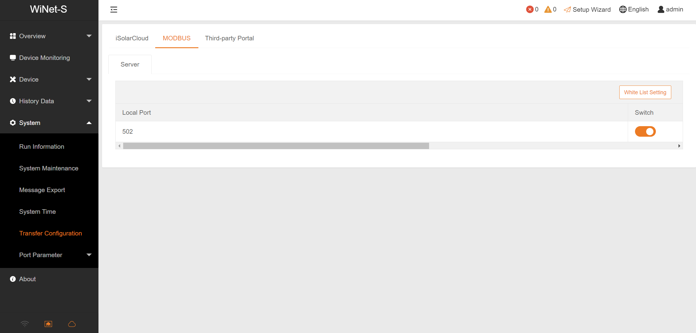

# Modbus Sungrow Binding

This binding integrates the sungrow inverters into openHAB.
It is based on the Sungrow specification "Communication Protocol of Residential Hybrid Inverter V1.0.23", which can be found here: https://github.com/bohdan-s/SunGather/issues/36.

## Supported Inverters

As defined within the spec mentioned above the following inverters are supported, but not all are tested yet:

- SH3K6
- SH4K6
- SH5K-20
- SH5K-V13
- SH3K6-30
- SH4K6-30
- SH5K-30
- SH3.0RS
- SH3.6RS
- SH4.0RS
- SH5.0RS
- SH6.0RS
- SH5.0RT
- SH6.0RT
- SH8.0RT
- SH10RT

## Supported Things

The binding supports only one thing:

- `sungrow-inverter`: The sungrow inverter

## Preparation

The data from the inverter is read via Modbus. So you need to configure a Modbus Serial Slave `serial` or Modbus TCP Slave `tcp` as bridge first.
If you are using a Modbus TCP Slave and the WiNet-S Communication Module please ensure:

- that you have the correct IP-Address of your WiNet-S Device
- that Modbus is enabled within the Communication Module
- that you've the correct port number
- that the white list is disabled or your openHAB instance IP is listed

Enabling modbus and whitelist setting can be done in WiNet-S Web-UI as shown below:


## Thing Configuration

Once you've configured the Modbus TCP Slave or Modbus Serial Slave as Bridge you can configure the Sungrow inverter thing.
You just have to select the configured bridge and optional configure the polling interval.

### Sungrow Inverter (`sungrow-inverter`)

| Name         | Type    | Description                          | Default | Required | Advanced |
|--------------|---------|--------------------------------------|---------|----------|----------|
| pollInterval | integer | Interval the device is polled in ms. | 5000    | yes      | no       |

## Channels

The `sungrow-inverter` thing has channels that serve the current state of the sungrow inverter, as you are used to from the iSolareCloud Website and App.

| Channel Type ID                    | Item Type                | Description                           | Advanced  | Channel Group       |
|------------------------------------|--------------------------|---------------------------------------|-----------|---------------------|
| sg-internal-temperature            | Number:Temperature       | Internal Temperature                  | yes       | Overview            |
| sg-total-dc-power                  | Number:Power             | Total DC Power                        | no        | Overview            |
| sg-phase-a-voltage                 | Number:ElectricPotential | Phase A Voltage                       | yes       | Overview            |
| sg-phase-b-voltage                 | Number:ElectricPotential | Phase B Voltage                       | yes       | Overview            |
| sg-phase-c-voltage                 | Number:ElectricPotential | Phase C Voltage                       | yes       | Overview            |
| sg-daily-pv-generation             | Number:Energy            | Daily PV Generation                   | no        | Overview            |
| sg-total-pv-generation             | Number:Energy            | Total PV Generation                   | no        | Overview            |
| sg-reactive-power                  | Number:Power             | Reactive Power                        | yes       | Overview            |
| sg-power-factor                    | Number:Dimensionless     | Power Factor                          | yes       | Overview            |
| sg-phase-a-current                 | Number:ElectricCurrent   | Phase A Current                       | yes       | Overview            |
| sg-phase-b-current                 | Number:ElectricCurrent   | Phase B Current                       | yes       | Overview            |
| sg-phase-c-current                 | Number:ElectricCurrent   | Phase C Current                       | yes       | Overview            |
| sg-total-active-power              | Number:Power             | Total Active Power                    | no        | Overview            |
| sg-grid-frequency                  | Number:Frequency         | Grid Frequency                        | yes       | Overview            |
| sg-mppt1-voltage                   | Number:ElectricPotential | MPPT1 Voltage                         | yes       | MPPT Information    |
| sg-mppt1-current                   | Number:ElectricCurrent   | MPPT1 Current                         | yes       | MPPT Information    |
| sg-mppt2-voltage                   | Number:ElectricPotential | MPPT2 Voltage                         | yes       | MPPT Information    |
| sg-mppt2-current                   | Number:ElectricCurrent   | MPPT2 Current                         | yes       | MPPT Information    |
| sg-daily-battery-charge            | Number:Energy            | Daily Battery Charge                  | no        | Battery Information |
| sg-total-battery-charge            | Number:Energy            | Total Battery Charge                  | no        | Battery Information |
| sg-battery-voltage                 | Number:ElectricPotential | Battery Voltage                       | yes       | Battery Information |
| sg-battery-current                 | Number:ElectricCurrent   | Battery Current                       | yes       | Battery Information |
| sg-battery-power                   | Number:Power             | Battery Power                         | no        | Battery Information |
| sg-battery-level                   | Number:Dimensionless     | Battery Level                         | no        | Battery Information |
| sg-battery-healthy                 | Number:Dimensionless     | Battery Healthy                       | no        | Battery Information |
| sg-battery-temperature             | Number:Temperature       | Battery Temperature                   | no        | Battery Information |
| sg-daily-battery-discharge-energy  | Number:Energy            | Daily Battery Discharge Energy        | no        | Battery Information |
| sg-total-battery-discharge-energy  | Number:Energy            | Total Battery Discharge Energy        | no        | Battery Information |
| sg-battery-capacity                | Number:Energy            | Battery Capacity                      | no        | Battery Information |
| sg-daily-charge-energy             | Number:Energy            | Daily Charge Energy                   | no        | Battery Information |
| sg-total-charge-energy             | Number:Energy            | Total Charge Energy                   | no        | Battery Information |
| sg-daily-import-energy             | Number:Energy            | Daily Import Energy                   | no        | Grid Information    |
| sg-total-import-energy             | Number:Energy            | Total Import Energy                   | no        | Grid Information    |
| sg-daily-export-energy             | Number:Energy            | Daily Export Energy                   | no        | Grid Information    |
| sg-total-export-energy             | Number:Energy            | Total Export Energy                   | no        | Grid Information    |
| sg-daily-export-power-from-pv      | Number:Power             | Daily Export Power from PV            | no        | Grid Information    |
| sg-total-export-energy-from-pv     | Number:Energy            | Total Export Energy from PV           | no        | Grid Information    |
| sg-export-power                    | Number:Power             | Export Power                          | no        | Grid Information    |
| sg-load-power                      | Number:Power             | Load Power                            | no        | Load Information    |
| sg-daily-direct-energy-consumption | Number:Energy            | Daily Direct Energy Consumption       | no        | Load Information    |
| sg-total-direct-energy-consumption | Number:Energy            | Total Direct Energy Consumption       | no        | Load Information    |
| sg-self-consumption-today          | Number:Dimensionless     | Self Consumption Today                | no        | Load Information    |

## Full Example

This example shows how to configure a sungrow inverter connected via modbus and uses the most common channels.

_sungrow.things_

```java
Bridge modbus:tcp:sungrowBridge [ host="10.0.0.2", port=502, id=1, enableDiscovery=false ] {
    Thing sungrow-inverter sungrowInverter "Sungrow Inverter" [ pollInterval=5000 ]
}
```

_sungrow.items_

```java
// Groups
Group sungrowInverter "Sungrow Inverter" ["Inverter"]
Group overview "Overview" (sungrowInverter)
Group batteryInformation "Battery information" (sungrowInverter)
Group gridInformation "Grid information" (sungrowInverter)
Group loadInformation "Load information" (sungrowInverter)

// Overview
Number:Power total_active_power "Total Active Power" (overview) ["Measurement", "Power"] {channel="modbus:sungrow-inverter:sungrowBridge:sungrowInverter:sg-overview#sg-total-active-power"}
Number:Power total_dc_power "Total DC Power" (overview) ["Measurement", "Power"] {channel="modbus:sungrow-inverter:sungrowBridge:sungrowInverter:sg-overview#sg-total-dc-power"}
Number:Energy daily_pv_generation "Daily PV Generation" (overview) ["Measurement", "Energy"] {channel="modbus:sungrow-inverter:sungrowBridge:sungrowInverter:sg-overview#sg-daily-pv-generation"}
Number:Energy total_pv_generation "Total PV Generation" (overview) ["Measurement", "Energy"]  {channel="modbus:sungrow-inverter:sungrowBridge:sungrowInverter:sg-overview#sg-total-pv-generation"}

// Battery information
Number:Power battery_power "Battery Power" (batteryInformation) ["Measurement", "Power"] {channel="modbus:sungrow-inverter:sungrowBridge:sungrowInverter:sg-battery-information#sg-battery-power"}
Number:Dimensionless battery_level "Battery Level" (batteryInformation) ["Measurement", "Energy"] {channel="modbus:sungrow-inverter:sungrowBridge:sungrowInverter:sg-battery-information#sg-battery-level"}
Number:Energy daily_charge_energy "Daily Battery Charge Energy" (batteryInformation) ["Measurement", "Energy"] {channel="modbus:sungrow-inverter:sungrowBridge:sungrowInverter:sg-battery-information#sg-daily-charge-energy"}
Number:Energy daily_discharge_energy "Daily Battery Discharge Energy" (batteryInformation) ["Measurement", "Energy"] {channel="modbus:sungrow-inverter:sungrowBridge:sungrowInverter:sg-battery-information#sg-daily-battery-discharge-energy"}

// Grid information
Number:Power export_power "Export Power" (gridInformation) ["Measurement", "Power"] {channel="modbus:sungrow-inverter:sungrowBridge:sungrowInverter:sg-grid-information#sg-export-power"}
Number:Energy daily_export_energy "Daily Export Energy" (gridInformation) ["Measurement", "Energy"] {channel="modbus:sungrow-inverter:sungrowBridge:sungrowInverter:sg-grid-information#sg-daily-export-energy"}
Number:Energy daily_import_energy "Daily Import Energy" (gridInformation) ["Measurement", "Energy"] {channel="modbus:sungrow-inverter:sungrowBridge:sungrowInverter:sg-grid-information#sg-daily-import-energy"}

// Load information
Number:Power load_power "Load Power" (loadInformation) ["Measurement", "Power"] {channel="modbus:sungrow-inverter:sungrowBridge:sungrowInverter:sg-load-information#sg-load-power"}
Number:Energy daily_direct_energy_consumption "Daily Direct Energy Consumption" (loadInformation) ["Measurement", "Energy"] {channel="modbus:sungrow-inverter:sungrowBridge:sungrowInverter:sg-load-information#sg-daily-direct-energy-consumption"}
```

_sungrow.sitemap_

```perl
sitemap sungrow label="Sungrow Binding"
{
    Frame {
        Text item=total_active_power
        Text item=total_dc_power
        Text item=daily_pv_generation
        Text item=total_pv_generation

        Text item=battery_power
        Text item=battery_level
        Text item=daily_charge_energy
        Text item=daily_discharge_energy

        Text item=export_power
        Text item=daily_export_energy
        Text item=daily_import_energy

        Text item=load_power
        Text item=daily_direct_energy_consumption
    }
}
```
