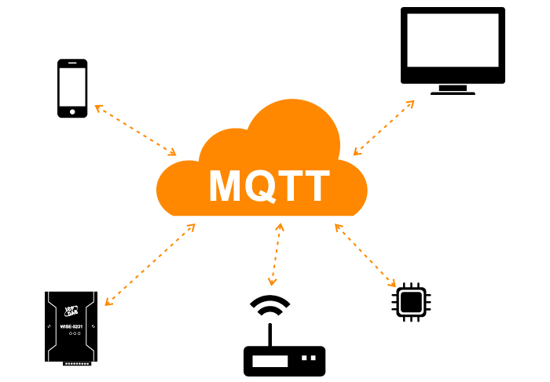
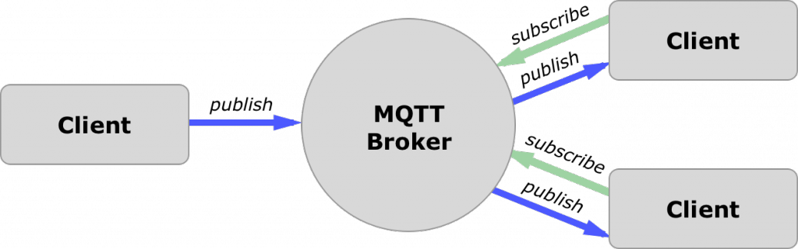

# MQTT Things and Channels Binding

MQTT is one of the most commonly used protocols in IoT (Internet of Things) projects. It stands for Message Queuing Telemetry Transport.

It is designed as a lightweight messaging protocol that uses publish/subscribe operations to exchange data between clients and the server.



MQTT servers are called brokers and the clients are simply the connected devices.

- When a device (a client) wants to send data to the broker, we call this operation a “publish”.
- When a device (a client) wants to receive data from the broker, we call this operation a “subscribe”.



openHAB itself is not an MQTT Broker and needs to connect to one as a regular client.
You can use any of the freely available MQTT Brokers like [Mosquitto](https://mosquitto.org/).

This particular binding allows to configure connections to brokers via openHAB Things, and configure channels corresponding to MQTT topics.
This binding does NOT perform auto-discovery of available MQTT topics.
Please check out the available extensions:

<!--list-subs-->

## MQTT Topics

If a client subscribes to a broker, it is certainly not interested in all published messages.
Instead it subscribes to specific **topics**. A topic can look like this: "mydevice/temperature".

Example:

Let's assume there is an MQTT capable light bulb.

It has a unique id amongst all light bulbs, say "device123".
The manufacturer accepts new brightness values on "device123/brightness/set".
In openHAB we call that a **command topic**.

And now assume that we have a mobile phone (or openHAB itself) and we register with the MQTT broker, and want to retrieve the current brightness value.
The manufacturer specified that this value can be found on "device123/brightness". In openHAB we call that a **state topic**.

This pattern is very common, that you have a command and a state topic.
A sensor would only have a state topic, naturally.

Because every manufacturer can decide on his own on which topic his devices publish, this binding can unfortunately not provide any auto-discovery means.

If you use an open source IoT device, the chances are high, that it has the MQTT Homie convention or HomeAssistant implemented.
Those conventions specify the topic topology and allow auto discovery.
Please have a look at the specific openHAB bindings.

## Supported Bridges

- Broker: This bridge represents an MQTT Broker connection, configured and managed by this binding.

## Bridge Configuration

Required configuration parameters are:

- **host**: The IP/Hostname of the MQTT broker. Be aware that this binding allows only one bridge / one connection per unique host:port.
- **port**: The optional port of the MQTT broker. If none is provided, the typical ports 1883 and 8883 (SSL) are used. Be aware that this binding allows only one bridge / one connection per unique host:port.
- **secure**: Uses TLS/SSL to establish a secure connection to the broker. Can be true or false. Defaults to false.

Additionally the following parameters can be set:

- **hostnameValidated**: Validate hostname from certificate against server hostname for secure connection. Defaults to true.
- **protocol**:  The protocol used for communicating with the broker (TCP, WEBSOCKETS). Defaults to TCP.
- **mqttVersion**: The MQTT version used for communicating with the broker (V3, V5). Defaults to V3.
- **qos**: Quality of Service. Can be 0, 1 or 2. Please read the MQTT specification for details. Defaults to 0.
- **clientID**: Use a fixed client ID. Defaults to empty which means a client ID is generated for this connection.

Reconnect parameters are:

- **reconnectTime**: Reconnect time in ms. If a connection is lost, the binding will wait this time before it tries to reconnect. Defaults to 60000 (60s).
- **keepAlive**: Keep alive / heartbeat timer in s. It can take up to this time to determine if a server connection is lost. A lower value may keep the broker unnecessarily busy for no or little additional value. Defaults to 60s.

An MQTT last will and testament can be configured:

- **lwtMessage**: An optional last will and testament message. Defaults to empty.
- **lwtTopic**: The last will topic. Defaults to empty and therefore disables the last will.
- **lwtQos**: The optional qos of the last will. Defaults to 0.
- **lwtRetain**: Retain last will message. Defaults to true.

An MQTT message can be published upon a successful connection to the MQTT broker with these parameters:

- **birthMessage**: An optional message to be published once the bridge established a connection to the MQTT broker. Defaults to empty.
- **birthTopic**: The birth topic. Defaults to empty and therefore no birth message will be published.
- **birthRetain**: Retain the birth message. Defaults to true.

An MQTT message can be published just before disconnecting from the broker with these parameters:

- **shutdownMessage**: An optional message to be published before the bridge disconnects from the MQTT broker. Defaults to empty.
- **shutdownTopic**: The shutdown topic. Defaults to empty and therefore no shutdown message will be published.
- **shutdownRetain**: Retain the shutdown message. Defaults to true.

For more security, the following optional parameters can be altered:

- **username**: The MQTT username (since MQTT 3.1). Defaults to empty.
- **password**: The MQTT password (since MQTT 3.1). Defaults to empty.
- **certificatepin**: If this is set: After the next connection has been successfully established, the certificate is pinned. The connection will be refused if another certificate is used. Clear **certificate** to allow a new certificate for the next connection attempt. This option will increase security.
- **publickeypin**: If this is set: After the next connection has been successfully established, the public key of the broker is pinned. The connection will be refused if another public key is used. Clear **publickey** to allow a new public key for the next connection attempt. This option will increase security.
- **certificate**: The certificate hash. If **certificatepin** is set this hash is used to verify the connection. Clear to allow a new certificate pinning on the next connection attempt. If empty will be filled automatically by the next successful connection. An example input would be `SHA-256:83F9171E06A313118889F7D79302BD1B7A2042EE0CFD029ABF8DD06FFA6CD9D3`.
- **publickey**: The public key hash. If **publickeypin** is set this hash is used to verify the connection. Clear to allow a new public key pinning on the next connection attempt. If empty will be filled automatically by the next successful connection. An example input would be `SHA-256:83F9171E06A313118889F7D79302BD1B7A2042EE0CFD029ABF8DD06FFA6CD9D3`.

By default discovery services (like homie or homeassistant) are enabled on a broker.
This behaviour can be controlled with a configuration parameter.

- **enableDiscovery**: If set to true, enables discovery on this broker; if set to false, disables discovery services on this broker.

## Broker Channels

You can extend your broker connection bridges with a channel:

- **publishTrigger**: This channel is triggered when a value is published to the configured MQTT topic on this broker connection. By default, the event payload (in `receivedEvent`) is the received MQTT topic value only. If a separator is configured (see channel config), the payload will contain the topic and the value separated by that character (e.g., `my_topic#my_value`).

Configuration parameters are:

- **stateTopic**: This channel will trigger on this MQTT topic. This topic can contain wildcards like + and # for example "all/in/#" or "sensors/+/config".
- **payload**: An optional condition on the value of the MQTT topic that must match before this channel is triggered.

Note for new users - direct broker Bridge channels are rarely needed. You almost certainly will want to be using one of the binding extensions, or the generic Things and Channels features for most devices or services.

## Supported Things

Because of the very generic structure of MQTT, this binding allows you to add an arbitrary number
of so called "Generic MQTT Things" to organize yourself.

On each of those things you can add an arbitrary number of channels.

Remember that you need a configured broker Thing first!

### Thing Configuration

The following optional parameters can be set for the Thing:

- **availabilityTopic**: The MQTT topic that represents the availability of the Thing. This can be the Thing's LWT topic.
- **payloadAvailable**: Payload of the `Availability Topic`, when the device is available. Default: `ON`.
- **payloadNotAvailable**: Payload of the `Availability Topic`, when the device is _not_ available. Default: `OFF`.
- **transformationPattern**: An optional transformation pattern like [JSONPath](https://goessner.net/articles/JsonPath/index.html#e2) that is applied to the incoming availability payload.
  The result of the transformations is then checked against `payloadAvailable` and `payloadNotAvailable`.

## Supported Channels

You can add the following channels:

- **string**: This channel can show the received text on the given topic and can send text to a given topic.
- **number**: This channel can show the received number on the given topic and can send a number to a given topic. It can have a min, max and step values.
- **dimmer**: This channel handles numeric values as percentages. It can have min, max and step values.
- **contact**: This channel represents an open/close state of a given topic.
- **switch**: This channel represents an on/off state of a given topic and can send an on/off value to a given topic.
- **colorRGB**: This channel handles color values in RGB format. (Deprecated)
- **colorHSB**: This channel handles color values in HSB format. (Deprecated)
- **color**: This channel handles color values in HSB, RGB or xyY (x,y,brightness) formats.
- **location**: This channel handles a location.
- **image**: This channel handles binary images in common java supported formats (bmp,jpg,png).
- **datetime**: This channel handles date/time values.
- **rollershutter**: This channel is for rollershutters.

## Channel Configuration

- **stateTopic**: The MQTT topic that represents the state of the Thing. This can be empty, the Thing channel will be a state-less trigger then. You can use a wildcard topic like "sensors/+/event" to retrieve state from multiple MQTT topics.
- **transformationPattern**: An optional transformation pattern like [JSONPath](https://goessner.net/articles/JsonPath/index.html#e2) that is applied to all incoming MQTT values.
- **transformationPatternOut**: An optional transformation pattern like [JSONPath](https://goessner.net/articles/JsonPath/index.html#e2) that is applied before publishing a value to MQTT.
- **commandTopic**: The MQTT topic that commands are send to. This can be empty, the Thing channel will be read-only then. Transformations are not applied for sending data.
- **formatBeforePublish**: Format a value before it is published to the MQTT broker. The default is to just pass the channel/item state. If you want to apply a prefix, say "MYCOLOR,", you would use "MYCOLOR,%s". Currently only "%s" is supported. Note that this format does not apply to the special on/off command values for dimmer channels, or up/down/stop command values for rollershutter channels.
- **postCommand**: If `true`, the received MQTT value will not only update the state of linked items, but command it.
  The default is `false`.
  You usually need this to be `true` if your item is also linked to another channel, say a KNX actor, and you want a received MQTT payload to command that KNX actor.
- **retained**: The value will be published to the command topic as retained message. A retained value stays on the broker and can even be seen by MQTT clients that are subscribing at a later point in time.
- **qos**: QoS of this channel. Overrides the connection QoS (defined in broker connection).
- **trigger**: If `true`, the state topic will not update a state, but trigger a channel instead.

### Channel Type "string"

- **allowedStates**: An optional comma-separated list of allowed states. Example: "ONE,TWO,THREE"

You can connect this channel to a String item.

### Channel Type "number"

- **min**: An optional minimum value.
- **max**: An optional maximum value.
- **step**: For decrease, increase commands the step needs to be known
- **unit**: Unit of measurement (optional). For supported units see [OpenHAB: List of Units](https://www.openhab.org/docs/concepts/units-of-measurement.html#list-of-units). Examples: "°C", "°F"

A decimal value (like 0.2) is sent to the MQTT topic if the number has a fractional part.
If you always require an integer, please use the formatter.

You can connect this channel to a Number item.

### Channel Type "dimmer"

- **on**: An optional string (like "ON"/"Open") that is sent for the `ON` command to tell the device to turn on to whatever value it thinks is useful (i.e. restore last state).
- **off**: An optional string (like "OFF"/"Close") that is sent for the `OFF` command.
- **min**: A required minimum value.
- **max**: A required maximum value.
- **step**: For decrease, increase commands the step needs to be known

If **on** or **off** are not defined, an explicit 0 or 100 will be sent (after being scaled by **min** and **max** as appropriate).
Note that **formatBeforePublish** will be ignored for these values, in case your device uses a vastly different format for these special commands than it does for number values.

The value is internally stored as a percentage for a value between **min** and **max**.

The channel will publish a value between `min` and `max`.

You can connect this channel to a Rollershutter or Dimmer item.

### Channel Type "contact", "switch"

- **on**: An optional number (like 1, 10) or a string (like "ON"/"Open") that is recognized as on/open state.
- **off**: An optional number (like 0, -10) or a string (like "OFF"/"Close") that is recognized as off/closed state.

The contact channel by default recognizes `"OPEN"` and `"CLOSED"`. You can connect this channel to a Contact item.
The switch channel by default recognizes `"ON"` and `"OFF"`. You can connect this channel to a Switch item.

If **on** and **off** are not configured it publishes the strings mentioned before respectively.

You can connect this channel to a Contact or Switch item.

### Channel Type "color"

- **colorMode**: An optional string that defines the color representation: `HSB`, `RGB` or `XYY` (x,y,brightness). Defaults to `HSB` when not specified.
- **on**: An optional string (like "ON"/"Open") that is sent for the `ON` command to tell the device to turn on to whatever value it thinks is useful (i.e. restore last state).
- **off**: An optional string (like "OFF"/"Close") that is sent for the `OFF` command.
- **onBrightness**: If you connect this channel to a Switch item and turn it on, color and saturation are preserved from the last state, but the brightness will be set to this configured initial brightness (default: 10%).

You can connect this channel to a Color, Dimmer and Switch item.

This channel will publish the color as a comma-separated list to the MQTT broker,
e.g. "112,54,123" for the RGB color mode (0-255 per component), "360,100,100" for the HSB color mode (0-359 for hue and 0-100 for saturation and brightness),
and "0.640074,0.329970,100" for the xyY color mode (0-1 for x and y, and 0-100 for brightness).

The channel expects values on the corresponding MQTT topic to be in this format as well.

If **on** or **off** are not defined, a color command with the brightness set to 0 or 100 will be sent.
Note that **formatBeforePublish** will be ignored for these values, in case your device uses a vastly different format for these special commands than it does for regular values.

### Channel Type "colorRGB", "colorHSB" (Deprecated)

- **on**: An optional string (like "BRIGHT") that is recognized as on state. (ON will always be recognized.)
- **off**: An optional string (like "DARK") that is recognized as off state. (OFF will always be recognized.)
- **onBrightness**: If you connect this channel to a Switch item and turn it on,

color and saturation are preserved from the last state, but
the brightness will be set to this configured initial brightness (default: 10%).

You can connect this channel to a Color, Dimmer and Switch item.

This channel will publish the color as a comma-separated list to the MQTT broker,
e.g. "112,54,123" for an RGB channel (0-255 per component) and "360,100,100" for a HSB channel (0-359 for hue and 0-100 for saturation and brightness).

The channel expects values on the corresponding MQTT topic to be in this format as well.

### Channel Type "location"

You can connect this channel to a Location item.

The channel will publish the location as a comma-separated list to the MQTT broker,
e.g. "112,54,123" for latitude, longitude, altitude. The altitude is optional.

The channel expects values on the corresponding MQTT topic to be in this format as well.

### Channel Type "image"

You can connect this channel to an Image item. This is a read-only channel.

The channel expects values on the corresponding MQTT topic to contain the binary
data of a bmp, jpg, png or any other format that the installed Java runtime supports.

### Channel Type "datetime"

You can connect this channel to a DateTime item.

The channel will publish the date/time in the format "yyyy-MM-dd'T'HH:mm:ss",
for example 2018-01-01T12:14:00. If you require another format, please use the formatter.

The channel expects values on the corresponding MQTT topic to be in this format as well.

### Channel Type "rollershutter"

- **on**: An optional string (like "Open") that is sent for the `UP` command.
- **off**: An optional string (like "Close") that is sent for the `DOWN` command.
- **stop**: An optional string (like "Stop") that is sent for the `STOP` command.
- **stopCommandTopic**: An optional topic to send `STOP` commands to. If not set, `STOP` commands are sent to the main **commandTopic**.

If **on**, **off**, or **stop** are not defined, an explicit 0 or 100 will be sent for `UP` and `DOWN` respectively. `STOP` commands will be ignored entirely.
Note that **formatBeforePublish** will be ignored for these values, in case your device uses a vastly different format for these special commands than it does for number values.

You can connect this channel to a Rollershutter or Dimmer item.

## Rule Actions

This binding includes a rule action, which allows one to publish MQTT messages from within rules.
There is a separate instance for each MQTT broker (i.e. bridge), which can be retrieved through

```java
val mqttActions = getActions("mqtt","mqtt:broker:myBroker")
```

where the first parameter always has to be `mqtt` and the second (`mqtt:broker:myBroker`) is the Thing UID of the broker that should be used.
Once this action instance is retrieved, you can invoke the `publishMQTT(String topic, String value, Boolean retained)` method on it:

```java
mqttActions.publishMQTT("mytopic","myvalue", true)
```

Alternatively, `publishMQTT(String topic, byte[] value, Boolean retained)` can publish a byte array data.

The retained argument is optional and if not supplied defaults to `false`.

## Configuration via Text Files

_broker.things_ file:

```java
mqtt:broker:mySecureBroker [ host="192.168.0.41", secure=true, certificatepin=true, publickeypin=true ]
mqtt:broker:myInsecureBroker [ host="192.168.0.42", secure=false ]
mqtt:broker:myAuthenticatedBroker [ host="192.168.0.43",secure=true, username="user", password="password" ]
mqtt:broker:pinToPublicKey [ host="192.168.0.44", secure=true , publickeypin=true, publickey="SHA-256:9a6f30e67ae9723579da2575c35daf7da3b370b04ac0bde031f5e1f5e4617eb8" ]
```

In the first example a secure connection to a broker is defined. It pins the returned certificate and public key. If someone tries a man in the middle attack later on, this broker connection will recognize it and refuse a connection. Be aware that if your brokers certificate changes, you need to remove the connection entry and add it again.
The second connection is a plain, unsecured one. Use this only for local MQTT Brokers.
A third connection uses a username and password for authentication. The credentials are plain values on the wire, therefore you should only use this on a secure connection.
In a fourth connection, the public key pinning is enabled again. This time, a public key hash is provided to pin the connection to a specific server. It follows the form "hashname:hashvalue". Valid hashnames are SHA-1, SHA-224, SHA-256, SHA-384, SHA-512 and all others listed in Java MessageDigest Algorithms.

### Examples

Files can also be used to create topic things and channels and to combine them with a broker connection:

_mqtt.things_ file:

```java
Bridge mqtt:broker:myInsecureBroker [ host="192.168.0.42", secure=false ]

Thing mqtt:topic:mything "mything" (mqtt:broker:myInsecureBroker) {
    Channels:
    Type switch : lamp "Kitchen Lamp" [ stateTopic="lamp/enabled", commandTopic="lamp/enabled/set" ]
    Type switch : fancylamp "Fancy Lamp" [ stateTopic="fancy/lamp/state", commandTopic="fancy/lamp/command", on="i-am-on", off="i-am-off" ]
    Type string : alarmpanel "Alarm system" [ stateTopic="alarm/panel/state", commandTopic="alarm/panel/set", allowedStates="ARMED_HOME,ARMED_AWAY,UNARMED" ]
    Type color : lampcolor "Kitchen Lamp color" [ stateTopic="lamp/color", commandTopic="lamp/color/set", colorMode="RGB" ]
    Type dimmer : blind "Blind" [ stateTopic="blind/state", commandTopic="blind/set", min=0, max=5, step=1 ]
}
```

If the availability status is available, it can be configured to set the Thing status:

```java
Thing mqtt:topic:bedroom1-switch (mqtt:broker:myInsecureBroker) [ availabilityTopic="tele/bedroom1-switch/LWT", payloadAvailable="Online", payloadNotAvailable="Offline" ] {
    Channels:
         Type switch : power [ stateTopic="stat/bedroom1-switch/RESULT", transformationPattern="REGEX((.*POWER.*))∩JSONPATH($.POWER)", commandTopic="cmnd/bedroom1-switch/POWER" ]
}
```

The transformation pattern can be chained using the intersection character "∩" as above, or by listing them separately:

```java
Thing mqtt:topic:bedroom1-switch (mqtt:broker:myInsecureBroker) [ availabilityTopic="tele/bedroom1-switch/LWT", payloadAvailable="Online", payloadNotAvailable="Offline" ] {
    Channels:
         Type switch : power [ stateTopic="stat/bedroom1-switch/RESULT", transformationPattern="REGEX((.*POWER.*))","JSONPATH($.POWER)", commandTopic="cmnd/bedroom1-switch/POWER" ]
}
```

## Limitations

- The HomeAssistant Fan components only support ON/OFF.
- The HomeAssistant Cover components only support OPEN/CLOSE/STOP.
- The HomeAssistant Light component does not support XY color changes.
- The HomeAssistant Climate components are not yet supported.

## Value Transformations

[Transformations](/docs/configuration/transformations.html) can be applied to:

- Incoming availability payload
- Incoming value
- Outgoing value

Transformations can be chained in the UI by listing each transformation on a separate line, or by separating them with the mathematical intersection character "∩".
Transformations are defined using this syntax: `TYPE(FUNCTION)`, e.g.: `JSONPATH($.path)`.
The syntax: `TYPE:FUNCTION` is still supported, e.g.: `JSONPATH:$.path`.
Please note that the values will be discarded if one of the transformations failed (e.g. REGEX did not match) or returned `null`.

## Incoming Value Transformation

All mentioned channels allow an optional transformation for incoming MQTT topic values.

This is required if your received value is wrapped in a JSON or XML response.

Here are a few examples to unwrap a value from a complex response:

| Received value                                                      | Tr. Service      | Transformation                             |
| ------------------------------------------------------------------- | ---------------- | ------------------------------------------ |
| `{device: {status: { temperature: 23.2 }}}`                         | JSONPATH         | `JSONPATH($.device.status.temperature)`    |
| `<device><status><temperature>23.2</temperature></status></device>` | XPath            | `XPath(/device/status/temperature/text())` |
| `THEVALUE:23.2°C`                                                   | REGEX            | `REGEX(:(.*?)°)`                           |
| `abc`                                                               | JS (UI defined)  | `JS(config:js:35edb3735a)`                 |
| `abc`                                                               | JS (file based)  | `JS(to_uppercase.js)`                      |
| `abc`                                                               | JS (inline)      | `JS(\| input.toUpperCase() )`              |
| `true`                                                              | MAP (UI defined) | `MAP(config:map:54facda0f7)`               |
| `true`                                                              | MAP (file based) | `MAP(status.map)`                          |
| `true`                                                              | MAP (inline)     | `MAP(\|true=ON;false=OFF)`                 |

## Outgoing Value Transformation

All mentioned channels allow an optional transformation for outgoing values.
Please prefer formatting as described in the next section whenever possible.

## Format before Publish

This feature is quite powerful in transforming an item state before it is published to the MQTT broker.
It has the syntax: `%[flags][width]conversion`.
Find the full documentation on the [Java](https://docs.oracle.com/en/java/javase/21/docs/api/java.base/java/util/Formatter.html) web page.

The default is "%s" which means: Output the item state as string.

Here are a few examples:

- All uppercase: "%S". Just use the upper case letter for the conversion argument.
- Apply a prefix: "myprefix%s"
- Apply a suffix: "%s suffix"
- Number precision: ".4f" for a 4 digit precision. Use the "+" flag to always add a sign: "+.4f".
- Decimal to Hexadecimal/Octal/Scientific: For example "60" with "%x", "%o", "%e" becomes "3C", "74", "60".
- Date/Time: To reference the item state multiple times, use "%1$". Use the "tX" conversion where "X" can be any of [h,H,m,M,I,k,l,S,p,B,b,A,a,y,Y,d,e].
  - For an output of _May 23, 1995_ use "%1$**tb** %1$**te**,%1$**tY**".
  - For an output of _23.05.1995_ use "%1$**td**.%1$**tm**.%1$**tY**".
  - For an output of _23:15_ use "%1$**tH**:%1$**tM**".

Default pattern applied for each type:

| Type              | Parameter                          | Pattern                                     | Comment                                                                                                                |
| ----------------- | ---------------------------------- | ------------------------------------------- | ---------------------------------------------------------------------------------------------------------------------- |
| **string**        | String                             | "%s"                                        |                                                                                                                        |
| **number**        | BigDecimal                         | "%f"                                        | The default will remove trailing zeros after the decimal point.                                                        |
| **dimmer**        | BigDecimal                         | "%f"                                        | The default will remove trailing zeros after the decimal point.                                                        |
| **contact**       | String                             | --                                          | No pattern supported. Always **on** and **off** strings.                                                               |
| **switch**        | String                             | --                                          | No pattern supported. Always **on** and **off** strings.                                                               |
| **colorRGB**      | BigDecimal, BigDecimal, BigDecimal | "%1$d,%2$d,%3$d"                            | Parameters are **red**, **green** and **blue** components.                                                             |
| **colorHSB**      | BigDecimal, BigDecimal, BigDecimal | "%1$d,%2$d,%3$d"                            | Parameters are **hue**, **saturation** and **brightness** components.                                                  |
| **location**      | BigDecimal, BigDecimal             | "%2$f,%3$f,%1$f"                            | Parameters are **altitude**, **latitude** and **longitude**, altitude is only in default pattern, if value is not '0'. |
| **image**         | --                                 | --                                          | No publishing supported.                                                                                               |
| **datetime**      | ZonedDateTime                      | "%1$tY-%1$tm-%1$tdT%1$tH:%1$tM:%1$tS.%1$tN" | Trailing zeros of the nanoseconds are removed.                                                                         |
| **rollershutter** | String                             | "%s"                                        | No pattern supported. Always **up**, **down**, **stop** string or integer percent value.                               |

Any outgoing value transformation will **always** result in a **string** value.

## Troubleshooting

- If you get the error "No MQTT client": Please update your installation.
- If you use the Mosquitto broker: Please be aware that there is a relatively low setting for retained messages. If at some point messages stop being delivered change the setting.
