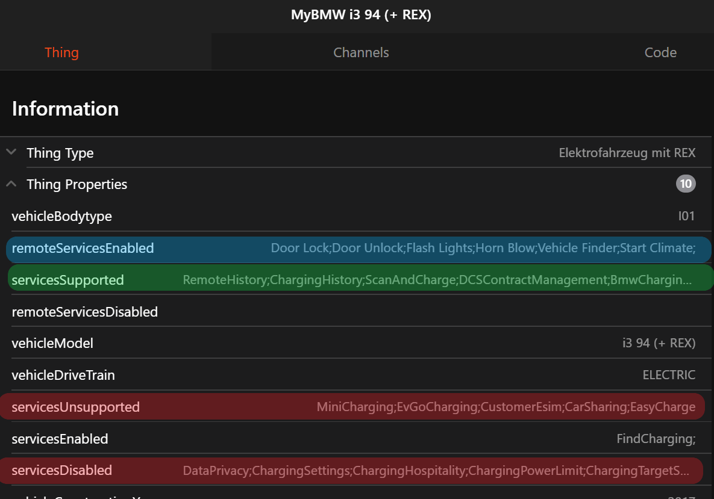
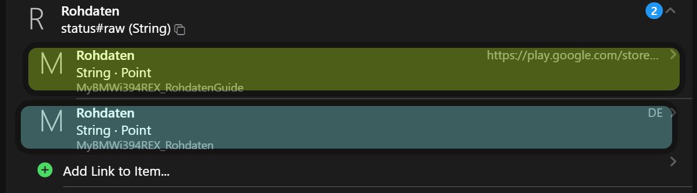
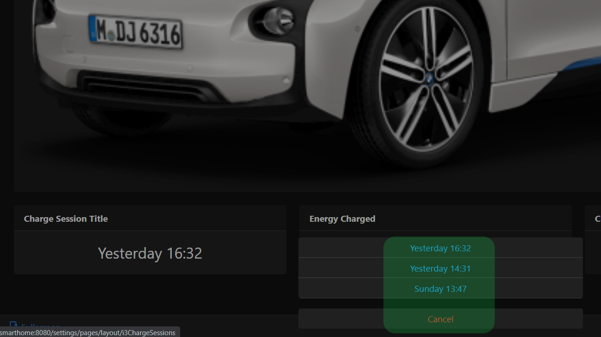
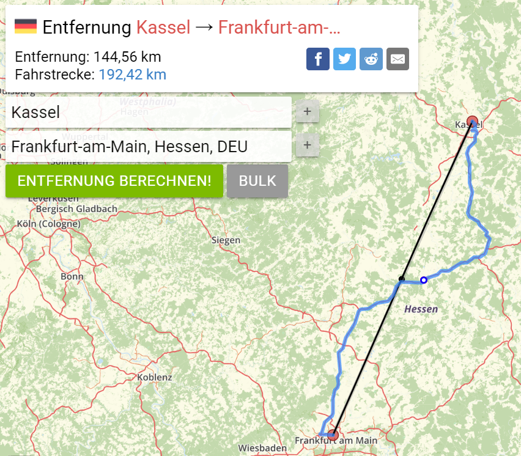

# MyBMW Binding

The binding provides access like [MyBMW App](https://www.bmw.com/en/footer/mybmw-app.html) to openHAB.
All vehicles connected to an account will be detected by the discovery with the correct type:

- Conventional Fuel Vehicle
- Plugin-Hybrid Electrical Vehicle
- Battery Electric Vehicle with Range Extender
- Battery Electric Vehicle

In addition properties are attached with information and services provided by this vehicle.
The provided data depends on

1. the [Thing Type](#things) and
1. the [Properties](#properties) mentioned in Services

Different channel groups are clustering all information.
Check for each group if it's supported by your vehicle.

Please note **this isn't a real-time binding**.
If a door is opened the state isn't transmitted and changed immediately.
It's not a flaw in the binding itself because the state in BMW's own MyBMW App is also updated with some delay.

## Supported Things

### Bridge

The bridge establishes the connection between BMW API and openHAB.

| Name                       | Bridge Type ID | Description                              |
|----------------------------|----------------|------------------------------------------|
| MyBMW Account              | `account`      | Access to BMW API for a specific user    |

### Things

Four different vehicle types are provided.
They differ in the supported channel groups & channels.
Conventional Fuel Vehicles don't provide e.g. _Charging Profile_, Electric Vehicles don't provide a _Fuel Range_.
For hybrid vehicles in addition to _Fuel and Electric Range_ the _Hybrid Range_ is shown.

| Name                                | Thing Type ID | Supported Channel Groups                                            |
|-------------------------------------|---------------|---------------------------------------------------------------------|
| BMW Electric Vehicle                | `bev`         | Vehicle with electric drive train                                   |
| BMW Electric Vehicle with REX       | `bev_rex`     | Vehicle with electric drive train plus fuel powered range extender  |
| BMW Plug-In-Hybrid Electric Vehicle | `phev`        | Vehicle with combustion and electric drive train                    |
| BMW Conventional Vehicle            | `conv`        | Vehicle with combustion drive train                                 |

#### Properties



For each vehicle properties are available.
Basic information is given regarding

- Vehicle properties like model type, drive train and construction year
- Which services are available / not available

In the right picture can see in _remoteServicesEnabled_ e.g. the _Door Lock_ and _Door Unlock_ services are mentioned.
This ensures channel group [Remote Services](#remote-services) is supporting door lock and unlock remote control.

In _Services Supported_ the entry _ChargingHistory_ is mentioned.
So it's valid to connect channel group [Charge Sessions](#charge-sessions) in order to display your last charging sessions.

| Property Key           | Property Value      |  Supported Channel Groups    |
|------------------------|---------------------|------------------------------|
| servicesSupported      | ChargingHistory     | session                      |
| remoteServicesEnabled  | _list of services_  | remote                       |

## Discovery

Auto discovery is starting after the bridge is created.
A list of your registered vehicles is queried and all found things are added in the inbox.
Unique identifier is the _Vehicle Identification Number_ (VIN).
If a thing is already declared in a  _.things_ configuration, discovery won't highlight it again.
Properties will be attached to predefined vehicles if the VIN is matching.

## Configuration

### Bridge Configuration

| Parameter       | Type    | Description                                                        |
|-----------------|---------|--------------------------------------------------------------------|
| userName        | text    | MyBMW Username                                                     |
| password        | text    | MyBMW Password                                                     |
| region          | text    | Select region in order to connect to the appropriate BMW server.   |

The region Configuration has 3 different options

- _NORTH_AMERICA_
- _CHINA_
- _ROW_  (Rest of World)

#### Advanced Configuration

| Parameter       | Type    | Description                                             |
|-----------------|---------|---------------------------------------------------------|
| language        | text    | Channel data can be returned in the desired language    |

Language is predefined as _AUTODETECT_.
Some textual descriptions, date and times are delivered based on your local language.
You can overwrite this setting with lowercase 2-letter [language code reagrding ISO 639](https://www.oracle.com/java/technologies/javase/jdk8-jre8-suported-locales.html)
So if want your UI in english language place _en_ as desired language.

### Thing Configuration

Same configuration is needed for all things

| Parameter       | Type    | Description                           |
|-----------------|---------|---------------------------------------|
| vin             | text    | Vehicle Identification Number (VIN)   |
| refreshInterval | integer | Refresh Interval in Minutes           |

#### Advanced Configuration

| Parameter       | Type    | Description                       |
|-----------------|---------|-----------------------------------|
| vehicleBrand    | text    | Vehicle Brand like BMW or Mini    |

The _vehicleBrand_ is automatically obtained by the discovery service and shall not be changed.
If thing is defined manually via *.things file following brands are supported

- BMW
- MINI

## Channels

There are many channels available for each vehicle.
For better overview they are clustered in different channel groups.
They differ for each vehicle type, build-in sensors and activated services.

### Thing Channel Groups

| Channel Group ID                 | Description                                       | conv | phev | bev_rex | bev |
|----------------------------------|---------------------------------------------------|------|------|---------|-----|
| [status](#vehicle-status)        | Overall vehicle status                            |  X   |  X   |    X    |  X  |
| [range](#range-data)             | Provides mileage, range and charge / fuel levels  |  X   |  X   |    X    |  X  |
| [doors](#doors-details)          | Detials of all doors and windows                  |  X   |  X   |    X    |  X  |
| [check](#check-control)          | Shows current active CheckControl messages        |  X   |  X   |    X    |  X  |
| [service](#services)             | Future vehicle service schedules                  |  X   |  X   |    X    |  X  |
| [location](#location)            | Coordinates and heading of the vehicle            |  X   |  X   |    X    |  X  |
| [remote](#remote-services)       | Remote control of the vehicle                     |  X   |  X   |    X    |  X  |
| [profile](#charge-profile)       | Scheduled charging profiles of vehicle            |      |  X   |    X    |  X  |
| [statistic](#charge-statistics)  | Charging statistics of current month              |      |  X   |    X    |  X  |
| [session](#charge-sessions)      | Past charging sessions                            |      |  X   |    X    |  X  |
| [tires](#tire-pressure)          | Current and wanted pressure for all tires         |  X   |  X   |    X    |  X  |
| [image](#image)                  | Provides an image of your vehicle                 |  X   |  X   |    X    |  X  |

#### Vehicle Status

Reflects overall status of the vehicle.

- Channel Group ID is **status**
- Available for all vehicles
- Read-only values

| Channel Label             | Channel ID          | Type          | Description                                    | conv | phev | bev_rex | bev |
|---------------------------|---------------------|---------------|------------------------------------------------|------|------|---------|-----|
| Overall Door Status       | doors               | String        | Combined status for all doors                  |  X   |  X   |    X    |  X  |
| Overall Window Status     | windows             | String        | Combined status for all windows                |  X   |  X   |    X    |  X  |
| Doors Locked              | lock                | String        | Status if vehicle is secured                   |  X   |  X   |    X    |  X  |
| Next Service Date         | service-date        | DateTime      | Date of next upcoming service                  |  X   |  X   |    X    |  X  |
| Mileage till Next Service | service-mileage     | Number:Length | Mileage till upcoming service                  |  X   |  X   |    X    |  X  |
| Check Control             | check-control       | String        | Presence of active warning messages            |  X   |  X   |    X    |  X  |
| Plug Connection Status    | plug-connection     | String        | Plug is _Connected_ or _Not connected_         |      |  X   |    X    |  X  |
| Charging Status           | charge              | String        | Current charging status                        |      |  X   |    X    |  X  |
| Remaining Charging Time   | charge-remaining    | Number:Time   | Remaining time for current charging session    |      |  X   |    X    |  X  |
| Last Status Timestamp     | last-update         | DateTime      | Date and time of last status update            |  X   |  X   |    X    |  X  |
| Last Fetched Timestamp    | last-fetched        | DateTime      | Date and time of last time status fetched      |  X   |  X   |    X    |  X  |

Overall Door Status values

- _Closed_ - all doors closed
- _Open_ - at least one door is open
- _Undef_ - no door data delivered at all

Overall Windows Status values

- _Closed_ - all windows closed
- _Open_ - at least one window is completely open
- _Intermediate_ - at least one window is partially open
- _Undef_ - no window data delivered at all

Check Control values

Localized String of current active warnings.
Examples:

- No Issues
- Multiple Issues

Charging Status values

- _Not Charging_
- _Charging_
- _Plugged In_
- _Fully Charged_

Charging Information values
Localized String of current active charging session
Examples

- 100% at ~00:43
- Starts at ~09:00

##### Vehicle Status Raw Data

The _raw data channel_ is marked as _advanced_ and isn't shown by default.
Target are advanced users to derive even more data out of BMW API replies.
As the replies are formatted as JSON use the [JsonPath Transformation Service](https://www.openhab.org/addons/transformations/jsonpath/) to extract data for an item,

| Channel Label             | Channel ID          | Type          | Description                                    |
|---------------------------|---------------------|---------------|------------------------------------------------|
| Raw Data                  | raw                 | String        | Unfiltered JSON String of vehicle data         |



Examples:

###### Country ISO Code

```json
$.properties.originCountryISO
```

###### Drivers Guide URL

```json
$.driverGuideInfo.androidStoreUrl
```

#### Range Data

Based on vehicle type some channels are present or not.
Conventional fuel vehicles don't provide _Electric Range_ and battery electric vehicles don't show _Fuel Range_.
Hybrid vehicles have both and in addition _Hybrid Range_.
See description [Range vs Range Radius](#range-vs-range-radius) to get more information.

- Channel Group ID is **range**
- Availability according to table
- Read-only values

| Channel Label                      | Channel ID                 | Type                 | conv | phev | bev_rex | bev |
|------------------------------------|----------------------------|----------------------|------|------|---------|-----|
| Mileage                            | mileage                    | Number:Length        |  X   |  X   |    X    |  X  |
| Fuel Range                         | range-fuel                 | Number:Length        |  X   |  X   |    X    |     |
| Electric Range                     | range-electric             | Number:Length        |      |  X   |    X    |  X  |
| Hybrid Range                       | range-hybrid               | Number:Length        |      |  X   |    X    |     |
| Battery Charge Level               | soc                        | Number:Dimensionless |      |  X   |    X    |  X  |
| Remaining Fuel                     | remaining-fuel             | Number:Volume        |  X   |  X   |    X    |     |
| Estimated Fuel Consumption l/100km | estimated-fuel-l-100km     | Number               |  X   |  X   |    X    |     |
| Estimated Fuel Consumption mpg     | estimated-fuel-mpg         | Number               |  X   |  X   |    X    |     |
| Fuel Range Radius                  | range-radius-fuel          | Number:Length        |  X   |  X   |    X    |     |
| Electric Range Radius              | range-radius-electric      | Number:Length        |      |  X   |    X    |  X  |
| Hybrid Range Radius                | range-radius-hybrid        | Number:Length        |      |  X   |    X    |     |

#### Doors Details

Detailed status of all doors and windows.

- Channel Group ID is **doors**
- Available for all vehicles if corresponding sensors are built-in
- Read-only values

| Channel Label              | Channel ID              | Type          |
|----------------------------|-------------------------|---------------|
| Driver Door                | driver-front            | String        |
| Driver Door Rear           | driver-rear             | String        |
| Passenger Door             | passenger-front         | String        |
| Passenger Door Rear        | passenger-rear          | String        |
| Trunk                      | trunk                   | String        |
| Hood                       | hood                    | String        |
| Driver Window              | win-driver-front        | String        |
| Driver Rear Window         | win-driver-rear         | String        |
| Passenger Window           | win-passenger-front     | String        |
| Passenger Rear Window      | win-passenger-rear      | String        |
| Rear Window                | win-rear                | String        |
| Sunroof                    | sunroof                 | String        |

Possible states

- _Undef_ - no status data available
- _Invalid_ - this door / window isn't applicable for this vehicle
- _Closed_ - the door / window is closed
- _Open_ - the door / window is open
- _Intermediate_ - window in intermediate position, not applicable for doors

#### Check Control

Group for all current active Check Control messages.
If more than one message is active the channel _name_ contains all active messages as options.

- Channel Group ID is **check**
- Available for all vehicles
- Read/Write access

| Channel Label                   | Channel ID          | Type           | Access     |
|---------------------------------|---------------------|----------------|------------|
| Check Control Description       | name                | String         | Read/Write |
| Check Control Details           | details             | String         | Read       |
| Severity Level                  | severity            | String         | Read       |

Severity Levels

- Ok
- Low
- Medium

#### Services

Group for all upcoming services with description, service date and/or service mileage.
If more than one service is scheduled in the future the channel _name_ contains all future services as options.

- Channel Group ID is **service**
- Available for all vehicles
- Read/Write access

| Channel Label                  | Channel ID          | Type           | Access     |
|--------------------------------|---------------------|----------------|------------|
| Service Name                   | name                | String         | Read/Write |
| Service Details                | details             | String         | Read       |
| Service Date                   | date                | DateTime       | Read       |
| Mileage till Service           | mileage             | Number:Length  | Read       |

#### Location

GPS location and heading of the vehicle.

- Channel Group ID is **location**
- Available for all vehicles with built-in GPS sensor. Function can be enabled/disabled in the head unit
- Read-only values

| Channel Label       | Channel ID          | Type          |
|---------------------|---------------------|---------------|
| GPS Coordinates     | gps                 | Location      |
| Heading             | heading             | Number:Angle  |
| Address             | address             | String        |
| Distance from Home  | home-distance       | Number:Length |

#### Remote Services

Remote control of the vehicle.
Send a _command_ to the vehicle and the _state_ is reporting the execution progress.
Only one command can be executed each time.
Parallel execution isn't supported.

- Channel Group ID is **remote**
- Available for all commands mentioned in _Services Activated_. See [Vehicle Properties](#properties) for further details
- Read/Write access

| Channel Label           | Channel ID          | Type    | Access |
|-------------------------|---------------------|---------|--------|
| Remote Service Command  | command             | String  | Write  |
| Service Execution State | state               | String  | Read   |

The channel _command_ provides options

- _light-flash_
- _vehicle-finder_
- _door-lock_
- _door-unlock_
- _horn-blow_
- _climate-now-start_
- _climate-now-stop_
- _charge-now_

The channel _state_ shows the progress of the command execution in the following order

1. _initiated_
1. _pending_
1. _delivered_
1. _executed_

#### Charge Profile

Charging options with date and time for preferred time windows and charging modes.

- Channel Group ID is **profile**
- Available for electric and hybrid vehicles
- Read access for UI.
- There are 4 timers _T1, T2, T3 and T4_ available. Replace _X_ with number 1,2 or 3 to target the correct timer

| Channel Label              | Channel ID                | Type     |
|----------------------------|---------------------------|----------|
| Charge Mode                | mode                      | String   |
| Charge Preferences         | prefs                     | String   |
| Charging Plan              | control                   | String   |
| SoC Target                 | target                    | String   |
| Charging Energy Limited    | limit                     | Switch   |
| Window Start Time          | window-start              | DateTime |
| Window End Time            | window-end                | DateTime |
| A/C at Departure           | climate                   | Switch   |
| T_X_ Enabled               | timer_X_-enabled          | Switch   |
| T_X_ Departure Time        | timer_X_-departure        | DateTime |
| T_X_ Monday                | timer_X_-day-mon          | Switch   |
| T_X_ Tuesday               | timer_X_-day-tue          | Switch   |
| T_X_ Wednesday             | timer_X_-day-wed          | Switch   |
| T_X_ Thursday              | timer_X_-day-thu          | Switch   |
| T_X_ Friday                | timer_X_-day-fri          | Switch   |
| T_X_ Saturday              | timer_X_-day-sat          | Switch   |
| T_X_ Sunday                | timer_X_-day-sun          | Switch   |

The channel _profile-mode_ supports

- _immediateCharging_
- _delayedCharging_

The channel _profile-prefs_ supports

- _noPreSelection_
- _chargingWindow_

#### Charge Statistics

Shows charge statistics of the current month

- Channel Group ID is **statistic**
- Available for electric and hybrid vehicles
- Read-only values

| Channel Label              | Channel ID              | Type           |
|----------------------------|-------------------------|----------------|
| Charge Statistic Month     | title                   | String         |
| Energy Charged             | energy                  | Number:Energy  |
| Charge Sessions            | sessions                | Number         |

#### Charge Sessions

Group for past charging sessions.
If more than one message is active the channel _name_ contains all active messages as options.

- Channel Group ID is **session**
- Available for electric and hybrid vehicles
- Read-only values

| Channel Label                   | Channel ID   | Type     |
|---------------------------------|--------------|----------|
| Session Title                   | title        | String   |
| Session Details                 | subtitle     | String   |
| Charged Energy in Session       | energy       | String   |
| Issues during Session           | issue        | String   |
| Session Status                  | status       | String   |

#### Tire Pressure

Current and target tire pressure values

- Channel Group ID is **tires**
- Available for all vehicles if corresponding sensors are built-in
- Read-only values

| Channel Label              | Channel ID              | Type             |
|----------------------------|-------------------------|------------------|
| Front Left                 | fl-current              | Number:Pressure  |
| Front Left Target          | fl-target               | Number:Pressure  |
| Front Right                | fr-current              | Number:Pressure  |
| Front Right Target         | fr-target               | Number:Pressure  |
| Rear Left                  | rl-current              | Number:Pressure  |
| Rear Left Target           | rl-target               | Number:Pressure  |
| Rear Right                 | rr-current              | Number:Pressure  |
| Rear Right Target          | rr-target               | Number:Pressure  |

#### Image

Image representation of the vehicle.

- Channel Group ID is **image**
- Available for all vehicles
- Read/Write access

| Channel Label              | Channel ID          | Type   |  Access  |
|----------------------------|---------------------|--------|----------|
| Rendered Vehicle Image     | png                 | Image  | Read     |
| Image Viewport             | view                | String | Write    |

Possible view ports:

- _VehicleStatus_ Front Left Side View
- _FrontView_ Front View
- _FrontLeft_ Front Left Side View
- _FrontRight_ Front Right Side View
- _RearView_ Rear View

## Further Descriptions

### Dynamic Data



There are 3 occurrences of dynamic data delivered

- Upcoming Services delivered in group [Services](#services)
- Check Control Messages delivered in group [Check Control](#check-control)
- Charging Session data delivered in group [Charge Sessions](#charge-sessions)

The channel id _name_ shows the first element as default.
All other possibilities are attached as options.
The picture on the right shows the _Session Title_ item and 3 possible options.
Select the desired service and the corresponding Charge Session with _Energy Charged_, _Session Status_ and
_Session Issues_ will be shown.  

### TroubleShooting

BMW has a high range of vehicles supported by their API.
In case of any issues with this binding help to resolve it!
Please perform the following steps:

- Can you log into MyBMW App with your credentials?
- Is the vehicle listed in your account?
- Is the [MyBMW Brige](#bridge) status _Online_?

If these preconditions are fulfilled proceed with the fingerprint generation.

#### Generate Debug Fingerprint

Login to the openHAB console and use the `mybmw fingerprint` command.

Fingerprint information on your account and vehicle(s) will show in the console and can be copiedfrom there.
A zip file with fingerprint information for your vehicle(s) will also be generated and put into the `mybmw` folder in the userdata folder.
This fingerprint information is valuable for the developers to better support your vehicle.

You can restrict the accounts and vehicles for the fingerprint generation.
Full syntax is available through the `mybmw help` console command.

Personal data is eliminated from fingerprints so it should be possible to share them in public.
Data like

- Vehicle Identification Number (VIN)
- Location data

are anonymized in the JSON response and URL's.

After the corresponding fingerprint is generated please [follow the instructions to raise an issue](https://community.openhab.org/t/how-to-file-an-issue/68464) and attach the fingerprint!

Your feedback is highly appreciated!

#### Debug Logging

You can [enable debug logging](https://www.openhab.org/docs/administration/logging.html#defining-what-to-log) to get more information on the behaviour of the binding.
The package.subpackage in this case would be "org.openhab.binding.mybmw".

As with fingerprint data, personal data is eliminated from logs.

### Range vs Range Radius



You will observe differences in the vehicle range and range radius values.
While range is indicating the possible distance to be driven on roads the range radius indicates the reachable range on the map.

The right picture shows the distance between Kassel and Frankfurt in Germany.
While the air-line distance is 145 kilometers the route distance is 192 kilometers.
So range value is the normal remaining range while the range radius values can be used e.g. on [Mapview](https://www.openhab.org/docs/ui/sitemaps.html#element-type-mapview) to indicate the reachable range on map.
Please note this is just an indicator of the effective range.
Especially for electric vehicles it depends on many factors like driving style and usage of electric consumers.

## Full Example

The example is based on a BMW i3 with range extender (REX).
Exchange configuration parameters in the Things section

- 4711 - any id you want
- YOUR_USERNAME - with your MyBMW login username
- YOUR_PASSWORD - with your MyBMW password credentials
- VEHICLE_VIN - the vehicle identification number

In addition search for all occurrences of _i3_ and replace it with your Vehicle Identification like _x3_ or _535d_ and you're ready to go!

### Things File

```java
Bridge mybmw:account:4711   "MyBMW Account" [userName="YOUR_USERNAME",password="YOUR_PASSWORD",region="ROW"] {
         Thing bev_rex i3       "BMW i3 94h REX"                [ vin="VEHICLE_VIN",refreshInterval=5,vehicleBrand="BMW"]
}
```

### Items File

```java
Number:Length           i3Mileage                 "Odometer [%d %unit%]"                        <line>          (i3)        {channel="mybmw:bev_rex:4711:i3:range#mileage" }                                                                           
Number:Length           i3Range                   "Range [%d %unit%]"                           <motion>        (i3)        {channel="mybmw:bev_rex:4711:i3:range#hybrid"}
Number:Length           i3RangeElectric           "Electric Range [%d %unit%]"                  <motion>        (i3,long)   {channel="mybmw:bev_rex:4711:i3:range#electric"}   
Number:Length           i3RangeFuel               "Fuel Range [%d %unit%]"                      <motion>        (i3)        {channel="mybmw:bev_rex:4711:i3:range#fuel"}
Number:Dimensionless    i3BatterySoc              "Battery Charge [%.1f %%]"                    <battery>       (i3,long)   {channel="mybmw:bev_rex:4711:i3:range#soc"}
Number:Volume           i3Fuel                    "Fuel [%.1f %unit%]"                          <oil>           (i3)        {channel="mybmw:bev_rex:4711:i3:range#remaining-fuel"}
Number:Length           i3RadiusElectric          "Electric Radius [%d %unit%]"                 <zoom>          (i3)        {channel="mybmw:bev_rex:4711:i3:range#radius-electric" }
Number:Length           i3RadiusFuel              "Fuel Radius [%d %unit%]"                     <zoom>          (i3)        {channel="mybmw:bev_rex:4711:i3:range#radius-fuel" }
Number:Length           i3RadiusHybrid            "Hybrid Radius [%d %unit%]"                   <zoom>          (i3)        {channel="mybmw:bev_rex:4711:i3:range#radius-hybrid" }

String                  i3DoorStatus              "Door Status [%s]"                            <lock>          (i3)        {channel="mybmw:bev_rex:4711:i3:status#doors" }
String                  i3WindowStatus            "Window Status [%s]"                          <lock>          (i3)        {channel="mybmw:bev_rex:4711:i3:status#windows" }
String                  i3LockStatus              "Lock Status [%s]"                            <lock>          (i3)        {channel="mybmw:bev_rex:4711:i3:status#lock" }
DateTime                i3NextServiceDate         "Next Service Date [%1$tb %1$tY]"             <calendar>      (i3)        {channel="mybmw:bev_rex:4711:i3:status#service-date" }
String                  i3NextServiceMileage      "Next Service Mileage [%d %unit%]"            <line>          (i3)        {channel="mybmw:bev_rex:4711:i3:status#service-mileage" }
String                  i3CheckControl            "Check Control [%s]"                          <error>         (i3)        {channel="mybmw:bev_rex:4711:i3:status#check-control" }
String                  i3PlugConnection          "Plug [%s]"                                   <energy>        (i3)        {channel="mybmw:bev_rex:4711:i3:status#plug-connection" } 
String                  i3ChargingStatus          "[%s]"                                        <energy>        (i3)        {channel="mybmw:bev_rex:4711:i3:status#charge" } 
String                  i3ChargingInfo            "[%s]"                                        <energy>        (i3)        {channel="mybmw:bev_rex:4711:i3:status#charge-info" } 
DateTime                i3LastUpdate              "Update [%1$tA, %1$td.%1$tm. %1$tH:%1$tM]"    <calendar>      (i3)        {channel="mybmw:bev_rex:4711:i3:status#last-update"}

Location                i3Location                "Location  [%s]"                              <zoom>          (i3)        {channel="mybmw:bev_rex:4711:i3:location#gps" }                                                                           
Number:Angle            i3Heading                 "Heading [%.1f %unit%]"                       <zoom>          (i3)        {channel="mybmw:bev_rex:4711:i3:location#heading" }  

String                  i3RemoteCommand           "Command [%s]"                                <switch>        (i3)        {channel="mybmw:bev_rex:4711:i3:remote#command" } 
String                  i3RemoteState             "Remote Execution State [%s]"                 <status>        (i3)        {channel="mybmw:bev_rex:4711:i3:remote#state" } 

String                  i3DriverDoor              "Driver Door [%s]"                            <lock>          (i3)        {channel="mybmw:bev_rex:4711:i3:doors#driver-front" }
String                  i3DriverDoorRear          "Driver Door Rear [%s]"                       <lock>          (i3)        {channel="mybmw:bev_rex:4711:i3:doors#driver-rear" }
String                  i3PassengerDoor           "Passenger Door [%s]"                         <lock>          (i3)        {channel="mybmw:bev_rex:4711:i3:doors#passenger-front" }
String                  i3PassengerDoorRear       "Passenger Door Rear [%s]"                    <lock>          (i3)        {channel="mybmw:bev_rex:4711:i3:doors#passenger-rear" }
String                  i3Hood                    "Hood [%s]"                                   <lock>          (i3)        {channel="mybmw:bev_rex:4711:i3:doors#hood" }
String                  i3Trunk                   "Trunk [%s]"                                  <lock>          (i3)        {channel="mybmw:bev_rex:4711:i3:doors#trunk" }
String                  i3DriverWindow            "Driver Window [%s]"                          <lock>          (i3)        {channel="mybmw:bev_rex:4711:i3:doors#win-driver-front" }
String                  i3DriverWindowRear        "Driver Window Rear [%s]"                     <lock>          (i3)        {channel="mybmw:bev_rex:4711:i3:doors#win-driver-rear" }
String                  i3PassengerWindow         "Passenger Window [%s]"                       <lock>          (i3)        {channel="mybmw:bev_rex:4711:i3:doors#win-passenger-front" }
String                  i3PassengerWindowRear     "Passenger Window Rear [%s]"                  <lock>          (i3)        {channel="mybmw:bev_rex:4711:i3:doors#win-passenger-rear" }
String                  i3RearWindow              "Rear Window [%s]"                            <lock>          (i3)        {channel="mybmw:bev_rex:4711:i3:doors#win-rear" }
String                  i3Sunroof                 "Sunroof [%s]"                                <lock>          (i3)        {channel="mybmw:bev_rex:4711:i3:doors#sunroof" }

String                  i3ServiceName             "Service Name [%s]"                           <text>          (i3)        {channel="mybmw:bev_rex:4711:i3:service#name" }
String                  i3ServiceDetails          "Service Details [%s]"                        <text>          (i3)        {channel="mybmw:bev_rex:4711:i3:service#details" }
Number:Length           i3ServiceMileage          "Service Mileage [%d %unit%]"                 <line>          (i3)        {channel="mybmw:bev_rex:4711:i3:service#mileage" }
DateTime                i3ServiceDate             "Service Date [%1$tb %1$tY]"                  <calendar>      (i3)        {channel="mybmw:bev_rex:4711:i3:service#date" }

String                  i3CCName                  "CheckControl Name [%s]"                      <text>          (i3)        {channel="mybmw:bev_rex:4711:i3:check#name" }
String                  i3CCDetails               "CheckControl Details [%s]"                   <text>          (i3)        {channel="mybmw:bev_rex:4711:i3:check#details" }
String                  i3CCSeverity              "CheckControl Severity [%s]"                  <line>          (i3)        {channel="mybmw:bev_rex:4711:i3:check#severity" }
 
Switch                  i3ChargeProfileClimate    "Charge Profile Climatization"                <temperature>   (i3)        {channel="mybmw:bev_rex:4711:i3:profile#climate" }  
String                  i3ChargeProfileMode       "Charge Profile Mode [%s]"                    <energy>        (i3)        {channel="mybmw:bev_rex:4711:i3:profile#mode" } 
String                  i3ChargeProfilePrefs      "Charge Profile Preference [%s]"              <energy>        (i3)        {channel="mybmw:bev_rex:4711:i3:profile#prefs" } 
String                  i3ChargeProfileCtrl       "Charge Profile Control [%s]"                 <energy>        (i3)        {channel="mybmw:bev_rex:4711:i3:profile#control" } 
Number                  i3ChargeProfileTarget     "Charge Profile SoC Target [%s]"              <energy>        (i3)        {channel="mybmw:bev_rex:4711:i3:profile#target" } 
Switch                  i3ChargeProfileLimit      "Charge Profile limited"                      <energy>        (i3)        {channel="mybmw:bev_rex:4711:i3:profile#limit" } 
DateTime                i3ChargeWindowStart       "Charge Window Start [%1$tH:%1$tM]"           <time>          (i3)        {channel="mybmw:bev_rex:4711:i3:profile#window-start" } 
DateTime                i3ChargeWindowEnd         "Charge Window End [%1$tH:%1$tM]"             <time>          (i3)        {channel="mybmw:bev_rex:4711:i3:profile#window-end" } 
DateTime                i3Timer1Departure         "Timer 1 Departure [%1$tH:%1$tM]"             <time>          (i3)        {channel="mybmw:bev_rex:4711:i3:profile#timer1-departure" } 
String                  i3Timer1Days              "Timer 1 Days [%s]"                           <calendar>      (i3)        {channel="mybmw:bev_rex:4711:i3:profile#timer1-days" } 
Switch                  i3Timer1DayMon            "Timer 1 Monday"                              <calendar>      (i3)        {channel="mybmw:bev_rex:4711:i3:profile#timer1-day-mon" } 
Switch                  i3Timer1DayTue            "Timer 1 Tuesday"                             <calendar>      (i3)        {channel="mybmw:bev_rex:4711:i3:profile#timer1-day-tue" } 
Switch                  i3Timer1DayWed            "Timer 1 Wednesday"                           <calendar>      (i3)        {channel="mybmw:bev_rex:4711:i3:profile#timer1-day-wed" } 
Switch                  i3Timer1DayThu            "Timer 1 Thursday"                            <calendar>      (i3)        {channel="mybmw:bev_rex:4711:i3:profile#timer1-day-thu" } 
Switch                  i3Timer1DayFri            "Timer 1 Friday"                              <calendar>      (i3)        {channel="mybmw:bev_rex:4711:i3:profile#timer1-day-fri" } 
Switch                  i3Timer1DaySat            "Timer 1 Saturday"                            <calendar>      (i3)        {channel="mybmw:bev_rex:4711:i3:profile#timer1-day-sat" } 
Switch                  i3Timer1DaySun            "Timer 1 Sunday"                              <calendar>      (i3)        {channel="mybmw:bev_rex:4711:i3:profile#timer1-day-sun" } 
Switch                  i3Timer1Enabled           "Timer 1 Enabled"                             <switch>        (i3)        {channel="mybmw:bev_rex:4711:i3:profile#timer1-enabled" }  
DateTime                i3Timer2Departure         "Timer 2 Departure [%1$tH:%1$tM]"             <time>          (i3)        {channel="mybmw:bev_rex:4711:i3:profile#timer2-departure" } 
Switch                  i3Timer2DayMon            "Timer 2 Monday"                              <calendar>      (i3)        {channel="mybmw:bev_rex:4711:i3:profile#timer2-day-mon" } 
Switch                  i3Timer2DayTue            "Timer 2 Tuesday"                             <calendar>      (i3)        {channel="mybmw:bev_rex:4711:i3:profile#timer2-day-tue" } 
Switch                  i3Timer2DayWed            "Timer 2 Wednesday"                           <calendar>      (i3)        {channel="mybmw:bev_rex:4711:i3:profile#timer2-day-wed" } 
Switch                  i3Timer2DayThu            "Timer 2 Thursday"                            <calendar>      (i3)        {channel="mybmw:bev_rex:4711:i3:profile#timer2-day-thu" } 
Switch                  i3Timer2DayFri            "Timer 2 Friday"                              <calendar>      (i3)        {channel="mybmw:bev_rex:4711:i3:profile#timer2-day-fri" } 
Switch                  i3Timer2DaySat            "Timer 2 Saturday"                            <calendar>      (i3)        {channel="mybmw:bev_rex:4711:i3:profile#timer2-day-sat" } 
Switch                  i3Timer2DaySun            "Timer 2 Sunday"                              <calendar>      (i3)        {channel="mybmw:bev_rex:4711:i3:profile#timer2-day-sun" } 
Switch                  i3Timer2Enabled           "Timer 2 Enabled"                             <switch>        (i3)        {channel="mybmw:bev_rex:4711:i3:profile#timer2-enabled" }  
DateTime                i3Timer3Departure         "Timer 3 Departure [%1$tH:%1$tM]"             <time>          (i3)        {channel="mybmw:bev_rex:4711:i3:profile#timer3-departure" } 
Switch                  i3Timer3DayMon            "Timer 3 Monday"                              <calendar>      (i3)        {channel="mybmw:bev_rex:4711:i3:profile#timer3-day-mon" } 
Switch                  i3Timer3DayTue            "Timer 3 Tuesday"                             <calendar>      (i3)        {channel="mybmw:bev_rex:4711:i3:profile#timer3-day-tue" } 
Switch                  i3Timer3DayWed            "Timer 3 Wednesday"                           <calendar>      (i3)        {channel="mybmw:bev_rex:4711:i3:profile#timer3-day-wed" } 
Switch                  i3Timer3DayThu            "Timer 3 Thursday"                            <calendar>      (i3)        {channel="mybmw:bev_rex:4711:i3:profile#timer3-day-thu" } 
Switch                  i3Timer3DayFri            "Timer 3 Friday"                              <calendar>      (i3)        {channel="mybmw:bev_rex:4711:i3:profile#timer3-day-fri" } 
Switch                  i3Timer3DaySat            "Timer 3 Saturday"                            <calendar>      (i3)        {channel="mybmw:bev_rex:4711:i3:profile#timer3-day-sat" } 
Switch                  i3Timer3DaySun            "Timer 3 Sunday"                              <calendar>      (i3)        {channel="mybmw:bev_rex:4711:i3:profile#timer3-day-sun" } 
Switch                  i3Timer3Enabled           "Timer 3 Enabled"                             <switch>        (i3)        {channel="mybmw:bev_rex:4711:i3:profile#timer3-enabled" }
DateTime                i3Timer4Departure         "Timer 4 Departure [%1$tH:%1$tM]"             <time>          (i3)        {channel="mybmw:bev_rex:4711:i3:profile#timer4-departure" } 
Switch                  i3Timer4DayMon            "Timer 4 Monday"                              <calendar>      (i3)        {channel="mybmw:bev_rex:4711:i3:profile#timer4-day-mon" } 
Switch                  i3Timer4DayTue            "Timer 4 Tuesday"                             <calendar>      (i3)        {channel="mybmw:bev_rex:4711:i3:profile#timer4-day-tue" } 
Switch                  i3Timer4DayWed            "Timer 4 Wednesday"                           <calendar>      (i3)        {channel="mybmw:bev_rex:4711:i3:profile#timer4-day-wed" } 
Switch                  i3Timer4DayThu            "Timer 4 Thursday"                            <calendar>      (i3)        {channel="mybmw:bev_rex:4711:i3:profile#timer4-day-thu" } 
Switch                  i3Timer4DayFri            "Timer 4 Friday"                              <calendar>      (i3)        {channel="mybmw:bev_rex:4711:i3:profile#timer4-day-fri" } 
Switch                  i3Timer4DaySat            "Timer 4 Saturday"                            <calendar>      (i3)        {channel="mybmw:bev_rex:4711:i3:profile#timer4-day-sat" } 
Switch                  i3Timer4DaySun            "Timer 4 Sunday"                              <calendar>      (i3)        {channel="mybmw:bev_rex:4711:i3:profile#timer4-day-sun" } 
Switch                  i3Timer4Enabled           "Timer 4 Enabled"                             <switch>        (i3)        {channel="mybmw:bev_rex:4711:i3:profile#timer4-enabled" }

String                  i3StatisticsTitle         "[%s]"                                        <text>          (i3)        {channel="mybmw:bev_rex:4711:i3:statistic#title" }
Number:Energy           i3StatisticsEnergy        "Charged [%d %unit%]"                         <energy>        (i3)        {channel="mybmw:bev_rex:4711:i3:statistic#energy" }
Number                  i3StatisticsSessions      "Sessions [%d]"                               <line>          (i3)        {channel="mybmw:bev_rex:4711:i3:statistic#sessions" }

String                  i3SessionTitle            "[%s]"                                        <text>          (i3)        {channel="mybmw:bev_rex:4711:i3:session#title" }
String                  i3SessionDetails          "[%s]"                                        <text>          (i3)        {channel="mybmw:bev_rex:4711:i3:session#subtitle" }
String                  i3SessionCharged          "Energy Charged [%s]"                         <energy>        (i3)        {channel="mybmw:bev_rex:4711:i3:session#energy" }
String                  i3SessionProblems         "Problems [%s]"                               <error>         (i3)        {channel="mybmw:bev_rex:4711:i3:session#issue" }
String                  i3SessionStatus           "Session status [%s]"                         <text>          (i3)        {channel="mybmw:bev_rex:4711:i3:session#status" }

Number:Pressure         i3TireFLCurrent           "Tire Front Left [%.1f %unit%]"               <text>          (i3)        {channel="mybmw:bev_rex:4711:i3:tires#fl-current" }
Number:Pressure         i3TireFLTarget            "Tire Front Left Target [%.1f %unit%]"        <text>          (i3)        {channel="mybmw:bev_rex:4711:i3:tires#fl-target" }
Number:Pressure         i3TireFRCurrent           "Tire Front Right [%.1f %unit%]"              <text>          (i3)        {channel="mybmw:bev_rex:4711:i3:tires#fr-current" }
Number:Pressure         i3TireFRTarget            "Tire Front Right Target [%.1f %unit%]"       <text>          (i3)        {channel="mybmw:bev_rex:4711:i3:tires#fr-target" }
Number:Pressure         i3TireRLCurrent           "Tire Rear Left [%.1f %unit%]"                <text>          (i3)        {channel="mybmw:bev_rex:4711:i3:tires#rl-current" }
Number:Pressure         i3TireRLTarget            "Tire Rear Left Target [%.1f %unit%]"         <text>          (i3)        {channel="mybmw:bev_rex:4711:i3:tires#rl-target" }
Number:Pressure         i3TireRRCurrent           "Tire Rear Right [%.1f %unit%]"               <text>          (i3)        {channel="mybmw:bev_rex:4711:i3:tires#rr-current" }
Number:Pressure         i3TireRRTarget            "Tire Rear Right Target [%.1f %unit%]"        <text>          (i3)        {channel="mybmw:bev_rex:4711:i3:tires#rr-target" }

Image                   i3Image                   "Image"                                                       (i3)        {channel="mybmw:bev_rex:4711:i3:image#png" }  
String                  i3ImageViewport           "Image Viewport [%s]"                         <zoom>          (i3)        {channel="mybmw:bev_rex:4711:i3:image#view" }  
```

### Sitemap File

```perl
sitemap BMW label="BMW" {
  Frame label="BMW i3" {
    Image  item=i3Image  
                       
  } 
  Frame label="Status" {
    Text    item=i3DoorStatus           
    Text    item=i3WindowStatus         
    Text    item=i3LockStatus           
    Text    item=i3NextServiceDate              
    Text    item=i3NextServiceMileage       
    Text    item=i3CheckControl         
    Text    item=i3ChargingStatus           
    Text    item=i3LastUpdate               
  }
  Frame label="Range" {
    Text    item=i3Mileage           
    Text    item=i3Range             
    Text    item=i3RangeElectric     
    Text    item=i3RangeFuel         
    Text    item=i3BatterySoc        
    Text    item=i3Fuel              
    Text    item=i3RadiusElectric       
    Text    item=i3RadiusHybrid         
  }
  Frame label="Remote Services" {
    Selection item=i3RemoteCommand              
    Text      item=i3RemoteState              
  }
  Frame label="Services" {
    Selection    item=i3ServiceName          
    Text         item=i3ServiceDetails          
    Text         item=i3ServiceMileage          
    Text         item=i3ServiceDate          
  }
  Frame label="CheckControl" {
    Selection    item=i3CCName          
    Text         item=i3CCDetails          
    Text         item=i3CCSeverity          
  }
  Frame label="Door Details" {
    Text    item=i3DriverDoor visibility=[i3DriverDoor!="INVALID"]
    Text    item=i3DriverDoorRear visibility=[i3DriverDoorRear!="INVALID"]  
    Text    item=i3PassengerDoor visibility=[i3PassengerDoor!="INVALID"]
    Text    item=i3PassengerDoorRear visibility=[i3PassengerDoorRear!="INVALID"]
    Text    item=i3Hood visibility=[i3Hood!="INVALID"]
    Text    item=i3Trunk visibility=[i3Trunk!="INVALID"]
    Text    item=i3DriverWindow visibility=[i3DriverWindow!="INVALID"]
    Text    item=i3DriverWindowRear visibility=[i3DriverWindowRear!="INVALID"]
    Text    item=i3PassengerWindow visibility=[i3PassengerWindow!="INVALID"]
    Text    item=i3PassengerWindowRear visibility=[i3PassengerWindowRear!="INVALID"]
    Text    item=i3RearWindow visibility=[i3RearWindow!="INVALID"]
    Text    item=i3Sunroof visibility=[i3Sunroof!="INVALID"]
  }
  Frame label="Location" {
    Text    item=i3Location          
    Text    item=i3Heading             
  }
  Frame label="Charge Profile" {    
    Switch    item=i3ChargeProfileClimate     
    Selection item=i3ChargeProfileMode        
    Text      item=i3ChargeWindowStart        
    Text      item=i3ChargeWindowEnd          
    Text      item=i3Timer1Departure          
    Switch    item=i3Timer1DayMon            
    Switch    item=i3Timer1DayTue            
    Switch    item=i3Timer1DayWed            
    Switch    item=i3Timer1DayThu            
    Switch    item=i3Timer1DayFri            
    Switch    item=i3Timer1DaySat            
    Switch    item=i3Timer1DaySun            
    Switch    item=i3Timer1Enabled            
    Text      item=i3Timer2Departure          
    Switch    item=i3Timer2DayMon            
    Switch    item=i3Timer2DayTue            
    Switch    item=i3Timer2DayWed            
    Switch    item=i3Timer2DayThu            
    Switch    item=i3Timer2DayFri            
    Switch    item=i3Timer2DaySat            
    Switch    item=i3Timer2DaySun            
    Switch    item=i3Timer2Enabled            
    Text      item=i3Timer3Departure          
    Switch    item=i3Timer3DayMon            
    Switch    item=i3Timer3DayTue            
    Switch    item=i3Timer3DayWed            
    Switch    item=i3Timer3DayThu            
    Switch    item=i3Timer3DayFri            
    Switch    item=i3Timer3DaySat            
    Switch    item=i3Timer3DaySun            
    Switch    item=i3Timer3Enabled            
    Text      item=i3Timer4Departure          
    Switch    item=i3Timer4DayMon            
    Switch    item=i3Timer4DayTue            
    Switch    item=i3Timer4DayWed            
    Switch    item=i3Timer4DayThu            
    Switch    item=i3Timer4DayFri            
    Switch    item=i3Timer4DaySat            
    Switch    item=i3Timer4DaySun            
    Switch    item=i3Timer4Enabled            
  } 
  Frame label="Charge Statistics" {
    Text    item=i3StatisticsTitle          
    Text    item=i3StatisticsEnergy             
    Text    item=i3StatisticsSessions          
  }

  Frame label="Charge Sessions" {
    Selection    item=i3SessionTitle          
    Text         item=i3SessionDetails             
    Text         item=i3SessionCharged          
    Text         item=i3SessionProblems             
    Text         item=i3SessionStatus          
  }
  Frame label="Tires" {
    Text    item=i3TireFLCurrent          
    Text    item=i3TireFLTarget             
    Text    item=i3TireFRCurrent          
    Text    item=i3TireFRTarget             
    Text    item=i3TireRLCurrent          
    Text    item=i3TireRLTarget             
    Text    item=i3TireRRCurrent          
    Text    item=i3TireRRTarget             
  }
  Frame label="Image Properties" {
    Selection    item=i3ImageViewport
  } 
}
```

## Credits

This work is based on the project of [Bimmer Connected](https://github.com/bimmerconnected/bimmer_connected).
