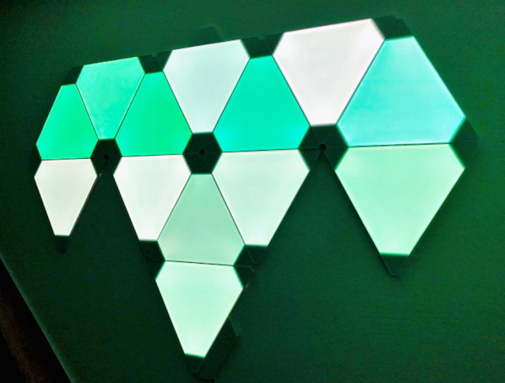

# Nanoleaf Binding

This binding integrates the [Nanoleaf Light Panels](https://nanoleaf.me/en/consumer-led-lighting/products/smarter-series/nanoleaf-light-panels-smarter-kit/). 


It enables you to authenticate, control, and obtain information of a Light Panels device.
The binding uses the [Nanoleaf OpenAPI](http://forum.nanoleaf.me/docs/openapi), which requires firmware version [1.5.0](https://helpdesk.nanoleaf.me/hc/en-us/articles/214006129-Light-Panels-Firmware-Release-Notes) or higher.



## Supported Things

The binding supports two thing types: controller and lightpanel.

The controller thing is the bridge for the individual panels connected to it.
With the controller thing you can control channels which affect all panels, e.g. selecting effects or setting the brightness.

The lightpanel things control the individual panels.
You can set the color for each panel or turn it on (white) or off (black).

## Discovery

A controller (bridge) device is discovered automatically through mDNS in the local network.
Alternatively, you can also provide a things file (see below for more details).
After the device is discovered and added as a thing, it needs a valid authentication token that must be obtained by pairing it with your openHAB instance.
Without the token the light panels remain in status OFFLINE.

The binding supports pairing of the device with your openHAB instance as follows:

1. Make sure that the authentication token field in your Nanoleaf controller thing configuration is left empty.
2. Hold down the on-off button of the controller for 5-7 seconds until the LED starts flashing in a pattern, which turns the device in pairing mode, and openHAB will try to request an authentication token for it.

Once your openHAB instance successfully requested and stored the authentication token in the controller's thing configuration, the controller status changes to ONLINE, and you can start linking the channels to your items.

For a successfully paired and online controller, the individual panels connected to it can be discovered by starting another scan for the Nanoleaf binding (e.g. from the Inbox in Paper UI). 
All connected panels will be added as separate things to the inbox.

## Thing Configuration

The controller thing has the following parameters:

| Config          | Description                                                                           |
| --------------- | ------------------------------------------------------------------------------------- |
| address         | IP address or hostname of the light panels controller (e.g. 192.168.1.100)            |
| port            | Port number of the light panels contoller. Default is 16021                           |
| authToken       | The authentication token received from the controller after successful pairing.       |
| refreshInterval | Interval in seconds to refresh the state of the light panels settings. Default is 60. |

The lightpanel thing has the following parameters:

| Config          | Description                                                                           |
| --------------- | ------------------------------------------------------------------------------------- |
| id              | ID assigned by the controller to the individual panel (e.g. 158)                      |

The IDs of the individual panels can be determined by starting another scan once the controller is configured and online.
This will add all connected panels with their IDs to the inbox.

## Channels

The controller bridge has the following channels:

| Channel             | Item Type | Description                                                            | Read Only |
|---------------------|-----------|------------------------------------------------------------------------|-----------|
| power               | Switch    | Power state of the light panels                                        | No        |
| color               | Color     | Color of all light panels                                              | No        |
| colorTemperature    | Dimmer    | Color temperature (in percent) of all light panels                     | No        |
| colorTemperatureAbs | Number    | Color temperature (in Kelvin, 1200 to 6500) of all light panels        | No        |
| colorMode           | String    | Color mode of the light panels                                         | Yes       |
| effect              | String    | Selected effect of the light panels                                    | No        |
| rhythmState         | Switch    | Connection state of the rhythm module                                  | Yes       |
| rhythmActive        | Switch    | Activity state of the rhythm module                                    | Yes       |
| rhythmMode          | Number    | Sound source for the rhythm module. 0=Microphone, 1=Aux cable          | No        |

A lightpanel thing has the following channels:

| Channel             | Item Type | Description                                                            | Read Only |
|---------------------|-----------|------------------------------------------------------------------------|-----------|
| panelColor          | Color     | Color of the individual light panel                                    | No        |

The color and panelColor channels support full color control with hue, saturation and brightness values. 
For example, brightness of all panels can be controlled by defining a dimmer item for the color channel of the controller thing.
The same applies to the panelColor channel of a lightpanel thing.
More details can be found in the full example below.

## Full Example

The following files provide a full example for a configuration (using a things file instead of automatic discovery):

### nanoleaf.things

```
Bridge nanoleaf:controller:MyLightPanels [ address="192.168.1.100", port=16021, authToken="AbcDefGhiJk879LmNopqRstUv1234WxyZ", refreshInterval=60 ] {
    Thing lightpanel 135 [ id=135 ]
    Thing lightpanel 158 [ id=158 ]
}
```

### nanoleaf.items

```
Switch NanoleafPower "Nanoleaf" { channel="nanoleaf:controller:MyLightPanels:power" }
Color NanoleafColor "Color" { channel="nanoleaf:controller:MyLightPanels:color" }
Dimmer NanoleafBrightness "Brightness [%.0f]" { channel="nanoleaf:controller:MyLightPanels:color" }
String NanoleafHue "Hue [%s]"
String NanoleafSaturation "Saturation [%s]"
Dimmer NanoleafColorTemp "Color temperature [%.0f]" { channel="nanoleaf:controller:MyLightPanels:colorTemperature" }
Number NanoleafColorTempAbs "Color temperature [%.000f]" { channel="nanoleaf:controller:MyLightPanels:colorTemperatureAbs" }
String NanoleafColorMode "Color mode [MAP(nanoleaf.map):%s]" { channel="nanoleaf:controller:MyLightPanels:colorMode" }
String NanoleafEffect "Effect" { channel="nanoleaf:controller:MyLightPanels:effect" }
Switch NanoleafRhythmState "Rhythm connected [MAP(nanoleaf.map):%s]" { channel="nanoleaf:controller:MyLightPanels:rhythmState" }
Switch NanoleafRhythmActive "Rhythm active [MAP(nanoleaf.map):%s]" { channel="nanoleaf:controller:MyLightPanels:rhythmActive" }
Number NanoleafRhythmSource  "Rhythm source [%s]" { channel="nanoleaf:controller:MyLightPanels:rhythmMode" }
Color Panel1Color "Panel 1" { channel="nanoleaf:lightpanel:MyLightPanels:135:panelColor" }
Dimmer Panel1Brightness "Panel 1" { channel="nanoleaf:lightpanel:MyLightPanels:135:panelColor" }
Color Panel2Color "Panel 2" { channel="nanoleaf:lightpanel:MyLightPanels:158:panelColor" }
Switch NanoleafRainbowScene "Show Rainbow Scene"
```

### nanoleaf.sitemap

```
sitemap nanoleaf label="Nanoleaf"
{
    Frame label="Controller" {
            Switch item=NanoleafPower
            Slider item=NanoleafBrightness 
            Colorpicker item=NanoleafColor           
            Text item=NanoleafHue
            Text item=NanoleafSaturation 
            Slider item=NanoleafColorTemp     
            Setpoint item=NanoleafColorTempAbs step=100 minValue=1200 maxValue=6500            
            Text item=NanoleafColorMode
            Selection item=NanoleafEffect mappings=["Color Burst"="Color Burst", "Fireworks" = "Fireworks", "Flames" = "Flames", "Forest" = "Forest", "Inner Peace" = "Inner Peace", "Meteor Shower" = "Meteor Shower", "Nemo" = "Nemo", "Northern Lights" = "Northern Lights", "Paint Splatter" = "Paint Splatter", "Pulse Pop Beats" = "Pulse Pop Beats", "Rhythmic Northern Lights" = "Rhythmic Northern Lights", "Ripple" = "Ripple", "Romantic" = "Romantic", "Snowfall" = "Snowfall", "Sound Bar" = "Sound Bar", "Streaking Notes" = "Streaking Notes", "moonlight" = "Moonlight", "*Static*" = "Color (single panels)", "*Dynamic*" = "Color (all panels)" ]
            Text item=NanoleafRhythmState
            Text item=NanoleafRhythmActive
            Selection item=NanoleafRhythmSource mappings=[0="Microphone", 1="Aux"]
    }
    
    Frame label="Panels" {
        Colorpicker item=Panel1Color
        Slider item=Panel1Brightness
        Colorpicker item=Panel2Color
    }
    
    Frame label="Scenes" {
        Switch item=NanoleafRainbowScene
    }
}
```

Note: The mappings to effects in the selection item are specific for each Nanoleaf installation and should be adapted accordingly. 
Only the effects "\*Static\*" and "\*Dynamic\*" are predefined by the controller and should always be present in the mappings.

### nanolead.rules

```
rule "UpdateHueAndSat"
when Item NanoleafColor changed
then
    val hsbValues = NanoleafColor.state as HSBType    
    NanoleafHue.postUpdate(hsbValues.hue.intValue)
    NanoleafSaturation.postUpdate(hsbValues.saturation.intValue)
end

rule "ShowRainbowScene"
when Item NanoleafRainbowScene received command ON
then
    val saturation = new PercentType(75)
    val brightness = new PercentType(90)
    val long pause = 200

    var hue = 0
    var direction = 1
    
    while(NanoleafRainbowScene.state == ON) {        
        Thread::sleep(pause)        
        hue = hue + (5 * direction)
        if(hue >= 359) {
            hue = 359
            direction = direction * -1            
        }
        else if (hue < 0) {
            hue = 0
            direction = direction * -1            
        }        
        NanoleafColor.sendCommand(new HSBType(new DecimalType(hue), saturation, brightness))
    }
end
```

### nanoleaf.map

```
ON = Yes
OFF = No
effects = Effect
hs = Hue/Saturation
ct = Color Temperature
```
