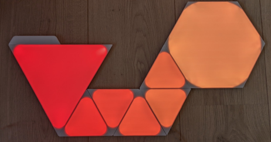
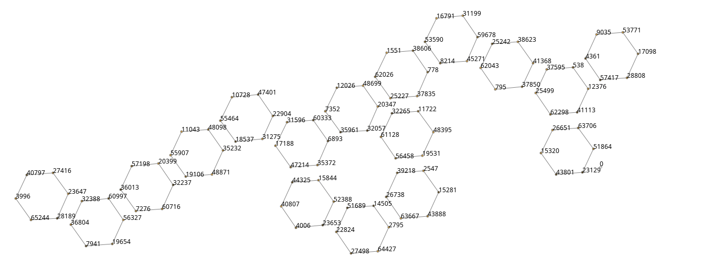

# Nanoleaf Binding

This binding integrates the [Nanoleaf Light Panels](https://nanoleaf.me/en/consumer-led-lighting/products/smarter-series/nanoleaf-light-panels-smarter-kit/).


It enables you to authenticate, control, and obtain information of a Light Panel's device.
The binding uses the [Nanoleaf OpenAPI](https://forum.nanoleaf.me/docs/openapi), which requires firmware version [1.5.0](https://helpdesk.nanoleaf.me/hc/en-us/articles/214006129-Light-Panels-Firmware-Release-Notes) or higher.

  

## Supported Things

Nanoleaf provides a bunch of devices of which some are connected to Wifi whereas other use the new Thread Technology. This binding only supports devices that are connected through Wifi.

Currently Nanoleaf's "Light Panels" and "Canvas/Shapes" devices are supported.

The binding supports two thing types: controller and lightpanel.

The controller thing is the bridge for the individually attached panels/canvas and can be perceived as the Nanoleaf device at the wall as a whole (either called "light panels", "canvas" or "shapes" by Nanoleaf).
With the controller thing you can control channels which affect all panels, e.g. selecting effects or setting the brightness.

The lightpanel (singular) thing controls one of the individual panels/canvas that are connected to each other.
Each individual panel has therefore its own id assigned to it.
You can set the **color** for each panel and in the case of a Nanoleaf Canvas or Shapes you can even detect single / double **touch events** related to an individual panel or **swipe events** on the whole device which opens a whole new world of controlling any other device within your openHAB environment.

| Nanoleaf Name          | Type | Description                                                | supported | touch support |
| ---------------------- | ---- | ---------------------------------------------------------- | --------- | ------------- |
| Light Panels           | NL22 | Triangles 1st Generation                                   |     X     |       -       |
| Shapes Hexagon         | NL42 | Hexagons                                                   |     X     |       X       |
| Shapes Triangles       | NL47 | Triangles                                                  |     X     |       X       |
| Shapes Mini Triangles  | NL48 | Mini Triangles                                             |     X     |       X       |
| Elements Hexagon       | NL52 | Elements Hexagons                                          |     X     |       X       |
| Smart Bulb             | NL45 | Smart Bulb                                                 |     -     |               |
| Lightstrip             | NL55 | Lightstrip                                                 |     -     |       -       |
| Lines                  | NL59 | Lines                                                      |     X     |               |
| Canvas                 | NL29 | Squares                                                    |     X     |       X       |

  x = Supported  (-) = unknown (no device available to test)

## Discovery

### Adding the Controller as a Thing

To add a nanoleaf controller, go to your inbox and start a scan.
Then choose "Nanoleaf Binding".
A controller (bridge) device is discovered automatically using mDNS in your local network.
Alternatively, you can also provide a things file (see below for more details).
After the device is discovered and added as a thing, it needs a valid authentication token that must be obtained by pairing it with your openHAB instance.
Without the token the light panels remain in status OFFLINE.

The binding supports pairing of the device with your openHAB instance as follows:

1. Make sure that the authentication token field in your Nanoleaf controller thing configuration is left empty.
1. Hold down the on-off button of the controller for 5-7 seconds until the LED starts flashing/cycling in a pattern, which turns the device in pairing mode, and openHAB will try to request an authentication token for it.

Once your openHAB instance successfully requested and stored the authentication token in the controller's thing configuration, the controller status changes to ONLINE, and you can start linking the channels to your items.

Tip: if you press (2) just before adding the item from the inbox it usually catches the auth token right away and if you are lucky it already automatically starts discovering the panels in one turn (see below).

### Adding the invidual light panels as a thing

After you have added the controller as a thing and it has been successfully paired as described as above, the individual panels connected to it can be discovered by **starting another scan** for the Nanoleaf binding.
All connected panels will be added as separate things to the inbox.

Troubleshooting: In seldom cases (in particular together with updating the binding) things or items do not work as expected, are offline or may not be detected.
In this case:

- remove the panels (maybe twice by force removing it)
- remove the controller (maybe twice by force removing it)
- stop and then start openHAB
- Rediscover like described above

### Panel Layout

If you want to program individual panels, it can be hard to figure out which panel has which ID. To make this easier, there is Layout channel on the Nanoleaf controller thing in openHAB.
The easiest way to visualize the layout of the individual panels is to open the controller thing in the openHAB UI, go to Channels and add a new item to the Layout channel.
Clicking on that image or adding it to a dashboard will show a picture of your canvas with the individual thing ID in the picture.

If your canvas has elements we dont know how to draw a layout for yet, please reach out, and we will ask for some information and will try to add support for your elements.



There is an alternative method for canvas that use square panels, you can request the layout through a [console command](https://www.openhab.org/docs/administration/console.html):

then issue the following command:

```shell
openhab:nanoleaf layout [<thingUID>]
```

The `thingUID` is an optional parameter. If it is not provided, the command loops through all Nanoleaf controller things it can find and prints the layout for each of them.

Compare the following output with the right picture at the beginning of the article

```text
            31413                    9162       13276

55836       56093       48111       38724       17870        5164       64279

                        58086        8134                   39755

                                    41451

```

As mentioned above this only works for the squared panels.
It is recommended to instead use the layout-channel described below which works for all designs.

## State

The state channel shows an image of the panels on the wall.
You have to configure things for each panel to get the correct color.
Since the colors of the panels can make it difficult to see the panel ids, please use the layout channel where the background color is always white to identify them.
For state to work, you need to set static colors to your panel.
This is because Nanoleaf does not return updates on colors for dynamic effects and animations.


## Thing Configuration

The controller thing has the following parameters:

| Config          | Description                                                                           |
| --------------- | ------------------------------------------------------------------------------------- |
| address         | IP address or hostname of the light panels controller (e.g. 192.168.1.100)            |
| port            | Port number of the light panels contoller. Default is 16021                           |
| authToken       | The authentication token received from the controller after successful pairing.       |
| refreshInterval | Interval in seconds to refresh the state of the light panels settings. Default is 60. |
| deviceType      | Defines the type `lightpanels` (triangle) or `canvas` (square or hexagon)             |

**Important note on the topic of IPV6 ip addresses:**

With firmware version 8.5.2 or newer, panels may change between being OFFLINE and ONLINE.
This is because if they are discovered with IPv6 addresses, the binding is not able to correctly send API requests to the devices which leads to an unstable behaviour.
To avoid this, the binding will only discover devices based on their IPv4 address.

Reboot your server after the change.

The lightpanel thing has the following parameters:

| Config          | Description                                                                           |
| --------------- | ------------------------------------------------------------------------------------- |
| id              | ID assigned by the controller to the individual panel (e.g. 158)                      |

The IDs of the individual panels can be determined by starting another scan once the controller is configured and online.
This discovers all connected panels with their IDs.

## Channels

The controller bridge has the following channels:

| Channel             | Item Type          | Description                                                                                       | Read Only |
|---------------------|--------------------|---------------------------------------------------------------------------------------------------|-----------|
| color               | Color              | Color, power and brightness of all light panels                                                   | No        |
| colorTemperature    | Dimmer             | Color temperature (in percent) of all light panels                                                | No        |
| colorTemperatureAbs | Number:Temperature | Color temperature (in Kelvin, 1200 to 6500) of all light panels                                   | No        |
| colorMode           | String             | Color mode of the light panels                                                                    | Yes       |
| effect              | String             | Selected effect of the light panels                                                               | No        |
| layout              | Image              | Shows the layout of your panels with IDs.                                                         | Yes       |
| rhythmState         | Switch             | Connection state of the rhythm module                                                             | Yes       |
| rhythmActive        | Switch             | Activity state of the rhythm module                                                               | Yes       |
| rhythmMode          | Number             | Sound source for the rhythm module. 0=Microphone, 1=Aux cable                                     | No        |
| state               | Image              | Shows the current state of your panels with colors.                                               | Yes       |
| swipe               | Trigger            | [Canvas / Shapes Only] Detects Swipes over the panel. LEFT, RIGHT, UP, DOWN events are supported. | Yes       |

A lightpanel thing has the following channels:

| Channel             | Type      | Description                                                                                                           | Read Only |
|---------------------|-----------|-----------------------------------------------------------------------------------------------------------------------|-----------|
| color               | Color     | Color of the individual light panel                                                                                   | No        |
| tap                 | Trigger   | [Canvas / Shapes Only] Sends events of gestures. SHORT_PRESSED, LONG_PRESSED and DOUBLE_PRESSED events are supported. | Yes       |

The color channels support full color control with hue, saturation and brightness values.
For example, brightness of _all_ panels at once can be controlled by defining a dimmer item for the color channel of the _controller thing_.
The same applies to the color channel of an individual lightpanel.

### Limitations Assigning Specific Colors on Individual Panels

- Due to the way the API of the nanoleaf is designed, each time a color is assigned to a panel, it will be directly sent to that panel. The result is that if you send colors to several panels more or less at the same time, they will not be set at the same time but one after the other and rather appear like a sequence but as a one shot.
- Another important limitation is that individual panels cannot be set while a dynamic effect is running on the panel which means that as soon as you set an individual panel the "static effect" is set, which disables the chosen dynamic effect. The nanoleaf app shows that a static effect is now running, too.
- The colors of the current state cannot be retrieved due to the high frequency of color changes that cannot be read quickly enough from the canvas, so all panels go to OFF
- The first panelColor command is applied to that panel (and of course then all subsequent commands)
- The fact that it is called a static effect does not mean that you cannot create animations. The Rainbow rule below shows a good example for the whole canvas. Just replace the controller item with a panel item and you will get the rainbow effect with an individual panel.

### Touch Support

Nanoleaf's Canvas introduces a whole new experience by supporting touch. This allows single and double taps on individual panels to be detected and processed via rules.

Note that even gestures like up, down, left, right can be detected on the whole set of panels though not on an individual panel.
The four swipe gestures are supported by the binding.
See below for an example on how to use it.

To detect single and double taps the panel provides a _tap_ channel while the controller provides a _swipe_ channel to detect swipes.

Keep in mind that the double tap is used as an already built-in functionality by default when you buy the nanoleaf: it switches all panels (hence the controller) to on or off like a light switch for all the panels at once.
To circumvent that

- Within the nanoleaf app go to the dashboard and choose your device. Enter the settings for that device by clicking the cog icon in the upper right corner.
- Enable "Touch Gesture" (the first radio button) and make sure that none of the gestures you use with openHAB is active. In general, it is recommended not to enable "touch sensitive gestures" (the second radio button). This prevents unexpected interference between openhHAB rules and Nanoleaf settings.

- To still have the possibility to switch on the whole canvas device with all its panels by double tapping a specific panel, you can easily write a rule that triggers on the tap channel of that panel and then sends an ON to the color channel of the controller. See the example below on Panel 1.

More details can be found in the full example below.

## Full Example

The following files provide a full example for a configuration (using a things file instead of automatic discovery):

### nanoleaf.things

```java
Bridge nanoleaf:controller:MyLightPanels @ "mylocation" [ address="192.168.1.100", port=16021, authToken="AbcDefGhiJk879LmNopqRstUv1234WxyZ", refreshInterval=60 ] {
    Thing lightpanel 135 [ id=135 ]
    Thing lightpanel 158 [ id=158 ]
}
```

If you define your device statically in the thing file, auto-discovery of the same thing is suppressed by using

- the [address="..." ]  of the controller
- and the [id=123] of the lightpanel

in the bracket to identify the uniqueness of the discovered device. Therefore it is recommended to the give the controller a fixed ip address.

Note: To generate the `authToken`:

- On the Nanoleaf controller, hold the on-off button for 5-7 seconds until the LED starts flashing.
- Send a POST request to the authorization endpoint within 30 seconds of activating pairing, like this:

`http://<address>:16021/api/v1/new`

e.g. via command line `curl --location --request POST 'http://<address>:16021/api/v1/new'`

### nanoleaf.items

Note: If you auto-discovered your things and items:

- A controller item looks like nanoleaf:controller:F0ED4F9351AF:color where F0ED4F9351AF is the id of the controller that has been automatically assigned by the binding.
- A panel item looks like nanoleaf:lightpanel:F0ED4F9351AF:39755:singleTap where 39755 is the id of the panel that has been automatically assigned by the binding.

```java
Switch NanoleafPower "Nanoleaf" { channel="nanoleaf:controller:MyLightPanels:color" }
Color NanoleafColor "Color" { channel="nanoleaf:controller:MyLightPanels:color" }
Dimmer NanoleafBrightness "Brightness [%.0f]" { channel="nanoleaf:controller:MyLightPanels:color" }
String NanoleafHue "Hue [%s]"
String NanoleafSaturation "Saturation [%s]"
Dimmer NanoleafColorTemp "Color temperature [%.0f]" { channel="nanoleaf:controller:MyLightPanels:colorTemperature" }
Number:Temperature NanoleafColorTempAbs "Color temperature [%d K]" { channel="nanoleaf:controller:MyLightPanels:colorTemperatureAbs" }
String NanoleafColorMode "Color mode [%s]" { channel="nanoleaf:controller:MyLightPanels:colorMode" }
String NanoleafEffect "Effect" { channel="nanoleaf:controller:MyLightPanels:effect" }
Switch NanoleafRhythmState "Rhythm connected [MAP(nanoleaf.map):%s]" { channel="nanoleaf:controller:MyLightPanels:rhythmState" }
Switch NanoleafRhythmActive "Rhythm active [MAP(nanoleaf.map):%s]" { channel="nanoleaf:controller:MyLightPanels:rhythmActive" }
Number NanoleafRhythmSource  "Rhythm source [%s]" { channel="nanoleaf:controller:MyLightPanels:rhythmMode" }

// note that the next to items use the exact same channel but the two different types Color and Dimmer to control different parameters
Color PanelColor "Panel 1" { channel="nanoleaf:lightpanel:MyLightPanels:135:color" }
Dimmer Panel1Brightness "Panel 1" { channel="nanoleaf:lightpanel:MyLightPanels:135:color" }
Switch Panel2Color "Panel 2" { channel="nanoleaf:lightpanel:MyLightPanels:158:color" }
Switch NanoleafRainbowScene "Show Rainbow Scene"
```

### nanoleaf.sitemap

```perl
sitemap nanoleaf label="Nanoleaf"
{
    Frame label="Controller" {
            Switch item=NanoleafPower
            Slider item=NanoleafBrightness
            Colorpicker item=NanoleafColor
            Text item=NanoleafHue
            Text item=NanoleafSaturation
            Slider item=NanoleafColorTemp
            Setpoint item=NanoleafColorTempAbs step=100 minValue=1200 maxValue=6500
            Text item=NanoleafColorMode
            Selection item=NanoleafEffect
            Text item=NanoleafRhythmState
            Text item=NanoleafRhythmActive
            Selection item=NanoleafRhythmSource mappings=[0="Microphone", 1="Aux"]
    }

    Frame label="Panels" {
        Colorpicker item=Panel1Color
        Slider item=Panel1Brightness
        Colorpicker item=Panel2Color
    }

    Frame label="Scenes" {
        Switch item=NanoleafRainbowScene
    }
}
```

### nanoleaf.rules

```java
rule "UpdateHueAndSat"
when Item NanoleafColor changed
then
    val hsbValues = NanoleafColor.state as HSBType
    NanoleafHue.postUpdate(hsbValues.hue.intValue)
    NanoleafSaturation.postUpdate(hsbValues.saturation.intValue)
end

rule "ShowRainbowScene"
when Item NanoleafRainbowScene received command ON
then
    val saturation = new PercentType(75)
    val brightness = new PercentType(90)
    val long pause = 200

    var hue = 0
    var direction = 1

    while(NanoleafRainbowScene.state == ON) {
        Thread::sleep(pause)
        hue = hue + (5 * direction)
        if(hue >= 359) {
            hue = 359
            direction = direction * -1
        }
        else if (hue < 0) {
            hue = 0
            direction = direction * -1
        }
        // replace NanoleafColor with Panel1Color to run rainbow on a single panel
        NanoleafColor.sendCommand(new HSBType(new DecimalType(hue), saturation, brightness))
    }
end

rule "Nanoleaf canvas touch detection Panel 2"
when
    Channel "nanoleaf:lightpanel:MyLightPanels:158:tap" triggered SHORT_PRESS
then
    logInfo("CanvasTouch", "Nanoleaf Canvas Panel 2 was touched once")

    if (My_Main_Light.state == OFF) {
        sendCommand(My_Main_Light,ON)
    } else {
        sendCommand(My_Main_Light,OFF)
    }
end

rule "Nanoleaf double tap toggles power of device"
when
    Channel "nanoleaf:lightpanel:MyLightPanels:135:tap" triggered DOUBLE_PRESS
then
    logInfo("CanvasTouch", "Nanoleaf Canvas Panel 1 was touched twice. Toggle Power of whole canvas.")

    if (NanoleafPower.state == OFF ) {
        sendCommand(NanoleafPower,ON)
    } else {
        sendCommand(NanoleafPower,OFF)
    }
end

// This is a complex rule controlling an item (e.g. a lamp) by swiping the nanoleaf but only if the swipe action has been triggered to become active.

var brightnessMode = null
var oldEffect = null

/*

The idea behind that rule is to use one panel to switch on / off brightness control for a specific openHAB item.

 - In this case the panel with the id=36604 has been created as a thing.
 - The controller color item is named SZNanoCanvas_Color
 - The controller effect item that holds the last chosen effect is SZNanoCanvas_Effect
 - Also that thing has channel to control the color of the panel

We use that specific panel to toggle the brightness swipe mode on or off.
We indicate that mode by  setting the canvas to red. When switching it
off we make sure we return the effect that was on before.
Only if the brightness swipe mode is ON we then use this to control the brightness of
another thing which in this case is a lamp. Every swipe changes the brightness by 10.
By extending it further this would also allow to select different items to control by
tapping different panels before.

*/

rule "Enable swipe brightness mode"
when
    Channel "nanoleaf:lightpanel:645E3A484FFF:31104:tap" triggered SHORT_PRESSED
then
    if (brightnessMode == OFF || brightnessMode === null) {
        brightnessMode = ON
        oldEffect = SZNanoCanvas_Effect.state.toString
        SZNanoCanvas_Color.sendCommand("0,100,100")
    } else {
        brightnessMode = OFF
        sendCommand("SZNanoCanvas_Effect", oldEffect)
    }
end

rule "Swipe Nano to control brightness"
when
    Channel "nanoleaf:controller:645E3A484FFF:swipe" triggered
then
    // Note: you can even control a rollershutter instead of a light dimmer
    var dimItem = MyLampDimmerItem

    // only process the swipe if brightness mode is active
    if (brightnessMode == ON) {
        var currentBrightness = dimItem.state as Number
        switch (receivedEvent) {
            case "LEFT": {
                if (currentBrightness >= 10) {
                    currentBrightness = currentBrightness  - 10
                } else {
                    currentBrightness = 0;
                }
            }
            case "RIGHT": {
                if (currentBrightness <= 90) {
                    currentBrightness = currentBrightness  + 10
                } else {
                    currentBrightness = 100;
                }

            }
        }
        sendCommand(dimItem, currentBrightness)
    }
end
```

### nanoleaf.map

```text
ON = Yes
OFF = No
effects = Effect
hs = Hue/Saturation
ct = Color Temperature
```
