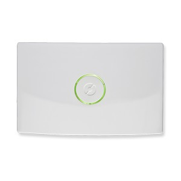

# NoboHub Binding

This binding controls the Glen Dimplex Nobø Hub using the Nobø Hub API v1.1 that can be found <a href="https://www.glendimplex.se/media/15650/nobo-hub-api-v-1-1-integration-for-advanced-users.pdf">here</a>



It lets you read and change temperature and profile settings for zones, and read and set active overrides to change the
global mode of the hub.

This binding is tested with the following devices:

* Thermostats for different electrical panel heaters
* Thermostats for heating in floors
* Nobø Switch SW 4

## Thermostats

Not all thermostats are made equal.

* NCU-1R: Comfort temperature setting on device overrides values from Hub. Making Comfort settings in the Hub useless.
* NCU-2R: Synchronizes temperature settings to and from the Hub.

## Supported Things

Nobø Hub is the hub that communicates with switches and thermostats.

## Discovery

The hub will be automatically discovered. Before it can be used, you will have to update the configuration
with the last three digits of its serial number.

When the hub is configured with the correct serial number, it will autodetect zones and components (thermostats and switches).

## Binding Configuration

```
# Configuration for Nobø Hub
#
# Serial number of the Nobø hub to communicate with, 12 numbers.
serialNumber=103000xxxxxx

# Host name or IP address of the Nobø hub
hostName=10.0.0.10
```

## Channels

### Hub

| channel             | type   | description                                         |
|---------------------|--------|-----------------------------------------------------|
| activeOverrideName  | String | The name of the active override                     |

### Zone

| channel                      | type   | description                                |
|------------------------------|--------|--------------------------------------------|
| activeWeekProfileName        | String | The name of the active week profile        |
| activeWeekProfile            | Number | The active week profile id                 |
| comfortTemperature           | Number | The configured comfort temperature         |
| ecoTemperature               | Number | The configured eco temparature             |
| currentTemperature           | Number | The current temperature in the zone        |
| calculatedWeekProfileStatus  | String | The current override based on week profile |

CurrentTemperature only works if the zone has a device that reports it (e.g. a switch).

### Component

| channel             | type   | description                              |
|---------------------|--------|------------------------------------------|
| currentTemperature  | Number | The current temperature of the component |

Not all devices report this.

## Full Example

### nobo.things

```
Bridge nobohub:nobohub:controller "Nobø Hub" [ hostName="192.168.1.10", serialNumber="SERIAL_NUMBER" ] {
	Thing zone 1                             "Zone - Kitchen"            	[ id=1 ]
	Thing component SERIAL_NUMBER_COMPONENT  "Heater - Kitchen"         	[ serialNumber="SERIAL_NUMBER_COMPONENT" ]
}
```

### nobo.items

```
// Hub
String	Nobo_Hub_GlobalOverride         "Global Override %s"                <heating>       {channel="nobohub:nobohub:controller:activeOverrideName"}

// Panel Heater
Number	PanelHeater_CurrentTemperatur   "Setpoint [%.1f °C]"                <temperature>   {channel="nobohub:component:controller:SERIAL_NUMBER_COMPONENT:currentTemperature"}

// Zone
String	Zone_ActiveWeekProfileName      "Active week profile name [%s]"     <calendar>      {channel="nobohub:zone:controller:1:activeWeekProfileName"}
Number	Zone_ActiveWeekProfile          "Active week profile [%d]"          <calendar>      {channel="nobohub:zone:controller:1:activeWeekProfile"}
String	Zone_ActiveStatus               "Active status %s]"                 <heating>       {channel="nobohub:zone:controller:1:calculatedWeekProfileStatus"}
Number	Zone_ComfortTemperatur          "Comfort temperature [%.1f °C]"     <temperature>   {channel="nobohub:zone:controller:1:comfortTemperature"}
Number	Zone_EcoTemperatur              "Eco temperature [%.1f °C]"         <temperature>   {channel="nobohub:zone:controller:1:ecoTemperature"}
Number	Zone_CurrentTemperatur          "Current temperature [%.1f °C]"     <temperature>   {channel="nobohub:zone:controller:1:currentTemperature"}
```

### nobo.sitemap

```
sitemap nobo label="Nobø " {

    Frame label="Hub"{
      Switch   item=Nobo_Hub_GlobalOverride
    }

    Frame label="Main Bedroom"{
      Switch    item=Zone_ActiveStatus
      Text      item=Zone_ActiveWeekProfileName           
      Text      item=Zone_ActiveWeekProfile           
      Selection item=Zone_ActiveWeekProfile           
      Setpoint  item=Zone_ComfortTemperatur minValue=7 maxValue=30 step=1 icon="temperature"
      Setpoint  item=Zone_EcoTemperatur     minValue=7 maxValue=30 step=1 icon="temperature"
      Text      item=Zone_CurrentTemperatur
      Text      item=PanelHeater_CurrentTemperatur
    }
}
```

## Organize your setup

Nobø Hub uses a combination of status types (Normal, Comfort, Eco, Away), profiles types (Comfort, Eco, Away, Off),
predfined temperature types (Comfort, Eco, Away), zones and override settings to organize and enable different features.
This makes it possible to control the heaters in many different scenarios and combinations. The following is a suggested
way of organizing the binding with the Hub for a good level of control and flexibility.

If you own panels with a physical Comfort temperature override, you need to use the Eco temperature type for setting
level used by the day based profiles. If not, you can use either Comfort or Eco to set wanted leve.

Start på creating the following profiles in the Nobø Hub App:

    OFF                 Set to status off all day, every day.
    ON                  Set to status [Comfort|Eco] all day, every day
    Eco                 Set to status Eco all day, every day
    Away                Set to status Away all way, every day
    Weekday 06->16      Set to status [Comfort|Eco] between 06->16 every weekday, otherwise set to [Away|Off]
    Weekday 06->23      Set to status [Comfort|Eco] between 06->23 every weekday, otherwise set to [Away|Off]
    Weekend 06->16      Set to status [Comfort|Eco] between 06->16 in the weekend, otherwise set to [Away|Off]
    Weekend 06->23      Set to status [Comfort|Eco] between 06->23 in the weekend, otherwise set to [Away|Off]
    Every day 06->16    Set to status [Comfort|Eco] between 06->16 every day, otherwise set to [Away|Off]
    Every day 06->23    Set to status [Comfort|Eco] between 06->23 every day, otherwise set to [Away|Off]

Next set [Comfort|Eco] level for each zone to your requirements. For a more advanced setup, you can create a rule which
both sets temperature level and profile.

Then create a sitemap with a Selection pointing to the Week Profile item. The binding will now automatically update all
available week profile options in the selection button:

### nobo.sitemap

```
sitemap nobo label="Nobø " {

    Frame label="Main Bedroom"{
      Selection item=MainBedroom_Zone_WeekProfile   
    }
}
```

## Bugs and logging

If you find any bugs or unwanted behaviour, please contact the maintainer. To help the maintainer it would be great
if you could send logs with a description of what is wrong. To turn on logging, go to the Keraf console and run

log:set DEBUG org.openhab.binding.nobohub

To see the log:

log:tail
