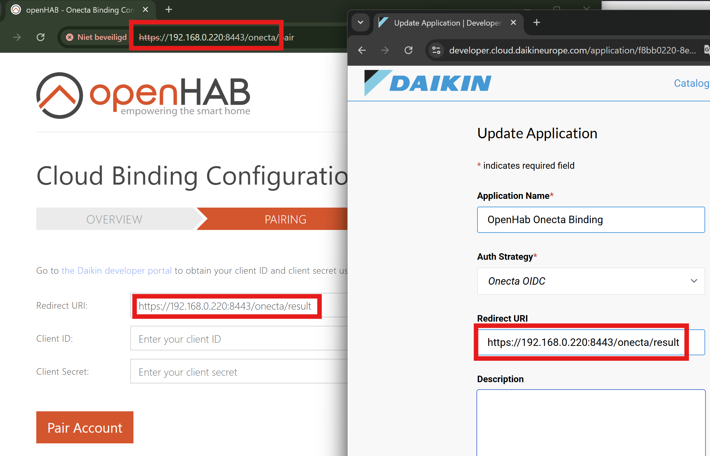
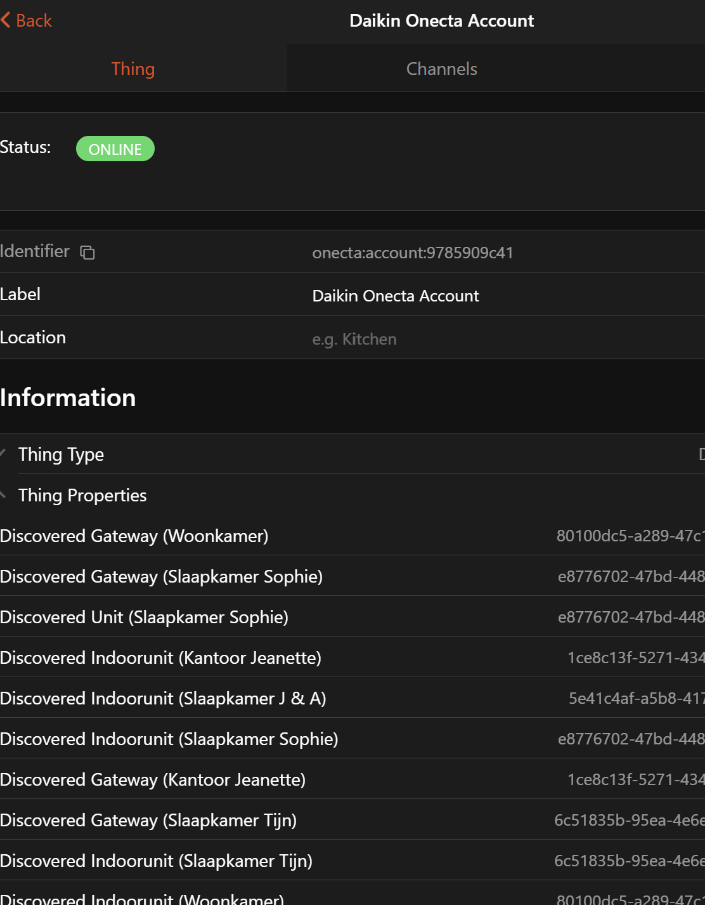

# Onecta Binding 

This binding allows you to control Daikin units connected to Onecta. 
Onecta is a Daikin cloud platform that allows user's to control their Daikin units via the internet.
The Daikin Onecta app can be used to control the units and to register the units in the Daikin Onecta cloud.
After the initial setup in de Daikin app, the binding will recognize all units connected to the Daikin cloud and create the corresponding things.

## Supported Things

Basically all devices connected to Daikin Onecta cloud could be connected with the binding.

- `account`: Acts as bridge and ensures the connection to Onecta cloud and the recognition of connected units
- `climate-control`: The unit itself. With this items like climate can controled.
- `gateway`: The network controller of the unit.
- `IndoorUnit`: Gives information about the indoor unit.
- `domestic-hot-water-tank`: Is the thing to control the Hot water tank.

## Discovery

Please take the following steps prior to using the binding. 
Create a Onecta cloud account in the Onecta app for [Android](https://play.google.com/store/apps/details?id=com.daikineurope.online.controller&hl=en_US) or [iOS](https://apps.apple.com/de/app/onecta/id1474811586?l=en) (if not already done).
Afterwards, pair your Daikin units in the Onecta App.

There is no auto discovery for the Onecta cloud account. 
The account is paired using OAuth2 with your Onecta login and the developer credentials obtained from the Onecta Developer Portal. 
To pair the account go to the binding's configuration UI at https://<your openHAB address>/onecta. For a standard openHABian Pi installation the address is https://openhabianpi:8443/onecta or https://pi-adres:8443/onecta. 
Note that your browser will file a warning that the certificate is self-signed. 
This is fine and you can safely continue. 
It is NOT possible to use an unsecured connection (http://) for pairing.<br>
Allowed pairing formats are:
- https://<your-domain>/onecta
- https://<your-local-ip>:<your-port>/onecta (standard port 8443)
- https://home.myopenhab.org/onecta
- https://openhabianpi:8443/onecta 

**note:** It is **not** allowed to use localhost (Onecta will not accept this)
- https://localhost:8443

Once a Onecta account is paired, all supported appliances are automatically discovered as individual things and placed in the inbox. 
They can then be paired with your favorite management UI. 
As an alternative, the binding configuration UI provides a things-file template per paired account that can be used to pair the appliances.

For a detailed walk through the account configuration, see [Account Configuration Example](#account-configuration-example).

## Account Bridge Configuration

| Name             | Type    | Description                                                    | Default | Required | Advanced |
|------------------|---------|----------------------------------------------------------------|---------|----------|----------|
| `refreshInterval`| integer | Interval the device is polled in sec.                          | 600     | yes      | no       |

## Discovered Things Configuration

| Name            | Type    | Description                                                                                              | Default | Required | Advanced |
|-----------------|---------|----------------------------------------------------------------------------------------------------------|---------|----------|----------|
| `unitID`        | text    | UID Unique Identifier. <br>If this thing is created in a thing-file this UID can be found in the logging | N/A     | yes      | no       |
| `refreshDelay`  | integer | Refresh Delay in sec. <br>Only available for thing 'device' and 'domestic-hot-water-tank'                | 15      | yes      | no       |

### Explanation Refresh Delay:
If a command is sent from the binding to OnectaCloud, it needs time to be processed by Daikin. 
This can cause items to flip-flop. <br>
For example: You switch a Unit 'On' with the binding. 
Daikin will process this command and control the unit, this processing can take 15 seconds. 
During this time, the binding may have requested a data refresh from OnectaCloud. 
If this 'On' command has not yet been processed by Daikin, this will result in the openHab item returning to 'Off'. 
After a while, when Daikin has processed it and another data refresh is performed by the binding, the openHab item will return to 'On'.
The Refresh Delay prevents an item from being refreshed (for x seconds) after a command has been issued from this item.
Other items will be updated during this time with a data refresh.

## Full Example

### Thing Configuration

```java
Bridge onecta:account:bridge "Daikin Onecta Bridge" [refreshInterval=600] {
        Thing climate-control livingRoom "Onecta living room Unit" [unitID="80100dc5-a289-47c1-bbdb-****************", refreshDelay=15]
        Thing gateway livingRoom "Onecta living room Gateway" [unitID="80100dc5-a289-47c1-bbdb-****************", refreshDelay=15]
        Thing domestic-hot-water-tank livingRoom "Onecta living room Watertank" [unitID="80100dc5-a289-47c1-bbdb-****************", refreshDelay=15]
        Thing indoor-unit livingRoom "Onecta Woonkamer living room" [unitID="80100dc5-a289-47c1-bbdb-****************", refreshDelay=15]
        }
```

### Item Configuration climate-control

```java
Switch               Power              "Power for the AC unit"      <switch>      ["Point"] {channel="onecta:climate-control:bridge:livingRoom:basic#power"}
Number:Temperature   SetPoint           "SetTemp [%.1f °C]"          <Temperature> ["Point"] {channel="onecta:climate-control:bridge:livingRoom:basic#settemp"}
Number:Temperature   SetPointMin        "SetTempMin [%.1f °C]"       <Temperature> ["Point"] {channel="onecta:climate-control:bridge:livingRoom:basic#settemp-min", readOnly="true"}
Number:Temperature   SetPointMax        "SetTempMax [%.1f °C]"       <Temperature> ["Point"] {channel="onecta:climate-control:bridge:livingRoom:basic#settemp-max", readOnly="true"}
Number:Temperature   SetPointStep       "SetTempStep [%.1f °C]"      <Temperature> ["Point"] {channel="onecta:climate-control:bridge:livingRoom:basic#settemp-step", readOnly="true"}
Number:Temperature   IndoorTemp         "Indoor temp [%.1f °C]"      <Temperature> ["Point"] {channel="onecta:climate-control:bridge:livingRoom:basic#indoor-temp", readOnly="true"}
Number:Temperature   OutdoorTemp        "Outdoor temp [%.1f °C]"     <Temperature> ["Point"] {channel="onecta:climate-control:bridge:livingRoom:basic#outdoor-temp"  , readOnly="true"}
Number:Temperature   LeavingWaterTemp   "LeavingWaterTemp [%.1f °C]" <Temperature> ["Point"] {channel="onecta:climate-control:bridge:livingRoom:basic#leaving-water-temp"}
Number:Dimensionless Humidity           "The indoor humidity"        <Humidity>    ["Point"] {channel="onecta:climate-control:bridge:livingRoom:basic#humidity"}

String               OperationMode      "Operation mode"                           ["Point"] {channel="onecta:climate-control:bridge:livingRoom:basic#operation-mode"}
String               FanSpeed           "Fan Speed"                  <fan>         ["Point"] {channel="onecta:climate-control:bridge:livingRoom:basic#fan-speed"}
String               FanDirHor          "Fan Swing Horizontal"       <f7:arrow_right_arrow_left_circle>["Point"] {channel="onecta:climate-control:bridge:livingRoom:basic#fan-dir-hor"}
String               FanDirVer          "Fan Swing Vertical"         <f7:arrow_up_arrow_down_circle>   ["Point"] {channel="onecta:climate-control:bridge:livingRoom:basic#fan-dir-ver"}
String               FanDir             "Fan Direction"              <f7:view_3d>  ["Point"] {channel="onecta:climate-control:bridge:livingRoom:basic#fan-dir"}

Switch               Ecomode            "Ecomode"                  <switch>        ["Point"] {channel="onecta:climate-control:bridge:livingRoom:basic#econo-mode"}
Switch               Streamer           "Streamer mode"            <switch>        ["Point"] {channel="onecta:climate-control:bridge:livingRoom:basic#streamer"}
Switch               Powerful           "Powerful mode"            <switch>        ["Point"] {channel="onecta:climate-control:bridge:livingRoom:basic#powerful-mode"}
Switch               Holiday            "Holiday mode"             <switch>        ["Point"] {channel="onecta:climate-control:bridge:livingRoom:basic#holiday-mode", readOnly="true"}

Number:Temperature   SetPointLeavingWaterOffset     "SetPointLeavingWaterOffset [%.1f °C]" <Temperature>   ["Point"] {channel="onecta:climate-control:bridge:livingRoom:basic#set-leaving-water-offset", readOnly="true"}
Number:Temperature   SetPointLeavingWaterTemp     "SetPointLeavingWaterTemp [%.1f °C]" <Temperature>   ["Point"] {channel="onecta:climate-control:bridge:livingRoom:basic#set-leaving-water-temp", readOnly="true"}

Number:Temperature   TargetTempStep     "TargetTempStep [%.1f °C]" <Temperature>   ["Point"] {channel="onecta:climate-control:bridge:livingRoom:basic#target-temp-step", readOnly="true"}
DateTime    TimeStamp "Time stamp"          ["Point"] {channel="onecta:climate-control:bridge:livingRoom:basic#timestamp"}

Number:Energy   EnergyCoolingCurrentYear "The energy usage for cooling current year total" <Energy> ["Point"] {channel="onecta:climate-control:bridge:livingRoom:consumption-data-cooling#energy-cooling-current-year"}
Number:Energy   EnergyCoolingCurrentDay  "The energy usage for cooling current day total"  <Energy> ["Point"] {channel="onecta:climate-control:bridge:livingRoom:consumption-data-cooling#energy-cooling-current-day"}
Number:Energy   EnergyHeatingCurrentYear "The energy usage for heating current year total" <Energy> ["Point"] {channel="onecta:climate-control:bridge:livingRoom:consumption-data-heating#energy-heating-current-year"}
Number:Energy   EnergyHeatingCurrentDay  "The energy usage for heating current day total"  <Energy> ["Point"] {channel="onecta:climate-control:bridge:livingRoom:consumption-data-heating#energy-heating-current-day"}

Number:Energy   EnergyCoolingDay0 "Energy Cooling yesterday (00:00 - 02:00)"  <Energy> ["Point"] {channel="onecta:climate-control:bridge:livingRoom:consumption-data-cooling#energy-cooling-day-0"}
Number:Energy   EnergyCoolingDay1 "Energy Cooling yesterday (02:00 - 04:00)"  <Energy> ["Point"] {channel="onecta:climate-control:bridge:livingRoom:consumption-data-cooling#energy-cooling-day-1"}
Number:Energy   EnergyCoolingDay2 "Energy Cooling yesterday (04:00 - 06:00)"  <Energy> ["Point"] {channel="onecta:climate-control:bridge:livingRoom:consumption-data-cooling#energy-cooling-day-2"}
Number:Energy   EnergyCoolingDay3 "Energy Cooling yesterday (06:00 - 08:00)"  <Energy> ["Point"] {channel="onecta:climate-control:bridge:livingRoom:consumption-data-cooling#energy-cooling-day-3"}
Number:Energy   EnergyCoolingDay4 "Energy Cooling yesterday (08:00 - 10:00)"  <Energy> ["Point"] {channel="onecta:climate-control:bridge:livingRoom:consumption-data-cooling#energy-cooling-day-4"}
Number:Energy   EnergyCoolingDay5 "Energy Cooling yesterday (10:00 - 12:00)"  <Energy> ["Point"] {channel="onecta:climate-control:bridge:livingRoom:consumption-data-cooling#energy-cooling-day-5"}
Number:Energy   EnergyCoolingDay6 "Energy Cooling yesterday (12:00 - 14:00)"  <Energy> ["Point"] {channel="onecta:climate-control:bridge:livingRoom:consumption-data-cooling#energy-cooling-day-6"}
Number:Energy   EnergyCoolingDay7 "Energy Cooling yesterday (14:00 - 16:00)"  <Energy> ["Point"] {channel="onecta:climate-control:bridge:livingRoom:consumption-data-cooling#energy-cooling-day-7"}
Number:Energy   EnergyCoolingDay8 "Energy Cooling yesterday (16:00 - 18:00)"  <Energy> ["Point"] {channel="onecta:climate-control:bridge:livingRoom:consumption-data-cooling#energy-cooling-day-8"}
Number:Energy   EnergyCoolingDay9 "Energy Cooling yesterday (18:00 - 20:00)"  <Energy> ["Point"] {channel="onecta:climate-control:bridge:livingRoom:consumption-data-cooling#energy-cooling-day-9"}
Number:Energy   EnergyCoolingDay10 "Energy Cooling yesterday (20:00 - 22:00)" <Energy> ["Point"] {channel="onecta:climate-control:bridge:livingRoom:consumption-data-cooling#energy-cooling-day-10"}
Number:Energy   EnergyCoolingDay11 "Energy Cooling yesterday (22:00 - 24:00)" <Energy> ["Point"] {channel="onecta:climate-control:bridge:livingRoom:consumption-data-cooling#energy-cooling-day-11"}
Number:Energy   EnergyCoolingDay12 "Energy Cooling today (00:00 - 02:00)"     <Energy> ["Point"] {channel="onecta:climate-control:bridge:livingRoom:consumption-data-cooling#energy-cooling-day-12"}
Number:Energy   EnergyCoolingDay13 "Energy Cooling today (02:00 - 04:00)"     <Energy> ["Point"] {channel="onecta:climate-control:bridge:livingRoom:consumption-data-cooling#energy-cooling-day-13"}
Number:Energy   EnergyCoolingDay14 "Energy Cooling today (04:00 - 06:00)"     <Energy> ["Point"] {channel="onecta:climate-control:bridge:livingRoom:consumption-data-cooling#energy-cooling-day-14"}
Number:Energy   EnergyCoolingDay15 "Energy Cooling today (06:00 - 08:00)"     <Energy> ["Point"] {channel="onecta:climate-control:bridge:livingRoom:consumption-data-cooling#energy-cooling-day-15"}
Number:Energy   EnergyCoolingDay16 "Energy Cooling today (08:00 - 10:00)"     <Energy> ["Point"] {channel="onecta:climate-control:bridge:livingRoom:consumption-data-cooling#energy-cooling-day-16"}
Number:Energy   EnergyCoolingDay17 "Energy Cooling today (10:00 - 12:00)"     <Energy> ["Point"] {channel="onecta:climate-control:bridge:livingRoom:consumption-data-cooling#energy-cooling-day-17"}
Number:Energy   EnergyCoolingDay18 "Energy Cooling today (12:00 - 14:00)"     <Energy> ["Point"] {channel="onecta:climate-control:bridge:livingRoom:consumption-data-cooling#energy-cooling-day-18"}
Number:Energy   EnergyCoolingDay19 "Energy Cooling today (14:00 - 16:00)"     <Energy> ["Point"] {channel="onecta:climate-control:bridge:livingRoom:consumption-data-cooling#energy-cooling-day-19"}
Number:Energy   EnergyCoolingDay20 "Energy Cooling today (16:00 - 18:00)"     <Energy> ["Point"] {channel="onecta:climate-control:bridge:livingRoom:consumption-data-cooling#energy-cooling-day-20"}
Number:Energy   EnergyCoolingDay21 "Energy Cooling today (18:00 - 20:00)"     <Energy> ["Point"] {channel="onecta:climate-control:bridge:livingRoom:consumption-data-cooling#energy-cooling-day-21"}
Number:Energy   EnergyCoolingDay22 "Energy Cooling today (20:00 - 22:00)"     <Energy> ["Point"] {channel="onecta:climate-control:bridge:livingRoom:consumption-data-cooling#energy-cooling-day-22"}
Number:Energy   EnergyCoolingDay23 "Energy Cooling today (22:00 - 24:00)"     <Energy> ["Point"] {channel="onecta:climate-control:bridge:livingRoom:consumption-data-cooling#energy-cooling-day-23"}

Number:Energy   EnergyCoolingWeek0 "Energy Cooling last week Monday"          <Energy> ["Point"] {channel="onecta:climate-control:bridge:livingRoom:consumption-data-cooling#energy-cooling-week-0"}
Number:Energy   EnergyCoolingWeek1 "Energy Cooling last week Tuesday"         <Energy> ["Point"] {channel="onecta:climate-control:bridge:livingRoom:consumption-data-cooling#energy-cooling-week-1"}
Number:Energy   EnergyCoolingWeek2 "Energy Cooling last week Wednesday"       <Energy> ["Point"] {channel="onecta:climate-control:bridge:livingRoom:consumption-data-cooling#energy-cooling-week-2"}
Number:Energy   EnergyCoolingWeek3 "Energy Cooling last week Thursday"        <Energy> ["Point"] {channel="onecta:climate-control:bridge:livingRoom:consumption-data-cooling#energy-cooling-week-3"}
Number:Energy   EnergyCoolingWeek4 "Energy Cooling last week Friday"          <Energy> ["Point"] {channel="onecta:climate-control:bridge:livingRoom:consumption-data-cooling#energy-cooling-week-4"}
Number:Energy   EnergyCoolingWeek5 "Energy Cooling last week Saturday"        <Energy> ["Point"] {channel="onecta:climate-control:bridge:livingRoom:consumption-data-cooling#energy-cooling-week-5"}
Number:Energy   EnergyCoolingWeek6 "Energy Cooling last week Sunday"          <Energy> ["Point"] {channel="onecta:climate-control:bridge:livingRoom:consumption-data-cooling#energy-cooling-week-6"}
Number:Energy   EnergyCoolingWeek7 "Energy Cooling current week Monday"       <Energy> ["Point"] {channel="onecta:climate-control:bridge:livingRoom:consumption-data-cooling#energy-cooling-week-7"}
Number:Energy   EnergyCoolingWeek8 "Energy Cooling current week Tuesday"      <Energy> ["Point"] {channel="onecta:climate-control:bridge:livingRoom:consumption-data-cooling#energy-cooling-week-8"}
Number:Energy   EnergyCoolingWeek9 "Energy Cooling current week Wednesday"    <Energy> ["Point"] {channel="onecta:climate-control:bridge:livingRoom:consumption-data-cooling#energy-cooling-week-9"}
Number:Energy   EnergyCoolingWeek10 "Energy Cooling current week Thursday"    <Energy> ["Point"] {channel="onecta:climate-control:bridge:livingRoom:consumption-data-cooling#energy-cooling-week-10"}
Number:Energy   EnergyCoolingWeek11 "Energy Cooling current week Friday"      <Energy> ["Point"] {channel="onecta:climate-control:bridge:livingRoom:consumption-data-cooling#energy-cooling-week-11"}
Number:Energy   EnergyCoolingWeek12 "Energy Cooling current week Saturday"    <Energy> ["Point"] {channel="onecta:climate-control:bridge:livingRoom:consumption-data-cooling#energy-cooling-week-12"}
Number:Energy   EnergyCoolingWeek13 "Energy Cooling current week Sunday"      <Energy> ["Point"] {channel="onecta:climate-control:bridge:livingRoom:consumption-data-cooling#energy-cooling-week-13"}

Number:Energy   EnergyCoolingMonth0 "Energy Cooling last year January"        <Energy> ["Point"] {channel="onecta:climate-control:bridge:livingRoom:consumption-data-cooling#energy-cooling-month-0"}
Number:Energy   EnergyCoolingMonth1 "Energy Cooling last year February"       <Energy> ["Point"] {channel="onecta:climate-control:bridge:livingRoom:consumption-data-cooling#energy-cooling-month-1"}
Number:Energy   EnergyCoolingMonth2 "Energy Cooling last year March"          <Energy> ["Point"] {channel="onecta:climate-control:bridge:livingRoom:consumption-data-cooling#energy-cooling-month-2"}
Number:Energy   EnergyCoolingMonth3 "Energy Cooling last year April"          <Energy> ["Point"] {channel="onecta:climate-control:bridge:livingRoom:consumption-data-cooling#energy-cooling-month-3"}
Number:Energy   EnergyCoolingMonth4 "Energy Cooling last year May"            <Energy> ["Point"] {channel="onecta:climate-control:bridge:livingRoom:consumption-data-cooling#energy-cooling-month-4"}
Number:Energy   EnergyCoolingMonth5 "Energy Cooling last year June"           <Energy> ["Point"] {channel="onecta:climate-control:bridge:livingRoom:consumption-data-cooling#energy-cooling-month-5"}
Number:Energy   EnergyCoolingMonth6 "Energy Cooling last year July"           <Energy> ["Point"] {channel="onecta:climate-control:bridge:livingRoom:consumption-data-cooling#energy-cooling-month-6"}
Number:Energy   EnergyCoolingMonth7 "Energy Cooling last year August"         <Energy> ["Point"] {channel="onecta:climate-control:bridge:livingRoom:consumption-data-cooling#energy-cooling-month-7"}
Number:Energy   EnergyCoolingMonth8 "Energy Cooling last year September"      <Energy> ["Point"] {channel="onecta:climate-control:bridge:livingRoom:consumption-data-cooling#energy-cooling-month-8"}
Number:Energy   EnergyCoolingMonth9 "Energy Cooling last year October"        <Energy> ["Point"] {channel="onecta:climate-control:bridge:livingRoom:consumption-data-cooling#energy-cooling-month-9"}
Number:Energy   EnergyCoolingMonth10 "Energy Cooling last year November"      <Energy> ["Point"] {channel="onecta:climate-control:bridge:livingRoom:consumption-data-cooling#energy-cooling-month-10"}
Number:Energy   EnergyCoolingMonth11 "Energy Cooling last year December"      <Energy> ["Point"] {channel="onecta:climate-control:bridge:livingRoom:consumption-data-cooling#energy-cooling-month-11"}
Number:Energy   EnergyCoolingMonth12 "Energy Cooling current year January"    <Energy> ["Point"] {channel="onecta:climate-control:bridge:livingRoom:consumption-data-cooling#energy-cooling-month-12"}
Number:Energy   EnergyCoolingMonth13 "Energy Cooling current year February"   <Energy> ["Point"] {channel="onecta:climate-control:bridge:livingRoom:consumption-data-cooling#energy-cooling-month-13"}
Number:Energy   EnergyCoolingMonth14 "Energy Cooling current year March"      <Energy> ["Point"] {channel="onecta:climate-control:bridge:livingRoom:consumption-data-cooling#energy-cooling-month-14"}
Number:Energy   EnergyCoolingMonth15 "Energy Cooling current year April"      <Energy> ["Point"] {channel="onecta:climate-control:bridge:livingRoom:consumption-data-cooling#energy-cooling-month-15"}
Number:Energy   EnergyCoolingMonth16 "Energy Cooling current year May"        <Energy> ["Point"] {channel="onecta:climate-control:bridge:livingRoom:consumption-data-cooling#energy-cooling-month-16"}
Number:Energy   EnergyCoolingMonth17 "Energy Cooling current year June"       <Energy> ["Point"] {channel="onecta:climate-control:bridge:livingRoom:consumption-data-cooling#energy-cooling-month-17"}
Number:Energy   EnergyCoolingMonth18 "Energy Cooling current year July"       <Energy> ["Point"] {channel="onecta:climate-control:bridge:livingRoom:consumption-data-cooling#energy-cooling-month-18"}
Number:Energy   EnergyCoolingMonth19 "Energy Cooling current year August"     <Energy> ["Point"] {channel="onecta:climate-control:bridge:livingRoom:consumption-data-cooling#energy-cooling-month-19"}
Number:Energy   EnergyCoolingMonth20 "Energy Cooling current year September"  <Energy> ["Point"] {channel="onecta:climate-control:bridge:livingRoom:consumption-data-cooling#energy-cooling-month-20"}
Number:Energy   EnergyCoolingMonth21 "Energy Cooling current year October"    <Energy> ["Point"] {channel="onecta:climate-control:bridge:livingRoom:consumption-data-cooling#energy-cooling-month-21"}
Number:Energy   EnergyCoolingMonth22 "Energy Cooling current year November"   <Energy> ["Point"] {channel="onecta:climate-control:bridge:livingRoom:consumption-data-cooling#energy-cooling-month-22"}
Number:Energy   EnergyCoolingMonth23 "Energy Cooling current year December"   <Energy> ["Point"] {channel="onecta:climate-control:bridge:livingRoom:consumption-data-cooling#energy-cooling-month-23"}

Number:Energy   EnergyHeatingDay0 "Energy Heating yesterday (00:00 - 02:00)"  <Energy> ["Point"] {channel="onecta:climate-control:bridge:livingRoom:consumption-data-heating#energy-heating-day-0"}
Number:Energy   EnergyHeatingDay1 "Energy Heating yesterday (02:00 - 04:00)"  <Energy> ["Point"] {channel="onecta:climate-control:bridge:livingRoom:consumption-data-heating#energy-heating-day-1"}
Number:Energy   EnergyHeatingDay2 "Energy Heating yesterday (04:00 - 06:00)"  <Energy> ["Point"] {channel="onecta:climate-control:bridge:livingRoom:consumption-data-heating#energy-heating-day-2"}
Number:Energy   EnergyHeatingDay3 "Energy Heating yesterday (06:00 - 08:00)"  <Energy> ["Point"] {channel="onecta:climate-control:bridge:livingRoom:consumption-data-heating#energy-heating-day-3"}
Number:Energy   EnergyHeatingDay4 "Energy Heating yesterday (08:00 - 10:00)"  <Energy> ["Point"] {channel="onecta:climate-control:bridge:livingRoom:consumption-data-heating#energy-heating-day-4"}
Number:Energy   EnergyHeatingDay5 "Energy Heating yesterday (10:00 - 12:00)"  <Energy> ["Point"] {channel="onecta:climate-control:bridge:livingRoom:consumption-data-heating#energy-heating-day-5"}
Number:Energy   EnergyHeatingDay6 "Energy Heating yesterday (12:00 - 14:00)"  <Energy> ["Point"] {channel="onecta:climate-control:bridge:livingRoom:consumption-data-heating#energy-heating-day-6"}
Number:Energy   EnergyHeatingDay7 "Energy Heating yesterday (14:00 - 16:00)"  <Energy> ["Point"] {channel="onecta:climate-control:bridge:livingRoom:consumption-data-heating#energy-heating-day-7"}
Number:Energy   EnergyHeatingDay8 "Energy Heating yesterday (16:00 - 18:00)"  <Energy> ["Point"] {channel="onecta:climate-control:bridge:livingRoom:consumption-data-heating#energy-heating-day-8"}
Number:Energy   EnergyHeatingDay9 "Energy Heating yesterday (18:00 - 20:00)"  <Energy> ["Point"] {channel="onecta:climate-control:bridge:livingRoom:consumption-data-heating#energy-heating-day-9"}
Number:Energy   EnergyHeatingDay10 "Energy Heating yesterday (20:00 - 22:00)" <Energy> ["Point"] {channel="onecta:climate-control:bridge:livingRoom:consumption-data-heating#energy-heating-day-10"}
Number:Energy   EnergyHeatingDay11 "Energy Heating yesterday (22:00 - 24:00)" <Energy> ["Point"] {channel="onecta:climate-control:bridge:livingRoom:consumption-data-heating#energy-heating-day-11"}
Number:Energy   EnergyHeatingDay12 "Energy Heating today (00:00 - 02:00)"     <Energy> ["Point"] {channel="onecta:climate-control:bridge:livingRoom:consumption-data-heating#energy-heating-day-12"}
Number:Energy   EnergyHeatingDay13 "Energy Heating today (02:00 - 04:00)"     <Energy> ["Point"] {channel="onecta:climate-control:bridge:livingRoom:consumption-data-heating#energy-heating-day-13"}
Number:Energy   EnergyHeatingDay14 "Energy Heating today (04:00 - 06:00)"     <Energy> ["Point"] {channel="onecta:climate-control:bridge:livingRoom:consumption-data-heating#energy-heating-day-14"}
Number:Energy   EnergyHeatingDay15 "Energy Heating today (06:00 - 08:00)"     <Energy> ["Point"] {channel="onecta:climate-control:bridge:livingRoom:consumption-data-heating#energy-heating-day-15"}
Number:Energy   EnergyHeatingDay16 "Energy Heating today (08:00 - 10:00)"     <Energy> ["Point"] {channel="onecta:climate-control:bridge:livingRoom:consumption-data-heating#energy-heating-day-16"}
Number:Energy   EnergyHeatingDay17 "Energy Heating today (10:00 - 12:00)"     <Energy> ["Point"] {channel="onecta:climate-control:bridge:livingRoom:consumption-data-heating#energy-heating-day-17"}
Number:Energy   EnergyHeatingDay18 "Energy Heating today (12:00 - 14:00)"     <Energy> ["Point"] {channel="onecta:climate-control:bridge:livingRoom:consumption-data-heating#energy-heating-day-18"}
Number:Energy   EnergyHeatingDay19 "Energy Heating today (14:00 - 16:00)"     <Energy> ["Point"] {channel="onecta:climate-control:bridge:livingRoom:consumption-data-heating#energy-heating-day-19"}
Number:Energy   EnergyHeatingDay20 "Energy Heating today (16:00 - 18:00)"     <Energy> ["Point"] {channel="onecta:climate-control:bridge:livingRoom:consumption-data-heating#energy-heating-day-20"}
Number:Energy   EnergyHeatingDay21 "Energy Heating today (18:00 - 20:00)"     <Energy> ["Point"] {channel="onecta:climate-control:bridge:livingRoom:consumption-data-heating#energy-heating-day-21"}
Number:Energy   EnergyHeatingDay22 "Energy Heating today (20:00 - 22:00)"     <Energy> ["Point"] {channel="onecta:climate-control:bridge:livingRoom:consumption-data-heating#energy-heating-day-22"}
Number:Energy   EnergyHeatingDay23 "Energy Heating today (22:00 - 24:00)"     <Energy> ["Point"] {channel="onecta:climate-control:bridge:livingRoom:consumption-data-heating#energy-heating-day-23"}

Number:Energy   EnergyHeatingWeek0 "Energy Heating last week Monday"          <Energy> ["Point"] {channel="onecta:climate-control:bridge:livingRoom:consumption-data-heating#energy-heating-week-0"}
Number:Energy   EnergyHeatingWeek1 "Energy Heating last week Tuesday"         <Energy> ["Point"] {channel="onecta:climate-control:bridge:livingRoom:consumption-data-heating#energy-heating-week-1"}
Number:Energy   EnergyHeatingWeek2 "Energy Heating last week Wednesday"       <Energy> ["Point"] {channel="onecta:climate-control:bridge:livingRoom:consumption-data-heating#energy-heating-week-2"}
Number:Energy   EnergyHeatingWeek3 "Energy Heating last week Thursday"        <Energy> ["Point"] {channel="onecta:climate-control:bridge:livingRoom:consumption-data-heating#energy-heating-week-3"}
Number:Energy   EnergyHeatingWeek4 "Energy Heating last week Friday"          <Energy> ["Point"] {channel="onecta:climate-control:bridge:livingRoom:consumption-data-heating#energy-heating-week-4"}
Number:Energy   EnergyHeatingWeek5 "Energy Heating last week Saturday"        <Energy> ["Point"] {channel="onecta:climate-control:bridge:livingRoom:consumption-data-heating#energy-heating-week-5"}
Number:Energy   EnergyHeatingWeek6 "Energy Heating last week Sunday"          <Energy> ["Point"] {channel="onecta:climate-control:bridge:livingRoom:consumption-data-heating#energy-heating-week-6"}
Number:Energy   EnergyHeatingWeek7 "Energy Heating current week Monday"       <Energy> ["Point"] {channel="onecta:climate-control:bridge:livingRoom:consumption-data-heating#energy-heating-week-7"}
Number:Energy   EnergyHeatingWeek8 "Energy Heating current week Tuesday"      <Energy> ["Point"] {channel="onecta:climate-control:bridge:livingRoom:consumption-data-heating#energy-heating-week-8"}
Number:Energy   EnergyHeatingWeek9 "Energy Heating current week Wednesday"    <Energy> ["Point"] {channel="onecta:climate-control:bridge:livingRoom:consumption-data-heating#energy-heating-week-9"}
Number:Energy   EnergyHeatingWeek10 "Energy Heating current week Thursday"    <Energy> ["Point"] {channel="onecta:climate-control:bridge:livingRoom:consumption-data-heating#energy-heating-week-10"}
Number:Energy   EnergyHeatingWeek11 "Energy Heating current week Friday"      <Energy> ["Point"] {channel="onecta:climate-control:bridge:livingRoom:consumption-data-heating#energy-heating-week-11"}
Number:Energy   EnergyHeatingWeek12 "Energy Heating current week Saturday"    <Energy> ["Point"] {channel="onecta:climate-control:bridge:livingRoom:consumption-data-heating#energy-heating-week-12"}
Number:Energy   EnergyHeatingWeek13 "Energy Heating current week Sunday"      <Energy> ["Point"] {channel="onecta:climate-control:bridge:livingRoom:consumption-data-heating#energy-heating-week-13"}

Number:Energy   EnergyHeatingMonth0 "Energy Heating last year January"        <Energy> ["Point"] {channel="onecta:climate-control:bridge:livingRoom:consumption-data-heating#energy-heating-month-0"}
Number:Energy   EnergyHeatingMonth1 "Energy Heating last year February"       <Energy> ["Point"] {channel="onecta:climate-control:bridge:livingRoom:consumption-data-heating#energy-heating-month-1"}
Number:Energy   EnergyHeatingMonth2 "Energy Heating last year March"          <Energy> ["Point"] {channel="onecta:climate-control:bridge:livingRoom:consumption-data-heating#energy-heating-month-2"}
Number:Energy   EnergyHeatingMonth3 "Energy Heating last year April"          <Energy> ["Point"] {channel="onecta:climate-control:bridge:livingRoom:consumption-data-heating#energy-heating-month-3"}
Number:Energy   EnergyHeatingMonth4 "Energy Heating last year May"            <Energy> ["Point"] {channel="onecta:climate-control:bridge:livingRoom:consumption-data-heating#energy-heating-month-4"}
Number:Energy   EnergyHeatingMonth5 "Energy Heating last year June"           <Energy> ["Point"] {channel="onecta:climate-control:bridge:livingRoom:consumption-data-heating#energy-heating-month-5"}
Number:Energy   EnergyHeatingMonth6 "Energy Heating last year July"           <Energy> ["Point"] {channel="onecta:climate-control:bridge:livingRoom:consumption-data-heating#energy-heating-month-6"}
Number:Energy   EnergyHeatingMonth7 "Energy Heating last year August"         <Energy> ["Point"] {channel="onecta:climate-control:bridge:livingRoom:consumption-data-heating#energy-heating-month-7"}
Number:Energy   EnergyHeatingMonth8 "Energy Heating last year September"      <Energy> ["Point"] {channel="onecta:climate-control:bridge:livingRoom:consumption-data-heating#energy-heating-month-8"}
Number:Energy   EnergyHeatingMonth9 "Energy Heating last year October"        <Energy> ["Point"] {channel="onecta:climate-control:bridge:livingRoom:consumption-data-heating#energy-heating-month-9"}
Number:Energy   EnergyHeatingMonth10 "Energy Heating last year November"      <Energy> ["Point"] {channel="onecta:climate-control:bridge:livingRoom:consumption-data-heating#energy-heating-month-10"}
Number:Energy   EnergyHeatingMonth11 "Energy Heating last year December"      <Energy> ["Point"] {channel="onecta:climate-control:bridge:livingRoom:consumption-data-heating#energy-heating-month-11"}
Number:Energy   EnergyHeatingMonth12 "Energy Heating current year January"    <Energy> ["Point"] {channel="onecta:climate-control:bridge:livingRoom:consumption-data-heating#energy-heating-month-12"}
Number:Energy   EnergyHeatingMonth13 "Energy Heating current year February"   <Energy> ["Point"] {channel="onecta:climate-control:bridge:livingRoom:consumption-data-heating#energy-heating-month-13"}
Number:Energy   EnergyHeatingMonth14 "Energy Heating current year March"      <Energy> ["Point"] {channel="onecta:climate-control:bridge:livingRoom:consumption-data-heating#energy-heating-month-14"}
Number:Energy   EnergyHeatingMonth15 "Energy Heating current year April"      <Energy> ["Point"] {channel="onecta:climate-control:bridge:livingRoom:consumption-data-heating#energy-heating-month-15"}
Number:Energy   EnergyHeatingMonth16 "Energy Heating current year May"        <Energy> ["Point"] {channel="onecta:climate-control:bridge:livingRoom:consumption-data-heating#energy-heating-month-16"}
Number:Energy   EnergyHeatingMonth17 "Energy Heating current year June"       <Energy> ["Point"] {channel="onecta:climate-control:bridge:livingRoom:consumption-data-heating#energy-heating-month-17"}
Number:Energy   EnergyHeatingMonth18 "Energy Heating current year July"       <Energy> ["Point"] {channel="onecta:climate-control:bridge:livingRoom:consumption-data-heating#energy-heating-month-18"}
Number:Energy   EnergyHeatingMonth19 "Energy Heating current year August"     <Energy> ["Point"] {channel="onecta:climate-control:bridge:livingRoom:consumption-data-heating#energy-heating-month-19"}
Number:Energy   EnergyHeatingMonth20 "Energy Heating current year September"  <Energy> ["Point"] {channel="onecta:climate-control:bridge:livingRoom:consumption-data-heating#energy-heating-month-20"}
Number:Energy   EnergyHeatingMonth21 "Energy Heating current year October"    <Energy> ["Point"] {channel="onecta:climate-control:bridge:livingRoom:consumption-data-heating#energy-heating-month-21"}
Number:Energy   EnergyHeatingMonth22 "Energy Heating current year November"   <Energy> ["Point"] {channel="onecta:climate-control:bridge:livingRoom:consumption-data-heating#energy-heating-month-22"}
Number:Energy   EnergyHeatingMonth23 "Energy Heating current year December"   <Energy> ["Point"] {channel="onecta:climate-control:bridge:livingRoom:consumption-data-heating#energy-heating-month-23"}
```

### Item Configuration gateway

```java
Switch        DaylightSavingTime      "Daylight saving time enabled" <switch>            ["Point"] {channel="onecta:gateway:bridge:livingRoom:basic#daylight-savingtime-enabled", readOnly="true"}
Switch        FirmwareUpdateSupported "Is firmware update supported" <switch>            ["Point"] {channel="onecta:gateway:bridge:livingRoom:basic#is-firmware-update-supported", readOnly="true"}
String        FirmwaweVersion         "firmware version"                                 ["Point"] {channel="onecta:gateway:bridge:livingRoom:basic#firmware-version", readOnly="true"}
Switch        IsInErrorState          "Is in error state"            <switch>            ["Point"] {channel="onecta:gateway:bridge:livingRoom:basic#is-in-error-state", readOnly="true"}
Switch        LedEnabled              "Led enabled      "            <switch>            ["Point"] {channel="onecta:gateway:bridge:livingRoom:basic#led-enabled", readOnly="true"}
String        RegionCode              "Region code"                                      ["Point"] {channel="onecta:gateway:bridge:livingRoom:basic#region-code", readOnly="true"}
String        Serialnumber            "Serialnumber"                                     ["Point"] {channel="onecta:gateway:bridge:livingRoom:basic#serial-number"  , readOnly="true"}
String        SSID                    "SSID  "                       <network>           ["Point"] {channel="onecta:gateway:bridge:livingRoom:basic#ssid", readOnly="true"}
String        TimeZone                "Time zone"                                        ["Point"] {channel="onecta:gateway:bridge:livingRoom:basic#timezone", readOnly="true"}
String        WiFiConnectionSSID      "WiFi Connection SSID"         <network>           ["Point"] {channel="onecta:gateway:bridge:livingRoom:basic#wifi-connection-ssid", readOnly="true"}
Number        WifiConnectionStrength  "Wifi connection strength"     <QualityOfService>  ["Point"] {channel="onecta:gateway:bridge:livingRoom:basic#wifi-connection-power", readOnly="true"}
String        ModelInfo               "Model info"                                       ["Point"] {channel="onecta:gateway:bridge:livingRoom:basic#model-info", readOnly="true"}
String        IPAddress               "IP Address"                   <network>           ["Point"] {channel="onecta:gateway:bridge:livingRoom:basic#ip-address", readOnly="true"}
String        MacAddress              "MAC Address"                  <network>           ["Point"] {channel="onecta:gateway:bridge:livingRoom:basic#mac-address", readOnly="true"}
```
### Item Configuration domestic-hot-water-tank

```java
Switch        Power                     "Power for the AC unit"    <switch>         ["Point"] {channel="onecta:domestic-hot-water-tank:bridge:livingroom:basic#power"}
Switch        IsInErrorState            "Is in error state"        <switch>         ["Point"] {channel="onecta:domestic-hot-water-tank:bridge:livingroom:basic#isinerrorstate", readOnly="true"}
Switch        IsInWarningState          "Is in warning state"      <switch>         ["Point"] {channel="onecta:domestic-hot-water-tank:bridge:livingroom:basic#isinwarningstate", readOnly="true"}
Switch        IsInInstallerState        "Is in installer state"    <switch>         ["Point"] {channel="onecta:domestic-hot-water-tank:bridge:livingroom:basic#isininstallerstate", readOnly="true"}
Switch        IsInEmergencyState        "Is in imergency state"    <switch>         ["Point"] {channel="onecta:domestic-hot-water-tank:bridge:livingroom:basic#isinemergencystate", readOnly="true"}
Switch        IsHolidayModeActive       "Is holiday mode active"   <switch>         ["Point"] {channel="onecta:domestic-hot-water-tank:bridge:livingroom:basic#isholidaymodeactive", readOnly="true"}
Switch        Powerfulmode              "Powerful mode"            <switch>         ["Point"] {channel="onecta:domestic-hot-water-tank:bridge:livingroom:basic#powerfulmode", readOnly="true"}
String        HeatupMode                "Heatup mode"                               ["Point"] {channel="onecta:domestic-hot-water-tank:bridge:livingroom:basic#heatupmode", readOnly="true"}

String               ErrorCode          "Error code"                                ["Point"] {channel="onecta:domestic-hot-water-tank:bridge:livingroom:basic#errorcode", readOnly="true"}
String               OperationMode      "Operation mode"                            ["Point"] {channel="onecta:domestic-hot-water-tank:bridge:livingroom:basic#operationmode"}
String               SetPointMode       "Setpoint mode"                             ["Point"] {channel="onecta:domestic-hot-water-tank:bridge:livingroom:basic#setpointmode"}

Number:Temperature   SetPoint           "SetTemp [%.1f °C]"          <Temperature>  ["Point"] {channel="onecta:domestic-hot-water-tank:bridge:livingroom:basic#settemp"}
Number:Temperature   SetPointMin        "SetTempMin [%.1f °C]"       <Temperature>  ["Point"] {channel="onecta:domestic-hot-water-tank:bridge:livingroom:basic#settempmin", readOnly="true"}
Number:Temperature   SetPointMax        "SetTempMax [%.1f °C]"       <Temperature>  ["Point"] {channel="onecta:domestic-hot-water-tank:bridge:livingroom:basic#settempmax", readOnly="true"}
Number:Temperature   SetPointStep       "SetTempStep [%.1f °C]"      <Temperature>  ["Point"] {channel="onecta:domestic-hot-water-tank:bridge:livingroom:basic#settempstep", readOnly="true"}

Number:Temperature   TankTemperature   "Tank temperature [%.1f °C]" <Temperature> ["Point"] {channel="onecta:domestic-hot-water-tank:bridge:livingroom:basic#tanktemperature" , readOnly="true"}
```

### Item Configuration indoor-unit

```java
String              ModelInformation      "Model information"                                  ["Point"] {channel="onecta:indoor-unit:bridge:livingroom:basic#modelinfo", readOnly="true"}
String              SoftwareVersion       "Software version"                                   ["Point"] {channel="onecta:indoor-unit:bridge:livingroom:basic#softwareversion", readOnly="true"}
String              EepromVersion         "Eeprom version"                                     ["Point"] {channel="onecta:indoor-unit:bridge:livingroom:basic#eepromversion", readOnly="true"}

Switch              DrykeepSetting        "Dry keep setting"                    <switch>       ["Point"] {channel="onecta:indoor-unit:bridge:livingroom:basic#isdrykeepsetting", readOnly="true"}
Number:Temperature  DeltaDvalue           "DeltaD temperature [%.1f °C]"        <Temperature>  ["Point"] {channel="onecta:indoor-unit:bridge:livingroom:basic#deltadvalue"}
Number:Frequency    FanMotorratationSpeed "Fanmotor rotation speed [%.1f RPM]"  <Temperature>  ["Point"] {channel="onecta:indoor-unit:bridge:livingroom:basic#fanmotorratationspeed", readOnly="true"}

Number:Temperature  HeatExchangerTemp     "Heatexchanger temperature [%.1f °C]" <Temperature>  ["Point"] {channel="onecta:indoor-unit:bridge:livingroom:basic#heatexchangertemp", readOnly="true"}
Number:Temperature  SuctionTemp           "Suction temperature [%.1f °C]"       <Temperature>  ["Point"] {channel="onecta:indoor-unit:bridge:livingroom:basic#suctiontemp", readOnly="true"}
```

## Account Configuration Example

The best way to perform the following steps is in an incognito browser to prevent historical settings and accounts from causing problems.

The configuration UI is accessible at `https://<your openHAB address>/onecta`.
See [Discovery](#discovery) for a detailed description of how to open the configuration UI in a browser.

When first opening the configuration UI no account will be paired.


We strongly recommend to use a secure connection for pairing, details on this topic can also be found in the [Discovery](#discovery) section.
Click `Pair Account` to start the pairing process.
If not already done, go to the [Daikin Developer Portal](https://developer.cloud.daikineurope.com/login), register there and wait for the confirmation e-mail.
Obtain your client ID and client secret according to the instructions presented there. (**Open the Daikin Developer portal in a incognito browser.**)

Once you obtained your client ID and client secret continue pairing by filling in your client ID, client secret and Redirect URI.
<br>**Important** : 
- The redirect URI must be set to `https://<your openHAB address>/onecta/result`.
- It has to be https, otherwise the pairing will fail.
- Localhost is not supported, you have to use the actual hostname of your openHAB installation.


A click on `Pair Account` will take you to the Daikin cloud service login form where you need to log in with the same account as you used for the Onecta@mobile app.


When this is the first time you pair an account, you will need to allow openHAB to access your account.


When everything worked, you are presented with a page stating that pairing was successful.
Select the locale which should be used to display localized texts in openHAB channels.
From here, you have two options:
Either let the binding automatically configure a bridge instance or copy the presented things-file template to a things-file and return to the overview page.


Once the bridge instance is `ONLINE`, you can either pair things for all appliances via your favorite management UI or use a things-file.
The account overview provides a things-file template that is shown when you expand the account.
This can serve as a starting point for your own things-file.
In the properties of the Onecta account thing, you can also find the available units and their details of your system. 
Sometimes you need to Disable and then re-Enable the account thing to see the updated list of units.


