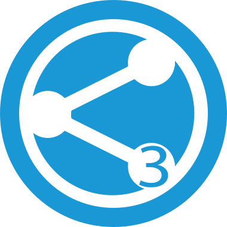
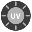
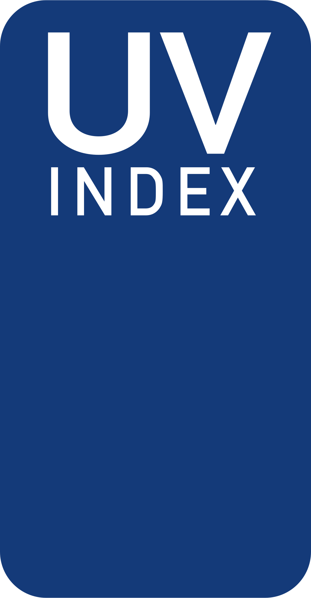

# OpenUV Binding

This binding uses the [OpenUV Index API service](https://www.openuv.io/) for providing UV Index information for any location worldwide.

To use this binding, you first need to [register and get your API token](https://www.openuv.io/auth/google).

## Discovery

Once a bridge with the api Key has been created, Local UV Index informations can be auto discovered based on system location.

## Binding Configuration

The binding has no configuration options, all configuration is done at Bridge and Thing level.

## Bridge Configuration

The bridge has only one configuration parameter :

| Parameter | Description                                                  |
|-----------|--------------------------------------------------------------|
| apikey    | Data-platform token to access the OpenUV service. Mandatory. |

Will accept a Refresh command in order to reinitiate connexion (eg in case of Quota exceeded).

## Thing Configuration

The thing has a few configuration parameters :

| Parameter | Description                                                  |
|-----------|--------------------------------------------------------------|
| location  | Geo coordinates to be considered by the service.             |
| refresh   | Refresh interval in minutes. Optional.                       |

For the location parameter, the following syntax is allowed (comma separated latitude, longitude and optional altitude):

```java
37.8,-122.4
37.8255,-122.456
37.8,-122.4,177
```

## Channels

The OpenUV Report thing that is retrieved has these channels:

| Channel ID   | Item Type           | Description                                     |
|--------------|---------------------|-------------------------------------------------|
| UVIndex      | Number              | UV Index                                        |
| Alert        | Number              | Alert level associated to given UV Index        |
| UVColor      | Color               | Color associated to given alert level.          |
| UVMax        | Number              | Max UV Index for the day (at solar noon)        |
| UVMaxTime    | DateTime            | Max UV Index datetime (solar noon)              |
| Ozone        | Number:ArealDensity | Ozone level in du (Dobson Units) from OMI data  |
| OzoneTime    | DateTime            | Latest OMI ozone update datetime                |
| UVTime       | DateTime            | UV Index datetime                               |
| SafeExposure | Number:Time         | Safe exposure time for Fitzpatrick Skin Types.  |
| elevation    | Number:Angle        | Current Sun elevation.                          |

The elevation channel will be used as an input in order to limit API queries to OpenUV. If not used,
the binding will not consider it. When value is provided queries will only be issued if the elevation is > 0°.
This is quite useful with a free OpenUV account (50 req/day included): in this case, and with the elevation channel configured, a 20 minutes refresh interval should be ok (in Europe the longest day is around 15 hours).

Thing can be extended with as many SafeExposure channels as needed for each skin type.

## Provided icon set

This binding has its own IconProvider and makes available the following list of icons

| Icon Name          | Dynamic | Illustration |
|--------------------|---------|--------------|
| oh:openuv:ozone    |   No    |  |
| oh:openuv:uv-alarm |   Yes   |  |
| oh:openuv:uv-index |   Yes   |  |

## Examples

demo.things:

```xtend
Bridge openuv:openuvapi:local "OpenUV Api" [ apikey="xxxxYYYxxxx" ] {
    Thing uvreport city1 "UV In My City" [ location="52.5200066,13.4049540", refresh=20 ]{
        Channels:
            Type SafeExposure : parents [       
                index="III"
            ]
            Type SafeExposure : childs [
                index="II"
            ]
    }
}

```

demo.items:

```xtend

Number              UVIndex   "UV Index"  { channel = "openuv:uvreport:local:city1:UVIndex" }
Number              UVMax     "UV Max"    { channel = "openuv:uvreport:local:city1:UVMaxEvent" }
Number:ArealDensity Ozone     "Ozone"     { channel = "openuv:uvreport:local:city1:Ozone" }
Number:Time         SafeExp3  "Parents"   { channel = "openuv:uvreport:local:city1:parents" }
Number:Time         SafeExp2  "Childs"    { channel = "openuv:uvreport:local:city1:childs" }

```

astro.items:

```xtend

Number:Angle        Elevation "Elevation" {channel="astro:sun:home:position#elevation",
                                           channel="openuv:uvreport:local:city1:elevation" [profile="follow"] }

```
