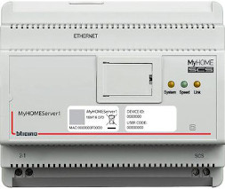
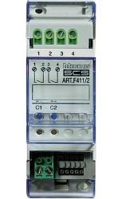
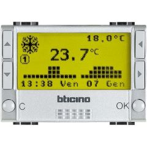

# OpenWebNet (BTicino/Legrand) Binding

This binding integrates **BTicino / Legrand** **MyHOME &reg; - BUS/SCS** and **MyHOME &reg; Radio - Zigbee** wireless devices using the [OpenWebNet](https://en.wikipedia.org/wiki/OpenWebNet) protocol.

The binding supports:

- both wired MyHOME - BUS/SCS and wireless MyHOME Radio - Zigbee setups. The two networks can be configured simultaneously
- auto discovery of MyHOME - BUS/SCS IP and  MyHOME Radio - Zigbee USB gateways; auto discovery of devices
- commands from openHAB and feedback (events) from BUS/SCS and Radio network






## Supported Things

In order for this binding to work, a **BTicino/Legrand OpenWebNet gateway** is needed in your home system to talk to devices.

These gateways have been tested with the binding:

- **MyHOME - BUS/SCS IP gateways** or scenario programmers, such as BTicino
[MyHOMEServer1](https://catalogue.bticino.com/BTI-MYHOMESERVER1-EN),
[F454](https://catalogue.bticino.com/BTI-F454-EN),
[MyHOME_Screen10 (MH4893C)](https://catalogue.bticino.com/BTI-MH4893C-EN),
[MyHOME_Screen3,5 (LN4890)](https://www.homesystems-legrandgroup.com/home/-/productsheets/2452536),
[MH201](https://catalogue.bticino.com/BTI-MH201-EN),
[MH202](https://catalogue.bticino.com/BTI-MH202-EN),
[F455](https://www.homesystems-legrandgroup.com/home/-/productsheets/2481871),
[MH200N](https://www.homesystems-legrandgroup.com/home/-/productsheets/2469209),
[F453](https://www.homesystems-legrandgroup.com/home/-/productsheets/2703566),  etc.

- **MyHOME Radio - Zigbee USB Gateways**, such as [BTicino 3578](https://www.legrand.be/fr/catalogue/zigbee-interface-openzigbee-3578), also known as *Legrand 088328*

Some of these modules are not on the BTicino catalogue anymore.

**NOTE** The new BTicino Living Now&reg; and Livinglight Smart&reg; wireless systems are not supported by this binding as they do not use the OpenWebNet protocol.

The following Things and OpenWebNet `WHOs` are supported:

### For MyHOME - BUS/SCS

| Category                      |       WHO       |                                   Thing Type IDs                                   | Description                                                      | Status                                                                                                                                                                                                                                      |
| ----------------------------- | :-------------: | :--------------------------------------------------------------------------------: | ---------------------------------------------------------------- | ------------------------------------------------------------------------------------------------------------------------------------------------------------------------------------------------------------------------------------------- |
| Gateway Management            |      `13`       |                                   `bus_gateway`                                    | Any IP gateway supporting OpenWebNet protocol should work        | Successfully tested: F452, F453, F453AV,F454, F455, MyHOMEServer1, MyHOME_Screen10, MyHOME_Screen3,5, MH201, MH202, MH200N. Some connection stability issues/gateway resets reported with MH202                                             |
| Lighting                      |       `1`       |                `bus_on_off_switch`, `bus_dimmer`, `bus_light_group`                | BUS switches and dimmers and groups of them                      | Successfully tested: F411/2, F411/4, F411U2, F422, F429. Some discovery issues reported with F429 (DALI Dimmers)                                                                                                                            |
| Automation                    |       `2`       |                                  `bus_automation`                                  | BUS roller shutters, with position feedback and auto-calibration | Successfully tested: LN4672M2                                                                                                                                                                                                               |
| Temperature Control           |       `4`       |              `bus_thermo_zone`, `bus_thermo_sensor`, `bus_thermo_cu`               | Thermo zones management and temperature sensors (probes)         | Successfully tested: Thermostats H/LN4691, HS4692, KG4691; sensors (probes): L/N/NT4577 + 3455; Central Units 4-zones (models L/N/NT/HD/HC/HS4695) and 99-zones (model 3550). See [Channels - Thermo](#configuring-thermo) for more details |
| Alarm                         |       `5`       |                        `bus_alarm_system`, `bus_alarm_zone`                        | BUS Alarm system and zones                                       | Successfully tested: Burglar-alarm Unit 3486                                                                                                                                                                                                |
| Auxiliary (AUX)               |       `9`       |                                     `bus_aux`                                      | AUX commands                                                     | Successfully tested: AUX configured for Burglar-alarm Unit 3486. **Only sending AUX commands is supported**                                                                                                                                 |
| Basic, CEN & CEN+ Scenarios   | `0`, `15`, `25` | `bus_scenario_control`, `bus_cen_scenario_control`, `bus_cenplus_scenario_control` | Basic and CEN/CEN+ Scenarios events and virtual activation       | Successfully tested: CEN/CEN+ scenario control: HC/HD/HS/L/N/NT4680 and basic scenario modules F420/IR3456 + L4680 (WHO=0)                                                                                                                  |
| Dry Contact and IR Interfaces |      `25`       |                                `bus_dry_contact_ir`                                | Dry Contacts and IR Interfaces                                   | Successfully tested: contact interfaces F428 and 3477; IR sensors: HC/HD/HS/L/N/NT4610                                                                                                                                                      |
| Energy Management             |      `18`       |                                 `bus_energy_meter`                                 | Energy Management                                                | Successfully tested: F520, F521. Partially tested: F522, F523                                                                                                                                                                               |

### For MyHOME Radio - Zigbee

| Category           |  WHO  |                    Thing Type IDs                     | Description                                                      | Status                               |
| ------------------ | :---: | :---------------------------------------------------: | ---------------------------------------------------------------- | ------------------------------------ |
| Gateway Management | `13`  |                     `zb_gateway`                      | MyHOME Radio - Zigbee USB Gateway (models: BTI-3578 / LG 088328) | Tested: BTI-3578 and LG 088328       |
| Lighting           |  `1`  | `zb_dimmer`, `zb_on_off_switch`, `zb_on_off_switch2u` | Radio Zigbee dimmers, switches and 2-unit switches               | Tested: BTI-4591, BTI-3584, BTI-4585 |
| Automation         |  `2`  |                    `zb_automation`                    | Radio Zigbee roller shutters                                     |                                      |

## Discovery

Gateway and Things discovery is supported by this binding.

### MyHOME - BUS/SCS Discovery

- BUS Gateway automatic discovery will work only for newer gateways supporting UPnP: F454, MyHOMEServer1, MH201, MH202, MH200N, MyHOME_Screen 10.
For other gateways you can add them manually, see [Thing Configuration](#thing-configuration) below.
- After gateway is discovered and added a connection with default password (`12345`) is tested first: if it does not work the gateway will go offline and an error status will be set. A correct password must then be set in the gateway Thing configuration otherwise the gateway will not become online.
- Once the gateway is online, a second Inbox Scan will discover BUS devices
- BUS/SCS Dimmers must be ON and dimmed (30%-100%) during a Scan, otherwise they will be discovered as simple On/Off switches
  - _KNOWN ISSUE_: In some cases dimmers connected to a F429 Dali-interface are not automatically discovered
- Basic Scenario modules and CEN/CEN+ Scenario Control devices will be discovered by activation only. See [discovery by activation](#discovery-by-activation) for details. After confirming a discovered CEN/CEN+ scenario device from Inbox, activate again its buttons to add button channels automatically

#### Discovery by Activation

BUS devices can also be discovered if they are activated while an Inbox Scan has been started: start a new Scan, wait 15-20 seconds and then _while the Scan is still active_, activate the physical device (for example dim the dimmer) to have it discovered by the binding.
Setting the parameter `discoveryByActivation=true` for a BUS gateway Thing makes discovery by activation always working also when an Inbox Scan hasn't been started.

If a device cannot be discovered automatically from Inbox it's always possible to add it manually, see [Configuring Devices](#configuring-devices).

### MyHOME Radio - Zigbee Discovery

- The MyHOME Radio - Zigbee USB Gateway must be inserted in one of the USB ports of the openHAB computer before a discovery is started
- _**IMPORTANT NOTE:**_ As for other openHAB bindings using the USB/serial ports, on Linux the `openhab` user must be member of the `dialout` group to be able to use USB/serial port; set the group with the following command:

```shell
sudo usermod -a -G dialout openhab
```

- The user will need to logout and login to see the new group added. If you added your user to this group and still cannot get permission, reboot Linux to ensure the new group permission is attached to the `openhab` user.
- Once the MyHOME Radio - Zigbee USB Gateway is added and online, a second Inbox scan will discover devices connected to it. Because of the Zigbee radio network, device discovery will take ~40-60 sec. Be patient!
- Wireless devices must be part of the same Zigbee network of the MyHOME Radio - Zigbee USB Gateway to discover them. Please refer to [this video by BTicino](https://www.youtube.com/watch?v=CoIgg_Xqhbo) to setup a Zigbee wireless network which includes the MyHOME Radio - Zigbee USB Gateway
- Only powered wireless devices part of the same Zigbee network and within radio coverage of the MyHOME Radio - Zigbee USB Gateway will be discovered. Unreachable or not powered devices will be discovered as _GENERIC_ devices and cannot be controlled
- Wireless control units cannot be discovered by the MyHOME Radio - Zigbee USB Gateway and therefore are not supported

## Thing Configuration

### Configuring MyHOME - BUS/SCS Gateway

Configuration parameters are:

- `host`: IP address / hostname of the BUS/SCS gateway (`String`, _mandatory_)
  - Example: `192.168.1.35`
- `port`: port (`int`, _optional_, default: `20000`)
- `passwd`: gateway password (`String`, _required_ for gateways that have a password. Default: `12345`)
  - Example: `abcde` or `12345`
  - if the BUS/SCS gateway is configured to accept connections from the openHAB computer IP address, no password should be required
  - in all other cases, a password must be configured. This includes gateways that have been discovered and added from Inbox: without a password configured they will remain OFFLINE
- `discoveryByActivation`: discover BUS devices when they are activated also when a device scan hasn't been started from Inbox (`boolean`, _optional_, default: `false`). See [Discovery by Activation](#discovery-by-activation).
- `dateTimeSynch`: synchronise date and time of slave elements on the BUS using openHAB timestamp (`boolean`, _optional_, default: `false`). Set this parameter to `true` to send time-date synchronisation commands on the BUS when the timestamp received from the gateway differs by more than 1 minute from that of openHAB. Useful if the BUS gateway is not syncronized with Internet time servers and with daylight saving time changes.

Alternatively the MyHOME - BUS/SCS Gateway Thing can be configured using the `.things` file, see `openwebnet.things` example [below](#full-example).

### Configuring MyHOME Radio - Zigbee USB Gateway

Configuration parameters are:

- `serialPort`: the serial port where the  MyHOME Radio - Zigbee USB Gateway is connected (`String`, _mandatory_)
  - Examples: `/dev/ttyUSB0` (Linux/RaPi), `COM3` (Windows)

Alternatively the MyHOME Radio - Zigbee USB Gateway thing can be configured using the `.things` file, see `openwebnet.things` example [below](#full-example).

### Configuring Devices

Devices can be discovered automatically using an Inbox Scan after a gateway has been configured and connected.

For any manually added device, you must configure:

- the associated gateway Thing (`Parent Bridge` menu)
- the `where` configuration parameter (`OpenWebNet Address`): this is the OpenWebNet address configured for the device in the BTicino/Legrand system. This address can be found either on the device itself (Physical configuration, using jumpers in case of BUS) or through the MyHOME_Suite software (Virtual configuration). The address can have several formats depending on the device/system:
  - example for MyHOME - BUS/SCS system:
    - light device A=`2` (room 2), PL=`4` (light-point 4) --> `where="24"`
    - light device A=`03`, PL=`11` on local bus `01` --> `where="0311#4#01"`
    - lights in room 5 (A=`AMB`, PL=`5`) --> `where="5"`
    - scenario control module address `53` --> `where="53"`
    - CEN scenario A=`05`, PL=`12` --> `where="0512"`
    - CEN+ scenario `5`: add `2` before --> `where="25"`
    - dry Contact or IR Interface `99`: add `3` before --> `where="399"`
    - energy meter F520/F521 numbered `1`: add `5` before  --> `where="51"`
    - energy meter F522/F523 numbered `4`: add `7` before and `#0` after --> `where="74#0"`
    - energy meter F520/F521 the `energyRefreshPeriod` configuration parameter sets the number of minutes (the minimum value is 30, the maximum value is 1440) between refreshes for energy totalizers (default: 30 minutes) --> `energyRefreshPeriod` = 35
    - alarm zone `2` --> `where="2"`
  - example for Zigbee devices: `where=765432101#9`. The ID of the device (ADDR part) is usually written in hexadecimal on the device itself, for example `ID 0074CBB1`: convert to decimal (`7654321`) and add `01#9` at the end to obtain `where=765432101#9`. For 2-unit switch devices (`zb_on_off_switch2u`), last part should be `00#9`.

#### Configuring Thermo

In BTicino MyHOME Thermoregulation (WHO=4) each **zone** has associated a thermostat, additional temperature sensors (optional), actuators and heating/conditioning valves. A zone is associated to at least one thermostat and one actuator.

Thermo zones can be configured defining a `bus_thermo_zone` Thing for each zone with the following parameters:

- the `where` configuration parameter (`OpenWebNet Address`):
  - example BUS/SCS zone `1` --> `where="1"`
- the `standAlone` configuration parameter (`boolean`, default: `true`): identifies if the zone is managed or not by a Central Unit (4- or 99-zones). `standAlone=true` means the zone is indipendent and no Central Unit is present in the system.

Temperature sensors can be configured defining a `bus_thermo_sensor` Thing with the following parameters:

- the `where` configuration parameter (`OpenWebNet Address`):
  - example sensor `5` of external zone `00` --> `where="500"`
  - example: slave sensor `3` of zone `2` --> `where="302"`

The (optional) Central Unit can be configured defining a `bus_themo_cu` Thing with the `where` configuration parameter (`OpenWebNet Address`) set to `where="#0"` for a 99-zone Central Unit (model 3550) or `where="#0#1"` for a 4-zone Central Unit (models L/N/NT/HD/HC/HS 4695) configured as zone 1.

##### Thermo Central Unit integration known limitations

- Read Central Unit setPoint temperature when in WEEKLY / SCENARIO / PROTECTION / VACATION / HOLIDAY
- Set VACATION deadline date / time
- Central Unit Programming and Customisations settings (T1/2/3 temperature levels, setting date & time, weekly/scenarios/holiday profiles programming, etc.)

#### Configuring Alarm and Auxiliary (AUX)

**NOTE 1** Receiving AUX messages originating from the BUS is not supported yet, only sending messages to the BUS is supported

**NOTE 2** Alarm messages on BUS are not sent by MyHOMEServer1, therefore this gateway cannot be used to integrate the BTicino Alarm system

BUS Auxiliary commands (WHO=9) can be used to send on the BUS commands to control, for example, external devices or a BTicino Alarm system.

The BTicino Alarm system **cannot** be controlled directly via the OpenWebNet protocol: the only possibility is to use AUX commands and configure your Burglar-alarm Unit (`Automations` section) to execute some commands (e.g. Arm alarm) when it receives a particular AUX OpenWebNet command.
Alarm Automations allow you to run an OpenWebNet command when a particular event occurs; in this case, the events are changes of state of the AUX device (WHO=9) and the command to be performed is a burglar alarm command (WHO=5).

To configure Alarm Automations go to the menu:

`Antitheft -> Automations`

##### Example configuration Automation 1: when AUX-4 goes ON, then ARM all zones

With this configuration when AUX `where=4` goes ON, the Alarm will execute the automation and send command `*5*8##` to ARM all zones:

```text
Name: Arm all zones
Event: command OPEN = *9*1*4##
OPEN command to execute: *5*8##
```

##### Example configuration Automation 2: when AUX-4 goes OFF, then DISARM all zones

```text
Name: Disarm all zones
Event: command OPEN = *9*0*4##
OPEN command to execute: *5*9##
```

##### Example configuration Automation 3: when AUX-5 goes ON, then ARM zones 1, 3, 4

```text
Name: Arm zones 1 3 4
Event: command OPEN = *9*1*5##
OPEN command to execute: *5*8#134##
```

#### Configuring Light Groups (Room/Group/General)

The `bus_light_group` Thing type represents a set of devices belonging to a room or group in the BUS system:

- `bus_light_group` with `where="5"` will be associated to all lights configured in room 5 (A=`5`)
- `bus_light_group` with `where="#4"` will be associated to all lights belonging to group 4 (G=`4`)
- `bus_light_group` with `where="0"` will be associated to all lights in the system (General).

It's not mandatory to define `bus_light_group` Things: however adding them is useful to send commands to a set of lights or to track state of a room/all lights when one of the members changes state.
It's also not mandatory to define `bus_light_group` Things to track state of a light when a room/group/general ON/OFF command is sent on the BUS (the light state will be updated in any case).

**NOTE 1**
For a `bus_light_group` Thing to be updated properly, at least one light Thing belonging to that room/group must also be configured.

## Channels

### Lighting, Automation, Basic/CEN/CEN+ Scenario Events, Dry Contact / IR Interfaces, Power and AUX channels

| Channel Type ID (channel ID)            | Applies to Thing Type IDs                                                        | Item Type     | Description                                                                                                                                                            | Read/Write  |
| --------------------------------------- | -------------------------------------------------------------------------------- | ------------- | ---------------------------------------------------------------------------------------------------------------------------------------------------------------------- | :---------: |
| `switch` or `switch_01`/`02` for Zigbee | `bus_on_off_switch`, `bus_light_group`, `zb_on_off_switch`, `zb_on_off_switch2u` | Switch        | To switch the device (or group) `ON` and `OFF`                                                                                                                         |     R/W     |
| `brightness`                            | `bus_dimmer`, `zb_dimmer`                                                        | Dimmer        | To adjust the brightness value (Percent, `ON`, `OFF`)                                                                                                                  |     R/W     |
| `shutter`                               | `bus_automation`                                                                 | Rollershutter | To activate roller shutters (`UP`, `DOWN`, `STOP`, Percent - [see Shutter position](#shutter-position))                                                                |     R/W     |
| `scenario`                              | `bus_scenario_control`                                                           | String        | Trigger channel for Basic scenario events [see possible values](#scenario-channels)                                                                                    | R (TRIGGER) |
| `button#X`                              | `bus_cen_scenario_control`, `bus_cenplus_scenario_control`                       | String        | Trigger channel for CEN/CEN+ scenario events [see possible values](#scenario-channels)                                                                                 | R (TRIGGER) |
| `sensor`                                | `bus_dry_contact_ir`                                                             | Switch        | If a Dry Contact Interface is `ON`/`OFF`, or if an IR Sensor is detecting movement (`ON`), or not  (`OFF`)                                                             |      R      |
| `power`                                 | `bus_energy_meter`                                                               | Number:Power  | The current active power usage from Energy Meter                                                                                                                       |      R      |
| `energyToday`                           | `bus_energy_meter`                                                               | Number:Energy | Current day energy                                                                                                                                                     |      R      |
| `energyThisMonth`                       | `bus_energy_meter`                                                               | Number:Energy | Current month energy                                                                                                                                                   |      R      |
| `aux`                                   | `bus_aux`                                                                        | String        | Possible commands: `ON`, `OFF`, `TOGGLE`, `STOP`, `UP`, `DOWN`, `ENABLED`, `DISABLED`, `RESET_GEN`, `RESET_BI`, `RESET_TRI`. Only `ON` and `OFF` are supported for now |     R/W     |

### Alarm channels

| Channel Type ID (channel ID) | Applies to Thing Type IDs            | Item Type | Description                                                                    | Read/Write |
| ---------------------------- | ------------------------------------ | --------- | ------------------------------------------------------------------------------ | :--------: |
| `state`                      | `bus_alarm_system`, `bus_alarm_zone` | Switch    | Alarm system or zone is active (`ON`) or inactive (`OFF`)                      |     R      |
| `network`                    | `bus_alarm_system`                   | Switch    | Alarm system network state (`ON` = network ok, `OFF` = no network)             |     R      |
| `battery`                    | `bus_alarm_system`                   | String    | Alarm system battery state (`OK`, `FAULT`, `UNLOADED`)                         |     R      |
| `armed`                      | `bus_alarm_system`                   | Switch    | Alarm system is armed (`ON`) or disarmed (`OFF`)                               |     R      |
| `alarm`                      | `bus_alarm_zone`                     | String    | Current alarm for the zone  (`SILENT`, `INTRUSION`, `TAMPERING`, `ANTI_PANIC`) |     R      |
| `timestamp`                  | `bus_alarm_zone`                     | DateTime  | Current date and time of the zone's alarm event (YY/MM/DD hh:mm:ss)            |     R      |

### Thermo channels

**NOTE** Channels marked in the table with `Advanced = Y` can be shown on the UI from Thing configuration > Channels tab > check `Show advanced`.

| Channel Type ID (channel ID) | Applies to Thing Type IDs              | Item Type          | Description                                                                                                                                                                            | Read/Write | Advanced |
| ---------------------------- | -------------------------------------- | ------------------ | -------------------------------------------------------------------------------------------------------------------------------------------------------------------------------------- | :--------: | :------: |
| `temperature`                | `bus_thermo_zone`, `bus_thermo_sensor` | Number:Temperature | Currently sensed temperature for zone or sensor                                                                                                                                        |     R      |    N     |
| `setpointTemperature`        | `bus_thermo_zone`, `bus_thermo_cu`     | Number:Temperature | The zone or Central Unit manual setpoint temperature                                                                                                                                   |    R/W     |    N     |
| `targetTemperature`          | `bus_thermo_zone`                      | Number:Temperature | The current zone target temperature according to `mode`, `setpointTemperature` and `localOffset`                                                                                       |     R      |    Y     |
| `function`                   | `bus_thermo_zone`, `bus_thermo_cu`     | String             | The zone set thermo function (`COOLING`, `HEATING`, `GENERIC`) or the Central Unit thermo function (`COOLING`, `HEATING`)                                                              |    R/W     |    N     |
| `mode`                       | `bus_thermo_zone`, `bus_thermo_cu`     | String             | The zone set mode (`AUTO`, `MANUAL`, `OFF`, `PROTECTION`) or the Central Unit set mode (`WEEKLY`, `MANUAL`, `SCENARIO`, `HOLIDAY`, `VACATION`, `OFF`, `PROTECTION`)                    |    R/W     |    N     |
| `speedFanCoil`               | `bus_thermo_zone`                      | String             | The zone fancoil speed: `AUTO`, `SPEED_1`, `SPEED_2`, `SPEED_3`                                                                                                                        |    R/W     |    N     |
| `actuators`                  | `bus_thermo_zone`                      | String             | The zone actuator(s) status: `OFF`, `ON`, `OPENED`, `CLOSED` , `STOP`, `OFF_FAN_COIL`, `ON_SPEED_1`, `ON_SPEED_2`, `ON_SPEED_3`, `OFF_SPEED_1`, `OFF_SPEED_2`, `OFF_SPEED_3`           |     R      |    Y     |
| `heatingValves`              | `bus_thermo_zone`                      | String             | The zone heating valve(s) status: `OFF`, `ON`, `OPENED`, `CLOSED` , `STOP`, `OFF_FAN_COIL`, `ON_SPEED_1`, `ON_SPEED_2`, `ON_SPEED_3`, `OFF_SPEED_1`, `OFF_SPEED_2`, `OFF_SPEED_3`      |     R      |    Y     |
| `conditioningValves`         | `bus_thermo_zone`                      | String             | The zone conditioning valve(s) status: `OFF`, `ON`, `OPENED`, `CLOSED` , `STOP`, `OFF_FAN_COIL`, `ON_SPEED_1`, `ON_SPEED_2`, `ON_SPEED_3`, `OFF_SPEED_1`, `OFF_SPEED_2`, `OFF_SPEED_3` |     R      |    Y     |
| `heating`                    | `bus_thermo_zone`                      | Switch             | `ON` if the zone heating valve is currently active (meaning heating is On)                                                                                                             |     R      |    Y     |
| `cooling`                    | `bus_thermo_zone`                      | Switch             | `ON` if the zone conditioning valve is currently active (meaning conditioning is On)                                                                                                   |     R      |    Y     |
| `localOffset`                | `bus_thermo_zone`                      | String             | The zone local offset status: `OFF`, `PROTECTION`, `MINUS_3`, `MINUS_2` , `MINUS_1`, `NORMAL`, `PLUS_1`, `PLUS_2`, `PLUS_3`, as set on the room thermostat physical knob               |     R      |    Y     |
| `remoteControl`              | `bus_thermo_cu`                        | String             | The Central Unit Remote Control status: `ENABLED`, `DISABLED`                                                                                                                          |     R      |    Y     |
| `batteryStatus`              | `bus_thermo_cu`                        | String             | The Central Unit Battery status: `OK`, `KO`                                                                                                                                            |     R      |    Y     |
| `weeklyProgram`              | `bus_thermo_cu`                        | Number             | The weekly program number (`1`, `2`, `3`) when Central Unit mode is `WEEKLY`                                                                                                           |    R/W     |    N     |
| `scenarioProgram`            | `bus_thermo_cu`                        | Number             | The scenario program number (`1`, `2`, ... ,  `16`) when Central Unit mode is `SCENARIO`                                                                                               |    R/W     |    N     |
| `vacationDays`               | `bus_thermo_cu`                        | Number             | Number of days `1-255` the Central Unit will be set to Anti-freeze / Heat Protection temperature before returning to mode `WEEKLY`                                                     |    R/W     |    N     |
| `failureDiscovered`          | `bus_thermo_cu`                        | Switch             | Indicates if a Failure was discovered by the Central Unit (`ON`), or not (`OFF`)                                                                                                       |     R      |    Y     |
| `atLeastOneProbeOff`         | `bus_thermo_cu`                        | Switch             | Indicates if at least one probe is in OFF mode (`ON`) or not (`OFF`)                                                                                                                   |     R      |    Y     |
| `atLeastOneProbeProtection`  | `bus_thermo_cu`                        | Switch             | Indicates if at least one probe is in PROTECTION mode (`ON`) or not (`OFF`)                                                                                                            |     R      |    Y     |
| `atLeastOneProbeManual`      | `bus_thermo_cu`                        | Switch             | Indicates if at least one probe is in MANUAL mode (`ON`) or not (`OFF`)                                                                                                                |     R      |    Y     |

### Notes on channels

#### `shutter` position

For Percent commands and position feedback to work correctly, the `shutterRun` Thing config parameter must be configured equal to the time (in milliseconds) to go from full UP to full DOWN. It's possible to enter a value manually or set `shutterRun=AUTO` (default) to calibrate `shutterRun` automatically.

##### Automatic calibration of `shutterRun`

When `shutterRun` is set to `AUTO`, a  _UP >> DOWN >> Position%_  cycle will be performed automatically the first time a Percent command is sent to the shutter: this way the binding will calculate the shutter "run time" and set the `shutterRun` parameter accordingly.

**NOTE**
A "stop time" parameter is usually set on the physical actuator (eg. F411U2) either via virtual configuration (MyHOME_Suite: parameters named "Stop time" or "M") or physical configuration (jumpers): check the actuator instructions to configure correctly this parameter on the actuator before performing auto calibration. If the "stop time" on the physical actuator is wrongly set or cannot be modified to the actual "run time" of the shutter, auto calibration cannot be used and `shutterRun` should be set manually to the actual runtime of the shutters.

##### Position estimation of the shutter

- if `shutterRun` is not set, or is set to `AUTO` but calibration has not been performed yet, then position estimation will remain `UNDEF` (undefined)
- if `shutterRun` is wrongly set *higher* than the actual runtime or the "stop time" of the actuator (see NOTE above), then position estimation will remain `UNDEF`: try to reduce `shutterRun` until you find the right value
- before adding/configuring roller shutter Things it is suggested to have all roller shutters `UP`, otherwise the Percent command will not work until the roller shutter is fully rolled up
- if openHAB is restarted the binding does not know if a shutter position has changed in the meantime, so its position will be `UNDEF`. Move the shutter all `UP`/`DOWN` to synchronise again its position with the binding
- the shutter position is estimated based on UP/DOWN timings: an error of ±2% is normal

#### Scenario channels

Basic Scenarios and CEN/CEN+ Scenarios channels are [TRIGGER channels](https://www.openhab.org/docs/configuration/rules-dsl.html#channel-based-triggers]): they handle events and do not have a state.

A powerful feature is to detect scenario activations and CEN/CEN+ buttons press events to trigger rules in openHAB: this way openHAB becomes a very powerful scenario manager activated by BTicino scenario control modules or by CEN/CEN+ scenarios physical buttons.
See [openwebnet.rules](#openwebnet-rules) for examples on how to define rules that trigger on scenarios and on CEN/CEN+ button press events.

It's also possible to send _virtual scenario activation_ and _virtual press_ events on the BUS, for example to enable the activation of MH202 or F420 scenarios from openHAB..
See [openwebnet.sitemap](#openwebnet-sitemap) & [openwebnet.rules](#openwebnet-rules) sections for examples on how to use the `activateScenario` and `virtualPress` actions connected to a pushbutton on a sitemap.

- basic scenario channels are named `scenario` and possible events are: `SCENARIO_01` ... `SCENARIO_16` (or up to `SCENARIO_20` in case of module IR3456) when a scenario is activated
- CEN/CEN+ channels are named `button#X` where `X` is the button number on the CEN/CEN+ Scenario Control device
  - in the .thing file configuration you can specify the `buttons` parameter to define a comma-separated list of buttons numbers [0-31] configured for the scenario device, example: `buttons=1,2,4`
  - possible events are:
    - for CEN:
      - `START_PRESS` - sent when you start pressing the button
      - `SHORT_PRESS` - sent if you pressed the button shorter than 0,5sec (sent at the moment when you release it)
      - `EXTENDED_PRESS` - sent if you keep the button pressed longer than 0,5sec; will be sent again every 0,5sec as long as you hold pressed (good for dimming rules)
      - `RELEASE_EXTENDED_PRESS` - sent once when you finally release the button after having it pressed longer than 0,5sec
    - for CEN+:
      - `SHORT_PRESS` - sent if you pressed the button shorter than 0,5sec (sent at the moment when you release it)
      - `START_EXTENDED_PRESS` - sent once as soon as you keep the button pressed longer than 0,5sec
      - `EXTENDED_PRESS` - sent after `START_EXTENDED_PRESS` if you keep the button pressed longer; will be sent again every 0,5sec as long as you hold pressed (good for rules involving dimming/volume)
      - `RELEASE_EXTENDED_PRESS` - sent once when you finally release the button after having it pressed longer than 0,5sec

#### Thermo Central Unit `mode`: `WEEKLY` and `SCENARIO`

There are three WEEKLY and sixteen SCENARIO programs defined for the thermo Central Unit.

In order to activate one specific weekly or scenario program two different channels must be used:

- with the `mode` channel it's possible to set the mode (`WEEKLY` or `SCENARIO`)
- with `weeklyProgram` (if `WEEKLY` was set) or `scenarioProgram` (if `SCENARIO` was set) channels it's possible to set the specific weekly/scenario program number

Example: to activate SCENARIO number 9 on the thermo Central Unit then set channel `mode` = `SCENARIO` and channel `scenarioProgram` = `9`.

## Rule Actions

The following Rule actions can be used to send arbitrary OpenWebNet messages on the MyHOME BUS.
Actions can be used for example to send commands to the BUS for a WHOs not yet supported by the binding.

- `Boolean sendMessage(String message)` returns a `Boolean` = `true` if the `message` (OpenWebNet frame) was successfully sent via the gateway, `false` otherwise.
- `Map<String, Object> sendMessageWithResponse(String message)` same as previous one, but returns a `Map<String, Object>` with following keys:
  - `success`: a `Boolean` = `true` if the `message` was sent successfully
  - `responseMessages`: a `List<String>` object containing all returned frames as response to command sent

Usage example:

:::: tabs

::: tab DSL

```java
val actions = getActions("openwebnet", "openwebnet:bus_gateway:mybridge")
var success = actions.sendMessage("*22*22#4#9*2#1##")
logInfo("EventLog", "Success: " + success)

var result = actions.sendMessageWithResponse("*22*22#4#9*2#1##")
logInfo("EventLog", "Success: " + result.get("success"))
logInfo("EventLog", "Response: " + result.get("responseMessages"))
```

:::

::: tab JavaScript

```javascript
var actions = getActions("openwebnet", "openwebnet:bus_gateway:mybridge");
var success = actions.sendMessage("*22*22#4#9*2#1##");
logInfo("EventLog", "Success: " + success);

var result = actions.sendMessageWithResponse("*22*22#4#9*2#1##");
logInfo("EventLog", "Success: " + result.success);
logInfo("EventLog", "Response: " + result.responseMessages);
```

:::

::: tab JRuby

```ruby
openwebnet = things["openwebnet:bus_gateway:mybridge"]
result = openwebnet.send_message("*22*22#4#9*2#1##")
logger.info "Result: #{result}"

result = openwebnet.send_message_with_response("*22*22#4#9*2#1##")
logger.info "Success: #{result["success"]}"
logger.info "Response: #{result["responseMessages"]}"
```

:::

::::

## Full Example

### openwebnet.things

MyHOME BUS/SCS gateway and Things configuration:

```java
Bridge openwebnet:bus_gateway:mybridge "MyHOMEServer1" [ host="192.168.1.35", passwd="abcde", port=20000, discoveryByActivation=false ] {
      bus_light_group               ALL_lights           "All lights"               [ where="0" ]
      bus_light_group               LR_room              "Living Room"              [ where="5" ]
      bus_on_off_switch             LR_switch            "Living Room Light"        [ where="51" ]
      bus_dimmer                    LR_dimmer            "Living Room Dimmer"       [ where="0311#4#01" ]
      bus_automation                LR_shutter           "Living Room Shutter"      [ where="93", shutterRun="20050"]

      bus_energy_meter              CENTRAL_Ta           "Energy Meter Ta"          [ where="51" ]
      bus_energy_meter              CENTRAL_Tb           "Energy Meter Tb"          [ where="52" ]

      bus_thermo_cu                 CU_3550              "99 zones Central Unit"    [ where="#0" ]
      bus_thermo_zone               LR_zone              "Living Room Zone"         [ where="2"]
      bus_thermo_sensor             EXT_tempsensor       "External Temperature"     [ where="500"]

      bus_scenario_control          BR_scenario          "Bedroom Scenario Module"  [ where="95" ]

      bus_cen_scenario_control      LR_CEN_scenario      "Living Room CEN"          [ where="51", buttons="4,3,8"]
      bus_cenplus_scenario_control  LR_CENplus_scenario  "Living Room CEN+"         [ where="212", buttons="1,5,18" ]
      bus_dry_contact_ir            LR_IR_sensor         "Living Room IR Sensor"    [ where="399" ]

      bus_aux                       Alarm_Control        "Alarm control"            [ where="4" ]

      bus_alarm_system              Alarm_Sys            "Alarm System"             [ where="0"  ]
      bus_alarm_zone                Alarm_Zone_3         "Alarm Zone 3"             [ where="3"  ]
}
```

MyHOME Radio - Zigbee USB Gateway and Things configuration:

```java
Bridge openwebnet:zb_gateway:myZBgateway  [ serialPort="COM3" ] {
    zb_dimmer          myZB_dimmer     [ where="765432101#9"]
    zb_on_off_switch   myZB_switch     [ where="765432201#9"]
    zb_on_off_switch2u myZB_2U_switch  [ where="765432300#9"]
}
```

### openwebnet.items

Example items linked to MyHOME - BUS/SCS devices:

NOTE: lights, blinds and zones (thermostat) can be handled from personal assistants (Google Home, Alexa).
In the following example some `Google Assistant` (`ga="..."`) and `HomeKit` (`homekit="..."`) metadata were added as examples according to the [documentation for Google Assistant integration on openHAB](https://www.openhab.org/docs/ecosystem/google-assistant) and [the openHAB HomeKit Add-on documentation](https://www.openhab.org/addons/integrations/homekit/): see the specific openHAB documentation for updated configurations and more metadata options.

```java
Switch              iALL_lights                 "All Lights"                                    { channel="openwebnet:bus_light_group:mybridge:ALL_lights:switch", ga="Light", homekit="Lighting" }
Switch              iLR_room                    "Living Room"                                   { channel="openwebnet:bus_light_group:mybridge:LR_room:switch", ga="Light", homekit="Lighting" }
Switch              iLR_switch                  "Light"                       (gLivingRoom)     { channel="openwebnet:bus_on_off_switch:mybridge:LR_switch:switch", ga="Light", homekit="Lighting" }
Dimmer              iLR_dimmer                  "Dimmer [%.0f %%]"            (gLivingRoom)     { channel="openwebnet:bus_dimmer:mybridge:LR_dimmer:brightness", ga="Light", homekit="Lighting" }

Rollershutter       iLR_shutter                 "Shutter [%.0f %%]"           (gShutters, gLivingRoom) { channel="openwebnet:bus_automation:mybridge:LR_shutter:shutter", ga="Blinds", homekit = "Window" }

Number:Power        iCENTRAL_Ta                 "Power [%.0f %unit%]"                           { channel="openwebnet:bus_energy_meter:mybridge:CENTRAL_Ta:power" }
Number:Power        iCENTRAL_Tb                 "Power [%.0f %unit%]"                           { channel="openwebnet:bus_energy_meter:mybridge:CENTRAL_Tb:power" }
Number:Energy       iCENTRAL_Ta_day             "Energy Day [%.1f %unit%]"                      { channel="openwebnet:bus_energy_meter:mybridge:CENTRAL_Ta:energyToday"}
Number:Energy       iCENTRAL_Tb_day             "Energy Day [%.1f %unit%]"                      { channel="openwebnet:bus_energy_meter:mybridge:CENTRAL_Tb:energyToday"}
Number:Energy       iCENTRAL_Ta_month           "Energy Month [%.1f %unit%]"                    { channel="openwebnet:bus_energy_meter:mybridge:CENTRAL_Ta:energyThisMonth"}
Number:Energy       iCENTRAL_Tb_month           "Energy Month [%.1f %unit%]"                    { channel="openwebnet:bus_energy_meter:mybridge:CENTRAL_Tb:energyThisMonth"}

// 99 zones thermo central unit
Group               gCentralUnit                "Thermo Central Unit"
Number:Temperature  iCU_3550_manualset          "Temperature"                          (gCentralUnit)    { channel="openwebnet:bus_thermo_cu:mybridge:CU_3550:setpointTemperature", ga="thermostatTemperatureSetpoint" }
String              iCU_3550_remote             "Remote Control"                       (gCentralUnit)    { channel="openwebnet:bus_thermo_cu:mybridge:CU_3550:remoteControl" }
String              iCU_3550_battery            "Battery Status"                       (gCentralUnit)    { channel="openwebnet:bus_thermo_cu:mybridge:CU_3550:batteryStatus" }
String              iCU_3550_mode               "Mode"                                 (gCentralUnit)    { channel="openwebnet:bus_thermo_cu:mybridge:CU_3550:mode" }
Number              iCU_3550_wpn                "Weekly Program"                       (gCentralUnit)    { channel="openwebnet:bus_thermo_cu:mybridge:CU_3550:weeklyProgram" }
Number              iCU_3550_spn                "Scenario Program"                     (gCentralUnit)    { channel="openwebnet:bus_thermo_cu:mybridge:CU_3550:scenarioProgram" }
String              iCU_3550_func               "Function"                             (gCentralUnit)    { channel="openwebnet:bus_thermo_cu:mybridge:CU_3550:function" }
Switch              iCU_3550_at1off             "At least one probe in OFF"            (gCentralUnit)    { channel="openwebnet:bus_thermo_cu:mybridge:CU_3550:atLeastOneProbeOff" }
Switch              iCU_3550_at1pro             "At least one probe in PROTECTION"     (gCentralUnit)    { channel="openwebnet:bus_thermo_cu:mybridge:CU_3550:atLeastOneProbeProtection" }
Switch              iCU_3550_at1man             "At least one probe in MANUAL"         (gCentralUnit)    { channel="openwebnet:bus_thermo_cu:mybridge:CU_3550:atLeastOneProbeManual" }
Switch              iCU_3550_failure            "Failure discovered"                   (gCentralUnit)    { channel="openwebnet:bus_thermo_cu:mybridge:CU_3550:failureDiscovered" }

Group               gLivingRoomZone             "Living Room Zone"                              { ga="Thermostat" [ modes="auto=GENERIC,heat=HEATING,cool=COOLING", thermostatTemperatureRange="7,35", useFahrenheit=false ] }
Number:Temperature  iLR_zone_temp               "Temperature [%.1f %unit%]"   (gLivingRoomZone) { channel="openwebnet:bus_thermo_zone:mybridge:LR_zone:temperature", ga="thermostatTemperatureAmbient" }
Number:Temperature  iLR_zone_setTemp            "SetPoint Temperature"        (gLivingRoomZone) { channel="openwebnet:bus_thermo_zone:mybridge:LR_zone:setpointTemperature", ga="thermostatTemperatureSetpoint" }
String              iLR_zone_fanSpeed           "FanSpeed"                    (gLivingRoomZone) { channel="openwebnet:bus_thermo_zone:mybridge:LR_zone:speedFanCoil" }
String              iLR_zone_mode               "Mode"                        (gLivingRoomZone) { channel="openwebnet:bus_thermo_zone:mybridge:LR_zone:mode" }
String              iLR_zone_func               "Function"                    (gLivingRoomZone) { channel="openwebnet:bus_thermo_zone:mybridge:LR_zone:function", ga="thermostatMode" }
String              iLR_zone_actuators          "Actuators"                   (gLivingRoomZone) { channel="openwebnet:bus_thermo_zone:mybridge:LR_zone:actuators" }
String              iLR_zone_hv                 "Heating valves"              (gLivingRoomZone) { channel="openwebnet:bus_thermo_zone:mybridge:LR_zone:heatingValves" }
String              iLR_zone_cv                 "Conditioning valves"         (gLivingRoomZone) { channel="openwebnet:bus_thermo_zone:mybridge:LR_zone:conditioningValves" }

Number:Temperature  iEXT_temp                   "Temperature [%.1f %unit%]"   (gExternal)       { channel="openwebnet:bus_thermo_sensor:mybridge:EXT_tempsensor:temperature" }

String              iCENPlusProxyItem           "CEN+ Proxy Item"

Switch              iLR_IR_sensor               "Sensor"                                        { channel="openwebnet:bus_dry_contact_ir:mybridge:LR_IR_sensor:sensor" }

// alarm aux, alarm unit and a zone
String              iAlarm_Control              "Alarm Control Arm/Disarm"     (gAlarm)         { channel="openwebnet:bus_aux:mybridge:Alarm_Control:aux"}
Switch              iAlarm_System_State         "Alarm state"                  (gAlarm)         { channel="openwebnet:bus_alarm_system:mybridge:Alarm_Sys:state" }
Switch              iAlarm_System_Armed         "Alarm armed"                  (gAlarm)         { channel="openwebnet:bus_alarm_system:mybridge:Alarm_Sys:armed" }
Switch              iAlarm_System_Network       "Alarm network"                (gAlarm)         { channel="openwebnet:bus_alarm_system:mybridge:Alarm_Sys:network" }
String              iAlarm_System_Battery       "Alarm battery"                (gAlarm)         { channel="openwebnet:bus_alarm_system:mybridge:Alarm_Sys:battery" }
Switch              iAlarm_Zone_3_State         "Zone 3 state"                 (gAlarm)         { channel="openwebnet:bus_alarm_zone:mybridge:Alarm_Zone_3:state" }
String              iAlarm_Zone_3_Alarm         "Zone 3 alarm"                 (gAlarm)         { channel="openwebnet:bus_alarm_zone:mybridge:Alarm_Zone_3:alarm" }
```

Example items linked to OpenWebNet MyHOME Radio - Zigbee devices:

```java
Dimmer          iDimmer             "Dimmer [%.0f %%]"                  <DimmableLight>  (gKitchen)                   [ "Lighting" ]  { channel="openwebnet:zb_dimmer:myZBgateway:myZB_dimmer:brightness" }
Switch          iSimpleSwitch       "Kitchen Switch"                    <light>          (gKitchen)                   [ "Lighting" ]  { channel="openwebnet:zb_on_off_switch:myZBgateway:myZB_switch:switch_01" }
Switch          iSwitch_01          "2U first light"                    <light>          (gKitchen)                   [ "Lighting" ]  { channel="openwebnet:zb_on_off_switch2u:myZBgateway:myZB_2U_switch:switch_01" }
Switch          iSwitch_02          "2U second light"                   <light>          (gKitchen)                   [ "Lighting" ]  { channel="openwebnet:zb_on_off_switch2u:myZBgateway:myZB_2U_switch:switch_02" }
```

### openwebnet.sitemap

```perl
sitemap openwebnet label="OpenWebNet Binding Example Sitemap"
{
    Frame label="Living Room"
    {
          Default item=iALL_lights          icon="light"
          Default item=iLR_room             icon="light"
          Default item=iLR_switch           icon="light"
          Default item=iLR_dimmer           icon="light"
          Default item=iLR_shutter
          Switch  item=iLR_IR_sensor        mappings=[ON="Presence", OFF="No Presence"]
    }

    Frame label="Energy Meters" icon="energy"
    {
          Default item=iCENTRAL_Ta              label="General"                        icon="energy" valuecolor=[>3000="red"]
          Default item=iCENTRAL_Tb              label="Ground Floor"                   icon="energy" valuecolor=[>3000="red"]
          Default item=CENTRAL_Ta_day           label="General Energy Today"           icon="energy" valuecolor=[>3000="blue"]
          Default item=CENTRAL_Tb_day           label="Ground Floor Energy Today"      icon="energy" valuecolor=[>3000="blue"]
          Default item=CENTRAL_Ta_month         label="General Energy This Month"      icon="energy" valuecolor=[>3000="yellow"]
          Default item=CENTRAL_Tb_month         label="Ground Floor Energy This Month" icon="energy" valuecolor=[>3000="yellow"]
    }

    Frame label="Living Room Thermo"
    {
          Default   item=iLR_zone_temp          label="Temperature" icon="fire" valuecolor=[<20="red"]
          Setpoint  item=iLR_zone_setTemp       label="Setpoint [%.1f °C]" step=0.5 minValue=15 maxValue=30
          Selection item=iLR_zone_fanSpeed      label="Fan Speed" icon="fan" mappings=[AUTO="AUTO", SPEED_1="Low", SPEED_2="Medium", SPEED_3="High"]
          Switch    item=iLR_zone_mode          label="Mode" icon="settings"
          Selection item=iLR_zone_func          label="Function" icon="heating" mappings=[HEATING="Heating", COOLING="Cooling", GENERIC="Heating/Cooling"]
          Default   item=iLR_zone_actuators     label="Actuators status"
          Default   item=iLR_zone_hv            label="Heating valves status"
          Default   item=iLR_zone_cv            label="Conditioning valves status"
    }

    Frame label="CEN+ Scenario activation"
    {
          Switch    item=iCENPlusProxyItem      label="My CEN+ scenario" icon="movecontrol"  mappings=[ON="Activate"]
    }

    Frame label="Alarm"
    {
         Switch  item=iAlarm_System_State       label="Alarm state"
         Switch  item=iAlarm_Control            label="Arm/Disarm alarm"   icon="shield" mappings=[OFF="Disarmed",ON="Armed"]
         Switch  item=iAlarm_System_Armed       label="Armed"              icon="shield"
         Switch  item=iAlarm_System_Network     label="Network"            icon="network"
         Default item=iAlarm_System_Battery     label="Battery"            icon="battery"
         Switch  item=iAlarm_Zone_3_State       label="Zone 3 state"
         Default item=iAlarm_Zone_3_Alarm       label="Zone 3 alarm"       icon="siren"
    }
}
```

### openwebnet.rules

```xtend
rule "Basic scenario WHO=0"
// A "SCENARIO_02" event started from Scenario device where=95 will switch ON iLR_switch %
when
    Channel "openwebnet:bus_scenario_control:mybridge:BR_scenario:scenario" triggered SCENARIO_02
then
    sendCommand(iLR_switch, ON)
end


rule "CEN+ virtual press from OH button"
/* This rule triggers when the proxy item iCENPlusProxyItem is activated, for example from a button on WebUI/sitemap.
When activated it sends a "virtual short press" event (where=212, button=5) on the BUS
*/
when
    Item iCENPlusProxyItem received command
then
    val actions = getActions("openwebnet","openwebnet:bus_cenplus_scenario_control:mybridge:212")
    actions.virtualPress("SHORT_PRESS", 5)
end


rule "CEN dimmer increase"
// A "start press" event on CEN where=51, button=4 will increase dimmer%
when
    Channel "openwebnet:bus_cen_scenario_control:mybridge:51:button#4" triggered START_PRESS
then
    sendCommand(iLR_dimmer, INCREASE)
end


rule "CEN dimmer decrease"
// A "release extended press" event on CEN where=51, button=4 will decrease dimmer%
when
    Channel "openwebnet:bus_cen_scenario_control:mybridge:51:button#4" triggered RELEASE_EXTENDED_PRESS
then
    sendCommand(iLR_dimmer, DECREASE)
end

```

## Notes

The OpenWebNet (Open Web Net) protocol is maintained and Copyright by BTicino/Legrand.
The documentation of the protocol is freely accessible for developers on the [Legrand developer web site](https://developer.legrand.com/local-interoperability/)

## Special thanks

Special thanks for helping on testing this binding go to:
[@m4rk](https://community.openhab.org/u/m4rk/),
[@bastler](https://community.openhab.org/u/bastler),
[@gozilla01](https://community.openhab.org/u/gozilla01),
[@enrico.mcc](https://community.openhab.org/u/enrico.mcc),
[@k0nti](https://community.openhab.org/u/k0nti/),
[@gilberto.cocchi](https://community.openhab.org/u/gilberto.cocchi/),
[@llegovich](https://community.openhab.org/u/llegovich),
[@gabriele.daltoe](https://community.openhab.org/u/gabriele.daltoe),
[@feodor](https://community.openhab.org/u/feodor),
[@aconte80](https://community.openhab.org/u/aconte80),
[@rubenfuser](https://community.openhab.org/u/rubenfuser),
[@stamate_viorel](https://community.openhab.org/u/stamate_viorel),
[@marchino](https://community.openhab.org/u/marchino),
[@the-ninth](https://community.openhab.org/u/the-ninth),
[@giacob](https://community.openhab.org/u/giacob)

and many others at the fantastic openHAB community!
