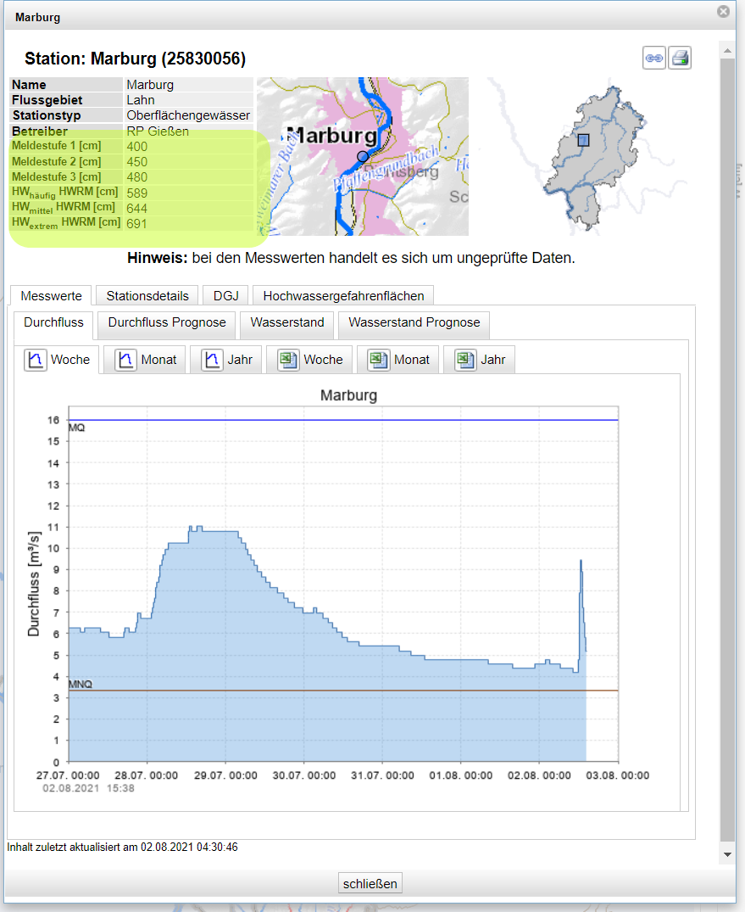

# PegelOnline Binding

Binding to observe water level from german rivers.
Data is provided by german **Water-Route and Shipping Agency** [WSV](https://www.pegelonline.wsv.de/).
Goal is to monitor actual water levels from rivers nearby your home.
In case of changing water levels the corresponding warning level is lowered or raised.

## Supported Things

| Label               | Description                                                                     | ID      |
|---------------------|---------------------------------------------------------------------------------|---------|
| Measurement Station | Station providing water level measurements                                      | station |

## Discovery

In case your home location coordinates are set the discovery will recognize all measurement stations within a radius of 50 km.
Found Things are added in your Inbox.

## Thing Configuration

Thing configuration contains 3 sections

- [Station selection](station_selection)
- [Warning Levels of selected station](warning_levels)
- [Refresh rate](configuration_parameters)

### Station selection

Stations can be selected with an Universally Unique Identifier (uuid).
It's automatically added by the Discovery.
Configure a station manually using [list of all available stations](https://pegelonline.wsv.de/gast/pegeltabelle) or [stations.json](https://www.pegelonline.wsv.de/webservices/rest-api/v2/stations.json) and choose the uuid of your desired measurement station.

### Warning Levels



Each station has specific warning levels

- Warning Levels 1 (_lowest_) to 3 (_highest_)
- Flooding Levels

Unfortunately these levels cannot be queried automatically.
Please select your [federal state](https://www.hochwasserzentralen.de/) and check if which levels they provide.
The picture shows the levels of [measurement station Marburg of federal state Hesse](https://www.hlnug.de/static/pegel/wiskiweb2/stations/25830056/station.html?v=20210802152952)

If you cannot evaluate warning or flooding levels leave the parameter empty.

### Configuration parameters

| configuration    | content   | unit | description               | required | default |
|------------------|-----------|------|---------------------------|----------|---------|
| uuid             | text      |  -   | Unique Station Identifier |     X    | N/A     |
| warningLevel1    | integer   |  cm  | Warning Level 1           |          | N/A     |
| warningLevel2    | integer   |  cm  | Warning Level 2           |          | N/A     |
| warningLevel3    | integer   |  cm  | Warning Level 3           |          | N/A     |
| hq10             | integer   |  cm  | Decade Flooding           |          | N/A     |
| hq100            | integer   |  cm  | Century Flooding          |          | N/A     |
| hqExtreme        | integer   |  cm  | Extreme Flooding          |          | N/A     |
| refreshInterval  | integer   |  min | Refresh Interval          |     X    | 15      |

## Channels

| channel id           | type                 | description                    |
|----------------------|----------------------|--------------------------------|
| timestamp            | DateTime             | Last Measurement               |
| level                | Number:Length        | Water Level                    |
| trend                | Number               | Water Level Trend              |
| warning              | Number               | Current Warning                |

### Trend

Possible values:

- 1 : Rising
- 0 : Steady
- -1 : Lowering

### Warning

Current warning according to configuration

- 0 : No Warning
- 1 : Warning level 1
- 2 : Warning Level 2
- 3 : Warning Level 3
- 4 : Decade Flooding
- 5 : Century Flooding
- 6 : Extreme Flooding

## Full Example

### Things

```java
Thing pegelonline:station:giessen "Measurement Station Giessen" [
    uuid="4b386a6a-996e-4a4a-a440-15d6b40226d4",
    refreshInterval=15,
    warningLevel1=550,
    warningLevel2=600,
    warningLevel3=650,
    hq10=732,
    hq100=786
]
```

### Items

```java
DateTime         Lahn_Giessen_Timestamp      "Measurement timestamp Lahn Giessen"   {channel="pegelonline:station:giessen:timestamp" }
Number:Length    Lahn_Giessen_Level          "Water Level Lahn Giessen]"            {channel="pegelonline:station:giessen:level" }
Number           Lahn_Giessen_Trend          "Water Level Trend Lahn Giessen"       {channel="pegelonline:station:giessen:trend"}
Number           Lahn_Giessen_Warning        "Warning Level Lahn Giessen"           {channel="pegelonline:station:giessen:warning"}
```

## Links

[PegelOnline API Documentation](https://www.pegelonline.wsv.de/webservice/dokuRestapi#caching)
