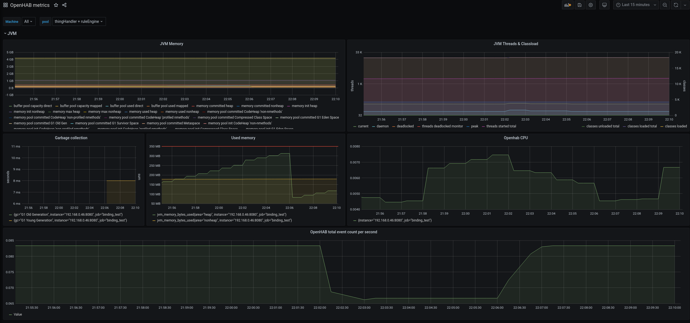
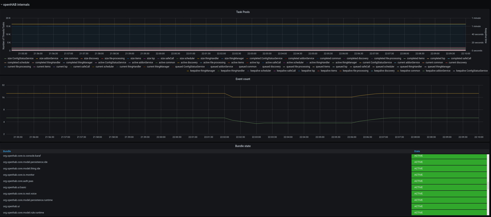
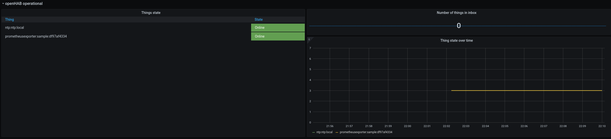

# PrometheusExporter Binding

The PrometheusExporter binding provides openHAB internals like event counts, thread pool statistics, item states and JVM metrics in a [Prometheus](https://prometheus.io/) compatible format.
This allows for monitoring and alerting of the openHAB instance and for creation of monitoring dashboards using e. g. [Grafana](https://grafana.com) 





## Supported Things

There is only a single thing.
### TODO

## Discovery

### TODO implement and describe

_Describe the available auto-discovery features here. Mention for what it works and what needs to be kept in mind when using it._

## Binding Configuration

_If your binding requires or supports general configuration settings, please create a folder ```cfg``` and place the configuration file ```<bindingId>.cfg``` inside it. In this section, you should link to this file and provide some information about the options. The file could e.g. look like:_

```
# Configuration for the Philips Hue Binding
#
# Default secret key for the pairing of the Philips Hue Bridge.
# It has to be between 10-40 (alphanumeric) characters
# This may be changed by the user for security reasons.
secret=openHABSecret
```

_Note that it is planned to generate some part of this based on the information that is available within ```src/main/resources/OH-INF/binding``` of your binding._

_If your binding does not offer any generic configurations, you can remove this section completely._

## Thing Configuration

_Describe what is needed to manually configure a thing, either through the (Paper) UI or via a thing-file. This should be mainly about its mandatory and optional configuration parameters. A short example entry for a thing file can help!_

_Note that it is planned to generate some part of this based on the XML files within ```src/main/resources/OH-INF/thing``` of your binding._

## Channels


<table>
<thead>
    <td><b>channel</b></td>
    <td><b>type</b></td>
    <td><b>description</b></td>
</thead>
<tbody>
    <tr>
        <td>bundlestate</td>
        <td>String</td>
        <td>This channel provides bundle state metrics for the bundles in the openHAB instance. By default, only org.openhab.* bundles are monitored. This can be configured. The name of the metric is <tt>openhab_bundle_state</tt> (Gauge).</td>
    </tr>
    <tr>
        <td>eventcount</td>
        <td>String</td>
        <td>This channel provides event count metrics per topic under the metric name <tt>event_count</tt> (Counter). The topic name is added as label <tt>topic</tt>.</td>
    </tr>
    <tr>
        <td>jvm</td>
        <td>String</td>
        <td><p>This channels provides exhaustive JVM metrics.</p> 
            The Following metrics are provided:
            <ul>
                <li>process_cpu_seconds_total</li>
                <li>process_start_time_seconds</li>
                <li>process_open_fds</li>
                <li>process_max_fds</li>
                <li>process_virtual_memory_bytes</li> 
                <li>process_resident_memory_bytes</li> 
                <li>jvm_memory_bytes_used</li>
                <li>jvm_memory_bytes_committed</li>
                <li>jvm_memory_bytes_max</li>
                <li>jvm_memory_bytes_init</li>
                <li>jvm_memory_pool_bytes_used</li>
                <li>jvm_memory_pool_bytes_committed</li>
                <li>jvm_memory_pool_bytes_max</li>
                <li>jvm_memory_pool_bytes_init</li>
                <li>jvm_memory_pool_allocated_bytes_total</li>
                <li>jvm_buffer_pool_used_bytes</li>
                <li>jvm_buffer_pool_capacity_bytes</li> 
                <li>jvm_buffer_pool_used_buffers</li>
                <li>jvm_gc_collection_seconds</li>
                <li>jvm_threads_current</li>
                <li>jvm_threads_daemon</li> 
                <li>jvm_threads_peak</li>
                <li>jvm_threads_started_total</li>
                <li>jvm_threads_deadlocked</li>
                <li>jvm_threads_deadlocked_monitor</li>
                <li>jvm_threads_state</li>
                <li>jvm_classes_loaded</li>
                <li>jvm_classes_loaded_total</li>
                <li>jvm_classes_unloaded_total</li> 
                <li>jvm_info</li>
            </ul>
        </td>
    </tr>
    <tr>
        <td>inboxcount</td>
        <td>String</td>
        <td>This channel provides the inbox count under a metric named <tt>openhab_inbox_count</tt> (Gauge). </td>
    </tr>
    <tr>
        <td>thingstate</td>
        <td>String</td>
        <td>This channel provides things state metrics. The name of the metric is <tt>openhab_thing_state</tt> (Gauge)</td>
    </tr>
    <tr>
        <td>threadpools</td>
        <td>String</td>
        <td>This channel provides extensive thread pool metrics for the thread pools in use by the openHAB instance.<br>
        Each metric is labeled with the name of the corresponding thread pool under the <tt>pool</tt> label.<br>
        The following metrics are provided:<ul>
                <li><tt>openhab_pool_threads_count_active</tt></li>
                <li><tt>openhab_pool_threads_count_current</tt></li>
                <li><tt>openhab_pool_tasks_count_completed</tt></li>
                <li><tt>openhab_pool_threads_count_largest</tt></li>
                <li><tt>openhab_pool_size_max</tt></li>
                <li><tt>openhab_pool_tasks_count_total</tt></li>
                <li><tt>openhab_pool_size</tt></li>
                <li><tt>openhab_pool_queue_count</tt></li>
                <li><tt>openhab_pool_keepalive_time_seconds</tt></li>
            </ul>   
        </td>
    </tr>
    <tr>
        <td>all</td>
        <td>String</td>
        <td>This channel provides all of the above metrics.</td>
    </tr>
</tbody>
</table>

## Full Example

_Provide a full usage example based on textual configuration files (*.things, *.items, *.sitemap)._

## Compatibility notes

There used to be a binding providing Prometheus metrics, which isn't compatible with current openHAB versions. 
I tried to keep the metric names as close as possible to the this one in order to not break too many existing dashboards.
There are some differences, though:

* the metric `smarthome_event_count` doesn't exist. The metric `event_count` provides something similar. Instead of a `source` label it provides a `topic` label which contains the originating topic name. Events are not filtered (they used to be filtered by the "smarthome/" prefix in the old binding).

