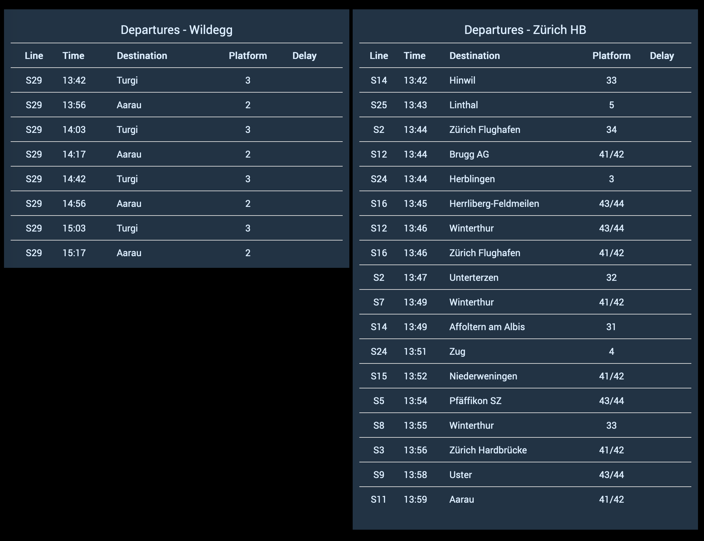

# Public Transport Switzerland Binding

Connects to the "Swiss public transport API" to provide real-time public transport information. [Link to the API](https://transport.opendata.ch/)

For example, here is a station board in HABPanel. (Download [here](https://github.com/StefanieJaeger/HABPanel-departure-board))

## Supported Things

### Stationboard

Upcoming departures for a single station.

## Discovery

This binding does not support auto-discovery.

## Thing Configuration

### Stationboard

`Station` is the station name for which to display departures.

## Channels

### Stationboard

| channel | type   | description |
|---------|--------|-------------|
| departures#n   | String | A dynamic channel for each upcoming departure |
| tsv (advanced) | String | A tsv which contains the fields: `identifier, departureTime, destination, track, delay` |
