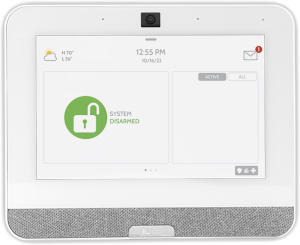

# Qolsys IQ Binding

This binding directly controls a [Qolsys IQ](https://qolsys.com/security/) security panel.
This allows for local monitoring of alarm and zone statuses as well as arming, disarming and triggering alarms.

Qolsys (a division of Johnson Controls) is a popular manufacturer of alarm systems.
The Qolsys IQ line of panels supports both wireless and hard wire sensors and features built in Cellular and Wi-Fi dual path communication that natively integrates with Alarm.com monitoring and supervision.

This binding directly interfaces with the panel and does not require cloud access.



## Supported Things

| Thing               | Description                                                                               | Thing Type | Thing UID |
|---------------------|-------------------------------------------------------------------------------------------|------------|-----------|
| Qolsys IQ Panel     | A Qolsys IQ security panel (all current models, which is 2+ and 4 at the time of writing) | Bridge     | panel     |
| Qolsys IQ Partition | A logical partition which can be armed, disarmed, and is responsible for managing zones   | Bridge     | partition |
| Qolsys IQ Zone      | A generic zone sensor                                                                     | Thing      | zone      |

## Discovery

### Qolsys IQ Panel (Bridge)

The Qolsys IQ Panel must be manually added using a host name or ip address along with a secure access token from the panel settings.
To enable 3rd party control and retrieve the access token follow the following steps on the security panel touch screen:

`Settings` --> `Advanced Settings` --> `Installation` --> `Dealer Settings` -> `6 Digit User Code` (set to enabled)

`Settings` --> `Advanced Settings` --> `Installation` --> `Devices` --> `Wi-Fi Devices` --> `Control4` (set to enabled)

Panel will _reboot_

`Settings` --> `Advanced Settings` --> `Installation` --> `Devices` --> `Wi-Fi Devices` --> `Reveal Secure Token` (copy token to use in panel configuration)

At this point you may add the panel thing in openHAB using the secure token along with the IP or host name of the panel.  

### Partition (Bridge)

Once a panel is added, partitions will be automatically discovered and appear in the inbox.

### Zone (Thing)

Once a partition is added, zones will be automatically discovered and appear in the inbox.

## Thing Configuration

### `panel` Thing Configuration

| Name              | Type    | Description                                         | Default | Required | Advanced |
|-------------------|---------|-----------------------------------------------------|---------|----------|----------|
| hostname          | text    | Hostname or IP address of the device                | N/A     | yes      | no       |
| port              | integer | Port the device is listening on                     | 12345   | no       | no       |
| key               | text    | Access token / key found in the panel settings menu | N/A     | yes      | no       |

### `partition` Thing Configuration

| Name       | Type    | Description                                                                                                                                                                                                 | Default | Required | Advanced |
|------------|---------|-------------------------------------------------------------------------------------------------------------------------------------------------------------------------------------------------------------|---------|----------|----------|
| id         | integer | Partition id of the panel, staring with '0' for the first partition                                                                                                                                         | N/A     | yes      | no       |
| disarmCode | text    | Optional disarm code to use when receiving a disarm command without a code. Required for integrations like Alexa and Homekit who do not provide codes when disarming.  Leave blank to always require a code | blank   | no       | no       |
| armCode    | text    | Optional arm code to use when receiving arm commands without a code.  Only required if the panel has been configured to require arm codes.  Leave blank to always require a code                            | blank   | no       | yes      |

### `zone` Thing Configuration

| Name    | Type    | Description                                                                                             | Default | Required | Advanced |
|---------|---------|---------------------------------------------------------------------------------------------------------|---------|----------|----------|
| id      | integer | Id of the zone, staring with '1' for the first zone                                                | N/A     | yes      | no       |

## Channels

### Panel Channels

None.

### Partition Channels

| Channel     | Type   | Read/Write | Description                                                                                                                                                                                                                                                                                | State Options                                              | Command Options            |
|-------------|--------|------------|--------------------------------------------------------------------------------------------------------------------------------------------------------------------------------------------------------------------------------------------------------------------------------------------|------------------------------------------------------------|----------------------------|
| armState    | String | RW         | Reports the current partition arm state or sends an arm or disarm command to the system. Security codes can be appended to the command using a colon delimiter (e.g. 'DISARM:123456'). Codes appended to the command will be used in place of the `armCode` configuration property if set. | ALARM, ARM_AWAY, ARM_STAY, DISARM, ENTRY_DELAY, EXIT_DELAY | ARM_AWAY, ARM_STAY, DISARM |
| alarmState  | String | RW         | Reports on the current alarm state, or triggers an instant alarm                                                                                                                                                                                                                           | AUXILIARY, FIRE, POLICE, ZONEOPEN, NONE                    | AUXILIARY, FIRE, POLICE    |
| armingDelay | Number | R          | The arming delay countdown currently in progress                                                                                                                                                                                                                                           | Seconds remaining                                          | N/A                        |
| errorEvent  | String | R          | Last error event message reported by the partition. Clears after 30 seconds                                                                                                                                                                                                                | Error text                                                 | N/A                        |

### Zone Channels

| Channel | Type    | Read/Write | Description            | State Options                               |
|---------|---------|------------|------------------------|---------------------------------------------|
| status  | String  | R          | The zone status        | ACTIVE, CLOSED, OPEN, FAILURE, IDLE, TAMPER |
| state   | Number  | R          | The zone state         | Number                                      |
| contact | Contact | R          | The zone contact state | OPEN, CLOSED                                |

## Full Example

### qolsysiq.things

```java
Bridge qolsysiq:panel:home "Home Security Panel" [ hostname="192.168.3.123", port=12345, key="AAABBB00" ] {
    Bridge partition 0 "Partition Main" [ id=0, armCode="123456" ] {
        Thing zone 1 "Window" [ id=1 ]
        Thing zone 2 "Motion" [ id=2 ]
    }
}
```

### qolsysiq.items

Sample items file with both Alexa and Homekit voice control

```java
Group      PartitionMain                         "Alarm System"                                                           ["Equipment"]    {alexa="SecurityPanel", homekit = "SecuritySystem"}
String     PartitionMain_PartitionArmState       "Partition Arm State"                <Alarm>    (PartitionMain)          ["Point"]        {channel="qolsysiq:partition:home:0:armState", alexa="ArmState" [DISARMED="DISARM",ARMED_STAY="ARM_STAY",ARMED_AWAY="ARM_AWAY:EXIT_DELAY"], homekit = "SecuritySystem.CurrentSecuritySystemState,SecuritySystem.TargetSecuritySystemState" [STAY_ARM="ARM_STAY", AWAY_ARM="ARM_AWAY", DISARM="DISARM", DISARMED="DISARM", TRIGGERED="ALARM"]}
String     PartitionMain_PartitionAlarmState     "Partition Alarm State"              <Alarm>    (PartitionMain)          ["Point"]        {channel="qolsysiq:partition:home:0:alarmState"}
Number     PartitionMain_PartitionArmingDelay    "Partition Arming Delay"                        (PartitionMain)          ["Point"]        {channel="qolsysiq:partition:home:0:armingDelay"}
String     PartitionMain_ErrorEvent              "Error Event"                                   (PartitionMain)          ["Point"]        {channel="qolsysiq:partition:home:0:errorEvent" }

Group      ZoneKitchenWindows                    "Qolsys IQ Zone: Kitchen Windows"                                        ["Equipment"]
Number     ZoneKitchenWindows_ZoneState          "Kitchen Windows Zone State"                    (ZoneKitchenWindows)     ["Point"]        {channel="qolsysiq:zone:home:0:1:state"}
String     ZoneKitchenWindows_ZoneStatus         "Kitchen Windows Zone Status"                   (ZoneKitchenWindows)     ["Point"]        {channel="qolsysiq:zone:home:0:1:status"}
Contact    ZoneKitchenWindows_ZoneContact        "Kitchen Windows Zone Contact"                  (ZoneKitchenWindows)     ["Point"]        {channel="qolsysiq:zone:home:0:1:contact"}

Group      ZoneMotionDetector1                   "Motion Detector 1"                                                      ["Equipment"]
Number     ZoneMotionDetector_ZoneState1         "Motion Detector 1 Zone State"                  (ZoneMotionDetector1)    ["Point"]        {channel="qolsysiq:zone:home:0:2:state"}
String     ZoneMotionDetector_ZoneStatus1        "Motion Detector 1 Zone Status"                 (ZoneMotionDetector1)    ["Point"]        {channel="qolsysiq:zone:home:0:2:status"} 
```
