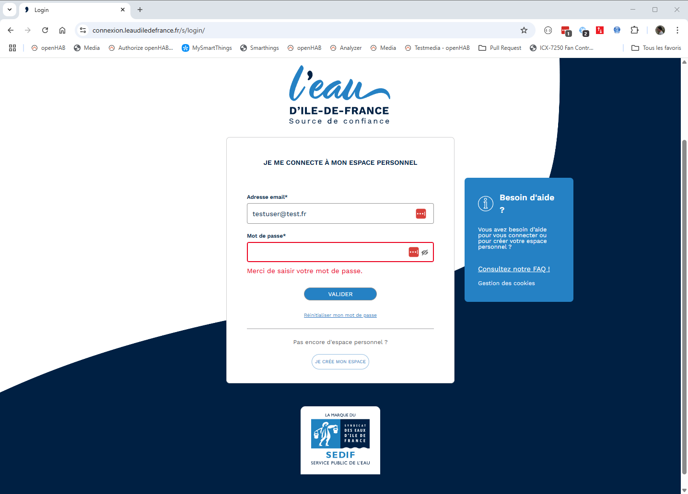
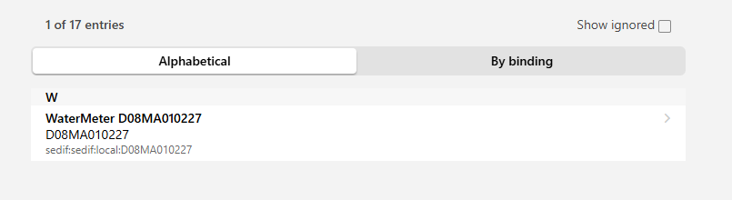

# Sedif Binding

This binding enables you to retrieve water consumption data for consumers in the Île-de-France region of France.

It is based on the new Sedif - Eau Ile de France website : https://www.sedif.com/.



## Supported Things

The binding supports two different types of things: the `gateway` bridge and the `meter`.

- `gateway`: This bridge acts as the gateway between your Sedif account and the meter thing.
- `meter`: A meter thing that represents your water meter and exposes your water consumption.

### Gateway Bridge Configuration

To retrieve data, you need a `gateway` bridge linked to your Sedif Web account.

You will need to create an account prior to configuring your bridge.  
Go to the login page and click on the "Je crée mon espace" button:  
https://connexion.leaudiledefrance.fr/s/login/


After this, add your bridge and fill in your username and password.

      | Parameter      | Description                                |
      |----------------|--------------------------------------------|
      | username       | Your Sedif platform username.              |
      | password       | Your Sedif platform password.              |

    ```java
    Bridge sedif:gateway:local "Gateway" [username="testuser@test.fr", password="mypassword"]
    ```

### Water Meter Discovery

After creating the bridge, the binding will populate the inbox with meters registered in your Sedif account.




### Meter Thing Configuration

To create a mter thing, you will need your contractId.
You can find it on the Sedif website, under the section "Tous mes contrats".
You will see a list where the first column labeled "Contrat" is the contractId.


| Name            | Type    | Description                                           | Default | Required | Advanced |
|-----------------|---------|-------------------------------------------------------|---------|----------|----------|
| contractId      | text    | The identifier of your contract                       | N/A     | yes      | no       |
| meterId         | text    | The identifier of the meter associate with this thing | N/A     | no       | no       |

```java
Thing sedif:meter:meter1 "Sedif Meter 1" (sedif:gateway:local)
	[  
		contractId="907....", meterId="D08MA......"
	]  
``

### Meter Thing Channels


| Channel                                     | Type         | Read/Write | Description                              |
|---------------------------------------------|--------------|------------|------------------------------------------|
| base#mean-water-price                       | numeric      | R          | The water mean price                     |


- The daily group will give consumtion information with day granularity

| Channel                                     | Type         | Read/Write | Description                              |
|---------------------------------------------|--------------|------------|------------------------------------------|
| daily-consumption#yesterday                 | consumption  | R          | The yeasterday water consumption         |
| daily-consumption#day-2                     | consumption  | R          | The day-2 water consumption              |
| daily-consumption#day-3                     | consumption  | R          | The day-3 water consumption              |
| daily-consumption#consumption               | consumption  | R          | Timeseries for water consumption         |
 
- The weekly group will give consumtion information with week granularity

| Channel                                     | Type         | Read/Write | Description                              |
|---------------------------------------------|--------------|------------|------------------------------------------|
| weekly-consumption#thisWeek                 | consumption  | R          | The current week water consumption       |
| weekly-consumption#lastWeek                 | consumption  | R          | The last week water consumption          |
| weekly-consumption#week-2                   | consumption  | R          | The week-2 water consumption             |
| weekly-consumption#consumption              | consumption  | R          | Timeseries for weekly water consumption  |

- The monthly group will give consumtion information with month granularity

| Channel                                     | Type         | Read/Write | Description                              |
|---------------------------------------------|--------------|------------|------------------------------------------|
| monthly-consumption#thisMonth               | consumption  | R          | The current month water consumption      |
| monthly-consumption#lastMonth               | consumption  | R          | The last month water consumption         |
| monthly-consumption#month-2                 | consumption  | R          | The month-2 water consumption            |
| monthly-consumption#consumption             | consumption  | R          | Timeseries for monthly water consumption |

- The yearly group will give consumtion information with year granularity

| Channel                                     | Type         | Read/Write | Description                              |
|---------------------------------------------|--------------|------------|------------------------------------------|
| yearly-consumption#thisYear                 | consumption  | R          | The current year water consumption       |
| yearly-consumption#lastYear                 | consumption  | R          | The last year water consumption          |
| yearly-consumption#year-2                   | consumption  | R          | The year-2 water consumption             |
| yearly-consumption#consumption              | consumption  | R          | Timeseries for yearly water consumption  |

### Full Example

```java
Bridge sedif:gateway:local "GatewayBridge" [username="testuser@test.fr", password="mypassword"]

Thing sedif:meter:meter1 "Meter 1" (sedif:gateway:local)
	[  
		contractId="907....", meterId="D08MA......"
	]  
    {
    }


Number	ConsoDaily       "Daily Conso [%.0f %unit%]"      <energy> { channel="sedif:meter:meter1:daily-consumption#consumption"   }
Number	ConsoYesterday   "Conso Yesterday [%.0f %unit%]"  <energy> { channel="sedif:meter:meter1:daily-consumption#yesterday"     }
Number	ConsoDayMinus2   "Conso Day-2 [%.0f %unit%]"      <energy> { channel="sedif:meter:meter1:daily-consumption#day-2"         }
Number	ConsoDayMinus3   "Conso Day-3 [%.0f %unit%]"      <energy> { channel="sedif:meter:meter1:daily-consumption#day-3"         }


Number	ConsoWeekly      "Weekly Conso [%.0f %unit%]"     <energy> { channel="sedif:meter:meter1:weekly-consumption#consumption"  }
Number	ConsoThisWeek    "Conso This Week [%.0f %unit%]"  <energy> { channel="sedif:meter:meter1:weekly-consumption#thisWeek"     }
Number	ConsoLastWeek    "Conso Last Week [%.0f %unit%]"  <energy> { channel="sedif:meter:meter1:weekly-consumption#lastWeek"     }
Number	ConsoWeekMinus2  "Conso Week - 2 [%.0f %unit%]"   <energy> { channel="sedif:meter:meter1:weekly-consumption#week-2"       }

Number	ConsoMonthly     "Montlhy Conso [%.0f %unit%]"    <energy> { channel="sedif:meter:meter1:monthly-consumption#consumption" }
Number	ConsoThisMonth   "Conso This Month [%.0f %unit%]" <energy> { channel="sedif:meter:meter1:monthly-consumption#thisMonth"   }
Number	ConsoLastMonth   "Conso Last Month [%.0f %unit%]" <energy> { channel="sedif:meter:meter1:monthly-consumption#lastMonth"   }
Number	ConsoMonthMinus2 "Conso Month - 2 [%.0f %unit%]"  <energy> { channel="sedif:meter:meter1:monthly-consumption#month-2"     }

Number	ConsoYearly      "Yearly Conso [%.0f %unit%]"     <energy> { channel="sedif:meter:meter1:yearly-consumption#consumption" }
Number	ConsoThisYear    "Conso This Year [%.0f %unit%]"  <energy> { channel="sedif:meter:meter1:yearly-consumption#thisYear"   }
Number	ConsoLastYear    "Conso Last Year [%.0f %unit%]"  <energy> { channel="sedif:meter:meter1:yearly-consumption#lastYear"   }
Number	ConsoYearMinus2  "Conso Year - 2 [%.0f %unit%]"   <energy> { channel="sedif:meter:meter1:yearly-consumption#year-2"     }
```

### Timeseries and Graphs

Thanks to the timeseries channels, you will be able to expose your water consumption as historical graphs.
For example, a weekly graph might look like this:


Here's the code to produce the graph.
Note that you bind your series to one of the timeseries channels: ConsoDaily, ConsoWeekly, ConsoMonthly, or ConsoYearly.

```
config:
  label: Sedif Conso Weekly -x Histo
  order: "10000000"
  period: 4M
  sidebar: false
slots:
  dataZoom:
    - component: oh-chart-datazoom
      config:
        type: inside
  grid:
    - component: oh-chart-grid
      config:
        includeLabels: true
  legend:
    - component: oh-chart-legend
      config:
        bottom: 3
        type: scroll
  series:
    - component: oh-time-series
      config:
        gridIndex: 0
        item: ConsoWeekly
        label:
          formatter: =v=>Number.parseFloat(v.data[1]).toFixed(4)*1000 + " L"
          position: inside
          show: true
        name: Sedif Conso Weekly -x Histo
        noBoundary: true
        noItemState: true
        service: inmemory
        type: bar
        xAxisIndex: 0
        yAxisIndex: 0
  tooltip:
    - component: oh-chart-tooltip
      config:
        confine: true
        smartFormatter: true
  xAxis:
    - component: oh-time-axis
      config:
        gridIndex: 0
  yAxis:
    - component: oh-value-axis
      config:
        gridIndex: 0
```

### Historical Data Retrieve

The first time you launch this binding, it will send multiple requests to the Sedif website to retrieve historical data.
This is done in 3-month chunks, from the end to the beginning of the contract.

Be aware that this process can take some time (around 2–3 minutes for 10 years of data).

This data is then cached in userdata/sedif/sedif.json.
On subsequent runs, the binding only retrieves the most recent data and refreshes daily.

If something goes wrong, you can delete the sedif.json file to start fresh.


### Multiple Contract

You may have multiple contracts on your Sedif account:

Multiple properties with different meters:
In this case, simply create as many sedif things as you have separate contracts.

Contract change on the same meter:
In this case, you may have two contracts for the same meter.
Create only one sedif thing and follow this process:

- Set the contractId to the older contract and let the binding retrieve the full historical data.
- Then change the contractId to the new contract, and restart OpenHAB.

This way, you will maintain the full history of the meter.
