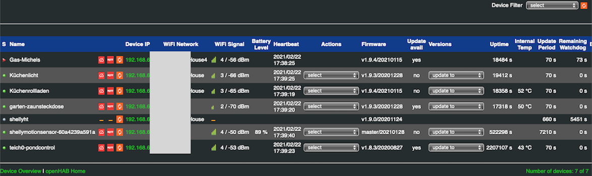
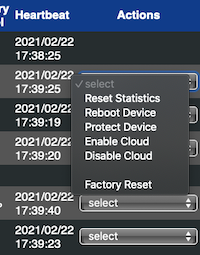
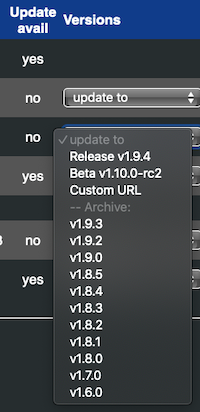

# Shelly Manager

The Shelly Manager is a small extension to the binding, which provides some low level information on the Shelly Devices, but also provides some functions to manage the devices.

To open the Shelly Manage launch the following URL in your browser
- http://&lt;openHAB IP address&gt;:8080/shelly/manager or
- http://&lt;openHAB IP address&gt;:80443/shelly/manager

Maybe you need to change the port matching your setup.

## Overview

Once the Shelly Manager is opened an overview of all Shelly devices added as a Thing are displayed. 
Things which are not discovered or still site in the Inbox will not be displayed.

You'll see a bunch of technical details, which are not available as channels or in the Thing properties.
This includes information on the device communication stability. 
The statistic gives you are good overview if device communication is stable or a relevant number of timeouts need to be recovered.
In this case you should verify the WiFi coverage or other options to improve stability.

The following information is available
|Column              |Description                                                                      |
|--------------------|---------------------------------------------------------------------------------|
|S                   |Thing Status - hover over the icon to see more details                           |
|Name                |Device name - hover over the name to get more details                            |
|WiFi Network        |SSID of the connected WiFi network                                               |
|WiFi Signal         |WiFi signal strength, 0=none, 4=very good                                        |
|Battery Level       |Remaining capacity of the battery                                                |
|Heartbeat           |Last time a response or an event was received from the device                    |
|Actions             |Drop down with some actions, see below                                           |
|Refresh button      |Trigger a status refresh in background, maybe you need to click more than once   |
|Firmware            |Current firmware release                                                         |
|Update avail        |yes indicates that a firmware update is available                                |
|Version s           |List available firmware versions: prod, beta or archived                         |
|Uptime              |Number of seconds since last device restart                                      |
|Device internal Temp|Internal device temperature. Max is depending on device type.                    |
|Update Period       |Timeout for device refresh                                                       |
|Remaining Watchdog  |Shows number of seconds until device will go offline if no update is received    |
|Event Count         |Increases on every event triggered by the device or the binding                  |
|Last Event          |Type of last event or alarm (refer README.md for details)                        |
|Event Time          |When was last event received                                                     |
|Device Restarts     |Number of detected restarts. This is ok on firmware updates, otherwise indicates a crash |
|Timeout Errors      |Number of API timeouts, could be an indication for an unstable connection        |
|Timeouts recovered  |The binding does retries and timeouts and counts successful recoveries           |
|CoIoT Messages      |Number of received CoIoT messages, must be >= 2 to indicate CoIoT working        |
|CoIoT Errors        |Number of CoIoT messages, which can't be processed. >0 indicates firmware issues |

The column S and Name display more information when hovering with the mouse over the entries.

### Actions

The Shelly Manager provides the following actions when the Thing is ONLINE. 
They are available in the dropdown list in column Actions.

|Action          |Description                                                                      |
|----------------|---------------------------------------------------------------------------------| 
|Reset Statistics|Resets device statistic and clear the last alarm                                 |
|Restart         |Restart the device and reconnect to WiFi                                         |
|Protect         |Use binding's default credentials to protect device access with user and password|
|Enable Cloud    |Enable the Shelly Cloud connectivity                                             |
|Disable Cloud   |Disable the Shelly Cloud connectivity (takes about 15sec to become active)       |
|Reset           |Performs **firmware reset**; Attention: The device will loose it's configuration     |

## Firmware Update

The Shelly Manager simplifies the firmware update.
You could select between different versions using the drop down list on the overview page.

Shelly Manager integrates different sources
- Allterco official releases: production and beta release (like in the device UI)
- Older firmware release from the firmware archive - this is a community service
- You could specify any custom url providing the firmware image (e.g. a local web server), which is accessable for the device using http

| | |
|-|-|
||All firmware releases are combined to the selection list. Click on the version you want to install and Shelly Manager will generate the requested URL to trigger the firmware upgrade.|

The upgrade starts if you click "Perform Update".

The device will download the firmware file, installs the update and restarts the device.
Depending on the device type this takes between 10 and 60 seconds.
The binding will automatically recover the device with the next status check (as usual).

### Connection types

You could choose between 3 different update types
* Internet: This triggers the regular update, the device needs to be connected to the Internet
* Use openHAB as a proxy: In this case the binding directs the device to request the firmware from the openHAB system.
The binding will then download the firmware from the selected sources and passes thos transparently to the device.
This provides a security benefit: The device doesn't require Internet access, only the openHAB host, which could be filtered centrally.
* Custom URL: In this case you could specify 

The binding manages the download request with the proper download url.
