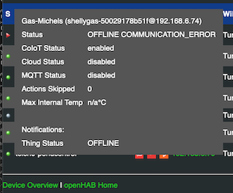
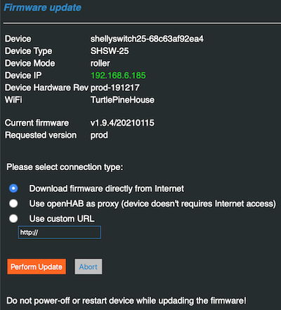

# Shelly Manager

The Shelly Manager is a small extension to the binding, which provides some low level information on the Shelly Devices, but also provides some functions to manage the devices.

To open the Shelly Manage launch the following URL in your browser

- http://<openHAB IP address>:8080/shelly/manager or
- http://<openHAB IP address>:8443/shelly/manager

Maybe you need to change the port matching your setup.

Shelly Manager makes you various device insights available to get an overview of your Shellys

- Get a quick overview that all Shellys operate like expected, statistical data will help to identify issues
- Have some basic setting actions integrated, which help to do an easy setup of new Shellys added to openHAB
- Make firmware updates way easier - filter 'Update available' + integrated 2-click update
- Provide a firmware download proxy, which allows to separate your Shellys from the Internet (improved device security)

## Overview

Once the Shelly Manager is opened an overview of all Shelly devices added as a Thing are displayed.
Things which are not discovered or still site in the Inbox will not be displayed.

You'll see a bunch of technical details, which are not available as channels or in the Thing properties.
This includes information on the device communication stability.
The statistic gives you a good overview if device communication is stable or a relevant number of timeouts need to be recovered.
In this case you should verify the WiFi coverage or other options to improve stability.

The following information is available

|Column              |Description                                                                      |
|--------------------|---------------------------------------------------------------------------------|
|S                   |Thing Status - hover over the icon to see more details                           |
|Name                |Device name - hover over the name to get more details                            |
|Cloud Status Icon   |Indicates the status of the Shelly Cloud feature: disabled/enabled/connected     |
|MQQT Status Icon    |Indicates the staus of the MQTT featured disabled/enabled/connected              |
|Refresh button      |Trigger a status refresh in background, maybe you need to click more than once   |
|Device IP           |Assigned IP address, click to open the device’s Web UI in a separate browser tab |
|WiFi Network        |SSID of the connected WiFi network                                               |
|WiFi Signal         |WiFi signal strength, 0=none, 4=very good                                        |
|Battery Level       |Remaining capacity of the battery                                                |
|Heartbeat           |Last time a response or an event was received from the device                    |
|Actions             |Drop down with some actions, see below                                           |
|Firmware            |Current firmware release                                                         |
|Update avail        |yes indicates that a firmware update is available                                |
|Versions            |List available firmware versions: prod, beta or archived                         |
|Uptime              |Number of seconds since last device restart                                      |
|Internal Temp       |Device internal temperature. Max is depending on device type.                    |
|Update Period       |Timeout for device refresh                                                       |
|Remaining Watchdog  |Shows number of seconds until device will go offline if no update is received    |
|Events              |Increases on every event triggered by the device or the binding                  |
|Last Event          |Type of last event or alarm (refer README.md for details)                        |
|Event Time          |When was last event received                                                     |
|Device Restarts     |Number of detected restarts. This is ok on firmware updates, otherwise indicates a crash |
|Timeout Errors      |Number of API timeouts, could be an indication for an unstable connection        |
|Timeouts recovered  |The binding does retries and timeouts and counts successful recoveries           |
|CoIoT Messages      |Number of received CoIoT messages, must be >= 2 to indicate CoIoT working        |
|CoIoT Errors        |Number of CoIoT messages, which can't be processed. >0 indicates firmware issues |

The column S and Name display more information when hovering with the mouse over the entries.

### Device Filters

|Filter              |Description                                                                      |
|--------------------|---------------------------------------------------------------------------------|
|All                 |Clear filter / display all devices                                               |
|Online only         |Filter on devices with Thing Status = ONLINE                                     |
|Inactive only       |Filter on devices, which are not initialized for in Thing Status = OFFLINE       |
|Needs Attention     |Filter on devices, which need attention (setup/connectivity issues), see below   |
|Update available    |Filter on devices having a new firmware version available                        |
|Unprotected         |Filter on devices, which are currently not password protected                    |

Beside the Device Filter box you see a refresh button.
At the bottom right you see number of displayed devices vs. number of total devices.
A click triggers a background status update for all devices rather only the selected one when clicking of the refresh button in the device lines.

Filter 'Needs Attention':
This is a dynamic filter, which helps to identify devices having some kind of setup / connectivity or operation issues.
The binding checks the following conditions

- Thing status != ONLINE: Use the 'Inactive Only' filter to find those devices, check openhab.log
- WIFISIGNAL: WiFi signal strength < 2 - this usually leads into connectivity problems, check positioning of portable devices or antenna direction.
- LOWBATTERY: The remaining battery is < 20% (configuration in Thing Configuration), consider to replace the battery
Watch out for bigger number of timeout errors.
- Device RESTARTED: Indicates a firmware problem / crash if this happens without a device reboot or firmware update (timestamp is included)
- OVERTEMP / OVERLOAD / LOADERROR: There are problems with the physical installation of the device, check specifications, wiring, housing!
- SENSORERROR: A sensor error / malfunction was detected, check product documentation
- NO_COIOT_DISCOVERY: The CoIoT discovery has not been completed, check IP network configuration, re-discover the device
- NO_COIOT_MULTICAST: The CoIoT discovery could be completed, but the device is not receiving CoIoT status updates.
You might try to switch to CoIoT Peer mode, in this case the device doesn't use IP Multicast and sends updates directly to the openHAB host.

The result is shown in the Device Status tooltip.

### Device settings & status

When hovering with the mouse over the status icon or the device name you'll get additional information settings and status.

### Device Status

|Status              |Description                                                                      |
|--------------------|---------------------------------------------------------------------------------|
|Status              |Thing status, sub-status and description as you know it from openHAB             |
|CoIoT Status        |CoIoT status: enabled or disabled                                                |
|CoIoT Destination   |CoIoT Peer address (ip address:port) or Multicast                                |
|Cloud Status        |Status of the Shelly Cloud connection: disabled, enabled, connected              |
|MQTT Status         |MQTT Status: disabled, enabled, connected                                        |
|Actions skipped     |Number of actions skipped by the device, usually 0                               |
|Max Internal Temp   |Maximum internal temperature, check device specification for valid range         |

### Device Settings

|Setting             |Description                                                                      |
|--------------------|---------------------------------------------------------------------------------|
|Shelly Device Name  |Device name according to device settings                                         |
|Device Hardware Rev |Hardware revision of the device                                                  |
|Device Type         |Device Type ID                                                                   |
|Device Mode         |Selected mode for dual mode devices (relay/roller or white/color)                |
|Firmware Version    |Current firmware version                                                         |
|Network Name        |Network name of the device used for mDNS                                         |
|MAC Address         |Unique hardware/network address of the device                                    |
|Discoverable        |true: the device can be discovered using mDNS, false: device is hidden           |
|WiFi Auto Recovery  |enabled: the device will automatically reboot when WiFi connect fails            |
|Timezone            |Configured device zone (see device settings)                                     |
|Time server         |Configured time server (use device UI to change)                                 |

### Actions

The Shelly Manager provides the following actions when the Thing is ONLINE.
They are available in the dropdown list in column Actions.

|Action               |Description                                                                      |
|---------------------|---------------------------------------------------------------------------------|
|Reset Statistics     |Resets device statistic and clear the last alarm                                 |
|Restart              |Restart the device and reconnect to WiFi                                         |
|Protect              |Use binding's default credentials to protect device access with user and password|
|Set CoIoT Peer       |Disable CoIoT Multicast and set openHAB system as receiver for CoIoT updates     |
|Set CoIoT Multicast  |Disable CoIoT Multicast and set openHAB system as receiver for CoIoT updates     |
|Enable Cloud         |Enable the Shelly Cloud connectivity                                             |
|Disable Cloud        |Disable the Shelly Cloud connectivity (takes about 15sec to become active)       |
|Reconnect WiFi       |Sensor devices only: Clears the STA/AP list and reconnects to strongest AP       |
|Enable WiFi Roaming  |The device will connect to the strongest AP when roadming is enabled             |
|Disable WiFi Roaming |Disable Access Point Roaming, device will periodically search for better APs     |
|Enable WiFi Recovery |Enables auto-restart if device detects persistent WiFi connectivity issues       |
|Disable WiFi Recovery|Disables device auto-restart ion persistent WiFi connectivity issues             |
|Factory Reset        |Performs a **factory reset**; Attention: The device will lose its configuration  |
|Enable Device Debug  |Enables on-device debug log - activate only when requested by Allterco support   |
|Get Debug Log        |Retrieve and display device debug output                                         |
|Get Debug Log1       |Retrieve and display 2nd device debug output                                     |
|Factory Reset        |Performs **firmware reset**; Attention: The device will lose its configuration   |

Note: Various actions available only for certain devices or when using a minimum firmware version.

## Firmware Update

The Shelly Manager simplifies the firmware update.
You could select between different versions using the drop down list on the overview page.

Shelly Manager integrates different sources:

- Allterco official releases: production and beta release (like in the device UI)
- Older firmware release from the firmware archive - this is a community service
- You could specify any custom URL providing the firmware image (e.g. a local web server), which is accessible for the device using http

| | |
|-|-|
||All firmware releases are combined to the selection list. Click on the version you want to install and Shelly Manager will generate the requested URL to trigger the firmware upgrade.|

The upgrade starts if you click "Perform Update".

The device will download the firmware file, installs the update and restarts the device.
Depending on the device type this takes between 10 and 60 seconds.
The binding will automatically recover the device with the next status check (as usual).

### Connection types

You could choose between 3 different update types:

- Internet: This triggers the regular update; the device needs to be connected to the Internet
- Use openHAB as a proxy: In this case the binding directs the device to request the firmware from the openHAB system.
The binding will then download the firmware from the selected sources and passes this transparently to the device.
This provides a security benefit: The device doesn't require Internet access, only the openHAB host, which could be filtered centrally.
- Custom URL: In this case you could specify

The binding manages the download request with the proper download URL.
