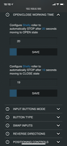
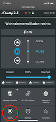
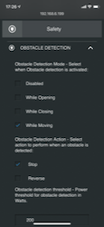
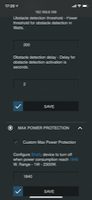
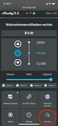
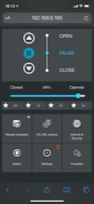
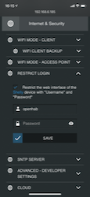

# Smartify Roller Shutters with openHAB and Shelly


## How openHAB and Shelly 2.5 provide an enhance experience when controlling rollers

## Use Case

      

More and more people have rollers, which are equipped with a motor and button control improving your comfort when operating the shutter.

This use case description covers the following aspects

- Operate the roller manual as usual - don't loose some of those features when bringing in the Shelly
- Use openHAB to control the roller (up/down/stop, positioning)
- Utilize device's position favorites
- Utilize safety features, which you get for free with the Shelly

The first point is important: SmartHome is nice for us techies, but standard users should have to use the "standard mode", but also the "new world".
Therefore a struct requirement: make if "compatible for my wife" and avoid "that sucks, I kill you!". Shutters not opening in the morning don't create fun :-)

One more aspect is some kind of protection to avoid physical damage when something gets wrong. The Shellies provide some interesting features to do.

This use case description might also apply to Venetian Blinds, but I don't have those and can't judge on that.
Feel free to adapt the concept and report ideas and experiences to the [community](https://community.openhab.org/t/shelly-binding/56862/1702?u=markus7017)

## Technical pre-requisites

To implement this use case you need

- Roller motor can be attached to the Shelly

For this how-to a roller with an electrical motor is required and will be controlled using A/C and a momentary switch.
The same solutions works with other switch types (DC/AC, 2 button switch etc.).
In this case you need to look into details and user a different Shelly configuration or adapt technical installation.
Refer to the Allterco Shelly documentation and make sure to use proper technical installation and wiring.
Important: Electrical installation should be performed only be people knowing what they do - failures could harm you!!

- Shelly 2.5 to control the roller with firmware 1.9.2+
The Shelly 2.5 supports relay and roller operation mode.
To prepare this use case you need to upgrade to firmware 1.9.2 (or newer) and perform some setup steps (see below).

- openHAB 3.0 (or 2.5) with latest version of the binding
openHAB is the perfect foundation to combine manual and automated control of the roller.
The Shelly binding is available for openHAB 3.0, but still supports version 2.5 (you should at least have 2.5.9).
Nevertheless you need to switch to the so called DEV build to benefit from bug fixes and improvements.
**This version is currently NOT part of the openHAB 3.0 distribution, a PR has been initiated
and it will not become part of the 2.5.x distribution, because this only receives bug fixes and the use case utilizes new features in the binding.**

## Implementation

### Software pre-requisites

#### openHAB version

It's strongly recommended to get on one of the pretty stable openHAB releases

- The good one: openHAB 2.5.9 or newer
- The new kid on the block: 3.0 will be release by end of 2020
- Older versions might worked, but are not covered here.

Refer to the documentation how to upgrade to the current version and where you should watch for necessary adaptions.
By the way: There is a good README for the binding, RTFM if you know what I mean :-)
Latest version is always available [from the Shelly README](https://github.com/markus7017/myfiles/blob/master/shelly/README.md) as part of the DEV build (see below).

Ideally the upgrade could be performed on a Raspberry with

```bash
openhab-cli stop
openhab-cli clean-cache
apt-get update
apt-get upgrade
openhab-cli start
```

and wait until openHAB has fully initialized and cache has been re-initialized.
That's it - pretty simple, but again you might need to do adaptions.

#### Device firmware

The binding supports Shelly devices for a long time, also with older firmware releases (beginning with version 1.7).
Nevertheless, a lot of issues has been fixed in between as well as new features became available over time.
It's recommended to upgrade your roller device to 1.9.2 or newer.
1.9 brings roller position favorites, which are used by this use case (older version works, but you can't use that feature).

See binding's [README](../README.md) for more information how to upgrade the firmware.

#### Shelly Binding

The Shelly binding is in general included in the openHAB 2.5.x as well as the new 3.0 distribution.
However, the so called DEV build is always on a newer feature level and fixing bugs.
Due to the fact that we utilize some new features of the binding it also requires the DEV build.
Refer to the information how to install the DEV build (check section Resources to get the info where to find this [READMEbeta](https://github.com/markus7017/myfiles/blob/master/shelly/READMEbeta.md))

Important:
After installing the new binding release you should delete all Shelly things and run the discovery.
No worries, openHAB will restore you channel/item linkings.

## Configuration

### Shelly setup - General

         

There are some settings required to prepare your Shelly for this use case.

- Open the Web UI simply by launching 'http://&lt;shelly ip&gt; in the browser, this opens the device's UI
- Go to Settings:DEVICE TYPE and select Roller-Shutter
- POWER ON PARAMETERS: "STOP" will make sure that the roller doesn't start moving on a power failure recovery
- INPUT BUTTONS MODE: This depend on your installed button, if you only have a single one use "One button", if you have 2 buttons or one with 2 positions select "One button"
- POSITIONING CONTROLS: Enable them to have the controls in the App (UP/STOP/DOWN + relative positions), this helps during installation

For safety reasons you might consider:

- OPEN/CLOSE WORKING TIME

This feature makes sure that the Shelly stops the motor after a certain time even the motor doesn't stop by itself.
Start the roller, measure the number of seconds until the shutter stops.
Maybe add 2-3 seconds for safe and set the values for both directions in the UI



- OBSTACLE DETECTION under Safety in the Web UI

Shelly 2.5 has an integrated detection on roller obstacles based on measuring the motor power.
The detection needs to be enabled, "While Moving" cover open and close.
Action Stop makes most sense, you should manually verify the problem.

         

and there are some more options:

- MAX POWER PROTECTION

A roller should never consume high power - in this case you could assume an electrical problem.
Therefore you could configure the Shelly to turn off power when exceeding a certain limit (e.g. 250W - value depend on your roller motor).

- SWAP INPUTS and REVERSE DIRECTIONS - you could flip operation mode for open/close, this could help in non-standard operations, but could also indicate a wiring problen
It also makes sense to give the device a name. Go to Settings:DEVICE NAME and select a symbolic name.
This name will also discovered by the binding and added as a suffix to the thing name in the Inbox.
It simplifies to identify the roller when you have a ton of Shelly things (believe me).

### Shelly setup - Positioning Favorites

With version 1.9 Allterco introduced an interesting feature called Favorites.
Those allow to store up to 4 pre-defined positions in the device, e.g. 15%, 50%, 65%, 98%.
Once defined you have kind of a short-cut to bring the roller to that position and those favorites are also supported by the binding (see below).

   

To use this feature open the device's Web UI and click on Favorites(+) button.
You could now specify 4 percentage values between 0% (closed) and 100% (open).
Enter the values and try using the button line above the roller control and main UI buttons.

With this configuration your Shelly is ready to be integrated into openHAB.

### Binding/Thing configuration

Once the Shelly is configured you could start the discovery within openHAB.
Important: If you want to password protect your Shellys (strong recommendation) you could set a default user/password in the binding settings and avoid to specify those per thing:

- Open the Binding Configuration in the openHAB UI
- Set User Id and Password, save
- Remove all Shellys from the Inbox (if any)
- and restart the Discovery



Now all Shellys should pop up with the correct device names and types.
The binding also adds some information to the Thing Name making the identification easier.

Once you added the device from the Inbox the binding will initialize the device and dynamically create channels depending on the available device/firmware features.
This takes about 5-10 seconds.
During that time the thing is working, but you might miss channels in the UI - that's normal, try to reload the page after 10sec and boom all there.
Go to the channel overview and links the channels you want to use, refer to the README to get more details on channels, type and values.

The only thing to configure are the positioning favorite ids for the roller UP and DOWN commands.
Edit the thing configuration and select the ids in the corresponding entry fields.
Value 0 means: no favorite, value 1-4 select the position as defined in the Shelly App.
There is also a dedicated channel (roller#rollerFav), which accepts this ids and triggers the roller moving to the position (% value) as defined for the matching favorites id.

### Device events

As you might know the binding supports the Allterco Shelly CoIoT protocol.
The device supports so called I/O URL Actions, which are kind of a callback to an application for certain events.
Whenever possible you should prefer CoIoT events, because they are triggered near realtime and provide way more information compared to the Action URLs.
The binding uses those CoIoT updates as triggers, but also to update the channel data.
Refer to the [README](../README.md) for more information on CoIoT.

### Automation

Beside manual operation the binding provide various options to control the roller from within openHAB rules.
For example

- link channel roller#control and use 'sendCommand(&lt;item&gt;, UP)' to open the shutter or 'sendCommand(&lt;item&gt;, DOWN)' to close it.
- get status updates from roller operations by observing channel 'roller#state' and 'roller#stopReason', those report an updated status once the operation is completed
- select a position by sending a number value of 100..0 to channel 'roller#rollerpos'
- or use the defined favorites by sending favorite id to channel 'roller#rollerFav'
- you might set an auto-timer, e.g. once the roller is opened close it again after xx minutes by sending a value to the 'roller#autoOn' or 'roller#autoOff' channels
- you could also get the position of the roller from 'roller#control' (by linking a Number item) or the last status from 'roller#state'.
Please note that the device only provides updates only after the roller stops, not during movement so it's not possible to get position updates while the roller is moving.
- of course you could use time-triggered rules, trigger the shutter depending on sunrise/sunset within openHAB, but also directly on the device

## Extending the Use Case

There are two valuable options, which even extend and improve the user experience.

- Button-1

Using the described setup you could add a Button-1 to trigger rules, e.g.

- 1xshort: open roller
- 2xshort: go to 25% (because disturbs enjoying your morning coffee with your wife or husband)
- 3xshort: go to 75% (sun is disturbing while watching your TV)
- long   : close shutter (if not done by some automation)

- Voice control

And of course you could utilize openHAB's voice integration, e.g. with Alexa, Siri or Google Home.

- Scenes

There are more of less limits when integrating even more advanced roller control based on openHAB rules.
This allows to provide a scene to the user, which does a lot of complex stuff under the hood.

Be welcome to contribute your ideas to the community, this is what creates the difference between openHAB/Shelly setup compared to rollers with button control.

### Resources

There is a bunch of resources you could browse around openHAB, Shelly or the binding

- [Binding README](../README.md)
- [Bugs/Features](https://github.com/openhab/openhab-addons/issues?q=is%3Aissue+is%3Aopen+%5Bshelly%5D)
- [Firmware Index](https://repo.shelly.cloud/files/firmware/?fbclid=IwAR0Kz6bjMGoq_HYU85QAdl8b-xh7E3IPa4ENKjqsvmMAYQ6QGC8ODvqPzUs)
- [Firmware Archive](http://archive.shelly-faq.de)
- [API Doc](https://shelly-api-docs.shelly.cloud/?fbclid=IwAR23ukCi_3aBSTPRHYUIcpr0pLi0vcyL0fF0PnJQdFvkkc8_Zo5LkAcli_A#http-server)
Note: The binding version included in the final OH 3.0 distro is significantly older than the DEV build. I can't make it in-time to bring in the PR in advance to the feature freeze for 3.0 - sorry for that, but always a matter of (spare time).
- [Shelly 2.5 product page](https://shelly.cloud/knowledge-base/devices/shelly-25/)
- [Shelly Support Group (English)](https://www.facebook.com/groups/ShellyIoTCommunitySupport)

and the [openHAB Community thread specifically for the binding](https://community.openhab.org/t/shelly-binding/56862/1701)
