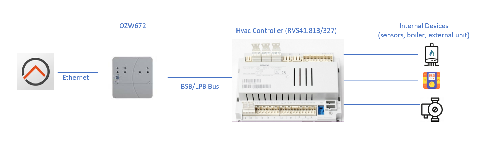
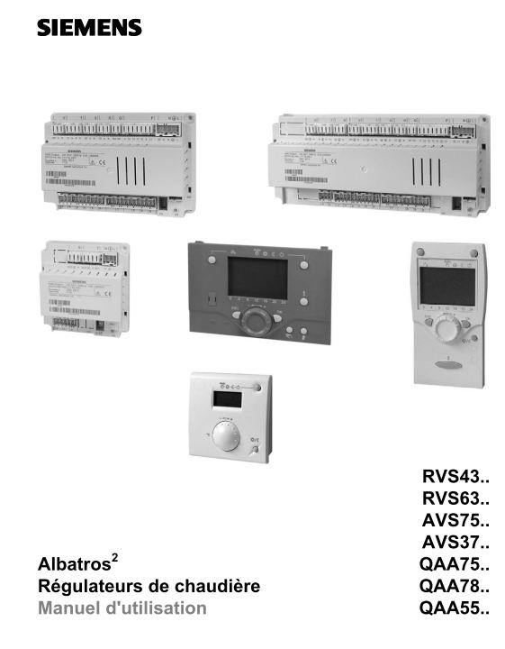

# SiemensHVAC Binding

This binding provides support for the Siemens HVAC controller ecosystem, and the Web Gateway interface OZW672.
A typical system is composed of:



There's a lot of different HVAC controllers depending on model in lot of different PAC constructors.
Siemens RVS41.813/327 inside a Atlantic Hybrid Duo was used for the development, and is fully supported and tested.

Siemens have a complete set of controller references under the name "Siemens Albatros".
Here is a picture of such device.
You can also find this device in other types of heating systems: boiler or solar based.



You will find some information about the OZW672.01 gateway on the Siemens web site:

[OZW 672 Page](https://hit.sbt.siemens.com/RWD/app.aspx?rc=FR&lang=fr&module=Catalog&action=ShowProduct&key=BPZ:OZW672.01)

With this binding, you will be able to:

- Consult the different parameters of your system, like temperature, current heating mode, water temperature, and many more.
- Modify the functioning mode of your device: temperature set point, heating mode, and others.

The OZW672 gateway supports many different languages (about 16).
The binding should work with all language choices, but is currently tested more thoroughly with French and English as configured language.
If you use another language, and find some issues, you can report them on the openHAB forum.

## Discovery

Discovery of Gateway can be done using UPnP.
Just switch off/on your gateway to make it annonce itself on the network.
The gateway should appear in the Inbox a few minutes after.
Be aware what you will have to modify the password in Gateway parameters just after the discovery to make it work properly.
Be also aware that first initialization is a little long because the binding needs to read all the metadata from the device.

Currently test was done with the OZW672.x series.
No test was conducted using the OZW772.x series, the code will currently not handle initialization of an OZW772 gateway.
You can request support in the community forum, if you have the gateway model and want it to be supported.

Discovery of HVAC device inside your PAC (controller of type RVS...) have to be done through the Scan button inside the binding.
Go to the Thing page, click on the "+" button, select the SiemensHVAC binding, and then click Scan.
Your device should appear on the page after a few seconds.
Only test in real conditions with RVS41.813/327 have been done, but it should work with all other types as the API interface is standard.

## Bridge Configuration

Parameter       | Required       | Default        | Description
----------------|----------------|----------------|------------------
baseUrl         | yes            |                | The address of the OZW672 devices
userName        | yes            | Administrator  | The user name to log into the OZW672
userPass        | yes            |                | The user password to log into the OZW672

## Channels

Channels are auto-discovered, you will find them on the RVS things.
They are organized the same way as the LCD screen of your PAC device, by top level menu functionality, and sub-functionalities.
Each channel is strongly typed, so for example, for heating mode, openHAB will provide you with a list of choices supported by the device.

Channel                         | Description                                                                                       | Type                          | Unit     | Security Access Level   |  ReadOnly | Advanced
--------------------------------|---------------------------------------------------------------------------------------------------|-------------------------------|----------|-------------------------|-----------|----------
1724#1725-optgmode-hc1          | Set Operating mode heat circuit 1 (`Automatic`, `Comfort`, `Reduced`, `Protection`)               | operating-mode-hc             |          |                         |  R/W      | true
1724#1726-roomtemp-comfsetp-hc1 | Romm temperature comfort setpoint HC1                                                             | room-temp-comfort-setpoint-hc |          |                         |  R/W      | true

## Full Example

Things file `.things`

```java
Bridge siemenshvac:ozw:ozw672_FF00F445 "Ozw672" [ baseUrl="https://192.168.254.42/", userName="Administrator", userPassword="mypass"  ]
{
    Thing rvs41-813-327 00770000756A "RVS41.813/327"  [  ]
    {
        Type room-temp-comfort-setpoint-hc : testChannelTemperature                  "TestChannelTemperature"  [ id="1726" ]
        Type operating-mode-hc : testChannelCC1                                      "TestChannelCC1"          [ id="1725" ]
    }
}
```

Items file `.items`

```java
Contact             Boiler_State_Pump_HWSb      "HWS Pump State [%s]"                   { channel = "siemenshvac:rvs41-813-327:ozw672_FF00F445:00770000756A:2237#2259-ppechargeecs"              }
Number              Boiler_State_HWS            "HWS State [%s]"                        { channel = "siemenshvac:rvs41-813-327:ozw672_FF00F445:00770000756A:2032#2035-etat-ecs"                  }
Number:Temperature  Flow_Temperature_Real       "Flow Temparature Real [%.1f °C]"       { channel = "siemenshvac:rvs41-813-327:ozw672_FF00F445:00770000756A:2237#2248-valreelletempdep-cc1"      }
Number:Temperature  Flow_Temperature_Setpoint   "Flow Temperature Setpoint [%.1f °C]"   { channel = "siemenshvac:rvs41-813-327:ozw672_FF00F445:00770000756A:2237#2249-constdepresultcc1"         }
Number              Hour_fct_HWS                "HWS Hour function"                     { channel = "siemenshvac:rvs41-813-327:ozw672_FF00F445:00770000756A:2237#2263-heuresfoncpompeecs"        }
Number              Nb_Start_HWS                "HWS Number of start [%.1f]"            { channel = "siemenshvac:rvs41-813-327:ozw672_FF00F445:00770000756A:2237#2266-comptdemarresel-ecs"       }
Number:Temperature  Thermostat_Temperature      "Thermostat tempeature [%.1f °C]"       { channel = "siemenshvac:rvs41-813-327:ozw672_FF00F445:00770000756A:2237#2246-tambact-cc1"               }
Number:Temperature  Thermostat_Setpoint         "Thermostat setpoint [%.1f °C]"         { channel = "siemenshvac:rvs41-813-327:ozw672_FF00F445:00770000756A:1724#1726-consconfort-ta-cc1"        }
Number              Heat_Mode                   "Heat mode [%s]"                        { channel = "siemenshvac:rvs41-813-327:ozw672_FF00F445:00770000756A:1724#1725-regime-cc1"                }

Number:Temperature  Thermostat_Setpoint_bis     "Temperature [%.1f °C]"                 { channel = "siemenshvac:rvs41-813-327:ozw672_FF00F445:00770000756A:testChannelTemperature "             }
Number              Heat_Mode_bis               "Heat mode [%s]"                        { channel = "siemenshvac:rvs41-813-327:ozw672_FF00F445:00770000756A:testChannelCC1"                      }

```
