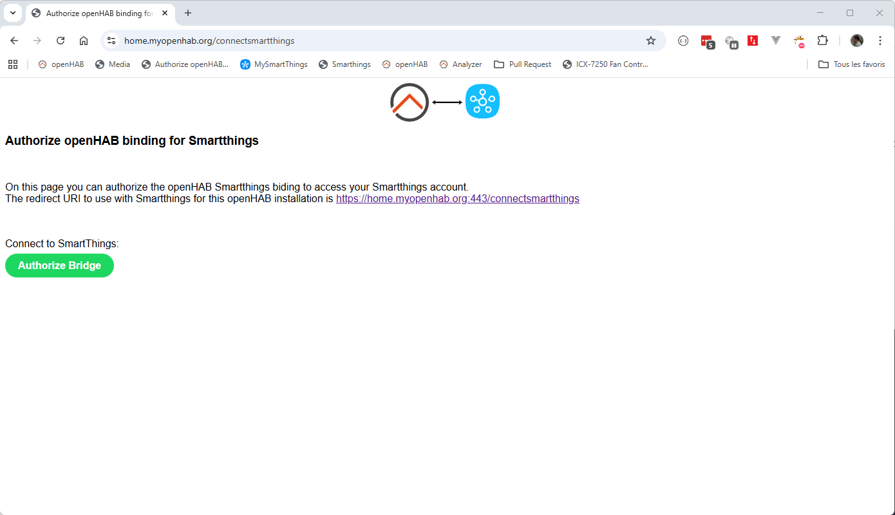
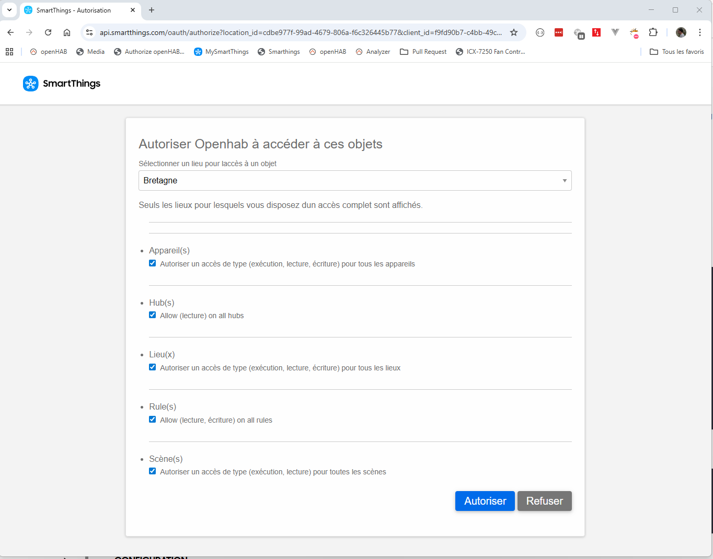
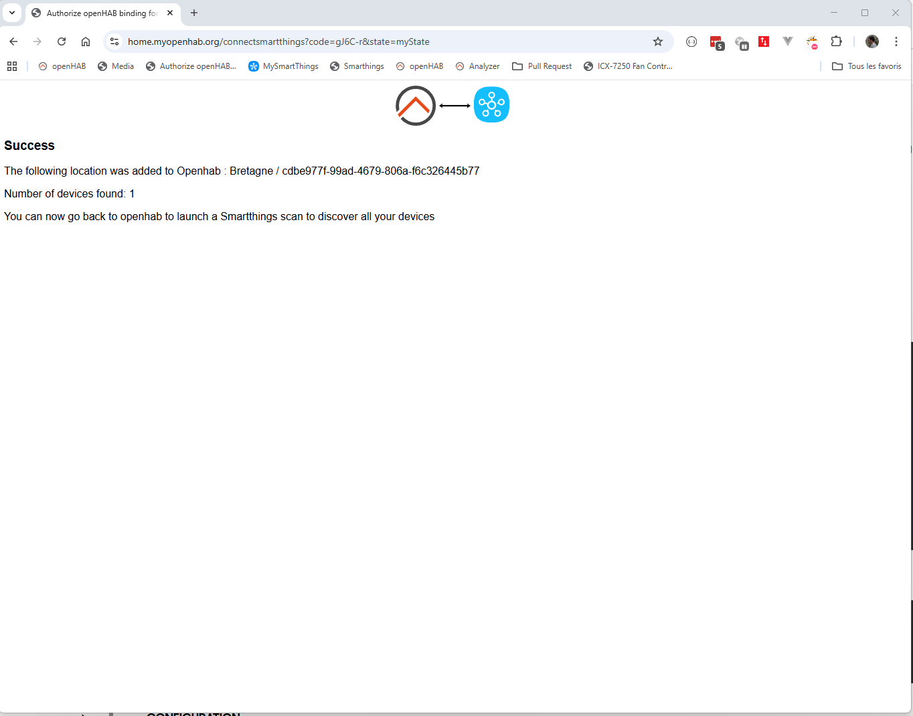

# Samsung SmartThings Binding

This binding integrates the Samsung SmartThings Cloud into openHAB.

The central component is the "SmartThings Cloud Hub" bridge, which enables communication between openHAB and SmartThings Cloud.
There are also a number of different Things for each of your home devices.

The SmartThings hub (the one you could have in your home to enable a gateway to Zigbee / Matter & Z-Wave devices) is displayed as a Thing (smartthings:hub).

Note that having a SmartThings hub is not mandatory to use this binding.
Some appliance devices like ovens, cooktops, dishwashers and others connect directly to SmartThings Cloud using your Wi-Fi, without using the local SmartThings hub.

## A little background on SmartThings version changes

First version of the binding was based on Groovy scripts to be installed on the local hub.
This version stopped working somewhere in 2023 (to be verified) because of the deprecation of Groovy by Samsung.

Second version in early 2024 was never released.  
This version needs a webhook exposed to the internet to handle device events.  
It also needs a complicated registration process, creating some SmartApps behind the scenes.

The new actual version can use 3 different mechanism to handle device events.  

- SSE subscriptions : currently not working as 24/02/2026, waiting for Samsung feedback to fix it
    This is the most convenient mechanism as it is fast, modern way to be notified of event

- Callback subscriptions : will be the prefered fallback method if SSE it not working.
    This will need to have an external openhab exposed URL to internet.
    The addons will register automatically something has https://openhab.yourdomain/smartthings/cb.

- Event pooling : this is the last method if none other method are working.
  The addons will pool the events every 10s for every device.
  This will work, but would induce some delay in your device refreshing.

## SmartThings Configuration / Authentification steps

**The binding will not work until this part has been completed; do not skip this part of the setup.**

We use OAuth authentication (device code flow) for all smartthings Authentification task.  
All setup occurs directly inside openHAB.  
You will see appName, clientId, clientSecret settings in the Smartthings Bridge configuration.  
Leave this value empty, they will be filled automatically on first setup.


Note! you will no longer need to have openHAB Cloud setup have in previous version.

To do the registration, follow these steps:

1. On first launch, you will need to setup a bridge (Smarthings Cloud Hub)
   It will look something like this


Leave all values empty, they will be filled automatically.

2. Browse to the URL: https://oh.yourdomain/smartthings
   You should see a page like this one:



3. Click on the Authorize Bridge button.  
    You will be redirected to the following page on SmartThings.  
    If you are already logged in, go directly to Step 5.  
    If not, fill your email, and click on Next.  


4. Fill your password, and click Connect.


5. On this step, SmartThings should display a page like this one with an Authorize button.  
    It will enable OpenHAB to authenticate to smartthings using smartthings-cli credentials.  
    Click on it.  



6. You will be next redirected on OpenHab side with a page like this one.  
   Just wait a few seconds, the process should continue automatically on step 7.




7. On this step, SmartThings should display a page like this one with a combo box to select your location.  
    First select your location.  


8. After this, SmartThings will display the authorization selection.  
    Keep all checkboxes on, and click "Authorize".  


9. On this last step, your browser should be redirected to OpenHAB.  
    The page will display a confirmation with the selected location, and the number of devices found in the location.

    You can now close the window, and go to the openHAB Inbox to trigger a device scan.


10. You can go back to your Smartthings Cloud Hub / bridge.  
    The bridge should now be online, and the appName, clientId & clientSecret filled with values.  
    Note that a Smartthings Apps API_ONLY have been created during the process, and registered on your Smartthings accounts.

    You can now close the window, and go to the openHAB Inbox to trigger a device scan.


## Supported Things

This binding supports most of the SmartThings devices that are defined in the [SmartThings Capabilities list](https://developer-preview.smartthings.com/docs/devices/capabilities/capabilities-reference/). 

If you find a device that doesn't work [follow these instructions](doc/Troubleshooting.md) to collect the required data so it can be added in a future release.


## Discovery

Discovery will allow you to automatically fill the Inbox with your SmartThings devices.

1. Go to the Things page, click on the "+" button.


2. Select your binding.


3. Select your binding.


4. Click on the "Scan" button.
    Your devices should appear after a few seconds.


This allows openHAB to examine a binding and automatically find the Things available on that binding.
Discovery is supported by the SmartThings binding and is run automatically on startup.


### Bridge Configuration

```
!!! ======================================================================================!!!  
!!! @Todo : below this part, documentation needs to be rewritten                         !!!  
!!! ======================================================================================!!!  
```

The bridge requires the IP address and port used to connect the openHAB server to the SmartThings Hub.

```java
Bridge smartthings:smartthings:Home    [ smartthingsIp="192.168.1.12", smartthingsPort=39500 ] {
```

where:

- **smartthings:smartthings:Home** identifies that this is a SmartThings hub named Home.
    The first two segments must be smartthings:smartthings.
    You can choose any unique name for the last segment.
    The last segment is used when you identify items connected to this hub.
- **smartthingsIp** is the IP address of the SmartThings Hub.
    Your router should be configured such that the SmartThings Hub is always assigned to this IP address.
- **smartthingsPort** is the port the SmartThings hub listens on. 39500 is the port assigned by SmartThings so it should be used unless you have a good reason for using another port.

**Warning** This binding only supports one Bridge.
If you try to configure a second bridge it will be ignored.

### Thing Configuration

Each attached thing must specify the type of device and its SmartThings device name. The format of the Thing description is:

```java
Thing <thingTypeId> name [ smartthingsName="<deviceName>", {smartthingsTimeout=<timeout>} ]
```

where:

- **[thingTypeId](https://developer-preview.smartthings.com/docs/devices/capabilities/capabilities-reference/)** corresponds to the "Preferences Reference" in the SmartThings Capabilities document but without the capability.prefix. i.e. A dimmer switch in the Capabilities document has a Preferences reference of capability.switchLevel, therefore the &lt;thingTypeId&gt; is switchLevel.
- **name** is what you want to call this thing and is used in defining the items that use this thing.
- **deviceName** is the name you assigned to the device when you discovered and connected to it in the SmartThings App
- Optional: **timeout** is how long openHAB will wait for a response to the request before throwing a timeout exception. The default is 3 seconds.

#### Example

```java
Bridge smartthings:smartthings:Home    [ smartthingsIp="192.168.1.12", smartthingsPort=39500 ] {
    Thing switchLevel              KitchenLights           [ smartthingsName="Kitchen lights" ]
    Thing contactSensor            MainGarageDoor          [ smartthingsName="Garage Door Open Sensor" ]
    Thing temperatureMeasurement   MainGarageTemp          [ smartthingsName="Garage Door Open Sensor" ]
    Thing battery                  MainGarageBattery       [ smartthingsName="Garage Door Open Sensor" ]
    Thing switch                   OfficeLight             [ smartthingsName="Office Light", smartthingsTimeout=7 ]
    Thing valve                    SimulatedValve          [ smartthingsName="Simulated Valve" ]
}
```

## Items

These are specified in the .items file. This section describes the specifics related to this binding.
Please see the [Items documentation](https://www.openhab.org/docs/configuration/items.html) for a full explanation of configuring items.

The most important thing is getting the **channel** specification correct. The general format is:

```java
{ channel="smartthings:<thingTypeId>:<hubName>:<thingName>:<channelId>" }
```

The parts (separated by :) are defined as:

1. **smartthings** to specify this is a SmartThings device
1. **thingTypeId** specifies the type of the thing you are connecting to. This is the same as described in the last section.
1. **hubName** identifies the name of the hub specified above. This corresponds to the third segment in the **Bridge** definition.
1. **thingName** identifies the thing this is attached to and is the "name" you specified in the **Thing** definition.
1. **channelId** corresponds to the attribute in the [SmartThings Capabilities list](https://docs.smartthings.com/en/latest/capabilities-reference.html). For switch it would be "switch".

### Example

```java
Dimmer  KitchenLights        "Kitchen lights level"     <slider>          { channel="smartthings:switchLevel:Home:KitchenLights:level" }
Switch  KitchenLightSwitch   "Kitchen lights switch"    <light>           { channel="smartthings:switchLevel:Home:KitchenLights:switch" }
Contact MainGarageDoor       "Garage door status [%s]" <garagedoor>       { channel="smartthings:contactSensor:Home:MainGarageDoor:contact" }
Number  MainGarageTemp       "Garage temperature [%.0f]"  <temperature>   { channel="smartthings:temperatureMeasurement:Home:MainGarageTemp:temperature" }
Number  MainGarageBattery    "Garage battery [%.0f]"  <battery>           { channel="smartthings:battery:Home:MainGarageBattery:battery" }
Switch  OfficeLight          "Office light"    <light>                    { channel="smartthings:switch:Home:OfficeLight:switch" }
String  SimulatedValve       "Simulated valve"                            { channel="smartthings:valve:Home:SimulatedValve:valve" }
```

**Special note about Valves** 
SmartThings includes a **valve** which can be Open or Closed but openHAB does not include a Valve item type. Therefore, the valve item needs to be defined with an item type of String. It can be controlled in the sitemap by specifying the element type of Switch and providing a mapping of: mappings=[open="Open", closed="Close"]. Such as:

```java
Switch item=SimulatedValve mappings=[open="Open", closed="Close"]
```

**RGB Bulb Example**
Here is a sample configuration for an RGB bulb, such as a Sengled model E11-N1EA bulb. Currently this binding does not have an RGB-specific bulb therefore a Thing is required for each part of the bulb.

## Full Example

### Things File

```java
colorControl            SengledColorControl         [ smartthingsName="Sengled Bulb"]
colorTemperature        SengledColorTemperature     [ smartthingsName="Sengled Bulb"]
switch                  SengledSwitch               [ smartthingsName="Sengled Bulb"]
switchLevel             SengledSwitchLevel          [ smartthingsName="Sengled Bulb"]
```

### Items File

```java
Color  SengledColorControl    "Sengled bulb color"   <colorpicker>   {channel="smartthings:colorControl:Home:SengledColorControl:color"}
Number SengledTemperature     "Sengled bulb color temperature"       {channel="smartthings:colorTemperature:Home:SengledColorTemperature:colorTemperature"}
Switch SengledSwitch          "Sengled bulb switch"   <switch>       {channel="smartthings:switch:Home:SengledSwitch:switch"}
Dimmer SengledDimmer          "Sengled bulb dimmer"   <slider>       {channel="smartthings:switchLevel:Home:SengledSwitchLevel:level"}
```

### Sitemap File

```perl
Frame label="Sengled RGBW Bulb" {
    Switch item=SengledSwitch label="Switch"
    Slider  item=SengledDimmer label="Level [%d]"
    Text item=SengledTemperature label="Color Temperature [%d]"
    Colorpicker item=SengledColorControl label="Color [%s]"  icon="colorwheel"
}
```

## References

1. [openHAB configuration documentation](https://openhab.org/docs/configuration/index.html)
2. [SmartThings API Documentation](https://developer.smartthings.com/docs/api/public)
3. [SmartThings Capabilities Reference]()
4. [SmartThings Developers Documentation](https://developer.smartthings.com/docs/getting-started/architecture-of-smartthings)
5. [Python implementation](https://github.com/andrewsayre/pysmartthings)
