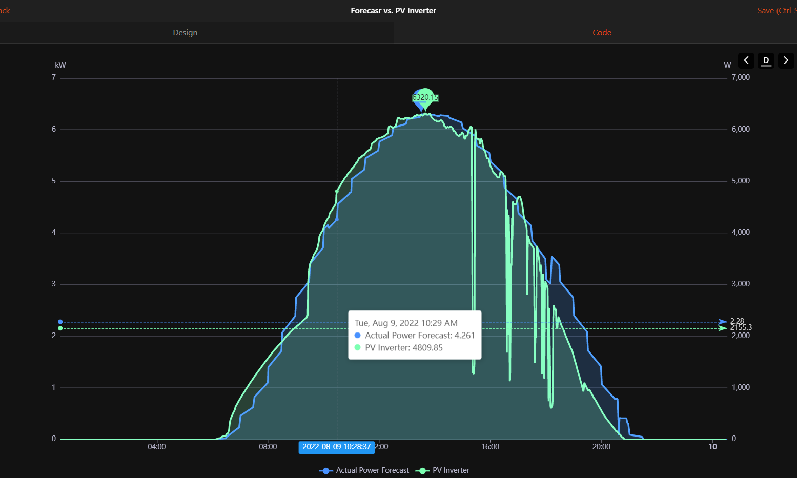
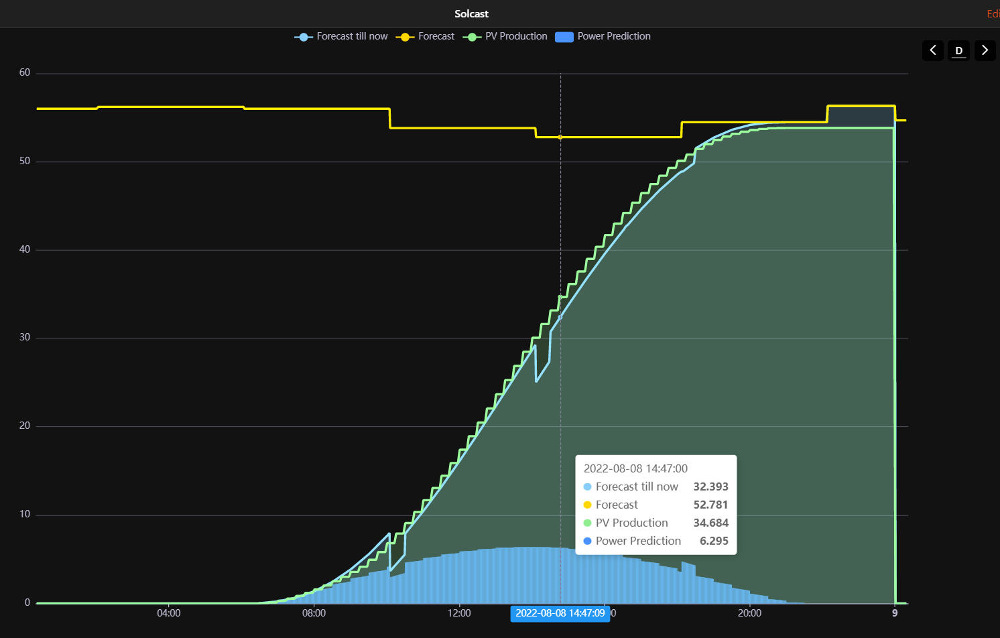
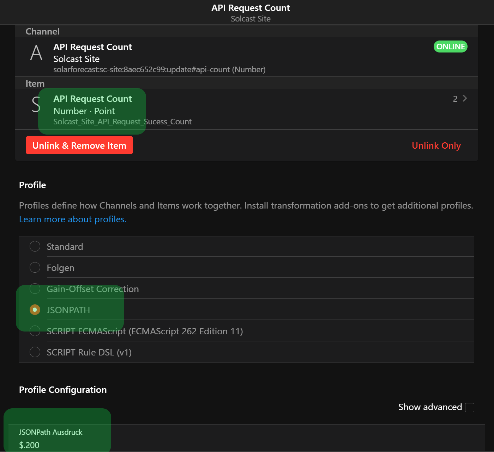

# SolarForecast Binding

This binding provides data from Solar Forecast services.
Use it to estimate your daily production, plan electric consumers like Electric Vehicle charging, heating or HVAC.
Look ahead the next days in order to identify surplus / shortages in your energy planning.

Supported Services

- [Solcast](https://solcast.com/)
  - Free [Hobbyist Plan](https://toolkit.solcast.com.au/register/hobbyist) with registration
- [Forecast.Solar](https://forecast.solar/)
  - Public, Personal and Professional [plans](https://forecast.solar/#accounts) available

Display Power values of Forecast and PV Inverter items



Display Energy values of Forecast and PV inverter items
Yellow line shows _Daily Total Forecast_.



## Supported Things

Each service needs one `xx-site` for your location and at least one photovoltaic `xx-plane`.

| Name                              | Thing Type ID |
|-----------------------------------|---------------|
| Solcast service site definition   | sc-site       |
| Solcast PV Plane                  | sc-plane      |
| Forecast Solar site location      | fs-site       |
| Forecast Solar PV Plane           | fs-plane      |

## Solcast Configuration

[Solcast service](https://solcast.com/) requires a personal registration with an e-mail address.
A free version for your personal home PV system is available in [Hobbyist Plan](https://toolkit.solcast.com.au/register/hobbyist)
(Limited to 10 API requests per day).
You need to configure your home photovoltaic system within the web interface.
The `resourceId` for each PV plane is provided afterwards.

In order to receive proper timestamps double check your time zone in _openHAB - Settings - Regional Settings_.
Correct time zone is necessary to show correct forecast times in UI.

### Solcast Bridge Configuration

| Name                   | Type    | Description                           | Default     | Required | Advanced |
|------------------------|---------|---------------------------------------|-------------|----------|----------|
| apiKey                 | text    | API Key                               | N/A         | yes      | no       |
| timeZone               | text    | Time Zone of forecast location        | empty       | no       | yes      |

`apiKey` can be obtained in your [Account Settings](https://toolkit.solcast.com.au/account)

`timeZone` can be left empty to evaluate Regional Settings of your openHAB installation.
See [DateTime](#date-time) section for more information.

### Solcast Plane Configuration

| Name            | Type    | Description                                                              | Default         | Required | Advanced |
|-----------------|---------|--------------------------------------------------------------------------|-----------------|----------|----------|
| resourceId      | text    | Resource Id of Solcast rooftop site                                      | N/A             | yes      | no       |
| refreshInterval | integer | Forecast Refresh Interval in minutes (0 = disable automatic refresh)     | 150             | yes      | no       |
| guessActuals    | boolean | Guess actual forecast values instead of placing an API call              | true            | yes      | no       |

`resourceId` for each plane can be obtained in your [Rooftop Sites](https://toolkit.solcast.com.au/rooftop-sites)

`refreshInterval` of forecast data needs to respect the throttling of the Solcast service.

With parameter `guessActuals=true` a plane needs 1 API call per update.
If not 2 API calls per update are placed.
A refresh interval of 150 minutes will result in approx 10 calls per day.

With `refreshInterval = 0` the forecast data will not be updated by binding.
This gives the user the possibility to define an own update strategy in rules.
See [manual update rule example](#solcast-manual-update) to update Solcast forecast data

- after startup
- every 2 hours only during daytime using [Astro Binding](https://www.openhab.org/addons/bindings/astro/)

With boolean configuration `guessActuals` `true` the binding will take over the previous forecast data and use them as _actual values_.
This will spare one API call.
If set to `false` the 2 API calls are placed as in the previous versions.

## Solcast Channels

Each `sc-plane` reports its own values including a `json` channel holding JSON content.
The `sc-site` bridge sums up all attached `sc-plane` values and provides total forecast for your home location.

Channels are covering today's actual data with current, remaining and today's total prediction.
Forecasts are delivered up to 6 days in advance.
Scenarios are clustered in groups:

- `average` scenario
- `pessimistic` scenario: 10th percentile
- `optimistic` scenario: 90th percentile

| Channel                 | Type          | Unit | Description                                     |
|-------------------------|---------------|------|-------------------------------------------------|
| power-estimate          | Number:Power  | W    | Power forecast for next hours/days              |
| energy-estimate         | Number:Energy | kWh  | Energy forecast for next hours/days             |
| power-actual            | Number:Power  | W    | Power prediction for this moment                |
| energy-actual           | Number:Energy | kWh  | Today's forecast till now                       |
| energy-remain           | Number:Energy | kWh  | Today's remaining forecast till sunset          |
| energy-today            | Number:Energy | kWh  | Today's forecast in total                       |

Technical channels observing the update behavior are reported in `update` group.

| Channel                 | Type          | Description                                                  |
|-------------------------|---------------|--------------------------------------------------------------|
| api-count               | String        | Number of requests send to Solcast API starting 0:00 UTC     |
| latest-update           | DateTime      | Date and time of the latest forecast update                  |

The `api-count` channel delivers a JSON object with 3 different counters:

- 200 - succesful API calls
- 429 - unsuccessful API calls due to throttling, too many calls
- other - unsuccesful API calls due to other problems

```json
{"200":2,"other":0,"429":0} 
```



You can connect a Number item to this channel using a [JSONPATH transformation](https://www.openhab.org/addons/transformations/jsonpath/) referring the wanted JSON key e.g. `$.200`.

JSON channel holding raw data is reported in `raw` group.

| Channel                 | Type          | Unit | Description                                     | Advanced |
|-------------------------|---------------|------|-------------------------------------------------|----------|
| json                    | String        | -    | Plain JSON response without conversions         | yes      |

## ForecastSolar Configuration

[ForecastSolar service](https://forecast.solar/) provides a [public free](https://forecast.solar/#accounts) plan.
You can try it without any registration or other preconditions.

### ForecastSolar Bridge Configuration

| Name                   | Type    | Description                           | Default      | Required |
|------------------------|---------|---------------------------------------|--------------|----------|
| location               | text    | Location of Photovoltaic system.      | empty        | no       |
| apiKey                 | text    | API Key                               | N/A          | no       |

`location` defines latitude, longitude values of your PV system.
In case of empty the location configured in openHAB is obtained.

`apiKey` can be given in case you subscribed to a paid plan.

### ForecastSolar Plane Configuration

| Name            | Type    | Description                                                                  | Default | Required | Advanced |
|-----------------|---------|------------------------------------------------------------------------------|---------|----------|----------|
| refreshInterval | integer | Forecast Refresh Interval in minutes                                         | 30      | yes      | false    |
| declination     | integer | Plane Declination: 0 for horizontal till 90 for vertical declination         | N/A     | yes      | false    |
| azimuth         | integer | Plane Azimuth: -180 = north, -90 = east, 0 = south, 90 = west, 180 = north   | N/A     | yes      | false    |
| kwp             | decimal | Installed Kilowatt Peak                                                      | N/A     | yes      | false    |
| dampAM          | decimal | Damping factor of morning hours                                              | 0       | no       | true     |
| dampPM          | decimal | Damping factor of evening hours                                              | 0       | no       | true     |
| horizon         | text    | Horizon definition as comma separated integer values                         | N/A     | no       | true     |

`refreshInterval` of forecast data needs to respect the throttling of the ForecastSolar service.
12 calls per hour allowed from your caller IP address so for 2 planes lowest possible refresh rate is 10 minutes.

#### Advanced Configuration

Advanced configuration parameters are available to _fine tune_ your forecast data.
Read linked documentation in order to know what you're doing.

[Damping factors](https://doc.forecast.solar/doku.php?id=damping) for morning and evening.

[Horizon information](https://doc.forecast.solar/doku.php?id=api) as comma-separated integer list.
This configuration item is aimed to expert users.
You need to understand the [horizon concept](https://joint-research-centre.ec.europa.eu/pvgis-photovoltaic-geographical-information-system/getting-started-pvgis/pvgis-user-manual_en#ref-2-using-horizon-information).
Shadow obstacles like mountains, hills, buildings can be expressed here.
First step can be a download from [PVGIS tool](https://re.jrc.ec.europa.eu/pvg_tools/en/) and downloading the _terrain shadows_.
But it doesn't fit 100% to the required configuration.
Currently there's no tool available which is providing the configuration information 1 to 1.
So you need to know what you're doing.

## ForecastSolar Channels

Each `fs-plane` reports its own values including a `json` channel holding JSON content.
The `fs-site` bridge sums up all attached `fs-plane` values and provides the total forecast for your home location.

Channels are covering today's actual data with current, remaining and total prediction.
Forecasts are delivered up to 3 days for paid personal plans.

| Channel                 | Type          | Unit | Description                                     | Advanced |
|-------------------------|---------------|------|-------------------------------------------------|----------|
| power-estimate          | Number:Power  | W    | Power forecast for next hours/days              | no       |
| energy-estimate         | Number:Energy | kWh  | Energy forecast for next hours/days             | no       |
| power-actual            | Number:Power  | W    | Power prediction for this moment                | no       |
| energy-actual           | Number:Energy | kWh  | Today's forecast till now                       | no       |
| energy-remain           | Number:Energy | kWh  | Today's remaining forecast till sunset          | no       |
| energy-today            | Number:Energy | kWh  | Today's forecast in total                       | no       |
| json                    | String        | -    | Plain JSON response without conversions         | yes      |

## Thing Actions

All things `sc-site`, `sc-plane`, `fs-site` and `fs-plane` are providing the same Actions.
Channels are providing actual forecast data and daily forecasts in future.
Actions provides an interface to execute more sophisticated handling in rules.
You can execute this for each `xx-plane` for specific plane values or `xx-site` to sum up all attached planes.

See [Date Time](#date-time) section for more information.
Double check your time zone in _openHAB -> Settings -> Regional Settings_ which is crucial for calculation.

### `getForecastBegin`

Returns `Instant` of the earliest possible forecast data available.
It's located in the past, e.g. Solcast provides data from the last 7 days.
`Instant.MAX` is returned in case of no forecast data is available.

### `getForecastEnd`

Returns `Instant` of the latest possible forecast data available.
`Instant.MIN` is returned in case of no forecast data is available.

### `getPower`

| Parameter | Type          | Description                                                                                |
|-----------|---------------|--------------------------------------------------------------------------------------------|
| timestamp | Instant       | Timestamp of power query                                                                   |
| mode      | String        | Choose `average`, `optimistic` or `pessimistic` to select forecast scenario. Only Solcast. |

Returns `QuantityType<Power>` at the given `Instant` timestamp.
Respect `getForecastBegin` and `getForecastEnd` to get a valid value.

Check log or catch exceptions for error handling

- `IllegalArgumentException` thrown in case of problems with call arguments
- `SolarForecastException` thrown in case of problems with timestamp and available forecast data

### `getEnergyOfDay`

| Parameter | Type          | Description                                                                                |
|-----------|---------------|--------------------------------------------------------------------------------------------|
| date      | LocalDate     | Date of the day                                                                            |
| mode      | String        | Choose `average`, `optimistic` or `pessimistic` to select forecast scenario. Only Solcast. |

Returns `QuantityType<Energy>` at the given `localDate`.
Respect `getForecastBegin` and `getForecastEnd` to avoid ambiguous values.

Check log or catch exceptions for error handling

- `IllegalArgumentException` thrown in case of problems with call arguments
- `SolarForecastException` thrown in case of problems with timestamp and available forecast data

### `getEnergy`

| Parameter       | Type          | Description                                                                                                  |
|-----------------|---------------|--------------------------------------------------------------------------------------------------------------|
| startTimestamp  | Instant       | Start timestamp of energy query                                                                              |
| endTimestamp    | Instant       | End timestamp of energy query                                                                                |
| mode            | String        | Choose `optimistic` or `pessimistic` to get values for a positive or negative future scenario. Only Solcast. |

Returns `QuantityType<Energy>` between the timestamps `startTimestamp` and `endTimestamp`.
Respect `getForecastBegin` and `getForecastEnd` to avoid ambiguous values.

Check log or catch exceptions for error handling

- `IllegalArgumentException` thrown in case of problems with call arguments
- `SolarForecastException` thrown in case of problems with timestamp and available forecast data

## Date Time

Each forecast is bound to a certain location which automatically defines the time zone.
Most common use case is forecast and your location are matching the same time zone.
Action interface is using `Instant` as timestamps which enables you translating to any time zone.
This allows you with an easy conversion to query also foreign forecast locations.

Examples are showing

- how to translate `Instant` to `ZonedDateTime` objects and
- how to translate `ZonedDateTime` to `Instant` objects

## Forecast Solar Example

### Thing file

```java
Bridge solarforecast:fs-site:homeSite   "ForecastSolar Home" [ location="54.321,8.976"] {
         Thing fs-plane homeSouthWest   "ForecastSolar Home South-West" [ refreshInterval=15, azimuth=45, declination=35, kwp=5.5]
         Thing fs-plane homeNorthEast   "ForecastSolar Home North-East" [ refreshInterval=15, azimuth=-145, declination=35, kwp=4.425]
}
```

### Items file

```java
// channel items
Number:Power     ForecastSolarHome_Actual_Power          "Power prediction for this moment"                           {channel="solarforecast:fs-site:homeSite:power-actual", stateDescription=" "[ pattern="%.0f %unit%" ], unit="W"}
Number:Energy    ForecastSolarHome_Actual                "Today's forecast till now"                                  {channel="solarforecast:fs-site:homeSite:energy-actual", stateDescription=" "[ pattern="%.3f %unit%" ], unit="kWh"}
Number:Energy    ForecastSolarHome_Remaining             "Today's remaining forecast till sunset"                     {channel="solarforecast:fs-site:homeSite:energy-remain", stateDescription=" "[ pattern="%.3f %unit%" ], unit="kWh"}
Number:Energy    ForecastSolarHome_Today                 "Today's total energy forecast"                              {channel="solarforecast:fs-site:homeSite:energy-today", stateDescription=" "[ pattern="%.1f %unit%" ], unit="kWh"}
// calculated by rule
Number:Energy    ForecastSolarHome_Tomorrow              "Tomorrow's total energy forecast"                           {stateDescription=" "[ pattern="%.1f %unit%" ], unit="kWh"}

Number:Power     ForecastSolarHome_Actual_Power_NE       "NE Power prediction for this moment"                        {channel="solarforecast:fs-plane:homeSite:homeNorthEast:power-actual", stateDescription=" "[ pattern="%.0f %unit%" ], unit="W"}
Number:Energy    ForecastSolarHome_Actual_NE             "NE Today's forecast till now"                               {channel="solarforecast:fs-plane:homeSite:homeNorthEast:energy-actual", stateDescription=" "[ pattern="%.3f %unit%" ], unit="kWh"}
Number:Energy    ForecastSolarHome_Remaining_NE          "NE Today's remaining forecast till sunset"                  {channel="solarforecast:fs-plane:homeSite:homeNorthEast:energy-remain", stateDescription=" "[ pattern="%.3f %unit%" ], unit="kWh"}
Number:Energy    ForecastSolarHome_Today_NE              "NE Today's total energy forecast"                           {channel="solarforecast:fs-plane:homeSite:homeNorthEast:energy-today", stateDescription=" "[ pattern="%.1f %unit%" ], unit="kWh"}

Number:Power     ForecastSolarHome_Actual_Power_SW       "SW Power prediction for this moment"                        {channel="solarforecast:fs-plane:homeSite:homeSouthWest:power-actual", stateDescription=" "[ pattern="%.0f %unit%" ], unit="W"}
Number:Energy    ForecastSolarHome_Actual_SW             "SW Today's forecast till now"                               {channel="solarforecast:fs-plane:homeSite:homeSouthWest:energy-actual", stateDescription=" "[ pattern="%.3f %unit%" ], unit="kWh"}
Number:Energy    ForecastSolarHome_Remaining_SW          "SW Today's remaining forecast till sunset"                  {channel="solarforecast:fs-plane:homeSite:homeSouthWest:energy-remain", stateDescription=" "[ pattern="%.3f %unit%" ], unit="kWh"}
Number:Energy    ForecastSolarHome_Today_SW              "SW Today's total energy forecast"                           {channel="solarforecast:fs-plane:homeSite:homeSouthWest:energy-today", stateDescription=" "[ pattern="%.1f %unit%" ], unit="kWh"}

// estimation items
Group            influxdb
Number:Power     ForecastSolarHome_Power_Estimate        "Power estimations"                            (influxdb)    {channel="solarforecast:fs-site:homeSite:power-estimate", stateDescription=" "[ pattern="%.0f %unit%" ], unit="W"}
Number:Energy    ForecastSolarHome_Energy_Estimate       "Energy estimations"                           (influxdb)    {channel="solarforecast:fs-site:homeSite:energy-estimate", stateDescription=" "[ pattern="%.3f %unit%" ], unit="kWh"}
Number:Power     ForecastSolarHome_Power_Estimate_SW     "SW Power estimations"                         (influxdb)    {channel="solarforecast:fs-plane:homeSite:homeSouthWest:power-estimate", stateDescription=" "[ pattern="%.0f %unit%" ], unit="W"}
Number:Energy    ForecastSolarHome_Energy_Estimate_SW    "SW Energy estimations"                        (influxdb)    {channel="solarforecast:fs-plane:homeSite:homeSouthWest:energy-estimate", stateDescription=" "[ pattern="%.3f %unit%" ], unit="kWh"}
```

## Solcast Example

### Thing file

```java
Bridge solarforecast:sc-site:homeSite   "Solcast Site" [ apiKey="KEY"] {
         Thing sc-plane planeSouthWest  "Solcast Plane South-West" [ resourceId="ID", refreshInterval=150, guessActuals=true]
}
```

### Items file

```java
// site items for average forecast
Number:Power     Solcast_Site_Average_Actual_Power            "Power prediction for this moment"                                       {channel="solarforecast:sc-site:homeSite:average#power-actual", stateDescription=" "[ pattern="%.0f %unit%" ], unit="W"}
Number:Energy    Solcast_Site_Average_Actual                  "Today's forecast till now"                                              {channel="solarforecast:sc-site:homeSite:average#energy-actual", stateDescription=" "[ pattern="%.3f %unit%" ], unit="kWh"}
Number:Energy    Solcast_Site_Average_Remaining               "Today's remaining forecast till sunset"                                 {channel="solarforecast:sc-site:homeSite:average#energy-remain", stateDescription=" "[ pattern="%.3f %unit%" ], unit="kWh"}
Number:Energy    Solcast_Site_Average_Today                   "Today's total energy forecast"                                          {channel="solarforecast:sc-site:homeSite:average#energy-today", stateDescription=" "[ pattern="%.1f %unit%" ], unit="kWh"}

// site items for optimistic forecast
Number:Power     Solcast_Site_Optimistic_Actual_Power         "Power prediction for this moment"                                       {channel="solarforecast:sc-site:homeSite:optimistic#power-actual", stateDescription=" "[ pattern="%.0f %unit%" ], unit="W"}
Number:Energy    Solcast_Site_Optimistic_Actual               "Today's forecast till now"                                              {channel="solarforecast:sc-site:homeSite:optimistic#energy-actual", stateDescription=" "[ pattern="%.3f %unit%" ], unit="kWh"}
Number:Energy    Solcast_Site_Optimistic_Remaining            "Today's remaining forecast till sunset"                                 {channel="solarforecast:sc-site:homeSite:optimistic#energy-remain", stateDescription=" "[ pattern="%.3f %unit%" ], unit="kWh"}
Number:Energy    Solcast_Site_Optimistic_Today                "Today's total energy forecast"                                          {channel="solarforecast:sc-site:homeSite:optimistic#energy-today", stateDescription=" "[ pattern="%.1f %unit%" ], unit="kWh"}

// site items for pessimistic forecast
Number:Power     Solcast_Site_Pessimistic_Actual_Power        "Power prediction for this moment"                                       {channel="solarforecast:sc-site:homeSite:pessimistic#power-actual", stateDescription=" "[ pattern="%.0f %unit%" ], unit="W"}
Number:Energy    Solcast_Site_Pessimistic_Actual              "Today's forecast till now"                                              {channel="solarforecast:sc-site:homeSite:pessimistic#energy-actual", stateDescription=" "[ pattern="%.3f %unit%" ], unit="kWh"}
Number:Energy    Solcast_Site_Pessimistic_Remaining           "Today's remaining forecast till sunset"                                 {channel="solarforecast:sc-site:homeSite:pessimistic#energy-remain", stateDescription=" "[ pattern="%.3f %unit%" ], unit="kWh"}
Number:Energy    Solcast_Site_Pessimistic_Today               "Today's total energy forecast"                                          {channel="solarforecast:sc-site:homeSite:pessimistic#energy-today", stateDescription=" "[ pattern="%.1f %unit%" ], unit="kWh"}

// site API call counter 
Number           Solcast_Site_API_Sucess_Counter              "Site API Counter"                                                       {channel="solarforecast:sc-site:homeSite:update#api-count" [ profile="transform:JSONPATH", function="$.200"]}
Number           Solcast_Site_API_Throttle_Counter            "Site API Throttle Counter"                                              {channel="solarforecast:sc-site:homeSite:update#api-count" [ profile="transform:JSONPATH", function="$.429"]}
Number           Solcast_Site_API_Error_Counter               "Site API ErrorCounter"                                                  {channel="solarforecast:sc-site:homeSite:update#api-count" [ profile="transform:JSONPATH", function="$.other"]}
DateTime         Solcast_Site_API_LastUpdate                  "Site API Last Update"                                                   {channel="solarforecast:sc-site:homeSite:update#latest-update"}

// estimation items
Group            influxdb
Number:Power     Solcast_Site_Average_Power_Estimate          "Site Average Power estimations"                           (influxdb)    {channel="solarforecast:sc-site:homeSite:average#power-estimate", stateDescription=" "[ pattern="%.0f %unit%" ], unit="W"}
Number:Energy    Solcast_Site_Average_Energy_Estimate         "Site Average Energy estimations"                          (influxdb)    {channel="solarforecast:sc-site:homeSite:average#energy-estimate", stateDescription=" "[ pattern="%.3f %unit%" ], unit="kWh"}
Number:Power     Solcast_Site_Optimistic_Power_Estimate       "Site Optimistic Power estimations"                        (influxdb)    {channel="solarforecast:sc-site:homeSite:optimistic#power-estimate", stateDescription=" "[ pattern="%.0f %unit%" ], unit="W"}
Number:Energy    Solcast_Site_Optimistic_Energy_Estimate      "Site Optimistic estimations"                              (influxdb)    {channel="solarforecast:sc-site:homeSite:optimistic#energy-estimate", stateDescription=" "[ pattern="%.3f %unit%" ], unit="kWh"}
Number:Power     Solcast_Site_Pessimistic_Power_Estimate      "Site Pessimistic Power estimations"                       (influxdb)    {channel="solarforecast:sc-site:homeSite:pessimistic#power-estimate", stateDescription=" "[ pattern="%.0f %unit%" ], unit="W"}
Number:Energy    Solcast_Site_Pessimistic_Energy_Estimate     "Site Pessimistic Energy estimations"                      (influxdb)    {channel="solarforecast:sc-site:homeSite:pessimistic#energy-estimate", stateDescription=" "[ pattern="%.3f %unit%" ], unit="kWh"}

// plane items average
Number:Power     Solcast_Plane_Average_Actual_Power_SW        "SW Power prediction for this moment"                                    {channel="solarforecast:sc-plane:homeSite:planeSouthWest:average#power-actual", stateDescription=" "[ pattern="%.0f %unit%" ], unit="W"}
Number:Energy    Solcast_Plane_Average_Actual_SW              "SW Today's forecast till now"                                           {channel="solarforecast:sc-plane:homeSite:planeSouthWest:average#energy-actual", stateDescription=" "[ pattern="%.3f %unit%" ], unit="kWh"}
Number:Energy    Solcast_Plane_Average_Remaining_SW           "SW Today's remaining forecast till sunset"                              {channel="solarforecast:sc-plane:homeSite:planeSouthWest:average#energy-remain", stateDescription=" "[ pattern="%.3f %unit%" ], unit="kWh"}
Number:Energy    Solcast_Plane_Average_Today_SW               "SW Today's total energy forecast"                                       {channel="solarforecast:sc-plane:homeSite:planeSouthWest:average#energy-today", stateDescription=" "[ pattern="%.1f %unit%" ], unit="kWh"}

// plane items optimistic
Number:Power     Solcast_Plane_Optimistic_Actual_Power_SW     "SW Power optimistic prediction for this moment"                         {channel="solarforecast:sc-plane:homeSite:planeSouthWest:optimistic#power-actual", stateDescription=" "[ pattern="%.0f %unit%" ], unit="W"}
Number:Energy    Solcast_Plane_Optimistic_Actual_SW           "SW Today's optimistic forecast till now"                                {channel="solarforecast:sc-plane:homeSite:planeSouthWest:optimistic#energy-actual", stateDescription=" "[ pattern="%.3f %unit%" ], unit="kWh"}
Number:Energy    Solcast_Plane_Optimistic_Remaining_SW        "SW Today's optimistic remaining forecast till sunset"                   {channel="solarforecast:sc-plane:homeSite:planeSouthWest:optimistic#energy-remain", stateDescription=" "[ pattern="%.3f %unit%" ], unit="kWh"}
Number:Energy    Solcast_Plane_Optimistic_Today_SW            "SW Today's optimistic total energy forecast"                            {channel="solarforecast:sc-plane:homeSite:planeSouthWest:optimistic#energy-today", stateDescription=" "[ pattern="%.1f %unit%" ], unit="kWh"}

// plane items pessimistic
Number:Power     Solcast_Plane_Pessimistic_Actual_Power_SW    "SW Power pessimistic prediction for this moment"                        {channel="solarforecast:sc-plane:homeSite:planeSouthWest:pessimistic#power-actual", stateDescription=" "[ pattern="%.0f %unit%" ], unit="W"}
Number:Energy    Solcast_Plane_Pessimistic_Actual_SW          "SW Today's pessimistic forecast till now"                               {channel="solarforecast:sc-plane:homeSite:planeSouthWest:pessimistic#energy-actual", stateDescription=" "[ pattern="%.3f %unit%" ], unit="kWh"}
Number:Energy    Solcast_Plane_Pessimistic_Remaining_SW       "SW Today's pessimistic remaining forecast till sunset"                  {channel="solarforecast:sc-plane:homeSite:planeSouthWest:pessimistic#energy-remain", stateDescription=" "[ pattern="%.3f %unit%" ], unit="kWh"}
Number:Energy    Solcast_Plane_Pessimistic_Today_SW           "SW Today's pessimistic total energy forecast"                           {channel="solarforecast:sc-plane:homeSite:planeSouthWest:pessimistic#energy-today", stateDescription=" "[ pattern="%.1f %unit%" ], unit="kWh"}

// plane API call counter
Number           Solcast_Plane_API_Sucess_Counter             "Plane API Counter"                                                      {channel="solarforecast:sc-plane:homeSite:planeSouthWest:update#api-count" [ profile="transform:JSONPATH", function="$.200"]}
Number           Solcast_Plane_API_Throttle_Counter           "Plane API Throttle Counter"                                             {channel="solarforecast:sc-plane:homeSite:planeSouthWest:update#api-count" [ profile="transform:JSONPATH", function="$.429"]}
Number           Solcast_Plane_API_Error_Counter              "Plane API ErrorCounter"                                                 {channel="solarforecast:sc-plane:homeSite:planeSouthWest:update#api-count" [ profile="transform:JSONPATH", function="$.other"]}
DateTime         Solcast_Plane_API_LastUpdate                 "Plane API Last Update"                                                  {channel="solarforecast:sc-plane:homeSite:planeSouthWest:update#latest-update"}

// plane estimation items
Number:Power     Solcast_Plane_Average_Power_Estimate         "Plane Average Power estimations"                          (influxdb)    {channel="solarforecast:sc-plane:homeSite:planeSouthWest:average#power-estimate", stateDescription=" "[ pattern="%.0f %unit%" ], unit="W"}
Number:Energy    Solcast_Plane_Average_Energy_Estimate        "Plane Average Energy estimations"                         (influxdb)    {channel="solarforecast:sc-plane:homeSite:planeSouthWest:average#energy-estimate", stateDescription=" "[ pattern="%.3f %unit%" ], unit="kWh"}
Number:Power     Solcast_Plane_Optimistic_Power_Estimate      "Plane Optiisitc Power estimations"                        (influxdb)    {channel="solarforecast:sc-plane:homeSite:planeSouthWest:optimistic#power-estimate", stateDescription=" "[ pattern="%.0f %unit%" ], unit="W"}
Number:Energy    Solcast_Plane_Optimistic_Energy_Estimate     "Plane Optiisitc Energy estimations"                       (influxdb)    {channel="solarforecast:sc-plane:homeSite:planeSouthWest:optimistic#energy-estimate", stateDescription=" "[ pattern="%.3f %unit%" ], unit="kWh"}
Number:Power     Solcast_Plane_Pessimistic_Power_Estimate     "Plane Pessimistic Power estimations"                      (influxdb)    {channel="solarforecast:sc-plane:homeSite:planeSouthWest:pessimistic#power-estimate", stateDescription=" "[ pattern="%.0f %unit%" ], unit="W"}
Number:Energy    Solcast_Plane_Pessimistic_Energy_Estimate    "Plane Pessimistic Energy estimations"                     (influxdb)    {channel="solarforecast:sc-plane:homeSite:planeSouthWest:pessimistic#energy-estimate", stateDescription=" "[ pattern="%.3f %unit%" ], unit="kWh"}
```

### Persistence file

```java
// persistence strategies have a name and definition and are referred to in the "Items" section
Strategies {
        everyHour : "0 0 * * * ?"
        everyDay  : "0 0 0 * * ?"
}

/*
 * Each line in this section defines for which Item(s) which strategy(ies) should be applied.
 * You can list single items, use "*" for all items or "groupitem*" for all members of a group
 * Item (excl. the group Item itself).
 */
Items {
        influxdb* : strategy = restoreOnStartup, forecast
}
```

### Actions rule

```java
rule "Tomorrow Forecast Calculation"
    when
        Item ForecastSolarHome_Today received update
    then
        val solarforecastActions = getActions("solarforecast","solarforecast:fs-site:homeSite")
        val energyState = solarforecastActions.getEnergyOfDay(LocalDate.now.plusDays(1))
        logInfo("SF Tests","{}",energyState)
        ForecastSolarHome_Tomorrow.postUpdate(energyState)
end
```

### Handle exceptions

```java
import java.time.temporal.ChronoUnit

rule "Exception Handling"
    when
        System started
    then
        val solcastActions = getActions("solarforecast","solarforecast:sc-site:homeSite")
        try {
            val forecast = solcastActions.getPower(solcastActions.getForecastEnd.plus(30,ChronoUnit.MINUTES))
        } catch(RuntimeException e) {
            logError("Exception","Handle {}",e.getMessage)
        }
end
```

### Actions rule with Arguments

```java
import java.time.temporal.ChronoUnit

rule "Solcast Actions"
    when
        Time cron "0 0 23 * * ?" // trigger whatever you like
    then
        // Query forecast via Actions
        val solarforecastActions = getActions("solarforecast","solarforecast:sc-site:homeSite")
        val startTimestamp = Instant.now
        val endTimestamp = Instant.now.plus(6, ChronoUnit.DAYS)
        val sixDayForecast = solarforecastActions.getEnergy(startTimestamp,endTimestamp)
        logInfo("SF Tests","Forecast Average 6 days "+ sixDayForecast)
        val sixDayOptimistic = solarforecastActions.getEnergy(startTimestamp,endTimestamp, "optimistic")
        logInfo("SF Tests","Forecast Optimist 6 days "+ sixDayOptimistic)
        val sixDayPessimistic = solarforecastActions.getEnergy(startTimestamp,endTimestamp, "pessimistic")
        logInfo("SF Tests","Forecast Pessimist 6 days "+ sixDayPessimistic)

        // Query forecast TimesSeries Items via persistedState
        val energyAverage =  (Solcast_Site_Average_Energyestimate.persistedState(now.plusDays(1)).state as Number)
        logInfo("SF Tests","Average energy {}",energyAverage)
        val energyOptimistic =  (Solcast_Site_Optimistic_Energyestimate.persistedState(now.plusDays(1)).state as Number)
        logInfo("SF Tests","Optimist energy {}",energyOptimistic)
end
```

### Solcast manual update

```java
rule "Daylight End"
    when
        Channel "astro:sun:local:daylight#event" triggered END
    then
        PV_Daytime.postUpdate(OFF) // switch item holding daytime state
end

rule "Daylight Start"
    when
        Channel "astro:sun:local:daylight#event" triggered START
    then
        PV_Daytime.postUpdate(ON)
end

rule "Solacast Updates"
    when
        Thing "solarforecast:sc-plane:homeSite:homeSouthWest" changed to INITIALIZING or // Thing status changed to INITIALIZING
        Time cron "0 30 0/2 ? * * *" // every 2 hours at minute 30
    then
        if(PV_Daytime.state == ON) {
            val solarforecastActions = getActions("solarforecast","solarforecast:sc-plane:homeSite:homeSouthWest")
            solarforecastActions.triggerUpdate
        } // reject updates during night
end
```
