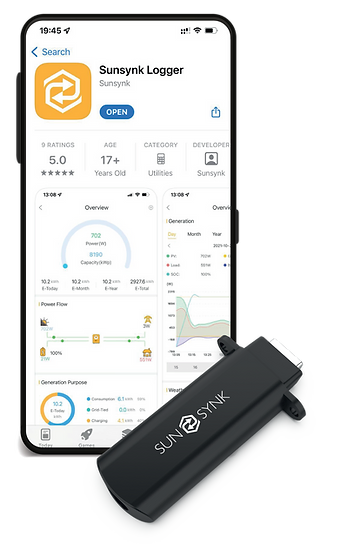

# SunSynk Binding

This binding integrates the [Sun Synk Connect web services](https://www.sunsynk.net/).
This binding is used to connect your openHAB system with Sun Synk Connect (where you log in and find Your Inverters). The binding supports discovery via configuring your login and password in an openHAB bridge. From the binding, you will get status of your inverters and also command channels where you can control them. Since the binding uses a polling mechanism, there may be some latency depending on your setting regarding refresh time.



## Introduction

You will require to have installed a Sun Synk inverter with a WiFi Data logger [e-linter](https://www.e-linter.com/) connected to the Sun Synk App or Connect. See [Data Logger set up](https://www.sunsynk.org/_files/ugd/39fbfb_a325b6884e684c4ba1a3ad80afd5da20.pdf) or [Sun Synk Web](https://www.sunsynk.org/remote-monitoring).

This binding uses your Sun Synk Connect credentials to access Sun Synk's web services via an OpenHAB Bridge (SunSynk Account). The bridge manages the account authentication and the discovery of SunSynk Inverter and Plant Things. Only the Inverter Thing is currently supported.

## Supported Things

The supported Thing Types are
|Name            | Thing type    | Supported Thing |
|----------------|---------------|-----------------|
|SunSynk Account | Bridge Thing  | sunsynkaccount  |
|SunSynk Inverter| Thing         | inverter        |
|SunSynk Plant   | Thing         | (TO DO)         |

## Discovery

1. Add the sunsynk binding.
1. Add a new thing of type SunSynk Account via the SunSynk Binding and configure with username and password.
1. Go to Inbox press \[+\] and via the SunSynk Account start discovery \[Scan\] of inverters. 
1. Inverters should appear in your inbox!

The SunSynk Account bridge thing will discover connected inverters through the UI Scan service.
When using the UI Scan service all the parameters for an Inverter Thing are discovered.

- Inverter Serial maps to the Sun Synk Connect inverter serial number
- Inverter Name maps to the Sun Synk Connect inverter alias
- Refresh time (advanced) default 60s and determines the intervals between polls of Sun Synk Connect. A value above 60 is enforced.

The refresh rate is limited to once every 60s to prevent to many requests from the Sun Synk Connect API, although there is no rate limit, the Sun Synk data is fully refreshed on their server about every 60s. This can mean the data in openHAB is more than 1 minute delayed from real-time. Commands sent (from openHAB) to Sun Synk are buffered up until the next refresh interval and as they take a while to propagate through to your inverter, some channel are not refreshed (read back) from Sun Synk Connect until the next minute. 

The SunSynk Account requires the user e-mail address and password used to login to Sun Synk Connect.

- The bridge Thing UID is of the form sunsynk:sunsynkaccout:abcdef1234
- The inverter Thing UID is of the form sunsynk:inverter:abcdef1234:\<gateway serial\>\<inverter serial\>

where \<gateway  serial\> and \<inverter serial\> are discovered from Sun Synk Connect

## Thing Configuration

### `sunsynkaccount` Bridge Thing Configuration

| Name            | Type    | Description                                  | Default | Required | Advanced |
|-----------------|---------|----------------------------------------------|---------|----------|----------|
| email           | text    | Email address used to login Sun Synk Connect | N/A     | yes      | no       |
| password        | text    | Password to access the device                | N/A     | yes      | no       |

### `sunsynk:inverter:` Thing Configuration

| Name    | Type    | Description                                  | Default | Required | Advanced |
|---------|---------|----------------------------------------------|---------|----------|----------|
| alias   | text    | The Sun Synk Connect inverter alias.         | N/A     | yes      | no       |
| sn      | text    | The Sun Synk Connect inverter serial number. | N/A     | yes      | no       |
| refresh | integer | Interval the device is polled in sec.        | 60      | yes      | yes      |

## Channels

The SunSynkAccount has no channels.
The SunSynk Inverter has the following  channels 

| Channel                    | Type    | R/W | Description                       | Advanced |
|----------------------------|---------|-----|-----------------------------------|----------|
|Battery-SOC                 |Number   | R   | Inverter battery % charge         | no       |
|Battery-grid-voltage        |Number   | R   | Battery dc electric-voltage       | no       |
|Battery-grid-current        |Number   | R   | Battery dc electric-current       | no       |
|Battery-grid-power          |Number   | R   | Battery dc electric-power         | no       |
|Battery-temperature         |Number   | R   | Battery temperature               | no       |
|Inverter-ac-temperature     |Number   | R   | Inverter ac temperature           | no       |
|Inverter-dc-temperature     |Number   | R   | Inverter dc temperature           | no       |
|Inverter-grid-power         |Number   | R   | Inverter ac electric-power        | no       |
|Inverter-grid-voltage       |Number   | R   | Inverter ac electric-voltage      | no       |
|Inverter-grid-current       |Number   | R   | Inverter ac electric-current      | no       |
|Inverter-solar-energy-today |Number   | R   | Solar dc energy generated today   | no       |
|Inverter-solar-energy-total |Number   | R   | Solar dc energy generated to date | no       |
|Inverter-solar-power-now    |Number   | R   | Solar dc electric-current         | no       |
|Interval-1-grid-charge      |Switch   | R/W | Interval 1 grid charge on/off     | yes      |
|Interval-1-grid-time        |DateTime | R/W | Interval 1 start grid charge time | yes      |
|Interval-1-grid-capacity    |Number   | R/W | Interval 1 battery charge target  | yes      |
|Interval-1-grid-power-limit |Number   | R/W | Interval 1 charge power limit     | yes      |
|Interval-2-grid-charge      |Switch   | R/W | Interval 2 grid charge on/off     | yes      |
|Interval-2-grid-time        |DateTime | R/W | Interval 2 start grid charge time | yes      |
|Interval-2-grid-capacity    |Number   | R/W | Interval 2 battery charge target  | yes      |
|Interval-2-grid-power-limit |Number   | R/W | Interval 2 charge power limit     | yes      |
|Interval-3-grid-charge      |Switch   | R/W | Interval 3 grid charge on/off     | yes      |
|Interval-3-grid-time        |DateTime | R/W | Interval 3 start grid charge time | yes      |
|Interval-3-grid-capacity    |Number   | R/W | Interval 3 battery charge target  | yes      |
|Interval-3-grid-power-limit |Number   | R/W | Interval 3 charge power limit     | yes      |
|Interval-4-grid-charge      |Switch   | R/W | Interval 4 grid charge on/off     | yes      |
|Interval-4-grid-time        |DateTime | R/W | Interval 4 start grid charge time | yes      |
|Interval-4-grid-capacity    |Number   | R/W | Interval 4 battery charge target  | yes      |
|Interval-4-grid-power-limit |Number   | R/W | Interval 4 charge power limit     | yes      |
|Interval-5-grid-charge      |Switch   | R/W | Interval 5 grid charge on/off     | yes      |
|Interval-5-grid-time        |DateTime | R/W | Interval 5 start grid charge time | yes      |
|Interval-5-grid-capacity    |Number   | R/W | Interval 5 battery charge target  | yes      |
|Interval-5-grid-power-limit |Number   | R/W | Interval 5 charge power limit     | yes      |
|Interval-6-grid-charge      |Switch   | R/W | Interval 6 grid charge on/off     | yes      |
|Interval-6-grid-time        |DateTime | R/W | Interval 6 start grid charge time | yes      |
|Interval-6-grid-capacity    |Number   | R/W | Interval 6 battery charge target  | yes      |
|Interval-6-grid-power-limit |Number   | R/W | Interval 6 charge power limit     | yes      |
|Interval-1-gen-charge       |Number   | R/W | Interval 1 generator charge on/of | yes      |
|Interval-2-gen-charge       |Switch   | R/W | Interval 2 generator charge on/of | yes      |
|Interval-3-gen-charge       |Switch   | R/W | Interval 3 generator charge on/of | yes      |
|Interval-4-gen-charge       |Switch   | R/W | Interval 4 generator charge on/of | yes      |
|Interval-5-gen-charge       |Switch   | R/W | Interval 5 generator charge on/of | yes      |
|Interval-6-gen-charge       |Switch   | R/W | Interval 6 generator charge on/of | yes      |

### Thing Configuration

#### sunsynk.things

From a `.things` file:

```java
Bridge sunsynk:sunsynkaccount: xxx @ "Loft" [email= "user.symbol@domain.", password="somepassword"]{
    Thing inverter E1234567R1231234567890 @ "Loft" [alias= "My Inverter", sn= "1234567890", refresh= 60]
}
```

### Item Configuration

#### sunsynk.items
From an `.items` file:

```java
Switch                    Interval1GridCharge       "Switch turn on Grid Charge for Interval 1"       {channel="sunsynk:inverter:xxx:gsnisn:Interval-1-grid-charge"}
Switch                    Interval2GridCharge       "Switch turn on Grid Charge for Interval 2"       {channel="sunsynk:inverter:xxx:gsnisn:Interval-2-grid-charge"}
Switch                    Interval3GridCharge       "Switch turn on Grid Charge for Interval 3"       {channel="sunsynk:inverter:xxx:gsnisn:Interval-3-grid-charge"}
Switch                    Interval4GridCharge       "Switch turn on Grid Charge for Interval 4"       {channel="sunsynk:inverter:xxx:gsnisn:Interval-4-grid-charge"}
Switch                    Interval5GridCharge       "Switch turn on Grid Charge for Interval 5"       {channel="sunsynk:inverter:xxx:gsnisn:Interval-5-grid-charge"}
Switch                    Interval6GridCharge       "Switch turn on Grid Charge for Interval 6"       {channel="sunsynk:inverter:xxx:gsnisn:Interval-6-grid-charge"}

Switch                    Interval1GenCharge        "Switch turn on Generator Charge for Interval 1"  {channel="sunsynk:inverter:xxx:gsnisn:Interval-1-gen-charge"}
Switch                    Interval2GenCharge        "Switch turn on Generator Charge for Interval 2"  {channel="sunsynk:inverter:xxx:gsnisn:Interval-2-gen-charge"}
Switch                    Interval3GenCharge        "Switch turn on Generator Charge for Interval 3"  {channel="sunsynk:inverter:xxx:gsnisn:Interval-3-gen-charge"}
Switch                    Interval4GenCharge        "Switch turn on Generator Charge for Interval 4"  {channel="sunsynk:inverter:xxx:gsnisn:Interval-4-gen-charge"}
Switch                    Interval5GenCharge        "Switch turn on Generator Charge for Interval 5"  {channel="sunsynk:inverter:xxx:gsnisn:Interval-5-gen-charge"}
Switch                    Interval6GenCharge        "Switch turn on Generator Charge for Interval 6"  {channel="sunsynk:inverter:xxx:gsnisn:Interval-6-gen-charge"}

DateTime                  Interval1GridTime         "Time for Interval 1"                             {channel="sunsynk:inverter:xxx:gsnisn:Interval-1-grid-time", widget="widget:rlk_datetime_standalone"[label="Time Picker"]}
DateTime                  Interval2GridTime         "Time for Interval 2"                             {channel="sunsynk:inverter:xxx:gsnisn:Interval-2-grid-time", widget="widget:rlk_datetime_standalone"[label="Time Picker"]}
DateTime                  Interval3GridTime         "Time for Interval 3"                             {channel="sunsynk:inverter:xxx:gsnisn:Interval-3-grid-time", widget="widget:rlk_datetime_standalone"[label="Time Picker"]}
DateTime                  Interval4GridTime         "Time for Interval 4"                             {channel="sunsynk:inverter:xxx:gsnisn:Interval-4-grid-time", widget="widget:rlk_datetime_standalone"[label="Time Picker"]}
DateTime                  Interval5GridTime         "Time for Interval 5"                             {channel="sunsynk:inverter:xxx:gsnisn:Interval-5-grid-time", widget="widget:rlk_datetime_standalone"[label="Time Picker"]}
DateTime                  Interval6GridTime         "Time for Interval 6"                             {channel="sunsynk:inverter:xxx:gsnisn:Interval-6-grid-time", widget="widget:rlk_datetime_standalone"[label="Time Picker"]}

Number:Dimensionless      Interval1GridCapacity     "Charge Target Interval 1"                        {channel="sunsynk:inverter:xxx:gsnisn:Interval-1-grid-capacity", widget="oh-slider-card",listWidget="oh-slider-item"[title="Target SOC",subtitle="Set % SOC"]}
Number:Dimensionless      Interval2GridCapacity     "Charge Target Interval 2"                        {channel="sunsynk:inverter:xxx:gsnisn:Interval-2-grid-capacity", widget="oh-slider-card",listWidget="oh-slider-item"[title="Target SOC",subtitle="Set % SOC"]}
Number:Dimensionless      Interval3GridCapacity     "Charge Target Interval 3"                        {channel="sunsynk:inverter:xxx:gsnisn:Interval-3-grid-capacity", widget="oh-slider-card",listWidget="oh-slider-item"[title="Target SOC",subtitle="Set % SOC"]}
Number:Dimensionless      Interval4GridCapacity     "Charge Target Interval 4"                        {channel="sunsynk:inverter:xxx:gsnisn:Interval-4-grid-capacity", widget="oh-slider-card",listWidget="oh-slider-item"[title="Target SOC",subtitle="Set % SOC"]}
Number:Dimensionless      Interval5GridCapacity     "Charge Target Interval 5"                        {channel="sunsynk:inverter:xxx:gsnisn:Interval-5-grid-capacity", widget="oh-slider-card",listWidget="oh-slider-item"[title="Target SOC",subtitle="Set % SOC"]}
Number:Dimensionless      Interval6GridCapacity     "Charge Target Interval 6"                        {channel="sunsynk:inverter:xxx:gsnisn:Interval-6-grid-capacity", widget="oh-slider-card",listWidget="oh-slider-item"[title="Target SOC",subtitle="Set % SOC"]}

Number:Power              Interval1GridPowerLimit   "Max Charge Power Interval 1"                     {channel="sunsynk:inverter:xxx:gsnisn:Interval-1-grid-power-limit", listWidget="oh-slider-item"[title="Target Power Limit",subtitle="Set Limit in Watts", min=0, max=8000,step=1000]}
Number:Power              Interval2GridPowerLimit   "Max Charge Power Interval 2"                     {channel="sunsynk:inverter:xxx:gsnisn:Interval-2-grid-power-limit", listWidget="oh-slider-item"[title="Target Power Limit",subtitle="Set Limit in Watts", min=0, max=8000,step=1000]}
Number:Power              Interval3GridPowerLimit   "Max Charge Power Interval 3"                     {channel="sunsynk:inverter:xxx:gsnisn:Interval-3-grid-power-limit", listWidget="oh-slider-item"[title="Target Power Limit",subtitle="Set Limit in Watts", min=0, max=8000,step=1000]}
Number:Power              Interval4GridPowerLimit   "Max Charge Power Interval 4"                     {channel="sunsynk:inverter:xxx:gsnisn:Interval-4-grid-power-limit", listWidget="oh-slider-item"[title="Target Power Limit",subtitle="Set Limit in Watts", min=0, max=8000,step=1000]}
Number:Power              Interval5GridPowerLimit   "Max Charge Power Interval 5"                     {channel="sunsynk:inverter:xxx:gsnisn:Interval-5-grid-power-limit", listWidget="oh-slider-item"[title="Target Power Limit",subtitle="Set Limit in Watts", min=0, max=8000,step=1000]}
Number:Power              Interval6GridPowerLimit   "Max Charge Power Interval 6"                     {channel="sunsynk:inverter:xxx:gsnisn:Interval-6-grid-power-limit", listWidget="oh-slider-item"[title="Target Power Limit",subtitle="Set Limit in Watts", min=0, max=8000,step=1000]}

Number:Dimensionless      BatterySOC                "Battery SOC [%s]"                                {channel="sunsynk:inverter:xxx:gsnisn:Battery-SOC"}
Number:ElectricPotential  BatteryGridVoltage        "Battery Grid Voltage"                            {channel="sunsynk:inverter:xxx:gsnisn:Battery-grid-voltage"}
Number:ElectricCurrent    BatteryGridCurrent        "Battery Grid Current"                            {channel="sunsynk:inverter:xxx:gsnisn:Battery-grid-current"}
Number:Power              BatteryGridPdower         "Battery Grid Power"                              {channel="sunsynk:inverter:xxx:gsnisn:Battery-grid-power"}
Number:Temperature        BatteryTemperature        "Battery Temperatue "                             {channel="sunsynk:inverter:xxx:gsnisn:Battery-temperature"}
Number:Temperature        InverterACTemperature     "Inverter AC Temperature"                         {channel="sunsynk:inverter:xxx:gsnisn:Inverter-ac-temperature"}
Number:Temperature        InverterDCTemperature     "Inverter DC Temperature"                         {channel="sunsynk:inverter:xxx:gsnisn:Inverter-dc-temperature"}
Number:Power              InverterGridPower         "Inverter Grid Power"                             {channel="sunsynk:inverter:xxx:gsnisn:Inverter-grid-power"}
Number:ElectricPotential  InverterGridVoltage       "Inverter Grid Voltage"                           {channel="sunsynk:inverter:xxx:gsnisn:Inverter-grid-voltage"}
Number:ElectricCurrent    InverterGridCurrent       "Inverter Grid Current"                           {channel="sunsynk:inverter:xxx:gsnisn:Inverter-grid-current"}
Number:Energy             InverterSolarEnergyToday  "Inverter Energy Today"                           {channel="sunsynk:inverter:xxx:gsnisn:Inverter-solar-energy-today"}
Number:Energy             InverterSolarEnergyTotal  "Inverter Enery Gross"                            {channel="sunsynk:inverter:xxx:gsnisn:Inverter-solar-energy-total"}
Number:Power              InverterSolarPowerNow     "Inverter Power"                                  {channel="sunsynk:inverter:xxx:gsnisn:Inverter-solar-power-now"}
```

## DateTime Widget

The items file above adds Metadata: Default Standalone widget: [rlk_datetime_standalone](https://community.openhab.org/t/datetime-standalone-widget/127966) to the DateTime items. Only the time portion of the DateTime item is important.

Be sure to understand the time zone set up for the inverter, this can either be synchronised with Sun Synk servers, which in the UK at least applies daylight saving, or free-wheeling locally. The times set in the DateTime items using the widget are not adjusted to any time zone and are sent to the SunSynk API as Strings where they will be applied directly to your inverter. This is in contrast to other solar / energy  APIs that use Zulu (GMT) time.
## Installation

Place the `.jar` file into your `addons` directory. See the "Through manually provided add-on" section of [Installation of Add-ons](https://www.openhab.org/docs/configuration/addons.html).

## Trouble Shooting 
This first version of the binding has been built against 4.2.0-SNAPSHOT - Build #3989, currently its only  available as a `.jar` file 
```java
org.openhab.binding.sunsynk-4.2.0-SNAPSHOT
```
Although the binding is written to find multiple Inverters for each Sun Synk Connect account, testing has been against an account with a single inverter.

- Sun Synk account  and inverter  versions are:
- Gateway Model EESW-D205
- Gateway COMM Type Wi-Fi
- Gateway HW AEW2-0005-03
- Gateway SW 4790123B24R
- Inverter 8.0 kW
- Inverter Type Energy Storage
- Inverter SW M 5.3.8.4 / S 1.5.1.5 / C E.4.3.0
- Connect App Version 1.11.12

### Debugging

After  installation, to gain further information on any issues you encounter  you  can turn on Debug [Logging](https://www.openhab.org/docs/administration/logging.html)  either  through the [karaf console](https://www.openhab.org/docs/administration/console.html) or through the openHAB UI.

Via Console:
```java
log:set DEBUG org.openhab.binding.sunsynk
```

Via UI: 

Log on to your local openHAB as admin and follow the menus.

- Settings > Add-on-Store > Bindings
- Scroll down to find the binding and click on its title, click the cog and select the level "Debug" on the right.

You should now be able to see debug data in the `openhab.log`.


