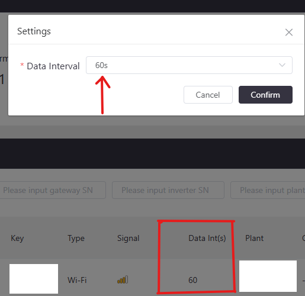

# SunSynk Binding

This binding integrates the [Sun Synk Connect web services](https://www.sunsynk.net/).
It connects your openHAB system to Sun Synk Connect (where you log in and manage your inverters).
The binding provides status channels for your inverters and command channels to control them.
Since the binding uses a polling mechanism, there may be some latency depending on your refresh interval settings.

## Introduction

You need a Sun Synk inverter with a Wi‑Fi [data logger](https://www.sunsynk.org/remote-monitoring) (or [e-linter](https://www.e-linter.com/)) connected to the Sun Synk app or Connect.
See [Data Logger set up](https://www.sunsynk.org/_files/ugd/39fbfb_a325b6884e684c4ba1a3ad80afd5da20.pdf) or [Sun Synk Web](https://www.sunsynk.org/remote-monitoring).
It's recommended (but not required) to set the gateway's data interval to 60 s in Sun Synk Connect for best latency.
If you don't have that setting available, you can request it via Sun Synk or your installer, or ask for a [User Level Access Change Request](https://www.sunsynk.org/remote-monitoring).

This binding uses your Sun Synk Connect credentials to access Sun Synk's web services via an openHAB Bridge (SunSynk Account).
The bridge manages the account authentication and the discovery of SunSynk Inverter Things. Only the Inverter Thing is currently supported.

This binding has been tested and works with inverters:

- [SYNK-3.6-SG04LP1](https://www.sunsynk.org/3-6kw-hybrid-inverter)
- [SYNK-8K-SG05LP1](https://www.sunsynk.org/8kw-hybrid-inverter)

The sunsynk binding should work with any inverter and its connected equipment (batteries or solar strings) that is supported by Sun Synk Connect.
This binding uses your Sun Synk Connect credentials to access Sun Synk's web services via an openHAB bridge (SunSynk Account).
The bridge manages account authentication and discovery of SunSynk Inverter Things. Only the Inverter Thing is currently supported.

Acknowledgements:

- [Power Forum](https://powerforum.co.za/topic/12604-sunsynk-wifi-dongle-hacking/page/3/)
- [AsTheSeaRises](https://github.com/AsTheSeaRises/SunSynk_API)
- [jamesridgway](https://github.com/jamesridgway/sunsynk-api-client/tree/main)
- [kellerza](https://github.com/kellerza/sunsynk)

## Supported Things

|Name            | Thing type    |  Thing ID  |
|----------------|---------------|------------|
|SunSynk Account | Bridge Thing  | account    |
|SunSynk Inverter| Thing         | inverter   |

## Discovery

The binding supports discovery via configuring your login and password in an openHAB bridge.

1. Add the SunSynk binding.
1. Add a new Thing of type SunSynk Account via the SunSynk binding and configure it with username and password.
1. Go to the Inbox, press [+], and use the SunSynk Account to start a discovery [Scan] of inverters.
1. Inverters should appear in your Inbox.

The SunSynk Account bridge Thing will discover connected inverters through the UI Scan service.
When using the UI Scan service all the parameters for an Inverter Thing are discovered.

- Inverter Serial Number maps to the Sun Synk Connect inverter serial number
- Inverter Name maps to the Sun Synk Connect inverter alias
- Plant ID maps to the Sun Synk plant number (not available via Sun Synk Connect App)
- Plant Name maps to the Sun Synk Connect plant name.
- Refresh time (advanced) default 60 s; determines the interval between polls of Sun Synk Connect. A minimum of 60 s is enforced. Remember that inverter values are only published by Sun Synk Connect at the gateway "data interval".

The refresh rate is limited to once every 60 s to avoid excessive requests to the Sun Synk Connect API. Although there's no documented rate limit, data is fully refreshed at the "data interval" set in Sun Synk Connect (typically every 60 s).
This can mean the data in openHAB is more than 1 minute delayed from real-time.
Commands sent (from openHAB) to Sun Synk are buffered up until the next refresh interval and as they take a while to propagate through to your inverter, some channels are not refreshed (read back) from Sun Synk Connect until the next minute.

You can check the data interval setting in the [Sun Synk Connect web services](https://www.sunsynk.net/). Look under Equipment >> Gateway >> three dots […] >> settings. If it's not there you need to change your user level access see [Introduction](#introduction)



The SunSynk Account requires the user e‑mail address and password used to log in to Sun Synk Connect.

## Thing Configuration

### `sunsynk:account` Bridge Thing Configuration

| Name     | Type | Description                                       | Default | Required | Advanced |
|----------|------|---------------------------------------------------|---------|----------|----------|
| email    | text | E‑mail address used to log in to Sun Synk Connect | N/A     | yes      | no       |
| password | text | Password to access the Sun Synk Connect account   | N/A     | yes      | no       |

### `sunsynk:inverter:` Thing Configuration

| Name                   | Type    | Description                                    | Default | Required | Advanced |
|------------------------|---------|------------------------------------------------|---------|----------|----------|
| Inverter Name          | text    | The Sun Synk Connect inverter alias            | N/A     | yes      | no       |
| Inverter Serial Number | text    | The Sun Synk Connect inverter serial number    | N/A     | yes      | no       |
| Plant ID               | text    | The plant ID not available in Sun Synk Connect | N/A     | yes      | no       |
| Plant Name             | text    | The Sun Synk Connect plant name                | N/A     | yes      | no       |
| refresh                | integer | Sun Synk Connect polling interval              | 60      | yes      | yes      |

## Channels

The SunSynk Account has no channels.
The SunSynk Inverter has the following channels.

| Channel                         | Type                     | R/W | Description                        | Advanced |
|---------------------------------|--------------------------|-----|------------------------------------|----------|
| battery-soc                     | Number:Dimensionless     | R   | Inverter battery % charged         | no       |
| battery-grid-voltage            | Number:ElectricPotential | R   | Battery dc electric-voltage        | no       |
| battery-grid-current            | Number:ElectricCurrent   | R   | Battery dc electric-current        | no       |
| battery-grid-power              | Number:Power             | R   | Battery dc electric-power          | no       |
| inverter-ac-temperature         | Number:Temperature       | R   | Inverter ac temperature            | no       |
| inverter-dc-temperature         | Number:Temperature       | R   | Inverter dc temperature            | no       |
| inverter-grid-power             | Number:Power             | R   | Grid ac electric-power             | no       |
| inverter-grid-voltage           | Number:ElectricPotential | R   | Grid ac electric-voltage           | no       |
| inverter-grid-current           | Number:ElectricCurrent   | R   | Grid ac electric-current           | no       |
| inverter-grid-frequency         | Number:Frequency         | R   | Grid frequency                     | no       |
| inverter-rated-ac-output        | Number:Power             | R   | Inverter energy capacity           | no       |
| inverter-solar-energy-today     | Number:Energy            | R   | Solar energy generated today       | no       |
| inverter-solar-energy-month     | Number:Energy            | R   | Solar energy generated this month  | no       |
| inverter-solar-energy-year      | Number:Energy            | R   | Solar energy generated this year   | no       |
| inverter-solar-efficiency       | Number:Dimensionless     | R   | Solar production efficiency        | no       |
| inverter-solar-ac-power         | Number:Power             | R   | Solar power being generated        | no       |
| inverter-solar-energy-total     | Number:Energy            | R   | Solar energy generated to date     | no       |
| inverter-solar-string-voltage-1 | Number:ElectricPotential | R   | String 1 Solar Voltage             | no       |
| inverter-solar-string-voltage-2 | Number:ElectricPotential | R   | String 2 Solar Voltage             | no       |
| inverter-solar-string-current-1 | Number:ElectricCurrent   | R   | String 1 Solar Current             | no       |
| inverter-solar-string-current-2 | Number:ElectricCurrent   | R   | String 2 Solar Current             | no       |
| inverter-solar-string-power-1   | Number:Power             | R   | String 1 Solar Power               | no       |
| inverter-solar-string-power-2   | Number:Power             | R   | String 2 Solar Power               | no       |
| interval-1-grid-charge          | Switch                   | R/W | Interval 1 grid charge on/off      | yes      |
| interval-1-grid-time            | DateTime                 | R/W | Interval 1 start grid charge time  | yes      |
| interval-1-grid-capacity        | Number:Dimensionless     | R/W | Interval 1 battery charge target   | yes      |
| interval-1-grid-power-limit     | Number:Power             | R/W | Interval 1 charge power limit      | yes      |
| interval-2-grid-charge          | Switch                   | R/W | Interval 2 grid charge on/off      | yes      |
| interval-2-grid-time            | DateTime                 | R/W | Interval 2 start grid charge time  | yes      |
| interval-2-grid-capacity        | Number:Dimensionless     | R/W | Interval 2 battery charge target   | yes      |
| interval-2-grid-power-limit     | Number:Power             | R/W | Interval 2 charge power limit      | yes      |
| interval-3-grid-charge          | Switch                   | R/W | Interval 3 grid charge on/off      | yes      |
| interval-3-grid-time            | DateTime                 | R/W | Interval 3 start grid charge time  | yes      |
| interval-3-grid-capacity        | Number:Dimensionless     | R/W | Interval 3 battery charge target   | yes      |
| interval-3-grid-power-limit     | Number:Power             | R/W | Interval 3 charge power limit      | yes      |
| interval-4-grid-charge          | Switch                   | R/W | Interval 4 grid charge on/off      | yes      |
| interval-4-grid-time            | DateTime                 | R/W | Interval 4 start grid charge time  | yes      |
| interval-4-grid-capacity        | Number:Dimensionless     | R/W | Interval 4 battery charge target   | yes      |
| interval-4-grid-power-limit     | Number:Power             | R/W | Interval 4 charge power limit      | yes      |
| interval-5-grid-charge          | Switch                   | R/W | Interval 5 grid charge on/off      | yes      |
| interval-5-grid-time            | DateTime                 | R/W | Interval 5 start grid charge time  | yes      |
| interval-5-grid-capacity        | Number:Dimensionless     | R/W | Interval 5 battery charge target   | yes      |
| interval-5-grid-power-limit     | Number:Power             | R/W | Interval 5 charge power limit      | yes      |
| interval-6-grid-charge          | Switch                   | R/W | Interval 6 grid charge on/off      | yes      |
| interval-6-grid-time            | DateTime                 | R/W | Interval 6 start grid charge time  | yes      |
| interval-6-grid-capacity        | Number:Dimensionless     | R/W | Interval 6 battery charge target   | yes      |
| interval-6-grid-power-limit     | Number:Power             | R/W | Interval 6 charge power limit      | yes      |
| interval-1-gen-charge           | Switch                   | R/W | Interval 1 generator charge on/off | yes      |
| interval-2-gen-charge           | Switch                   | R/W | Interval 2 generator charge on/off | yes      |
| interval-3-gen-charge           | Switch                   | R/W | Interval 3 generator charge on/off | yes      |
| interval-4-gen-charge           | Switch                   | R/W | Interval 4 generator charge on/off | yes      |
| interval-5-gen-charge           | Switch                   | R/W | Interval 5 generator charge on/off | yes      |
| interval-6-gen-charge           | Switch                   | R/W | Interval 6 generator charge on/off | yes      |
| inverter-control-timer          | Switch                   | R/W | Inverter control timer on/off      | yes      |
| inverter-control-work-mode      | String                   | R/W | Inverter work mode 0, 1 or 2       | yes      |
| inverter-control-energy-pattern | String                   | R/W | Inverter energy pattern 0 or 1     | yes      |

### Full Example

#### sunsynk.things

```java
Bridge sunsynk:account:xxx @ "Loft" [email="user@domain.com", password="somepassword"]{
    Thing inverter E1234567R1231234567890 @ "Loft" [alias= "My Inverter", serialnumber= "1234567890", plantId ="123456", plantName="plant 1", refresh= 60]
}
```

You are unlikely to know the plantId, please use the automatic scan to discover and add an inverters, the plantId can be found in the log or in the inverter Thing configuration.

#### sunsynk.items

```java
Switch                      Interval1GridCharge         "Switch on Grid Charge for Interval 1"         {channel="sunsynk:inverter:xxx:1234567R1231234567890:interval-1-grid-charge"}
Switch                      Interval2GridCharge         "Switch on Grid Charge for Interval 2"         {channel="sunsynk:inverter:xxx:1234567R1231234567890:interval-2-grid-charge"}
Switch                      Interval3GridCharge         "Switch on Grid Charge for Interval 3"         {channel="sunsynk:inverter:xxx:1234567R1231234567890:interval-3-grid-charge"}
Switch                      Interval4GridCharge         "Switch on Grid Charge for Interval 4"         {channel="sunsynk:inverter:xxx:1234567R1231234567890:interval-4-grid-charge"}
Switch                      Interval5GridCharge         "Switch on Grid Charge for Interval 5"         {channel="sunsynk:inverter:xxx:1234567R1231234567890:interval-5-grid-charge"}
Switch                      Interval6GridCharge         "Switch on Grid Charge for Interval 6"         {channel="sunsynk:inverter:xxx:1234567R1231234567890:interval-6-grid-charge"}

Switch                      Interval1GenCharge          "Switch on Generator Charge for Interval 1"    {channel="sunsynk:inverter:xxx:1234567R1231234567890:interval-1-gen-charge"}
Switch                      Interval2GenCharge          "Switch on Generator Charge for Interval 2"    {channel="sunsynk:inverter:xxx:1234567R1231234567890:interval-2-gen-charge"}
Switch                      Interval3GenCharge          "Switch on Generator Charge for Interval 3"    {channel="sunsynk:inverter:xxx:1234567R1231234567890:interval-3-gen-charge"}
Switch                      Interval4GenCharge          "Switch on Generator Charge for Interval 4"    {channel="sunsynk:inverter:xxx:1234567R1231234567890:interval-4-gen-charge"}
Switch                      Interval5GenCharge          "Switch on Generator Charge for Interval 5"    {channel="sunsynk:inverter:xxx:1234567R1231234567890:interval-5-gen-charge"}
Switch                      Interval6GenCharge          "Switch on Generator Charge for Interval 6"    {channel="sunsynk:inverter:xxx:1234567R1231234567890:interval-6-gen-charge"}

DateTime                    Interval1GridTime           "Time for Interval 1"                          {channel="sunsynk:inverter:xxx:1234567R1231234567890:interval-1-grid-time", widget="widget:rlk_datetime_standalone"[label="Time Picker"]}
DateTime                    Interval2GridTime           "Time for Interval 2"                          {channel="sunsynk:inverter:xxx:1234567R1231234567890:interval-2-grid-time", widget="widget:rlk_datetime_standalone"[label="Time Picker"]}
DateTime                    Interval3GridTime           "Time for Interval 3"                          {channel="sunsynk:inverter:xxx:1234567R1231234567890:interval-3-grid-time", widget="widget:rlk_datetime_standalone"[label="Time Picker"]}
DateTime                    Interval4GridTime           "Time for Interval 4"                          {channel="sunsynk:inverter:xxx:1234567R1231234567890:interval-4-grid-time", widget="widget:rlk_datetime_standalone"[label="Time Picker"]}
DateTime                    Interval5GridTime           "Time for Interval 5"                          {channel="sunsynk:inverter:xxx:1234567R1231234567890:interval-5-grid-time", widget="widget:rlk_datetime_standalone"[label="Time Picker"]}
DateTime                    Interval6GridTime           "Time for Interval 6"                          {channel="sunsynk:inverter:xxx:1234567R1231234567890:interval-6-grid-time", widget="widget:rlk_datetime_standalone"[label="Time Picker"]}

Number:Dimensionless        Interval1GridCapacity       "Charge Target Interval 1 [%s]"                {channel="sunsynk:inverter:xxx:1234567R1231234567890:interval-1-grid-capacity", widget="oh-slider-card",listWidget="oh-slider-item"[title="Target SOC",subtitle="Set % SOC"]}
Number:Dimensionless        Interval2GridCapacity       "Charge Target Interval 2 [%s]"                {channel="sunsynk:inverter:xxx:1234567R1231234567890:interval-2-grid-capacity", widget="oh-slider-card",listWidget="oh-slider-item"[title="Target SOC",subtitle="Set % SOC"]}
Number:Dimensionless        Interval3GridCapacity       "Charge Target Interval 3 [%s]"                {channel="sunsynk:inverter:xxx:1234567R1231234567890:interval-3-grid-capacity", widget="oh-slider-card",listWidget="oh-slider-item"[title="Target SOC",subtitle="Set % SOC"]}
Number:Dimensionless        Interval4GridCapacity       "Charge Target Interval 4 [%s]"                {channel="sunsynk:inverter:xxx:1234567R1231234567890:interval-4-grid-capacity", widget="oh-slider-card",listWidget="oh-slider-item"[title="Target SOC",subtitle="Set % SOC"]}
Number:Dimensionless        Interval5GridCapacity       "Charge Target Interval 5 [%s]"                {channel="sunsynk:inverter:xxx:1234567R1231234567890:interval-5-grid-capacity", widget="oh-slider-card",listWidget="oh-slider-item"[title="Target SOC",subtitle="Set % SOC"]}
Number:Dimensionless        Interval6GridCapacity       "Charge Target Interval 6 [%s]"                {channel="sunsynk:inverter:xxx:1234567R1231234567890:interval-6-grid-capacity", widget="oh-slider-card",listWidget="oh-slider-item"[title="Target SOC",subtitle="Set % SOC"]}

Number:Power                Interval1GridPowerLimit     "Max Charge Power Interval 1"                  {channel="sunsynk:inverter:xxx:1234567R1231234567890:interval-1-grid-power-limit", listWidget="oh-slider-item"[title="Target Power Limit",subtitle="Set Limit in Watts", min=0, max=8000,step=1000]}
Number:Power                Interval2GridPowerLimit     "Max Charge Power Interval 2"                  {channel="sunsynk:inverter:xxx:1234567R1231234567890:interval-2-grid-power-limit", listWidget="oh-slider-item"[title="Target Power Limit",subtitle="Set Limit in Watts", min=0, max=8000,step=1000]}
Number:Power                Interval3GridPowerLimit     "Max Charge Power Interval 3"                  {channel="sunsynk:inverter:xxx:1234567R1231234567890:interval-3-grid-power-limit", listWidget="oh-slider-item"[title="Target Power Limit",subtitle="Set Limit in Watts", min=0, max=8000,step=1000]}
Number:Power                Interval4GridPowerLimit     "Max Charge Power Interval 4"                  {channel="sunsynk:inverter:xxx:1234567R1231234567890:interval-4-grid-power-limit", listWidget="oh-slider-item"[title="Target Power Limit",subtitle="Set Limit in Watts", min=0, max=8000,step=1000]}
Number:Power                Interval5GridPowerLimit     "Max Charge Power Interval 5"                  {channel="sunsynk:inverter:xxx:1234567R1231234567890:interval-5-grid-power-limit", listWidget="oh-slider-item"[title="Target Power Limit",subtitle="Set Limit in Watts", min=0, max=8000,step=1000]}
Number:Power                Interval6GridPowerLimit     "Max Charge Power Interval 6"                  {channel="sunsynk:inverter:xxx:1234567R1231234567890:interval-6-grid-power-limit", listWidget="oh-slider-item"[title="Target Power Limit",subtitle="Set Limit in Watts", min=0, max=8000,step=1000]}

Number:Dimensionless        BatterySOC                  "Battery SOC [%s]"                             {channel="sunsynk:inverter:xxx:1234567R1231234567890:battery-soc"}
Number:ElectricPotential    BatteryGridVoltage          "Battery Voltage"                              {channel="sunsynk:inverter:xxx:1234567R1231234567890:battery-dc-voltage"}
Number:ElectricCurrent      BatteryGridCurrent          "Battery Current"                              {channel="sunsynk:inverter:xxx:1234567R1231234567890:battery-dc-current"}
Number:Power                BatteryGridPower            "Battery Power"                                {channel="sunsynk:inverter:xxx:1234567R1231234567890:battery-dc-power"}
Number:Power                InverterCapacity            "Inverter Capacity"                            {channel="sunsynk:inverter:xxx:1234567R1231234567890:inverter-rated-ac-output"}
Number:Temperature          BatteryTemperature          "Battery Temperature"                          {channel="sunsynk:inverter:xxx:1234567R1231234567890:battery-temperature"}
Number:Temperature          InverterACTemperature       "Inverter AC Temperature"                      {channel="sunsynk:inverter:xxx:1234567R1231234567890:inverter-ac-temperature"}
Number:Temperature          InverterDCTemperature       "Inverter DC Temperature"                      {channel="sunsynk:inverter:xxx:1234567R1231234567890:inverter-dc-temperature"}


Number:Power                InverterGridPower           "Grid Power"                                   {channel="sunsynk:inverter:xxx:1234567R1231234567890:inverter-grid-power"}
Number:ElectricPotential    InverterGridVoltage         "Grid Voltage"                                 {channel="sunsynk:inverter:xxx:1234567R1231234567890:inverter-grid-voltage"}
Number:ElectricCurrent      InverterGridCurrent         "Grid Current"                                 {channel="sunsynk:inverter:xxx:1234567R1231234567890:inverter-grid-current"}
Number:Frequency            BatteryGridFrequency        "Grid Frequency"                               {channel="sunsynk:inverter:xxx:1234567R1231234567890:inverter-grid-frequency"}

Number:Energy               InverterSolarEnergyToday    "Inverter Solar Energy Today"                  {channel="sunsynk:inverter:xxx:1234567R1231234567890:inverter-solar-energy-today"}
Number:Energy               InverterSolarEnergyMonth    "Inverter Solar Energy This Month"             {channel="sunsynk:inverter:xxx:1234567R1231234567890:inverter-solar-energy-month"}
Number:Energy               InverterSolarEnergyYear     "Inverter Solar Energy This Year"              {channel="sunsynk:inverter:xxx:1234567R1231234567890:inverter-solar-energy-year"}
Number:Energy               InverterSolarEnergyTotal    "Inverter Solar Energy Gross"                  {channel="sunsynk:inverter:xxx:1234567R1231234567890:inverter-solar-energy-total"}
Number:Dimensionless        InverterSolarEfficiency     "Inverter Solar Efficiency"                    {channel="sunsynk:inverter:xxx:1234567R1231234567890:inverter-solar-efficiency"}
Number:Power                InverterSolarPowerNow       "Inverter Solar Power"                         {channel="sunsynk:inverter:xxx:1234567R1231234567890:inverter-solar-ac-power"}
Number:ElectricPotential    SolarString1Voltage         "Solar String 1 Voltage"                       {channel="sunsynk:inverter:xxx:1234567R1231234567890:inverter-solar-string-voltage-1"}
Number:ElectricPotential    SolarString2Voltage         "Solar String 2 Voltage"                       {channel="sunsynk:inverter:xxx:1234567R1231234567890:inverter-solar-string-voltage-2"}
Number:ElectricCurrent      SolarString1Current         "Solar String 1 Current"                       {channel="sunsynk:inverter:xxx:1234567R1231234567890:inverter-solar-string-current-1"}
Number:ElectricCurrent      SolarString2Current         "Solar String 2 Current"                       {channel="sunsynk:inverter:xxx:1234567R1231234567890:inverter-solar-string-current-2"}
Number:Power                SolarString1Power           "Solar String 1 Power"                         {channel="sunsynk:inverter:xxx:1234567R1231234567890:inverter-solar-string-power-1"}
Number:Power                SolarString2Power           "Solar String 2 Power"                         {channel="sunsynk:inverter:xxx:1234567R1231234567890:inverter-solar-string-power-2"}

Switch                      Interval6ControlTimer       "Switch on System Mode Timer"                  {channel="sunsynk:inverter:xxx:1234567R1231234567890:inverter-control-timer"}
String                      InverterControlWorkMode     "System Work Mode 0, 1 or 2"                   {channel="sunsynk:inverter:xxx:1234567R1231234567890:inverter-control-work-mode"}
String                      InverterControlPattern      "System Mode Energy Pattern 0 or 1"            {channel="sunsynk:inverter:xxx:1234567R1231234567890:inverter-control-energy-pattern"}
```

## DateTime Widget

The items file above adds Metadata: Default Standalone widget: [rlk_datetime_standalone](https://community.openhab.org/t/datetime-standalone-widget/127966) to the DateTime items. Only the time portion of the DateTime item is important.

Be sure to understand the time zone set up for the inverter; it can either be synchronized with Sun Synk servers (which, in the UK at least, apply daylight saving) or free‑running locally.
The times set in the DateTime items using the widget are not adjusted to any time zone and are sent to the SunSynk API as strings where they will be applied directly to your inverter.
This is in contrast to other solar/energy APIs that use Zulu (GMT) time.

## Debugging

After installation, to gain further information on any issues you encounter you can turn on Debug [Logging](https://www.openhab.org/docs/administration/logging.html) either through the [karaf console](https://www.openhab.org/docs/administration/console.html) or through the openHAB UI.
