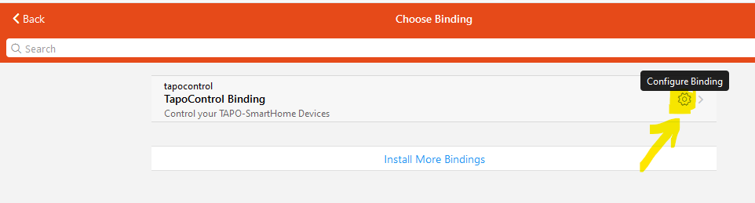
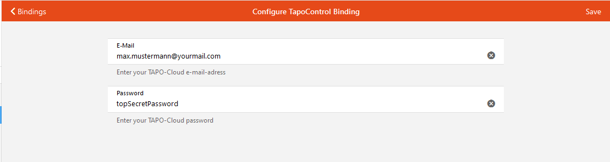

# TapoControl Binding

This binding adds support to control Tapo (Copyright © TP-Link Corporation Limited) Smart Home Devices from your local openHAB system.
(Note: This is not an official Tapo/TP-link Binding!)

## Supported Things

The following Tapo-Devices are supported

### P100 SmartPlug (WiFi)

* Power On/Off
* Wi-Fi signal strength (RSSI)

## Prerequisites

Before using Smart Plugs with openHAB the devices must be connected to the Wi-Fi network.
This can be done using the Tapo provided mobile app.

## Discovery

Discovery is not supported at the moment. You need to know the IP-Adress of your device

## Binding Configuration

Binding needs your Tapo eMail and password to connect to the Tapo-Cloud.
This is only used to create the handshake (cookie) to act with your devices.

To enter your cloud details go to the bindings page, click the TapoControl binding and than configure.


In the configuration page, enter your eMail and password.



## Thing Configuration

The thing can be only configured by `ipAddress` at the moment.

The thing has the following configuration parameters:

| Parameter          | Description                                                          |
|--------------------|----------------------------------------------------------------------|
| ipAddress          | IP Address of the device.                                            |
| pollingInterval    | Refresh interval in seconds. Optional. The default is 30 seconds     |


## Channels

All devices support some of the following channels:

| channel  | type   | description                  | things supporting this channel  |
|----------|--------|------------------------------|---------------------------------|
| output   | Switch | Power device on or off       | P100                            |


## Channel Refresh

When the thing receives a `RefreshType` command the thing will send a new refreshComand.


## Full Example

### tapocontrol.things:

```
tapocontrol:tapoP100:mySocket      "My-Socket"                 [ ipAddress="192.168.178.150", pollingInterval=30 ]
``` 

### tapocontrol.items:

```
Switch       TAPO_SOCKET      "socket"                { channel="tapocontrol:tapoP100:socket:mySocket:output" }
``` 


## NOTES!

This is not an official Tapo or TP-link product. 
There's no warranty and no assumption of liability.
