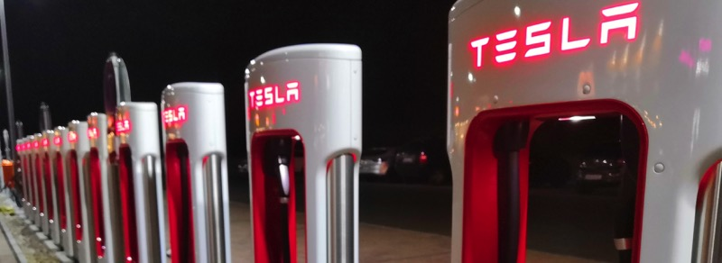

# Tesla Binding

This binding integrates [Tesla Electrical Vehicles](https://www.tesla.com).
The integration happens through the Tesla Owners Remote API.

## Supported Things

All current Tesla models are supported by this binding. Access is established through a Tesla account as a bridge.

| Thing Type | Description                                  |
|------------|----------------------------------------------|
| account    | The account provides access to the vehicles. |
| models     | A Tesla Model S                              |
| model3     | A Tesla Model 3                              |
| modelx     | A Tesla Model X                              |
| modely     | A Tesla Model Y                              |



## Auto Discovery

If the authentication with the Tesla Account is done through the openHAB console (see "Bridge Configuration" option 1 below), the account is automatically added to the Inbox.

Furthermore, once an account is configured, it is automatically queried for associated vehicles and an Inbox entry is created for each of them.

## Bridge Configuration

The `account` bridge requires an OAuth2 refresh token as the only parameter `refreshToken`.

There are three different ways of obtaining the token.

NOTE: Tesla has introduced some captcha mechanism, which might prevent options 1 and 2 from working as expected.
In case you are only receiving error messages, please make use of option 3!

1. Use the openHAB console

Run the following command on the console and provide your Tesla account credentials (the same that you use in the official Tesla app):

```
openhab> openhab:tesla login
Username (email): mail@example.com
Password: topsecret
Attempting login...Attempting login...
Refresh token: xxxxxxxxxx
```
When successfully doing the login through the console, openHAB will automatically create an Inbox entry that is preconfigured with the refresh token, which you can now simply approve.

Alternatively, you can use the refresh token to textually configure your `account` bridge or enter it in a manually created "Tesla Account" thing in the UI.

2. Provide your credentials in the UI

If you do not want to use the openHAB console, you can also manually create a "Tesla Account" thing in the UI by providing your username and password as parameters (to show them, use the "Show More" button) in the "Edit Thing" view and leaving the refresh token parameter field empty.

openHAB will use the provided credentials to retrieve and set the refresh token and automatically delete your password from the configuration afterwards for safety reasons.

3. Use external tools

There are a few 3rd party tools available that have specialized on getting hold of refresh tokens for the Tesla API.
Please note that we in general consider it dangerous to enter your credentials into some 3rd party app - you will have to trust the author not to send or store those credentials anywhere.

- [Tesla Access Token Generator (Chromium Extension](https://github.com/DoctorMcKay/chromium-tesla-token-generator)
- [Auth App for Tesla (iOS)](https://apps.apple.com/us/app/auth-app-for-tesla/id1552058613)
- [Tesla Tokens (Android)](https://play.google.com/store/apps/details?id=net.leveugle.teslatokens)

When using one of such apps, simply copy and paste the received refresh token into the account configuration.


## Thing Configuration

The vehicle Thing requires the vehicle's VIN as a configuration parameter `vin`.

Additionally, the optional boolean parameter `allowWakeup` can be set. This determines whether openHAB is allowed to wake up the vehicle in order to retrieve data from it. This setting is not recommended as it will result in a significant vampire drain (i.e. energy consumption although the vehicle is parking).

## Channels

All vehicles support a huge number of channels - the following list shows the standard ones:

| Channel ID       | Item Type          | Label              | Description                                                                                 |
|------------------|--------------------|--------------------|---------------------------------------------------------------------------------------------|
| autoconditioning | Switch             | Auto Conditioning  | Turns on auto-conditioning (a/c or heating)                                                 |
| batterylevel     | Number             | Battery Level      | State of the battery in %                                                                   |
| chargingstate    | String             | Charging State     | “Starting”, “Complete”, “Charging”, “Disconnected”, “Stopped”, “NoPower”                    |
| chargeport       | Switch             | Charge Port        | Open the Charge Port (ON) or indicates the state of the Charge Port (ON/OFF if Open/Closed) |
| climate          | Switch             | Climate            | Climate status indicator                                                                    |
| doorlock         | Switch             | Door Lock          | Lock or unlock the car                                                                      |
| insidetemp       | Number:Temperature | Inside Temperature | Indicates the inside temperature of the vehicle                                             |
| location         | Location           | Location           | The actual position of the vehicle                                                          |
| odometer         | Number:Length      | Odometer           | Odometer of the vehicle                                                                     |
| speed            | Number:Speed       | Speed              | Vehicle speed                                                                               |


Additionally, these advanced channels are available (not all are available on all vehicle types, e.g., the sunroof):

| Channel ID                | Item Type                | Label                         | Description                                                                                                      |
|---------------------------|--------------------------|-------------------------------|------------------------------------------------------------------------------------------------------------------|
| autoparkstate             | String                   | Autopark State                | Undocumented / To be defined                                                                                     |
| autoparkstyle             | String                   | Autopark Style                | Undocumented / To be defined                                                                                     |
| batterycurrent            | Number:ElectricCurrent   | Battery Current               | Current (Ampere) floating into (+) or out (-) of the battery                                                     |
| batteryheater             | Switch                   | Battery Heater                | Indicates if the battery heater is switched on                                                                   |
| batteryheaternopower      | Switch                   | Battery Heater Power          | Indicates if there is enough power to use the battery heater                                                     |
| batteryrange              | Number:Length            | Battery Range                 | Range of the battery                                                                                             |
| calendarenabled           | Switch                   | Calendar Enabled              | Indicates if access to a remote calendar is enabled                                                              |
| centerdisplay             | Number                   | Central Display State         | Indicates the state of the central display in the vehicle, see [here](https://tesla-api.timdorr.com/vehicle/state/vehiclestate) for valid values |                                                 
| centerrearseatheater      | Switch                   | Center Rear Seat Heater       | Indicates if the center rear seat heater is switched on                                                          |
| charge                    | Switch                   | Charge                        | Start (ON) or stop (OFF) charging                                                                                |
| chargecable               | String                   | Charge Cable                  | Undocumented / To be defined                                                                                     |
| chargecurrent             | Number:ElectricCurrent   | Charge Current                | Current (Ampere) requested from the charger                                                                      |
| chargeenablerequest       | Switch                   | Charge Enable Request         | Undocumented / To be defined                                                                                     |
| chargeenergyadded         | Number:Energy            | Charge Energy Added           | Energy added, in kWh, during the last charging session                                                           |
| chargelimit               | Dimmer                   | Charge Limit                  | Limit charging of the vehicle to the given %                                                                     |
| chargelimitmaximum        | Dimmer                   | Charge Limit Maximum          | Maximum charging limit of the vehicle, as %                                                                      |
| chargelimitminimum        | Dimmer                   | Charge Limit Minimum          | Minimum charging limit of the vehicle, as %                                                                      |
| chargelimitsocstandard    | Dimmer                   | Charge Limit SOC Standard     | Standard charging limit of the vehicle, in %                                                                     |
| chargeidealdistanceadded  | Number:Length            | Ideal Charge Distance Added   | Ideal range added during the last charging session                                                               |
| chargemaxcurrent          | Number:ElectricCurrent   | Charge Max Current            | Maximum current (Ampere) that can be requested from the charger                                                  |
| chargerateddistanceadded  | Number:Length            | Rated Charge Distance Added   | Rated range added during the last charging session                                                               |
| chargerate                | Number:Speed             | Charge Rate                   | Distance per hour charging rate                                                                                  |
| chargestartingrange       | String                   | Charge Starting Range         | Undocumented / To be defined                                                                                     |
| chargestartingsoc         | String                   | Charge Starting SOC           | Undocumented / To be defined                                                                                     |
| chargetomax               | Switch                   | Charge To Max Range           | Indicates if charging to the maximum range is enabled                                                            |
| chargercurrent            | Number:ElectricCurrent   | Charge Current                | Current (Ampere) actually being drawn from the charger                                                           |
| chargerphases             | Number                   | Charger Phases                | Indicates the number of phases (1 to 3) used for charging                                                        |
| chargermaxcurrent         | Number:ElectricCurrent   | Charger Maximum Current       | Maximum current (Ampere) that can be delivered by the charger                                                    |
| chargerpower              | Number                   | Charger Power                 | Power actually delivered by the charger                                                                          |
| chargervoltage            | Number:ElectricPotential | Charger Voltage               | Voltage (V) actually presented by the charger                                                                    |
| chargingamps              | Number:ElectricCurrent   | Set Charging Amps             | Current (Ampere) to use for charging                                                                             |
| driverfrontdoor           | Contact                  | Driver Front Door             | Indicates if the front door at the driver's side is open                                                         |
| driverreardoor            | Contact                  | Driver Rear Door              | Indicates if the rear door at the driver's side is open                                                          |
| drivertemp                | Number:Temperature       | Driver Temperature            | Indicates the auto conditioning temperature set at the driver's side                                             |
| eventstamp                | DateTime                 | Event Timestamp               | Timestamp of the last event received from the Tesla streaming service                                            |
| estimatedbatteryrange     | Number:Length            | Estimated Battery Range       | Estimated battery range                                                                                          |
| estimatedrange            | Number                   | Estimated Range               | Estimated range of the vehicle                                                                                   |
| fan                       | Number                   | Fan                           | Indicates the speed (0-7) of the fan                                                                             |
| flashlights               | Switch                   | Flash Lights                  | Flash the lights of the car (when ON is received)                                                                |
| frontdefroster            | Switch                   | Front Defroster               | Indicates if the front defroster is enabled                                                                      |
| fronttrunk                | Switch                   | Front Trunk                   | Indicates if the front trunk is opened, or open the front trunk when ON is received                              |
| gpstimestamp              | DateTime                 | GPS Time Stamp                | Time stamp of the most recent GPS location of the vehicle                                                        |
| heading                   | Number                   | Heading                       | Indicates the (compass) heading of the car, in 0-360 degrees                                                     |
| headingestimation         | Number                   | Estimated Heading             | Estimated (compass) heading of the car, in 0 to 360 degrees                                                      |
| honkhorn                  | Switch                   | Honk the Horn                 | Honk the horn of the vehicle, when ON is received                                                                |
| homelink                  | Switch                   | Homelink Nearby               | Indicates if the Home Link is nearby                                                                             |
| idealbatteryrange         | Number:Length            | Ideal Battery Range           | Indicates the Battery Range                                                                                      |
| lefttempdirection         | Number                   | Left Temperature Direction    | Not documented / To be defined                                                                                   |
| lastautoparkerror         | String                   | Last Autopark Error           | Not documented / To be defined                                                                                   |
| location" advanced="false | Location                 | Location                      | The actual position of the vehicle                                                                               |
| leftseatheater            | Switch                   | Left Seat Heater              | Indicates if the left seat heater is switched on                                                                 |
| leftrearseatheater        | Switch                   | Left Rear Seat Heater         | Indicates if the left rear seat heater is switched on                                                            |
| leftrearbackseatheater    | Number                   | Left Rear Backseat Heater     | Indicates the level (0, 1, 2, or 3) of the left rear backseat heater                                             |
| managedcharging           | Switch                   | Managed Charging              | Indicates if managed charging is active                                                                          |
| managedchargingcancelled  | Switch                   | Managed Charging Cancelled    | Indicates if managed charging is cancelled by the user                                                           |
| managedchargingstart      | String                   | Managed Charging Start Time   | Not documented / To be defined                                                                                   |
| maxcharges                | Number                   | Max Charges                   | Indicates the number of consecutive "Max Range Charges" performed by the vehicle                                 |
| minavailabletemp          | Number:Temperature       | Minimum Temperature           | Indicates the minimal inside temperature of the vehicle                                                          |
| maxavailabletemp          | Number:Temperature       | Maximum Temperature           | Indicates the maximum inside temperature of the vehicle                                                          |
| mobileenabled             | Switch                   | Mobile Enabled                | Indicates whether the vehicle can be remotely controlled                                                         |
| notenoughpower            | Switch                   | Not Enough Power              | Indicates if not enough power (ON) is available to heat the vehicle                                              |
| notificationsenabled      | Switch                   | Notifications Enabled         | Not documented / To be defined                                                                                   |
| notificationssupported    | Switch                   | Notifications Supported       | Not documented / To be defined                                                                                   |
| outsidetemp               | Number:Temperature       | Outside Temperature           | Indicates the outside temperature of the vehicle                                                                 |
| parsedcalendar            | Switch                   | Parsed Calendar Supported     | Not documented / To be defined                                                                                   |
| passengertemp             | Number                   | Passenger Temperature         | Indicates the auto conditioning temperature set at the passenger's side                                          |
| passengerfrontdoor        | Contact                  | Passenger Front Door          | Indicates if the front door at the passenger's side is opened                                                    |
| passengerreardoor         | Contact                  | Passenger Rear Door           | Indicates if the rear door at the passenger's side is opened                                                     |
| power                     | Number                   | Power                         | Net kW flowing in (+) or out (-) of the battery                                                                  |
| preconditioning           | Switch                   | Preconditioning               | Indicates if preconditioning is activated                                                                        |
| range                     | Number                   | Range                         | Vehicle range - Not documented / To be defined                                                                   |
| reardefroster             | Switch                   | Rear Defroster                | Indicates if the rear defroster is enabled                                                                       |
| remotestartenabled        | Switch                   | Remote Start                  | Not documented / To be defined                                                                                   |
| reartrunk                 | Switch                   | Rear Trunk                    | Indicates if the rear trunk is opened, or open/close the rear trunk when ON/OFF is received                      |
| remotestart               | Switch                   | Remote Start                  | Not documented / To be defined                                                                                   |
| remotestartsupported      | Switch                   | Remote Start Supported        | Not documented / To be defined                                                                                   |
| rightseatheater           | Switch                   | Right Seat Heater             | Indicates if the right seat heater is switched on                                                                |
| rightrearseatheater       | Switch                   | Right Rear Seat Heater        | Indicates if the right rear seat heater is switched on                                                           |
| rightrearbackseatheater   | Number                   | Right Rear Backseat Heater    | Indicates the level (0, 1, 2, or 3) of the right rear backseat heater                                            |
| righttempdirection        | Number                   | Right Temperature Direction   | Not documented / To be defined                                                                                   |
| scheduledchargingpending  | Switch                   | Scheduled Charging Pending    | Indicates if a scheduled charging session is still pending                                                       |
| scheduledchargingstart    | DateTime                 | Scheduled Charging Start      | Indicates when the scheduled charging session will start, in yyyy-MM-dd'T'HH:mm:ss format                        |
| sentrymode                | Switch                   | Sentry Mode                   | Activates or deactivates sentry mode                                                                             |
| sentrymodeavailable       | Switch                   | Sentry Mode Available         | Indicates whether sentry mode is currently available                                                             |
| shiftstate                | String                   | Shift State                   | Indicates the state of the transmission, “P”, “D”, “R”, or “N”                                                   |
| sidemirrorheaters         | Switch                   | Side Mirror Heaters           | Indicates if the side mirror heaters are switched on                                                             |
| smartpreconditioning      | Switch                   | Smart Preconditioning         | Indicates if smart preconditioning is switched on                                                                |
| soc                       | Number                   | State of Charge               | State of Charge, in %                                                                                            |
| state                     | String                   | State                         | “online”, “asleep”, “waking”                                                                                     |
| steeringwheelheater       | Switch                   | Steering Wheel Heater         | Indicates if the steering wheel heater is switched on                                                            |
| sunroofstate              | String                   | Sunroof State                 | Valid states are “unknown”, “open”, “closed”, “vent”, “comfort”. Accepts commands "close" and "vent".            |
| sunroof                   | Dimmer                   | Sunroof                       | Indicates the opening state of the sunroof (0% closed, 100% fully open)                                          |
| temperature               | Number:Temperature       | Temperature                   | Set the temperature of the autoconditioning system. The temperature for the driver and passenger will be synced. |
| timetofullcharge          | Number                   | Time To Full Charge           | Number of hours to fully charge the battery                                                                      |
| tripcharging              | Switch                   | Trip Charging                 | Not documented / To be defined                                                                                   |
| usablebatterylevel        | Number                   | Usable Battery Level          | Indicates the % of battery that can be used for vehicle functions like driving                                   |
| userchargeenablerequest   | String                   | User Charge Enable Request    | Not documented / To be defined                                                                                   |
| valetmode                 | Switch                   | Valet Mode                    | Enable or disable Valet Mode                                                                                     |
| valetpin                  | Switch                   | Valet PIN Required            | Indicates if a PIN code is required to disable valet mode                                                        |
| wakeup                    | Switch                   | Wake Up                       | Wake up the vehicle from a (deep) sleep                                                                          |
| wiperbladeheater          | Switch                   | Wiperblade Heater             | Indicates if the wiperblade heater is switched on                                                                |


## Example

demo.Things:

```
Bridge tesla:account:myaccount "My Tesla Account" [ refreshToken="xxxx" ] {
    model3 mycar "My favorite car" [ vin="5YJSA7H25FFP53736"]
}
```

demo.items:

```
Switch               TeslaCharge                 {channel="tesla:model3:myaccount:mycar:charge"}
Location             TeslaLocation               {channel="tesla:model3:myaccount:mycar:location"}
Dimmer               TeslaChargeLimit            {channel="tesla:model3:myaccount:mycar:chargelimit"}
String               TeslaChargeRate             {channel="tesla:model3:myaccount:mycar:chargerate"}
String               TeslaChargingState          {channel="tesla:model3:myaccount:mycar:chargingstate"}
Number               TeslaTimeToFullCharge       {channel="tesla:model3:myaccount:mycar:timetofullcharge"}
Number               TeslaChargerPower           {channel="tesla:model3:myaccount:mycar:chargerpower"}
DateTime             TeslaScheduledChargingStart {channel="tesla:model3:myaccount:mycar:scheduledchargingstart"}
Dimmer               TeslaSoC                    {channel="tesla:model3:myaccount:mycar:soc"}
Number:Speed         TeslaSpeed                  {channel="tesla:model3:myaccount:mycar:speed"}
String               TeslaState                  {channel="tesla:model3:myaccount:mycar:state"}
Number               TeslaPower                  {channel="tesla:model3:myaccount:mycar:power"}
Number:Temperature   TeslaInsideTemperature      {channel="tesla:model3:myaccount:mycar:insidetemp"}
Number:Temperature   TeslaOutsideTemperature     {channel="tesla:model3:myaccount:mycar:outsidetemp"}
Switch               TeslaAutoconditioning       {channel="tesla:model3:myaccount:mycar:autoconditioning"}
Number:Temperature   TeslaTemperature            {channel="tesla:model3:myaccount:mycar:temperature"}
String               TeslaShiftState             {channel="tesla:model3:myaccount:mycar:shiftstate"}
Number               TeslaBatteryCurrent         {channel="tesla:model3:myaccount:mycar:batterycurrent"}
Number               TeslaBatteryLevel           {channel="tesla:model3:myaccount:mycar:batterylevel"}
DateTime             TeslaEventstamp             {channel="tesla:model3:myaccount:mycar:eventstamp"}
Number:Length        TeslaOdometer               {channel="tesla:model3:myaccount:mycar:odometer"}
Number               TeslaHeading                {channel="tesla:model3:myaccount:mycar:heading"}
DateTime             TeslaGPSStamp               {channel="tesla:model3:myaccount:mycar:gpstimestamp"}
```

demo.sitemap:

```
sitemap demo label="Main Menu"
{
			Text label="Car" {
				Text label="Drive" {
					Text item=TeslaEventstamp label="Last Event Timestamp [%1$td.%1$tm.%1$tY %1$tT]"
					Text item=TeslaState label="State [%s]"
					Text item=TeslaSpeed label="Speed [%.1f]"
					Text item=TeslaShiftState label="Shift State [%s]"
					Text item=TeslaOdometer label="Odometer [%.1f km]"
				}
				Text label="Climate" {
					Switch item=TeslaAutoconditioning label="Auto Conditioning"  mappings=[ON=ON, OFF=OFF ]
					Setpoint item=TeslaTemperature step=0.5 minValue=18 maxValue=34 label="Auto Conditioning Temperature [%.1f °C]" icon="temperature"
					Text item=TeslaInsideTemperature label="Inside Temperature [%.1f]"
				}
				Text label="Power" {
					Text item=TeslaBatteryCurrent label="Current [%.1f]"
				}
				Text item=TeslaSoC {
					Switch item=TeslaCharge label="Charge" mappings=[ON=ON, OFF=OFF ]
					Slider item=TeslaChargeLimit label="Charge Limit [%.1f]"
					Text item=TeslaChargingState label="Charging State [%s]"
					Text item=TeslaChargeRate label="Charge Rate [%s]"
					Text item=TeslaScheduledChargingStart label="Charging Start [%1$td.%1$tm.%1$tY %1$tT]"
					Text item=TeslaTimeToFullCharge label="Time To Full Charge [%.1f hours]"
				}
			}
}
```
