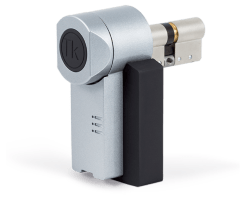
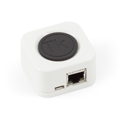

# The Keys Binding

This is the binding for [TheKeys Smartlock](https://www.the-keys.eu/fr/produits/8-serrure-connectee.html).  
This binding allows you to integrate, view, control and configure TheKeys Gateway and TheKeys Smartlock.




## Prerequisites

At least one TheKeys Smartlock which is associated with The Keys Gateway. The Gateway must be paired with the Smartlock
via the android/ios app. It is recommended to configure static IP addresses for the Gateway.

### Setup

- Create access for the Gateway from the app or from https://api.the-keys.fr
- Open the share on https://api.the-keys.fr to get the share code

## Supported Bridges

### `gateway` Bridge Thing Configuration

This binding supports just one bridge type: The Keys Gateway (`thekeys:gateway`). The following configuration options
are available:

| Name            | Type    | Description                           | Default | Required | Advanced |
|-----------------|---------|---------------------------------------|---------|----------|----------|
| host            | text    | Host or IP address of the device      | N/A     | yes      | no       |
| code            | text    | The gateway access code               | N/A     | yes      | no       |
| refreshInterval | integer | Interval the device is polled in sec. | 5       | yes      | no       |
| apiTimeout      | integer | Interval the device is polled in sec. | 30      | yes      | yes      |

### Discovery

The bridge can't be discovered automatically. The `host` must be provided. You can find it from the ios/android app :
Home Page > Accessories > TK Gateway > Configure > IP

### Supported Channels

The gateway have no channels. It only exposes one property `version` containing the firmware version.

## Supported Things

### `smartlock` Thing Configuration

This thing allows to control the smartlock and check its state

| Name            | Type    | Description                           | Default | Required | Advanced |
|-----------------|---------|---------------------------------------|---------|----------|----------|
| lockId          | integer | Identifier of the smartlock           | N/A     | yes      | no       |

### Discovery

The smartlock can be discovered when the Gateway is configured and online. Hit the "scan" button when you add the thing
through the UI

### Supported Channels

| Channel         | Type   | Read/Write | Description                                    |
|-----------------|--------|------------|------------------------------------------------|
| status          | String | R          | Status of the smartlock                        |
| batteryLevel    | Number | R          | Current battery level                          |
| lowBattery      | Switch | R          | Low battery warning                            |
| rssi            | Number | R          | Bluetooth Signal strength with the gateway     |
| position        | Number | R          | Position of the lock                           |
| syncInProgress  | Number | R          | Indicates the pending update of the lock state |
| lastSync        | String | R          | Date of the last success sync with the lock    |
| lock            | Switch | RW         | Switch to open and close the lock              |

## Full Example

A manual setup through files could look like this:

### things/thekeys.things

```
Bridge thekeys:gateway:tk-gateway [ host="192.168.1.50", code="secretcode", refreshInterval="5", apiTimeout="30" ] {
    Thing smartlock tk-smartlock [ lockId="1234" ]
}
```

### items/thekeys.item

```
// Equipment representing thing
Group Smartlock "Smartlock" ["Equipment"]

// Points
String   Smartlock_Lock_status                 "Lock status"                                    (Smartlock) ["Point"]                  { channel="thekeys:smartlock:tk-gateway:1234:status" }         
Number   Smartlock_Niveau_Batterie             "Battery level"               <Battery>          (Smartlock) ["Measurement", "Energy"]  { channel="thekeys:smartlock:tk-gateway:1234:batteryLevel" }   
Switch   Smartlock_Batterie_Faible             "Low battery"                 <LowBattery>       (Smartlock) ["Energy", "LowBattery"]   { channel="thekeys:smartlock:tk-gateway:1234:lowBattery" }     
Number   Smartlock_Bluetooth_rssi              "Bluetooth rssi"              <QualityOfService> (Smartlock) ["Point"]                  { channel="thekeys:smartlock:tk-gateway:1234:rssi" }           
Number   Smartlock_Smartlock_position          "Smartlock position"                             (Smartlock) ["Point"]                  { channel="thekeys:smartlock:tk-gateway:1234:position" }       
Switch   Smartlock_Synchronization_in_progress "Synchronization in progress"                    (Smartlock) ["Point"]                  { channel="thekeys:smartlock:tk-gateway:1234:syncInProgress" } 
DateTime Smartlock_Last_sync                   "Last sync"                                      (Smartlock) ["Point"]                  { channel="thekeys:smartlock:tk-gateway:1234:lastSync" }       
Switch   Smartlock_Lock                        "Lock"                        <Door>             (Smartlock) ["Point"]                  { channel="thekeys:smartlock:tk-gateway:1234:lock" }           
```
