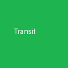

# TransitApp Binding



This binding integrates public transit information and real-time departure details from the Transit API (v4) into openHAB.

> **Powered by Transit** (<https://transit.app>)

## Supported Things

1. **TransitApp Bridge (`bridge`)**: Connects to the Transit API using your personal API key and validates it upon initialization.
1. **Transit Stop (`stop`)**: Polls real-time stop departures based on a global stop ID (e.g., `VVSDE:2298`). Models upcoming departures using group channels (`depart1` to `depart10`).
1. **Transit Route Details (`routedetails`)**: Retrieves comprehensive route details, colors, and alerts based on a global route ID (e.g., `VVSDE:247174`).
1. **Transit Trip Details (`tripdetails`)**: Retrieves specific real-time trip details and monitors up to 10 upcoming stops based on a trip search key.

## Thing Configuration

### Bridge (`bridge`)

| Parameter | Type | Default | Description                               |
| :-------- | :--- | :------ | :---------------------------------------- |
| `apiKey`  | TEXT |         | Your personal Transit API key (required). |
| `cacheTimeMs` | INTEGER | `30000` | How long to cache API responses in milliseconds (5000–300000). |
| `retryAfterSeconds` | INTEGER | `60` | Default retry-after value when API rate limit is hit (1–600 seconds). |
| `maxDepartures` | INTEGER | `10` | Maximum number of departures to display per stop (1–10). |

### Stop (`stop`)

| Parameter         | Type    | Default | Description                                               |
| :---------------- | :------ | :------ | :-------------------------------------------------------- |
| `globalStopId`    | TEXT    |         | Global stop identifier (e.g., `VVSDE:2298`) (required). |
| `refreshInterval` | INTEGER | `60`    | Polling interval in seconds.                              |

### Route Details (`routedetails`)

| Parameter         | Type    | Default | Description                                                |
| :---------------- | :------ | :------ | :--------------------------------------------------------- |
| `routeId`         | TEXT    |         | Global route identifier (e.g., `VVSDE:247174`) (required). |
| `refreshInterval` | INTEGER | `300`   | Polling interval in seconds.                               |

### Trip Details (`tripdetails`)

| Parameter         | Type    | Default | Description                                                               |
| :---------------- | :------ | :------ | :------------------------------------------------------------------------ |
| `tripId`          | TEXT    |         | Trip search key (e.g., `VVSDE:52245421:47:2:22`) (required).              |
| `targetStopId`    | TEXT    |         | Destination stop ID to calculate the `time-to-target` countdown (optional). |
| `refreshInterval` | INTEGER | `60`    | Polling interval in seconds.                                              |

## Channels

### Stop Channels (`depart1` to `depart10`)

| Channel                         | Type        | Description                                            |
| :------------------------------ | :---------- | :----------------------------------------------------- |
| `departX#route-long-name`         | String      | Full route name / itinerary                            |
| `departX#route-short-name`        | String      | Short route name or line number (e.g., "43", "S1")     |
| `departX#departure-time`         | DateTime    | Scheduled or live departure time                       |
| `departX#minutes-until-departure` | Number:Time | Countdown until departure using UoM standard (`min`)   |
| `departX#delay-minutes`          | Number:Time | Current delay using UoM standard (`min`)               |
| `departX#platform`              | String      | Track or platform (e.g., "Gleis 1")                    |
| `departX#wheelchair-accessible`  | Switch      | Wheelchair accessibility status                        |
| `departX#occupancy`             | String      | Vehicle occupancy status                               |
| `departX#is-cancelled`           | Switch      | Indicates if the departure is cancelled                |

### Route Details Channels (`route`)

| Channel                     | Type   | Description                                       |
| :-------------------------- | :----- | :------------------------------------------------ |
| `route#route-long-name`       | String | Full route name                                   |
| `route#route-short-name`      | String | Short route name or line number                   |
| `route#route-color`          | String | Official hex color for UI badges                  |
| `route#active-alerts-count`   | Number | Number of active service alerts and disruptions   |

### Trip Details Channels (`trip` and `stop1` to `stop10`)

| Channel                         | Type        | Description                                                  |
| :------------------------------ | :---------- | :----------------------------------------------------------- |
| `trip#time-to-target`             | Number:Time | Live countdown to the configured target destination stop (`min`) |
| `trip#route-short-name`           | String      | Route short name / line number                               |
| `stopX#stop-name`                | String      | Name of the upcoming stop                                    |
| `stopX#minutes-until-departure`   | Number:Time | Countdown until upcoming departure (`min`)                   |

## Finding Parameters (Stop ID, Route ID, Trip ID)

You can find the required IDs for your openHAB configuration directly within the openHAB MainUI using native Thing Actions, or by testing endpoints interactively online in the [Official Transit API v4 Documentation](https://api-doc.transitapp.com/v4.html#GET/v4).

### Option 1: UI Actions (Recommended)

The TransitApp binding provides built-in Rule Actions that you can trigger easily from the **Developer Sidebar** or the **Rule Action Tester** in openHAB MainUI. These return the raw JSON API responses allowing you to extract `global_stop_id`, route IDs, and real-time trip IDs (`trip_search_key`).

#### 1. Finding Stop IDs (`globalStopId` / `targetStopId`)

Use the `getNearbyStops` action on your `transitapp:bridge` Thing.

- **Input:** Provide your latitude (`lat`) and longitude (`lon`).
- **Result:** Returns a JSON array of all nearby stations. Look for the `global_stop_id` and `stop_name` fields.

#### 2. Finding Route IDs (`routeId`) & Trip IDs (`tripId`)

Once you have your `globalStopId`, create a `transitapp:stop` Thing with it. Then use the `getDepartures` action on this newly created Stop Thing.

- **Result:** Returns a JSON array of all upcoming departures for this stop. Look for `route_short_name`, `global_route_id` (if available), and the `trip_search_key` inside the itineraries for tracking specific vehicles.

### Option 2: Online API Explorer

Alternatively, you can execute all queries directly in your browser:

1. Open the [Transit API v4 Online Documentation](https://api-doc.transitapp.com/v4.html#GET/v4).
1. Enter your API Key in the request header / authorization block.
1. Select an endpoint such as `/v4/public/nearby_stops` or `/v4/public/stop_departures`.
1. Enter your query parameters (e.g., latitude/longitude or stop ID) and click **Send / Execute** to inspect the raw JSON response.

## Full Example

### Thing Configuration

Create a `.things` file (e.g., `transit.things`) with the following configuration:

```openhab
Bridge transitapp:bridge:mybridge [ apiKey="YOUR_API_KEY_HERE" ] {
    Thing stop mystop [ globalStopId="VVSDE:2298", refreshInterval=60 ]
    Thing routedetails myroute [ routeId="VVSDE:247174", refreshInterval=300 ]
    Thing tripdetails mytrip [ tripId="VVSDE:52245421:47:2:22", targetStopId="VVSDE:1234", refreshInterval=60 ]
}
```

### Item Configuration

Create an `.items` file (e.g., `transit.items`) and link your items using the `#` group channel syntax:

```openhab
String      Stop1_Route         "Linie [%s]"             { channel="transitapp:stop:mybridge:mystop:depart1#route-short-name" }
Number:Time Stop1_Countdown     "In [%d %unit%]"         { channel="transitapp:stop:mybridge:mystop:depart1#minutes-until-departure" }
Number:Time Stop1_Delay         "Verspätung [%d %unit%]" { channel="transitapp:stop:mybridge:mystop:depart1#delay-minutes" }
String      Stop1_Platform      "Gleis [%s]"             { channel="transitapp:stop:mybridge:mystop:depart1#platform" }
Switch      Stop1_Cancelled     "Fällt aus [%s]"         { channel="transitapp:stop:mybridge:mystop:depart1#is-cancelled" }

Number      Route_AlertsCount   "Störungen [%d]"         { channel="transitapp:routedetails:mybridge:myroute:route#active-alerts-count" }

Number:Time Trip_CountdownZiel  "Ankunft am Ziel in [%d %unit%]" { channel="transitapp:tripdetails:mybridge:mytrip:trip#time-to-target" }
String      Trip_NextStop       "Nächster Halt [%s]"     { channel="transitapp:tripdetails:mybridge:mytrip:stop1#stop-name" }
```

## Logging & Debugging

To enable full TRACE and DEBUG logging (including raw JSON responses) in the Karaf console:

```bash
log:set DEBUG org.openhab.binding.transitapp
log:set TRACE org.openhab.binding.transitapp
```
