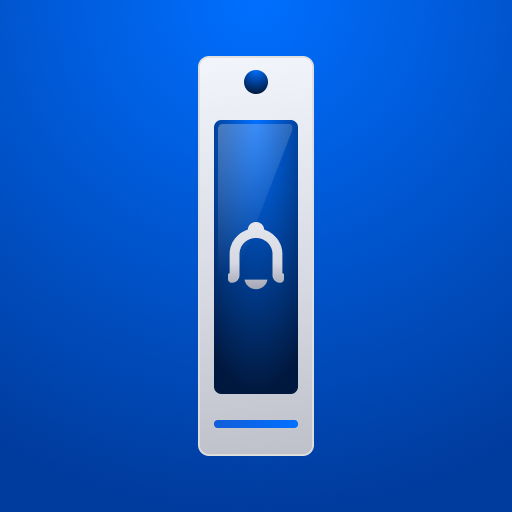
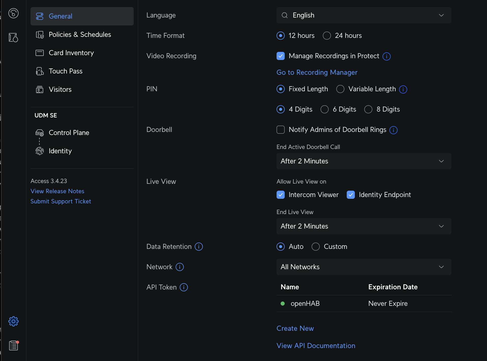
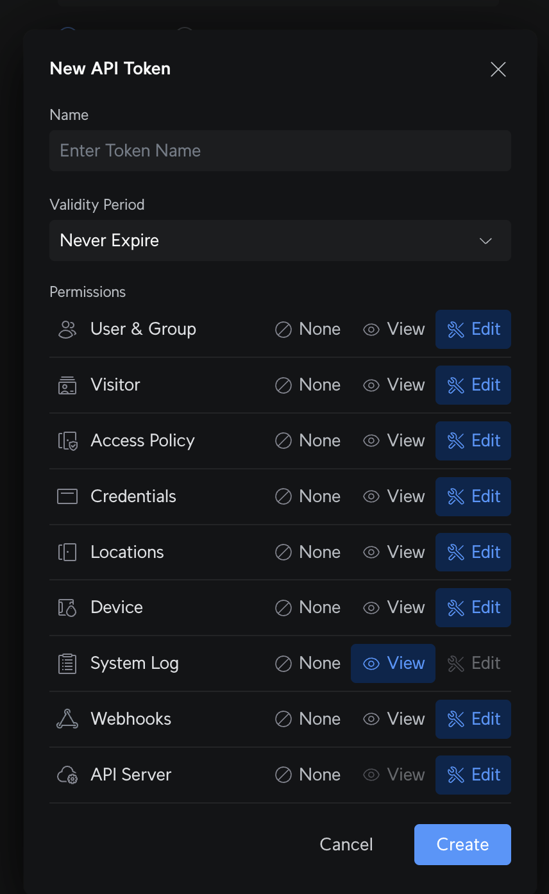

# UniFi Access Binding



This binding integrates Ubiquiti UniFi Access with openHAB.
It connects to your UniFi Access controller over HTTPS and listens for live door events while exposing channels to monitor and control door locks.

## Supported Things

- `unifiaccess:bridge` (Bridge): The UniFi Access controller instance.
  Required to discover and manage door things.
- `unifiaccess:door`: A UniFi Access door with status and control channels.

## Discovery

- Add the `Bridge` by entering the controller Hostname or IP and an API Token.
- Once the Bridge is ONLINE, Doors are discovered automatically and appear in the Inbox.
- Approve discovered doors to add them to your system, or create them manually using `deviceId`.

## Binding Configuration

There are no global binding settings.
All configuration is on the Bridge and on individual Door things.

## Thing Configuration

### Bridge `unifiaccess:bridge`

| Name | Type | Description | Default | Required | Advanced |
|------|------|-------------|---------|----------|----------|
| host | text | Hostname or IP address of the UniFi Access controller. | N/A | yes | no |
| authToken | text | API token used for HTTPS and WebSocket authentication. | N/A | yes | no |

How to get the API Token.
Open the UniFi Access controller and create an API token with permissions suitable for reading doors and remote unlocking.
Then paste the token into the Bridge configuration.





### Door `unifiaccess:door`

| Name | Type | Description | Default | Required | Advanced |
|------|------|-------------|---------|----------|----------|
| deviceId | text | Unique door identifier from the UniFi Access controller. | N/A | yes | no |

## Channels

The channels below are provided by the `unifiaccess:door` thing.
Some channels are write-only actions and do not keep a state.

| Channel ID | Item Type | RW | Description |
|------------|-----------|----|-------------|
| lock | Switch | RW | Lock state. ON locks the door, OFF unlocks immediately. |
| position | Contact | R | Door position sensor. OPEN when the door is open, CLOSED otherwise. |
| last-unlock | DateTime | R | Timestamp of the last unlock event. |
| last-actor | String | R | Name of the user who last unlocked the door. |
| lock-rule | String | R | Current lock rule. One of `schedule`, `custom`, `keep_unlock`, `keep_lock`. |
| keep-unlocked | Switch | W | Keep the door unlocked until changed. Send ON to apply. |
| keep-locked | Switch | W | Keep the door locked until changed. Send ON to apply. |
| unlock-minutes | Number:Time | W | Unlock for a number of minutes. Send a value in minutes. |
| door-thumbnail | Image | R | Door thumbnail. |

## Full Examples (Textual Configuration)

Replace the IDs with your own thing and item names.
Examples assume a Bridge UID of `ua` and a Door UID of `frontdoor`.

### Things (`.things`)

```
Bridge unifiaccess:bridge:ua "UniFi Access" [ host="192.168.1.20", authToken="YOUR_LONG_TOKEN" ] {
    Thing unifiaccess:door:frontdoor [ deviceId="60546f80e4b0abcd12345678" ]
}
```

### Items (`.items`)

```
// Door status
Switch   UA_FrontDoor_Lock          "Front Door Locked"                   { channel="unifiaccess:door:ua:frontdoor:lock" }
Contact  UA_FrontDoor_Position      "Front Door Position [%s]"            { channel="unifiaccess:door:ua:frontdoor:position" }
DateTime UA_FrontDoor_LastUnlock    "Last Unlock [%1$ta %1$tF %1$tR]"     { channel="unifiaccess:door:ua:frontdoor:last-unlock" }
String   UA_FrontDoor_LastActor     "Last Actor [%s]"                     { channel="unifiaccess:door:ua:frontdoor:last-actor" }
String   UA_FrontDoor_LockRule      "Lock Rule [%s]"                      { channel="unifiaccess:door:ua:frontdoor:lock-rule" }

// Door controls
Switch   UA_FrontDoor_KeepUnlocked  "Keep Unlocked"                       { channel="unifiaccess:door:ua:frontdoor:keep-unlocked" }
Switch   UA_FrontDoor_KeepLocked    "Keep Locked"                         { channel="unifiaccess:door:ua:frontdoor:keep-locked" }
Number:Time UA_FrontDoor_UnlockMins "Unlock Minutes [%.0f min]"           { channel="unifiaccess:door:ua:frontdoor:unlock-minutes" }
```

### Sitemap (`.sitemap`)

```
sitemap home label="Home" {
    Frame label="Front Door" {
        Switch   item=UA_FrontDoor_Lock
        Text     item=UA_FrontDoor_Position
        Text     item=UA_FrontDoor_LastActor
        Text     item=UA_FrontDoor_LastUnlock
        Text     item=UA_FrontDoor_LockRule
        Switch   item=UA_FrontDoor_KeepUnlocked
        Switch   item=UA_FrontDoor_KeepLocked
        Setpoint item=UA_FrontDoor_UnlockMins minValue=1 maxValue=120 step=1
    }
}
```
### Rules

```javascript
rules.when().channel('unifiaccess:door:ua:frontdoor:access-attempt-success').triggered().then( e => {
    const jsonData = JSON.parse(e.payload.event);
    console.log("Door Access Attempt Success: ", jsonData);
}).build('Unifi Protect Door Access Attempt Success');

rules.when().channel('unifiaccess:door:ua:frontdoor:access-attempt-failure').triggered().then( e => {
    const jsonData = JSON.parse(e.payload.event);
    console.log("Door Access Attempt Failure: ", jsonData);
}).build('Unifi Protect Door Access Attempt Failure');

rules.when().channel('unifiaccess:door:ua:frontdoor:remote-unlock').triggered().then( e => {
    const jsonData = JSON.parse(e.payload.event);
    console.log("Door Remote Unlock: ", jsonData);
}).build('Unifi Protect Door Remote Unlock');

rules.when().channel('unifiaccess:door:ua:frontdoor:doorbell-status').triggered().then( e => {
    const data = e.payload.event;
    console.log("Doorbell Status: ", e);
}).build('Unifi Protect Doorbell Status');

rules.when().channel('unifiaccess:bridge:ua:log-insight').triggered().then( e => {
    const jsonData = JSON.parse(e.payload.event);
    console.log("Bridge Log Insight: ", jsonData);
}).build('Unifi Protect Bridge Log Insight');

rules.when().channel('unifiaccess:bridge:ua:log').triggered().then( e => {
    const jsonData = JSON.parse(e.payload.event);
    console.log("Bridge Log: ", jsonData);
}).build('Unifi Protect Bridge Log');
```
