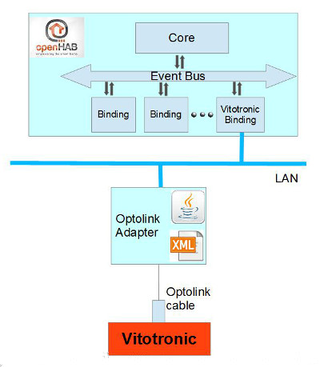

# Vitotronic Binding

Viessmann heating systems with Vitotronic has an optolink Interface for maintenance.
This interface can use for get/set data in the heating system. [see on openv](https://github.com/openv/openv/wiki/)

The Vitotronic binding is a solution to bind this interface into openHAB.
It supports the separation of the heating adaption from the integration in [openHAB](https://www.openhab.org/).

The adapter transforms the address oriented raw interface of the Vitotronic to an abstract format.
The adapter itself is not a part of the binding.
[An alpha version is available here](https://github.com/steand/optolink)
[More Information about the adapter](https://github.com/steand/optolink/wiki)

## Supported Things

For easy using are the main things of a heating system are already define in this binding:

- heating (Vitotronic core system)
- pelletburner (Pellet Fireplace, works for wood also)
- oilburner (Oil Fireplace)
- gasburner (Gas Fireplace)
- storagetank (Storage Tank, stores heat in a water tank on 3 levels: bottom, middle, top=hot water)
- circuit (Heating circuit controls the flow between the heating system and the radiators in the rooms)
- solar (Solar water heating (SWH): Convert sunlight into energy for water heating)

For advanced used 3 basic things of a headingsystem define also.

- temperaturesensor (Single temperature sensor)
- pump (Single pump)
- valve (Single valve)

Note: The mapping of things and channels to the heating system addresses must be done in the adapter.

## Discovery

The binding discovers the adapter with broadcast and puts any `vitotronic:bridge` found into the inbox.
For automatic detection the adapter and **openHAB** must be on the same LAN.
If the bridge isn't on the same LAN, you will need to add manually.
In this case the `IP-Address` and the `adapterID` is required.
After the `vitotronic:bridge` is ONLINE, start a second discovery.
It discovers all things, and places them in the inbox.

## Binding Configuration

Binding itself has 4 configuration parameters:

- ipAddress (The IP address of the Optolink adapter)
- port (Port of the LAN gateway. Default: 31113)
- adapterID (The ID/Name of the adapter)
- refreshInterval (Refresh time for data in seconds. Default: 600 seconds)

If the adapter is automatic discovered the ipAddress, and adapterID will be set by discovery.
The rereshInterval can be set between 60 and 600 seconds.
The minimal setting is dependent of the performance of the adapter.

## Thing Configuration

There is no configuration of Things necessary.
Only some channels are set active by default.
If this channels are defined in the adapter and will be used in **openHAB**  it must set active manually.
Don't change the Thing Name. It is the reference to the name in the adapter.

## Channels

The follow channels are implemented:

| Channel Type ID        | Item Type | Description                                           |
|------------------------|-----------|-------------------------------------------------------|
| systemtime             | DateTime  | DateTime of the heating system                        |
| outside_temp           | Number    | Outside temperature sensor                            |
| boiler_temp            | Number    | Temperature sensor of boiler (fireplace)              |
| malfunction            | Switch    | General malfunction state of the heating system       |
| exhaust_temp           | Number    | Exhaust temperature                                   |
| flowuprating           | Switch    | Pump state of flow up rating                          |
| flame_temp             | Number    | Temperature of flame                                  |
| airshutter_prim        | Number    | Position of the primary air shutter                   |
| airshutter_sec         | Number    | Position of the secondary air shutter                 |
| lambdasensor           | Number    | Oxygen content of the exhaust air                     |
| fanspeed               | Number    | Fan Speed in rpm                                      |
| fanspeed_target        | Number    | Fan Speed in rpm                                      |
| error                  | Switch    |                                                       |
| starts                 | Number    | Count of starts                                       |
| ontime                 | Number    | Ontime in hours                                       |
| consumedpellets        | Number    | Consumed Pellets since start of heating in tons       |
| power                  | Number    | Power of the pellet burner                            |
| powerlevel             | Number    | Power of the oil/gas burner                           |
| actualpower            | Number    | Actual power of the burner                            |
| ontimelevel1           | Number    | Ontime in hours                                       |
| ontimelevel2           | Number    | Ontime in hours                                       |
| consumedoil            | Number    | Consumed Oil since start of heating in Liter          |
| hotwater_temp          | Number    | Temperature sensor of the hot water                   |
| hotwater_temp_setpoint | Number    | Hot water temperature setpoint (target)               |
| middle_temp            | Number    | Temperature sensor in the middle of the storage tank  |
| bottom_temp            | Number    | Temperature sensor at the bottom of the storage tank  |
| circuitpump            | Switch    | Circuit pump state                                    |
| flowtemperature        | Number    | Temperature sensor of the ciruit flow                 |
| pump                   | Switch    | Pump state                                            |
| operationmode          | Number    | Operationmode                                         |
| currentmode            | Number    | Current Mode                                          |
| savemode               | Switch    | Savemode on/off                                       |
| partymode              | Switch    | Partymode on/off                                      |
| party_temp_setpoint    | Number    | Party mode temperature setpoint (target)              |
| room_temp              | Number    | Target temperature of rooms                           |
| room_temp_setpoint     | Number    | Room temperature setpoint (target)                    |
| save_temp_setpoint     | Number    | Save mode temperature setpoint (target)               |
| gradient               | Number    | The gradient relativ to outside temperature           |
| niveau                 | Number    | The niveau relativ to outside temperature             |
| timer_MO               | String    | Heating timer for Monday                              |
| timer_TU               | String    | Heating timer for Tuesday                             |
| timer_WE               | String    | Heating timer for Wednesday                           |
| timer_TH               | String    | Heating timer for Thursday                            |
| timer_FR               | String    | Heating timer for Friday                              |
| timer_SA               | String    | Heating timer for Saturday                            |
| timer_SU               | String    | Heating timer for Sunday                              |
| timer_ww_MO            | String    | Hot water timer for Monday                            |
| timer_ww_TU            | String    | Hot water timer for Tuesday                           |
| timer_ww_WE            | String    | Hot water timer for Wednesday                         |
| timer_ww_TH            | String    | Hot water timer for Thursday                          |
| timer_ww_FR            | String    | Hot water timer for Friday                            |
| timer_ww_SA            | String    | Hot water timer for Saturday                          |
| timer_ww_SU            | String    | Hot water timer for Sunday                            |
| collector_temp         | Number    | Actual temperature of the collector                   |
| storagetank_temp       | Number    | Actual temperature of the storage tank (solar sensor) |
| bufferload             | Switch    | State of the pump (on/off)                            |
| loadsuppression        | Switch    | State of the load suppression (on/off)                |
| producedheat           | Number    | Produced heat since starting solar system             |
| temperature            | Number    | Generic temperature sensor                            |
| valve                  | Number    | Value of a generic valve                              |
