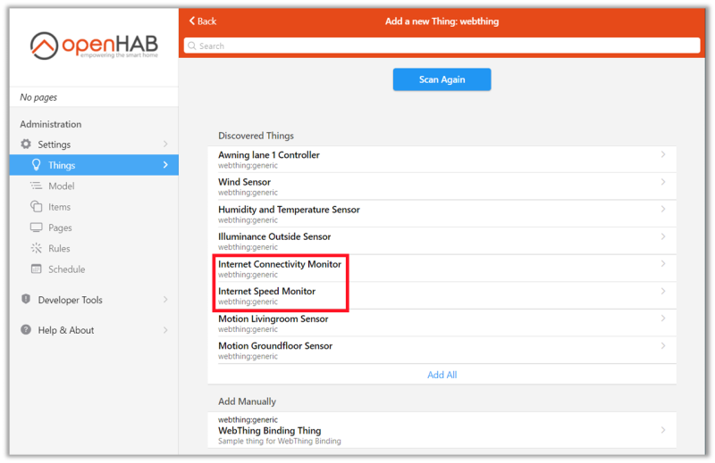
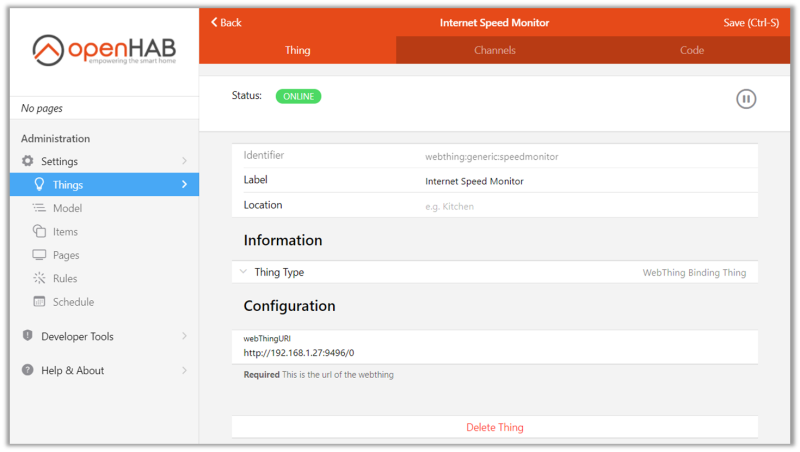
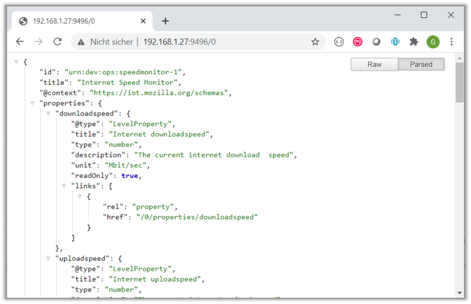
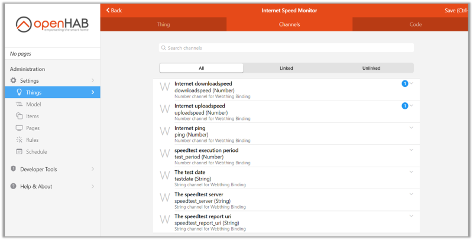
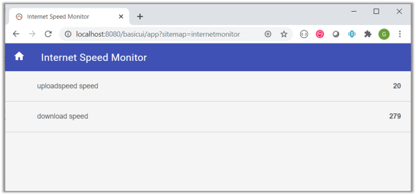

# WebThing Binding

The WebThing binding supports an interface to smart home device supporting the Web Thing API.

The [Web Thing API](https://iot.mozilla.org/wot/) describes an open and generic standard to discover and link smart home devices
like motion sensors, web-connected displays or awning controls. Devices implementing the Web Thing standard can be integrated
into smart home systems such as openHAB to monitor and control them.
These days, the Web Thing API is primarily used by makers to provide a common API to their physical devices.
For instance, the Web Thing API has been used by makers to provide an open way to control [LEDs on an ESP8266 board](https://github.com/WebThingsIO/webthing-arduino)
or to monitor [a PIR motion sensor on Raspberry Pi](https://pypi.org/project/pi-pir-webthing/).

## Supported Things

As a generic solution, the WebThing binding does not depend on specific devices. All devices implementing the Web Thing API should be accessible.

## Discovery

Once the binding is activated all reachable **WebThing devices will be detected automatically** (via mDNS).

## Binding Configuration

No binding configuration required.

## Thing Configuration

| Parameter | Description   | Required  |
|----------|--------|-------------|
| webThingURI | the URI of the WebThing | true  |

Due to the discovery support, **no manual Thing configuration is required** in general. However, under certain circumstances textual
Thing configuration may be preferred. In this case, the webThingURI has to be configured as shown in the webthing.things file below:

```java
Thing webthing:generic:motionsensor [ webThingURI="http://192.168.1.27:9496/" ]
```

## Channels

The supported channels depend on the WebThing device that is connected. Each mappable **WebThing property will be mapped to a dedicated channel, automatically**. For instance, to support the _motion property_ of a Motion-Sensor WebThing, a dedicated _motion channel_ will be created, automatically.

| Thing | channel  | type   | description                  |
|--------|----------|--------|------------------------------|
| WebThing | Automatic | Automatic | All channels will be generated automatically based on the detected WebThing properties |

## Full Example

In the example below WebThings provided by the [Internet Monitor Service](https://pypi.org/project/internet-monitor-webthing/) will be connected.
This service does not require specific hardware or devices. To connect the WebThings, the service has to be installed inside your local network.

### Thing

After installing the WebThing binding you should find the WebThings of your network in the things section of your openHAB administration interface as shown below.



Here, the WebThings provided by the _Internet Monitor Service_: the _Internet Connectivity_ WebThing as well as the
_Internet Speed Monitor_ WebThing have been discovered. To add a WebThing as an openHAB Thing click the 'Add as Thing' button.



Alternatively, you may add the WebThing as an openHAB Thing by using a webthing.thing file that has to be located inside the things folder.

```java
Thing  webthing:generic:speedmonitor [ webThingURI="http://192.168.1.27:9496/0" ]
```

Please consider that the _Internet Monitor Service_ in this example supports two WebThings. Both WebThings are bound on the
same hostname and port. However, the WebThing URI path of the speed monitor ends with '/0'. In contrast,
the connectivity WebThing URI path ends with '/1' in this example.

Due to the fact that the WebThing API is based on web technologies, you can validate the WebThing description by opening the WebThing uri in a browser.



### Items

The _Internet Speed Monitor_ WebThing used in this example supports properties such as _downloadspeed_, _uploadspeed_ or _ping_.
For each property of the WebThing a dedicated openHAB channel will be created, automatically. The channelUID such
as _webthing:generic:speedmonitor:uploadspeed_ is the combination of the thingUID _webthing:generic_ and the
WebThing property name _uploadspeed_.



These channels may be linked via the channels tab of the graphical user interface or manually via a webthing.items file as shown below

 ```java
Number uploadSpeed  "uploadspeed speed [%.0f]" {channel="webthing:generic:speedmonitor:uploadspeed"}
Number downloadSpeed  "download speed [%.0f]" {channel="webthing:generic:speedmonitor:downloadspeed"}

 ```

### Sitemap

To add the newly linked WebThing items to the sitemap you place a sitemap file such as the internetmonitor.sitemap file shown below

```perl
sitemap internetmonitor label="Internet Speed Monitor" {
    Text item=uploadSpeed
    Text item=downloadSpeed
}
```


