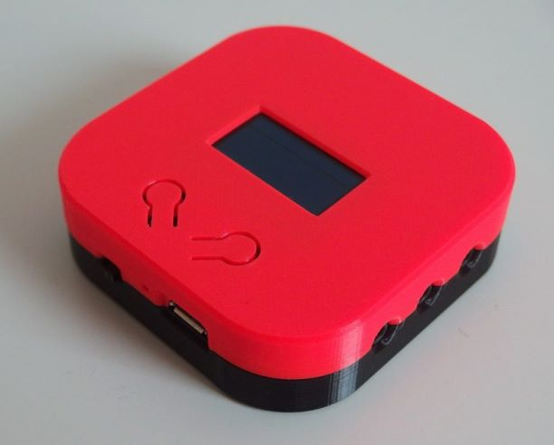
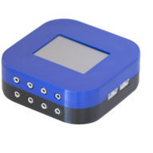

# WlanThermo Binding

This binding add support for the WlanThermo BBQ Thermometer.

| Nano                                 | Mini                                |
|--------------------------------------|-------------------------------------|
|  |  |

## Supported Things

This binding supports the following version of WlanThermo:

- Nano V1 (untested, but should be working)
- Nano V1+
- Mini V1 (untested, but should be working)
- Mini V2

 Pitmaster support is currently only enabled for Mini V1/V2.
 If you have a WlanThermo Nano with Pitmaster, please contact the author of this binding to include the support in future releases.

## Discovery

There is no auto-discovery for WlanThermo Things.
Things must be created manually.

## Thing Configuration

WlanThermo things require you to specify the IP-address of your WlanThermo device (the one you enter into your browser to access the WebUI)
The configuration of username/password is optional.
If omitted, the binding data will be read-only for all channels.
WlanThermo Mini things do not require a username/password and will always be read-only!

## Channels

Depending on the WlanThermo you're using, the following channels are available.

### WlanThermo Nano

If username/password is given in the thing, most channels are writeable.

#### The device itself provides the following channels

| channel             | type                 | description                              |
|---------------------|----------------------|------------------------------------------|
| soc                 | Number:Dimensionless | Battery Level in %                       |
| charging            | Switch               | On, if device is charging, off otherwise |
| rssi_signalstrength | Number               | Signal Strength in range [0 ... 4]       |
| rssi                | Number               | Signal Strength in dBm                   |

#### The following channels apply for all 8 probes of the WlanThermo Nano

| channel            | type               | description                                                          |
|--------------------|--------------------|----------------------------------------------------------------------|
| name               | String             | The name of this probe                                               |
| type               | String             | The type of this probe                                               |
| temp               | Number:Temperature | The current temperature                                              |
| min                | Number:Temperature | The minimum temperature threshold for this probe to trigger an alarm |
| max                | Number:Temperature | The maximum temperature threshold for this probe to trigger an alarm |
| alarm_device       | Switch             | Turn on/off the buzzer alarm on the device for this probe            |
| alarm_push         | Switch             | Turn on/off the push alarm for this probe                            |
| alarm_openhab_low  | Switch             | Will turn on if current temp is below minimum temperature threshold  |
| alarm_openhab_high | Switch             | Will turn on if current temp is above maximum temperature threshold  |
| color              | Color              | The color of this probe. Read only.                                  |
| color_name         | String             | The color name of the probe.                                         |

#### The following channels are available for the Pitmaster

| channel    | type                 | description                                                                                 |
|------------|----------------------|---------------------------------------------------------------------------------------------|
| state      | String               | Indicates type of the Pitmaster channel. Value can be "off", "manual", "auto" or "autotune" |
| setpoint   | Number:Temperature   | the target temperature of the probe assigned to the pitmaster channel                       |
| duty_cycle | Number:Dimensionless | The current duty cycle of the pitmaster channel                                             |
| channel_id | Number               | The channel id of the probe assigned to the pitmaster channel                               |
| pid_id     | Number               | The number of the PID profile to be used. Check the WlanThermo WebUI for available IDs!     |

### WlanThermo Mini

All channels are read only!

#### The device itself provides the following channels

| channel  | type                 | description                   |
|----------|----------------------|-------------------------------|
| cpu_load | Number:Dimensionless | CPU Load in %                 |
| cpu_temp | Number:Temperature   | CPU Temperature               |

#### The following channels apply for all 10 probes of the WlanThermo Mini

| channel            | type               | description                                                          |
|--------------------|--------------------|----------------------------------------------------------------------|
| name               | String             | The name of this probe                                               |
| temp               | Number:Temperature | The current temperature                                              |
| min                | Number:Temperature | The minimum temperature threshold for this probe to trigger an alarm |
| max                | Number:Temperature | The maximum temperature threshold for this probe to trigger an alarm |
| alarm_device       | Switch             | Turn on/off the buzzer alarm on the device for this probe            |
| alarm_openhab_low  | Switch             | Will turn on if current temp is below minimum temperature threshold  |
| alarm_openhab_high | Switch             | Will turn on if current temp is above maximum temperature threshold  |
| color              | Color              | The color of this probe                                              |
| color_name         | String             | The color name of this probe                                         |

#### The following channels apply for both Pitmaster channels of the WlanThermo Mini

| channel    | type                 | description                                                             |
|------------|----------------------|-------------------------------------------------------------------------|
| enabled    | Switch               | Indicates if this pitmaster channel is active                           |
| current    | Number:Temperature   | The current temperature of the probe assigned to this pitmaster channel |
| setpoint   | Number:Temperature   | the target temperature of the probe assigned to this pitmaster channel  |
| duty_cycle | Number:Dimensionless | The current duty cycle of this pitmaster channel                        |
| lid_open   | Switch               | Indicates if Lid-open detection is active                               |
| channel_id | Number               | The channel id of the probe assigned to this pitmaster channel          |

## Triggers

The following trigger apply for all channels of Nano and Mini:

| trigger       | values | description                                                                |
|---------------|--------|----------------------------------------------------------------------------|
| alarm_openhab | MIN    | Triggers repeatedly if current temp is below minimum temperature threshold |
| alarm_openhab | MAX    | Triggers repeatedly if current temp is above maximum temperature threshold |

## Full Example

### Items

Example .items file for WlanThermo Nano and Mini.
Make sure to replace <nano_thing_id> or <mini_thing_id> with your individual thing id!

```java
Group                   gWlanThermoNano         "WlanThermo Nano"
Number:Dimensionless    nano_soc                "State of Charge"       (gWlanThermoNano)   {channel="wlanthermo:nano:<nano_thing_id>:system#soc"}
Number                  nano_rssi               "Signal Strength"       (gWlanThermoNano)   {channel="wlanthermo:nano:<nano_thing_id>:system#rssi"}
Switch                  nano_charging           "Charging"              (gWlanThermoNano)   {channel="wlanthermo:nano:<nano_thing_id>:system#charge"}

Group                   gProbeNano1             "Probe 1"               (gWlanThermoNano)
String                  nano_name_1             "Name"                  (gProbeNano1)       {channel="wlanthermo:nano:<nano_thing_id>:channel1#name"}
String                  nano_typ_1              "Type"                  (gProbeNano1)       {channel="wlanthermo:nano:<nano_thing_id>:channel1#typ"}
Number:Temperature      nano_temp_1             "Temperature"           (gProbeNano1)       {channel="wlanthermo:nano:<nano_thing_id>:channel1#temp"}
Number:Temperature      nano_min_1              "Min Temperature"       (gProbeNano1)       {channel="wlanthermo:nano:<nano_thing_id>:channel1#min"}
Number:Temperature      nano_max_1              "Max Temperature"       (gProbeNano1)       {channel="wlanthermo:nano:<nano_thing_id>:channel1#max"}
Switch                  nano_alarm_device_1     "Enable Buzzer Alarm"   (gProbeNano1)       {channel="wlanthermo:nano:<nano_thing_id>:channel1#alarm_device"}
Switch                  nano_alarm_push_1       "Enable Push Alarm"     (gProbeNano1)       {channel="wlanthermo:nano:<nano_thing_id>:channel1#alarm_push"}
Switch                  nano_alarm_low_1        "Low Temp. Alarm"       (gProbeNano1)       {channel="wlanthermo:nano:<nano_thing_id>:channel1#alarm_openhab_low"}
Switch                  nano_alarm_high_1       "High Temp. Alarm"      (gProbeNano1)       {channel="wlanthermo:nano:<nano_thing_id>:channel1#alarm_openhab_high"}
Color                   nano_color_1            "Color"                 (gProbeNano1)       {channel="wlanthermo:nano:<nano_thing_id>:channel1#color"}
String                  nano_color_name_1       "Color Name"            (gProbeNano1)       {channel="wlanthermo:nano:<nano_thing_id>:channel1#color_name"}

Group                   gProbeNano2             "Probe 2"               (gWlanThermoNano)
String                  nano_name_2             "Name"                  (gProbeNano2)       {channel="wlanthermo:nano:<nano_thing_id>:channel2#name"}
String                  nano_typ_2              "Type"                  (gProbeNano2)       {channel="wlanthermo:nano:<nano_thing_id>:channel2#typ"}
Number:Temperature      nano_temp_2             "Temperature"           (gProbeNano2)       {channel="wlanthermo:nano:<nano_thing_id>:channel2#temp"}
Number:Temperature      nano_min_2              "Min Temperature"       (gProbeNano2)       {channel="wlanthermo:nano:<nano_thing_id>:channel2#min"}
Number:Temperature      nano_max_2              "Max Temperature"       (gProbeNano2)       {channel="wlanthermo:nano:<nano_thing_id>:channel2#max"}
Switch                  nano_alarm_device_2     "Enable Buzzer Alarm"   (gProbeNano2)       {channel="wlanthermo:nano:<nano_thing_id>:channel2#alarm_device"}
Switch                  nano_alarm_push_2       "Enable Push Alarm"     (gProbeNano2)       {channel="wlanthermo:nano:<nano_thing_id>:channel2#alarm_push"}
Switch                  nano_alarm_low_2        "Low Temp. Alarm"       (gProbeNano2)       {channel="wlanthermo:nano:<nano_thing_id>:channel2#alarm_openhab_low"}
Switch                  nano_alarm_high_2       "High Temp. Alarm"      (gProbeNano2)       {channel="wlanthermo:nano:<nano_thing_id>:channel2#alarm_openhab_high"}
Color                   nano_color_2            "Color"                 (gProbeNano2)       {channel="wlanthermo:nano:<nano_thing_id>:channel2#color"}
String                  nano_color_name_2       "Color Name"            (gProbeNano2)       {channel="wlanthermo:nano:<nano_thing_id>:channel2#color_name"}

Group                   gProbeNano3             "Probe 3"               (gWlanThermoNano)
String                  nano_name_3             "Name"                  (gProbeNano3)       {channel="wlanthermo:nano:<nano_thing_id>:channel3#name"}
String                  nano_typ_3              "Type"                  (gProbeNano3)       {channel="wlanthermo:nano:<nano_thing_id>:channel3#typ"}
Number:Temperature      nano_temp_3             "Temperature"           (gProbeNano3)       {channel="wlanthermo:nano:<nano_thing_id>:channel3#temp"}
Number:Temperature      nano_min_3              "Min Temperature"       (gProbeNano3)       {channel="wlanthermo:nano:<nano_thing_id>:channel3#min"}
Number:Temperature      nano_max_3              "Max Temperature"       (gProbeNano3)       {channel="wlanthermo:nano:<nano_thing_id>:channel3#max"}
Switch                  nano_alarm_device_3     "Enable Buzzer Alarm"   (gProbeNano3)       {channel="wlanthermo:nano:<nano_thing_id>:channel3#alarm_device"}
Switch                  nano_alarm_push_3       "Enable Push Alarm"     (gProbeNano3)       {channel="wlanthermo:nano:<nano_thing_id>:channel3#alarm_push"}
Switch                  nano_alarm_low_3        "Low Temp. Alarm"       (gProbeNano3)       {channel="wlanthermo:nano:<nano_thing_id>:channel3#alarm_openhab_low"}
Switch                  nano_alarm_high_3       "High Temp. Alarm"      (gProbeNano3)       {channel="wlanthermo:nano:<nano_thing_id>:channel3#alarm_openhab_high"}
Color                   nano_color_3            "Color"                 (gProbeNano3)       {channel="wlanthermo:nano:<nano_thing_id>:channel3#color"}
String                  nano_color_name_3       "Color Name"            (gProbeNano3)       {channel="wlanthermo:nano:<nano_thing_id>:channel3#color_name"}

Group                   gProbeNano4             "Probe 4"               (gWlanThermoNano)
String                  nano_name_4             "Name"                  (gProbeNano4)       {channel="wlanthermo:nano:<nano_thing_id>:channel4#name"}
String                  nano_typ_4              "Type"                  (gProbeNano4)       {channel="wlanthermo:nano:<nano_thing_id>:channel4#typ"}
Number:Temperature      nano_temp_4             "Temperature"           (gProbeNano4)       {channel="wlanthermo:nano:<nano_thing_id>:channel4#temp"}
Number:Temperature      nano_min_4              "Min Temperature"       (gProbeNano4)       {channel="wlanthermo:nano:<nano_thing_id>:channel4#min"}
Number:Temperature      nano_max_4              "Max Temperature"       (gProbeNano4)       {channel="wlanthermo:nano:<nano_thing_id>:channel4#max"}
Switch                  nano_alarm_device_4     "Enable Buzzer Alarm"   (gProbeNano4)       {channel="wlanthermo:nano:<nano_thing_id>:channel4#alarm_device"}
Switch                  nano_alarm_push_4       "Enable Push Alarm"     (gProbeNano4)       {channel="wlanthermo:nano:<nano_thing_id>:channel4#alarm_push"}
Switch                  nano_alarm_low_4        "Low Temp. Alarm"       (gProbeNano4)       {channel="wlanthermo:nano:<nano_thing_id>:channel4#alarm_openhab_low"}
Switch                  nano_alarm_high_4       "High Temp. Alarm"      (gProbeNano4)       {channel="wlanthermo:nano:<nano_thing_id>:channel4#alarm_openhab_high"}
Color                   nano_color_4            "Color"                 (gProbeNano4)       {channel="wlanthermo:nano:<nano_thing_id>:channel4#color"}
String                  nano_color_name_4       "Color Name"            (gProbeNano4)       {channel="wlanthermo:nano:<nano_thing_id>:channel4#color_name"}

Group                   gProbeNano5             "Probe 5"               (gWlanThermoNano)
String                  nano_name_5             "Name"                  (gProbeNano5)       {channel="wlanthermo:nano:<nano_thing_id>:channel5#name"}
String                  nano_typ_5              "Type"                  (gProbeNano5)       {channel="wlanthermo:nano:<nano_thing_id>:channel5#typ"}
Number:Temperature      nano_temp_5             "Temperature"           (gProbeNano5)       {channel="wlanthermo:nano:<nano_thing_id>:channel5#temp"}
Number:Temperature      nano_min_5              "Min Temperature"       (gProbeNano5)       {channel="wlanthermo:nano:<nano_thing_id>:channel5#min"}
Number:Temperature      nano_max_5              "Max Temperature"       (gProbeNano5)       {channel="wlanthermo:nano:<nano_thing_id>:channel5#max"}
Switch                  nano_alarm_device_5     "Enable Buzzer Alarm"   (gProbeNano5)       {channel="wlanthermo:nano:<nano_thing_id>:channel5#alarm_device"}
Switch                  nano_alarm_push_5       "Enable Push Alarm"     (gProbeNano5)       {channel="wlanthermo:nano:<nano_thing_id>:channel5#alarm_push"}
Switch                  nano_alarm_low_5        "Low Temp. Alarm"       (gProbeNano5)       {channel="wlanthermo:nano:<nano_thing_id>:channel5#alarm_openhab_low"}
Switch                  nano_alarm_high_5       "High Temp. Alarm"      (gProbeNano5)       {channel="wlanthermo:nano:<nano_thing_id>:channel5#alarm_openhab_high"}
Color                   nano_color_5            "Color"                 (gProbeNano5)       {channel="wlanthermo:nano:<nano_thing_id>:channel5#color"}
String                  nano_color_name_5       "Color Name"            (gProbeNano5)       {channel="wlanthermo:nano:<nano_thing_id>:channel5#color_name"}

Group                   gProbeNano6             "Probe 6"               (gWlanThermoNano)
String                  nano_name_6             "Name"                  (gProbeNano6)       {channel="wlanthermo:nano:<nano_thing_id>:channel6#name"}
String                  nano_typ_6              "Type"                  (gProbeNano6)       {channel="wlanthermo:nano:<nano_thing_id>:channel6#typ"}
Number:Temperature      nano_temp_6             "Temperature"           (gProbeNano6)       {channel="wlanthermo:nano:<nano_thing_id>:channel6#temp"}
Number:Temperature      nano_min_6              "Min Temperature"       (gProbeNano6)       {channel="wlanthermo:nano:<nano_thing_id>:channel6#min"}
Number:Temperature      nano_max_6              "Max Temperature"       (gProbeNano6)       {channel="wlanthermo:nano:<nano_thing_id>:channel6#max"}
Switch                  nano_alarm_device_6     "Enable Buzzer Alarm"   (gProbeNano6)       {channel="wlanthermo:nano:<nano_thing_id>:channel6#alarm_device"}
Switch                  nano_alarm_push_6       "Enable Push Alarm"     (gProbeNano6)       {channel="wlanthermo:nano:<nano_thing_id>:channel6#alarm_push"}
Switch                  nano_alarm_low_6        "Low Temp. Alarm"       (gProbeNano6)       {channel="wlanthermo:nano:<nano_thing_id>:channel6#alarm_openhab_low"}
Switch                  nano_alarm_high_6       "High Temp. Alarm"      (gProbeNano6)       {channel="wlanthermo:nano:<nano_thing_id>:channel6#alarm_openhab_high"}
Color                   nano_color_6            "Color"                 (gProbeNano6)       {channel="wlanthermo:nano:<nano_thing_id>:channel6#color"}
String                  nano_color_name_6       "Color Name"            (gProbeNano6)       {channel="wlanthermo:nano:<nano_thing_id>:channel6#color_name"}

Group                   gProbeNano7             "Probe 7"               (gWlanThermoNano)
String                  nano_name_7             "Name"                  (gProbeNano7)       {channel="wlanthermo:nano:<nano_thing_id>:channel7#name"}
String                  nano_typ_7              "Type"                  (gProbeNano7)       {channel="wlanthermo:nano:<nano_thing_id>:channel7#typ"}
Number:Temperature      nano_temp_7             "Temperature"           (gProbeNano7)       {channel="wlanthermo:nano:<nano_thing_id>:channel7#temp"}
Number:Temperature      nano_min_7              "Min Temperature"       (gProbeNano7)       {channel="wlanthermo:nano:<nano_thing_id>:channel7#min"}
Number:Temperature      nano_max_7              "Max Temperature"       (gProbeNano7)       {channel="wlanthermo:nano:<nano_thing_id>:channel7#max"}
Switch                  nano_alarm_device_7     "Enable Buzzer Alarm"   (gProbeNano7)       {channel="wlanthermo:nano:<nano_thing_id>:channel7#alarm_device"}
Switch                  nano_alarm_push_7       "Enable Push Alarm"     (gProbeNano7)       {channel="wlanthermo:nano:<nano_thing_id>:channel7#alarm_push"}
Switch                  nano_alarm_low_7        "Low Temp. Alarm"       (gProbeNano7)       {channel="wlanthermo:nano:<nano_thing_id>:channel7#alarm_openhab_low"}
Switch                  nano_alarm_high_7       "High Temp. Alarm"      (gProbeNano7)       {channel="wlanthermo:nano:<nano_thing_id>:channel7#alarm_openhab_high"}
Color                   nano_color_7            "Color"                 (gProbeNano7)       {channel="wlanthermo:nano:<nano_thing_id>:channel7#color"}
String                  nano_color_name_7       "Color Name"            (gProbeNano7)       {channel="wlanthermo:nano:<nano_thing_id>:channel7#color_name"}

Group                   gProbeNanoNano8         "Probe 8"               (gWlanThermoNano)
String                  nano_name_8             "Name"                  (gProbeNano8)       {channel="wlanthermo:nano:<nano_thing_id>:channel8#name"}
String                  nano_typ_8              "Type"                  (gProbeNano8)       {channel="wlanthermo:nano:<nano_thing_id>:channel8#typ"}
Number:Temperature      nano_temp_8             "Temperature"           (gProbeNano8)       {channel="wlanthermo:nano:<nano_thing_id>:channel8#temp"}
Number:Temperature      nano_min_8              "Min Temperature"       (gProbeNano8)       {channel="wlanthermo:nano:<nano_thing_id>:channel8#min"}
Number:Temperature      nano_max_8              "Max Temperature"       (gProbeNano8)       {channel="wlanthermo:nano:<nano_thing_id>:channel8#max"}
Switch                  nano_alarm_device_8     "Enable Buzzer Alarm"   (gProbeNano8)       {channel="wlanthermo:nano:<nano_thing_id>:channel8#alarm_device"}
Switch                  nano_alarm_push_8       "Enable Push Alarm"     (gProbeNano8)       {channel="wlanthermo:nano:<nano_thing_id>:channel8#alarm_push"}
Switch                  nano_alarm_low_8        "Low Temp. Alarm"       (gProbeNano8)       {channel="wlanthermo:nano:<nano_thing_id>:channel8#alarm_openhab_low"}
Switch                  nano_alarm_high_8       "High Temp. Alarm"      (gProbeNano8)       {channel="wlanthermo:nano:<nano_thing_id>:channel8#alarm_openhab_high"}
Color                   nano_color_8            "Color"                 (gProbeNano8)       {channel="wlanthermo:nano:<nano_thing_id>:channel8#color"}
String                  nano_color_name_8       "Color Name"            (gProbeNano8)       {channel="wlanthermo:nano:<nano_thing_id>:channel8#color_name"}

Group                   gPitmasterNano1         "Pitmaster Nano"        (gWlanThermoNano)
String                  nano_pit_state          "State"                 (gPitmasterNano1)   {channel="wlanthermo:nano:5af97cb9:pit1#state"}
Number:Temperature      nano_pit_setpoint       "Setpoint"              (gPitmasterNano1)   {channel="wlanthermo:nano:5af97cb9:pit1#setpoint"}
Number                  nano_pit_cycle          "Duty Cycle"            (gPitmasterNano1)   {channel="wlanthermo:nano:5af97cb9:pit1#duty_cycle"}
Number                  nano_pit_pidprofile     "PID Profile"           (gPitmasterNano1)   {channel="wlanthermo:nano:5af97cb9:pit1#pid_id"}
Number                  nano_pit_channel        "Input Channel ID"      (gPitmasterNano1)   {channel="wlanthermo:nano:5af97cb9:pit1#channel_id"}

Group                   gWlanThermoMini         "WlanThermo Mini"
Number                  mini_cpuload            "CPU Load"              (gWlanThermoMini)   {channel="wlanthermo:mini:<mini_thing_id>:system#cpu_load"}
Number:Temperature      mini_cputemp            "CPU Temp"              (gWlanThermoMini)   {channel="wlanthermo:mini:<mini_thing_id>:system#cpu_temp"}

Group                   gProbeMini0             "Probe 0"               (gWlanThermoMini)
String                  mini_name_0             "Name"                  (gProbeMini0)       {channel="wlanthermo:mini:<mini_thing_id>:channel0#name"}
Number:Temperature      mini_temp_0             "Temperature"           (gProbeMini0)       {channel="wlanthermo:mini:<mini_thing_id>:channel0#temp"}
Number:Temperature      mini_min_0              "Min Temperature"       (gProbeMini0)       {channel="wlanthermo:mini:<mini_thing_id>:channel0#min"}
Number:Temperature      mini_max_0              "Max Temperature"       (gProbeMini0)       {channel="wlanthermo:mini:<mini_thing_id>:channel0#max"}
Switch                  mini_alarm_device_0     "Enable Buzzer Alarm"   (gProbeMini0)       {channel="wlanthermo:mini:<mini_thing_id>:channel0#alarm_device"}
Switch                  mini_alarm_low_0        "Low Temp. Alarm"       (gProbeMini0)       {channel="wlanthermo:mini:<mini_thing_id>:channel0#alarm_openhab_low"}
Switch                  mini_alarm_high_0       "High Temp. Alarm"      (gProbeMini0)       {channel="wlanthermo:mini:<mini_thing_id>:channel0#alarm_openhab_high"}
Color                   mini_color_0            "Color"                 (gProbeMini0)       {channel="wlanthermo:mini:<mini_thing_id>:channel0#color"}
String                  mini_color_name_0       "Color Name"            (gProbeMini0)       {channel="wlanthermo:mini:<mini_thing_id>:channel0#color_name"}

Group                   gProbeMini1             "Probe 1"               (gWlanThermoMini)
String                  mini_name_1             "Name"                  (gProbeMini1)       {channel="wlanthermo:mini:<mini_thing_id>:channel1#name"}
Number:Temperature      mini_temp_1             "Temperature"           (gProbeMini1)       {channel="wlanthermo:mini:<mini_thing_id>:channel1#temp"}
Number:Temperature      mini_min_1              "Min Temperature"       (gProbeMini1)       {channel="wlanthermo:mini:<mini_thing_id>:channel1#min"}
Number:Temperature      mini_max_1              "Max Temperature"       (gProbeMini1)       {channel="wlanthermo:mini:<mini_thing_id>:channel1#max"}
Switch                  mini_alarm_device_1     "Enable Buzzer Alarm"   (gProbeMini1)       {channel="wlanthermo:mini:<mini_thing_id>:channel1#alarm_device"}
Switch                  mini_alarm_low_1        "Low Temp. Alarm"       (gProbeMini1)       {channel="wlanthermo:mini:<mini_thing_id>:channel1#alarm_openhab_low"}
Switch                  mini_alarm_high_1       "High Temp. Alarm"      (gProbeMini1)       {channel="wlanthermo:mini:<mini_thing_id>:channel1#alarm_openhab_high"}
Color                   mini_color_1            "Color"                 (gProbeMini1)       {channel="wlanthermo:mini:<mini_thing_id>:channel1#color"}
String                  mini_color_name_1       "Color Name"            (gProbeMini1)       {channel="wlanthermo:mini:<mini_thing_id>:channel1#color_name"}

Group                   gProbeMini2             "Probe 2"               (gWlanThermoMini)
String                  mini_name_2             "Name"                  (gProbeMini2)       {channel="wlanthermo:mini:<mini_thing_id>:channel2#name"}
Number:Temperature      mini_temp_2             "Temperature"           (gProbeMini2)       {channel="wlanthermo:mini:<mini_thing_id>:channel2#temp"}
Number:Temperature      mini_min_2              "Min Temperature"       (gProbeMini2)       {channel="wlanthermo:mini:<mini_thing_id>:channel2#min"}
Number:Temperature      mini_max_2              "Max Temperature"       (gProbeMini2)       {channel="wlanthermo:mini:<mini_thing_id>:channel2#max"}
Switch                  mini_alarm_device_2     "Enable Buzzer Alarm"   (gProbeMini2)       {channel="wlanthermo:mini:<mini_thing_id>:channel2#alarm_device"}
Switch                  mini_alarm_low_2        "Low Temp. Alarm"       (gProbeMini2)       {channel="wlanthermo:mini:<mini_thing_id>:channel2#alarm_openhab_low"}
Switch                  mini_alarm_high_2       "High Temp. Alarm"      (gProbeMini2)       {channel="wlanthermo:mini:<mini_thing_id>:channel2#alarm_openhab_high"}
Color                   mini_color_2            "Color"                 (gProbeMini2)       {channel="wlanthermo:mini:<mini_thing_id>:channel2#color"}
String                  mini_color_name_2       "Color Name"            (gProbeMini2)       {channel="wlanthermo:mini:<mini_thing_id>:channel2#color_name"}

Group                   gProbeMini3             "Probe 3"               (gWlanThermoMini)
String                  mini_name_3             "Name"                  (gProbeMini3)       {channel="wlanthermo:mini:<mini_thing_id>:channel3#name"}
Number:Temperature      mini_temp_3             "Temperature"           (gProbeMini3)       {channel="wlanthermo:mini:<mini_thing_id>:channel3#temp"}
Number:Temperature      mini_min_3              "Min Temperature"       (gProbeMini3)       {channel="wlanthermo:mini:<mini_thing_id>:channel3#min"}
Number:Temperature      mini_max_3              "Max Temperature"       (gProbeMini3)       {channel="wlanthermo:mini:<mini_thing_id>:channel3#max"}
Switch                  mini_alarm_device_3     "Enable Buzzer Alarm"   (gProbeMini3)       {channel="wlanthermo:mini:<mini_thing_id>:channel3#alarm_device"}
Switch                  mini_alarm_low_3        "Low Temp. Alarm"       (gProbeMini3)       {channel="wlanthermo:mini:<mini_thing_id>:channel3#alarm_openhab_low"}
Switch                  mini_alarm_high_3       "High Temp. Alarm"      (gProbeMini3)       {channel="wlanthermo:mini:<mini_thing_id>:channel3#alarm_openhab_high"}
Color                   mini_color_3            "Color"                 (gProbeMini3)       {channel="wlanthermo:mini:<mini_thing_id>:channel3#color"}
String                  mini_color_name_3       "Color Name"            (gProbeMini3)       {channel="wlanthermo:mini:<mini_thing_id>:channel3#color_name"}

Group                   gProbeMini4             "Probe 4"               (gWlanThermoMini)
String                  mini_name_4             "Name"                  (gProbeMini4)       {channel="wlanthermo:mini:<mini_thing_id>:channel4#name"}
Number:Temperature      mini_temp_4             "Temperature"           (gProbeMini4)       {channel="wlanthermo:mini:<mini_thing_id>:channel4#temp"}
Number:Temperature      mini_min_4              "Min Temperature"       (gProbeMini4)       {channel="wlanthermo:mini:<mini_thing_id>:channel4#min"}
Number:Temperature      mini_max_4              "Max Temperature"       (gProbeMini4)       {channel="wlanthermo:mini:<mini_thing_id>:channel4#max"}
Switch                  mini_alarm_device_4     "Enable Buzzer Alarm"   (gProbeMini4)       {channel="wlanthermo:mini:<mini_thing_id>:channel4#alarm_device"}
Switch                  mini_alarm_low_4        "Low Temp. Alarm"       (gProbeMini4)       {channel="wlanthermo:mini:<mini_thing_id>:channel4#alarm_openhab_low"}
Switch                  mini_alarm_high_4       "High Temp. Alarm"      (gProbeMini4)       {channel="wlanthermo:mini:<mini_thing_id>:channel4#alarm_openhab_high"}
Color                   mini_color_4            "Color"                 (gProbeMini4)       {channel="wlanthermo:mini:<mini_thing_id>:channel4#color"}
String                  mini_color_name_4       "Color Name"            (gProbeMini4)       {channel="wlanthermo:mini:<mini_thing_id>:channel4#color_name"}

Group                   gProbeMini5             "Probe 5"               (gWlanThermoMini)
String                  mini_name_5             "Name"                  (gProbeMini5)       {channel="wlanthermo:mini:<mini_thing_id>:channel5#name"}
Number:Temperature      mini_temp_5             "Temperature"           (gProbeMini5)       {channel="wlanthermo:mini:<mini_thing_id>:channel5#temp"}
Number:Temperature      mini_min_5              "Min Temperature"       (gProbeMini5)       {channel="wlanthermo:mini:<mini_thing_id>:channel5#min"}
Number:Temperature      mini_max_5              "Max Temperature"       (gProbeMini5)       {channel="wlanthermo:mini:<mini_thing_id>:channel5#max"}
Switch                  mini_alarm_device_5     "Enable Buzzer Alarm"   (gProbeMini5)       {channel="wlanthermo:mini:<mini_thing_id>:channel5#alarm_device"}
Switch                  mini_alarm_low_5        "Low Temp. Alarm"       (gProbeMini5)       {channel="wlanthermo:mini:<mini_thing_id>:channel5#alarm_openhab_low"}
Switch                  mini_alarm_high_5       "High Temp. Alarm"      (gProbeMini5)       {channel="wlanthermo:mini:<mini_thing_id>:channel5#alarm_openhab_high"}
Color                   mini_color_5            "Color"                 (gProbeMini5)       {channel="wlanthermo:mini:<mini_thing_id>:channel5#color"}
String                  mini_color_name_5       "Color Name"            (gProbeMini5)       {channel="wlanthermo:mini:<mini_thing_id>:channel5#color_name"}

Group                   gProbeMini6             "Probe 6"               (gWlanThermoMini)
String                  mini_name_6             "Name"                  (gProbeMini6)       {channel="wlanthermo:mini:<mini_thing_id>:channel6#name"}
Number:Temperature      mini_temp_6             "Temperature"           (gProbeMini6)       {channel="wlanthermo:mini:<mini_thing_id>:channel6#temp"}
Number:Temperature      mini_min_6              "Min Temperature"       (gProbeMini6)       {channel="wlanthermo:mini:<mini_thing_id>:channel6#min"}
Number:Temperature      mini_max_6              "Max Temperature"       (gProbeMini6)       {channel="wlanthermo:mini:<mini_thing_id>:channel6#max"}
Switch                  mini_alarm_device_6     "Enable Buzzer Alarm"   (gProbeMini6)       {channel="wlanthermo:mini:<mini_thing_id>:channel6#alarm_device"}
Switch                  mini_alarm_low_6        "Low Temp. Alarm"       (gProbeMini6)       {channel="wlanthermo:mini:<mini_thing_id>:channel6#alarm_openhab_low"}
Switch                  mini_alarm_high_6       "High Temp. Alarm"      (gProbeMini6)       {channel="wlanthermo:mini:<mini_thing_id>:channel6#alarm_openhab_high"}
Color                   mini_color_6            "Color"                 (gProbeMini6)       {channel="wlanthermo:mini:<mini_thing_id>:channel6#color"}
String                  mini_color_name_6       "Color Name"            (gProbeMini6)       {channel="wlanthermo:mini:<mini_thing_id>:channel6#color_name"}

Group                   gProbeMini7             "Probe 7"               (gWlanThermoMini)
String                  mini_name_7             "Name"                  (gProbeMini7)       {channel="wlanthermo:mini:<mini_thing_id>:channel7#name"}
Number:Temperature      mini_temp_7             "Temperature"           (gProbeMini7)       {channel="wlanthermo:mini:<mini_thing_id>:channel7#temp"}
Number:Temperature      mini_min_7              "Min Temperature"       (gProbeMini7)       {channel="wlanthermo:mini:<mini_thing_id>:channel7#min"}
Number:Temperature      mini_max_7              "Max Temperature"       (gProbeMini7)       {channel="wlanthermo:mini:<mini_thing_id>:channel7#max"}
Switch                  mini_alarm_device_7     "Enable Buzzer Alarm"   (gProbeMini7)       {channel="wlanthermo:mini:<mini_thing_id>:channel7#alarm_device"}
Switch                  mini_alarm_low_7        "Low Temp. Alarm"       (gProbeMini7)       {channel="wlanthermo:mini:<mini_thing_id>:channel7#alarm_openhab_low"}
Switch                  mini_alarm_high_7       "High Temp. Alarm"      (gProbeMini7)       {channel="wlanthermo:mini:<mini_thing_id>:channel7#alarm_openhab_high"}
Color                   mini_color_7            "Color"                 (gProbeMini7)       {channel="wlanthermo:mini:<mini_thing_id>:channel7#color"}
String                  mini_color_name_7       "Color Name"            (gProbeMini7)       {channel="wlanthermo:mini:<mini_thing_id>:channel7#color_name"}

Group                   gProbeMini8             "Probe 8"               (gWlanThermoMini)
String                  mini_name_8             "Name"                  (gProbeMini8)       {channel="wlanthermo:mini:<mini_thing_id>:channel8#name"}
Number:Temperature      mini_temp_8             "Temperature"           (gProbeMini8)       {channel="wlanthermo:mini:<mini_thing_id>:channel8#temp"}
Number:Temperature      mini_min_8              "Min Temperature"       (gProbeMini8)       {channel="wlanthermo:mini:<mini_thing_id>:channel8#min"}
Number:Temperature      mini_max_8              "Max Temperature"       (gProbeMini8)       {channel="wlanthermo:mini:<mini_thing_id>:channel8#max"}
Switch                  mini_alarm_device_8     "Enable Buzzer Alarm"   (gProbeMini8)       {channel="wlanthermo:mini:<mini_thing_id>:channel8#alarm_device"}
Switch                  mini_alarm_low_8        "Low Temp. Alarm"       (gProbeMini8)       {channel="wlanthermo:mini:<mini_thing_id>:channel8#alarm_openhab_low"}
Switch                  mini_alarm_high_8       "High Temp. Alarm"      (gProbeMini8)       {channel="wlanthermo:mini:<mini_thing_id>:channel8#alarm_openhab_high"}
Color                   mini_color_8            "Color"                 (gProbeMini8)       {channel="wlanthermo:mini:<mini_thing_id>:channel8#color"}
String                  mini_color_name_8       "Color Name"            (gProbeMini8)       {channel="wlanthermo:mini:<mini_thing_id>:channel8#color_name"}

Group                   gProbeMini9             "Probe 9"               (gWlanThermoMini)
String                  mini_name_9             "Name"                  (gProbeMini9)       {channel="wlanthermo:mini:<mini_thing_id>:channel9#name"}
Number:Temperature      mini_temp_9             "Temperature"           (gProbeMini9)       {channel="wlanthermo:mini:<mini_thing_id>:channel9#temp"}
Number:Temperature      mini_min_9              "Min Temperature"       (gProbeMini9)       {channel="wlanthermo:mini:<mini_thing_id>:channel9#min"}
Number:Temperature      mini_max_9              "Max Temperature"       (gProbeMini9)       {channel="wlanthermo:mini:<mini_thing_id>:channel9#max"}
Switch                  mini_alarm_device_9     "Enable Buzzer Alarm"   (gProbeMini9)       {channel="wlanthermo:mini:<mini_thing_id>:channel9#alarm_device"}
Switch                  mini_alarm_low_9        "Low Temp. Alarm"       (gProbeMini9)       {channel="wlanthermo:mini:<mini_thing_id>:channel9#alarm_openhab_low"}
Switch                  mini_alarm_high_9       "High Temp. Alarm"      (gProbeMini9)       {channel="wlanthermo:mini:<mini_thing_id>:channel9#alarm_openhab_high"}
Color                   mini_color_9            "Color"                 (gProbeMini9)       {channel="wlanthermo:mini:<mini_thing_id>:channel9#color"}
String                  mini_color_name_9       "Color Name"            (gProbeMini9)       {channel="wlanthermo:mini:<mini_thing_id>:channel9#color_name"}

Group                   gPitmasterMini1         "Pitmaster 1"           (gWlanThermoMini)
Switch                  mini_pit_enabled_1      "Enabled"               (gPitmasterMini1)   {channel="wlanthermo:mini:<mini_thing_id>:pit1#enabled"}
Number:Temperature      mini_pit_current_1      "Temperature"           (gPitmasterMini1)   {channel="wlanthermo:mini:<mini_thing_id>:pit1#current"}
Number:Temperature      mini_pit_setpoint_1     "Setpoint"              (gPitmasterMini1)   {channel="wlanthermo:mini:<mini_thing_id>:pit1#setpoint"}
Number                  mini_pit_cycle_1        "Duty Cycle"            (gPitmasterMini1)   {channel="wlanthermo:mini:<mini_thing_id>:pit1#duty_cycle"}
Switch                  mini_pit_lidopen_1      "Lid Open Detection"    (gPitmasterMini1)   {channel="wlanthermo:mini:<mini_thing_id>:pit1#lid_open"}
Number                  mini_pit_channel_1      "Input Channel ID"      (gPitmasterMini1)   {channel="wlanthermo:mini:<mini_thing_id>:pit1#channel_id"}

Group                   gPitmasterMini2         "Pitmaster 2"           (gWlanThermoMini)
Switch                  mini_pit_enabled_2      "Enabled"               (gPitmasterMini2)   {channel="wlanthermo:mini:<mini_thing_id>:pit2#enabled"}
Number:Temperature      mini_pit_current_2      "Current Temperature"   (gPitmasterMini2)   {channel="wlanthermo:mini:<mini_thing_id>:pit2#current"}
Number:Temperature      mini_pit_setpoint_2     "Setpoint"              (gPitmasterMini2)   {channel="wlanthermo:mini:<mini_thing_id>:pit2#setpoint"}
Number                  mini_pit_cycle_2        "Duty Cycle"            (gPitmasterMini2)   {channel="wlanthermo:mini:<mini_thing_id>:pit2#duty_cycle"}
Switch                  mini_pit_lidopen_2      "Lid Open Detection"    (gPitmasterMini2)   {channel="wlanthermo:mini:<mini_thing_id>:pit2#lid_open"}
Number                  mini_pit_channel_2      "Input Channel ID"      (gPitmasterMini2)   {channel="wlanthermo:mini:<mini_thing_id>:pit2#channel_id"}
```

### Sitemap

(Example for WlanThermo Nano)

```perl
sitemap wlanthermo label="WlanThermo" {
    Frame label="WlanThermo" {
        Default item=nano_rssi icon="qualityofservice"
        Default item=nano_soc icon="batterylevel"
        Default item=nano_charging icon="energy"

        Text item=nano_name_1 icon="fire" {
            Frame {
                Default item=nano_typ_1 icon="settings"
                Default item=nano_color_1

                Default item=nano_temp_1 icon="temperature"
                Text icon=""
                Setpoint item=nano_min_1 icon="temperature_cold"
                Setpoint item=nano_max_1 icon="temperature_hot"

                Default item=nano_alarm_device_1 icon="switch"
                Default item=nano_alarm_push_1 icon="switch"
                Default item=nano_alarm_low_1 icon="siren"
                Default item=nano_alarm_high_1 icon="siren"
            }
        }

        Text item=nano_name_2 icon="fire" {
            Frame {
                Default item=nano_typ_2 icon="settings"
                Default item=nano_color_2

                Default item=nano_temp_2 icon="temperature"
                Text icon=""
                Setpoint item=nano_min_2 icon="temperature_cold"
                Setpoint item=nano_max_2 icon="temperature_hot"

                Default item=nano_alarm_device_2 icon="switch"
                Default item=nano_alarm_push_2 icon="switch"
                Default item=nano_alarm_low_2 icon="siren"
                Default item=nano_alarm_high_2 icon="siren"
            }
        }

        Text item=nano_name_3 icon="fire" {
            Frame {
                Default item=nano_typ_3 icon="settings"
                Default item=nano_color_3

                Default item=nano_temp_3 icon="temperature"
                Text icon=""
                Setpoint item=nano_min_3 icon="temperature_cold"
                Setpoint item=nano_max_3 icon="temperature_hot"

                Default item=nano_alarm_device_3 icon="switch"
                Default item=nano_alarm_push_3 icon="switch"
                Default item=nano_alarm_low_3 icon="siren"
                Default item=nano_alarm_high_3 icon="siren"
            }
        }

        Text item=nano_name_4 icon="fire" {
            Frame {
                Default item=nano_typ_4 icon="settings"
                Default item=nano_color_4

                Default item=nano_temp_4 icon="temperature"
                Text icon=""
                Setpoint item=nano_min_4 icon="temperature_cold"
                Setpoint item=nano_max_4 icon="temperature_hot"

                Default item=nano_alarm_device_4 icon="switch"
                Default item=nano_alarm_push_4 icon="switch"
                Default item=nano_alarm_low_4 icon="siren"
                Default item=nano_alarm_high_4 icon="siren"
            }
        }

        Text item=nano_name_5 icon="fire" {
            Frame {
                Default item=nano_typ_5 icon="settings"
                Default item=nano_color_5

                Default item=nano_temp_5 icon="temperature"
                Text icon=""
                Setpoint item=nano_min_5 icon="temperature_cold"
                Setpoint item=nano_max_5 icon="temperature_hot"

                Default item=nano_alarm_device_5 icon="switch"
                Default item=nano_alarm_push_5 icon="switch"
                Default item=nano_alarm_low_5 icon="siren"
                Default item=nano_alarm_high_5 icon="siren"
            }
        }

        Text item=nano_name_6 icon="fire" {
            Frame {
                Default item=nano_typ_6 icon="settings"
                Default item=nano_color_6

                Default item=nano_temp_6 icon="temperature"
                Text icon=""
                Setpoint item=nano_min_6 icon="temperature_cold"
                Setpoint item=nano_max_6 icon="temperature_hot"

                Default item=nano_alarm_device_6 icon="switch"
                Default item=nano_alarm_push_6 icon="switch"
                Default item=nano_alarm_low_6 icon="siren"
                Default item=nano_alarm_high_6 icon="siren"
            }
        }

        Text item=nano_name_7 icon="fire" {
            Frame {
                Default item=nano_typ_7 icon="settings"
                Default item=nano_color_7

                Default item=nano_temp_7 icon="temperature"
                Text icon=""
                Setpoint item=nano_min_7 icon="temperature_cold"
                Setpoint item=nano_max_7 icon="temperature_hot"

                Default item=nano_alarm_device_7 icon="switch"
                Default item=nano_alarm_push_7 icon="switch"
                Default item=nano_alarm_low_7 icon="siren"
                Default item=nano_alarm_high_7 icon="siren"
            }
        }

        Text item=nano_name_8 icon="fire" {
            Frame {
                Default item=nano_typ_8 icon="settings"
                Default item=nano_color_8

                Default item=nano_temp_8 icon="temperature"
                Text icon=""
                Setpoint item=nano_min_8 icon="temperature_cold"
                Setpoint item=nano_max_8 icon="temperature_hot"

                Default item=nano_alarm_device_8 icon="switch"
                Default item=nano_alarm_push_8 icon="switch"
                Default item=nano_alarm_low_8 icon="siren"
                Default item=nano_alarm_high_8 icon="siren"
            }
        }
    }
}

```
