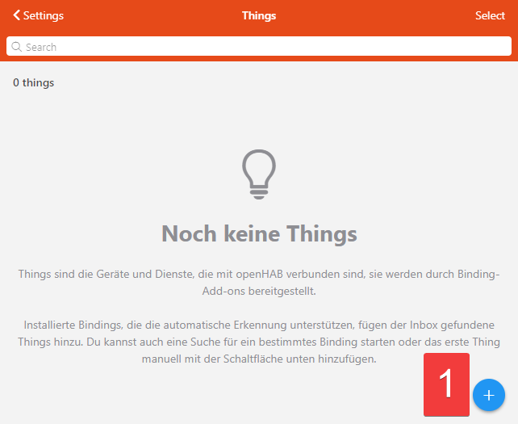
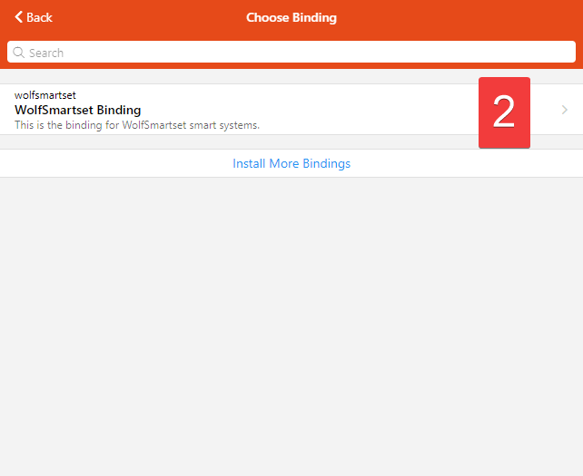
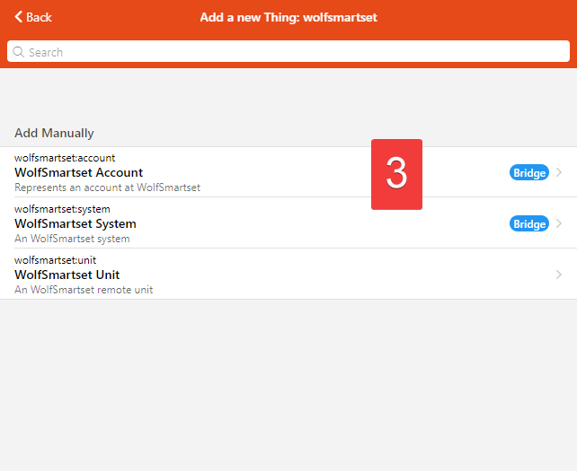
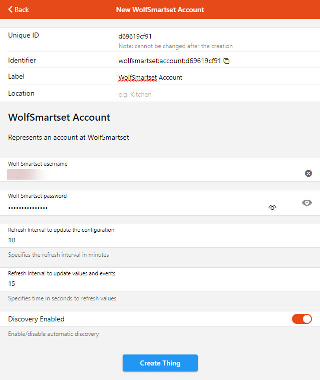
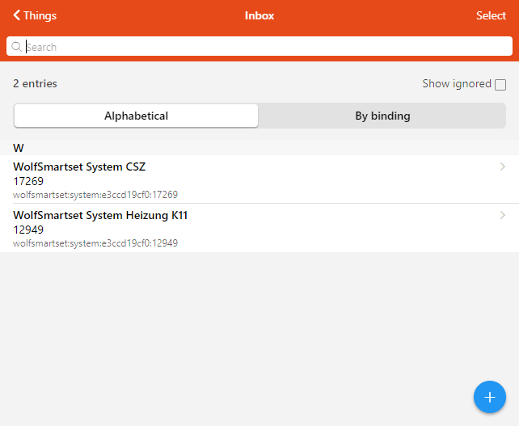
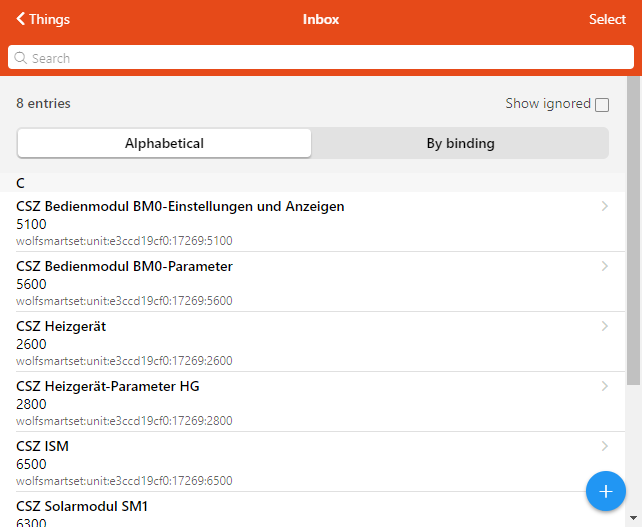
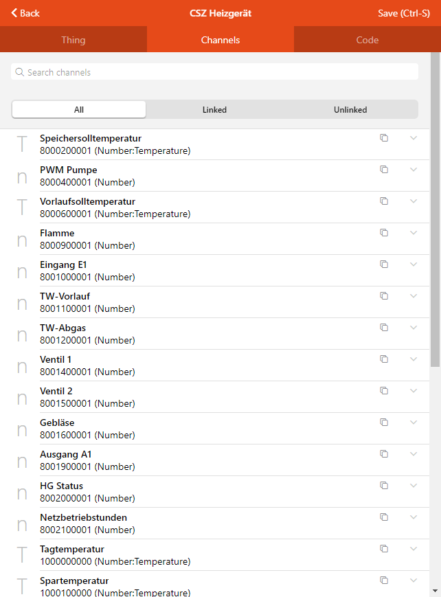

# Wolf Smartset Binding

This binding communicates with the www.wolf-smartset.de API and provides values readonly. 
Wolf systems are connected with official gateways (Wolf Link Home or Wolf Link Pro) https://www.wolf.eu/produkte/smarthome/ 

## Configuration via the UI

1. Manually add a thing
   
2. Select the WolfSmartset Binding
   
3. Select the WolfSmartset account
   
4. Enter account credentials and create the system thing
   
5. Wait until the the systems show up in the inbox. Select system from inbox and create thing.
   
5. Wait until the the units show up in the inbox. Select unit from inbox and create thing
   
6. Add points or equipment to your model
   
## Supported Things

- Account (bridge)
- System (bridge)
- Unit

## Thing configuration

### Account

| Parameter       | Type    | Defaut | Description                                                         |
|-----------------|---------|----------|---------------------------------------------------------------------|
| username | text | | username to authenticate to www.wolf-smartset.de |
| password | text  | | password to authenticate to www.wolf-smartset.de |
| refreshIntervalConfiguration | integer | 10 | Specifies the refresh interval to refresh the configuration in minutes |
| refreshIntervalValues | integer | 15 | Specifies time in seconds to refresh values |
| discoveryEnabled | boolean | true | disable the Thing discovery |

### System

| Parameter       | Type    | Defaut | Description                                                         |
|-----------------|---------|----------|---------------------------------------------------------------------|
| systemId | integer | | System ID assigned to the system by WolfSmartset webiste |

### Unit

| Parameter       | Type    | Defaut | Description                                                         |
|-----------------|---------|----------|---------------------------------------------------------------------|
| unitId | integer | | The BundleId assigned to the unit by WolfSmartset webiste |

## Tested WOLF-Devices

| WOLF Equipment    | openhab Version | Used gateway  |
|-------------------|-----------------|---------------|
| CSZ (CGB and SM1) | 3.1             | WOLF Link Pro |
| CGB-2             | 3.1             | WOLF Link home|

Note: Please update this table if you did a successfull test

## Supported Heating-Devices

All devices able to be connected to www.wolf-smartset.de

### Regarding documentation from WOLF
https://www.wolf.eu/fileadmin/Wolf_Daten/Dokumente/FAQ/3065655_201711.pdf

| Heating system                            | WOLF Link home        | WOLF Link pro      |
|-------------------------------------------|-----------------------|--------------------|
| Gas condensing boiler CGB-2, CGW-2, CGS-2 | :heavy_check_mark: | :heavy_check_mark: |
| Oil condensing boiler TOB | :heavy_check_mark: | :heavy_check_mark: |
| MGK-2 gas condensing boiler | :heavy_check_mark: | :heavy_check_mark: |
| split air/water heat pump BWL-1S | :heavy_check_mark: | :heavy_check_mark: |
| Oil condensing boiler COB | :heavy_check_mark: |
| gas condensing boiler MGK | :heavy_check_mark: |
| Gas condensing boilers CGB, CGW, CGS, FGB | :heavy_check_mark: |
| Gas condensing boilers CGG-2, CGU-2 | :heavy_check_mark: |
| Boiler controls R2, R3, R21 | :heavy_check_mark: |
| Monobloc heat pumps BWW-1, BWL-1, BWS-1 | :heavy_check_mark: |
| mixer module MM, MM-2 | :black_square_button: | :heavy_check_mark: |
| cascade module KM, KM-2 | :black_square_button: | :heavy_check_mark: |
| solar modules SM1, SM1-2, SM-2, SM2-2 | :black_square_button: | :heavy_check_mark: |
| Comfort apartment ventilation CWL Excellent | :black_square_button: | :heavy_check_mark: |
| air handling units KG Top, CKL Pool* | :heavy_check_mark: |
| Air handling units CKL, CFL, CRL* | :heavy_check_mark: |
| Combined heat and power units | | :heavy_check_mark: |


Note: 

:black_square_button: possible in connection with a WOLF Link home compatible heater,
full functionality only for devices with current software version.

``` * ``Modbus interface required in the device,
Special programming cannot be mapped.

