# WorxLandroid Binding

This binding connects openHAB with your WorxLandroid Mower using the API and MQTT.

# Table of contents

 1. [Disclaimer](https://github.com/nibi79/worxlandroid/tree/master#disclaimer)
 2. [Installation and upgrade](https://github.com/nibi79/worxlandroid/tree/master#installation-and-upgrade)
 3. [Supported Things](https://github.com/nibi79/worxlandroid/tree/master#supported-things)
 4. [Discovery](https://github.com/nibi79/worxlandroid/tree/master#discovery)
 5. [Binding Configuration](https://github.com/nibi79/worxlandroid/tree/master#binding-configuration)
 6. [Properties](https://github.com/nibi79/worxlandroid/tree/master#properties)
 7. [Channels](https://github.com/nibi79/worxlandroid/tree/master#channels)
 8. [File based configuration](https://github.com/nibi79/worxlandroid/tree/master#file-based-configuration)
 9. [Iconset](https://github.com/nibi79/worxlandroid/tree/master#iconset)
10. [Support](https://github.com/nibi79/worxlandroid/tree/master#support)

***

## Disclaimer

This binding is currently under development. Your help and testing would be greatly appreciated but there is no stability or functionality warranty.

## Installation and upgrade

For the first installation of the binding you need to copy the [latest release](https://github.com/nibi79/worxlandroid/releases)  into the /addons folder of your openHAB installation. In case you want to upgrade the binding to a newer version, please check the release notes first.

## Supported Things

Currently following Things are supported:

- **WorxLandroid Bridge** Thing representing the handler for Worx API
- One or many Things for supported **WorxLandroid Mower**

## Discovery

Bridge Configuration can be achieved via PaperUI - Configuration - Things - Add Thing “+” Button - WorxLandroid Binding - Add manually - **Bridge Worx Landroid API**. Here you can provide your credentials for your WorxLandroid account. Once the bridge has been added **Worx Landroid Mower**s will be discovered automatically and appear in your PaperUI inbox. You just need to add them as new things.

For textual configuration go to [File based configuration](https://github.com/nibi79/worxlandroid/tree/master#file-based-configuration)

## Binding Configuration

Following options can be set for the **Bridge Worx Landroid API**:

| Property          | Description                                                                                                                               |
|-------------------|-------------------------------------------------------------------------------------------------------------------------------------------|
| username          | Username to access the WorxLandroid API.                                                                                                  |
| password          | Password to access the WorxLandroid API.                                                                                                  |


Following options can be set for the **WorxLandroid Mower**:

| Property              | Description                                                                                            |
|-----------------------|--------------------------------------------------------------------------------------------------------|
| serialNumber          | Serial Number of the mower                                                                             |
| refreshStatusInterval | Interval for refreshing mower status (ONLINE/OFFLINE) and channel 'common#online' in seconds (min="30")|
| pollingInterval       | Interval for polling in seconds (min="30" max="7200").                                                 |


In order to prevent a 24h ban from worx, the following recommended settings seem to work:
| Property              | Value |
|-----------------------|-------|
| refreshStatusInterval |  1200 |
| pollingInterval       |  3600 |
| reconnectInterval     |     0 |

Lower polling and refresh values will likely result in a 24h ban for your account.


## Properties

The binding retrieves properties from the API. To view the properties open the thing in PaperUI and click on 'SHOW PROPERTIES':

Bridge:
<br>
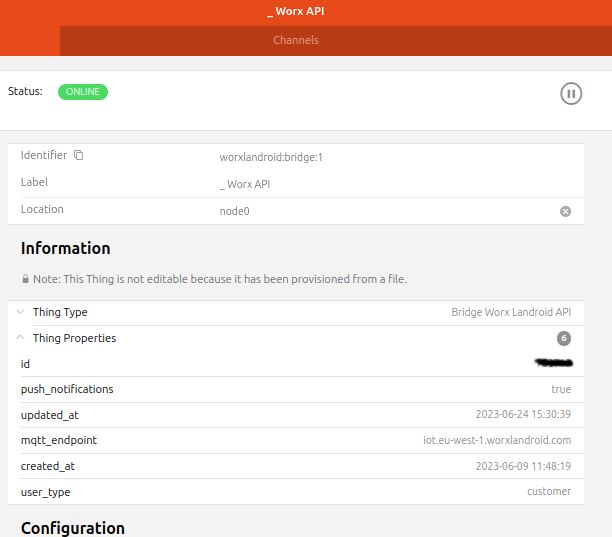

Mower:
<br>
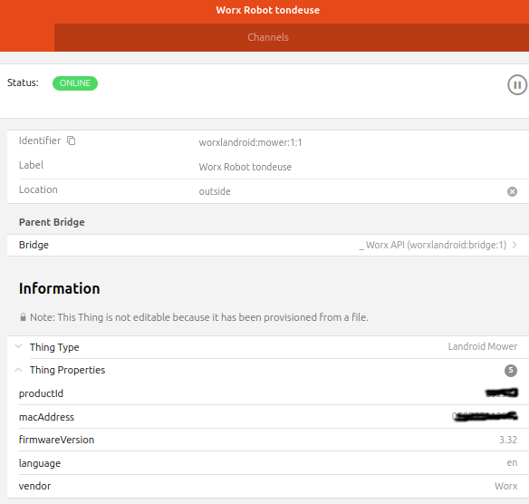

## Channels

Currently following **Channels** are supported on the **Worx Landroid Mower**:

##### common

| Channel   | Type | ChannelName | Values |
|------------|-----------|-----------|-----------|
| online      | `Switch` | common#online | |
| lastUpdateOnlineStatus | `DateTime` | common#lastUpdateOnlineStatus | |
| enable | `Switch` | common#enable | |
| action | `String` | common#action | START, STOP, HOME |
| lock | `Switch` | common#lock | |

##### AWS

| Channel   | Type       | ChannelName   |
|-----------|---- -------|---------------|
| poll      | `Switch` | aws#poll      |
| connected | `Switch` | aws#connected |

##### cfgCommon

| Channel   | Type | ChannelName |
|------------|-----------|-----------|
| id      | `Switch` | cfgCommon#id |
| serialNumber | `String` | cfgCommon#serialNumber |
| language | `String` | cfgCommon#language |
| lastUpdate | `DateTime` | cfgCommon#lastUpdate |
| command | `Number` | cfgCommon#command |
| rainDelay | `Number` | cfgCommon#rainDelay |

##### datCommon

| Channel   | Type | ChannelName |
|------------|-----------|-----------|
| macAdress | `String` | datCommon#macAdress |
| firmware | `Number` | datCommon#firmware |
| wifiQuality | `Number` | datCommon#wifiQuality |
| status-code | `Number` | datCommon#status-code |
| status-description | `String` | datCommon#status-description |
| error-code | `Number` | datCommon#error-code |
| error-description | `String` | datCommon#error-description |
| last-zone | `Number` | datCommon#last-zone |

##### datBattery

| Channel   | Type | ChannelName | |
|------------|-----------|-----------|-----------|
| batteryTemperature | `Number` | datBattery#batteryTemperature | |
| batteryVoltage | `Number` | datBattery#batteryVoltage | |
| batteryLevel | `Number` | datBattery#batteryLevel | |
| batteryChargeCycle | `Number` | datBattery#batteryChargeCycle | |
| batteryChargeCycleCurent | `Number` | datBattery#batteryChargeCycleCurrent | cycles since last reset |
| batteryCharging | `Switch` | datBattery#batteryCharging | |

##### datDmp

| Channel   | Type | ChannelName |
|------------|-----------|-----------|
| pitch | `Number` | datDmp#pitch |
| roll | `Number` | datDmp#roll |
| yaw | `Number` | datDmp#yaw |

##### datSt

| Channel   | Type | ChannelName ||
|------------|-----------|-----------|-----------------|
| totalBladeTime | `Number` | datSt#totalBladeTime | |
| currentBladeTime | `Number` | datSt#currentBladeTime | time since last reset |
| totalDistance | `Number` | datSt#totalDistance | |
| totalTime | `Number` | datSt#totalTime | |

##### datRain

| Channel   | Type | ChannelName | |
|------------|-----------|-----------|-----------------|
| state | `Switch` | datRain#state | ONLY IF SUPPORTED - property 'rain_delay_start' |
| counter | `Number` | datRain#counter | ONLY IF SUPPORTED - property 'rain_delay_start'|

##### cfgSc

| Channel   | Type | ChannelName | |
|------------|-----------|-----------|-----------|
| scheduleTimeExtension | `Number` | cfgSc#scheduleTimeExtension | |
| scheduleMode | `Number` | cfgSc#scheduleMode | ONLY IF SUPPORTED - property 'one_time_scheduler'|

##### cfgScSunday

| Channel   | Type | ChannelName |
|------------|-----------|-----------|
| enable | `Switch` | cfgScSunday#enable |
| scheduleStartHour | `Number` | cfgScSunday#schedule-start-hour |
| schedule-start-minutes | `Number` | cfgScSunday#schedule-start-minutes |
| schedule-duration | `Number` | cfgScSunday#schedule-duration |
| schedule-edgecut | `Number` | cfgScSunday#schedule-edgecut |

##### cfgScSunday Slot 2

| Channel   | Type | ChannelName | |
|------------|-----------|-----------|-----------|
| enable | `Switch` | cfgScSunday2#enable | ONLY IF SUPPORTED - property 'scheduler_two_slots'|
| scheduleStartHour | `Number` | cfgScSunday2#schedule-start-hour | ONLY IF SUPPORTED - property 'scheduler_two_slots'|
| schedule-start-minutes | `Number` | cfgScSunday2#schedule-start-minutes | ONLY IF SUPPORTED - property 'scheduler_two_slots'|
| scheduleDuration | `Number` | cfgScSunday2#schedule-duration | ONLY IF SUPPORTED - property 'scheduler_two_slots'|
| schedule-edgecut | `Number` | cfgScSunday2#schedule-edgecut | ONLY IF SUPPORTED - property 'scheduler_two_slots'|

##### cfgScMonday

| Channel   | Type | ChannelName |
|------------|-----------|-----------|
| enable | `Switch` | cfgScMonday#enable |
| scheduleStartHour | `Number` | cfgScMonday#schedule-start-hour |
| schedule-start-minutes | `Number` | cfgScMonday#schedule-start-minutes |
| schedule-duration | `Number` | cfgScMonday#scheduleDuration |
| schedule-edgecut | `Number` | cfgScMonday#schedule-edgecut |

##### cfgScMonday Slot 2

| Channel   | Type | ChannelName | |
|------------|-----------|-----------|-----------|
| enable | `Switch` | cfgScMonday2#enable | ONLY IF SUPPORTED - property 'scheduler_two_slots'|
| scheduleStartHour | `Number` | cfgScMonday2#schedule-start-hour | ONLY IF SUPPORTED - property 'scheduler_two_slots'|
| schedule-start-minutes | `Number` | cfgScMonday2#schedule-start-minutes | ONLY IF SUPPORTED - property 'scheduler_two_slots'|
| schedule-duration | `Number` | cfgScMonday2#schedule-duration | ONLY IF SUPPORTED - property 'scheduler_two_slots'|
| schedule-edgecut | `Number` | cfgScMonday2#schedule-edgecut | ONLY IF SUPPORTED - property 'scheduler_two_slots'|

##### cfgScTuesday

| Channel   | Type | ChannelName |
|------------|-----------|-----------|
| enable | `Switch` | cfgScTuesday#enable |
| scheduleStartHour | `Number` | cfgScTuesday#schedule-start-hour |
| schedule-start-minutes | `Number` | cfgScTuesday#schedule-start-minutes |
| schedule-duration | `Number` | cfgScTuesday#schedule-duration |
| schedule-edgecut | `Number` | cfgScTuesday#schedule-edgecut |

##### cfgScTuesday Slot 2

| Channel   | Type | ChannelName | |
|------------|-----------|-----------|-----------|
| enable | `Switch` | cfgScTuesday2#enable | ONLY IF SUPPORTED - property 'scheduler_two_slots'|
| scheduleStartHour | `Number` | cfgScTuesday2#schedule-start-hour | ONLY IF SUPPORTED - property 'scheduler_two_slots'|
| schedule-start-minutes | `Number` | cfgScTuesday2#schedule-start-minutes | ONLY IF SUPPORTED - property 'scheduler_two_slots'|
| schedule-duration | `Number` | cfgScTuesday2#schedule-duration | ONLY IF SUPPORTED - property 'scheduler_two_slots'|
| schedule-edgecut | `Number` | cfgScTuesday2#schedule-edgecut | ONLY IF SUPPORTED - property 'scheduler_two_slots'|

##### cfgScWednesday

| Channel   | Type | ChannelName |
|------------|-----------|-----------|
| enable | `Switch` | cfgScWednesday#enable |
| scheduleStartHour | `Number` | cfgScWednesday#schedule-start-hour |
| schedule-start-minutes | `Number` | cfgScWednesday#schedule-start-minutes |
| scheduleDuration | `Number` | cfgScWednesday#scheduleDuration |
| schedule-edgecut | `Number` | cfgScWednesday#schedule-edgecut |

##### cfgScWednesday Slot 2

| Channel   | Type | ChannelName | |
|------------|-----------|-----------|-----------|
| enable | `Switch` | cfgScWednesday2#enable | ONLY IF SUPPORTED - property 'scheduler_two_slots'|
| scheduleStartHour | `Number` | cfgScWednesday2#schedule-start-hour | ONLY IF SUPPORTED - property 'scheduler_two_slots'|
| schedule-start-minutes | `Number` | cfgScWednesday2#schedule-start-minutes | ONLY IF SUPPORTED - property 'scheduler_two_slots'|
| schedule-duration | `Number` | cfgScWednesday2#schedule-duration | ONLY IF SUPPORTED - property 'scheduler_two_slots'|
| schedule-edgecut | `Number` | cfgScWednesday2#schedule-edgecut | ONLY IF SUPPORTED - property 'scheduler_two_slots'|

##### cfgScThursday

| Channel   | Type | ChannelName |
|------------|-----------|-----------|
| enable | `Switch` | cfgScThursday#enable |
| scheduleStartHour | `Number` | cfgScThursday#schedule-start-hour |
| schedule-start-minutes | `Number` | cfgScThursday#schedule-start-minutes |
| schedule-duration | `Number` | cfgScThursday#schedule-duration |
| schedule-edgecut | `Number` | cfgScThursday#schedule-edgecut |

##### cfgScThursday Slot 2

| Channel   | Type | ChannelName | |
|------------|-----------|-----------|-----------|
| enable | `Switch` | cfgScThursday2#enable | ONLY IF SUPPORTED - property 'scheduler_two_slots'|
| scheduleStartHour | `Number` | cfgScThursday2#schedule-start-hour | ONLY IF SUPPORTED - property 'scheduler_two_slots'|
| schedule-start-minutes | `Number` | cfgScThursday2#schedule-start-minutes | ONLY IF SUPPORTED - property 'scheduler_two_slots'|
| schedule-duration | `Number` | cfgScThursday2#schedule-duration | ONLY IF SUPPORTED - property 'scheduler_two_slots'|
| schedule-edgecut | `Number` | cfgScThursday2#schedule-edgecut | ONLY IF SUPPORTED - property 'scheduler_two_slots'|

##### cfgScFriday

| Channel   | Type | ChannelName |
|------------|-----------|-----------|
| enable | `Switch` | cfgScFriday#enable |
| scheduleStartHour | `Number` | cfgScFriday#schedule-start-hour |
| schedule-start-minutes | `Number` | cfgScFriday#schedule-start-minutes |
| schedule-duration | `Number` | cfgScFriday#schedule-duration |
| schedule-edgecut | `Number` | cfgScFriday#schedule-edgecut |

##### cfgScFriday Slot 2

| Channel   | Type | ChannelName | |
|------------|-----------|-----------|-----------|
| enable | `Switch` | cfgScFriday2#enable | ONLY IF SUPPORTED - property 'scheduler_two_slots'|
| scheduleStartHour | `Number` | cfgScFriday2#schedule-start-hour | ONLY IF SUPPORTED - property 'scheduler_two_slots'|
| schedule-start-minutes | `Number` | cfgScFriday2#schedule-start-minutes | ONLY IF SUPPORTED - property 'scheduler_two_slots'|
| schedule-duration | `Number` | cfgScFriday2#schedule-duration | ONLY IF SUPPORTED - property 'scheduler_two_slots'|
| schedule-edgecut | `Number` | cfgScFriday2#schedule-edgecut | ONLY IF SUPPORTED - property 'scheduler_two_slots'|

##### cfgScSaturday

| Channel   | Type | ChannelName |
|------------|-----------|-----------|
| enable | `Switch` | cfgScSaturday#enable |
| scheduleStartHour | `Number` | cfgScSaturday#schedule-start-hour |
| schedule-start-minutes | `Number` | cfgScSaturday#schedule-start-minutes |
| schedule-duration | `Number` | cfgScSaturday#schedule-duration |
| schedule-edgecut | `Number` | cfgScSaturday#schedule-edgecut |

##### cfgScSaturday Slot 2

| Channel   | Type | ChannelName | |
|------------|-----------|-----------|-----------|
| enable | `Switch` | cfgScSaturday2#enable | ONLY IF SUPPORTED - property 'scheduler_two_slots'|
| scheduleStartHour | `Number` | cfgScSaturday2#schedule-start-hour | ONLY IF SUPPORTED - property 'scheduler_two_slots'|
| schedule-start-minutes | `Number` | cfgScSaturday2#schedule-start-minutes | ONLY IF SUPPORTED - property 'scheduler_two_slots'|
| schedule-duration | `Number` | cfgScSaturday2#schedule-duration | ONLY IF SUPPORTED - property 'scheduler_two_slots'|
| schedule-edgecut | `Number` | cfgScSaturday2#schedule-edgecut | ONLY IF SUPPORTED - property 'scheduler_two_slots'|

##### cfgMultiZones

If Multi Zones are supported, you are able to define 4 separate Zones and split working times by 10 to those.

| Channel   | Type | ChannelName |
|------------|-----------|-----------|
| enable | `Switch` | cfgMultiZones#enable |

To ease Zone Configuration, you are able to set distance in meters where a specific Zone starts. Bearing in mind that you roughly shall know how many meters of cable have been used (without buffer).

| Channel   | Type | ChannelName |
|------------|-----------|-----------|
| zone1Meter | `Number` | cfgMultiZones#zone1Meter |
| zone2Meter | `Number` | cfgMultiZones#zone2Meter |
| zone3Meter | `Number` | cfgMultiZones#zone3Meter |
| zone4Meter | `Number` | cfgMultiZones#zone4Meter |

As second step you are able to set time in percent and split in parts of 10 between zones,

| Channel   | Type | ChannelName |
|------------|-----------|-----------|
| allocation0 | `Number` | cfgMultiZones#allocation0 |
| allocation1 | `Number` | cfgMultiZones#allocation1 |
| allocation2 | `Number` | cfgMultiZones#allocation2 |
| allocation3 | `Number` | cfgMultiZones#allocation3 |
| allocation4 | `Number` | cfgMultiZones#allocation4 |
| allocation5 | `Number` | cfgMultiZones#allocation5 |
| allocation6 | `Number` | cfgMultiZones#allocation6 |
| allocation7 | `Number` | cfgMultiZones#allocation7 |
| allocation8 | `Number` | cfgMultiZones#allocation8 |
| allocation9 | `Number` | cfgMultiZones#allocation9 |

## File based configuration

You have to have Persistence Service configured in order to use statistic graphs
It's recommended to use rr4dj

### .persist

```
MowerBat_Chart*, MowerBatTemp_Chart*, MowerBatStatus_Chart* : strategy = everyMinute
```

### .things

```
Bridge worxlandroid:bridge:1 "_ Worx API" @ "node0" [
   username = "myEmailAddress",
   password = "myPassword"
] {
   mower 1 "Worx Mower Robot" @ "outside"    [pollingInterval= 3600, refreshStatusInterval=1200, serialNumber= "20223xxxxxB0"]
}
```

### .items

```
Group All
    Group Mower                    (All)
        Group MowerBat             (Mower)
        Group MowerStatus          (Mower)
        Group MowerSchedule        (Mower)
        Group MowerBat_Chart       (Mower)
        Group MowerBatTemp_Chart   (Mower)
        Group MowerBatStatus_Chart (Mower)


/* Chart Parameters */
Number Mower_Chart_Period         "Chart Period"

/* Landroid */
String Shaun                      "Shaun [%s]"
Switch LandroidEnable             "Mowing enabled"                          {channel="worxlandroid:mower:MyWorxBridge:mymower:common#enable"}

String LandroidAction             "Action []"             <movecontrol>     {channel="worxlandroid:mower:MyWorxBridge:mymower:common#action"}
String LandroidLastUpdate         "Last Update [%1$td.%1$tm.%1$ty / %1$tH:%1$tM:%1$tS]"    <calendar>        {channel="worxlandroid:mower:MyWorxBridge:mymower:cfgCommon#lastUpdate"}
Switch LandroidPoll               "Poll []"               <oh:worxlandroid:refresh>         {channel="worxlandroid:mower:MyWorxBridge:mymower:common#poll"}
Switch LandroidLock               "Lock"                  <oh:worxlandroid:lock>           {channel="worxlandroid:mower:MyWorxBridge:mymower:common#lock"}
String LandroidScheduleMode       "Schedule Mode []"      <party>           {channel="worxlandroid:mower:MyWorxBridge:mymower:cfgSc#scheduleMode"}

String LandroidMacAdress          "MAC [%s]"              <text>            {channel="worxlandroid:mower:MyWorxBridge:mymower:datCommon#macAdress"}
String LandroidSerialNumber       "Serial Number [%s]"    <text>            {channel="worxlandroid:mower:MyWorxBridge:mymower:cfgCommon#serialNumber"}
Number LandroidFirmware           "Firmware [v%s]"        <text>            {channel="worxlandroid:mower:MyWorxBridge:mymower:datCommon#firmware"}
Switch LandroidOnline             "Onlinestatus [%s]"     <network>         {channel="worxlandroid:mower:MyWorxBridge:mymower:common#online"}
Number LandroidId                 "Id []"                                   {channel="worxlandroid:mower:MyWorxBridge:mymower:cfgCommon#id"}

String LandroidLastUpdateOnlineStatus    "Last Update Online Status [%1$td.%1$tm.%1$ty / %1$tH:%1$tM:%1$tS]"    <calendar>        {channel="worxlandroid:mower:MyWorxBridge:mymower:common#lastUpdateOnlineStatus"}

// Multizone
Switch LandroidMultizoneEnable    "Multizone enable []"                            {channel="worxlandroid:mower:MyWorxBridge:mymower:cfgMultiZones#enable"}
Number LandroidLastZone           "Start Zone []"    <oh:worxlandroid:zones>    {channel="worxlandroid:mower:MyWorxBridge:mymower:datCommon#lastZone"}

// Zone Meters
Number LandroidMeterZone1         "Meters Zone 1 [%d]"    <oh:worxlandroid:distance>        {channel="worxlandroid:mower:MyWorxBridge:mymower:cfgMultiZones#zone1Meter"}
Number LandroidMeterZone2         "Meters Zone 2 [%d]"    <oh:worxlandroid:distance>        {channel="worxlandroid:mower:MyWorxBridge:mymower:cfgMultiZones#zone2Meter"}
Number LandroidMeterZone3         "Meters Zone 3 [%d]"    <oh:worxlandroid:distance>        {channel="worxlandroid:mower:MyWorxBridge:mymower:cfgMultiZones#zone3Meter"}
Number LandroidMeterZone4         "Meters Zone 4 [%d]"    <oh:worxlandroid:distance>        {channel="worxlandroid:mower:MyWorxBridge:mymower:cfgMultiZones#zone4Meter"}

// Allocation Zones
Number LandroidAllocation0        "Allocation 0 []"        <oh:worxlandroid:zones>        {channel="worxlandroid:mower:MyWorxBridge:mymower:cfgMultiZones#allocation0"}
Number LandroidAllocation1        "Allocation 1 []"        <oh:worxlandroid:zones>        {channel="worxlandroid:mower:MyWorxBridge:mymower:cfgMultiZones#allocation1"}
Number LandroidAllocation2        "Allocation 2 []"        <oh:worxlandroid:zones>        {channel="worxlandroid:mower:MyWorxBridge:mymower:cfgMultiZones#allocation2"}
Number LandroidAllocation3        "Allocation 3 []"        <oh:worxlandroid:zones>        {channel="worxlandroid:mower:MyWorxBridge:mymower:cfgMultiZones#allocation3"}
Number LandroidAllocation4        "Allocation 4 []"        <oh:worxlandroid:zones>        {channel="worxlandroid:mower:MyWorxBridge:mymower:cfgMultiZones#allocation4"}
Number LandroidAllocation5        "Allocation 5 []"        <oh:worxlandroid:zones>        {channel="worxlandroid:mower:MyWorxBridge:mymower:cfgMultiZones#allocation5"}
Number LandroidAllocation6        "Allocation 6 []"        <oh:worxlandroid:zones>        {channel="worxlandroid:mower:MyWorxBridge:mymower:cfgMultiZones#allocation6"}
Number LandroidAllocation7        "Allocation 7 []"        <oh:worxlandroid:zones>        {channel="worxlandroid:mower:MyWorxBridge:mymower:cfgMultiZones#allocation7"}
Number LandroidAllocation8        "Allocation 8 []"        <oh:worxlandroid:zones>        {channel="worxlandroid:mower:MyWorxBridge:mymower:cfgMultiZones#allocation8"}
Number LandroidAllocation9        "Allocation 9 []"        <oh:worxlandroid:zones>        {channel="worxlandroid:mower:MyWorxBridge:mymower:cfgMultiZones#allocation9"}

// Status
Number LandroidWifiQuality        "Wifi Quality [%d]"     <network>          {channel="worxlandroid:mower:MyWorxBridge:mymower:datCommon#wifiQuality"}
Switch LandroidBatteryCharging    "Battery charging [%s]" <lowbattery>       {channel="worxlandroid:mower:MyWorxBridge:mymower:datBattery#batteryCharging"}
Number LandroidStatusCode         "Status Code [%d]"      <oh:worxlandroid:lawnmower>        {channel="worxlandroid:mower:MyWorxBridge:mymower:datCommon#status-code"}
String LandroidStatusDescription  "[%s]"                  <oh:worxlandroid:lawnmower>        {channel="worxlandroid:mower:MyWorxBridge:mymower:datCommon#statusDescription"}
Number LandroidErrorCode          "Error Code [%d]"       <error>            {channel="worxlandroid:mower:MyWorxBridge:mymower:datCommon#error-code"}
String LandroidErrorDescription   "Error: [%s]"           <error>            {channel="worxlandroid:mower:MyWorxBridge:mymower:datCommon#errorDescription"}

// Rain
Switch          LandroidRainState                       "Rain State []"                   <rain>                  {channel="worxlandroid:mower:MyWorxBridge:mymower:datRain#state"}
Number          LandroidRainCounter                     "Rain Counter [%d]"                 <time>                  {channel="worxlandroid:mower:MyWorxBridge:mymower:datRain#counter"}

// Move
Number LandroidPitch              "Pitch [%s]"            <incline>          {channel="worxlandroid:mower:MyWorxBridge:mymower:datDmp#pitch"}
Number LandroidRoll               "Roll [%s]"             <incline>          {channel="worxlandroid:mower:MyWorxBridge:mymower:datDmp#roll"}
Number LandroidYaw                "Yaw [%s]"              <incline>          {channel="worxlandroid:mower:MyWorxBridge:mymower:datDmp#yaw"}

// Battery
Number LandroidBatteryLevel       "Battery Level [%d %%]"     <battery>            (MowerBat, MowerBatStatus_Chart)    {channel="worxlandroid:mower:MyWorxBridge:mymower:datBattery#batteryLevel"}
Number LandroidBatteryVoltage     "Battery Voltage [%.2f V]"  <battery>            (MowerBat, MowerBat_Chart)          {channel="worxlandroid:mower:MyWorxBridge:mymower:datBattery#batteryVoltage"}
Number LandroidBatteryTemperature "Battery Temperature [%.1f °C]" <temperature>    (MowerBat, MowerBatTemp_Chart)      {channel="worxlandroid:mower:MyWorxBridge:mymower:datBattery#batteryTemperature"}
Number LandroidBatteryChargeCycle "Battery ChargeCycle [%d]"  <battery>                                                {channel="worxlandroid:mower:MyWorxBridge:mymower:datBattery#batteryChargeCycle"}
Number LandroidBatteryChargeCycleCurrent "Battery ChargeCycle Current [%d]"  <battery>                                 {channel="worxlandroid:mower:MyWorxBridge:mymower:datBattery#batteryChargeCycleCurrent"}

// Settings
Number LandroidRainDelay             "Rain Delay [%d min]"              <rain>        {channel="worxlandroid:mower:MyWorxBridge:mymower:cfgCommon#rainDelay"}
Number LandroidScheduleTimeExtension "Schedule Time Extension [%d %%]"  <time>        {channel="worxlandroid:mower:MyWorxBridge:mymower:cfgSc#scheduleTimeExtension"}

// Statistics
Number LandroidTotalTime          "Total Time [JS(minstohours.js):%s]"           <time>        {channel="worxlandroid:mower:MyWorxBridge:mymower:datSt#totalTime"}
Number:Length LandroidTotalDistance    "Total Distance [%s m]"                   <chart>       {channel="worxlandroid:mower:MyWorxBridge:mymower:datSt#totalDistance"}
Number LandroidTotalBladeTime     "Total Bladetime [JS(minstohours.js):%s]"      <time>        {channel="worxlandroid:mower:MyWorxBridge:mymower:datSt#totalBladeTime"}
Number LandroidCurrentBladeTime   "Current Bladetime [JS(minstohours.js):%s]"    <time>        {channel="worxlandroid:mower:MyWorxBridge:mymower:datSt#currentBladeTime"}

//Schedule
// OneTime Schedule
Switch          LandroidOneTimeScheduleEdgecut          "OneTime Edgecut"           <flow>                          {channel="worxlandroid:mower:MyWorxBridge:mymower:cfgOneTimeSc#schedule-edgecut"}
Number          LandroidOneTimeScheduleDuration         "OneTime Duration"          <time>                          {channel="worxlandroid:mower:MyWorxBridge:mymower:cfgOneTimeSc#schedule-duration"}

// Monday
Switch          LandroidScheduleMondayEnable            "Monday: [MAP(landroid_schedule_enable.map):%s]" <time>             {channel="worxlandroid:mower:MyWorxBridge:mymower:cfgScMonday#enable"}
Number          LandroidScheduleMondayStartHour         "Start Hour [%d]"                   <time>                  {channel="worxlandroid:mower:MyWorxBridge:mymower:cfgScMonday#schedule-start-hour"}
Number          LandroidScheduleMondayStartMinutes      "Start Minutes [%d]"                <time>                  {channel="worxlandroid:mower:MyWorxBridge:mymower:cfgScMonday#schedule-start-minutes"}
Number          LandroidScheduleMondayDuration          "Duration [%d]"                     <time>                  {channel="worxlandroid:mower:MyWorxBridge:mymower:cfgScMonday#schedule-duration"}
Switch          LandroidScheduleMondayEdgecut           "Edgecut"                           <oh:worxlandroid:lawnmower>             {channel="worxlandroid:mower:MyWorxBridge:mymower:cfgScMonday#schedule-edgecut"}
// Monday 2
Switch          LandroidScheduleMonday2Enable            "Monday Slot2: [MAP(landroid_schedule_enable.map):%s]" <time>             {channel="worxlandroid:mower:MyWorxBridge:mymower:cfgScMonday2#enable"}
Number          LandroidScheduleMonday2StartHour         "Start Hour [%d]"                   <time>                  {channel="worxlandroid:mower:MyWorxBridge:mymower:cfgScMonday2#schedule-start-hour"}
Number          LandroidScheduleMonday2StartMinutes      "Start Minutes [%d]"                <time>                  {channel="worxlandroid:mower:MyWorxBridge:mymower:cfgScMonday2#schedule-start-minutes"}
Number          LandroidScheduleMonday2Duration          "Duration [%d]"                     <time>                  {channel="worxlandroid:mower:MyWorxBridge:mymower:cfgScMonday2#schedule-duration"}
Switch          LandroidScheduleMonday2Edgecut           "Edgecut"                           <oh:worxlandroid:lawnmower>             {channel="worxlandroid:mower:MyWorxBridge:mymower:cfgScMonday2#schedule-edgecut"}

// Tuesday
Switch          LandroidScheduleTuesdayEnable           "Tuesday: [MAP(landroid_schedule_enable.map):%s]" <time>             {channel="worxlandroid:mower:MyWorxBridge:mymower:cfgScTuesday#enable"}
Number          LandroidScheduleTuesdayStartHour        "Start Hour [%d]"                   <time>                  {channel="worxlandroid:mower:MyWorxBridge:mymower:cfgScTuesday#schedule-start-hour"}
Number          LandroidScheduleTuesdayStartMinutes     "Start Minutes [%d]"                <time>                  {channel="worxlandroid:mower:MyWorxBridge:mymower:cfgScTuesday#schedule-start-minutes"}
Number          LandroidScheduleTuesdayDuration         "Duration [%d]"                     <time>                  {channel="worxlandroid:mower:MyWorxBridge:mymower:cfgScTuesday#schedule-duration"}
Switch          LandroidScheduleTuesdayEdgecut          "Edgecut"                           <oh:worxlandroid:lawnmower>             {channel="worxlandroid:mower:MyWorxBridge:mymower:cfgScTuesday#schedule-edgecut"}
// Tuesday 2
Switch          LandroidScheduleTuesday2Enable           "Tuesday Slot2: [MAP(landroid_schedule_enable.map):%s]" <time>             {channel="worxlandroid:mower:MyWorxBridge:mymower:cfgScTuesday2#enable"}
Number          LandroidScheduleTuesday2StartHour        "Start Hour [%d]"                   <time>                  {channel="worxlandroid:mower:MyWorxBridge:mymower:cfgScTuesday2#schedule-start-hour"}
Number          LandroidScheduleTuesday2StartMinutes     "Start Minutes [%d]"                <time>                  {channel="worxlandroid:mower:MyWorxBridge:mymower:cfgScTuesday2#schedule-start-minutes"}
Number          LandroidScheduleTuesday2Duration         "Duration [%d]"                     <time>                  {channel="worxlandroid:mower:MyWorxBridge:mymower:cfgScTuesday2#schedule-duration"}
Switch          LandroidScheduleTuesday2Edgecut          "Edgecut"                           <oh:worxlandroid:lawnmower>             {channel="worxlandroid:mower:MyWorxBridge:mymower:cfgScTuesday2#schedule-edgecut"}

// Wednesday
Switch          LandroidScheduleWednesdayEnable         "Wednesday: [MAP(landroid_schedule_enable.map):%s]" <time>             {channel="worxlandroid:mower:MyWorxBridge:mymower:cfgScWednesday#enable"}
Number          LandroidScheduleWednesdayStartHour      "Start Hour [%d]"                   <time>                  {channel="worxlandroid:mower:MyWorxBridge:mymower:cfgScWednesday#schedule-start-hour"}
Number          LandroidScheduleWednesdayStartMinutes   "Start Minutes [%d]"                <time>                  {channel="worxlandroid:mower:MyWorxBridge:mymower:cfgScWednesday#schedule-start-minutes"}
Number          LandroidScheduleWednesdayDuration       "Duration [%d]"                     <time>                  {channel="worxlandroid:mower:MyWorxBridge:mymower:cfgScWednesday#schedule-duration"}
Switch          LandroidScheduleWednesdayEdgecut        "Edgecut"                           <oh:worxlandroid:lawnmower>             {channel="worxlandroid:mower:MyWorxBridge:mymower:cfgScWednesday#schedule-edgecut"}
// Wednesday 2
Switch          LandroidScheduleWednesday2Enable         "Wednesday Slot2: [MAP(landroid_schedule_enable.map):%s]" <time>             {channel="worxlandroid:mower:MyWorxBridge:mymower:cfgScWednesday2#enable"}
Number          LandroidScheduleWednesday2StartHour      "Start Hour [%d]"                   <time>                  {channel="worxlandroid:mower:MyWorxBridge:mymower:cfgScWednesday2#schedule-start-hour"}
Number          LandroidScheduleWednesday2StartMinutes   "Start Minutes [%d]"                <time>                  {channel="worxlandroid:mower:MyWorxBridge:mymower:cfgScWednesday2#schedule-start-minutes"}
Number          LandroidScheduleWednesday2Duration       "Duration [%d]"                     <time>                  {channel="worxlandroid:mower:MyWorxBridge:mymower:cfgScWednesday2#schedule-duration"}
Switch          LandroidScheduleWednesday2Edgecut        "Edgecut"                           <oh:worxlandroid:lawnmower>             {channel="worxlandroid:mower:MyWorxBridge:mymower:cfgScWednesday2#schedule-edgecut"}

// Thursday
Switch          LandroidScheduleThursdayEnable          "Thursday: [MAP(landroid_schedule_enable.map):%s]" <time>             {channel="worxlandroid:mower:MyWorxBridge:mymower:cfgScThursday#enable"}
Number          LandroidScheduleThursdayStartHour       "Start Hour [%d]"                   <time>                  {channel="worxlandroid:mower:MyWorxBridge:mymower:cfgScThursday#schedule-start-hour"}
Number          LandroidScheduleThursdayStartMinutes    "Start Minutes [%d]"                <time>                  {channel="worxlandroid:mower:MyWorxBridge:mymower:cfgScThursday#schedule-start-minutes"}
Number          LandroidScheduleThursdayDuration        "Duration [%d]"                     <time>                  {channel="worxlandroid:mower:MyWorxBridge:mymower:cfgScThursday#schedule-duration"}
Switch          LandroidScheduleThursdayEdgecut         "Edgecut"                           <oh:worxlandroid:lawnmower>             {channel="worxlandroid:mower:MyWorxBridge:mymower:cfgScThursday#schedule-edgecut"}
// Thursday 2
Switch          LandroidScheduleThursday2Enable          "Thursday Slot2: [MAP(landroid_schedule_enable.map):%s]" <time>             {channel="worxlandroid:mower:MyWorxBridge:mymower:cfgScThursday2#enable"}
Number          LandroidScheduleThursday2StartHour       "Start Hour [%d]"                   <time>                  {channel="worxlandroid:mower:MyWorxBridge:mymower:cfgScThursday2#schedule-start-hour"}
Number          LandroidScheduleThursday2StartMinutes    "Start Minutes [%d]"                <time>                  {channel="worxlandroid:mower:MyWorxBridge:mymower:cfgScThursday2#schedule-start-minutes"}
Number          LandroidScheduleThursday2Duration        "Duration [%d]"                     <time>                  {channel="worxlandroid:mower:MyWorxBridge:mymower:cfgScThursday2#schedule-duration"}
Switch          LandroidScheduleThursday2Edgecut         "Edgecut"                           <oh:worxlandroid:lawnmower>             {channel="worxlandroid:mower:MyWorxBridge:mymower:cfgScThursday2#schedule-edgecut"}

// Friday
Switch          LandroidScheduleFridayEnable            "Friday: [MAP(landroid_schedule_enable.map):%s]" <time>             {channel="worxlandroid:mower:MyWorxBridge:mymower:cfgScFriday#enable"}
Number          LandroidScheduleFridayStartHour         "Start Hour [%d]"                   <time>                  {channel="worxlandroid:mower:MyWorxBridge:mymower:cfgScFriday#schedule-start-hour"}
Number          LandroidScheduleFridayStartMinutes      "Start Minutes [%d]"                <time>                  {channel="worxlandroid:mower:MyWorxBridge:mymower:cfgScFriday#schedule-start-minutes"}
Number          LandroidScheduleFridayDuration          "Duration [%d]"                     <time>                  {channel="worxlandroid:mower:MyWorxBridge:mymower:cfgScFriday#schedule-duration"}
Switch          LandroidScheduleFridayEdgecut           "Edgecut"                           <oh:worxlandroid:lawnmower>             {channel="worxlandroid:mower:MyWorxBridge:mymower:cfgScFriday#schedule-edgecut"}
// Friday 2
Switch          LandroidScheduleFriday2Enable            "Friday Slot2: [MAP(landroid_schedule_enable.map):%s]" <time>             {channel="worxlandroid:mower:MyWorxBridge:mymower:cfgScFriday2#enable"}
Number          LandroidScheduleFriday2StartHour         "Start Hour [%d]"                   <time>                  {channel="worxlandroid:mower:MyWorxBridge:mymower:cfgScFriday2#schedule-start-hour"}
Number          LandroidScheduleFriday2StartMinutes      "Start Minutes [%d]"                <time>                  {channel="worxlandroid:mower:MyWorxBridge:mymower:cfgScFriday2#schedule-start-minutes"}
Number          LandroidScheduleFriday2Duration          "Duration [%d]"                     <time>                  {channel="worxlandroid:mower:MyWorxBridge:mymower:cfgScFriday2#schedule-duration"}
Switch          LandroidScheduleFriday2Edgecut           "Edgecut"                           <oh:worxlandroid:lawnmower>             {channel="worxlandroid:mower:MyWorxBridge:mymower:cfgScFriday2#schedule-edgecut"}

// Saturday
Switch          LandroidScheduleSaturdayEnable          "Saturday: [MAP(landroid_schedule_enable.map):%s]" <time>             {channel="worxlandroid:mower:MyWorxBridge:mymower:cfgScSaturday#enable"}
Number          LandroidScheduleSaturdayStartHour       "Start Hour [%d]"                   <time>                  {channel="worxlandroid:mower:MyWorxBridge:mymower:cfgScSaturday#schedule-start-hour"}
Number          LandroidScheduleSaturdayStartMinutes    "Start Minutes [%d]"                <time>                  {channel="worxlandroid:mower:MyWorxBridge:mymower:cfgScSaturday#schedule-start-minutes"}
Number          LandroidScheduleSaturdayDuration        "Duration [%d]"                     <time>                  {channel="worxlandroid:mower:MyWorxBridge:mymower:cfgScSaturday#schedule-duration"}
Switch          LandroidScheduleSaturdayEdgecut         "Edgecut"                           <oh:worxlandroid:lawnmower>             {channel="worxlandroid:mower:MyWorxBridge:mymower:cfgScSaturday#schedule-edgecut"}
// Saturday 2
Switch          LandroidScheduleSaturday2Enable          "Saturday Slot2: [MAP(landroid_schedule_enable.map):%s]" <time>             {channel="worxlandroid:mower:MyWorxBridge:mymower:cfgScSaturday2#enable"}
Number          LandroidScheduleSaturday2StartHour       "Start Hour [%d]"                   <time>                  {channel="worxlandroid:mower:MyWorxBridge:mymower:cfgScSaturday2#schedule-start-hour"}
Number          LandroidScheduleSaturday2StartMinutes    "Start Minutes [%d]"                <time>                  {channel="worxlandroid:mower:MyWorxBridge:mymower:cfgScSaturday2#schedule-start-minutes"}
Number          LandroidScheduleSaturday2Duration        "Duration [%d]"                     <time>                  {channel="worxlandroid:mower:MyWorxBridge:mymower:cfgScSaturday2#schedule-duration"}
Switch          LandroidScheduleSaturday2Edgecut         "Edgecut"                           <oh:worxlandroid:lawnmower>             {channel="worxlandroid:mower:MyWorxBridge:mymower:cfgScSaturday2#schedule-edgecut"}

// Sunday
Switch          LandroidScheduleSundayEnable            "Sunday: [MAP(landroid_schedule_enable.map):%s]" <time>             {channel="worxlandroid:mower:MyWorxBridge:mymower:cfgScSunday#enable"}
Number          LandroidScheduleSundayStartHour         "Start Hour [%d]"                   <time>                  {channel="worxlandroid:mower:MyWorxBridge:mymower:cfgScSunday#schedule-start-hour"}
Number          LandroidScheduleSundayStartMinutes      "Start Minutes [%d]"                <time>                  {channel="worxlandroid:mower:MyWorxBridge:mymower:cfgScSunday#schedule-start-minutes"}
Number          LandroidScheduleSundayDuration          "Duration [%d]"                     <time>                  {channel="worxlandroid:mower:MyWorxBridge:mymower:cfgScSunday#schedule-duration"}
Switch          LandroidScheduleSundayEdgecut           "Edgecut"                           <oh:worxlandroid:lawnmower>             {channel="worxlandroid:mower:MyWorxBridge:mymower:cfgScSunday#schedule-edgecut"}
// Sunday 2
Switch          LandroidScheduleSunday2Enable            "Sunday Slot2: [MAP(landroid_schedule_enable.map):%s]" <time>             {channel="worxlandroid:mower:MyWorxBridge:mymower:cfgScSunday2#enable"}
Number          LandroidScheduleSunday2StartHour         "Start Hour [%d]"                   <time>                  {channel="worxlandroid:mower:MyWorxBridge:mymower:cfgScSunday2#schedule-start-hour"}
Number          LandroidScheduleSunday2StartMinutes      "Start Minutes [%d]"                <time>                  {channel="worxlandroid:mower:MyWorxBridge:mymower:cfgScSunday2#schedule-start-minutes"}
Number          LandroidScheduleSunday2Duration          "Duration [%d]"                     <time>                  {channel="worxlandroid:mower:MyWorxBridge:mymower:cfgScSunday2#schedule-duration"}
Switch          LandroidScheduleSunday2Edgecut           "Edgecut"                           <oh:worxlandroid:lawnmower>             {channel="worxlandroid:mower:MyWorxBridge:mymower:cfgScSunday2#schedule-edgecut"}
```

### .sitemap

```
sitemap landroid label="Landroid"
{
    Group item=Shaun icon="landroid" {
        Frame item=LandroidStatusDescription {
            Switch item=LandroidAction label="Action" mappings=[START="Start"] visibility=[LandroidStatusCode==0, LandroidStatusCode==1]
            Switch item=LandroidAction label="Action" mappings=[START="Start",HOME="Home"] visibility=[LandroidStatusCode==34]
            Switch item=LandroidAction label="Action" mappings=[STOP="Stop",HOME="Home"] visibility=[LandroidStatusCode==6, LandroidStatusCode==7, LandroidStatusCode==33, LandroidStatusCode==32]
            Switch item=LandroidAction label="Action" mappings=[STOP="Stop"] visibility=[LandroidStatusCode==5,LandroidStatusCode==30]
            Switch item=LandroidLastZone mappings=[0="Zone 1", 1="Zone 2", 2="Zone 3", 3="Zone 4"] visibility=[LandroidStatusCode==1]
            Switch item=LandroidOneTimeScheduleEdgecut mappings=[ON="Start Edgecut"] visibility=[LandroidStatusCode==0, LandroidStatusCode==1]
            Slider item=LandroidOneTimeScheduleDuration minValue=0 maxValue=300 step=30 visibility=[LandroidStatusCode==0, LandroidStatusCode==1]
            Switch item=LandroidEnable
            Switch item=LandroidScheduleMode mappings=[1="Normal", 2="Party"]
            Text label="Orientation" icon="compass" visibility=[LandroidStatusCode!="1"] {
                Text item=LandroidPitch
                Text item=LandroidRoll
                Text item=LandroidYaw
            }
            Text label="Settings" icon="settings" {
                Slider item=LandroidScheduleTimeExtension minValue=-100 maxValue=100 step=10
                Slider item=LandroidRainDelay minValue=0 maxValue=750 step=30
               Text label="Schedule" icon="time"{
                    Frame label="Schedule Monday" {
                        Switch item=LandroidScheduleMondayEnable
                        Switch item=LandroidScheduleMondayEdgecut visibility=[LandroidScheduleMondayEnable==ON]
                        Slider item=LandroidScheduleMondayStartHour minValue=0 maxValue=23 step=1 visibility=[LandroidScheduleMondayEnable==ON]
                        Slider item=LandroidScheduleMondayStartMinutes minValue=0 maxValue=45 step=15 visibility=[LandroidScheduleMondayEnable==ON]
                        Slider item=LandroidScheduleMondayDuration minValue=0 maxValue=1425 step=15 visibility=[LandroidScheduleMondayEnable==ON]
                    }
                    Frame label="Schedule Monday Slot 2" {
                        Switch item=LandroidScheduleMonday2Enable
                        Switch item=LandroidScheduleMonday2Edgecut visibility=[LandroidScheduleMonday2Enable==ON]
                        Slider item=LandroidScheduleMonday2StartHour minValue=0 maxValue=23 step=1 visibility=[LandroidScheduleMonday2Enable==ON]
                        Slider item=LandroidScheduleMonday2StartMinutes minValue=0 maxValue=45 step=15 visibility=[LandroidScheduleMonday2Enable==ON]
                        Slider item=LandroidScheduleMonday2Duration minValue=0 maxValue=1425 step=15 visibility=[LandroidScheduleMonday2Enable==ON]
                    }
                    Frame label="Schedule Tuesday" {
                        Switch item=LandroidScheduleTuesdayEnable
                        Switch item=LandroidScheduleTuesdayEdgecut visibility=[LandroidScheduleTuesdayEnable==ON]
                        Slider item=LandroidScheduleTuesdayStartHour minValue=0 maxValue=23 step=1 visibility=[LandroidScheduleTuesdayEnable==ON]
                        Slider item=LandroidScheduleTuesdayStartMinutes minValue=0 maxValue=45 step=15 visibility=[LandroidScheduleTuesdayEnable==ON]
                        Slider item=LandroidScheduleTuesdayDuration minValue=0 maxValue=1425 step=15 visibility=[LandroidScheduleTuesdayEnable==ON]
                    }
                    Frame label="Schedule Tuesday Slot 2" {
                        Switch item=LandroidScheduleTuesday2Enable
                        Switch item=LandroidScheduleTuesday2Edgecut visibility=[LandroidScheduleTuesday2Enable==ON]
                        Slider item=LandroidScheduleTuesday2StartHour minValue=0 maxValue=23 step=1 visibility=[LandroidScheduleTuesday2Enable==ON]
                        Slider item=LandroidScheduleTuesday2StartMinutes minValue=0 maxValue=45 step=15 visibility=[LandroidScheduleTuesday2Enable==ON]
                        Slider item=LandroidScheduleTuesday2Duration minValue=0 maxValue=1425 step=15 visibility=[LandroidScheduleTuesday2Enable==ON]
                    }
                    Frame label="Schedule Wednesday" {
                        Switch item=LandroidScheduleWednesdayEnable
                        Switch item=LandroidScheduleWednesdayEdgecut visibility=[LandroidScheduleWednesdayEnable==ON]
                        Slider item=LandroidScheduleWednesdayStartHour minValue=0 maxValue=23 step=1 visibility=[LandroidScheduleWednesdayEnable==ON]
                        Slider item=LandroidScheduleWednesdayStartMinutes minValue=0 maxValue=45 step=15 visibility=[LandroidScheduleWednesdayEnable==ON]
                        Slider item=LandroidScheduleWednesdayDuration minValue=0 maxValue=1425 step=15 visibility=[LandroidScheduleWednesdayEnable==ON]
                    }
                    Frame label="Schedule Wednesday Slot 2" {
                        Switch item=LandroidScheduleWednesday2Enable
                        Switch item=LandroidScheduleWednesday2Edgecut visibility=[LandroidScheduleWednesday2Enable==ON]
                        Slider item=LandroidScheduleWednesday2StartHour minValue=0 maxValue=23 step=1 visibility=[LandroidScheduleWednesday2Enable==ON]
                        Slider item=LandroidScheduleWednesday2StartMinutes minValue=0 maxValue=45 step=15 visibility=[LandroidScheduleWednesday2Enable==ON]
                        Slider item=LandroidScheduleWednesday2Duration minValue=0 maxValue=1425 step=15 visibility=[LandroidScheduleWednesday2Enable==ON]
                    }
                    Frame label="Schedule Thursday" {
                        Switch item=LandroidScheduleThursdayEnable
                        Switch item=LandroidScheduleThursdayEdgecut visibility=[LandroidScheduleThursdayEnable==ON]
                        Slider item=LandroidScheduleThursdayStartHour minValue=0 maxValue=23 step=1 visibility=[LandroidScheduleThursdayEnable==ON]
                        Slider item=LandroidScheduleThursdayStartMinutes minValue=0 maxValue=45 step=15 visibility=[LandroidScheduleThursdayEnable==ON]
                        Slider item=LandroidScheduleThursdayDuration minValue=0 maxValue=1425 step=15 visibility=[LandroidScheduleThursdayEnable==ON]
                    }
                    Frame label="Schedule Thursday Slot 2" {
                        Switch item=LandroidScheduleThursday2Enable
                        Switch item=LandroidScheduleThursday2Edgecut visibility=[LandroidScheduleThursday2Enable==ON]
                        Slider item=LandroidScheduleThursday2StartHour minValue=0 maxValue=23 step=1 visibility=[LandroidScheduleThursday2Enable==ON]
                        Slider item=LandroidScheduleThursday2StartMinutes minValue=0 maxValue=45 step=15 visibility=[LandroidScheduleThursday2Enable==ON]
                        Slider item=LandroidScheduleThursday2Duration minValue=0 maxValue=1425 step=15 visibility=[LandroidScheduleThursday2Enable==ON]
                    }
                    Frame label="Schedule Friday" {
                        Switch item=LandroidScheduleFridayEnable
                        Switch item=LandroidScheduleFridayEdgecut visibility=[LandroidScheduleFridayEnable==ON]
                        Slider item=LandroidScheduleFridayStartHour minValue=0 maxValue=23 step=1 visibility=[LandroidScheduleFridayEnable==ON]
                        Slider item=LandroidScheduleFridayStartMinutes minValue=0 maxValue=45 step=15 visibility=[LandroidScheduleFridayEnable==ON]
                        Slider item=LandroidScheduleFridayDuration minValue=0 maxValue=1425 step=15 visibility=[LandroidScheduleFridayEnable==ON]
                    }
                    Frame label="Schedule Friday Slot 2" {
                        Switch item=LandroidScheduleFriday2Enable
                        Switch item=LandroidScheduleFriday2Edgecut visibility=[LandroidScheduleFriday2Enable==ON]
                        Slider item=LandroidScheduleFriday2StartHour minValue=0 maxValue=23 step=1 visibility=[LandroidScheduleFriday2Enable==ON]
                        Slider item=LandroidScheduleFriday2StartMinutes minValue=0 maxValue=45 step=15 visibility=[LandroidScheduleFriday2Enable==ON]
                        Slider item=LandroidScheduleFriday2Duration minValue=0 maxValue=1425 step=15 visibility=[LandroidScheduleFriday2Enable==ON]
                    }
                    Frame label="Schedule Saturday" {
                        Switch item=LandroidScheduleSaturdayEnable
                        Switch item=LandroidScheduleSaturdayEdgecut visibility=[LandroidScheduleSaturdayEnable==ON]
                        Slider item=LandroidScheduleSaturdayStartHour minValue=0 maxValue=23 step=1 visibility=[LandroidScheduleSaturdayEnable==ON]
                        Slider item=LandroidScheduleSaturdayStartMinutes minValue=0 maxValue=45 step=15 visibility=[LandroidScheduleSaturdayEnable==ON]
                        Slider item=LandroidScheduleSaturdayDuration minValue=0 maxValue=1425 step=15 visibility=[LandroidScheduleSaturdayEnable==ON]
                    }
                    Frame label="Schedule Saturday Slot 2" {
                        Switch item=LandroidScheduleSaturday2Enable
                        Switch item=LandroidScheduleSaturday2Edgecut visibility=[LandroidScheduleSaturday2Enable==ON]
                        Slider item=LandroidScheduleSaturday2StartHour minValue=0 maxValue=23 step=1 visibility=[LandroidScheduleSaturday2Enable==ON]
                        Slider item=LandroidScheduleSaturday2StartMinutes minValue=0 maxValue=45 step=15 visibility=[LandroidScheduleSaturday2Enable==ON]
                        Slider item=LandroidScheduleSaturday2Duration minValue=0 maxValue=1425 step=15 visibility=[LandroidScheduleSaturday2Enable==ON]
                    }
                    Frame label="Schedule Sunday" {
                        Switch item=LandroidScheduleSundayEnable
                        Switch item=LandroidScheduleSundayEdgecut visibility=[LandroidScheduleSundayEnable==ON]
                        Slider item=LandroidScheduleSundayStartHour minValue=0 maxValue=23 step=1 visibility=[LandroidScheduleSundayEnable==ON]
                        Slider item=LandroidScheduleSundayStartMinutes minValue=0 maxValue=45 step=15 visibility=[LandroidScheduleSundayEnable==ON]
                        Slider item=LandroidScheduleSundayDuration minValue=0 maxValue=1425 step=15 visibility=[LandroidScheduleSundayEnable==ON]
                    }
                    Frame label="Schedule Sunday Slot 2" {
                        Switch item=LandroidScheduleSunday2Enable
                        Switch item=LandroidScheduleSunday2Edgecut visibility=[LandroidScheduleSunday2Enable==ON]
                        Slider item=LandroidScheduleSunday2StartHour minValue=0 maxValue=23 step=1 visibility=[LandroidScheduleSunday2Enable==ON]
                        Slider item=LandroidScheduleSunday2StartMinutes minValue=0 maxValue=45 step=15 visibility=[LandroidScheduleSunday2Enable==ON]
                        Slider item=LandroidScheduleSunday2Duration minValue=0 maxValue=1425 step=15 visibility=[LandroidScheduleSunday2Enable==ON]
                    }
                }
                Text label="MultiZone" icon="zones" {
                    Frame label="Zone Meters" {
                        Switch item=LandroidMultizoneEnable
                        Slider item=LandroidMeterZone1 minValue=0 maxValue=120 visibility=[LandroidMultizoneEnable==ON]
                        Slider item=LandroidMeterZone2 minValue=0 maxValue=120 visibility=[LandroidMultizoneEnable==ON]
                        Slider item=LandroidMeterZone3 minValue=0 maxValue=120 visibility=[LandroidMultizoneEnable==ON]
                        Slider item=LandroidMeterZone4 minValue=0 maxValue=120 visibility=[LandroidMultizoneEnable==ON]
                    }
                    Frame label="Allocation Zones" visibility=[LandroidMultizoneEnable==ON] {
                        Switch item=LandroidAllocation0 mappings=[0="Zone 1", 1="Zone 2", 2="Zone 3", 3="Zone 4"]
                        Switch item=LandroidAllocation1 mappings=[0="Zone 1", 1="Zone 2", 2="Zone 3", 3="Zone 4"]
                        Switch item=LandroidAllocation2 mappings=[0="Zone 1", 1="Zone 2", 2="Zone 3", 3="Zone 4"]
                        Switch item=LandroidAllocation3 mappings=[0="Zone 1", 1="Zone 2", 2="Zone 3", 3="Zone 4"]
                        Switch item=LandroidAllocation4 mappings=[0="Zone 1", 1="Zone 2", 2="Zone 3", 3="Zone 4"]
                        Switch item=LandroidAllocation5 mappings=[0="Zone 1", 1="Zone 2", 2="Zone 3", 3="Zone 4"]
                        Switch item=LandroidAllocation6 mappings=[0="Zone 1", 1="Zone 2", 2="Zone 3", 3="Zone 4"]
                        Switch item=LandroidAllocation7 mappings=[0="Zone 1", 1="Zone 2", 2="Zone 3", 3="Zone 4"]
                        Switch item=LandroidAllocation8 mappings=[0="Zone 1", 1="Zone 2", 2="Zone 3", 3="Zone 4"]
                        Switch item=LandroidAllocation9 mappings=[0="Zone 1", 1="Zone 2", 2="Zone 3", 3="Zone 4"]
                    }
                }
            }
        }
        Frame label="Status" {
            Text item=LandroidLastUpdate
            Switch item=LandroidPoll label="Refresh" mappings=[ON="Poll"]
            Text item=LandroidOnline
            Text item=LandroidWifiQuality
            Text item=LandroidStatusDescription
            Text item=LandroidErrorDescription visibility=[LandroidErrorCode!=0]
            Switch item=LandroidRainState visibility=[LandroidRainCounter!=0]
            Text item=LandroidRainCounter visibility=[LandroidRainCounter!=0]
            Text label="Device Information" icon="landroid" {
                Switch item=LandroidLock label="Lock" mappings=[ON="LOCK",OFF="UNLOCK"]
                Text item=LandroidLastUpdateOnlineStatus
                Text item=LandroidSerialNumber
                Text item=LandroidMacAdress
                Text item=LandroidFirmware
            }
            Text item=LandroidBatteryLevel {
                Text item=LandroidBatteryCharging
                Text item=LandroidBatteryVoltage
                Text item=LandroidBatteryTemperature
            }
            Text label="Statistics" icon="line"{
                Frame label="General" {
                    Text item=LandroidTotalTime
                    Text item=LandroidTotalDistance label="Total Distance [%.2f km]"
                    Text item=LandroidTotalBladeTime
                    Text item=LandroidCurrentBladeTime
                }
                Frame label="Battery" {
                    Text item=LandroidBatteryChargeCycle
                    Text item=LandroidBatteryChargeCycleCurrent
                    Switch item=Mower_Chart_Period label="Skalierung" mappings=[0="1H", 1="4H", 2="8H", 3="12H", 4="1D", 5="1W", 6="1M", 7="1Y"]
                    Chart item=MowerBatStatus_Chart period=h refresh=6000 legend=true visibility=[Mower_Chart_Period==0]
                    Chart item=MowerBatStatus_Chart period=4h refresh=30000 legend=true visibility=[Mower_Chart_Period==1]
                    Chart item=MowerBatStatus_Chart period=8h refresh=30000 legend=true visibility=[Mower_Chart_Period==2]
                    Chart item=MowerBatStatus_Chart period=12h refresh=30000 legend=true visibility=[Mower_Chart_Period==3, Mower_Chart_Period=="NULL", Mower_Chart_Period=="Uninitialized"]
                    Chart item=MowerBatStatus_Chart period=D refresh=30000 legend=true visibility=[Mower_Chart_Period==4]
                    Chart item=MowerBatStatus_Chart period=W refresh=30000 legend=true visibility=[Mower_Chart_Period==5]
                    Chart item=MowerBatStatus_Chart period=M refresh=30000 legend=true visibility=[Mower_Chart_Period==6]
                    Chart item=MowerBatStatus_Chart period=Y refresh=30000 legend=true visibility=[Mower_Chart_Period==7]

                    Chart item=MowerBat_Chart period=h refresh=6000 legend=true visibility=[Mower_Chart_Period==0]
                    Chart item=MowerBat_Chart period=4h refresh=30000 legend=true visibility=[Mower_Chart_Period==1]
                    Chart item=MowerBat_Chart period=8h refresh=30000 legend=true visibility=[Mower_Chart_Period==2]
                    Chart item=MowerBat_Chart period=12h refresh=30000 legend=true visibility=[Mower_Chart_Period==3, Mower_Chart_Period=="NULL", Mower_Chart_Period=="Uninitialized"]
                    Chart item=MowerBat_Chart period=D refresh=30000 legend=true visibility=[Mower_Chart_Period==4]
                    Chart item=MowerBat_Chart period=W refresh=30000 legend=true visibility=[Mower_Chart_Period==5]
                    Chart item=MowerBat_Chart period=M refresh=30000 legend=true visibility=[Mower_Chart_Period==6]
                    Chart item=MowerBat_Chart period=Y refresh=30000 legend=true visibility=[Mower_Chart_Period==7]

                    Chart item=MowerBatTemp_Chart period=h refresh=6000 legend=true visibility=[Mower_Chart_Period==0]
                    Chart item=MowerBatTemp_Chart period=4h refresh=30000 legend=true visibility=[Mower_Chart_Period==1]
                    Chart item=MowerBatTemp_Chart period=8h refresh=30000 legend=true visibility=[Mower_Chart_Period==2]
                    Chart item=MowerBatTemp_Chart period=12h refresh=30000 legend=true visibility=[Mower_Chart_Period==3, Mower_Chart_Period=="NULL", Mower_Chart_Period=="Uninitialized"]
                    Chart item=MowerBatTemp_Chart period=D refresh=30000 legend=true visibility=[Mower_Chart_Period==4]
                    Chart item=MowerBatTemp_Chart period=W refresh=30000 legend=true visibility=[Mower_Chart_Period==5]
                    Chart item=MowerBatTemp_Chart period=M refresh=30000 legend=true visibility=[Mower_Chart_Period==6]
                    Chart item=MowerBatTemp_Chart period=Y refresh=30000 legend=true visibility=[Mower_Chart_Period==7]
                }
            }
        }
    }
}
```

### Preview of above Sitemap


<br>
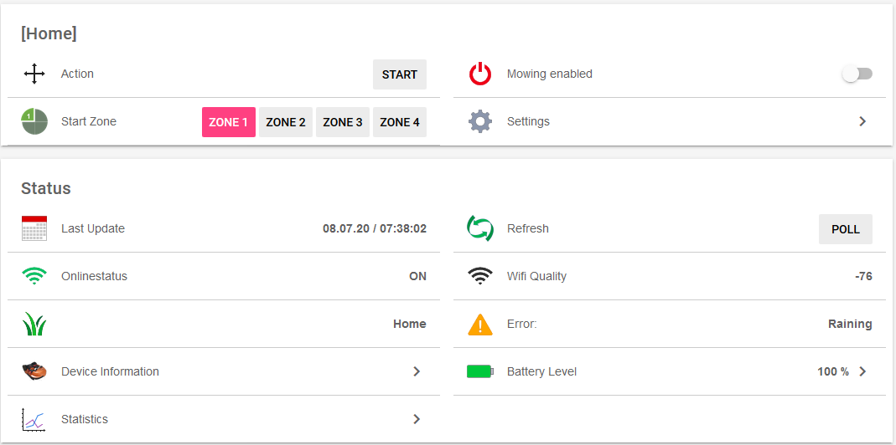

#### "Start Zone" will change to "Orientation" once Mower is underway

<br>
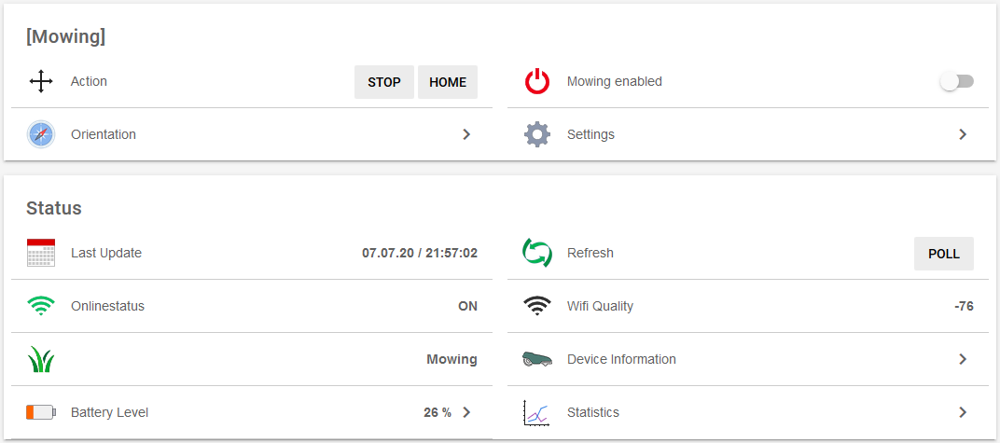
<br>
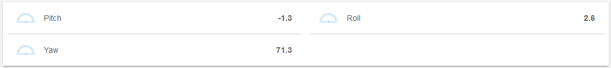
<br>
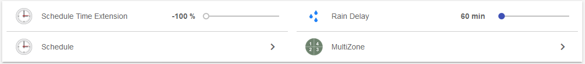
<br>
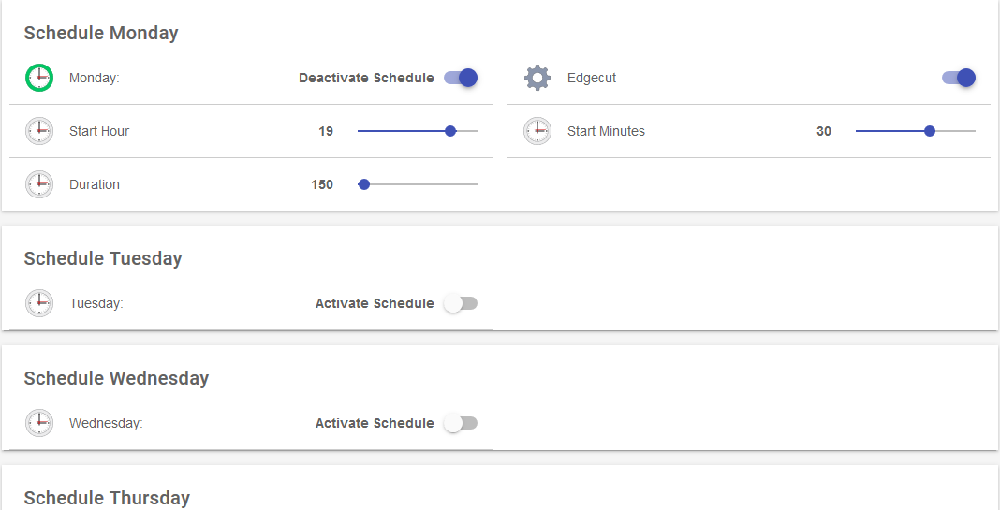
<br>
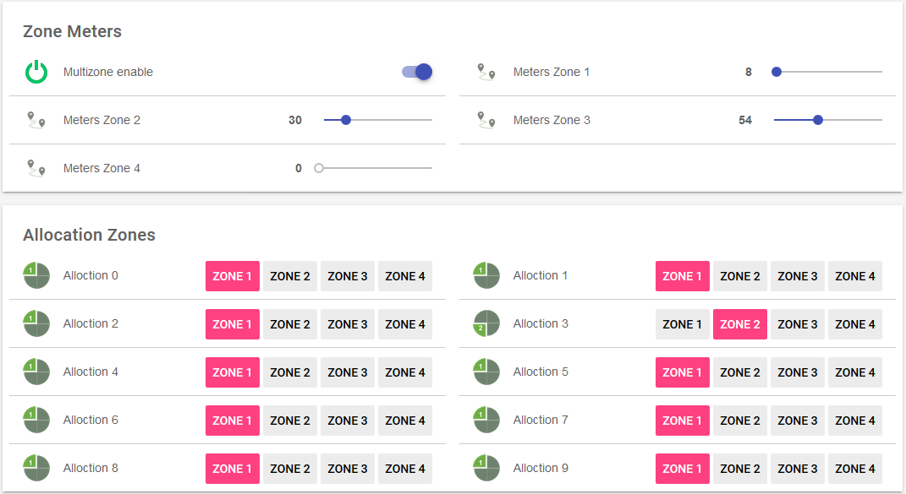
<br>
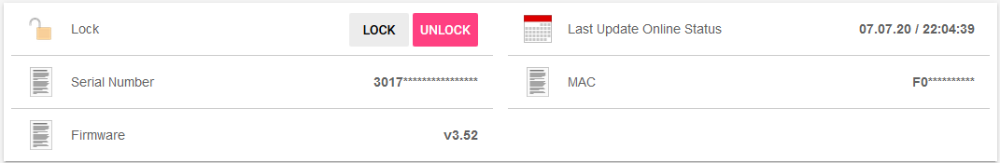
<br>
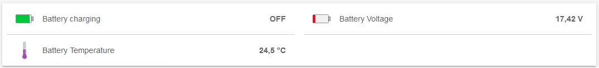
<br>
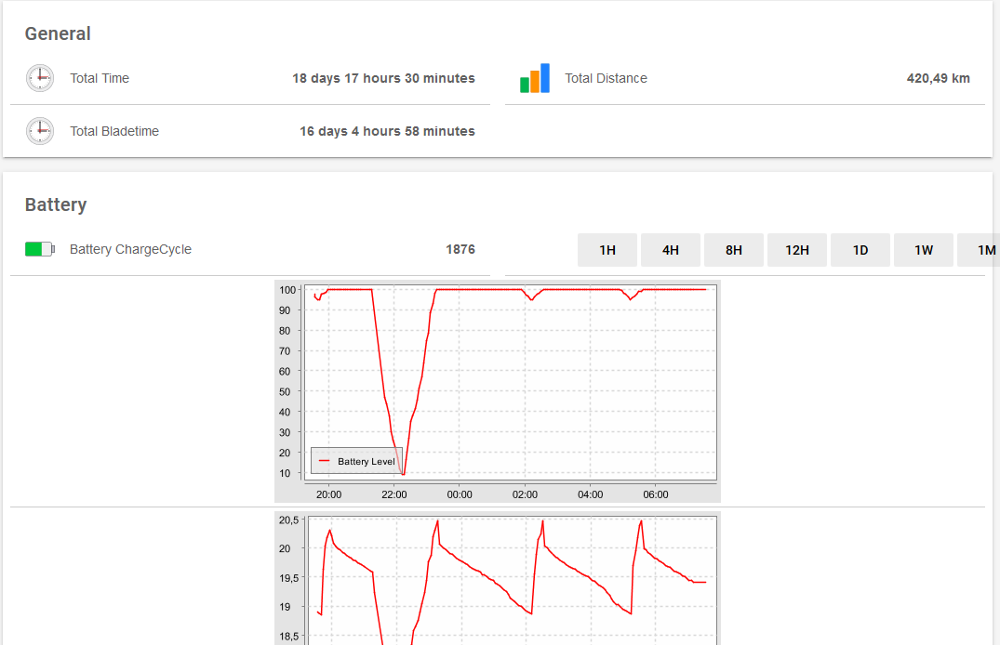

### .rules

Update Landroid Status to reflect in main menu

```
rule MowerStatus
when
  Item LandroidErrorCode changed or
  Item LandroidStatusCode changed
then
  if (LandroidErrorCode.state != 0) {
    Shaun.postUpdate(transform("MAP", "landroid_error_de.map", LandroidErrorCode.state.toString))
  } else {
    Shaun.postUpdate(transform("MAP", "landroid_status_de.map", LandroidStatusCode.state.toString))
  }
end
```

Rule "MowerStatusMonitor" requires configured pushNotification or adopt this to Mail Action

```
rule MowerStatusMonitor
when
    Item Mower_StatusCode changed
then
    if (LandroidStatusCode.state == 5 && previousState == 0) {
        pushNotification("Shaun: " + now, "Regenverzögerung ausgelöst")
    } else if (LandroidStatusCode.state == 0 && previousState == 5) {
        pushNotification("Shaun: " + now, "Regenverzögerung beendet")
    } else {
        pushNotification("Shaun: " + now, previousState + " changed to " + LandroidStatusCode.state)
    }
end
```

### .transform

Place the following *.map to your ..\conf\transform

1. [landroid_error_de.map](/openhab-conf/transform/landroid_error_de.map)
2. [landroid_status_de.map](/openhab-conf/transform/landroid_status_de.map)
3. [landroid_schedule_enable](/openhab-conf/transform/landroid_schedule_enable.map)
4. [minstohours.js](/openhab-conf/transform/minstohours.js)

## Iconset

Several Icons have been created in order to suit requirements for robo-mower. Please feel free to download from this repository and place/extract them into ..\conf\icons\classic

1. [Mower](/openhab-conf/icons/landroid.png)
2. [Distance](/openhab-conf/icons/distance.zip)
3. [Zones](/openhab-conf/icons/zones.zip)
4. [Refresh](/openhab-conf/icons/refresh.png)
5. [Lock](/openhab-conf/icons/mlock.zip)

## Support

If you encounter critical issues with this binding, please consider to:

- create an [issue](https://github.com/nibi79/worxlandroid/issues) on GitHub
- search [community forum](https://community.openhab.org/) for answers already given
- or make a new post there, if nothing was found

In any case please provide some information about your problem:

- openHAB and binding version
- error description and steps to retrace if applicable
- any related `[WARN]`/`[ERROR]` from openhab.log (`log:set DEBUG org.openhab.binding.worxlandroid`)
- whether it's the binding, bridge, device or channel related issue

For the sake of documentation please use English language.
