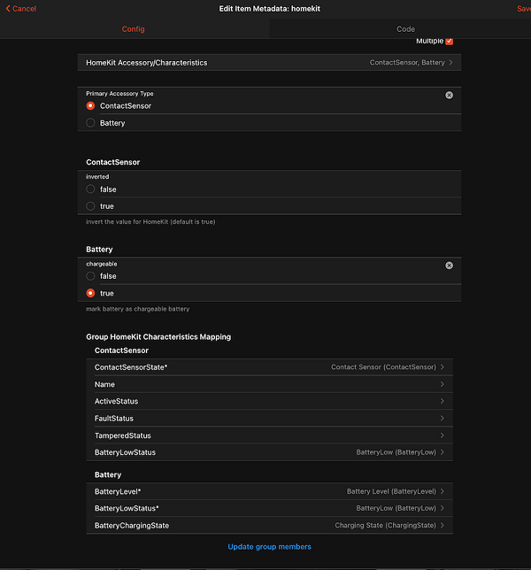
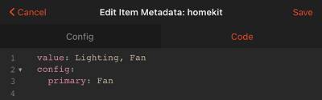
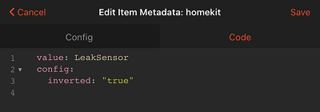

# HomeKit Add-on

This is an add-on that exposes your openHAB system as a bridge over the HomeKit protocol.

Using this add-on, you will be able to control your openHAB system using Apple's Siri, or any of a number of HomeKit enabled iOS apps.
In order to do so, you will need to make some configuration changes.
HomeKit organizes your home into "accessories" that are made up of a number of "characteristics".
Some accessory types require a specific set of characteristics.

HomeKit integration supports following accessory types:

- Switchable
- Outlet
- Lighting (simple, dimmable, color)
- Fan
- Thermostat
- Heater / Cooler
- Lock
- Security System
- Garage Door Opener
- Motorized Door
- Motorized Window
- Window Covering/Blinds
- Slat
- Valve
- Faucet / Shower
- Speaker
- SmartSpeaker
- Microphone
- Air Quality Sensor
- Contact Sensor
- Leak Sensor
- Motion Sensor
- Occupancy Sensor
- Smoke Sensor
- Temperature Sensor
- Humidity Sensor
- Light Sensor
- Carbon Dioxide Sensor
- Carbon Monoxide Sensor
- Battery
- Filter Maintenance
- Television
- Irrigation System

## Quick start

- install homekit addon via UI

- add metadata to an existing item (see [UI based configuration](#UI-based-Configuration))

- scan QR code from UI->Settings->HomeKit Integration

  

- open Home app on your iPhone or iPad
- create new home

  

- add accessory

  

- scan QR code from UI->Setting-HomeKit Integration

  

- click "Add Anyway"

  

- follow the instruction of the Home app wizard

  

Add metadata to more items or fine-tune your configuration using further settings


## Global Configuration

You can define HomeKit settings either via mainUI or via `$OPENHAB_CONF/services/homekit.cfg`.
HomeKit works with default settings, but we recommend changing the pin for the bridge.
This will be used in iOS when pairing without QR Code. The pin code is in the form "###-##-###".
Requirements beyond this are not clear, and Apple enforces limitations on eligible pins within iOS.
At the very least, you cannot use repeating (111-11-111) or sequential (123-45-678) pin codes.

Other settings, such as using Fahrenheit temperatures and specifying the interface to advertise the HomeKit bridge are also illustrated in the following sample:

```
org.openhab.homekit:port=9123
org.openhab.homekit:pin=031-45-154
org.openhab.homekit:useFahrenheitTemperature=true
org.openhab.homekit:networkInterface=192.168.0.6
org.openhab.homekit:useOHmDNS=false
org.openhab.homekit:blockUserDeletion=false
org.openhab.homekit:name=openHAB
org.openhab.homekit:instances=1
org.openhab.homekit:useDummyAccessories=false
```

Some settings are only visible in UI if the checkbox "Show advanced" is activated.

### Overview of all settings

| Setting                  | Description                                                                                                                                                                                                                                                                                                                                                                          | Default value        |
|:-------------------------|:-------------------------------------------------------------------------------------------------------------------------------------------------------------------------------------------------------------------------------------------------------------------------------------------------------------------------------------------------------------------------------------|:---------------------|
| networkInterface         | IP address or domain name under which the HomeKit bridge can be reached. If no value is configured, the add-on uses the primary IP address configured for openHAB. If unsure, keep it empty                                                                                                                                                                                          | (none)               |
| port                     | Port under which the HomeKit bridge can be reached.                                                                                                                                                                                                                                                                                                                                  | 9123                 |
| useOHmDNS                | mDNS service is used to advertise openHAB as HomeKit bridge in the network so that HomeKit clients can find it. openHAB has already mDNS service running. This option defines whether the mDNS service of openHAB or a separate service should be used.                                                                                                                              | false                |
| blockUserDeletion        | Blocks HomeKit user deletion in openHAB and as result unpairing of devices. If you experience an issue with accessories becoming non-responsive after some time, try to enable this setting. You can also enable this setting if your HomeKit setup is done and you will not re-pair ios devices.                                                                                    | false                |
| pin                      | Pin code used for pairing with iOS devices. Apparently, pin codes are provided by Apple and represent specific device types, so they cannot be chosen freely. The pin code 031-45-154 is used in sample applications and known to work.                                                                                                                                              | 031-45-154           |
| useFahrenheitTemperature | Set to true to use Fahrenheit degrees, or false to use Celsius degrees. Note if an item has a QuantityType as its state, this configuration is ignored and it's always converted properly.                                                                                                                                                                                           | false                |
| name                     | Name under which this HomeKit bridge is announced on the network. This is also the name displayed on the iOS device when searching for available bridges.                                                                                                                                                                                                                            | openHAB              |
| instances                | Defines how many bridges to expose. Necessary if you have more than 149 accessories. Accessories must be assigned to additional instances via metadata. Additional bridges will use incrementing port numbers.                                                                                                                                                                       | 1                    |
| useDummyAccessories      | When an accessory is missing, substitute a dummy in its place instead of removing it. See [Dummy Accessories](#dummy-accessories).                                                                                                                                                                                                                                                   | false                |

## Item Configuration

After setting the global configuration, you will need to tag your [openHAB items](https://www.openhab.org/docs/configuration/items.html) for HomeKit with accessory type.
For our purposes, you may consider HomeKit accessories to be of two types: simple and complex.

A simple accessory will be mapped to a single openHAB item, e.g. HomeKit lighting can represent an openHAB Switch, Dimmer, or Color item.
A complex accessory will be made up of multiple openHAB items, e.g. HomeKit Thermostat can be composed of mode, and current & target temperature.
Complex accessories require a tag on a Group Item indicating the accessory type, as well as tags on the items it composes.

A HomeKit accessory has mandatory and optional characteristics (listed below in the table).
The mapping between openHAB items and HomeKit accessory and characteristics is done by means of [metadata](https://www.openhab.org/docs/concepts/items.html#item-metadata)

If the first word of the item name match the room name in Home app, Home app will hide it.
E.g. item with the name "Kitchen Light" will be shown in "Kitchen" room as "Light". This is recommended naming convention for HomeKit items and rooms.

### UI based Configuration

In order to add metadata to an item:

- select desired item in mainUI
- click on "Add Metadata"

  

- select "Apple HomeKit" namespace

  

- click on "HomeKit Accessory/Characteristic"

  

- select required HomeKit accessory type or characteristic

  

- click on "Save"


### Textual configuration

```xtend
Switch leaksensor_metadata  "Leak Sensor"           {homekit="LeakSensor"}
```

The tag can be:

- full qualified: i.e. with accessory type and characteristic, e.g. "LeakSensor.LeakDetectedState"
- shorthand version: with only either accessory type or characteristic, e.g. "LeakSensor", "LeakDetectedState".

if shorthand version has only accessory type, then HomeKit will automatically link *all* mandatory characteristics of this accessory type to the openHAB item.
e.g. HomeKit window covering has 3 mandatory characteristics: CurrentPosition, TargetPosition, PositionState.
Following are equal configuration:

```xtend
Rollershutter    window_covering    "Window Rollershutter"     {homekit="WindowCovering"}
Rollershutter    window_covering    "Window Rollershutter"     {homekit="WindowCovering, WindowCovering.CurrentPosition, WindowCovering.TargetPosition, WindowCovering.PositionState"}
```

If the shorthand version has only a characteristic then it must be a part of a group which has a HomeKit accessory type.
You can use openHAB group to define complex accessories. The group item must indicate the HomeKit accessory type,
e.g. LeakSensor definition

```xtend
Group  gLeakSensor                      "Leak Sensor Group"                                              {homekit="LeakSensor"}
Switch leaksensor                       "Leak Sensor"                           (gLeakSensor)            {homekit="LeakSensor.LeakDetectedState"}
Switch leaksensor_battery               "Leak Sensor Battery"                   (gLeakSensor)            {homekit="LeakSensor.BatteryLowStatus"}
```

### Complex Multiple Service Accessories

Alternatively, you may want to have a choice of controlling the items individually, OR as a group, from HomeKit.
The following examples defines a single HomeKit accessory _with multiple services_ that the Home app will allow you to control together, or drill down and control individually.
Note that `AccessoryGroup` doesn't expose any services itself, but allows you to group other services together underneath it.
Also note that when nesting accessories, you cannot use the shorthand of naming only a characteristic, and not its accessory type, since it would be ambiguous if that item belongs to a secondary service, or to the primary service it's nested under.

```java
Group:Switch:OR(ON,OFF) gLight "Light Group" {homekit="AccessoryGroup"}
Switch light1 "Light 1" (gLight) {homekit="Lighting"}
Switch light2 "Light 2" (gLight) {homekit="Lighting"}
```


You can also group additional accessories directly under another accessory.
In this example, HomeKit will show three separate light controls.
As this is somewhat confusing that Home will allow controlling all members as a group, and you also have the group as a distinct switch inside the HomeKit accessory, this is not a recommended configuration.

```xtend
Group:Switch:OR(ON,OFF) gLight "Light Group" {homekit="Lighting"}
Switch light1 "Light 1" (gLight) {homekit="Lighting"}
Switch light2 "Light 2" (gLight) {homekit="Lighting"}
```


You can also mix and match accessories:

```java
Group gFan {homekit="Fan"}
Switch fan1 "Fan" (gFan) {homekit="Fan.Active"}
Switch fan1_light "Fan Light" (gFan) {homekit="Lighting"}
```


Another way to build complex accessories is to associate multiple accessory types with the root group, and then define all of the individual characteristics on group members.
When using this style, you cannot have multiple instance of the same accessory type.

```java
Group           FanWithLight        "Fan with Light"                           {homekit = "Fan,Lighting"}
Switch          FanActiveStatus     "Fan Active Status"     (FanWithLight)     {homekit = "Fan.ActiveStatus"}
Number          FanRotationSpeed    "Fan Rotation Speed"    (FanWithLight)     {homekit = "Fan.RotationSpeed"}
Switch          Light               "Light"                 (FanWithLight)     {homekit = "Lighting.OnState"}
```

or in MainUI:


Finally, you can link one openHAB item to one or more HomeKit accessories, as well:

```java
Switch occupancy_and_motion_sensor       "Occupancy and Motion Sensor Tag"  {homekit="OccupancySensor,MotionSensor"}
```

You can even form complex sensors this way.
Just be sure that you fully specify additional characteristics, so that the addon knows which root service to add it to.

```java
Group eBunkAirthings "Bunk Room Airthings Wave Plus" { homekit="AirQualitySensor,TemperatureSensor,HumiditySensor" }

String Bunk_AirQuality "Bunk Room Air Quality" (eBunkAirthings) { homekit="AirQualitySensor.AirQuality" }
Number:Dimensionless Bunk_Humidity "Bunk Room Relative Humidity [%d %%]" (eBunkAirthings) { homekit="HumiditySensor.RelativeHumidity" }
Number:Temperature Bunk_AmbTemp "Bunk Room Temperature [%.1f °F]" (eBunkAirthings) { homekit="TemperatureSensor.CurrentTemperature" }
Number:Dimensionless Bunk_tVOC "Bunk Room tVOC [%d ppb]" (eBunkAirthings)  { homekit="AirQualitySensor.VOCDensity" [ maxValue=10000 ] }
```

A sensor with a battery configured in MainUI:



The Home app uses the first accessory in a group as the icon for the group as a whole.
E.g. an accessory defined as `homekit="Fan,Light"` will be shown as a fan and an accessory defined as `homekit="Light,Fan"` will be shown as a light in the Home app.
You can also override the primary service by using adding `primary=<type>` to the HomeKit metadata configuration:

```java
Group           FanWithLight        "Fan with Light"                           {homekit = "Light,Fan" [primary = "Fan"]}
```

on in MainUI:



Unusual combinations are also possible, e.g. you can combine temperature sensor with blinds and light.

It will be represented by the Home app as follows:


Note that for sensors that aren't interactive, the Home app will show the constituent pieces in the room and home summaries, and you'll only be able to see the combined accessory when viewing the accessories associated with a particular bridge in the home settings:


## Dummy Accessories

OpenHAB is a highly dynamic system, and prone to occasional misconfigurations where items can't be loaded for various reasons, especially if you're using something besides the UI to manage your items.
This is a problem for HomeKit because if the bridge makes a connection, but accessories are missing, then the HomeKit database will simply remove that accessory.
When the accessory does come back (i.e. because you corrected a syntax error in an .items file, or openHAB completes booting), all customization of that accessory will be lost - the room assignment, customized  name, custom icon, status/home screen/favorite preferences, etc.
In order to work around this, the HomeKit addon can create dummy accessories for any accessory it has previously published to HomeKit.
To enable this behavior, turn on the `useDummyAccessories` setting.
OpenHAB will then simply present a non-interactive accessory for any that are missing.
The openHAB log will also contain information whenever a dummy accessory is created.
If the item backing the accessory is later re-created, everything will sync back up and nothing will be lost.
You can also run the console command `openhab:homekit listDummyAccessories` to see which items are missing.
Apple devices may or may not show "Not Responding" for some or all accessories when there are dummy accessories, since they will no longer be backed by actual items with state.
It's recommended that you resolve this state as soon as possible, since HomeKit may decide your entire bridge is being uncooperative, and remove everything itself.
If you actually meant to remove an item, you will need to purge the dummy items from the database so that they'll disappear from the Home app altogether.
In order to do so, run the console command `openhab:homekit pruneDummyAccessories`.
Alternatively, disabling, saving, and then re-enabling `useDummyAccessories` in the addon settings will have the same effect.

## Accessory Configuration Details

This section provides examples widely used accessory types.
For complete list of supported accessory types and characteristics please see section [Supported accessory type](#Supported accessory type)

### Dimmers

The way HomeKit handles dimmer devices can be different to the actual dimmers' way of working.
HomeKit Home app sends following commands/update:

- On brightness change Home app sends "ON" event along with target brightness, e.g. "Brightness = 50%" + "State = ON".
- On "ON" event Home app sends "ON" along with brightness 100%, i.e. "Brightness = 100%" + "State = ON"
- On "OFF" event Home app sends "OFF" without brightness information.

However, some dimmer devices for example do not expect brightness on "ON" event, some others do not expect "ON" upon brightness change.
In order to support different devices HomeKit integration can filter some events. Which events should be filtered is defined via dimmerMode configuration.

```xtend
Dimmer dimmer_light   "Dimmer Light"     {homekit="Lighting, Lighting.Brightness" [dimmerMode="<mode>"]}
```

Following modes are supported:

- "normal" - no filtering. The commands will be sent to device as received from HomeKit. This is default mode.
- "filterOn" - ON events are filtered out. only OFF events and brightness information are sent
- "filterBrightness100" - only Brightness=100% is filtered out. everything else sent unchanged. This allows custom logic for soft launch in devices.
- "filterOnExceptBrightness100"  - ON events are filtered out in all cases except of brightness = 100%.

Examples:

 ```xtend
 Dimmer dimmer_light_1   "Dimmer Light 1"     {homekit="Lighting, Lighting.Brightness" [dimmerMode="filterOn"]}
 Dimmer dimmer_light_2   "Dimmer Light 2"     {homekit="Lighting, Lighting.Brightness" [dimmerMode="filterBrightness100"]}
 Dimmer dimmer_light_3   "Dimmer Light 3"     {homekit="Lighting, Lighting.Brightness" [dimmerMode="filterOnExceptBrightness100"]}
 ```

### Color Temperature

Color temperature can be represented various ways in openHAB. Given the base bulb configured like this:

```xtend
Group gLight "CCT Light" { homekit="Lighting" }
Switch light_switch (gLight) { homekit="Lighting.OnState" }
```

The color temperature might be configured in any of these ways:

```xtend
// Number item presumed in mireds
Number light_temp (gLight) { homekit="Lighting.ColorTemperature" }

// Number item explicitly in mireds
Number:Temperature light_temp "Temp [%.0f mired]" { homekit="Lighting.ColorTemperature" }

// Number item explicitly in Kelvin
Number:Temperature light_temp "Temp [%.0f K]" { homekit="Lighting.ColorTemperature" }

// Dimmer item, with allowed range given in mireds
Dimmer light_temp { homekit="Lighting.ColorTemperature"[ minValue=50, maxValue=400 ]}

// Dimmer item, with allowed range given in Kelvin
Dimmer light_temp { homekit="Lighting.ColorTemperature"[ minValue="2700 K", maxValue="5000 K" ]}

// Dimmer item, where 0% represents "warm" instead of "cool" (i.e. if it's backed by a channel
// that's ultimately interpreting the value in Kelvin instead of mireds)
Dimmer light_temp { homekit="Lighting.ColorTemperature"[ minValue="2700 K", maxValue="5000 K", inverted=true ]}
```

### Television

HomeKit Televisions are represented as a complex accessory with multiple associated services.
The base service is a Television.
Then you need to add one or more InputSource services to describe the possible inputs.
Finally you can add a TelevisionSpeaker to have control of the audio.
A minimal example relying on multiple defaults with a single input, and no speaker:

```java
Group gTelevision "Television" { homekit="Television" }
Switch Television_Switch "Power" (gTelevision) { homekit="Television.Active" }
Group gInput1 "Input 1" (gTelevision) { homekit="InputSource" }
```

Or, you can go nuts, and fill out many of the optional characteristics, to fully customize your TV:

```java
Group gTelevision "Television" { homekit="Television" }
Switch Television_Switch "Power" (gTelevision) { homekit="Television.Active" }
String Television_Name "Name" (gTelevision) { homekit="Television.ConfiguredName" }
Number Television_CurrentInput "Current Input" (gTelevision) { homekit="Television.ActiveIdentifier" }
String Television_RemoteKey "Remote Key" (gTelevision) { homekit="Television.RemoteKey" }
Switch Television_SleepDiscoveryMode "Sleep Discovery Mode" (gTelevision) { homekit="Television.SleepDiscoveryMode" }
Dimmer Television_Brightness "Brightness" (gTelevision) { homekit="Television.Brightness" }
Switch Television_PowerMode "Power Mode" (gTelevision) { homekit="Television.PowerMode" }
Switch Television_ClosedCaptions "Closed Captions" (gTelevision) { homekit="Television.ClosedCaptions" }
String Television_CurrentMediaState "Current Media State" (gTelevision) { homekit="Television.CurrentMediaState" }
String Television_TargetMediaState "Target Media State" (gTelevision) { homekit="Television.TargetMediaState" }
String Television_PictureMode "Picture Mode" (gTelevision) { homekit="Television.PictureMode" }

Group gInput1 "Input 1" (gTelevision) { homekit="InputSource" }
Switch Input1_Visible "Visibility" (gInput1) { homekit="InputSource.CurrentVisibility" }
Switch Input1_TargetVisibility "Target Visibility" (gInput1) { homekit="InputSource.TargetVisibilityState" }

Group gInput2 "Input 2" (gTelevision) { homekit="InputSource"[Identifier=2, InputDeviceType="AUDIO_SYSTEM", InputSourceType="HDMI"] }
String Input2_Name "Name" (gInput2) { homekit="InputSource.ConfiguredName" }
Switch Input2_Configured "Configured" (gInput2) { homekit="InputSource.Configured" }
Switch Input2_Visible "Visibility" (gInput2) { homekit="InputSource.CurrentVisibility" }
Switch Input2_TargetVisibility "Target Visibility" (gInput2) { homekit="InputSource.TargetVisibilityState" }

Group gTelevisionSpeaker "Speaker" (gTelevision) { homekit="TelevisionSpeaker" }
Switch Television_Mute "Mute" (gTelevisionSpeaker) { homekit="TelevisionSpeaker.Mute" }
Switch Television_SpeakerActive "Speaker Active" (gTelevisionSpeaker) { homekit="TelevisionSpeaker.Active" }
Dimmer Television_Volume "Volume" (gTelevisionSpeaker) { homekit="TelevisionSpeaker.Volume,TelevisionSpeaker.VolumeSelector" }
```

Note that seemingly most of these characteristics are not accessible from the Home app.
At the least, you should be able to edit names, control main power, switch inputs, alter input visibility, and be notified when the user wants to open the TV's menu.

### Windows Covering (Blinds) / Window / Door

HomeKit Windows Covering, Window and Door accessory types have following mandatory characteristics:

- CurrentPosition (0-100% of current window covering position)
- TargetPosition (0-100% of target position)
- PositionState (DECREASING,INCREASING or STOPPED as state). If no state provided, HomeKit will send STOPPED

These characteristics can be mapped to a single openHAB rollershutter item. In such case currentPosition will always equal target position, means if you request to close a blind/window/door, HomeKit will immediately report that the blind/window/door is closed.
As discussed above, one can use full or shorthand definition. Following two definitions are equal:

```xtend
Rollershutter    window                "Window"                    {homekit = "Window"}
Rollershutter    door                  "Door"                      {homekit = "Door"}
Rollershutter   window_covering        "Window Rollershutter"      {homekit = "WindowCovering"}
Rollershutter    window_covering_long  "Window Rollershutter long" {homekit = "WindowCovering, WindowCovering.CurrentPosition, WindowCovering.TargetPosition, WindowCovering.PositionState"}
 ```

openHAB Rollershutter is defined by default as:

- OPEN if position is 0%,
- CLOSED if position is 100%.

In contrast, HomeKit window covering/door/window have inverted mapping

- OPEN if position 100%
- CLOSED if position is 0%

Therefore, HomeKit integration inverts by default the values between openHAB and HomeKit, e.g. if openHAB current position is 30% then it will send 70% to HomeKit app.
In case you need to disable this logic you can do it with configuration parameter inverted=false, e.g.

```xtend
Rollershutter window_covering "Window Rollershutter" {homekit = "WindowCovering"  [inverted=false]}
Rollershutter window          "Window"               {homekit = "Window" [inverted=false]}
Rollershutter door            "Door"                 {homekit = "Door" [inverted=false]}
 ```

HomeKit home app never sends "STOP" but only the target position. 
If you add configuration parameter "stop=true", openHAB will emulate stop and send "STOP" command to rollershutter item if you click on the blind icon in the iOS home app while the blind is moving.

```xtend
Rollershutter window_covering "Window Rollershutter" {homekit = "WindowCovering"  [stop=true]}
 ```

Some blinds devices do support "STOP" command but would stop if they receive UP/DOWN while moving om the same direction. In order to support such devices add "stopSameDirection" parameter.

```xtend
Rollershutter window_covering "Window Rollershutter" {homekit = "WindowCovering"  [stop=true, stopSameDirection=true]}
 ```

Window covering can have a number of optional characteristics like horizontal & vertical tilt, obstruction status and hold position trigger.
If your blind supports tilt, and you want to control tilt via HomeKit you need to define blind as a group.
e.g.

```xtend
Group           gBlind                  "Blind with tilt"                               {homekit = "WindowCovering"}
Rollershutter   window_covering         "Blind"                         (gBlind)        {homekit = "CurrentPosition, TargetPosition, PositionState"}
Dimmer          window_covering_htilt   "Blind horizontal tilt"         (gBlind)        {homekit = "CurrentHorizontalTiltAngle, TargetHorizontalTiltAngle"}
Dimmer          window_covering_vtilt   "Blind vertical tilt"           (gBlind)        {homekit = "CurrentVerticalTiltAngle, TargetVerticalTiltAngle"}
 ```

Current and Target Position characteristics can be linked to Rollershutter but also to Number or Dimmer item types.
e.g.

```xtend
Group           gBlind   "Blinds"                        {homekit = "WindowCovering"}
Dimmer          blind_current_position    (gBlind)       {homekit = "CurrentPosition"}
Number          blind_target_position     (gBlind)       {homekit = "TargetPosition"}
String          blind_position            (gBlind)       {homekit = "PositionState"}
```

### Thermostat

A HomeKit thermostat has following mandatory characteristics:

- CurrentTemperature
- TargetTemperature
- CurrentHeatingCoolingMode
- TargetHeatingCoolingMode

In order to define a thermostat you need to create a group with at least these 4 items.
Example:

```xtend
Group           gThermostat                "Thermostat"                                             {homekit = "Thermostat"}
Number          thermostat_current_temp    "Thermostat Current Temp [%.1f °C]"  (gThermostat)       {homekit = "CurrentTemperature"}
Number          thermostat_target_temp     "Thermostat Target Temp [%.1f °C]"   (gThermostat)       {homekit = "TargetTemperature"}
String          thermostat_current_mode    "Thermostat Current Mode"            (gThermostat)       {homekit = "CurrentHeatingCoolingMode"}
String          thermostat_target_mode     "Thermostat Target Mode"             (gThermostat)       {homekit = "TargetHeatingCoolingMode"}
```

In addition, thermostat can have thresholds for cooling and heating modes.
Example with thresholds:

```xtend
Group           gThermostat                "Thermostat"                                             {homekit = "Thermostat"}
Number          thermostat_current_temp    "Thermostat Current Temp [%.1f °C]"        (gThermostat) {homekit = "CurrentTemperature"}
Number          thermostat_target_temp     "Thermostat Target Temp[%.1f °C]"          (gThermostat) {homekit = "TargetTemperature"}
String          thermostat_current_mode    "Thermostat Current Mode"                  (gThermostat) {homekit = "CurrentHeatingCoolingMode"}
String          thermostat_target_mode     "Thermostat Target Mode"                   (gThermostat) {homekit = "TargetHeatingCoolingMode"}
Number          thermostat_cool_thrs       "Thermostat Cool Threshold Temp [%.1f °C]" (gThermostat) {homekit = "CoolingThresholdTemperature"}
Number          thermostat_heat_thrs       "Thermostat Heat Threshold Temp [%.1f °C]" (gThermostat) {homekit = "HeatingThresholdTemperature"}
```

#### Min / max temperatures

Current  and target temperatures have default min and max values. Any values below or above max limits will be replaced with min or max limits.
Default limits are:

- current temperature: min value = 0 °C, max value = 100 °C
- target temperature: min value = 10 °C, max value = 38 °C

You can overwrite default values using minValue and maxValue configuration at item level, e.g.

```xtend
Number          thermostat_current_temp    "Thermostat Current Temp [%.1f °C]"     (gThermostat)       {homekit = "CurrentTemperature" [minValue=5, maxValue=30]}
Number          thermostat_target_temp     "Thermostat Target Temp[%.1f °C]"       (gThermostat)       {homekit = "TargetTemperature" [minValue=10.5, maxValue=27]}
```

If "useFahrenheitTemperature" is set to true, the min and max temperature must be provided in Fahrenheit.

#### Thermostat modes

HomeKit thermostat supports following modes

- CurrentHeatingCoolingMode: OFF, HEAT, COOL
- TargetHeatingCoolingMode: OFF, HEAT, COOL, AUTO

These modes are mapped to string values of openHAB items using configuration at the item level.
e.g. if your current mode item can have following values: "OFF", "HEATING", "COOLING" then you need following mapping at item level

```xtend
String          thermostat_current_mode     "Thermostat Current Mode" (gThermostat) {homekit = "CurrentHeatingCoolingMode" [OFF="OFF", HEAT="HEATING", COOL="COOLING"]}
```

You can provide mapping for target mode in a similar way.

The custom mapping can be also used to reduce number of modes shown in Home app.
The modes can be only reduced, but not added, i.e. it is not possible to add a new custom mode to HomeKit thermostat.

Example: if your thermostat does not support cooling, then you need to limit mapping to OFF and HEAT values only:

```xtend
String          thermostat_current_mode    "Thermostat Current Mode"            (gThermostat) {homekit = "CurrentHeatingCoolingMode" [HEAT="HEATING", OFF="OFF"]}
String          thermostat_target_mode     "Thermostat Target Mode"             (gThermostat) {homekit = "TargetHeatingCoolingMode" [HEAT="HEATING", OFF="OFF"]}
```

The mapping using main UI looks like following:


### Valve

The HomeKit valve accessory supports following 2 optional characteristics:

- duration: this describes how long the valve should set "InUse" once it is activated. The duration changes will apply to the next operation. If valve is already active then duration changes have no effect.

- remaining duration: this describes the remaining duration on the valve. Notifications on this characteristic must only be used if the remaining duration increases/decreases from the accessoryʼs usual countdown of remaining duration.

Upon valve activation in Home app, Home app starts to count down from the "duration" to "0" without contacting the server. Home app also does not trigger any action if it remaining duration get 0.
It is up to valve to have an own timer and stop valve once the timer is over.
Some valves have such timer, e.g. pretty common for sprinklers.
In case the valve has no timer capability, openHAB can take care on this -  start an internal timer and send "Off" command to the valve once the timer is over.

configuration for these two cases looks as follow:

- valve with timer:

```xtend
Group           gValve                   "Valve Group"                             {homekit="Valve"  [ValveType="Irrigation"]}
Switch          valve_active             "Valve active"             (gValve)       {homekit = "Valve.ActiveStatus, Valve.InUseStatus"}
Number          valve_duration           "Valve duration"           (gValve)       {homekit = "Valve.Duration"}
Number          valve_remaining_duration "Valve remaining duration" (gValve)       {homekit = "Valve.RemainingDuration"}
```

- valve without timer (no item for remaining duration required)

```xtend
Group           gValve             "Valve Group"                             {homekit="Valve"  [ValveType="Irrigation", homekitTimer="true"]}
Switch          valve_active       "Valve active"               (gValve)     {homekit = "Valve.ActiveStatus, Valve.InUseStatus"}
Number          valve_duration     "Valve duration"             (gValve)     {homekit = "Valve.Duration" [homekitDefaultDuration = 1800]}
```

### Irrigation System

An irrigation system is an accessory composed of multiple valves.
You just need to link multiple valves within an irrigation system's group.
When part of an irrigation system, valves are required to have Duration and RemainingDuration characteristics, as well as a ServiceIndex.
The valve's types will also automatically be set to IRRIGATION.

```java
Group gIrrigationSystem "Irrigation System" { homekit="IrrigationSystem" }
String irrigationSystemProgramMode (gIrrigationSystem) { homekit="ProgramMode" }
Switch irrigationSystemEnabled (gIrrigationSystem) { homekit="Active" }
Switch irrigationSystemInUse (gIrrigationSystem) { homekit="InUseStatus" }
Group irrigationSystemTotalRemaining (gIrrigationSystem) { homekit="RemainingDuration" }

Group gValve1 "Valve 1" (gIrrigationSystem) { homekit="Valve"[ServiceIndex=1] }
Switch valve1Active (gValve1) { homekit="ActiveStatus" }
Switch valve1InUse (gValve1) { homekit="InUseStatus" }
Number valve1SetDuration (gValve1) { homekit="Duration" }
Number valve1RemainingDuration (gValve1) { homekit="RemainingDuration" }

Group gValve2 "Valve 2" (gIrrigationSystem) { homekit="Valve"[ServiceIndex=2] }
Switch valve2Active (gValve2) { homekit="ActiveStatus" }
Switch valve2InUse (gValve2) { homekit="InUseStatus" }
Number valve2SetDuration (gValve2) { homekit="Duration" }
Number valve2RemainingDuration (gValve2) { homekit="RemainingDuration" }
```

### Sensors

Sensors have typically one mandatory characteristic, e.g. temperature or lead trigger, and several optional characteristics which are typically used for battery powered sensors and/or wireless sensors.
Following table summarizes the optional characteristics supported by sensors.

|  Characteristics             | Supported openHAB items  | Description                                                                                                                                                                                                              |
|:-----------------------------|:-------------------------|:-------------------------------------------------------------------------------------------------------------------------------------------------------------------------------------------------------------------------|
| Name                         | String                   | Name of the sensor. This characteristic is interesting only for very specific cases in which the name of accessory is dynamic. if you not sure then you don't need it.                                                   |
| ActiveStatus                 | Switch, Contact          | Accessory current working status. "ON"/"OPEN" indicates that the accessory is active and is functioning without any errors.                                                                                              |
| FaultStatus                  | Switch, Contact          | Accessory fault status. "ON"/"OPEN" value indicates that the accessory has experienced a fault that may be interfering with its intended functionality. A value of "OFF"/"CLOSED" indicates that there is no fault.      |
| TamperedStatus               | Switch, Contact          | Accessory tampered status. "ON"/"OPEN" indicates that the accessory has been tampered. Value should return to "OFF"/"CLOSED" when the accessory has been reset to a non-tampered state.                                  |
| BatteryLowStatus             | Switch, Contact, Number  | Accessory battery status. "ON"/"OPEN" indicates that the battery level of the accessory is low. Value should return to "OFF"/"CLOSED" when the battery charges to a level that's above the low threshold. Alternatively, you can give a Number item that's the battery level, and if it's lower than the lowThreshold configuration, it will report low. |

Switch and Contact items support inversion of the state mapping, e.g. by default the openHAB switch state "ON" is mapped to HomeKit contact sensor state "Open", and "OFF" to "Closed".
The configuration "inverted=true" inverts this mapping, so that "ON" will be mapped to "Closed" and "OFF" to "Open".

Examples of sensor definitions.
Sensors without optional characteristics:

```xtend
Switch  leaksensor_single    "Leak Sensor"                   {homekit="LeakSensor"}
Number  light_sensor         "Light Sensor"                  {homekit="LightSensor"}
Number  temperature_sensor   "Temperature Sensor [%.1f °C]"  {homekit="TemperatureSensor"}
Contact contact_sensor       "Contact Sensor"                {homekit="ContactSensor"}
Contact contact_sensor       "Contact Sensor"                {homekit="ContactSensor" [inverted=true]}

Switch  occupancy_sensor     "Occupancy Sensor"              {homekit="OccupancyDetectedState"}
Switch  motion_sensor        "Motion Sensor"                 {homekit="MotionSensor"}
Number  humidity_sensor      "Humidity Sensor"               {homekit="HumiditySensor"}
```

Sensors with optional characteristics:

```xtend
Group           gLeakSensor                "Leak Sensor"                                             {homekit="LeakSensor"}
Switch          leaksensor                 "Leak Sensor State"                  (gLeakSensor)        {homekit="LeakDetectedState"}
Switch          leaksensor_bat             "Leak Sensor Battery"                (gLeakSensor)        {homekit="BatteryLowStatus" }
Switch          leaksensor_active          "Leak Sensor Active"                 (gLeakSensor)        {homekit="ActiveStatus" [inverted=true]}
Switch          leaksensor_fault           "Leak Sensor Fault"                  (gLeakSensor)        {homekit="FaultStatus"}
Switch          leaksensor_tampered        "Leak Sensor Tampered"               (gLeakSensor)        {homekit="TamperedStatus"}

Group           gMotionSensor              "Motion Sensor"                                           {homekit="MotionSensor"}
Switch          motionsensor               "Motion Sensor State"                (gMotionSensor)      {homekit="MotionDetectedState"}
Switch          motionsensor_bat           "Motion Sensor Battery"              (gMotionSensor)      {homekit="BatteryLowStatus" [inverted=true]}
Switch          motionsensor_active        "Motion Sensor Active"               (gMotionSensor)      {homekit="ActiveStatus"}
Switch          motionsensor_fault         "Motion Sensor Fault"                (gMotionSensor)      {homekit="FaultStatus"}
Switch          motionsensor_tampered      "Motion Sensor Tampered"             (gMotionSensor)      {homekit="TamperedStatus"}
```

or using UI


 
## Supported accessory types

For configuration options, the default values are in parentheses.
For enum values, the parentheses indicate the default values if the item is a Number or a Switch.
All enum values can be customized via item metadata. I.e. `HEAT="heating", COOL="cooling"`, or `HEAT=5, COOL=7` for a Number.
<a id="customizeable-enum">Some enums can have the list of valid values customized, meaning that if you customize the mapping, any value that is missing will not be presented to the user.</a>
They are appropriately marked.
Enums that are linked to Switches or Contacts have an `inverted` param that will reverse the sense of `ON`/`OFF` or `OPEN`/`CLOSED`.

All accessories support the following characteristics that can be set via metadata or linked to a String item:
 * Name (defaults to item's label)
 * Manufacturer (defaults to "none")
 * Model (defaults to "none")
 * SerialNumber (defaults to item's name)
 * FirmwareRevision (defaults to "none")
 * HardwareRevision (defaults to not present)

Note that even though these characteristics can be linked to an item, they are not dynamic and cannot be updated once the Home app reads their initial values.

All accessories also support the following optional characteristic that can be linked to a Switch item:
 * Identify (receives `ON` command when the user wishes to identify the accessory)

| Accessory Tag        | Mandatory Characteristics   | Optional Characteristics    | Supported openHAB item types            | Description                                                                                                                                                                                                                                                                                                                                                   | Configuration Options                                                 | Valid Enum Values                                                                                           |
|----------------------|-----------------------------|-----------------------------|-----------------------------------------|---------------------------------------------------------------------------------------------------------------------------------------------------------------------------------------------------------------------------------------------------------------------------------------------------------------------------------------------------------------|-----------------------------------------------------------------------|-------------------------------------------------------------------------------------------------------------|
| AirQualitySensor     |                             |                             |                                         | Air Quality Sensor which can measure different parameters                                                                                                                                                                                                                                                                                                     |                                                                       |                                                                                                             |
|                      | AirQuality                  |                             | Number, String, Switch                  | Air quality state                                                                                                                                                                                                                                                                                                                                             |                                                                       | UNKNOWN (0, OFF), EXCELLENT (1, ON), GOOD (2), FAIR (3), INFERIOR (4), POOR (5)                             |
|                      |                             | ActiveStatus                | Contact, Switch                         | Working status                                                                                                                                                                                                                                                                                                                                                |                                                                       |                                                                                                             |
|                      |                             | BatteryLowStatus            | Contact, Number, Switch                 | Battery status                                                                                                                                                                                                                                                                                                                                                | inverted (false), lowThreshold (20)                                   |                                                                                                             |
|                      |                             | FaultStatus                 | Contact, Number, String, Switch         | Fault status                                                                                                                                                                                                                                                                                                                                                  | inverted (false)                                                      | NO_FAULT (0, OFF, CLOSED), GENERAL_FAULT (1, ON, OPEN)                                                      |
|                      |                             | NitrogenDioxideDensity      | Number                                  | NO2 density in micrograms/m3, max 1000                                                                                                                                                                                                                                                                                                                        |                                                                       |                                                                                                             |
|                      |                             | OzoneDensity                | Number                                  | Ozone density in micrograms/m3, max 1000                                                                                                                                                                                                                                                                                                                      |                                                                       |                                                                                                             |
|                      |                             | PM10Density                 | Number                                  | PM10 micrometer particulate density in micrograms/m3, max 1000                                                                                                                                                                                                                                                                                                |                                                                       |                                                                                                             |
|                      |                             | PM25Density                 | Number                                  | PM2.5 micrometer particulate density in micrograms/m3, max 1000                                                                                                                                                                                                                                                                                               |                                                                       |                                                                                                             |
|                      |                             | SulphurDioxideDensity       | Number                                  | SO2 density in micrograms/m3, max 1000                                                                                                                                                                                                                                                                                                                        |                                                                       |                                                                                                             |
|                      |                             | TamperedStatus              | Contact, Number, String, Switch         | Tampered status                                                                                                                                                                                                                                                                                                                                               | inverted (false)                                                      | NOT_TAMPERED (0, OFF, CLOSED), TAMPERED (1, ON, OPEN)                                                       |
|                      |                             | VOCDensity                  | Number                                  | VOC Density in micrograms/m3, default max 1000                                                                                                                                                                                                                                                                                                                | minValue (0), maxValue (100), step (1)                                |                                                                                                             |
| BasicFan             |                             |                             |                                         | Fan. A BasicFan is a subset of Fan, but the Home app allows you to customize the icon of the accessory to show a ceiling fan.                                                                                                                                                                                                                                 |                                                                       |                                                                                                             |
|                      | OnState                     |                             | Dimmer, Switch                          | Accessory current working status. A value of "ON"/"OPEN" indicates that the accessory is active and is functioning without any errors.                                                                                                                                                                                                                        | inverted (false)                                                      |                                                                                                             |
|                      |                             | RotationDirection           | Number, Switch                          | Rotation direction.                                                                                                                                                                                                                                                                                                                                           | inverted (false)                                                      | CLOCKWISE (0, OFF), COUNTER_CLOCKWISE (1, ON)                                                               |
|                      |                             | RotationSpeed               | Dimmer, Number                          | Fan rotation speed in % (1-100)                                                                                                                                                                                                                                                                                                                               |                                                                       |                                                                                                             |
| Battery              |                             |                             |                                         | Accessory with battery. Battery can be chargeable (configuration chargeable:true) and non-chargeable  (configuration chargeable:false)                                                                                                                                                                                                                        |                                                                       |                                                                                                             |
|                      | BatteryLevel                |                             | Number                                  | Battery level 0% to 100%                                                                                                                                                                                                                                                                                                                                      |                                                                       |                                                                                                             |
|                      | BatteryChargingState        |                             | Contact, Dimmer, Switch                 | Mandatory only for chargeable battery. ON/OPEN =  battery is charging                                                                                                                                                                                                                                                                                         |                                                                       |                                                                                                             |
|                      | BatteryLowStatus            |                             | Contact, Number, Switch                 | Battery low indicator. ON/OPEN = battery level is low; for number if the value is below the lowThreshold, then it is low. Default is 20.                                                                                                                                                                                                                      | inverted (false), lowThreshold (20)                                   |                                                                                                             |
| CarbonDioxideSensor  |                             |                             |                                         | Carbon Dioxide Sensor                                                                                                                                                                                                                                                                                                                                         |                                                                       |                                                                                                             |
|                      | CarbonDioxideDetectedState  |                             | Contact, Dimmer, Switch, Number, String | carbon dioxide sensor state                                                                                                                                                                                                                                                                                                                                   | inverted (false)                                                      | NORMAL (0, OFF, CLOSED), ABNORMAL (1, ON, OPEN)                                                             |
|                      |                             | ActiveStatus                | Contact, Switch                         | Working status                                                                                                                                                                                                                                                                                                                                                |                                                                       |                                                                                                             |
|                      |                             | BatteryLowStatus            | Contact, Number, Switch                 | Battery status                                                                                                                                                                                                                                                                                                                                                | inverted (false), lowThreshold (20)                                   |                                                                                                             |
|                      |                             | CarbonDioxideLevel          | Number                                  | Carbon dioxide level in ppm, max 100000                                                                                                                                                                                                                                                                                                                       |                                                                       |                                                                                                             |
|                      |                             | CarbonDioxidePeakLevel      | Number                                  | highest detected level (ppm) of carbon dioxide detected by a sensor, max 100000                                                                                                                                                                                                                                                                               |                                                                       |                                                                                                             |
|                      |                             | FaultStatus                 | Contact, Number, String, Switch         | Fault status                                                                                                                                                                                                                                                                                                                                                  | inverted (false)                                                      | NO_FAULT (0, OFF, CLOSED), GENERAL_FAULT (1, ON, OPEN)                                                      |
|                      |                             | TamperedStatus              | Contact, Number, String, Switch         | Tampered status                                                                                                                                                                                                                                                                                                                                               | inverted (false)                                                      | NOT_TAMPERED (0, OFF, CLOSED), TAMPERED (1, ON, OPEN)                                                       |
| CarbonMonoxideSensor |                             |                             |                                         | Carbon monoxide Sensor                                                                                                                                                                                                                                                                                                                                        |                                                                       |                                                                                                             |
|                      | CarbonMonoxideDetectedState |                             | Contact, Dimmer, Switch, Number, String | Carbon monoxide sensor state                                                                                                                                                                                                                                                                                                                                  | inverted (false)                                                      | NORMAL (0, OFF, CLOSED), ABNORMAL (1, ON, OPEN)                                                             |
|                      |                             | ActiveStatus                | Contact, Switch                         | Working status                                                                                                                                                                                                                                                                                                                                                |                                                                       |                                                                                                             |
|                      |                             | BatteryLowStatus            | Contact, Number, Switch                 | Battery status                                                                                                                                                                                                                                                                                                                                                | inverted (false), lowThreshold (20)                                   |                                                                                                             |
|                      |                             | CarbonMonoxideLevel         | Number                                  | Carbon monoxide level in ppm, max 100                                                                                                                                                                                                                                                                                                                         |                                                                       |                                                                                                             |
|                      |                             | CarbonMonoxidePeakLevel     | Number                                  | highest detected level (ppm) of carbon monoxide detected by a sensor, max 100                                                                                                                                                                                                                                                                                 |                                                                       |                                                                                                             |
|                      |                             | FaultStatus                 | Contact, Number, String, Switch         | Fault status                                                                                                                                                                                                                                                                                                                                                  | inverted (false)                                                      | NO_FAULT (0, OFF, CLOSED), GENERAL_FAULT (1, ON, OPEN)                                                      |
|                      |                             | TamperedStatus              | Contact, Number, String, Switch         | Tampered status                                                                                                                                                                                                                                                                                                                                               | inverted (false)                                                      | NOT_TAMPERED (0, OFF, CLOSED), TAMPERED (1, ON, OPEN)                                                       |
| ContactSensor        |                             |                             |                                         | Contact Sensor, An accessory with on/off state that can be viewed in HomeKit but not changed such as a contact sensor for a door or window                                                                                                                                                                                                                    |                                                                       |                                                                                                             |
|                      | ContactSensorState          |                             | Contact, Dimmer, Number, String, Switch | Contact sensor state                                                                                                                                                                                                                                                                                                                                          | inverted (false)                                                      | DETECTED (0, OFF, CLOSED), NOT_DETECTED (1, ON, OPEN)                                                       |
|                      |                             | ActiveStatus                | Contact, Switch                         | Working status                                                                                                                                                                                                                                                                                                                                                |                                                                       |                                                                                                             |
|                      |                             | BatteryLowStatus            | Contact, Number, Switch                 | Battery status                                                                                                                                                                                                                                                                                                                                                | inverted (false), lowThreshold (20)                                   |                                                                                                             |
|                      |                             | FaultStatus                 | Contact, Number, String, Switch         | Fault status                                                                                                                                                                                                                                                                                                                                                  | inverted (false)                                                      | NO_FAULT (0, OFF, CLOSED), GENERAL_FAULT (1, ON, OPEN)                                                      |
|                      |                             | TamperedStatus              | Contact, Number, String, Switch         | Tampered status                                                                                                                                                                                                                                                                                                                                               | inverted (false)                                                      | NOT_TAMPERED (0, OFF, CLOSED), TAMPERED (1, ON, OPEN)                                                       |
| Door                 |                             |                             |                                         | Motorized door. One Rollershutter item covers all mandatory characteristics. see examples below.                                                                                                                                                                                                                                                              |                                                                       |                                                                                                             |
|                      | CurrentPosition             |                             | Dimmer, Number, Rollershutter           | Current position of motorized door                                                                                                                                                                                                                                                                                                                            |                                                                       |                                                                                                             |
|                      | PositionState               |                             | Number, Rollershutter, String           | Position state. If no state is provided, "STOPPED" is used.                                                                                                                                                                                                                                                                                                   |                                                                       | DECREASING (0), INCREASING (1), STOPPED (2)                                                                 |
|                      | TargetPosition              |                             | Dimmer, Number, Rollershutter           | Target position of motorized door                                                                                                                                                                                                                                                                                                                             |                                                                       |                                                                                                             |
|                      |                             | HoldPosition                | Rollershutter, Switch                   | Motorized door should stop at its current position. ON is sent to Switch items. STOP is sent to Rollershutter items. Only supported by 3rd party Home apps (such as Elgato Eve)                                                                                                                                                                               |                                                                       |                                                                                                             |
|                      |                             | ObstructionStatus           | Contact, Dimmer, Switch                 | Current status of obstruction sensor. ON-obstruction detected, OFF - no obstruction                                                                                                                                                                                                                                                                           |                                                                       |                                                                                                             |
| Fan                  |                             |                             |                                         | Fan                                                                                                                                                                                                                                                                                                                                                           |                                                                       |                                                                                                             |
|                      | ActiveStatus                |                             | Dimmer, Switch                          | Accessory current working status. A value of "ON"/"OPEN" indicates that the accessory is active and is functioning without any errors.                                                                                                                                                                                                                        |                                                                       |                                                                                                             |
|                      |                             | CurrentFanState             | Number, String                          | Current fan state.                                                                                                                                                                                                                                                                                                                                            |                                                                       | INACTIVE (0), IDLE (1), BLOWING_AIR (2)                                                                     |
|                      |                             | LockControl                 | Number, Switch, String                  | Status of physical control lock                                                                                                                                                                                                                                                                                                                               | inverted (false)                                                      | CONTROL_LOCK_DISABLED (0, OFF), CONTROL_LOCK_ENABLED (1, ON)                                                |
|                      |                             | RotationDirection           | Number, Switch, String                  | Rotation direction                                                                                                                                                                                                                                                                                                                                            | inverted (false)                                                      | CLOCKWISE (0, OFF), COUNTER_CLOCKWISE (1, ON)                                                               |
|                      |                             | RotationSpeed               | Dimmer, Number                          | Fan rotation speed in % (1-100)                                                                                                                                                                                                                                                                                                                               |                                                                       |                                                                                                             |
|                      |                             | SwingMode                   | Number, Switch, String                  | Swing mode                                                                                                                                                                                                                                                                                                                                                    | inverted (false)                                                      | SWING_DISABLED (0, OFF), SWING_ENABLED (1, ON)                                                              |
|                      |                             | TargetFanState              | Number, Switch, String                  | Target fan state                                                                                                                                                                                                                                                                                                                                              | inverted (false)                                                      | MANUAL (0, OFF), AUTO (1, ON)                                                                               |
| Faucet               |                             |                             |                                         | Faucet or shower. It should be used in combination with Valve or/and HeaterCooler.                                                                                                                                                                                                                                                                            |                                                                       |                                                                                                             |
|                      | Active                      |                             | Contact, Dimmer, Switch                 | Accessory current working status                                                                                                                                                                                                                                                                                                                              | inverted (false)                                                      |                                                                                                             |
|                      |                             | FaultStatus                 | Contact, Number, String, Switch         | Fault status                                                                                                                                                                                                                                                                                                                                                  | inverted (false)                                                      | NO_FAULT (0, OFF, CLOSED), GENERAL_FAULT (1, ON, OPEN)                                                      |
| Filter               |                             |                             |                                         | Accessory with filter maintenance indicator                                                                                                                                                                                                                                                                                                                   |                                                                       |                                                                                                             |
|                      | FilterChangeIndication      |                             | Contact, Dimmer, Number, String, Switch | Filter change indicator                                                                                                                                                                                                                                                                                                                                       | inverted (false)                                                      | NO_CHANGED_NEEDED (0, OFF, CLOSED), CHANGE_NEEDED (1, ON, OPEN)                                             |
|                      |                             | FilterLifeLevel             | Number                                  | Current filter life level. 0% to 100%                                                                                                                                                                                                                                                                                                                         |                                                                       |                                                                                                             |
|                      |                             | FilterResetIndication       | Switch                                  | Send "filter reset" action triggered by user in iOS Home app to openHAB ("ON" = reset requested by user).                                                                                                                                                                                                                                                     |                                                                       |                                                                                                             |
| GarageDoorOpener     |                             |                             |                                         | A garage door opener.                                                                                                                                                                                                                                                                                                                                         |                                                                       |                                                                                                             |
|                      | CurrentDoorState            |                             | Contact, Switch, Number, String         | Current door state.                                                                                                                                                                                                                                                                                                                                           | inverted (false)                                                      | OPEN (0, ON, OPEN), CLOSED (1, OFF, CLOSED), OPENING (2), CLOSING (3), STOPPED (4)                          |
|                      | ObstructionStatus           |                             | Contact, Switch                         | Current status of obstruction sensor. ON-obstruction detected, OFF - no obstruction                                                                                                                                                                                                                                                                           | inverted (false)                                                      |                                                                                                             |
|                      | TargetDoorState             |                             | Contact, Switch, Number, String         | Target door state.                                                                                                                                                                                                                                                                                                                                            | inverted (false)                                                      | OPEN (0, ON, OPEN), CLOSED (1, OFF, CLOSED)                                                                 |
| HeaterCooler         |                             |                             |                                         | Heater or/and cooler device                                                                                                                                                                                                                                                                                                                                   |                                                                       |                                                                                                             |
|                      | ActiveStatus                |                             | Dimmer, Switch                          | Accessory current working status. A value of "ON"/"OPEN" indicates that the accessory is active and is functioning without any errors.                                                                                                                                                                                                                        |                                                                       |                                                                                                             |
|                      | CurrentHeaterCoolerState    |                             | Number, String                          | Current heater/cooler mode.                                                                                                                                                                                                                                                                                                                                   |                                                                       | INACTIVE (0), IDLE (1), HEATING (2), COOLING (3)                                                            |
|                      | CurrentTemperature          |                             | Number                                  | Current temperature                                                                                                                                                                                                                                                                                                                                           | minValue (0), maxValue (100), step (0.1)                              |                                                                                                             |
|                      | TargetHeaterCoolerState     |                             | Number, String                          | Target heater/cooler mode.                                                                                                                                                                                                                                                                                                                                    |                                                                       | AUTO (0, OFF), HEAT (1, ON), COOL (2)     [*](#customizable-enum)                                           |
|                      |                             | CoolingThresholdTemperature | Number                                  | Maximum temperature that must be reached before cooling is turned on                                                                                                                                                                                                                                                                                          | minValue (10), maxValue (35), step (0.1)                              |                                                                                                             |
|                      |                             | HeatingThresholdTemperature | Number                                  | Minimum temperature that must be reached before heating is turned on                                                                                                                                                                                                                                                                                          | minValue (0), maxValue (25), step (0.1)                               |                                                                                                             |
|                      |                             | LockControl                 | Number, Switch, String                  | Status of physical control lock                                                                                                                                                                                                                                                                                                                               | inverted (false)                                                      | CONTROL_LOCK_DISABLED (0, OFF), CONTROL_LOCK_ENABLED (1, ON)                                                |
|                      |                             | RotationSpeed               | Number                                  | Fan rotation speed in % (1-100)                                                                                                                                                                                                                                                                                                                               |                                                                       |                                                                                                             |
|                      |                             | SwingMode                   | Number, Switch, String                  | Swing mode                                                                                                                                                                                                                                                                                                                                                    | inverted (false)                                                      | SWING_DISABLED (0, OFF), SWING_ENABLED (1, ON)                                                              |
| HumiditySensor       |                             |                             |                                         | Relative Humidity Sensor providing read-only values                                                                                                                                                                                                                                                                                                           |                                                                       |                                                                                                             |
|                      | RelativeHumidity            |                             | Number                                  | Relative humidity in % between 0 and 100                                                                                                                                                                                                                                                                                                                      | homekitMultiplicator = {number to multiply result with}               |                                                                                                             |
|                      |                             | ActiveStatus                | Contact, Switch                         | Working status                                                                                                                                                                                                                                                                                                                                                |                                                                       |                                                                                                             |
|                      |                             | BatteryLowStatus            | Contact, Number, Switch                 | Battery status                                                                                                                                                                                                                                                                                                                                                | inverted (false), lowThreshold (20)                                   |                                                                                                             |
|                      |                             | FaultStatus                 | Contact, Number, String, Switch         | Fault status                                                                                                                                                                                                                                                                                                                                                  | inverted (false)                                                      | NO_FAULT (0, OFF, CLOSED), GENERAL_FAULT (1, ON, OPEN)                                                      |
|                      |                             | TamperedStatus              | Contact, Number, String, Switch         | Tampered status                                                                                                                                                                                                                                                                                                                                               | inverted (false)                                                      | NOT_TAMPERED (0, OFF, CLOSED), TAMPERED (1, ON, OPEN)                                                       |
| InputSource          |                             |                             |                                         | Input source linked service. Can only be used with Television.                                                                                                                                                                                                                                                                                                |                                                                       |                                                                                                             |
|                      |                             | ConfiguredName              | String                                  | Name of the input source configured in the iOS Home app. User can rename the source in iOS Home app and this characteristic can be used to reflect change in openHAB and sync name changes from openHAB to Home app.                                                                                                                                          |                                                                       |                                                                                                             |
|                      |                             | Configured                  | Contact, Dimmer, Switch                 | If the source is configured on the device. Non-configured inputs will not show up in the Home app. - ON/OPEN = show, OFF/CLOSED = hide. Default is ON. Can also be configured via metadata, e.g. [Configured=true]                                                                                                                                            |                                                                       |                                                                                                             |
|                      |                             | CurrentVisibility           | Contact, Dimmer, Number, String, Switch | If the source has been hidden by the user. Can also be configured via metadata, e.g. [CurrentVisibility=false]                                                                                                                                                                                                                                                | inverted (false)                                                      | SHOWN (0, ON), HIDDEN (1, OFF)                                                                              |
|                      |                             | Identifier                  | Number                                  | The identifier of the source, to be used with the ActiveIdentifier characteristic. Can also be configured via metadata, e.g. [Identifier=1]                                                                                                                                                                                                                   |                                                                       |                                                                                                             |
|                      |                             | InputDeviceType             | String                                  | Type of the input device. possible values (OTHER, TV, RECORDING, TUNER, PLAYBACK, AUDIO_SYSTEM). Custom mapping can be defined at item level. Can also be configured via metadata, e.g. [InputDeviceType="OTHER"].                                                                                                                                            |                                                                       |                                                                                                             |
|                      |                             | InputSourceType             | String                                  | Type of the input source. possible values (OTHER, HOME_SCREEN, TUNER, HDMI, COMPOSITE_VIDEO, S_VIDEO, COMPONENT_VIDEO, DVI, AIRPLAY, USB, APPLICATION). Custom mapping can be defined at item level. Can also be configured via metadata, e.g. [InputSourceType="OTHER"].                                                                                     |                                                                       |                                                                                                             |
|                      |                             | TargetVisibilityState       | Switch, Number, String                  | The desired visibility state of the input source.                                                                                                                                                                                                                                                                                                             | inverted (false)                                                      | SHOWN (0, ON), HIDDEN (1, OFF)                                                                              |
| IrrigationSystem     |                             |                             |                                         | An accessory that represents multiple water valves and accommodates a programmed scheduled.                                                                                                                                                                                                                                                                   |                                                                       |                                                                                                             |
|                      | Active                      |                             | Contact, Dimmer, Number, String, Switch | If the irrigation system as a whole is enabled. This must be ON if any of the valves are also enabled.                                                                                                                                                                                                                                                        | inverted (false)                                                      | INACTIVE (0, OFF), ACTIVE (1, ON)                                                                           |
|                      | InUseStatus                 |                             | Contact, Dimmer, Number, String, Switch | If the irrigation system as a whole is running. This must be ON if any of the valves are ON.                                                                                                                                                                                                                                                                  | inverted (false)                                                      | NOT_IN_USE (0, OFF, CLOSED), IN_USE (1, ON, OPEN)                                                           |
|                      | ProgramMode                 |                             | String                                  | The current program mode of the irrigation system. Possible values (NO_SCHEDULED - no programs scheduled, SCHEDULED - program scheduled, SCHEDULED_MANUAL - program scheduled, currently overriden to manual mode).                                                                                                                                           |                                                                       |                                                                                                             |
|                      |                             | FaultStatus                 | Contact, Number, String, Switch         | Fault status                                                                                                                                                                                                                                                                                                                                                  | inverted (false)                                                      | NO_FAULT (0, OFF, CLOSED), GENERAL_FAULT (1, ON, OPEN)                                                      |
|                      |                             | RemainingDuration           | Number                                  | The remaining duration for all scheduled valves in the current program in seconds.                                                                                                                                                                                                                                                                            |                                                                       |                                                                                                             |
| LeakSensor           |                             |                             |                                         | Leak Sensor                                                                                                                                                                                                                                                                                                                                                   |                                                                       |                                                                                                             |
|                      | LeakDetectedState           |                             | Contact, Dimmer, Number, String, Switch | Leak sensor state                                                                                                                                                                                                                                                                                                                                             | inverted (false)                                                      | LEAK_NOT_DETECTED (0, OFF, CLOSED), LEAK_DETECTED (1, ON, OPEN)                                             |
|                      |                             | ActiveStatus                | Contact, Switch                         | Working status                                                                                                                                                                                                                                                                                                                                                |                                                                       |                                                                                                             |
|                      |                             | BatteryLowStatus            | Contact, Number, Switch                 | Battery status                                                                                                                                                                                                                                                                                                                                                | inverted (false), lowThreshold (20)                                   |                                                                                                             |
|                      |                             | FaultStatus                 | Contact, Number, String, Switch         | Fault status                                                                                                                                                                                                                                                                                                                                                  | inverted (false)                                                      | NO_FAULT (0, OFF, CLOSED), GENERAL_FAULT (1, ON, OPEN)                                                      |
|                      |                             | TamperedStatus              | Contact, Number, String, Switch         | Tampered status                                                                                                                                                                                                                                                                                                                                               | inverted (false)                                                      | NOT_TAMPERED (0, OFF, CLOSED), TAMPERED (1, ON, OPEN)                                                       |
| LightSensor          |                             |                             |                                         | Light sensor                                                                                                                                                                                                                                                                                                                                                  |                                                                       |                                                                                                             |
|                      | LightLevel                  |                             | Number                                  | Light level in lux                                                                                                                                                                                                                                                                                                                                            | minValue (0.0001), maxValue (100000)                                  |                                                                                                             |
|                      |                             | ActiveStatus                | Contact, Switch                         | Working status                                                                                                                                                                                                                                                                                                                                                |                                                                       |                                                                                                             |
|                      |                             | BatteryLowStatus            | Contact, Number, Switch                 | Battery status                                                                                                                                                                                                                                                                                                                                                | inverted (false), lowThreshold (20)                                   |                                                                                                             |
|                      |                             | FaultStatus                 | Contact, Number, String, Switch         | Fault status                                                                                                                                                                                                                                                                                                                                                  | inverted (false)                                                      | NO_FAULT (0, OFF, CLOSED), GENERAL_FAULT (1, ON, OPEN)                                                      |
|                      |                             | TamperedStatus              | Contact, Number, String, Switch         | Tampered status                                                                                                                                                                                                                                                                                                                                               | inverted (false)                                                      | NOT_TAMPERED (0, OFF, CLOSED), TAMPERED (1, ON, OPEN)                                                       |
| Lighting             |                             |                             |                                         | A lightbulb, can have further optional parameters for brightness, hue, etc                                                                                                                                                                                                                                                                                    |                                                                       |                                                                                                             |
|                      | OnState                     |                             | Switch                                  | State of the light - ON/OFF                                                                                                                                                                                                                                                                                                                                   |                                                                       |                                                                                                             |
|                      |                             | Brightness                  | Dimmer, Color                           | Brightness in % (1-100). See "Usage of dimmer modes" for configuration details.                                                                                                                                                                                                                                                                               |                                                                       |                                                                                                             |
|                      |                             | ColorTemperature            | Dimmer, Number                          | Color temperature. If the item is a Number with no units, it is represented in mireds. The default value range is from 50 to 400 (2500 K to 20,000 K). If the item is a Dimmer, it will be transformed linearly to mireds. Color temperature should not be used in combination with hue, saturation and brightness.                                           | minValue (50), maxValue (400), inverted                               |                                                                                                             |
|                      |                             | Hue                         | Dimmer, Color                           | Hue                                                                                                                                                                                                                                                                                                                                                           |                                                                       |                                                                                                             |
|                      |                             | Saturation                  | Dimmer, Color                           | Saturation in % (1-100)                                                                                                                                                                                                                                                                                                                                       |                                                                       |                                                                                                             |
| Lock                 |                             |                             |                                         | A Lock Mechanism                                                                                                                                                                                                                                                                                                                                              | inverted (false)                                                      |                                                                                                             |
|                      | LockCurrentState            |                             | Contact, Number, String, Switch         | Current state of lock mechanism                                                                                                                                                                                                                                                                                                                               | inverted (false)                                                      | UNSECURED (0, OFF, CLOSED), SECURED (1, ON, OPEN), JAMMED (2), UNKNOWN (3)                                  |
|                      | LockTargetState             |                             | Number, String, Switch                  | Target state of lock mechanism                                                                                                                                                                                                                                                                                                                                | inverted (false)                                                      | UNSECURED (0, OFF), SECURED (1, ON)                                                                         |
| Microphone           |                             |                             |                                         | Microphone accessory                                                                                                                                                                                                                                                                                                                                          |                                                                       |                                                                                                             |
|                      | Mute                        |                             | Contact, Dimmer, Switch                 | Mute indication. ON/OPEN = microphone is muted                                                                                                                                                                                                                                                                                                                | inverted (false)                                                      |                                                                                                             |
|                      |                             | Volume                      | Number                                  | Microphone volume from 0% to 100%                                                                                                                                                                                                                                                                                                                             |                                                                       |                                                                                                             |
| MotionSensor         |                             |                             |                                         | Motion Sensor                                                                                                                                                                                                                                                                                                                                                 |                                                                       |                                                                                                             |
|                      | MotionDetectedState         |                             | Contact, Dimmer, Switch                 | Motion sensor state (ON=motion detected, OFF=no motion)                                                                                                                                                                                                                                                                                                       | inverted (false)                                                      |                                                                                                             |
|                      |                             | ActiveStatus                | Contact, Switch                         | Working status                                                                                                                                                                                                                                                                                                                                                |                                                                       |                                                                                                             |
|                      |                             | BatteryLowStatus            | Contact, Number, Switch                 | Battery status                                                                                                                                                                                                                                                                                                                                                | inverted (false), lowThreshold (20)                                   |                                                                                                             |
|                      |                             | FaultStatus                 | Contact, Number, String, Switch         | Fault status                                                                                                                                                                                                                                                                                                                                                  | inverted (false)                                                      | NO_FAULT (0, OFF, CLOSED), GENERAL_FAULT (1, ON, OPEN)                                                      |
|                      |                             | TamperedStatus              | Contact, Number, String, Switch         | Tampered status                                                                                                                                                                                                                                                                                                                                               | inverted (false)                                                      | NOT_TAMPERED (0, OFF, CLOSED), TAMPERED (1, ON, OPEN)                                                       |
| OccupancySensor      |                             |                             |                                         | Occupancy Sensor                                                                                                                                                                                                                                                                                                                                              |                                                                       |                                                                                                             |
|                      | OccupancyDetectedState      |                             | Contact, Dimmer, Number, String, Switch | Occupancy sensor state                                                                                                                                                                                                                                                                                                                                        | inverted (false)                                                      | NOT_DETECTED (0, OFF, CLOSED), DETECTED (1, ON, OPEN)                                                       |
|                      |                             | ActiveStatus                | Contact, Switch                         | Working status                                                                                                                                                                                                                                                                                                                                                |                                                                       |                                                                                                             |
|                      |                             | BatteryLowStatus            | Contact, Number, Switch                 | Battery status                                                                                                                                                                                                                                                                                                                                                | inverted (false), lowThreshold (20)                                   |                                                                                                             |
|                      |                             | FaultStatus                 | Contact, Number, String, Switch         | Fault status                                                                                                                                                                                                                                                                                                                                                  | inverted (false)                                                      | NO_FAULT (0, OFF, CLOSED), GENERAL_FAULT (1, ON, OPEN)                                                      |
|                      |                             | TamperedStatus              | Contact, Number, String, Switch         | Tampered status                                                                                                                                                                                                                                                                                                                                               | inverted (false)                                                      | NOT_TAMPERED (0, OFF, CLOSED), TAMPERED (1, ON, OPEN)                                                       |
| Outlet               |                             |                             |                                         | An accessory that can be turned off and on. While similar to a lightbulb, this will be presented differently in the Siri grammar and iOS apps                                                                                                                                                                                                                 |                                                                       |                                                                                                             |
|                      | InUseStatus                 |                             | Contact, Dimmer, Switch                 | Indicates whether the outlet has an appliance e.g., a floor lamp, physically plugged in. This characteristic is set to True even if the plugged-in appliance is off.                                                                                                                                                                                          | inverted (false)                                                      |                                                                                                             |
|                      | OnState                     |                             | Dimmer, Switch                          | State of the outlet - ON/OFF                                                                                                                                                                                                                                                                                                                                  |                                                                       |                                                                                                             |
| SecuritySystem       |                             |                             |                                         | Security system.                                                                                                                                                                                                                                                                                                                                              |                                                                       |                                                                                                             |
|                      | CurrentSecuritySystemState  |                             | Number, String                          | Current state of the security system                                                                                                                                                                                                                                                                                                                          |                                                                       | STAY_ARM (0), AWAY_ARM (1), NIGHT_ARM (2), DISARMED (3), TRIGGERED (4)                                      |
|                      | TargetSecuritySystemState   |                             | Number, String                          | Requested state of the security system. While the requested state is not DISARM, and the current state is DISARMED, HomeKit will display "Arming...", for example during an exit delay.                                                                                                                                                                       |                                                                       | STAY_ARM (0), AWAY_ARM (1), NIGHT_ARM (2), DISARM (3)    [*](#customizable-enum)                            |
|                      |                             | FaultStatus                 | Contact, Number, String, Switch         | Fault status                                                                                                                                                                                                                                                                                                                                                  | inverted (false)                                                      | NO_FAULT (0, OFF, CLOSED), GENERAL_FAULT (1, ON, OPEN)                                                      |
|                      |                             | TamperedStatus              | Contact, Number, String, Switch         | Tampered status                                                                                                                                                                                                                                                                                                                                               | inverted (false)                                                      | NOT_TAMPERED (0, OFF, CLOSED), TAMPERED (1, ON, OPEN)                                                       |
| Slat                 |                             |                             |                                         | Slat which tilts on a vertical or a horizontal axis. Configuration "type:horizontal" or "type:vertical"                                                                                                                                                                                                                                                       |                                                                       |                                                                                                             |
|                      | CurrentSlatState            |                             | Number, String                          | Current slat state.                                                                                                                                                                                                                                                                                                                                           |                                                                       | FIXED (0), JAMMED (1), SWINGING (2)                                                                         |
|                      |                             | CurrentTiltAngle            | Dimmer, Number                          | Number Item = current angle of slats. values -90 to 90. A value of 0 indicates that the slats are rotated to a fully open position. Dimmer Item =  the percentage of openness (0%-100%)                                                                                                                                                                       |                                                                       |                                                                                                             |
|                      |                             | SwingMode                   | Number, Switch, String                  | Swing mode                                                                                                                                                                                                                                                                                                                                                    | inverted (false)                                                      | SWING_DISABLED (0, OFF), SWING_ENABLED (1, ON)                                                              |
|                      |                             | TargetTiltAngle             | Dimmer, Number                          | Number Item = target angle of slats (-90 to +90). Dimmer Item =  the percentage of openness (0%-100%)                                                                                                                                                                                                                                                         |                                                                       |                                                                                                             |
| SmartSpeaker         |                             |                             |                                         | Smart speaker accessory with Play/Stop/Pause control                                                                                                                                                                                                                                                                                                          |                                                                       |                                                                                                             |
|                      | CurrentMediaState           |                             | Number, String                          | Current smart speaker state                                                                                                                                                                                                                                                                                                                                   |                                                                       | PLAY (0), PAUSE (1), STOP (2), UNKNOWN (3)                                                                  |
|                      | TargetMediaState            |                             | Number, String                          | Target smart speaker state                                                                                                                                                                                                                                                                                                                                    |                                                                       | PLAY (0), PAUSE (1), STOP (2)                                                                               |
|                      |                             | ConfiguredName              | String                                  | Name of the speaker accessory configured in iOS Home app. User can rename the speaker in iOS Home app and this characteristic can be used to reflect change in openHAB and sync name changes from openHAB to Home app.                                                                                                                                        |                                                                       |                                                                                                             |
|                      |                             | Mute                        | Contact, Switch                         | Mute indication. ON/OPEN = speaker is muted                                                                                                                                                                                                                                                                                                                   | inverted (false)                                                      |                                                                                                             |
|                      |                             | Volume                      | Number                                  | Speaker volume from 0% to 100%                                                                                                                                                                                                                                                                                                                                |                                                                       |                                                                                                             |
| SmokeSensor          |                             |                             |                                         | Smoke Sensor                                                                                                                                                                                                                                                                                                                                                  |                                                                       |                                                                                                             |
|                      | SmokeDetectedState          |                             | Contact, Dimmer, Number, String, Switch | Smoke sensor state                                                                                                                                                                                                                                                                                                                                            | inverted (false)                                                      | NOT_DETECTED (0, OFF, CLOSED), DETECTED (1, ON, OPEN)                                                       |
|                      |                             | ActiveStatus                | Contact, Switch                         | Working status                                                                                                                                                                                                                                                                                                                                                |                                                                       |                                                                                                             |
|                      |                             | BatteryLowStatus            | Contact, Number, Switch                 | Battery status                                                                                                                                                                                                                                                                                                                                                | inverted (false), lowThreshold (20)                                   |                                                                                                             |
|                      |                             | FaultStatus                 | Contact, Number, String, Switch         | Fault status                                                                                                                                                                                                                                                                                                                                                  | inverted (false)                                                      | NO_FAULT (0, OFF, CLOSED), GENERAL_FAULT (1, ON, OPEN)                                                      |
|                      |                             | TamperedStatus              | Contact, Number, String, Switch         | Tampered status                                                                                                                                                                                                                                                                                                                                               | inverted (false)                                                      | NOT_TAMPERED (0, OFF, CLOSED), TAMPERED (1, ON, OPEN)                                                       |
| Speaker              |                             |                             |                                         | Speaker accessory                                                                                                                                                                                                                                                                                                                                             |                                                                       |                                                                                                             |
|                      | Mute                        |                             | Contact, Dimmer, Switch                 | Mute indication. ON/OPEN = speaker is muted                                                                                                                                                                                                                                                                                                                   | inverted (false)                                                      |                                                                                                             |
|                      |                             | Active                      | Contact, Dimmer, Number, String, Switch | Accessory current working status                                                                                                                                                                                                                                                                                                                              | inverted (false)                                                      | INACTIVE (0, OFF), ACTIVE (1, ON)                                                                           |
|                      |                             | Volume                      | Number                                  | Speaker volume from 0% to 100%                                                                                                                                                                                                                                                                                                                                |                                                                       |                                                                                                             |
| Switchable           |                             |                             |                                         | An accessory that can be turned off and on. While similar to a lightbulb, this will be presented differently in the Siri grammar and iOS apps                                                                                                                                                                                                                 |                                                                       |                                                                                                             |
|                      | OnState                     |                             | Dimmer, Switch                          | State of the switch - ON/OFF                                                                                                                                                                                                                                                                                                                                  |                                                                       |                                                                                                             |
| Television           |                             |                             |                                         | Television accessory with inputs                                                                                                                                                                                                                                                                                                                              |                                                                       |                                                                                                             |
|                      | Active                      |                             | Contact, Dimmer, Number, String, Switch | State of the television (on/off)                                                                                                                                                                                                                                                                                                                              | inverted (false)                                                      | INACTIVE (0, OFF), ACTIVE (1, ON)                                                                           |
|                      |                             | ActiveIdentifier            | Number                                  | The input that is currently active (based on its identifier). Can also be configured via metadata, e.g. [ActiveIdentifier=1]                                                                                                                                                                                                                                  |                                                                       |                                                                                                             |
|                      |                             | Brightness                  | Dimmer                                  | Screen brightness in % (1-100).                                                                                                                                                                                                                                                                                                                               |                                                                       |                                                                                                             |
|                      |                             | ClosedCaptions              | Contact, Dimmer, Number, String, Switch | Indicates closed captions are enabled. Can also be configured via metadata, e.g. [ClosedCaptions=true]                                                                                                                                                                                                                                                        | inverted (false)                                                      | DISABLED (0, OFF), ENABLED (1, ON)                                                                          |
|                      |                             | ConfiguredName              | String                                  | Name of the television accessory configured in the iOS Home app. User can rename the television in iOS Home app and this characteristic can be used to reflect change in openHAB and sync name changes from openHAB to Home app.                                                                                                                              |                                                                       |                                                                                                             |
|                      |                             | CurrentMediaState           | Number, String                          | Current television state.                                                                                                                                                                                                                                                                                                                                     |                                                                       | PLAY (0), PAUSE (1), STOP (2), UNKNOWN (3)                                                                  |
|                      |                             | PictureMode                 | Number, String                          | Selected picture mode.                                                                                                                                                                                                                                                                                                                                        |                                                                       | OTHER (0), STANDARD (1), CALIBRATED (2), CALIBRATED_DARK (3), VIVID (4), GAME (5), COMPUTER (6), CUSTOM (7) |
|                      |                             | PowerMode                   | Switch, Number, String                  | This oddly named characteristic will receive an ON command when the user requests to open the TV's menu.                                                                                                                                                                                                                                                      | inverted (false)                                                      | SHOW (0, ON), HIDE (1, OFF)                                                                                 |
|                      |                             | RemoteKey                   | String                                  | Receives a keypress event.                                                                                                                                                                                                                                                                                                                                    |                                                                       |                                                                                                             |
|                      |                             | SleepDiscoveryMode          | Contact, Dimmer, Number, String, Switch | Indicates if the television is discoverable while in standby mode. Can also be configured via metadata, e.g. [SleepDiscoveryMode=true]                                                                                                                                                                                                                        | inverted (false)                                                      | NOT_DISCOVERABLE (0, OFF), ALWAYS_DISCOVERABLE (1, ON)                                                      |
|                      |                             | TargetMediaState            | Number, String                          | Target television state.                                                                                                                                                                                                                                                                                                                                      |                                                                       | PLAY (0), PAUSE (1), STOP (2)                                                                               |
| TelevisionSpeaker    |                             |                             |                                         | An accessory that can be added to a Television in order to control the speaker associated with it.                                                                                                                                                                                                                                                            |                                                                       |                                                                                                             |
|                      | Mute                        |                             | Switch                                  | If the television is muted. ON = muted, OFF = not muted.                                                                                                                                                                                                                                                                                                      |                                                                       |                                                                                                             |
|                      |                             | Active                      | Contact, Dimmer, Number, String, Switch | Unknown. This characteristic is undocumented by Apple, but is still available.                                                                                                                                                                                                                                                                                | inverted (false)                                                      | INACTIVE (0, OFF), ACTIVE (1, ON)                                                                           |
|                      |                             | Volume                      | Dimmer, Number                          | Current volume.                                                                                                                                                                                                                                                                                                                                               |                                                                       |                                                                                                             |
|                      |                             | VolumeControlType           | String                                  | The type of control available. This will default to infer based on what other items are linked. NONE = status only, no control; RELATIVE = INCREMENT/DECREMENT only, no status; RELATIVE_WITH_CURRENT = INCREMENT/DECREMENT only with status; ABSOLUTE = direct status and control. Can also be configured via metadata, e.g. [VolumeControlType="ABSOLUTE"]. |                                                                       |                                                                                                             |
|                      |                             | VolumeSelector              | Dimmer, String                          | If linked to a dimmer item, will send INCREASE/DECREASE commands. If linked to a string item, will send INCREMENT and DECREMENT.                                                                                                                                                                                                                              |                                                                       |                                                                                                             |
| TemperatureSensor    |                             |                             |                                         | Temperature sensor                                                                                                                                                                                                                                                                                                                                            |                                                                       |                                                                                                             |
|                      | CurrentTemperature          |                             | Number                                  | current temperature                                                                                                                                                                                                                                                                                                                                           | minValue (0), maxValue (100), step (0.1)                              |                                                                                                             |
|                      |                             | ActiveStatus                | Contact, Switch                         | Working status                                                                                                                                                                                                                                                                                                                                                |                                                                       |                                                                                                             |
|                      |                             | BatteryLowStatus            | Contact, Number, Switch                 | Battery status                                                                                                                                                                                                                                                                                                                                                | inverted (false), lowThreshold (20)                                   |                                                                                                             |
|                      |                             | FaultStatus                 | Contact, Number, String, Switch         | Fault status                                                                                                                                                                                                                                                                                                                                                  | inverted (false)                                                      | NO_FAULT (0, OFF, CLOSED), GENERAL_FAULT (1, ON, OPEN)                                                      |
|                      |                             | TamperedStatus              | Contact, Number, String, Switch         | Tampered status                                                                                                                                                                                                                                                                                                                                               | inverted (false)                                                      | NOT_TAMPERED (0, OFF, CLOSED), TAMPERED (1, ON, OPEN)                                                       |
| Thermostat           |                             |                             |                                         | A thermostat requires all mandatory characteristics defined below                                                                                                                                                                                                                                                                                             |                                                                       |                                                                                                             |
|                      | CurrentHeatingCoolingMode   |                             | Number, String                          | Current heating cooling mode                                                                                                                                                                                                                                                                                                                                  |                                                                       | OFF (0, OFF), HEAT (1, ON), COOL (2)                                                                        |
|                      | CurrentTemperature          |                             | Number                                  | Current temperature.                                                                                                                                                                                                                                                                                                                                          | minValue (0), maxValue (100), step (0.1)                              |                                                                                                             |
|                      | TargetHeatingCoolingMode    |                             | Number, String                          | Target heating cooling mode                                                                                                                                                                                                                                                                                                                                   |                                                                       | OFF (0, OFF), HEAT (1, ON), COOL (2), AUTO (3) [*](#customizable-enum)                                      |
|                      | TargetTemperature           |                             | Number                                  | Target temperature.                                                                                                                                                                                                                                                                                                                                           | minValue (10), maxValue (38), step (0.1)                              |                                                                                                             |
|                      |                             | CoolingThresholdTemperature | Number                                  | Maximum temperature that must be reached before cooling is turned on                                                                                                                                                                                                                                                                                          | minValue (10), maxValue (35), step (0.1)                              |                                                                                                             |
|                      |                             | HeatingThresholdTemperature | Number                                  | Minimum temperature that must be reached before heating is turned on                                                                                                                                                                                                                                                                                          | minValue (0), maxValue (25), step (0.1)                               |                                                                                                             |
|                      |                             | RelativeHumidity            | Number                                  | Relative humidity in % between 0 and 100.                                                                                                                                                                                                                                                                                                                     |                                                                       |                                                                                                             |
|                      |                             | TargetRelativeHumidity      | Number                                  | Target relative humidity in % between 0 and 100.                                                                                                                                                                                                                                                                                                              |                                                                       |                                                                                                             |
|                      |                             | TemperatureUnit             | Number, String, Switch                  | The units the accessory itself uses to display the temperature. Can also be configured via metadata, e.g. [TemperatureUnit="CELSIUS"]                                                                                                                                                                                                                         |                                                                       | CELSIUS (0, OFF), FAHRENHEIT (1, ON)                                                                        |
| Valve                |                             |                             |                                         | Valve                                                                                                                                                                                                                                                                                                                                                         | ValveType = ["Generic", "Irrigation", "Shower", "Faucet"] ("Generic") |                                                                                                             |
|                      | ActiveStatus                |                             | Dimmer, Switch                          | Accessory current working status. A value of "ON"/"OPEN" indicates that the accessory is active and is functioning without any errors.                                                                                                                                                                                                                        |                                                                       |                                                                                                             |
|                      | InUseStatus                 |                             | Contact, Dimmer, Switch                 | Indicates whether fluid flowing through the valve. A value of "ON"/"OPEN" indicates that fluid is flowing.                                                                                                                                                                                                                                                    | inverted (false)                                                      |                                                                                                             |
|                      |                             | Duration                    | Number                                  | Defines how long a valve should be set to ʼIn Useʼ in second.                                                                                                                                                                                                                                                                                                 | homekitDefaultDuration = {default duration in seconds}                |                                                                                                             |
|                      |                             | FaultStatus                 | Contact, Number, String, Switch         | Fault status                                                                                                                                                                                                                                                                                                                                                  | inverted (false)                                                      | NO_FAULT (0, OFF, CLOSED), GENERAL_FAULT (1, ON, OPEN)                                                      |
|                      |                             | RemainingDuration           | Number                                  | Describes the remaining duration on the accessory. the remaining duration increases/decreases from the accessoryʼs usual countdown. i.e. changes from 90 to 80 in a second.                                                                                                                                                                                   |                                                                       |                                                                                                             |
| Window               |                             |                             |                                         | Motorized window. One Rollershutter item covers all mandatory characteristics. see examples below.                                                                                                                                                                                                                                                            |                                                                       |                                                                                                             |
|                      | CurrentPosition             |                             | Dimmer, Number, Rollershutter           | Current position of motorized window                                                                                                                                                                                                                                                                                                                          |                                                                       |                                                                                                             |
|                      | PositionState               |                             | Number, Rollershutter, String           | Position state. If no state is provided, "STOPPED" is used.                                                                                                                                                                                                                                                                                                   |                                                                       | DECREASING (0), INCREASING (1), STOPPED (2)                                                                 |
|                      | TargetPosition              |                             | Dimmer, Number, Rollershutter           | Target position of motorized window                                                                                                                                                                                                                                                                                                                           |                                                                       |                                                                                                             |
|                      |                             | HoldPosition                | Rollershutter, Switch                   | Motorized door should stop at its current position. ON is sent to Switch items. STOP is sent to Rollershutter items. Only supported by 3rd party Home apps (such as Elgato Eve)                                                                                                                                                                               |                                                                       |                                                                                                             |
|                      |                             | ObstructionStatus           | Contact, Dimmer, Switch                 | Current status of obstruction sensor. ON-obstruction detected, OFF - no obstruction                                                                                                                                                                                                                                                                           |                                                                       |                                                                                                             |
| WindowCovering       |                             |                             |                                         | Window covering / blinds. One Rollershutter item covers all mandatory characteristics. see examples below.                                                                                                                                                                                                                                                    |                                                                       |                                                                                                             |
|                      | CurrentPosition             |                             | Dimmer, Number, Rollershutter           | Current position of window covering                                                                                                                                                                                                                                                                                                                           |                                                                       |                                                                                                             |
|                      | PositionState               |                             | Number, Rollershutter, String           | Position state. If no state is provided, "STOPPED" is used.                                                                                                                                                                                                                                                                                                   |                                                                       | DECREASING (0), INCREASING (1), STOPPED (2)                                                                 |
|                      | TargetPosition              |                             | Dimmer, Number, Rollershutter           | Target position of window covering                                                                                                                                                                                                                                                                                                                            |                                                                       |                                                                                                             |
|                      |                             | CurrentHorizontalTiltAngle  | Dimmer, Number                          | Number Item = current angle of horizontal slats. values -90 to 90. A value of 0 indicates that the slats are rotated to a fully open position. A value of -90 indicates that the slats are rotated all the way in a direction where the user-facing edge is higher than the window-facing edge. Dimmer Item =  the percentage of openness (0%-100%)           |                                                                       |                                                                                                             |
|                      |                             | CurrentVerticalTiltAngle    | Dimmer, Number                          | Number Item = current angle of vertical slats (-90 to +90) . Dimmer Item =  the percentage of openness (0%-100%)                                                                                                                                                                                                                                              |                                                                       |                                                                                                             |
|                      |                             | HoldPosition                | Rollershutter, Switch                   | Motorized door should stop at its current position. ON is sent to Switch items. STOP is sent to Rollershutter items. Only supported by 3rd party Home apps (such as Elgato Eve)                                                                                                                                                                               |                                                                       |                                                                                                             |
|                      |                             | ObstructionStatus           | Contact, Dimmer, Switch                 | Current status of obstruction sensor. ON-obstruction detected, OFF - no obstruction                                                                                                                                                                                                                                                                           |                                                                       |                                                                                                             |
|                      |                             | TargetHorizontalTiltAngle   | Dimmer, Number                          | Number Item = target angle of horizontal slats (-90 to +90). Dimmer Item =  the percentage of openness (0%-100%)                                                                                                                                                                                                                                              |                                                                       |                                                                                                             |
|                      |                             | TargetVerticalTiltAngle     | Dimmer, Number                          | Number Item = target angle of vertical slats. Dimmer Item =  the percentage of openness (0%-100%)                                                                                                                                                                                                                                                             |                                                                       |                                                                                                             |

### Examples

See the sample below for example items:

```xtend
Color           color_light_single         "Color Light Single"                                        {homekit="Lighting"}
Color           color_light_dimmable       "Legacy Color Light Dimmable"                               {homekit="Lighting, Lighting.Brightness"}
Color           color_light_hue            "Legacy Color Light Hue"                                    {homekit="Lighting, Lighting.Hue, Lighting.Brightness, Lighting.Saturation"}

Rollershutter   window_covering            "Window Rollershutter"                                      {homekit="WindowCovering"}
Rollershutter   window_covering_long       "Window Rollershutter long"                                 {homekit="WindowCovering, WindowCovering.CurrentPosition, WindowCovering.TargetPosition, WindowCovering.PositionState"}

Switch          leaksensor_single          "Leak Sensor single"                                        {homekit="LeakSensor"}
Switch          lock                       "Lock single"                                               {homekit="Lock"}
Switch          valve_single               "Valve single"                                              {homekit="Valve" [homekitValveType="Shower"]}

Number          temperature_sensor         "Temperature Sensor [%.1f °C]"                              {homekit="TemperatureSensor" [minValue=10.5, maxValue=27] }
Number          light_sensor               "Light Sensor"                                              {homekit="LightSensor"}

Group           gValve                     "Valve Group"                                               {homekit="Valve"  [homekitValveType="Irrigation"]}
Switch          valve_active               "Valve active"                         (gValve)             {homekit="Valve.ActiveStatus, Valve.InUseStatus"}
Number          valve_duration             "Valve duration"                       (gValve)             {homekit="Valve.Duration"}
Number          valve_remaining_duration   "Valve remaining duration"             (gValve)             {homekit="Valve.RemainingDuration"}

Group           gThermostat                "Thermostat"                                                {homekit="Thermostat"}
Number          thermostat_current_temp    "Thermostat Current Temp [%.1f °C]"    (gThermostat)        {homekit="Thermostat.CurrentTemperature" [minValue=0, maxValue=40]}
Number          thermostat_target_temp     "Thermostat Target Temp[%.1f °C]"      (gThermostat)        {homekit="Thermostat.TargetTemperature"  [minValue=10.5, maxValue=27]}
String          thermostat_current_mode    "Thermostat Current Mode"              (gThermostat)        {homekit="Thermostat.CurrentHeatingCoolingMode"}
String          thermostat_target_mode     "Thermostat Target Mode"               (gThermostat)        {homekit="Thermostat.TargetHeatingCoolingMode"}

Group           gLeakSensor                "Leak Sensor Group"                                         {homekit="LeakSensor"}
Switch          leaksensor                 "Leak Sensor"                          (gLeakSensor)        {homekit="LeakDetectedState"}
String          leaksensor_name            "Leak Sensor Name"                     (gLeakSensor)        {homekit="Name"}
Switch          leaksensor_bat             "Leak Sensor Battery"                  (gLeakSensor)        {homekit="BatteryLowStatus"}
Switch          leaksensor_active          "Leak Sensor Active"                   (gLeakSensor)        {homekit="ActiveStatus"}
Switch          leaksensor_fault           "Leak Sensor Fault"                    (gLeakSensor)        {homekit="FaultStatus"}
Switch          leaksensor_tampered        "Leak Sensor Tampered"                 (gLeakSensor)        {homekit="TamperedStatus"}

Group           gMotionSensor              "Motion Sensor Group"                                       {homekit="MotionSensor"}
Switch          motionsensor               "Motion Sensor"                        (gMotionSensor)      {homekit="MotionSensor.MotionDetectedState"}
Switch          motionsensor_bat           "Motion Sensor Battery"                (gMotionSensor)      {homekit="MotionSensor.BatteryLowStatus"}
Switch          motionsensor_active        "Motion Sensor Active"                 (gMotionSensor)      {homekit="MotionSensor.ActiveStatus"}
Switch          motionsensor_fault         "Motion Sensor Fault"                  (gMotionSensor)      {homekit="MotionSensor.FaultStatus"}
Switch          motionsensor_tampered      "Motion Sensor Tampered"               (gMotionSensor)      {homekit="MotionSensor.TamperedStatus"}

Group           gOccupancySensor           "Occupancy Sensor Group"                                    {homekit="OccupancySensor"}
Switch          occupancysensor            "Occupancy Sensor"                     (gOccupancySensor)   {homekit="OccupancyDetectedState"}
Switch          occupancysensor_bat        "Occupancy Sensor Battery"             (gOccupancySensor)   {homekit="BatteryLowStatus"}
Switch          occupancysensor_active     "Occupancy Sensor Active"              (gOccupancySensor)   {homekit="OccupancySensor.ActiveStatus"}
Switch          occupancysensor_fault      "Occupancy Sensor Fault"               (gOccupancySensor)   {homekit="OccupancySensor.FaultStatus"}
Switch          occupancysensor_tampered   "Occupancy Sensor Tampered"            (gOccupancySensor)   {homekit="OccupancySensor.TamperedStatus"}

Group           gContactSensor             "Contact Sensor Group"                                      {homekit="ContactSensor"}
Contact         contactsensor              "Contact Sensor"                       (gContactSensor)     {homekit="ContactSensor.ContactSensorState"}
Switch          contactsensor_bat          "Contact Sensor Battery"               (gContactSensor)     {homekit="ContactSensor.BatteryLowStatus"}
Switch          contactsensor_active       "Contact Sensor Active"                (gContactSensor)     {homekit="ContactSensor.ActiveStatus"}
Switch          contactsensor_fault        "Contact Sensor Fault"                 (gContactSensor)     {homekit="ContactSensor.FaultStatus"}
Switch          contactsensor_tampered     "Contact Sensor Tampered"              (gContactSensor)     {homekit="ContactSensor.TamperedStatus"}

Group           gAirQualitySensor           "Air Quality Sensor"                                       {homekit="AirQualitySensor"}
String          airquality                  "Air Quality"                         (gAirQualitySensor)  {homekit="AirQuality"}
Number          ozone                       "Ozone Density"                       (gAirQualitySensor)  {homekit="OzoneDensity"}
Number          voc                         "VOC Density"                         (gAirQualitySensor)  {homekit="VOCDensity"}
Number          nitrogen                    "Nitrogen Density"                    (gAirQualitySensor)  {homekit="NitrogenDioxideDensity"}
Number          sulphur                     "Sulphur Density"                     (gAirQualitySensor)  {homekit="SulphurDioxideDensity"}
Number          pm25                        "PM25 Density"                        (gAirQualitySensor)  {homekit="PM25Density"}
Number          pm10                        "PM10 Density"                        (gAirQualitySensor)  {homekit="PM10Density"}

Group           gSecuritySystem            "Security System Group"                                     {homekit="SecuritySystem"}
String          security_current_state     "Security Current State"               (gSecuritySystem)    {homekit="SecuritySystem.CurrentSecuritySystemState"}
String          security_target_state      "Security Target State"                (gSecuritySystem)    {homekit="SecuritySystem.TargetSecuritySystemState"}

Group           gCooler                    "Cooler Group"                                              {homekit="HeaterCooler"}
Switch          cooler_active              "Cooler Active"                        (gCooler)            {homekit="ActiveStatus"}
Number          cooler_current_temp        "Cooler Current Temp [%.1f °C]"        (gCooler)            {homekit="CurrentTemperature"}
String          cooler_current_mode        "Cooler Current Mode"                  (gCooler)            {homekit="CurrentHeaterCoolerState" [HEATING="HEAT", COOLING="COOL"]}
String          cooler_target_mode         "Cooler Target Mode"                   (gCooler)            {homekit="TargetHeaterCoolerState"}
Number          cooler_cool_thrs           "Cooler Cool Threshold Temp [%.1f °C]" (gCooler)            {homekit="CoolingThresholdTemperature" [minValue=10.5, maxValue=50]}
Number          cooler_heat_thrs           "Cooler Heat Threshold Temp [%.1f °C]" (gCooler)            {homekit="HeatingThresholdTemperature" [minValue=0.5, maxValue=20]}
```

## Multiple Instances

HomeKit has a limitation of 150 accessories per bridge.
The bridge itself counts as an accessory, so in practice it's 149.
In order to overcome this limitation, you can instruct openHAB to expose multiple bridges to HomeKit, and then manually assign specific accessories to different instances.
You will need to manually add each additional bridge in the Home app, since the QR Code in settings will only be for the primary bridge; however the same PIN is still used.
In order to assign a particular accessory to a different bridge, set the `instance` metadata parameter:

```
Switch kitchen_light {homekit="Lighting" [instance=2]}
```

Note that instances are numbered starting at 1.
If you reference an instance that doesn't exist, then that accessory won't be exposed on _any_ bridge.

For complex items, only the root group needs to be tagged for the specific instance:

```
Group           gSecuritySystem            "Security System Group"                                     {homekit="SecuritySystem" [instance=2]}
String          security_current_state     "Security Current State"               (gSecuritySystem)    {homekit="SecuritySystem.CurrentSecuritySystemState"}
String          security_target_state      "Security Target State"                (gSecuritySystem)    {homekit="SecuritySystem.TargetSecuritySystemState"}
```

## Additional Notes

HomeKit allows only a single pairing to be established with the bridge.
This pairing is normally shared across devices via iCloud.
If you need to establish a new pairing, you will need to clear the existing pairings.
To do this, you can issue the command `openhab:homekit clearPairings` from the [OSGi console](https://www.openhab.org/docs/administration/console.html).
After doing this, you may need to remove the file `$OPENHAB_USERDATA/jsondb/homekit.json` and restart openHAB.

HomeKit requires a unique identifier for each accessory advertised by the bridge.
This unique identifier is hashed from the Item's name.
For that reason, it is important that the name of your Items exposed to HomeKit remain consistent.

HomeKit listens by default on port 9124.
Java prefers the IPv6 network stack by default.
If you have connection or detection problems, you can configure Java to prefer the IPv4 network stack instead.
To prefer the IPv4 network stack, adapt the Java command line arguments to include: `-Djava.net.preferIPv4Stack=true`
Depending on the openHAB installation method, you should modify `start.sh`, `start_debug.sh`, `start.bat`, or `start_debug.bat` (standalone/manual installation) or `EXTRA_JAVA_OPTS` in `/etc/default/openhab2` (Debian installation).

If you encounter any issues with the add-on and need support, it may be important to get detailed logs of your device's communication with openHAB.
In order to get logs from the underlying library used to implement the HomeKit protocol, enable trace logging using the following commands at [the console](https://www.openhab.org/docs/administration/console.html):

```
openhab> log:set TRACE io.github.hapjava
openhab> log:tail io.github.hapjava
```

In order to enable detailed logs of openHAB HomeKit binding

```
openhab> log:set TRACE org.openhab.io.homekit.internal
openhab> log:tail org.openhab.io.homekit.internal
```

## Console commands

`openhab:homekit list` - list all HomeKit accessories currently advertised to the HomeKit clients.

`openhab:homekit show <accessory_id | name>` - print additional details of the accessories which partially match provided ID or name.

## Troubleshooting

### openHAB is not listed in Home app

if you don't see openHAB in the Home app, probably multicast DNS (mDNS) traffic is not routed correctly from openHAB to Home app device or openHAB is already in paired state.
You can verify this with [Discovery DNS iOS app](https://apps.apple.com/us/app/discovery-dns-sd-browser/id305441017) as follow:

- install discovery dns app from app store
- start discovery app
- find `_hap._tcp`  in the list of service types
- if you don't find _hap._tcp on the list, probably the traffic is blocked.
  - to confirm this, check whether you can find _openhab-server._tcp. if you don't see it as well, traffic is blocked. check your network router/firewall settings.
- if you found _hap._tcp, open it. you should see the name of your openHAB HomeKit bridge (default name is openHAB)


- if you don't see openHAB bridge name, the traffic is blocked
- if you see openHAB HomeKit bridge, open it


- verify the IP address. it must be the IP address of your openHAB server, if not, set the correct IP address using `networkInterface` settings
- verify the flag "sf".
  - if sf is equal 1, openHAB is accepting pairing from new iOS device.
  - if sf is equal 0 (as on screenshot), openHAB is already paired and does not accept any new pairing request. you can reset pairing using `openhab:homekit clearPairings` command in karaf console.
- if you see openHAB bridge and sf is equal to 1 but you dont see openHAB in the Home app, the Home app probably still thinks it is already paired with openHAB. remove your home from the Home app and restart the iOS device.

### Re-adding the openHAB HomeKit bridge reports that a bridge is already added, even though it has clearly been removed.

There are various reasons this may happen.
Try the following:

* In [openhab-cli](https://www.openhab.org/docs/administration/console.html), run `openhab:homekit clearPairings`.
Try again.
* In the HomeKit settings, change the port, setupId, and pin.
Save the settings, then re-open the settings so as to refresh the QR code.
Re-add the device.
* Remove HomeKit state in `${OPENHAB_USERDATA}/jsondb/homekit.json`, and HomeKit config in `${OPENHAB_USERDATA}/config/org/openhab/homekit.config`.
  Restart openHAB.
  Reboot iPhone.
  Try again.

### A stale HomeKit accessory will not go away after deleting the related item.

You probably have `useDummyAccessories` enabled in the openHAB HomeKit settings.
See the [Dummy Accessories](#dummy-accessories) section in the help, above.

### I added an accessory as the wrong type in Home, and updating the item configuration does not cause the change to reflect in the Home app

HomeKit remembers certain configurations about an accessory, from its name to its fundamental type (i.e. fan, light or
switch?).
If you added it incorrectly, simply updating the item type will not cause Home to update the type.
To resolve:

1) If using text configuration: Comment out the HomeKit metadata for an accessory.
If in the GUI, delete the HomeKit metadata for all items associated with the accessory.

2) If you have `useDummyAccessories` enabled, open the
[openhab-cli](https://www.openhab.org/docs/administration/console.html).
Run `openhab:homekit listDummyAccessories` and
confirm your item is in the list.
Once you've confirmed, clear it with `openhab:homekit clearDummyAccessories`.

3) Kill your Home app on your iOS device.
Re-open it, and confirm that the accessory is gone.

4) Uncomment the HomeKit metadata or re-add it via the UI.

5) You should now see the updated configuration for your accessory.
