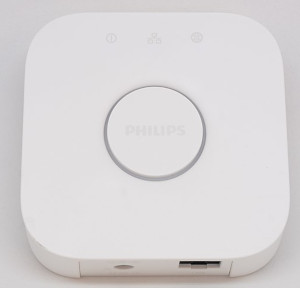

# openHAB Hue Emulation Service

Hue Emulation exposes openHAB items as Hue lights to other Hue API compatible applications like Amazon Echos, Google Homes or any Hue compatible application.

Because Amazon Echo and Google Home control openHAB locally this way, it is a fast and reliable way to voice control your installation.
See the Troubleshoot section down below though.

This service is independent of the also available Hue binding!

Currently the following Hue functionality is supported:

- Lights: Maps to items
- Groups: Maps to group items
- Rooms: Maps to group items with a specific tag
- Scenes: Maps to rules (new rule engine) that are tagged with "scene"
- Rules: Maps to rules (new rule engine) that are tagged with "hueemulation_rule"
- Schedule: Maps to rules (new rule engine) that are tagged with "hueemulation_schedule"

You can create / modify and remove groups, rooms, scenes, rules and schedules from within Hue compatible devices and apps.

## Discovery

As soon as the service is enabled, it will announce the presence of an (emulated) HUE bridge of the second generation (square bridge).
Hue bridges are using the Universal Plug and Play (UPnP) protocol for discovery.



Like the real HUE bridge the service must be put into pairing mode before other applications can access it.
By default the pairing mode disables itself after 1 minute (can be configured).

## Exposed lights

It is important to note that you are exposing *Items* not *Things* or *Channels*.
Only Color, Dimmer, Rollershutter, Switch and Group type *Items* are supported.
Group type items require the "Huelight" tag to be exposed as devices instead of Groups.

This service can emulate 3 different devices:

- An OSRAM SMART+ Plug,
- a dimmable white color Philips A19 bulb and
- an a Philips Gen 3 LCT010 extended color bulb.

The exposed Hue-type depends on some criteria:

- If the item has the category "ColorLight": It will be exposed as a color bulb
- If the item has the category "Light": It will be exposed as a switch.

This initial type determination is overridden if the item is tagged.

The following default tags are setup:

- "Switchable": Item will be exposed as an OSRAM SMART+ Plug
- "Lighting": Item will be exposed as a dimmable white bulb
- "ColorLighting": Item will be exposed as a color bulb

It is the responsibility of binding developers to categories and default tag their available *Channels*, so that linked Items are automatically exposed with this service.

You can tag items manually though as well.

## Exposed names

Your items labels are used for exposing!
The default naming schema for automatically linked items unfortunately names *Items* like their Channel names,
so usually "Brightness" or "Color". You want to rename those.

## Configuration

All options are available in the graphical interface and via textual configuration.
The following configurations can be adjusted.

Pairing can be turned on and off:

```ini
org.openhab.hueemulation:pairingEnabled=false
```

You can define a pairing timeout in seconds.
After that timeout, the `pairingEnabled` is automatically set to `false`.

```ini
org.openhab.hueemulation:pairingTimeout=60
```

Enable the following option in combination with pairing to create a new API key on the fly on every API endpoint, not only via the new-user-create API.

Necessary for Amazon Echos and other devices where the API key cannot be reset.
After a new installation of openHAB or a configuration pruning the old API keys are gone but Amazon Echos will keep trying with their old, invalid keys.

```ini
org.openhab.hueemulation:createNewUserOnEveryEndpoint=false
```

Some Amazon Echo versions only allow V1 Hue bridges (the round ones, not the square ones) to be discovered.
If the following option is enabled in combination with the pairing mode, the service will pretend to be an old Hue bridge.

This option resets automatically after pairing mode has been switched off by the timeout.

```ini
org.openhab.hueemulation:temporarilyEmulateV1bridge=false
```

Permanent V1 bridge emulation (no obvious reason to enable that):

```ini
org.openhab.hueemulation:permanentV1bridge=false
```

The hue emulation service will announce its existence via UPnP on every
of the openHAB configured primary addresses (IPv4 and IPv6).

Usually you do not want to set this option, but change the primary address configuration of openHAB.

This option allows you to override what addresses are used for the announcement.
You can have multiple comma separated entries.

```ini
org.openhab.hueemulation:discoveryIp=192.168.1.100,::FFFF:A9DB:0D85
```

The hue emulation service supports three types of emulated bulbs.
You need to tell the service which item tag corresponds to which emulated bulb type.
One of the comma separated tags must match for the item to be exposed.
Can be empty to match an item based on other criteria.

```ini
org.openhab.hueemulation:restrictToTagsSwitches=Switchable
org.openhab.hueemulation:restrictToTagsWhiteLights=Lighting
org.openhab.hueemulation:restrictToTagsColorLights=ColorLighting
```

The above default assignment means that every item that has the tag "Switchable" will be emulated as a Zigbee Switch.
If you want your switches to be exposed as lights instead (because your Amazon Echo does not support switches for example), you want to have:

```ini
org.openhab.hueemulation:restrictToTagsSwitches=NONE
org.openhab.hueemulation:restrictToTagsWhiteLights=Lighting,Switchable
org.openhab.hueemulation:restrictToTagsColorLights=ColorLighting
```

The service tries to expose as much items as possible (greedy), based on some criteria as explained in the section above.
If you want to exclude items, you need to tag them. Define the tags with the following option:

```ini
org.openhab.hueemulation:ignoreItemsWithTags=internal
```

The default is to not expose any items that have the "internal" tag assigned.
You want this tag for all items that are purely used for rules, as proxy items etc.

## Troubleshooting

Some devices like Amazon Echo, Google Home and all Philips devices (TVs, Apps) expect a Hue bridge to run on port 80.
You must either

- port forward your openHAB installation to port 80,
  (`iptables -t nat -A PREROUTING -p tcp -m tcp --dport 80 -j REDIRECT --to-ports 8080`)
- install a reverse proxy on port 80, for example nginx with the following configuration:

  ```
  server {
    listen 80;
    location / {
      proxy_pass                              http://localhost:8080/;
      proxy_set_header Host                   $http_host;
      proxy_set_header X-Real-IP              $remote_addr;
      proxy_set_header X-Forwarded-For        $proxy_add_x_forwarded_for;
      proxy_set_header X-Forwarded-Proto      $scheme;
    }
  }
  ```

- or let openHAB run on port 80 (the entire java process requires elevated privileges).

- For Amazon Echo the pairing process may fail due to a 302 response from openHAB, this can be resolved by using a reverse proxy to change the request url from `/api` to `/api/`, for example nginx with the following configuration:

  ```
  server {
    listen 80;
    location /api {
      proxy_pass http://localhost:8080/api/;
    }
  }
  ```

Please open port 80 tcp and port 1900 udp in your firewall installation.

You can test if the hue emulation does its job by enabling pairing mode including the option "Amazon Echo device discovery fix".

1. Navigate with your browser to "http://your-openhab-ip/description.xml" to check the discovery response.
   Check the IP address in there.
2. Navigate with your browser to "http://your-openhab-ip/api/status" to check the self test report.

If you use the port forwarding way, the self-test page will not be able to correctly determine if your installation works on port 80.
A reverse proxy is recommended.

Depending on the firmware version of your Amazon Echo, it may not support colored bulbs or switches.
Please assign "ColorLighting" and "Switchable" to the `WhiteLights` type as explained above.

Also note that Amazon Echos are stubborn as.
You might need to remove all former recognized devices multiple times and perform the search via different Echos and also the web or mobile application.

It might help to (temporarly) lower the emulated bridge version in the configuration as described above.

## Text configuration example

The item label will be used as the Hue device name. Please be aware that textual defined items are generally a bad idea.
In this case renaming items in Hue compatible Apps will fail.

```java
Switch  TestSwitch      "Kitchen Switch" [ "Switchable" ]    {channel="..."}
Color   TestColorBulb   "Bathroom"       [ "ColorLighting" ] {channel="..."}
Dimmer  TestDimmer      "Hallway"        [ "Lighting" ]      {channel="..."}
```
