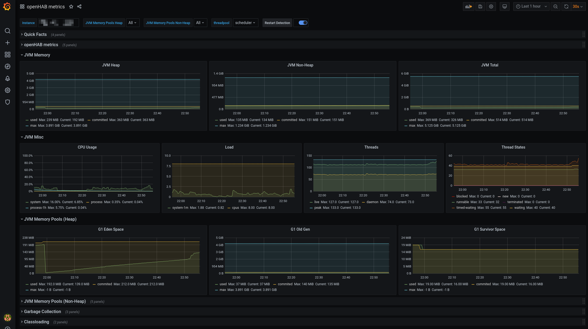

# Metrics service

The metrics service provides:

* an additional REST endpoint to retrieve openHAB core metrics from. This can be used as scrape target for pull-based monitoring systems like [Prometheus](https://prometheus.io/).
* optionally configurable services to export openHAB core metrics to push-based monitoring systems like [InfluxDB](https://www.influxdata.com/).

## Provided metrics

Currently the following metrics are provided: 

- openHAB events counts (per topic)
- openHAB bundle states
- openHAB thing states
- openHAB rule runs (per rule)
- openHAB threadpool stats (per scheduler)
- JVM stats including metrics of
    - class loader
    - memory
    - GarbageCollector
    - OS (system load, CPU)
    - thread metrics

## Configuration

The configuration for the metrics service is available in the openHAB UI under Settings | Other Services | Metrics service.
Support for pull-based monitoring systems (e. g. Prometheus) is always enabled, since it doesn't imply any significant overhead when not used.
Support for push-based monitoring systems (e. g. InfluxDB) have to be enabled separately. 

The following configuration parameters can be set:

| Config param         | Description                                                                                               | Default value |
|----------------------|-----------------------------------------------------------------------------------------------------------|---------------|
| influxMetricsEnabled | Enable the Influx (www.influxdata.com) metrics. Further configuration of the InfluxDB instance necessary. | false         |
| jmxMetricsEnabled    | Enable the Java Management Extensions (JMX) metrics.                                                      | false         |

Refer to the corresponding monitoring system sections for monitoring system specific configuration parameters.

### Supported monitoring systems

For a start, the following formats are supported:

### Prometheus

Once the IO addon is installed, the Prometheus endpoint will be available under:
_<openhab_host>:8080/rest/metrics/prometheus_ 

Refer to the [Prometheus](https://prometheus.io/) documentation on how to setup a Prometheus instance and add a scrape configuration. A typical scrape config could look like this (excerpt from `/etc/prometheus/prometheus.yml`):

````shell
scrape_configs:
  - job_name: 'openhab'
    scrape_interval: 1m
    scheme: http
    metrics_path: /rest/metrics/prometheus
    static_configs:
    - targets:
      - 'openhab.local:8080'
````

Replace `openhab.local` by the openhab host.   

#### Available configuration parameters

There are no Prometheus specific configuration parameters.

### InfluxDB

The InfluxDB exporter service will start as soon as the _influxMetricsEnabled_ configuration parameter is set to true.

#### Available configuration parameters

| Config param                  | Description                                                                       | Default value         |
|-------------------------------|-----------------------------------------------------------------------------------|-----------------------|
| influxURL                     | The URL of the InfluxDB instance. Defaults to http://localhost:8086               | http://localhost:8086 |
| influxDB                      | The name of the database to use. Defaults to "openhab".                           | openhab               |
| influxUsername                | InfluxDB user name                                                                | n/a                   |
| influxPassword                | The InfluxDB password (no default).                                               | n/a                   |
| influxUpdateIntervalInSeconds | Controls how often metrics are exported to InfluxDB (in seconds). Defaults to 300 | 300                   |

### JMX

The Java Management Extensions (JMX) exporter service will start as soon as the _jmxMetricsEnabled_ configuration parameter is set to true.

You can monitor the JMX metrics using a tool like [JConsole](https://docs.oracle.com/en/java/javase/11/management/using-jconsole.html) or [VisualVM](https://visualvm.github.io/) (after installing the VisualVM-MBeans plugin).
When the JMX exporter is enabled, the metrics will be available under the "metrics" MBean.
JConsole and VisualVM will only be able to connect using JMX when openHAB is started in debug mode (use `start_debug.sh` or `start_debug.bat`).

## Configuration file example

The example below shows how to configure the Metrics service using a file.

metrics.cfg:

```java
influxMetricsEnabled=true
influxURL=https://influxdb
influxDB=metrics
influxUsername=openhab
influxPassword=77QjHkoWZEdbvXe9FWsJ
influxUpdateIntervalInSeconds=60

jmxMetricsEnabled=false
```

## Additional metric formats

The metrics service was implemented using [Micrometer](https://micrometer.io), which supports a number of [monitoring systems](https://micrometer.io/docs) 
It should be possible to add any of these, especially the ones using a pull mechanism ("scraping") like Prometheus does.

## Grafana

You can now visualize the results in Grafana. Micrometer provides a public [Grafana dashboard here](https://grafana.com/grafana/dashboards/4701). 
I adapted it a little bit to include the openHAB metrics.
You can download it here [Dashboard](doc/dashboard.json).
This has been tested with Prometheus - for other monitoring systems adaptions to the dashboard might be necessary.

Here are some screenshots: 




