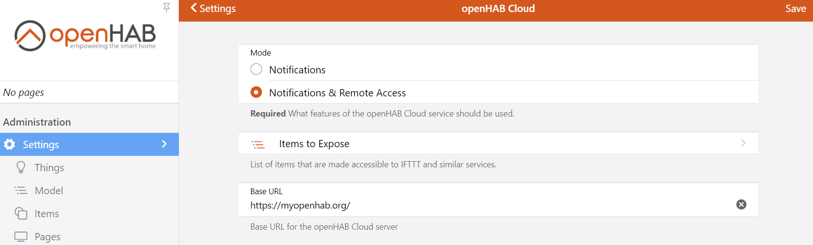

# openHAB Cloud Connector

The openHAB Cloud Connector allows connecting the local openHAB runtime to a remote [openHAB Cloud](https://github.com/openhab/openhab-cloud/blob/master/README.md) instance, such as [myopenHAB.org](https://www.myopenHAB.org), which is an instance of the
openHAB Cloud service hosted by the [openHAB Foundation](https://www.openhabfoundation.org/).

## Features

The openHAB Cloud service (and thus the connector to it) is useful for different use cases:

* It allows remote access to local openHAB instances without having to expose ports to the Internet or to require a complex VPN setup.
* It serves as a connector to Google Cloud Messaging (GCM) and Apple Push Notifications (APN) for pushing notifications to mobile phone apps.
* It brings integration possibilities with services that require an OAuth2 authentication against a web server, such as IFTTT or Amazon Alexa Skills.

## Installation via UI

* Open the openHAB web portal and login as an administrator.
* Click on Settings, followed by Misc (in the Add-ons section)
* Using the + button on the bottom right you can install the openHAB Cloud Add-on
* Register your session (https://myopenhab.org/) using UUID and Secret identity

## UUID and Secret

To authenticate with the openHAB Cloud service the add-on generates two values when the add-on is installed.
These values need to be entered in your account settings of the openHAB Cloud service.
The first one is a unique identifier, which allows to identify your runtime.
One can think of it as something similar like a username for the cloud authentication.
The second one is a random secret key which serves as a password.
Both values are written to the local file system.
If you loose these files for some reason, openHAB will automatically generate new ones.
You will then have to reconfigure UUID and secret in the openHAB Cloud service under the _My account_ section.
You will need these values to register on the website before connection is accepted.

Location of UUID and Secret:

| File   | Regular Installation         | APT Installation                      |
|--------|------------------------------|---------------------------------------|
| UUID   | userdata/uuid                | /var/lib/openhab/uuid                 |
| Secret | userdata/openhabcloud/secret | /var/lib/openhab/openhabcloud/secret  |

## Configuration

After installing this add-on, you will find configuration options in the openHAB portal under _Settings -> Other Services -> openHAB Cloud_:



Please note, that you should not expose all your items in this settings dialog.
Also note that at present this feature is currently turned off.
You just need to expose those items, which you want to be accessible by IFTTT.
This setting has no affect on Alexa or Google Assistant functionality.

Alternatively, you can configure the settings in the file `conf/services/openhabcloud.cfg`:

```
############################## openHAB Cloud Connector #############################

# The URL of the openHAB Cloud service to connect to.
# Optional, default is set to the service offered by the openHAB Foundation
# (https://myopenhab.org/)
#baseURL=

# Defines the mode in which you want to operate the connector.
# Possible values are:
# - notification: Only push notifications are enabled, no remote access is allowed.
# - remote: Push notifications and remote access are enabled.
# Optional, default is 'remote'.
#mode=

# A comma-separated list of items to be exposed to external services like IFTTT. 
# Events of those items are pushed to the openHAB Cloud and commands received for
# these items from the openHAB Cloud service are accepted and sent to the local bus.
# Optional, default is an empty list.
#expose=
```

Note: The exposed items will show up after they receive an update to their state.

Note: In order to use an openHAB UI via the Cloud Connector exposing items is not neccessary. Administrative actions are limited to creating things, items and rules, deleting them is inhibited via the Cloud Connector.
