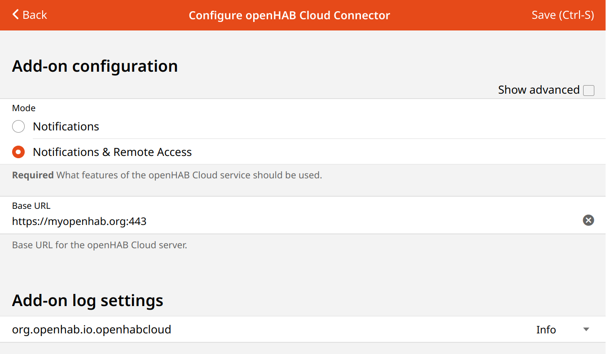

# openHAB Cloud Connector

The openHAB Cloud Connector allows connecting the local openHAB runtime to a remote [openHAB Cloud](https://github.com/openhab/openhab-cloud/blob/master/README.md) instance, such as [myopenHAB.org](https://www.myopenHAB.org), which is an instance of the
openHAB Cloud service hosted by the [openHAB Foundation](https://www.openhabfoundation.org/).

## Features

The openHAB Cloud service (and thus the connector to it) is useful for different use cases:

* It allows remote access to local openHAB instances without having to expose ports to the Internet or to require a complex VPN setup.
* It serves as a connector to Firebase Cloud Messaging (FCM) for pushing notifications to mobile phone apps.
* It provides integrations with 3rd party services that require OAuth2 authentication, such as Amazon Alexa or Google Home applications.

## Installation via UI

* Open the openHAB web UI and login as an administrator.
* Click on Add-on Store, followed by System Integrations.
* Use the Install button to install the openHAB Cloud Connector.
* Register your session (https://myopenhab.org/) using UUID and Secret.

## UUID and Secret

To authenticate with the openHAB Cloud service, the add-on generates two values when the add-on is installed.
These values need to be entered in your account settings of the openHAB Cloud service.

The first one is a unique identifier, which allows to identify your runtime.
One can think of it as something similar like a username for the cloud authentication.
The second one is a random secret key which serves as a password.
Both values are written to the local file system.

If you loose these files for some reason, openHAB will automatically generate new ones.
You will then have to reconfigure UUID and secret in the openHAB Cloud service under the _My account_ section.
You will need these values to register on the website before connection is accepted.

Location of UUID and Secret:

| File   | Regular Installation                  | APT & RPM Installation               |
|--------|---------------------------------------|--------------------------------------|
| UUID   | $OPENHAB_USERDATA/uuid                | /var/lib/openhab/uuid                |
| Secret | $OPENHAB_USERDATA/openhabcloud/secret | /var/lib/openhab/openhabcloud/secret |

## Configuration

After installing this add-on, you will find configuration options in the openHAB portal under _Settings -> Add-on Settings -> openHAB Cloud Connector_:



By default, both remote access and push notifications are enabled.  

### Advanced Configuration

For private hosted myopenHAB installations, the base URL can be changed to point another cloud instance.

Private hosted myopenHAB installations may enable selected items in openHAB to have their state updates pushed to the cloud service for integrations with services like IFTTT.
Note that this is not supported on the community hosted myopenHAB service due to high load concerns and will have no effect if enabled with the default URL configured.
This is also not required for remote access through the cloud service to function.

Alternatively, you can configure the settings in the file `conf/services/openhabcloud.cfg`:

```
############################## openHAB Cloud Connector #############################

# The URL of the openHAB Cloud service to connect to.
# Optional, default is set to the service offered by the openHAB Foundation
# (https://myopenhab.org/)
#baseURL=

# Defines the mode in which you want to operate the connector.
# Possible values are:
# - notification: Only push notifications are enabled, no remote access is allowed.
# - remote: Push notifications and remote access are enabled.
# Optional, default is 'remote'.
#mode=

# A comma-separated list of items to be exposed to external services like IFTTT. 
# Events of those items are pushed to the openHAB Cloud and commands received for
# these items from the openHAB Cloud service are accepted and sent to the local bus.
# Optional, default is an empty list.
#expose=
```

Note: The optionally exposed items will show up after they receive an update to their state.

## Cloud Notification Actions

The openHAB Cloud Connector allows to send push notifications to apps on mobile devices registered with an [openHAB Cloud instance](https://github.com/openhab/openhab-cloud) such as [myopenHAB.org](https://www.myopenhab.org).


To send push notifications, the notification actions have to be used in rules.

### Basic Usage

Three different actions are available:

- `sendNotification(emailAddress, message)`: Send a notification to a _specific_ openHAB Cloud user.
- `sendBroadcastNotification(message)`: Send a broadcast notification to _all_ devices of _all_ users.
- `sendLogNotification(message)`: Send a log notification to the notifications list. Log notifications do not trigger a notification on the device.

For each of the three actions, there's another variant accepting an icon name and a tag:

- `sendNotification(emailAddress, message, icon, tag)`
- `sendBroadcastNotification(message, icon, tag)`
- `sendLogNotification(message, icon, tag)`

Icon and tag can potentially be used by cloud instance clients (such as the openHAB apps for Android or iOS) to be displayed in the notification itself and the list of notifications.

The parameters for these actions have the following meaning:

- `emailAddress`: String containing the email address the target user is registered with in the cloud instance.
- `message`: String containing the notification message text.
- `icon`: String containing the icon name (as described in [Items: Icons]({{base}}/configuration/items.html#icons)).
- `tag`: String containing the tag for the notification.

`null` may be used to skip the `icon` or `tag` parameter.

### Title, Tag, Reference Id, Media Attachments & Actions

The `sendNotification` and `sendBroadcastNotification` actions additionally support setting a title, reference id, media attachments and actions.

- The tag is used for tagging messages for grouping when displaying in the app and to hide/remove groups of messages from a user's device. Tag was previously referred to as "severity".
- The title is displayed as the notification title on the device and defaults to "openHAB" for the Android and iOS apps.
- The reference id is a user supplied identifier that when set will replace messages with the same id on the user's device (so only the last version exists). It can be used to update or remove notifications.
- Media attachments are displayed together with the notification on the device and can be used to display images, e.g. a camera snapshot.
- Actions allow the user to interact with the notification, e.g. to open a specific page in the app or to send a command to an Item.

There are four different actions available:

- Click action: Is performed when the user clicks on the notification.
- Action button 1, 2 or 3: Is performed when the user clicks on the first, second or third action button.

To specify media attachments and actions, there is another variant of the `sendNotification` and `sendBroadcastNotification` actions:

- `sendNotification(emailAddress, message, icon, tag, title, referenceId, onClickAction, mediaAttachmentUrl, actionButton1, actionButton2, actionButton3)`
- `sendBroadcastNotification(message, icon, tag, title, referenceId, onClickAction, mediaAttachmentUrl, actionButton1, actionButton2, actionButton3)`


The additional parameter for these variants have the following meaning:
- `tag` : A user supplied tag to group messages for removing using the `hideNotificationByTag` action or grouping messages when displayed in the app. This renames the `severity` parameter, both are functionally identical. 
- `title`: The title of the notification. Defaults to "openHAB" inside the Android and iOS apps.
- `referenceId`: A user supplied id to both replace existing messages when pushed, and later remove messages with the `hideNotificationByReferenceId` actions.
- `onClickAction`: The action to be performed when the user clicks on the notification. Specified using the [action syntax](#action-syntax).
- `mediaAttachmentUrl`: The URL of the media attachment to be displayed with the notification. This can either be a fully qualified URL, prefixed with `http://` or `https://` and reachable by the client device, a relative path on the user's openHAB instance starting with `/`, or an image item with the format `item:MyImageItem`
- `actionButton1`: The action to be performed when the user clicks on the first action button. Specified as `Title=$action`, where `$action` follows the [action syntax](#action-syntax).
- `actionButton2`: The action to be performed when the user clicks on the second action button. Specified as `Title=$action`, where `$action` follows the [action syntax](#action-syntax).
- `actionButton3`: The action to be performed when the user clicks on the third action button. Specified as `Title=$action`, where `$action` follows the [action syntax](#action-syntax).

These parameters may be skipped by setting them to `null`.

#### Action Syntax

The action syntax is a string containing the action type and the action payload separated by a colon.

There are three types of actions available:

- `command`: Sends a command to an Item by using the following syntax: `command:$itemName:$commandString` where `$itemName` is the name of the Item and `$commandString` is the command to be sent.
- `ui`: Controls the UI in two possible ways:
  - `ui:$path` where `$path` is either `/basicui/app?...` for navigating sitemaps (using the native renderer) or `/some/absolute/path` for navigating (using the web view).
  - `ui:$commandItemSyntax` where `$commandItemSyntax` is the same syntax as used for the [UI Command Item]({{base}}/mainui/about.html#ui-command-item).
- `http:` or `https:` : Opens the fully qualified URL in an embedded browser on the device.

Examples:

- `command:KitchenLights:ON`
- `command:KitchenBlinds:50`
- `ui:/basicui/app?w=0000&sitemap=main` (use Basic UI to get sitemap URL locations)
- `ui:/some/absolute/path`: Navigates to the absolut path `/some/absolute/path`.
- `ui:navigate:/page/my_floorplan_page`: Navigates Main UI to the page with the ID `my_floorplan_page`.
- `ui:popup:oh-clock-card`: Opens a popup with `oh-clock-card`.
- `https://openhab.org`: Opens an embedded browser to the site `https://openhab.org`

### Hide Notification Actions

There are also actions to hide existing notifications, either by `referenceId` or `tag` (formerly severity):

- `hideNotificationByReferenceId(emailAddress, referenceId)`
- `hideBroadcastNotificationByReferenceId(referenceId)`
- `hideNotificationByTag(emailAddress, tag)`
- `hideBroadcastNotificationByTag(tag)`

### Examples

Notify the openHAB Cloud user with email address _me@email.com_ that the front door was opened:

:::: tabs

::: tab DSL

```java
rule "Front Door Notification"
when
  Item Apartment_FrontDoor changed to OPEN
then
  sendNotification("me@email.com", "Front door was opened!")
end
```
:::

::: tab JS

```javascript
rules.when().item('Apartment_FrontDoor').changed().to('OPEN').then(() => {
  actions.notificationBuilder('Front door was opened!')
    .addUserId('me@email.com')
    .send();
}).build('Front Door Notification');
```

:::

::: tab JRuby

```ruby
rule "Front Door Notification" do
  changed Apartment_FrontDoor, to: OPEN
  run do
    Notification.send("Front door was opened!", email: "me@email.com")
  end
end
```

See [Notification.send](https://openhab.github.io/openhab-jruby/main/OpenHAB/Core/Actions/Notification.html#send-class_method)

:::

::::

Notify all openHAB Cloud users that the window was opened:

:::: tabs

::: tab DSL

```java
rule "Open Window Notification"
when
  Item Apartment_Window changed to OPEN
then
  sendBroadcastNotification("Apartment window was opened!", "window", "Door")
end
```

:::

::: tab JS

```javascript
rules.when().item('Apartment_Window').changed().to('OPEN').then(() => {
  actions.notificationBuilder('Apartment window was opened!')
    .withIcon('window')
    .withTag('Door')
    .send();
}).build('Open Window Notification');
```

:::

::: tab JRuby

Broadcast notification is performed by calling [Notification.send](https://openhab.github.io/openhab-jruby/main/OpenHAB/Core/Actions/Notification.html#send-class_method) without providing an email address.

```ruby
rule "Open Window Notification" do
  changed Apartment_Window, to: OPEN
  run do
    Notification.send("Apartment window was opened!", icon: "window", tag: "Door")
  end
end
```

:::

::::

Notify all openHAB Cloud users that motion was detected, attach a camera snapshot and add an action button to turn on the light:

:::: tabs

::: tab DSL

```java
rule "Motion Detected Notification"
when
  Item Apartment_MotionSensor changed to ON
then
  sendBroadcastNotification("Motion detected in the apartment!", "motion", "Motion Tag",
                                    "Motion Detected", "motion-id-1234", null, "https://apartment.my/camera-snapshot.jpg",
                                    "Turn on the light=command:Apartment_Light:ON", null, null)
end
```

:::

::: tab JS

```javascript
rules.when().item('Apartment_MotionSensor').changed().to('ON').then(() => {
  actions.notificationBuilder('Motion detected in the apartment!')
    .withIcon('motion')
    .withTag('Motion Tag')
    .withTitle('Motion Detected')
    .withReferenceId('motion-id-1234')
    .withMediaAttachment('https://apartment.my/camera-snapshot.jpg')
    .addActionButton('Turn on the light', 'command:Apartment_Light:ON')  
    .send();
}).build('Motion Detected Notification');
```

:::

::: tab JRuby

```ruby
rule "Motion Detected Notification" do
  changed Apartment_MotionSensor, to: ON
  run do
    Notification.send "Motion detected in the apartment!",
                      icon: "motion",
                      tag: "Motion Tag",
                      title: "Motion Detected",
                      id: "motion-id-1234"
                      attachment: "https://apartment.my/camera-snapshot.jpg",
                      buttons: { "Turn on the light" => "command:Apartment_Light:ON" }
  end
end
```

:::

::::
