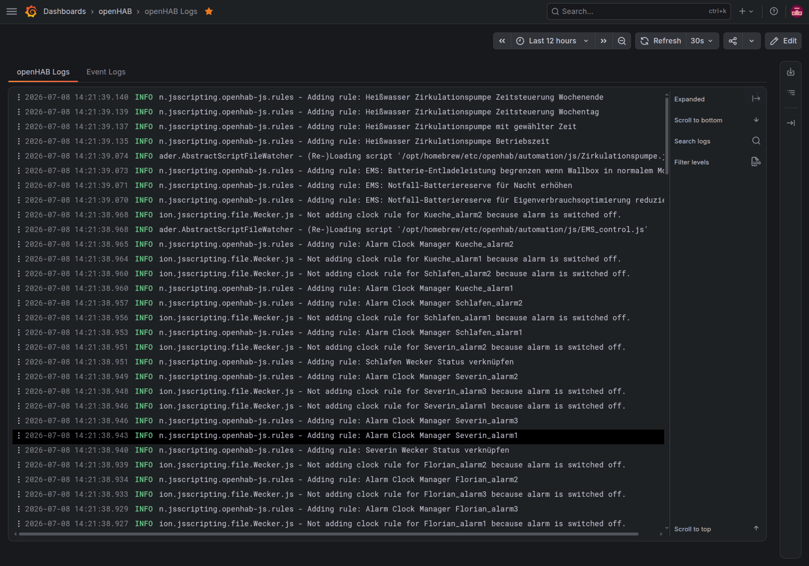
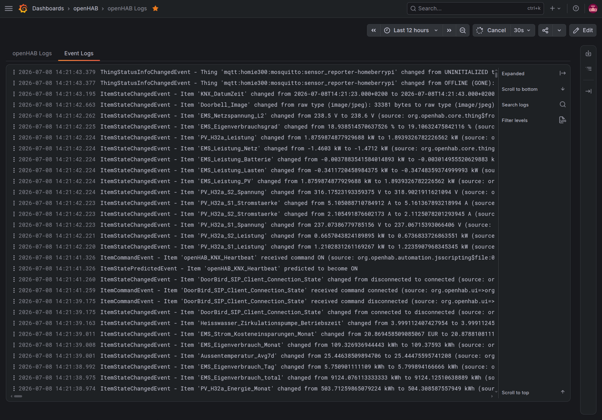

# OpenTelemetry Service – LGTM Stack Example

To receive, process, and view all three OpenTelemetry signals, the open-source LGTM Stack from Grafana Labs can be used.
It consists of [Loki](https://grafana.com/oss/loki/) for log storage, [Grafana](https://grafana.com/oss/grafana/) for visualization, [Tempo](https://grafana.com/oss/tempo/) for traces, and [Mimir](https://grafana.com/oss/mimir/) for metrics.

The [grafana/otel-lgtm](https://github.com/grafana/docker-otel-lgtm) container image bundles all components and an embedded OTel Collector, making it easy to get started without configuring each component separately.

Configure openHAB with the URL of your LGTM Stack, e.g., `http://localhost:4318`, to send logs, metrics, and traces.

:::note
Leave `metricsAggregationTemporality` at its default value of `CUMULATIVE` when using this stack.
:::

## Grafana Dashboard

This example provides a tabbed Grafana dashboard that shows the openHAB "system" logs and the event logs.
The dashboard allows for filtering by log level and searching for specific log messages.
Clicking on a log message will open a pane that provides more details about the log entry, including the full logger name, the thread name, exception stacktraces, and more.

<!-- markdownlint-disable-next-line descriptive-link-text -->
You can download the dashboard JSON file [here](grafana-dashboard.json).
